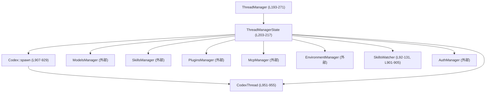
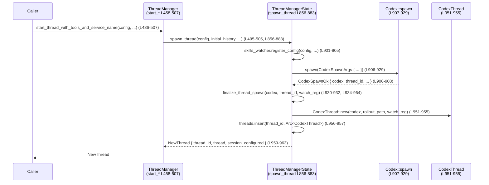

# core/src/thread_manager.rs

## 0. ざっくり一言

Codex の「スレッド（会話）」を生成・管理・終了・フォークするための中核マネージャです。  
モデルやスキルなど周辺コンポーネントを束ねて `CodexThread` を起動し、Rolllout 履歴を使ったフォークや安全なシャットダウンも提供します。  
（根拠: `ThreadManager` 定義とメソッド群 `thread_manager.rs:L195-271`, `L458-696`）

---

## 1. このモジュールの役割

### 1.1 概要

- **問題**: Codex の 1 セッション（スレッド）に関わる多数のコンポーネント（モデル管理・スキル・MCP・環境など）を、毎回個別に組み立てるのは複雑です。また、既存スレッドの再開やフォーク、シャットダウンも一元的に扱う必要があります。
- **機能**:  
  - `ThreadManager` が各種 Manager (`ModelsManager`, `SkillsManager`, `PluginsManager`, `McpManager`, `EnvironmentManager`, `AuthManager`) を束ねて `Codex::spawn` を呼び、`CodexThread` を生成・登録します。  
  - Rollout 履歴からのスレッド再開・フォーク、全スレッドのタイムアウト付きシャットダウン、サブツリー ID 列挙などを提供します。  
  - スキルファイル監視やテスト専用の動作切り替えも行います。  
  （根拠: `ThreadManagerState` フィールドと `spawn_thread_with_source` の引数構築 `thread_manager.rs:L203-217`, `L886-929`）

### 1.2 アーキテクチャ内での位置づけ

`ThreadManager` と周辺コンポーネントの依存関係の概要です。



- 呼び出し側は基本的に `ThreadManager`（外向き API）だけを意識します。
- 実際のスレッド生成・登録は `ThreadManagerState::spawn_thread_with_source` → `Codex::spawn` → `CodexThread::new` の流れで行われます。  
  （根拠: `spawn_thread_with_source`, `finalize_thread_spawn` 実装 `thread_manager.rs:L886-932`, `L934-964`）

### 1.3 設計上のポイント

- **共有状態の集中管理**  
  - 実スレッドは `threads: Arc<RwLock<HashMap<ThreadId, Arc<CodexThread>>>>` で管理されます。  
    読み取りは多並列、書き込みは排他的（Tokio の `RwLock`）です。  
    （根拠: `ThreadManagerState` 定義 `thread_manager.rs:L203-217`）
- **非同期・並行性**  
  - ほとんどの操作は `async fn` で実装され、Tokio ランタイム上で動作します。  
    スレッド終了処理は `FuturesUnordered` で並列実行されます。  
    （根拠: `shutdown_all_threads_bounded` `thread_manager.rs:L600-646`）
- **テスト用挙動の明示的切り替え**  
  - `FORCE_TEST_THREAD_MANAGER_BEHAVIOR: AtomicBool` と `set_thread_manager_test_mode_for_tests` で、  
    スキルウォッチャや ops ログ等をテスト用に切り替えます。  
    （根拠: `FORCE_TEST_THREAD_MANAGER_BEHAVIOR`, `set_thread_manager_test_mode_for_tests` `thread_manager.rs:L69-80`, `L71-72`, `L215-216`）
- **エラーハンドリング方針**  
  - 多くの関数は `CodexResult<T>` を返し、`CodexErr::ThreadNotFound` や `CodexErr::Fatal` などのドメイン固有エラーを使います。  
  - 異常なイベントシーケンス（最初のイベントが `SessionConfigured` でない）なども `CodexErr` で表現されます。  
    （根拠: `get_thread`, `list_agent_subtree_thread_ids`, `finalize_thread_spawn` `thread_manager.rs:L718-724`, `L423-433`, `L942-948`）
- **履歴ベースのフォーク/再開**  
  - `ForkSnapshot` と `truncate_before_nth_user_message` / `snapshot_turn_state` / `append_interrupted_boundary` により、  
    Rollout 履歴から整合的なフォーク点を決定します。  
    （根拠: `ForkSnapshot` 定義とそれら関数 `thread_manager.rs:L151-170`, `L977-1001`, `L1011-1062`, `L1067-1092`）

---

## 2. 主要な機能一覧

- スレッド生成: `start_thread*`, `spawn_new_thread*`, `spawn_thread*` で新規スレッドを生成し、`CodexThread` を登録する。
- スレッド再開: Rollout ファイルや履歴 (`InitialHistory`) からスレッドを再開する。
- スレッドフォーク: `ForkSnapshot` に基づいて既存履歴からフォークし、新しいスレッドを生成する。
- スレッド一覧/取得: 管理下の `ThreadId` や個別 `CodexThread` を取得する。
- サブツリー列挙: エージェントから派生したスレッドのサブツリー ID を列挙する。
- スレッドシャットダウン: 全スレッドに対するタイムアウト付きシャットダウンとレポート生成。
- MCP サーバ更新要求: すべてのスレッドに対して `Op::RefreshMcpServers` を送る。
- モデル・協調モード一覧: `ModelsManager` をラップしてモデル一覧とコラボレーションモード一覧を提供。
- スキル監視: `SkillsWatcher` を組み立て、スキル変更時に `SkillsManager` のキャッシュをクリア。
- テスト支援: テスト専用モード、テンポラリ codex_home ガード、ops ログやユーザーシェル上書き起動など。

---

## 3. 公開 API と詳細解説

### 3.1 型一覧（構造体・列挙体など）

| 名前 | 種別 | 公開範囲 | 役割 / 用途 | 定義位置 |
|------|------|----------|-------------|----------|
| `CapturedOps` | 型エイリアス | crate | `(ThreadId, Op)` のベクタ。テスト時の送信 Op ログ用。 | `thread_manager.rs:L71-72` |
| `SharedCapturedOps` | 型エイリアス | crate | `CapturedOps` を `Arc<Mutex<...>>` で共有するための型。 | `thread_manager.rs:L71-72` |
| `TempCodexHomeGuard` | 構造体 | モジュール内 | テスト用に作成した一時 codex_home ディレクトリを Drop 時に削除するガード。 | `thread_manager.rs:L82-90` |
| `NewThread` | 構造体 | pub | 新規生成されたスレッド情報（`thread_id`, `Arc<CodexThread>`, `SessionConfiguredEvent`）をまとめて返す。 | `thread_manager.rs:L133-139` |
| `ForkSnapshot` | enum | pub | フォーク時の履歴スナップショットモードを表す（nth-user までの切り詰め／割り込み相当）。 | `thread_manager.rs:L151-170` |
| `ThreadShutdownReport` | 構造体 | pub | `shutdown_all_threads_bounded` の結果として、完了／submit 失敗／タイムアウトした ThreadId の一覧を保持。 | `thread_manager.rs:L180-185` |
| `ShutdownOutcome` | enum | モジュール内 | 個々のスレッドシャットダウン結果（Complete / SubmitFailed / TimedOut）。内部集計用。 | `thread_manager.rs:L187-191` |
| `ThreadManager` | 構造体 | pub | 公開スレッド管理 API。状態本体 `ThreadManagerState` への `Arc` を保持する。 | `thread_manager.rs:L193-198` |
| `ThreadManagerState` | 構造体 | crate | 共有状態本体。スレッドマップや各種 Manager を保持し、実際の生成・登録ロジックを実装する。 | `thread_manager.rs:L200-217` |
| `SnapshotTurnState` | 構造体 | モジュール内 | フォーク時点のターン状態（途中ターンかどうか、アクティブターン ID・開始インデックス）を表す。 | `thread_manager.rs:L1004-1008` |

### 3.2 関数詳細（重要な 7 件）

#### 1. `ThreadManager::new(...) -> Self`

**概要**

- プロダクション用 `ThreadManager` を初期化します。  
  モデル・スキル・プラグイン・MCP・環境・スキルウォッチャなどの Manager を構築し、`ThreadManagerState` にまとめます。  
  （根拠: `thread_manager.rs:L220-271`）

**引数**

| 引数名 | 型 | 説明 |
|--------|----|------|
| `config` | `&Config` | Codex 全体の設定。`codex_home` やモデルカタログなどを含む。 |
| `auth_manager` | `Arc<AuthManager>` | 認証情報管理。`ModelsManager` にも渡される。 |
| `session_source` | `SessionSource` | セッションの起源（Exec / App など）。制約プロダクトに影響。 |
| `collaboration_modes_config` | `CollaborationModesConfig` | モデル協調モードのプリセット設定。 |
| `environment_manager` | `Arc<EnvironmentManager>` | 実行環境（exec server など）の管理。 |
| `analytics_events_client` | `Option<AnalyticsEventsClient>` | 解析イベント送信用クライアント（任意）。 |

**戻り値**

- 初期化済みの `ThreadManager` インスタンス。

**内部処理の流れ**

1. `codex_home` と `restriction_product` を `config` と `session_source` から取得。（L228-229）
2. OpenAI プロバイダ設定を `config.model_providers` から取得し、なければ `ModelProviderInfo::create_openai_provider(None)` で作成。（L230-235）
3. `thread_created_tx` をブロードキャストチャンネルで作成。（L235）
4. `PluginsManager`, `McpManager`, `SkillsManager`, `SkillsWatcher` を `codex_home` と `restriction_product` をもとに初期化。（L236-247）
5. `ModelsManager::new_with_provider` を使ってモデル管理を構築。（L251-257）
6. 以上をフィールドに持つ `ThreadManagerState` を `Arc` で包み、`ThreadManager` に格納。  
   テストモードなら `ops_log` も初期化。（L248-268）

**Errors / Panics**

- `new` 自体は `Result` を返さず、内部でパニックも発生させていません。
- `build_skills_watcher` 内で `FileWatcher::new()` が失敗しても、警告ログを出して `FileWatcher::noop()` にフォールバックするため、パニックにはなりません。（`thread_manager.rs:L103-109`）

**並行性・安全性**

- 共有状態はすべて `Arc` でラップされ、スレッド間共有が安全です。
- グローバルなテストフラグ `FORCE_TEST_THREAD_MANAGER_BEHAVIOR` は `AtomicBool`（`Ordering::Relaxed`）で扱われます。  
  単なる on/off フラグであり、順序性が不要なため Relaxed が選択されています。（`thread_manager.rs:L69-80`）

---

#### 2. `ThreadManager::list_agent_subtree_thread_ids(&self, thread_id: ThreadId) -> CodexResult<Vec<ThreadId>>`

**概要**

- 指定した `thread_id` を根とする「スレッド spawn サブツリー」に属するすべての ThreadId を列挙します。  
  永続ストア上の spawn 辿りと、ライブ状態のエージェントサブツリーを統合します。  
  （根拠: `thread_manager.rs:L411-456`）

**引数**

| 引数名 | 型 | 説明 |
|--------|----|------|
| `thread_id` | `ThreadId` | サブツリーの根とするスレッド ID。 |

**戻り値**

- `Ok(Vec<ThreadId>)` で、根 `thread_id` を含むユニークな ThreadId 一覧。
- エラー時は `CodexErr`。

**内部処理の流れ**

1. `self.state.get_thread(thread_id)` で元スレッドを取得。存在しなければ `CodexErr::ThreadNotFound`。（L416-417, L718-724）
2. `subtree_thread_ids` と `seen_thread_ids` に根 ID を登録。（L418-421）
3. `thread.state_db()` が `Some` の場合、  
   - `DirectionalThreadSpawnEdgeStatus::Open` と `Closed` の両方について  
   - `list_thread_spawn_descendants_with_status` を呼び、子孫スレッド ID を取得。（L423-433）
   - 取得時にエラーがあれば `CodexErr::Fatal(...)` に包んで返す。（L431-433）
   - 新規 ID のみ `seen_thread_ids` でチェックしつつ `subtree_thread_ids` に追加。（L435-437）
4. ライブなエージェントサブツリーについて、  
   `thread.codex.session.services.agent_control.list_live_agent_subtree_thread_ids(thread_id)` を呼び、  
   同様に `seen_thread_ids` で重複を排除しつつ追加。（L442-452）
5. 結果の `Vec<ThreadId>` を返す。（L455）

**Errors / Panics**

- 元スレッドが存在しない場合: `CodexErr::ThreadNotFound`（`get_thread` 経由）。  
- 状態 DB の descendant 列挙でエラー発生: `CodexErr::Fatal("failed to load thread-spawn descendants: ...")` に変換して返す。（L431-433）
- パニック要因はありません（インデックスアクセスや `unwrap` は使っていません）。

**Edge cases（エッジケース）**

- `state_db()` が `None` の場合: 永続側の子孫列挙はスキップされ、ライブサブツリーのみが対象になります。（L423-440）
- ライブ側で永続側と重複する ID があっても、`seen_thread_ids` により重複追加されません。（L419-421, L435-437, L450-452）

**使用上の注意点**

- この関数は I/O（状態 DB とエージェントサービス）を伴うため、遅延が発生する可能性があります。  
  頻繁に呼び出す場合はキャッシュ戦略を検討する必要があります（コード上にはキャッシュはありません）。
- 返却順序は挿入順であり、特別なソートはしていません。

---

#### 3. `ThreadManager::shutdown_all_threads_bounded(&self, timeout: Duration) -> ThreadShutdownReport`

**概要**

- 現在 `ThreadManager` が追跡しているすべての `CodexThread` に対し、`shutdown_and_wait()` を並列に呼び出し、指定タイムアウト内での成否を集計します。  
  完了したスレッドはマネージャのマップから削除されます。  
  （根拠: `thread_manager.rs:L597-646`）

**引数**

| 引数名 | 型 | 説明 |
|--------|----|------|
| `timeout` | `Duration` | 各スレッドの `shutdown_and_wait` に対するタイムアウト。 |

**戻り値**

- `ThreadShutdownReport`（完了・submit 失敗・タイムアウトの ThreadId 一覧を含む）。

**内部処理の流れ**

1. `threads` RwLock を read ロックし、`(ThreadId, Arc<CodexThread>)` のベクタを作成してロックを解放。（L601-607）
2. それぞれに対し非同期タスクを生成し、  
   `tokio::time::timeout(timeout, thread.shutdown_and_wait())` を呼ぶ。（L609-617）
   - `Ok(Ok(()))` → `ShutdownOutcome::Complete`  
   - `Ok(Err(_))` → `ShutdownOutcome::SubmitFailed`（`shutdown_and_wait` がエラーを返した）  
   - `Err(_)` → `ShutdownOutcome::TimedOut`（タイムアウト）  
3. これらタスクを `FuturesUnordered` に集め、順次結果を取り出し `ThreadShutdownReport` に分類して追加。（L609-627）
4. 書き込みロックを取り直し、`report.completed` に含まれる ThreadId をマップから削除。（L631-634）
5. `completed`, `submit_failed`, `timed_out` を各々文字列としてソート。（L636-644）
6. `ThreadShutdownReport` を返す。（L645）

**Errors / Panics**

- この関数自体は `Result` を返さず、内部エラーは `submit_failed` として集計されます。
- パニック要因となる `unwrap` やインデックスアクセスはありません。

**並行性・安全性**

- 共有マップからの参照取得と削除は、それぞれ別のロック区間で行われます。  
  シャットダウン中に新しいスレッドが追加されても、今回のバッチには含まれませんが、整合性は保たれます。
- `FuturesUnordered` により各シャットダウンが並列実行されるため、多数のスレッドを効率よく停止できます。

**Edge cases**

- スレッドが 0 個の場合: ループは一度も回らず、空の `ThreadShutdownReport` が返ります。
- 全てタイムアウトした場合: `completed` と `submit_failed` は空、`timed_out` のみが埋まったレポートになります。

**使用上の注意点**

- 各スレッドに対して *同じ* `timeout` が適用されます。長時間処理が想定されるスレッドが混在する場合、個別の停止戦略が必要になる可能性があります。
- タイムアウトしたスレッドはマップに残り続けるため、再度のシャットダウンやデバッグが可能です。

---

#### 4. `ThreadManager::fork_thread<S>(...) -> CodexResult<NewThread> where S: Into<ForkSnapshot>`

**概要**

- Rollout ファイルから履歴を読み出し、`ForkSnapshot` に従ってフォーク用スナップショットを作り、新しいスレッドを起動します。  
  フォーク元と同じ設定（`Config` は上書き可）で、新しい ThreadId を持つスレッドが生成されます。  
  （根拠: `thread_manager.rs:L648-696`）

**引数**

| 引数名 | 型 | 説明 |
|--------|----|------|
| `snapshot` | `S: Into<ForkSnapshot>` | フォークモード。`usize` から自動変換される（nth-user メッセージ前で切る）。 |
| `config` | `Config` | フォーク先スレッドの設定（元設定からの上書きも可）。 |
| `path` | `PathBuf` | フォーク元 Rollout ファイルのパス。 |
| `persist_extended_history` | `bool` | 拡張履歴の永続化フラグ。 |
| `parent_trace` | `Option<W3cTraceContext>` | 親トレース情報（トレース継続用、任意）。 |

**戻り値**

- `Ok(NewThread)` 新たなスレッド情報。
- `Err(CodexErr)` 履歴読み込みや spawn 失敗など。

**内部処理の流れ**

1. `RolloutRecorder::get_rollout_history(&path).await?` で履歴を読み込む。（L664-665）
2. `snapshot_turn_state(&history)` で、履歴がターン途中で終わっているかなどの状態を計算。（L665）
3. `snapshot` に応じて履歴を変換。（L666-683）
   - `TruncateBeforeNthUserMessage(n)` → `truncate_before_nth_user_message(history, n, &snapshot_state)`（L667-669）
   - `Interrupted` →  
     - `InitialHistory::Resumed` の場合は `Forked(resumed.history)` に変換し、  
       `snapshot_state.ends_mid_turn` が true なら `append_interrupted_boundary` で `<turn_aborted>` などを挿入。（L670-682）
4. 得られた `history` を使って `self.state.spawn_thread(...)` を呼び、新スレッドを生成・登録。（L684-694）

**Errors / Panics**

- Rollout 読み込み失敗 → `?` により `CodexResult` の `Err` として伝播。（L664）
- `Codex::spawn` 内でのエラーも `spawn_thread` 経由で `Err` として返されます。（L886-932）
- パニックを起こすような `unwrap` は使用していません。

**Edge cases**

- `InitialHistory::New` / `Cleared` に対する `Interrupted` フォーク: `append_interrupted_boundary` では `<interrupted>` マーカーと `TurnAbortedEvent` だけからなる `Forked` 履歴を作成します。（L1075-1079）
- nth-user が範囲外の場合: `truncate_before_nth_user_message` 側のロジックにより、  
  mid-turn ならアクティブターン開始前で切り、そうでなければ履歴をそのまま利用します。（L984-994）

**使用上の注意点**

- `path` は `RolloutRecorder` が理解できる形式・場所のファイルである必要があります（このファイルからは詳細不明）。
- フォーク先の `Config` を任意に変更できるため、必要に応じてモデルや制約を変えた派生スレッドを作ることが可能です。

---

#### 5. `ThreadManagerState::spawn_thread_with_source(...) -> CodexResult<NewThread>`

**概要**

- スレッド生成のコアロジックです。`InitialHistory`, 各種 Manager, セッションソースなどをまとめて `Codex::spawn` に渡し、  
  初回イベントを検証しつつ `CodexThread` として登録します。  
  （根拠: `thread_manager.rs:L886-932`, `L934-964`）

**主な引数（抜粋）**

| 引数名 | 型 | 説明 |
|--------|----|------|
| `config` | `Config` | スレッドの設定。 |
| `initial_history` | `InitialHistory` | 新規・フォーク・再開のいずれかに応じた履歴。 |
| `auth_manager` | `Arc<AuthManager>` | 認証。 |
| `agent_control` | `AgentControl` | エージェント制御ハンドル。 |
| `session_source` | `SessionSource` | セッションの起源。 |
| `dynamic_tools` | `Vec<DynamicToolSpec>` | 動的ツール定義。 |
| `persist_extended_history` | `bool` | 拡張履歴永続化フラグ。 |
| `metrics_service_name` | `Option<String>` | メトリクスラベル用サービス名。 |
| `inherited_shell_snapshot` | `Option<Arc<ShellSnapshot>>` | 親スレッドから継承するシェルスナップショット（任意）。 |
| `inherited_exec_policy` | `Option<Arc<ExecPolicyManager>>` | 親から継承する実行ポリシー（任意）。 |
| `parent_trace` | `Option<W3cTraceContext>` | トレース継続用コンテキスト。 |
| `user_shell_override` | `Option<crate::shell::Shell>` | テスト等で使用するユーザーシェルの上書き。 |

**内部処理の流れ**

1. `skills_watcher.register_config(&config, ...)` を呼び出し、スキル・プラグイン用の監視登録を取得。（L901-905）
2. `Codex::spawn(CodexSpawnArgs { ... }).await?` を呼び出し、`CodexSpawnOk { codex, thread_id, .. }` を受け取る。（L906-929）
3. `finalize_thread_spawn(codex, thread_id, watch_registration).await` を呼び、  
   - 最初のイベントが `INITIAL_SUBMIT_ID` かつ `EventMsg::SessionConfigured` であることを検証。（L940-948）  
   - `CodexThread::new` でスレッドを生成し、`threads` マップに登録。（L951-957）  
   - `NewThread` を返す。（L959-963）

**Errors / Panics**

- `Codex::spawn(...).await?` の `?` により、spawn 失敗はそのまま `Err` として返されます。（L906-929）
- 最初のイベントが期待通りでない場合: `CodexErr::SessionConfiguredNotFirstEvent` を返します。（L942-948）
- それ以外に `unwrap` 等は使われていません。

**並行性・安全性**

- `threads` への登録は `self.threads.write().await` により排他的に行われます。（L956-957）
- `Codex` や `CodexThread` は `Arc` を介して共有されるため、所有権・ライフタイムは安全に管理されます。

**使用上の注意点**

- 外部 API としては `ThreadManager` 経由で呼び出されることを前提としており、直接使うのは crate 内部に限られます。
- `SessionConfigured` が最初に来るというプロトコル前提を強制しているため、プロトコル変更時にはこの関数の更新が必須です。

---

#### 6. `truncate_before_nth_user_message(history, n, snapshot_state) -> InitialHistory`

**概要**

- Rollout 履歴から「n 番目のユーザーメッセージ（0 ベース）の手前」で履歴を切り詰めた `InitialHistory` を生成します。  
  範囲外や mid-turn の場合は `SnapshotTurnState` に基づいてフォールバックします。  
  （根拠: `thread_manager.rs:L977-1001`）

**引数**

| 引数名 | 型 | 説明 |
|--------|----|------|
| `history` | `InitialHistory` | 元の履歴。 |
| `n` | `usize` | 切り詰める対象の「ユーザーメッセージ index」（0 ベース）。 |
| `snapshot_state` | `&SnapshotTurnState` | ターン状態（mid-turn など）の情報。 |

**戻り値**

- 切り詰め後の `InitialHistory`。  
  切り詰め結果が空なら `InitialHistory::New`、そうでなければ `InitialHistory::Forked(rolled)`。

**内部処理の流れ**

1. `history.get_rollout_items()` で `Vec<RolloutItem>` を取得。（L982）
2. `truncation::user_message_positions_in_rollout` でユーザーメッセージの位置インデックスを列挙。（L983）
3. `snapshot_state.ends_mid_turn` かつ `n >= user_positions.len()` の場合（mid-turn かつ範囲外）:
   - `active_turn_start_index` があればそこまで、それがなければ最後のユーザーメッセージ位置までで切る。（L984-990）
   - それもなければ元の items をそのまま使う。（L985-992）
4. それ以外の場合は `truncate_rollout_before_nth_user_message_from_start(&items, n)` に委譲。（L993-995）
5. `rolled` が空なら `InitialHistory::New`、そうでなければ `Forked(rolled)` を返す。（L997-1001）

**Edge cases**

- ユーザーメッセージが 1 つもない場合: `user_message_positions_in_rollout` が空で、  
  mid-turn とみなすかどうかは `snapshot_state` 側のロジックに依存します（`snapshot_turn_state` を参照）。  
- `n` が非常に大きい場合でも、範囲外判定により安全にフォールバックされます。

**使用上の注意点**

- この関数単体では `snapshot_state` を更新しません。常に `snapshot_turn_state` とセットで使うことを前提とした設計です。

---

#### 7. `snapshot_turn_state(history: &InitialHistory) -> SnapshotTurnState`

**概要**

- `InitialHistory` の Rollout アイテムを `ThreadHistoryBuilder` に流し込み、現在がターン途中かどうか・アクティブターン ID・開始インデックスなどを解析します。  
  フォーク戦略で mid-turn かどうか判断するための基盤情報です。  
  （根拠: `thread_manager.rs:L1011-1062`）

**引数**

| 引数名 | 型 | 説明 |
|--------|----|------|
| `history` | `&InitialHistory` | 解析対象の履歴。 |

**戻り値**

- `SnapshotTurnState`  
  - `ends_mid_turn`: 履歴がターン途中で終わっているか。  
  - `active_turn_id`: 明示的なアクティブターン ID（なければ `None`）。  
  - `active_turn_start_index`: アクティブターンが始まった Rollout index（なければ `None`）。

**内部処理の流れ**

1. `history.get_rollout_items()` と `ThreadHistoryBuilder::new()` を用意。（L1012-1013）
2. 全 Rollout アイテムを `builder.handle_rollout_item(item)` に渡す。（L1014-1015）
3. `active_turn_id_if_explicit()` を取り、`builder.has_active_turn()` と `active_turn_id.is_some()` の両方が true のとき:
   - `active_turn_snapshot()` の `status` が `InProgress` でなければ「ターン完了」とみなし、`ends_mid_turn = false` を返す。（L1018-1028）
   - そうでなければ mid-turn とみなし、`ends_mid_turn = true`, `active_turn_id`, `active_turn_start_index` を返す。（L1031-1035）
4. アクティブターンがない場合は、`user_message_positions_in_rollout` により「最後のユーザーメッセージ位置」を取得。（L1038-1041）
   - 見つからなければ `ends_mid_turn = false` で返す。（L1042-1046）
   - 見つかった場合、その後ろのアイテムに `TurnComplete` / `TurnAborted` が存在するかをチェックし、  
     1 つもなければ mid-turn とみなす。（L1052-1058）

**Edge cases**

- 「ユーザーメッセージもターンイベントもない履歴」の場合: `last_user_position` が `None` になり、`ends_mid_turn = false` で返されます。（L1042-1046）
- Synthetic な履歴（ターンライフサイクルイベントなしで user/assistant のみがある）の場合:  
  最後のユーザーメッセージ以降に `TurnComplete` / `TurnAborted` がなければ mid-turn とみなします。（L1049-1058）

**使用上の注意点**

- `ThreadHistoryBuilder` はプロトコルのルールを反映したコンポーネントのため、その API 仕様に依存したロジックになっています。  
  プロトコルや `TurnStatus` の意味が変わる場合、この関数の更新が必要です。

---

### 3.3 その他の関数・メソッド（一覧）

#### トップレベル関数

| 関数名 | 公開範囲 | 役割（1 行） | 定義位置 |
|--------|----------|--------------|----------|
| `set_thread_manager_test_mode_for_tests(enabled: bool)` | `pub(crate)` | グローバルなテストモードフラグを設定する。 | `thread_manager.rs:L74-76` |
| `should_use_test_thread_manager_behavior() -> bool` | モジュール内 | テストモードフラグを読み取る。 | `thread_manager.rs:L78-80` |
| `build_skills_watcher(skills_manager: Arc<SkillsManager>) -> Arc<SkillsWatcher>` | モジュール内 | 適切な `SkillsWatcher`（テスト時は noop）を構築し、スキル変更時にキャッシュクリアするタスクを起動する。 | `thread_manager.rs:L92-131` |
| `truncate_before_nth_user_message(...)` | モジュール内 | 上記詳細参照。 | `thread_manager.rs:L977-1001` |
| `snapshot_turn_state(history: &InitialHistory)` | モジュール内 | 上記詳細参照。 | `thread_manager.rs:L1011-1062` |
| `append_interrupted_boundary(history, turn_id)` | モジュール内 | mid-turn フォーク用に `<interrupted>` マーカーと `TurnAbortedEvent` を履歴に追記する。 | `thread_manager.rs:L1064-1092` |

#### `ThreadManager` の主なメソッド

| メソッド名 | 公開範囲 | 役割（1 行） | 定義位置 |
|-----------|----------|--------------|----------|
| `with_models_provider_for_tests(...)` | `pub(crate)` | テスト用に `CodexAuth`, カスタムモデルプロバイダとテンポラリ `codex_home` から `ThreadManager` を構築する。 | `thread_manager.rs:L273-294` |
| `with_models_provider_and_home_for_tests(...)` | `pub(crate)` | テスト用 `AuthManager` と指定 `codex_home` / `EnvironmentManager` から `ThreadManager` を構築する。 | `thread_manager.rs:L296-341` |
| `session_source(&self)` | `pub` | 管理中セッションの `SessionSource` を返す。 | `thread_manager.rs:L343-345` |
| `auth_manager(&self)` | `pub` | 内部 `AuthManager` への `Arc` を返す。 | `thread_manager.rs:L347-349` |
| `skills_manager(&self)` | `pub` | 内部 `SkillsManager` への `Arc` を返す。 | `thread_manager.rs:L351-353` |
| `plugins_manager(&self)` | `pub` | 内部 `PluginsManager` への `Arc` を返す。 | `thread_manager.rs:L355-357` |
| `mcp_manager(&self)` | `pub` | 内部 `McpManager` への `Arc` を返す。 | `thread_manager.rs:L359-361` |
| `get_models_manager(&self)` | `pub` | 内部 `ModelsManager` への `Arc` を返す。 | `thread_manager.rs:L363-365` |
| `list_models(&self, refresh_strategy)` | `pub async` | モデル一覧を取得する。 | `thread_manager.rs:L367-372` |
| `list_collaboration_modes(&self)` | `pub` | コラボレーションモード一覧を取得する。 | `thread_manager.rs:L374-376` |
| `list_thread_ids(&self)` | `pub async` | 管理中の ThreadId 一覧を返す。 | `thread_manager.rs:L378-380` |
| `refresh_mcp_servers(&self, refresh_config)` | `pub async` | すべてのスレッドに `Op::RefreshMcpServers` を送信する。失敗時は warn ログのみ。 | `thread_manager.rs:L382-401` |
| `subscribe_thread_created(&self)` | `pub` | スレッド作成通知用ブロードキャストチャンネルを購読するための Receiver を返す。 | `thread_manager.rs:L403-405` |
| `get_thread(&self, thread_id)` | `pub async` | 指定 ID の `CodexThread` を取得する（なければ `ThreadNotFound`）。 | `thread_manager.rs:L407-409` |
| `start_thread(&self, config)` | `pub async` | 新規履歴・ツールなし・拡張履歴非永続でスレッドを開始するショートカット。 | `thread_manager.rs:L458-467` |
| `start_thread_with_tools(&self, ...)` | `pub async` | 新規履歴で動的ツールを指定してスレッド開始。 | `thread_manager.rs:L469-484` |
| `start_thread_with_tools_and_service_name(&self, ...)` | `pub async` | 上記に加え、サービス名や親トレースを指定可能な最上位の start 系 API。 | `thread_manager.rs:L486-507` |
| `resume_thread_from_rollout(&self, ...)` | `pub async` | Rollout ファイルから履歴を読み出してスレッドを再開する。 | `thread_manager.rs:L509-525` |
| `resume_thread_with_history(&self, ...)` | `pub async` | 事前に構築済みの `InitialHistory` からスレッドを再開する。 | `thread_manager.rs:L527-547` |
| `start_thread_with_user_shell_override_for_tests(&self, ...)` | `pub(crate) async` | テスト用にユーザーシェルを上書きして新規スレッドを開始する。 | `thread_manager.rs:L549-566` |
| `resume_thread_from_rollout_with_user_shell_override_for_tests(&self, ...)` | `pub(crate) async` | Rollout から再開 + シェル上書き（テスト専用）。 | `thread_manager.rs:L568-587` |
| `remove_thread(&self, thread_id)` | `pub async` | マネージャのマップからスレッドを削除し、`Arc<CodexThread>` を返す（他に参照があれば存続）。 | `thread_manager.rs:L590-595` |
| `shutdown_all_threads_bounded(&self, timeout)` | `pub async` | 上記詳細参照。 | `thread_manager.rs:L597-646` |
| `fork_thread<S>(&self, ...)` | `pub async` | 上記詳細参照。 | `thread_manager.rs:L648-696` |
| `agent_control(&self)` | `pub(crate)` | `AgentControl` を `ThreadManagerState` への Weak 参照から生成する。 | `thread_manager.rs:L698-700` |
| `captured_ops(&self)` | `pub(crate)`（テスト時のみ） | テスト用に記録された `(ThreadId, Op)` ログを取得する。 | `thread_manager.rs:L702-709` |

#### `ThreadManagerState` の主なメソッド

| メソッド名 | 公開範囲 | 役割（1 行） | 定義位置 |
|-----------|----------|--------------|----------|
| `list_thread_ids(&self)` | crate async | 管理中の ThreadId 一覧を返す（`ThreadManager::list_thread_ids` から利用）。 | `thread_manager.rs:L713-715` |
| `get_thread(&self, thread_id)` | crate async | ID から `Arc<CodexThread>` を取得する。 | `thread_manager.rs:L718-724` |
| `send_op(&self, thread_id, op)` | crate async | 指定スレッドに `Op` を送信し、必要なら ops ログに記録する。 | `thread_manager.rs:L726-735` |
| `append_message(&self, ...)` | crate async（テスト時） | テスト用に、通常のユーザー入力経路外でメッセージを追加する。 | `thread_manager.rs:L739-746` |
| `remove_thread(&self, thread_id)` | crate async | マネージャからスレッドを削除する（`ThreadManager::remove_thread` と同様だが crate 内用）。 | `thread_manager.rs:L748-751` |
| `spawn_new_thread(&self, ...)` | crate async | 新規履歴 + 現在の `session_source` でスレッドを生成するラッパー。 | `thread_manager.rs:L753-769` |
| `spawn_new_thread_with_source(&self, ...)` | crate async | 新規履歴 + 任意の `session_source` でスレッドを生成するラッパー。 | `thread_manager.rs:L771-797` |
| `resume_thread_from_rollout_with_source(&self, ...)` | crate async | Rollout から履歴を読み `spawn_thread_with_source` で再開する。 | `thread_manager.rs:L799-824` |
| `fork_thread_with_source(&self, ...)` | crate async | 事前に構築済みの `InitialHistory` からフォークする（外部の ForkSnapshot 変換後に使用）。 | `thread_manager.rs:L826-852` |
| `spawn_thread(&self, ...)` | crate async | 共通セッションソース (`self.session_source`) で `spawn_thread_with_source` を呼ぶラッパー。 | `thread_manager.rs:L854-883` |
| `spawn_thread_with_source(&self, ...)` | crate async | 上記詳細参照。 | `thread_manager.rs:L885-932` |
| `finalize_thread_spawn(&self, ...)` | crate async | 最初のイベントの確認・`CodexThread` 生成・マップ登録を行う。 | `thread_manager.rs:L934-964` |
| `notify_thread_created(&self, thread_id)` | crate | スレッド作成イベントをブロードキャストチャンネルに送信する。 | `thread_manager.rs:L966-968` |

---

## 4. データフロー

ここでは代表的なシナリオとして「新規スレッド生成」のデータフローを示します。

### 4.1 新規スレッド生成フロー

#### 概要

1. 呼び出し側が `ThreadManager::start_thread_with_tools_and_service_name` を呼ぶ。  
2. `ThreadManagerState::spawn_thread` → `spawn_thread_with_source` を通じて `Codex::spawn` に委譲。  
3. `Codex` から最初のイベントを受け取り、`CodexThread` を作成・登録。  
4. `NewThread` 構造体として呼び出し側に返る。  



**要点**

- スレッド生成に必要なすべての依存（モデル・環境・スキル・プラグイン・MCP など）は CodexSpawnArgs として `Codex::spawn` に渡されます。（L909-927）
- 最初のイベントが `SessionConfigured` であることを保証することで、呼び出し側は `NewThread.session_configured` を安全に利用できます。（L940-948）
- `skills_watcher` の登録はスレッドごとに行われますが、実際のファイル監視は共有された `SkillsWatcher` が担います。（L901-916）

---

## 5. 使い方（How to Use）

### 5.1 基本的な使用方法

典型的なフロー（外部コードから見える範囲）:

```rust
use std::sync::Arc;
use std::time::Duration;
use core::thread_manager::ThreadManager;
use codex_login::AuthManager;
use codex_exec_server::EnvironmentManager;
use codex_protocol::protocol::SessionSource;

// 事前に Config / AuthManager / EnvironmentManager / CollaborationModesConfig を用意する
let config = /* Config を構築する（詳細は別モジュール） */;
let auth_manager: Arc<AuthManager> = /* 既存の AuthManager を共有 */ ;
let env_manager = Arc::new(EnvironmentManager::new(/* exec_server_url */ None));
let collab_modes = /* CollaborationModesConfig の構築 */;

// ThreadManager を初期化する
let manager = ThreadManager::new(
    &config,
    auth_manager.clone(),
    SessionSource::Exec,        // 例: Exec セッション
    collab_modes,
    env_manager.clone(),
    None,                       // AnalyticsEventsClient は省略
);

// 新規スレッドを開始する（最も簡単なケース）
let new_thread = manager.start_thread(config.clone()).await?;

// ThreadId と CodexThread にアクセスできる
let thread_id = new_thread.thread_id;
let thread = new_thread.thread.clone();

// 何らかの Op を送信する（send_op は crate 内部なので、ここでは直接 submit）
use codex_protocol::protocol::Op;

thread.submit(Op::UserMessage { /* ... */ }).await?;

// アプリケーション終了時などに、全スレッドをタイムアウト付きでシャットダウンする
let report = manager
    .shutdown_all_threads_bounded(Duration::from_secs(10))
    .await;

println!("completed threads: {:?}", report.completed);
```

> `AuthManager` や `Config` の具体的な構築方法はこのファイルからは分かりません。利用側のコードベースのドキュメントを参照する必要があります。

### 5.2 よくある使用パターン

1. **Rollout からの再開**

```rust
use std::path::PathBuf;
use std::sync::Arc;
use codex_login::AuthManager;
use codex_protocol::protocol::W3cTraceContext;

let rollout_path = PathBuf::from("/path/to/rollout.jsonl");
let auth_manager: Arc<AuthManager> = /* ... */;

// Rollout を読み込み、その履歴でスレッド再開
let new_thread = manager
    .resume_thread_from_rollout(
        config.clone(),
        rollout_path,
        auth_manager.clone(),
        /* parent_trace */ None::<W3cTraceContext>,
    )
    .await?;
```

1. **スレッドのフォーク**

```rust
use std::path::PathBuf;
use core::thread_manager::ForkSnapshot;

// nth-user メッセージ以前でフォーク
let forked = manager
    .fork_thread(
        3usize,                 // 0-based で 3 番目のユーザーメッセージ前まで
        config.clone(),
        PathBuf::from("/path/to/source_rollout.jsonl"),
        /* persist_extended_history */ false,
        None,                   // parent_trace
    )
    .await?;

// 「今割り込んだ」かのようなフォーク
let interrupted_fork = manager
    .fork_thread(
        ForkSnapshot::Interrupted,
        config.clone(),
        PathBuf::from("/path/to/source_rollout.jsonl"),
        false,
        None,
    )
    .await?;
```

1. **サブツリー ID の列挙**

```rust
use codex_protocol::ThreadId;

let root_id: ThreadId = /* 対象スレッド ID */;
let subtree = manager.list_agent_subtree_thread_ids(root_id).await?;
println!("subtree threads: {:?}", subtree);
```

### 5.3 よくある間違い

```rust
// 間違い例: Tokio ランタイムの外で async 関数を呼び出す
let manager = ThreadManager::new(/* ... */);
let new_thread = manager.start_thread(config.clone()); // コンパイルは通るが .await していない

// 正しい例: Tokio ランタイム内で .await する
#[tokio::main]
async fn main() -> codex_protocol::error::Result<()> {
    // ... ThreadManager 初期化 ...
    let new_thread = manager.start_thread(config.clone()).await?;
    Ok(())
}
```

```rust
// 間違い例: ThreadManagerState を直接生成／操作しようとする（想定外の使い方）
// let state = ThreadManagerState { ... };  // フィールド公開されていないため不可能

// 正しい例: 公開 API の ThreadManager を経由する
let manager = ThreadManager::new(/* ... */);
let thread_ids = manager.list_thread_ids().await;
```

### 5.4 使用上の注意点（まとめ）

- **非同期コンテキスト必須**  
  - 多くのメソッド（`start_thread*`, `resume_thread*`, `shutdown_all_threads_bounded` など）は `async` です。Tokio ランタイム内で `.await` する必要があります。
- **スレッドライフサイクル**  
  - `remove_thread` は `ThreadManager` 側の追跡をやめるだけであり、`Arc<CodexThread>` が他に残っていればスレッドは生き続けます。（`thread_manager.rs:L590-595`）
- **テストモードのグローバル性**  
  - `set_thread_manager_test_mode_for_tests` はグローバルな `AtomicBool` を変更します。並列テストでの使用や、本番コードからの誤用には注意が必要です。（`thread_manager.rs:L69-80`）
- **フォーク時のプロトコル前提**  
  - `ForkSnapshot::Interrupted` は `TurnAbortedEvent` を追加することで「割り込み後」の履歴を合成します。  
    プロトコル側の `<interrupted>` マーカー仕様（`interrupted_turn_history_marker()`）に依存しています。（`thread_manager.rs:L1075-1091`）

---

## 6. 変更の仕方（How to Modify）

### 6.1 新しい機能を追加する場合

例: 新しいフォークモードを追加したい場合

1. **`ForkSnapshot` の拡張**  
   - `ForkSnapshot` enum に新しいバリアントを追加する。（`thread_manager.rs:L151-170`）
2. **`ThreadManager::fork_thread` の分岐追加**  
   - `match snapshot` 内に新バリアント対応の分岐を追加し、適切な履歴変換ロジックを実装する。（`thread_manager.rs:L666-683`）
3. **必要なら新しいヘルパ関数**  
   - `truncate_before_nth_user_message` や `append_interrupted_boundary` と同様のヘルパ関数をモジュール末尾付近に追加する。（`thread_manager.rs:L977-1092`）
4. **テスト**  
   - `#[cfg(test)] mod tests;` に対応する `thread_manager_tests.rs` にテストケースを追加する。（`thread_manager.rs:L1095-1097`）  
     （このチャンクにはテスト内容は含まれていません。）

### 6.2 既存の機能を変更する場合

- **影響範囲の確認**
  - スレッド生成系を変更する場合は、必ず以下を併せて確認します。
    - `ThreadManager::*start*` / `*resume*` / `*fork*` メソッド（`thread_manager.rs:L458-696`）
    - `ThreadManagerState::spawn_thread_with_source` / `finalize_thread_spawn`（`thread_manager.rs:L886-932`, `L934-964`）
    - プロトコル側のイベントシーケンス (`SessionConfigured`, `INITIAL_SUBMIT_ID`)（`thread_manager.rs:L940-948`）
- **契約（前提条件）**
  - `finalize_thread_spawn` は「最初のイベントは `INITIAL_SUBMIT_ID` かつ `SessionConfigured`」であると仮定しています。  
    これを変えるには、プロトコル定義と同時に更新する必要があります。
- **テスト・使用箇所の再確認**
  - `ThreadManager` は外向き API なので、呼び出し元が多数存在する可能性があります。  
    IDE や `rg` などで `start_thread` や `fork_thread` の使用箇所を検索し、仕様変更の影響を確認する必要があります（このファイルからは呼び出し元は分かりません）。

---

## 7. 関連ファイル

このモジュールと密接に関係するファイル・ディレクトリです（ファイル名は `use` 句等から推定できる範囲のみを列挙します）。

| パス | 役割 / 関係 |
|------|------------|
| `core/src/codex.rs` | `Codex::spawn` を提供し、スレッド生成の実体を担う。`CodexSpawnArgs`, `CodexSpawnOk`, `INITIAL_SUBMIT_ID` を定義。（`thread_manager.rs:L3-6`, `L906-908`） |
| `core/src/codex_thread.rs` | 実際のスレッド表現 `CodexThread` を定義し、`shutdown_and_wait`, `submit`, `append_message`, `state_db` などのメソッドを提供。（`thread_manager.rs:L7`, `L612`, `L728`, `L744`） |
| `core/src/config.rs` | `Config` の定義。`codex_home`, `model_catalog`, `bundled_skills_enabled` などが含まれる。（`thread_manager.rs:L8`, `L228-245`） |
| `core/src/file_watcher.rs` | ファイル監視機構を提供。`FileWatcher::new`, `FileWatcher::noop`, `WatchRegistration` が使用される。（`thread_manager.rs:L9`, `L103-111`, `L938`） |
| `core/src/skills_watcher.rs` | スキル用の監視機構 `SkillsWatcher` とイベント `SkillsWatcherEvent::SkillsChanged` を提供。（`thread_manager.rs:L15-16`, `L112-120`, `L901-916`） |
| `core/src/skills_manager.rs`（推定） | `SkillsManager` の定義。スキルキャッシュのクリアなどを提供。（`thread_manager.rs:L1`, `L119-120`, `L241-245`） |
| `core/src/plugins.rs` | `PluginsManager` の定義。プラグインロードや制約プロダクト対応。（`thread_manager.rs:L11`, `L236-239`） |
| `core/src/mcp.rs` | `McpManager` を提供。MCP サーバー管理・更新。（`thread_manager.rs:L10`, `L240`, `L915`） |
| `core/src/rollout.rs` & `core/src/rollout/truncation.rs` | Rollout 記録や操作を提供。`RolloutRecorder::get_rollout_history`, トランケーションヘルパ等。（`thread_manager.rs:L12-13`, `L664`, `L983-995`） |
| `core/src/shell_snapshot.rs` | `ShellSnapshot` 定義。スレッド間でシェル状態を継承する際に使用。（`thread_manager.rs:L14`, `L779` など） |
| `core/src/tasks.rs` | `interrupted_turn_history_marker` を提供し、割り込み時の履歴マーカーとして使用。（`thread_manager.rs:L17`, `L1077-1088`） |
| `core/src/exec_policy.rs` | `ExecPolicyManager`（推定）を定義し、実行ポリシー継承に使用。（`thread_manager.rs:L780`, `L834-835`, `L896-897`） |
| `core/src/thread_manager_tests.rs` | 本モジュールのテストコード。（`thread_manager.rs:L1095-1097`） |

---

## 補足: バグ・セキュリティ・テスト・パフォーマンス観点（要点のみ）

- **潜在的なバグ観点**
  - グローバルテストフラグ `FORCE_TEST_THREAD_MANAGER_BEHAVIOR` は `pub(crate)` で誰でも切り替え可能です。  
    本番コードで誤って有効化すると `SkillsWatcher::noop()` や `ops_log` など、テスト用挙動に切り替わる可能性があります。（`thread_manager.rs:L69-80`, `L215-216`）
- **セキュリティ観点**
  - 本ファイル内に `unsafe` ブロックや直接的な権限昇格処理はありません。  
    認証・認可の詳細は `AuthManager` や他モジュール側に委譲されています。
- **テスト**
  - `#[cfg(test)] mod tests;` によって `thread_manager_tests.rs` が統合されていますが、内容はこのチャンクには含まれていません。（`thread_manager.rs:L1095-1097`）  
    テストでは、`with_models_provider_for_tests`, `ops_log`, `append_message`, `start_thread_with_user_shell_override_for_tests` などテスト専用 API が利用されていると推測されます（コードからの推測であり、詳細は不明）。
- **パフォーマンス / スケーラビリティ**
  - スレッド管理は `HashMap<ThreadId, Arc<CodexThread>>` + `RwLock` で実装されており、読み取りが多いケースでもスケールしやすい構造です。（`thread_manager.rs:L203-205`）
  - シャットダウンは `FuturesUnordered` で並列実行されるため、多数スレッドの停止時の待ち時間を短縮できます。（`thread_manager.rs:L609-620`）
- **オブザーバビリティ**
  - 異常系（FileWatcher 初期化失敗, MCP 更新失敗など）は `tracing::warn!` でログに残します。（`thread_manager.rs:L97-100`, `L103-108`, `L398-399`）
  - `analytics_events_client` が `Codex` に渡されており、イベントの外部送出も可能な設計になっています。（`thread_manager.rs:L214`, `L927`）
