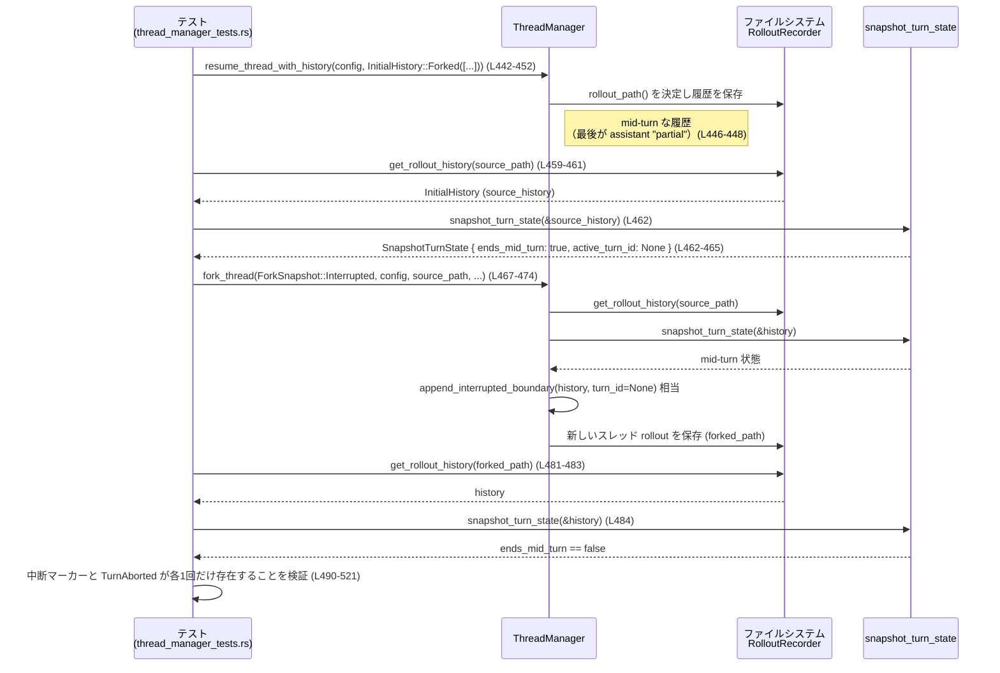

# core/src/thread_manager_tests.rs コード解説

## 0. ざっくり一言

このファイルは、`ThreadManager` と会話履歴関連ユーティリティ（`truncate_before_nth_user_message`、`snapshot_turn_state`、`append_interrupted_boundary` など）の**仕様をテストで定義しているモジュール**です。  
会話履歴の切り詰め・スナップショットからのフォーク・実行スレッドのシャットダウン・モデル一覧取得など、スレッド管理のコア API の振る舞いがここで確認されています。

---

## 1. このモジュールの役割

### 1.1 概要

- このモジュールは、会話スレッド管理のための以下の問題をテストを通じて検証しています。

  - **会話履歴のトリミング**（ユーザー N 件目の手前までで切る／範囲外のときの挙動）  
    根拠: `truncates_before_requested_user_message`（L45-114）、  
    `out_of_range_truncation_drops_only_unfinished_suffix_mid_turn`（L116-139） など

  - **ターン単位のスナップショット状態判定**（途中のターンかどうか、アクティブな turn_id など）  
    根拠: `out_of_range_truncation_drops_pre_user_active_turn_prefix`（L160-195）、  
    `interrupted_snapshot_is_not_mid_turn`（L349-371） など

  - **スレッドのフォーク（特に「中断スナップショット」`ForkSnapshot::Interrupted`）の挙動**  
    根拠: `interrupted_fork_snapshot_*` 系テスト（L421-521, L524-615, L617-747）

  - **ThreadManager の並行処理 API**（全スレッドのシャットダウン・モデル一覧更新）  
    根拠: `shutdown_all_threads_bounded_submits_shutdown_to_every_thread`（L236-273）、  
    `new_uses_configured_openai_provider_for_model_refresh`（L275-307）

### 1.2 アーキテクチャ内での位置づけ

このテストモジュールは、`ThreadManager` および履歴操作ユーティリティの「外側から見た挙動（契約）」を定める役割を持ちます。依存関係は概ね次のようになります。

```mermaid
graph TD
    T[thread_manager_tests.rs<br/>テスト群] --> TM[ThreadManager<br/>(super::*; L141,244,295,431...)]
    T --> TRUNC[truncate_before_nth_user_message<br/>(super::*; L76,101,125,185,212)]
    T --> SNAP[snapshot_turn_state<br/>(super::*; L175,364,390,412,462,571,658,678)]
    T --> APP[append_interrupted_boundary<br/>(super::*; L316,333)]
    T --> RR[RolloutRecorder<br/>(crate::rollout; L4,459,481,569,595,655,675,715)]
    T --> CFG[test_config<br/>(crate::config; L3,239,281,424,527,620)]
    T --> AUTH[AuthManager/CodexAuth<br/>(super::*; L293,430,532,626)]
    T --> EXT[外部クレート: tokio, wiremock, tempfile など]
```

- `super::*` からインポートされる対象（`ThreadManager`、`RolloutItem`、`InitialHistory` など）の実装はこのファイルにはなく、**テストから振る舞いのみが分かる**状態です。
- `RolloutRecorder` はスレッドのロールアウト履歴をファイルシステムから読み書きするコンポーネントとして使われています（例: L455-461, L481-483, L569-571, L655-657）。

### 1.3 設計上のポイント（テストから読み取れる範囲）

- **履歴処理の契約をテストで明示**  
  - 「N 番目のユーザーメッセージの前で切る」「範囲外のときの扱い」「セッションプレフィックスの無視」など、履歴操作の細かい仕様がテストで定義されています（L45-234）。
- **途中ターン (mid-turn) 概念の導入**  
  - `SnapshotTurnState { ends_mid_turn, active_turn_id, active_turn_start_index }` により、「いまの履歴はターンの途中で終わっているか」を判定する設計になっています（例: L175-183, L364-369, L390-395, L412-417）。
- **中断境界の明示的マーカー**  
  - `interrupted_turn_history_marker()` が「中断されたところ」を示す専用メッセージとして扱われ、それに対応する `TurnAborted` イベントが必ず履歴に付与されることがテストされています（L309-347, L421-521, L617-747）。
- **並行性とリソース管理**  
  - `#[tokio::test]` による非同期テストで、スレッド起動・シャットダウン・HTTP モデル一覧取得など、非同期 API の契約が確認されています（L197-234, L236-273, L275-307, L421 以降）。
- **レガシー互換性**  
  - `usize::MAX` をスナップショット指定として受け取るレガシー API がまだ利用可能であることを守るテストがあります（L141-158, L116-139, L160-195）。

---

## 2. 主要な機能一覧（テスト対象の機能）

このファイルがテストしている主な機能（=実装側の公開 API の振る舞い）は次の通りです。

- 会話履歴トリミング:
  - `truncate_before_nth_user_message`  
    - N 番目のユーザーメッセージの**直前**まで履歴を残す（L45-114）。
    - 範囲外指定時は、途中ターンの未完了部分だけを削除する（L116-139, L160-195）。
    - セッションの「初期コンテキスト」（プレフィックス）はユーザーメッセージ数のカウントから除外される（L197-234）。
- スナップショット状態判定:
  - `snapshot_turn_state`  
    - 履歴がターン途中か (`ends_mid_turn`) を判定（L175-183, L364-369, L390-395, L412-417）。
    - アクティブな `turn_id` と、そのターンの開始インデックスを特定（L175-183, L571-579）。
- 中断スナップショット処理:
  - `append_interrupted_boundary`  
    - 履歴末尾に「中断マーカー」と `TurnAborted` イベントを追加する（L309-347）。
  - `ThreadManager::fork_thread(ForkSnapshot::Interrupted, ...)`  
    - 中断スナップショットからスレッドをフォークし、履歴に中断境界を追加する（L421-521, L524-615, L617-747）。
    - レガシー履歴（turn_id が無い）では新しい turn_id を合成しない（L421-521）。
    - 明示的な turn_id がある場合はそれを保持する（L524-615）。
    - ライブスレッドがなくても、ディスク上の履歴からフォークできる（L617-747）。
- スレッドライフサイクル管理:
  - `ThreadManager::start_thread` / `shutdown_all_threads_bounded` / `list_thread_ids`  
    - 複数スレッド起動・全スレッドへの終了要求送信・完了/失敗/タイムアウトのレポート・スレッドリストの空確認（L236-273）。
- モデル一覧・外部プロバイダ連携:
  - `ThreadManager::new` / `list_models(RefreshStrategy::Online)`  
    - 設定された OpenAI プロバイダの `base_url` を使ってモデル一覧取得 API を叩く（wiremock による HTTP モックで 1 リクエストのみを検証）（L275-307）。
- レガシー API 互換:
  - `ThreadManager::fork_thread(usize, ...)` 形式のレガシー呼び出しがまだ型シグネチャとして許容されることのテスト（L141-158）。

---

## 3. 公開 API と詳細解説（テストから分かる仕様）

### 3.1 型一覧（構造体・列挙体など）

ここでは、このテストが利用している主要な型と、その役割を整理します（定義は他ファイル／クレートにあります）。

| 名前 | 種別 | 役割 / 用途 | 使用箇所（行範囲） |
|------|------|-------------|---------------------|
| `ResponseItem` | 列挙体 | モデル応答メッセージ（user/assistant、reasoning、function call など）を表現 | `user_msg`/`assistant_msg`（L22-43）、`truncates_before_requested_user_message`（L45-69）ほか |
| `ContentItem` | 列挙体 | メッセージの中身（テキストなど） | `user_msg`/`assistant_msg`（L26-27, 37-38） |
| `RolloutItem` | 列挙体 | ロールアウト履歴の 1 要素（Response, Event, SessionMeta など） | 多数: L71-75, L118-123, L162-173, L311-322, L351-361 など |
| `InitialHistory` | 列挙体 | スレッド再開/フォーク時に渡す初期履歴 (`New` or `Forked(Vec<RolloutItem>)`) | L76-77, L102, L125-126, L160, L311-312, L351, L375, L401 など |
| `SnapshotTurnState` | 構造体 | スナップショット時のターン状態（mid-turn か、アクティブ turn_id、開始インデックス） | 値構築 L79-83, L104-108, L128-132, 比較 L175-183, L364-369, L390-395, L412-417 ほか |
| `ThreadManager` | 構造体 | 会話スレッドの起動・再開・フォーク・シャットダウン・モデル一覧取得を行うマネージャ | 利用 L141-157, L244-272, L295-305, L431-521, L532-615, L627-747 |
| `Config` | 構造体 | アプリケーション設定（`codex_home`, model providers 等） | L239-242, L281-286, L424-427, L527-530, L620-623 |
| `ForkSnapshot` | 列挙体 | `fork_thread` でどのスナップショット種類からフォークするか（`Interrupted` など） | L469, L583, L663, L702 |
| `EventMsg` | 列挙体 | ユーザー/エージェントメッセージ、ターン開始/中断などのイベント | 作成 L165-170, L322-327, L338-343, L355-360, L376-382, L382-386, L404-408, L493-499, L607-612, L739-742 等 |
| `TurnStartedEvent` | 構造体 | ターン開始イベント（turn_id, started_at, model_context_window など） | L165-170, L549-554 |
| `TurnAbortedEvent` | 構造体 | ターン中断イベント（turn_id, reason, completed_at, duration_ms） | L322-327, L338-343, L355-360, L494-499, L607-612, L739-742 |
| `TurnAbortReason` | 列挙体 | 中断理由。ここでは `Interrupted` のみ登場 | L324, L340, L357, L496, L609, L740 |
| `UserMessageEvent` | 構造体 | レガシー形式のユーザーメッセージイベント | L376-381, L403-408 |
| `AgentMessageEvent` | 構造体 | レガシー形式のエージェントメッセージイベント | L382-386 |
| `RolloutRecorder` | 構造体 | ロールアウト履歴の永続化と読み出し | 履歴取得 L459-461, L481-483, L569-571, L655-657, L675-677, L715-716 |
| `AuthManager`, `CodexAuth` | 構造体 | 認証情報管理（テスト用のダミー認証を利用） | L293-297, L430-434, L532-537, L625-629, L443-451, L545-561, L639-648 |
| `SessionSource` | 列挙体 | セッションの起源（ここでは `Exec`） | L297-298, L434-435, L537-538, L630-631 |
| `CollaborationModesConfig` | 構造体 | コラボレーションモード設定 | L298-299, L435-436, L538-539, L631-632 |
| `RefreshStrategy` | 列挙体 | モデル一覧取得の更新戦略（ここでは `Online`） | L305-306 |
| `ModelsResponse` | 構造体 | モデル一覧 API のレスポンス（`models: Vec<_>`） | L277-278 |

> 補足: これらの型の**実際のフィールド定義・メソッド実装は、このチャンクには存在しません**。上表はテストから読み取れる用途の範囲に限定しています。

---

### 3.2 関数・メソッド詳細（テストから読み取れる仕様）

以下では、このテストが仕様を定めている主要 API について、テストコードから分かる契約を整理します。

---

#### `truncate_before_nth_user_message(history: InitialHistory, n: usize, state: &SnapshotTurnState) -> InitialHistory`

**概要**

- 初期履歴 `history` のうち、**N 番目のユーザーメッセージの直前まで**を残した履歴を返す関数と解釈できます（L45-114）。
- N が履歴内のユーザーメッセージ数を超える場合は、`SnapshotTurnState` を参照して、**未完了なターンの末尾だけを削除**します（L116-139, L160-195）。
- セッションの「初期コンテキスト」部分（システム/プレフィックスメッセージ）は、ユーザーメッセージの N カウントには含めないように扱われます（L197-234）。

**引数（テストから推測される意味）**

| 引数名 | 型 | 説明 |
|--------|----|------|
| `history` | `InitialHistory` | もともとの履歴。`InitialHistory::Forked(Vec<RolloutItem>)` として渡されています（L76-77, L102, L125-126, L160, L197, など）。 |
| `n` | `usize` | 残したい「ユーザーメッセージ」の数。`/*n*/ 1` や `/*n*/ 2` が渡されます（L78, L103, L214）。 |
| `state` | `&SnapshotTurnState` | 既に計算済みのスナップショット状態。`ends_mid_turn` や `active_turn_id` に応じて挙動が変わります（L79-83, L104-108, L128-132, L188-189）。 |

**戻り値**

- 新しい `InitialHistory`。内部の `Vec<RolloutItem>` は元の履歴の**先頭から一部のみ**を保持するように切り詰められます（L85-90, L135-138, L191-194, L221-228）。

**内部処理の流れ（テストから読み取れる契約）**

テストから推測すると、処理は概ね次の性質を持っています。

1. `history` が `InitialHistory::New` の場合の挙動は、このファイルでは直接テストされていません（不明）。
2. `InitialHistory::Forked(items)` の場合:
   - `RolloutItem::ResponseItem(ResponseItem::Message{ role: "user" })` を「ユーザーメッセージ」としてカウントします（L47-52, L118-123）。
   - `state.ends_mid_turn == false` のとき:
     - `n` 番目のユーザーメッセージ**直前**で `items` を切ります（例: n=1 で `u1` の直前まで → `u1` 以前のプレフィックスが残る、L45-114）。
     - n がユーザーメッセージ数以上なら、履歴全体を残します（L96-113）。
   - `state.ends_mid_turn == true` かつ `n` が非常に大きい (`usize::MAX`) 場合:
     - 「途中のターン」の**未完了部分**（たとえば最後の `assistant_msg("partial")`）を削除し、それ以前のターンは残します（L116-139）。
     - `active_turn_start_index` が指定されている場合は、ターン開始イベントより前の prefix も削除することがテストされています（L160-195）。

**Examples（使用例）**

1. 基本的なトリミング（N 番目ユーザーメッセージの手前）

```rust
// L45-114 を簡略化したイメージ
let items = vec![
    RolloutItem::ResponseItem(user_msg("u1")),        // ユーザーメッセージ (1)
    RolloutItem::ResponseItem(assistant_msg("a1")),   // アシスタント
    RolloutItem::ResponseItem(assistant_msg("a2")),   // アシスタント
    RolloutItem::ResponseItem(user_msg("u2")),        // ユーザーメッセージ (2)
];

let state = SnapshotTurnState {
    ends_mid_turn: false,
    active_turn_id: None,
    active_turn_start_index: None,
};

let truncated = truncate_before_nth_user_message(
    InitialHistory::Forked(items.clone()),
    1,           // 1 番目のユーザーメッセージの「前」まで
    &state,
);

assert_eq!(
    serde_json::to_value(truncated.get_rollout_items()).unwrap(),
    serde_json::to_value(vec![
        RolloutItem::ResponseItem(user_msg("u1")),
        RolloutItem::ResponseItem(assistant_msg("a1")),
        RolloutItem::ResponseItem(assistant_msg("a2")),
    ]).unwrap()
);
```

1. 範囲外かつ mid-turn の場合（未完了 suffix のみ削除）

```rust
// L116-139 相当
let items = vec![
    RolloutItem::ResponseItem(user_msg("u1")),
    RolloutItem::ResponseItem(assistant_msg("a1")),
    RolloutItem::ResponseItem(user_msg("u2")),
    RolloutItem::ResponseItem(assistant_msg("partial")), // 未完了の応答
];

let state = SnapshotTurnState {
    ends_mid_turn: true,
    active_turn_id: None,
    active_turn_start_index: None,
};

let truncated = truncate_before_nth_user_message(
    InitialHistory::Forked(items.clone()),
    usize::MAX,   // 範囲外
    &state,
);

// 最後の "partial" のみドロップ
assert_eq!(
    serde_json::to_value(truncated.get_rollout_items()).unwrap(),
    serde_json::to_value(items[..2].to_vec()).unwrap()
);
```

**Errors / Panics**

- テストでは `truncate_before_nth_user_message` が `Result` を返している様子はなく、直接戻り値を使っています（L76-84 や L185-189 など）。  
  → 少なくともテストケースにおいては、パニックやエラーは発生していません。
- 異常入力（負数インデックス等）は型レベルで存在しないため、Rust の型安全性により防がれています。

**Edge cases（エッジケース）**

- `n` が 1 のとき:
  - 1 番目のユーザーメッセージの**直前**まで残ることが L45-114 から分かります。
- `n` がユーザーメッセージ数以上のとき:
  - mid-turn でない場合は、履歴をそのまま返す（L96-113）。
  - mid-turn の場合は未完了 suffix のみ削除（L116-139, L160-195）。
- `state.ends_mid_turn == true` かつ `active_turn_start_index.is_some()` のとき:
  - 該当ターンの **開始インデックスより前**もドロップされることが、L160-195 のテストから読み取れます。

**使用上の注意点**

- 「ユーザーメッセージ」の定義は、`ResponseItem::Message` かつ `role == "user"` であると仮定されています（L22-31, L47-52）。
- レガシーイベント形式（`EventMsg::UserMessage`）は、この関数のカウント対象かどうか不明です（このファイルには direct なテストがありません）。

---

#### `snapshot_turn_state(history: &InitialHistory) -> SnapshotTurnState`

**概要**

- 与えられた初期履歴が「ターン途中 (mid-turn)」で終わっているか、どのターンがアクティブかを判定する関数です。
- `ends_mid_turn`, `active_turn_id`, `active_turn_start_index` の 3 つを返し、`truncate_before_nth_user_message` やスナップショットフォークの挙動の前提になります（L175-183, L364-369, L390-395, L412-417, L462-465, L571-579, L658-659, L678）。

**引数**

| 引数名 | 型 | 説明 |
|--------|----|------|
| `history` | `&InitialHistory` | 評価対象の履歴。Forked/ New いずれか。ここでは `Forked(Vec<RolloutItem>)` が渡されています。 |

**戻り値**

- `SnapshotTurnState` 構造体:
  - `ends_mid_turn: bool` — 履歴がターンの途中で終わっている場合に `true`。
  - `active_turn_id: Option<String>` — 現在アクティブなターン ID（あれば）。
  - `active_turn_start_index: Option<usize>` — `RolloutItem` 配列内におけるアクティブターンの開始位置。

**内部処理の挙動（テストから読み取れる契約）**

- レガシー・イベント履歴のみ（`EventMsg::UserMessage` & `EventMsg::AgentMessage`）でターンが完了している場合:
  - `ends_mid_turn == false`、`active_turn_id == None`（L373-397）。
- `interrupted_turn_history_marker()` + `EventMsg::TurnAborted` で終わる履歴:
  - これは**すでに中断処理が完了**しているとみなされ、`ends_mid_turn == false`、`active_turn_id == None`（L349-371）。
- レガシー `EventMsg::UserMessage` と新形式 `ResponseItem::Message` の混在:
  - `ends_mid_turn == true`（L399-418） → 異なる履歴形式の混在は「ターン途中」とみなす。
- `EventMsg::TurnStarted` があり、応答が途中の履歴:
  - `ends_mid_turn == true`、`active_turn_id == Some("turn-2")`、`active_turn_start_index == Some(2)`（L175-183）。
- `resume_thread_with_history` で作った mid-turn 履歴:
  - `ends_mid_turn == true`、`active_turn_id` の有無は履歴内容に依存（L462-465, L571-579, L658-659）。

**Examples**

```rust
// 完了したレガシーイベント履歴の場合（L373-397）
let completed_history = InitialHistory::Forked(vec![
    RolloutItem::EventMsg(EventMsg::UserMessage(UserMessageEvent { /* ... */ })),
    RolloutItem::EventMsg(EventMsg::AgentMessage(AgentMessageEvent { /* ... */ })),
]);

let state = snapshot_turn_state(&completed_history);
assert_eq!(state, SnapshotTurnState {
    ends_mid_turn: false,
    active_turn_id: None,
    active_turn_start_index: None,
});
```

**Errors / Panics**

- テストでは常に正常に `SnapshotTurnState` が返されており、エラー型は登場しません。

**Edge cases**

- 「中断マーカー + TurnAborted」で終わる履歴は mid-turn ではない（L349-371）。
- 新旧形式が混在した履歴は mid-turn（L399-418）。
- ターン開始イベントだけがあり、終了イベントが無い履歴は mid-turn（L160-195, L571-579）。

**使用上の注意点**

- この関数の結果が `truncate_before_nth_user_message` や `fork_thread(ForkSnapshot::Interrupted, ...)` の挙動に直結します。  
  → 実装を変更するときは、本テストファイルの関連テストをすべて確認する必要があります。

---

#### `append_interrupted_boundary(history: InitialHistory, turn_id: Option<String>) -> InitialHistory`

**概要**

- 指定された履歴の末尾に、「中断されたことを示す境界」を追加する関数です。
- 具体的には、
  1. `interrupted_turn_history_marker()` を `ResponseItem` として追加し、
  2. `EventMsg::TurnAborted(TurnAbortedEvent { turn_id, reason: Interrupted, ... })`
     を追加します（L309-347）。

**引数**

| 引数名 | 型 | 説明 |
|--------|----|------|
| `history` | `InitialHistory` | 元の履歴。`New` または `Forked(Vec<RolloutItem>)`。 |
| `turn_id` | `Option<String>` | 中断されたターン ID。`None` の場合はターン ID 不明として記録。 |

**戻り値**

- 2 要素の中断境界が付与された新しい `InitialHistory`。

**内部処理の挙動（テストから）**

- `InitialHistory::Forked([...])` の場合:
  - 元の `RolloutItem` に続けて、
    1. `RolloutItem::ResponseItem(interrupted_turn_history_marker())`
    2. `RolloutItem::EventMsg(EventMsg::TurnAborted(TurnAbortedEvent { turn_id, reason: TurnAbortReason::Interrupted, completed_at: None, duration_ms: None }))`
    を追加する（L311-328）。
- `InitialHistory::New` の場合:
  - 履歴が空であるため、上記の 2 つのアイテムのみを含む `Forked` 状態に相当する結果を返します（L332-345）。

**Examples**

```rust
// 既存履歴に中断境界を追加（L309-347）
let committed_history = InitialHistory::Forked(vec![
    RolloutItem::ResponseItem(user_msg("hello")),
]);

let appended = append_interrupted_boundary(committed_history, None);
let items = appended.get_rollout_items();

assert_eq!(
    serde_json::to_value(items).unwrap(),
    serde_json::to_value(vec![
        RolloutItem::ResponseItem(user_msg("hello")),
        RolloutItem::ResponseItem(interrupted_turn_history_marker()),
        RolloutItem::EventMsg(EventMsg::TurnAborted(TurnAbortedEvent {
            turn_id: None,
            reason: TurnAbortReason::Interrupted,
            completed_at: None,
            duration_ms: None,
        })),
    ]).unwrap()
);
```

**Errors / Panics**

- テストでは常に正常に動作しており、エラー条件は見当たりません。

**Edge cases**

- 空履歴 (`InitialHistory::New`) に対しても、正しく中断境界だけが作られます（L332-345）。
- `turn_id` が `None` の場合も許容されます（L323-324, L339-340）。

**使用上の注意点**

- `snapshot_turn_state` は、「中断境界が既に付与されている履歴」を mid-turn ではないとみなします（L349-371）。  
  → 途中で中断された履歴に対してこの関数を適用した後は、`ends_mid_turn` が `false` となることを前提に他の処理が組まれている可能性があります。

---

#### `ThreadManager::fork_thread(snapshot: impl Into<ForkSnapshot or usize>, config: Config, path: PathBuf, persist_extended_history: bool, parent_trace: Option<_>) -> Future<...>`

**概要**

- 既存スレッドのロールアウト履歴から、新しいスレッド（フォーク）を作成する API です。
- テストでは 2 系統の使い方が確認されています。
  1. レガシーな `usize` スナップショット指定（L141-158）。
  2. `ForkSnapshot::Interrupted` を用いた「中断スナップショットからのフォーク」（L467-476, L581-590, L661-670, L700-709）。

**引数（テストに現れる形）**

| 引数名 | 型 | 説明 | 根拠 |
|--------|----|------|------|
| `snapshot` | `usize` または `ForkSnapshot` | どのスナップショットからフォークするか。レガシー API と新 API の両方が受け入れられる | L148-150, L469, L583, L663, L702 |
| `config` | `Config` | フォーク後のスレッド設定 | L145-146, L470, L584, L664, L703 |
| `path` | `PathBuf` | 元となるロールアウト履歴のファイルパス | L146-147, L471, L585, L665, L704 |
| `persist_extended_history` | `bool` | 拡張履歴の永続化フラグ。ここでは常に `false` | L152-153, L472, L586, L666, L705 |
| `parent_trace` | `Option<_>` | 親トレース情報。ここでは常に `None` | L153-154, L473, L587, L667, L706 |

**戻り値**

- 非同期の Future。`await` 後に、新しいスレッド（`thread_id` を持つ構造体）を含む結果を返します（L468-476, L581-590, L661-670, L700-709）。

**内部処理の契約（中断フォークに関してテストから読み取れる点）**

- `ForkSnapshot::Interrupted` の場合:
  - 元履歴が mid-turn であることを前提とし、その履歴に対して `append_interrupted_boundary` 相当の処理を加えた上で、新しいスレッドのロールアウトとして保存する（L481-483, L675-677, L715-716）。
  - レガシー形式（turn_id なし）mid-turn のとき:
    - 新しい turn_id を勝手に合成せず、`TurnAbortedEvent.turn_id` は `None` にする（L462-466, L493-501）。
  - 明示的な `turn_id` がある mid-turn のとき:
    - その `turn_id` を `TurnAbortedEvent.turn_id` に保存する（L571-579, L604-614）。
  - ライブスレッドが存在しなくても:
    - ディスク上の履歴から正しく mid-turn 状態を判定し、フォーク時に中断境界を 1 回だけ追加する（L658-659, L680-697, L699-747）。

**Examples**

```rust
// 中断状態の履歴からフォーク（L421-521 の要約）
let forked = manager
    .fork_thread(
        ForkSnapshot::Interrupted,
        config,
        source_path,             // 既存スレッドの rollout.json の場所
        /*persist_extended_history*/ false,
        /*parent_trace*/ None,
    )
    .await
    .expect("fork interrupted snapshot");

let forked_path = forked.thread.rollout_path().expect("path");
let history = RolloutRecorder::get_rollout_history(&forked_path).await.expect("read");
assert!(!snapshot_turn_state(&history).ends_mid_turn);

// 中断マーカーと TurnAborted がちょうど 1 回ずつ現れることを確認
```

**Errors / Panics**

- テストでは `.await.expect("...")` を用いているため、`fork_thread` は `Result<_, E>` を返している可能性があります（L468-476, L581-590, L661-670, L700-709）。
- 実装上どのような場合に `Err` になるかはこのファイルからは分かりません。

**Edge cases**

- レガシー `usize::MAX` 指定:
  - 型レベルでまだ許容されている（L141-158）。挙動自体はここでは検証されていません。
- ライブスレッド削除後のフォーク:
  - `manager.remove_thread(&source.thread_id).await;` の後でも、ディスク上の履歴からフォークできる（L659-670）。
- 再フォーク:
  - すでに中断境界が付いている履歴から再度 `ForkSnapshot::Interrupted` でフォークしても、中断マーカーと `TurnAborted` がそれぞれ 1 回だけになる（L699-747）。

**使用上の注意点**

- `ForkSnapshot::Interrupted` は、mid-turn 状態の履歴に対してのみ意味を持つ前提です。mid-turn でない履歴に対して使う場合の挙動は、このファイルからは分かりません。
- レガシー `usize` 引数は将来の削除候補になる可能性がありますが、少なくとも現在はテストで型互換性が維持されています（L141-158）。

---

#### `ThreadManager::shutdown_all_threads_bounded(timeout: Duration) -> ShutdownReport`

**概要**

- 起動中のすべてのスレッドに対して「シャットダウン」を送信し、指定したタイムアウトで待ち合わせ、それぞれの結果を `ShutdownReport` として返す非同期 API です（L236-273）。

**引数**

| 引数名 | 型 | 説明 |
|--------|----|------|
| `timeout` | `std::time::Duration` | 全スレッドの終了を待つ最大時間。テストでは 10 秒が渡されています（L264-265）。 |

**戻り値（テストから推測されるフィールド）**

- `ShutdownReport` 構造体（推測）:
  - `completed: Vec<String>` — 正常にシャットダウン処理を完了したスレッド ID の一覧（L267-269）。
  - `submit_failed: Vec<String>` — シャットダウン要求の送信に失敗したスレッド ID（L270）。
  - `timed_out: Vec<String>` — タイムアウトまでに終了しなかったスレッド ID（L271）。

**処理フロー（テスト観点）**

1. `ThreadManager::with_models_provider_and_home_for_tests` で、テスト専用のマネージャを初期化（L244-251）。
2. `start_thread(config.clone()).await` を 2 回呼び出し、2 つのスレッドを起動（L252-261）。
3. `shutdown_all_threads_bounded(Duration::from_secs(10)).await` を呼び出す（L263-265）。
4. 戻り値のレポートに対して:
   - `completed` に 2 つの thread_id が含まれていることを確認（ソートした上で比較）（L267-269）。
   - `submit_failed` / `timed_out` は空であること（L270-271）。
   - `list_thread_ids().await` が空であること（すべてのスレッドがマネージャから削除されていること）（L272）。

**並行性・安全性の観点**

- テストは `#[tokio::test]` 上で動作し、`await` を通じて非同期にスレッドを起動・終了しています。
- `Duration` ベースのタイムアウトを用いることで、ハングしたスレッドがあってもテスト全体が無限待ちにならない設計であることが示唆されます。

**使用上の注意点**

- スレッド数が多い場合、`timeout` を短くしすぎると `timed_out` に多くのスレッドが残る可能性があります（実装は不明ですが、設計的にはそのように扱うべき API です）。
- テストでは正常系のみ検証しており、実運用でのエラー / タイムアウト処理は別途確認が必要です。

---

#### `ThreadManager::new(...)` および `ThreadManager::list_models(strategy: RefreshStrategy)`

**概要**

- `ThreadManager::new` は、設定と認証情報に基づいてスレッド管理環境を初期化するコンストラクタです（L293-303）。
- `list_models(RefreshStrategy::Online)` は、設定されたモデルプロバイダ（ここでは OpenAI）からモデル一覧を取得します。  
  テストでは、`base_url` を Wiremock サーバに向けておき、HTTP リクエストが 1 回送られたことを確認しています（L275-307）。

**挙動の要点（テストから）**

- `config.model_providers["openai"].base_url` を変更すると、その URL に対してモデル一覧 GET（または同等の）リクエストが送られる（L286-290, L305-306）。
- `config.model_catalog = None` とすることで、ローカルのモデルカタログではなく外部プロバイダに問い合わせるモードになるようです（L285-286）。

**使用上の注意点**

- `list_models(RefreshStrategy::Online)` はネットワーク I/O を行うため、頻繁に呼び出すとパフォーマンスに影響する可能性があります。
- テストでは Wiremock により外部依存を遮断しているため、本番環境では HTTP エラーのハンドリングを別途確認する必要があります。

---

#### `ThreadManager::resume_thread_with_history(config: Config, history: InitialHistory, auth_manager: AuthManager, persist_extended_history: bool, parent_trace: Option<_>)`

**概要**

- 既存の履歴（`InitialHistory`）から新しいスレッドを起動し、その状態で会話を再開する API です（L442-454, L545-563, L638-650）。
- 中断フォーク関連テストでは、**mid-turn の履歴を持つスレッドを作るための前段階**として利用されています。

**テストから読み取れる契約**

- `InitialHistory::Forked` で渡された履歴は、`RolloutRecorder::get_rollout_history` から読みだした履歴と一致している（L455-461, L569-571, L655-657）。
- mid-turn の履歴（最後が `assistant_msg("partial")`）を渡した場合、
  - `snapshot_turn_state(&source_history).ends_mid_turn` が `true` になる（L462-463, L658-659）。
- `persist_extended_history` はここでも `false` 固定で使われています。true の場合の挙動はこのファイルからは分かりません。

---

### 3.3 その他の関数・テストヘルパ

| 関数名 | 役割（1 行） | 行範囲 |
|--------|--------------|--------|
| `fn user_msg(text: &str) -> ResponseItem` | `"user"` ロールのテキストメッセージ（`ResponseItem::Message`）を生成するヘルパ（L22-32）。 | L22-32 |
| `fn assistant_msg(text: &str) -> ResponseItem` | `"assistant"` ロールのテキストメッセージを生成するヘルパ（L33-43）。 | L33-43 |
| `truncates_before_requested_user_message` | `truncate_before_nth_user_message` の基本仕様を検証するテスト。 | L45-114 |
| `out_of_range_truncation_drops_only_unfinished_suffix_mid_turn` | 範囲外 N + mid-turn のとき未完了部分のみ削除されることを検証。 | L116-139 |
| `fork_thread_accepts_legacy_usize_snapshot_argument` | `ThreadManager::fork_thread` がレガシー `usize` 引数をまだ受け付けることを型レベルで確認。 | L141-158 |
| `out_of_range_truncation_drops_pre_user_active_turn_prefix` | mid-turn かつターン開始イベント前の prefix が削除されることを検証。 | L160-195 |
| `ignores_session_prefix_messages_when_truncating` | セッションの初期コンテキストをユーザーメッセージカウントから除外することを検証。 | L197-234 |
| `shutdown_all_threads_bounded_submits_shutdown_to_every_thread` | すべてのスレッドへのシャットダウン送信と状態報告を検証。 | L236-273 |
| `new_uses_configured_openai_provider_for_model_refresh` | モデル一覧取得が設定された OpenAI プロバイダの `base_url` を使うことを検証。 | L275-307 |
| `interrupted_fork_snapshot_appends_interrupt_boundary` | `append_interrupted_boundary` の挙動を検証。 | L309-347 |
| `interrupted_snapshot_is_not_mid_turn` | 中断境界付き履歴が mid-turn ではないことを検証。 | L349-371 |
| `completed_legacy_event_history_is_not_mid_turn` | レガシーイベントだけで完結する履歴が mid-turn ではないことを検証。 | L373-397 |
| `mixed_response_and_legacy_user_event_history_is_mid_turn` | 新旧形式混在履歴が mid-turn と判定されることを検証。 | L399-418 |
| `interrupted_fork_snapshot_does_not_synthesize_turn_id_for_legacy_history` | レガシー履歴の中断フォークで turn_id を合成しないことを検証。 | L421-521 |
| `interrupted_fork_snapshot_preserves_explicit_turn_id` | 明示的な turn_id を中断フォークで保持することを検証。 | L524-615 |
| `interrupted_fork_snapshot_uses_persisted_mid_turn_history_without_live_source` | ライブスレッドがなくても、永続化済み mid-turn 履歴から中断フォークできることを検証。 | L617-747 |

---

## 4. データフロー

ここでは代表的なシナリオとして、**mid-turn 状態のスレッドから中断フォークを行う流れ**を整理します（`interrupted_fork_snapshot_does_not_synthesize_turn_id_for_legacy_history` テスト: L421-521）。

### 4.1 シーケンス図: 中断スナップショットフォークのフロー（L421-521）



**要点**

- mid-turn な履歴から中断フォークする際、`ThreadManager` は
  - 元履歴を読み出し、
  - mid-turn 状態を確認し、
  - 中断マーカー + `TurnAborted` イベントを付加し、
  - それを新しいスレッドの履歴として保存する
  というデータフローを持つことがテストから読み取れます。

---

## 5. 使い方（How to Use）

このファイルはテストコードですが、利用側コードの典型的な流れを読み解くことができます。

### 5.1 基本的な使用方法（ThreadManager と履歴操作）

```rust
// 設定・環境の用意（L239-243 相当）
let temp_dir = tempfile::tempdir()?;
let mut config = test_config();
config.codex_home = temp_dir.path().join("codex-home");
config.cwd = config.codex_home.abs();
std::fs::create_dir_all(&config.codex_home)?;

// 認証と ThreadManager の初期化（L293-303）
let auth_manager =
    AuthManager::from_auth_for_testing(CodexAuth::create_dummy_chatgpt_auth_for_testing());
let manager = ThreadManager::new(
    &config,
    auth_manager,
    SessionSource::Exec,
    CollaborationModesConfig::default(),
    Arc::new(codex_exec_server::EnvironmentManager::new(None)),
    None,
);

// 履歴からスレッドを再開（L442-452）
let history = InitialHistory::Forked(vec![
    RolloutItem::ResponseItem(user_msg("hello")),
    RolloutItem::ResponseItem(assistant_msg("partial")),
]);
let source = manager
    .resume_thread_with_history(config.clone(), history, auth_manager, false, None)
    .await?;

// 中断スナップショットからフォーク（L467-476）
let source_path = source.thread.rollout_path().expect("path");
let forked = manager
    .fork_thread(ForkSnapshot::Interrupted, config, source_path, false, None)
    .await?;
```

### 5.2 よくある使用パターン（トリミング系）

- **会話履歴を N 件目ユーザーメッセージの前で切りたいとき**:
  - `truncate_before_nth_user_message` に `SnapshotTurnState` を併用する（L45-114）。
- **mid-turn 履歴の未完了部分を安全に削除したいとき**:
  - `snapshot_turn_state` で mid-turn を検出し、`truncate_before_nth_user_message` に `usize::MAX` を渡す（L116-139, L160-195）。

### 5.3 よくある間違い（テストから推測できるもの）

```rust
// 誤り例: mid-turn 履歴に対して中断境界を付けずにフォークする
let forked = manager.fork_thread(
    ForkSnapshot::Interrupted,
    config,
    source_path,
    false,
    None,
);
// snapshot_turn_state(&history).ends_mid_turn が true のままになりうる

// 正しい例: ThreadManager 側が append_interrupted_boundary 相当を実行し、
// フォーク後は ends_mid_turn == false であるべき（L484）。
```

```rust
// 誤り例: レガシー履歴に対して勝手に turn_id を生成する
// -> テストでは turn_id が None のままであることを要求している（L465-466, L493-501）。

// 正しい例: レガシー履歴では turn_id を None のままにして TurnAborted を記録する。
```

### 5.4 使用上の注意点（まとめ）

- **履歴の一貫性**
  - 新形式 (`ResponseItem`) と旧形式 (`EventMsg::UserMessage`) の混在は mid-turn と見なされるため（L399-418）、実装で形式移行を行う場合は、この挙動を理解しておく必要があります。
- **中断境界の付与**
  - 中断フォークを手動で実装する場合は、`interrupted_turn_history_marker()` と `TurnAbortedEvent` の両方を正しい順序で追加する必要があります（L309-347）。
- **非同期処理**
  - `ThreadManager` のメソッドは非同期（`async`）が多く、`#[tokio::test]` を利用することでテスト時もランタイム上で動作させています（L197, L236, L275, L421, L525, L617）。

---

## 6. 変更の仕方（How to Modify）

このファイルはテストであり、実装変更時の**仕様ドキュメント**としての役割を持ちます。

### 6.1 新しい機能を追加する場合

- 例: 「特定ロールのメッセージのみを数える」オプション付きトリミングを追加する場合
  1. 実装側（`super::*` のモジュール）で新しい引数や関数を追加する。
  2. このテストファイルに対応するテスト関数を追加し、期待する履歴の形を `RolloutItem` ベースで構築・比較する。
  3. 既存の `truncate_before_nth_user_message` 関連テストが影響を受けないことを確認する。

### 6.2 既存の機能を変更する場合

- 影響範囲の確認:
  - `truncate_before_nth_user_message` を変更する場合は、L45-195, L197-234 のテストがすべて通ることを確認する。
  - `snapshot_turn_state` を変更する場合は、L160-195, L349-371, L373-397, L399-418, L421-521, L524-615, L617-747 すべてのテストが対象です。
  - `ForkSnapshot::Interrupted` の挙動を変更する場合は、3 つの `interrupted_fork_snapshot_*` テストが契約になります。
- 契約（前提条件・返り値の意味）の保持:
  - 特に `turn_id` の扱い（None を勝手に埋めない、明示的 ID を保持する）はテストで厳密にチェックされています（L465-466, L604-614）。
- テストの更新:
  - 挙動変更が意図的であれば、このテストファイル側で期待値（`expected` ベクタや `SnapshotTurnState` の値）を更新し、新しい仕様を反映させる必要があります。

---

## 7. 関連ファイル

テストから推測できる、本モジュールと密接に関係するファイル・コンポーネントです（実際のパスは `use` 句から推定）。

| パス / モジュール | 役割 / 関係 |
|------------------|------------|
| `core/src/thread_manager.rs`（推定, `super::*`） | `ThreadManager` 本体および `truncate_before_nth_user_message`, `snapshot_turn_state`, `append_interrupted_boundary`, `InitialHistory`, `RolloutItem`, `EventMsg` などの定義があると考えられます。 |
| `crate::config`（`test_config`） | テスト用設定オブジェクトを生成し、`codex_home` やモデルプロバイダの設定を提供（L3, L239-242, L281-286, L424-427, L527-530, L620-623）。 |
| `crate::codex::make_session_and_context` | セッションオブジェクトとターンコンテキストを生成し、`build_initial_context` によりセッションプレフィックスメッセージを構築（L2, L199-204）。 |
| `crate::rollout::RolloutRecorder` | ロールアウト履歴の永続化・読み出しの実装。テストでは履歴検証に用いられます（L4, L459-461, L481-483, L569-571, L655-657, L675-677, L715-716）。 |
| `crate::tasks::interrupted_turn_history_marker` | 中断境界として履歴に埋め込む専用の `ResponseItem` を生成（L5, L309-347, L421-521, L617-747）。 |
| `codex_models_manager` 関連 | モデル一覧取得およびコラボレーションモード設定（L6-7, L275-307）。 |
| `codex_protocol` 関連 | メッセージ・イベント・モデルレスポンスのプロトコル定義（L8-14, L53-67, L165-170, L322-327 ほか）。 |
| `core_test_support::responses::mount_models_once` | Wiremock を用いたモデル一覧 API のモックセットアップ（L16, L275-307）。 |

> 注意: 実際の実装内容はこのチャンクには含まれていないため、上記の役割は `use` 句とテストの使い方から推定したものです。
