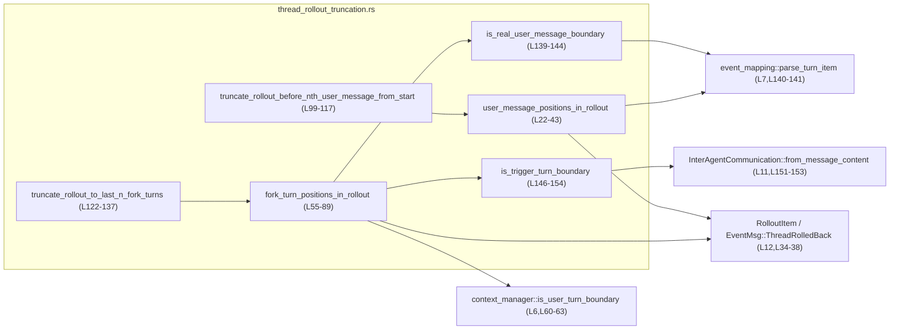
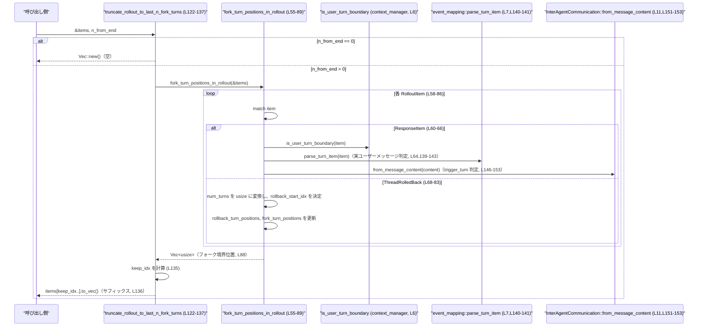

# core/src/thread_rollout_truncation.rs コード解説

## 0. ざっくり一言

「ロールアウト（会話スレッドのイベント列）」の中から、  
ユーザー発話やフォーク境界（ユーザー発話＋特定のアシスタントメッセージ）単位で位置を特定し、  
その位置を使ってロールアウトを前方／後方で切り詰めるヘルパ関数群です  
（`user_message_positions_in_rollout` / `fork_turn_positions_in_rollout` / 2 種類の truncate 関数,  
`core/src/thread_rollout_truncation.rs:L22-43,L55-89,L99-117,L122-137`）。

---

## 1. このモジュールの役割

### 1.1 概要

- このモジュールは、**ロールアウト（`Vec<RolloutItem>`）をユーザーターン／フォークターン単位で扱いやすくする**ためのヘルパを提供します  
  （モジュール先頭のドキュメンテーションコメント  
  `core/src/thread_rollout_truncation.rs:L1-4`）。
- 具体的には、ユーザー発話に対応する `RolloutItem::ResponseItem(ResponseItem::Message { .. })` を検出し、  
  `event_mapping::parse_turn_item` による解析結果が `TurnItem::UserMessage` であるものを「ユーザーメッセージ境界」として扱います  
  （`core/src/thread_rollout_truncation.rs:L16-17,L26-30,L140-143`）。
- ロールバックイベント `EventMsg::ThreadRolledBack` を適用し、**ロールバック後の有効な履歴**に対するインデックスになるよう境界リストを調整します  
  （`core/src/thread_rollout_truncation.rs:L19-21,L34-38,L68-83`）。
- その境界情報を用いて、
  - n 番目のユーザーメッセージの「直前」でロールアウトを切る
  - 最後の n 個のフォークターンだけを残す  
  といったトリミングを行います  
  （`core/src/thread_rollout_truncation.rs:L91-98,L99-117,L119-121,L122-137`）。

### 1.2 アーキテクチャ内での位置づけ

このモジュールは、以下のモジュール／型に依存しています。

- `crate::context_manager::is_user_turn_boundary`  
  ユーザーターン境界かどうかを判定するブール関数として使用されています  
  （`core/src/thread_rollout_truncation.rs:L6,L60-63`）。  
  実装はこのチャンクには現れません。
- `crate::event_mapping::parse_turn_item`  
  `ResponseItem` から `TurnItem` を得る関数として用いられ、ユーザーメッセージ判定に利用されます  
  （`core/src/thread_rollout_truncation.rs:L7,L26-30,L140-143`）。
- `codex_protocol::protocol::{RolloutItem, EventMsg, InterAgentCommunication}`  
  - ロールアウトの要素型（`RolloutItem`）  
    （`core/src/thread_rollout_truncation.rs:L12,L22,L55,L99,L122`）
  - ロールバックイベント `EventMsg::ThreadRolledBack`  
    （`core/src/thread_rollout_truncation.rs:L10,L34,L68`）
  - インターエージェントメッセージのパース（`InterAgentCommunication::from_message_content`）  
    （`core/src/thread_rollout_truncation.rs:L11,L146-153`）
- `codex_protocol::models::ResponseItem`  
  `RolloutItem::ResponseItem` 内のメッセージ型として使用されます  
  （`core/src/thread_rollout_truncation.rs:L9,L26,L60,L147`）。
- `codex_protocol::items::TurnItem`  
  `parse_turn_item` の結果として利用され、`TurnItem::UserMessage` 判定に使われています  
  （`core/src/thread_rollout_truncation.rs:L8,L28-29,L141-142`）。

内部依存関係を含めた簡易図は以下の通りです。



※ この図は「このモジュール内の関数がどの依存先を呼んでいるか」を表し、  
外部からこのモジュールがどこから呼ばれているかは、このチャンクには現れません。

### 1.3 設計上のポイント

コードから読み取れる設計上の特徴です。

- **境界検出とトリミングを分離**  
  - 境界検出は `user_message_positions_in_rollout` / `fork_turn_positions_in_rollout` が担当  
    （`core/src/thread_rollout_truncation.rs:L22-43,L55-89`）。
  - 検出した境界を使ってロールアウトを切るのは別関数で行います  
    （`truncate_rollout_before_nth_user_message_from_start` /  
      `truncate_rollout_to_last_n_fork_turns`, `L99-117,L122-137`）。  
  これにより、同じ境界検出ロジックを他の用途からも再利用しやすい構造です。
- **ロールバック情報の適用を境界列に対して行う**  
  - ユーザーメッセージ境界の場合、ロールバックイベントが来たら直近の `num_turns` 個の境界を末尾から削除します  
    （`core/src/thread_rollout_truncation.rs:L34-37`）。  
  - フォークターン境界の場合、ロールバック対象は「instruction turns」とコメントされており、  
    `rollback_turn_positions`（ユーザーターン相当）から開始位置を計算し、その位置以降のフォーク境界を削除します  
    （`core/src/thread_rollout_truncation.rs:L51-54,L56-57,L68-83`）。
- **オーバーカウントに対する安全な処理**  
  - `rollback.num_turns` を `usize::try_from` し、失敗時やオーバーフロー時には `usize::MAX` とみなします  
    （`core/src/thread_rollout_truncation.rs:L35,L69`）。
  - `saturating_sub` や `checked_sub` を用いて、境界数よりも多いロールバックが指定された場合でもアンダーフローやパニックを避けています  
    （`core/src/thread_rollout_truncation.rs:L36,L75,L81-82`）。
- **パニックを避けるための境界チェック**  
  - インデックスでアクセスする前に、長さとの比較を行っています  
    （`user_positions.len() <= n_from_start` のチェック後に `user_positions[n_from_start]` を使用  
      `L110-116`。  
      `fork_turn_positions.len() <= n_from_end` のチェック後に `fork_turn_positions[... - n_from_end]` を使用  
      `L131-136`）。
- **状態を持たない純粋な関数群**  
  - すべての関数は引数のスライスやメッセージを入力とし、新しい `Vec` や `bool` を返すだけです。  
    グローバル状態や共有可変状態は扱っていません  
    （全関数シグネチャ参照 `core/src/thread_rollout_truncation.rs:L22,L55,L99,L122,L139,L146`）。  
  これにより、並行実行時にもデータ競合を起こしにくい設計になっています。

---

## 2. 主要な機能一覧

このモジュールが提供する主な機能は次の通りです。

- `user_message_positions_in_rollout`:  
  ロールアウト内の「ユーザーメッセージ境界」のインデックス一覧を取得する  
  （`core/src/thread_rollout_truncation.rs:L14-21,L22-43`）。
- `fork_turn_positions_in_rollout`:  
  ロールアウト内の「フォークターン境界」（ユーザーメッセージ＋特定トリガー付きアシスタントメッセージ）のインデックス一覧を取得する  
  （`core/src/thread_rollout_truncation.rs:L45-54,L55-89`）。
- `truncate_rollout_before_nth_user_message_from_start`:  
  ロールアウトを、先頭から数えて n 番目のユーザーメッセージの**直前**で切る（前方トリミング）  
  （`core/src/thread_rollout_truncation.rs:L91-98,L99-117`）。
- `truncate_rollout_to_last_n_fork_turns`:  
  ロールアウトを、最後の n 個のフォークターンを含む最小のサフィックスだけ残すように切る（後方トリミング）  
  （`core/src/thread_rollout_truncation.rs:L119-121,L122-137`）。

---

## 3. 公開 API と詳細解説

### 3.1 型一覧（構造体・列挙体など）

このファイル内で **新しく定義されている型はありません**。  
ただし、処理の理解に重要な外部型を整理します。

| 名前 | 種別 | 由来 | 役割 / 用途 | 根拠 |
|------|------|------|------------|------|
| `RolloutItem` | 列挙体（と推定） | `codex_protocol::protocol` | ロールアウトを構成する項目。`RolloutItem::ResponseItem` と `RolloutItem::EventMsg` などのバリアントを持つことが分かる | `core/src/thread_rollout_truncation.rs:L12,L22,L55,L26,L34,L60,L68` |
| `ResponseItem` | 列挙体（と推定） | `codex_protocol::models` | モデルから返される応答。`ResponseItem::Message { .. }` バリアントを持つ | `core/src/thread_rollout_truncation.rs:L9,L16,L26,L60,L147` |
| `EventMsg` | 列挙体（と推定） | `codex_protocol::protocol` | スレッドに関するイベント。`EventMsg::ThreadRolledBack(rollback)` バリアントを持ち、`rollback.num_turns` を通じてロールバック数を持つ | `core/src/thread_rollout_truncation.rs:L10,L19,L34-36,L68-69` |
| `TurnItem` | 列挙体（と推定） | `codex_protocol::items` | `event_mapping::parse_turn_item` の結果。`TurnItem::UserMessage(_)` バリアントでユーザーメッセージを表す | `core/src/thread_rollout_truncation.rs:L8,L28-29,L140-142` |
| `InterAgentCommunication` | 構造体または列挙体（と推定） | `codex_protocol::protocol` | メッセージコンテンツからパースされるインターエージェント通信。`trigger_turn` フィールドを持つ | `core/src/thread_rollout_truncation.rs:L11,L151-153` |

> `RolloutItem` や `ResponseItem` の詳細なフィールドや他のバリアントは、このチャンクには現れません。

### 3.2 関数詳細

ここでは特に重要と思われる 4 関数についてテンプレートに従って説明します。

---

#### `user_message_positions_in_rollout(items: &[RolloutItem]) -> Vec<usize>`

**概要**

- ロールアウト内の「ユーザーメッセージ境界」に相当する `RolloutItem` のインデックスを、出現順に並べた `Vec<usize>` として返します  
  （`core/src/thread_rollout_truncation.rs:L14-17,L22-43`）。
- `EventMsg::ThreadRolledBack` を考慮し、ロールバック適用後の有効な履歴に対するインデックスとなるよう調整します  
  （`core/src/thread_rollout_truncation.rs:L19-21,L34-37`）。

**引数**

| 引数名 | 型 | 説明 |
|--------|----|------|
| `items` | `&[RolloutItem]` | ロールアウトの全アイテム列。`ResponseItem` や `EventMsg` などが含まれます（`L22`）。 |

**戻り値**

- `Vec<usize>`:  
  ユーザーメッセージ境界に対応する `items` の 0-based インデックスの昇順リスト  
  （`core/src/thread_rollout_truncation.rs:L22-23,L32,L42`）。

**内部処理の流れ**

1. 空の `user_positions` ベクタを作ります（`L22-23`）。
2. `items` を `enumerate` でループし、`idx`（インデックス）と `item` を取り出します（`L24`）。
3. `match item` でバリアントごとに分岐します（`L25`）。
   - `RolloutItem::ResponseItem(item @ ResponseItem::Message { .. })` かつ  
     `parse_turn_item(item)` が `Some(TurnItem::UserMessage(_))` の場合、そのインデックス `idx` を `user_positions` に push します  
     （`L26-32`）。
   - `RolloutItem::EventMsg(EventMsg::ThreadRolledBack(rollback))` の場合:
     1. `rollback.num_turns` を `usize::try_from` で `num_turns` に変換し、失敗時は `usize::MAX` を採用します（`L34-35`）。
     2. `user_positions.len().saturating_sub(num_turns)` でロールバック後の長さを計算します（`L36`）。
     3. `user_positions.truncate(new_len)` で末尾から `num_turns` 個（または存在するだけ）を削除します（`L37`）。
   - その他のアイテムは無視します（`_ => {}`, `L39`）。
4. 最後に `user_positions` を返します（`L42`）。

**Examples（使用例）**

以下は「先頭から見て 3 件のユーザーメッセージがあるロールアウトで、ロールバックが 1 回発生した例」を想定した擬似コードです。`RolloutItem` の具体的なコンストラクタはこのチャンクにはないためコメントで省略しています。

```rust
use codex_protocol::protocol::RolloutItem;
use codex_protocol::models::ResponseItem;

// items: [UserMsg1, AsstMsg, UserMsg2, ThreadRolledBack(num_turns=1), UserMsg3] のイメージ
let items: Vec<RolloutItem> = vec![
    // RolloutItem::ResponseItem(ResponseItem::Message { ... user ... }),
    // RolloutItem::ResponseItem(ResponseItem::Message { ... assistant ... }),
    // RolloutItem::ResponseItem(ResponseItem::Message { ... user ... }),
    // RolloutItem::EventMsg(EventMsg::ThreadRolledBack(rollback_with_1_turn)),
    // RolloutItem::ResponseItem(ResponseItem::Message { ... user ... }),
];

let user_positions = user_message_positions_in_rollout(&items);

// ロールバックで最後の1ユーザーターンが無効化されるので、
// 実際に残るユーザー境界は [0, 4] のうち最後の 1 件が削除されるイメージになります。
println!("{:?}", user_positions);
```

この例では、ロールバックの対象や `parse_turn_item` の動作は外部関数依存のため、  
具体的な数値はこのチャンクからは断定できません。

**Errors / Panics**

- 明示的に `Result` を返していません。
- 潜在的なパニック要因:
  - ベクタへのインデックスアクセスは使用していません。  
    `truncate` と `saturating_sub` の組み合わせにより、負の長さになるケースは防がれています  
    （`core/src/thread_rollout_truncation.rs:L35-37`）。
  - `usize::try_from(...).unwrap_or(usize::MAX)` は `unwrap` ではなく `unwrap_or` なのでパニックしません  
    （`core/src/thread_rollout_truncation.rs:L35`）。
- よって、関数内部でパニックが起きるパスはコード上からは確認できません。

**Edge cases（エッジケース）**

- `items` が空の場合  
  - ループが 1 回も回らず、空の `Vec` を返します（`L22-24,L41-42`）。
- `items` にユーザーメッセージが 1 つもない場合  
  - `user_positions` は最後まで空のままで返されます（`L26-32,L41-42`）。
- ロールバックで指定された `num_turns` が、これまでに記録されたユーザー境界数より大きい場合  
  - `len().saturating_sub(num_turns)` により結果は 0 になり、境界リストは空になります（`L36-37`）。
- `rollback.num_turns` が負数または `usize` に変換できないほど大きい場合（実際の型は不明）  
  - `try_from` が失敗し `usize::MAX` になり、結果的に `saturating_sub` によりすべての境界が削除されます（`L35-37`）。

**使用上の注意点**

- `user_positions` は **ロールバック適用後の有効履歴**に対応しているため、  
  元の `items` インデックスとは意味がズレることがあります。  
  ただし関数の観点では「ロールバック済みの歴史として解釈した場合のユーザーターン位置」を返すものとみなせます。
- 並行性:
  - 引数は共有参照 `&[RolloutItem]`、戻り値は新規に確保された `Vec<usize>` であり、グローバルな共有可変状態を操作していません。  
    そのため、**同じ `items` を複数スレッドから参照してこの関数を呼び出しても、データ競合は発生しません**。

---

#### `fork_turn_positions_in_rollout(items: &[RolloutItem]) -> Vec<usize>`

**概要**

- ロールアウト内の「フォークターン境界」の位置（インデックス）を返します  
  （`core/src/thread_rollout_truncation.rs:L45-54,L55-89`）。
- フォークターン境界は次のいずれかです（`L47-49,L64-65`）。
  - 実ユーザーメッセージ境界（`is_real_user_message_boundary` が `true`）
  - `InterAgentCommunication::from_message_content` の結果において `trigger_turn == true` なアシスタントメッセージ
- `EventMsg::ThreadRolledBack` によるロールバックを、**instruction-turn 単位**で適用し、  
  指定されたロールバック範囲以降のフォーク境界を削除します（`L51-54,L68-83`）。

**引数**

| 引数名 | 型 | 説明 |
|--------|----|------|
| `items` | `&[RolloutItem]` | ロールアウト全体を表すスライス（`L55,L58`）。 |

**戻り値**

- `Vec<usize>`: フォークターン境界に該当する `items` のインデックスの昇順リスト（`L55-57,L65,L88`）。

**内部処理の流れ**

1. `rollback_turn_positions`（ロールバック計算用のターン境界リスト）と  
   `fork_turn_positions`（フォークターン境界リスト）を空で初期化します（`L55-57`）。
2. `items` をインデックス付きでループします（`L58`）。
3. `match item` による分岐（`L59`）。
   - `RolloutItem::ResponseItem(item)` の場合（`L60-66`）:
     - `is_user_turn_boundary(item)` が `true` なら、`rollback_turn_positions` に `idx` を追加します（`L61-63`）。  
       これにより「instruction turn」を表す境界列を管理していると解釈できます（コメント `L51-54` が根拠）。
     - `is_real_user_message_boundary(item) || is_trigger_turn_boundary(item)` が `true` なら、  
       `fork_turn_positions` に `idx` を追加します（`L64-65`）。
   - `RolloutItem::EventMsg(EventMsg::ThreadRolledBack(rollback))` の場合（`L68-84`）:
     1. `rollback.num_turns` を `usize::try_from` し、失敗時は `usize::MAX` を使います（`L69`）。
     2. `num_turns == 0` のときは何もせず次のアイテムへ（`L70-71`）。
     3. `rollback_turn_positions.len().checked_sub(num_turns)` でロールバック開始位置を計算し、  
        失敗（境界数が足りない）した場合は `rollback_turn_positions.first()` を代わりに使います  
        （`L73-77`）。
        - どちらもなければ (`else` ブロック)、ロールバック対象がないのでスキップします（`L78-79`）。
     4. ロールバック開始インデックス `rollback_start_idx` より後の instruction 境界を削除するため、  
        `rollback_turn_positions` の長さを `saturating_sub(num_turns)` で縮めて truncate します（`L81-82`）。
     5. `fork_turn_positions` については、`position < rollback_start_idx` のものだけ残すように `retain` します（`L83`）。
   - その他の `RolloutItem` は無視します（`_ => {}`, `L85`）。
4. ループ終了後、`fork_turn_positions` を返します（`L88`）。

**Examples（使用例）**

「ユーザーメッセージ 2 回のあとに、trigger_turn=true のアシスタントメッセージがあり、その後ロールバックが 1 instruction-turn 起きる」というイメージの例です。

```rust
use codex_protocol::protocol::RolloutItem;

// 詳細な構築は省略
let items: Vec<RolloutItem> = vec![
    // 0: User message (フォーク境界)
    // 1: Assistant message (trigger_turn = false, フォーク境界にならない)
    // 2: User message (フォーク境界)
    // 3: Assistant message (trigger_turn = true, フォーク境界)
    // 4: EventMsg::ThreadRolledBack { num_turns = 1 }
];

let fork_positions = fork_turn_positions_in_rollout(&items);

// ロールバックにより最後の 1 instruction-turn とその後のフォーク境界が無効化されるため、
// どのインデックスが残るかは is_user_turn_boundary の定義に依存しますが、
// 「rollback_start_idx 以降の fork_turn_positions が削除される」という仕様が適用されます。
println!("{:?}", fork_positions);
```

`is_user_turn_boundary` や `is_trigger_turn_boundary` の具体的な判定条件はこのチャンクには現れないため、  
実際にどのインデックスが残るかはここからは断定できません。

**Errors / Panics**

- `Result` ではなく `Vec<usize>` を返しており、明示的なエラーはありません。
- 潜在的なパニック要因:
  - ベクタインデックスアクセス `rollback_turn_positions[rollback_start]` を行っていますが、  
    これは `checked_sub` 成功時のみ、かつ、`rollback_start` は `len() - num_turns` なので  
    範囲外アクセスにならないことが保証されています（`L73-77`）。
  - `first().copied()` を使うことで、`checked_sub` 失敗時にも境界が存在するケースに限ってアクセスします（`L76-77`）。  
    両方ない場合は `else { continue; }` に落ち、アクセス自体が行われません（`L78-79`）。
  - `usize::try_from(...).unwrap_or(usize::MAX)` はパニックしません（`L69`）。
- したがって、コード上からはパニックに至るパスは確認できません。

**Edge cases（エッジケース）**

- `items` が空／フォーク境界がまったくない場合  
  - 両方のベクタは空のままループ終了し、空の `Vec` を返します（`L55-57,L58-88`）。
- `ThreadRolledBack` が先に現れ、`rollback_turn_positions` が空のままの場合  
  - `checked_sub` は失敗し、`first()` も `None` のため、`else { continue; }` に入り、ロールバックは無視されます（`L73-79`）。
- `num_turns == 0` のロールバック  
  - `if num_turns == 0 { continue; }` により何も変更を行いません（`L70-71`）。
- `num_turns` が `rollback_turn_positions.len()` より大きい場合  
  - `checked_sub` が失敗し `first()` が `Some` なら、最初の instruction-turn 位置からロールバックされます（`L73-77`）。
  - ロジックとして「指定されたターン数が多すぎる場合は、既知の最初の instruction-turn から末尾までをロールバックする」と解釈できます（コメント `L51-54` とコード `L73-83` に基づく）。

**使用上の注意点**

- この関数が返すのは **fork-turn 境界**であり、「ユーザーメッセージのみ」の境界ではありません。  
  ユーザーメッセージだけを扱いたい場合は `user_message_positions_in_rollout` を使う必要があります（`L47-49,L64-65`）。
- ロールバックの解釈が `is_user_turn_boundary` に依存しているため、  
  instruction-turn の定義を変更するときは、この関数の挙動も変わる点に注意が必要です（`L60-63`）。
- 並行性:
  - 引数は共有参照のみで、内部状態はローカルなベクタに閉じています（`L55-57`）。  
    このため、同じ `items` に対して複数スレッドで並行に呼び出しても、データ競合は発生しません。

---

#### `truncate_rollout_before_nth_user_message_from_start(items: &[RolloutItem], n_from_start: usize) -> Vec<RolloutItem>`

**概要**

- ロールアウトの**先頭から数えて n 番目（0-based）のユーザーメッセージの直前**でロールアウトを切り、  
  その前の部分だけを返します（`core/src/thread_rollout_truncation.rs:L91-98,L99-117`）。
- ユーザーメッセージが十分に存在しない場合や、`n_from_start == usize::MAX` の場合は、  
  ロールアウトを変更せずに返します（`L96-98,L103-105,L109-112`）。

**引数**

| 引数名 | 型 | 説明 |
|--------|----|------|
| `items` | `&[RolloutItem]` | 元のロールアウト全体（`L99-100`）。 |
| `n_from_start` | `usize` | 切り取り対象のユーザーメッセージの 0-based インデックス。`0` が最初のユーザーメッセージを意味する（`L93-94`）。 |

**戻り値**

- `Vec<RolloutItem>`:  
  ユーザーメッセージ `n_from_start` の直前までのプレフィックス。  
  条件により、元のロールアウト全体を返すこともあります（`L99-117`）。

**内部処理の流れ**

1. `n_from_start == usize::MAX` なら、ロールアウトを変更せずにそのまま返します（`L103-105`）。
2. `user_message_positions_in_rollout(items)` を呼び出して、ユーザーメッセージ境界のインデックス配列を取得します（`L107`）。
3. ユーザーメッセージ数 `user_positions.len()` が `n_from_start` 以下であれば、  
   トリミングせずそのままの `items` を返します（`L109-112`）。
4. 上記以外では、`let cut_idx = user_positions[n_from_start];` により切り取り位置を決定し、  
   `items[..cut_idx].to_vec()` でその手前までのプレフィックスを返します（`L114-116`）。

**Examples（使用例）**

```rust
use codex_protocol::protocol::RolloutItem;

// items: [prelude, User1, between, User2, after] というイメージ
fn truncate_example(items: &[RolloutItem]) -> Vec<RolloutItem> {
    // 0 番目のユーザーメッセージの「手前」だけを残す。
    // コメントにある通り、n_from_start = 0 は「最初のユーザーメッセージとそれ以降をすべて削る」動作です（L93-94）。
    truncate_rollout_before_nth_user_message_from_start(items, 0)
}
```

ユーザーメッセージが 2 個以上ある場合に `n_from_start = 1` を指定すると、  
「2 番目のユーザーメッセージの直前まで」を残すプレフィックスが得られます。

**Errors / Panics**

- `Result` を返していません。
- 潜在的なパニック要因:
  - `user_positions[n_from_start]` でのインデックスアクセスがありますが、  
    その前に `user_positions.len() <= n_from_start` をチェックして早期 return しているため  
    範囲外アクセスにはなりません（`L109-116`）。
- `to_vec()` とスライスは標準の安全な API を使っており、`unsafe` は用いられていません（ファイル全体に `unsafe` はありません）。

**Edge cases（エッジケース）**

- `n_from_start == usize::MAX` の場合  
  - ドキュメントコメントにあるとおり、「ロールアウトを完全に保持する（トリミングしない）」動作です（`L96-97,L103-105`）。
- ロールアウト内に `n_from_start + 1` 個以上のユーザーメッセージが存在しない場合  
  - 「ユーザーメッセージが少ないのでトリミングしない」という扱いになり、元のロールアウトをそのまま返します（`L97-98,L109-112`）。
- ユーザーメッセージが 1 つもない場合  
  - `user_positions` が空になり、`user_positions.len() == 0 <= n_from_start` となるため、  
    元のロールアウトをそのまま返します。

**使用上の注意点**

- `n_from_start` の意味は「**ユーザーメッセージの 0-based カウント**」であり、`items` のインデックスではありません。  
  ロールアウト中に他のイベント（例: ロールバックやシステムメッセージ）が混在していても、  
  それらはカウント対象にはなりません（`L93-94,L22-43`）。
- 「先頭 n ユーザーターンだけを残したい」ではなく  
  「n 番目ユーザーメッセージの**手前**まで残す」動作である点に注意が必要です（`L93-94,L114-116`）。
- 並行性:
  - 引数は共有参照のみであり、副作用はありません。  
    同じ `items` に対してこの関数を複数スレッドから呼んでも安全です。

---

#### `truncate_rollout_to_last_n_fork_turns(items: &[RolloutItem], n_from_end: usize) -> Vec<RolloutItem>`

**概要**

- ロールアウト中のフォークターン境界を数え、**最後の `n_from_end` 個を含む最小のサフィックス**だけを残すようにトリミングします  
  （`core/src/thread_rollout_truncation.rs:L119-121,L122-137`）。
- フォークターン境界は `fork_turn_positions_in_rollout` の定義に従います（`L122-123,L130`）。

**引数**

| 引数名 | 型 | 説明 |
|--------|----|------|
| `items` | `&[RolloutItem]` | 元のロールアウト全体（`L122-123`）。 |
| `n_from_end` | `usize` | 保持したいフォークターン境界の数。最後の `n_from_end` 個を残す（`L119-121,L124`）。 |

**戻り値**

- `Vec<RolloutItem>`:  
  最後の `n_from_end` 個のフォークターン境界を含むサフィックス。  
  条件によっては、空のベクタや元のロールアウト全体を返すこともあります（`L126-137`）。

**内部処理の流れ**

1. `n_from_end == 0` の場合はすぐに空の `Vec` を返します（`L126-127`）。
2. `fork_turn_positions_in_rollout(items)` を呼び出して、全フォークターン境界位置を取得します（`L130`）。
3. フォークターン境界数 `fork_turn_positions.len()` が `n_from_end` 以下であれば、  
   ロールアウト全体をそのまま返します（`L131-133`）。
4. それ以外の場合、保持開始位置 `keep_idx` を  
   `fork_turn_positions[fork_turn_positions.len() - n_from_end]` として計算します（`L135`）。
5. `items[keep_idx..].to_vec()` で `keep_idx` 以降のサフィックスを返します（`L136`）。

**Examples（使用例）**

```rust
use codex_protocol::protocol::RolloutItem;

fn keep_last_two_fork_turns(items: &[RolloutItem]) -> Vec<RolloutItem> {
    // 最後の 2 フォークターンを含むサフィックスだけ残す
    truncate_rollout_to_last_n_fork_turns(items, 2)
}
```

具体的にどの位置がフォークターンになるかは、`fork_turn_positions_in_rollout` の定義  
（ユーザーメッセージ + trigger_turn=true のアシスタントメッセージ）に依存します。

**Errors / Panics**

- `Result` を返していません。
- 潜在的なパニック要因:
  - `fork_turn_positions[fork_turn_positions.len() - n_from_end]` は  
    事前に `fork_turn_positions.len() <= n_from_end` の場合は早期 return しているため、  
    インデックスが負になる／範囲外になることはありません（`L131-136`）。
- `items[keep_idx..].to_vec()` は Rust の安全なスライス API を使っており、  
  `keep_idx` が `0..=items.len()` の範囲内であることは  
  `fork_turn_positions` が `items` 内の有効なインデックスであるという前提に依存します。  
  `fork_turn_positions_in_rollout` の実装から、その前提は満たされると解釈できます（`L58-65,L88`）。

**Edge cases（エッジケース）**

- `n_from_end == 0` の場合  
  - 常に空のベクタを返します（`L126-127`）。
- フォークターン境界が `n_from_end` 以下の場合  
  - ロールアウト全体をそのまま返します（`L131-133`）。
- ロールアウト内にフォークターン境界が 1 つもない場合  
  - `fork_turn_positions` が空（長さ 0）となり、`0 <= n_from_end` であれば、  
    「境界数が `n_from_end` 以下」とみなしてロールアウト全体を返します。

**使用上の注意点**

- `n_from_end` の意味は「**フォークターン境界の数**」であり、  
  `items` の長さやユーザーメッセージ数とは直接一致しません（`L119-121,L130-136`）。
- `n_from_end = 0` のときは完全に空になります。  
  「ロールアウトを保持したいが、境界数として 0 を指定する」というケースでは意図しない結果になり得るため、  
  呼び出し側が `0` を渡すかどうかに注意が必要です。
- 並行性:
  - 内部で新しい `Vec` を作るだけで、共有状態を変更しないため、  
    複数スレッドから同時に呼び出しても安全です。

---

### 3.3 その他の関数

補助関数とテストモジュールです。

| 関数 / モジュール名 | 種別 | 役割（1 行） | 根拠 |
|---------------------|------|--------------|------|
| `is_real_user_message_boundary(item: &ResponseItem) -> bool` | 関数（非公開） | `event_mapping::parse_turn_item` の結果が `Some(TurnItem::UserMessage(_))` であるかどうかを判定する。フォークターン境界判定の一部として使用 | `core/src/thread_rollout_truncation.rs:L139-144,L64-65` |
| `is_trigger_turn_boundary(item: &ResponseItem) -> bool` | 関数（非公開） | `ResponseItem::Message` かつ `role == "assistant"` で、`InterAgentCommunication::from_message_content(content)` の結果が `Some(communication)` かつ `communication.trigger_turn == true` の場合に `true` を返す。フォークターン境界判定の一部として使用 | `core/src/thread_rollout_truncation.rs:L146-154,L64-65` |
| `mod tests` | モジュール（テスト） | `#[cfg(test)]` 付きで、`thread_rollout_truncation_tests.rs` にあるテストコードを読み込む | `core/src/thread_rollout_truncation.rs:L156-158` |

これらの補助関数は、`fork_turn_positions_in_rollout` 内でのみ利用されており（`L64-65`）、  
外部から直接呼ばれることはありません（可視性はデフォルト `fn` で `pub` ではないため）。

---

## 4. データフロー

代表的なシナリオとして、「ロールアウトの最後の n フォークターンを残す」処理におけるデータフローを示します。

1. 呼び出し側が `items: &[RolloutItem]` と `n_from_end` を用意し、  
   `truncate_rollout_to_last_n_fork_turns` を呼び出します（`L122-125`）。
2. 関数内部で `fork_turn_positions_in_rollout(items)` を呼び出し、  
   ロールバックを考慮したフォークターン境界のインデックス一覧を取得します（`L130`）。
3. 取得した境界配列から保持開始位置 `keep_idx` を計算し、  
   `items[keep_idx..]` というサフィックススライスを `to_vec()` して返します（`L131-136`）。
4. `fork_turn_positions_in_rollout` の内部では、各 `RolloutItem` が順に検査され、  
   `is_user_turn_boundary`・`is_real_user_message_boundary`・`is_trigger_turn_boundary` や  
   `EventMsg::ThreadRolledBack` に応じて境界リストが更新されます（`L56-83`）。

この流れを sequence diagram で表すと次のようになります。



この図は、**pure な計算モジュール**としてロールアウトを解析し、  
外部依存は主に「メッセージがどの種別のターンか」という解釈に限定されていることを示しています。

---

## 5. 使い方（How to Use）

### 5.1 基本的な使用方法

以下のコードは、同一クレート内からこのモジュールの関数を利用して、

- 先頭から N 番目ユーザーメッセージの手前までを残したプレフィックス
- 最後の M フォークターンを含むサフィックス

を求めるイメージ例です。モジュール名の import は、プロジェクトの実際の module 階層に応じて調整が必要です（このチャンクにはモジュール宣言は現れません）。

```rust
use codex_protocol::protocol::RolloutItem;

// items: あるスレッドの完全なロールアウト
fn trim_rollout_examples(items: &[RolloutItem]) {
    // 例1: 2 番目のユーザーメッセージの直前までを残す
    let prefix = truncate_rollout_before_nth_user_message_from_start(items, 1);
    // prefix には「2 番目のユーザーメッセージの手前」までが含まれる（L93-94,L114-116）

    // 例2: 最後の 3 フォークターンを含むサフィックスだけを残す
    let suffix = truncate_rollout_to_last_n_fork_turns(items, 3);

    // prefix と suffix を用いて、履歴の前半・後半を別々に扱うなどの用途が考えられます。
}
```

ここでは `RolloutItem` の具体的な生成方法は、このモジュールからは分からないため省略しています。

### 5.2 よくある使用パターン

コードから推測される典型的な利用パターンを挙げます（コメントと関数名に基づく推測であり、  
実際の呼び出し元はこのチャンクには現れません）。

1. **コンテキスト長の制御**  
   - 会話の履歴が長くなりすぎた場合に、先頭部分を切り落としたり、  
     直近の数ターンだけを残すために `truncate_rollout_before_nth_user_message_from_start` と  
     `truncate_rollout_to_last_n_fork_turns` を組み合わせるパターンが想定されます  
     （関数名と doc コメント `L91-98,L119-121` が根拠）。
2. **フォーク（分岐）作成時の履歴スライス抽出**  
   - 「フォークターン境界」はユーザーメッセージ＋特定トリガー付きアシスタントメッセージから構成されるため、  
     新しい分岐スレッドを作る際に、そのフォークポイント以降を取り出す用途が考えられます  
     （`fork_turn_positions_in_rollout` の doc コメント `L47-54` に基づく推測）。

### 5.3 よくある間違い

コードから想定される誤用例と、その修正例です。

```rust
use codex_protocol::protocol::RolloutItem;

// 誤り例: n_from_start を "items のインデックス" と誤解している
fn wrong_usage(items: &[RolloutItem]) {
    let index_in_items = 10;

    // NG: 10 番目の RolloutItem の手前で切れると思い込むのは誤り
    let _ = truncate_rollout_before_nth_user_message_from_start(items, index_in_items);
    // 実際には「10 番目のユーザーメッセージ」の手前で切る（L93-94）
}

// 正しい例: "ユーザーメッセージの何番目か" で指定する
fn correct_usage(items: &[RolloutItem]) {
    let user_turn_index = 2; // 3 番目のユーザーメッセージの手前まで残したい
    let _ = truncate_rollout_before_nth_user_message_from_start(items, user_turn_index);
}
```

```rust
use codex_protocol::protocol::RolloutItem;

// 誤り例: n_from_end = 0 を「トリミングなし」と誤解する
fn wrong_usage_suffix(items: &[RolloutItem]) {
    // NG: n_from_end = 0 は「空のロールアウト」を返す（L126-127）
    let suffix = truncate_rollout_to_last_n_fork_turns(items, 0);
    assert!(suffix.is_empty());
}

// 正しい例: トリミングしたくない場合は、呼び出し側で条件分岐する
fn correct_usage_suffix(items: &[RolloutItem], n_from_end: usize) -> Vec<RolloutItem> {
    if n_from_end == usize::MAX {
        // ロールアウト全体を保持したい等、呼び出し側のポリシーに応じた分岐を書く
        items.to_vec()
    } else if n_from_end == 0 {
        Vec::new()
    } else {
        truncate_rollout_to_last_n_fork_turns(items, n_from_end)
    }
}
```

### 5.4 使用上の注意点（まとめ）

- **インデックスの意味の違い**  
  - `n_from_start` / `n_from_end` はどちらも「ターン境界のカウント」であり、  
    ロールアウトの生インデックスではないことに注意が必要です（`L93-94,L119-121`）。
- **ロールバックとの整合性**  
  - 境界検出は `EventMsg::ThreadRolledBack` を適用したうえで行われます。  
    そのため、「元のストリームでの何番目か」と「有効履歴での何番目か」が異なる場合があります（`L19-21,L34-38,L68-83`）。
- **ゼロ・極大値の扱い**  
  - `truncate_rollout_before_nth_user_message_from_start` に `usize::MAX` を渡すと「トリミングなし」です（`L96-97,L103-105`）。
  - `truncate_rollout_to_last_n_fork_turns` に `0` を渡すと「空のロールアウト」になります（`L126-127`）。
- **並行性・安全性**  
  - 全関数が共有参照とローカル変数のみを使う純粋関数であり、  
    `unsafe` ブロックやグローバル可変状態は存在しません（ファイル全体参照）。  
    複数スレッドからの同時利用においても、Rust の所有権・借用規則によりメモリ安全性が保たれます。

---

## 6. 変更の仕方（How to Modify）

### 6.1 新しい機能を追加する場合

このモジュールに新しい truncate 機能や境界判定を追加する際の、一般的な変更の入口です。

1. **新しい境界種別を追加したい場合**
   - 既存の設計では、「境界の検出」と「トリミング」は分離されています（`L22-43,L55-89` vs `L99-117,L122-137`）。  
   - 同様に、新しい境界種別を追加する場合は、まず  
     - `fn new_boundary_positions_in_rollout(items: &[RolloutItem]) -> Vec<usize>`  
       のような関数を追加し、その中で `RolloutItem` を走査するのが自然と考えられます（設計パターンからの推測）。
   - そのうえで、`truncate_rollout_*` に相当するトリミング関数を別に定義します。
2. **フォークターンの定義を拡張したい場合**
   - 現状では `fork_turn_positions_in_rollout` が  
     `is_real_user_message_boundary` / `is_trigger_turn_boundary` というヘルパを通じて  
     フォークターンを定義しています（`L64-65,L139-144,L146-154`）。
   - フォークターンの定義を拡張する場合は、これらのヘルパ関数にロジックを追加する、  
     または新たなヘルパを追加して `if ... { fork_turn_positions.push(idx); }` の条件を増やすのが自然です。

> いずれの場合も、`EventMsg::ThreadRolledBack` の適用方法との一貫性を保つ必要があります  
> （`L34-38,L68-83`）。

### 6.2 既存の機能を変更する場合

既存の挙動を変えるときに注意すべき点です。

- **ロールバックの解釈を変更する場合**
  - `user_message_positions_in_rollout` と `fork_turn_positions_in_rollout` の双方が  
    `ThreadRolledBack` を処理していますが、その方針は微妙に異なります（`L34-38` vs `L68-83`）。  
  - ロールバック仕様を変更する場合は、両方の関数の整合性を考慮し、  
    「ユーザーターンベース」と「instruction-turn ベース」の扱いが矛盾しないように設計する必要があります。
- **境界の定義を変更する場合**
  - ユーザーメッセージ判定は `event_mapping::parse_turn_item`＋`TurnItem::UserMessage` に依存しています（`L26-30,L140-143`）。  
    ここを変更すると、`user_message_positions_in_rollout` と `fork_turn_positions_in_rollout` の両方に影響します。
  - `is_user_turn_boundary` の仕様を変更する場合は、  
    ロールバックの対象となる instruction-turn の位置が変わり、  
    ロールバック後のフォーク境界結果が変化します（`L60-63,L68-83`）。
- **影響範囲の確認**
  - このファイル内では、トリミング関数は境界検出関数を直接呼び出しています（`L107,L130`）。  
    したがって、境界検出関数の戻り値の意味や順序を変えると  
    トリミングの挙動が変わることに注意が必要です。
  - 実際にどこからこのモジュールが呼び出されているかは、このチャンクには現れないため、  
    プロジェクト全体の参照検索などで影響範囲を特定する必要があります。

---

## 7. 関連ファイル

このモジュールと密接に関係する（または依存している）モジュール／ファイル一覧です。

| パス / モジュール | 役割 / 関係 | 根拠 |
|-------------------|------------|------|
| `crate::context_manager` | `is_user_turn_boundary` 関数を提供し、`fork_turn_positions_in_rollout` 内で instruction-turn 境界判定に使用されています。実装内容はこのチャンクには現れません。 | `core/src/thread_rollout_truncation.rs:L6,L60-63` |
| `crate::event_mapping` | `parse_turn_item` 関数を提供し、`ResponseItem` から `TurnItem` を導出することでユーザーメッセージ境界を判定します。 | `core/src/thread_rollout_truncation.rs:L7,L26-30,L140-143` |
| `codex_protocol::items` | `TurnItem` 型を定義し、`TurnItem::UserMessage` バリアントがユーザーメッセージ判定に用いられます。 | `core/src/thread_rollout_truncation.rs:L8,L28-29,L141-142` |
| `codex_protocol::models` | `ResponseItem` 型を定義し、`ResponseItem::Message { .. }` バリアントがメッセージ境界の検出対象となります。 | `core/src/thread_rollout_truncation.rs:L9,L16,L26,L60,L147` |
| `codex_protocol::protocol` | `RolloutItem`, `EventMsg`, `InterAgentCommunication` など、ロールアウトやイベントを表現する主要な型を提供します。 | `core/src/thread_rollout_truncation.rs:L10-12,L34,L68,L146-153` |
| `core/src/thread_rollout_truncation_tests.rs` | このモジュール専用のテストコードを含むと推測されるテストファイルです（`#[path]` 属性により明示）。 | `core/src/thread_rollout_truncation.rs:L156-158` |

> これらの関連モジュールの具体的な実装内容や追加の型・関数は、このチャンクには現れません。
