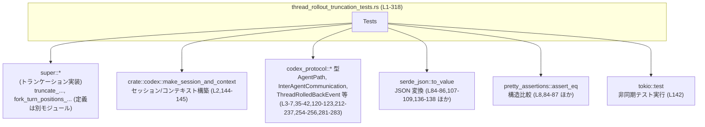
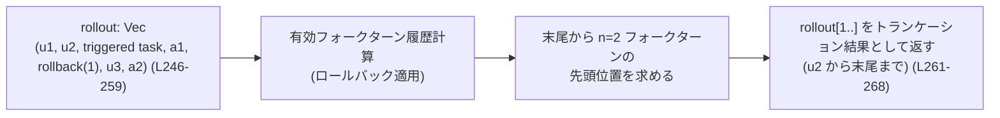

# core/src/thread_rollout_truncation_tests.rs コード解説

## 0. ざっくり一言

会話スレッドの「ロールアウト（履歴）」を、ユーザー発話・フォークターン・スレッドロールバックイベントに基づいて切り詰める関数群の**挙動を検証するテストモジュール**です（`truncate_rollout_before_nth_user_message_from_start`・`truncate_rollout_to_last_n_fork_turns`・`fork_turn_positions_in_rollout` の振る舞い確認）。  
（根拠: `core/src/thread_rollout_truncation_tests.rs:L45-317`）

---

## 1. このモジュールの役割

### 1.1 概要

- このモジュールは、スレッド履歴（`Vec<RolloutItem>`）に対する**トランケーション（切り詰め）ロジック**のテストを提供します。
- 対象となるロジックは親モジュール (`super::*`) に定義されており、ここではその公開関数の結果が期待どおりになるかを確認しています（根拠: `use super::*;` `L1`）。
- ユーザーメッセージ、アシスタントメッセージ、ツールコール、推論メッセージ、エージェント間メッセージ、スレッドロールバックイベントを含むロールアウトを構成し、様々なパターンでのトランケーションを検証します。  
  （根拠: `L47-69`, `L98-103`, `L115-127`, `L175-191`, `L204-217`, `L229-239`, `L246-259`, `L273-289`, `L302-310`）

### 1.2 アーキテクチャ内での位置づけ

このファイルは「テスト層」であり、実際のロジックは親モジュール＋外部クレートにあります。



- このテストモジュールは `super::*` から **対象関数と型（`RolloutItem`, `ResponseItem`, `EventMsg` 等）** をインポートして使用しています（`L1`）。
- `codex_protocol` クレートからは、エージェントパスやスレッドロールバックイベントなど **プロトコルレベルの型** を利用しています（`L3-7`, `L35-42`, `L120-123`, `L212-217`, `L235-237`, `L254-256`, `L281-283`）。
- `#[tokio::test]` により、セッション初期コンテキスト取得を伴う**非同期テスト**も一件含まれます（`L142-172`）。

### 1.3 設計上のポイント

- **共通ヘルパ関数によるテストデータ構築**
  - `user_msg`, `assistant_msg`, `inter_agent_msg` で `ResponseItem` を組み立てることで、テストケース内のボイラープレートを削減しています（`L10-43`）。
- **ロールアウト表現**
  - すべてのテストで、`Vec<RolloutItem>` をロールアウトとして扱い、`ResponseItem` と `EventMsg` をラップしています（`L71-75`, `L98-103`, `L115-127`, `L175-191` ほか）。
- **比較のための JSON シリアライズ**
  - 複雑な enum/構造体の比較に `serde_json::to_value` + `assert_eq!` を用い、**構造比較**を行っています（`L84-87`, `L107-110`, `L136-139`, `L168-171` ほか）。
- **スレッドロールバックとの連携を重視**
  - `ThreadRolledBackEvent { num_turns: ... }` をロールアウトに挿入し、「有効なユーザー履歴」「有効なフォークターン」を再計算する前提でトランケーションが行われることをテストしています（`L120-123`, `L212-217`, `L235-237`, `L254-256`, `L281-283`）。
- **Rust の安全性・並行性**
  - すべてのロールアウトはローカル変数として生成され、関数には参照 `&rollout` で渡されており、**所有権の移動や共有ミュータブル状態はありません**（`L77-78`, `L90`, `L105`, `L131-134`, `L157-160`, `L193`, `L219`, `L241`, `L261`, `L291`, `L312`）。
  - 非同期テストは `#[tokio::test]` のもとで単一タスクとして実行され、明示的なスレッド生成は行っていません（`L142-172`）。

---

## 2. コンポーネント一覧と主要な機能

### 2.1 このファイル内の関数インベントリ

| 名前 | 種別 | 役割 / 説明 | 行 |
|------|------|-------------|----|
| `user_msg` | ヘルパ関数 | `ResponseItem::Message` としてユーザーメッセージを生成します。 | `core/src/thread_rollout_truncation_tests.rs:L10-20` |
| `assistant_msg` | ヘルパ関数 | アシスタントメッセージの `ResponseItem::Message` を生成します。 | `L22-32` |
| `inter_agent_msg` | ヘルパ関数 | `InterAgentCommunication` を作成し、`ResponseItem` に変換します。`trigger_turn` フラグ付き（フォークターン扱い）メッセージ用です。 | `L34-43` |
| `truncates_rollout_from_start_before_nth_user_only` | テスト | `truncate_rollout_before_nth_user_message_from_start` がユーザー発話数 `n` に応じて先頭側をトランケーションする挙動を検証します。 | `L45-95` |
| `truncation_max_keeps_full_rollout` | テスト | `n = usize::MAX` のときロールアウトが変更されないことを検証します。 | `L97-111` |
| `truncates_rollout_from_start_applies_thread_rollback_markers` | テスト | スレッドロールバックイベントを適用した「有効な」ユーザー履歴に基づいてトランケーションされることを確認します。 | `L113-140` |
| `ignores_session_prefix_messages_when_truncating_rollout_from_start` | 非同期テスト | セッション共通の「prefix メッセージ」をユーザー発話のカウントから除外してトランケーションすることを検証します。 | `L142-172` |
| `truncates_rollout_to_last_n_fork_turns_counts_trigger_turn_messages` | テスト | `truncate_rollout_to_last_n_fork_turns` が `trigger_turn=true` のエージェントメッセージをフォークターンとして数えることを確認します。 | `L174-200` |
| `truncates_rollout_to_last_n_fork_turns_applies_thread_rollback_markers` | テスト | ロールバックイベントによりフォークターン履歴が巻き戻された上で末尾 `n` フォークターンが保持されることを確認します。 | `L202-225` |
| `fork_turn_positions_ignore_zero_turn_rollback_markers` | テスト | `fork_turn_positions_in_rollout` が `num_turns=0` のロールバックを無視することを確認します。 | `L227-242` |
| `truncates_rollout_to_last_n_fork_turns_discards_trigger_boundaries_in_rolled_back_suffix` | テスト | ロールバックされたサフィックスに含まれるフォーク境界が無視されることを検証します。 | `L244-269` |
| `truncates_rollout_to_last_n_fork_turns_discards_rolled_back_assistant_instruction_turns` | テスト | ロールバックにより無効になった「assistant 指示ターン」（triggered task）がフォーク履歴から除外されることを検証します。 | `L271-298` |
| `truncates_rollout_to_last_n_fork_turns_keeps_full_rollout_when_n_is_large` | テスト | `n` がフォークターン数以上の場合、ロールアウトが変更されないことを確認します。 | `L300-317` |

### 2.2 このテストが対象とする外部コンポーネント

| 名前 | 種別 | 役割 / 用途 | 参照行 |
|------|------|-------------|--------|
| `truncate_rollout_before_nth_user_message_from_start` | 関数（親モジュール） | ロールアウトの **先頭側** を、ユーザー発話数 `n_from_start` に基づきトランケーションします。返り値は `Vec<RolloutItem>` と推定されます。 | 呼び出し: `L77-78`, `L89-90`, `L105`, `L131-134`, `L157-160` |
| `truncate_rollout_to_last_n_fork_turns` | 関数（親モジュール） | ロールアウトの **末尾側** を、フォークターン（ユーザー発話＋`trigger_turn=true` のメッセージ）数 `n_from_end` に基づき残すようにトランケーションします。返り値は `Vec<RolloutItem>` と推定されます。 | 呼び出し: `L193`, `L219`, `L261`, `L291`, `L312` |
| `fork_turn_positions_in_rollout` | 関数（親モジュール） | ロールアウト中のフォークターン位置（インデックス）の一覧 `Vec<usize>` を返します。 | 呼び出し: `L241` |
| `RolloutItem` | enum/構造体（親モジュール） | `ResponseItem` や `EventMsg` をラップしてロールアウトに格納する型です。 | 利用: `L71-75`, `L97-103`, `L115-127`, `L151-155`, `L175-191`, `L204-217`, `L229-239`, `L246-259`, `L273-289`, `L302-310` |
| `ResponseItem` | enum（親モジュール） | メッセージ、推論結果、関数呼び出しなどを表します（`Message`, `Reasoning`, `FunctionCall` などのバリアントが存在）。 | 利用: `L10-19`, `L22-31`, `L53-67`, `L71-75`, `L98-103`, `L115-127`, `L146-149` |
| `EventMsg` | enum（親モジュール） | スレッドロールバックなどのイベントを表す型で、`RolloutItem::EventMsg` を通してロールアウトに入ります。 | 利用: `L120`, `L212`, `L235`, `L254`, `L281` |
| `ThreadRolledBackEvent` | 構造体（`codex_protocol::protocol`） | `num_turns` でロールバックされるターン数を表します。 | 利用: `L120-122`, `L212-214`, `L235-237`, `L254-256`, `L281-283` |
| `InterAgentCommunication` | 構造体（`codex_protocol::protocol`） | エージェント間通信メッセージを表し、`trigger_turn` フラグでフォークターンかどうかを示します。`to_response_input_item().into()` で `ResponseItem` に変換して使用しています。 | `L34-42`, `L179-182`, `L184-187`, `L207-210`, `L231-234`, `L249-252`, `L276-279`, `L305-308` |
| `AgentPath` | 構造体（`codex_protocol`） | エージェントのパスを表す型で、`root()` と `try_from` によりルートエージェントとワーカエージェントへのパスを構築しています。 | `L35-37` |
| `make_session_and_context` | 関数（`crate::codex`） | テスト用のセッションとターンコンテキストを非同期に生成します。戻り値の具体的な型はこのチャンクからは不明です。 | `L2`, `L144` |
| `serde_json::to_value` | 関数 | 任意のシリアライズ可能な値を JSON `Value` に変換し、テストで構造比較に使用します。 | `L84-86`, `L107-109`, `L136-138`, `L168-170`, `L196-198`, `L221-223`, `L265-267`, `L294-296`, `L314-316` |
| `pretty_assertions::assert_eq` | マクロ | テストで期待値と実際の値の比較に用いられ、差分表示を改善します。 | `L8`, 比較: `L84-87`, `L107-110`, `L136-139`, `L168-171`, `L196-199`, `L221-224`, `L241`, `L265-268`, `L294-297`, `L314-317` |

### 2.3 主要な機能一覧（テスト観点）

- ユーザーメッセージ数による先頭側トランケーションの検証
- フォークターン数による末尾側トランケーションの検証
- スレッドロールバックイベント適用後の「有効履歴」に対するトランケーションの挙動検証
- `num_turns=0` ロールバックの無視（フォークターン位置計算）
- セッション共通 prefix メッセージをカウントから除外する挙動の検証
- `usize::MAX` や「十分大きい n」による「トランケーションしない」ケースの検証

---

## 3. 公開 API と詳細解説

### 3.1 型一覧（外部型）

このファイル内で利用されている主要な型と、その役割を整理します（定義はすべて別モジュールです）。

| 名前 | 種別 | 役割 / 用途 | 根拠 |
|------|------|-------------|------|
| `ResponseItem` | enum | 会話中の1アイテムを表します。`Message`, `Reasoning`, `FunctionCall` などのバリアントが存在します。 | バリアント利用: `Message (L10-19,22-31)`, `Reasoning (L53-60)`, `FunctionCall (L61-67)` |
| `RolloutItem` | enum/構造体 | ロールアウト上の1アイテム。`ResponseItem` や `EventMsg` をラップします。 | `RolloutItem::ResponseItem` / `RolloutItem::EventMsg` の利用（`L71-75`, `L97-103`, `L115-127`, `L151-155`, `L175-191`, `L204-217`, `L229-239`, `L246-259`, `L273-289`, `L302-310`） |
| `EventMsg` | enum | イベントメッセージ。ここでは `ThreadRolledBack` イベントのみ使用されています。 | `RolloutItem::EventMsg(EventMsg::ThreadRolledBack(...))`（`L120`, `L212`, `L235`, `L254`, `L281`） |
| `ThreadRolledBackEvent` | 構造体 | `num_turns` フィールドで、ロールバックするターン数を表します。 | 構築: `ThreadRolledBackEvent { num_turns: 1 }` など（`L120-122`, `L212-214`, `L235-237`, `L254-256`, `L281-283`） |
| `InterAgentCommunication` | 構造体 | エージェント間通信。`trigger_turn: bool` によりフォークターンとなるメッセージを表現します。`to_response_input_item().into()` により `ResponseItem` に変換されます。 | `L34-42`, `L179-187`, `L207-210`, `L231-234`, `L249-252`, `L276-279`, `L305-308` |
| `AgentPath` | 構造体 | エージェントのパス。`root()` と `try_from` を用いてルートとワーカを指定します。 | `L35-37` |
| `ThreadRolledBackEvent::num_turns` | フィールド | ロールバックする「ターン」の数。`0` の場合はフォークターン位置計算に影響しないことがテストされています。 | `L235-237` と `L241` のテスト名・期待値 |

※ 上記型の内部構造や他のフィールドは、このチャンクには現れません。

---

### 3.2 関数詳細

ここでは「コアロジックの公開 API（親モジュールにある関数）」3つと、このファイル内のヘルパ関数3つについて詳細を整理します。

#### `truncate_rollout_before_nth_user_message_from_start(rollout: &Vec<RolloutItem>, n_from_start: usize) -> Vec<RolloutItem>`（推定シグネチャ）

※ シグネチャは、このテストファイル内での型の使われ方から推定しています（実際には `&[RolloutItem]` などの可能性もあります）。  
（根拠: `let rollout: Vec<RolloutItem>`（`L71`）から `&rollout` を渡し、戻り値を `Vec<RolloutItem>` として JSON 変換している `L77-78`, `L84-87`）

**概要**

- ロールアウトの先頭から数えて **`n_from_start` 個目までの「有効なユーザーメッセージ・ターン」** を残し、それ以降を切り落とした新しい `Vec<RolloutItem>` を返す関数と解釈できます。
- 「有効なユーザーメッセージ」は、`ThreadRolledBackEvent` によるロールバックを適用した後の履歴に対して数えられます（`L129-135` のコメントと期待値）。
- セッションの共通 prefix メッセージは、ユーザー発話のカウントから除外されます（`L142-172` の非同期テスト）。

**引数**

| 引数名 | 型 | 説明 | 根拠 |
|--------|----|------|------|
| `rollout` | `&Vec<RolloutItem>`（推定） | トランケーション対象のロールアウト全体。ユーザー・アシスタント・エージェントメッセージやロールバックイベントが含まれます。 | `&rollout` を渡している `L77-78`, `L89-90`, `L105`, `L131-134`, `L157-160` |
| `n_from_start` | `usize` | 先頭から数えて保持したい「有効なユーザーメッセージ・ターン」の数。`usize::MAX` の場合はトランケーションされないことがテストされています。 | `L77-78`, `L89-90`, `L105`, `L131-134`, `L157-160` |

**戻り値**

- `Vec<RolloutItem>`  
  元の `rollout` から **先頭側の一部をそのままコピーした新ベクタ**。元の `rollout` は変更されません（`rollout` と `expected` を別ベクタとして比較している `L79-87` など）。

**内部処理の流れ（テストから読み取れる挙動）**

コード本体は見えませんが、テストから次のような振る舞いが読み取れます。

1. 入力ロールアウトから「セッション prefix メッセージ」を認知し、**ユーザーメッセージのカウント対象からは除外**しつつ、トランケーション結果には含める（`ignores_session_prefix_messages_when_truncating_rollout_from_start` の期待値 `L161-166`）。
2. ロールアウトを走査して「有効なユーザー履歴」を構築する際、`ThreadRolledBackEvent { num_turns: k }` を見つけたら、直前の `k` ターン分を履歴から取り除く（`L129-135` のコメントと `expected = rollout_items[..7].to_vec()`）。
3. 上記の有効ユーザー履歴に対して `n_from_start` 個目までのユーザーメッセージを数え、**その次のユーザーメッセージの手前でロールアウトを切る**ような位置を決定していると考えられます（`L79-83` と `L90-93` の期待値）。

**Examples（使用例）**

テスト `truncates_rollout_from_start_before_nth_user_only` から抜粋した使用例です（`L45-95`）。

```rust
// ロールアウトの元データを ResponseItem 配列で定義
let items = [
    user_msg("u1"),                       // ユーザー
    assistant_msg("a1"),                  // アシスタント
    assistant_msg("a2"),
    user_msg("u2"),                       // 2つ目のユーザー
    assistant_msg("a3"),
    // Reasoning / FunctionCall なども含まれる
    ResponseItem::Reasoning { /* ... */ },
    ResponseItem::FunctionCall { /* ... */ },
    assistant_msg("a4"),
];

// Vec<RolloutItem> に変換
let rollout: Vec<RolloutItem> = items
    .iter()
    .cloned()
    .map(RolloutItem::ResponseItem)
    .collect();

// 先頭から 1 ユーザーターンのみ残す
let truncated =
    truncate_rollout_before_nth_user_message_from_start(&rollout, 1);

// 期待値: u1, a1, a2 まで残り、u2 以降は切り落とされる
let expected = vec![
    RolloutItem::ResponseItem(items[0].clone()),
    RolloutItem::ResponseItem(items[1].clone()),
    RolloutItem::ResponseItem(items[2].clone()),
];
```

**Errors / Panics**

- 関数自身は `Result` を返しておらず、テストでもエラー扱いはしていません（戻り値を直接使用している `L77-78`, `L89-90`）。
- このチャンクからは、どの入力で panic するかは分かりません。少なくともテストにある入力では panic しないことが間接的に確認できます。

**Edge cases（エッジケース）**

テストで明示的に確認されているケース:

- `n_from_start = 1`  
  - 1つ目のユーザーターンとその後続メッセージまで残し、それ以降をドロップする（`L77-83`, `L84-87`）。
- `n_from_start = 2` かつユーザーは2つだけ  
  - ロールアウトは変更されない（`L89-94`）。
- `n_from_start = usize::MAX`  
  - ロールアウトは変更されない（`L98-111`）。
- ロールバックイベント `ThreadRolledBackEvent { num_turns: 1 }` が存在する場合  
  - ロールバック適用後の有効ユーザー履歴に対してカウントされるため、コメントどおり `u1, u3, u4` を `1,2,3` 番目として扱い、`n_from_start=2` では `u4` の手前までを残します（`L129-135`）。
- セッション prefix メッセージが存在する場合  
  - prefix は出力には含めるが、ユーザーメッセージ `n` のカウントからは除外されます（`L142-172`）。

テストでカバーされていない点:

- `n_from_start = 0` の挙動
- `ThreadRolledBackEvent::num_turns > 1` の場合の詳細挙動

**使用上の注意点**

- 入力 `rollout` を参照で渡しており、**元のロールアウトは破壊されない**ため、呼び出し側で再利用可能です（`&rollout` を渡している `L77-78`, `L89-90`）。
- ユーザーメッセージのカウントは「ロールバック適用後」「prefix 除外後」の履歴に対して行われるため、**テストと同じ構造（ロールバックイベントを `RolloutItem::EventMsg` として挿入）**を前提にする必要があります。
- `n_from_start` が「有効な」ユーザーメッセージ数以上であれば、ロールアウトは変更されないと期待できますが、これはサイズ限定でしかテストされていません（`L97-111`）。

---

#### `truncate_rollout_to_last_n_fork_turns(rollout: &Vec<RolloutItem>, n_from_end: usize) -> Vec<RolloutItem>`（推定）

**概要**

- ロールアウト末尾から見て **`n_from_end` 個のフォークターン（ユーザー or `trigger_turn=true` メッセージ）** が含まれる最小のサフィックスを切り出して返す関数と解釈できます。
- フォークターンの履歴を計算する際に、`ThreadRolledBackEvent { num_turns: k }` によって**過去のフォークターンが巻き戻される**ことを考慮していることがテストから分かります（`L203-225`, `L245-269`, `L271-298`）。

**引数**

| 引数名 | 型 | 説明 | 根拠 |
|--------|----|------|------|
| `rollout` | `&Vec<RolloutItem>`（推定） | 対象ロールアウト。ユーザー・アシスタント・エージェントメッセージとロールバックイベントが含まれます。 | `&rollout` を渡している `L193`, `L219`, `L261`, `L291`, `L312` |
| `n_from_end` | `usize` | 末尾から維持したいフォークターン数。フォークターンはユーザーメッセージと `trigger_turn=true` メッセージが該当します。 | テスト名・内容より (`L175-191`, `L203-217`, `L245-259`, `L273-289`, `L301-310`) |

**戻り値**

- `Vec<RolloutItem>`  
  元のロールアウトの末尾サフィックスをコピーした新ベクタ。`expected = rollout[4..].to_vec()` などと比較されているため、元の `rollout` の一部分（スライス）に対応していると分かります（`L194-199`, `L263-268`, `L292-297`）。

**内部処理の流れ（テストから読み取れる挙動）**

1. ロールアウトを前から走査して、フォークターン位置の一覧を構築する。  
   - フォークターンとして扱う要素:
     - ユーザーメッセージ（`user_msg(...)` をラップしたもの）（例: `L177`, `L189`, `L205`, `L215`, `L230`, `L238`, `L247`, `L248`, `L257`, `L274`, `L303`）
     - `trigger_turn = true` の `InterAgentCommunication` メッセージ（例: `L184-187`, `L207-210`, `L231-234`, `L249-252`, `L276-279`, `L305-308`）
2. `ThreadRolledBackEvent { num_turns: k }` を見つけた場合、**フォーク履歴の末尾から k ターン分を取り除く**。  
   - たとえば `num_turns: 1` のロールバックは、直前の 1 フォークターン（ユーザー or trigger メッセージ）を無効化します（`L204-217`, `L245-259`, `L273-289` の期待挙動から推定）。
   - `num_turns: 0` は無視され、フォークターン位置計算に影響しません（`L228-242`）。
3. 有効なフォークターン位置一覧から末尾 `n_from_end` 個を取り、その先頭のインデックスをトランケーション開始位置として決定し、そこから末尾までのサフィックスを返す。  
   - 例: `counts_trigger_turn_messages` テストでは、最後の2フォークターンは「triggered task」と「u2」であり、その先頭インデックス `4` から末尾までを返しています（`L175-200`）。

**Examples（使用例）**

`truncates_rollout_to_last_n_fork_turns_counts_trigger_turn_messages` の例（`L174-200`）:

```rust
let rollout = vec![
    RolloutItem::ResponseItem(user_msg("u1")),                // フォークターン 1
    RolloutItem::ResponseItem(assistant_msg("a1")),
    RolloutItem::ResponseItem(inter_agent_msg(
        "queued message",
        false,                                                // trigger_turn = false → フォークターンではない
    )),
    RolloutItem::ResponseItem(assistant_msg("a2")),
    RolloutItem::ResponseItem(inter_agent_msg(
        "triggered task",
        true,                                                 // フォークターン 2
    )),
    RolloutItem::ResponseItem(assistant_msg("a3")),
    RolloutItem::ResponseItem(user_msg("u2")),                // フォークターン 3
    RolloutItem::ResponseItem(assistant_msg("a4")),
];

// 末尾から 2 フォークターン分 (triggered task, u2) を含む最小サフィックスを残す
let truncated = truncate_rollout_to_last_n_fork_turns(&rollout, 2);

// 期待値: インデックス 4 (triggered task) から末尾まで
let expected = rollout[4..].to_vec();
```

**Errors / Panics**

- 関数は `Result` を返さず、テストでもエラー検査を行っていません。
- フォークターンが `n_from_end` より少ない場合にも panic せず、ロールアウト全体を返すことが期待されます（`n_from_end=10` でテストしている `L300-317`）。

**Edge cases（エッジケース）**

テストで確認されているケース:

- `n_from_end = 2` でフォークターンが3つある場合、最後の2つフォークターンを含む最小サフィックスを返す（`L175-200`）。
- ロールバック `num_turns = 1` が直前のフォークターンを無効にし、その結果としてトランケーション開始位置が変わる:
  - `applies_thread_rollback_markers` では、`triggered task` がロールバックされ、フォークターンは実質 `u1`, `u2` の2つとなるため、`n_from_end=2` でもロールアウトは変更されません（`L203-225`）。
  - `discards_trigger_boundaries_in_rolled_back_suffix` では、`triggered task` とその後の `assistant_msg("a1")` がロールバックされ、`u3` が新たなフォークターンとしてカウントされます（`L245-269`）。
  - `discards_rolled_back_assistant_instruction_turns` では、`triggered task 1` がロールバックされて無効となり、`triggered task 2` のみが末尾から1つ目のフォークターンとして残されます（`L271-298`）。
- `n_from_end` が有効フォークターン数以上の場合、ロールアウトは変更されない（`L300-317`）。

テストからは分からない点:

- `n_from_end = 0` の挙動
- `ThreadRolledBackEvent::num_turns > 1` の際に複数フォークターンを巻き戻す動作の詳細

**使用上の注意点**

- ロールバックイベントをロールアウトに **含めない** 場合、この関数は過去のロールバックを考慮できないため、テストと異なる挙動になります。
- フォークターンの定義はテストから見る限り「ユーザー発話」と「`trigger_turn=true` のエージェントメッセージ」なので、**新たなフォークの種別を導入した場合は `fork_turn_positions_in_rollout` 側の対応が必要**と推測されます（実装はこのチャンクにはありません）。

---

#### `fork_turn_positions_in_rollout(rollout: &Vec<RolloutItem>) -> Vec<usize>`（推定）

**概要**

- ロールアウト中の「フォークターン」のインデックスをすべて列挙して `Vec<usize>` で返す関数です（`L241`）。
- フォークターンにはユーザーメッセージと `trigger_turn=true` のメッセージが含まれ、`ThreadRolledBackEvent` により一部が無効化されるロジックが存在すると推定されます（`L228-242`）。

**引数**

| 引数名 | 型 | 説明 |
|--------|----|------|
| `rollout` | `&Vec<RolloutItem>`（推定） | 対象ロールアウト。フォークターン位置を抽出します。 |

**戻り値**

- `Vec<usize>`  
  フォークターンのインデックスの昇順リスト。`fork_turn_positions_ignore_zero_turn_rollback_markers` テストでは `[0, 1, 3]` が期待値として与えられています（`L241`）。

**Examples（使用例）**

```rust
let rollout = vec![
    RolloutItem::ResponseItem(user_msg("u1")),                // インデックス 0 → フォークターン
    RolloutItem::ResponseItem(inter_agent_msg(
        "triggered task",
        true,                                                 // インデックス 1 → フォークターン
    )),
    RolloutItem::EventMsg(EventMsg::ThreadRolledBack(
        ThreadRolledBackEvent { num_turns: 0 },               // インデックス 2 → 影響なし
    )),
    RolloutItem::ResponseItem(user_msg("u2")),                // インデックス 3 → フォークターン
];

assert_eq!(fork_turn_positions_in_rollout(&rollout), vec![0, 1, 3]);
```

**Edge cases / 使用上の注意**

- `num_turns = 0` のロールバックイベントは **フォークターン位置に影響しない**（`L228-242`）。
- `num_turns > 0` のケースに対して本関数がどのようなリストを返すかは、このテストファイルでは直接確認されていません（ただし `truncate_rollout_to_last_n_fork_turns` の挙動から、内部的にはロールバックを考慮している可能性が高いと考えられますが、断定はできません）。

---

#### `fn user_msg(text: &str) -> ResponseItem`

**概要**

- 与えられた文字列から、`role = "user"` の `ResponseItem::Message` を生成するヘルパ関数です（`L10-20`）。

**引数**

| 引数名 | 型 | 説明 |
|--------|----|------|
| `text` | `&str` | ユーザーメッセージ本文。 |

**戻り値**

- `ResponseItem::Message`  
  - `role: "user".to_string()`  
  - `content: vec![ContentItem::OutputText { text: text.to_string() }]`  
  - `id`, `end_turn`, `phase` は `None` に設定されています（`L12-18`）。

**使用上の注意**

- `text` は `String` にコピーされるため、所有権やライフタイムに関する制約はゆるく、テストコードでは扱いやすい形になっています。
- `end_turn` や `phase` が常に `None` 固定であるため、これらのフィールドに依存したロジックのテストには別途カスタム構築が必要です。

---

#### `fn assistant_msg(text: &str) -> ResponseItem`

`user_msg` のアシスタント版です（`L22-32`）。

**概要**

- `role = "assistant"` の `ResponseItem::Message` を生成します。

**差分**

- `role` が `"assistant"` となる点以外は `user_msg` と同様です（`L24-30`）。

---

#### `fn inter_agent_msg(text: &str, trigger_turn: bool) -> ResponseItem`

**概要**

- `InterAgentCommunication::new(...)` を使用してエージェント間メッセージを生成し、それを `ResponseItem` に変換するヘルパです（`L34-43`）。
- `trigger_turn` フラグにより、このメッセージがフォークターンとして扱われるかどうかを制御します（後続テストからの推測）。

**引数**

| 引数名 | 型 | 説明 |
|--------|----|------|
| `text` | `&str` | メッセージ本文。 |
| `trigger_turn` | `bool` | `true` の場合、このメッセージはフォークターン境界となります（`L179-187`, `L207-210`, `L231-234`, `L249-252`, `L276-279`, `L305-308`）。 |

**戻り値**

- `ResponseItem`（具体的なバリアントは `to_response_input_item().into()` の戻り値に依存します。テストからは「メッセージ型」として利用されていることのみ分かります。）

**内部処理**

1. `InterAgentCommunication::new` を呼び出し、`AgentPath::root()` を送信元、`AgentPath::try_from("/root/worker")` を送信先として通信オブジェクトを作成（`L35-40`）。
2. `communication.to_response_input_item().into()` により、適切な `ResponseItem` に変換（`L42`）。

**エラー / パニック**

- `AgentPath::try_from("/root/worker").expect("agent path")` により、パス変換に失敗した場合テストは panic します（`L37`）。  
  これはテストコードとしては妥当ですが、本番コードではエラー処理が必要になる箇所です。

---

### 3.3 その他の関数（テストケース）

テストケースそれぞれの役割を簡単にまとめます。

| 関数名 | 役割（1 行） | 行 |
|--------|--------------|----|
| `truncates_rollout_from_start_before_nth_user_only` | ユーザーメッセージ数による先頭側トランケーションの基本挙動を検証します。 | `L45-95` |
| `truncation_max_keeps_full_rollout` | `n_from_start = usize::MAX` でトランケーションされないことを検証します。 | `L97-111` |
| `truncates_rollout_from_start_applies_thread_rollback_markers` | ロールバックイベントを考慮した有効ユーザー履歴を基にトランケーションされることを確認します。 | `L113-140` |
| `ignores_session_prefix_messages_when_truncating_rollout_from_start` | セッション prefix メッセージがユーザー数カウントから除外される挙動を検証します。 | `L142-172` |
| `truncates_rollout_to_last_n_fork_turns_counts_trigger_turn_messages` | `trigger_turn=true` メッセージがフォークターンとしてカウントされることを確認します。 | `L174-200` |
| `truncates_rollout_to_last_n_fork_turns_applies_thread_rollback_markers` | ロールバックによりフォークターン履歴が巻き戻されることを確認します。 | `L203-225` |
| `fork_turn_positions_ignore_zero_turn_rollback_markers` | `num_turns=0` ロールバックがフォークターン位置に影響しないことをテストします。 | `L227-242` |
| `truncates_rollout_to_last_n_fork_turns_discards_trigger_boundaries_in_rolled_back_suffix` | ロールバックされたサフィックス内のフォーク境界がトランケーション決定から除外されることを確認します。 | `L244-269` |
| `truncates_rollout_to_last_n_fork_turns_discards_rolled_back_assistant_instruction_turns` | ロールバックで無効化された assistant 指示ターンが除外されることを確認します。 | `L271-298` |
| `truncates_rollout_to_last_n_fork_turns_keeps_full_rollout_when_n_is_large` | `n_from_end` が大きすぎる場合にロールアウトが変更されないことを確認します。 | `L300-317` |

---

## 4. データフロー

ここでは代表的なシナリオとして、先頭側トランケーションのテスト `truncates_rollout_from_start_before_nth_user_only` のデータフローを示します。

### 4.1 先頭側トランケーションのシーケンス

```mermaid
sequenceDiagram
    participant T as Test: truncates_rollout_from_start_before_nth_user_only (L45-95)
    participant F as fn truncate_rollout_before_nth_user_message_from_start (親モジュール)
    participant S as serde_json::to_value

    T->>T: items: [ResponseItem; 8] を構築 (L47-69)
    T->>T: items を Vec<RolloutItem> に変換 (L71-75)
    T->>F: &rollout, n_from_start=1 を渡す (L77-78)
    F-->>T: truncated: Vec<RolloutItem> を返す
    T->>T: expected Vec<RolloutItem> を構築 (L79-83)
    T->>S: truncated を JSON にシリアライズ (L84-86)
    T->>S: expected を JSON にシリアライズ (L84-86)
    T->>T: assert_eq! で JSON 同士を比較 (L84-87)
```

要点:

- テストはまず単純な `ResponseItem` の配列を構築し、それを `Vec<RolloutItem>` にマッピングしています。
- 関数 `truncate_rollout_before_nth_user_message_from_start` はロールアウトの実体を変更せず、新しいベクタ `truncated` を返します。
- 比較は `serde_json::to_value` を通じて行われ、**構造上の完全一致**が要求されます。

### 4.2 末尾側トランケーション + ロールバックのデータフロー（概念）

`truncates_rollout_to_last_n_fork_turns_discards_trigger_boundaries_in_rolled_back_suffix` を抽象化すると次のようなフローになります（`L244-269`）。



- `B` の処理では `ThreadRolledBackEvent { num_turns: 1 }` によって `triggered task` と `a1` が無効化され、有効フォークターンは `u1`, `u2`, `u3` となると推測されます。
- `n=2` なので、末尾から 2 つのフォークターンは `u2`, `u3` であり、その先頭インデックス `1` から末尾までが返されています（`expected = rollout[1..].to_vec()` `L263-268`）。

---

## 5. 使い方（How to Use）

### 5.1 基本的な使用方法（先頭側トランケーション）

テストから導かれる典型的な使用方法です。

```rust
// 1. 会話履歴を RolloutItem ベクタとして構築する
let rollout: Vec<RolloutItem> = vec![
    RolloutItem::ResponseItem(user_msg("u1")),      // ユーザー 1
    RolloutItem::ResponseItem(assistant_msg("a1")), // アシスタント
    RolloutItem::ResponseItem(user_msg("u2")),      // ユーザー 2
    // ... 必要に応じて他のメッセージやイベントを追加
];

// 2. 先頭から 1 ユーザーターンだけ残す
let truncated = truncate_rollout_before_nth_user_message_from_start(&rollout, 1);

// 3. 戻り値は新しい Vec<RolloutItem> であり、元の rollout は変更されない
println!("original len = {}", rollout.len());
println!("truncated len = {}", truncated.len());
```

- 引数に `&rollout` を渡しているため、**所有権は呼び出し元に保持されます**（借用）。
- 戻り値を別の変数に保持しておけるので、「元の履歴」と「トランケート済み履歴」を併用することができます。

### 5.2 末尾側トランケーションの使用例

```rust
// 会話中に 2 回フォーク（ユーザー / trigger_turn=true）したと仮定
let rollout: Vec<RolloutItem> = vec![
    RolloutItem::ResponseItem(user_msg("u1")),      // フォーク 1
    RolloutItem::ResponseItem(assistant_msg("a1")),
    RolloutItem::ResponseItem(inter_agent_msg(
        "some fork",
        true,                                       // フォーク 2
    )),
    RolloutItem::ResponseItem(assistant_msg("a2")),
];

// 末尾から 1 フォークターンのみ残したい
let last_fork = truncate_rollout_to_last_n_fork_turns(&rollout, 1);

// last_fork はインデックス 2 以降 (フォーク 2 とその後続) を含むと期待されます
```

### 5.3 よくある使用パターン

- **コンテキストウィンドウの制限**  
  モデルに与えるコンテキスト長を制限するため、まず `truncate_rollout_before_nth_user_message_from_start` で古いターンを削り、その後 `truncate_rollout_to_last_n_fork_turns` で最近のフォークのみを残す、という2段階のトランケーションが考えられます（実装詳細はこのチャンクからは分かりませんが、テストから両関数が独立に利用可能であることは分かります）。

- **セッション prefix を保持したまま履歴を短縮**  
  非同期テストが示すように、`session.build_initial_context` で構築される prefix をロールアウトの先頭に置き、その後のユーザーメッセージのみをカウントする形で `truncate_rollout_before_nth_user_message_from_start` を利用できます（`L142-172`）。

### 5.4 よくある間違い（推測されるもの）

テストから想定される誤用例と正しい使用例です。

```rust
// 誤り例: ロールバックイベントをロールアウトに含めない
let rollout_without_rollback: Vec<RolloutItem> = vec![
    // ... 実際にはロールバックが発生しているのに EventMsg を入れていない
];
let truncated = truncate_rollout_to_last_n_fork_turns(&rollout_without_rollback, 2);
// → 有効フォークターン履歴が正しく反映されない可能性

// 正しい例: ThreadRolledBackEvent を EventMsg としてロールアウトに含める
let rollout_with_rollback: Vec<RolloutItem> = vec![
    // ... フォークターン
    RolloutItem::EventMsg(EventMsg::ThreadRolledBack(ThreadRolledBackEvent {
        num_turns: 1,
    })),
    // ... ロールバック後のターン
];
let truncated = truncate_rollout_to_last_n_fork_turns(&rollout_with_rollback, 2);
```

### 5.5 使用上の注意点（まとめ）

- **所有権と安全性**
  - すべての関数はロールアウトを参照で受け取り、新しい `Vec<RolloutItem>` を返すため、**元のロールアウトは不変**です（`L77-78`, `L193`, `L219`, `L261`, `L291`, `L312`）。
  - テスト内で `unsafe` は使用されておらず、Rust のメモリ安全性ルールの範囲内で実装されていると考えられます（このファイルの範囲内で観測できる限り）。
- **エラー処理**
  - テストコードでは `unwrap()` や `expect()` を多用しており、失敗時は panic します（`L37`, `L84-86` など）。これはテストでは許容されるパターンです。
- **並行性**
  - `#[tokio::test]` による非同期テスト以外、明示的な並列処理やスレッド生成は行っていません（`L142-172`）。  
    非同期テストも単一の async 関数内であり、共有ミュータブル状態は見当たりません。
- **未カバーの引数パターン**
  - `n_from_start` や `n_from_end` の `0` や極端に大きい値以外の境界ケース、`ThreadRolledBackEvent::num_turns > 1` などはテストされていません。このため、そのような入力時の挙動はこのチャンクからは判断できません。

---

## 6. 変更の仕方（How to Modify）

### 6.1 新しい機能を追加する場合（テスト追加）

- **新しいトランケーションルールを追加**した場合:
  1. 親モジュール（`super::*`）側で関数や振る舞いを実装。
  2. 本ファイルに対応するテストケースを追加し、`user_msg` / `assistant_msg` / `inter_agent_msg` を活用してシナリオを構築します。
  3. ロールバックやフォークターンの位置づけに関する仕様が変わる場合は、コメントで意図を明記すると読みやすくなります（テスト内コメントと同様に `L129-130` など）。

- **新しいイベント種別を導入**する場合:
  - `RolloutItem::EventMsg` の新バリアントがトランケーションに影響するなら、その影響を検証するテストをここに追加するのが自然です。

### 6.2 既存の機能を変更する場合（仕様変更に応じたテスト修正）

- 仕様変更の影響範囲:
  - `truncate_rollout_before_nth_user_message_from_start` や `truncate_rollout_to_last_n_fork_turns` の仕様を変更する場合、このファイル内の関連テスト（名称に関数名が含まれるもの）はすべて再確認が必要です。
- 注意すべき契約（前提条件・返り値の意味）:
  - ユーザーメッセージ/フォークターンのカウントルール
  - ロールバックイベントの解釈（何を「1ターン」とみなすか）
  - セッション prefix メッセージの扱い（カウントに含めるかどうか）
- 修正手順の例:
  1. 親モジュールの実装を変更。
  2. このテストファイルの期待値（`expected` ベクタやコメント）を新仕様に合わせて更新。
  3. `cargo test` 等でテストを実行し、変更が意図どおり反映されていることを確認。

---

## 7. 関連ファイル

このチャンクに名前は出てきませんが、役割やインポートから推測される関連モジュールを列挙します（ファイルパスは明示されていないものは不明と記載します）。

| パス / モジュール | 役割 / 関係 |
|-------------------|------------|
| 親モジュール (`super`; ファイル名はこのチャンクには現れません) | `truncate_rollout_before_nth_user_message_from_start`, `truncate_rollout_to_last_n_fork_turns`, `fork_turn_positions_in_rollout`, `RolloutItem`, `ResponseItem`, `EventMsg` などの実装を提供します（`L1`, `L71-75`, `L77-78`, `L193`, `L219`, `L241` などから推定）。 |
| `crate::codex::make_session_and_context` を定義するモジュール | テスト用にセッションとターンコンテキストを構築し、`build_initial_context` を通じてセッション prefix メッセージを提供します（`L2`, `L144-145`）。具体的なファイルパスはこのチャンクからは不明です。 |
| `codex_protocol::protocol` を含むクレート | `InterAgentCommunication`, `ThreadRolledBackEvent` など、ロールアウト上のイベント・エージェント間通信を表現する型を提供します（`L3-7`, `L35-42`, `L120-123`, `L212-217`, `L235-237`, `L254-256`, `L281-283`）。 |
| `tokio` クレート | `#[tokio::test]` マクロを通じて非同期テストのランタイムを提供します（`L142`）。 |
| `serde` / `serde_json` | `serde_json::to_value` による JSON 変換を提供し、複雑な型の比較を容易にしています（`L84-86` ほか）。 |
| `pretty_assertions` | `assert_eq!` マクロのラッパーとして、差分が見やすいアサーションを提供します（`L8`, 比較箇所多数）。 |

このファイルはあくまで「テストコード」であり、実際のアルゴリズムは親モジュール側にあります。そのため、本レポートで記した挙動は**テストでカバーされている範囲に限定**されます。
