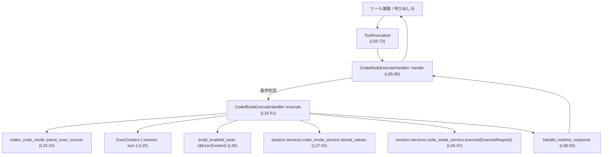
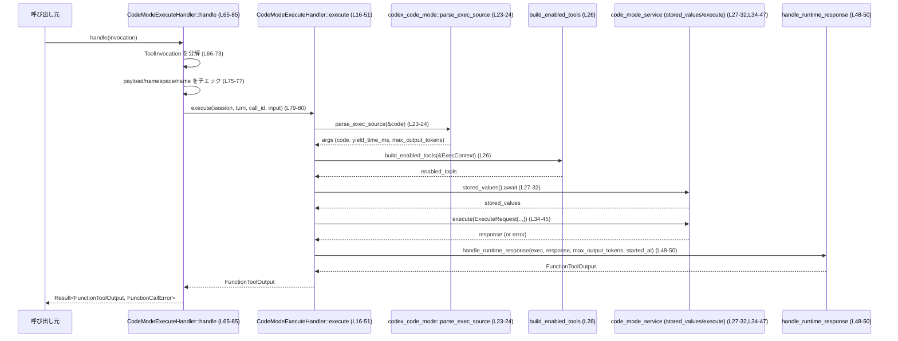

# core/src/tools/code_mode/execute_handler.rs コード解説

## 0. ざっくり一言

このファイルは、「コードモード」向けの実行ツール `CodeModeExecuteHandler` を定義し、ツール呼び出し（`ToolInvocation`）をコードモード実行サービスに橋渡しする非同期ハンドラを提供します。

---

## 1. このモジュールの役割

### 1.1 概要

- このモジュールは、ツール実行基盤から渡される `ToolInvocation` を受け取り、  
  コードモード用サービス（`code_mode_service`）に対する実行リクエストに変換して呼び出す責務を持ちます。  
- 入力文字列（エラー文言から、「生の JavaScript ソーステキスト」が想定されていることが分かります）をパースし、  
  実行に必要なコンテキスト（有効なツール一覧・保存済み値など）を組み立てて実行します。

### 1.2 アーキテクチャ内での位置づけ

このファイルだけから読み取れる依存関係を簡略化した図です。



- 呼び出し元は `ToolInvocation` を生成し、`ToolHandler` トレイト経由で `CodeModeExecuteHandler::handle` を呼び出す構造になっています（L54-65）。
- 実際のコード実行は `session.services.code_mode_service.execute` が担い、このハンドラはその前後処理とエラー変換に専念しています（L34-47, L48-50）。

### 1.3 設計上のポイント

- **ステートレスなハンドラ**  
  `CodeModeExecuteHandler` はフィールドを持たない空構造体で、状態を内部に保持しません（L13）。  
  共有状態はすべて `session` や `turn` など外部オブジェクト経由で扱われます。
- **非同期処理と共有ポインタ**  
  `execute` と `handle` は `async fn` で、`session` / `turn` は `Arc` で共有されます（L16-21, L18-19, L65）。  
  これにより、複数の非同期タスクから同じセッション情報を安全に共有できる設計になっています。
- **一元的なエラー型**  
  すべての失敗は `FunctionCallError` にマッピングされます（L1, L22, L47, L50, L65, L81-83）。  
  下位層のエラーは `FunctionCallError::RespondToModel` 経由でラップされます（L24, L47, L50, L81-83）。
- **ツール種別とマッチ条件の明確化**  
  このハンドラは `ToolKind::Function` として登録され（L57-59）、  
  `ToolPayload::Custom` かつ特定ツール名 `PUBLIC_TOOL_NAME` の呼び出しだけを処理対象とします（L61-63, L75-80）。

---

## 2. 主要な機能一覧

- コードモード実行ハンドラの定義: `CodeModeExecuteHandler` 構造体（L13）。
- コード実行のコアロジック: 非公開メソッド `execute` によるコードモードサービス呼び出し（L16-51）。
- ツール種別の識別: `kind` による `ToolKind::Function` の返却（L57-59）。
- ペイロード種別チェック: `matches_kind` による `ToolPayload::Custom` のフィルタリング（L61-63）。
- ツール呼び出し処理入口: `handle` による `ToolInvocation` のパターンマッチと `execute` の起動（L65-85）。

---

## 3. 公開 API と詳細解説

### 3.1 型一覧（構造体など）— コンポーネントインベントリー

#### 本ファイルで定義される型

| 名前 | 種別 | 役割 / 用途 | 定義箇所 |
|------|------|-------------|----------|
| `CodeModeExecuteHandler` | 構造体 | コードモード実行ツールのハンドラ。`ToolHandler` を実装し、コードモードサービスへのブリッジとなる | `core/src/tools/code_mode/execute_handler.rs:L13-85` |

#### 他モジュール由来で、このファイルで重要な型

※ 定義は他ファイルにあります。ここでは本ファイルでの役割のみを記載します。

| 名前 | 種別 | 本ファイル内での役割 | このファイルでの出現箇所 |
|------|------|----------------------|---------------------------|
| `FunctionCallError` | エラー型 | ツール実行時のエラーを表現し、下位エラーを `RespondToModel` 変種でラップする | `core/src/tools/code_mode/execute_handler.rs:L1-1,22,24,47,50,65,81-83` |
| `FunctionToolOutput` | 型（詳細不明） | ツール呼び出しの出力型。`execute` と `handle` の成功時戻り値として使用 | `core/src/tools/code_mode/execute_handler.rs:L2,22,55` |
| `ToolInvocation` | 構造体 | ツール呼び出しコンテキスト。`handle` で分解され、セッション等が取り出される | `core/src/tools/code_mode/execute_handler.rs:L3,65-73` |
| `ToolPayload` | 列挙体（少なくとも `Custom` 変種を持つ） | ツールへの入力ペイロード。`Custom { input }` の場合のみこのハンドラで処理 | `core/src/tools/code_mode/execute_handler.rs:L4,61-63,75-77` |
| `ToolHandler` | トレイト | ツールハンドラ共通のインターフェース。`kind`・`matches_kind`・`handle` などを要求 | `core/src/tools/code_mode/execute_handler.rs:L5,54-85` |
| `ToolKind` | 列挙体 | ツールの種別。ここでは `Function` が返される | `core/src/tools/code_mode/execute_handler.rs:L6,57-59` |
| `ExecContext` | 構造体 | `session` と `turn` をまとめた実行コンテキストとして利用される | `core/src/tools/code_mode/execute_handler.rs:L8,25,26,34,48` |

> `ExecContext` には `session`・`turn` フィールドが存在することが、構造体リテラルから分かります（L25）。その他のフィールドの有無は、このチャンクからは分かりません。

---

### 3.2 関数詳細

#### `CodeModeExecuteHandler::execute(&self, session: Arc<Session>, turn: Arc<TurnContext>, call_id: String, code: String) -> Result<FunctionToolOutput, FunctionCallError>`

**概要**

- コードモードの「実行」を行う非公開メソッドです（L16-22）。
- 入力のコード文字列をパースし、実行コンテキストを構築して `code_mode_service.execute` を呼び出し、  
  結果を `handle_runtime_response` で処理して `FunctionToolOutput` として返します（L23-50）。

**引数**

| 引数名 | 型 | 説明 | 根拠 |
|--------|----|------|------|
| `&self` | `&CodeModeExecuteHandler` | ハンドラ自身への参照。状態は持たないため、借用のみ | L16 |
| `session` | `Arc<crate::codex::Session>` | コードモードサービスなどにアクセスするためのセッション情報 | L18, L27-38 |
| `turn` | `Arc<crate::codex::TurnContext>` | 対話ターンのコンテキスト（詳細はこのチャンクには現れません） | L19, L25 |
| `call_id` | `String` | ツール呼び出しID。`ExecuteRequest.tool_call_id` に引き渡される | L20, L39 |
| `code` | `String` | ツールへの入力コード文字列。`parse_exec_source` に渡される | L21, L23-24 |

**戻り値**

- `Result<FunctionToolOutput, FunctionCallError>`（L22）  
  - `Ok(FunctionToolOutput)` : 実行が成功し、処理済みの出力が得られた場合。  
  - `Err(FunctionCallError)` : パース・実行・レスポンス処理のいずれかでエラーが発生した場合。

**内部処理の流れ**

```text
code(String) → parse_exec_source → ExecContext構築 → 有効ツール一覧の取得
→ stored_valuesの取得 → ExecuteRequest構築 → code_mode_service.execute
→ handle_runtime_response → FunctionToolOutput
```

ステップごとに見ると:

1. **入力コードのパース**  
   - `codex_code_mode::parse_exec_source(&code)` を呼び出し（L23-24）、  
     返り値を `args` に束縛します。  
   - エラー時は `map_err(FunctionCallError::RespondToModel)` でラップし、早期 `Err` を返します（L24）。

2. **実行コンテキストの構築**  
   - `ExecContext { session, turn }` を作成し、`exec` に格納します（L25）。  
   - これにより、以降の処理は `exec` 経由でセッションやコンテキストにアクセスします。

3. **有効ツール一覧の取得**  
   - `build_enabled_tools(&exec).await` を呼び出して `enabled_tools` を取得します（L26）。

4. **保存済み値の取得**  
   - `exec.session.services.code_mode_service.stored_values().await` を呼び出し（L27-32）、  
     実行に必要な `stored_values` を取得します。

5. **タイムスタンプの取得**  
   - `let started_at = std::time::Instant::now();` で開始時刻を記録します（L33）。  
     後続の `handle_runtime_response` に渡されます（L48）。

6. **実行リクエストの送信**  
   - `codex_code_mode::ExecuteRequest` 構造体を組み立て（L38-45）、  
     `code_mode_service.execute(...)` を `await` します（L34-47）。  
   - エラー時は再度 `FunctionCallError::RespondToModel` でラップされます（L47）。

7. **レスポンス処理**  
   - `handle_runtime_response(&exec, response, args.max_output_tokens, started_at)` を `await` し（L48-50）、  
     その結果を `FunctionCallError::RespondToModel` でラップしつつ呼び出し元へ返します（L50）。

**Examples（使用例）**

このメソッドは非公開であり、通常は `handle` 経由で呼び出されます。  
以下はコンセプトとしての利用イメージです（実際の型定義は他ファイルに依存するため疑似コードです）。

```rust
// 疑似コード: 実際には Session / TurnContext の生成方法はこのチャンクからは分かりません。
use std::sync::Arc;

// handler の生成
let handler = CodeModeExecuteHandler;

// どこかから取得された session / turn（詳細は別モジュール）
let session: Arc<crate::codex::Session> = /* ... */;
let turn: Arc<crate::codex::TurnContext> = /* ... */;

let call_id = "call-123".to_string();        // ツール呼び出しID
let code = "/* JavaScript source code */".to_string(); // 入力コード

// 非同期コンテキスト内で実行
let output: FunctionToolOutput = handler
    .execute(session, turn, call_id, code)
    .await?;
```

> 実際のコードベースがどの非同期ランタイム（tokio など）を利用しているかは、このチャンクからは分かりません。

**Errors / Panics**

- `Err(FunctionCallError::RespondToModel(_))` が返る条件（コードから分かる範囲）:
  - `codex_code_mode::parse_exec_source` がエラーを返した場合（L23-24）。
  - `code_mode_service.execute(...)` がエラーを返した場合（L34-47）。
  - `handle_runtime_response(...)` がエラーを返した場合（L48-50）。
- この関数内に `unwrap` や `expect` はなく、panic 条件は読み取れません。

**Edge cases（エッジケース）**

コードから直接分かるのは「エラーが返るタイミング」だけです。

- `code` が不正なフォーマットの場合  
  - `parse_exec_source` がエラーを返す可能性があり、そのまま `Err(FunctionCallError::RespondToModel(_))` になります（L23-24）。
- `stored_values` や `enabled_tools` が空の場合  
  - それ自体はエラーにはならず `ExecuteRequest` に渡されます（L26-27, L40-42）。  
    それが許容されるかどうかは `code_mode_service.execute` の実装次第で、このチャンクからは分かりません。
- `yield_time_ms` や `max_output_tokens` が極端な値（0 や非常に大きい値）の場合  
  - 値はそのまま `ExecuteRequest` 経由で渡されるだけで、この関数内で検証されていません（L43-44）。  
    妥当性チェックの有無は他モジュール側の実装に依存します。

**使用上の注意点**

- `session` と `turn` は必ず `Arc` で渡す必要があります（L18-19）。  
  これにより所有権を移動させつつ、他タスクと安全に共有できます。
- `code` には、エラー文言から「生の JavaScript ソーステキスト」が想定されていることが分かります（L81-83）。  
  それ以外の形式を渡した場合の挙動（パース成功の可否）は、このチャンクからは判断できません。
- 高頻度で呼び出すと、`stored_values().await` や `execute().await` による I/O/計算コストがそのまま積み上がります。  
  パフォーマンス上の詳細は `code_mode_service` の実装に依存します。

---

#### `CodeModeExecuteHandler::kind(&self) -> ToolKind`

**概要**

- このハンドラが扱うツールの種別を `ToolKind::Function` として返します（L57-59）。

**引数**

| 引数名 | 型 | 説明 |
|--------|----|------|
| `&self` | `&CodeModeExecuteHandler` | ハンドラ自身への参照 |

**戻り値**

- `ToolKind::Function`（L58）  
  他のツール種別との違いは `ToolKind` の定義に依存し、このチャンクには現れません。

**内部処理**

- 単に `ToolKind::Function` を返すのみで、副作用はありません（L57-59）。

**Errors / Panics**

- 発生しません（単純な列挙値の返却のみ）。

**使用上の注意点**

- `ToolHandler` 実装としてフレームワーク側から呼び出されることを前提としており、  
  通常ユーザーコードから直接呼び出す必要はありません。

---

#### `CodeModeExecuteHandler::matches_kind(&self, payload: &ToolPayload) -> bool`

**概要**

- このハンドラが処理対象とするペイロード種別かどうかを判定します（L61-63）。
- `ToolPayload::Custom { .. }` の場合に `true` を返し、それ以外は `false` を返します。

**引数**

| 引数名 | 型 | 説明 |
|--------|----|------|
| `&self` | `&CodeModeExecuteHandler` | ハンドラへの参照 |
| `payload` | `&ToolPayload` | 処理対象かどうかを確認したいツールペイロード |

**戻り値**

- `bool`  
  - `true`: `ToolPayload::Custom { .. }` の場合（L61-63）。  
  - `false`: それ以外のバリアントの場合。

**内部処理**

- `matches!(payload, ToolPayload::Custom { .. })` で単純にパターンマッチを行います（L61-63）。

**Errors / Panics**

- 発生しません（パターンマッチのみ）。

**Edge cases**

- `ToolPayload` に `Custom` 以外の変種が追加されても、この関数は常にそれらを `false` と判定します。  
  追加のバリアントをこのハンドラで処理したい場合は、この条件を変更する必要があります。

**使用上の注意点**

- ペイロードの「中身」はここでは判定に使われていません。  
  中身の検証は `execute` とその下位処理側で行われます（`input` が `code` として渡されるのは `handle` 内、L76-80）。

---

#### `CodeModeExecuteHandler::handle(&self, invocation: ToolInvocation) -> Result<Self::Output, FunctionCallError>`

**概要**

- `ToolHandler` トレイトにおけるメインの入口となるメソッドです（L65-85）。
- `ToolInvocation` から必要な情報を取り出し、  
  「ツール名・ネームスペース・ペイロードの型」が条件を満たす場合にのみ `execute` を呼び出します。

**引数**

| 引数名 | 型 | 説明 |
|--------|----|------|
| `&self` | `&CodeModeExecuteHandler` | ハンドラ自身への参照 |
| `invocation` | `ToolInvocation` | セッション、ターンコンテキスト、ツール名、ペイロードなどを含む呼び出し情報（L65-73） |

**戻り値**

- `Result<FunctionToolOutput, FunctionCallError>`（`Self::Output` は `FunctionToolOutput` に束縛済み、L55）。  
  - 条件に合うペイロードが `execute` によって成功裏に処理された場合: `Ok(FunctionToolOutput)`。  
  - 条件不一致または内部エラーの場合: `Err(FunctionCallError::RespondToModel(_))`（L79-83）。

**内部処理の流れ**

1. **構造体分解**  
   - `ToolInvocation { session, turn, call_id, tool_name, payload, .. } = invocation;` でフィールドを取り出します（L66-73）。

2. **パターンマッチによる分岐**（L75-83）

   - **条件分岐のパターン**（L75-77）
     - `payload` が `ToolPayload::Custom { input }` であること。
     - `tool_name.namespace.is_none()` であること（ネームスペースなし）。
     - `tool_name.name.as_str() == PUBLIC_TOOL_NAME` であること（ツール名が定数と一致）。

   - 条件をすべて満たす場合:
     - `self.execute(session, turn, call_id, input).await` を呼び出し、その結果をそのまま返す（L79-80）。

   - 条件を満たさない場合:
     - `Err(FunctionCallError::RespondToModel(format!("{PUBLIC_TOOL_NAME} expects raw JavaScript source text")))`  
       を返します（L81-83）。

**Examples（使用例）**

概念的な呼び出し例です。`ToolInvocation` や関連型のコンストラクタはこのチャンクには現れないため、擬似コードとして示します。

```rust
// 疑似コード: 実際の ToolInvocation / ToolName / ToolPayload のコンストラクタは別モジュール定義
use std::sync::Arc;

async fn invoke_code_mode(handler: &CodeModeExecuteHandler) -> Result<FunctionToolOutput, FunctionCallError> {
    // どこか別の場所で構築されたセッションとターンコンテキスト
    let session: Arc<crate::codex::Session> = /* ... */;
    let turn: Arc<crate::codex::TurnContext> = /* ... */;

    // ツール名。namespace は None、name は PUBLIC_TOOL_NAME と一致させる必要がある（L70-77）
    let tool_name = /* ToolName { namespace: None, name: PUBLIC_TOOL_NAME.into(), ... } */;

    let invocation = ToolInvocation {
        session,
        turn,
        call_id: "call-123".into(),
        tool_name,
        payload: ToolPayload::Custom { input: "/* JS */".into() },
        // その他のフィールドは .. で省略（L72-73）
        .. /* 既定値 or 他のフィールド */
    };

    handler.handle(invocation).await
}
```

**Errors / Panics**

- 条件不一致時（ペイロードやツール名が想定と違う場合）:
  - `Err(FunctionCallError::RespondToModel(format!("{PUBLIC_TOOL_NAME} expects raw JavaScript source text")))` を返します（L81-83）。
- 条件一致時:
  - `execute` 内で前述のエラー条件が発生すると、その `Err` がそのまま伝播します（L79-80）。
- panic を起こしうるコード（`unwrap` 等）は含まれていません。

**Edge cases（エッジケース）**

- `ToolPayload` が `Custom` 以外の場合  
  - 無条件で上記エラーメッセージ付きの `Err` になります（L75, L81-83）。
- `tool_name.namespace` が `Some(_)` の場合  
  - ツール名が正しくても、ネームスペースが付いているだけでエラーになります（L77）。
- `tool_name.name` が `PUBLIC_TOOL_NAME` と一致しない場合  
  - ネームスペースが `None` でもエラーになります（L77, L81-83）。

**使用上の注意点**

- このハンドラを経由して処理させたい場合は、  
  - `ToolPayload::Custom { input }` を使うこと（L75-77）。  
  - `tool_name.namespace` を `None` にすること（L77）。  
  - `tool_name.name` を `PUBLIC_TOOL_NAME` に合わせること（L77）。  
  という契約を満たす必要があります。
- エラーメッセージはユーザー（または上位システム）に返されうるため、  
  不適切なツール構成で呼び出すと「raw JavaScript source text を期待している」というメッセージが出る点に注意が必要です（L81-83）。

---

### 3.3 その他の関数

- このチャンクには、上記 4 つ以外に新たな関数・メソッド定義はありません。

---

## 4. データフロー

ここでは、「正しいペイロードが渡された場合」の典型的なフローを示します。



- 行番号付きラベルは、このファイル内の定義位置を示します。
- すべての I/O と思われる処理（`stored_values().await`, `execute().await`）は非同期で行われ、  
  上位呼び出し元は `handle` の `await` を通じて結果を受け取ります。

---

## 5. 使い方（How to Use）

### 5.1 基本的な使用方法

実際には、ツールフレームワーク側が `ToolHandler` 実装を登録して呼び出すと考えられますが、  
このチャンクから分かる範囲での典型的なフローを示します。

```rust
// 疑似コード: 実際のフレームワーク初期化方法はこのチャンクには現れません。

use core::tools::code_mode::execute_handler::CodeModeExecuteHandler;
use crate::tools::context::{ToolInvocation, ToolPayload};
use std::sync::Arc;

#[tokio::main] // ここでは tokio を例にしているだけで、本コードベースが tokio を使うかは不明です。
async fn main() -> Result<(), FunctionCallError> {
    let handler = CodeModeExecuteHandler; // フィールドなしなのでそのまま値を作れる（L13）

    // session, turn などは別の箇所で用意される（このチャンクからは不明）
    let session: Arc<crate::codex::Session> = /* ... */;
    let turn: Arc<crate::codex::TurnContext> = /* ... */;

    let tool_name = /* namespace: None, name: PUBLIC_TOOL_NAME */;

    let invocation = ToolInvocation {
        session,
        turn,
        call_id: "call-123".into(),
        tool_name,
        payload: ToolPayload::Custom {
            input: "/* JavaScript source code */".into(),
        },
        .. /* その他のフィールド */
    };

    let output: FunctionToolOutput = handler.handle(invocation).await?;
    // output の具体的な構造は、このチャンクからは分かりません

    Ok(())
}
```

> 上記は、このファイルから読み取れるインターフェースを元にした概念的な例です。  
> 実際の `ToolInvocation`・`ToolName` の構築方法やランタイム構成は別モジュールに依存します。

### 5.2 よくある使用パターン（推定されるもの）

コードから確実に読み取れるパターンだけを列挙すると、次のようになります。

- **単一ツールとしての利用**  
  - `tool_name.namespace` を `None` にし、`tool_name.name` を `PUBLIC_TOOL_NAME` と一致させる（L70-77）。
  - ペイロードは常に `ToolPayload::Custom { input }` を使用する（L75-77）。
- **多ツール環境でのフィルタリング**  
  - フレームワーク側で複数の `ToolHandler` を登録している場合、  
    `kind` と `matches_kind` によって、このハンドラは「Custom ペイロードの Function 型ツール」として識別されます（L57-63）。

### 5.3 よくある間違い（起こりうる誤用）

コード上明らかにエラーになるパターンを対比します。

```rust
// 誤り例: namespace を Some にしてしまう
// tool_name.namespace = Some("code_mode".into());
// → handle 内の条件により _ パターンに落ち、エラー文字列を返す（L77, L81-83）

// 正しい例: namespace は None にする
// tool_name.namespace = None;

// 誤り例: payload を Custom 以外のバリアントにする
// payload = ToolPayload::Json { value: json!(...) };
// → matches_kind も handle もこのハンドラとしては受け付けない（L61-63, L75-83）

// 正しい例: Custom で input を渡す
// payload = ToolPayload::Custom { input: "/* JS */".into() };
```

### 5.4 使用上の注意点（まとめ）

- **契約条件**
  - `handle` で処理させるには、`ToolPayload::Custom` かつ `namespace == None` かつ `name == PUBLIC_TOOL_NAME` である必要があります（L70-77）。
- **エラー・メッセージ**
  - 条件不一致時のエラーメッセージは固定で、  
    `"{PUBLIC_TOOL_NAME} expects raw JavaScript source text"` が返されます（L81-83）。
- **並行性**
  - `session` と `turn` は `Arc` に包まれているため、複数タスク間で安全に共有する設計になっています（L18-19）。  
    `CodeModeExecuteHandler` 自体もフィールドを持たないため、スレッド間で共有しても内部状態競合は発生しません。
- **テスト**
  - このチャンクにはテストコードは含まれていません。  
    テストの有無・場所は他ファイルを確認する必要があります。

---

## 6. 変更の仕方（How to Modify）

### 6.1 新しい機能を追加する場合

このファイルのみを見た場合に考えられる変更の入口は次のとおりです。

- **別名のツールでも同じ処理を受け付けたい**
  - `handle` の `match` パターン（L75-77）に条件を追加・変更することで対応可能です。
- **処理対象ペイロードの拡張**
  - 例えば `ToolPayload` の他のバリアントも受け付けたい場合は、`matches_kind`（L61-63）と  
    `handle` の `match payload`（L75-83）を合わせて変更する必要があります。
- **追加のコンテキスト情報を ExecContext に渡したい**
  - `ExecContext` の定義と、このファイル内の `ExecContext { session, turn }`（L25）を両方変更する必要があります。  
    ただし、`ExecContext` の定義はこのチャンクにはないため、別ファイル側の影響も確認する必要があります。

### 6.2 既存の機能を変更する場合の注意点

- **エラー型の契約**
  - すべてのエラーが `FunctionCallError` に統一されている点（L22, L47, L50, L65, L81-83）を変える場合、  
    呼び出し元とのインターフェース契約に影響します。
- **タイミング計測**
  - `started_at`（L33）と `handle_runtime_response`（L48-50）の関係を変える際は、  
    レスポンス処理側で時間計測やタイムアウト管理をしている可能性を念頭に置く必要があります（詳細はこのチャンクには現れません）。
- **非同期チェーン**
  - `await` の位置を変える・削除することは、処理順序や並列性に影響します。  
    現状は `parse → build_enabled_tools → stored_values → execute → handle_runtime_response` の順で直列に実行されています（L23-50）。

---

## 7. 関連ファイル

このチャンクから参照されている主な関連モジュール・ファイルと、その関係を整理します。

| パス / モジュール | 役割 / 関係（このチャンクから分かる範囲） |
|------------------|-------------------------------------------|
| `crate::function_tool` | `FunctionCallError` を提供し、ツール実行時のエラー型として使用されます（L1, L22, L24, L47, L50, L65, L81-83）。 |
| `crate::tools::context` | `FunctionToolOutput`, `ToolInvocation`, `ToolPayload` など、ツール実行コンテキスト関連の型を提供します（L2-4, L55, L61-63, L65-73, L75-77）。 |
| `crate::tools::registry` | `ToolHandler`, `ToolKind` を提供し、ツールハンドラの共通インターフェースと種別を定義します（L5-6, L54-59）。 |
| `super::ExecContext` | セッションとターンコンテキストをまとめる実行コンテキスト構造体として使われます（L8, L25-26, L34, L48）。定義はこのチャンクには現れません。 |
| `super::build_enabled_tools` | `ExecContext` を元に「有効なツール一覧」を構築する非同期関数です（L10, L26）。戻り値の具体的な型はこのチャンクには現れません。 |
| `super::handle_runtime_response` | 実行結果 (`response`) と開始時刻を受け取り、`FunctionToolOutput` に変換する非同期関数として使用されます（L11, L48-50）。内部処理はこのチャンクからは分かりません。 |
| `codex_code_mode` | `parse_exec_source` と `ExecuteRequest` を提供する外部モジュールで、入力コードのパースと実行リクエスト構築に利用されます（L23-24, L38-45）。 |

---

### Bugs / Security（このチャンクから読み取れる範囲）

- **明確なバグ**  
  - このチャンクだけから、明確なロジックバグやコンパイルエラーになる箇所は読み取れません。
- **セキュリティ上の懸念（条件付き）**  
  - エラーメッセージから、このツールが「raw JavaScript source text」を処理対象としていることが分かります（L81-83）。  
    実際に JavaScript を実行するのであれば、サンドボックス化やリソース制限などが必要となる可能性がありますが、  
    それがどのように実装されているかは、このチャンクからは分かりません。

### Contracts / Edge Cases（契約とエッジケースのまとめ）

- **契約**
  - `handle` の契約:  
    - `ToolPayload::Custom` かつ `namespace == None` かつ `name == PUBLIC_TOOL_NAME` の場合のみ `execute` が呼ばれる（L75-80）。
  - `execute` の契約:  
    - `parse_exec_source`・`code_mode_service.execute`・`handle_runtime_response` が返す `Err` を  
      すべて `FunctionCallError::RespondToModel` に変換して返す（L24, L47, L50）。
- **エッジケース**
  - 不正なコードや極端なパラメータ値に対しての詳細な挙動は、下位モジュール側に委譲されており、このチャンクからは分かりません。  
  - 少なくとも、これらのエラーは外側からは `FunctionCallError` として一貫して扱える設計になっています。

### Performance / Scalability（簡潔なコメント）

- 本ファイル内は主に下位サービス呼び出しのオーケストレーションであり、大きな計算処理は見られません（L23-50）。
- ボトルネックやスケーラビリティは `code_mode_service` や `codex_code_mode` の実装に依存します。

### Observability

- ロギングやメトリクス収集に関するコードはこのチャンクには現れません。  
  `handle_runtime_response` が何らかの観測機能を担っている可能性はありますが、  
  その実態はこのファイルからは判断できません。
