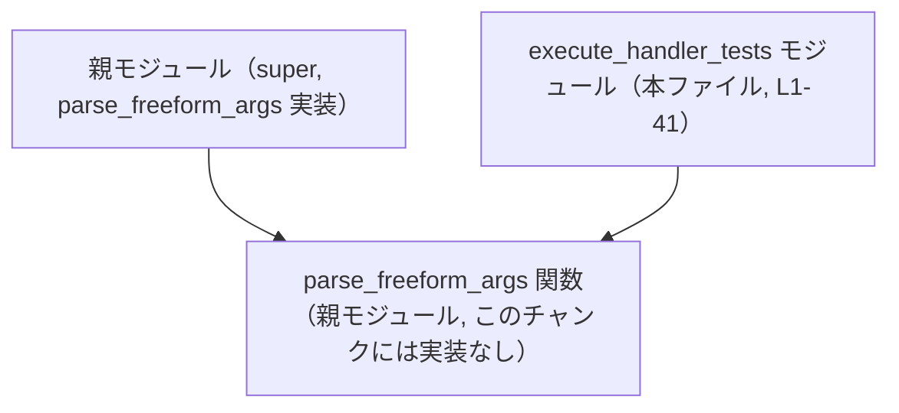
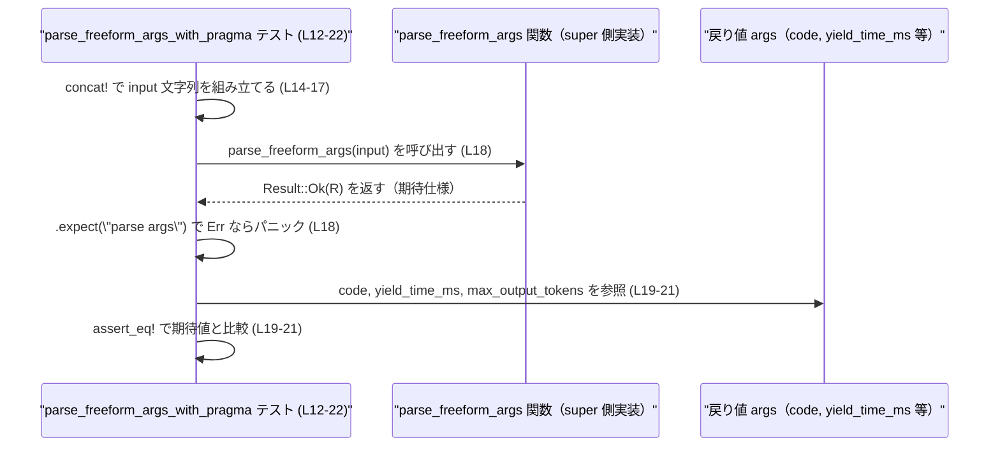

# core/src/tools/code_mode/execute_handler_tests.rs コード解説

## 0. ざっくり一言

`parse_freeform_args` 関数が、`// @exec: {...}` という「exec プラグマ」付き／なしの入力文字列を正しくパースできているか、成功・失敗の代表ケースを検証するテストモジュールです（`core/src/tools/code_mode/execute_handler_tests.rs:L1-41`）。

---

## 1. このモジュールの役割

### 1.1 概要

- このモジュールは、親モジュール (`super`) に定義されている `parse_freeform_args` 関数の振る舞いをテストします（`L1`）。
- 特に、`// @exec: {...}` という形式の「実行時設定プラグマ」を
  - まったく含まない場合（純粋なコードのみ）
  - 正しいキーを含む JSON 形式のプラグマを含む場合
  - 未知のキーを含むプラグマ
  - JavaScript ソースが続かないプラグマ
  でどのように扱うかを確認します（`L4-40`）。
- これにより、コード実行機構（おそらく外部コード実行ハンドラ）の引数解析仕様が壊れていないかを担保しています。

### 1.2 アーキテクチャ内での位置づけ

このファイルは `super::parse_freeform_args` を `use` しているため（`L1`）、親モジュール側に実装が存在し、このテストモジュールはそれに依存する構造になっています。



- 実際のコード実行ロジックや `parse_freeform_args` の実装本体は、このチャンクには含まれていません（`L1-41` には定義が存在しません）。
- 本ファイルは純粋にテストのみを定義しており、プロダクションコードには直接コンパイル・リンクされないテストモジュールであると解釈できます。

### 1.3 設計上のポイント

- **責務の分離**
  - 入力文字列の解析そのものは親モジュールの `parse_freeform_args` に委ね、ここではその振る舞いの検証のみを行っています（`L5-9, L13-21, L25-31, L35-40`）。
- **エラーハンドリングのテスト方針**
  - 正常系では `.expect("parse args")` で `Result` の `Ok` を前提とし（`L6, L18`）、異常系では `.expect_err("expected error")` を用いて `Err` が返ることを明示的に検証しています（`L26-27, L36`）。
  - `expect_err` は `Result` 型に対するメソッドであるため、`parse_freeform_args` の戻り値が `Result<_, _>` であることが分かります。
- **アサーション**
  - 成功時は、戻り値（`args` 変数）のフィールド `code`, `yield_time_ms`, `max_output_tokens` の値を `pretty_assertions::assert_eq` で比較しています（`L7-9, L19-21`）。
  - `pretty_assertions` を使うことで、テスト失敗時に差分が読みやすくなる設計になっています（`L2`）。
- **安全性・並行性**
  - `unsafe` ブロックやスレッド生成などは使用されておらず、このチャンクに現れるコードはすべて安全なシングルスレッドのテストコードです（`L1-41`）。

---

## 2. 主要な機能一覧

このモジュールがテストしている主な振る舞いは次のとおりです。

- プラグマなし入力の解析:
  - `"output_text('ok');"` のように `// @exec:` を含まないコードを渡した場合、`code` がそのまま格納され、追加パラメータは設定されないことを検証（`L4-10`）。
- 正常な exec プラグマ付き入力の解析:
  - 先頭行に `// @exec: {"yield_time_ms": 15000, "max_output_tokens": 2000}` を持つ入力が、対応するフィールドに `Some(15000)`, `Some(2000)` を設定して返ることを検証（`L12-22`）。
- 未知のキーを含む exec プラグマの拒否:
  - `{"nope": 1}` のような未知キーを含むプラグマに対し、特定のエラーメッセージを伴う `Err` を返すことを検証（`L24-32`）。
- JavaScript ソース欠如時のエラー:
  - プラグマ行のみで、その後に JavaScript ソース行が続かない場合に、特定のエラーメッセージを伴う `Err` を返すことを検証（`L34-40`）。

### 2.1 コンポーネント一覧（インベントリー）

このチャンクに現れる関数・依存コンポーネントの一覧です。

| 名前 | 種別 | 役割 / 用途 | 定義 / 参照位置 |
|------|------|-------------|-----------------|
| `parse_freeform_args` | 関数（親モジュールからのインポート） | 入力文字列の先頭にある exec プラグマと、その後続の JavaScript ソースを解析し、コード本体と実行パラメータを返す / エラーを返す | 参照: `core/src/tools/code_mode/execute_handler_tests.rs:L1, L6, L18, L26, L36`（実装はこのチャンクには存在しない） |
| `assert_eq` | マクロ（`pretty_assertions`） | 期待値と実際の値を比較し、異なれば詳細な差分を表示してテストを失敗させる | 使用: `L2, L7-9, L19-21, L28-31, L37-40` |
| `parse_freeform_args_without_pragma` | テスト関数 | プラグマなし入力の正常系挙動を検証する | 定義: `L4-10` |
| `parse_freeform_args_with_pragma` | テスト関数 | 正しい exec プラグマ付き入力の正常系挙動を検証する | 定義: `L12-22` |
| `parse_freeform_args_rejects_unknown_key` | テスト関数 | 未知キー付き exec プラグマをエラーとして扱うことを検証する | 定義: `L24-32` |
| `parse_freeform_args_rejects_missing_source` | テスト関数 | exec プラグマの後に JavaScript ソースが無い場合にエラーを返すことを検証する | 定義: `L34-40` |

---

## 3. 公開 API と詳細解説

### 3.1 型一覧（構造体・列挙体など）

このファイル内で新たに定義されている型（構造体・列挙体など）はありません（`L1-41`）。

ただし、テストコードから次のような戻り値の構造が推測できます（**推測であり、型名などはこのチャンクからは判別できません**）。

- `parse_freeform_args` の `Ok` 側の戻り値（ここでは `args` 変数）には、少なくとも次のフィールドが存在します（`L7-9, L19-21`）。
  - `code`: 解析された JavaScript コード文字列
  - `yield_time_ms`: 実行の「待ち時間」などをミリ秒で示すオプション値
  - `max_output_tokens`: 出力トークン数の上限を示すオプション値
- エラー型は `to_string()` で人間向けメッセージが得られることがテストされています（`L28-31, L37-40`）。

### 3.2 関数詳細

ここではテスト関数を通じて、`parse_freeform_args` の仕様として確認されている契約（Contract）を整理します。

#### `parse_freeform_args_without_pragma() -> ()`

**概要**

- プラグマを含まない純粋なコード文字列を `parse_freeform_args` に渡した場合の正常挙動を検証します（`L4-10`）。

**引数**

- 引数はありません。テスト関数内で文字列リテラルを直接渡しています。

**戻り値**

- 戻り値型は Rust のテスト関数の慣習どおり `()` です。
- 内部では `parse_freeform_args` の戻り値 `Result<_, _>` に対して `.expect("parse args")` を呼び出し、`Ok` であることを前提としています（`L6`）。

**内部処理の流れ**

1. `"output_text('ok');"` というコードだけの文字列を `parse_freeform_args` に渡します（`L6`）。
2. `parse_freeform_args` の結果が `Err` であれば `expect` によりテストがパニックします。
3. `Ok(args)` の場合、`args.code` が元の文字列と一致することを確認します（`L7`）。
4. `args.yield_time_ms` が `None` であることを確認します（`L8`）。
5. `args.max_output_tokens` が `None` であることを確認します（`L9`）。

**Errors / Panics**

- `parse_freeform_args` が `Err` を返した場合、このテストは `"parse args"` というメッセージでパニックします（`L6`）。
- 期待したフィールド値と異なる場合も `assert_eq!` によりテスト失敗（パニック）となります（`L7-9`）。

**Edge cases（エッジケース）**

- プラグマが一切含まれない場合、追加の実行設定はすべて `None` であることが期待されます（`L8-9`）。
- このテストからは、空文字や複数行のコードなど、その他のケースについては分かりません。

**使用上の注意点**

- `parse_freeform_args` をプラグマなしのコードに対して使用する際は、このテストが示すように `yield_time_ms` と `max_output_tokens` が未設定（`None`）である前提で後続処理を設計する必要があります。

---

#### `parse_freeform_args_with_pragma() -> ()`

**概要**

- 正しい形式の exec プラグマを含む入力文字列に対する `parse_freeform_args` の正常挙動を検証します（`L12-22`）。

**引数**

- 引数はありません。

**戻り値**

- 戻り値型は `()` です。内部で `parse_freeform_args` の `Result` に対して `.expect("parse args")` を呼び出します（`L18`）。

**内部処理の流れ**

1. `concat!` マクロで 2 行の文字列を連結し、`input` 文字列を生成します（`L14-17`）。
   - 1 行目: `// @exec: {"yield_time_ms": 15000, "max_output_tokens": 2000}\n`
   - 2 行目: `output_text('ok');`
2. 生成した `input` を `parse_freeform_args` に渡し、`Ok(args)` を前提として `.expect("parse args")` を呼びます（`L18`）。
3. `args.code` が `"output_text('ok');"` であることを確認します（`L19`）。
4. `args.yield_time_ms` が `Some(15_000)` であることを確認します（`L20`）。
5. `args.max_output_tokens` が `Some(2_000)` であることを確認します（`L21`）。

**Errors / Panics**

- `parse_freeform_args` が `Err` を返すとテストは `"parse args"` メッセージでパニックします（`L18`）。
- 期待値と異なれば `assert_eq!` によりパニックします（`L19-21`）。

**Edge cases（エッジケース）**

- プラグマ行とコード行の区切りは改行（`\n`）であることが前提になっていることが分かります（`L15-16`）。
- このテストからは、複数のプラグマ行やプラグマの位置変更などのケースについては分かりません。

**使用上の注意点**

- exec プラグマは JSON 形式で指定される前提です（`L15`）。
- 少なくとも `yield_time_ms` と `max_output_tokens` の 2 つのキーはサポートされていることがこのテストから読み取れます（`L15, L20-21`）。

---

#### `parse_freeform_args_rejects_unknown_key() -> ()`

**概要**

- exec プラグマの JSON に未知のキー（ここでは `"nope"`）が含まれている場合に、`parse_freeform_args` がエラーを返すことを検証します（`L24-32`）。

**引数**

- 引数はありません。

**戻り値**

- 戻り値型は `()` です。内部で `parse_freeform_args` の `Err` 側を期待しています（`L26-27`）。

**内部処理の流れ**

1. `parse_freeform_args` に `"// @exec: {\"nope\": 1}\noutput_text('ok');"` を渡します（`L26`）。
2. `.expect_err("expected error")` を呼び、`Err(err)` を前提とします（`L26-27`）。
3. 取得した `err` に対して `to_string()` を呼び出し、エラーメッセージが次の文字列と完全一致することを `assert_eq!` で確認します（`L28-31`）。

   ```text
   exec pragma only supports `yield_time_ms` and `max_output_tokens`; got `nope`
   ```

**Errors / Panics**

- `parse_freeform_args` が `Ok` を返した場合、このテストは `"expected error"` というメッセージでパニックします（`L26-27`）。
- エラーメッセージが一致しない場合も `assert_eq!` によりパニックします（`L28-31`）。

**Edge cases（エッジケース）**

- エラーメッセージから、exec プラグマでサポートされるキーが `yield_time_ms` と `max_output_tokens` のみに限定されていることが示されています（`L30`）。
- 未知キー名はエラーメッセージ内でそのまま表示される（ここでは `nope`）ことが分かります（`L30`）。

**使用上の注意点**

- 新たなキーをプラグマでサポートしたい場合、このエラーメッセージを更新し、このテストも合わせて変更する必要があると考えられます（仕様変更が伴うため）。

---

#### `parse_freeform_args_rejects_missing_source() -> ()`

**概要**

- exec プラグマの後に JavaScript ソース行が存在しない場合のエラー挙動を検証します（`L34-40`）。

**引数**

- 引数はありません。

**戻り値**

- 戻り値型は `()` です。内部で `parse_freeform_args` の `Err` を期待しています（`L36`）。

**内部処理の流れ**

1. `parse_freeform_args` に `"// @exec: {\"yield_time_ms\": 10}"` を渡します（`L36`）。
   - ここではプラグマ行のみで、改行や後続のコードは含まれていません。
2. `.expect_err("expected error")` を呼び、`Err(err)` を前提とします（`L36`）。
3. `err.to_string()` の結果が、次の文字列と完全一致することを `assert_eq!` で確認します（`L37-40`）。

   ```text
   exec pragma must be followed by JavaScript source on subsequent lines
   ```

**Errors / Panics**

- `parse_freeform_args` が `Ok` を返した場合、このテストは `"expected error"` というメッセージでパニックします（`L36`）。
- エラーメッセージが一致しない場合もパニックします（`L37-40`）。

**Edge cases（エッジケース）**

- exec プラグマ行の後に少なくとも 1 行以上の JavaScript ソースが続くことが必須である、という契約が確認できます（`L36-40`）。
- 空行しか続かない場合や、スペースのみの行が続く場合の扱いは、このテストからは分かりません。

**使用上の注意点**

- プラグマ行だけを単独で送っても意味がないことが明示されており、使用者は必ずソースコード行を続ける必要があります。

---

### 3.3 その他の関数

- このファイルには、上記 4 つのテスト以外の関数やメソッドは定義されていません（`L1-41`）。

---

## 4. データフロー

ここでは、`parse_freeform_args_with_pragma` テスト（`L12-22`）を例に、入力からアサーションまでのデータフローを示します。

1. テスト関数内で 2 行からなる入力文字列 `input` が組み立てられます（`L14-17`）。
2. `input` が `parse_freeform_args` に渡されます（`L18`）。
3. `parse_freeform_args` は `Result<ArgsLike, E>` のような型を返し、`Ok(args)` を前提として `.expect` が呼ばれます（`L18`）。
4. `args` のフィールド `code`, `yield_time_ms`, `max_output_tokens` がテスト内で読み出され、期待値（リテラル）と比較されます（`L19-21`）。



- 同様に、エラー系テストでは `Result::Err(err)` が返ることが期待され、`.expect_err("expected error")` を通じて `err` が取り出され、`to_string()` 経由でメッセージ比較が行われます（`L26-31, L36-40`）。

---

## 5. 使い方（How to Use）

ここでは、このテストが示している `parse_freeform_args` の想定される使い方を整理します。**実際の関数シグネチャやモジュールパスはこのチャンクからは分からないため、擬似的な例として理解してください。**

### 5.1 基本的な使用方法

プラグマなしのシンプルなコードを解析するパターンです（`L4-10` を元にしています）。

```rust
// 親モジュール側で定義されている関数をインポートする
use super::parse_freeform_args;

fn example_without_pragma() {
    // プラグマを含まない JavaScript コード行
    let input = "output_text('ok');";                      // テストと同じコード（L6）

    // 解析を実行し、エラーならパニックさせる
    let args = parse_freeform_args(input).expect("parse args");

    // 解析結果の利用例
    assert_eq!(args.code, "output_text('ok');");           // コード本体（L7）
    assert_eq!(args.yield_time_ms, None);                  // 追加設定は None（L8）
    assert_eq!(args.max_output_tokens, None);              // 同上（L9）
}
```

### 5.2 よくある使用パターン

#### exec プラグマ付きでパラメータを指定する

`yield_time_ms` と `max_output_tokens` を指定してコードを実行したい場合の例です（`L12-22`）。

```rust
use super::parse_freeform_args;

fn example_with_pragma() {
    // 先頭行に exec プラグマ、次行以降に JavaScript ソースを書く（L14-17）
    let input = concat!(
        "// @exec: {\"yield_time_ms\": 15000, \"max_output_tokens\": 2000}\n",
        "output_text('ok');",
    );

    let args = parse_freeform_args(input).expect("parse args");

    // プラグマとコードが正しく分離されていることを想定
    assert_eq!(args.code, "output_text('ok');");           // コード本体（L19）
    assert_eq!(args.yield_time_ms, Some(15_000));          // プラグマ由来の設定（L20）
    assert_eq!(args.max_output_tokens, Some(2_000));       // 同上（L21）
}
```

### 5.3 よくある間違い

テストから読み取れる「誤用例」と、その結果として得られるエラーの例です。

```rust
use super::parse_freeform_args;

fn wrong_unknown_key() {
    // 間違い例: 未知のキー `nope` を指定している（L26）
    let err = parse_freeform_args("// @exec: {\"nope\": 1}\noutput_text('ok');")
        .expect_err("expected error");

    // エラー内容を確認
    assert_eq!(
        err.to_string(),                                   // エラーの文字列表現（L28-30）
        "exec pragma only supports `yield_time_ms` and `max_output_tokens`; got `nope`"
    );
}

fn wrong_missing_source() {
    // 間違い例: プラグマの後に JavaScript ソースを置いていない（L36）
    let err = parse_freeform_args("// @exec: {\"yield_time_ms\": 10}")
        .expect_err("expected error");

    // エラー内容を確認
    assert_eq!(
        err.to_string(),                                   // エラーの文字列表現（L37-39）
        "exec pragma must be followed by JavaScript source on subsequent lines"
    );
}
```

### 5.4 使用上の注意点（まとめ）

テストから読み取れる契約（Contracts）と注意点をまとめます。

- **前提条件 / 契約**
  - exec プラグマは `// @exec: { ... }` の形式で、少なくとも `yield_time_ms` と `max_output_tokens` がサポートされていることがエラーメッセージに明示されています（`L30`）。
  - exec プラグマ行の後には JavaScript ソースが「後続行に」続く必要があります（`L36-40`）。
- **禁止事項・誤用**
  - 未知のキーを含む JSON をプラグマに指定するとエラーになります（`L24-32`）。
  - プラグマ行だけを送ることもエラーになります（`L34-40`）。
- **エラー処理**
  - `parse_freeform_args` は `Result` を返すため、実際のアプリケーションコードでは `.expect` ではなく `match` や `?` 演算子などでエラーを適切に処理する設計が望まれます（テストでは簡略化のため `.expect` を使用）。
- **並行性**
  - この関数の使用例・テストからは並列実行やスレッド安全性に関する情報は読み取れません。このチャンクに登場するコードはすべて単純な同期処理です（`L1-41`）。

---

## 6. 変更の仕方（How to Modify）

### 6.1 新しい機能を追加する場合

たとえば、exec プラグマで新しい設定キーをサポートする機能追加を想定します。

1. **親モジュール側の実装変更**
   - `parse_freeform_args` の実装に新しいキーを解釈するロジックを追加します（実装はこのチャンクにはありません）。
   - 未知キー扱いの条件分岐を変更し、新キーを既知キーとして扱うようにします。
2. **テストの追加**
   - 本ファイルに、新しいキーを含むプラグマが正常に受理されることを確認するテストを追加します。
   - 既存の `parse_freeform_args_rejects_unknown_key` テストのエラーメッセージは、新しい仕様に合わせて修正が必要です（`L28-31`）。
3. **エッジケースのテスト**
   - 新しいキーのみを指定した場合、既存キーと組み合わせた場合、無効な値を渡した場合などの追加テストを検討します。

### 6.2 既存の機能を変更する場合

例として、「プラグマの後にソースがなくてもエラーにしない」よう仕様変更する場合を考えます。

- **影響範囲の確認**
  - `parse_freeform_args_rejects_missing_source` テスト（`L34-40`）が失敗するため、この仕様を維持するか変更するかの判断が必要です。
  - エラーメッセージ `"exec pragma must be followed by JavaScript source on subsequent lines"` を利用している他のコードがないか、プロジェクト全体で検索する必要があります。
- **契約の更新**
  - プラグマとソースの関係を示す「契約」が変わるため、それを前提としている他の処理（例えば「必ず code フィールドは非空」など）がないか確認します。
- **テストの修正**
  - 挙動変更に合わせて、エラー期待から成功期待にテストを書き換える、あるいは削除・置き換えます。

---

## 7. 関連ファイル

このチャンクから分かる範囲での関連ファイル・モジュールです。

| パス / モジュール | 役割 / 関係 |
|-------------------|------------|
| 親モジュール（`super`） | `parse_freeform_args` 関数の実装を持つモジュールです。本ファイルは `use super::parse_freeform_args;` でこれを参照しています（`core/src/tools/code_mode/execute_handler_tests.rs:L1`）。具体的なファイル名はこのチャンクからは分かりません。 |
| `pretty_assertions` クレート | `assert_eq!` マクロを提供し、テスト失敗時の差分を見やすくするために利用されています（`L2`）。 |

※ `parse_freeform_args` の正確な実装位置（ファイル名やモジュール階層）は、このチャンクには現れていないため「不明」です。ファイル名からは `execute_handler` 関連のモジュールであることが推測されますが、断定はできません。
