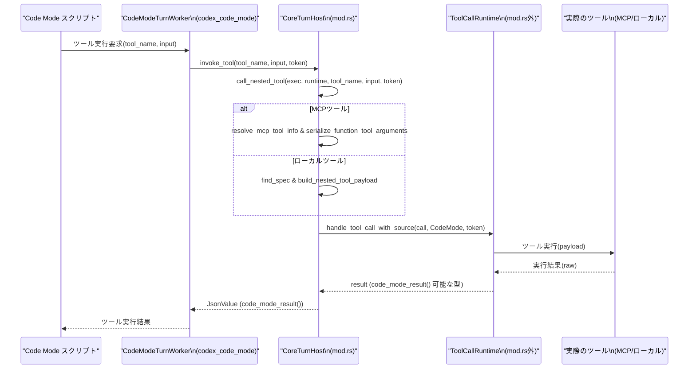

# core/src/tools/code_mode/mod.rs

## 0. ざっくり一言

Code Mode 用のランタイム (`codex_code_mode`) をこのコアシステム（Session / ToolRouter / MCP ツール群）にブリッジし、  
コードモード用ワーカーの起動、ネストされたツール呼び出し、実行結果の整形・トークン制限・ステータス付与を行うモジュールです。

> 注: この回答ではファイルの行番号情報が提供されていないため、根拠位置は  
> `core/src/tools/code_mode/mod.rs:L?-?` のように「行番号不明」として記載します。

---

## 1. このモジュールの役割

### 1.1 概要

このモジュールは **Code Mode ランタイム (`codex_code_mode`) をコアのツール実行基盤に接続する**ために存在し、主に次の機能を提供します。

- `codex_code_mode::CodeModeService` の薄いラッパーとして、コードモードワーカーの起動や実行エントリポイントを提供します。  
  （`CodeModeService` / `CodeModeExecuteHandler` / `CodeModeWaitHandler`）  
  `core/src/tools/code_mode/mod.rs:L?-?`
- Code Mode ランタイムからの **ネストされたツール呼び出し**を `ToolRouter` / `ToolCallRuntime` / MCP ツールに橋渡しします。  
  （`CoreTurnHost::invoke_tool` → `call_nested_tool`）  
  `core/src/tools/code_mode/mod.rs:L?-?`
- ランタイムの `RuntimeResponse` を UI / Function ツール用の `FunctionToolOutput` に変換し、  
  ステータス行・経過時間を挿入しつつトークン数に基づいて出力をトランケートします。  
  （`handle_runtime_response`, `truncate_code_mode_result`）  
  `core/src/tools/code_mode/mod.rs:L?-?`

### 1.2 アーキテクチャ内での位置づけ

このモジュールの主要コンポーネント同士、および外部モジュールとの依存関係は次のようになります。

```mermaid
graph LR
    subgraph Core[core crate]
        S[Session]:::core
        T[TurnContext]:::core
        TR[ToolRouter]:::core
        RT[ToolCallRuntime]:::core
    end

    subgraph CodeModeCore[code_mode/mod.rs]
        CMS[CodeModeService]:::this
        ECtx[ExecContext]:::this
        Host[CoreTurnHost<br/>(CodeModeTurnHost)]:::this
    end

    subgraph Ext[codex_code_mode crate]
        CMInner[codex_code_mode::CodeModeService]:::ext
        CMW[CodeModeTurnWorker]:::ext
    end

    S --> CMS
    T --> CMS

    CMS --> CMInner
    CMS -->|start_turn_worker| CMW
    CMW -->|invoke_tool/notify| Host
    Host --> ECtx
    Host --> RT

    ECtx --> S
    ECtx --> T

    CMS -->|build_enabled_tools| TR
    RT -->|handle_tool_call_with_source| TR

    classDef this fill:#eef,stroke:#447;
    classDef core fill:#efe,stroke:#484;
    classDef ext fill:#fee,stroke:#844;
```

（すべて `core/src/tools/code_mode/mod.rs:L?-?` 内のコードと、外部クレート／モジュールの関係です。）

### 1.3 設計上のポイント

コードから読み取れる設計上の特徴を整理します。

- **薄いラッパー設計**  
  - `CodeModeService` は `codex_code_mode::CodeModeService` を内包し、メソッドはほぼ委譲のみです。  
    `core/src/tools/code_mode/mod.rs:L?-?`
- **コンテキストの束ね役**  
  - `ExecContext` に `Arc<Session>` と `Arc<TurnContext>` をまとめ、複数関数／ホスト実装で再利用しています。  
    `core/src/tools/code_mode/mod.rs:L?-?`
- **ホストインターフェースの実装**  
  - `CoreTurnHost` が `CodeModeTurnHost` トレイトを実装し、Code Mode ランタイムからの
    - ツール呼び出し → `call_nested_tool`
    - 通知（中間結果メッセージ） → `Session::inject_response_items`
    を仲介します。  
    `core/src/tools/code_mode/mod.rs:L?-?`
- **ツール呼び出しの2系統サポート**  
  - MCP ツール (`ToolPayload::Mcp`) とローカルツール (`ToolPayload::Function` / `Custom`) を切り分けます。  
    `call_nested_tool`, `build_nested_tool_payload` ほか  
- **入力検証とエラーの文字列化**  
  - 関数ツールには JSON オブジェクトのみ、Freeform ツールには文字列のみを受け付けるなど、  
    入力の JSON 形状を検査し、不正な場合は人間可読なエラーメッセージを返します。  
    `serialize_function_tool_arguments`, `build_freeform_tool_payload`
- **非同期 & キャンセル対応**  
  - 主要な操作はすべて `async fn` で定義され、`CancellationToken` を `ToolCallRuntime` に渡してキャンセルを伝播します。  
    `CoreTurnHost::invoke_tool`, `call_nested_tool`
- **出力トランケーション戦略**  
  - トークン数ベースの `TruncationPolicy::Tokens` を利用し、純テキストと混在コンテンツで処理を切り替えています。  
    `truncate_code_mode_result`

---

## 2. 主要な機能一覧

このモジュールが提供する主な機能を整理します。

- **コードモードサービスのラップ**:  
  `CodeModeService` による `execute` / `wait` / `stored_values` / `replace_stored_values` の委譲。  
- **コードモードワーカーの起動**:  
  `CodeModeService::start_turn_worker` による Code Mode 用ワーカーの生成と `CoreTurnHost` の接続。  
- **コードモードからのネストされたツール呼び出し**:  
  `CoreTurnHost::invoke_tool` → `call_nested_tool` による MCP / ローカルツール実行。  
- **コードモード通知のセッションへの注入**:  
  `CoreTurnHost::notify` により、ランタイムからのテキスト通知を `Session::inject_response_items` に転送。  
- **ランタイムレスポンスの変換**:  
  `handle_runtime_response` が `RuntimeResponse` を `FunctionToolOutput` に変換し、ステータス・経過時間の付与とトークン制限を実施。  
- **利用可能なネストツール一覧の構築**:  
  `build_enabled_tools` / `build_nested_router` による Code Mode から利用可能なツール定義の収集。  
- **ツール種別ごとの Payload 構築**:  
  `build_nested_tool_payload` 以下の関数群による Function / Freeform / MCP ツール用の `ToolPayload` 生成と入力検証。  

---

## 3. 公開 API と詳細解説

### 3.1 型・コンポーネント一覧

#### 3.1.1 型一覧（構造体など）

| 名前 | 種別 | 可視性 | 役割 / 用途 | 定義位置 |
|------|------|--------|-------------|----------|
| `ExecContext` | 構造体 | `pub(crate)` | `Session` と `TurnContext` の `Arc` を束ね、Code Mode 実行時のコンテキストとして利用 | `core/src/tools/code_mode/mod.rs:L?-?` |
| `CodeModeService` | 構造体 | `pub(crate)` | `codex_code_mode::CodeModeService` のラッパー。ワーカー起動や実行エントリポイントを提供 | `core/src/tools/code_mode/mod.rs:L?-?` |
| `CoreTurnHost` | 構造体 | 非公開 | `CodeModeTurnHost` を実装し、Code Mode ランタイムとコアシステム間の橋渡しを行うホスト | `core/src/tools/code_mode/mod.rs:L?-?` |

#### 3.1.2 モジュール・再エクスポート

| 名前 | 種別 | 可視性 | 役割 / 用途 | 定義位置 |
|------|------|--------|-------------|----------|
| `execute_handler` | モジュール | 非公開 | コードモード用「execute」ツールハンドラ（詳細は本チャンクには現れない） | `core/src/tools/code_mode/mod.rs:L?-?` |
| `wait_handler` | モジュール | 非公開 | コードモード用「wait」ツールハンドラ（詳細は本チャンクには現れない） | 同上 |
| `response_adapter` | モジュール | 非公開 | Code Mode の `content_items` を `FunctionCallOutputContentItem` に変換するユーティリティ（`into_function_call_output_content_items` を提供） | 同上 |
| `CodeModeExecuteHandler` | 型（再エクスポート） | `pub(crate)` | `execute_handler` モジュールから再エクスポートされる Code Mode 実行ツールハンドラ | 同上 |
| `CodeModeWaitHandler` | 型（再エクスポート） | `pub(crate)` | `wait_handler` モジュールから再エクスポートされる Code Mode 待機ツールハンドラ | 同上 |

#### 3.1.3 定数

| 名前 | 種別 | 可視性 | 役割 / 用途 | 定義位置 |
|------|------|--------|-------------|----------|
| `PUBLIC_TOOL_NAME` | `&'static str` | `pub(crate)` | Code Mode 用公開ツール名（`codex_code_mode::PUBLIC_TOOL_NAME` のラップ） | `core/src/tools/code_mode/mod.rs:L?-?` |
| `WAIT_TOOL_NAME` | `&'static str` | `pub(crate)` | Code Mode 用待機ツール名 | 同上 |
| `DEFAULT_WAIT_YIELD_TIME_MS` | `u64` | `pub(crate)` | Wait ツールのデフォルト yield 時間（ミリ秒） | 同上 |

#### 3.1.4 関数・メソッド一覧（インベントリー）

| 名前 | 種別 | 主な役割 | 定義位置 |
|------|------|----------|----------|
| `CodeModeService::new` | `fn` | Code Mode サービスの生成（現在は `PathBuf` 引数は未使用で、内部サービスをデフォルト構築） | `core/src/tools/code_mode/mod.rs:L?-?` |
| `CodeModeService::stored_values` | `async fn` | 内部 Code Mode サービスに保存された値（`HashMap<String, JsonValue>`）を取得 | 同上 |
| `CodeModeService::replace_stored_values` | `async fn` | 保存値を丸ごと置き換える | 同上 |
| `CodeModeService::execute` | `async fn` | Code Mode スクリプトの実行を委譲 | 同上 |
| `CodeModeService::wait` | `async fn` | Code Mode 実行の wait 処理を委譲 | 同上 |
| `CodeModeService::start_turn_worker` | `async fn` | Code Mode 用のターンワーカーを起動し、`CoreTurnHost` を接続 | 同上 |
| `CoreTurnHost::invoke_tool` | `async fn` | Code Mode からのツール呼び出しを `call_nested_tool` に委譲 | 同上 |
| `CoreTurnHost::notify` | `async fn` | Code Mode からの通知メッセージを `Session::inject_response_items` に注入 | 同上 |
| `handle_runtime_response` | `async fn` | `RuntimeResponse` を `FunctionToolOutput` に変換し、ステータスとトランケーションを適用 | 同上 |
| `format_script_status` | `fn` | `RuntimeResponse` からスクリプト状態メッセージを構築 | 同上 |
| `prepend_script_status` | `fn` | 出力コンテンツ先頭にステータスと経過時間のヘッダを挿入 | 同上 |
| `truncate_code_mode_result` | `fn` | Code Mode 出力コンテンツをトークン数でトランケート | 同上 |
| `build_enabled_tools` | `async fn` | Code Mode から利用可能なツール定義を収集 | 同上 |
| `build_nested_router` | `async fn` | Code Mode 用ネストツールのみを対象とした `ToolRouter` を構築 | 同上 |
| `call_nested_tool` | `async fn` | Code Mode からの単一ツール呼び出しを実際のツール実行に結びつける | 同上 |
| `tool_kind_for_spec` | `fn` | `ToolSpec` から Code Mode 上のツール種別（Function / Freeform）を決定 | 同上 |
| `tool_kind_for_name` | `fn` | ツール名と `ToolSpec` からツール種別を解決し、未有効時にはエラー文字列を生成 | 同上 |
| `build_nested_tool_payload` | `fn` | ツール種別に応じて `ToolPayload` を構築 | 同上 |
| `build_function_tool_payload` | `fn` | Function ツール用の `ToolPayload::Function` を構築 | 同上 |
| `serialize_function_tool_arguments` | `fn` | Function ツールの JSON 引数を検査・シリアライズ | 同上 |
| `build_freeform_tool_payload` | `fn` | Freeform ツール用の `ToolPayload::Custom` を構築 | 同上 |

---

### 3.2 関数詳細（主要 7 件）

#### 1. `CodeModeService::start_turn_worker(...) -> Option<codex_code_mode::CodeModeTurnWorker>`

```rust
pub(crate) async fn start_turn_worker(
    &self,
    session: &Arc<Session>,
    turn: &Arc<TurnContext>,
    router: Arc<ToolRouter>,
    tracker: SharedTurnDiffTracker,
) -> Option<codex_code_mode::CodeModeTurnWorker> { /* ... */ }
```

**概要**

- Code Mode 機能が有効なターンに対して、Code Mode ランタイムのターンワーカーを起動します。
- このとき、`CoreTurnHost` を作成し、ツール実行環境（`ToolCallRuntime`）と `Session` / `TurnContext` を紐付けます。  
  `core/src/tools/code_mode/mod.rs:L?-?`

**引数**

| 引数名 | 型 | 説明 |
|--------|----|------|
| `session` | `&Arc<Session>` | 現在のセッション。ツール呼び出しやレスポンス注入に利用されます。 |
| `turn` | `&Arc<TurnContext>` | 現在のターンの文脈。Code Mode 機能が有効かどうかの判定やツール設定に利用されます。 |
| `router` | `Arc<ToolRouter>` | 利用可能なツール群を解決するためのルーター。 |
| `tracker` | `SharedTurnDiffTracker` | ターン中の差分追跡用オブジェクト（詳細はこのチャンクには現れない）。 |

**戻り値**

- `Some(CodeModeTurnWorker)`  
  - `turn.features.enabled(Feature::CodeMode)` が `true` の場合に返される Code Mode ワーカー。
- `None`  
  - Code Mode 機能が無効なターンの場合（`Feature::CodeMode` が無効）。

**内部処理の流れ**

1. `turn.features.enabled(Feature::CodeMode)` をチェックし、無効なら `None` を返す。  
2. 有効な場合、`ExecContext { session: Arc::clone(session), turn: Arc::clone(turn) }` を生成。  
3. `ToolCallRuntime::new(router, session.clone(), turn.clone(), tracker)` でツール実行ランタイムを構築。  
4. `CoreTurnHost { exec, tool_runtime }` を `Arc` でラップしてホストオブジェクトを作る。  
5. 内部 `self.inner.start_turn_worker(host)` を呼び出し、得られたワーカーを `Some(...)` で返す。

**Examples（使用例）**

```rust
use std::sync::Arc;
use crate::codex::Session;
use crate::codex::TurnContext;
use crate::tools::ToolRouter;
use crate::tools::context::SharedTurnDiffTracker;
use crate::tools::code_mode::CodeModeService;

async fn start_code_mode_if_enabled(
    session: Arc<Session>,
    turn: Arc<TurnContext>,
    router: Arc<ToolRouter>,
    tracker: SharedTurnDiffTracker,
) {
    let service = CodeModeService::new(None); // 内部 CodeModeService を生成

    if let Some(worker) = service
        .start_turn_worker(&session, &turn, router, tracker)
        .await
    {
        // Code Mode が有効な場合のみワーカーが存在する
        // worker をどこかに保存し、コードモード実行に利用する
        let _ = worker;
    }
}
```

**Errors / Panics**

- この関数自体は `Result` を返さず、`panic!` を発生させるコードも見当たりません。
- 内部で `ToolCallRuntime::new` や `self.inner.start_turn_worker` を呼び出していますが、  
  これらのエラー条件は本チャンクには現れないため不明です。

**Edge cases（エッジケース）**

- Code Mode 機能が無効 (`Feature::CodeMode` が false) の場合は、  
  ルーターやランタイムを用意していても `None` が返されます。
- `router` や `tracker` が使われない場合はありませんが、  
  これらの中身が空であっても、この関数はエラーにはしません。

**使用上の注意点**

- 呼び出し側は `Option` を必ずチェックし、`None` の場合は Code Mode 機能を利用しない前提で処理を組み立てる必要があります。
- `session` / `turn` は `Arc` で共有されるため、`start_turn_worker` 呼び出し後も他の非同期タスクから利用されることを前提に設計されています。

---

#### 2. `CoreTurnHost::invoke_tool(...) -> Result<JsonValue, String>`

```rust
#[async_trait::async_trait]
impl CodeModeTurnHost for CoreTurnHost {
    async fn invoke_tool(
        &self,
        tool_name: String,
        input: Option<JsonValue>,
        cancellation_token: CancellationToken,
    ) -> Result<JsonValue, String> { /* ... */ }
}
```

**概要**

- Code Mode ランタイムからの「ツールを呼び出したい」という要求を受け取り、  
  `call_nested_tool` に委譲して実際のツール実行を行います。  
  `core/src/tools/code_mode/mod.rs:L?-?`

**引数**

| 引数名 | 型 | 説明 |
|--------|----|------|
| `tool_name` | `String` | 呼び出したいツールの名前。MCP ツールまたはローカルツール名。 |
| `input` | `Option<JsonValue>` | ツールへの引数。ツール種別に応じた JSON 形状が期待されます。 |
| `cancellation_token` | `CancellationToken` | 呼び出しのキャンセルを伝播するためのトークン。 |

**戻り値**

- `Ok(JsonValue)`  
  - ツール実行の結果。`ToolCallRuntime` 側で `code_mode_result()` に変換された JSON。  
- `Err(String)`  
  - `call_nested_tool` 内でのエラー（`FunctionCallError`）を `to_string()` したメッセージ。

**内部処理の流れ**

1. `call_nested_tool(self.exec.clone(), self.tool_runtime.clone(), tool_name, input, cancellation_token)` を呼び出す。
2. `call_nested_tool` は `Result<JsonValue, FunctionCallError>` を返す。
3. `map_err(|error| error.to_string())` により、`FunctionCallError` を文字列に変換して上位に返す。

**Examples（使用例）**

Code Mode ランタイム側から見た利用例イメージです（擬似コード）。

```rust
async fn some_runtime_logic(host: Arc<dyn CodeModeTurnHost>) -> Result<(), String> {
    use tokio_util::sync::CancellationToken;
    let cancel = CancellationToken::new();

    let result = host
        .invoke_tool(
            "my_function_tool".to_string(),
            Some(serde_json::json!({ "x": 1, "y": 2 })),
            cancel.clone(),
        )
        .await?;

    // resultにはツール実行のJSON結果が入る
    println!("tool result: {result}");
    Ok(())
}
```

**Errors / Panics**

- エラーはすべて `Err(String)` で返されます。主な発生源は `call_nested_tool` です。
- `panic!` は使用していません。

**Edge cases**

- `tool_name` が存在しない／有効でない場合、`call_nested_tool` がエラーを返し、その `to_string()` が返されます。
- 入力 JSON 形式が不適切な場合（例：Function ツールなのに `String` を渡す）も `call_nested_tool` がエラーにします。

**使用上の注意点**

- エラーは人間向けの文言を含む文字列になるため、そのままユーザーへ表示するかどうかは上位層のポリシーに依存します。
- `CancellationToken` を渡しているため、上位からキャンセルしたい場合は同じトークンをキャンセル側で保持しておく必要があります。

---

#### 3. `CoreTurnHost::notify(...) -> Result<(), String>`

```rust
async fn notify(&self, call_id: String, cell_id: String, text: String) -> Result<(), String> { /* ... */ }
```

**概要**

- Code Mode ランタイムから送られる通知テキストを、  
  `Session::inject_response_items` 経由でレスポンスストリームに注入します。  
  主に「途中経過」メッセージなどを想定しています。  
  `core/src/tools/code_mode/mod.rs:L?-?`

**引数**

| 引数名 | 型 | 説明 |
|--------|----|------|
| `call_id` | `String` | この通知が紐づくツール呼び出し ID。 |
| `cell_id` | `String` | Code Mode 内のセル ID。エラーメッセージでのみ使用されます。 |
| `text` | `String` | 通知内容テキスト。 |

**戻り値**

- `Ok(())`  
  - 通知が正常に注入されたか、あるいは空テキストのため何も行わなかった場合。
- `Err(String)`  
  - `Session::inject_response_items` がエラーを返した場合（例：アクティブなターンがない 等）。

**内部処理の流れ**

1. `text.trim().is_empty()` の場合は、何もせず `Ok(())` を返す（空白のみの通知は無視）。  
2. `Session::inject_response_items` に対し、`ResponseInputItem::CustomToolCallOutput` を 1 要素だけ含む `Vec` を渡して呼び出す。  
   - `call_id`: 引数そのまま  
   - `name`: `Some(PUBLIC_TOOL_NAME.to_string())`  
   - `output`: `FunctionCallOutputPayload::from_text(text)`  
3. `inject_response_items` の `Result` を `map_err` でラップし、失敗時は  
   `"failed to inject exec notify message for cell {cell_id}: no active turn"`  
   というメッセージに変換して返す。

**Examples（使用例）**

```rust
async fn send_progress_notification(host: &CoreTurnHost) -> Result<(), String> {
    host.notify(
        "call-123".to_string(),  // 呼び出しID
        "cell-1".to_string(),    // セルID
        "Running script step 1/3".to_string(),
    ).await
}
```

**Errors / Panics**

- `Session::inject_response_items` がエラーを返した場合だけ `Err(..)` になります。
- そのエラーの原因（なぜ「no active turn」なのか）は、このチャンクには現れません。

**Edge cases**

- `text` が空文字列、または空白のみの場合は即 `Ok(())` で終了し、何も注入しません。
- `call_id` はエラーメッセージには使われず、`cell_id` のみがメッセージに含まれます。

**使用上の注意点**

- 通知はすべて `PUBLIC_TOOL_NAME` 名義の `CustomToolCallOutput` として注入されるため、  
  クライアント側でこの名前をもとに識別する必要がある可能性があります。
- 大量の通知を送るとレスポンスストリームがノイズで増えるため、頻度・量の制御は上位層で検討する必要があります。

---

#### 4. `handle_runtime_response(...) -> Result<FunctionToolOutput, String>`

```rust
pub(super) async fn handle_runtime_response(
    exec: &ExecContext,
    response: RuntimeResponse,
    max_output_tokens: Option<usize>,
    started_at: std::time::Instant,
) -> Result<FunctionToolOutput, String> { /* ... */ }
```

**概要**

- Code Mode ランタイムから返された `RuntimeResponse` を、  
  UI などに返すための `FunctionToolOutput` 形式に変換します。  
- スクリプトの状態メッセージ（実行中／完了／失敗）と経過時間を先頭に付与し、  
  設定された最大出力トークン数に基づいて出力コンテンツをトランケートします。  
  `core/src/tools/code_mode/mod.rs:L?-?`

**引数**

| 引数名 | 型 | 説明 |
|--------|----|------|
| `exec` | `&ExecContext` | `Session` 等にアクセスするためのコンテキスト。`stored_values` 更新に利用。 |
| `response` | `RuntimeResponse` | Code Mode 実行の結果。`Yielded` / `Terminated` / `Result` の3種。 |
| `max_output_tokens` | `Option<usize>` | 出力トークン上限。`None` の場合の扱いは `resolve_max_tokens` に委譲。 |
| `started_at` | `Instant` | スクリプト開始時刻。`elapsed()` により経過時間を算出。 |

**戻り値**

- `Ok(FunctionToolOutput)`  
  - 整形された出力と成功フラグ（`Some(true)` / `Some(false)`）を含みます。
- `Err(String)`  
  - 現状、この関数内で `Err` を返すケースは実装されておらず、全分岐で `Ok` を返します。

**内部処理の流れ**

1. `format_script_status(&response)` で状態メッセージ文字列を生成。
2. `match response` で 3 つのバリアントに応じて処理：
   - **`Yielded { content_items, .. }`**  
     1. `into_function_call_output_content_items(content_items)` で型を変換。  
     2. `truncate_code_mode_result` でトランケート。  
     3. `prepend_script_status` でヘッダ挿入。  
     4. `FunctionToolOutput::from_content(content_items, Some(true))` を返す。
   - **`Terminated { content_items, .. }`**  
     - `Yielded` と同様だがステータスメッセージが「Script terminated」となる。
   - **`Result { content_items, stored_values, error_text, .. }`**  
     1. 同様に `into_function_call_output_content_items` で変換。  
     2. `exec.session.services.code_mode_service.replace_stored_values(stored_values).await` で保存値を更新。  
     3. `success = error_text.is_none()` として成功フラグを決定。  
     4. `error_text` がある場合は `FunctionCallOutputContentItem::InputText { text: "Script error:\n{error_text}" }` を末尾に追加。  
     5. トランケート → ヘッダ挿入。  
     6. `FunctionToolOutput::from_content(content_items, Some(success))` を返す。

**Examples（使用例）**

```rust
use std::time::Instant;
use crate::tools::code_mode::handle_runtime_response;
use crate::tools::context::FunctionToolOutput;
use codex_code_mode::RuntimeResponse;

async fn adapt_response(exec: &crate::tools::code_mode::ExecContext,
                        response: RuntimeResponse) -> FunctionToolOutput {
    let started_at = Instant::now();

    let output = handle_runtime_response(exec, response, Some(2048), started_at)
        .await
        .expect("handle_runtime_response is infallible in current implementation");

    output
}
```

**Errors / Panics**

- この関数内には `Err` を返すパスも `panic!` もありません。
- `replace_stored_values` がパニックする可能性などは、このチャンクには現れません。

**Edge cases**

- `content_items` が非常に多い／大きい場合、`truncate_code_mode_result` によって大幅に切り詰められます。
- `error_text` が長い場合もトランケーション対象になります（ヘッダ → 本来の出力 → エラーメッセージの順で並ぶ）。
- `Yielded` / `Terminated` の場合は常に `Some(true)` が成功フラグとして設定されます。  
  「終了が成功かどうか」は `Result` バリアントによってのみ表現されます。

**使用上の注意点**

- 呼び出し側が `Result` を受け取っていますが、現状 `Err` が返ることはなく、将来の変更でエラーが追加される可能性があります。
- `started_at` は呼び出し側が一貫した基準で設定する必要があります。異なる基準時刻を渡すと経過時間表示が不正確になります。

---

#### 5. `truncate_code_mode_result(...) -> Vec<FunctionCallOutputContentItem>`

```rust
fn truncate_code_mode_result(
    items: Vec<FunctionCallOutputContentItem>,
    max_output_tokens: Option<usize>,
) -> Vec<FunctionCallOutputContentItem> { /* ... */ }
```

**概要**

- Code Mode の出力コンテンツをトークン数ベースでトランケートします。
- 全アイテムがテキスト (`InputText`) の場合と、それ以外が混在する場合で処理を分けています。  
  `core/src/tools/code_mode/mod.rs:L?-?`

**引数**

| 引数名 | 型 | 説明 |
|--------|----|------|
| `items` | `Vec<FunctionCallOutputContentItem>` | 元の出力アイテム群。 |
| `max_output_tokens` | `Option<usize>` | 最大トークン数。`resolve_max_tokens` により最終値が決定される。 |

**戻り値**

- `Vec<FunctionCallOutputContentItem>`  
  - トランケーション後の出力アイテム。元のベクタとは別のインスタンスです。

**内部処理の流れ**

1. `resolve_max_tokens(max_output_tokens)` で実際に使う最大トークン数を取得。
2. `TruncationPolicy::Tokens(max_output_tokens)` を作成。
3. `items.iter().all(|item| matches!(item, FunctionCallOutputContentItem::InputText { .. }))` で  
   全アイテムがテキストかどうかを判定。
4. すべてテキストの場合:
   - `formatted_truncate_text_content_items_with_policy(&items, policy)` を呼び出し、  
     `(truncated_items, _)` のうち `truncated_items` を返す。
5. テキスト以外を含む場合:
   - `truncate_function_output_items_with_policy(&items, policy)` を呼び、その結果を返す。

**Examples（使用例）**

```rust
use codex_protocol::models::FunctionCallOutputContentItem;
use codex_utils_output_truncation::TruncationPolicy;

fn example_truncate(items: Vec<FunctionCallOutputContentItem>) -> Vec<FunctionCallOutputContentItem> {
    // 上位では resolve_max_tokens で実際の上限を決めている
    super::truncate_code_mode_result(items, Some(1024))
}
```

**Errors / Panics**

- この関数は `Result` を返さず、内部で `panic!` も使っていません。
- 外部関数 `formatted_truncate_text_content_items_with_policy` /  
  `truncate_function_output_items_with_policy` のエラー処理はこのチャンクには現れません。

**Edge cases**

- `max_output_tokens` が非常に小さい場合（例えば 1 など）、  
  ヘッダだけでトークン上限に達し、実質的に本体出力がほとんどなくなる可能性があります。
- `items` が空の場合でも、問題なく空ベクタ（もしくはヘッダ挿入後の出力）として扱われます。

**使用上の注意点**

- トークン単位でのトランケーションなので、文字数ベースの期待とは異なる結果になる可能性があります。
- トランケーションによって構造的な情報（例えば特定のコンテンツアイテム）が途中で切れることがあるため、  
  重要なメタ情報は先頭に置く設計が望ましいです（実際にヘッダを先頭に挿入しています）。

---

#### 6. `build_enabled_tools(...) -> Vec<codex_code_mode::ToolDefinition>`

```rust
pub(super) async fn build_enabled_tools(
    exec: &ExecContext,
) -> Vec<codex_code_mode::ToolDefinition> { /* ... */ }
```

**概要**

- Code Mode から利用可能なネストツールを列挙し、  
  `codex_code_mode` 側で扱う `ToolDefinition` 型に変換します。  
  `core/src/tools/code_mode/mod.rs:L?-?`

**引数**

| 引数名 | 型 | 説明 |
|--------|----|------|
| `exec` | `&ExecContext` | ツール設定と MCP ツール情報にアクセスするためのコンテキスト。 |

**戻り値**

- `Vec<codex_code_mode::ToolDefinition>`  
  - Code Mode 側で認識されるツール定義リスト。

**内部処理の流れ**

1. `build_nested_router(exec).await` を呼び、Code Mode 用ネストツールに限定した `ToolRouter` を構築。  
2. `router.specs()` で `ToolSpec` の一覧を取得。  
3. `collect_code_mode_tool_definitions(&specs)` を呼び出し、  
   `ToolSpec` 群を `ToolDefinition` 群へ変換して返す。

**Examples（使用例）**

```rust
use crate::tools::code_mode::{build_enabled_tools, ExecContext};

async fn list_code_mode_tools(exec: &ExecContext) {
    let defs = build_enabled_tools(exec).await;
    for def in defs {
        // def の中身（名前など）は codex_code_mode 側の定義に依存
        println!("Code Mode tool available: {:?}", def);
    }
}
```

**Errors / Panics**

- この関数は `Result` を返しておらず、エラーを表現しません。
- `build_nested_router` 内部でのエラー処理は本チャンクには現れません。

**Edge cases**

- 有効なツールが 1 つもない場合、空のベクタが返ります。
- MCP ツールの取得に失敗した場合の挙動（`list_all_tools` のエラー）はこのチャンクには現れません。

**使用上の注意点**

- Code Mode 側の UI に「利用可能なツール一覧」を提示したい場合に使うことが想定されます。
- `ExecContext` 内の `TurnContext` の設定（`tools_config.for_code_mode_nested_tools()`）に依存しているため、  
  設定変更後に再度呼び出して最新の一覧を取得する必要があります。

---

#### 7. `call_nested_tool(...) -> Result<JsonValue, FunctionCallError>`

```rust
async fn call_nested_tool(
    exec: ExecContext,
    tool_runtime: ToolCallRuntime,
    tool_name: String,
    input: Option<JsonValue>,
    cancellation_token: CancellationToken,
) -> Result<JsonValue, FunctionCallError> { /* ... */ }
```

**概要**

- Code Mode からの単一ツール呼び出しを解決し、実際にツールを実行して JSON 結果を返します。
- MCP ツールかローカルツールかを動的に判定し、適切な `ToolPayload` を構築します。  
  `core/src/tools/code_mode/mod.rs:L?-?`

**引数**

| 引数名 | 型 | 説明 |
|--------|----|------|
| `exec` | `ExecContext` | `Session` / `TurnContext` へのアクセスに使う実行コンテキスト。 |
| `tool_runtime` | `ToolCallRuntime` | 実際のツール呼び出しを行うランタイム。 |
| `tool_name` | `String` | 呼び出すツールの名前。 |
| `input` | `Option<JsonValue>` | ツールへの引数。ツール種別に応じた型（オブジェクト or 文字列）が必要。 |
| `cancellation_token` | `CancellationToken` | 呼び出しのキャンセル制御。 |

**戻り値**

- `Ok(JsonValue)`  
  - ツール実行結果を Code Mode 用の JSON 形式で返します（`result.code_mode_result()`）。  
- `Err(FunctionCallError)`  
  - 無効なツール名や入力形式など、さまざまなエラーケースを表現します。

**内部処理の流れ**

1. `tool_name == PUBLIC_TOOL_NAME` の場合、  
   `FunctionCallError::RespondToModel("{PUBLIC_TOOL_NAME} cannot invoke itself")` を返して終了（再帰呼び出し禁止）。  
2. `exec.session.resolve_mcp_tool_info(&tool_name, None).await` を実行して MCP ツール情報を解決。
   - **MCP ツールが見つかった場合**:
     1. `serialize_function_tool_arguments(&tool_name, input)` で引数 JSON をシリアライズ。  
        - 失敗した場合は `FunctionCallError::RespondToModel(error)` を返す。  
     2. `ToolPayload::Mcp { server, tool, raw_arguments }` を構築。
   - **見つからなかった場合（ローカルツールとみなす）**:
     1. `tool_runtime.find_spec(&tool_name)` で `Option<ToolSpec>` を取得。  
     2. `build_nested_tool_payload(spec, &tool_name, input)` を呼び出し、  
        成功時は `ToolPayload` を、失敗時は `FunctionCallError::RespondToModel(error)` を返す。
3. `ToolCall` を組み立てる:
   - `tool_name: ToolName::plain(tool_name.clone())`
   - `call_id: format!("{PUBLIC_TOOL_NAME}-{}", uuid::Uuid::new_v4())`
   - `payload: 上記で構築した ToolPayload`
4. `tool_runtime.handle_tool_call_with_source(call, ToolCallSource::CodeMode, cancellation_token).await?` を実行。
   - ここで `?` により `FunctionCallError` が伝播する。
5. `Ok(result.code_mode_result())` を返す。

**Examples（使用例）**

```rust
use tokio_util::sync::CancellationToken;
use serde_json::json;
use crate::tools::code_mode::{call_nested_tool, ExecContext};
use crate::tools::parallel::ToolCallRuntime;

async fn call_local_function_tool(
    exec: ExecContext,
    runtime: ToolCallRuntime,
) -> Result<serde_json::Value, crate::function_tool::FunctionCallError> {
    let input = Some(json!({ "query": "hello" }));
    let cancel = CancellationToken::new();

    call_nested_tool(exec, runtime, "search_tool".to_string(), input, cancel).await
}
```

**Errors / Panics**

- 主なエラー条件:
  - 公開ツール自身（`PUBLIC_TOOL_NAME`）を呼び出そうとした場合。  
    → `RespondToModel("{PUBLIC_TOOL_NAME} cannot invoke itself")`
  - MCP ツールへの引数が JSON オブジェクトでない／シリアライズに失敗した場合。  
    → `RespondToModel("failed to serialize tool ...")` 等。
  - ローカルツールが有効でない (`ToolSpec` が見つからない) 場合。  
    → `RespondToModel("tool`<name>`is not enabled in <PUBLIC_TOOL_NAME>")`
  - ローカルツール用の入力形式が合わない場合（Function vs Freeform など）。  
    → `RespondToModel("tool`<name>`expects ...")`
  - `ToolCallRuntime::handle_tool_call_with_source` がエラーを返した場合。  
    → そのまま `FunctionCallError` として伝播。

**Edge cases**

- `input` が `None` の場合:
  - Function ツールでは `"{}"` という空オブジェクト文字列として扱われます。  
  - Freeform ツールではエラー（`expects a string input`）になります。
- MCP ツールもローカルツールも登録されていない名前を指定すると、「有効でない」旨のエラーが返ります。
- `cancellation_token` がキャンセル状態になっていると、  
  `handle_tool_call_with_source` 側で早期終了する可能性があります（挙動はこのチャンクには現れない）。

**使用上の注意点**

- PUBLIC_TOOL_NAME 自身を呼び出そうとすると明示的にエラーとなるため、  
  Code Mode のスクリプト設計ではこれを避ける必要があります（自己呼び出しによるループ防止）。
- 入力 JSON の形状はツール種別に強く依存するため、ツール仕様に合わせた JSON を構築する必要があります。

---

### 3.3 その他の関数（概要のみ）

| 関数名 | 役割（1 行） |
|--------|--------------|
| `format_script_status` | `RuntimeResponse` のバリアントに応じて「Script running/completed/failed/terminated」のメッセージを返す。 |
| `prepend_script_status` | スクリプト状態と経過時間をヘッダテキストとしてコンテンツ先頭に挿入する。 |
| `build_nested_router` | Code Mode 用ネストツールの設定と MCP ツール一覧を使って `ToolRouter` を構築する。 |
| `tool_kind_for_spec` | `ToolSpec` が `Freeform` かそれ以外かで `CodeModeToolKind` を決定する。 |
| `tool_kind_for_name` | ツール名に対応する `ToolSpec` から `CodeModeToolKind` を返し、未有効ならエラー文字列を返す。 |
| `build_nested_tool_payload` | `CodeModeToolKind` に応じて Function / Freeform 用の `ToolPayload` を構築する。 |
| `build_function_tool_payload` | `serialize_function_tool_arguments` の結果を `ToolPayload::Function` に包む。 |
| `serialize_function_tool_arguments` | Function ツール用引数が JSON オブジェクトであることを確認し、文字列にシリアライズする。 |
| `build_freeform_tool_payload` | Freeform ツール用入力が文字列であることを確認し、`ToolPayload::Custom` を構築する。 |

---

## 4. データフロー

ここでは、**Code Mode スクリプトからネストされたツールを呼び出し、その結果が JSON として返る**までの流れを説明します。

1. Code Mode スクリプトが `tool_name` と `input`（JSON）を指定してツールを呼び出す。
2. `codex_code_mode` のターンワーカーが `CoreTurnHost::invoke_tool` を呼び出す。
3. `invoke_tool` が `call_nested_tool` を実行し、MCP or ローカルツールを判別。
4. `ToolCallRuntime::handle_tool_call_with_source` が実際のツールを起動。
5. 実行結果が `result.code_mode_result()` で `JsonValue` に変換され、Code Mode ランタイムへ戻る。



> このシーケンスに登場する `CoreTurnHost::invoke_tool` / `call_nested_tool` は  
> `core/src/tools/code_mode/mod.rs:L?-?` に定義されています。

---

## 5. 使い方（How to Use）

### 5.1 基本的な使用方法

ここでは、**Code Mode サービスの初期化とワーカー起動**、および **実行結果のアダプト** の基本フローを示します。

```rust
use std::sync::Arc;
use std::time::Instant;

use crate::codex::{Session, TurnContext};
use crate::tools::{ToolRouter};
use crate::tools::context::SharedTurnDiffTracker;
use crate::tools::code_mode::{
    CodeModeService,
    ExecContext,
    handle_runtime_response,
};

async fn run_code_mode_example(
    session: Arc<Session>,
    turn: Arc<TurnContext>,
    router: Arc<ToolRouter>,
    tracker: SharedTurnDiffTracker,
    request: codex_code_mode::ExecuteRequest,
) -> Result<crate::tools::context::FunctionToolOutput, String> {
    // 1. Code Mode サービスの生成
    let code_mode_service = CodeModeService::new(None);

    // 2. ターンワーカーの起動（Code Mode が無効なら None）
    let _worker_opt = code_mode_service
        .start_turn_worker(&session, &turn, router, tracker)
        .await;

    // 3. Code Mode の execute 実行
    let started_at = Instant::now();
    let runtime_response = code_mode_service.execute(request).await?;

    // 4. ExecContext を構築し、RuntimeResponse を FunctionToolOutput に変換
    let exec = ExecContext {
        session: Arc::clone(&session),
        turn: Arc::clone(&turn),
    };

    let tool_output = handle_runtime_response(&exec, runtime_response, Some(2048), started_at).await?;

    Ok(tool_output)
}
```

### 5.2 よくある使用パターン

#### パターン1: Code Mode からの通知を UI に流す

- `CoreTurnHost::notify` 経由で `Session::inject_response_items` に流れるため、  
  クライアント側は `CustomToolCallOutput` と `PUBLIC_TOOL_NAME` をキーにして途中経過を表示できます。

#### パターン2: Code Mode から別ツールを呼び出す（ネストされたツール）

- Script → `CodeModeTurnHost::invoke_tool` → `call_nested_tool` → `ToolCallRuntime` という流れで実行されます。
- Function ツールには JSON オブジェクト、Freeform ツールには文字列を渡す必要があります。

### 5.3 よくある間違い

```rust
// 間違い例1: PUBLIC_TOOL_NAME を自分自身から呼び出そうとする
let result = host.invoke_tool(
    crate::tools::code_mode::PUBLIC_TOOL_NAME.to_string(),
    None,
    cancel_token,
).await;
// -> call_nested_tool 内で "cannot invoke itself" エラー

// 正しい例: 別名のツールのみをネスト呼び出しする
let result = host.invoke_tool(
    "some_other_tool".to_string(),
    None,
    cancel_token,
).await;
```

```rust
// 間違い例2: Function ツールに対して文字列だけを渡す
let input = Some(serde_json::json!("plain string"));
let result = call_nested_tool(exec, runtime, "function_tool".to_string(), input, cancel).await;
// -> serialize_function_tool_arguments が
//    "expects a JSON object for arguments" エラー

// 正しい例: JSON オブジェクトを渡す
let input = Some(serde_json::json!({ "query": "hello" }));
let result = call_nested_tool(exec, runtime, "function_tool".to_string(), input, cancel).await?;
```

```rust
// 間違い例3: Freeform ツールにオブジェクトを渡す
let input = Some(serde_json::json!({ "text": "hello" }));
let result = call_nested_tool(exec, runtime, "freeform_tool".to_string(), input, cancel).await;
// -> build_freeform_tool_payload が
//    "expects a string input" エラー

// 正しい例: 文字列を渡す
let input = Some(serde_json::json!("hello"));
let result = call_nested_tool(exec, runtime, "freeform_tool".to_string(), input, cancel).await?;
```

### 5.4 使用上の注意点（まとめ）

- **入力形式の遵守**  
  - Function ツール: JSON オブジェクトのみ (`{"key": "value"}` 形式)。  
  - Freeform ツール: プレーン文字列のみ。
- **PUBLIC_TOOL_NAME の自己呼び出し禁止**  
  - Code Mode 公開ツール自身を呼び出すと明示的にエラーになります。
- **トークン制限に伴う出力切り捨て**  
  - 長い出力はトークン数に応じて切り詰められるため、重要な情報を先頭に置く設計が望ましいです。
- **非同期 & スレッド安全性**  
  - `Arc<Session>` / `Arc<TurnContext>` / `ToolCallRuntime` は複数タスクから共有されることを前提としており、  
    共有状態へのアクセスはそれぞれの型の内部で制御されます（詳細はこのチャンクには現れない）。
- **キャンセル対応**  
  - `CancellationToken` を介してツール実行のキャンセルが可能ですが、どの粒度でキャンセルされるかは  
    `ToolCallRuntime` 側の実装に依存します。

---

## 6. 変更の仕方（How to Modify）

### 6.1 新しい機能を追加する場合

- **新しい Code Mode 対応ツール種別を追加したい場合**
  1. `ToolSpec` に新しいバリアントが追加されるなら、`tool_kind_for_spec` にその扱いを追加する必要があります。  
     現在は `ToolSpec::Freeform(_)` のみが Freeform として扱われ、それ以外は Function 扱いです。
  2. 必要であれば `codex_code_mode::CodeModeToolKind` 側の定義と合致させる必要があります（このチャンクには現れない）。

- **通知の形式を拡張したい場合**
  1. `CoreTurnHost::notify` 内で `ResponseInputItem` の構築方法を変更します。  
  2. 追加のメタデータ（例えば `cell_id` の明示的な格納など）を付与したい場合は、  
     `ResponseInputItem::CustomToolCallOutput` の構造に合わせて変更します。

- **出力ヘッダのフォーマットを変更したい場合**
  1. `format_script_status` と `prepend_script_status` を編集します。
  2. これに依存するのは `handle_runtime_response` のみです。

### 6.2 既存の機能を変更する場合

- **ツール呼び出しエラーの文言を変更する場合**
  - `call_nested_tool` / `serialize_function_tool_arguments` / `build_freeform_tool_payload` / `tool_kind_for_name` 内の  
    `format!` 呼び出しがエラーメッセージの唯一の生成箇所です。
  - 変更すると、Code Mode スクリプトから見えるエラーメッセージが変わるため、  
    これを前提としたテストやクライアント実装があれば合わせて更新する必要があります。

- **トランケーションポリシーを変更する場合**
  - `truncate_code_mode_result` で `TruncationPolicy::Tokens` を他のポリシーに変更すると、  
    出力の切り捨て基準が変わります。
  - テキストのみ／混在コンテンツで処理を分けている点も考慮する必要があります。

- **Code Mode 有効判定の条件を変えたい場合**
  - 現在は `turn.features.enabled(Feature::CodeMode)` だけを見ています。  
  - 条件を追加するなら `CodeModeService::start_turn_worker` 内を修正します。

- **テストについて**
  - このファイル内にはテストコードは存在しません。  
  - 挙動を変更した場合は、リポジトリ全体で `CodeModeService` / `CoreTurnHost` / `call_nested_tool` を参照している箇所を検索し、  
    それらに対応したテストが存在するかどうかを確認する必要があります。

---

## 7. 関連ファイル

| パス | 役割 / 関係 |
|------|------------|
| `core/src/tools/code_mode/execute_handler.rs` | `CodeModeExecuteHandler` を定義するモジュール。Code Mode の `execute` ツールハンドラ（詳細はこのチャンクには現れない）。 |
| `core/src/tools/code_mode/wait_handler.rs` | `CodeModeWaitHandler` を定義するモジュール。Code Mode の `wait` ツールハンドラ。 |
| `core/src/tools/code_mode/response_adapter.rs` | `into_function_call_output_content_items` を提供し、Code Mode の `content_items` を `FunctionCallOutputContentItem` に変換する。 |
| `core/src/tools/router/mod.rs` 等 | `ToolRouter` や `ToolCall`, `ToolCallSource`, `ToolRouterParams` を定義し、ネストツールの解決と実行に関与する。 |
| `core/src/tools/parallel/mod.rs` 等 | `ToolCallRuntime` を定義し、ツール実行の並列・非同期制御を行う。 |
| `core/src/tools/context/mod.rs` 等 | `FunctionToolOutput`, `ToolPayload`, `SharedTurnDiffTracker` を定義し、ツール実行の入出力や差分管理を行う。 |
| `core/src/codex/session.rs` など | `Session` / `TurnContext` を定義し、Code Mode を含む全体の会話・実行コンテキストを提供する。 |

> これらのファイルの具体的な実装は、このチャンクには現れませんが、  
> 本モジュールが依存する主要なコンポーネントとして挙げています。
