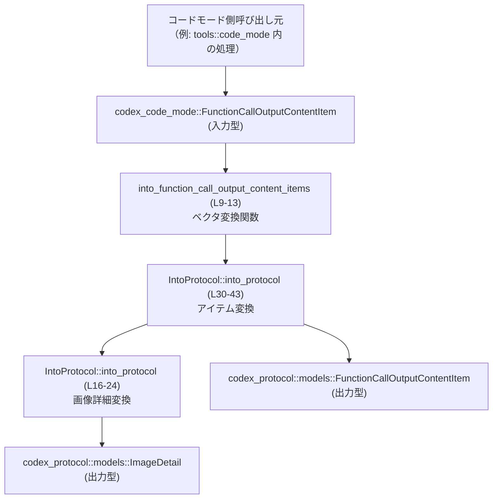
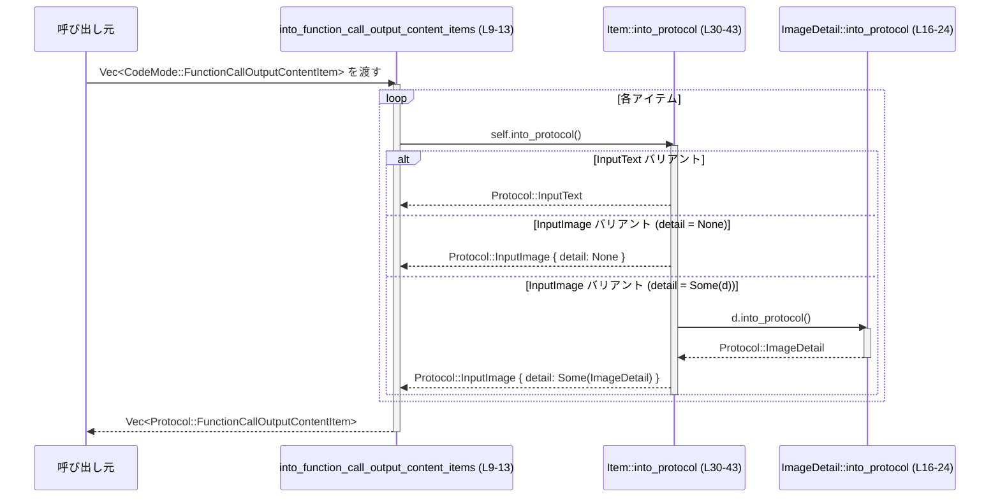

# core/src/tools/code_mode/response_adapter.rs コード解説

## 0. ざっくり一言

- `codex_code_mode` 側の型を、`codex_protocol::models` 側の型に変換する **アダプタ** モジュールです（response_adapter.rs:L1-3, L9-13）。
- ベクタや列挙体の各バリアントを 1:1 で写像する、シンプルな変換ロジックのみを持ちます（response_adapter.rs:L15-24, L30-41）。

---

## 1. このモジュールの役割

### 1.1 概要

- このモジュールは、**コードモードの内部モデル**（`codex_code_mode`）で表現された関数呼び出しの出力コンテンツを、**プロトコル用モデル**（`codex_protocol::models`）に変換するために存在しています（response_adapter.rs:L1-3, L9-13）。
- 具体的には、`FunctionCallOutputContentItem` と `ImageDetail` の 2 種類の型について、コードモード版からプロトコル版への変換を提供します（response_adapter.rs:L15-24, L27-43）。

### 1.2 アーキテクチャ内での位置づけ

`codex_code_mode` で生成された結果を、外部との通信に使う `codex_protocol` のモデルへ橋渡しする位置にあります。



- 呼び出し元は `codex_code_mode::FunctionCallOutputContentItem` の `Vec` を生成し、このモジュール経由で `codex_protocol::models::FunctionCallOutputContentItem` の `Vec` に変換すると考えられます（response_adapter.rs:L9-13）。
- 個々の画像詳細オプション (`detail: Option<...>`) は、`IntoProtocol<ImageDetail>` 実装により変換されます（response_adapter.rs:L37-40, L16-24）。

### 1.3 設計上のポイント

- **トレイトベースの共通インターフェース**  
  - 汎用トレイト `IntoProtocol<T>` を定義し（response_adapter.rs:L5-7）、これに対する `impl` を追加することで変換ロジックを拡張できる設計です（response_adapter.rs:L15-25, L27-43）。
- **無状態・純粋関数**  
  - すべての関数・メソッドは受け取った値を変換して返すだけで、内部に状態を保持しません（response_adapter.rs:L9-13, L16-24, L30-43）。
- **コンパイル時に網羅性が保証される `match`**  
  - 列挙体のバリアント変換は `match` 式で行われており、新しいバリアントが追加された場合はコンパイルエラーで気づけます（response_adapter.rs:L18-23, L32-41）。
- **エラーやパニックを伴わない変換**  
  - `Result` や `panic!` を使用せず、単純な写像のみを行うため、ランタイムエラーを発生させない作りになっています（response_adapter.rs:L9-13, L16-24, L30-43）。
- **並行性への影響がない構造**  
  - グローバル可変状態や `unsafe` を使用しておらず（全体）、どの関数も引数を消費して新しい値を返すだけなので、スレッドから安全に並列呼び出し可能です。

---

## 2. 主要な機能一覧とコンポーネントインベントリー

### 2.1 主要な機能一覧

- ベクタ変換: `Vec<codex_code_mode::FunctionCallOutputContentItem>` を `Vec<codex_protocol::models::FunctionCallOutputContentItem>` に変換（response_adapter.rs:L9-13）。
- 画像詳細変換: `codex_code_mode::ImageDetail` を `codex_protocol::models::ImageDetail` に変換（response_adapter.rs:L15-24）。
- コンテンツアイテム変換: `codex_code_mode::FunctionCallOutputContentItem` の各バリアントを、対応する `codex_protocol::models::FunctionCallOutputContentItem` のバリアントに変換（response_adapter.rs:L27-43）。

### 2.2 型・トレイト コンポーネント一覧

| 名称 | 種別 | 公開範囲 | 役割 / 用途 | 定義箇所 |
|------|------|----------|-------------|----------|
| `IntoProtocol<T>` | トレイト | モジュール内 private | コードモード側の型からプロトコル側の型へ変換するための汎用トレイト。`into_protocol(self) -> T` を定義。 | core/src/tools/code_mode/response_adapter.rs:L5-7 |
| `CodeModeImageDetail` | 型エイリアス（外部列挙体） | このファイルでは `use` のみ | `codex_code_mode::ImageDetail` を別名として扱うための `use ... as`。定義自体はこのチャンクには現れません。 | core/src/tools/code_mode/response_adapter.rs:L1 |
| `FunctionCallOutputContentItem` | 外部型（列挙体と推測） | このファイルでは `use` のみ | プロトコル側の関数出力コンテンツを表す型。定義は `codex_protocol::models` 側にあり、このチャンクには現れません。 | core/src/tools/code_mode/response_adapter.rs:L2 |
| `ImageDetail` | 外部型（列挙体と推測） | このファイルでは `use` のみ | プロトコル側の画像詳細指定を表す型。定義は `codex_protocol::models` 側にあり、このチャンクには現れません。 | core/src/tools/code_mode/response_adapter.rs:L3 |

※ 外部型の具体的なバリアントやフィールド構成は、このチャンクには現れないため不明です。

### 2.3 関数・メソッド コンポーネント一覧

| 名称 | 種別 | シグネチャ（簡略） | 公開範囲 | 役割 / 用途 | 定義箇所 |
|------|------|--------------------|----------|-------------|----------|
| `IntoProtocol::into_protocol` | トレイトメソッド | `fn into_protocol(self) -> T` | トレイト内 (private) | 任意の型 `Self` からプロトコル側の型 `T` へ変換する共通インターフェース。具体的実装は各 `impl` による。 | core/src/tools/code_mode/response_adapter.rs:L5-7 |
| `into_function_call_output_content_items` | 関数 | `fn(items: Vec<codex_code_mode::FunctionCallOutputContentItem>) -> Vec<FunctionCallOutputContentItem>` | `pub(super)` | コードモード側コンテンツアイテムのベクタを、プロトコル側のベクタに一括変換。 | core/src/tools/code_mode/response_adapter.rs:L9-13 |
| `IntoProtocol<ImageDetail>::into_protocol` | メソッド実装 | `fn into_protocol(self) -> ImageDetail` | `impl` 内 (private) | `CodeModeImageDetail` から `ImageDetail` への 1:1 バリアント変換。 | core/src/tools/code_mode/response_adapter.rs:L15-24 |
| `IntoProtocol<FunctionCallOutputContentItem>::into_protocol` | メソッド実装 | `fn into_protocol(self) -> FunctionCallOutputContentItem` | `impl` 内 (private) | コードモード側 `FunctionCallOutputContentItem` からプロトコル側同名型への変換。テキスト／画像バリアントを変換し、画像詳細はさらに `IntoProtocol` で変換。 | core/src/tools/code_mode/response_adapter.rs:L27-43 |

---

## 3. 公開 API と詳細解説

### 3.1 型一覧（構造体・列挙体など）

このファイル内で定義される公開可能性のある型は、`IntoProtocol<T>` トレイトのみです（ただし `pub` ではないためモジュール外には公開されません）。

| 名前 | 種別 | 役割 / 用途 | 定義箇所 |
|------|------|-------------|----------|
| `IntoProtocol<T>` | トレイト | 型 `Self` をプロトコル側の型 `T` に変換するためのインターフェース。`into_protocol(self) -> T` を 1 メソッドだけ持ちます。 | core/src/tools/code_mode/response_adapter.rs:L5-7 |

### 3.2 関数詳細

#### `into_function_call_output_content_items(items: Vec<codex_code_mode::FunctionCallOutputContentItem>) -> Vec<FunctionCallOutputContentItem>`

**概要**

- コードモード側の `FunctionCallOutputContentItem` のベクタを、プロトコル側の `FunctionCallOutputContentItem` のベクタに一括変換する関数です（core/src/tools/code_mode/response_adapter.rs:L9-13）。
- 各要素の変換には、このファイルで定義された `IntoProtocol<FunctionCallOutputContentItem>` 実装が使われます（core/src/tools/code_mode/response_adapter.rs:L27-43）。

**引数**

| 引数名 | 型 | 説明 |
|--------|----|------|
| `items` | `Vec<codex_code_mode::FunctionCallOutputContentItem>` | コードモード側で構築された関数呼び出し出力コンテンツの一覧。所有権ごと渡されるため、この関数呼び出し後は元のベクタは利用できなくなります（move）。 |

**戻り値**

- `Vec<FunctionCallOutputContentItem>`  
  プロトコル側の `FunctionCallOutputContentItem` に変換された新しいベクタです（core/src/tools/code_mode/response_adapter.rs:L9-13）。

**内部処理の流れ（アルゴリズム）**

1. `items.into_iter()` でベクタから所有権を持つイテレータを生成します（core/src/tools/code_mode/response_adapter.rs:L12）。
2. 各要素に対して `map(IntoProtocol::into_protocol)` を適用し、`IntoProtocol<FunctionCallOutputContentItem>` 実装に基づいてプロトコル側の型へ変換します（core/src/tools/code_mode/response_adapter.rs:L12, L30-43）。
3. `collect()` で全要素を `Vec<FunctionCallOutputContentItem>` に収集して返します（core/src/tools/code_mode/response_adapter.rs:L12-13）。

**Examples（使用例）**

> 注意: モジュールパスの先頭（`crate` の位置）は、このチャンクからは特定できないため、例では `crate::tools::code_mode::response_adapter` としています。

```rust
use crate::tools::code_mode::response_adapter::into_function_call_output_content_items; // 変換関数をインポートする（パスは例）
use codex_code_mode::FunctionCallOutputContentItem as CodeModeItem;                     // コードモード側の型を別名で扱う

fn build_protocol_items() -> Vec<codex_protocol::models::FunctionCallOutputContentItem> {
    // コードモード側のコンテンツアイテムを作る（定義はこのチャンクにはないため疑似コード）
    let code_mode_items: Vec<CodeModeItem> = vec![
        CodeModeItem::InputText {                                                     // テキスト入力
            text: "hello".to_string(),                                                // テキスト内容
        },
        CodeModeItem::InputImage {                                                    // 画像入力
            image_url: "https://example.com/image.png".to_string(),                   // 画像URL
            detail: None,                                                             // detail は省略（None）
        },
    ];

    // このモジュールの関数でプロトコル用型に変換する
    let protocol_items = into_function_call_output_content_items(code_mode_items);    // code_mode_items は move される

    protocol_items                                                                    // 呼び出し元に返す
}
```

**Errors / Panics**

- この関数は `Result` 型を返さず、内部でも `panic!` を呼んでいません（core/src/tools/code_mode/response_adapter.rs:L9-13, L30-43）。
- 変換は単純な `match` による写像であり、**ランタイムエラーを発生させる経路はありません**。

**Edge cases（エッジケース）**

- `items` が空のベクタ `vec![]` である場合  
  - `into_iter().map(...).collect()` の結果も空ベクタとなります（Rust 標準ライブラリの挙動による）。  
  - 特別な分岐はなく、そのまま空の `Vec<FunctionCallOutputContentItem>` が返されます。
- ベクタ内に `InputImage { detail: None }` を含む場合  
  - `detail.map(...)` は `None` のまま維持されます（core/src/tools/code_mode/response_adapter.rs:L37-40）。
- ベクタ内に同じ要素が多数あっても、すべて独立に変換されるだけで特別な処理は行われません。

**使用上の注意点**

- **所有権の移動**  
  - 引数 `items` は値渡しであり、関数内で `into_iter()` されるため、呼び出し後に元の `items` を再利用することはできません（コンパイラがエラーとして検出します）。
- **性能面**  
  - 変換は要素数に比例した O(n) 時間で行われ、追加のヒープ確保は戻り値ベクタ分のみです（`collect()`）。  
  - 1 要素ごとの変換も単純な `match` のみであり、計算コストは低いです。
- **並行性**  
  - 内部状態がなく、引数／戻り値のみを扱う純粋関数のため、複数スレッドから同時に呼び出してもデータ競合は発生しません。

---

#### `IntoProtocol<ImageDetail> for CodeModeImageDetail::into_protocol(self) -> ImageDetail`

**概要**

- コードモード側の `ImageDetail` バリアントを、プロトコル側の `ImageDetail` バリアントに 1:1 で変換します（core/src/tools/code_mode/response_adapter.rs:L15-24）。

**引数**

| 引数名 | 型 | 説明 |
|--------|----|------|
| `self` | `CodeModeImageDetail` | コードモード側で使用される画像詳細指定の列挙値。 |

**戻り値**

- `ImageDetail`  
  対応するプロトコル側の画像詳細列挙値です。

**内部処理の流れ**

1. `let value = self;` で受け取った値をローカル変数に束縛します（core/src/tools/code_mode/response_adapter.rs:L17）。
2. `match value { ... }` で 4 つのバリアント `Auto`, `Low`, `High`, `Original` に分岐し、それぞれ対応するプロトコル側のバリアントを返します（core/src/tools/code_mode/response_adapter.rs:L18-23）。

**Examples（使用例）**

```rust
use codex_code_mode::ImageDetail as CodeModeImageDetail;                      // コードモード側の ImageDetail
use codex_protocol::models::ImageDetail as ProtocolImageDetail;              // プロトコル側の ImageDetail

fn convert_detail(detail: CodeModeImageDetail) -> ProtocolImageDetail {
    // IntoProtocol トレイトはこのファイル内スコープにあるため、
    // 通常は response_adapter モジュール内から呼ばれます。
    // ここでは概念的な例としてメソッド呼び出し風に記述しています。

    use crate::tools::code_mode::response_adapter::IntoProtocol;            // 実際には private のため外部からは使えない

    detail.into_protocol()                                                  // CodeModeImageDetail -> ImageDetail に変換
}
```

> 注: `IntoProtocol` トレイトは `pub` ではないため、実際にはモジュール外から直接呼び出すことはできません。この例は変換処理のイメージを示すものです。

**Errors / Panics**

- エラー処理や `panic!` 呼び出しはなく、すべての既知バリアントを網羅しています（core/src/tools/code_mode/response_adapter.rs:L18-23）。

**Edge cases**

- サポートされるバリアントは `Auto`, `Low`, `High`, `Original` の 4 種類のみです（core/src/tools/code_mode/response_adapter.rs:L19-22）。
- 将来 `codex_code_mode::ImageDetail` に新しいバリアントが追加された場合、`match` 式がコンパイルエラーとなり、変換ロジックの更新漏れを検知できます。

**使用上の注意点**

- 単純なバリアント写像であり、意味的な変更（例: `Low` を `High` にマップする等）は行っていません。
- `CodeModeImageDetail` と `ImageDetail` のバリアント名が一致しない設計に変更された場合、この実装もそれに合わせて変更する必要があります。

---

#### `IntoProtocol<FunctionCallOutputContentItem> for codex_code_mode::FunctionCallOutputContentItem::into_protocol(self) -> FunctionCallOutputContentItem`

**概要**

- コードモード側の `FunctionCallOutputContentItem` を、プロトコル側の同名の型に変換するメソッドです（core/src/tools/code_mode/response_adapter.rs:L27-43）。
- テキスト入力 (`InputText`) と画像入力 (`InputImage`) の 2 種類のバリアントを扱い、画像入力の `detail` フィールドは `IntoProtocol<ImageDetail>` を用いてさらに変換されます（core/src/tools/code_mode/response_adapter.rs:L33-40）。

**引数**

| 引数名 | 型 | 説明 |
|--------|----|------|
| `self` | `codex_code_mode::FunctionCallOutputContentItem` | コードモード側の関数出力コンテンツアイテム。テキストまたは画像入力を表すバリアントを持つと読み取れます。 |

**戻り値**

- `FunctionCallOutputContentItem`  
  プロトコル側の関数出力コンテンツアイテム。バリアント構造はコードモード側と対応しています。

**内部処理の流れ**

1. `let value = self;` で受け取った値をローカル変数に束縛します（core/src/tools/code_mode/response_adapter.rs:L31）。
2. `match value { ... }` で 2 つのバリアントに分岐します（core/src/tools/code_mode/response_adapter.rs:L32-41）。
   - `InputText { text }` の場合  
     - 同名バリアント `FunctionCallOutputContentItem::InputText { text }` を生成します（core/src/tools/code_mode/response_adapter.rs:L33-35）。
   - `InputImage { image_url, detail }` の場合  
     - `image_url` をそのまま渡しつつ（core/src/tools/code_mode/response_adapter.rs:L36-38）、  
     - `detail: detail.map(IntoProtocol::into_protocol)` により、`Option<CodeModeImageDetail>` を `Option<ImageDetail>` に変換します（core/src/tools/code_mode/response_adapter.rs:L37-40）。

**Examples（使用例）**

このメソッドは通常、`into_function_call_output_content_items` から間接的に利用されます（core/src/tools/code_mode/response_adapter.rs:L12）。単体のアイテムを変換するイメージは以下の通りです（擬似コード）:

```rust
use codex_code_mode::FunctionCallOutputContentItem as CodeModeItem;           // コードモード側アイテム
use codex_protocol::models::FunctionCallOutputContentItem as ProtocolItem;   // プロトコル側アイテム

fn convert_single_item(item: CodeModeItem) -> ProtocolItem {
    use crate::tools::code_mode::response_adapter::IntoProtocol;             // 実際には private のため外部からは使えない

    item.into_protocol()                                                     // CodeModeItem -> ProtocolItem に変換
}
```

**Errors / Panics**

- すべての既知バリアント (`InputText`, `InputImage`) を `match` で明示的に処理しており（core/src/tools/code_mode/response_adapter.rs:L33-41）、`panic!` 等の呼び出しはありません。
- `detail.map(...)` は `Option::map` による通常の変換であり、`None` に対しても安全に動作します（`None` のまま）。

**Edge cases**

- `InputText { text }` で `text` が空文字列や極端に長い文字列である場合でも、このメソッドはそのまま渡すだけで特別な処理は行いません（core/src/tools/code_mode/response_adapter.rs:L33-35）。
- `InputImage { image_url, detail: None }` の場合、戻り値の `detail` も `None` となります（core/src/tools/code_mode/response_adapter.rs:L37-40）。
- `InputImage { image_url, detail: Some(d) }` で、`d` が `CodeModeImageDetail::Auto` などのバリアントであっても、`IntoProtocol<ImageDetail>` 実装によって適切に対応する `ImageDetail` に変換されます（core/src/tools/code_mode/response_adapter.rs:L37-40, L16-24）。
- 将来、コードモード側 `FunctionCallOutputContentItem` に新しいバリアントが追加された場合、`match` 式が網羅的でなくなるため **コンパイルエラーが発生し、変換ロジック更新忘れを防止できます**。

**使用上の注意点**

- **フィールドのそのまま転送**  
  - `text` と `image_url` は変換過程で一切加工されず、そのままプロトコル側に渡されます（core/src/tools/code_mode/response_adapter.rs:L33-35, L37-38）。  
  - セキュリティ上の検証やサニタイズは、呼び出し元または別のレイヤーで行う必要があります。
- **オプションの扱い**  
  - `detail` は `Option` であり、`None` の場合も、そのまま `None` として渡されます（core/src/tools/code_mode/response_adapter.rs:L37-40）。  
  - `Some` の場合は `IntoProtocol<ImageDetail>` に委譲されるため、`ImageDetail` 側のバリアント構成変更に注意が必要です。

### 3.3 その他の関数

- このファイルには上記 3 つ以外の関数・メソッドは存在しません（core/src/tools/code_mode/response_adapter.rs:L1-44）。

---

## 4. データフロー

### 4.1 代表的な処理シナリオ

代表的なフローは以下の通りです。

1. 呼び出し元が `Vec<codex_code_mode::FunctionCallOutputContentItem>` を構築する。
2. `into_function_call_output_content_items`（L9-13）がベクタ全体を引数として受け取る。
3. ベクタの各要素に対して `IntoProtocol<FunctionCallOutputContentItem>::into_protocol`（L30-43）が呼ばれる。
4. `InputImage` バリアントの `detail` が `Some` の場合には、さらに `IntoProtocol<ImageDetail>::into_protocol`（L16-24）が呼ばれる。

### 4.2 シーケンス図



- このフローには外部 I/O や非同期処理は含まれず、すべてメモリ内で完結します（core/src/tools/code_mode/response_adapter.rs:L9-13, L16-24, L30-43）。
- Rust の所有権システムにより、入力ベクタおよびその要素はすべて消費され、新しいプロトコル側ベクタに置き換えられます。

---

## 5. 使い方（How to Use）

### 5.1 基本的な使用方法

コードモード側で生成したコンテンツアイテムを、プロトコル送信用に変換する典型的な流れの例です。

```rust
use crate::tools::code_mode::response_adapter::into_function_call_output_content_items; // 本モジュールの変換関数をインポート（パスはファイル構造から推定）
use codex_code_mode::FunctionCallOutputContentItem as CodeModeItem;                     // コードモード側のアイテム型を別名として使用

fn prepare_protocol_payload() -> Vec<codex_protocol::models::FunctionCallOutputContentItem> {
    // 1. コードモード側の結果を組み立てる（ここでは例示のため直接構築）
    let items: Vec<CodeModeItem> = vec![
        CodeModeItem::InputText {                                                     // テキスト入力
            text: "search cats".to_string(),                                          // テキスト内容
        },
        CodeModeItem::InputImage {                                                    // 画像入力
            image_url: "https://example.com/cat.png".to_string(),                     // 画像の URL
            detail: Some(codex_code_mode::ImageDetail::High),                         // 高詳細指定
        },
    ];

    // 2. このモジュールの関数でプロトコル側の型へ一括変換
    let protocol_items = into_function_call_output_content_items(items);              // items はここで move される

    // 3. 変換済みの protocol_items を、そのままプロトコル層のリクエスト組み立てに利用できる
    protocol_items
}
```

### 5.2 よくある使用パターン

- **テキストのみの出力を変換するパターン**  
  - ベクタには `InputText` のみを入れ、画像関連のオプションを扱わないケースです。
  - この場合、`ImageDetail` の変換は呼ばれず、パフォーマンス上のオーバーヘッドも最小です（core/src/tools/code_mode/response_adapter.rs:L33-35）。
- **画像のみ、またはテキスト＋画像混在のパターン**  
  - ベクタ内に `InputImage` を含む場合、`detail` フィールドの有無に応じて `ImageDetail` の変換が行われます（core/src/tools/code_mode/response_adapter.rs:L36-40, L16-24）。

### 5.3 よくある間違い（起こりうる誤用）

このファイルのコードから推測できる範囲で、発生しそうな誤用例を挙げます。

```rust
use crate::tools::code_mode::response_adapter::into_function_call_output_content_items;
use codex_code_mode::FunctionCallOutputContentItem as CodeModeItem;

fn wrong_usage() {
    let items: Vec<CodeModeItem> = vec![];

    // ❌ 間違い例: items を参照で渡そうとする
    // let result = into_function_call_output_content_items(&items);
    // → 関数は Vec<T> を値として受け取るため、型が合わずコンパイルエラーになる

    // ✅ 正しい例: 所有権を move して渡す
    let result = into_function_call_output_content_items(items);   // items は move され、以後使えない
    println!("converted {} items", result.len());
}
```

- 所有権移動のルールにより、引数を `&Vec<_>` ではなく `Vec<_>` として渡す必要があります（core/src/tools/code_mode/response_adapter.rs:L9-11）。

### 5.4 使用上の注意点（まとめ）

- **事前検証は別レイヤーで行うこと**  
  - このモジュールは、値の内容を検証・フィルタリングせずにそのまま転送します（特に `text` と `image_url`）。  
  - セキュリティ上の検証（URL の妥当性チェックなど）は、呼び出し前に行う必要があります（core/src/tools/code_mode/response_adapter.rs:L33-38）。
- **バリアント追加時のメンテナンス**  
  - `ImageDetail` や `FunctionCallOutputContentItem` に新しいバリアントを追加した場合、このファイルの `match` 式も更新する必要があります（core/src/tools/code_mode/response_adapter.rs:L18-23, L32-41）。
- **並列実行の安全性**  
  - すべての関数が純粋関数であり、共有可変状態を持たないため、複数スレッドで同時に呼んでもデータ競合は発生しません。

---

## 6. 変更の仕方（How to Modify）

### 6.1 新しい機能を追加する場合

**例: 新しい画像詳細バリアント `Ultra` をサポートしたい場合**

1. `codex_code_mode::ImageDetail` と `codex_protocol::models::ImageDetail` の両方にバリアントを追加します（この変更はこのチャンクには現れません）。
2. 本ファイルの `IntoProtocol<ImageDetail> for CodeModeImageDetail` の `match` に新バリアントを追加します（core/src/tools/code_mode/response_adapter.rs:L18-23）。
3. `codex_code_mode::FunctionCallOutputContentItem` のどこかで新バリアントを使用する場合は、それに対応する変換を `IntoProtocol<FunctionCallOutputContentItem>` に追加します（core/src/tools/code_mode/response_adapter.rs:L32-41）。
4. 変換の前後で値の意味が変わっていないかを確認するテストを用意します（テストコードはこのチャンクには存在しません）。

### 6.2 既存の機能を変更する場合

- **変換仕様の変更（例: 一部の `ImageDetail` を別の値にマップしたい）**
  - 該当する `match` の分岐のみを変更し、全てのバリアントに対して意図したマッピングになっているか確認します（core/src/tools/code_mode/response_adapter.rs:L18-23, L32-41）。
  - 呼び出し元との暗黙の契約（例: `High` はこういう意味である）を破らないよう、関連ドキュメントや利用箇所を併せて確認する必要があります。
- **型のフィールド追加**  
  - もし `InputImage` に新しいフィールドが追加された場合、ここでの変換にもそのフィールドを渡すかどうかを決める必要があります（core/src/tools/code_mode/response_adapter.rs:L36-40）。
- **影響範囲の確認方法**
  - `IntoProtocol` トレイトの実装を検索することで、この変換が他の型にも使われているか確認できます（このチャンクには他の `impl` はありません）。

---

## 7. 関連ファイル

このモジュールと密接に関わると考えられる外部ファイル・モジュールは以下の通りです（ただし、実際のファイルパスや内容はこのチャンクには現れません）。

| パス / モジュール | 役割 / 関係 |
|-------------------|------------|
| `codex_code_mode::FunctionCallOutputContentItem` | このモジュールが入力として受け取る型。`InputText` や `InputImage` バリアントを持つ列挙体と読み取れます（core/src/tools/code_mode/response_adapter.rs:L10, L27-29, L33-37）。定義はこのチャンクには現れません。 |
| `codex_code_mode::ImageDetail` | `CodeModeImageDetail` としてインポートされる画像詳細指定の列挙体。`Auto`, `Low`, `High`, `Original` バリアントを持つことが `match` から分かります（core/src/tools/code_mode/response_adapter.rs:L1, L19-22）。 |
| `codex_protocol::models::FunctionCallOutputContentItem` | このモジュールの出力として生成されるプロトコル側の型（core/src/tools/code_mode/response_adapter.rs:L2, L11, L27-28, L34-38）。定義はこのチャンクには現れません。 |
| `codex_protocol::models::ImageDetail` | プロトコル側の画像詳細指定を表す列挙体（core/src/tools/code_mode/response_adapter.rs:L3, L15-16, L19-22）。 |

---

### 付記: バグ・セキュリティ・テスト・観測性に関する補足

- **バグの可能性**  
  - 現時点のコードからは明確なロジックバグは読み取れません。  
  - ただし、外部型の意味が変わった場合（例: バリアントの追加・削除・意味変更）、ここを更新しないと意味的なずれが発生する可能性があります。
- **セキュリティ**  
  - このモジュールは値の検証を一切行わないため、サニタイズやフィルタリングは上位レイヤーの責任となります（特に `text` と `image_url` フィールド）。
- **テスト**  
  - このファイル内にテストコード（`#[test]` や `mod tests`）は存在しません（core/src/tools/code_mode/response_adapter.rs:L1-44）。
- **観測性（ログ・メトリクス）**  
  - ログ出力やメトリクス送信は行っていないため、変換の成否や件数を観測したい場合は、呼び出し元でログを追加する必要があります。
