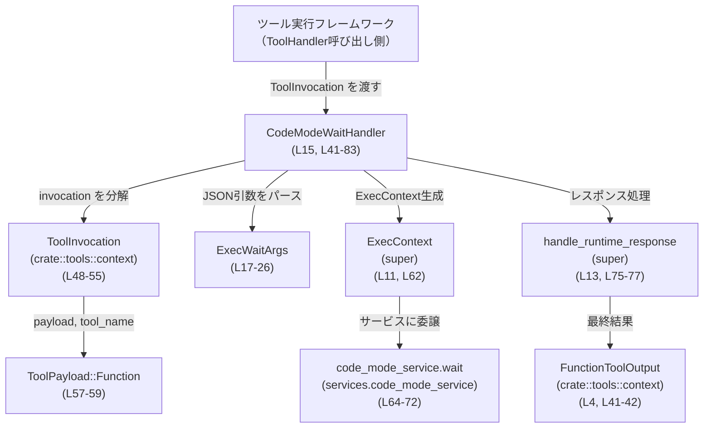

# core/src/tools/code_mode/wait_handler.rs コード解説

## 0. ざっくり一言

`CodeModeWaitHandler` は、コードモード用の「待機(wait)」ツール呼び出しを処理し、  
JSON で渡された引数をパースして `code_mode_service.wait` に委譲し、その結果を共通のランタイムレスポンスハンドラに渡すモジュールです（wait_handler.rs:L15-15, L48-77）。

---

## 1. このモジュールの役割

### 1.1 概要

- このモジュールは、**コードモードにおける「待機」ツール呼び出し**を処理するために存在し、  
  ツールの JSON 引数パース・サービス呼び出し・レスポンス整形を行います（wait_handler.rs:L17-26, L48-77）。
- ツールハンドラ共通のインターフェース `ToolHandler` を実装し、ツール実行フレームワークから呼び出される前提になっています（wait_handler.rs:L41-48）。

### 1.2 アーキテクチャ内での位置づけ

このファイルに現れる主なコンポーネントの関係を示します。



- 実際の `ExecContext` や `code_mode_service` の定義場所は、このチャンクには現れません（super モジュール経由のため、wait_handler.rs:L10-13, L62-68）。

### 1.3 設計上のポイント

- **責務分割**
  - 引数のパースは汎用関数 `parse_arguments` に切り出され、`CodeModeWaitHandler::handle` から利用されています（wait_handler.rs:L32-39, L61-61）。
  - デフォルト値ロジックは `ExecWaitArgs` + `default_wait_yield_time_ms` に集約されています（wait_handler.rs:L17-26, L28-30）。
  - サービス呼び出し後のレスポンス処理は `handle_runtime_response` に委譲され、ここでは扱っていません（wait_handler.rs:L13, L75-77）。
- **状態管理**
  - `CodeModeWaitHandler` 自体はフィールドを持たないユニット構造体で、内部状態を持ちません（wait_handler.rs:L15-15）。
  - 呼び出しごとのコンテキストは `ExecContext { session, turn }` として都度生成されます（wait_handler.rs:L62-62）。
- **エラーハンドリング方針**
  - すべてのエラーは `FunctionCallError::RespondToModel` にマッピングされ、モデル側への応答として扱えるよう統一されています（wait_handler.rs:L36-38, L74-77, L79-81）。
- **並行性**
  - `handle` は `async fn` として定義されており、`code_mode_service.wait` と `handle_runtime_response` を `await` しています（wait_handler.rs:L48-48, L73-73, L75-76）。
  - グローバルな可変状態は扱っておらず、並行呼び出し間で直接共有するデータは見えません（構造体が無フィールドであることから、wait_handler.rs:L15-15）。

---

## 2. 主要な機能一覧

このモジュールが提供する主な機能は次のとおりです。

- CodeModeWaitHandler による **「wait」ツールハンドリング**（wait_handler.rs:L15, L41-83）
- JSON 文字列から引数構造体への **安全なパース**（`parse_arguments`）（wait_handler.rs:L32-39）
- 待機ツール用引数 `ExecWaitArgs` の定義と **デフォルト値適用**（wait_handler.rs:L17-26, L28-30）
- `code_mode_service.wait` 呼び出しと、その結果の **共通レスポンス処理への橋渡し**（wait_handler.rs:L64-72, L75-77）

---

## 3. 公開 API と詳細解説

### 3.1 型一覧（構造体・列挙体など）

| 名前 | 種別 | 公開範囲 | 役割 / 用途 | 根拠 |
|------|------|----------|-------------|------|
| `CodeModeWaitHandler` | 構造体（ユニット構造体） | `pub` | コードモードの wait ツールを処理する `ToolHandler` 実装の本体です。状態を持たないハンドラとして利用されます。 | wait_handler.rs:L15, L41-83 |
| `ExecWaitArgs` | 構造体 | モジュール内限定（非 pub） | wait ツールに渡される JSON 引数を表します。セル ID、待機時間、最大トークン数、終了フラグを保持します。 | wait_handler.rs:L17-26 |

`ExecWaitArgs` のフィールド詳細：

| フィールド名 | 型 | デフォルト | 説明 | 根拠 |
|-------------|----|------------|------|------|
| `cell_id` | `String` | 必須（デフォルトなし） | 対象セルの識別子。`codex_code_mode::WaitRequest` にそのまま渡されます。 | wait_handler.rs:L19, L68-70 |
| `yield_time_ms` | `u64` | `DEFAULT_WAIT_YIELD_TIME_MS` | 待機の時間単位（ミリ秒）。`serde(default = "default_wait_yield_time_ms")` により、JSON で省略時にデフォルト値が適用されます。 | wait_handler.rs:L20-21, L28-30 |
| `max_tokens` | `Option<usize>` | `None` | レスポンスで使用する最大トークン数（ある場合）。レスポンス処理 `handle_runtime_response` に渡されます。 | wait_handler.rs:L22-23, L75-76 |
| `terminate` | `bool` | `false` | 待機処理を終了させるかどうかを示すフラグ。`WaitRequest` に渡されます。 | wait_handler.rs:L24-25, L69-71 |

### 3.2 関数詳細（重要な関数）

#### `CodeModeWaitHandler::handle(&self, invocation: ToolInvocation) -> Result<FunctionToolOutput, FunctionCallError>`

**概要**

- コードモードの wait ツール呼び出しを処理する非同期メソッドです。
- JSON 形式の引数を `ExecWaitArgs` にデシリアライズし、`code_mode_service.wait` を呼び出した後、`handle_runtime_response` でレスポンスを整形して返します（wait_handler.rs:L57-77）。

**引数**

| 引数名 | 型 | 説明 | 根拠 |
|--------|----|------|------|
| `invocation` | `ToolInvocation` | ツール呼び出し全体のコンテキスト。セッション、ターン情報、ツール名、ペイロードなどを含みます。ここでは分配束縛により `session`, `turn`, `tool_name`, `payload` などを取り出しています。 | wait_handler.rs:L48-55 |

**戻り値**

- `Result<FunctionToolOutput, FunctionCallError>`
  - `Ok(FunctionToolOutput)`：ツール実行に成功し、レスポンスをモデルに返せる状態になっているとき（`handle_runtime_response` の成功結果）（wait_handler.rs:L75-77）。
  - `Err(FunctionCallError)`：引数パース、サービス呼び出し、レスポンス処理のいずれかでエラーが発生したとき（wait_handler.rs:L61, L73-77, L79-81）。

**内部処理の流れ（アルゴリズム）**

1. `ToolInvocation` から `session`, `turn`, `tool_name`, `payload` などをパターンマッチで取り出します（wait_handler.rs:L48-55）。
2. `match payload` で、`ToolPayload::Function { arguments }` かどうか、かつ `tool_name` がこのハンドラの対象ツール名（`WAIT_TOOL_NAME`）かどうかを判定します（namespace が `None` かつ `name` 一致）（wait_handler.rs:L57-59）。
3. 条件を満たす場合：
   1. `arguments`（JSON 文字列）を `parse_arguments::<ExecWaitArgs>` で構造体に変換します（wait_handler.rs:L61-61）。
   2. `ExecContext { session, turn }` を生成し、`started_at` に現在時刻を記録します（wait_handler.rs:L62-63）。
   3. `exec.session.services.code_mode_service.wait(WaitRequest { ... })` を呼び出し、`cell_id`, `yield_time_ms`, `terminate` を渡して `await` します（wait_handler.rs:L64-72）。
   4. サービス呼び出しのエラーは `map_err(FunctionCallError::RespondToModel)` により `FunctionCallError` に変換されます（wait_handler.rs:L73-74）。
   5. 正常応答 `response` と `args.max_tokens`, `started_at` を `handle_runtime_response(&exec, response, args.max_tokens, started_at).await` に渡し、その結果を再び `map_err(FunctionCallError::RespondToModel)` で包んで返します（wait_handler.rs:L75-77）。
4. 条件を満たさない（対象ツール名ではない／ペイロード型が違う）場合：
   - `"{WAIT_TOOL_NAME} expects JSON arguments"` というメッセージを持つ `FunctionCallError::RespondToModel` を返します（wait_handler.rs:L79-81）。

**Mermaid フロー図（handle の処理, L48-83）**

```mermaid
sequenceDiagram
    participant Caller as "フレームワーク<br/>(ToolHandler呼び出し側)"
    participant H as "CodeModeWaitHandler::handle<br/>(L48-83)"
    participant S as "code_mode_service.wait<br/>(L64-72)"
    participant R as "handle_runtime_response<br/>(L75-77)"

    Caller->>H: handle(invocation)
    H->>H: ToolInvocation を分解 (L48-55)
    H->>H: payload / tool_name をマッチ (L57-59)
    alt 正しいツール名とペイロード
        H->>H: parse_arguments&lt;ExecWaitArgs&gt;(arguments) (L61)
        H->>S: WaitRequest {cell_id, yield_time_ms, terminate} (L64-72)
        S-->>H: response またはエラー
        H->>R: handle_runtime_response(exec, response, max_tokens, started_at) (L75-77)
        R-->>H: FunctionToolOutput またはエラー
        H-->>Caller: Result<FunctionToolOutput, FunctionCallError>
    else それ以外
        H-->>Caller: Err(FunctionCallError::RespondToModel(...)) (L79-81)
    end
```

**Examples（使用例）**

実際の `ToolInvocation` 型の詳細はこのチャンクには現れないため、擬似的な使用例を示します。

```rust
// コードモードの wait ツールハンドラを生成する               // ユニット構造体なのでそのまま値を作成
let handler = CodeModeWaitHandler;                           

// invocation はフレームワーク側で構築されたものとする          // 実際の構築方法はこのチャンクには現れません
let invocation: ToolInvocation = /* 既存のコンテキストから取得 */;

// 非同期コンテキスト内で handle を呼び出す                     // async fn のため .await が必要
let result: Result<FunctionToolOutput, FunctionCallError> =
    handler.handle(invocation).await;                         // 成功すれば FunctionToolOutput が得られる
```

- `handle` を直接呼び出す場合は、Tokio などの非同期ランタイム上から `.await` する必要があります（`async fn` であることから、wait_handler.rs:L48-48）。

**Errors / Panics**

- **Errors**
  - JSON パース失敗：
    - `parse_arguments` が `Err(FunctionCallError::RespondToModel("failed to parse function arguments: {err}"))` を返します（wait_handler.rs:L36-38, L61-61）。
  - `code_mode_service.wait` の失敗：
    - 何らかのエラー型を返した場合に `map_err(FunctionCallError::RespondToModel)` で `FunctionCallError` に変換されます（wait_handler.rs:L73-74）。  
      ※元のエラー型自体はこのチャンクには現れません。
  - `handle_runtime_response` の失敗：
    - 同様に `map_err(FunctionCallError::RespondToModel)` でラップされます（wait_handler.rs:L75-77）。
  - 対象外ペイロード／ツール名：
    - `Err(FunctionCallError::RespondToModel("{WAIT_TOOL_NAME} expects JSON arguments"))` を返します（wait_handler.rs:L79-81）。
- **Panics**
  - このファイル中で `panic!` や `unwrap` などは使用されておらず、明示的なパニック要因は見えません（wait_handler.rs 全体）。

**Edge cases（エッジケース）**

- `tool_name.namespace` が `Some(_)` の場合：
  - 条件 `tool_name.namespace.is_none()` が偽となり、汎用エラー `"{WAIT_TOOL_NAME} expects JSON arguments"` で失敗します（wait_handler.rs:L59-59）。
- `tool_name.name` が `WAIT_TOOL_NAME` と一致しない場合：
  - 同上で失敗します（wait_handler.rs:L59, L79-81）。
- `payload` が `ToolPayload::Function` 以外の場合：
  - `match` の `_` パターンに落ちて同じエラーメッセージを返します（wait_handler.rs:L57-58, L79-81）。
- `arguments` が空文字列や不正 JSON の場合：
  - `serde_json::from_str` がエラーとなり、パースエラーとして `FunctionCallError::RespondToModel` が返されます（wait_handler.rs:L32-38, L61-61）。

**使用上の注意点**

- `handle` は **非同期関数** なので、必ず async コンテキストで `.await` する必要があります（wait_handler.rs:L48-48）。
- このハンドラは **特定のツール名（`WAIT_TOOL_NAME`）かつ namespace が `None` の場合のみ** 正常処理を行います（wait_handler.rs:L57-59）。  
  他の条件では汎用エラーが返るため、ツール登録側でツール名や namespace を一致させる前提が必要です。
- すべてのエラーが `FunctionCallError::RespondToModel` としてモデル向けレスポンス扱いになるため、  
  エラーメッセージに含める情報（特にユーザー入力由来の JSON）は必要に応じて制御する必要があります。  
  本ファイルでは serde のエラー文字列をそのまま含めています（wait_handler.rs:L36-38）。

---

#### `parse_arguments<T>(arguments: &str) -> Result<T, FunctionCallError>`

**概要**

- JSON 文字列 `arguments` を汎用的にデシリアライズし、`serde_json` のエラーを `FunctionCallError::RespondToModel` に変換して返すヘルパー関数です（wait_handler.rs:L32-39）。
- `T` は `serde::Deserialize` を実装した任意の型に対応します（wait_handler.rs:L33-34）。

**引数**

| 引数名 | 型 | 説明 | 根拠 |
|--------|----|------|------|
| `arguments` | `&str` | JSON 形式の文字列。対象型 `T` のフィールドに対応するキーを含む必要があります。 | wait_handler.rs:L32-32 |

**戻り値**

- `Result<T, FunctionCallError>`
  - `Ok(T)`：JSON が正常にパースされた場合（wait_handler.rs:L32-39）。
  - `Err(FunctionCallError::RespondToModel(msg))`：パースに失敗した場合。`msg` には `"failed to parse function arguments: {err}"` が入ります（wait_handler.rs:L36-38）。

**内部処理の流れ**

1. `serde_json::from_str(arguments)` を呼び出して JSON パースを試みます（wait_handler.rs:L36-36）。
2. 成功した場合は `Ok(T)` を返します（`map_err` でなければそのまま通過）（wait_handler.rs:L36-38）。
3. エラーの場合、`map_err` により `FunctionCallError::RespondToModel(format!("failed to parse function arguments: {err}"))` を返します（wait_handler.rs:L36-38）。

**Examples（使用例）**

`ExecWaitArgs` をパースする例です。

```rust
// ExecWaitArgs 用のJSONを用意する                                   // cell_id は必須、他は省略可能
let json = r#"{"cell_id": "cell-123"}"#;

// parse_arguments を用いて ExecWaitArgs に変換する                    // T に ExecWaitArgs を指定
let args: Result<ExecWaitArgs, FunctionCallError> =
    parse_arguments::<ExecWaitArgs>(json);                           

match args {
    Ok(parsed) => {
        // parsed.cell_id == "cell-123".to_string()                  // cell_idに値が入る
        // parsed.yield_time_ms にはデフォルト値が入る               // default_wait_yield_time_ms が適用される
    }
    Err(err) => {
        // パース失敗時のエラーメッセージを参照できる               // "failed to parse function arguments: ..." 形式
        eprintln!("parse error: {err}");
    }
}
```

**Errors / Panics**

- **Errors**
  - `serde_json::from_str` が返すあらゆるエラー（構文エラー、型不一致など）を `FunctionCallError::RespondToModel` に変換します（wait_handler.rs:L36-38）。
- **Panics**
  - `panic!` は使用しておらず、本関数から直接のパニックは見えません（wait_handler.rs:L32-39）。

**Edge cases（エッジケース）**

- 空文字列 `""` が渡された場合：
  - `serde_json::from_str` が構文エラーを返し、`FunctionCallError::RespondToModel` になります（wait_handler.rs:L36-38）。
- `T` の必須フィールドが JSON に存在しない場合：
  - `serde_json::from_str` の挙動（エラーまたはデフォルト適用）に依存します。  
    `ExecWaitArgs` の `cell_id` のようにデフォルトのないフィールドはエラーになります（wait_handler.rs:L17-21, L36-38）。
- 予期しない追加フィールドが含まれる場合：
  - `serde_json::from_str` の設定に依存しますが、デフォルトでは追加フィールドは無視されます。  
    ただし、これは serde の仕様であり、このファイル単体では明示されていません。

**使用上の注意点**

- `parse_arguments` はエラー時に **人間向けメッセージを組み立てます**（`format!` で `err` を埋め込む）。  
  そのため、エラー文字列が外部へそのまま露出する前提で運用上のログ／マスキング方針を検討する必要があります（wait_handler.rs:L36-38）。
- `T` が `Deserialize` を実装していないとコンパイルエラーになります。  
  ジェネリクス境界 `T: for<'de> Deserialize<'de>` がその制約を表します（wait_handler.rs:L33-34）。

---

### 3.3 その他の関数

| 関数名 | シグネチャ | 役割（1 行） | 根拠 |
|--------|------------|--------------|------|
| `default_wait_yield_time_ms` | `fn default_wait_yield_time_ms() -> u64` | `ExecWaitArgs.yield_time_ms` 用のデフォルト値として `DEFAULT_WAIT_YIELD_TIME_MS` を返します。 | wait_handler.rs:L20-21, L28-30 |
| `CodeModeWaitHandler::kind` | `fn kind(&self) -> ToolKind` | このハンドラが Function 型ツールであることを示すため、`ToolKind::Function` を返します。 | wait_handler.rs:L44-46 |

---

## 4. データフロー

ここでは、wait ツール呼び出し 1 回分におけるデータの流れを示します。

1. ツール実行フレームワークが `ToolInvocation` を構築し、`CodeModeWaitHandler::handle` を呼び出します（wait_handler.rs:L48-55）。
2. `ToolInvocation` から `session`, `turn`, `tool_name`, `payload` が展開され、  
   `payload` が `ToolPayload::Function { arguments }` かつ `tool_name` が `WAIT_TOOL_NAME` の場合に、処理が続行されます（wait_handler.rs:L57-59）。
3. `arguments`（JSON 文字列）が `parse_arguments::<ExecWaitArgs>` に渡され、`ExecWaitArgs` に変換されます（wait_handler.rs:L61-61）。
4. `ExecContext` が生成され、`code_mode_service.wait(WaitRequest { ... })` によって外部サービスへ委譲されます（wait_handler.rs:L62-72）。
5. 得られた `response` と `max_tokens`, `started_at` が `handle_runtime_response` に渡され、最終的な `FunctionToolOutput` が生成されて返ります（wait_handler.rs:L63-63, L75-77）。

```mermaid
sequenceDiagram
    participant FW as "フレームワーク<br/>（ToolInvocation生成側）"
    participant WH as "CodeModeWaitHandler::handle<br/>(L48-83)"
    participant PA as "parse_arguments&lt;ExecWaitArgs&gt;<br/>(L32-39)"
    participant CM as "code_mode_service.wait<br/>(L64-72)"
    participant HR as "handle_runtime_response<br/>(L75-77)"

    FW->>WH: ToolInvocation { session, turn, tool_name, payload }
    WH->>WH: payload/tool_name をチェック (L57-59)
    alt Function payload & 正しいツール名
        WH->>PA: parse_arguments(arguments) (L61)
        PA-->>WH: ExecWaitArgs or Err
        alt パース成功
            WH->>WH: ExecContext { session, turn } (L62)
            WH->>CM: WaitRequest{cell_id, yield_time_ms, terminate} (L64-72)
            CM-->>WH: response or エラー (L73-74)
            WH->>HR: handle_runtime_response(exec, response, max_tokens, started_at) (L75-77)
            HR-->>WH: FunctionToolOutput or エラー
            WH-->>FW: Result<FunctionToolOutput, FunctionCallError>
        else パース失敗
            WH-->>FW: Err(FunctionCallError::RespondToModel(...)) (L61, L36-38)
        end
    else 条件不一致
        WH-->>FW: Err(FunctionCallError::RespondToModel(...)) (L79-81)
    end
```

`code_mode_service` や `handle_runtime_response` の内部でどのような処理が行われるかは、このチャンクには現れません。

---

## 5. 使い方（How to Use）

### 5.1 基本的な使用方法

このモジュールは、ツール実行フレームワークから `ToolHandler` として利用される前提です。  
利用側は主に以下のような流れになります。

```rust
// ハンドラのインスタンスを作成する                                  // フィールドを持たないため、ユニット構造体としてそのまま生成
let handler = CodeModeWaitHandler;

// ツール実行フレームワークが ToolInvocation を構築する                // session, turn, tool_name, payload などを含む
let invocation: ToolInvocation = /* フレームワーク側で構築 */;

// 非同期ランタイム上でハンドラを呼び出す                             // async fn のため .await が必要
let result: Result<FunctionToolOutput, FunctionCallError> =
    handler.handle(invocation).await;

// 成功時には FunctionToolOutput を用いて応答を生成する                 // 具体的な利用方法は FunctionToolOutput の定義に依存
```

- `ToolInvocation` の構築方法や `FunctionToolOutput` の中身は、このチャンクには現れません。  
  これらは `crate::tools::context` に定義されていると見られます（wait_handler.rs:L4-6, L48-55）。

### 5.2 よくある使用パターン

1. **フレームワーク側でのツール登録**
   - `CodeModeWaitHandler` を `ToolHandler` としてツールレジストリに登録し、  
     ツール名 `WAIT_TOOL_NAME` に紐付けることで、モデルが wait ツールを呼び出したときに `handle` が実行される、というパターンが想定されます（命名と trait 実装からの推測であり、このチャンクにはレジストリ処理は現れません）。

2. **JSON 引数の利用**
   - モデルからのツール呼び出しで、次のような JSON を送ることで wait ツールを制御できます（`ExecWaitArgs` 定義からの推測）：
     - `{"cell_id": "...", "yield_time_ms": 1000, "max_tokens": 200, "terminate": false}`  
     ただし、実際にどの項目が必須／任意とされているかは、ツール仕様ドキュメント側に依存し、このチャンクには現れません。

### 5.3 よくある間違い

推測を交えずに、このファイルから読み取れる「誤用になりそうなケース」とその影響を示します。

```rust
// 間違い例: namespace が設定されたツール名で呼び出す
// tool_name.namespace = Some("code_mode");
// tool_name.name = WAIT_TOOL_NAME; // 文字列自体は正しい

// この場合、条件 `tool_name.namespace.is_none()` が偽になり、
// `"{WAIT_TOOL_NAME} expects JSON arguments"` というエラーで失敗する（L59, L79-81）

// 正しい例: namespace を None にして登録する（またはそのように生成する）
// tool_name.namespace = None;
// tool_name.name = WAIT_TOOL_NAME;
```

```rust
// 間違い例: JSON ではなくプレーンテキストを arguments に入れる
let arguments = "not a json";                               // 不正なJSON

// ToolPayload::Function { arguments } となっても、
// parse_arguments の serde_json::from_str でエラーになり、
// FunctionCallError::RespondToModel("failed to parse function arguments: ...") が返る（L32-39, L61）
```

### 5.4 使用上の注意点（まとめ）

- **非同期コンテキスト必須**
  - `handle` は `async fn` のため、Tokio などのランタイム上で `.await` する必要があります（wait_handler.rs:L48-48）。
- **ツール名と namespace**
  - `tool_name.namespace.is_none()` かつ `tool_name.name == WAIT_TOOL_NAME` のときのみ正常なルートに入るため、  
    ツール名や namespace が一致するようにツール登録／呼び出しを行う必要があります（wait_handler.rs:L57-59）。
- **引数 JSON の検証**
  - JSON パースエラー時のメッセージには serde のエラー文字列が含まれます（wait_handler.rs:L36-38）。  
    これはユーザー入力に依存しうるため、ログやモデルへの返却方針に留意が必要です。
- **サービス依存**
  - 実際の待機ロジックは `code_mode_service.wait` に委譲されており、その振る舞い（タイムアウト、再試行など）はこのチャンクからは分かりません（wait_handler.rs:L64-72）。  
    変更時・利用時は `code_mode_service` 側の仕様もあわせて確認する必要があります。

---

## 6. 変更の仕方（How to Modify）

### 6.1 新しい機能を追加する場合

wait ツールに新しい引数や挙動を追加する場合、このファイルでは主に以下の箇所が入口になります。

1. **引数の追加**
   - `ExecWaitArgs` にフィールドを追加し、必要なら `serde(default)` やデフォルト関数を設定します（wait_handler.rs:L17-26）。
   - 新フィールドを `codex_code_mode::WaitRequest` に渡す必要があれば、`wait(...)` 呼び出し部分の構築ロジックを修正します（wait_handler.rs:L68-71）。
   - レスポンス処理に影響する場合は、`handle_runtime_response` のインターフェースも含めて確認が必要です（wait_handler.rs:L75-77）。

2. **引数スキーマの変更**
   - JSON 形式自体を変える場合、`parse_arguments::<ExecWaitArgs>` の呼び出し側（`handle`）は基本的にそのままでよく、  
     `ExecWaitArgs` のフィールド定義や `serde` 属性を調整する形になります（wait_handler.rs:L17-26, L61-61）。

3. **別のツール種別への拡張**
   - このハンドラを他のツールにも流用したい場合、`ToolKind::Function` や `WAIT_TOOL_NAME` に依存している部分を抽象化する必要があります（wait_handler.rs:L44-46, L57-59）。  
     現状は wait 専用であり、汎用化に関するコードはこのチャンクにはありません。

### 6.2 既存の機能を変更する場合

変更時に注意すべき点を列挙します。

- **エラー契約の維持**
  - すべてのエラーが `FunctionCallError::RespondToModel` として返されている点は、  
    上位層（モデル／フレームワーク）にとって前提条件になっている可能性があります（wait_handler.rs:L36-38, L73-77, L79-81）。  
    エラー型やメッセージ形式を変える場合は、呼び出し元の期待を確認する必要があります。
- **引数と WaitRequest の一貫性**
  - `ExecWaitArgs` から `WaitRequest` にコピーされるフィールドは `cell_id`, `yield_time_ms`, `terminate` のみです（wait_handler.rs:L68-71）。  
    `max_tokens` はレスポンス処理のみで使われています（wait_handler.rs:L22-23, L75-76）。  
    振る舞いを変える場合、それぞれどこで使われているかを整理する必要があります。
- **非同期APIの変更**
  - `handle` や `code_mode_service.wait` のシグネチャを変更する場合、  
    非同期チェーン（`.await` の呼び出し箇所）がコンパイルエラーになるため、連鎖する箇所をすべて更新する必要があります（wait_handler.rs:L64-73, L75-76）。
- **テスト**
  - このチャンクにはテストコードは含まれていません。  
    変更時には、ツールハンドラ全体の統合テストや `ExecWaitArgs` のシリアライズ／デシリアライズテストを別ファイルで追加することが望ましいです。  
    （どこにテストが配置されているかは、このチャンクには現れません。）

---

## 7. 関連ファイル

このモジュールと密接に関係する型やモジュール（ファイルパスではなくモジュールパスレベルで記載します）。

| パス / モジュール | 役割 / 関係 | 根拠 |
|-------------------|------------|------|
| `crate::tools::registry::ToolHandler` | ツールハンドラの共通インターフェース。`CodeModeWaitHandler` がこれを実装し、ツール実行フレームワークから呼び出されます。 | wait_handler.rs:L7, L41-48 |
| `crate::tools::registry::ToolKind` | ハンドラの種別を表す列挙体とみられます。ここでは `ToolKind::Function` が返されています。 | wait_handler.rs:L8, L44-46 |
| `crate::tools::context::ToolInvocation` | ツール呼び出しのコンテキスト。`handle` の引数として渡され、`session`, `turn`, `tool_name`, `payload` などに分解されています。 | wait_handler.rs:L5, L48-55 |
| `crate::tools::context::ToolPayload` | ツールへの入力ペイロードの列挙体。ここでは `ToolPayload::Function { arguments }` 変種のみを扱っています。 | wait_handler.rs:L6, L57-59 |
| `crate::tools::context::FunctionToolOutput` | ツール実行結果を表す型で、`ToolHandler::Output` として利用されています。 | wait_handler.rs:L4, L41-42 |
| `crate::function_tool::FunctionCallError` | ツール実行時のエラー型。JSON パースエラーやサービスエラーをラップし、モデルへの応答として扱います。 | wait_handler.rs:L3, L32-39, L73-77, L79-81 |
| `super::ExecContext` | `session`, `turn` などをまとめた実行コンテキスト構造体と見られます。`CodeModeWaitHandler` からサービス呼び出し・レスポンス処理に渡されています。具体的な定義はこのチャンクには現れません。 | wait_handler.rs:L11, L62-62 |
| `super::handle_runtime_response` | サービスレスポンスを `FunctionToolOutput` に変換する共通処理。`code_mode_service.wait` の結果と `max_tokens`, `started_at` を引数に取っています。定義はこのチャンクには現れません。 | wait_handler.rs:L13, L75-77 |
| `super::DEFAULT_WAIT_YIELD_TIME_MS` | wait ツールのデフォルト待機時間（ミリ秒）を表す定数と見られます。`default_wait_yield_time_ms` を通して `ExecWaitArgs` に適用されます。定義はこのチャンクには現れません。 | wait_handler.rs:L10, L20-21, L28-30 |
| `super::WAIT_TOOL_NAME` | このハンドラが扱う wait ツールの名前。`tool_name.name` と比較されます。具体的な文字列はこのチャンクには現れません。 | wait_handler.rs:L12, L59, L79-81 |
| `codex_code_mode::WaitRequest` | `code_mode_service.wait` に渡されるリクエスト型。`cell_id`, `yield_time_ms`, `terminate` を含みます。定義はこのチャンクには現れません。 | wait_handler.rs:L68-71 |

このチャンクには、これら関連モジュールの具体的な実装（ファイルパスや詳細な型定義）は現れません。
