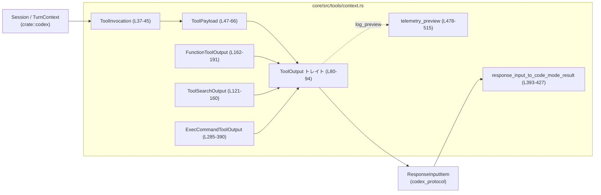
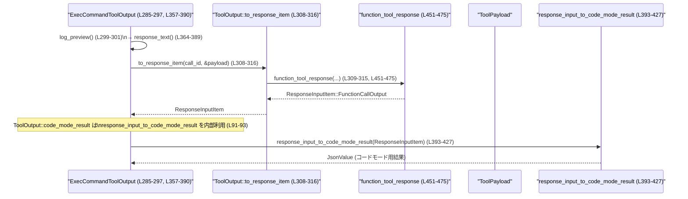

# core/src/tools/context.rs コード解説

## 0. ざっくり一言

このモジュールは、各種「ツール呼び出し」の入力（ペイロード）と出力を共通インターフェースで扱い、  
ロギング用のプレビュー文字列や `ResponseInputItem` / コードモード用 JSON への変換を行うユーティリティ群です。

---

## 1. このモジュールの役割

### 1.1 概要

- このモジュールは **ツール実行のコンテキストと入出力の共通フォーマット化** の問題を扱います。
- ツールへの入力を `ToolPayload` として型安全に保持し、出力側は `ToolOutput` トレイトを介して統一的に扱います（`core/src/tools/context.rs:L47-L77`, `L80-L94`）。
- 生成された `ToolOutput` は、テレメトリ向けログ用プレビュー・LLM への `ResponseInputItem`・「コードモード」用の JSON に変換されます（`L91-L93`, `L393-L427`）。

### 1.2 アーキテクチャ内での位置づけ

このモジュールは「ツール実装」と「codex_protocol の I/O 型」の間に位置する変換レイヤです。



- ツール呼び出し側は `ToolInvocation` にセッション・ターン情報・ペイロードを詰めます。
- 各ツール実装はそれぞれの出力型（`FunctionToolOutput` / `ToolSearchOutput` / `ExecCommandToolOutput` など）を返し、`ToolOutput` トレイトを実装します。
- 呼び出し元は `ToolOutput` トレイトだけを見れば、ログ出力・LLM への戻り値・コードモード用 JSON の生成ができます。

### 1.3 設計上のポイント

- **トレイトによる抽象化**  
  - `ToolOutput: Send` により、「ツールの出力」を抽象化しつつスレッド間転送可能であることを要求します（`L80`）。
- **入力の型付け**  
  - ツール呼び出しの種類ごとに `ToolPayload` のバリアントを用意し、引数型を明示しています（`Function` / `ToolSearch` / `Custom` / `LocalShell` / `Mcp`）（`L47-L65`）。
- **ロギングと返却の分離**  
  - すべての出力型で「テレメトリ用プレビュー」と「LLM へ返す完全な結果」を別メソッドで組み立てています（`log_preview`, `to_response_item`）。
- **出力のトークンベース truncation**  
  - コマンド実行結果などはトークン数に基づいて安全に切り詰めるため、`resolve_max_tokens` と `formatted_truncate_text` を利用しています（`L357-L362`）。
- **並行性**  
  - `SharedTurnDiffTracker = Arc<Mutex<TurnDiffTracker>>` により、ターン差分トラッカーを非同期環境でも共有できるようにしています（`L28`）。

---

## 2. 主要な機能一覧

- ツール呼び出しコンテキスト管理: `ToolInvocation` にセッション・ターン・トラッカー・ペイロードをまとめる（`L37-L45`）。
- ツール入力の表現: `ToolPayload` で関数／検索／シェル／MCP などの入力形式を表現する（`L47-L66`）。
- ツール出力の共通インターフェース: `ToolOutput` トレイトとその実装群（`CallToolResult`, `ToolSearchOutput`, `FunctionToolOutput`, `ApplyPatchToolOutput`, `AbortedToolOutput`, `ExecCommandToolOutput`）（`L80-L94`, `L96-L119`, `L126-L160`, `L193-L210`, `L223-L245`, `L252-L282`, `L299-L354`）。
- コマンド実行結果の整形とトークン単位の truncation: `ExecCommandToolOutput` の `truncated_output` / `response_text` / `code_mode_result`（`L285-L390`）。
- LLM への返却データ組み立て: `function_tool_response` による `FunctionCallOutputPayload` → `ResponseInputItem` の構築（`L451-L475`）。
- コードモード用の結果変換: `response_input_to_code_mode_result` と `content_items_to_code_mode_result` による JSON 変換（`L393-L448`）。
- ログ用短縮テキスト生成: `telemetry_preview` によるバイト数・行数ベースのプレビュー生成（`L478-L515`）。

---

## 3. 公開 API と詳細解説

### 3.1 型・トレイト一覧（コンポーネントインベントリー）

このファイルで定義される主な型・トレイトとその役割です。  
行番号はこの回答内でカウントした概算です。

| 名前 | 種別 | 役割 / 用途 | 定義位置 |
|------|------|-------------|----------|
| `SharedTurnDiffTracker` | 型エイリアス | `Arc<Mutex<TurnDiffTracker>>`。ターン差分トラッカーを非同期共有するためのハンドル | `core/src/tools/context.rs:L28-L28` |
| `ToolCallSource` | `enum` | ツール呼び出し元（Direct / JsRepl / CodeMode）の区別 | `L30-L35` |
| `ToolInvocation` | `struct` | 1 回のツール呼び出しに関するセッション・ターン・トラッカー・ペイロード情報の束 | `L37-L45` |
| `ToolPayload` | `enum` | ツールへの入力種別とその引数を表現（Function, ToolSearch, Custom, LocalShell, Mcp） | `L47-L66` |
| `ToolOutput` | `trait` | すべてのツール出力が実装すべき共通インターフェース。ログプレビュー、成功判定、レスポンス変換など | `L80-L94` |
| `ToolSearchOutput` | `struct` | ツール検索 API の結果（`ToolSearchOutputTool` のリスト） | `L121-L124` |
| `FunctionToolOutput` | `struct` | 関数ツールの出力を `FunctionCallOutputContentItem` のベクタで保持 | `L162-L166` |
| `ApplyPatchToolOutput` | `struct` | パッチ適用ツールの出力（パッチ後テキストなど）を保持 | `L213-L215` |
| `AbortedToolOutput` | `struct` | ツール実行が中断された際のメッセージを保持 | `L248-L250` |
| `ExecCommandToolOutput` | `struct` | Unified exec（コマンド実行）結果: 生バイト列・壁時計時間・exit code 等のメタ情報を保持 | `L285-L297` |

### 3.2 重要な関数・メソッド詳細（最大 7 件）

#### 1. `ToolOutput::code_mode_result(&self, payload: &ToolPayload) -> JsonValue`  

**定義位置**: `core/src/tools/context.rs:L91-L93`

**概要**

- ツール出力を「コードモード」用の JSON 表現に変換するデフォルト実装です。
- 実体としては一度 `to_response_item` で `ResponseInputItem` を生成し、それを `response_input_to_code_mode_result` に渡します。

**引数**

| 引数名 | 型 | 説明 |
|--------|----|------|
| `self` | 実装型への参照 | 任意の `ToolOutput` 実装 |
| `payload` | `&ToolPayload` | ツール呼び出し時のペイロード。`to_response_item` の構築に利用されます |

**戻り値**

- `serde_json::Value` (`JsonValue` の別名)。コードモードで使いやすい簡約された形の JSON 文字列・配列など。

**内部処理の流れ**

1. `self.to_response_item("", payload)` を呼び出し、ダミー `call_id` で `ResponseInputItem` を生成（`L92`）。
2. 生成した `ResponseInputItem` を `response_input_to_code_mode_result` に渡す（`L92`）。
3. 戻り値をそのまま返す。

**Examples（使用例）**

```rust
// 任意の ToolOutput 実装（例: FunctionToolOutput）を持っているとする
let output = FunctionToolOutput::from_text("ok".to_string(), Some(true)); // L169-L175
let payload = ToolPayload::Custom { input: "arg".to_string() };           // L55-L57

// コードモード用 JSON を得る
let json = output.code_mode_result(&payload); // ToolOutput トレイト経由（L91-L93）

// json は通常 String や Array などのシンプルな形に正規化されます
```

**Errors / Panics**

- このメソッド自身は `Result` を返さず、panic を発生させるコードも含みません。
- 失敗は、内部で呼び出される `response_input_to_code_mode_result` の仕様に従いますが、そこでも panic を誘発するような `unwrap` は使われていません（`L393-L427`）。

**Edge cases（エッジケース）**

- `ToolOutput` 実装が `to_response_item` でどのバリアントを返すかにより、JSON 形式が変わります（`Message` / `FunctionCallOutput` / `McpToolCallOutput` など）。
- `call_id` は空文字列で渡されるため、コードモード側で `call_id` を必要とするケースには向きません。

**使用上の注意点**

- コードモード用の出力形式をカスタマイズしたい場合は、トレイトのデフォルト実装ではなく、各 `ToolOutput` 実装側で `code_mode_result` をオーバーライドする必要があります（例: `CallToolResult`, `ExecCommandToolOutput` の実装を参照: `L114-L118`, `L327-L353`）。

---

#### 2. `ExecCommandToolOutput::truncated_output(&self) -> String`  

**定義位置**: `core/src/tools/context.rs:L358-L362`

**概要**

- コマンド実行の生バイト列 `raw_output` を UTF-8 文字列に変換し、LLM 用の最大トークン数に合わせてトークンベースで切り詰めた文字列を返します。

**引数**

| 引数名 | 型 | 説明 |
|--------|----|------|
| `self` | `&ExecCommandToolOutput` | コマンド実行結果を保持する構造体 |

**戻り値**

- `String`: トークン数制限に基づき切り詰め済みの標準出力／標準エラー等をまとめた文字列。

**内部処理の流れ**

1. `raw_output: Vec<u8>` を `String::from_utf8_lossy` で UTF-8 に変換し、代用文字を含むかもしれない String を得ます（`L359`）。
2. `resolve_max_tokens(self.max_output_tokens)` を呼び出して、トークン数上限を決定します（`L360`）。
3. `formatted_truncate_text(&text, TruncationPolicy::Tokens(max_tokens))` を呼び、トークン数に基づく truncation を行います（`L361`）。
4. 結果の切り詰め済み文字列を返します。

**Examples（使用例）**

```rust
// raw_output に大量のログが入っている ExecCommandToolOutput を仮定
let out = ExecCommandToolOutput {
    event_call_id: "evt1".into(),
    chunk_id: "".into(),
    wall_time: Duration::from_secs(2),
    raw_output: b"line1\nline2\n...".to_vec(),
    max_output_tokens: Some(256),
    process_id: None,
    exit_code: Some(0),
    original_token_count: None,
    session_command: None,
};

// トークン制限を考慮した文字列を取得
let truncated = out.truncated_output(); // L358-L362
```

**Errors / Panics**

- `String::from_utf8_lossy` は不正な UTF-8 を含んでいても panic せず、� で置き換えた文字列を返すため、安全です（`L359`）。
- `formatted_truncate_text` 内部でのエラーはここからは見えませんが、この関数自体では `unwrap` 等は使われていません。

**Edge cases（エッジケース）**

- `max_output_tokens` が `None` の場合、`resolve_max_tokens` がどの値を返すかはこのチャンクからは不明です（`L360`）。  
  → ただし、必ず何らかの上限が適用されます。
- `raw_output` が空の場合、空文字列が返されます。
- 非 UTF-8 バイトが含まれる場合、一部文字が置き換えられますが、処理は継続します。

**使用上の注意点**

- 生バイト列をそのままログに出さず、このメソッドを経由することで **トークン数と文字コードの安全性** を両立しています。
- 非同期環境で複数スレッドから共有される可能性があるため、重い truncation 処理を頻繁に呼び出す場合は性能への影響を考慮する必要があります。

---

#### 3. `ExecCommandToolOutput::response_text(&self) -> String`  

**定義位置**: `core/src/tools/context.rs:L364-L389`

**概要**

- コマンド実行結果を人間・LLM 双方に読みやすい「説明テキスト」に整形します。
- チャンク ID、壁時計時間、exit code、session ID、元のトークン数などのメタ情報に続けて、`truncated_output` を「Output:」ラベルの後に付加します。

**引数**

| 引数名 | 型 | 説明 |
|--------|----|------|
| `self` | `&ExecCommandToolOutput` | コマンド実行結果 |

**戻り値**

- `String`: メタ情報＋切り詰め済み出力を改行区切りで連結した文字列。

**内部処理の流れ**

1. `sections: Vec<String>` を作成（`L365`）。
2. `chunk_id` が空でなければ `"Chunk ID: {chunk_id}"` を追加（`L367-L369`）。
3. `wall_time` を秒数（`as_secs_f64()`）に変換し `"Wall time: {seconds:.4} seconds"` を追加（`L371-L372`）。
4. `exit_code` があれば `"Process exited with code {exit_code}"` を追加（`L374-L376`）。
5. `process_id` があれば `"Process running with session ID {process_id}"` を追加（`L378-L380`）。
6. `original_token_count` があれば `"Original token count: {original_token_count}"` を追加（`L382-L384`）。
7. `"Output:"` と `self.truncated_output()` を追加（`L386-L387`）。
8. `sections.join("\n")` で 1 つの文字列にまとめて返却（`L389`）。

**Examples（使用例）**

```rust
let text = out.response_text(); // L364-L389
println!("{text}");

// 出力例（イメージ）:
// Wall time: 0.1234 seconds
// Process exited with code 0
// Output:
// <truncated_output の中身>
```

**Errors / Panics**

- 単純な文字列フォーマットと `truncated_output` 呼び出しのみで、panic 要因はありません。

**Edge cases（エッジケース）**

- 多くのフィールドが `None` / 空文字の場合、出力は「Wall time + Output」だけの短いものになります。
- `wall_time` が 0 の場合でも `"Wall time: 0.0000 seconds"` となり、特別扱いはありません。

**使用上の注意点**

- この整形済みテキストは `log_preview` と `to_response_item` で共通して用いられます（`L300-L301`, `L308-L315`）。
- 人間向けメッセージを変更する場合は、この関数のみを修正すればよいですが、LLM への入力にも影響する点に留意が必要です。

---

#### 4. `ExecCommandToolOutput::code_mode_result(&self, _payload: &ToolPayload) -> JsonValue`  

**定義位置**: `core/src/tools/context.rs:L327-L353`

**概要**

- コマンド実行結果をコードモード用の JSON 構造体に変換します。
- 内部でローカル構造体 `UnifiedExecCodeModeResult` を宣言し、`serde_json::to_value` で変換しています。

**引数**

| 引数名 | 型 | 説明 |
|--------|----|------|
| `self` | `&ExecCommandToolOutput` | コマンド実行結果 |
| `_payload` | `&ToolPayload` | インターフェース上の引数。ここでは使用されません |

**戻り値**

- `JsonValue`: 以下フィールドを持つオブジェクト（すべて JSON 上では `camelCase` でなく、Rust フィールド名そのまま）。
  - `chunk_id: Option<String>`
  - `wall_time_seconds: f64`
  - `exit_code: Option<i32>`
  - `session_id: Option<i32>`
  - `original_token_count: Option<usize>`
  - `output: String` (truncated_output)

**内部処理の流れ**

1. ローカル構造体 `UnifiedExecCodeModeResult` を定義（`L328-L340`）。
2. `chunk_id` は空文字列なら `None`、非空なら `Some(self.chunk_id.clone())` として設定（`L343`）。
3. そのほかのフィールドに `wall_time.as_secs_f64()` などを詰める（`L344-L348`）。
4. `serde_json::to_value(result)` で `JsonValue` に変換し、失敗時は `"failed to serialize exec result: {err}"` という String を返す（`L351-L353`）。

**Examples（使用例）**

```rust
let json = out.code_mode_result(&payload); // L327-L353

// JSON 例（イメージ）
// {
//   "chunk_id": "chunk-1",
//   "wall_time_seconds": 0.1234,
//   "exit_code": 0,
//   "session_id": 42,
//   "original_token_count": 1024,
//   "output": "...."
// }
```

**Errors / Panics**

- `serde_json::to_value` が失敗した場合でも panic せず、エラー文字列を `JsonValue::String` として返します（`L351-L353`）。

**Edge cases（エッジケース）**

- `chunk_id` が空文字のときは `chunk_id` フィールド自体がシリアライズからスキップされます（`#[serde(skip_serializing_if = "Option::is_none")]`, `L330-L331`）。
- `process_id` や `original_token_count` なども `None` の場合はフィールドが出力されません。

**使用上の注意点**

- コードモード側で JSON フィールドの存在を前提にするのではなく、`Option` として扱う必要があります。
- `output` は always `truncated_output` であるため、フルログが必要な場合は別経路で取得する必要があります。

---

#### 5. `response_input_to_code_mode_result(response: ResponseInputItem) -> JsonValue`  

**定義位置**: `core/src/tools/context.rs:L393-L427`

**概要**

- `ResponseInputItem`（LLM への入力候補）をコードモード用の簡易 JSON に変換します。
- 各バリアントに応じて、テキストの連結・配列化・`code_mode_result` の委譲などを行います。

**引数**

| 引数名 | 型 | 説明 |
|--------|----|------|
| `response` | `ResponseInputItem` | LLM への入力に相当する型。メッセージ／各種ツール出力を表現 |

**戻り値**

- `JsonValue`: コードモード向けに簡約された JSON 文字列・配列・オブジェクト等。

**内部処理の流れ**

1. `match response` でバリアントごとに分岐（`L394`）。
2. `Message` の場合:
   - `content` 内の `ContentItem` を `FunctionCallOutputContentItem` にマッピングし（`L395-L410`）、
   - `content_items_to_code_mode_result` でテキスト／画像 URL を抽出して改行結合した `String` を返します（`L395-L411`）。
3. `FunctionCallOutput` / `CustomToolCallOutput` の場合:
   - `output.body` が `Text` ならそのまま `JsonValue::String(text)`（`L414`）。
   - `ContentItems` なら `content_items_to_code_mode_result` で変換（`L415-L417`）。
4. `ToolSearchOutput` の場合: `tools` ベクタをそのまま `JsonValue::Array(tools)` として返す（`L419`）。
5. `McpToolCallOutput` の場合:
   - ダミーの `ToolPayload::Mcp{server:"", tool:"", raw_arguments:""}` を渡して `output.code_mode_result` を呼び出し（`L420-L425`）、
   - その結果を返す。

**Examples（使用例）**

```rust
let resp: ResponseInputItem = some_tool_output.to_response_item("id1", &payload);
let json = response_input_to_code_mode_result(resp); // L393-L427
```

**Errors / Panics**

- `match` 分岐で全バリアントが網羅されており、`unwrap` も使用していないため、この関数自身で panic する可能性はほぼありません。

**Edge cases（エッジケース）**

- `Message` / `ContentItems` 内で、空文字列や空白のみのテキストは `content_items_to_code_mode_result` で無視されます（`L435-L437`）。
- `McpToolCallOutput` に対し、空文字列の `ToolPayload::Mcp` を渡している点は、`code_mode_result` の実装により意味がある可能性がありますが、このチャンクから意図は不明です（`L421-L425`）。

**使用上の注意点**

- コードモード側では、戻り値が常に文字列とは限らず、配列やオブジェクトになり得るため、型に応じた処理が必要です。
- MCP ベースのツールに対しては、それぞれの `code_mode_result` 実装次第で JSON 形式が大きく異なる可能性があります。

---

#### 6. `function_tool_response(...) -> ResponseInputItem`  

**定義位置**: `core/src/tools/context.rs:L451-L475`

```rust
fn function_tool_response(
    call_id: &str,
    payload: &ToolPayload,
    body: Vec<FunctionCallOutputContentItem>,
    success: Option<bool>,
) -> ResponseInputItem
```

**概要**

- 関数系ツール出力（`FunctionToolOutput` や `ApplyPatchToolOutput`, `AbortedToolOutput` など）を `ResponseInputItem` に変換する共通ヘルパーです。
- ペイロードが `Custom` かどうかで `CustomToolCallOutput` / `FunctionCallOutput` のどちらを使うか分岐します。

**引数**

| 引数名 | 型 | 説明 |
|--------|----|------|
| `call_id` | `&str` | ツール呼び出し ID |
| `payload` | `&ToolPayload` | 実行時のペイロード。`Custom` かどうかの判定に使用 |
| `body` | `Vec<FunctionCallOutputContentItem>` | コンテンツ本体 |
| `success` | `Option<bool>` | 成否フラグ（`None` は不明／エラーなどを表現） |

**戻り値**

- `ResponseInputItem::FunctionCallOutput` もしくは `ResponseInputItem::CustomToolCallOutput`。

**内部処理の流れ**

1. `body.as_slice()` が `InputText` 1 要素だけなら `FunctionCallOutputBody::Text` に、そうでなければ `ContentItems` に変換（`L457-L462`）。
2. `matches!(payload, ToolPayload::Custom { .. })` で `Custom` かどうか判定（`L464`）。
3. `Custom` の場合は `ResponseInputItem::CustomToolCallOutput` を、そうでなければ `ResponseInputItem::FunctionCallOutput` を構築（`L465-L475`）。

**Examples（使用例）**

```rust
let body = vec![FunctionCallOutputContentItem::InputText { 
    text: "done".to_string() 
}];

let resp = function_tool_response(
    "call-1",
    &payload,
    body,
    Some(true),
);
```

**Errors / Panics**

- ベクタの `as_slice` / `match` のみで panic 要因はありません。

**Edge cases（エッジケース）**

- `body` が空ベクタの場合は `ContentItems([])` として扱われます。
- `Custom` ペイロードかどうかだけでレスポンス種別を決めているため、「関数ツールだが Custom ペイロード」などの組み合わせは想定していないと考えられます（コードから読み取れる事実としては、そういうケースも技術的には可能ですが意味は不明です）。

**使用上の注意点**

- 新しいツール出力型を追加する場合も、関数ツール系であればこのヘルパーを利用することで `ResponseInputItem` の構築ロジックを共有できます。

---

#### 7. `telemetry_preview(content: &str) -> String`  

**定義位置**: `core/src/tools/context.rs:L478-L515`

**概要**

- テレメトリアップロードやログ用途のために、長い文字列をバイト数・行数で制限したプレビュー文字列を生成します。
- truncation が発生した場合のみ、末尾に `TELEMETRY_PREVIEW_TRUNCATION_NOTICE` を付加します。

**引数**

| 引数名 | 型 | 説明 |
|--------|----|------|
| `content` | `&str` | 元の全文 |

**戻り値**

- `String`: 必要に応じて切り詰め済みの文字列。truncation 時は末尾に注意書きが付く。

**内部処理の流れ**

1. `take_bytes_at_char_boundary(content, TELEMETRY_PREVIEW_MAX_BYTES)` でバイト数上限に切り詰めつつ、UTF-8 の文字境界を維持したスライスを得る（`L479`）。
2. `truncated_by_bytes` でバイト数による truncation の有無を判定（`L480`）。
3. スライスを行ごとにイテレートし、`TELEMETRY_PREVIEW_MAX_LINES` まで `preview` に詰める（`L482-L494`）。
4. さらに行数による truncation の有無を `truncated_by_lines` で判定（`L495`）。
5. どちらの truncation も起きていなければ `content.to_string()` を返す（`L497-L499`）。
6. truncation が起きている場合:
   - ちょうど改行で切れているなら余分な改行を 1 行追加（`L501-L507`）。
   - 末尾が改行で終わっていなければ改行を追加（`L510-L512`）。
   - 最後に `TELEMETRY_PREVIEW_TRUNCATION_NOTICE` を追記（`L513`）。

**Examples（使用例）**

```rust
let full = "line1\nline2\nline3\n";
let preview = telemetry_preview(full); // L478-L515
// 行数・バイト数が閾値以下なら full と同じ内容が返る
```

**Errors / Panics**

- `take_bytes_at_char_boundary` は UTF-8 の境界を考慮するユーティリティであり、ここでは `unwrap` 等は使っていません。
- `is_some_and` の使用も安全で、`get()` が `None` の場合は false になります（`L502-L505`）。

**Edge cases（エッジケース）**

- 1 行だけ非常に長いテキストの場合、バイト数制限で途中切りになりますが、必ず文字境界を維持します。
- 入力が空文字列の場合、`preview` も空で `TELEMETRY_PREVIEW_TRUNCATION_NOTICE` も付かず、空文字が返ります。
- 改行のちょうど前で切れた場合に、改行を 1 つだけ追加してから注意書きを挿入するなど、ログの見やすさに配慮した挙動をとります（`L501-L507`）。

**使用上の注意点**

- ログ／テレメトリ用途でのみ使う前提の関数です。ユーザー向け最終表示にこの関数の結果をそのまま使うかどうかは別途検討が必要です。
- `TELEMETRY_PREVIEW_MAX_BYTES`, `TELEMETRY_PREVIEW_MAX_LINES`, `TELEMETRY_PREVIEW_TRUNCATION_NOTICE` の値は別モジュールで定義されており、このチャンクからは内容は不明です（`L3-L5`）。

---

### 3.3 その他の関数・メソッド一覧（コンポーネントインベントリー補完）

重要度が相対的に低い、または単純なラッパー関数・メソッドの一覧です。

| 名前 | 種別 | 役割（1 行） | 定義位置 |
|------|------|--------------|----------|
| `ToolPayload::log_payload` | メソッド | 各ペイロードからログ用の簡易文字列表現を生成 | `L68-L77` |
| `ToolOutput::log_preview` | トレイトメソッド | ツール出力をログ用に要約した文字列を返す | `L81` |
| `ToolOutput::success_for_logging` | トレイトメソッド | ログ用に成功／失敗フラグを返す | `L83` |
| `ToolOutput::to_response_item` | トレイトメソッド | 出力を `ResponseInputItem` に変換 | `L85` |
| `ToolOutput::post_tool_use_response` | デフォルトメソッド | ツール使用後の追加レスポンス（任意） | `L87-L89` |
| `ToolSearchOutput::log_preview` | メソッド | ツール検索結果を JSON にシリアライズしてプレビュー生成 | `L127-L138` |
| `ToolSearchOutput::to_response_item` | メソッド | 検索結果を `ResponseInputItem::ToolSearchOutput` に変換 | `L144-L158` |
| `FunctionToolOutput::from_text` / `from_content` | 関連関数 | テキストまたはコンテンツリストから出力構造体を生成 | `L169-L186` |
| `FunctionToolOutput::into_text` | メソッド | ContentItems からテキストを抽出し連結 | `L188-L190` |
| `FunctionToolOutput` の `ToolOutput` 実装 | 各メソッド | ログプレビュー・成功判定・レスポンス変換の実装 | `L193-L210` |
| `ApplyPatchToolOutput::from_text` | 関連関数 | テキストから出力構造体を生成 | `L217-L220` |
| `ApplyPatchToolOutput` の `ToolOutput` 実装 | 各メソッド | パッチ適用結果を関数ツール出力形式に変換 | `L223-L245` |
| `AbortedToolOutput` の `ToolOutput` 実装 | 各メソッド | 中断メッセージをツール種別に応じた `ResponseInputItem` に変換 | `L252-L282` |
| `ExecCommandToolOutput` の `ToolOutput` 実装 | 各メソッド | コマンド実行結果のログ・レスポンス・コードモード変換 | `L299-L354` |
| `content_items_to_code_mode_result` | 関数 | `FunctionCallOutputContentItem` 配列を行ごとのテキストにまとめる | `L430-L448` |

---

## 4. データフロー

ここでは、**コマンド実行ツールの出力がコードモード用 JSON に変換される流れ**を示します。



要点:

- `ExecCommandToolOutput` は自分自身の状態から `response_text` と `truncated_output` を用いて `ResponseInputItem` を組み立てます（`L308-L315`）。
- コードモード用結果は `ToolOutput` のデフォルト実装を通じて `response_input_to_code_mode_result` に流れます（`L91-L93`, `L393-L427`）。
- ログプレビューは `log_preview` → `response_text` → `telemetry_preview` の経路を通ります（`L299-L301`, `L478-L515`）。

---

## 5. 使い方（How to Use）

### 5.1 基本的な使用方法

#### 関数ツール出力の生成と変換

```rust
use core::src::tools::context::{
    FunctionToolOutput, ToolPayload, ToolOutput, // 本モジュール
};

// 関数ツールの実行結果を文字列として持っているとする
let text_result = "operation completed successfully".to_string();

// FunctionToolOutput を生成する（成功フラグ付き） // L169-L175
let output = FunctionToolOutput::from_text(text_result, Some(true));

// 呼び出し時のペイロード（ここでは Custom として例示） // L55-L57
let payload = ToolPayload::Custom {
    input: "some input".to_string(),
};

// LLM へ返すための ResponseInputItem に変換 // L193-L207, L451-L475
let response_item = output.to_response_item("call-123", &payload);

// コードモード用の JSON を得る（ToolOutput トレイトのデフォルト実装） // L91-L93
let code_mode_json = output.code_mode_result(&payload);
```

### 5.2 よくある使用パターン

1. **ツール検索結果の返却**

```rust
use core::src::tools::context::{ToolSearchOutput, ToolOutput};

let tools = vec![ /* ToolSearchOutputTool のリスト */ ];
let output = ToolSearchOutput { tools };                    // L121-L124

let response = output.to_response_item("search-call", &payload); // L144-L158
let preview = output.log_preview();                             // L127-L138
```

1. **コマンド実行結果の返却**

```rust
use core::src::tools::context::{ExecCommandToolOutput, ToolOutput};
use std::time::Duration;

let exec_output = ExecCommandToolOutput {               // L285-L297
    event_call_id: "evt1".into(),
    chunk_id: "".into(),
    wall_time: Duration::from_secs_f64(0.15),
    raw_output: b"stdout line\nstderr line\n".to_vec(),
    max_output_tokens: Some(512),
    process_id: None,
    exit_code: Some(0),
    original_token_count: Some(200),
    session_command: None,
};

let response = exec_output.to_response_item("call-1", &payload); // L308-L316
let code_json = exec_output.code_mode_result(&payload);          // L327-L353
```

### 5.3 よくある間違いと注意点

```rust
// 間違い例: 生の FunctionCallOutputContentItem を直接 ResponseInputItem に変換しようとする
// let body = vec![FunctionCallOutputContentItem::InputText { text: "ok".into() }];
// let response = ResponseInputItem::FunctionCallOutput { ... }; // 手で組む

// 正しい例: function_tool_response を利用するか、ToolOutput 実装を経由する
use core::src::tools::context::{FunctionToolOutput, ToolOutput};

let output = FunctionToolOutput::from_text("ok".into(), Some(true)); // L169-L175
let response = output.to_response_item("call-1", &payload);          // L204-L206
```

- 直接 `ResponseInputItem` を構築してしまうと、`Custom` ペイロードとの対応など、本モジュールの共通ロジックを逸脱する可能性があります（`L451-L475`）。

### 5.4 使用上の注意点（まとめ）

- **並行性 / スレッド安全性**  
  - `ToolOutput: Send` であるため、実装はスレッド間転送可能でなければなりません（`L80`）。  
  - `SharedTurnDiffTracker` は `Arc<tokio::sync::Mutex<...>>` であり、非同期環境で `.lock().await` を前提とした設計になっていると考えられます（`L24-L26`, `L28`）。
- **エラー処理**  
  - 多くの箇所で `serde_json::to_value` のエラーは `"failed to serialize ..."` という文字列にフォールバックしています（`L115-L117`, `L132-L134`, `L153-L155`, `L351-L353`）。  
    → 例外ではなく **データとしてのエラー情報** を返す設計です。
- **トークン／バイト制限**  
  - `telemetry_preview` と `ExecCommandToolOutput::truncated_output` により、ログや LLM への入力が過度に大きくなりすぎないよう制御されています（`L358-L362`, `L478-L515`）。
- **MCP 関連**  
  - `McpToolCallOutput` からコードモード結果を得る際、空の `ToolPayload::Mcp` が渡されているため、`code_mode_result` 実装が `payload` に依存している場合の挙動は、このチャンクからは不明です（`L420-L425`）。

---

## 6. 変更の仕方（How to Modify）

### 6.1 新しい機能を追加する場合

- **新しいツール出力型を追加したい場合**
  1. 本ファイルに新しい `struct` を定義し、その型に `ToolOutput` トレイトを実装します（`FunctionToolOutput`, `ApplyPatchToolOutput`, `AbortedToolOutput`, `ExecCommandToolOutput` の実装パターンを参照: `L193-L210`, `L223-L245`, `L252-L282`, `L299-L354`）。
  2. `log_preview` で `telemetry_preview` を通すことにより、ログ長制限のポリシーを統一できます（`L478-L515`）。
  3. 必要であれば `code_mode_result` をオーバーライドし、用途に合わせた JSON を返すようにします。

- **新しいペイロード種別を追加したい場合**
  1. `ToolPayload` enum に新しいバリアントを追加し、必要な引数型を定義します（`L47-L66`）。
  2. ログ用に `log_payload` の `match` 式を拡張します（`L68-L77`）。
  3. そのペイロードに対する `to_response_item` の扱いが特別な場合は、`function_tool_response` の `match` 条件や各 `ToolOutput` 実装を必要に応じて調整します。

### 6.2 既存の機能を変更する場合

- **レスポンスフォーマットを変えたい場合**
  - `function_tool_response` を変更すると、`FunctionToolOutput`, `ApplyPatchToolOutput`, `AbortedToolOutput`, `ExecCommandToolOutput` の返却形式に影響します（`L451-L475`）。  
    → 影響範囲が広いので、利用箇所をすべて確認する必要があります。
- **コードモード用 JSON の形式を変えたい場合**
  - `response_input_to_code_mode_result` と `content_items_to_code_mode_result` の変更は、ほぼすべての `ToolOutput::code_mode_result` デフォルト実装の振る舞いに影響します（`L393-L448`）。
- **トークン / バイト制限ポリシーの変更**
  - `telemetry_preview` や `ExecCommandToolOutput::truncated_output` のロジックを変更する際は、ログと LLM 入力の両方への影響を考慮する必要があります（`L358-L362`, `L478-L515`）。

---

## 7. 関連ファイル・モジュール

このモジュールと密接に関係する外部モジュールは `use` 宣言から確認できます。

| パス / モジュール | 役割 / 関係 |
|-------------------|------------|
| `crate::codex::Session` / `crate::codex::TurnContext` | `ToolInvocation` が保持するセッション・ターン情報（`L37-L40`）。具体的な構造はこのチャンクには現れません。 |
| `crate::turn_diff_tracker::TurnDiffTracker` | `SharedTurnDiffTracker` の内部型。ターン差分管理を行うと推測されますが詳細は不明です（`L6`, `L28`）。 |
| `crate::unified_exec::resolve_max_tokens` | コマンド実行出力のトークン上限を決定するヘルパー。詳細実装はこのチャンクには現れません（`L7`, `L360`）。 |
| `codex_protocol::mcp::CallToolResult` | MCP ツール呼び出しの結果型。`ToolOutput` を実装し、MCP 専用のレスポンスに変換されます（`L8`, `L96-L119`）。 |
| `codex_protocol::models::*` | `FunctionCallOutputBody`, `FunctionCallOutputContentItem`, `FunctionCallOutputPayload`, `ResponseInputItem` など、LLM 入力／出力のモデル群（`L9-L15`, `L12`）。 |
| `codex_tools::ToolName`, `ToolSearchOutputTool` | ツール識別子とツール検索結果の要素型。`ToolInvocation`, `ToolSearchOutput` で利用（`L16-L17`, `L37-L45`, `L121-L124`）。 |
| `codex_utils_output_truncation::*` | トークンベースのテキスト truncation ユーティリティ（`L18-L19`, `L360-L361`）。 |
| `codex_utils_string::take_bytes_at_char_boundary` | UTF-8 文字境界を保ったままバイト数で切り詰めるユーティリティ（`L20`, `L479`）。 |
| `tests` モジュール (`context_tests.rs`) | このファイルのテスト群。内容はこのチャンクには現れません（`L518-L520`）。 |

以上が、このチャンクから読み取れる `core/src/tools/context.rs` の構造と挙動の概要です。
