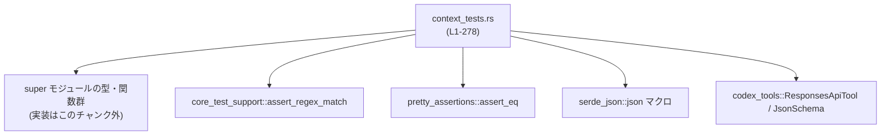
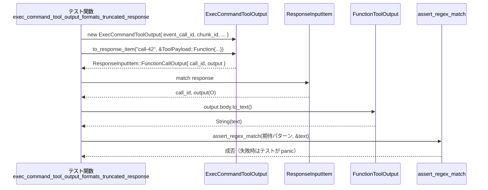

# core/src/tools/context_tests.rs コード解説

## 0. ざっくり一言

このファイルは、`super::*` でインポートされるツール実行コンテキスト周辺の型（`ToolPayload`, `FunctionToolOutput`, `CallToolResult`, `ToolSearchOutput`, `ExecCommandToolOutput` など）の**期待される振る舞いを検証するテスト集**です。  
主に「ペイロード → レスポンス」変換・ログ／テレメトリ用プレビュー・コマンド実行結果の整形仕様を固定しています。

---

## 1. このモジュールの役割

### 1.1 概要

このテストモジュールは次の問題を扱っています。

- ツール呼び出し用ペイロード (`ToolPayload`) が、レスポンス (`ResponseInputItem`) にどのように変換されるべきか
- 関数ツール出力 (`FunctionToolOutput`) からログプレビュー文字列をどのように生成するか
- テレメトリ送信用プレビュー (`telemetry_preview`) をサイズ・行数で安全にトリミングする仕様
- 外部コマンド実行結果 (`ExecCommandToolOutput`) を人間可読なテキストに整形する仕様

いずれも**本体実装は `super` モジュール側**にあり、このファイルはその振る舞いをブラックボックス的に検証しています。

### 1.2 アーキテクチャ内での位置づけ

このファイルの依存関係は概ね以下のようになっています。



- `super` モジュールには、以下で言及するコア型・関数が定義されていると読み取れます（`use super::*;` より、`context_tests.rs:L1`）。
- テスト検証用の補助として `core_test_support::assert_regex_match` を使用し、フォーマット文字列の正規表現検証を行っています（`context_tests.rs:L2`）。
- ツール情報や MCP 結果は `serde_json::json!` を介して JSON で比較されます（`context_tests.rs:L4, L49-60, L71-84, L173-183`）。

### 1.3 設計上のポイント（テストから読み取れる仕様）

コードから読み取れる設計上の特徴を列挙します。

- **ペイロード種別とレスポンス種別の対応**  
  - `ToolPayload::Custom` → `ResponseInputItem::CustomToolCallOutput`  
    （`context_tests.rs:L7-25, L88-133`）
  - `ToolPayload::Function` → `ResponseInputItem::FunctionCallOutput`  
    （`context_tests.rs:L27-44, L239-277`）
  - `ToolPayload::ToolSearch` → `ResponseInputItem::ToolSearchOutput`  
    （`context_tests.rs:L135-188`）
  - `ToolPayload::Mcp` → `CallToolResult::code_mode_result` の出力に `_meta` を含める  
    （`context_tests.rs:L47-85`）

- **構造化コンテンツとテキストの両立**  
  - `FunctionToolOutput` は `body`（構造化コンテンツ）と `content_items()` の両方を持ち、  
    必要に応じて `to_text()` によるプレーンテキストを生成する設計になっています  
    （`context_tests.rs:L11-12, L19-21, L93-108, L127-129`）。

- **ログ／テレメトリ向けプレビュー**  
  - `FunctionToolOutput::log_preview()` は、プレーンテキストがなくても `content_items` からプレビューを生成できます（`context_tests.rs:L190-203`）。
  - `telemetry_preview` は**バイト数**と**行数**の両方に上限を設け、トランケーション時に一定の通知文 (`TELEMETRY_PREVIEW_TRUNCATION_NOTICE`) を末尾に付与します（`context_tests.rs:L207-221, L225-236`）。

- **外部コマンド実行結果の整形**  
  - `ExecCommandToolOutput::to_response_item` は、チャンク ID、経過時間、終了コード、トークン数、トランケーション状況を含む多行テキストを生成し、`FunctionCallOutput` として返します（`context_tests.rs:L239-277`）。

- **エラーハンドリング方針（テスト観点）**  
  - 期待する `ResponseInputItem` バリアントでない場合は `panic!` させることで、変換契約が破れた場合にすぐ検知できる構成になっています（`context_tests.rs:L23-24, L42-43, L186-187, L276-277`）。
  - 並行実行やスレッドセーフティに関わるコードはこのチャンクには現れません（全体的な観察）。

---

## 2. コンポーネントインベントリー

### 2.1 このファイル内のテスト関数一覧

| テスト関数名 | 役割 / 目的 | 行範囲 |
|--------------|------------|--------|
| `custom_tool_calls_should_roundtrip_as_custom_outputs` | `ToolPayload::Custom` から `ResponseInputItem::CustomToolCallOutput` への変換と、テキスト／成功フラグの保持を検証する | `context_tests.rs:L6-25` |
| `function_payloads_remain_function_outputs` | `ToolPayload::Function` が `ResponseInputItem::FunctionCallOutput` になること、およびテキスト／成功フラグの保持を検証する | `context_tests.rs:L27-44` |
| `mcp_code_mode_result_serializes_full_call_tool_result` | `CallToolResult::code_mode_result` が MCP ペイロード用に、コンテンツ・構造化コンテンツ・エラー状態・メタ情報を JSON に正しく反映することを検証する | `context_tests.rs:L46-86` |
| `custom_tool_calls_can_derive_text_from_content_items` | `FunctionToolOutput::from_content` で与えたコンテンツ項目から、テキストを結合して生成できることを検証する | `context_tests.rs:L88-133` |
| `tool_search_payloads_roundtrip_as_tool_search_outputs` | `ToolPayload::ToolSearch` と `ToolSearchOutput::to_response_item` の組み合わせで、ツール検索結果が `ResponseInputItem::ToolSearchOutput` にシリアライズされることを検証する | `context_tests.rs:L135-188` |
| `log_preview_uses_content_items_when_plain_text_is_missing` | プレーンテキストがない場合でも、`log_preview` および `function_call_output_content_items_to_text` が `content_items` からプレビュー文字列を生成できることを検証する | `context_tests.rs:L190-203` |
| `telemetry_preview_returns_original_within_limits` | 入力が制限値以内のとき、`telemetry_preview` が内容を変更しないことを検証する | `context_tests.rs:L206-210` |
| `telemetry_preview_truncates_by_bytes` | バイト数が上限を超える場合に、`telemetry_preview` がトランケーション通知を付加しつつ長さを制限することを検証する | `context_tests.rs:L212-221` |
| `telemetry_preview_truncates_by_lines` | 行数が上限を超える場合に、`telemetry_preview` が行数を制限し、最後の行をトランケーション通知に置き換えることを検証する | `context_tests.rs:L223-236` |
| `exec_command_tool_output_formats_truncated_response` | `ExecCommandToolOutput::to_response_item` が、トークン数制限によりトランケートされた外部コマンド実行結果を所定フォーマットのテキストとして返すことを検証する | `context_tests.rs:L238-277` |

### 2.2 テストが参照するコアコンポーネント一覧（super モジュール側）

> 種別は、Rust の構文とテストコードから判断できる範囲で記述しています。定義本体はこのチャンクには現れません。

| 名前 | 種別 | 役割 / 用途 | 根拠行 |
|------|------|------------|--------|
| `ToolPayload` | 列挙体(enum) | ツール呼び出しのペイロード。`Custom`, `Function`, `Mcp`, `ToolSearch` などのバリアントを持つ | `Custom` 使用: `context_tests.rs:L8-10` / `Function`: `L29-31, L240-242` / `Mcp`: `L63-67` / `ToolSearch`: `L137-142` |
| `FunctionToolOutput` | 構造体（`body`, `success` フィールドあり） | 関数ツール実行の結果を表す。テキストまたは構造化コンテンツと、成功フラグを保持し、レスポンス項目への変換やログプレビュー生成を行う | 生成: `from_text` `L11-12, L32-33` / `from_content` `L93-108, L192-197` / フィールドアクセス `output.body`, `output.success`: `L19-21, L38-40, L127-129, L258-263` / メソッド `to_response_item`, `log_preview`: `L11-12, L32-33, L93-108, L143-159, L198-199` |
| `ResponseInputItem` | 列挙体(enum) | ツール実行結果を含むレスポンス要素。`CustomToolCallOutput`, `FunctionCallOutput`, `ToolSearchOutput` などのバリアントを持つ | パターンマッチ: `CustomToolCallOutput` `L14-23, L110-132` / `FunctionCallOutput` `L35-42, L256-276` / `ToolSearchOutput` `L161-187` |
| `CallToolResult` | 構造体 | MCP 等のツール呼び出し結果。`content`, `structured_content`, `is_error`, `meta` フィールドを持ち、`code_mode_result` で JSON に変換される | 定義利用: `L48-61` / メソッド `code_mode_result`: `L63-67, L69-85` |
| `FunctionCallOutputContentItem` | 列挙体(enum) | 関数ツール出力のコンテンツ要素。`InputText { text }`, `InputImage { image_url, detail }` などのバリアントを持つ | 生成: `L95-104, L114-125, L193-195` |
| `SearchToolCallParams` | 構造体 | ツール検索ペイロードのパラメータ。`query`, `limit` フィールドを持つ | `ToolPayload::ToolSearch` で利用: `L137-142` |
| `ToolSearchOutput` | 構造体 | ツール検索結果。`tools: Vec<ToolSearchOutputTool>` フィールドを持つ | 生成: `L143-158` / メソッド `to_response_item`: `L159` |
| `ToolSearchOutputTool` | 列挙体(enum) | ツール検索結果の要素。`Function(codex_tools::ResponsesApiTool)` などのバリアント | `ToolSearchOutputTool::Function(...)`: `L144-157` |
| `ExecCommandToolOutput` | 構造体 | 外部コマンド実行の結果とメタ情報。`event_call_id`, `chunk_id`, `wall_time`, `raw_output`, `max_output_tokens`, `exit_code`, `original_token_count` などを保持し、`to_response_item` で整形結果を返す | 生成: `L243-253` / メソッド `to_response_item`: `L254` |
| `telemetry_preview` | 関数 | テレメトリに記録する文字列をバイト数／行数の上限内にトリミングし、必要に応じてトランケーション通知を付与する | 使用: `L207-210, L214-221, L231-235` |
| `function_call_output_content_items_to_text` | 関数 | `FunctionToolOutput` の `body`（コンテンツ項目群）から、テキストのみを抽出して 1 つの `String` にまとめる | 使用: `L201-203` |
| `TELEMETRY_PREVIEW_MAX_BYTES` | 定数 | `telemetry_preview` が使用するプレビューの最大バイト数 | 使用: `L214-221` |
| `TELEMETRY_PREVIEW_MAX_LINES` | 定数 | `telemetry_preview` が使用するプレビューの最大行数 | 使用: `L225-235` |
| `TELEMETRY_PREVIEW_TRUNCATION_NOTICE` | 定数 | トランケーション時に末尾に付与する通知文字列 | 使用: `L217-221, L234-235` |

---

## 3. 公開 API と詳細解説（テストから読み取れる範囲）

> ここでの関数・メソッド定義はすべて **super モジュール側の実装** です。  
> このファイルにはシグネチャ本体がないため、**テストコードから読み取れる挙動のみ**を記述し、推測である場合はその旨を明記します。

### 3.1 型一覧（構造体・列挙体など）

| 名前 | 種別 | 役割 / 用途 | 関連テスト |
|------|------|-------------|------------|
| `ToolPayload` | 列挙体 | ツール呼び出しのペイロード。`Custom`, `Function`, `Mcp`, `ToolSearch` バリアントを持ち、`to_response_item` などの挙動を切り替えるトリガとなる | `custom_tool_calls_should_roundtrip_as_custom_outputs` `L7-12`, `function_payloads_remain_function_outputs` `L28-33`, `mcp_code_mode_result_serializes_full_call_tool_result` `L63-67`, `tool_search_payloads_roundtrip_as_tool_search_outputs` `L136-142`, `exec_command_tool_output_formats_truncated_response` `L239-242` |
| `FunctionToolOutput` | 構造体 | 関数ツールの実行結果。テキストまたはコンテンツ項目 (`FunctionCallOutputContentItem`) と成功フラグ (`success: Option<bool>`) を持ち、レスポンス項目への変換とログプレビュー生成を行う | `L11-12, L19-21, L32-33, L38-40, L93-108, L127-129, L190-199, L201-203, L243-264` |
| `ResponseInputItem` | 列挙体 | 1 つのレスポンス要素を表す。`CustomToolCallOutput`, `FunctionCallOutput`, `ToolSearchOutput` などのバリアントを持ち、テストではパターンマッチにより期待バリアントを検証 | `L14-23, L35-42, L110-132, L161-187, L256-276` |
| `CallToolResult` | 構造体 | MCP 等からのツール呼び出し結果を表し、`code_mode_result` で JSON へ変換可能なデータモデル | `L48-61, L63-85` |
| `FunctionCallOutputContentItem` | 列挙体 | ツール出力の内容要素を表す。`InputText { text }` や `InputImage { image_url, detail }` などの種類を持ち、ログプレビューやテキスト生成の元となる | `L95-104, L114-125, L193-195` |
| `SearchToolCallParams` | 構造体 | ツール検索時の引数をまとめるパラメータ。`query: String`, `limit: Option<_>` フィールドあり | `L137-142` |
| `ToolSearchOutput` | 構造体 | ツール検索のレスポンス。`tools: Vec<ToolSearchOutputTool>` フィールドを持ち、`to_response_item` により `ResponseInputItem::ToolSearchOutput` に変換される | `L143-159, L161-187` |
| `ToolSearchOutputTool` | 列挙体 | ツール検索結果の各要素。少なくとも `Function(ResponsesApiTool)` バリアントを持ち、JSON シリアライズされたツール記述として返される | `L144-157, L172-183` |
| `ExecCommandToolOutput` | 構造体 | 外部コマンドの実行結果とメタデータを保持。`to_response_item` で `FunctionCallOutput` 形式のテキストに変換される | `L243-254, L256-275` |

### 3.2 重要な関数・メソッド詳細（7件）

#### 1. `FunctionToolOutput::to_response_item(call_id: &str, payload: &ToolPayload) -> ResponseInputItem`（推定）

**概要**

- 関数ツールの実行結果 (`FunctionToolOutput`) を、`ToolPayload` の種別に応じた `ResponseInputItem` バリアントに変換するメソッドです。
- テストからは、`ToolPayload::Custom` の場合は `CustomToolCallOutput`、`ToolPayload::Function` の場合は `FunctionCallOutput` が生成されることが分かります（`context_tests.rs:L7-25, L27-44, L88-133`）。

**引数（テストから推定）**

| 引数名 | 型 | 説明 | 根拠 |
|--------|----|------|------|
| `call_id` | `&str` | 呼び出し ID。レスポンスにも同じ値が格納される | `"call-42"` / `"fn-1"` / `"call-99"` を渡している: `L11-12, L32-33, L108, L254` |
| `payload` | `&ToolPayload` | ツール呼び出しのペイロード。バリアントに応じて生成される `ResponseInputItem` の種類が変わる | `ToolPayload::Custom`, `ToolPayload::Function` など: `L8-12, L29-33, L90-92` |

**戻り値**

- `ResponseInputItem`（列挙体）。少なくとも以下のバリアントを返します（テストから確認可能な範囲）。
  - `ResponseInputItem::CustomToolCallOutput { call_id, output, .. }`（`ToolPayload::Custom` のとき: `L14-23, L110-132`）
  - `ResponseInputItem::FunctionCallOutput { call_id, output }`（`ToolPayload::Function` のとき: `L35-42, L256-276`）

**内部処理の流れ（テストからの推測）**

このメソッド本体はこのチャンクには現れませんが、振る舞いは次のように解釈できます。

1. `payload` のバリアントに応じて分岐する。
2. `ToolPayload::Custom` の場合  
   - `ResponseInputItem::CustomToolCallOutput` を生成し、`call_id` をそのままフィールドにコピーする（`L14-18, L110-112, L126-127`）。
   - `FunctionToolOutput` 自身を `output` に入れ、`output.content_items()` は `from_text` 起源なら `None`、`from_content` 起源なら元の配列を返すようにしている（`L19-20, L127-128`）。
3. `ToolPayload::Function` の場合  
   - `ResponseInputItem::FunctionCallOutput` を生成し、同様に `call_id` と `output` を設定する（`L35-40, L256-259`）。
4. その他のバリアントについては、このファイルでは利用がないため不明です（`ToolSearch` や `Mcp` は別の型／メソッドが扱っています）。

**Examples（使用例）**

テストを簡略化した使用例です（モジュールパスは仮のものです。実際のパスはこのチャンクには現れません）。

```rust
use crate::tools::context::{ToolPayload, FunctionToolOutput};

// テキストのみの関数ツール出力から FunctionCallOutput を生成する例
let payload = ToolPayload::Function {
    arguments: "{}".to_string(), // 関数呼び出しの JSON 引数
};

let output = FunctionToolOutput::from_text("ok".to_string(), Some(true));
// 上の from_text はテキストと成功フラグから FunctionToolOutput を作る（L32-33）

let response = output.to_response_item("fn-1", &payload);

match response {
    ResponseInputItem::FunctionCallOutput { call_id, output } => {
        assert_eq!(call_id, "fn-1");                           // L37-38
        assert_eq!(output.body.to_text().as_deref(), Some("ok")); // L39-40
        assert_eq!(output.success, Some(true));                // L40
    }
    _ => unreachable!("テストではここには来ない想定"),             // L42-43
}
```

**Errors / Panics**

- このメソッド自体が `Result` を返す証拠はなく、テストでは単純に値として受け取っています（`L11-12, L32-33, L93-108, L254`）。
- テスト側では「期待と異なるバリアント」を受け取った場合に `panic!` していますが、これは**テストの契約違反**の検出であり、`to_response_item` 自身の挙動ではありません（`L23-24, L42-43, L131-132, L186-187, L276-277`）。

**Edge cases（エッジケース）**

- `from_text` から生成された出力では `output.content_items()` は `None` になることが前提になっています（`L19-20, L38-39`）。
- `from_content` から生成された出力では、`content_items()` で与えた配列そのものが返る想定です（`L114-125, L127-128`）。
- `success` フィールドが `Some(true)` 以外（`Some(false)` や `None`）のケースは、このファイルではテストされていないため挙動は不明です。

**使用上の注意点**

- **契約**: `ToolPayload` のバリアントと `ResponseInputItem` のバリアントが**必ず対応している**ことを前提としています。実装を変更する場合、このテストが壊れないように対応関係を維持する必要があります（`L7-25, L27-44, L88-133, L135-188, L238-277`）。
- **安全性**: 変換は純粋なデータ変換であり、I/O やスレッド操作は含まれていません。このチャンクからはメモリ安全性上の問題は読み取れません。

---

#### 2. `CallToolResult::code_mode_result(payload: &ToolPayload) -> serde_json::Value`（推定）

**概要**

- MCP サーバーなどのツールから返ってきた `CallToolResult` を、「コードモード」向けの JSON 表現に変換するメソッドです。
- `ToolPayload::Mcp` の場合、`CallToolResult` 内部のフィールドを JSON にマッピングし、`meta` フィールドは `_meta` キーに入ります（`context_tests.rs:L48-61, L63-85`）。

**引数**

| 引数名 | 型 | 説明 | 根拠 |
|--------|----|------|------|
| `payload` | `&ToolPayload` | MCP 呼び出しのペイロード。テストでは `ToolPayload::Mcp` バリアントが渡されています | `L63-67` |

**戻り値**

- `serde_json::Value`（`json!` マクロと比較しているため）。内容は以下のような構造になります。

```json
{
  "content": [ /* CallToolResult.content */ ],
  "structuredContent": /* CallToolResult.structured_content */,
  "isError": /* CallToolResult.is_error */,
  "_meta": /* CallToolResult.meta */
}
```

（テスト例: `context_tests.rs:L69-85`）

**内部処理の流れ（推測）**

1. `CallToolResult` の `content`, `structured_content`, `is_error`, `meta` フィールドを読み取る（`L48-60`）。
2. `payload` が `ToolPayload::Mcp { .. }` であることを前提として、JSON オブジェクトを組み立てる。
3. `meta` は `_meta` というキーにマッピングされる（`L81-83`）。

**Examples（使用例）**

```rust
// MCP 呼び出しの結果を JSON に変換する想定の例
let output = CallToolResult {
    content: vec![serde_json::json!({
        "type": "text",
        "text": "ignored",
    })],
    structured_content: Some(serde_json::json!({
        "threadId": "thread_123",
        "content": "done",
    })),
    is_error: Some(false),
    meta: Some(serde_json::json!({
        "source": "mcp",
    })),
};

let result = output.code_mode_result(&ToolPayload::Mcp {
    server: "server".to_string(),
    tool: "tool".to_string(),
    raw_arguments: "{}".to_string(),
});

assert_eq!(result, serde_json::json!({
    "content": [{
        "type": "text",
        "text": "ignored",
    }],
    "structuredContent": {
        "threadId": "thread_123",
        "content": "done",
    },
    "isError": false,
    "_meta": {
        "source": "mcp",
    },
}));
```

（上記は `context_tests.rs:L48-85` をほぼそのまま再掲）

**Errors / Panics**

- テストでは `Result` を返しておらず、単純な値構築で失敗する余地は限定的です。
- `meta` などが `None` の場合の扱いはこのファイルからは分かりません（`meta: Some(...)` のみが検証されているため）。

**Edge cases**

- `content` が空配列のときや `structured_content`/`meta` が `None` のときの JSON 表現は、このチャンクには現れません。
- `is_error` が `Some(true)` のケースも未検証です。

**使用上の注意点**

- MCP 用に特化した JSON 形式であるため、他の `ToolPayload` バリアントに使うかどうかは実装依存です（このチャンクには現れません）。
- JSON キーのスペル（`structuredContent`, `isError`, `_meta`）はテストにより固定されているため、変更すると互換性が失われます（`L71-83`）。

---

#### 3. `ToolSearchOutput::to_response_item(call_id: &str, payload: &ToolPayload) -> ResponseInputItem`（推定）

**概要**

- ツール検索結果 (`ToolSearchOutput`) を `ResponseInputItem::ToolSearchOutput` に変換するメソッドです。
- 少なくとも `ToolPayload::ToolSearch` に対して利用され、ステータスや実行方式、ツール一覧を JSON で返します（`context_tests.rs:L135-188`）。

**引数**

| 引数名 | 型 | 説明 | 根拠 |
|--------|----|------|------|
| `call_id` | `&str` | 検索呼び出し ID | `"search-1"` を渡している: `L159, L168` |
| `payload` | `&ToolPayload` | 検索ペイロード。テストでは `ToolPayload::ToolSearch` バリアントが渡される | `L137-142, L159` |

**戻り値**

- `ResponseInputItem::ToolSearchOutput { call_id, status, execution, tools }`  
  （テストの pattern matching より: `L161-166`）

**内部処理の流れ（推測）**

1. `ToolSearchOutput` の `tools` フィールドを走査し、各 `ToolSearchOutputTool` を JSON 化する。
   - `ToolSearchOutputTool::Function(ResponsesApiTool)` の場合、`type: "function"` などのフィールドを生成する（`L144-157, L172-183`）。
2. `status` に `"completed"`、`execution` に `"client"` を設定する（`L168-170`）。
3. 生成した `tools` 配列・`status`・`execution`・`call_id` を用いて `ResponseInputItem::ToolSearchOutput` を構築する。

**Examples（使用例）**

```rust
let payload = ToolPayload::ToolSearch {
    arguments: SearchToolCallParams {
        query: "calendar".to_string(),
        limit: None,
    },
};

let response = ToolSearchOutput {
    tools: vec![ToolSearchOutputTool::Function(
        codex_tools::ResponsesApiTool {
            name: "create_event".to_string(),
            description: String::new(),
            strict: false,
            defer_loading: Some(true),
            parameters: codex_tools::JsonSchema::object(
                Default::default(), // properties
                None,               // required
                None,               // additional_properties
            ),
            output_schema: None,
        },
    )],
}.to_response_item("search-1", &payload);

match response {
    ResponseInputItem::ToolSearchOutput { call_id, status, execution, tools } => {
        assert_eq!(call_id, "search-1");
        assert_eq!(status, "completed");
        assert_eq!(execution, "client");
        // ツール JSON の構造を検証（L172-183）
    }
    _ => unreachable!(),
}
```

**Errors / Panics**

- このメソッド自体にエラー戻り値はなく、シリアライズできない場合の挙動はこのチャンクからは分かりません。
- 想定外の `ToolPayload` バリアントを渡した場合の挙動も未定義です（テストでは `ToolSearch` のみ）。

**Edge cases**

- `tools` 配列が空のときの挙動は未検証です。
- `ResponsesApiTool` の `output_schema` が `Some` のときの JSON 表現は不明です。

**使用上の注意点**

- `status` と `execution` フィールドの固定値（`"completed"`, `"client"`）は**外部プロトコル仕様**に対応している可能性があり、変更には注意が必要です（`L168-170`）。
- `parameters` の JSON 形式は `JsonSchema::object` の仕様に依存します。このテストでは追加プロパティや required が無いケースのみをカバーしています（`L150-154, L173-183`）。

---

#### 4. `FunctionToolOutput::log_preview(&self) -> String`（推定）

**概要**

- ログ用の短いプレビュー文字列を返すメソッドです。
- プレーンテキストが無い場合でも、`content_items` に含まれるテキストからプレビューを生成します（`context_tests.rs:L190-203`）。

**引数**

- レシーバ `&self`: `FunctionToolOutput` インスタンス。

**戻り値**

- `String`。ログに記録しやすい短いテキストを返します。

**内部処理の流れ（推測）**

テストから推測される動きは次の通りです（`L190-203`）。

1. まず `self.body.to_text()` など、プレーンテキストが既に存在するかを確認する（直接のコードはこのチャンクにはありませんが、`function_call_output_content_items_to_text` の利用から推測）。
2. プレーンテキストが無い／空のときは、`content_items` から `InputText` の内容を連結し、プレビュー文字列を作成する。
3. 上記のいずれかの結果を返す。

テストでは `from_content` で作られた `FunctionToolOutput` が `"preview"` を返すことが確認されています（`L192-199`）。

**Examples（使用例）**

```rust
let output = FunctionToolOutput::from_content(
    vec![FunctionCallOutputContentItem::InputText {
        text: "preview".to_string(),
    }],
    Some(true),
);

assert_eq!(output.log_preview(), "preview"); // L199
```

**Errors / Panics**

- テストでは単に `String` を返しており、エラーは発生しません。

**Edge cases**

- `content_items` が空、またはテキストを含まない場合の挙動はこのチャンクには現れません。
- 非 UTF-8 なバイト列を扱うケースは `FunctionToolOutput` ではなく `ExecCommandToolOutput` 側で現れているため、`log_preview` に関しては不明です。

**使用上の注意点**

- ログに長大なテキストを出したくない場合、別途 `telemetry_preview` などと組み合わせる必要がある可能性があります（設計としてはそう想定されますが、このチャンクからは断定できません）。

---

#### 5. `function_call_output_content_items_to_text(body: &BodyType) -> Option<String>`（推定）

**概要**

- 関数ツール出力のコンテンツ項目群から、テキスト部分のみを抽出して 1 つの `String` にまとめるヘルパ関数です（`context_tests.rs:L201-203`）。

**引数（推定）**

| 引数名 | 型 | 説明 | 根拠 |
|--------|----|------|------|
| `body` | `&FunctionToolOutputBody`（名称は仮） | `FunctionToolOutput` の `body`。内部に `FunctionCallOutputContentItem` のリストを保持していると思われます | 呼び出し箇所: `function_call_output_content_items_to_text(&output.body)` `L201-202` |

**戻り値**

- `Option<String>`  
  - テキストが1つ以上存在する場合: それらを結合した `String` を `Some` で返す  
    （テストでは `"preview"` を返している: `L201-203`）  
  - テキストが存在しない場合: `None`（このケースはテストされていません）

**内部処理（推測）**

1. `body` 内の `FunctionCallOutputContentItem` のリストを走査する。
2. `InputText { text }` バリアントだけを抽出し、必要に応じて改行などで結合する。
3. 抽出結果があれば `Some(concatenated_text)`、なければ `None` を返す。

**使用例**

```rust
let output = FunctionToolOutput::from_content(
    vec![FunctionCallOutputContentItem::InputText {
        text: "preview".to_string(),
    }],
    Some(true),
);

let text = function_call_output_content_items_to_text(&output.body);
assert_eq!(text, Some("preview".to_string())); // L201-203
```

**Errors / Panics**

- `Option` を返すため、呼び出し元は `None` の可能性をハンドリングする必要があります。

**Edge cases**

- テキストと画像等が混在する場合の結合ルール（改行で区切るのか等）はテストからは分かりません（`custom_tool_calls_can_derive_text_from_content_items` では `FunctionToolOutput` 内部の `body.to_text()` が同様の処理をしていると推測されますが、この関数自体では検証されていません: `L88-133`）。

---

#### 6. `telemetry_preview(content: &str) -> String`

**概要**

- テレメトリ（計測・ロギング）に送る文字列のプレビューを生成し、**サイズ（バイト数）**と**行数**が一定の上限を超えないようにトリミングする関数です。
- トリミングが発生した場合、`TELEMETRY_PREVIEW_TRUNCATION_NOTICE` という通知文を末尾に付与します（`context_tests.rs:L212-221, L225-236`）。

**引数**

| 引数名 | 型 | 説明 | 根拠 |
|--------|----|------|------|
| `content` | `&str` | プレビュー対象の文字列 | 使用箇所: `L208-210, L214-215, L226-231` |

**戻り値**

- `String`。トランケートされた（またはそのままの）プレビュー文字列。

**内部処理の流れ（テストから分かる範囲）**

1. **サイズ・行数が上限内の場合**  
   - `telemetry_preview` は入力を変更せず、そのまま返す（`telemetry_preview_returns_original_within_limits`: `L207-210`）。
2. **バイト数が `TELEMETRY_PREVIEW_MAX_BYTES` を超える場合**  
   - 入力の一部だけを採用し、末尾に `TELEMETRY_PREVIEW_TRUNCATION_NOTICE` を追加する（`L214-221`）。
   - 戻り値の `len()` （ここでは ASCII のみを使っているためバイト数と等価）が `TELEMETRY_PREVIEW_MAX_BYTES + TELEMETRY_PREVIEW_TRUNCATION_NOTICE.len() + 1` 以下になるよう制限されます。`+1` はおそらく改行やスペースのためです（`L219-221`）。
3. **行数が `TELEMETRY_PREVIEW_MAX_LINES` を超える場合**  
   - 上限行数までを残し、最後の行を `TELEMETRY_PREVIEW_TRUNCATION_NOTICE` に差し替える（`L225-236`）。

**Examples（使用例）**

```rust
// 制限以内の短い文字列
let content = "short output";
assert_eq!(telemetry_preview(content), content); // L207-210

// バイト数によるトランケーション
let content = "x".repeat(TELEMETRY_PREVIEW_MAX_BYTES + 8);
let preview = telemetry_preview(&content);
assert!(preview.contains(TELEMETRY_PREVIEW_TRUNCATION_NOTICE)); // L217
assert!(
    preview.len()
        <= TELEMETRY_PREVIEW_MAX_BYTES + TELEMETRY_PREVIEW_TRUNCATION_NOTICE.len() + 1
); // L219-221

// 行数によるトランケーション
let content = (0..(TELEMETRY_PREVIEW_MAX_LINES + 5))
    .map(|idx| format!("line {idx}"))
    .collect::<Vec<_>>()
    .join("\n");
let preview = telemetry_preview(&content);
let lines: Vec<&str> = preview.lines().collect();

assert!(lines.len() <= TELEMETRY_PREVIEW_MAX_LINES + 1);      // L234
assert_eq!(lines.last(), Some(&TELEMETRY_PREVIEW_TRUNCATION_NOTICE)); // L235
```

**Errors / Panics**

- この関数は `String` を返すだけで、`Result` などは使用していません。テストからはパニック条件は読み取れません。

**Edge cases**

- **多バイト文字**: テストでは `"x"` のみが使われており、ASCII 1 バイト文字に限定されています。  
  UTF-8 のマルチバイト文字を含む場合、**バイト単位のトランケーション** が文字境界を壊さないかどうかはこのチャンクからは分かりません。
- **非常に長い 1 行**: 行数制限とバイト数制限のどちらが優先されるか（または両方が適用されるか）は未検証です。

**使用上の注意点**

- この関数は「プレビュー」を返すのであり、**完全なログの代替ではない**点に注意が必要です。
- トランケーション通知 (`TELEMETRY_PREVIEW_TRUNCATION_NOTICE`) の文言を変更すると、テストや外部依存コードにも影響します。

---

#### 7. `ExecCommandToolOutput::to_response_item(call_id: &str, payload: &ToolPayload) -> ResponseInputItem`（推定）

**概要**

- 外部コマンド実行結果 (`ExecCommandToolOutput`) を、ユーザー向けテキストを含む `ResponseInputItem::FunctionCallOutput` に変換するメソッドです。
- テキストは、チャンク ID・実行時間・終了コード・トークン数と、トランケーション情報を含む複数行のサマリフォーマットになっています（`context_tests.rs:L239-277`）。

**引数**

| 引数名 | 型 | 説明 | 根拠 |
|--------|----|------|------|
| `call_id` | `&str` | 呼び出し ID。`event_call_id` と同一値を渡している | `"call-42"` を使用: `L243-245, L254, L258` |
| `payload` | `&ToolPayload` | 関数呼び出しペイロード。ここでは `ToolPayload::Function` が渡されている | `L240-242, L254` |

**戻り値**

- `ResponseInputItem::FunctionCallOutput { call_id, output }`  
  ここで `output` は `FunctionToolOutput`（推定）であり、`output.success == Some(true)` です（`L256-259`）。

**内部処理の流れ（テストから推測）**

テキストフォーマットは正規表現で検証されています（`L264-272`）。

1. `ExecCommandToolOutput` のフィールドから情報を取得する。
   - `chunk_id`: `"abc123"`（`L245`）
   - `wall_time`: `Duration::from_millis(1250)` → テキストでは `x.xxxx seconds` として出力（`L246, L267`）
   - `exit_code`: `Some(0)` → `"Process exited with code 0"`（`L250, L268`）
   - `original_token_count`: `Some(10)` → `"Original token count: 10"`（`L251, L269`）
   - `max_output_tokens`: `Some(4)` → 出力に「tokens truncated」の文言を含める（`L247, L271`）
2. これらを含む複数行のテキストを構築する。正規表現から、少なくとも以下の行が含まれます（`L264-272`）。

   - `Chunk ID: abc123`
   - `Wall time: <数値>.<4桁> seconds`
   - `Process exited with code 0`
   - `Original token count: 10`
   - `Output:`
   - その後の行に「tokens truncated」を含む何らかの出力

3. 生成したテキストを `FunctionToolOutput.body` に格納し、`success: Some(true)` を設定する（`L258-263`）。

**Examples（使用例）**

```rust
let payload = ToolPayload::Function {
    arguments: "{}".to_string(),
};

let response = ExecCommandToolOutput {
    event_call_id: "call-42".to_string(),
    chunk_id: "abc123".to_string(),
    wall_time: std::time::Duration::from_millis(1250),
    raw_output: b"token one token two token three token four token five".to_vec(),
    max_output_tokens: Some(4),
    process_id: None,
    exit_code: Some(0),
    original_token_count: Some(10),
    session_command: None,
}.to_response_item("call-42", &payload);

match response {
    ResponseInputItem::FunctionCallOutput { call_id, output } => {
        assert_eq!(call_id, "call-42");
        assert_eq!(output.success, Some(true));
        let text = output.body.to_text().expect("exec output should serialize as text");
        // text の内容は正規表現で検証される（L264-272）
    }
    _ => unreachable!(),
}
```

**Errors / Panics**

- `output.body.to_text()` は `Option<String>` を返し得ますが、このテストでは `.expect("exec output should serialize as text")` を呼んでいるため、**非テキスト化可能な場合はパニック**になります（`L260-263`）。
  - 実装側で `raw_output` を常に UTF-8 とみなしているならば、安全性は `raw_output` の生成元に依存します。

**Edge cases**

- `raw_output` が UTF-8 でない場合の挙動は、このチャンクからは分かりません。
- `max_output_tokens` が `None` や `Some` だが `original_token_count` 以下か、といったケースは未検証です。
- `exit_code` が `None` または非 0 の場合のメッセージフォーマットも不明です。

**使用上の注意点**

- `to_response_item` の出力は **人間向けのサマリテキスト** であり、機械処理用の生の標準出力／標準エラーとは異なります。
- テキスト形式（特に行構造やラベル）は正規表現テストで固定されているため、変更する場合はテストの更新が必要です（`L264-272`）。

---

### 3.3 その他の関数・定数（テストから存在が分かるもの）

| 名前 | 種別 | 役割 / 1行説明 | 根拠 |
|------|------|----------------|------|
| `FunctionToolOutput::from_text` | 関連関数 | テキストと成功フラグから `FunctionToolOutput` を構築する | 使用: `L11-12, L32-33` |
| `FunctionToolOutput::from_content` | 関連関数 | コンテンツ項目と成功フラグから `FunctionToolOutput` を構築する | 使用: `L93-108, L192-197` |
| `TELEMETRY_PREVIEW_MAX_BYTES` | 定数 | テレメトリプレビューの最大バイト数 | 使用: `L214-221` |
| `TELEMETRY_PREVIEW_MAX_LINES` | 定数 | テレメトリプレビューの最大行数 | 使用: `L225-236` |
| `TELEMETRY_PREVIEW_TRUNCATION_NOTICE` | 定数 | トランケーション時に表示する通知文字列 | 使用: `L217-221, L234-235` |

---

## 4. データフロー

ここでは代表的なシナリオとして、外部コマンド実行結果の整形フロー（`exec_command_tool_output_formats_truncated_response`）を取り上げます。

### 4.1 ExecCommandToolOutput → ResponseInputItem → ログ検証の流れ

このフローは `exec_command_tool_output_formats_truncated_response` テスト（`context_tests.rs:L239-277`）に対応します。



**要点**

- テストは、`ExecCommandToolOutput` → `ResponseInputItem::FunctionCallOutput` → `FunctionToolOutput.body.to_text()` の流れを通じて、**最終的なテキスト表現**を検証しています（`L243-263`）。
- テキストには、`chunk_id`, `wall_time`, `exit_code`, `original_token_count`, `max_output_tokens` に由来する情報と、「tokens truncated」という文言が含まれます（`L264-272`）。
- これにより、外部コマンドの実行状況がテレメトリやログに十分な情報量で記録されることが保証されます。

---

## 5. 使い方（How to Use）

このファイル自体はテスト専用ですが、テストコードは実装の具体的な使い方の良い例になっています。ここでは主な使用パターンを整理します。

### 5.1 基本パターン: FunctionToolOutput からレスポンス生成

```rust
use crate::tools::context::{
    ToolPayload,
    FunctionToolOutput,
    ResponseInputItem,
    FunctionCallOutputContentItem,
};

// 1. ペイロードを構築する
let payload = ToolPayload::Custom {
    input: "patch".to_string(),                     // 呼び出し元からの入力
};

// 2. ツール実行結果を構築する（テキストベース）
let output = FunctionToolOutput::from_text(
    "patched".to_string(),                          // 実行結果のテキスト
    Some(true),                                     // 成功フラグ
);

// 3. レスポンス項目へ変換
let response = output.to_response_item("call-42", &payload);

// 4. 呼び出し元でバリアントに応じて処理
match response {
    ResponseInputItem::CustomToolCallOutput { call_id, output, .. } => {
        assert_eq!(call_id, "call-42");
        // output.body.to_text() や output.content_items() で中身を確認する
    }
    _ => { /* 想定外のバリアント */ }
}
```

（`custom_tool_calls_should_roundtrip_as_custom_outputs` の簡略版: `L7-25`）

### 5.2 構造化コンテンツからテキストを導出するパターン

```rust
// 複数のコンテンツ項目（テキストと画像）を含む出力
let output = FunctionToolOutput::from_content(
    vec![
        FunctionCallOutputContentItem::InputText { text: "line 1".into() },
        FunctionCallOutputContentItem::InputImage {
            image_url: "data:image/png;base64,AAA".into(),
            detail: None,
        },
        FunctionCallOutputContentItem::InputText { text: "line 2".into() },
    ],
    Some(true),
);

// content_items() では元の配列がそのまま取得できる（L114-125, L127-128）
let items = output.content_items().unwrap();
assert_eq!(items.len(), 3);

// body.to_text() ではテキスト要素だけを結合した文字列が得られる（L128-129）
assert_eq!(output.body.to_text().as_deref(), Some("line 1\nline 2"));
```

### 5.3 テレメトリ用プレビューの利用パターン

```rust
// ログやテレメトリに記録したい大きな文字列
let content = get_large_output();

// プレビューに絞った文字列に変換
let preview = telemetry_preview(&content);

// preview を JSON などに入れて送信する
send_telemetry(preview);
```

- `content` が大きい場合でも、`telemetry_preview` がサイズ・行数を制限し、トランケーション通知を付与することで、**テレメトリの負荷と情報量のバランス**を取ります（`L212-221, L225-236`）。

### 5.4 よくある間違いと注意点

```rust
// 間違い例: ペイロードとレスポンスバリアントの対応を無視
let payload = ToolPayload::Custom { input: "patch".into() };
let response = FunctionToolOutput::from_text("patched".into(), Some(true))
    .to_response_item("call-42", &payload);

match response {
    // Custom に対して FunctionCallOutput を期待してしまう
    ResponseInputItem::FunctionCallOutput { .. } => { /* ... */ }
    _ => { /* 想定外 */ }
}

// 正しい例: payload の種類に応じて期待バリアントを切り替える
match response {
    ResponseInputItem::CustomToolCallOutput { .. } => { /* Custom 用処理 */ }
    _ => { /* 想定外 */ }
}
```

- **注意点（まとめ）**
  - `ToolPayload` と `ResponseInputItem` のバリアント対応を意識する（`L7-25, L27-44, L135-188, L238-277`）。
  - `telemetry_preview` はプレビュー用であり、完全なログを必要とする場合は別途フルテキストも保持すべきです（このチャンクからはフルテキストの扱いは不明）。
  - `ExecCommandToolOutput` の `raw_output` は、`to_text()` でパニックを起こさないよう、UTF-8 を前提としたバイト列にしておくことが望ましいと推測されます（`L260-263`）。

---

## 6. 変更の仕方（How to Modify）

### 6.1 新しい機能を追加する場合の入り口

このファイルは、**既存 API の仕様をテストとして固定する**役割を持ちます。そのため、新機能や新バリアントを追加する際には以下の点が有用です。

1. **新しい `ToolPayload` バリアントを追加する場合**
   - super モジュールでバリアントを追加し、`to_response_item` などに対応を実装する。
   - そのうえで、このファイルに新しいテスト関数を追加し、期待する `ResponseInputItem` バリアントとフィールドを検証する。

2. **`telemetry_preview` の仕様変更**
   - 上限バイト数や行数、通知文言を変える場合は、対応する定数とこのファイル内のテスト（`L212-221, L225-236`）を更新する。
   - 特に通知文言は文字列一致テストになっているため、変更忘れがないようにする。

3. **`ExecCommandToolOutput` のフォーマット変更**
   - テキストフォーマットを変える場合、正規表現テスト（`L264-272`）を合わせて修正することで、フォーマット変更が意図したものかどうかを自動で検証できます。

### 6.2 既存機能を変更する際の注意点

- **契約の確認**
  - `ResponseInputItem` の各バリアントのフィールド（`call_id`, `status`, `execution`, `tools` など）はテストで検証されているため、意味や型を変える場合はテストの期待値も明示的に更新する必要があります（`L14-23, L35-42, L161-187, L256-276`）。
- **エッジケースのテスト追加**
  - このチャンクでは多バイト文字やエラーコードなどのエッジケースが十分にカバーされていません。こうしたケースを実装に追加する場合は、テストを補うことで将来の退行を防げます。
- **並行性に関する変更**
  - 現状、このファイルでは非同期やスレッドに関するコードは扱っていません。もし将来、ツール実行やコマンド実行を非同期化する場合でも、**公開 API の戻り値の形**（`ResponseInputItem` など）が変わらない限り、このテストは有用なままです。

---

## 7. 関連ファイル

このファイルと密接に関係するコンポーネントをまとめます。

| パス / モジュール | 役割 / 関係 |
|-------------------|------------|
| `super` モジュール（具体的なファイルはこのチャンクには現れない） | `ToolPayload`, `FunctionToolOutput`, `ResponseInputItem`, `CallToolResult`, `ToolSearchOutput`, `ExecCommandToolOutput`, `telemetry_preview` など、本テストが検証しているコア実装を提供する |
| `core_test_support` クレート（`assert_regex_match`） | 正規表現ベースで文字列を検証するテストユーティリティ。`ExecCommandToolOutput` の出力形式検証に使用 |
| `codex_tools` クレート | ツール定義 (`ResponsesApiTool`) や JSON スキーマ (`JsonSchema`) の実装を提供し、ツール検索出力のシリアライズ対象として利用される（`context_tests.rs:L144-157`） |
| `serde_json` | `json!` マクロによる JSON 構築および比較を行うライブラリ。MCP 結果やツール検索結果の期待値記述に使用される |

---

## 安全性・バグ・セキュリティに関する補足（テスト観点）

- **メモリ安全性**  
  - すべてのコードは安全な Rust 構文（`std` や安全なクレート API）で書かれており、`unsafe` ブロックは登場しません。このチャンクからメモリ安全性の問題は読み取れません。
- **エラー・パニック**  
  - 多くのテストが期待バリアントでない場合に `panic!` を発生させることで、**型レベルの契約**を検証しています（`L23-24, L42-43, L131-132, L186-187, L276-277`）。
  - `ExecCommandToolOutput` のテストでは `to_text().expect(...)` を用いており、`raw_output` がテキスト化できる前提であることが暗黙に契約化されています（`L260-263`）。
- **セキュリティ上の観点**  
  - このファイル単体では、入力検証や認可・認証に関するコードは存在せず、主にフォーマットと変換のみを扱っています。
  - `telemetry_preview` は大きな出力の一部だけを送る設計であり、**情報漏えいリスクの制御**に寄与する可能性がありますが、何をトリミングするかの詳細なポリシーはこのチャンクからは分かりません。
- **並行性**  
  - テストはすべて同期的に実行され、`std::thread`, `async`/`await` などの機構は使用していません。従って、このチャンクからは並行性に関する問題は読み取れません。

この解説は、`core/src/tools/context_tests.rs` に含まれるコードのみを根拠としており、実装本体や他ファイルに依存する挙動については「不明」または「このチャンクには現れない」と明示的に扱っています。
