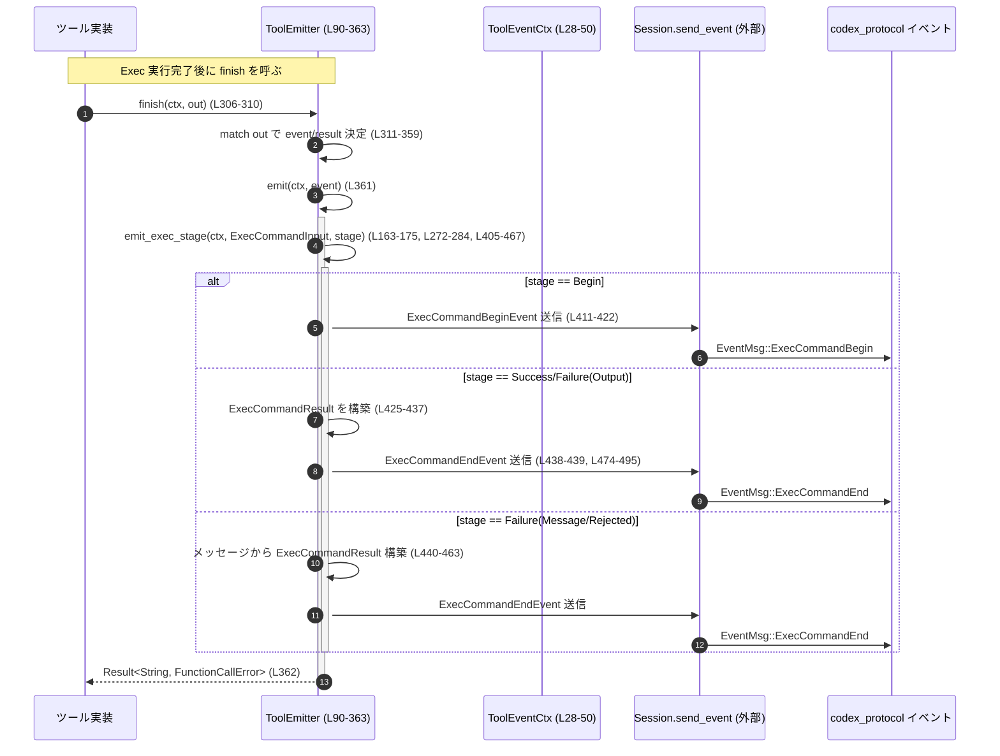

# core/src/tools/events.rs

## 0. ざっくり一言

外部ツール実行（シェルコマンド）やパッチ適用の **開始／終了イベントを組み立てて `Session` に送信するユーティリティ** です。  
実行結果やエラーを `ExecCommand*` / `PatchApply*` イベントに正規化し、モデル向けのテキストにも変換します。

---

## 1. このモジュールの役割

### 1.1 概要

このモジュールは、ツール実行まわりの「イベント生成」を一手に引き受ける層です。

- ツール呼び出しのコンテキスト（`Session`, `TurnContext`, call_id など）を `ToolEventCtx` でまとめる（L28-50）。
- シェルコマンド実行／パッチ適用などのツール種別を `ToolEmitter` で抽象化し、開始・終了イベントを送信する（L90-109, L111-287）。
- 実行結果（`ExecToolCallOutput` や `ToolError`）を、  
  - プロトコルイベント (`ExecCommandBegin/EndEvent`, `PatchApplyBegin/EndEvent`, `TurnDiffEvent`)  
  - モデルに返す文字列 (`Result<String, FunctionCallError>`)  
  に正規化する（L293-363, L405-467, L498-531）。

### 1.2 アーキテクチャ内での位置づけ

このモジュールは「ツール実装」と「プロトコルイベント送出」の間に位置する薄いアダプタ層です。

```mermaid
graph TD
  subgraph core/tools
    A["ツール実装（別モジュール）"]
    B["ToolEmitter (L90-363)"]
    C["ToolEventCtx (L28-50)"]
  end

  subgraph codex_protocol
    D["ExecCommandBegin/EndEvent<br/>PatchApplyBegin/EndEvent<br/>TurnDiffEvent (外部クレート)"]
  end

  E["Session.send_event(...) (外部, L73-87, L189-199, L474-495, L506-519, L527-529)"]
  F["SharedTurnDiffTracker (外部, L4, L185-188, L521-525)"]

  A --> C
  A --> B
  B -->|emit()/finish()| E
  B -->|イベント構築| D
  B -->|差分追跡| F
```

- ツール実装（別モジュール）が `ToolEmitter` と `ToolEventCtx` を生成し、`begin` / `finish` を呼び出す想定です。
- `ToolEmitter` は `Session.send_event` を通じて `codex_protocol::protocol::EventMsg` を送出します（L73-87, L189-199, L474-495, L506-519, L527-529）。
- パッチ適用時のみ、`SharedTurnDiffTracker` を使って TurnDiff イベントを追加生成します（L185-188, L521-525）。

### 1.3 設計上のポイント

コードから読める特徴を列挙します。

- **ステージ駆動のイベント設計**  
  - `ToolEventStage` で Begin / Success / Failure を表現し（L52-56）、  
    `emit_exec_stage` / `emit_patch_end` でステージに応じたイベントを組み立てます（L405-467, L201-261）。
- **ツール種別ごとの分岐を enum で表現**  
  - `ToolEmitter` に `Shell` / `ApplyPatch` / `UnifiedExec` の 3 種類のバリアントを持たせ（L90-109）、`emit` で一括処理します（L151-287）。
- **エラーハンドリングの一元化**  
  - `ToolEmitter::finish` が `Result<ExecToolCallOutput, ToolError>` を受け取り、  
    - 正常終了（exit 0）  
    - コマンド自体は実行できたが exit!=0  
    - サンドボックス Timeout/Denied  
    - その他の Codex エラー  
    - Rejected（ユーザー／運用上拒否）  
    をそれぞれ `ToolEventStage` と `FunctionCallError` にマッピングします（L311-359）。
- **非同期かつスレッド安全な差分通知**  
  - `SharedTurnDiffTracker` は `lock().await` で扱われており（L185-187, L523-524）、  
    非同期 Mutex 経由で差分情報を安全に取得して `TurnDiffEvent` を生成します（L521-529）。  
    このモジュール内に `unsafe` は存在しません。
- **モデル向けとイベント向けのフォーマットを分離**  
  - プロトコルイベント向けの `formatted_output` は `format_exec_output_str` で作り（L431-432）、  
    モデル向けの出力は `format_exec_output_for_model_*`（親モジュール）を使います（L293-304）。

---

## 2. 主要な機能一覧

このモジュールが提供する主な機能です。

- ツール呼び出しコンテキストの保持（`ToolEventCtx`）（L28-50）
- ツールイベントステージの表現（`ToolEventStage`, `ToolEventFailure`）（L52-62）
- シェル実行／パッチ適用／統合実行の **Emitter** (`ToolEmitter`)（L90-109, L111-287）
- Exec コマンドの Begin/End イベント送出（L64-88, L405-467, L469-496）
- パッチ適用の Begin/End イベントと TurnDiff イベント送出（L178-261, L498-531）
- 実行結果・エラーからモデル向けテキスト (`String`) と `FunctionCallError` への変換（L293-363）

---

## 3. 公開 API と詳細解説

### 3.1 型一覧（構造体・列挙体）

#### 3.1.1 主要な型（pub(crate)）

| 名前 | 種別 | 公開範囲 | 役割 / 用途 | 根拠 |
|------|------|----------|-------------|------|
| `ToolEventCtx<'a>` | 構造体 | `pub(crate)` | ツールイベント送信に必要な文脈（`Session`, `TurnContext`, `call_id`, 差分トラッカ）をまとめたコンテキスト | core/src/tools/events.rs:L28-50 |
| `ToolEventStage` | 列挙体 | `pub(crate)` | Begin / Success / Failure の 3 段階でツールイベントの状態を表現する | L52-56 |
| `ToolEventFailure` | 列挙体 | `pub(crate)` | Failure ステージの原因を Output / Message / Rejected に分類する | L58-62 |
| `ToolEmitter` | 列挙体 | `pub(crate)` | シェル実行 / パッチ適用 / 統合実行の 3 種類のツールのイベント送信ロジックをカプセル化する | L90-109 |

#### 3.1.2 内部専用の補助型

| 名前 | 種別 | 公開範囲 | 役割 / 用途 | 根拠 |
|------|------|----------|-------------|------|
| `ExecCommandInput<'a>` | 構造体 | モジュール内 (`struct`) | Exec コマンドの入力（コマンド列、カレントディレクトリ、parsed_cmd、source、interaction_input, process_id）をまとめる | L366-373, L375-392 |
| `ExecCommandResult` | 構造体 | モジュール内 (`struct`) | 実行結果のサマリ（stdout, stderr, aggregated_output, exit_code, duration, formatted_output, status）を保持し、イベント生成に使う | L395-403 |

### 3.2 関数詳細（重要なもの 7 件）

#### 1. `emit_exec_command_begin(...)`

```rust
pub(crate) async fn emit_exec_command_begin(
    ctx: ToolEventCtx<'_>,
    command: &[String],
    cwd: &Path,
    parsed_cmd: &[ParsedCommand],
    source: ExecCommandSource,
    interaction_input: Option<String>,
    process_id: Option<&str>,
)
```

**概要**

Exec コマンド開始時に `ExecCommandBeginEvent` を組み立てて `Session` に送信します（L64-88）。  
`ToolEmitter` 内だけでなく、他モジュールから直接呼ばれる可能性がある公開ヘルパーです。

**引数**

| 引数名 | 型 | 説明 |
|--------|----|------|
| `ctx` | `ToolEventCtx<'_>` | セッション／ターン／call_id 等の文脈（L28-50） |
| `command` | `&[String]` | 実行するコマンドと引数 |
| `cwd` | `&Path` | 実行時のカレントディレクトリ（L67, L81） |
| `parsed_cmd` | `&[ParsedCommand]` | シェルコマンド解析結果（L68, L82） |
| `source` | `ExecCommandSource` | コマンドの起源（ユーザー、モデルなど）（L69, L83） |
| `interaction_input` | `Option<String>` | インタラクティブ実行時の入力。`None` の場合は無し（L70, L84） |
| `process_id` | `Option<&str>` | 複数プロセスを識別する ID（L71, L78） |

**戻り値**

- `()`（非同期でイベントを送信するだけです）。
- 送信は `ctx.session.send_event(...).await` で行われます（L73-87）。

**内部処理の流れ**

1. `ExecCommandBeginEvent` を構築し、call_id / turn_id / command / cwd / parsed_cmd / source / interaction_input を設定（L76-85）。
2. `process_id` は `Option<&str>` から `Option<String>` に変換（`map(str::to_owned)`）（L78）。
3. `Session.send_event` に `EventMsg::ExecCommandBegin` を渡して await します（L73-87）。

**Examples（使用例）**

```rust
// 仮のコンテキストとコマンドを使った例
async fn start_exec(
    session: &Session,
    turn: &TurnContext,
) {
    let ctx = ToolEventCtx::new(session, turn, "call-1", None);  // L36-49

    let command = vec!["ls".to_string(), "-la".to_string()];
    let cwd = std::path::Path::new("/tmp");
    let parsed = codex_shell_command::parse_command::parse_command(&command); // L118, L141

    emit_exec_command_begin(
        ctx,
        &command,
        cwd,
        &parsed,
        ExecCommandSource::User,
        None,
        None,
    ).await;
}
```

**Errors / Panics**

- この関数自体は `Result` を返さず、内部でも `unwrap` 等は使用していません。
- `Session.send_event` 側の失敗がどう扱われるかは、このチャンクには現れません（L73-87 からは分かりません）。

**Edge cases**

- `interaction_input = None` の場合、イベントの `interaction_input` フィールドも `None` になります（L84）。
- `process_id = None` の場合、`process_id` は `None` のままです（L78）。

**使用上の注意点**

- `command` と `parsed_cmd` は一貫している必要があります。ここでは関係はチェックされないため、呼び出し側で整合性を保つ必要があります（コード上の検証は無し: L76-83）。

---

#### 2. `ToolEmitter::emit(&self, ctx, stage)`

```rust
impl ToolEmitter {
    pub async fn emit(&self, ctx: ToolEventCtx<'_>, stage: ToolEventStage)
}
```

**概要**

`ToolEmitter` のバリアント（`Shell` / `ApplyPatch` / `UnifiedExec`）とステージ（Begin / Success / Failure）に応じて、適切なイベントを組み立てて送信します（L151-287）。  
内部で `emit_exec_stage` と `emit_patch_end` を呼び分けます。

**引数**

| 引数名 | 型 | 説明 |
|--------|----|------|
| `self` | `&ToolEmitter` | どのツール種別か（Shell / ApplyPatch / UnifiedExec）を表す（L90-109） |
| `ctx` | `ToolEventCtx<'_>` | セッション／ターンコンテキスト（L28-50） |
| `stage` | `ToolEventStage` | Begin / Success / Failure のいずれか（L52-56） |

**戻り値**

- `()`（各種 `send_event` の非同期結果を待つだけです）。

**内部処理の流れ（主な分岐）**

1. **Shell バリアント**（L153-176）  
   - `ExecCommandInput::new` で Exec 入力を作成（interaction_input, process_id は `None`）（L165-172）。  
   - `emit_exec_stage(ctx, exec_input, stage).await` を呼び出し（L163-175）。
2. **ApplyPatch + Begin**（L178-200）  
   - `turn_diff_tracker` があればロックし `on_patch_begin(changes)` を呼ぶ（L185-188）。  
   - `PatchApplyBeginEvent` を送信（L189-199）。
3. **ApplyPatch + Success(Output)**（L201-215）  
   - `emit_patch_end` に stdout / stderr / exit_code から success 判定とステータスを渡して呼び出し（Completed/Failed）（L201-214）。
4. **ApplyPatch + Failure(Output)**（L216-233）  
   - 上と同様だが、Failure ステージから呼ばれる（L220-231）。
5. **ApplyPatch + Failure(Message / Rejected)**（L234-261）  
   - stdout は空、stderr/aggregated_output にメッセージを入れ、  
     `success=false` かつ `PatchApplyStatus::Failed` / `Declined` を指定して `emit_patch_end` を呼ぶ（L238-259）。
6. **UnifiedExec**（L262-285）  
   - Shell と同様に `ExecCommandInput` を構築するが、`process_id` を引き継ぐ（`process_id.as_deref()`）（L275-281）。  
   - `emit_exec_stage` を呼び出す（L272-284）。

**Examples（使用例）**

```rust
async fn run_shell_and_emit(
    session: &Session,
    turn: &TurnContext,
) -> Result<String, FunctionCallError> {
    let ctx = ToolEventCtx::new(session, turn, "call-1", None);     // L36-49
    let emitter = ToolEmitter::shell(
        vec!["ls".into(), "-la".into()],
        std::path::PathBuf::from("/tmp"),
        ExecCommandSource::User,
        false,
    );                                                              // L111-126

    emitter.begin(ctx).await;                                       // Begin (L289-291)

    // 実際の実行結果（ここでは仮の関数）
    let result: Result<ExecToolCallOutput, ToolError> =
        run_command_in_sandbox(&["ls".into(), "-la".into()], "/tmp").await;

    emitter.finish(ctx, result).await                               // End + モデルへの返答生成 (L306-363)
}
```

**Errors / Panics**

- `emit` 自体は `Result` を返しません。実行結果のエラーは `ToolEmitter::finish` の側で処理されます（L306-363）。
- `turn_diff_tracker.lock().await` 内部でのエラー処理はこのチャンクからは分かりませんが、`get_unified_diff()` の `Err` 場合は無視されています（L523-526）。

**Edge cases**

- `ApplyPatch` で `changes` が空でも `PatchApplyBegin/End` イベントは送信されます（`is_empty` チェックはありません：L189-199, L202-213）。
- `stage` とバリアントの組み合わせが設計上想定外であっても、コンパイル上は防げませんが、`match` が網羅的なのでパニックにはなりません（L151-286）。

**使用上の注意点**

- `ApplyPatch` の場合は、`Begin` を発行するために `emit` を直接呼ぶか、`begin` を使う必要があります（L178-200, L289-291）。
- `Shell` / `UnifiedExec` では `interaction_input` は常に `None` として扱われる設計です（L170, L279）。

---

#### 3. `ToolEmitter::finish(&self, ctx, out)`

```rust
pub async fn finish(
    &self,
    ctx: ToolEventCtx<'_>,
    out: Result<ExecToolCallOutput, ToolError>,
) -> Result<String, FunctionCallError>
```

**概要**

ツール実行結果 `Result<ExecToolCallOutput, ToolError>` を一元的に処理し、

- 適切な `ToolEventStage`（Success / Failure + Failure の種別）を決定してイベントを送出し（`self.emit(ctx, event)`）、  
- モデルに返すべき文字列と `FunctionCallError` を返します（L306-363）。

**引数**

| 引数名 | 型 | 説明 |
|--------|----|------|
| `self` | `&ToolEmitter` | 実行種別（Shell / ApplyPatch / UnifiedExec） |
| `ctx` | `ToolEventCtx<'_>` | イベント送信用コンテキスト |
| `out` | `Result<ExecToolCallOutput, ToolError>` | 実行結果またはツールエラー（L309） |

**戻り値**

- `Ok(String)`：exit code が 0 の成功時。モデルに返すべきフォーマット済み出力（L313-318, L361-362）。
- `Err(FunctionCallError)`：エラーまたは exit!=0 時。モデル側にはエラーメッセージ等を返すべきことを表す（L317-320, L323-359）。

**内部処理の流れ**

1. `out` に対して `match`（L311-359）。
2. **`Ok(output)` の場合**（L312-322）  
   - `format_exec_output_for_model` でモデル向けの文字列を生成（L313, L293-304）。  
   - `exit_code == 0` なら `Ok(content)`、それ以外は `Err(FunctionCallError::RespondToModel(content))`（L315-320）。  
   - イベントとしては `ToolEventStage::Success(output)` を選ぶ（L315）。
3. **Sandbox Timeout / Denied の場合**（L323-329）  
   - `ToolError::Codex(CodexErr::Sandbox(SandboxErr::Timeout { output }))` または  
     `SandboxErr::Denied { output, .. }` をまとめて処理（L323-325）。  
   - モデル向けの文字列を生成し（L325）、`ToolEventFailure::Output(*output)` として Failure イベントを作る（L326）。  
   - 戻り値は常に `Err(FunctionCallError::RespondToModel(response))`（L327）。
4. **その他の `ToolError::Codex(err)`**（L330-335）  
   - `"execution error: {err:?}"` というテキストメッセージを作成（L331）。  
   - Failure(Message) イベントとし、同じメッセージを `FunctionCallError::RespondToModel` で返す（L332-333）。
5. **`ToolError::Rejected(msg)` の場合**（L336-359）  
   - `"rejected by user"` というメッセージは、ツール種別に応じて正規化：  
     - Shell / UnifiedExec → `"exec command rejected by user"`（L347-350）  
     - ApplyPatch → `"patch rejected by user"`（L351）  
   - その他のメッセージはそのまま使用（L353-355）。  
   - Failure(Rejected) イベントを生成し（L356）、正規化メッセージを `FunctionCallError::RespondToModel` で返す（L357）。
6. 上記で得られた `(event, result)` を `self.emit(ctx, event).await` に渡してイベント送信（L361）。  
7. 最後に `result` を呼び出し元に返す（L362）。

**Examples（使用例）**

```rust
async fn handle_exec_result(
    session: &Session,
    turn: &TurnContext,
    raw_result: Result<ExecToolCallOutput, ToolError>,
) -> Result<String, FunctionCallError> {
    let ctx = ToolEventCtx::new(session, turn, "call-42", None);
    let emitter = ToolEmitter::unified_exec(
        &vec!["git".into(), "status".into()],
        std::path::PathBuf::from("/repo"),
        ExecCommandSource::Tool,
        Some("proc-1".into()),
    );                                                           // L135-149

    // begin は別途呼び出している想定
    // emitter.begin(ctx).await;

    let to_model = emitter.finish(ctx, raw_result).await?;       // L306-363
    Ok(to_model)
}
```

**Errors / Panics**

- `finish` は `Result<String, FunctionCallError>` を返しますが、関数内部にパニックを生むコード (`unwrap` 等) はありません。
- `ToolError::Rejected` はユーザーの拒否だけでなく一部運用／ランタイムの失敗にも使用されている旨がコメントされており（L337-345）、  
  それらがすべて「Declined」系イベントとして扱われることに注意が必要です。

**Edge cases**

- `Ok(output)` で `exit_code != 0` の場合  
  - イベント上は `ExecCommandStatus::Failed` になりますが（L432-436）、  
    `ToolEventStage` 上は Success で扱われ、戻り値は `Err(FunctionCallError::RespondToModel(content))` です（L315-320）。  
  - つまり「ツール呼び出しは成功したが、コマンド自体は失敗（exit!=0）」という状態を表します。
- Timeout/Denied でも、`ExecToolCallOutput` に依存しているため、`output.exit_code` が 0 のケースはコード上では想定されていませんが、  
  その場合は `ExecCommandStatus::Completed` になり得ます（L425-437）。`output` の仕様次第です。

**使用上の注意点**

- 呼び出し側は **必ず `finish` の戻り値をモデルへの返答として扱う** 想定です。`Err(FunctionCallError::RespondToModel(_))` の場合でも、  
  返ってくる文字列はユーザー／モデルに提示するメッセージであり、ログ用途だけではありません（L313-320, L325-327, L331-333, L346-357）。
- `finish` の前に `begin` を呼ばないと、Begin イベントが送られません。コード上の強制はありません（L289-291, L306-363）。

---

#### 4. `emit_exec_stage(ctx, exec_input, stage)`

```rust
async fn emit_exec_stage(
    ctx: ToolEventCtx<'_>,
    exec_input: ExecCommandInput<'_>,
    stage: ToolEventStage,
)
```

**概要**

Exec コマンド用のステージ（Begin / Success / Failure）に応じて、  
`emit_exec_command_begin` または `emit_exec_end` を呼び分ける内部ヘルパーです（L405-467）。

**引数**

| 引数名 | 型 | 説明 |
|--------|----|------|
| `ctx` | `ToolEventCtx<'_>` | イベント送信コンテキスト |
| `exec_input` | `ExecCommandInput<'_>` | コマンド・cwd・parsed_cmd・source・interaction_input・process_id（L366-392） |
| `stage` | `ToolEventStage` | Begin / Success / Failure（L405-409） |

**戻り値**

- `()`。

**内部処理の流れ**

1. `match stage` で分岐（L410）。
2. **Begin**（L411-422）  
   - `emit_exec_command_begin(ctx, ...)` をそのまま呼び出し、Await（L412-421）。
3. **Success(output) / Failure(Output(output))**（L423-439）  
   - `ExecCommandResult` を構築：  
     - stdout, stderr, aggregated_output（L426-428）  
     - exit_code, duration（L429-430）  
     - formatted_output: `format_exec_output_str`（L431-432）  
     - status: exit 0 → Completed, それ以外 → Failed（L432-436）  
   - `emit_exec_end(ctx, exec_input, exec_result)` を呼び出し（L438）。
4. **Failure(Message(message))**（L440-452）  
   - stdout 空、stderr & aggregated_output にメッセージ、exit_code=-1、duration=ZERO、status=Failed（L442-450）。  
   - `emit_exec_end` を呼び出し（L451）。
5. **Failure(Rejected(message))**（L453-465）  
   - stdout 空、stderr & aggregated_output にメッセージ、exit_code=-1、duration=ZERO、status=Declined（L455-463）。  
   - `emit_exec_end` を呼び出し（L464）。

**使用上の注意点**

- `ToolEventStage` が `Failure(Output(_))` か `Failure(Message(_))` か `Failure(Rejected(_))` かで、`ExecCommandStatus` が Failed/Declined に分かれます（L423-465）。
- exit_code の意味づけは `ExecToolCallOutput` 側に依存します。ここでは 0/非0 の区別のみです（L432-435）。

---

#### 5. `emit_exec_end(ctx, exec_input, exec_result)`

```rust
async fn emit_exec_end(
    ctx: ToolEventCtx<'_>,
    exec_input: ExecCommandInput<'_>,
    exec_result: ExecCommandResult,
)
```

**概要**

Exec コマンドの終了情報を `ExecCommandEndEvent` に詰めて送信します（L469-496）。  
`ToolEmitter` 外から直接は呼ばれない内部ヘルパーです。

**引数**

| 引数名 | 型 | 説明 |
|--------|----|------|
| `ctx` | `ToolEventCtx<'_>` | コンテキスト |
| `exec_input` | `ExecCommandInput<'_>` | 入力情報（command, cwd, parsed_cmd, source, interaction_input, process_id）（L366-392） |
| `exec_result` | `ExecCommandResult` | 実行結果サマリ（L395-403） |

**戻り値**

- `()`。

**内部処理の流れ**

1. `ExecCommandEndEvent` を生成し、  
   call_id / process_id / turn_id / command / cwd / parsed_cmd / source / interaction_input / stdout / stderr / aggregated_output / exit_code / duration / formatted_output / status をセット（L477-493）。
2. `Session.send_event(ctx.turn, EventMsg::ExecCommandEnd(...)).await` で送信（L474-495）。

**使用上の注意点**

- `exec_input.command` / `cwd` / `parsed_cmd` は `to_vec` / `to_path_buf` によりコピーされます（L481-483）。  
  大きなコマンド列や長いパスの場合は、その分のコピーコストが発生します。
- `interaction_input` が `None` の場合、そのまま `None` になります（L485）。

---

#### 6. `emit_patch_end(...)`

```rust
async fn emit_patch_end(
    ctx: ToolEventCtx<'_>,
    changes: HashMap<PathBuf, FileChange>,
    stdout: String,
    stderr: String,
    success: bool,
    status: PatchApplyStatus,
)
```

**概要**

パッチ適用終了時に `PatchApplyEndEvent` を送信し、  
さらに `SharedTurnDiffTracker` を使って TurnDiff が取得できれば `TurnDiffEvent` を追加で送信します（L498-531）。

**引数**

| 引数名 | 型 | 説明 |
|--------|----|------|
| `ctx` | `ToolEventCtx<'_>` | コンテキスト |
| `changes` | `HashMap<PathBuf, FileChange>` | 適用されたファイル変更の集合（L500, L515） |
| `stdout` | `String` | パッチ適用処理の標準出力（L501, L512） |
| `stderr` | `String` | 標準エラー出力（L502, L513） |
| `success` | `bool` | 成否フラグ（L503, L514） |
| `status` | `PatchApplyStatus` | Completed / Failed / Declined などの状態（L504, L516） |

**戻り値**

- `()`。

**内部処理の流れ**

1. `PatchApplyEndEvent` を組み立てて送信（L506-519）。  
   - `call_id`, `turn_id`, `stdout`, `stderr`, `success`, `changes`, `status` をセット（L510-517）。
2. `ctx.turn_diff_tracker` が `Some` の場合のみ差分取得を試行（L521-525）。
   - `tracker.lock().await` でロックを取り（L523）、`guard.get_unified_diff()` を呼ぶ（L524）。  
   - `Ok(Some(unified_diff))` の場合にだけ `TurnDiffEvent { unified_diff }` を送信（L526-529）。  
     - `Err(_)` や `Ok(None)` の場合は何も送信しません。

**使用上の注意点**

- `changes` は `HashMap` ごと move されるため、呼び出し側が後で再利用することはできません（L498-505）。
- 差分の取得が失敗した場合（`Err(_)`）や差分が無い場合（`Ok(None)`）、TurnDiff イベントは送信されません（L526-530）。  
  その原因はここからは分かりません。
- `success` と `status` の一貫性（成功なら Completed など）は、呼び出し元（`ToolEmitter::emit`）側で決めています（L201-213, L220-231, L243-259）。

---

#### 7. `ToolEmitter::format_exec_output_for_model(&self, output, ctx)`

```rust
fn format_exec_output_for_model(
    &self,
    output: &ExecToolCallOutput,
    ctx: ToolEventCtx<'_>,
) -> String
```

**概要**

ツール種別に応じて、モデル向けの出力フォーマット関数（freeform / structured）を切り替えます（L293-304）。  
`finish` の内部でのみ使用されます（L313, L325）。

**内部処理**

- `Self::Shell { freeform: true, .. }` の場合は  
  `super::format_exec_output_for_model_freeform(output, ctx.turn.truncation_policy)` を使用（L299-301）。
- それ以外の場合は  
  `super::format_exec_output_for_model_structured(output, ctx.turn.truncation_policy)` を使用（L302-303）。

**使用上の注意点**

- freeform = true の Shell 実行だけがモデル向けに「自由形式」で返され、それ以外は構造化された形式になる設計です（L91-97, L293-304）。
- 実際のフォーマット内容は親モジュールに定義されており、このチャンクからは分かりません。

---

### 3.3 その他の関数一覧

補助的な関数や単純なラッパーを一覧にします。

| 関数名 / メソッド | 役割（1 行） | 根拠 |
|-------------------|-------------|------|
| `ToolEventCtx::new(...)` | `ToolEventCtx` を初期化するコンストラクタ（L36-49） | L36-49 |
| `ToolEmitter::shell(...)` | Shell 用の `ToolEmitter::Shell` を生成し、内部で `parse_command` を呼ぶ | L111-126 |
| `ToolEmitter::apply_patch(...)` | `ToolEmitter::ApplyPatch` を生成するシンプルなコンストラクタ | L128-133 |
| `ToolEmitter::unified_exec(...)` | `ToolEmitter::UnifiedExec` を生成し、`parse_command` する | L135-149 |
| `ToolEmitter::begin(&self, ctx)` | `emit(ctx, ToolEventStage::Begin)` を呼ぶラッパー | L289-291 |
| `ExecCommandInput::new(...)` | Exec 用の入力構造体を初期化する | L375-392 |

---

## 4. データフロー

ここでは代表的な 2 つのシナリオを示します。

### 4.1 Exec ツール実行のフロー（ToolEmitter::finish + emit_exec_stage）

`ToolEmitter::finish` および `emit_exec_stage` を中心としたシーケンスです（L306-363, L405-467）。



### 4.2 パッチ適用と TurnDiff のフロー（ToolEmitter::emit + emit_patch_end）

`ToolEmitter::emit` と `emit_patch_end` の間のデータフローです（L178-261, L498-531）。

```mermaid
sequenceDiagram
    autonumber
    participant Tool as ツール実装
    participant Em as ToolEmitter::ApplyPatch (L90-109)
    participant Ctx as ToolEventCtx
    participant Sess as Session.send_event
    participant Trk as SharedTurnDiffTracker

    Note over Tool,Em: パッチ適用の前後で emit を呼ぶ

    Tool->>Em: emit(ctx, Begin) (L178-200)
    Em->>Trk: lock().await, on_patch_begin(changes) (L185-188)
    Em->>Sess: PatchApplyBeginEvent 送信 (L189-199)

    ... パッチ適用処理（別モジュール） ...

    Tool->>Em: emit(ctx, Success/Failure(...)) (L201-261)
    Em->>Em: emit_patch_end(ctx, changes, stdout, stderr, success, status) (L202-260, L498-505)
    Em->>Sess: PatchApplyEndEvent 送信 (L506-519)
    Em->>Trk: lock().await, get_unified_diff() (L521-525)
    alt diff 取得成功 && Some
        Em->>Sess: TurnDiffEvent 送信 (L526-529)
    else
        Note over Em,Sess: TurnDiffEvent は送信されない
    end
```

---

## 5. 使い方（How to Use）

### 5.1 基本的な使用方法

典型的なフローは以下のようになります。

1. `ToolEventCtx` を生成する（L36-49）。
2. `ToolEmitter::shell` / `apply_patch` / `unified_exec` のいずれかで `ToolEmitter` を作成する（L111-149）。
3. `begin` で Begin イベントを送る（任意だが推奨）（L289-291）。
4. 実際のツール実行を行い、その結果を `finish` に渡す（L306-363）。

```rust
use crate::codex::Session;
use crate::codex::TurnContext;
use crate::tools::events::ToolEmitter;
use crate::tools::events::ToolEventCtx;
use crate::tools::sandboxing::ToolError;
use codex_protocol::exec_output::ExecToolCallOutput;
use codex_protocol::protocol::ExecCommandSource;

// 仮の実行関数。実際には別モジュールに実装されている想定です。
async fn run_command_in_sandbox(
    command: &[String],
    cwd: &str,
) -> Result<ExecToolCallOutput, ToolError> {
    unimplemented!()
}

async fn run_shell_tool(
    session: &Session,
    turn: &TurnContext,
) -> Result<String, crate::function_tool::FunctionCallError> {
    let ctx = ToolEventCtx::new(session, turn, "call-1", None);      // L36-49

    let command = vec!["ls".to_string(), "-la".to_string()];
    let cwd = std::path::PathBuf::from("/tmp");

    let emitter = ToolEmitter::shell(
        command.clone(),
        cwd.clone(),
        ExecCommandSource::User,
        false,                                                    // freeform=false → structured
    );                                                            // L111-126

    emitter.begin(ctx).await;                                     // Begin イベント (L289-291)

    let result = run_command_in_sandbox(&command, "/tmp").await;  // 実行結果を取得

    // イベント送信 + モデル向けメッセージの生成
    emitter.finish(ctx, result).await                             // L306-363
}
```

### 5.2 よくある使用パターン

1. **シェルコマンドを freeform でモデルに返したい場合**

```rust
let emitter = ToolEmitter::shell(
    command,
    cwd,
    ExecCommandSource::User,
    true,  // freeform=true → format_exec_output_for_model_freeform を使用 (L299-301)
);
```

1. **プロセス ID 付きの統合 Exec**

```rust
let emitter = ToolEmitter::unified_exec(
    &command,
    cwd,
    ExecCommandSource::Tool,
    Some("proc-123".to_string()),
);  // process_id は ExecCommandBegin/EndEvent に含まれる (L71, L78, L479-480)
```

1. **パッチ適用と TurnDiff**

```rust
let emitter = ToolEmitter::apply_patch(changes, auto_approved); // L128-133

// Begin → PatchApplyBegin + on_patch_begin
emitter.emit(ctx, ToolEventStage::Begin).await;                 // L178-200

// パッチ適用実行（別モジュール）...

// 実行結果の ExecToolCallOutput を受け取った後
let output: ExecToolCallOutput = /* ... */;
emitter.emit(ctx, ToolEventStage::Success(output)).await;       // L201-215, L498-531
```

`SharedTurnDiffTracker` を `ToolEventCtx` に渡しておけば、`emit_patch_end` 内で TurnDiffEvent が送信されます（L521-529）。

### 5.3 よくある間違い

```rust
// 間違い例: finish だけ呼んで Begin イベントを送っていない
let emitter = ToolEmitter::shell(cmd.clone(), cwd.clone(), source, false);
// emitter.begin(ctx).await;  // ←呼んでいない
let result = run_command_in_sandbox(&cmd, "/tmp").await;
let to_model = emitter.finish(ctx, result).await?;
```

```rust
// 正しい例: begin と finish をペアで呼ぶ（ExecCommandBegin/End が揃う）
let emitter = ToolEmitter::shell(cmd.clone(), cwd.clone(), source, false);
emitter.begin(ctx).await;                         // L289-291
let result = run_command_in_sandbox(&cmd, "/tmp").await;
let to_model = emitter.finish(ctx, result).await?;
```

### 5.4 使用上の注意点（まとめ）

- **前提条件**
  - `ToolEventCtx` の `session` と `turn` は有効な期間中である必要があります（参照で保持しているため: L28-33）。
  - `SharedTurnDiffTracker` を使う場合は、`ToolEventCtx` 生成時に `Some(&tracker)` を渡す必要があります（L33, L185-188, L521-525）。

- **エラーと契約**
  - `finish` の返り値は、モデルに返すべきメッセージ（成功/失敗含む）を `Ok/Err` で包んだものです（L313-320, L325-327, L331-333, L346-357）。  
    「Ok なら正常実行、Err ならモデルにエラーとして伝える」という契約になっています。
  - `ToolError::Rejected` はユーザー拒否と一部の運用エラーをまとめて扱う設計であり、イベント上は `Declined` として報告されることがあります（L337-345, L356-357）。

- **並行性**
  - `SharedTurnDiffTracker` は `lock().await` でアクセスされており、非同期 Mutex を前提とした設計です（L185-187, L523-524）。  
    そのため、`emit` / `emit_patch_end` は必ず async コンテキストから await する必要があります。
  - このモジュール内に `unsafe` は存在せず、スレッド安全性は外部型（Session, SharedTurnDiffTracker 等）の契約に依存します。

- **パフォーマンス**
  - イベント送信時にコマンドや変更一覧などのデータを `to_vec()` や `clone()` でコピーしています（L80-82, L189-199, L202-205, L222-223, L481-483, L515）。  
    大量のデータを扱う場合はイベントペイロードサイズに注意が必要です。
  - TurnDiff 取得 (`get_unified_diff`) はパッチ適用終了時に 1 回のみ呼び出されます（L521-525）。

- **セキュリティ**
  - サンドボックス関連のエラー（Timeout/Denied）は明示的にハンドリングされ、モデルに分かりやすい形で伝えられます（L323-329）。  
    実際のサンドボックス制御は別モジュール（`ToolError::Codex` を生成する側）に委ねられています。

---

## 6. 変更の仕方（How to Modify）

### 6.1 新しい機能を追加する場合

例：新しいツール種別（例えば「ファイル検索」）を `ToolEmitter` に追加する場合。

1. **`ToolEmitter` に新しいバリアントを追加**（L90-109）  
   - 必要なフィールド（入力パラメータ）を定義します。
2. **コンストラクタメソッドを追加**（L111-149 にならって実装）  
   - `pub fn new_feature(...) -> Self` のようなメソッドでバリアントを生成します。
3. **`emit` の `match` に分岐を追加**（L151-287）  
   - Begin / Success / Failure ステージでどういうイベントを生成するかを定義します。  
   - 必要であれば、新しい `EventMsg` バリアントに対応します（`codex_protocol` 側）。
4. **`finish` からの呼び出しはそのまま利用**（L306-363）  
   - `finish` は `ToolEmitter` のバリアントを問わず `emit` にイベントを委譲するため、  
     エラーハンドリングは共通ロジックを流用できます。

### 6.2 既存の機能を変更する場合の注意点

- **エラーマッピングを変更する場合**
  - `ToolError` → `ToolEventStage` / `FunctionCallError` のマッピングは `finish` に集中しています（L311-359）。  
    変更する場合は、  
    - どのエラーが Success / Failure(Output) / Failure(Message) / Failure(Rejected) になるか  
    - モデルに返されるメッセージの文言  
    を慎重に確認する必要があります。
- **ステータスの意味を変更する場合**
  - Exec: `ExecCommandStatus::Completed/Failed/Declined` の付け方は `emit_exec_stage` にあります（L432-436, L449-463）。  
  - Patch: `PatchApplyStatus::Completed/Failed/Declined` は `ToolEmitter::emit` 内で決めています（L201-213, L220-231, L243-259）。  
  - それぞれの「成功/失敗/拒否」が UI やロガーでどのように解釈されるかを確認する必要があります。
- **差分取得まわり**
  - `SharedTurnDiffTracker` のインターフェースを変更する場合は、  
    - `on_patch_begin` の呼び出し（L185-188）  
    - `get_unified_diff` の戻り値ハンドリング（`Result<Option<_>>` を想定: L521-526）  
    を合わせて更新する必要があります。

---

## 7. 関連ファイル

このモジュールと密接に関連する型・ファイルです（パスは import から判読できる範囲のみ記載します）。

| パス / モジュール | 役割 / 関係 |
|-------------------|------------|
| `crate::codex::Session` | `send_event` メソッドを提供し、ここからプロトコルイベントが送信されます（L1, L64-87, L189-199, L474-495, L506-519, L527-529）。 |
| `crate::codex::TurnContext` | `turn_id` や `sub_id` など、ターンごとのコンテキスト情報を保持します（L2, L79-80, L194-195, L480-481, L511）。 |
| `crate::function_tool::FunctionCallError` | ツール実行後にモデルへ返すエラー種別を表す型で、`finish` の戻り値として使用されます（L3, L306-363）。 |
| `crate::tools::context::SharedTurnDiffTracker` | パッチ適用前後の差分追跡を行い、`TurnDiffEvent` 生成に利用されます（L4, L185-188, L521-525）。 |
| `crate::tools::sandboxing::ToolError` | 外部ツール実行時のエラーを表し、`finish` 内で `ToolEventStage` と `FunctionCallError` にマッピングされます（L5, L309-359）。 |
| `codex_protocol::exec_output::ExecToolCallOutput` | Exec 実行結果の構造体で、stdout/stderr/aggregated_output/exit_code/duration を提供します（L8, L201-207, L223-224, L425-431）。 |
| `codex_protocol::protocol::*` | `EventMsg`, `ExecCommandBegin/EndEvent`, `PatchApplyBegin/EndEvent`, `PatchApplyStatus`, `ExecCommandStatus`, `FileChange`, `TurnDiffEvent` などイベント定義を提供します（L10-19, L76-85, L189-199, L477-493, L510-517, L527-529）。 |
| `codex_shell_command::parse_command::parse_command` | シェルコマンドを `ParsedCommand` に変換する関数で、`ToolEmitter::shell` / `unified_exec` で使用されます（L20, L118, L141）。 |
| `super::format_exec_output_str` | Exec 終了イベント用 `formatted_output` を生成するヘルパーです（L26, L431-432）。詳しい実装はこのチャンクには現れません。 |
| `super::format_exec_output_for_model_freeform` / `super::format_exec_output_for_model_structured` | モデル向けの出力フォーマット関数で、freeform/structured モードを切り替えます（L299-303）。実装はこのチャンクには現れません。 |

このファイル内にはテストコードは含まれておらず（L1-532）、テストは別ファイルに定義されているか、まだ存在しないと考えられますが、コードからは断定できません。
