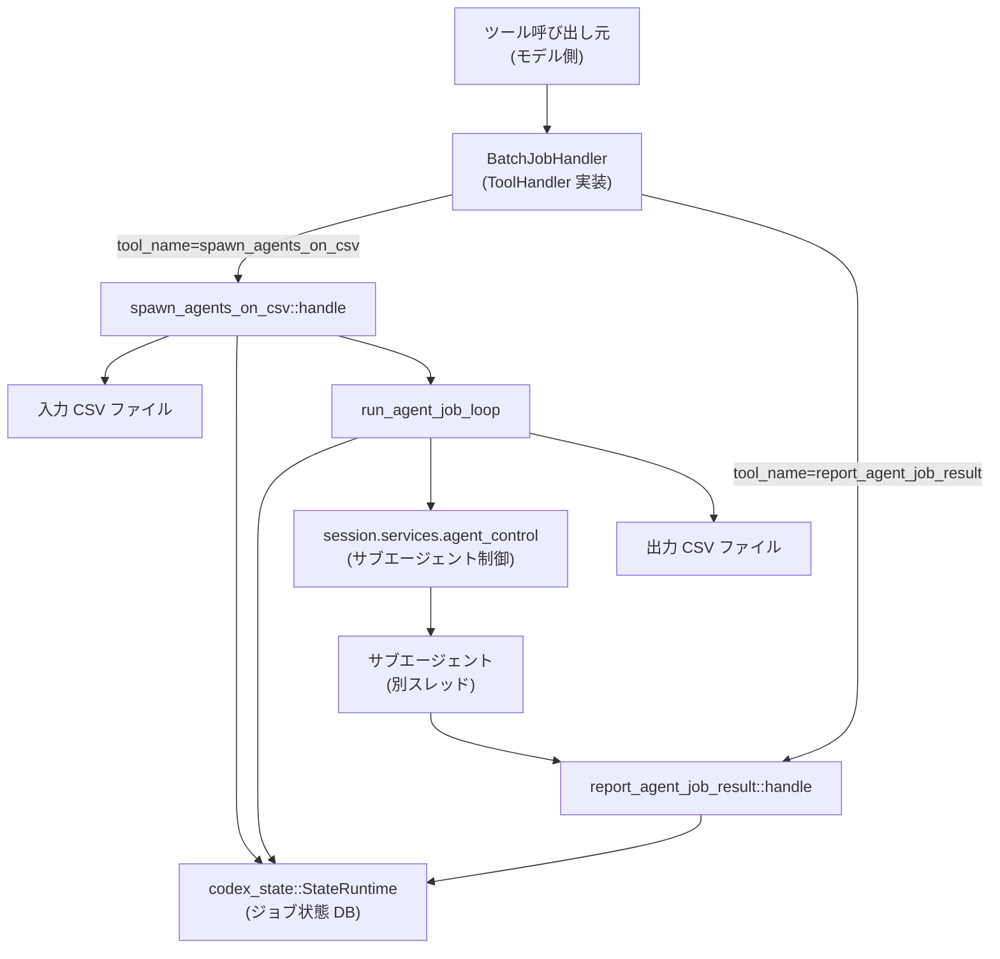
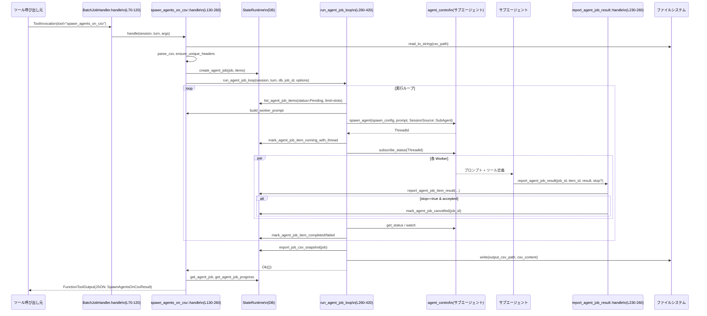

# core/src/tools/handlers/agent_jobs.rs

## 0. ざっくり一言

CSV ファイルから「ジョブ」を作成し、行ごとにサブエージェントを並列起動して処理し、結果を集計して CSV に書き出す **バッチ型エージェントジョブ実行エンジン**です（ツール呼び出し経由で利用します）。  
（行番号はこのチャンク先頭を 1 とした概算です。厳密な値は元ファイルを参照してください）

---

## 1. このモジュールの役割

### 1.1 概要

このモジュールは次の問題を解決するために存在します（`agent_jobs.rs:L1-260`）:

- CSV の各行を独立した「ジョブアイテム」として扱い、それぞれを別スレッド（サブエージェント）で処理したい
- エージェントの並列数や最大実行時間を制御しつつ、失敗やキャンセルも含めて DB に進捗管理したい
- ツールインターフェース経由で「ジョブ開始」「結果報告」を行いたい

提供する主な機能:

- `spawn_agents_on_csv` ツール: CSV からジョブを作成し、サブエージェントを起動して完了まで走らせる
- `report_agent_job_result` ツール: サブエージェントが自分の担当アイテムの結果を報告する
- ジョブ進行ループ（`run_agent_job_loop`）: 並列制限付きでサブエージェントを起動・監視・タイムアウト処理
- CSV 入出力ユーティリティ（パースと結果 CSV の生成）

### 1.2 アーキテクチャ内での位置づけ

主なコンポーネントの関係は次の通りです（`agent_jobs.rs:L1-260, L260-640`）。



- `BatchJobHandler` は `ToolHandler` としてエクスポートされ、ツール種別 `ToolKind::Function` に対応します（`agent_jobs.rs:L70-120`）。
- CSV → ジョブ + アイテムの初期生成は `spawn_agents_on_csv::handle` 内で行い（`L130-230`）、実行ループは `run_agent_job_loop` で管理します（`L260-420`）。
- 個々のサブエージェントは `agent_control.spawn_agent` で起動され、結果は `report_agent_job_result::handle` 経由で DB に記録されます（`L230-260, L420-580`）。

### 1.3 設計上のポイント

コードから読み取れる設計上の特徴です。

- **責務分割**
  - エントリポイント: `BatchJobHandler::handle` でツール名に応じてサブハンドラに委譲（`agent_jobs.rs:L70-120`）。
  - ジョブ生成と同期的な実行開始: `spawn_agents_on_csv` モジュール（`L130-260`）。
  - サブエージェントからの結果報告: `report_agent_job_result` モジュール（`L230-260`）。
  - 実行ループと並列制御: `run_agent_job_loop` と周辺関数（`L260-580`）。
  - CSV 読み書きやテンプレート処理などは専用の小さなヘルパー関数群に分離（`L580-1160`）。

- **状態管理**
  - ジョブやアイテムの状態は `codex_state::StateRuntime` を介して永続化されています（`required_state_db`, `db.*` 呼び出し群, `agent_jobs.rs:L260-580`）。
  - メモリ上では、現在実行中のアイテムを `HashMap<ThreadId, ActiveJobItem>` で管理し、DB 状態と同期を取ります（`agent_jobs.rs:L260-340`）。

- **エラーハンドリング**
  - ツールの外向きエラーは `FunctionCallError` で返し、モデルへメッセージとして伝えるパスと致命的エラー（Fatal）を区別しています（`agent_jobs.rs:L130-260, L230-260`）。
  - ジョブ実行ループ内では `anyhow::Result` を使い、`spawn_agents_on_csv::handle` からの呼び出し側でジョブ全体を失敗にマークする責務を負います（`agent_jobs.rs:L260-340`）。

- **並行性**
  - `tokio` 非同期ランタイム上で動作し、サブエージェントは `agent_control.spawn_agent` により別スレッド／スレッドグループとして扱われます（`agent_jobs.rs:L380-440`）。
  - 並列数は `max_concurrency` でカプセル化され、スレッド深さ・最大スレッド数に応じて `normalize_concurrency` で制限されます（`agent_jobs.rs:L200-230`）。
  - サブエージェントのステータス監視には `tokio::sync::watch::Receiver<AgentStatus>` が使われており、`wait_for_status_change` で効率的に待機します（`agent_jobs.rs:L420-520`）。

- **安全性（Rust 的観点）**
  - `unsafe` は一切使用しておらず、共有状態は `Arc<...>` によるスレッドセーフな参照で管理されます（`agent_jobs.rs:L130-340`）。
  - `unwrap` 系の呼び出しは `unwrap_or` 系に限定されており、I/O や DB に起因する失敗は `Result` 経由で扱われます。

---

## 2. 主要な機能一覧

このモジュールが提供する主な機能です。

- エージェントジョブツールのディスパッチ:
  - `BatchJobHandler` と `ToolHandler` 実装で、`spawn_agents_on_csv` / `report_agent_job_result` を選択（`agent_jobs.rs:L70-120`）
- CSV からのジョブ生成:
  - `spawn_agents_on_csv::handle`: CSV の各行をジョブアイテムに変換し、ジョブを DB に作成（`L130-230`）
- サブエージェントの自動起動と並列実行:
  - `run_agent_job_loop`: Pending アイテムを取り出してサブエージェントを起動し、完了まで監視（`L260-420`）
- サブエージェントからの結果報告:
  - `report_agent_job_result::handle`: 単一アイテムの結果を DB に記録し、必要に応じてジョブをキャンセル（`L230-260`）
- 結果の CSV エクスポート:
  - `export_job_csv_snapshot` / `render_job_csv`: DB 上の全アイテムを取得し、結果付き CSV を生成しディスクへ保存（`L420-640, L880-1060`）
- 進捗通知:
  - `JobProgressEmitter::maybe_emit`: 一定間隔・状態変化時に進捗をバックグラウンドイベントとしてセッションに通知（`agent_jobs.rs:L90-160`）
- 各種ユーティリティ:
  - CSV パース（`parse_csv`）、テンプレート展開（`render_instruction_template`）、タイムアウト／ステータス判定など（`agent_jobs.rs:L640-1160`）

---

## 3. 公開 API と詳細解説

### 3.1 型一覧（構造体・列挙体など）

| 名前 | 種別 | 役割 / 用途 | 行番号目安 |
|------|------|-------------|------------|
| `BatchJobHandler` | 構造体（空） | このモジュールのツールハンドラ本体。`ToolHandler` を実装しツール名に応じて処理を分岐します。 | `agent_jobs.rs:L40-80` |
| `SpawnAgentsOnCsvArgs` | 構造体 + `Deserialize` | `spawn_agents_on_csv` ツールの JSON 引数（CSV パス・命令テンプレート・並列数など） | `agent_jobs.rs:L100-120` |
| `ReportAgentJobResultArgs` | 構造体 + `Deserialize` | `report_agent_job_result` ツールの JSON 引数（job_id, item_id, result, stop） | `agent_jobs.rs:L120-140` |
| `SpawnAgentsOnCsvResult` | 構造体 + `Serialize` | `spawn_agents_on_csv` ツールの返り値（ジョブID・進捗・失敗概要など） | `agent_jobs.rs:L140-170` |
| `AgentJobFailureSummary` | 構造体 + `Serialize` | 失敗したアイテムの概要（item_id, source_id, last_error） | `agent_jobs.rs:L170-180` |
| `AgentJobProgressUpdate` | 構造体 + `Serialize` | セッションに送る進捗通知のペイロード | `agent_jobs.rs:L180-200` |
| `ReportAgentJobResultToolResult` | 構造体 + `Serialize` | `report_agent_job_result` の返り値（受理されたかどうか） | `agent_jobs.rs:L200-205` |
| `JobRunnerOptions` | 構造体 | 実行ループの設定（max_concurrency, spawn_config） | `agent_jobs.rs:L205-215` |
| `ActiveJobItem` | 構造体 | 現在実行中のアイテムに紐づくスレッド情報と開始時刻、ステータス用 `watch::Receiver` | `agent_jobs.rs:L215-230` |
| `JobProgressEmitter` | 構造体 | 進捗通知の内部状態（最終通知時刻・前回の完了数など） | `agent_jobs.rs:L230-270` |

これらの型はすべてこのファイル内スコープでのみ使用され、外部には `BatchJobHandler` のみが事実上の公開エントリポイントです。

### 3.2 関数詳細（最大 7 件）

#### `impl ToolHandler for BatchJobHandler::handle(...)`

**シグネチャ**

```rust
impl ToolHandler for BatchJobHandler {
    type Output = FunctionToolOutput;

    async fn handle(&self, invocation: ToolInvocation)
        -> Result<Self::Output, FunctionCallError> { /* ... */ }
}
```

（`agent_jobs.rs:L70-120`）

**概要**

- ツール呼び出しを受け取り、ツール名に応じて `spawn_agents_on_csv::handle` または `report_agent_job_result::handle` を呼び出します。
- ペイロードが関数ツールでない場合や、未知のツール名の場合は `FunctionCallError::RespondToModel` を返します。

**引数**

| 引数名 | 型 | 説明 |
|--------|----|------|
| `invocation` | `ToolInvocation` | セッション・ターンコンテキスト・ツール名・ペイロードなど、ツール実行に必要な情報 |

**戻り値**

- `Result<FunctionToolOutput, FunctionCallError>`  
  - 成功時: 各サブハンドラから返されたツール出力
  - 失敗時: モデルに提示するべきエラーメッセージや致命的エラー

**内部処理の流れ**

1. `invocation` から `session`, `turn`, `tool_name`, `payload` を取り出す。
2. `payload` が `ToolPayload::Function { arguments }` であることを検査し、違えば `RespondToModel` エラー（`agent_jobs.rs:L80-90`）。
3. `tool_name.name.as_str()` に応じて `match`:
   - `"spawn_agents_on_csv"` → `spawn_agents_on_csv::handle(session, turn, arguments)` を await（`agent_jobs.rs:L90-100`）
   - `"report_agent_job_result"` → `report_agent_job_result::handle(session, arguments)` を await
   - 上記以外 → `unsupported agent job tool ...` という `RespondToModel` エラー

**Examples（使用例）**

実際にはフレームワーク側から呼ばれますが、簡易な呼び出し例です（エラーハンドリングを省略）。

```rust
// ツールハンドラのインスタンスを用意する                          // BatchJobHandler は空構造体なのでデフォルト生成でよい
let handler = BatchJobHandler;                                              // ハンドラ本体

// spawn_agents_on_csv ツールの呼び出しを構築する                      // CSV ベースのジョブを開始するツールを呼び出す
let invocation = ToolInvocation {
    session: session.clone(),                                              // Arc<Session>
    turn: turn.clone(),                                                    // Arc<TurnContext>
    tool_name: "spawn_agents_on_csv".into(),                               // ツール名
    payload: ToolPayload::Function {                                       // Function 形式のペイロード
        arguments: r#"{"csv_path":"input.csv","instruction":"..."}"#.into()
    },
    // 他フィールドは省略
};

// 非同期にハンドラを実行する                                            // ハンドラを await して結果を受け取る
let output = handler.handle(invocation).await?;
println!("{}", output.to_string());                                        // ツールの結果を表示
```

**Errors / Panics**

- `payload` が `ToolPayload::Function` でない場合:
  - `FunctionCallError::RespondToModel("agent jobs handler received unsupported payload")`
- 未知の `tool_name` の場合:
  - `FunctionCallError::RespondToModel("unsupported agent job tool ...")`
- 自身では `panic` を起こしません。

**Edge cases（エッジケース）**

- `tool_name.name` に余計な空白が含まれている場合でも、完全一致でなければ未対応扱いになります。
- `arguments` が不正 JSON の場合は、サブハンドラ側でエラーになります（例: `parse_arguments` エラー）。

**使用上の注意点**

- `BatchJobHandler` 自体はステートレスなので、複数スレッドから共有しても問題ありません。
- `ToolInvocation` の `session` / `turn` は有効な `Arc` である必要があります。

---

#### `spawn_agents_on_csv::handle(session, turn, arguments)`

**概要**

- CSV ファイルを読み込み、ヘッダー + 行データから `codex_state` のエージェントジョブとジョブアイテムを作成し、そのジョブを実行ループにかけて完了まで処理します（`agent_jobs.rs:L130-260`）。
- 終了後、ジョブの進捗・出力 CSV パス・失敗概要などを JSON 文字列として返します。

**引数**

| 引数名 | 型 | 説明 |
|--------|----|------|
| `session` | `Arc<Session>` | 現在のセッション（state DB や agent_control・ベースプロンプトへのアクセスに使用） |
| `turn` | `Arc<TurnContext>` | 現在のターンコンテキスト（パス解決や設定値参照に使用） |
| `arguments` | `String` | ツールに渡された JSON 文字列。`SpawnAgentsOnCsvArgs` にデシリアライズされます。 |

**戻り値**

- `Result<FunctionToolOutput, FunctionCallError>`  
  - 成功時: `SpawnAgentsOnCsvResult` を JSON シリアライズした文字列を含む `FunctionToolOutput`
  - 失敗時: ユーザーに提示すべきエラーメッセージ（`RespondToModel`）または致命的エラー（`Fatal`）

**内部処理の流れ（要約）**

1. **引数のパースと検証**
   - `parse_arguments` で `SpawnAgentsOnCsvArgs` へデシリアライズ（`agent_jobs.rs:L130-140`）。
   - `instruction` が空でないことをチェック。空なら `RespondToModel` エラー。

2. **CSV の読み込みと検証**
   - `required_state_db(session)` で `StateRuntime` が存在することを確認（なければ `Fatal`）（`L260-280`）。
   - `turn.resolve_path` で `csv_path` を絶対パスに変換し、`tokio::fs::read_to_string` で内容を読み込む。
   - `parse_csv` でヘッダーと行へ分解し、ヘッダー行が存在することを確認（`L640-700`）。
   - `ensure_unique_headers` でヘッダー重複を検出し、重複があればエラー。

3. **id_column とジョブアイテムの構築**
   - `args.id_column` が指定されていればヘッダーの位置を探し、見つからなければエラー。
   - 各行に対して:
     - 列数がヘッダー数と一致するか検査。違えばエラー。
     - `id_column` があればその値を `source_id` とし、なければ `row-{index}` をベースIDにする。
     - 既存の ID と重複しないよう、`row-1-2-3...` のようにサフィックスを付与（`HashSet` で管理）。
     - 行を JSON オブジェクトに変換し、`AgentJobItemCreateParams` を生成。

4. **ジョブの作成と実行ループの起動**
   - ランダムな `job_id` を生成し、出力 CSV パスを `args.output_csv_path` または `default_output_csv_path` で決定。
   - `normalize_max_runtime_seconds` で最大実行時間を検証（0 はエラー）（`agent_jobs.rs:L200-230`）。
   - `db.create_agent_job` にジョブ本体とアイテム配列を渡し、DB に登録。
   - 並列数要望から `build_runner_options` を呼び出し、`JobRunnerOptions` を作成。
     - 失敗した場合は `mark_agent_job_failed` を試み、そのエラーを外側に返す。
   - ジョブ状態を `Running` にマーク。

5. **ジョブの実行（run_agent_job_loop）**
   - `run_agent_job_loop(session.clone(), turn.clone(), db.clone(), job_id.clone(), options)` を await。
   - 失敗した場合はジョブを失敗にマークし、ツールエラーを返す。

6. **完了後の後処理**
   - `db.get_agent_job(job_id)` でジョブを読み直す。
   - 出力 CSV が存在しなければ `export_job_csv_snapshot` を実行してエクスポート。
   - `db.get_agent_job_progress(job_id)` で進捗を取得し、失敗アイテムがあれば最大 5 件までサマリを取得・整形。
   - `SpawnAgentsOnCsvResult` を `serde_json::to_string` して `FunctionToolOutput` として返す。

**Examples（使用例）**

ツールの JSON 引数例です（実際にはツール呼び出し元が文字列を渡します）。

```json
{
  "csv_path": "data/users.csv",
  "instruction": "Summarize data for {name}",
  "id_column": "user_id",
  "output_csv_path": "data/users.summary.csv",
  "output_schema": { "type": "object" },
  "max_concurrency": 8,
  "max_runtime_seconds": 3600
}
```

これを `spawn_agents_on_csv` に渡すと、最大 8 並列でジョブを実行し、結果を `users.summary.csv` に出力します。

**Errors / Panics**

- 代表的な `Err(FunctionCallError::RespondToModel)` 条件:
  - `instruction` が空白のみ（`"instruction must be non-empty"`）
  - CSV 読み込み失敗（ファイルが存在しない、権限不足など）
  - CSV パース失敗（`parse_csv` がエラー）
  - ヘッダー行なし
  - 重複ヘッダーあり
  - `id_column` に指定したヘッダーが存在しない
  - データ行の列数 ≠ ヘッダー列数
  - `max_runtime_seconds` が 0
  - DB 操作（ジョブ作成、状態変更、進捗取得）が失敗
  - `run_agent_job_loop` でエラーが発生した場合は `"agent job {job_id} failed: {err}"`
- `FunctionCallError::Fatal` 条件:
  - 結果 JSON (`SpawnAgentsOnCsvResult`) のシリアライズに失敗した場合
- `panic` を起こすコードは含まれていません（`unwrap_or` 系のみ使用）。

**Edge cases（エッジケース）**

- 入力 CSV に空行が含まれる場合:
  - `parse_csv` で「全列空文字」の行はスキップされます（`agent_jobs.rs:L700-720`）。
- BOM 付き UTF-8:
  - 先頭ヘッダーの UTF-8 BOM を取り除きます（`agent_jobs.rs:L690-700`）。
- 出力 CSV が既に存在する場合:
  - `try_exists` で存在チェックし、存在しなければエクスポートします。既存ファイルを上書きしない点に注意（`agent_jobs.rs:L220-260`）。
- `args.max_concurrency` と `args.max_workers`:
  - 片方でも指定されていればそれが優先され、`MAX_AGENT_JOB_CONCURRENCY` と `turn.config.agent_max_threads` の下で制限されます。

**使用上の注意点**

- セッションに SQLite ベースの `state_db` が有効であることが前提です。ない場合は `Fatal` エラーになります（`required_state_db`）。
- CSV はヘッダー必須で、各行の列数はヘッダーと一致している必要があります。
- `instruction` 内の `{column}` プレースホルダは、ヘッダー名と完全一致するキーのみ置換されます（`render_instruction_template`）。
- ジョブ数や並列数が大きいと、多数のサブエージェントが生成されるため、外部のリソース制限（API rate limit など）を考慮する必要があります。

---

#### `report_agent_job_result::handle(session, arguments)`

**概要**

- サブエージェントが自分の担当するジョブアイテムの処理結果を DB に記録するためのツールです（`agent_jobs.rs:L230-260`）。
- オプションで `stop = true` を指定すると、ジョブ全体のキャンセルも要求します。

**引数**

| 引数名 | 型 | 説明 |
|--------|----|------|
| `session` | `Arc<Session>` | 現在のセッション |
| `arguments` | `String` | `ReportAgentJobResultArgs` に対応する JSON 文字列 |

**戻り値**

- `Result<FunctionToolOutput, FunctionCallError>`  
  - 成功時: `{ "accepted": true/false }` を含む JSON を返します。
  - `accepted = false` の場合も API としては成功です（結果が無視されたことを表す）。

**内部処理の流れ**

1. `parse_arguments` で JSON を `ReportAgentJobResultArgs` にパース。
2. `args.result` が JSON オブジェクトであることを確認（オブジェクトでなければエラー）。
3. `required_state_db(session)` で DB を取得。
4. `session.conversation_id` を `reporting_thread_id` として取得（この報告を行うスレッド ID）。（`agent_jobs.rs:L230-250`）
5. `db.report_agent_job_item_result(job_id, item_id, reporting_thread_id, &result)` を呼び出し、戻り値 `accepted: bool` を受け取る。
6. `accepted == true` かつ `args.stop == Some(true)` の場合は `db.mark_agent_job_cancelled` を呼び出す。
7. `accepted` を `ReportAgentJobResultToolResult` として JSON シリアライズし結果を返す。

**Examples（使用例）**

サブエージェントが行う典型的なツール呼び出し JSON 例です。

```json
{
  "job_id": "550e8400-e29b-41d4-a716-446655440000",
  "item_id": "row-1",
  "result": {
    "summary": "User is high value",
    "score": 0.95
  },
  "stop": false
}
```

**Errors / Panics**

- `result` が JSON オブジェクトでない場合:
  - `RespondToModel("result must be a JSON object")`
- DB の `report_agent_job_item_result` 呼び出しでエラーが出た場合:
  - `"failed to record agent job result for {job_id} / {item_id}: {err}"` として `RespondToModel`
- `mark_agent_job_cancelled` の失敗はエラーとして返さず、ログ的に無視します（`let _ = ...`）。
- 結果 JSON のシリアライズ失敗は `Fatal` エラーです。
- `panic` するコードはありません。

**Edge cases**

- `accepted == false` の場合でも `stop == true` が指定されていても、キャンセルは行われません（判定は `if accepted && args.stop.unwrap_or(false)`）。
- `result` に追加フィールドがあっても、そのまま保存される想定です（DB 側の仕様に依存）。

**使用上の注意点**

- `job_id` / `item_id` は `spawn_agents_on_csv` が生成した ID と一致する必要があります。
- 単一アイテムに対して何度も結果を報告するとどう扱われるかは DB 実装に依存し、このチャンクからは分かりません。

---

#### `build_runner_options(session, turn, requested_concurrency)`

（`agent_jobs.rs:L200-230`）

**概要**

- サブエージェント用のスレッド深さ制限と、並列数の上限を考慮して、ジョブ実行ループ用の `JobRunnerOptions` を構築します。
- 同時に、子エージェントの生成に使う `spawn_config` も組み立てます。

**引数**

| 引数名 | 型 | 説明 |
|--------|----|------|
| `session` | `&Arc<Session>` | 親セッション。ベースプロンプトや設定にアクセスします。 |
| `turn` | `&Arc<TurnContext>` | 現在のターンコンテキスト。セッションソース・設定値にアクセスします。 |
| `requested_concurrency` | `Option<usize>` | ユーザーから要求された並列数（なければデフォルト）。 |

**戻り値**

- `Result<JobRunnerOptions, FunctionCallError>`  
  - 成功時: `max_concurrency` と `spawn_config` を含む構造体
  - 失敗時: 深さ制限または spawn_config 構築失敗に起因するエラー

**内部処理**

1. `turn.session_source` と `next_thread_spawn_depth` を使い、子スレッドの深さを計算。
2. `turn.config.agent_max_depth` を超えていないか `exceeds_thread_spawn_depth_limit` で確認。
   - 超えていれば `"agent depth limit reached; this session cannot spawn more subagents"` を `RespondToModel` で返す。
3. `normalize_concurrency(requested_concurrency, turn.config.agent_max_threads)` で並列数を算出。
4. `session.get_base_instructions().await` でベースプロンプトを取得。
5. `build_agent_spawn_config(&base_instructions, turn.as_ref())` で子エージェント用設定を構築。
6. これらを `JobRunnerOptions { max_concurrency, spawn_config }` に詰めて返す。

**Errors / Panics**

- 深さ制限超過 → `RespondToModel`。
- `build_agent_spawn_config` のエラーは `FunctionCallError` に変換されます（具体的型はこのチャンクでは不明）。
- `panic` はありません。

**使用上の注意点**

- `requested_concurrency` が大きすぎる場合でも `normalize_concurrency` によって `MAX_AGENT_JOB_CONCURRENCY` と `agent_max_threads` で制限されます。
- この関数単体では DB に触れないため、副作用はありません。

---

#### `run_agent_job_loop(session, turn, db, job_id, options)`

（`agent_jobs.rs:L260-420`）

**概要**

- 単一ジョブのライフサイクルを管理するメインループです。
- ペンディングアイテムを一定数ずつサブエージェントに割り当て、実行中アイテムを監視し、タイムアウトやキャンセルを処理しながら進捗を DB に反映します。

**引数**

| 引数名 | 型 | 説明 |
|--------|----|------|
| `session` | `Arc<Session>` | セッション（エージェント制御とイベント通知に使用） |
| `turn` | `Arc<TurnContext>` | ターンコンテキスト（進捗通知用） |
| `db` | `Arc<codex_state::StateRuntime>` | ジョブ状態の永続化ストア |
| `job_id` | `String` | 対象ジョブの ID |
| `options` | `JobRunnerOptions` | 並列数と spawn_config など実行パラメータ |

**戻り値**

- `anyhow::Result<()>`  
  - 成功時: `Ok(())`
  - 失敗時: DB やエージェント制御、I/O に起因するエラーをラップして返す

**内部処理の流れ（簡略化）**

1. **初期状態復元**
   - `db.get_agent_job(job_id)` でジョブを取得。なければ `Err(anyhow!(...))`。
   - `job_runtime_timeout(&job)` で 1 アイテムあたりの最大実行時間を算出。
   - `recover_running_items(...)` で DB 上 `Running` のアイテムを再スキャンし、既に終了しているものを確定させ、継続中のものを `active_items` に登録（`agent_jobs.rs:L420-520`）。
   - 初期進捗を取得し、`JobProgressEmitter` で強制通知。

2. **メインループ**
   - `cancel_requested` フラグを `db.is_agent_job_cancelled(job_id)` で初期化。
   - `loop { ... }` の中で以下を行う:
     1. **キャンセル状態の更新**
        - DB 上でキャンセルが要求されていれば `cancel_requested = true` とし、「新規 Worker を起動しない」旨をイベント通知。
     2. **新規 Worker の起動**
        - キャンセルされておらず、`active_items.len() < options.max_concurrency` の場合:
          - `slots = max_concurrency - active_items.len()` を計算。
          - Pending アイテムを最大 `slots` 件まで取得。
          - 各アイテムについて:
            - `build_worker_prompt(job, &item)` でプロンプトを生成。
            - `agent_control.spawn_agent` でサブエージェントを起動。
              - `CodexErr::AgentLimitReached` の場合はアイテムを Pending に戻し、起動を中止。
              - それ以外のエラーはアイテムを Failed にし、次へ。
            - `db.mark_agent_job_item_running_with_thread` でアイテムにスレッド ID を紐付け。
              - `assigned == false` の場合はスレッドを即時シャットダウン（レース対策）。
            - 正常に割り当てられた場合、`ActiveJobItem` を `active_items` に登録。
     3. **タイムアウトした Active アイテムの整理**
        - `reap_stale_active_items(...)` で `started_at` から `runtime_timeout` を超過したアイテムを Failed にし、関連スレッドを終了。
     4. **終了したスレッドの検出**
        - `find_finished_threads(session.clone(), &active_items)` で `is_final(status)` なスレッドを列挙。
        - 一つもなければ:
          - 進捗を取得してジョブ完了/キャンセル済みか確認し、終了条件を満たしていれば `break`。
          - 進展がなければ `wait_for_status_change(&active_items)` で待機。
        - 終了スレッドがあれば:
          - 各 `(thread_id, item_id)` について `finalize_finished_item(...)` を呼び出す。
          - 対応する `active_items` エントリを削除。
          - 進捗を取り直し、`JobProgressEmitter::maybe_emit` で通知。

3. **ループ終了後の処理**
   - 最終進捗を取得。
   - `export_job_csv_snapshot` で結果 CSV を出力しようとする。失敗するとジョブを Failed にマークし、`Ok(())` を返して終了（ジョブ自体の失敗扱いだがループとしては完了）。
   - キャンセル済みなら:
     - 未処理アイテム数を含めたメッセージを通知し、進捗を強制通知して `Ok(())`。
   - キャンセルされていない場合:
     - 失敗アイテム数があればメッセージ通知。
     - `db.mark_agent_job_completed(job_id)` でジョブを完了状態にし、最終進捗を通知。

**Errors / Panics**

- 多数の DB 呼び出しや `agent_control` 呼び出しがあり、それぞれが `Err` を返す可能性があります。
- 代表的な失敗ポイント:
  - ジョブ取得・進捗取得・状態更新（`mark_agent_job_*`）の失敗
  - `spawn_agent` / `shutdown_live_agent` のエラー
  - CSV エクスポート失敗（`export_job_csv_snapshot` 内部）
- 失敗はすべて `anyhow::Error` に集約され、上位 (`spawn_agents_on_csv::handle`) でジョブ失敗扱いになります。
- `panic` を引き起こすコードは見当たりません。

**並行性上の注意**

- `active_items` はこの関数内ローカルで、シングルスレッドの async タスクからのみアクセスされるため、追加のロックは不要です。
- サブエージェントは別タスク／スレッドで動きますが、状態は DB と `watch::Receiver` 経由で同期されます。
- `wait_for_status_change` は `FuturesUnordered` と `tokio::time::timeout` を併用し、一定時間で目覚めて再チェックする構造になっています。

**使用上の注意点**

- `run_agent_job_loop` はジョブ完了までブロックするため、長時間ブロックを許容できるコンテキストで実行する必要があります（通常はバックグラウンド処理）。
- `job_runtime_timeout` はジョブ単位ではなく「アイテムごとの最大実行時間」に使われている点に注意してください。

---

#### `export_job_csv_snapshot(db, job)`

（`agent_jobs.rs:L420-460`）

**概要**

- 指定ジョブの全アイテムを DB から取得し、`render_job_csv` で CSV 文字列を生成して、`job.output_csv_path` に書き出します。
- ディレクトリが存在しない場合は自動で作成します。

**引数**

| 引数名 | 型 | 説明 |
|--------|----|------|
| `db` | `Arc<codex_state::StateRuntime>` | DB クライアント |
| `job` | `&codex_state::AgentJob` | 対象ジョブ |

**戻り値**

- `anyhow::Result<()>`  
  - 成功時: CSV がディスクに書き出される
  - 失敗時: DB・CSV レンダリング・ファイル I/O のいずれかのエラー

**Errors / Panics**

- `list_agent_job_items` の失敗
- `render_job_csv` が `FunctionCallError` を返した場合を `anyhow::Error` に変換
- ディレクトリ作成・ファイル書き込みの失敗

**使用上の注意点**

- 出力パスは `PathBuf::from(job.output_csv_path.clone())` に基づくため、`job.output_csv_path` が有効なパスであることが前提です。
- 上書き前提で `tokio::fs::write` を使っており、既存ファイルは置き換えられます。

---

#### `render_job_csv(headers, items)`

（`agent_jobs.rs:L880-1060`）

**概要**

- ジョブの入力ヘッダーと `AgentJobItem` のリストから、入力列＋メタデータ列を含む CSV テキストを生成します。
- 各値は `csv_escape` を通して適切にエスケープされます。

**引数**

| 引数名 | 型 | 説明 |
|--------|----|------|
| `headers` | `&[String]` | 元の入力 CSV のヘッダー列 |
| `items` | `&[codex_state::AgentJobItem]` | ジョブアイテムの一覧 |

**戻り値**

- `Result<String, FunctionCallError>`  
  - 成功時: 完全な CSV テキスト
  - 失敗時: アイテムの `row_json` がオブジェクトでないなどの理由による `RespondToModel` エラー

**内部処理**

1. 出力ヘッダーを作成:
   - 入力ヘッダーのコピーに、以下の列名を追加:
     - `job_id`, `item_id`, `row_index`, `source_id`, `status`, `attempt_count`,
       `last_error`, `result_json`, `reported_at`, `completed_at`（`agent_jobs.rs:L890-910`）

2. ヘッダー行を出力:
   - 各ヘッダーを `csv_escape` し、`,` で join して改行。

3. 各アイテム行を出力:
   - `row_json.as_object()` を取得。オブジェクトでなければ `RespondToModel` エラー。
   - 入力ヘッダー順に値を取り出し、`value_to_csv_string` で文字列化。
   - メタ列を順に追加:
     - `job_id`, `item_id`, `row_index`（数値）
     - `source_id`（`Option<String>` → 空文字または値）
     - `status`（`AgentJobItemStatus` の文字列表現）
     - `attempt_count` 数値
     - `last_error`（`Option<String>`）
     - `result_json`（JSON を文字列化）
     - `reported_at`, `completed_at`（`DateTime` を RFC3339 文字列にフォーマット）
   - 各値を `csv_escape` して join, 改行追加。

**Errors / Panics**

- `row_json` が JSON オブジェクトでない場合:
  - `FunctionCallError::RespondToModel("row_json for item {item_id} is not a JSON object")`
- `panic` を起こすコードはありません。

**使用上の注意点**

- 入力ヘッダーに存在しないキーは出力されません（空文字として扱われます）。
- `value_to_csv_string` は配列・オブジェクトを JSON 文字列として埋め込むため、複雑な構造も失われませんが、読みやすさは低下する可能性があります。

---

#### `parse_csv(content: &str)`

（`agent_jobs.rs:L640-720`）

**概要**

- CSV テキストからヘッダー行とデータ行をパースします。
- 可変列数（`flexible(true)`）の reader を使用し、全列空文字の行は無視します。

**引数 / 戻り値**

- 引数: `content: &str`
- 戻り値: `Result<(Vec<String>, Vec<Vec<String>>), String>`

**主なポイント**

- UTF-8 BOM (`\u{feff}`) を先頭ヘッダーから取り除きます（Excel などからの CSV を考慮）。
- `csv::ReaderBuilder::new().has_headers(true).flexible(true)` を使用。
- レコード取得中のエラーは `err.to_string()` でラップして返すシンプルな設計です。

---

### 3.3 その他の関数

主に内部ヘルパーとして利用される関数の一覧です。

| 関数名 | 役割（1 行） | 行番号目安 |
|--------|--------------|------------|
| `required_state_db` | セッションから `state_db` を取得し、なければ `Fatal` エラーを生成する | `agent_jobs.rs:L260-280` |
| `normalize_concurrency` | 要求並列数と最大スレッド数から有効な並列数を算出する | `agent_jobs.rs:L230-250` |
| `normalize_max_runtime_seconds` | 最大実行時間秒の 0 判定などバリデーションを行う | `agent_jobs.rs:L250-260` |
| `recover_running_items` | 再起動時に `Running` 状態のアイテムを復元し、タイムアウトや不整合を処理する | `agent_jobs.rs:L460-520` |
| `find_finished_threads` | `ActiveJobItem` 群から終了済みスレッドを列挙する | `agent_jobs.rs:L520-540` |
| `active_item_status` | `watch::Receiver` 経由でステータスを読み取り、なければ `agent_control.get_status` を使用 | `agent_jobs.rs:L540-560` |
| `wait_for_status_change` | 複数の `watch::Receiver` を同時に待ち、一定時間経過でも再チェックする | `agent_jobs.rs:L560-600` |
| `reap_stale_active_items` | 実行時間がタイムアウトを超過した Active アイテムを Failed にし、スレッドを停止する | `agent_jobs.rs:L600-640` |
| `finalize_finished_item` | 終了した Worker の結果を確認し、Completed/Failed に遷移させてスレッドを停止する | `agent_jobs.rs:L640-700` |
| `build_worker_prompt` | サブエージェントに渡すプロンプトテキストを組み立てる | `agent_jobs.rs:L700-760` |
| `render_instruction_template` | `{column}` プレースホルダを行 JSON から置換し、`{{` / `}}` エスケープを処理 | `agent_jobs.rs:L760-820` |
| `ensure_unique_headers` | 入力 CSV ヘッダーの重複チェック | `agent_jobs.rs:L820-840` |
| `job_runtime_timeout` | ジョブの `max_runtime_seconds` から `Duration` を算出（なければデフォルト値） | `agent_jobs.rs:L840-860` |
| `started_at_from_item` | DB の `updated_at` から `Instant` ベースの開始時刻を推定 | `agent_jobs.rs:L860-880` |
| `is_item_stale` | DB の `updated_at` と現在時刻から、アイテムがタイムアウトかどうかを判定 | `agent_jobs.rs:L880-900` |
| `default_output_csv_path` | 入力 CSV パスと job_id からデフォルトの出力 CSV パスを構築 | `agent_jobs.rs:L900-930` |
| `value_to_csv_string` | `serde_json::Value` を CSV 用の文字列に変換 | `agent_jobs.rs:L1060-1080` |
| `csv_escape` | カンマ・改行・ダブルクオートを含む値を CSV 用にエスケープ | `agent_jobs.rs:L1080-1110` |

---

## 4. データフロー

### 4.1 代表的な処理シナリオ: CSV からジョブ完了まで

このシナリオでは、ユーザー（またはモデル）が `spawn_agents_on_csv` ツールを呼び出し、ジョブが完了するまでの全体のデータフローを示します。



**データの主な流れ**

- **入力**:
  - ツール引数 JSON → `SpawnAgentsOnCsvArgs`
  - 入力 CSV → `headers: Vec<String>` + `rows: Vec<Vec<String>>`
- **中間**:
  - DB 上の `AgentJob` / `AgentJobItem` レコード（状態遷移: Pending → Running → Completed/Failed）
  - 実行中アイテム → `active_items: HashMap<ThreadId, ActiveJobItem>`
- **出力**:
  - `SpawnAgentsOnCsvResult` JSON（ジョブ ID・状態・出力パス・失敗サマリ）
  - 結果付き CSV ファイル（入力列 + メタデータ列）

---

## 5. 使い方（How to Use）

### 5.1 基本的な使用方法

通常は、このモジュールの関数を直接呼ぶのではなく、**ツール呼び出し機構**を通じて利用します。  
ここでは、`spawn_agents_on_csv` を呼び出してジョブを実行する典型的なフローを Rust 風に示します。

```rust
// 事前に Session / TurnContext が用意されていると仮定する                     // セッションとターンコンテキストがある前提

let handler = BatchJobHandler;                                                    // ツールハンドラのインスタンスを作る

// spawn_agents_on_csv の引数を JSON 文字列として組み立てる                      // CSV 路と命令テンプレートなどを指定
let args = serde_json::json!({
    "csv_path": "data/input.csv",                                                // 入力 CSV の相対パス
    "instruction": "Summarize row for {id}",                                     // 行ごとの命令テンプレート
    "id_column": "id",                                                           // 行一意の列名
    "max_concurrency": 8                                                         // 最大並列数
}).to_string();

// ツール呼び出しオブジェクトを作成する                                            // ToolInvocation に必要な情報を詰める
let invocation = ToolInvocation {
    session: session.clone(),
    turn: turn.clone(),
    tool_name: "spawn_agents_on_csv".into(),                                     // 対象ツール名
    payload: ToolPayload::Function { arguments: args },                          // Function タイプのペイロード
    // 他フィールドは省略
};

// 非同期にツールを実行し、ジョブが完了するまで待つ                               // 実行ループが完了するまで await
let result = handler.handle(invocation).await?;

// テキスト出力を取得し、JSON として解釈する                                       // SpawnAgentsOnCsvResult を取得
let json: serde_json::Value = serde_json::from_str(result.text())?;
println!("Job result: {}", json);
```

### 5.2 よくある使用パターン

1. **ジョブ開始 → 別ツールで結果参照**

   - `spawn_agents_on_csv` はジョブ完了までブロックする設計なので、即時に結果を取得したい場合に向いています。
   - もし非同期にジョブを走らせたい設計があれば、このモジュールを参考に別の「非同期開始＋ポーリング」ツールを追加することが考えられます（このチャンクにはそのコードはありません）。

2. **サブエージェントからの `report_agent_job_result`**

   - `build_worker_prompt` により、サブエージェントに対して「`report_agent_job_result` を 1 回だけ呼ぶこと」が明示されています。
   - エージェントはツール呼び出しで `job_id` / `item_id` / `result` を渡し、必要に応じて `stop: true` を指定してジョブキャンセルを要求します。

### 5.3 よくある間違い

```rust
// 間違い例: state_db がないセッションで spawn_agents_on_csv を呼ぶ
// セッション作成時に state_db を有効化していないと、required_state_db が Fatal を返す

// 正しい例: state_db を持つセッションを用意してから呼び出す
let session = Session::with_state_db(...);                // 実際のコンストラクタはこのチャンクには現れない
let handler = BatchJobHandler;
// 以降は 5.1 の例と同様
```

```rust
// 間違い例: CSV ヘッダーに存在しない id_column を指定する
let args = serde_json::json!({
  "csv_path": "input.csv",
  "instruction": "Process {id}",
  "id_column": "nonexistent"      // ヘッダーにない列名
});

// → "id_column nonexistent was not found in csv headers" エラーとなる
```

### 5.4 使用上の注意点（まとめ）

- **前提条件**
  - セッションに `state_db` が有効であること（`required_state_db`）。
  - CSV はヘッダー行を持ち、各データ行の列数がヘッダーと一致していること。
- **並行性**
  - 並列数は `max_concurrency` + `agent_max_threads` + `MAX_AGENT_JOB_CONCURRENCY` で制約されます。
  - サブエージェントは別スレッドとして動作し、リソース消費に注意が必要です。
- **エラーとキャンセル**
  - `report_agent_job_result` で `stop: true` を指定すると、ジョブ全体のキャンセルが要求されますが、新規 Worker 起動停止までにはタイムラグがあります。
- **ファイル I/O**
  - 入力・出力パスは `turn.resolve_path` を通して解決されるため、ワークスペース外パスをどう扱うかはその実装に依存します（このチャンクでは不明）。

---

## 6. 変更の仕方（How to Modify）

### 6.1 新しい機能を追加する場合

例: 「ジョブの途中経過を取得するツール」を追加したい場合

1. **ツールハンドラの拡張**
   - `BatchJobHandler::handle` の `match tool_name.name.as_str()` 節に新しいツール名を追加し、新モジュールの `handle` に委譲します（`agent_jobs.rs:L90-110`）。

2. **新モジュールの追加**
   - 本ファイル内に `mod get_agent_job_progress { ... }` のようなサブモジュールを追加し、`handle(session, arguments)` を実装します。
   - DB から `get_agent_job_progress(job_id)` を読み出すだけなら、既存の `spawn_agents_on_csv::handle` 内の利用箇所を参考にできます（`agent_jobs.rs:L210-260`）。

3. **DB 依存の確認**
   - 必要な情報が `codex_state::StateRuntime` に既に存在するかを確認し、なければ別途拡張が必要です（このチャンクでは DB 型の詳細は不明です）。

### 6.2 既存の機能を変更する場合

- **影響範囲の確認**
  - ジョブ状態やアイテム状態に関わる変更は、`run_agent_job_loop` と `recover_running_items` / `reap_stale_active_items` / `finalize_finished_item` の連携を確認します（`agent_jobs.rs:L260-640`）。
  - CSV に関わる変更は `parse_csv` と `render_job_csv` の両方を確認します。

- **注意すべき契約（Contract）**
  - `report_agent_job_result` は結果 `result` を JSON オブジェクトとして扱う前提があります。
  - `ActiveJobItem.started_at` は「アイテム実行開始時刻」の推定値として、タイムアウトの基準に使われています。フォーマット変更は `started_at_from_item` / `is_item_stale` のロジックと整合させる必要があります。

- **テスト・使用箇所の再確認**
  - `#[cfg(test)] mod tests;` により `agent_jobs_tests.rs` が存在するため（`agent_jobs.rs:L1110-1160`）、挙動変更時はそちらのテストと、このモジュールを利用する他コンポーネント（ツールレジストリなど）も確認する必要があります。

---

## 7. 関連ファイル

このモジュールと密接に関係する他コンポーネントです（パスは推測できないものはモジュール名のみ記述します）。

| パス / モジュール | 役割 / 関係 |
|-------------------|------------|
| `crate::tools::registry::ToolHandler` | 本モジュールが実装するツールハンドラのトレイト定義。`BatchJobHandler` がこれを実装します。 |
| `crate::tools::handlers::multi_agents::build_agent_spawn_config` | サブエージェント起動用の `Config` を構築する関数。`build_runner_options` 内で利用されています。 |
| `crate::tools::handlers::parse_arguments` | ツール引数 JSON を対象構造体にパースするヘルパー。両 `handle` 関数で使用。 |
| `crate::agent::{exceeds_thread_spawn_depth_limit, next_thread_spawn_depth}` | スレッド深さ制限のチェックと計算。`build_runner_options` で使用。 |
| `codex_state::StateRuntime` | ジョブ・アイテム・進捗の永続化インターフェース。`db` として多数のメソッドが呼び出されています。 |
| `Session` / `TurnContext` | セッション状態・ターンごとの設定や I/O コンテキスト。パス解決やイベント通知に使用。 |
| `session.services.agent_control` | サブエージェントの生成・ステータス取得・終了処理などを提供するコンポーネント。 |
| `core/src/tools/handlers/agent_jobs_tests.rs` | `#[path = "agent_jobs_tests.rs"]` により参照されるテストモジュール。内容はこのチャンクには現れません。 |

---

### テストについて

- ファイル末尾に `#[cfg(test)] #[path = "agent_jobs_tests.rs"] mod tests;` があり、このモジュール専用のテストが存在することが分かります（`agent_jobs.rs:L1110-1160`）。
- テストの具体的内容（どの関数がカバーされているかなど）は、このチャンクには現れないため不明です。

---

### バグ・セキュリティ・エッジケースの補足

- **潜在的な不具合候補**
  - `export_job_csv_snapshot` が失敗した場合、ジョブを Failed にマークしますが、`run_agent_job_loop` 自体は `Ok(())` を返すため、呼び出し側（`spawn_agents_on_csv::handle`）から見ると「ループは成功だがジョブは Failed」という状態になります（設計として意図されている可能性はあります）。
  - `report_agent_job_result` の `reporting_thread_id` は `session.conversation_id` から取得しており、必ずしも実際のサブエージェントの ThreadId と一致しない場合があります（DB 側の使用方法はこのチャンクからは不明です）。

- **セキュリティ上の注意**
  - ファイルパスは `turn.resolve_path` を使用しているため、どのディレクトリにアクセス可能かは `TurnContext` 実装に依存します。この実装が適切にサンドボックスされていることが前提です。
  - `render_job_csv` では JSON をそのまま文字列化して CSV に埋め込むため、後段で CSV インジェクション（`=CMD(...)` など）を懸念する場合は追加のサニタイズが必要な可能性があります。

- **Contracts / Edge Cases（まとめ）**
  - `SpawnAgentsOnCsvArgs.instruction` は非空であること。
  - `ReportAgentJobResultArgs.result` は JSON オブジェクトであること。
  - ジョブアイテムの `row_json` は JSON オブジェクトであること（`render_job_csv` の前提）。
  - `job.max_runtime_seconds == Some(0)` は禁止（`normalize_max_runtime_seconds`）。

以上が、このファイル `core/src/tools/handlers/agent_jobs.rs` の主要なコンポーネント一覧・コアロジック・データフローの整理です。
