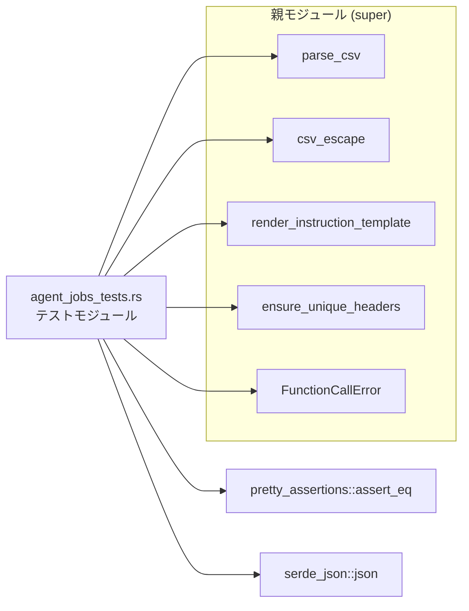
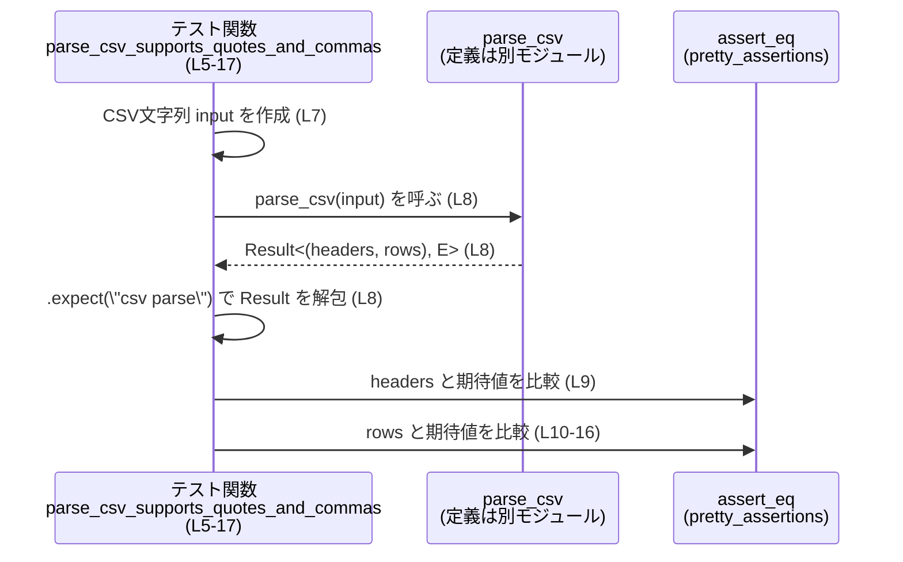

# core\src\tools\handlers\agent_jobs_tests.rs コード解説

## 0. ざっくり一言

このファイルは、エージェントジョブ用ハンドラ（親モジュール `super::*`）が提供する以下のユーティリティ関数の挙動を検証する **単体テスト群** です。

- CSV のパース (`parse_csv`) とエスケープ (`csv_escape`)
- 指示文テンプレートの展開 (`render_instruction_template`)
- CSV ヘッダの重複チェック (`ensure_unique_headers`)

（根拠: 冒頭の `use super::*;` と各テスト内の呼び出し `parse_csv`, `csv_escape`, `render_instruction_template`, `ensure_unique_headers` より  
`agent_jobs_tests.rs:L1, L8, L21-23, L33-36, L48, L55`）

---

## 1. このモジュールの役割

### 1.1 概要

このモジュールは、親モジュールが提供する CSV／テンプレート関連ユーティリティの **契約（期待される挙動）** を固定する目的で、以下の点をテストしています。

- CSV パーサがクオートとカンマを正しく扱うこと  
  （`parse_csv_supports_quotes_and_commas` テスト  
  `agent_jobs_tests.rs:L5-17`）
- CSV エスケープ関数が必要な場合のみクオート／クオートエスケープを行うこと  
  （`csv_escape_quotes_when_needed`  
  `agent_jobs_tests.rs:L19-24`）
- テンプレートレンダラがプレースホルダ展開と波括弧エスケープを正しく処理すること  
  （`render_instruction_template_*` テスト  
  `agent_jobs_tests.rs:L26-41, L43-50`）
- ヘッダ検証関数が重複ヘッダを適切なエラーで拒否すること  
  （`ensure_unique_headers_rejects_duplicates`  
  `agent_jobs_tests.rs:L52-61`）

### 1.2 アーキテクチャ内での位置づけ

このテストモジュールは、親モジュール（`super`）のヘルパ関数に対してのみ依存し、外部クレートとして `pretty_assertions` と `serde_json` を利用しています。



- 親モジュール側の具体的なファイル名・実装は、このチャンクには現れません（`use super::*;` のみ  
  `agent_jobs_tests.rs:L1`）。

### 1.3 設計上のポイント

- **責務の分割**  
  各テスト関数は単一の関数・機能に対応し、名前が期待挙動を説明する形になっています。  
  例: `parse_csv_supports_quotes_and_commas`, `render_instruction_template_leaves_unknown_placeholders`  
  （`agent_jobs_tests.rs:L5-6, L43-44`）

- **エラーハンドリングの契約確認**  
  - `parse_csv` は `Result` を返し、テストでは `.expect("csv parse")` で失敗時にパニックさせています  
    （`agent_jobs_tests.rs:L8`）
  - `ensure_unique_headers` は `Err(FunctionCallError::RespondToModel(...))` を返すことが期待されています  
    （`agent_jobs_tests.rs:L55-61`）

- **外部依存の最小化**  
  - 比較には差分が見やすい `pretty_assertions::assert_eq` を使用  
    （`agent_jobs_tests.rs:L2, L9-10, L21-23, L37, L49, L58`）
  - テンプレート用の行データには `serde_json::json` マクロを利用  
    （`agent_jobs_tests.rs:L3, L28-32, L45-47`）

- **並行性**  
  スレッドや非同期処理は利用しておらず、このテストからは対象関数の並行性特性は分かりません。

---

## 2. 主要な機能一覧

### 2.1 テスト対象機能（外部 API の契約）

- `parse_csv`: CSV 文字列からヘッダ行とデータ行をパースする。  
  クオート付きフィールド内のカンマを 1 フィールドとして扱うことが期待されています。  
  （根拠: `parse_csv_supports_quotes_and_commas` 内の期待値  
  `agent_jobs_tests.rs:L7-16`）

- `csv_escape`: 文字列を CSV フィールドとしてエスケープする。  
  カンマや二重引用符を含む場合のみクオートやクオートの二重化を行うことが期待されています。  
  （根拠: `csv_escape_quotes_when_needed` の 3 ケース  
  `agent_jobs_tests.rs:L21-23`）

- `render_instruction_template`: テンプレート文字列内の `{key}` を JSON 行オブジェクトの値で置換し、`{{` / `}}` をリテラル `{` / `}` に展開することが期待されています。未知キーはそのまま残すべきです。  
  （根拠: 2 つの `render_instruction_template_*` テスト  
  `agent_jobs_tests.rs:L27-41, L44-50`）

- `ensure_unique_headers`: ヘッダ名のスライスを検査し、重複がある場合には `FunctionCallError::RespondToModel("csv header path is duplicated")` を返すことが期待されています。  
  （根拠: `ensure_unique_headers_rejects_duplicates`  
  `agent_jobs_tests.rs:L53-61`）

### 2.2 コンポーネント一覧（関数・外部依存）

| 名前 | 種別 | 定義/所在 | 概要 | 根拠 |
|------|------|-----------|------|------|
| `parse_csv_supports_quotes_and_commas` | 関数（テスト） | 本ファイル | `parse_csv` がクオート付きフィールドとカンマを正しく扱うことを検証 | `agent_jobs_tests.rs:L5-17` |
| `csv_escape_quotes_when_needed` | 関数（テスト） | 本ファイル | `csv_escape` のエスケープ規則（クオート・カンマ・二重引用符）を検証 | `agent_jobs_tests.rs:L19-24` |
| `render_instruction_template_expands_placeholders_and_escapes_braces` | 関数（テスト） | 本ファイル | プレースホルダ展開と `{{` → `{` のエスケープ挙動を検証 | `agent_jobs_tests.rs:L26-41` |
| `render_instruction_template_leaves_unknown_placeholders` | 関数（テスト） | 本ファイル | 未知プレースホルダがそのまま残ることを検証 | `agent_jobs_tests.rs:L43-50` |
| `ensure_unique_headers_rejects_duplicates` | 関数（テスト） | 本ファイル | 重複ヘッダに対して特定のエラーを返すことを検証 | `agent_jobs_tests.rs:L52-61` |
| `parse_csv` | 関数（外部） | 親モジュール `super`（本チャンクには定義なし） | CSV 文字列からヘッダと行をパースする関数と解釈できます（テスト内容から） | 呼び出し: `agent_jobs_tests.rs:L8` |
| `csv_escape` | 関数（外部） | 親モジュール `super` | CSV フィールド用の文字列エスケープ関数と解釈できます | 呼び出し: `agent_jobs_tests.rs:L21-23` |
| `render_instruction_template` | 関数（外部） | 親モジュール `super` | テンプレート文字列と JSON 行データから指示文を生成する関数と解釈できます | 呼び出し: `agent_jobs_tests.rs:L33-36, L48` |
| `ensure_unique_headers` | 関数（外部） | 親モジュール `super` | ヘッダスライスの重複検査を行う関数と解釈できます | 呼び出し: `agent_jobs_tests.rs:L55` |
| `FunctionCallError` | 型（種別はこのチャンクからは不明） | 親モジュールまたは上位クレート | 変種 `RespondToModel(String)` を持つエラー型として利用 | パターン: `agent_jobs_tests.rs:L58-60` |
| `pretty_assertions::assert_eq` | マクロ | 外部クレート `pretty_assertions` | 期待値比較時に差分を見やすく表示するために使用 | `agent_jobs_tests.rs:L2, L9-10, L21-23, L37, L49, L58` |
| `serde_json::json` | マクロ | 外部クレート `serde_json` | JSON 形式の行データ（`row`）を生成するために使用 | `agent_jobs_tests.rs:L3, L28-32, L45-47` |

※ 外部関数・型の実装はこのチャンクには現れません。

---

## 3. 公開 API と詳細解説

### 3.1 型一覧

このファイル内で **新たに定義されている公開型はありません**。

- `FunctionCallError` は使用されていますが、定義は親モジュール側にあり、このチャンクには現れません。  
  （`agent_jobs_tests.rs:L58-60`）

### 3.2 重要な関数（テスト）の詳細

以下では、テスト関数を通じて読み取れる **外部 API の契約** を整理します。

---

#### `parse_csv_supports_quotes_and_commas()`

**概要**

- `parse_csv` 関数が、クオートやカンマを含む CSV を正しくヘッダ・行に分解できるかを検証するテストです。  
  （`agent_jobs_tests.rs:L5-17`）

**引数**

- なし（テスト関数であり、内部で固定の入力文字列を生成しています）。

**戻り値**

- `()`（テスト関数の標準的な戻り値で、アサーション失敗時にはパニックします）。

**内部処理の流れ**

1. テキストベースの CSV 入力を定義します。  
   `"id,name\n1,\"alpha, beta\"\n2,gamma\n"`  
   （ヘッダ 1 行＋データ 2 行）  
   （`agent_jobs_tests.rs:L7`）

2. `parse_csv(input)` を呼び、`expect("csv parse")` で `Result` を解包して `(headers, rows)` を得ます。  
   ここから `parse_csv` は `Result<(_, _), _>` を返すことが分かります。  
   （`agent_jobs_tests.rs:L8`）

3. `headers` が `["id", "name"]` であることを検証します。  
   （`agent_jobs_tests.rs:L9`）

4. `rows` が以下の 2 行の 2 次元ベクタであることを検証します。  
   - 行1: `["1", "alpha, beta"]`（カンマを含む値がクオートにより 1 フィールドに扱われている）  
   - 行2: `["2", "gamma"]`  
   （`agent_jobs_tests.rs:L10-16`）

```mermaid
flowchart TD
    A[テスト関数<br/>parse_csv_supports_quotes_and_commas] --> B[CSV文字列 input を作成]
    B --> C[parse_csv(input) を呼び出し<br/>Result を expect で解包]
    C --> D[headers を期待値と比較<br/>["id","name"]]
    C --> E[rows を期待値と比較<br/>[["1","alpha, beta"],["2","gamma"]]]
```

**Examples（使用例）**

このテスト自体が `parse_csv` の基本的な使い方の例になっています。

```rust
// CSV 入力（ヘッダ + 2 行、2 列）
let input = "id,name\n1,\"alpha, beta\"\n2,gamma\n";

// parse_csv は Result を返す（具体的なエラー型はこのチャンクからは不明）
let (headers, rows) = parse_csv(input).expect("csv parse");

// ヘッダ確認
assert_eq!(headers, vec!["id".to_string(), "name".to_string()]);

// 行データ確認
assert_eq!(
    rows,
    vec![
        vec!["1".to_string(), "alpha, beta".to_string()], // クオート内部のカンマは 1 フィールド
        vec!["2".to_string(), "gamma".to_string()],
    ]
);
```

**Errors / Panics**

- `parse_csv` が `Err` を返した場合、`.expect("csv parse")` によりテストがパニックします。  
  （`agent_jobs_tests.rs:L8`）
- それ以外にパニック要因はありません。

**Edge cases（エッジケース）**

- クオートに囲まれた値 `"alpha, beta"` に含まれるカンマはフィールド区切りとみなされず、1 フィールドとして解釈される必要があります。  
  （`agent_jobs_tests.rs:L7, L13`）
- クオート無しの `gamma` は通常通り 1 フィールドとして扱われます。  
  （`agent_jobs_tests.rs:L7, L14`）

このテストからは、空行や不完全な行など他のエッジケースへの挙動は分かりません。

**使用上の注意点**

- `parse_csv` の戻り値が `Result` であることは分かりますが、具体的なエラー型やエラー条件はこのチャンクには現れません。
- テストコードでは `.expect(...)` を用いているため、本番コードで利用する場合は `?` 演算子や `match` によるエラーハンドリングが必要です。

---

#### `csv_escape_quotes_when_needed()`

**概要**

- `csv_escape` 関数が、CSV フィールドとしてのエスケープが必要な場合のみクオートや二重引用符のエスケープを行うことを検証するテストです。  
  （`agent_jobs_tests.rs:L19-24`）

**引数**

- なし（内部で 3 種類のリテラル文字列をテスト対象としています）。

**戻り値**

- `()`。

**内部処理の流れ**

1. `"simple"` を `csv_escape` して `"simple"` のまま返ることを検証。  
   （`agent_jobs_tests.rs:L21`）
2. `"a,b"` を `csv_escape` して `"\"a,b\""`（両端がクオートで囲まれる）になることを検証。  
   （`agent_jobs_tests.rs:L22`）
3. `"a\"b"`（内部に二重引用符を含む）を `csv_escape` して `"\"a\"\"b\""`（全体がクオートで囲まれ、内部の `"` が 2 つに増える）になることを検証。  
   （`agent_jobs_tests.rs:L23`）

**Examples（使用例）**

```rust
// カンマやクオートを含まない場合はそのまま
assert_eq!(csv_escape("simple"), "simple");

// カンマを含む場合は全体を "..." で囲む
assert_eq!(csv_escape("a,b"), "\"a,b\"");

// クオートを含む場合は全体を "..." で囲み、内部の " を "" にする
assert_eq!(csv_escape("a\"b"), "\"a\"\"b\"");
```

**Errors / Panics**

- `csv_escape` の戻り値は `&str` → `String` のような成功前提の変換と考えられ、テストではエラーケースを扱っていません。
- このテストコードからはエラーやパニックが起こりうる条件は読み取れません。

**Edge cases（エッジケース）**

- **カンマを含む入力**: クオートで囲むべきです（`"a,b"` → `"\"a,b\""`）。  
- **二重引用符を含む入力**: クオートで囲み、内部の `"` を `""` に変換すべきです（`"a\"b"` → `"\"a\"\"b\""`）。  
- 空文字列や改行を含むケースなど、他のエッジケースはこのテストからは不明です。

**使用上の注意点**

- 一般的な CSV 仕様に沿った挙動（カンマ・クオートを含む場合にクオート＋二重化）が想定されますが、仕様の詳細は実装側コードがないため断定できません。
- 呼び出し側は `csv_escape` の戻り値をそのまま CSV 出力に用いることが想定されます。

---

#### `render_instruction_template_expands_placeholders_and_escapes_braces()`

**概要**

- `render_instruction_template` が以下を正しく行うことを検証するテストです。  
  - `{key}` プレースホルダの展開  
  - `{file path}` のようにスペースを含むキー名の展開  
  - `{{literal}}` を `{literal}` にする波括弧エスケープ

（`agent_jobs_tests.rs:L26-41`）

**引数**

- なし（テスト関数内でテンプレートと行データを構築）。

**戻り値**

- `()`。

**内部処理の流れ**

1. JSON オブジェクト `row` を `serde_json::json!` マクロで生成します。  
   キー `"path"`, `"area"`, `"file path"` を持ちます。  
   （`agent_jobs_tests.rs:L28-32`）

2. テンプレート文字列  
   `"Review {path} in {area}. Also see {file path}. Use {{literal}}."`  
   と `&row` を `render_instruction_template` に渡し、`rendered` を得ます。  
   （`agent_jobs_tests.rs:L33-36`）

3. `rendered` が  
   `"Review src/lib.rs in test. Also see docs/readme.md. Use {literal}."`  
   と一致することを検証します。  
   （`agent_jobs_tests.rs:L37-40`）

**Examples（使用例）**

```rust
// JSON 行データを構築
let row = json!({
    "path": "src/lib.rs",
    "area": "test",
    "file path": "docs/readme.md",
});

// テンプレート内の {path}, {area}, {file path} を row の値で置換
// {{literal}} は {literal} というリテラル文字列に変換される
let rendered = render_instruction_template(
    "Review {path} in {area}. Also see {file path}. Use {{literal}}.",
    &row,
);

assert_eq!(
    rendered,
    "Review src/lib.rs in test. Also see docs/readme.md. Use {literal}."
);
```

**Errors / Panics**

- このテストではエラーケースを扱っておらず、`render_instruction_template` が `Result` を返すかどうかも分かりません（戻り値をそのまま `rendered` に束縛しています  
  `agent_jobs_tests.rs:L33-36`）。
- テストコード自身にはパニック要素はありません（`expect` なども使用していません）。

**Edge cases（エッジケース）**

- キーにスペースを含む `{file path}` のようなプレースホルダも解決できる必要があります。  
  （`agent_jobs_tests.rs:L31, L34-35, L39`）
- `{{literal}}` のように二つの `{` / `}` で囲まれた部分は単一の `{literal}` として扱われます。  
  （`agent_jobs_tests.rs:L34-35, L39`）
- 未知キーの挙動は別テストで検証されています（次節）。

**使用上の注意点**

- 入力テンプレート文字列の構文（どのような文字がキー名として許可されるか）は、このテストだけからは完全には分かりませんが、少なくともスペースを含むキー名をサポートしていることが示唆されます。

---

#### `render_instruction_template_leaves_unknown_placeholders()`

**概要**

- `render_instruction_template` が、提供された行データに存在しないキーのプレースホルダを **そのまま残す** 挙動であることを検証するテストです。  
  （`agent_jobs_tests.rs:L43-50`）

**引数**

- なし。

**戻り値**

- `()`。

**内部処理の流れ**

1. キー `"path"` のみを持つ JSON オブジェクト `row` を生成します。  
   （`agent_jobs_tests.rs:L45-47`）

2. テンプレート `"Check {path} then {missing}"` と `&row` を渡して `rendered` を得ます。  
   `{missing}` は `row` に存在しないキーです。  
   （`agent_jobs_tests.rs:L48`）

3. `rendered` が `"Check src/lib.rs then {missing}"` であることを検証します。  
   すなわち、`{missing}` は文字列として残る必要があります。  
   （`agent_jobs_tests.rs:L49`）

**Examples（使用例）**

```rust
let row = json!({
    "path": "src/lib.rs",
});

let rendered = render_instruction_template("Check {path} then {missing}", &row);

// {path} は展開されるが、存在しない {missing} はそのまま残る
assert_eq!(rendered, "Check src/lib.rs then {missing}");
```

**Errors / Panics**

- 未知プレースホルダがあってもエラーにはならず、その部分をそのまま出力することが期待されます。

**Edge cases（エッジケース）**

- このテストから、「キーが存在しないプレースホルダに遭遇した場合はエラーにせず、テンプレート文字列をほぼそのまま出す」という契約が読み取れます。
- どのような条件でエラーを返すのか（もし返すなら）は、このチャンクからは分かりません。

**使用上の注意点**

- 呼び出し側で「全てのプレースホルダが確実に解決されていること」を保証したい場合は、`render_instruction_template` の結果に残っている `{...}` を別途チェックする必要があります（少なくとも、テストでは未解決プレースホルダを許容する設計になっています）。

---

#### `ensure_unique_headers_rejects_duplicates()`

**概要**

- `ensure_unique_headers` が、重複するヘッダ名を検出した場合に `Err(FunctionCallError::RespondToModel("csv header path is duplicated"))` を返すことを検証するテストです。  
  （`agent_jobs_tests.rs:L52-61`）

**引数**

- なし（テスト内でヘッダベクタを構築）。

**戻り値**

- `()`。

**内部処理の流れ**

1. 2 つの `"path"` を持つヘッダベクタ `headers` を作成します。  
   （`agent_jobs_tests.rs:L54`）

2. `ensure_unique_headers(headers.as_slice())` を呼び出し、結果が `Err(err)` であることを `let Err(err) = ... else { panic!(...) };` で検証します。  
   （`agent_jobs_tests.rs:L55-57`）

3. `err` が `FunctionCallError::RespondToModel("csv header path is duplicated".to_string())` と等しいことを `assert_eq!` で検証します。  
   （`agent_jobs_tests.rs:L58-60`）

**Examples（使用例）**

```rust
let headers = vec!["path".to_string(), "path".to_string()];

// Result が Err でなければテスト失敗
let Err(err) = ensure_unique_headers(headers.as_slice()) else {
    panic!("expected duplicate header error");
};

// エラー内容の検証
assert_eq!(
    err,
    FunctionCallError::RespondToModel("csv header path is duplicated".to_string())
);
```

**Errors / Panics**

- 重複ヘッダがある場合、`ensure_unique_headers` は `Err(FunctionCallError::RespondToModel(...))` を返す必要があります。  
- テスト内では、重複があるのに `Ok` が返ってきた場合に明示的に `panic!` を起こしています。  
  （`agent_jobs_tests.rs:L55-57`）
- `FunctionCallError` 自体の性質（エラー分類など）はこのチャンクからは分かりません。

**Edge cases（エッジケース）**

- `"path"` が重複した場合のメッセージ `"csv header path is duplicated"` は固定文字列として期待されています。  
  （`agent_jobs_tests.rs:L58-60`）
- 他のヘッダ名の重複時にどのようなメッセージになるかは、このテストからは不明です。
- ヘッダベクタが空の場合や 1 要素だけの場合の挙動も、このチャンクには現れません。

**使用上の注意点**

- `ensure_unique_headers` を利用するコードでは、重複検出時に `FunctionCallError::RespondToModel` が発生しうることを前提にエラーハンドリングを設計する必要があります。
- このテストはエラー文字列も厳密に比較しているため、実装側でメッセージを変更するとテストが失敗します（API としてメッセージが半ば固定化されている点に注意が必要です）。

---

### 3.3 その他の関数

- このファイルには補助的な関数やラッパー関数は定義されていません。

---

## 4. データフロー

ここでは、`parse_csv_supports_quotes_and_commas` を例に、テストにおけるデータの流れを示します。

### 4.1 CSV パーステスト時のフロー



- テストは **純粋な関数呼び出しとアサーションのみ** で構成されており、I/O や共有状態へのアクセスはありません。
- これにより、対象関数の基本的な契約（入力 → 出力）が壊れていないかを検証しています。

---

## 5. 使い方（How to Use）

このファイルはテスト用ですが、テストコードはそのまま **外部 API の使用例** としても参照できます。

### 5.1 基本的な使用方法

#### `parse_csv` と `csv_escape` の組み合わせ例

```rust
// 入力として渡す CSV テキスト
let input = "id,name\n1,\"alpha, beta\"\n2,gamma\n";

// CSV をパースする
let (headers, rows) = parse_csv(input)?; // 本番コードでは ? などでエラー伝播するのが自然です

// 新たな行を追加する際、フィールドをエスケープして連結する
let new_fields = vec!["3", "delta, epsilon"];
let escaped_fields: Vec<String> = new_fields
    .into_iter()
    .map(|f| csv_escape(f))
    .collect();

let new_line = escaped_fields.join(",");
// new_line == "\"3\",\"delta, epsilon\"" のような形式を期待
```

- この例はテストから直接は現れませんが、`parse_csv` と `csv_escape` の用途を組み合わせた典型的な利用イメージです。

### 5.2 テンプレートレンダリングの使用例

```rust
// JSON 行データ
let row = json!({
    "path": "src/lib.rs",
    "area": "core",
});

// テンプレート文字列
let template = "Review {path} in {area}. Use {{literal}} syntax.";

// プレースホルダ展開
let rendered = render_instruction_template(template, &row);

// 期待される例:
// "Review src/lib.rs in core. Use {literal} syntax."
println!("{rendered}");
```

- テストに基づき、`{path}` や `{area}` は `row` の値で置換され、`{{literal}}` はリテラル `{literal}` として扱われます。  
  （根拠: `agent_jobs_tests.rs:L34-35, L39`）

### 5.3 ヘッダ検証の使用例と誤りパターン

```rust
// 正しい例: ヘッダが一意
let headers = vec!["path".to_string(), "area".to_string()];
ensure_unique_headers(&headers)?; // Err にならないことを期待

// 誤り例: ヘッダが重複
let bad_headers = vec!["path".to_string(), "path".to_string()];
if let Err(err) = ensure_unique_headers(&bad_headers) {
    // テストから、エラーは FunctionCallError::RespondToModel(...) であることが分かる
    eprintln!("Header error: {err:?}");
}
```

- テストでは重複 `"path"` に対して特定のエラーメッセージが返ることを確認しています。  
  （`agent_jobs_tests.rs:L54-60`）

### 5.4 よくある間違い（このテストから推測されるもの）

- **未解決プレースホルダを想定外に残してしまう**  
  - テストでは未知キー `{missing}` がそのまま残ることを肯定しているため、呼び出し側が「すべて解決されている」と思い込むと不整合が生じる可能性があります。  
    （`agent_jobs_tests.rs:L48-49`）

- **ヘッダ重複時のエラーを無視する**  
  - `ensure_unique_headers` が `Err` を返した場合、呼び出し側で適切なエラーハンドリングを行わないと、下流処理で前提条件が崩れる可能性があります。  

### 5.5 使用上の注意点（まとめ）

- Rust の `Result` とパターンマッチを使ったエラーハンドリングが前提となる API がいくつかあります（`parse_csv`, `ensure_unique_headers`）。  
  （`agent_jobs_tests.rs:L8, L55-57`）
- テンプレートレンダリングは未知プレースホルダをエラーにしないため、必要に応じて呼び出し側で二次チェックを行う設計が適切です。
- このファイルに並行性やスレッドセーフティに関する記述はなく、それらの特性は実装側コードを確認する必要があります。

---

## 6. 変更の仕方（How to Modify）

### 6.1 新しい機能を追加する場合（テスト観点）

- 親モジュールに新しいユーティリティ関数を追加した場合:
  1. `use super::*;` により自動的にテストから参照可能になる設計であれば、同ファイルに `#[test] fn 新機能名_...()` を追加します。
  2. テスト名には「何を確認するか」を含めます（このファイルの命名規則に倣う）。  
     例: `parse_csv_handles_empty_lines` など。
  3. 期待される入力と出力を具体的なリテラルとして記述し、`assert_eq!` などで検証します。

### 6.2 既存の機能を変更する場合

- 仕様変更時の注意点:
  - `ensure_unique_headers` のエラーメッセージを変更する場合、  
    `assert_eq!(err, FunctionCallError::RespondToModel("csv header path is duplicated".to_string()))`  
    が壊れるため、テストの期待値も合わせて更新する必要があります。  
    （`agent_jobs_tests.rs:L58-60`）

- 影響範囲の確認:
  - `parse_csv`, `csv_escape`, `render_instruction_template`, `ensure_unique_headers` はここ以外のコードからも呼ばれている可能性が高いため、親モジュールおよびその利用箇所を検索して契約の変更有無を確認する必要があります（このチャンクには他の使用箇所は現れません）。

---

## 7. 関連ファイル

このモジュールと密接に関係するファイル・モジュールは、コードから次のように読み取れます。

| パス / モジュール名 | 役割 / 関係 |
|---------------------|------------|
| 親モジュール（`super`） ※具体的なファイルパスはこのチャンクには現れません | `parse_csv`, `csv_escape`, `render_instruction_template`, `ensure_unique_headers`, `FunctionCallError` を定義・公開しており、本テストモジュールから利用されています。（`agent_jobs_tests.rs:L1, L8, L21-23, L33-36, L48, L55, L58-60`） |
| 外部クレート `pretty_assertions` | `assert_eq!` マクロを提供し、テストにおける比較を視覚的に分かりやすくしています。（`agent_jobs_tests.rs:L2`） |
| 外部クレート `serde_json` | `json!` マクロを通じて JSON 形式の行データ（テンプレート展開用）を生成するために使用されています。（`agent_jobs_tests.rs:L3, L28-32, L45-47`） |

---

### バグ・セキュリティ観点（このチャンクから分かる範囲）

- このファイル自体は **純粋なテストコード** であり、外部 I/O やユーザー入力を直接扱っていません。そのため、このチャンク単体から明らかなバグやセキュリティ脆弱性は読み取れません。
- 実際のロジック（`parse_csv` など）の安全性や性能、並行性については、該当する実装ファイルを併せて確認する必要があります。
