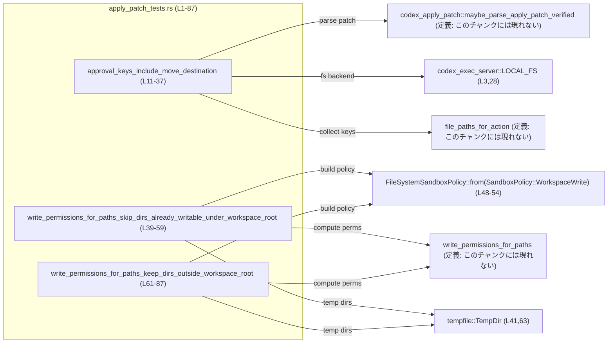
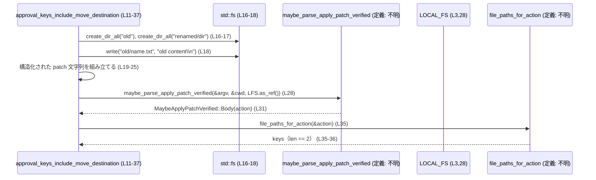
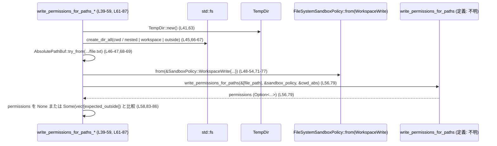

# core/src/tools/handlers/apply_patch_tests.rs コード解説

## 0. ざっくり一言

このファイルは、`apply_patch` ハンドラまわりの **ファイルパスと書き込み権限の扱い** を検証するテスト群です。  
具体的には、パッチ適用時の承認キーに move 先パスが含まれることと、`write_permissions_for_paths` がワークスペースのルート内外のパスを適切に扱うことを確認しています（apply_patch_tests.rs:L11-87）。

---

## 1. このモジュールの役割

### 1.1 概要

- このモジュールは、`apply_patch` まわりの処理が **ファイルシステムサンドボックスの前提どおりにパスと権限を扱っているか** を検証するためのテストを提供します。
- `codex_apply_patch::maybe_parse_apply_patch_verified` と `file_paths_for_action` を通じて、パッチ内の move 先ファイルが承認対象として認識されることを確認します（apply_patch_tests.rs:L11-37）。
- `write_permissions_for_paths` と `FileSystemSandboxPolicy` を通じて、ワークスペース内のパスでは追加権限を不要とし、ワークスペース外のパスは追加権限対象として残すことを確認します（apply_patch_tests.rs:L39-87）。

### 1.2 アーキテクチャ内での位置づけ

このテストモジュールは、ハンドラ本体（`super::*` でインポートされていますが定義はこのチャンクには現れません）と、外部クレートの API 群との結合部を検証しています。



### 1.3 設計上のポイント

コードから読み取れる設計上の特徴は次のとおりです。

- **実ファイルシステム上でのテスト**  
  - `tempfile::TempDir` を使い、一時ディレクトリの下にディレクトリやファイルを作成してテストしています（apply_patch_tests.rs:L13-18, L41-45, L63-67）。  
    これにより、パス処理や権限計算が実際のファイルシステム構造に対して正しく動作するかを確認しています。
- **サンドボックスポリシとの統合テスト**  
  - `FileSystemSandboxPolicy::from(&SandboxPolicy::WorkspaceWrite { ... })` でポリシを構築し、そのポリシを `write_permissions_for_paths` に渡しています（apply_patch_tests.rs:L48-54, L71-77）。
- **非同期処理の検証**  
  - `approval_keys_include_move_destination` は `#[tokio::test]` で定義されており、`codex_apply_patch::maybe_parse_apply_patch_verified` の非同期 API をテストしています（apply_patch_tests.rs:L11, L28-29）。
- **エラー処理方針**  
  - テスト内では、失敗すべきではない処理には `.expect("...")` を用い、想定外の戻り値には `panic!` を使っています（apply_patch_tests.rs:L13, L16-18, L32, L41, L45-47, L63, L66-69, L81）。  
    これにより、前提が崩れた場合には即座にテストが失敗するようになっています。

---

## 2. 主要な機能一覧（テスト観点）

このファイルに定義されている主なテスト関数と、その検証内容です。

- `approval_keys_include_move_destination`: パッチの **move 先パス** が `file_paths_for_action` が返すキー集合に含まれることを検証します（apply_patch_tests.rs:L11-37）。
- `write_permissions_for_paths_skip_dirs_already_writable_under_workspace_root`: ワークスペースルート配下のディレクトリに対するファイルについて、`write_permissions_for_paths` が **追加の書き込み権限を要求しない（`None` を返す）** ことを検証します（apply_patch_tests.rs:L39-59）。
- `write_permissions_for_paths_keep_dirs_outside_workspace_root`: ワークスペースルート外のディレクトリについて、`write_permissions_for_paths` が **そのディレクトリをサンドボックスの write 権限対象として保持する** ことを検証します（apply_patch_tests.rs:L61-87）。

---

## 3. 公開 API と詳細解説

### 3.0 コンポーネントインベントリー（このファイルに出現する主な要素）

#### ローカル関数（テスト）

| 名前 | 種別 | 役割 / 用途 | 定義箇所 |
|------|------|-------------|----------|
| `approval_keys_include_move_destination` | 非同期テスト関数 (`#[tokio::test]`) | パッチ中の move 先パスが承認キー集合に含まれることを検証する | apply_patch_tests.rs:L11-37 |
| `write_permissions_for_paths_skip_dirs_already_writable_under_workspace_root` | テスト関数 (`#[test]`) | ワークスペースルート配下のパスに対して追加の write 権限が不要であることを検証する | apply_patch_tests.rs:L39-59 |
| `write_permissions_for_paths_keep_dirs_outside_workspace_root` | テスト関数 (`#[test]`) | ワークスペース外のパスが write 権限候補として保持されることを検証する | apply_patch_tests.rs:L61-87 |

#### このファイルで利用している主な外部コンポーネント

| 名前 | 種別 | 定義元 / 備考 | 用途 | 出現箇所 |
|------|------|--------------|------|----------|
| `TempDir` | 構造体 | `tempfile` クレート | 一時ディレクトリの生成 | L9, L13, L41, L63 |
| `FileSystemSandboxPolicy` | 構造体 | `codex_protocol::permissions` | サンドボックスのファイルシステムポリシ | L4, L48-54, L71-77 |
| `SandboxPolicy::WorkspaceWrite` | 列挙体のバリアント | `codex_protocol::protocol` | ワークスペース書き込みポリシの構築 | L5, L48-54, L71-77 |
| `MaybeApplyPatchVerified` | 列挙体 | `codex_apply_patch` | `maybe_parse_apply_patch_verified` の戻り値 | L2, L28-33 |
| `LOCAL_FS` | グローバル値 | `codex_exec_server` | ローカルファイルシステムバックエンド | L3, L28 |
| `PathBufExt` / `PathExt` | トレイト | `core_test_support` | `.abs()` で絶対パス取得など | L6-7, L15, L43, L70, L81 |
| `AbsolutePathBuf` | 型 | 定義は `super::*` などからのインポートと推測されますが、このチャンクには定義が現れません | 絶対パス表現。`try_from` で `PathBuf` から変換 | L46-47, L68-69 |
| `write_permissions_for_paths` | 関数 | 定義は `super::*` などからのインポートと推測されますが、このチャンクには定義が現れません | サンドボックスポリシとカレントディレクトリから write 権限設定を生成 | L56, L79 |
| `file_paths_for_action` | 関数 | 定義は `super::*` などからのインポートと推測されますが、このチャンクには定義が現れません | apply_patch アクションから対象ファイルパス集合を抽出 | L35 |

> `AbsolutePathBuf`, `write_permissions_for_paths`, `file_paths_for_action` の定義そのものはこのチャンクには現れないため、型や引数などの詳細は不明です。

### 3.1 型一覧（このファイルで新規定義される型）

このファイル内で **新たに定義されている構造体・列挙体等はありません**。  
使用されている型はすべて外部モジュールまたは `super::*` からのインポートです（apply_patch_tests.rs:L1-9, L46-47, L68-69）。

### 3.2 関数詳細

#### `approval_keys_include_move_destination()`

**概要**

- `apply_patch` CLI 風の引数とパッチ内容を使って `maybe_parse_apply_patch_verified` を呼び出し、その結果得られるアクションに対して `file_paths_for_action` を適用し、得られるファイルキーが 2 つであることを確認します（apply_patch_tests.rs:L11-37）。
- パッチには `old/name.txt` から `renamed/dir/name.txt` への move が含まれており、テスト名から判断すると **移動元と移動先の両方がキーに含まれていること** を期待していることが分かります（apply_patch_tests.rs:L19-25, L35-36）。

**引数**

なし（テスト関数であり、引数は取りません）。

**戻り値**

- 戻り値の型は `()` です（テスト関数のため、明示されていませんが Rust の規則から分かります）。

**内部処理の流れ**

1. 一時ディレクトリを作成し、そのパスを `cwd_path` とする（apply_patch_tests.rs:L13-14）。
2. `PathBufExt::abs` により `cwd_path` から絶対パス `cwd` を取得する（apply_patch_tests.rs:L15）。
3. `cwd_path` 配下に `old` ディレクトリと `renamed/dir` ディレクトリを作成する（apply_patch_tests.rs:L16-17）。
4. `old/name.txt` に `"old content\n"` を書き込む（apply_patch_tests.rs:L18）。
5. move を含むパッチ文字列を `patch` に格納する（apply_patch_tests.rs:L19-25）。
6. `argv = ["apply_patch", patch]` という形の引数ベクタを構築する（apply_patch_tests.rs:L26）。
7. `maybe_parse_apply_patch_verified(&argv, &cwd, LOCAL_FS.as_ref())` を非同期に呼び出し、結果を `MaybeApplyPatchVerified::Body(action)` としてマッチングする。`Body` 以外のバリアントの場合は `panic!` する（apply_patch_tests.rs:L27-33）。
8. 得られた `action` に対して `file_paths_for_action(&action)` を呼び出し、返された `keys` の長さが 2 であることを `assert_eq!` で確認する（apply_patch_tests.rs:L35-36）。

**Examples（使用例）**

このテスト自体が `maybe_parse_apply_patch_verified` と `file_paths_for_action` の典型的な組み合わせ使用例になっています。

```rust
// apply_patch_tests.rs:L19-36 相当の流れを簡略化した例
let patch = r#"*** Begin Patch
*** Update File: old/name.txt
*** Move to: renamed/dir/name.txt
@@
-old content
+new content
*** End Patch"#;                                      // move を含むパッチ文字列

let argv = vec!["apply_patch".to_string(), patch.to_string()]; // CLI 風引数
let cwd = cwd_path.abs();                                      // カレントディレクトリの絶対パス

let action = match codex_apply_patch::maybe_parse_apply_patch_verified(
    &argv,
    &cwd,
    LOCAL_FS.as_ref(),                                 // ローカル FS バックエンド
).await {
    MaybeApplyPatchVerified::Body(action) => action,   // パッチ本文として解釈できた場合
    other => panic!("expected patch body, got: {other:?}"),
};

let keys = file_paths_for_action(&action);            // アクションからファイルパス集合を抽出
assert_eq!(keys.len(), 2);                            // 移動元・移動先の 2 件を期待
```

**Errors / Panics**

- `TempDir::new().expect("tmp")` が失敗した場合、`expect` により panic します（apply_patch_tests.rs:L13）。
- ディレクトリ作成やファイル書き込みが失敗した場合も `.expect(...)` により panic します（apply_patch_tests.rs:L16-18）。
- `maybe_parse_apply_patch_verified` の戻り値が `MaybeApplyPatchVerified::Body` 以外のバリアントだった場合、`panic!("expected patch body, got: {other:?}")` により panic します（apply_patch_tests.rs:L31-32）。
- `file_paths_for_action(&action)` 自体の内部でどのようなエラー処理が行われるかは、このチャンクからは分かりません（定義がないため）。

**Edge cases（エッジケース）**

- 移動を含まないパッチや、複数ファイルを更新するパッチに対する挙動は、このテストからは分かりません。
- `keys.len()` が 2 であることのみを検証しており、**どのパスが含まれているか（文字列の中身）** までは確認していません（apply_patch_tests.rs:L35-36）。
- `LOCAL_FS` や `cwd` の設定による振る舞いの違い（例: 相対パス vs 絶対パス）は、このテストでは `cwd.abs()` を既に使っているため観測できません（apply_patch_tests.rs:L15）。

**使用上の注意点**

- テストの前提として、パッチ文字列が `maybe_parse_apply_patch_verified` にとって有効である必要があります。そうでない場合、`Body` 以外のバリアントを受け取り panic します（apply_patch_tests.rs:L31-32）。
- ファイルシステム操作に依存するため、テスト実行環境で一時ディレクトリの作成や書き込みができることが前提です（apply_patch_tests.rs:L13-18）。
- 非同期関数であるため、`#[tokio::test]` のような非同期ランタイム上で実行する必要があります（apply_patch_tests.rs:L11）。

---

#### `write_permissions_for_paths_skip_dirs_already_writable_under_workspace_root()`

**概要**

- ワークスペースルート配下 (`cwd` の下) のディレクトリに対するファイルパスを `write_permissions_for_paths` に渡したとき、**追加の書き込み権限設定が不要であること**（`permissions == None`）を検証するテストです（apply_patch_tests.rs:L39-59）。

**引数**

なし。

**戻り値**

- 戻り値の型は `()` です（テスト関数）。

**内部処理の流れ**

1. 一時ディレクトリ `tmp` を作成し、そのパスを `cwd_path` とする（apply_patch_tests.rs:L41-42）。
2. `cwd_path.abs()` で絶対パス `cwd` を取得する（apply_patch_tests.rs:L43）。
3. `cwd_path.join("nested")` に `nested` ディレクトリを作成する（apply_patch_tests.rs:L44-45）。
4. `nested.join("file.txt")` から `AbsolutePathBuf::try_from(...)` により絶対パス表現 `file_path` を生成する（apply_patch_tests.rs:L46-47）。
5. `SandboxPolicy::WorkspaceWrite { ... }` から `FileSystemSandboxPolicy` を構築する（apply_patch_tests.rs:L48-54）。
6. `write_permissions_for_paths(&[file_path], &sandbox_policy, &cwd)` を呼び出し、`permissions` を取得する（apply_patch_tests.rs:L56）。
7. `permissions` が `None` であることを `assert_eq!(permissions, None)` で確認する（apply_patch_tests.rs:L58）。

**Examples（使用例）**

```rust
// apply_patch_tests.rs:L41-58 を簡略化した write_permissions_for_paths 呼び出し例
let tmp = TempDir::new().expect("tmp");                          // 一時ディレクトリ
let cwd_path = tmp.path();
let cwd = cwd_path.abs();                                        // ワークスペースルートを絶対パスに変換

let nested = cwd_path.join("nested");                            // ワークスペース配下のディレクトリ
std::fs::create_dir_all(&nested).expect("create nested dir");

let file_path = AbsolutePathBuf::try_from(nested.join("file.txt"))
    .expect("nested file path should be absolute");              // 絶対パスに変換

let sandbox_policy = FileSystemSandboxPolicy::from(
    &SandboxPolicy::WorkspaceWrite {
        writable_roots: vec![],                                  // 追加の書き込みルートなし
        read_only_access: Default::default(),
        network_access: false,
        exclude_tmpdir_env_var: true,
        exclude_slash_tmp: false,
    },
);

let permissions = write_permissions_for_paths(&[file_path], &sandbox_policy, &cwd);
// ワークスペース配下なので追加の書き込み権限は不要
assert_eq!(permissions, None);
```

**Errors / Panics**

- 一時ディレクトリや `nested` ディレクトリの作成、`AbsolutePathBuf::try_from` が失敗した場合、それぞれの `.expect("...")` により panic が発生します（apply_patch_tests.rs:L41, L45-47）。
- `write_permissions_for_paths` 自体のエラー条件や返り値の型はこのチャンクからは分かりませんが、`permissions` には `Option<...>` のような型が入っていそうであることは `assert_eq!(permissions, None)` から分かります（apply_patch_tests.rs:L58）。  
  ただし、その「中身」の具体的な型は不明です。

**Edge cases（エッジケース）**

- `writable_roots` が空のままでも、ワークスペースルート配下のパスであれば追加権限を不要とする挙動が期待されていることが分かります（apply_patch_tests.rs:L48-50, L56-58）。
- `exclude_slash_tmp` が `false` に設定されていますが、このテストケースでは `/tmp` が関係するパスを扱っていないため、このフラグの影響は観測されません（apply_patch_tests.rs:L53）。
- パスがワークスペース外（`cwd` の外）にある場合の挙動は、このテストからは分かりません（別のテストが扱っています）。

**使用上の注意点**

- `AbsolutePathBuf::try_from` は、対象の `PathBuf` が絶対パスであることを前提としていると推測できますが、定義がこのチャンクにないため詳細は不明です。テストでは `cwd_path` からの相対パスに対して問題なく動作しています（apply_patch_tests.rs:L46-47）。
- `write_permissions_for_paths` に渡す `cwd` は、ワークスペースのルートディレクトリを表すことが前提になっていると考えられます（apply_patch_tests.rs:L43, L56）。

---

#### `write_permissions_for_paths_keep_dirs_outside_workspace_root()`

**概要**

- ワークスペースルート (`cwd_abs`) の外にあるディレクトリ `outside` のファイルパスを `write_permissions_for_paths` に渡したとき、**その外部ディレクトリが write 権限対象として `permissions` の中に保持されること** を検証するテストです（apply_patch_tests.rs:L61-87）。

**引数**

なし。

**戻り値**

- 戻り値の型は `()` です。

**内部処理の流れ**

1. 一時ディレクトリ `tmp` を作成する（apply_patch_tests.rs:L63）。
2. `tmp.path().join("workspace")` を `cwd` とし、`tmp.path().join("outside")` を `outside` とする（apply_patch_tests.rs:L64-65）。
3. `workspace` と `outside` ディレクトリを作成する（apply_patch_tests.rs:L66-67）。
4. `outside.join("file.txt")` から `AbsolutePathBuf::try_from` により `file_path` を得る（apply_patch_tests.rs:L68-69）。
5. `cwd.abs()` により絶対パス `cwd_abs` を取得する（apply_patch_tests.rs:L70）。
6. `SandboxPolicy::WorkspaceWrite { exclude_slash_tmp: true, ... }` をもとに `FileSystemSandboxPolicy` を構築する（apply_patch_tests.rs:L71-77）。
7. `write_permissions_for_paths(&[file_path], &sandbox_policy, &cwd_abs)` により `permissions` を取得する（apply_patch_tests.rs:L79）。
8. `outside.canonicalize()` を `dunce::simplified` および `.abs()` に通したものを `expected_outside` として求める（apply_patch_tests.rs:L80-81）。
9. `permissions` から `profile.file_system.and_then(|fs| fs.write)` を取り出し、`Some(vec![expected_outside])` と一致することを `assert_eq!` で検証する（apply_patch_tests.rs:L83-86）。

**Examples（使用例）**

```rust
// apply_patch_tests.rs:L63-86 を簡略化した「ワークスペース外パス」の権限取得例
let tmp = TempDir::new().expect("tmp");
let cwd = tmp.path().join("workspace");                          // ワークスペースルート
let outside = tmp.path().join("outside");                        // ワークスペース外ディレクトリ

std::fs::create_dir_all(&cwd).expect("create cwd");
std::fs::create_dir_all(&outside).expect("create outside dir");

let file_path = AbsolutePathBuf::try_from(outside.join("file.txt"))
    .expect("outside file path should be absolute");             // outside 配下のファイル

let cwd_abs = cwd.abs();                                         // ワークスペースルートの絶対パス

let sandbox_policy = FileSystemSandboxPolicy::from(
    &SandboxPolicy::WorkspaceWrite {
        writable_roots: vec![],
        read_only_access: Default::default(),
        network_access: false,
        exclude_tmpdir_env_var: true,
        exclude_slash_tmp: true,                                 // /tmp を除外
    },
);

let permissions = write_permissions_for_paths(&[file_path], &sandbox_policy, &cwd_abs);

let expected_outside =
    dunce::simplified(&outside.canonicalize().expect("canonicalize outside dir")).abs();

assert_eq!(
    permissions
        .and_then(|profile| profile.file_system.and_then(|fs| fs.write)),
    Some(vec![expected_outside]),                                // outside が write 対象に含まれること
);
```

**Errors / Panics**

- 各種ファイルシステム操作や `AbsolutePathBuf::try_from`、`canonicalize()` が失敗すると、それぞれの `.expect("...")` により panic します（apply_patch_tests.rs:L63, L66-69, L81）。
- `permissions` の型や `profile.file_system`、`fs.write` の具体的な型はこのチャンクからは分かりませんが、`Option` と `Vec` の組み合わせであることが `and_then` と `Some(vec![...])` から分かります（apply_patch_tests.rs:L83-86）。

**Edge cases（エッジケース）**

- `exclude_slash_tmp: true` による `/tmp` 除外設定が含まれていますが、`outside` パスは `tmp`（一時ディレクトリ）配下であっても、`write_permissions_for_paths` によって write 対象として残ることが期待されています（apply_patch_tests.rs:L63-65, L71-77, L83-86）。
- `writable_roots` が空であっても、ワークスペース外パスに対しては明示的な write 権限が必要であるとみなされていることが、このテストから分かります（apply_patch_tests.rs:L71-73, L79-86）。

**使用上の注意点**

- `cwd_abs` はワークスペースルートを表す絶対パスとして `write_permissions_for_paths` に渡す必要があります（apply_patch_tests.rs:L70, L79）。
- `permissions` のネストしたフィールド（`file_system`, `write`）にアクセスする際には、`Option` を適切に扱う必要があります（`and_then` チェーンを使用）（apply_patch_tests.rs:L83-85）。

---

### 3.3 その他の関数

このファイルには、上記 3 つのテスト関数以外のローカル関数定義はありません。  
利用している補助関数 `file_paths_for_action` および `write_permissions_for_paths` は `super::*` からのインポートと考えられますが、このチャンクには定義が現れないため、内部実装やシグネチャは不明です（apply_patch_tests.rs:L1, L35, L56, L79）。

---

## 4. データフロー

ここでは、代表的な二つの処理シナリオについて、データの流れを整理します。

### 4.1 パッチ中の move 先パスを承認キーに含めるフロー

`approval_keys_include_move_destination (L11-37)` におけるデータフローです。



要点:

- テストが用意するファイルやディレクトリ構造と、パッチ文字列が入力となります（apply_patch_tests.rs:L16-18, L19-25）。
- `maybe_parse_apply_patch_verified` がパッチを解釈し、`action` を生成します（apply_patch_tests.rs:L28-33）。
- `file_paths_for_action` は `action` からファイルパス集合 `keys` を生成し、その要素数が 2 であることが確認されています（apply_patch_tests.rs:L35-36）。  
  これにより、少なくとも **移動元と移動先の 2 パスが承認キー集合に含まれること** が保証されます。

### 4.2 ワークスペースルート内外のパスと書き込み権限

`write_permissions_for_paths_*` テストに共通するデータフローです。



要点:

- 一時ディレクトリ配下にワークスペースと外部ディレクトリを作る構成は、**ワークスペースルートと外部パスの対比** を明確にするためのものです（apply_patch_tests.rs:L41-45, L63-67）。
- `FileSystemSandboxPolicy` は `WorkspaceWrite` 設定から構築され、その設定は `write_permissions_for_paths` の動作に影響します（apply_patch_tests.rs:L48-54, L71-77）。
- `write_permissions_for_paths` は、指定された `file_path` と `cwd` の位置関係、およびサンドボックスポリシに基づいて `permissions` を決定し、  
  - ワークスペース配下では `None`（追加権限なし）  
  - ワークスペース外では `Some( ... write = vec![外部ディレクトリ] ...)`  
  という挙動がテストされています（apply_patch_tests.rs:L56-58, L79-86）。

---

## 5. 使い方（How to Use）

このファイル自体はテストモジュールですが、ここで示されているパターンは、`file_paths_for_action` や `write_permissions_for_paths` を利用する際の参考になります。

### 5.1 基本的な使用方法

#### `file_paths_for_action` を使ったパッチ解析のテスト

1. `TempDir` で一時ディレクトリを作る（L13）。
2. ファイルシステム上に、パッチが対象とするファイル構造を作る（L16-18）。
3. パッチ文字列を組み立てる（L19-25）。
4. `maybe_parse_apply_patch_verified` でパッチを解析し、`action` を得る（L28-33）。
5. `file_paths_for_action(&action)` で対象パス集合を取り出して検証する（L35-36）。

#### `write_permissions_for_paths` を使った権限計算のテスト

1. `TempDir` で一時ディレクトリを作る（L41, L63）。
2. ワークスペースや外部ディレクトリなど、テスト対象のディレクトリ構造を作る（L44-45, L64-67）。
3. `AbsolutePathBuf::try_from` でテスト対象ファイルの絶対パスを用意する（L46-47, L68-69）。
4. `SandboxPolicy::WorkspaceWrite` をもとに `FileSystemSandboxPolicy` を構築する（L48-54, L71-77）。
5. `write_permissions_for_paths(&[file_path], &sandbox_policy, &cwd_abs)` を呼び出し、結果を検証する（L56-58, L79-86）。

### 5.2 よくある使用パターン

- **ワークスペースルート配下のみを扱う場合**  
  - `cwd` をワークスペースルートとし、その配下のパスに対して `write_permissions_for_paths` を呼び出し、追加の write 権限が `None` であることを確認するパターン（apply_patch_tests.rs:L39-59）。
- **ワークスペース外のパスを扱う場合**  
  - ワークスペース外のパスを含むテスト用ディレクトリを作成し、そのディレクトリ自体が write 権限として `permissions` に含まれていることを確認するパターン（apply_patch_tests.rs:L61-87）。

### 5.3 よくある間違いと注意（このコードから想定されるもの）

このチャンクのコードから、次のような使い方をすると期待どおりの結果にならない可能性があります。

```rust
// 誤りの可能性がある例（概念的なもの）
// cwd をワークスペースルートではなく、さらに下のサブディレクトリにしてしまう
let cwd = tmp.path().join("workspace").join("nested"); // ワークスペースルートより深い
// その状態で write_permissions_for_paths を呼び出すと、
// 「ワークスペース内／外」の判定が想定とずれる可能性がある
```

- 本ファイルのテストでは、`cwd` や `cwd_abs` は常にワークスペースルートを指しており（apply_patch_tests.rs:L43, L64, L70）、  
  `write_permissions_for_paths` がその前提で動作することが暗黙の前提になっています。
- また、`AbsolutePathBuf::try_from` を使っていることから、相対パスのまま渡すとエラーになる可能性があり、テストでは `.abs()` を用いてこの問題を避けています（apply_patch_tests.rs:L46-47, L68-70）。

### 5.4 使用上の注意点（まとめ）

- **パスは原則として絶対パスで扱う**  
  - `AbsolutePathBuf::try_from` や `.abs()` を通じて、パスを絶対パスに正規化してから利用しています（apply_patch_tests.rs:L15, L43, L46-47, L70-71, L81）。
- **サンドボックスポリシの設定が結果に影響する**  
  - `exclude_slash_tmp` などのフラグは、どのパスが書き込み対象として認められるかに影響する可能性があります（apply_patch_tests.rs:L53, L76）。
- **テスト環境のファイルシステム依存**  
  - 一時ディレクトリの作成や `canonicalize()` の結果は OS や環境に依存するため、テストでは `dunce::simplified` を通じてパス表現の違いを吸収しています（apply_patch_tests.rs:L80-81）。

---

## 6. 変更の仕方（How to Modify）

### 6.1 新しい機能（テストケース）を追加する場合

- **新しいパッチケースを検証したい場合**
  1. `approval_keys_include_move_destination` と同様に、一時ディレクトリとファイル構造、パッチ文字列を用意する（apply_patch_tests.rs:L13-25）。
  2. `maybe_parse_apply_patch_verified` と `file_paths_for_action` を使って対象パス集合を取り出し、新しいケース（削除のみ、追加のみ、複数ファイルなど）に対応した期待値を `assert_eq!` で検証する（apply_patch_tests.rs:L28-36）。

- **サンドボックスポリシの別設定を検証したい場合**
  1. 既存の二つのテストと同様に、一時ディレクトリとワークスペース／外部ディレクトリ構造を作成する（apply_patch_tests.rs:L41-45, L63-67）。
  2. `SandboxPolicy::WorkspaceWrite` のフィールド（`writable_roots`, `exclude_slash_tmp` など）を変更したポリシを作る（apply_patch_tests.rs:L48-54, L71-77）。
  3. `write_permissions_for_paths` の戻り値が変更意図どおりであるかを検証する追加テストを作成する（apply_patch_tests.rs:L56-58, L79-86）。

### 6.2 既存の機能を変更する場合（テスト観点）

- **`write_permissions_for_paths` の仕様を変更する場合**
  - 影響範囲:
    - 本ファイルの 2 つのテスト（`write_permissions_for_paths_*`）は直接影響を受けます（apply_patch_tests.rs:L39-59, L61-87）。
    - 他のモジュールやテストで `write_permissions_for_paths` を使用している箇所も併せて確認する必要があります（このチャンクには現れません）。
  - 契約の確認:
    - ワークスペース内パスに追加権限を要求しない、ワークスペース外パスに対しては要求する、という現在の振る舞いが API 契約に含まれているかどうかを、設計ドキュメントやその他のテストコードで確認する必要があります（このチャンクだけでは契約の全体像は不明です）。

- **`file_paths_for_action` の仕様を変更する場合**
  - このテストは `keys.len() == 2` だけを検証しているため、  
    move を含むパッチで移動元と移動先を両方カウントするという仕様を変更する場合には、このテストの期待値も調整が必要になります（apply_patch_tests.rs:L35-36）。
  - 移動先パスを承認キーから除外するような変更は、安全性や承認モデルに影響する可能性があるため、設計レベルでの検討と他テストの確認が必要です。

---

## 7. 関連ファイル・モジュール

このファイルと密接に関係すると思われるモジュール／クレートを、コード上の参照に基づいて整理します。

| パス / モジュール名 | 役割 / 関係 | 根拠 |
|---------------------|------------|------|
| `super`（親モジュール） | `use super::*;` により、`file_paths_for_action`, `write_permissions_for_paths`, `AbsolutePathBuf` など、このファイルで使用しているシンボルを提供していると考えられます。具体的なファイルパスや中身はこのチャンクには現れません。 | apply_patch_tests.rs:L1, L35, L46-47, L56, L68-69, L79 |
| `codex_apply_patch` | `MaybeApplyPatchVerified` 列挙体と `maybe_parse_apply_patch_verified` 関数を提供し、`apply_patch` パッチの解析を担います。 | apply_patch_tests.rs:L2, L28-33 |
| `codex_exec_server` | `LOCAL_FS` を提供し、ローカルファイルシステム実装を `maybe_parse_apply_patch_verified` に渡すために使われています。 | apply_patch_tests.rs:L3, L28 |
| `codex_protocol::permissions` | `FileSystemSandboxPolicy` 型を提供し、サンドボックスポリシの表現を担います。 | apply_patch_tests.rs:L4, L48-54, L71-77 |
| `codex_protocol::protocol` | `SandboxPolicy::WorkspaceWrite` バリアントを提供し、ワークスペース書き込みポリシの元となります。 | apply_patch_tests.rs:L5, L48-54, L71-77 |
| `core_test_support` | `PathBufExt`, `PathExt` を提供し、`.abs()` などのテスト用パスユーティリティを使えるようにしています。 | apply_patch_tests.rs:L6-7, L15, L43, L70, L81 |
| `tempfile` | `TempDir` を提供し、一時ディレクトリベースのファイルシステムテストを可能にします。 | apply_patch_tests.rs:L9, L13, L41, L63 |
| `dunce` | `simplified` 関数を提供し、`canonicalize()` の結果として得られるパス表現を簡略化するために使用されています。 | apply_patch_tests.rs:L80-81 |

---

## Bugs / Security / Contracts / Edge Cases（本チャンクから読み取れる範囲のまとめ）

- **Security 的観点**
  - `approval_keys_include_move_destination` から、ファイルの move 操作において **移動先パスも承認キーに含めること** がセキュリティモデルの一部であると読み取れます（apply_patch_tests.rs:L19-25, L35-36）。  
    そうでない場合、承認されていないパスへの書き込みを許容してしまう可能性があります。
- **Contracts（契約）**
  - `write_permissions_for_paths` は、少なくとも以下の挙動を満たすことがテストを通じて契約になっています。
    - ワークスペースルート配下のパスに対しては、追加の write 権限を返さない（`None`）（apply_patch_tests.rs:L39-59）。
    - ワークスペースルート外のパスに対しては、そのディレクトリを write 権限として返す（apply_patch_tests.rs:L61-87）。
- **Edge cases**
  - パッチやポリシの他のバリアント（読み取り専用アクセス、ネットワークアクセスなど）についてのテストは、このファイルには含まれていません。
  - 複数ファイル・複数ディレクトリにまたがるケース、シンボリックリンクなどファイルシステムの特殊ケースについては、このチャンクからは挙動が分かりません。

この範囲を超える推測は避け、実際のコードとテストから読み取れる事実に限定して記述しました。
