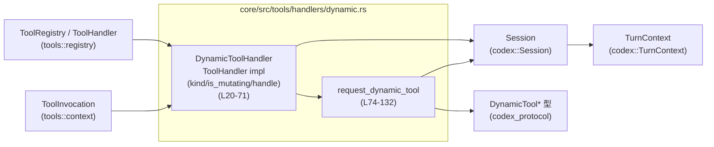

# core/src/tools/handlers/dynamic.rs

## 0. ざっくり一言

- 動的ツール呼び出し（`DynamicToolCallRequest`）を発行し、レスポンスを待って `FunctionToolOutput` に変換する `ToolHandler` 実装です。
- セッション経由でイベントを送信し、`oneshot` チャネルとセッション内の状態を使って非同期に応答を受け取ります。

---

## 1. このモジュールの役割

### 1.1 概要

- このモジュールは **「LLM からのツール呼び出し（`ToolInvocation`）を、外部の動的ツール実装に橋渡しする」** 役割を持ちます。
- 具体的には、`DynamicToolHandler` が `ToolHandler` トレイトを実装し、`handle` メソッド内で
  - 引数の JSON パース
  - 動的ツール呼び出しイベントの送信
  - 応答イベントの待機と結果変換  
 までを行います（`handle`: L33‑71, `request_dynamic_tool`: L74‑132）。

### 1.2 アーキテクチャ内での位置づけ

このモジュールが他コンポーネントとどのように連携するかを簡略化して図示します。



- `ToolRegistry` など別モジュールから `DynamicToolHandler` が `ToolHandler` として利用されることが想定されます（`impl ToolHandler for DynamicToolHandler`: L22‑71）。
- `handle` は `ToolInvocation` から `Session` / `TurnContext` / `DynamicToolResponse` を経由して `FunctionToolOutput` を生成します（L33‑71）。
- 実際に `DynamicToolCallRequest` イベントを処理してツールを実行するコンポーネントは、このチャンクには現れません（他モジュール側の責務）。

### 1.3 設計上のポイント

- **ステートレスなハンドラ**
  - `DynamicToolHandler` 自体はフィールドを持たない空構造体で、状態はすべて `Session` 側に保持されます（L20, L85‑92）。
- **非同期・イベント駆動**
  - ツール呼び出しは `EventMsg::DynamicToolCallRequest` / `DynamicToolCallResponseEvent` というイベントで表現されます（L98‑105, L108‑129）。
- **セッション内状態＋`oneshot` チャネルによる応答待機**
  - `Session::active_turn` からロックを取得し、`turn_state.insert_pending_dynamic_tool` に `oneshot::Sender` を登録することで、外部からのレスポンスを待つ仕組みになっています（L81‑90）。
- **明示的な失敗シグナル**
  - ツール呼び出しキャンセル・失敗時には、戻り値 `Option<DynamicToolResponse>` の `None` や `success: false` と `error` メッセージで状態が表現されます（L106, L108‑127）。

---

## 2. 主要な機能一覧（コンポーネントインベントリー）

### 2.1 型インベントリー

| 名前 | 種別 | 公開? | 行範囲 | 役割 / 用途 |
|------|------|-------|--------|-------------|
| `DynamicToolHandler` | 構造体（フィールドなし） | `pub` | L20‑20 | 動的ツール呼び出しを扱う `ToolHandler` 実装の本体。状態は持たず、`ToolInvocation` を処理します。 |

**根拠**: `pub struct DynamicToolHandler;`（core/src/tools/handlers/dynamic.rs:L20）

### 2.2 関数・メソッドインベントリー

| 関数 / メソッド | 所属 | async | 公開? | 行範囲 | 役割（1 行） |
|----------------|------|-------|-------|--------|--------------|
| `DynamicToolHandler::kind` | `ToolHandler` impl | いいえ | 間接公開（トレイト経由） | L25‑27 | このハンドラが関数型ツール (`ToolKind::Function`) であることを示します。 |
| `DynamicToolHandler::is_mutating` | `ToolHandler` impl | はい | 間接公開 | L29‑31 | 全ての呼び出しが状態を変更しうる（ミューテーションあり）とマークします。 |
| `DynamicToolHandler::handle` | `ToolHandler` impl | はい | 間接公開 | L33‑71 | ツール呼び出しの入口。引数をパースし、`request_dynamic_tool` を介して応答を `FunctionToolOutput` に変換します。 |
| `request_dynamic_tool` | モジュール内関数 | はい | 非公開 | L74‑132 | セッションに動的ツール呼び出しイベントを送り、`oneshot` チャネルを使って応答を待ち、結果イベントを送信します。 |

**根拠**: `impl ToolHandler for DynamicToolHandler { ... }`（L22‑71）、`async fn request_dynamic_tool`（L74‑80）

---

## 3. 公開 API と詳細解説

### 3.1 型一覧（構造体・列挙体など）

| 名前 | 種別 | 役割 / 用途 | 関連する関数 / メソッド |
|------|------|-------------|-------------------------|
| `DynamicToolHandler` | 構造体 | 動的ツール呼び出しを処理する `ToolHandler` 実装。自身はステートレスです。 | `kind`, `is_mutating`, `handle`（いずれも `ToolHandler` トレイト経由で利用） |

**根拠**: L20, L22‑71

---

### 3.2 関数詳細

#### `DynamicToolHandler::handle(&self, invocation: ToolInvocation) -> Result<FunctionToolOutput, FunctionCallError>`

**概要**

- `ToolInvocation` からセッション・ターン・コール ID・ツール名・ペイロードを取り出し（L34‑41）、
- 引数文字列を JSON にパースし（L43‑52）、
- `request_dynamic_tool` を呼び出して `DynamicToolResponse` を取得し、`FunctionToolOutput` に変換して返す関数です（L52‑70）。

**引数**

| 引数名 | 型 | 説明 |
|--------|----|------|
| `invocation` | `ToolInvocation` | ツール呼び出しコンテキスト。`session`, `turn`, `call_id`, `tool_name`, `payload` などを含みます（L34‑41）。 |

**戻り値**

- `Ok(FunctionToolOutput)`  
  - 動的ツールからのレスポンス `DynamicToolResponse` の `content_items` を `FunctionCallOutputContentItem` に変換したベクタと、`success` フラグを含む出力です（L62‑70）。
- `Err(FunctionCallError)`  
  - 不正なペイロード種別、引数パース失敗、ツール呼び出しキャンセルなどのエラーをラップします（L43‑50, L52‑60）。

**内部処理の流れ（アルゴリズム）**

1. `ToolInvocation` から必要なフィールドをパターンマッチで取り出します（L34‑41）。
2. `payload` が `ToolPayload::Function { arguments }` であるか確認します。  
   - それ以外のバリアントの場合は、`FunctionCallError::RespondToModel` でエラーを返します（L43‑50）。
3. `parse_arguments(&arguments)` を呼び、文字列引数を `serde_json::Value` に変換します（L52）。  
   - `?` 演算子により、パースエラーはそのまま `FunctionCallError` として伝播します。
4. `request_dynamic_tool(&session, turn.as_ref(), call_id, tool_name.display(), args)` を呼び、動的ツールの応答を `Option<DynamicToolResponse>` として待ちます（L53‑55）。
5. 応答が `None` の場合、`ok_or_else` で `"dynamic tool call was cancelled before receiving a response"` というメッセージを持つ `FunctionCallError::RespondToModel` に変換します（L56‑60）。
6. `DynamicToolResponse { content_items, success }` を分解し、`content_items` を `FunctionCallOutputContentItem::from` でマッピングして `Vec<_>` に収集します（L62‑69）。
7. `FunctionToolOutput::from_content(body, Some(success))` を呼び、最終的な出力として `Ok(...)` を返します（L70）。

**Examples（使用例）**

この例では、既にどこかで構築された `ToolInvocation` を `DynamicToolHandler` で処理する流れを示します。

```rust
use crate::tools::handlers::dynamic::DynamicToolHandler;
use crate::tools::context::ToolInvocation;
// 他にも必要な型の use がある想定です

// 非同期コンテキスト内の例
async fn handle_tool(invocation: ToolInvocation) -> Result<(), crate::function_tool::FunctionCallError> {
    let handler = DynamicToolHandler;                    // ステートレスなので毎回新しく作ってもよい

    // DynamicToolHandler 経由でツールを実行
    let output = handler.handle(invocation).await?;      // ここで DynamicToolResponse が FunctionToolOutput に変換される

    // output を上位の処理に渡すなど、必要な処理を行う
    // println!("{:?}", output); // Debug 実装の有無はこのチャンクからは不明

    Ok(())
}
```

※ `ToolInvocation` の具体的な生成方法は、このチャンクには現れません。

**Errors / Panics**

- `Err(FunctionCallError::RespondToModel(..))` になる条件:
  - `payload` が `ToolPayload::Function { .. }` 以外である場合（L43‑50）。
  - `request_dynamic_tool` から `None` が返り、「レスポンスを受け取る前にキャンセルされた」とみなされた場合（L56‑60）。
- `parse_arguments(&arguments)?` の失敗条件やエラーメッセージの詳細は、このチャンクには現れませんが、`FunctionCallError` が返ることはコードから読み取れます（L52）。
- `panic!` を直接呼び出している箇所はありません。

**Edge cases（エッジケース）**

- **ペイロード種別が不一致**
  - `ToolPayload::Function { .. }` 以外が渡されると即座にエラーを返し、動的ツール呼び出しは行われません（L43‑50）。
- **引数 JSON が不正**
  - `parse_arguments` 内で失敗した場合、この関数もエラーで終了します（L52）。
- **動的ツール応答が得られない**
  - `request_dynamic_tool` が `None` を返した場合、「キャンセル」とみなされ、エラーを返します（L56‑60）。
- **ツール側の `success` が `false`**
  - この場合でも `handle` 自体は `Ok(FunctionToolOutput)` を返し、`success` は `FunctionToolOutput` のフラグとして上位に伝えられます（L62‑70）。

**使用上の注意点**

- 非同期関数であり、`async` コンテキストから `.await` する必要があります（L33）。
- このハンドラは `is_mutating` が常に `true` であるため、外部からは「状態を書き換える可能性があるツール」として扱われることを前提にしていると解釈できます（L29‑31）。
- `ToolInvocation` の `payload` を `Function` バリアントで構築することが前提です。そうでない場合は意図した処理が行われません（L43‑50）。

**根拠**

- フィールド展開・ペイロードチェック・パース・リクエスト呼び出し・レスポンス処理の全体フロー: core/src/tools/handlers/dynamic.rs:L33‑71

---

#### `request_dynamic_tool(session: &Session, turn_context: &TurnContext, call_id: String, tool: String, arguments: Value) -> Option<DynamicToolResponse>`

**概要**

- セッションとターンコンテキストを使って動的ツール呼び出しイベントを送信し、その結果を `oneshot` チャネルで待ち受ける補助関数です（L74‑80, L98‑107）。
- 受信したレスポンスを元に `DynamicToolCallResponseEvent` を構築して再度イベントを送信し、最終的なレスポンスを `Option<DynamicToolResponse>` として返します（L108‑132）。

**引数**

| 引数名 | 型 | 説明 |
|--------|----|------|
| `session` | `&Session` | イベント送信とターン状態管理を行うセッションオブジェクトへの参照（L75）。 |
| `turn_context` | `&TurnContext` | 現在のターンに関するコンテキスト。`turn_id`（`sub_id`）の取得などに利用されます（L76, L81）。 |
| `call_id` | `String` | このツール呼び出しを識別する ID です。`turn_state` のキーやイベントのフィールドとして利用されます（L77, L83, L98‑101）。 |
| `tool` | `String` | 呼び出すツール名。イベントの `tool` フィールドに使用されます（L78, L102）。 |
| `arguments` | `Value` | ツールに渡す JSON 引数（`serde_json::Value`）。イベントで送受信されます（L79, L103）。 |

**戻り値**

- `Some(DynamicToolResponse)`  
  - 外部の動的ツールから正常にレスポンスが返された場合、その内容が入ります（L106, L108‑116）。
- `None`  
  - `oneshot` チャネルがクローズされるなどしてレスポンスを受け取れなかった場合に返されます（`rx_response.await.ok()` の結果、L106）。
  - その場合でも、失敗を表す `DynamicToolCallResponseEvent` が送信されます（L119‑127）。

**内部処理の流れ（アルゴリズム）**

1. `turn_id` を `turn_context.sub_id.clone()` から取得します（L81）。
2. `oneshot::channel()` を作成し、レスポンス用の送信側 (`tx_response`) と受信側 (`rx_response`) を確保します（L82）。
3. セッションの `active_turn` をロックし（`session.active_turn.lock().await`）、存在する場合はさらに `turn_state` をロックして（L85‑88）、
   - `ts.insert_pending_dynamic_tool(call_id.clone(), tx_response)` を呼び、`call_id` に対応するレスポンス送信ハンドラとして `tx_response` を登録します（L88‑90）。
   - 以前のエントリが存在していた場合は `prev_entry` に格納されます（L84‑90）。
4. `prev_entry` が `Some` の場合、既存のペンディング呼び出しが上書きされることを `warn!` ログとして記録します（L94‑96）。
5. 現在時刻を `Instant::now()` で記録し（L98）、`DynamicToolCallRequest` を含む `EventMsg::DynamicToolCallRequest` イベントを構築します（L99‑104）。
6. `session.send_event(turn_context, event).await` でリクエストイベントを送信します（L105）。
7. `rx_response.await.ok()` でレスポンスを待機し、`Result` を `Option` に変換します（L106）。
8. 受信結果 `response: Option<DynamicToolResponse>` に応じて:
   - `Some(response)` の場合: `content_items` と `success` を用いて成功イベント `DynamicToolCallResponseEvent` を作成します（L108‑116）。
   - `None` の場合: `content_items: Vec::new()`, `success: false`, `error: Some("dynamic tool call was cancelled before receiving a response".to_string())` を持つ失敗イベントを作成します（L119‑127）。
   - 両ケースで、リクエストからの経過時間 `duration: started_at.elapsed()` を設定します（L117‑118, L127‑128）。
9. 構築した `response_event` を `session.send_event(turn_context, response_event).await` で送信します（L129‑130）。
10. 最初に受信した `response: Option<DynamicToolResponse>` をそのまま返します（L132）。

**Examples（使用例）**

この関数は通常、`DynamicToolHandler::handle` から呼び出されます（L53‑55）。  
直接利用する場合のイメージは以下のようになります（`Session` や `TurnContext` の生成方法はこのチャンクには現れません）。

```rust
use crate::codex::{Session, TurnContext};
use serde_json::json;
use codex_protocol::dynamic_tools::DynamicToolResponse;

// 非同期コンテキスト内の例
async fn call_dynamic_tool_directly(session: &Session, turn: &TurnContext) -> Option<DynamicToolResponse> {
    let call_id = "call-123".to_string();                // 任意の呼び出し ID
    let tool_name = "my_dynamic_tool".to_string();       // 動的ツール名
    let args = json!({ "key": "value" });                // ツールに渡す JSON 引数

    // 動的ツールへのリクエストとレスポンス待ち
    request_dynamic_tool(session, turn, call_id, tool_name, args).await
}
```

**Errors / Panics**

- 戻り値の型は `Option<DynamicToolResponse>` であり、`Result` は返しません（L80）。
  - `rx_response.await` がエラーとなった場合（送信側がクローズされた等）、`ok()` により `None` に変換されます（L106）。
- その場合でも、`success: false` とエラーメッセージ付きの `DynamicToolCallResponseEvent` が必ず送信されます（L119‑127, L129‑130）。
- `panic!` を直接呼んでいる箇所はありません。

**Edge cases（エッジケース）**

- **`active_turn` が `None` の場合**
  - `match active.as_mut()` の `None` 分岐で `prev_entry` が `None` のままになり（L85‑92）、`insert_pending_dynamic_tool` は呼ばれません。
  - この場合もリクエストイベントは送信されますが（L98‑105）、`tx_response` はどこにも登録されないため、`rx_response.await` は送信側のドロップにより即座に `Err` となり `None` に変換されます（L82, L106）。
  - 結果として、失敗イベントが送信され、呼び出し側には `None` が返されます（L119‑127, L132）。
- **同一 `call_id` での複数登録**
  - `insert_pending_dynamic_tool` が以前のエントリを返した場合、ログで「既存のペンディング呼び出しを上書きした」旨を警告します（L94‑96）。
  - 古いエントリ（おそらく以前の `oneshot::Sender`）は `prev_entry` 経由で破棄され、その呼び出し側は `None` を受け取ることが想定されます（`prev_entry` のスコープ終了、L84‑96）。
- **応答が遅延 / タイムアウト**
  - この関数自体にはタイムアウト処理は含まれておらず、`rx_response.await` が完了するまでブロックします（L106）。
  - 実際のタイムアウトポリシーがどこで実装されているかは、このチャンクには現れません。

**使用上の注意点**

- 非同期処理であり、`tokio` のようなランタイム上で `.await` する必要があります（L74）。
- `Session` 内部の `active_turn` や `turn_state` に対して `lock().await` で非同期ロックを取得しているため、同じロックを逆順で取得するようなコードと組み合わせるとデッドロックのリスクが生じる可能性がありますが、このチャンク単体からは他のロック順序は分かりません（L85‑88）。
- `arguments` や `call_id`, `tool` はすべて `clone` されてイベントに埋め込まれるため（L83, L98‑104）、サイズの大きいデータを渡すとコピーコストが増える点に留意が必要です。

**根拠**

- 状態登録、イベント送信、レスポンス待ち、レスポンスイベント送信、戻り値などのロジック全体: core/src/tools/handlers/dynamic.rs:L74‑132

---

### 3.3 その他の関数

| 関数名 | 役割（1 行） | 根拠 |
|--------|--------------|------|
| `DynamicToolHandler::kind(&self) -> ToolKind` | このハンドラの種別として `ToolKind::Function` を返します。 | L25‑27 |
| `DynamicToolHandler::is_mutating(&self, _invocation: &ToolInvocation) -> bool` | すべての呼び出しを「状態変更あり」とするために常に `true` を返します。 | L29‑31 |

---

## 4. データフロー

このセクションでは、「`DynamicToolHandler::handle` を通じた動的ツール呼び出し」の典型的なフローを説明します。

1. 上位コードが `ToolInvocation` を用意し、`DynamicToolHandler::handle` を呼び出します（L33‑41）。
2. `handle` が引数をパースし、`request_dynamic_tool` を呼び出します（L52‑55）。
3. `request_dynamic_tool` が
   - `Session` 経由で `DynamicToolCallRequest` イベントを送信し（L98‑105）、
   - `oneshot` チャネルでレスポンスを待ち受けます（L82, L106）。
4. レスポンス（またはキャンセル）を受け取ると、`DynamicToolCallResponseEvent` を送信し（L108‑129）、`DynamicToolResponse` を `handle` に返します（L132）。
5. `handle` は `DynamicToolResponse` を `FunctionToolOutput` に変換して呼び出し元に返します（L62‑70）。

```mermaid
sequenceDiagram
    participant Caller as 呼び出し元
    participant H as handle (L33-71)
    participant R as request_dynamic_tool (L74-132)
    participant Ses as Session
    participant Turn as TurnContext
    participant Ext as 動的ツール実行側<br/>(別コンポーネント; このチャンクには現れない)

    Caller ->> H: handle(invocation)
    H ->> H: payload 種別チェック & 引数パース
    H ->> R: request_dynamic_tool(&session, &turn, call_id, tool, args)
    R ->> Ses: active_turn.lock().await<br/>turn_state.insert_pending_dynamic_tool(...)
    R ->> Ses: send_event(DynamicToolCallRequest)
    note right of Ses: DynamicToolCallRequest を外部に送信

    Ses -->> Ext: DynamicToolCallRequest (概念的)
    Ext -->> Ses: DynamicToolResponse (概念的)

    Ses -->> R: oneshot::Sender 経由で DynamicToolResponse を送信（概念的）
    R ->> R: rx_response.await.ok()
    R ->> Ses: send_event(DynamicToolCallResponseEvent)
    R -->> H: Option<DynamicToolResponse>
    H ->> H: FunctionToolOutput へ変換
    H -->> Caller: Result<FunctionToolOutput, FunctionCallError>
```

※ `Ext`（動的ツール実行側）は、このチャンクのコードには登場せず、イベントの受信者として概念的に追加しています。

---

## 5. 使い方（How to Use）

### 5.1 基本的な使用方法

`DynamicToolHandler` は `ToolHandler` を実装しており、通常はツールレジストリなどから呼び出されることが想定されますが、モジュールに直接アクセスして使うイメージは次のようになります。

```rust
use crate::tools::handlers::dynamic::DynamicToolHandler;
use crate::tools::context::ToolInvocation;

// 非同期コンテキスト内の例
async fn run_dynamic_tool(invocation: ToolInvocation) -> Result<(), crate::function_tool::FunctionCallError> {
    let handler = DynamicToolHandler;                    // ステートレスなハンドラを生成

    // DynamicToolHandler 経由でツールを実行
    let output = handler.handle(invocation).await?;      // DynamicToolResponse -> FunctionToolOutput

    // output を利用してレスポンスを上位へ返すなどの処理を行う
    // 具体的な利用方法はこのチャンクには現れません

    Ok(())
}
```

- `ToolInvocation` の生成は、通常はツールレジストリや上位の呼び出し側の責務であり、このファイルには登場しません。

### 5.2 よくある使用パターン

1. **レジストリ経由の呼び出し（想定）**
   - `ToolRegistry` に `DynamicToolHandler` を登録し、LLM からのツール呼び出し要求に応じて `handle` が呼ばれる、という使い方が想定されます（`impl ToolHandler for DynamicToolHandler`: L22‑71）。
2. **直接 `request_dynamic_tool` を利用する**
   - より低レベルに、セッションとターンコンテキストを直接扱いながらイベントを発行・応答待機する用途にも使えます（L74‑132）。

### 5.3 よくある間違い

```rust
// 間違い例: payload が Function 以外
// （ToolInvocation の構築時に誤ったバリアントを指定しているケースを想定）

// let invocation = ToolInvocation {
//     // ...
//     payload: ToolPayload::Streaming { /* ... */ }, // 仮の別バリアント（このチャンクには定義なし）
// };

// let handler = DynamicToolHandler;
// let result = handler.handle(invocation).await;
// -> FunctionCallError::RespondToModel("dynamic tool handler received unsupported payload")
```

```rust
// 正しい例: payload を Function バリアントで構築する（イメージ）

// let invocation = ToolInvocation {
//     // ...
//     payload: ToolPayload::Function {
//         arguments: "{\"foo\":\"bar\"}".to_string(),
//     },
// };

// let handler = DynamicToolHandler;
// let result = handler.handle(invocation).await?; // 正常に DynamicToolResponse を待ち受ける
```

※ `ToolPayload` の実際のバリアント構成や `ToolInvocation` のフィールドは、マッチ式から読み取れる範囲に留めています（L34‑41, L43‑45）。

### 5.4 使用上の注意点（まとめ）

- **非同期必須**: `handle` / `request_dynamic_tool` はいずれも `async fn` であり、非同期ランタイム上で `.await` する必要があります（L33, L74）。
- **ペイロード種別**: `ToolPayload::Function` 以外はサポートされておらず、エラーになります（L43‑50）。
- **キャンセル / 応答欠如**: 動的ツールからのレスポンスが届かない場合、`request_dynamic_tool` は `None` を返し、`handle` はエラーに変換します（L106, L56‑60）。
- **状態変更フラグ**: `is_mutating` が常に `true` であるため、並行実行のポリシー（同時実行を制限する等）に影響する可能性があります（L29‑31）。

---

## 6. 変更の仕方（How to Modify）

### 6.1 新しい機能を追加する場合

1. **追加したい振る舞いがどこに属するかを判断する**
   - 引数の整形や検証を追加したい場合: `DynamicToolHandler::handle` 内の引数パース前後に処理を追加するのが自然です（L43‑52）。
   - イベントのフィールドを追加したい場合: `DynamicToolCallRequest` または `DynamicToolCallResponseEvent` の構築部分を変更します（L98‑104, L108‑127）。

2. **セッション / ターン状態へのアクセスが必要な場合**
   - `request_dynamic_tool` 内で `active_turn` と `turn_state` へのアクセスが既にあるため、同じ箇所で追加の状態登録や管理を行うことができます（L85‑90）。

3. **追加した機能をどこから呼び出すか**
   - `handle` の内部でのみ利用する場合は、モジュール内に非公開関数として追加します。
   - 他モジュールからも利用したい場合は、`pub` を付与し、必要に応じて `ToolHandler` の実装を拡張するか、新しいハンドラを定義します。

### 6.2 既存の機能を変更する場合

- **`DynamicToolResponse` の扱いを変更する**
  - 例: `success == false` の場合に `FunctionCallError` を返したいなどの挙動変更は、`handle` のレスポンス処理部分（L62‑70）を修正することで実現できます。
- **キャンセル / タイムアウトの扱い**
  - `request_dynamic_tool` はタイムアウトを持たないため、タイムアウトを導入する場合は `rx_response.await` 周辺に `tokio::time::timeout` 等を追加し、`None` / `Some` の扱いを整理する必要があります（L106）。
- **影響範囲の確認**
  - `DynamicToolHandler` は `ToolHandler` トレイトを実装しているため、この変更がツールレジストリ経由で呼ばれる全ての動的ツールに影響することを前提に、呼び出し箇所の契約（入力の前提、エラー処理）を確認する必要があります。
- **関連イベントの契約**
  - `DynamicToolCallRequest` / `DynamicToolCallResponseEvent` のフィールドが変更されると、これらのイベントを扱う他コンポーネントにも変更が必要となります（L99‑104, L108‑127）。

---

## 7. 関連ファイル

このモジュールと密接に関係するモジュール（コード上で利用しているもの）をまとめます。

| パス / モジュール | 役割 / 関係 |
|-------------------|------------|
| `crate::codex::Session` | 動的ツール呼び出しイベントの送信と、`active_turn` / `turn_state` を介したペンディング呼び出し管理を提供するセッション型。`request_dynamic_tool` で利用されています（L75, L85‑90, L105, L129‑130）。 |
| `crate::codex::TurnContext` | 現在のターン ID (`sub_id`) などを含むコンテキスト。イベントの `turn_id` フィールドとして利用されます（L76, L81, L101, L111, L121）。 |
| `crate::tools::context::{ToolInvocation, ToolPayload, FunctionToolOutput}` | ツール呼び出しの入力と、ハンドラの出力型を定義するモジュール。`DynamicToolHandler::handle` の引数・戻り値と、ペイロード種別チェックで使用されます（L5‑6, L33‑45, L70）。 |
| `crate::function_tool::FunctionCallError` | ツール呼び出しに関するエラー型。引数不正やペイロード不一致、キャンセルなどのエラーを表現するために使用されます（L3, L33‑50, L56‑60）。 |
| `crate::tools::registry::{ToolHandler, ToolKind}` | ツールハンドラの共通インターフェースと種別を定義するモジュール。`DynamicToolHandler` がこれを実装することで、ツールレジストリに統合されます（L8‑9, L22‑31）。 |
| `codex_protocol::dynamic_tools::{DynamicToolCallRequest, DynamicToolResponse}` | 動的ツール呼び出しと応答のプロトコルメッセージ定義。`request_dynamic_tool` 内でイベント構築とレスポンス受信に使用されます（L10‑11, L99‑104, L62‑65, L108‑116）。 |
| `codex_protocol::protocol::{EventMsg, DynamicToolCallResponseEvent}` | イベントのラッパーと動的ツール応答イベントの型。`request_dynamic_tool` でリクエスト・レスポンス両方をイベントとして送信するために利用されます（L13‑14, L98‑105, L108‑129）。 |
| `codex_protocol::models::FunctionCallOutputContentItem` | 動的ツールからの `content_items` を、最終的な `FunctionToolOutput` 用のアイテムに変換するための型です（L12, L62‑69）。 |
| `tokio::sync::oneshot` | 一度だけ値を送信できる非同期チャネル。動的ツール応答を 1 回だけ受け取るために利用されています（L17, L82, L106）。 |
| `tracing::warn` | 既存のペンディング呼び出しが上書きされる場合の警告ログ出力に使用されます（L18, L94‑96）。 |

※ テストコードやベンチマークに関する情報は、このチャンクには現れません。
