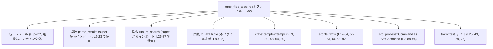
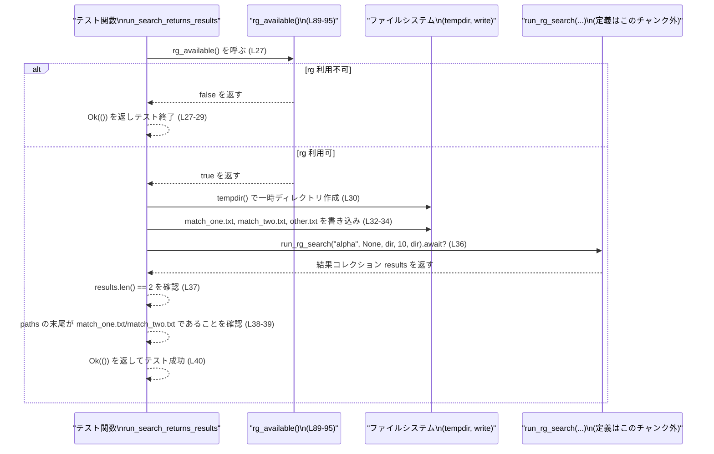

# core/src/tools/handlers/grep_files_tests.rs コード解説

## 0. ざっくり一言

`parse_results` と `run_rg_search` という検索系関数の振る舞いを検証するためのテストモジュールです。外部コマンド `rg`（ripgrep）が利用可能かを確認する `rg_available` を使い、存在しない環境では検索系テストをスキップするようになっています。  
（テスト対象の関数本体は親モジュール `super` 側にあり、このチャンクには現れません。）

---

## 1. このモジュールの役割

### 1.1 概要

- このモジュールは、親モジュールで定義された `parse_results` および `run_rg_search` の仕様をテストするために存在します（`use super::*;` より、親モジュールの公開 API を利用しています。`core/src/tools/handlers/grep_files_tests.rs:L1`）。
- `parse_results` については、検索結果の標準出力（改行区切りのパス文字列）から `Vec<String>` を生成する動作と、結果件数の上限（limit）の扱いを検証しています（`L5-23`）。
- `run_rg_search` については、検索結果が返ってくること、glob フィルタの適用、件数上限の遵守、ヒットなしの場合の挙動を、それぞれ個別の非同期テストで検証しています（`L25-87`）。
- `rg_available` は外部コマンド `rg --version` の実行結果から `rg` の有無を判定し、検索系テストの前提条件チェックとして使われます（`L89-95`）。

### 1.2 アーキテクチャ内での位置づけ

このファイルは「grep 風検索ハンドラ」のテスト専用モジュールであり、親モジュールの API を呼び出して動作確認を行います。外部には直接公開されません。



※ 親モジュールの具体的なファイル名（例: `grep_files.rs`）は、このチャンクには現れないため不明です。

### 1.3 設計上のポイント

- **責務の分割**
  - このファイルはテストコード専用であり、本番ロジックは一切含みません（`L5-87` はすべてテスト関数）。
  - 外部依存（`rg` コマンドの有無）を `rg_available` に切り出し、各テストの先頭で一貫してチェックしています（`L27-29, 45-47, 61-63, 77-79, 89-95`）。

- **状態管理**
  - 各テストは `tempfile::tempdir` を用いて独立した一時ディレクトリを作成し、その配下に検証用のファイルを作成します（`L30-34, 48-51, 64-68, 80-82`）。
  - グローバル状態は持たず、副作用は一時ディレクトリ内のファイル生成だけに限定されています。

- **エラーハンドリング方針**
  - 検索系の非同期テストは `anyhow::Result<()>` を返し、`?` 演算子で `run_rg_search` などのエラーを伝播させます（`L26, 36, 44, 53, 60, 70, 76, 84`）。
  - `rg_available` は外部コマンド実行のあらゆる失敗を「rg が使えない」と解釈して `false` を返し、テストをスキップする方向に倒します（`L89-95`）。
  - ファイル作成に関しては `.unwrap()` / `.expect()` を使い、失敗時には明示的にテストが panic するようになっています（`L30, 32-34, 48, 50-51, 64, 66-68, 80, 82`）。

- **並行性**
  - `#[tokio::test]` により非同期テストをサポートしており、`run_rg_search` が `async` 関数であることがわかります（`L25, 43, 59, 75`）。
  - 各テストは独立した一時ディレクトリを使うため、テスト間でデータ競合が起きない構成になっています。

---

## 2. 主要な機能一覧（コンポーネントインベントリー）

### 2.1 このファイルで定義される関数

| 名前 | 種別 | 役割 / 用途 | 定義位置 |
|------|------|-------------|----------|
| `parses_basic_results` | 同期テスト関数 | `parse_results` が標準出力の全行を `Vec<String>` に変換できるか検証 | `core/src/tools/handlers/grep_files_tests.rs:L5-13` |
| `parse_truncates_after_limit` | 同期テスト関数 | `parse_results` が指定した件数上限で結果を打ち切るか検証 | `core/src/tools/handlers/grep_files_tests.rs:L15-23` |
| `run_search_returns_results` | 非同期テスト関数 (`#[tokio::test]`) | `run_rg_search` が検索語を含む複数ファイルを検出できるか検証 | `core/src/tools/handlers/grep_files_tests.rs:L25-41` |
| `run_search_with_glob_filter` | 非同期テスト関数 (`#[tokio::test]`) | `run_rg_search` の glob フィルタ引数が正しくファイルを絞り込むか検証 | `core/src/tools/handlers/grep_files_tests.rs:L43-57` |
| `run_search_respects_limit` | 非同期テスト関数 (`#[tokio::test]`) | `run_rg_search` が件数上限パラメータを守るか検証 | `core/src/tools/handlers/grep_files_tests.rs:L59-73` |
| `run_search_handles_no_matches` | 非同期テスト関数 (`#[tokio::test]`) | 一致するファイルがない場合に空結果を返すか検証 | `core/src/tools/handlers/grep_files_tests.rs:L75-87` |
| `rg_available` | 同期ヘルパー関数 | 外部コマンド `rg` が実行可能かをチェックし、検索テスト実行可否を決める | `core/src/tools/handlers/grep_files_tests.rs:L89-95` |

### 2.2 このファイルが利用する外部コンポーネント

| 名前 | 種別 | 役割 / 用途 | 使用位置（呼び出し側） |
|------|------|-------------|-------------------------|
| `parse_results` | 関数（親モジュール定義） | バイトスライスと件数上限から `Vec<String>` を生成する | `core/src/tools/handlers/grep_files_tests.rs:L8, 18` |
| `run_rg_search` | 非同期関数（親モジュール定義） | 検索語・glob・ディレクトリ等から検索を実行し、結果コレクションを返す | `core/src/tools/handlers/grep_files_tests.rs:L36, 53, 70, 84` |
| `tempfile::tempdir` | 外部クレート関数 | 一時ディレクトリを生成し、自動削除を管理する | `core/src/tools/handlers/grep_files_tests.rs:L3, 30, 48, 64, 80` |
| `StdCommand` (`std::process::Command`) | 標準ライブラリ構造体 | 外部コマンド `rg --version` の実行に用いる | `core/src/tools/handlers/grep_files_tests.rs:L2, 89-94` |
| `tokio::test` | マクロ | 非同期テスト関数のための Tokio ランタイムを提供 | `core/src/tools/handlers/grep_files_tests.rs:L25, 43, 59, 75` |
| `anyhow::Result` | エラーラッパ型 | 非同期テストの戻り値として任意のエラー型を包含 | `core/src/tools/handlers/grep_files_tests.rs:L26, 44, 60, 76` |

---

## 3. 公開 API と詳細解説

このファイルはテスト用モジュールであり、ライブラリとしての公開 API は持ちません。ただし、テストから読み取れる **親モジュールの契約（コントラクト）** が重要です。

### 3.1 型一覧（構造体・列挙体など）

このファイル内で新たに定義される構造体や列挙体はありません（`core/src/tools/handlers/grep_files_tests.rs:L1-95` 全体を確認しても `struct` / `enum` は出現しません）。

### 3.2 関数詳細（主要 5 件）

#### `parses_basic_results()`

**概要**

`parse_results` が改行区切りのパス文字列から `Vec<String>` を生成できるかを検証する単体テストです（`L5-13`）。  
このテストから、`parse_results` の戻り値は `Vec<String>` 型であることが分かります（`assert_eq!` 右辺が `Vec<String>` であるため, `L9-12`）。

**引数**

なし。

**戻り値**

- 戻り値の型: なし（テスト関数なので `()`）。
- 動作: `assert_eq!` により期待値と実際の結果が一致しない場合は panic し、テストが失敗します。

**内部処理の流れ**

1. 標準出力を模したバイト列 `stdout` を定義します。2 行分のパスが LF 区切りで含まれます（`L7`）。
2. `parse_results(stdout, 10)` を呼び出し、結果を `parsed` に格納します（`L8`）。
3. `parsed` が 2 つのパスからなる `Vec<String>` と等しいことを `assert_eq!` で検証します（`L9-12`）。

**Examples（使用例）**

以下は、テスト外で `parse_results` を利用する最小例です。このコードはテストのパターンをそのまま簡略化したものです。

```rust
// 標準出力から読み取ったバイト列を仮定する
let stdout: &[u8] = b"/tmp/file_a.rs\n/tmp/file_b.rs\n";  // 改行区切りのパス列

// 取得件数の上限を 10 件に設定してパースする
let paths: Vec<String> = parse_results(stdout, 10);       // テストから、戻り値が Vec<String> と分かる

// paths = ["/tmp/file_a.rs".to_string(), "/tmp/file_b.rs".to_string()] となることが期待される
assert_eq!(paths.len(), 2);
```

**Errors / Panics**

- このテスト関数自体は `Result` を返さないため、失敗時は `assert_eq!` によって panic します（`L9-12`）。
- `parse_results` が内部でどのようにエラーを扱うかは、このチャンクには現れません。

**Edge cases（エッジケース）**

- このテストでは 2 行の非空パスのみを扱っており、空行や末尾改行の有無などは検証していません。
- 空の `stdout` や、行数が `limit` を超えるケースは別テスト（`parse_truncates_after_limit`, `L15-23`）で部分的に検証されています。

**使用上の注意点**

- テストからは、`stdout` が LF 区切りの UTF-8 文字列であることが前提とされているように見えますが、実際に非 UTF-8 バイト列をどう扱うかはこのチャンクからは分かりません。
- `limit` が十分に大きい場合には、全行が `Vec<String>` に入ることが期待されています（`L8, L9-12`）。

---

#### `run_search_returns_results() -> anyhow::Result<()>`

**概要**

`run_rg_search` が指定ディレクトリ配下の複数ファイルから検索語を含むファイルを検出し、結果を返すことを検証する非同期テストです（`L25-41`）。  
`rg` コマンドが利用可能な環境でのみ実行されます（`L27-29`）。

**引数**

なし（テスト関数）。

**戻り値**

- 型: `anyhow::Result<()>`（`L26`）。
- 意味:  
  - `Ok(())` の場合: テストが正常終了したことを表します。  
  - `Err(e)` の場合: `run_rg_search` などからのエラーをそのまま伝播し、テスト失敗となります。

**内部処理の流れ**

1. `rg_available()` を呼び出し、外部コマンド `rg` が利用可能か確認します（`L27`）。
   - `false` の場合、テストをスキップする意味で即座に `Ok(())` を返します（`L27-29`）。
2. `tempdir()` で一時ディレクトリを作成し、失敗時には `expect("create temp dir")` で panic します（`L30`）。
3. 一時ディレクトリ配下に 3 つのファイルを作成します（`L31-34`）。
   - `match_one.txt`: `"alpha beta gamma"` を含む（`L32`）。
   - `match_two.txt`: `"alpha delta"` を含む（`L33`）。
   - `other.txt`: `"omega"` のみを含む（`L34`）。
4. `run_rg_search("alpha", None, dir, 10, dir).await?` を呼び出し、検索結果を `results` に受け取ります（`L36`）。
5. 結果の件数が 2 であることを確認します（`L37`）。
6. 2 つの結果のいずれかのパスが `"match_one.txt"` で終わること、および `"match_two.txt"` で終わることをそれぞれ検証します（`L38-39`）。
7. 最後に `Ok(())` を返してテスト終了します（`L40`）。

**Examples（使用例）**

テストと同様のパターンで `run_rg_search` をアプリケーションコードから呼び出す例です。  
（`run_rg_search` の正確なシグネチャはこのチャンクには現れませんが、テストから 5 引数の非同期関数であることが分かります。）

```rust
use std::path::Path;

// 何らかの async コンテキストの中で:
let dir = Path::new("/path/to/search-root");               // 検索対象ディレクトリ
let limit = 10usize;                                       // 最大取得件数

// 検索語 "alpha" で検索する。glob フィルタは使わないので None。
let results = run_rg_search("alpha", None, dir, limit, dir).await?;

// `results` は `len`, `iter`, `is_empty` が呼べるコレクション型であることがテストから分かります。
println!("hit count = {}", results.len());
```

**Errors / Panics**

- テスト関数としては以下のパスで失敗が起こりえます。
  - `tempdir()` の失敗: `expect("create temp dir")` により panic（`L30`）。
  - ファイル書き込みの失敗: `unwrap()` により panic（`L32-34`）。
  - `run_rg_search` が `Err` を返した場合: `?` により `Err` がテストに伝播し、テスト失敗（`L36`）。
  - `results` の件数や内容が期待と異なる場合: `assert_eq!` / `assert!` により panic（`L37-39`）。
- `run_rg_search` の内部でのエラー処理や panic 条件は、このチャンクには現れないため不明です。

**Edge cases（エッジケース）**

- このテストは「複数ヒットがある」正規ケースのみを検証しています。
- ヒットが多すぎて `limit` に達するケースや、ヒット 0 件のケースは他のテストで検証されています（`L59-73, L75-87`）。

**使用上の注意点**

- テストでは `rg_available()` による前提チェックを行っていますが、アプリケーション側で同様のチェックを必須とするかどうかは、このチャンクからは分かりません。
- ファイルシステムへの書き込みや外部コマンド実行（`run_rg_search` 内部の実装は不明）に依存するため、I/O エラーやパフォーマンスへの影響を考慮する必要があります。

---

#### `run_search_with_glob_filter() -> anyhow::Result<()>`

**概要**

`run_rg_search` の「glob フィルタ」パラメータが正しく機能し、特定のパターンにマッチするファイルだけが結果に含まれることを検証する非同期テストです（`L43-57`）。

**引数**

なし。

**戻り値**

- 型: `anyhow::Result<()>`（`L44`）。
- エラー伝播の扱いは `run_search_returns_results` と同様です。

**内部処理の流れ**

1. `rg_available()` で `rg` コマンドの有無を確認し、利用不可なら `Ok(())` で終了（`L45-47`）。
2. 一時ディレクトリを作成し（`L48`）、その配下に 2 ファイルを作成します（`L50-51`）。
   - `match_one.rs`: `"alpha beta gamma"` を含む。
   - `match_two.txt`: `"alpha delta"` を含む。
3. `run_rg_search("alpha", Some("*.rs"), dir, 10, dir).await?` を実行し、glob フィルタ `"*.rs"` 付きで検索（`L53`）。
4. 結果件数が 1 であることを `assert_eq!` で確認（`L54`）。
5. すべての結果パスが `"match_one.rs"` で終わることを `assert!(... .all(...))` で検証（`L55`）。
6. `Ok(())` で終了（`L56`）。

**Examples（使用例）**

```rust
use std::path::Path;

// "*.rs" ファイルだけを検索したいケース
let dir = Path::new("/project");
let results = run_rg_search("TODO", Some("*.rs"), dir, 100, dir).await?;

// 結果は、おそらく拡張子 `.rs` を持つファイルに限定されることが期待されます。
// 具体的なフィルタロジックは run_rg_search の実装に依存し、このチャンクからは不明です。
```

**Errors / Panics**

- `rg_available()` 以外の失敗パス・エラー処理は `run_search_returns_results` と同様です。
- glob パターンが無効なフォーマットの場合にどうなるかは、このチャンクではテストされておらず不明です。

**Edge cases**

- glob フィルタのエラーケースや、フィルタにより結果が 0 件になるケースは、このテストでは扱っていません。
- glob を `None` にしたときの挙動は別テストでカバーされています（`L25-41, L59-73, L75-87`）。

**使用上の注意点**

- glob 文字列の仕様（使用可能なパターン記法）は `run_rg_search` の実装に依存し、このチャンクからは分かりません。
- テストでは `"*.rs"` のような簡単なパターンのみを使用しており、複雑なパターンの検証は行っていません。

---

#### `run_search_handles_no_matches() -> anyhow::Result<()>`

**概要**

検索語に一致するファイルが存在しない場合に、`run_rg_search` が空の結果コレクションを返すことを検証する非同期テストです（`L75-87`）。

**引数**

なし。

**戻り値**

- 型: `anyhow::Result<()>`（`L76`）。

**内部処理の流れ**

1. `rg_available()` で `rg` コマンドの有無を確認し、利用不可ならテストをスキップ（`L77-79`）。
2. 一時ディレクトリを作成し（`L80`）、`one.txt` に `"omega"` を書き込みます（`L81-82`）。
   - 検索語 `"alpha"` はどこにも含まれていません。
3. `run_rg_search("alpha", None, dir, 5, dir).await?` を実行し、結果を `results` に格納します（`L84`）。
4. `results.is_empty()` が `true` であることを `assert!` で確認します（`L85`）。
5. `Ok(())` で終了します（`L86`）。

**Examples（使用例）**

```rust
use std::path::Path;

let dir = Path::new("/project");
let results = run_rg_search("nonexistent-pattern", None, dir, 5, dir).await?;

// 一致がない場合は空コレクションが返ることが、このテストから分かります。
if results.is_empty() {
    println!("no matches");
}
```

**Errors / Panics**

- `run_rg_search` がエラーを返した場合は `?` により `Err` が上位に伝播し、テスト失敗（`L84`）。
- `results.is_empty()` が `false` の場合に `assert!(...)` で panic しテストが失敗します（`L85`）。

**Edge cases**

- 「一致なし」のケースはこのテストでカバーされていますが、「一部のファイルは読み取れないが他に一致がある」といった混合ケースは検証されていません。

**使用上の注意点**

- 一致なしをエラーとするか、空結果とするかは API 設計により分かれますが、このテストからは `run_rg_search` が「空結果を正常系として扱う」契約になっていることが読み取れます（`L84-85`）。

---

#### `rg_available() -> bool`

**概要**

外部コマンド `rg`（ripgrep）が利用可能かを判定するシンプルなヘルパー関数です（`L89-95`）。  
テストで `run_rg_search` を実行する前提条件チェックに用いられています。

**引数**

なし。

**戻り値**

- 型: `bool`（`L89`）。
- 意味:
  - `true` : `rg --version` が成功終了した（`status.success()` が `true`）場合。
  - `false`: コマンド実行が失敗、もしくは終了ステータスが失敗を示した場合。

**内部処理の流れ**

1. `StdCommand::new("rg")` で `rg` コマンドのプロセスを生成します（`L90`）。
2. `arg("--version")` で `--version` 引数を追加し、バージョン情報を問い合わせます（`L91`）。
3. `.output()` でコマンドを実行し、終了ステータスや標準出力を含む `Output` を取得しようとします（`L92`）。
4. `.map(|output| output.status.success())` により、`Output` が得られた場合に終了ステータスが成功かどうかを `bool` に変換します（`L93`）。
5. `.unwrap_or(false)` により、`output()` がエラーになった場合も含めて `false` を返します（`L94`）。

**Examples（使用例）**

```rust
// テストの前提条件チェックとして使う例
if !rg_available() {
    eprintln!("rg is not installed; skipping search-related tests");
    return Ok(());
}

// ここから先で run_rg_search など、rg に依存する処理を実行する
```

**Errors / Panics**

- この関数内では panic は発生しません。`output()` の `Result` は `unwrap_or(false)` で握りつぶされ、`false` が返されます（`L94`）。
- したがって、コマンド実行時の I/O エラーも「rg が利用不可」と解釈されます。

**Edge cases**

- `rg` がパスに存在しない場合: `output()` がエラーとなり、`false` を返します。
- `rg` は存在するが `--version` オプションをサポートしない場合: プロセスは失敗ステータスで終了し、`status.success()` が `false`、最終的な戻り値も `false` になります。
- PATH が悪意あるバイナリを指している場合: そのバイナリが `rg` として実行されます。これは一般的な `Command::new("名前")` の挙動です。

**使用上の注意点（Security / Bugs 観点）**

- **セキュリティ**:
  - `StdCommand::new("rg")` は環境変数 `PATH` に依存するため、PATH によるコマンドハイジャックの影響を受けます。ただし、この関数は **テスト用ヘルパー** としてのみ使用されており、このチャンクからは本番コードで使用されているかどうかは分かりません。
- **バグ/テストギャップの可能性**:
  - `rg` が存在しても、`rg --version` と実際の検索用呼び出しが異なる条件で失敗するケースは検知できません（例: ある環境変数によって検索時のみ失敗するなど）。このため、`rg_available` を通過しても `run_rg_search` が失敗する可能性はあります。
  - 一方で、`rg` の存在をテストラン環境に強制しない、という目的から見ると、この挙動は意図的な設計とも言えます（ただしこれは一般的な推測であり、このチャンクから設計意図を断定することはできません）。

---

### 3.3 その他の関数（簡易一覧）

| 関数名 | 役割（1 行） | 定義位置 |
|--------|--------------|----------|
| `parse_truncates_after_limit` | `parse_results` が `limit` 件で結果を打ち切ることを検証するテスト | `core/src/tools/handlers/grep_files_tests.rs:L15-23` |
| `run_search_respects_limit` | `run_rg_search` が `limit` パラメータ通りの件数だけ結果を返すことを検証するテスト | `core/src/tools/handlers/grep_files_tests.rs:L59-73` |

---

## 4. データフロー

ここでは代表的なシナリオとして `run_search_returns_results` テストのデータフローを示します。  

このテストは「検索語が複数ファイルに現れるケース」を想定し、一時ディレクトリに作ったテストデータを `run_rg_search` に渡して結果を検証します。



この図から読み取れるポイント:

- 検索系テストはまず `rg_available()` により外部依存を確認し、利用不可であれば早期リターンします。これにより、`rg` がインストールされていない CI 環境でもテストが失敗ではなくスキップに近い挙動を取ります。
- 実際の検索処理は `run_rg_search` に委譲され、テストはその戻り値の「件数」と「パスの末尾」のみを検証することで、内部実装への依存を最小限に抑えています。

---

## 5. 使い方（How to Use）

### 5.1 基本的な使用方法（parse_results / run_rg_search）

#### `parse_results` を使った標準出力パース

テストをもとにした最小の利用例です。

```rust
// 擬似的なコマンドの標準出力
let stdout: &[u8] = b"/tmp/file_a.rs\n/tmp/file_b.rs\n"; // 改行区切りのファイルパス

// 最大 10 件までパースする
let paths: Vec<String> = parse_results(stdout, 10);      // L8, L18 から Vec<String> であることが分かる

assert_eq!(
    paths,
    vec!["/tmp/file_a.rs".to_string(), "/tmp/file_b.rs".to_string()]
);
```

#### `run_rg_search` を使った非同期検索

テストと同じ形で `run_rg_search` を利用する例です。

```rust
use std::path::Path;

// 何らかの async 関数内で:
async fn search_example() -> anyhow::Result<()> {
    let dir = Path::new("/path/to/project");                 // 検索対象ディレクトリ
    let limit = 10usize;                                     // 上限件数

    // glob フィルタなしで "alpha" を検索
    let results = run_rg_search("alpha", None, dir, limit, dir).await?; // L36 などと同じ呼び出し

    println!("hit count = {}", results.len());               // len() が呼べるコレクション (L37)
    Ok(())
}
```

（`results` の要素型が `String` か `PathBuf` かなどの詳細は、このチャンクだけでは特定できません。`len`, `iter`, `is_empty`, `ends_with(&str)` が呼べることだけが分かります: `L37-39, L54-55, L70-71, L84-85`）

### 5.2 よくある使用パターン

1. **glob フィルタを使う検索**

   ```rust
   // "*.rs" ファイルに限定して TODO コメントを探す
   let results = run_rg_search("TODO", Some("*.rs"), dir, 100, dir).await?;
   ```

   テスト `run_search_with_glob_filter` と同様に、特定の拡張子に限定した検索ができることが期待されます（`L53-55`）。

2. **件数上限を指定した検索**

   ```rust
   // 最初の 5 件だけ取得したいケース
   let results = run_rg_search("alpha", None, dir, 5, dir).await?;
   assert!(results.len() <= 5);   // L70-71 のテストから、少なくとも上限が効くことが分かる
   ```

3. **一致なしを許容する検索**

   ```rust
   let results = run_rg_search("pattern-not-in-files", None, dir, 10, dir).await?;
   if results.is_empty() {        // L84-85
       println!("No matches");
   }
   ```

### 5.3 よくある間違い（想定される誤用）

このチャンクから推測できる範囲で、起こりそうな誤用を挙げます。

```rust
// 誤り例: rg コマンドの存在を前提にしてテストを書く
#[tokio::test]
async fn my_test() -> anyhow::Result<()> {
    // rg がない環境では run_rg_search が内部で失敗する可能性
    let results = run_rg_search("alpha", None, dir, 10, dir).await?;
    // ...
    Ok(())
}

// 正しい例: このファイルと同様に rg の存在をチェックしてから実行する
#[tokio::test]
async fn my_test() -> anyhow::Result<()> {
    if !rg_available() {           // L27, L45, L61, L77
        return Ok(());             // rg がない環境ではテストをスキップ扱いにする
    }
    let results = run_rg_search("alpha", None, dir, 10, dir).await?;
    // ...
    Ok(())
}
```

### 5.4 使用上の注意点（まとめ）

- **外部依存**: `run_rg_search` は `rg` コマンドに依存している可能性が高く（ファイル名やヘルパーから推測されますが、このチャンクには直接の記述はありません）、テストでは `rg_available()` によりその存在を確認しています。
- **I/O 依存**: 検索対象ファイルの作成に `std::fs::write` を用いており、ファイルシステムの状態や権限に依存します（`L32-34, 50-51, 66-68, 82`）。
- **非同期コンテキスト**: `run_rg_search` は非同期関数として `await` されているため（`L36, L53, L70, L84`）、Tokio などの非同期ランタイムの中で呼び出す必要があります。
- **テストのスキップ条件**: `rg_available` が `false` を返す環境では、検索系テストは実行されず、潜在的なバグが検出されない可能性があります。

---

## 6. 変更の仕方（How to Modify）

### 6.1 新しい機能（挙動）をテストとして追加する場合

1. **親モジュール側の新機能を確認**
   - `super` モジュールに新しい引数やオプションが追加された場合、そのシグネチャに合わせてテストからの呼び出しを設計します（このチャンクには親モジュールの定義がないため、別ファイルを要確認）。

2. **一時ディレクトリの準備**
   - 既存のテストと同様に `tempdir()` で一時ディレクトリを作成し、必要なテストデータファイルを書き込みます（`L30-34, L48-51, L64-68, L80-82` を参考）。

3. **`rg_available` の利用**
   - `run_rg_search` など `rg` に依存する処理をテストする場合は、既存テストと同様に関数の冒頭で `if !rg_available() { return Ok(()); }` を挿入しておくと、環境依存の失敗を避けられます（`L27-29, L45-47, L61-63, L77-79`）。

4. **検証ロジックの追加**
   - `assert_eq!`, `assert!` を用いて、件数・パス名・空／非空など、仕様として重要なポイントを検証します。

### 6.2 既存の機能（テスト）を変更する場合

- **影響範囲の確認**
  - 各テストは独立した一時ディレクトリを使っており、テスト間の状態共有はありません。そのため、あるテストのデータセットを変更しても他のテストへの影響は限定的です。
- **契約（コントラクト）の維持**
  - `parse_results` について:
    - 戻り値の型が `Vec<String>` であること（`L8-12, L18-22`）を変更する場合は、このテストだけでなく、モジュール全体の利用箇所を確認する必要があります。
  - `run_rg_search` について:
    - 「一致なし → 空結果」「件数上限の尊重」「glob フィルタの適用」といった契約は、テストで明示されています（`L53-55, L70-71, L84-85`）。仕様変更する場合は、外部利用者に与える影響を検討した上で、テストの期待値も更新する必要があります。
- **テストの失敗原因の切り分け**
  - 失敗が `rg` の不在や環境依存の問題に起因していないかを確認するために、`rg_available` の挙動（`L89-95`）も併せて見直すとよいです。

---

## 7. 関連ファイル

このチャンクから直接分かる範囲の関連モジュール・ライブラリをまとめます。

| パス / モジュール | 役割 / 関係 |
|-------------------|------------|
| `super`（親モジュール、実ファイルパスはこのチャンクからは不明） | `use super::*;` より、`parse_results` と `run_rg_search` を提供しているモジュール（`core/src/tools/handlers/grep_files_tests.rs:L1, L8, L18, L36, L53, L70, L84`）。 |
| `tempfile::tempdir` | 一時ディレクトリを作成し、自動的なクリーンアップを行う外部クレート関数（`L3, L30, L48, L64, L80`）。 |
| `std::fs::write` | テスト用ファイルに検索対象文字列を書き込むために使用（`L32-34, L50-51, L66-68, L82`）。 |
| `std::process::Command` (`StdCommand`) | `rg --version` を実行するために用いる標準ライブラリのプロセス起動 API（`L2, L89-94`）。 |
| `tokio::test` | 非同期テストを可能にする Tokio のマクロ。`run_rg_search` のような非同期 API をテストするために使われています（`L25, L43, L59, L75`）。 |
| `anyhow::Result` | エラー型を抽象化した Result 型。非同期テストの戻り値として利用され、`run_rg_search` 等からのエラーを透過的に扱います（`L26, L44, L60, L76`）。 |

このファイルはあくまで「テストコード」であり、本番ロジックの詳細（`parse_results`・`run_rg_search` の実装、エラー設計、並行性制御など）は、親モジュール（`super`）側のコードを参照する必要があります。このチャンクだけからはそれ以上の内部挙動は分かりません。
