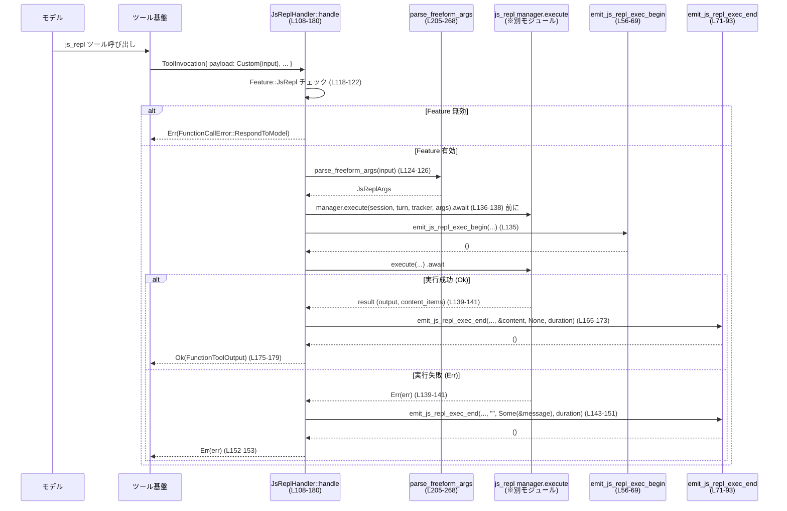

# core/src/tools/handlers/js_repl.rs

## 0. ざっくり一言

このモジュールは、JavaScript REPL（`js_repl`）ツールのハンドラ実装と、その自由形式入力のパース・バリデーションを行い、実行結果をツールイベントとモデル向け出力に変換する役割を持ちます（`JsReplHandler`, `JsReplResetHandler` 定義: `js_repl.rs:L25-26, L94-203`）。

---

## 1. このモジュールの役割

### 1.1 概要

- このモジュールは **JavaScript REPL セッションの実行・リセット** を行うツールハンドラを提供します。
- モデルからのツール呼び出し（関数形式 / カスタム自由形式）を受け取り、`js_repl` マネージャに委譲してコードを実行し、その結果を `FunctionToolOutput` に変換します（`JsReplHandler::handle`: `js_repl.rs:L108-180`）。
- 自由形式入力に対しては、先頭行の pragma（`// codex-js-repl: ...` 相当）とタイムアウト指定のパース、および JSON や Markdown コードフェンスを拒否するバリデーションを行います（`parse_freeform_args`, `reject_json_or_quoted_source`: `js_repl.rs:L205-289`）。

### 1.2 アーキテクチャ内での位置づけ

このハンドラは、`ToolHandler` トレイトを実装し、ツール実行基盤から呼ばれます。`ToolInvocation` に含まれる `session` / `turn` / `payload` などを使い、`js_repl` マネージャとの橋渡しとイベント通知を行います（`js_repl.rs:L94-133, L183-197`）。

主な依存関係（このファイル内で確認できる範囲）を図示します。

```mermaid
graph TD
    subgraph "core::tools::handlers::js_repl (本ファイル)"
        H[JsReplHandler<br/>(L25, L94-181)]
        R[JsReplResetHandler<br/>(L26, L183-203)]
        PF[parse_freeform_args<br/>(L205-268)]
        RJ[reject_json_or_quoted_source<br/>(L271-289)]
        EB[emit_js_repl_exec_begin<br/>(L56-69)]
        EE[emit_js_repl_exec_end<br/>(L71-93)]
        BO[build_js_repl_exec_output<br/>(L38-54)]
    end

    subgraph "外部モジュール（このチャンク外）"
        TI[ToolInvocation<br/>crate::tools::context]
        TP[ToolPayload<br/>crate::tools::context]
        MGR[js_repl manager<br/>crate::tools::js_repl]
        EM[ToolEmitter<br/>crate::tools::events]
        FF[Feature::JsRepl<br/>codex_features]
    end

    TI --> H
    TI --> R
    H --> TP
    H --> PF
    H --> EB
    H --> EE
    H --> MGR
    H --> EM
    R --> MGR
    R --> FF
    H --> FF
    EE --> BO
    PF --> RJ
```

※ js_repl マネージャや `ToolInvocation`/`ToolPayload` の内部実装はこのチャンクには現れないため不明です。

### 1.3 設計上のポイント

- **責務分離**  
  - ツール実行ハンドラ (`JsReplHandler`, `JsReplResetHandler`) と、入力パース/バリデーション (`parse_freeform_args`, `reject_json_or_quoted_source`) を分離しています（`js_repl.rs:L25-26, L94-203, L205-289`）。
- **Feature flag による有効化制御**  
  - `Feature::JsRepl` が無効な場合は即座に `FunctionCallError::RespondToModel` を返し、REPL を実行しません（`JsReplHandler::handle`: `L118-122`, `JsReplResetHandler::handle`: `L191-195`）。
- **Payload の形式を抽象化**  
  - 関数ツール (`ToolPayload::Function`) とカスタム自由形式 (`ToolPayload::Custom`) の両方を一つのハンドラで扱い、内部で `parse_arguments` / `parse_freeform_args` に振り分けています（`L124-132`）。
- **イベント駆動の実行モニタリング**  
  - 実行開始・終了時に `ToolEmitter` へ Begin / Success / Failure を発行し、`ExecToolCallOutput` を構築して渡します（`emit_js_repl_exec_begin`: `L56-69`, `emit_js_repl_exec_end`: `L71-93`, `build_js_repl_exec_output`: `L38-54`）。
- **非同期処理と共有状態**  
  - `session` と `turn` は `Arc` で共有され、`js_repl` マネージャの `execute` に渡されます（`L136-138`）。このモジュール内では共有状態への直接な可変アクセスはなく、並行性の安全性は `Arc` と外部マネージャに委ねられています。
- **入力の安全性・一貫性重視**  
  - 空入力、Markdown フェンス (` ``` `)、JSON オブジェクト/文字列を明示的に拒否し、「生の JavaScript ソース」を前提とした利用契約を強制します（`parse_freeform_args`: `L205-211, L259-263`, `reject_json_or_quoted_source`: `L271-288`）。

### 1.4 コンポーネント一覧（インベントリ）

#### 型（このファイルで定義される公開コンポーネント）

| 名前 | 種別 | 役割 / 用途 | 定義位置 |
|------|------|-------------|----------|
| `JsReplHandler` | 構造体（フィールドなし） | js_repl 実行用の `ToolHandler` 実装。ツール呼び出しを受けて JS コードを実行し、結果を `FunctionToolOutput` とツールイベントに変換します。 | `js_repl.rs:L25, L94-181` |
| `JsReplResetHandler` | 構造体（フィールドなし） | js_repl セッションのリセット専用 `ToolHandler` 実装。`manager.reset()` を呼び、カーネル状態を初期化します。 | `js_repl.rs:L26, L183-203` |

#### 関数（このファイルで定義される主要な自由関数）

| 名前 | 種別 | 概要 | 定義位置 |
|------|------|------|----------|
| `join_outputs` | `fn(&str, &str) -> String` | `stdout` と `stderr` を結合し、どちらか片方のみの場合はそれだけを返します。 | `js_repl.rs:L28-36` |
| `build_js_repl_exec_output` | `fn(&str, Option<&str>, Duration) -> ExecToolCallOutput` | 実行結果文字列とエラー有無から、`ExecToolCallOutput` を構築します。 | `js_repl.rs:L38-54` |
| `emit_js_repl_exec_begin` | `async fn(...)` | js_repl 実行開始イベント (`ToolEventStage::Begin`) を送出します。 | `js_repl.rs:L56-69` |
| `emit_js_repl_exec_end` | `async fn(...)` | js_repl 実行終了イベントを成功/失敗に応じて送出します。 | `js_repl.rs:L71-93` |
| `parse_freeform_args` | `fn(&str) -> Result<JsReplArgs, FunctionCallError>` | カスタム自由形式入力をパースし、pragma と JS コード、`timeout_ms` を抽出します。 | `js_repl.rs:L205-268` |
| `reject_json_or_quoted_source` | `fn(&str) -> Result<(), FunctionCallError>` | JSON オブジェクト/文字列または Markdown フェンスと推定される入力を拒否します。 | `js_repl.rs:L271-289` |

---

## 2. 主要な機能一覧

このモジュールが提供する主な機能は次のとおりです（行番号は根拠位置）。

- js_repl 実行ツールハンドラ  
  - `JsReplHandler` が `ToolHandler` を実装し、`ToolPayload::Function` / `Custom` を受けて js_repl マネージャに実行を委譲します（`js_repl.rs:L94-106, L108-180`）。
- js_repl リセットツールハンドラ  
  - `JsReplResetHandler` が `ToolHandler` を実装し、`manager.reset().await?` を呼び出してカーネル状態をリセットします（`js_repl.rs:L183-203`）。
- 自由形式入力のパースと pragma 処理  
  - `parse_freeform_args` が先頭行の pragma（`JS_REPL_PRAGMA_PREFIX`）から `timeout_ms` を読み取り、残りの行を JS コードとして `JsReplArgs` に格納します（`js_repl.rs:L205-268`）。
- 不正フォーマット（JSON/引用コード/Markdown フェンス）の拒否  
  - `reject_json_or_quoted_source` が入力の先頭が ``` の場合や、`serde_json::from_str` でパースできる JSON オブジェクト/文字列の場合にエラーとします（`js_repl.rs:L271-288`）。
- 実行イベントの生成  
  - `emit_js_repl_exec_begin` / `emit_js_repl_exec_end` が `ToolEmitter::shell` を使い、Begin/Success/Failure イベントを生成します（`js_repl.rs:L56-69, L71-93`）。
- 実行結果の集約と `FunctionToolOutput` 化  
  - `build_js_repl_exec_output` で `ExecToolCallOutput` を構築し、`JsReplHandler::handle` で `FunctionToolOutput::from_text` / `from_content` に変換します（`js_repl.rs:L38-54, L156-179`）。

---

## 3. 公開 API と詳細解説

### 3.1 型一覧（構造体・列挙体など）

| 名前 | 種別 | 役割 / 用途 | 関連する関数 / メソッド | 定義位置 |
|------|------|-------------|-------------------------|----------|
| `JsReplHandler` | 構造体 | js_repl 実行用のツールハンドラ。`ToolHandler` を実装し、JS コードの実行と結果整形を担います。 | `kind`, `matches_kind`, `handle`（`ToolHandler` 実装内） | `js_repl.rs:L25, L94-181` |
| `JsReplResetHandler` | 構造体 | js_repl セッションのリセット用ツールハンドラ。リセットのみを行います。 | `kind`, `handle` | `js_repl.rs:L26, L183-203` |

※ `JsReplArgs` 型や `JS_REPL_PRAGMA_PREFIX` は `crate::tools::js_repl` で定義されており、このチャンクには定義が現れません（`js_repl.rs:L15-16`）。

---

### 3.2 関数詳細（重要なもの 7 件）

#### 1. `JsReplHandler::handle(&self, invocation: ToolInvocation) -> Result<FunctionToolOutput, FunctionCallError>`

**概要**

- js_repl 実行ツールのメインエントリです。
- Feature フラグ、payload 形式に応じた引数パース、REPL マネージャの実行、ツールイベント送出、`FunctionToolOutput` の構築を行います（`js_repl.rs:L108-180`）。

**引数**

| 引数名 | 型 | 説明 |
|--------|----|------|
| `invocation` | `ToolInvocation` | セッション、ターンコンテキスト、トラッカ、payload、call_id などツール実行に必要な情報を含む構造体（定義は他モジュール）。 |

`ToolInvocation` は分配代入で展開されています（`L109-116`）。

**戻り値**

- `Ok(FunctionToolOutput)`  
  - モデルに返却するツール結果。テキストまたは構造化コンテンツのリストとしてラップされます（`L156-179`）。
- `Err(FunctionCallError)`  
  - Feature フラグ無効、payload 形式不正、引数パースエラー、マネージャ実行エラーなどの場合に返されます（`L118-122, L124-132, L139-153`）。

**内部処理の流れ**

1. `ToolInvocation` を分解し、`session`, `turn`, `tracker`, `payload`, `call_id` を取り出す（`L109-116`）。
2. `session.features().enabled(Feature::JsRepl)` をチェックし、無効なら `FunctionCallError::RespondToModel` でエラー終了（`L118-122`）。
3. `payload` のバリアントに応じて js_repl 用の引数 (`JsReplArgs`) を決定（`L124-132`）。  
   - `Function` → `parse_arguments(&arguments)?`（別モジュール）  
   - `Custom` → `parse_freeform_args(&input)?`（本ファイル）  
   - それ以外 → エラー（`"js_repl expects custom or function payload"`）。
4. `turn.js_repl.manager().await?` でマネージャを取得（`L133`）。
5. `Instant::now()` で開始時刻を記録し（`L134`）、`emit_js_repl_exec_begin` で Begin イベントを送出（`L135`）。
6. `manager.execute(Arc::clone(&session), Arc::clone(&turn), tracker, args).await` を呼び出し、結果 `result` を受け取る（`L136-138`）。
7. `result` が `Err(err)` の場合:
   - `err.to_string()` をメッセージとして `emit_js_repl_exec_end(..., "", Some(&message), started_at.elapsed())` を呼び、Failure イベントを送出（`L139-151`）。
   - その後 `Err(err)` を呼び出し元に返す（`L152-153`）。
8. `result` が `Ok(result)` の場合:
   - `result.output` と `result.content_items` から `Vec<FunctionCallOutputContentItem>` を構築する。非空の `output` があれば `InputText` として先頭に追加し、残りの `content_items` を後続に追加（`L156-163`）。
   - `emit_js_repl_exec_end(..., &content, None, started_at.elapsed())` で Success イベントを送出（`L165-173`）。
9. `items` が空なら `FunctionToolOutput::from_text(content, Some(true))` を返し、そうでなければ `FunctionToolOutput::from_content(items, Some(true))` を返す（`L175-179`）。

**使用例（疑似コード）**

実際にはフレームワーク側が呼び出す想定ですが、概念的な利用例です。

```rust
use crate::tools::handlers::js_repl::JsReplHandler;
use crate::tools::context::{ToolInvocation, ToolPayload};

// 省略: session, turn, tracker, call_id を用意する

let handler = JsReplHandler; // フィールドなしのユニット構造体

let invocation = ToolInvocation {
    session: session_arc,          // Arc<Session>
    turn: turn_arc,                // Arc<TurnContext>
    tracker,
    payload: ToolPayload::Custom {
        input: r#"console.log(1+2);"#.to_string(),
    },
    call_id: "call-123".to_string(),
    // 他フィールドは ..Default::default() など（定義はこのチャンク外）
};

let output = handler.handle(invocation).await?;
println!("tool output: {:?}", output);
```

※ 実際の `ToolInvocation` 構造体の定義やコンストラクタはこのチャンクには現れません。

**Errors / Panics**

- `Feature::JsRepl` が無効な場合  
  → `FunctionCallError::RespondToModel("js_repl is disabled by feature flag")` を返す（`L118-122`）。
- `payload` が `Function` / `Custom` 以外の場合  
  → `"js_repl expects custom or function payload"` エラー（`L124-132`）。
- `parse_arguments` / `parse_freeform_args` 内部でのバリデーションエラー  
  → それぞれ `FunctionCallError` が伝播（`?` 演算子）します（`L125-126`）。
- `turn.js_repl.manager().await?` / `manager.execute(..).await` / `manager.reset().await?`（ResetHandler で）  
  → 内部でエラー発生時は `FunctionCallError` が伝播します（`L133, L136-138`）。
- この関数自身では `panic!` を呼びません。`Arc::clone` なども安全な操作です。

**Edge cases（エッジケース）**

- `result.output` が空文字列で `result.content_items` も空の場合  
  → `items` が空のままなので、`FunctionToolOutput::from_text(content, Some(true))` が呼ばれ、空テキストを含む出力となります（`L156-179`）。
- `result.output` が空だが `content_items` が非空の場合  
  → `items` は `content_items` のみを含み、`from_content` が使用されます（`L156-163, L175-179`）。

**使用上の注意点**

- この関数は `async` であり、非同期コンテキスト（例: `tokio` のランタイム）上で `.await` する必要があります。
- `session` / `turn` は `Arc` 経由でマネージャに渡されるため、このモジュールからは同時実行時の内部状態の詳細は分かりません。js_repl マネージャ側のスレッド安全性に依存します。
- Feature フラグ無効時にもツールとしては呼ばれる可能性があるため、呼び出し側は `FunctionCallError::RespondToModel` をユーザー向けメッセージとして扱う設計になっていると考えられます（エラー種別名からの推測であり、詳細挙動はこのチャンクにはありません）。

---

#### 2. `JsReplResetHandler::handle(&self, invocation: ToolInvocation) -> Result<FunctionToolOutput, FunctionCallError>`

**概要**

- js_repl セッションをリセットするためのハンドラです。
- Feature フラグのチェック後、`js_repl` マネージャの `reset()` を呼び、成功時には「js_repl kernel reset」というメッセージを返します（`js_repl.rs:L190-203`）。

**引数**

| 引数名 | 型 | 説明 |
|--------|----|------|
| `invocation` | `ToolInvocation` | セッション等を含むツール呼び出し情報。ここでは `session.features()` と `turn.js_repl.manager()` の取得に利用されます（`L191, L196`）。 |

**戻り値**

- `Ok(FunctionToolOutput)`  
  - テキスト `"js_repl kernel reset"` を含む成功レスポンス（`L198-201`）。
- `Err(FunctionCallError)`  
  - Feature フラグ無効または `manager().await?` / `reset().await?` の内部エラー時。

**内部処理の流れ**

1. `invocation.session.features().enabled(Feature::JsRepl)` をチェック。無効なら `"js_repl is disabled by feature flag"` エラー（`L191-195`）。
2. `invocation.turn.js_repl.manager().await?` でマネージャを取得（`L196`）。
3. `manager.reset().await?` を呼び、セッションをリセット（`L197`）。
4. `"js_repl kernel reset"` というテキストを `FunctionToolOutput::from_text(.., Some(true))` で返す（`L198-201`）。

**使用例（疑似コード）**

```rust
let handler = JsReplResetHandler;

let invocation = /* ToolInvocation with session/turn prepared */;
let output = handler.handle(invocation).await?;
assert!(output.text().contains("js_repl kernel reset"));
```

（`text()` のようなメソッドの有無はこのチャンクには現れません。あくまで概念例です。）

**Errors / Edge cases**

- Feature 無効時 → `FunctionCallError::RespondToModel`（`L191-195`）。
- js_repl マネージャが取得できない、または `reset().await` が失敗 → エラーがそのまま伝播（`?`）します。
- 入力 payload の内容は参照していないため、どの payload で呼んでも挙動は同じです（`ToolInvocation` から取り出していない）。

**使用上の注意点**

- 実際のセッション状態がどの程度クリアされるか（変数・モジュールキャッシュ・コンテキストなど）は、`js_repl` マネージャの実装次第であり、このチャンクからは分かりません。
- 実行中のコードがある状態でリセットを呼んだ場合の挙動も、このファイルからは不明です。

---

#### 3. `parse_freeform_args(input: &str) -> Result<JsReplArgs, FunctionCallError>`

**概要**

- `ToolPayload::Custom { input }` で渡される「自由形式の JS ソース文字列」から、実際に実行する JS コードとオプションの `timeout_ms` を抽出します（`js_repl.rs:L205-268`）。
- 空入力や Markdown コードフェンス、JSON/引用文字列など、意図しないフォーマットの入力を拒否します。

**引数**

| 引数名 | 型 | 説明 |
|--------|----|------|
| `input` | `&str` | モデルから渡される自由形式の文字列。JS コードそのもの、もしくは先頭行に pragma を含む形式を想定。 |

**戻り値**

- `Ok(JsReplArgs)`  
  - `code: String` に実行すべき JS ソース、`timeout_ms: Option<u64>` に pragma で指定されたタイムアウト値を格納した構造体（`L213-216, L265-267`）。
- `Err(FunctionCallError)`  
  - 入力が空、pragma の書式不正、サポートされないキー、重複指定、整数以外の timeout 値、JS 本体が空、JSON/Markdown フェンスなどの場合にエラーを返します（`L205-211, L231-255, L259-263, L271-288`）。

**内部処理の流れ**

1. 入力の空チェック  
   - `if input.trim().is_empty()` の場合、エラーメッセージ付きで `Err`（`L205-211`）。
2. 初期値の `JsReplArgs` を作成  
   - `code` に `input` 全体、`timeout_ms` に `None` を設定（`L213-216`）。
3. 行分割と pragma 判定  
   - `input.splitn(2, '\n')` で先頭行と残りを分離（`L218-220`）。
   - `first_line.trim_start()` のトリム後、`JS_REPL_PRAGMA_PREFIX` で始まるか確認（`L221-222`）。
   - prefix がなければ:
     - `reject_json_or_quoted_source(&args.code)?` で JSON/Markdown フェンスチェック（`L223`）。
     - 問題なければ `Ok(args)` を返す（`L224`）。
4. pragma がある場合の解析  
   - `pragma` 部分を `directive` として `trim()`（`L227-228`）。
   - `directive` が空でなければ、空白区切りでトークンを分割し、各トークンについて:
     - `token.split_once('=')` が失敗すればエラー（`L231-235`）。
     - `key` が `"timeout_ms"` の場合:
       - 既に `timeout_ms` がセットされていればエラー（重複指定: `L237-241`）。
       - `value.parse::<u64>()` に失敗すればエラー（整数のみ許可: `L243-247`）。
       - 成功すれば `timeout_ms = Some(parsed)`（`L247-248`）。
     - それ以外のキーはエラー（サポート外: `L250-253`）。
5. JS 本体の存在確認  
   - `rest.trim().is_empty()` なら pragma のみでコードが無いとしてエラー（`L259-263`）。
6. 本体の形式チェックと設定  
   - `reject_json_or_quoted_source(rest)?` で JSON/Markdown フェンスなどを拒否（`L265`）。
   - 問題なければ `args.code = rest.to_string(); args.timeout_ms = timeout_ms;` に置き換え（`L266-267`）。
   - `Ok(args)` を返す（`L268`）。

**Examples（使用例）**

1. シンプルな自由形式入力（pragma なし）

```rust
use crate::tools::handlers::js_repl::parse_freeform_args;

let input = "console.log(1 + 2);";
let args = parse_freeform_args(input)?;

// args.code == "console.log(1 + 2);"
// args.timeout_ms == None
```

1. pragma でタイムアウトを指定する例

```rust
let input = r#"// codex-js-repl: timeout_ms=5000
console.log(await fetch("https://example.com").then(r => r.text()));"#;

let args = parse_freeform_args(input)?;

// args.code は 2 行目以降の JS コードのみ
// args.timeout_ms == Some(5000)
```

※ `JS_REPL_PRAGMA_PREFIX` の実際の文字列値はこのチャンクには現れませんが、エラーメッセージから `// codex-js-repl:` に関連することが推測されます（`L208-209`）。

**Errors / Panics**

主なエラー条件（すべて `FunctionCallError::RespondToModel`）:

- 入力が空または空白のみ（`L205-211`）。  
  → 「non-empty」な JS ソースを要求するメッセージ。
- `JS_REPL_PRAGMA_PREFIX` なしで JSON/Markdown フェンスなどが渡された場合（`reject_json_or_quoted_source(&args.code)?` による: `L223`・`L271-288`）。
- pragma トークンに `'='` が含まれない場合（`L231-235`）。
- サポートされないキー（`timeout_ms` 以外）が指定された場合（`L250-253`）。
- `timeout_ms` が複数回指定された場合（`L237-241`）。
- `timeout_ms` の値が整数としてパースできない場合（`L243-247`）。
- pragma 行の後に JS 本体が存在しない場合（`L259-263`）。
- JS 本体が Markdown フェンスや JSON オブジェクト/文字列と解釈される場合（`L271-288`）。

`panic!` は使用しておらず、`unwrap_or_default` なども安全な形で使われています（`L219-220`）。

**Edge cases**

- 先頭行の pragma に値が何もない（例: `"// codex-js-repl:"` のみで `timeout_ms` なし）  
  → `directive.is_empty()` なのでループには入らず、`timeout_ms` は `None` のまま（`L227-229`）。
- pragma 行の後に空行のみ（`rest` が改行だけ）  
  → `rest.trim().is_empty()` でエラー（`L259-263`）。
- 入力全体が JSON 文字列（例: `"\"console.log(1);\""`）  
  → `serde_json::from_str::<JsonValue>(trimmed)` が成功し `JsonValue::String(_)` になるためエラー（`L279-287`）。
- 入力全体が JSON オブジェクト（例: `{"code":"console.log(1);"}`）  
  → `JsonValue::Object(_)` でエラー（`L282-286`）。
- JSON 数値や配列など（`JsonValue::Number`, `Array` 等）  
  → `match` で `_ => Ok(())` となり許可されています（`L283-288`）。

**使用上の注意点**

- この関数は「js_repl は生の JS ソースを受け取る」という契約を強制するためのものです。モデルから JSON 形式でコードを渡す戦略とは相性が悪いため、ツールプロンプト側で明示する必要があります（エラーメッセージもそれを説明: `L283-286`）。
- プラグマで増やせるキーは `timeout_ms` のみです。新しいオプションを追加する場合は、この関数の `match key` 部分を変更する必要があります（`L236-255`）。

---

#### 4. `reject_json_or_quoted_source(code: &str) -> Result<(), FunctionCallError>`

**概要**

- 入力文字列が Markdown コードフェンス（```で開始）または JSON オブジェクト/文字列である場合に、それをエラーとして拒否します（`js_repl.rs:L271-288`）。
- js_repl ツールが「自由形式」の JS コードのみを受け取ることを保証するためのバリデーションです。

**引数**

| 引数名 | 型 | 説明 |
|--------|----|------|
| `code` | `&str` | 検査対象の文字列。自由形式入力全体または pragma 以降の JS 本体。 |

**戻り値**

- `Ok(())`  
  - 入力が Markdown コードフェンスでも JSON オブジェクト/文字列でもない場合。
- `Err(FunctionCallError)`  
  - Markdown フェンスまたは JSON オブジェクト/文字列として解釈される場合。

**内部処理**

1. `trimmed = code.trim()`（前後の空白除去: `L272`）。
2. `if trimmed.starts_with("```")` なら Markdown コードフェンスとしてエラー（`L273-277`）。
3. `serde_json::from_str::<JsonValue>(trimmed)` を試し、失敗したら（JSON でなければ）`Ok(())`（`L279-281`）。
4. 成功した場合は `match value` でバリアントを判別し、`JsonValue::Object(_)` または `JsonValue::String(_)` ならエラー（`L282-286`）、それ以外なら `Ok(())`（`L287-288`）。

**使用例**

```rust
reject_json_or_quoted_source("console.log(1);")?; // OK

reject_json_or_quoted_source("```js\nconsole.log(1);\n```")?; 
// → Err(FunctionCallError::RespondToModel(...))

reject_json_or_quoted_source(r#""console.log(1);""#)?;
// → Err(FunctionCallError::RespondToModel(...))

reject_json_or_quoted_source("123"); // JSON 数値としてパースされるが、_ で許可
```

**Errors / Edge cases**

- Markdown フェンス開始 (` ``` `) は即エラー（`L273-277`）。
- JSON の配列や数値などは許可されている点に注意（`_ => Ok(())`: `L287-288`）。  
  → ただし、そのような入力が js_repl の JS コードとして意味があるかは別問題であり、この関数はそこまで検証していません。

**使用上の注意点**

- この関数は js_repl の入力形式に関する契約を保証するためのものであり、JS の構文的な正しさは検証しません。
- ツール設計側で、モデルが Markdown コードブロックや JSON ラッパを生成しないようにプロンプトを整えることが推奨されます（エラーメッセージもその点を明示: `L275-276, L283-286`）。

---

#### 5. `emit_js_repl_exec_begin(session, turn, call_id)`

**概要**

- js_repl 実行開始時に、`ToolEmitter::shell` を使って Begin イベントを送出します（`js_repl.rs:L56-69`）。

**引数**

| 引数名 | 型 | 説明 |
|--------|----|------|
| `session` | `&crate::codex::Session` | セッションコンテキスト（詳細不明: `L57`）。 |
| `turn` | `&crate::codex::TurnContext` | 対象ターンのコンテキスト。`cwd`（カレントディレクトリ）などを含むようです（`L58, L62-63`）。 |
| `call_id` | `&str` | ツール呼び出し ID。イベント関連付けに使用されます（`L59, L67`）。 |

**戻り値**

- `()`（`async fn` であり、`await` すると `()` を返す）。

**内部処理**

1. `ToolEmitter::shell` で `"js_repl"` というコマンド名、`turn.cwd` をカレントディレクトリとして `emitter` を構築（`L61-66`）。
2. `ToolEventCtx::new(session, turn, call_id, None)` でイベントコンテキストを生成（`L67`）。
3. `emitter.emit(ctx, ToolEventStage::Begin).await` を呼び、Begin イベントを送出（`L68`）。

**使用上の注意点**

- `freeform` フラグは `false` に固定されています（`L65`）。これは `ToolEmitter::shell` の動作に影響する設計ですが、このチャンクからは詳細不明です。
- エラー処理はここでは行っておらず、`emit` が返す `Future` のエラーの有無もこの関数内では扱っていません（`await` しているだけ: `L68`）。エラー型や結果は不明です。

---

#### 6. `emit_js_repl_exec_end(session, turn, call_id, output, error, duration)`

**概要**

- js_repl 実行終了時に、成功か失敗かに応じたイベントを送出します（`js_repl.rs:L71-93`）。
- `ExecToolCallOutput` を構築し、それを `ToolEventStage::Success` または `ToolEventStage::Failure(ToolEventFailure::Output(..))` に包んで送信します。

**引数**

| 引数名 | 型 | 説明 |
|--------|----|------|
| `session` | `&crate::codex::Session` | セッションコンテキスト。 |
| `turn` | `&crate::codex::TurnContext` | ターンコンテキスト。 |
| `call_id` | `&str` | ツール呼び出し ID。 |
| `output` | `&str` | 実行された JS からの標準出力相当。 |
| `error` | `Option<&str>` | エラーメッセージ。`Some` なら exit_code=1 扱い、Failure イベントとして扱われます（`L47-48, L87-90`）。 |
| `duration` | `Duration` | 実行時間。`ExecToolCallOutput` に格納されます（`L41, L78, L51`）。 |

**戻り値**

- `()`（`async`）。

**内部処理**

1. `build_js_repl_exec_output(output, error, duration)` を呼んで `exec_output` を構築（`L79`）。
2. `ToolEmitter::shell` で `"js_repl"` 用の emitter を生成（`L80-85`）。
3. `ToolEventCtx::new` でコンテキストを生成（`L86`）。
4. `error.is_some()` かどうかでステージを分岐（`L87-91`）。  
   - `Some` → `ToolEventStage::Failure(ToolEventFailure::Output(exec_output))`  
   - `None` → `ToolEventStage::Success(exec_output)`
5. `emitter.emit(ctx, stage).await` でイベント送出（`L92`）。

**使用上の注意点**

- `build_js_repl_exec_output` によって `timed_out` は常に `false` となるため、タイムアウト検出は別のレイヤに任されている可能性があります（`L52`）。この関数だけではタイムアウトという状態は区別されません。

---

#### 7. `build_js_repl_exec_output(output: &str, error: Option<&str>, duration: Duration) -> ExecToolCallOutput`

**概要**

- イベント用の `ExecToolCallOutput` 構造体を構築します（`js_repl.rs:L38-54`）。
- 標準出力（`stdout`）、標準エラー（`stderr`）、結合出力、終了コード、実行時間などをセットします。

**引数**

| 引数名 | 型 | 説明 |
|--------|----|------|
| `output` | `&str` | 実行結果の標準出力。 |
| `error` | `Option<&str>` | エラーメッセージ。`Some` の場合は `stderr` として扱い、`exit_code` を 1 にします（`L47-49`）。 |
| `duration` | `Duration` | 実行時間。 |

**戻り値**

- `ExecToolCallOutput`  
  - `exit_code`, `stdout`, `stderr`, `aggregated_output`, `duration`, `timed_out` を含む構造体（`L46-53`）。

**内部処理**

1. `stdout = output.to_string()`、`stderr = error.unwrap_or("").to_string()` でローカルな `String` に変換（`L43-44`）。
2. `join_outputs(&stdout, &stderr)` で `aggregated_output` を作成（`L45`）。
3. `ExecToolCallOutput { ... }` を構築。  
   - `exit_code` は `error.is_some()` なら 1、それ以外は 0（`L47`）。  
   - `StreamOutput::new` で各文字列をラップ（`L48-50`）。  
   - `timed_out: false` に固定（`L52`）。

**使用上の注意点**

- `join_outputs` は `stdout` と `stderr` のどちらかが空ならもう一方だけを返し、両方非空なら改行で連結します（`L28-35`）。  
  → aggregated_output をログや UI に表示する際に、見やすい形で出力することを意図していると解釈できます。

---

### 3.3 その他の関数

| 関数名 | 役割（1 行） | 行範囲 |
|--------|--------------|--------|
| `join_outputs(stdout: &str, stderr: &str) -> String` | `stdout` / `stderr` の結合ロジックをカプセル化します（空の場合の扱いも含む）。 | `js_repl.rs:L28-36` |

---

## 4. データフロー

ここでは、`ToolPayload::Custom`（自由形式入力）による js_repl 実行の典型的なフローを説明します。

1. モデルがツールとして `"js_repl"` を呼び出し、ツール基盤が `ToolInvocation { payload: ToolPayload::Custom { input }, .. }` を組み立てます（`ToolInvocation` の生成はこのチャンク外）。
2. `JsReplHandler::handle` が呼ばれ、Feature フラグチェック後、`parse_freeform_args(input)` で `JsReplArgs` を作成します（`L118-122, L124-126, L205-268`）。
3. `turn.js_repl.manager().await?` で js_repl マネージャを取得し、`emit_js_repl_exec_begin` で Begin イベントを送出します（`L133-135, L56-69`）。
4. マネージャの `execute` が JS コードを実行し、結果オブジェクトを返します（`L136-138`）。
5. 結果に応じて:
   - 成功 → 出力とコンテンツ項目から `FunctionToolOutput` を構築し、`emit_js_repl_exec_end` で Success イベントを送信（`L139-141, L156-179, L165-173`）。
   - 失敗 → エラーメッセージを抽出し、`emit_js_repl_exec_end` で Failure イベントを送信後、`Err` を返す（`L139-153`）。

この流れを sequence diagram で表します（行番号付き）。



---

## 5. 使い方（How to Use）

### 5.1 基本的な使用方法

このモジュールの公開 API は主に `ToolHandler` 実装として利用されるため、通常はツールレジストリやフレームワーク側で登録・呼び出しされます。ここではコンセプトとしての利用例を示します。

#### js_repl 実行ツールの登録と呼び出し（概念例）

```rust
use crate::tools::handlers::js_repl::JsReplHandler;
use crate::tools::context::{ToolInvocation, ToolPayload};

// どこかでハンドラ登録
let handler = JsReplHandler;
// ツールレジストリに "js_repl" → handler を登録する（実装はこのチャンク外）

// 呼び出し側（例: モデルからのツールコール処理）
async fn run_js_repl(session: Arc<Session>, turn: Arc<TurnContext>) -> Result<(), FunctionCallError> {
    let invocation = ToolInvocation {
        session,
        turn,
        tracker: /* ... */,
        payload: ToolPayload::Custom {
            input: r#"
                // codex-js-repl: timeout_ms=3000
                console.log("hello from js_repl");
            "#.to_string(),
        },
        call_id: "call-1".to_string(),
        // その他フィールド...
    };

    let output = handler.handle(invocation).await?;
    // output をモデルやログに返す
    Ok(())
}
```

### 5.2 よくある使用パターン

1. **自由形式入力のみでの実行（短いコード）**

```rust
let input = "1 + 2";
let args = parse_freeform_args(input)?;
// JsReplArgs { code: "1 + 2".into(), timeout_ms: None }
```

1. **長時間処理に対して timeout_ms を指定する**

```rust
let input = r#"// codex-js-repl: timeout_ms=10000
await new Promise(resolve => setTimeout(resolve, 9000));
console.log("done");"#;

let args = parse_freeform_args(input)?;
// timeout_ms == Some(10000)
```

※ `timeout_ms` の具体的な扱い（本当にタイムアウトできるか）は js_repl マネージャ側の実装次第で、このチャンクからは不明です。

1. **REPL セッションをリセットする**

```rust
use crate::tools::handlers::js_repl::JsReplResetHandler;

let handler = JsReplResetHandler;
let invocation = /* ToolInvocation with session/turn */;

let output = handler.handle(invocation).await?;
// "js_repl kernel reset" というテキストを含む FunctionToolOutput
```

### 5.3 よくある間違い

このモジュールのバリデーションロジックから推測される「誤用パターン」と、その結果を示します。

```rust
// 誤り: 空入力を渡す
let input = "   "; // 空白のみ
let args = parse_freeform_args(input)?;
// → Err(FunctionCallError::RespondToModel("js_repl expects raw JavaScript tool input (non-empty)..."))

// 正しい例: 何かしらの JS ソースを渡す
let input = "console.log('ok');";
let args = parse_freeform_args(input)?;
```

```rust
// 誤り: Markdown コードフェンスで囲んだ JS を渡す
let input = r#"```js
console.log("bad");
```"#;
let args = parse_freeform_args(input)?;
// → reject_json_or_quoted_source でエラー

// 正しい例: フェンスを外して渡す
let input = r#"console.log("good");"#;
let args = parse_freeform_args(input)?;
```

```rust
// 誤り: JSON ラッパを使う
let input = r#"{"code": "console.log(1);"}"#;
let args = parse_freeform_args(input)?;
// → reject_json_or_quoted_source でエラー

// 正しい例: code フィールドの中身だけを渡す
let input = r#"console.log(1);"#;
let args = parse_freeform_args(input)?;
```

```rust
// 誤り: pragma で不正なキーを使う
let input = r#"// codex-js-repl: timeout=1000
console.log(1);"#;
let args = parse_freeform_args(input)?;
// → "js_repl pragma only supports timeout_ms; got `timeout`"

// 正しい例: timeout_ms を使う
let input = r#"// codex-js-repl: timeout_ms=1000
console.log(1);"#;
let args = parse_freeform_args(input)?;
```

### 5.4 使用上の注意点（まとめ）

- **Feature フラグ**  
  - `Feature::JsRepl` が無効だと、実行とリセットの両方が `FunctionCallError::RespondToModel` で失敗します（`L118-122, L191-195`）。環境設定側でフラグを有効にする必要があります。
- **入力形式の契約**  
  - 生の JavaScript ソースのみを受け付け、Markdown フェンスや JSON/引用文字列は拒否されます（`L205-211, L271-288`）。ツールプロンプトやクライアント実装でこの前提を明示することが重要です。
- **非同期/並行性**  
  - ハンドラは非同期関数であり、内部で `await` するため、実行には非同期ランタイムが必要です。`session` / `turn` が `Arc` で共有されるため、このモジュール内から直接なデータレースは発生しませんが、js_repl マネージャのスレッド安全性は別途確認が必要です（`L136-138`）。
- **タイムアウト**  
  - `timeout_ms` フィールドは `JsReplArgs` に格納されますが、このファイル内では使用されません（`L213-216, L266-267`）。タイムアウト動作の有無はマネージャ側に依存します。
- **イベントと観測性**  
  - Begin / Success / Failure イベントが `ToolEmitter` を通じて発行されるため、ログ・UI・監視システムはこれを利用して js_repl の実行状況を追跡できます（`L56-69, L71-93`）。

---

## 6. 変更の仕方（How to Modify）

### 6.1 新しい機能を追加する場合

例: js_repl pragma に新しいオプションを追加したい場合。

1. **pragma のパースロジックの拡張**  
   - `parse_freeform_args` 内の `match key` 部分に新しいキーを追加します（`js_repl.rs:L236-255`）。
   - 追加したキーに応じて、新しいフィールドを `JsReplArgs` に足す必要がありますが、`JsReplArgs` は別モジュールに定義されているため、そちらも変更が必要です（`L213-216`）。
2. **js_repl マネージャでの利用**  
   - 新しいフィールドを使って実際の JS 実行ロジックを変更するには、`js_repl` マネージャの `execute` 実装を更新します（このチャンク外）。
3. **エラーメッセージの整合性**  
   - 使用上のメッセージ（`"js_repl pragma only supports timeout_ms; ..."` など）も更新し、新しいオプションを反映させます（`L250-253`）。

### 6.2 既存の機能を変更する場合

変更時に確認すべきポイントを例示します。

- **入力バリデーションの緩和/強化**  
  - 変更箇所: `parse_freeform_args`, `reject_json_or_quoted_source`（`L205-268, L271-288`）。  
  - 影響範囲: js_repl ツール全体の入力契約。既存のクライアントやプロンプトが依存している可能性があるため、互換性に注意が必要です。
- **イベント出力形式の変更**  
  - 変更箇所: `build_js_repl_exec_output`, `emit_js_repl_exec_begin`, `emit_js_repl_exec_end`（`L38-54, L56-69, L71-93`）。  
  - 影響範囲: ツールイベントを消費するロガーや UI。`exit_code` や `aggregated_output` の扱いが変わると、監視やデバッグの挙動にも影響します。
- **ToolPayload の扱いの拡張**  
  - 変更箇所: `JsReplHandler::matches_kind`, `handle` の `match payload` 部分（`L101-106, L124-132`）。  
  - 影響範囲: ツールディスパッチャが js_repl をどの payload で呼べるか。新しいバリアントを追加した場合は、他のハンドラとの整合性も確認が必要です。

変更後は、`js_repl_tests.rs`（テストモジュール）を更新・追加して、契約が守られているかを検証するのが望ましいです（`L291-293`）。

---

## 7. 関連ファイル

このモジュールと密接に関係するファイル・モジュール（このチャンクで参照されているもの）をまとめます。

| パス / モジュール | 役割 / 関係 |
|-------------------|------------|
| `core/src/tools/handlers/js_repl.rs`（本ファイル） | js_repl の `ToolHandler` 実装と自由形式入力パース・バリデーションを提供します。 |
| `crate::tools::js_repl` | `JS_REPL_PRAGMA_PREFIX`, `JsReplArgs`、`turn.js_repl.manager()` で利用される js_repl マネージャ関連の型を定義しているモジュールです（`L15-16, L133, L196`）。実体ファイルのパスはこのチャンクには現れません。 |
| `crate::tools::handlers::parse_arguments` | `ToolPayload::Function` から js_repl 用の引数を構築する関数です（`L14, L124-125`）。詳細なスキーマはこのチャンクには現れません。 |
| `crate::tools::context` | `FunctionToolOutput`, `ToolInvocation`, `ToolPayload` など、ツール実行の共通コンテキスト型を提供します（`L7-9`）。 |
| `crate::tools::events` | `ToolEmitter`, `ToolEventCtx`, `ToolEventStage`, `ToolEventFailure` など、ツール実行イベントの発行と表現を担当します（`L10-13, L56-69, L71-93`）。 |
| `crate::tools::registry` | `ToolHandler`, `ToolKind` を定義し、ツールハンドラの登録・識別を行うモジュールです（`L17-18, L94-99, L183-188`）。 |
| `codex_features::Feature` | `Feature::JsRepl` フラグによって js_repl の有効/無効を管理します（`L19, L118-122, L191-195`）。 |
| `codex_protocol::exec_output` | `ExecToolCallOutput`, `StreamOutput` など、ツール実行結果のイベント表現に使われる型を提供します（`L20-21, L38-54`）。 |
| `codex_protocol::models::FunctionCallOutputContentItem` | モデルに返すツール出力コンテンツの要素型です。`JsReplHandler` で構造化された結果として利用されます（`L22, L156-163`）。 |
| `codex_protocol::protocol::ExecCommandSource` | ツール実行のソース種別（ここでは `Agent`）を指定する列挙体です（`L23, L61-65, L80-84`）。 |
| `core/src/tools/handlers/js_repl_tests.rs` | `#[cfg(test)] #[path = "js_repl_tests.rs"] mod tests;` として指定されているテストモジュールです（`L291-293`）。テスト内容はこのチャンクには現れません。 |

---

## Bugs / Security / Contracts / テスト / パフォーマンスに関する補足

※ 専用見出しは禁止されているため、ここでまとめて補足します。

- **潜在的なバグ/注意点**
  - `reject_json_or_quoted_source` が JSON 数値や配列などを許可しているため、ツールプロンプトによっては意図しない入力が通過する可能性があります（`L282-288`）。ただし、これは設計上許容している可能性もあり、このチャンクだけでは判断できません。
  - `ExecToolCallOutput.timed_out` が常に `false` であり、タイムアウト情報をイベントに反映していません（`L52`）。タイムアウト管理が別レイヤに存在するか、実装漏れかは不明です。
- **セキュリティ面**
  - このモジュールは JS コード実行そのものは行わず、マネージャに委譲しています。JS 実行環境のサンドボックス化やリソース制限は `js_repl` マネージャ側の責任であり、このファイルからは確認できません。
  - 入力形式の制限（Markdown フェンス拒否、JSON/引用コード拒否）は、主にモデルとのプロトコル整合性のためであり、直接的なセキュリティ対策ではありませんが、不要なラッパ層を排除することでパーサの複雑さを抑える効果があります（`L205-211, L271-288`）。
- **契約 / エッジケース**
  - 「空でない生の JS ソースを渡す」「先頭行に pragma を付ける場合は必ずその後に実際の JS コードを置く」「pragma で指定できるキーは `timeout_ms` のみ」といった契約がエラーメッセージとバリデーションから読み取れます（`L205-211, L227-255, L259-263`）。
- **テスト**
  - テストモジュール `js_repl_tests.rs` の中身はこのチャンクには現れないため、どのケースがカバーされているかは不明です（`L291-293`）。ただし、入力バリデーションが複雑なため、空入力・pragma 解析・JSON/Markdown 判定・Feature フラグなどがテスト対象である可能性が高いと推測されますが、あくまで推測であり、コードからは断定できません。
- **パフォーマンス / スケーラビリティ**
  - このモジュール自体は文字列操作とイベント発行が主であり、重い処理は js_repl マネージャに委譲されています。  
  - `parse_freeform_args` / `reject_json_or_quoted_source` は入力全体を一度 JSON パースしようとするため、大きな入力ではコストがありますが、通常の REPL 利用の範囲では許容可能と考えられます（`L279-281`）。
