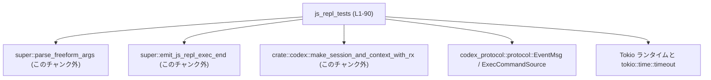
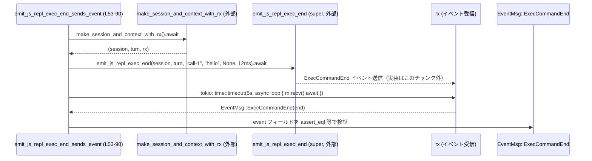
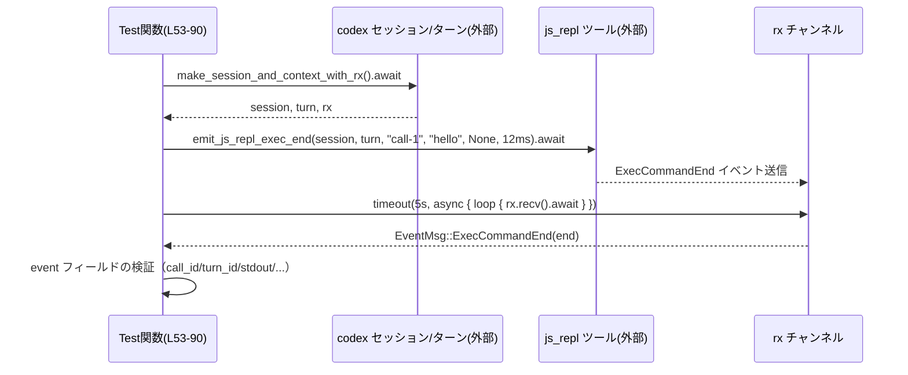

# core/src/tools/handlers/js_repl_tests.rs

## 0. ざっくり一言

`js_repl` ツールハンドラの挙動（自由形式 JavaScript 引数パーサと実行完了イベント送信）を検証するためのテスト群です。  
主に `parse_freeform_args` と `emit_js_repl_exec_end` の契約をテストしています（`js_repl_tests.rs:L9-L51, L53-L90`）。

---

## 1. このモジュールの役割

### 1.1 概要

- このモジュールは、JavaScript REPL ツール (`js_repl`) の **引数パース処理** と **実行完了イベント送信処理** が想定どおり動作することを確認するテストを提供します。
- 具体的には、文字列入力からの pragma 解析（`timeout_ms` のみ許可）と、JSON ラップされたコードの拒否、および `ExecCommandEnd` イベントのフィールド内容を検証します（`js_repl_tests.rs:L9-L51, L53-L90`）。

### 1.2 アーキテクチャ内での位置づけ

このテストモジュールは、上位モジュール（`super`）や codex 実行コンテキストとプロトコル型に依存しています。

- 依存関係の事実:
  - `super::parse_freeform_args` をテスト（`js_repl_tests.rs:L3, L9-L51`）。
  - `super::emit_js_repl_exec_end` をテスト（`js_repl_tests.rs:L56-L64`）。
  - セッションと受信チャネルは `crate::codex::make_session_and_context_with_rx` から取得（`js_repl_tests.rs:L4, L55`）。
  - イベント型・ソース種別として `codex_protocol::protocol::{EventMsg, ExecCommandSource}` を使用（`js_repl_tests.rs:L5-L6, L69, L81`）。
  - 非同期テストフレームワークとして Tokio を使用（`#[tokio::test]`, `tokio::time::timeout`、`js_repl_tests.rs:L53, L66`）。

これを簡略図で示します。



> 注: B, C, D の実装はこのチャンクには存在しないため、詳細は不明です。

### 1.3 設計上のポイント（テスト観点）

- **責務の分割**
  - 引数パーサ `parse_freeform_args` の仕様ごとに個別のテスト関数を用意（デフォルト、timeout 付き、未知キー、`reset` キー、JSON ラップ）しています（`js_repl_tests.rs:L9-L51`）。
  - 実行完了イベント送信 `emit_js_repl_exec_end` 用に専用の非同期テストを1つ定義しています（`js_repl_tests.rs:L53-L90`）。

- **エラーハンドリングの方針**
  - 成功を期待するケースでは `expect("parse args")` により `Result` の `Err` を **panic で検出** します（`js_repl_tests.rs:L11, L19`）。
  - 失敗を期待するケースでは `expect_err("expected error")` により、`Ok` が返ってきた場合に panic させます（`js_repl_tests.rs:L26-L27, L36-L37, L46`）。
  - エラーメッセージ文字列まで厳密に検証しており、API の契約（メッセージ文言）もテスト対象に含めています（`js_repl_tests.rs:L28-L31, L38-L41, L47-L50`）。

- **非同期・並行性**
  - `#[tokio::test]` を利用した非同期テストで、`emit_js_repl_exec_end` がイベントを送信することを検証（`js_repl_tests.rs:L53-L64, L66-L75`）。
  - `tokio::time::timeout(Duration::from_secs(5), ...)` を使い、イベント受信待ちによる **無限待機を防止** しています（`js_repl_tests.rs:L66-L75`）。
  - `rx.recv().await` によるチャンネル受信で、`EventMsg::ExecCommandEnd` が届くまでループする設計です（`js_repl_tests.rs:L68-L71`）。

---

## 2. 主要な機能一覧（コンポーネントインベントリー）

### 2.1 このファイルで定義されている関数（すべてテスト用）

| 名前 | 種別 | 役割 / 用途 | 行範囲 |
|------|------|-------------|--------|
| `parse_freeform_args_without_pragma` | 関数（`#[test]`） | pragma なしの自由形式 JavaScript 文字列が、コード本体のみとしてパースされ、`timeout_ms` が `None` になることを確認します。 | `js_repl_tests.rs:L9-L14` |
| `parse_freeform_args_with_pragma` | 関数（`#[test]`） | 先頭行に `// codex-js-repl: timeout_ms=...` を含む入力から、コード本体と `timeout_ms` オプションが正しく抽出されることを確認します。 | `js_repl_tests.rs:L16-L22` |
| `parse_freeform_args_rejects_unknown_key` | 関数（`#[test]`） | `timeout_ms` 以外の pragma キー（例: `nope`）が指定された場合に、エラーと特定メッセージを返すことを確認します。 | `js_repl_tests.rs:L24-L32` |
| `parse_freeform_args_rejects_reset_key` | 関数（`#[test]`） | `reset=true` のようなキーを pragma に含めた場合に、エラーと特定メッセージを返すことを確認します。 | `js_repl_tests.rs:L34-L42` |
| `parse_freeform_args_rejects_json_wrapped_code` | 関数（`#[test]`） | `{"code":"..."}` のような JSON ラップされたコード文字列がエラーになることと、その理由を説明するエラーメッセージを返すことを確認します。 | `js_repl_tests.rs:L44-L51` |
| `emit_js_repl_exec_end_sends_event` | 関数（`#[tokio::test] async`） | `emit_js_repl_exec_end` 呼び出しにより `ExecCommandEnd` イベントが送信され、その各フィールドが期待値どおりであることを検証します。 | `js_repl_tests.rs:L53-L90` |

### 2.2 このファイルが利用する外部コンポーネント

| コンポーネント | 種別 | 用途 | 行範囲 |
|----------------|------|------|--------|
| `super::parse_freeform_args` | 関数（親モジュール） | 自由形式の JS と pragma 行を解析し、コード本体とオプション値（`timeout_ms` など）を返す関数として利用されています（戻り値型名はこのチャンクには出現しません）。 | `js_repl_tests.rs:L3, L11, L19, L26, L36, L46` |
| `super::emit_js_repl_exec_end` | 関数（親モジュール） | セッションとターンコンテキストから `ExecCommandEnd` イベントを発行する関数として利用されています（実装はこのチャンク外）。 | `js_repl_tests.rs:L56-L64` |
| `crate::codex::make_session_and_context_with_rx` | 関数 | テスト用に、イベント受信チャネル `rx` と併せてセッション・ターンコンテキストを生成するヘルパとして使われます（詳細実装はこのチャンク外）。 | `js_repl_tests.rs:L4, L55` |
| `codex_protocol::protocol::EventMsg` | enum など | 受信したイベントが `ExecCommandEnd` であるかを `match` で判定するために使用します。 | `js_repl_tests.rs:L5, L69` |
| `codex_protocol::protocol::ExecCommandSource` | enum | `event.source` が `ExecCommandSource::Agent` であることの検証に使用します。 | `js_repl_tests.rs:L6, L81` |
| `tokio::time::timeout` | 非同期ユーティリティ | イベント受信待ちに 5 秒のタイムアウトを設定し、ハングを検出するために利用します。 | `js_repl_tests.rs:L66-L75` |

---

## 3. 公開 API と詳細解説（テスト関数）

このファイル自身には `pub` な API はなく、すべてテスト関数です。ただし、**親モジュールの API 契約をどのようにテストしているか** が実務上重要になるため、各テストの役割を詳細に説明します。

### 3.1 型一覧（構造体・列挙体など）

このファイル内に新たに定義された構造体や列挙体はありません。  
使用している主な外部型は以下のとおりです（いずれも他モジュールからのインポートです）。

| 名前 | 種別 | 役割 / 用途 | 根拠 |
|------|------|-------------|------|
| `EventMsg` | 列挙体（と推測） | 受信したイベントのバリアントが `ExecCommandEnd` かどうかを識別するために使用します。 | `js_repl_tests.rs:L5, L69` |
| `ExecCommandSource` | 列挙体 | `event.source` の値が `Agent` であることを検証します。 | `js_repl_tests.rs:L6, L81` |

> これらの型の定義本体・フィールド一覧は、このチャンクには含まれていません。

### 3.2 関数詳細（6 件）

#### `parse_freeform_args_without_pragma()`

**概要**

- 先頭に pragma を含まない単純な JavaScript コード文字列を `parse_freeform_args` に渡した場合のデフォルト挙動を検証するテストです（`js_repl_tests.rs:L9-L14`）。

**引数**

- このテスト関数は引数を取りません（通常の `#[test]` 関数です）。

**戻り値**

- 戻り値は `()`（ユニット）であり、失敗時には panic します（`expect` や `assert_eq!` の失敗による）。

**内部処理の流れ**

1. 文字列 `"console.log('ok');"` を `parse_freeform_args` に渡し、`Result` に対して `.expect("parse args")` を呼びます（`js_repl_tests.rs:L11`）。
2. `args.code` が `"console.log('ok');"` と一致することを `assert_eq!` で検証します（`js_repl_tests.rs:L12`）。
3. `args.timeout_ms` が `None`（タイムアウト未指定）であることを検証します（`js_repl_tests.rs:L13`）。

**Examples（使用例）**

以下は、テストと同様の使い方を示す例です。

```rust
// 自由形式の JavaScript コードをパースする例
let args = parse_freeform_args("console.log('ok');").expect("parse args");
// ここで args.code は "console.log('ok');" になることが期待される
// タイムアウト指定がないため、args.timeout_ms は None になることが期待される
```

**Errors / Panics**

- `parse_freeform_args` が `Err` を返した場合、`.expect("parse args")` により **panic** が発生し、テストは失敗します（`js_repl_tests.rs:L11`）。
- 期待値と異なる場合は `assert_eq!` が panic を起こします（`js_repl_tests.rs:L12-L13`）。

**Edge cases（エッジケース）**

- 空文字列入力などのケースは、このテストでは扱っていません（テストコードからは不明）。
- pragma 行を含む入力は別テストで扱われています（`parse_freeform_args_with_pragma`）。

**使用上の注意点（契約の示唆）**

- このテストからわかる契約:
  - pragma がない場合、**入力文字列全体** が `code` として扱われ、`timeout_ms` は設定されない（`None`）ことが期待されています（`js_repl_tests.rs:L11-L13`）。
- 実際の関数定義や型名はこのチャンクにはないため、戻り値型の詳細は不明です。

---

#### `parse_freeform_args_with_pragma()`

**概要**

- 先頭行に `// codex-js-repl: timeout_ms=15000` を含む入力が正しく解析され、コード本体と `timeout_ms` が分離されることを検証するテストです（`js_repl_tests.rs:L16-L22`）。

**内部処理の流れ**

1. 2 行から成る入力文字列を構築します（pragma 行 + `console.log('ok');`）（`js_repl_tests.rs:L18`）。
2. `parse_freeform_args(input)` を呼び、`expect("parse args")` で成功を前提とします（`js_repl_tests.rs:L19`）。
3. `args.code` が `"console.log('ok');"` であることを検証します（`js_repl_tests.rs:L20`）。
4. `args.timeout_ms` が `Some(15_000)` であることを検証します（`js_repl_tests.rs:L21`）。

**Examples（使用例）**

```rust
// pragma 行つきで JavaScript コードをパースする例
let input = "// codex-js-repl: timeout_ms=15000\nconsole.log('ok');";
let args = parse_freeform_args(input).expect("parse args");

// args.code は "console.log('ok');" が期待される
// args.timeout_ms は Some(15_000) が期待される
```

**Errors / Panics**

- `parse_freeform_args` が `Err` を返した場合は panic（`js_repl_tests.rs:L19`）。
- `timeout_ms` の値が不正な形式だった場合などの挙動は、このテストではカバーされていません。

**Edge cases**

- `timeout_ms` が極端に大きい値の場合の扱いは、このチャンクからは不明です。
- 同一行に複数のキーが指定された場合などはテストされていません。

**使用上の注意点**

- テストから読み取れる契約として、**サポートされる pragma キー名は `timeout_ms` のみ** であることが後続のテストと合わせて示されています（`js_repl_tests.rs:L28-L31, L38-L41`）。

---

#### `parse_freeform_args_rejects_unknown_key()`

**概要**

- `timeout_ms` 以外のキー（ここでは `nope`）が pragma に指定されたときに、`parse_freeform_args` がエラーを返すことと、そのエラーメッセージの文言を検証するテストです（`js_repl_tests.rs:L24-L32`）。

**内部処理の流れ**

1. 先頭行に `// codex-js-repl: nope=1` を含む入力文字列を組み立てます（`js_repl_tests.rs:L26`）。
2. `parse_freeform_args` を呼び、`expect_err("expected error")` により **エラーが返ることを前提** とします（`js_repl_tests.rs:L26-L27`）。
3. `err.to_string()` の結果が `"js_repl pragma only supports timeout_ms; got`nope`"` と一致することを `assert_eq!` で検証します（`js_repl_tests.rs:L28-L31`）。

**Examples（使用例）**

```rust
let err = parse_freeform_args("// codex-js-repl: nope=1\nconsole.log('ok');")
    .expect_err("expected error");
// エラー表示メッセージが "js_repl pragma only supports timeout_ms; got `nope`"
// であることを期待
assert_eq!(
    err.to_string(),
    "js_repl pragma only supports timeout_ms; got `nope`"
);
```

**Errors / Panics**

- `parse_freeform_args` が `Ok` を返した場合、`expect_err("expected error")` により panic します（`js_repl_tests.rs:L26-L27`）。
- エラーメッセージが変更された場合も `assert_eq!` によりテストが失敗します。

**Edge cases**

- 未知キーが複数ある場合の扱い（例: `nope=1, other=2`）は不明です。
- キー名の大文字小文字の違い（`TIMEOUT_MS` など）については、このチャンクではテストされていません。

**使用上の注意点**

- `parse_freeform_args` の契約として、「**`timeout_ms` 以外の pragma キーはすべてエラー**」という仕様がテストで固定されています（`js_repl_tests.rs:L28-L31`）。
- エラーメッセージ文言までテストされているため、メッセージの変更は後方互換性に影響しうる点に注意が必要です。

---

#### `parse_freeform_args_rejects_reset_key()`

**概要**

- 特定のキー `reset` が pragma に含まれている場合に、未知キー同様にエラー扱いになることを確認するテストです（`js_repl_tests.rs:L34-L42`）。

**内部処理の流れ**

1. 先頭行に `// codex-js-repl: reset=true` を含む入力文字列を用意します（`js_repl_tests.rs:L36`）。
2. `parse_freeform_args` を呼び、`expect_err("expected error")` でエラーを期待します（`js_repl_tests.rs:L36-L37`）。
3. エラーメッセージが `"js_repl pragma only supports timeout_ms; got`reset`"` であることを検証します（`js_repl_tests.rs:L38-L41`）。

**使用上の注意点**

- `reset` が特別扱いされているのではなく、`timeout_ms` 以外はすべて同一メッセージで拒否する仕様である、とテストから読み取れます（`js_repl_tests.rs:L28-L31, L38-L41`）。

---

#### `parse_freeform_args_rejects_json_wrapped_code()`

**概要**

- `{"code":"..."}` といった JSON オブジェクト形式で JS コードを渡した場合に、`parse_freeform_args` がエラーを返し、**生の JavaScript ソースのみを受け付けることを明示したメッセージ** を返すことを確認するテストです（`js_repl_tests.rs:L44-L51`）。

**内部処理の流れ**

1. 入力として、JSON ラップされたコード文字列 `r#"{"code":"await doThing()"}"#` を用意します（`js_repl_tests.rs:L46`）。
2. `parse_freeform_args` を呼び、`expect_err("expected error")` でエラーを期待します（`js_repl_tests.rs:L46`）。
3. `err.to_string()` の内容が、自由形式ツールであることと JSON 入力を拒否する理由を詳細に説明する長いメッセージであることを `assert_eq!` で検証します（`js_repl_tests.rs:L47-L50`）。

**使用上の注意点**

- エラーメッセージには、以下のような制約が明示されています（`js_repl_tests.rs:L47-L50`）。
  - `js_repl` は **自由形式ツール** であり、「生の JavaScript ソース」のみ受け付ける。
  - 先頭行に `// codex-js-repl: ...` をオプションで付けることは許容。
  - JSON (`{\"code\":...}`)、クォートされたコード、Markdown フェンスは送ってはいけない。
- これにより、API ユーザーは **ツール呼び出しのフォーマット** を誤らないように仕様がはっきり示されています。

**Security / Safety 観点**

- JSON ラップされたコードを拒否する仕様は、ツール呼び出しプロトコルを明確化し、意図しないフォーマットや多重エスケープによるバグを防ぐ方向の設計と解釈できますが、詳細な理由はこのチャンクからは断定できません。

---

#### `emit_js_repl_exec_end_sends_event()` （`#[tokio::test] async`）

**概要**

- `emit_js_repl_exec_end` を実行すると `ExecCommandEnd` イベントが送信され、各フィールドが期待どおりにセットされることを検証する **非同期テスト** です（`js_repl_tests.rs:L53-L90`）。

**引数**

- テスト関数として引数は取りません。

**戻り値**

- 戻り値は `()`（ユニット）であり、非同期コンテキスト内で各種 `assert_eq!` 等が失敗した場合に panic となります。

**内部処理の流れ（アルゴリズム）**

1. `make_session_and_context_with_rx().await` により、`session`, `turn`, `rx` を取得します（`js_repl_tests.rs:L55`）。
2. `super::emit_js_repl_exec_end` を以下の引数で呼び出し、完了を `.await` します（`js_repl_tests.rs:L56-L64`）。
   - `session.as_ref()`
   - `turn.as_ref()`
   - `call_id = "call-1"`
   - `stdout = "hello"`
   - `error = None`
   - `duration = Duration::from_millis(12)`
3. `tokio::time::timeout(Duration::from_secs(5), async { ... })` でイベント受信処理に 5 秒のタイムアウトを設定します（`js_repl_tests.rs:L66-L75`）。
4. 非同期ブロック内で無限ループし、`rx.recv().await.expect("event")` によりイベントを繰り返し受信します（`js_repl_tests.rs:L68`）。
5. 受信したイベントが `EventMsg::ExecCommandEnd(end)` の場合に `break end` してループを抜け、`end` を取得します（`js_repl_tests.rs:L69-L71`）。
6. タイムアウトが発生しなければ、`timeout` の結果から `event` を取り出し、`expect("timed out waiting for exec end")` で存在を確認します（`js_repl_tests.rs:L73-L75`）。
7. 取得した `event` に対して、以下のフィールドを順に検証します（`js_repl_tests.rs:L77-L89`）。
   - `event.call_id == "call-1"`
   - `event.turn_id == turn.sub_id`
   - `event.command == vec!["js_repl".to_string()]`
   - `event.cwd == turn.cwd.to_path_buf()`
   - `event.source == ExecCommandSource::Agent`
   - `event.interaction_input == None`
   - `event.stdout == "hello"`
   - `event.stderr == ""`
   - `event.aggregated_output` に `"hello"` を含む
   - `event.exit_code == 0`
   - `event.duration == Duration::from_millis(12)`
   - `event.formatted_output` に `"hello"` を含む
   - `!event.parsed_cmd.is_empty()`

**Mermaid フロー図（非同期データフロー／呼び出し）**

このテスト内の処理の流れをシーケンス図で示します。



> H から R への送信部分は推定されるフローですが、実装はこのチャンクにないため内部詳細は不明です。テストは、「emit_js_repl_exec_end を呼ぶと rx 経由で `ExecCommandEnd` が届く」という契約のみを前提にしています。

**Errors / Panics**

- `make_session_and_context_with_rx().await` が失敗した場合の挙動は、このチャンクではわかりませんが、`expect` は使われていないため、そのまま `Result` を返すようなコードではなさそうです（型定義がないので断定は不可）。
- 5 秒以内に `ExecCommandEnd` が届かない場合、`tokio::time::timeout` が `Err` を返し、`.expect("timed out waiting for exec end")` により panic が起こります（`js_repl_tests.rs:L73-L75`）。
- イベントが取得できても、フィールド値がどれか一つでも期待と異なる場合は `assert_eq!` や `assert!` により panic し、テストが失敗します（`js_repl_tests.rs:L77-L89`）。

**Edge cases**

- 他の種類のイベント（`EventMsg` の別バリアント）が複数届く場合は、`loop` でスキップし続け、`ExecCommandEnd` が届くまで待機します（`js_repl_tests.rs:L67-L71`）。
- 一切イベントが届かないケースでは、5 秒経過後にタイムアウトとしてテストが失敗します（`js_repl_tests.rs:L66-L75`）。
- `event.parsed_cmd` が空でないことのみをチェックしており、その具体的な内容（例: `["node", "-e", "..."]` など）はこのテストでは検証していません（`js_repl_tests.rs:L88-L89`）。

**使用上の注意点（並行性・安全性）**

- 非同期テストには Tokio ランタイムが必要であり、`#[tokio::test]` マクロがこれを自動的に用意します（`js_repl_tests.rs:L53`）。
- イベントループによって他のイベントをスキップし続ける設計のため、**必ず `ExecCommandEnd` が送信される** という前提が重要です。この前提が崩れるとタイムアウトまで待ち続けます。
- `timeout` を設けているため、ハングし続けることはありませんが、5 秒の待ち時間はテスト全体の実行時間に影響します。

### 3.3 その他の関数

このファイルには、上記 6 つ以外の関数は定義されていません。

---

## 4. データフロー

### 4.1 代表的なシナリオ: `emit_js_repl_exec_end` イベント送信

このファイルで最も複雑なデータフローは、`emit_js_repl_exec_end_sends_event` テストにおける **イベント送信と受信** の流れです（`js_repl_tests.rs:L53-L90`）。

- テストは `make_session_and_context_with_rx` により、イベント送信元となるセッション・ターン、および受信チャネル `rx` を取得します（`js_repl_tests.rs:L55`）。
- `emit_js_repl_exec_end` が、`rx` に接続されたどこか（詳細はこのチャンク外）に `ExecCommandEnd` イベントを送信すると想定しています（`js_repl_tests.rs:L56-L64`）。
- テスト側は `rx.recv().await` をループし、欲しい種類のイベント（`ExecCommandEnd`）が来るまで待ち続けます（`js_repl_tests.rs:L66-L71`）。
- 受信したイベントのフィールドを検証し、コマンド名・出力・エラー・終了コードなどが正しく設定されていることを確認します（`js_repl_tests.rs:L77-L89`）。

これをシーケンス図で再掲します。



> Codex や Tool 内部での詳細な処理（プロセス実行・ログ収集など）は、このチャンクには現れていません。

---

## 5. 使い方（How to Use）

### 5.1 基本的な使用方法（テストが示す API の使い方）

このファイル自身はテスト専用であり、直接呼び出すことはありません。  
ただし、テストコードは **`js_repl` ツールハンドラの代表的な使い方** を示すドキュメントとしても機能しています。

#### 例: 自由形式 JS をパースする

```rust
// 単純なコードのみ（タイムアウト指定なし）
let args = parse_freeform_args("console.log('ok');").expect("parse args");
// args.code == "console.log('ok');"
// args.timeout_ms == None

// timeout_ms 付きの pragma 行がある場合
let input = "// codex-js-repl: timeout_ms=15000\nconsole.log('ok');";
let args = parse_freeform_args(input).expect("parse args");
// args.code == "console.log('ok');"
// args.timeout_ms == Some(15000)
```

#### 例: 入力フォーマットエラーの扱い

```rust
// 未知の pragma キー
let err = parse_freeform_args("// codex-js-repl: nope=1\nconsole.log('ok');")
    .expect_err("expected error");
assert_eq!(
    err.to_string(),
    "js_repl pragma only supports timeout_ms; got `nope`"
);

// JSON ラップされたコード
let err = parse_freeform_args(r#"{"code":"await doThing()"}"#)
    .expect_err("expected error");
assert!(err.to_string().contains("expects raw JavaScript source"));
```

（後者のメッセージ全文は `js_repl_tests.rs:L47-L50` を参照）

#### 例: 実行完了イベントを送信する（テストが想定する使い方）

```rust
let (session, turn, rx) = make_session_and_context_with_rx().await;

// JS 実行が完了したときにイベントを送信
super::emit_js_repl_exec_end(
    session.as_ref(),
    turn.as_ref(),
    "call-1",                // call_id
    "hello",                 // stdout 等の出力
    None,                    // error がなければ None
    Duration::from_millis(12),
).await;

// 別タスク側では rx 経由で ExecCommandEnd を受信して処理する想定
```

> `emit_js_repl_exec_end` の具体的な引数型はこのチャンクに明示されていませんが、`as_ref()` を呼んでいることから、何らかの参照型として受け取る設計であることがわかります（`js_repl_tests.rs:L56-L59`）。

### 5.2 よくある使用パターン

- **タイムアウト指定あり／なしの切り替え**
  - 先頭行に `// codex-js-repl: timeout_ms=...` を入れるかどうかで、`timeout_ms` の有無を表現（`js_repl_tests.rs:L18-L21`）。
- **エラー期待のテスト**
  - わざと誤ったキーやフォーマットを渡し、`expect_err` で契約どおりにエラーが返ることを確認するパターン（`js_repl_tests.rs:L24-L32, L34-L42, L44-L51`）。
- **非同期イベントの検証**
  - `tokio::time::timeout` と `rx.recv().await` を組み合わせ、非同期イベントが一定時間内に届くことを確認するパターン（`js_repl_tests.rs:L66-L75`）。

### 5.3 よくある間違い（テストから推測できる例）

```rust
// 間違い例: JSON 形式でコードを送る
let input = r#"{"code":"await doThing()"}"#;
let _ = parse_freeform_args(input); // 契約上エラーになる想定

// 正しい例: 生の JavaScript ソースを送る（必要なら先頭行に pragma）
let input = "await doThing()";
let args = parse_freeform_args(input).expect("parse args");
```

```rust
// 間違い例: 未知の pragma キーを追加する
let input = "// codex-js-repl: reset=true\nconsole.log('ok');";
let _ = parse_freeform_args(input); // エラーになる

// 正しい例: timeout_ms だけを指定する
let input = "// codex-js-repl: timeout_ms=15000\nconsole.log('ok');";
let args = parse_freeform_args(input).expect("parse args");
```

### 5.4 使用上の注意点（まとめ）

- **入力フォーマット**
  - 受け付けられるのは、「オプションの pragma 行（`// codex-js-repl: ...`） + 生の JavaScript コード」です（`js_repl_tests.rs:L18, L47-L50`）。
  - JSON (`{"code": ...}`)、引用符で囲んだコード、Markdown フェンスは利用しない契約になっています（`js_repl_tests.rs:L47-L50`）。

- **pragma キー**
  - サポートされる pragma キーは `timeout_ms` のみであり、それ以外のキーはエラーとなります（`js_repl_tests.rs:L28-L31, L38-L41`）。

- **非同期イベント**
  - `emit_js_repl_exec_end` を利用するコードでは、対応する `ExecCommandEnd` を受け取る側のチャンネルやリスナが存在する前提が必要です（テストでは `rx` がその役割を持つ、`js_repl_tests.rs:L55-L71`）。

---

## 6. 変更の仕方（How to Modify）

### 6.1 新しい機能を追加する場合（このテストファイルの観点）

- **新しい pragma オプションを追加する場合**
  1. 親モジュールの `parse_freeform_args` に新しいキーを解釈するロジックを追加する（実装場所は `super` モジュールであり、このチャンクにはありません）。
  2. このテストファイルに、新しいキーに対して `Ok` を期待するテストを追加する。
  3. 既存の「未知キーを拒否する」テスト（`parse_freeform_args_rejects_unknown_key`, `parse_freeform_args_rejects_reset_key`）の期待メッセージとの整合性を確認する（`js_repl_tests.rs:L24-L42`）。

- **ExecCommandEnd イベントに新しいフィールドを追加する場合**
  1. `codex_protocol::protocol::ExecCommandEnd`（と推測される型）の定義を更新する（このチャンク外）。
  2. `emit_js_repl_exec_end_sends_event` テストに新フィールドの `assert` を追加する（`js_repl_tests.rs:L77-L89`）。

### 6.2 既存の機能を変更する場合

- **エラーメッセージ文言を変更する場合**
  - このテストファイルはエラーメッセージ文字列を **完全一致** で検証しているため（`js_repl_tests.rs:L28-L31, L38-L41, L47-L50`）、文言を変更した場合はテストも合わせて変更する必要があります。
  - メッセージを外部に公開している API 仕様とみなすかどうかを事前に検討する必要があります（このテストからは規約の厳しさが読み取れます）。

- **`emit_js_repl_exec_end` の挙動を変更する場合**
  - `event.command`、`event.source`、`event.exit_code` など、多数のフィールドがテストで固定されています（`js_repl_tests.rs:L77-L87`）。
  - これらの意味（例: `command` に `["js_repl"]` が入ること）が仕様上の前提であるため、変更時はテストの期待値と整合するように設計するか、仕様変更としてテストを更新する必要があります。

- **タイムアウト時間の調整**
  - 非同期テストでは 5 秒タイムアウトを使用しています（`js_repl_tests.rs:L66`）。
  - 環境によっては短すぎる／長すぎる場合があるため、変更する際は CI 環境の性能なども考慮する必要があります。

---

## 7. 関連ファイル

このチャンクから直接参照されているモジュール／パスをまとめます。  
実際のファイルパスは、モジュールシステムに依存するため、このチャンクだけからは一部特定できません。

| パス / モジュール | 役割 / 関係 | 根拠 |
|-------------------|------------|------|
| `super` モジュール | `parse_freeform_args` と `emit_js_repl_exec_end` の実装を提供する親モジュールです。このテストファイルはその動作を検証しています。 | `js_repl_tests.rs:L3, L56-L64` |
| `crate::codex` | `make_session_and_context_with_rx` を通じて、テスト用のセッション・ターン・イベント受信チャネルを提供します。 | `js_repl_tests.rs:L4, L55` |
| `codex_protocol::protocol` | 実行コマンドイベント (`EventMsg::ExecCommandEnd`) とそのソース種別 (`ExecCommandSource`) を定義し、`emit_js_repl_exec_end` の結果を表現するプロトコル層です。 | `js_repl_tests.rs:L5-L6, L69, L81` |
| `Tokio` 関連 (`tokio::test`, `tokio::time::timeout`) | 非同期テストランタイムと、タイムアウト付きのイベント受信を提供します。 | `js_repl_tests.rs:L53, L66` |

---

### 補足: Bugs / Security / Observability について

- **Bugs**
  - このチャンクから特定できる明確なバグはありません。テスト内容は、仕様の確認に特化しています。
- **Security**
  - JSON ラップされたコードや Markdown フェンスを拒否する挙動は、入力フォーマットを制限し誤用を防ぐ設計と解釈できますが、セキュリティ上の意図（例えばインジェクション防止等）についてはコードからは判断できません（`js_repl_tests.rs:L47-L50`）。
- **Observability**
  - このファイル自体にはログ出力やメトリクス収集などの観測性機構はありません。観測は `ExecCommandEnd` イベントのみを通じて行われていると見なせます。
