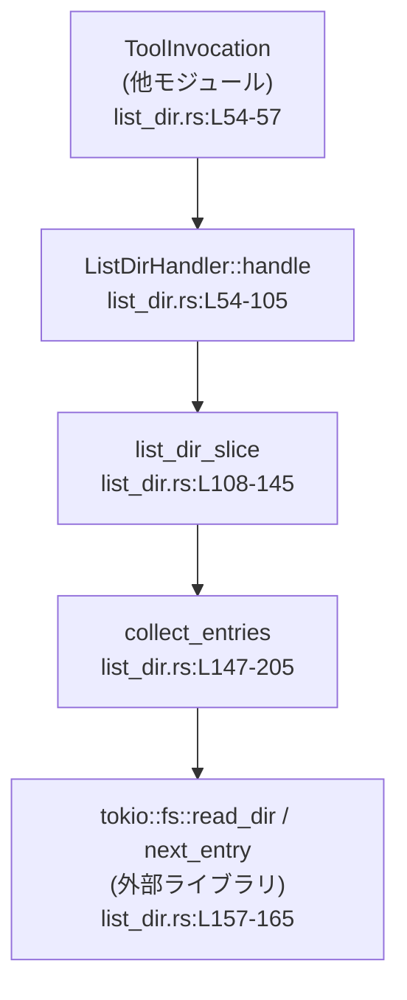
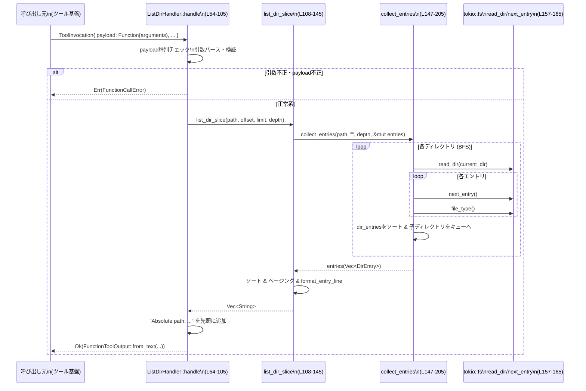

# core/src/tools/handlers/list_dir.rs

## 0. ざっくり一言

ディレクトリパスを受け取り、その配下のファイル・ディレクトリを深さ制限つきで列挙し、ページングして整形テキストとして返すツールハンドラーを実装したモジュールです（`ListDirHandler`）。`tokio::fs` を使った非同期 I/O と、ツール基盤の `ToolHandler` トレイト実装が中心です。  
（根拠: `ListDirHandler` 定義と `impl ToolHandler for ListDirHandler`、`list_dir_slice` の処理内容 `list_dir.rs:L19-105, L108-145`）

---

## 1. このモジュールの役割

### 1.1 概要

- このモジュールは、ツール実行基盤から呼ばれる **ディレクトリ一覧ツール** を実装します。  
  （`impl ToolHandler for ListDirHandler` `list_dir.rs:L47-105`）
- 引数としてディレクトリの絶対パスとページング・深さ設定（`offset`, `limit`, `depth`）を受け取り、その条件に従ってファイルシステムを走査し、テキスト出力を生成します。  
  （`ListDirArgs` と検証ロジック `list_dir.rs:L36-45, L68-91, L100-104`）
- 非同期処理（`async fn handle`, `tokio::fs::read_dir`）により、ブロッキングを避けつつファイルシステムアクセスを行います。  
  （`async fn handle` と `fs::read_dir` の使用 `list_dir.rs:L54, L147-159`）

### 1.2 アーキテクチャ内での位置づけ

このモジュールは、ツール登録基盤（`ToolHandler` / `ToolKind`）とツール呼び出しコンテキスト（`ToolInvocation` / `ToolPayload`）の上に載る **ハンドラー実装** です。内部では `list_dir_slice` → `collect_entries` → `tokio::fs` という呼び出し階層になっています。



- `ToolHandler` / `ToolKind` はツールレジストリ側の API であり、このチャンクには具体定義はありませんが、`ListDirHandler` が「Function 型」のツールとして登録されることが分かります。  
  （`ToolHandler` トレイト実装と `kind()` の返り値 `ToolKind::Function` `list_dir.rs:L47-52`）
- ファイルシステムアクセスは `tokio::fs` を通してのみ行われており、標準の同期 I/O は使っていません。  
  （`use tokio::fs;` と `fs::read_dir` の使用 `list_dir.rs:L9, L157-165`）

### 1.3 設計上のポイント

- **ステートレスなハンドラー**  
  `ListDirHandler` はフィールドを持たない構造体であり、内部状態を保持しません。  
  （`pub struct ListDirHandler;` `list_dir.rs:L19`）

- **引数の型安全なパースとデフォルト値**  
  - Serde の `Deserialize` を使った `ListDirArgs` により、JSON 等の引数を構造体にパースしています。  
    （`#[derive(Deserialize)] struct ListDirArgs` `list_dir.rs:L36-45`）
  - `offset`, `limit`, `depth` には専用のデフォルト関数が設定されています。  
    （`#[serde(default = "default_*")]` `list_dir.rs:L39-44`）

- **事前バリデーションに基づく契約**  
  - `offset`, `limit`, `depth` はすべて 0 より大きい値であることを要求し、違反時には即エラーを返します。  
    （`if offset == 0 { ... }` 等 `list_dir.rs:L75-91`）
  - `dir_path` は絶対パスでなければならないという前提を課しています。  
    （`if !path.is_absolute() { ... }` `list_dir.rs:L93-98`）

- **幅優先探索 (BFS) + 深さ制限**  
  - `VecDeque` のキューでディレクトリを保持し、深さ（`remaining_depth`）が 1 になるまで子ディレクトリをキューに積むことで深さ制限を実装しています。  
    （`queue.push_back(...)` と `while let Some(...) = queue.pop_front()` `list_dir.rs:L153-201`）

- **UTF-8 と文字境界への配慮**  
  - 長いパス/ファイル名は `MAX_ENTRY_LENGTH` を超えた場合に切り詰めますが、`take_bytes_at_char_boundary` により UTF-8 の文字境界を維持するようになっています。  
    （`format_entry_name`, `format_entry_component` `list_dir.rs:L207-214, L216-222`）

- **エラーハンドリング方針**  
  - すべてのエラー（引数不正・I/O エラー・範囲外 offset）は `FunctionCallError::RespondToModel(String)` にマッピングして返しており、パニックは使用していません。  
    （`Err(FunctionCallError::RespondToModel(...))` `list_dir.rs:L60-63, L75-91, L124-127, L157-168`）

- **並行性**  
  - 非同期関数ですが、このモジュール内では同時に複数の I/O を発行する並列化は行っておらず、各ディレクトリを順に読みます。  
    （`collect_entries` 内でループしつつ逐次 `read_dir` / `next_entry` を await `list_dir.rs:L156-165`）
  - ハンドラーはステートレスで、共有可変状態を持たないため、複数タスクから同時に `handle` を呼び出しても、このファイルの範囲では競合状態は生じません。  
    （`ListDirHandler` にフィールドが無く、関数内でのみローカル変数を使用 `list_dir.rs:L19, L54-105`）

---

## 2. 主要な機能一覧

### 2.1 コンポーネント一覧（関数・構造体・列挙体）

| 名称 | 種別 | 公開範囲 | 役割 / 用途 | 定義位置 |
|------|------|----------|-------------|----------|
| `ListDirHandler` | 構造体 | `pub` | ディレクトリ一覧ツールのハンドラー本体。`ToolHandler` を実装する。 | `list_dir.rs:L19` |
| `ListDirArgs` | 構造体 | 非公開 | ハンドラーに渡される引数（パス・offset・limit・depth）を保持。Serde でデシリアライズ。 | `list_dir.rs:L36-45` |
| `DirEntry` | 構造体 | 非公開 | 一覧用の 1 エントリ（ソートキー名、表示名、深さ、種別）を保持。 | `list_dir.rs:L237-243` |
| `DirEntryKind` | 列挙体 | 非公開 | ディレクトリ / ファイル / シンボリックリンク / その他の種別を表現。 | `list_dir.rs:L245-250` |
| `default_offset` | 関数 | 非公開 | `ListDirArgs.offset` のデフォルト値 (1) を返す。 | `list_dir.rs:L24-26` |
| `default_limit` | 関数 | 非公開 | `ListDirArgs.limit` のデフォルト値 (25) を返す。 | `list_dir.rs:L28-30` |
| `default_depth` | 関数 | 非公開 | `ListDirArgs.depth` のデフォルト値 (2) を返す。 | `list_dir.rs:L32-34` |
| `ListDirHandler::kind` | メソッド | 公開 (Trait 実装) | ハンドラーの種別として `ToolKind::Function` を返す。 | `list_dir.rs:L50-52` |
| `ListDirHandler::handle` | `async` メソッド | 公開 (Trait 実装) | 引数をパース・検証し、ディレクトリを走査して `FunctionToolOutput` を返す。 | `list_dir.rs:L54-105` |
| `list_dir_slice` | `async` 関数 | 非公開 | ディレクトリを走査して全エントリを集め、offset/limit で一部だけ整形して返す。 | `list_dir.rs:L108-145` |
| `collect_entries` | `async` 関数 | 非公開 | BFS でディレクトリを深さ制限つきで走査し、`Vec<DirEntry>` に格納する。 | `list_dir.rs:L147-205` |
| `format_entry_name` | 関数 | 非公開 | 相対パスを正規化 (`\`→`/`) し、長さ制限付きのソートキー文字列にする。 | `list_dir.rs:L207-214` |
| `format_entry_component` | 関数 | 非公開 | 単一のファイル名を長さ制限付きの表示用文字列にする。 | `list_dir.rs:L216-222` |
| `format_entry_line` | 関数 | 非公開 | `DirEntry` からインデント + 種別記号付きの 1 行文字列を生成する。 | `list_dir.rs:L225-234` |
| `impl From<&FileType> for DirEntryKind` | トレイト実装 | 非公開 | `std::fs::FileType` から `DirEntryKind` を判別する。 | `list_dir.rs:L253-264` |
| `tests` モジュール | モジュール | 非公開 | テストコードを外部ファイル `list_dir_tests.rs` からインクルードする。 | `list_dir.rs:L267-269` |

### 2.2 主要な機能（概要）

- ディレクトリツリーの列挙（深さ制限付き）  
  BFS により指定ディレクトリ配下を `depth` で制限しつつ走査します。  
  （`collect_entries` のキュー処理 `list_dir.rs:L147-201`）

- エントリのソートとページング  
  収集したエントリをパス文字列でソートし、`offset`（1 始まり）と `limit` に従って一部のみを選択します。  
  （`entries.sort_unstable_by` と offset/limit 処理 `list_dir.rs:L121-132`）

- 種別ごとの表示形式  
  - ディレクトリには末尾 `/`, シンボリックリンクには `@`, その他には `?` を付加して視覚的に区別します。  
    （`format_entry_line` の `match entry.kind` `list_dir.rs:L225-233`）

- 長い名前の安全な切り詰め  
  `MAX_ENTRY_LENGTH` を超える名前は UTF-8 文字境界を維持したまま切り詰めます。  
  （`take_bytes_at_char_boundary` の利用 `list_dir.rs:L207-214, L216-222`）

- エラーの一元化  
  引数不正・ディレクトリアクセスエラー・範囲外 offset はすべて `FunctionCallError::RespondToModel(String)` として返されます。  
  （`Err(FunctionCallError::RespondToModel(...))` 各所 `list_dir.rs:L60-63, L75-91, L124-127, L157-168`）

---

## 3. 公開 API と詳細解説

### 3.1 型一覧（構造体・列挙体など）

| 名前 | 種別 | 役割 / 用途 | 主なフィールド | 根拠 |
|------|------|-------------|----------------|------|
| `ListDirHandler` | 構造体 | ディレクトリ一覧処理を提供するツールハンドラー。`ToolHandler` を実装し、`handle` がエントリポイント。 | フィールドなし（ユニット構造体）。 | `list_dir.rs:L19, L47-105` |
| `ListDirArgs` | 構造体 | ツール呼び出しの引数（ディレクトリパスとページング設定）を保持。Serde でデシリアライズされる。 | `dir_path: String`, `offset: usize`, `limit: usize`, `depth: usize` | `list_dir.rs:L36-45` |
| `DirEntry` | 構造体 | 内部用のディレクトリエントリ表現。ソートキーと表示名・深さ・種別を保持し、整形出力に用いられる。 | `name: String`, `display_name: String`, `depth: usize`, `kind: DirEntryKind` | `list_dir.rs:L237-243` |
| `DirEntryKind` | 列挙体 | エントリの種類（Directory/File/Symlink/Other）を表す。`FileType` から判別される。 | バリアント: `Directory`, `File`, `Symlink`, `Other` | `list_dir.rs:L245-250, L253-264` |

> `ToolInvocation`, `ToolPayload`, `FunctionToolOutput`, `FunctionCallError`, `ToolHandler`, `ToolKind` の定義は他モジュールにあり、このチャンクには現れません。  
> （インポートのみ `list_dir.rs:L11-17`）

### 3.2 関数詳細（重要な 7 件）

#### 3.2.1 `ListDirHandler::handle(&self, invocation: ToolInvocation) -> Result<FunctionToolOutput, FunctionCallError>`（list_dir.rs:L54-105）

**概要**

- ツール基盤からの呼び出しを受け取り、  
  1. ペイロード種別の確認  
  2. 引数のデシリアライズと検証  
  3. ディレクトリ走査の実行  
  4. 結果のテキスト整形  
  を行った上で `FunctionToolOutput` を返します。

**引数**

| 引数名 | 型 | 説明 |
|--------|----|------|
| `self` | `&ListDirHandler` | ステートレスなハンドラーインスタンスです。フィールドは持ちません。 |
| `invocation` | `ToolInvocation` | ツール呼び出しコンテキスト。ここから `ToolPayload` を取り出して引数文字列を取得します。`ToolInvocation` 自体の構造はこのチャンクには現れません。 |

（`handle` のシグネチャと `ToolInvocation { payload, .. }` のパターンマッチ `list_dir.rs:L54-55`）

**戻り値**

- `Ok(FunctionToolOutput)`  
  フォーマット済みテキストを含む出力オブジェクト。生成は `FunctionToolOutput::from_text(output.join("\n"), Some(true))` で行われています。  
  （`list_dir.rs:L100-105`）
- `Err(FunctionCallError)`  
  引数不正・ペイロード種別不正・ファイルシステムエラーなどの場合に返されます。

**内部処理の流れ**

1. `invocation` から `payload` を取り出し、`ToolPayload::Function { arguments }` かどうかを `match` で判定する。  
   対応していないペイロード種別なら即座にエラーを返す。  
   （`list_dir.rs:L55-64`）

2. `parse_arguments(&arguments)` を呼び出し、`ListDirArgs` 構造体にデシリアライズする。  
   この処理は `?` 演算子でエラー伝播されます（詳細は別モジュール）。  
   （`list_dir.rs:L66`）

3. `ListDirArgs` を分解し、`dir_path`, `offset`, `limit`, `depth` の値を取り出す。  
   （`list_dir.rs:L68-73`）

4. `offset`, `limit`, `depth` の値が 0 でないことを検証し、0 の場合はそれぞれ専用メッセージの `FunctionCallError::RespondToModel` を返す。  
   （`list_dir.rs:L75-91`）

5. `PathBuf::from(&dir_path)` でパスに変換し、絶対パスであるかを `path.is_absolute()` で検証する。絶対パスでない場合はエラー。  
   （`list_dir.rs:L93-98`）

6. `list_dir_slice(&path, offset, limit, depth).await?` を呼び出し、ディレクトリ走査と整形済み行のリストを取得する。  
   （`list_dir.rs:L100`）

7. 出力用の `Vec<String>` を作成し、先頭に `"Absolute path: {path}"` の 1 行を追加、続いてエントリ行を追加する。  
   （`list_dir.rs:L101-103`）

8. `FunctionToolOutput::from_text` で 1 つのテキストに結合し、`Ok` で返す。  
   （`list_dir.rs:L104-105`）

**Examples（使用例）**

以下は概念的な使用例です。`ToolInvocation` や `FunctionToolOutput` の詳細な構造はこのチャンクにはないため、省略しています。

```rust
// ハンドラーのインスタンスを用意する
let handler = ListDirHandler; // list_dir.rs:L19

// ツール呼び出し用の引数文字列（JSON など）を用意する
let arguments = r#"{
    "dir_path": "/tmp",
    "offset": 1,
    "limit": 10,
    "depth": 2
}"#.to_string();

// ToolInvocation は他モジュールで定義されているため、ここでは概念的に示します
let invocation: ToolInvocation = ToolInvocation {
    payload: ToolPayload::Function { arguments }, // list_dir.rs:L57-58
    // その他のフィールドはこのチャンクには現れません
};

// 非同期コンテキストでハンドラーを呼び出す
let output: FunctionToolOutput = handler.handle(invocation).await?;
// output の具体的な扱い方は FunctionToolOutput の定義に依存し、このチャンクからは分かりません。
```

**Errors / Panics**

`handle` から `Err(FunctionCallError)` が返る条件:

- `payload` が `ToolPayload::Function { .. }` 以外である場合。  
  メッセージ: `"list_dir handler received unsupported payload"`  
  （`list_dir.rs:L57-63`）
- `parse_arguments` が失敗した場合（例: JSON 形式不正・型不一致）。  
  この関数の詳細はこのチャンクにはありませんが、`?` 演算子でエラーがそのまま伝播されます。  
  （`list_dir.rs:L66`）
- `offset == 0` の場合。  
  メッセージ: `"offset must be a 1-indexed entry number"`  
  （`list_dir.rs:L75-79`）
- `limit == 0` の場合。  
  メッセージ: `"limit must be greater than zero"`  
  （`list_dir.rs:L81-85`）
- `depth == 0` の場合。  
  メッセージ: `"depth must be greater than zero"`  
  （`list_dir.rs:L87-91`）
- `dir_path` が絶対パスでない場合。  
  メッセージ: `"dir_path must be an absolute path"`  
  （`list_dir.rs:L93-98`）
- `list_dir_slice` 内で発生したエラー（offset がエントリ数を超える、もしくは I/O エラーなど）。  
  （`list_dir_slice` のエラー処理参照 `list_dir.rs:L124-127, L147-168`）

パニックを誘発するコード（`unwrap` や `panic!`）はこのモジュール内にはありません。

**Edge cases（エッジケース）**

- `dir_path` が存在しないディレクトリの場合  
  - `collect_entries` 内の `fs::read_dir` がエラーとなり、`"failed to read directory: {err}"` のメッセージで `FunctionCallError::RespondToModel` が返ります。  
    （`list_dir.rs:L157-159`）
- 対象ディレクトリが空の場合  
  - `list_dir_slice` から空の `Vec<String>` が返り、`Absolute path: ...` の 1 行だけを含む出力になります。  
    （`entries.is_empty()` チェック `list_dir.rs:L117-119`）
- 非 UTF-8 なファイル名を含むディレクトリ  
  - `to_string_lossy()` により不正なバイト列は置換されます。文字化けはあり得ますが、パニックは発生しません。  
    （`format_entry_name`, `format_entry_component` `list_dir.rs:L207-214, L216-222`）

**使用上の注意点**

- `offset` は **1 始まり** であることが契約になっています（0 はエラー）。  
  別の部分で 0 始まりを前提にしていると齟齬が出ます。
- `dir_path` は絶対パスである必要があります。呼び出し側で相対パスを渡さないようにする契約が必要です。
- 非同期関数なので、呼び出し側は `tokio` などの非同期ランタイム上で `.await` する必要があります。
- 非常に大きなディレクトリツリーに対しても全エントリを一度 `Vec` に集める設計のため、メモリ使用量と処理時間に注意が必要です（詳細は `list_dir_slice` / `collect_entries` 参照）。

---

#### 3.2.2 `list_dir_slice(path: &Path, offset: usize, limit: usize, depth: usize) -> Result<Vec<String>, FunctionCallError>`（list_dir.rs:L108-145）

**概要**

指定ディレクトリを深さ制限付きで走査し、全エントリをソートした上で、`offset` と `limit` に基づいて一部のみを整形済み行として返します。

**引数**

| 引数名 | 型 | 説明 |
|--------|----|------|
| `path` | `&Path` | 絶対パスであることが `handle` 側で保証されたディレクトリパス。 |
| `offset` | `usize` | 1 始まりのエントリ位置。ここから `limit` 件分を返します。 |
| `limit` | `usize` | 返却する最大エントリ数。 |
| `depth` | `usize` | 探索するディレクトリ階層の最大深さ。`collect_entries` にそのまま渡されます。 |

（`list_dir.rs:L108-113`）

**戻り値**

- `Ok(Vec<String>)`  
  ページングされたエントリを 1 行ずつ格納したベクタ。  
  `format_entry_line` によってインデント・種別記号付きの文字列になっています。  
  （`list_dir.rs:L134-138`）
- `Err(FunctionCallError)`  
  I/O エラー、あるいは `offset` がエントリ数を超える場合などに返されます。

**内部処理の流れ**

1. `entries: Vec<DirEntry>` を作成し、`collect_entries(path, Path::new(""), depth, &mut entries).await?` でエントリを収集する。  
   相対パスのプレフィックスは最初は空です。  
   （`list_dir.rs:L114-116`）

2. エントリが 1 件もなければ空の `Vec<String>` を返す。  
   （`list_dir.rs:L117-119`）

3. `entries.sort_unstable_by(|a, b| a.name.cmp(&b.name))` でソートキー `name` に基づきソートする。  
   `name` は `format_entry_name` で生成された正規化済みパス文字列です。  
   （`list_dir.rs:L121, L185-187, L207-214`）

4. `start_index = offset - 1` を算出し、エントリ数以上であれば `"offset exceeds directory entry count"` エラーを返す。  
   （`list_dir.rs:L123-128`）

5. `remaining_entries` と `capped_limit = limit.min(remaining_entries)` から `end_index` を計算し、`entries[start_index..end_index]` のスライスを取得。  
   （`list_dir.rs:L130-133`）

6. スライスされた各 `DirEntry` に対し、`format_entry_line(entry)` を呼んで `Vec<String>` に詰める。  
   （`list_dir.rs:L134-138, L225-234`）

7. `end_index < entries.len()`（＝まだ未表示エントリがある）場合には、`"More than {capped_limit} entries found"` の 1 行を末尾に追加する。  
   （`list_dir.rs:L140-142`）

8. `Ok(formatted)` を返す。  
   （`list_dir.rs:L144`）

**Errors / Panics**

- `collect_entries` 内部の `read_dir` / `next_entry` / `file_type` の I/O エラーはすべて `"failed to read directory"` / `"failed to inspect entry"` メッセージで `RespondToModel` に変換され、`?` によって伝播します。  
  （`list_dir.rs:L115, L157-168`）
- `offset` が全エントリ数より大きい場合  
  - エラー: `"offset exceeds directory entry count"`  
    （`list_dir.rs:L123-127`）

**Edge cases**

- `entries` が 0 件の場合  
  - 即座に `Ok(Vec::new())` を返し、その後のソート・ページング処理は行いません。  
    （`list_dir.rs:L117-119`）
- `limit` が残りエントリ数より大きい場合  
  - `capped_limit` により自動的に切り詰められ、存在する分だけ返します。  
    （`list_dir.rs:L130-132`）
- `offset == 1` の場合  
  - 先頭から `limit` 件を返します。`offset == 0` は `handle` 側で既に弾かれているため、ここには到達しません。  
    （`list_dir.rs:L75-79`）

**使用上の注意点**

- `offset`, `limit`, `depth` のバリデーションは呼び出し元 (`handle`) が行う前提であり、この関数自体は `offset >= 1` を仮定した実装になっています（`offset - 1` を素直に計算）。  
- 全エントリを `entries` に格納してからスライスを取るため、非常に大きなディレクトリツリーではメモリ消費が大きくなります。  
  「先頭から少しだけ見たい」用途でも全件走査が必要になる点に留意が必要です。

---

#### 3.2.3 `collect_entries(dir_path: &Path, relative_prefix: &Path, depth: usize, entries: &mut Vec<DirEntry>) -> Result<(), FunctionCallError>`（list_dir.rs:L147-205）

**概要**

指定ディレクトリを起点に、幅優先探索 (BFS) で配下のディレクトリを深さ制限付きで巡回し、各エントリを `DirEntry` として `entries` ベクタに蓄積する非同期関数です。

**引数**

| 引数名 | 型 | 説明 |
|--------|----|------|
| `dir_path` | `&Path` | 起点となるディレクトリの絶対パス。 |
| `relative_prefix` | `&Path` | `dir_path` からの相対パスのプレフィックス。最初は空パス (`Path::new("")`) が渡されます。 |
| `depth` | `usize` | 初期の最大探索深さ。内部では `remaining_depth` として減算しながら使用します。 |
| `entries` | `&mut Vec<DirEntry>` | 走査結果を格納するベクタ。呼び出し元で作成・共有されます。 |

（`list_dir.rs:L147-152, L114-116`）

**戻り値**

- `Ok(())`  
  すべてのディレクトリ走査が成功した場合。
- `Err(FunctionCallError)`  
  ディレクトリの読み取りやエントリ種別取得で I/O エラーが起きた場合など。

**内部処理の流れ**

1. `VecDeque` を使って BFS 用のキュー `queue` を作成し、 `(dir_path.to_path_buf(), relative_prefix.to_path_buf(), depth)` を最初の要素として `push_back`。  
   （`list_dir.rs:L153-155`）

2. `while let Some((current_dir, prefix, remaining_depth)) = queue.pop_front()` でキューからディレクトリを 1 件ずつ取り出し処理する。  
   （`list_dir.rs:L156`）

3. `tokio::fs::read_dir(&current_dir).await` でディレクトリハンドルを取得。失敗した場合は `"failed to read directory: {err}"` メッセージのエラーに変換。  
   （`list_dir.rs:L157-159`）

4. `while let Some(entry) = read_dir.next_entry().await?...` でディレクトリ内の各エントリに対して:
   - `entry.file_type().await` で `FileType` を取得。失敗時は `"failed to inspect entry: {err}"` エラー。  
     （`list_dir.rs:L163-168`）
   - `entry.file_name()` からファイル名を取得し、`prefix` が空かどうかで `relative_path` を決定。  
     （`list_dir.rs:L170-175`）
   - `format_entry_component(&file_name)` で表示名を生成。  
     （`list_dir.rs:L177, L216-222`）
   - `prefix.components().count()` を `display_depth` として格納（インデント幅の計算に利用）。  
     （`list_dir.rs:L178, L225-227`）
   - `format_entry_name(&relative_path)` でソートキー用の `name` を生成。  
     （`list_dir.rs:L179, L207-214`）
   - `DirEntryKind::from(&file_type)` で種別を決定。  
     （`list_dir.rs:L180, L253-264`）
   - 上記情報をまとめて `DirEntry` を構築し、`dir_entries` ベクタに一時的に格納。  
     （`list_dir.rs:L181-191`）

5. `dir_entries.sort_unstable_by(|a, b| a.3.name.cmp(&b.3.name))` で、現在処理中ディレクトリ内のエントリを名前順にソート。  
   （`list_dir.rs:L194`）

6. ソートされた `dir_entries` を順に処理し、
   - 種別が `Directory` かつ `remaining_depth > 1` なら、子ディレクトリを `(entry_path, relative_path, remaining_depth - 1)` としてキューに追加。  
     （`list_dir.rs:L196-199`）
   - `entries.push(dir_entry)` で外部から渡された `entries` ベクタに追加する。  
     （`list_dir.rs:L200-201`）

7. キューが空になるまで 2〜6 を繰り返し、最終的に `Ok(())` を返す。  
   （`list_dir.rs:L156, L204`）

**Errors / Panics**

- `fs::read_dir` の失敗  
  `"failed to read directory: {err}"` として `FunctionCallError::RespondToModel`。  
  （`list_dir.rs:L157-159`）
- `read_dir.next_entry()` の失敗  
  同じく `"failed to read directory: {err}"`。  
  （`list_dir.rs:L163-165`）
- `entry.file_type()` の失敗  
  `"failed to inspect entry: {err}"`。  
  （`list_dir.rs:L166-168`）

**Edge cases**

- `depth == 1` のとき  
  - 起点ディレクトリの中身は列挙されますが、サブディレクトリの中には潜りません。  
    条件 `kind == DirEntryKind::Directory && remaining_depth > 1` により、`remaining_depth == 1` のときは子ディレクトリをキューに追加しないためです。  
    （`list_dir.rs:L197-199`）
- シンボリックリンク  
  - `DirEntryKind::from(&file_type)` は `file_type.is_symlink()` を優先してシンボリックリンクを判定しているため、シンボリックリンクのディレクトリには潜りません（`Directory` ではなく `Symlink` として扱う）。  
    （`list_dir.rs:L253-259`）
- 非 UTF-8 名を含むパス  
  - `format_entry_component` / `format_entry_name` が `to_string_lossy()` を使用するため、不可視文字は置換されますが処理は継続します。  

**使用上の注意点**

- この関数は `entries` を破壊的に変更し、引数として渡されたベクタに対して追記を行います。呼び出し前にベクタを初期化しておくことが前提です。  
  （`let mut entries = Vec::new(); collect_entries(..., &mut entries).await?;` `list_dir.rs:L114-116`）
- BFS であるため、ツリー構造によっては浅い階層のディレクトリが先に処理されますが、最終的なエントリの順序は `list_dir_slice` 側のソートで決まるため、BFS の順序は最終表示順には影響しません。
- キューにはディレクトリパスを `PathBuf` として格納しており、非常に深いツリーでもスタックオーバーフローは起きにくい設計ですが、ノード数が多い場合はメモリ消費と I/O 負荷に注意が必要です。

---

#### 3.2.4 `format_entry_line(entry: &DirEntry) -> String`（list_dir.rs:L225-234）

**概要**

1 つの `DirEntry` を、インデントと種別記号を付与した 1 行のテキストに変換します。

**引数**

| 引数名 | 型 | 説明 |
|--------|----|------|
| `entry` | `&DirEntry` | 表示対象エントリ。`depth` と `kind` がインデントと種別記号に使用されます。 |

（`list_dir.rs:L225-229`）

**戻り値**

- `String`  
  例えばディレクトリなら `"  subdir/"` のような形式です（インデントはスペース）。

**内部処理の流れ**

1. インデント文字列 `indent` を、`entry.depth * INDENTATION_SPACES` 個のスペースで生成。  
   （`list_dir.rs:L226-227`）
2. `entry.display_name` を `name` としてクローン。  
   （`list_dir.rs:L227`）
3. `entry.kind` によって末尾に `/`, `@`, `?` を付与（`File` の場合は何も付けない）。  
   （`list_dir.rs:L228-233`）
4. `format!("{indent}{name}")` でインデントと名前を結合し返す。  
   （`list_dir.rs:L234`）

**Edge cases**

- `depth == 0` の場合  
  - インデントは空文字列となり、名前のみが表示されます。  
    （`" ".repeat(0) == ""` `list_dir.rs:L226`）
- `DirEntryKind::Other` の場合  
  - ユーザーには `?` が付いた名前として表示され、種別不明であることが分かるようになっています。  
    （`list_dir.rs:L231-232`）

**使用上の注意点**

- `depth` は `collect_entries` が `prefix.components().count()` から算出しており、パスの区切り数（階層）に対応します。  
  同じ深さのエントリは同じインデント幅になります。  
  （`list_dir.rs:L178-179`）

---

#### 3.2.5 `format_entry_name(path: &Path) -> String`（list_dir.rs:L207-214）

**概要**

内部ソート用の名前として、相対パスを `/` 区切りに正規化し、必要に応じて `MAX_ENTRY_LENGTH` バイトまでに切り詰めた文字列を生成します。

**引数**

| 引数名 | 型 | 説明 |
|--------|----|------|
| `path` | `&Path` | 起点ディレクトリからの相対パス。 |

**戻り値**

- `String`  
  - `path.to_string_lossy().replace("\\", "/")` を基にした文字列。
  - 長さが `MAX_ENTRY_LENGTH` を超える場合は、`take_bytes_at_char_boundary` により UTF-8 文字境界で切り詰められます。  
    （`list_dir.rs:L208-213`）

**内部処理の流れ**

1. `path.to_string_lossy()` でパスを文字列化（非 UTF-8 部分は置換）。  
2. `replace("\\", "/")` で区切り文字を `/` に統一。  
   （特に Windows 環境を意識した正規化と考えられますが、意図の詳細はコードからは断定できません。）  
3. 長さが `MAX_ENTRY_LENGTH` を超えていれば `take_bytes_at_char_boundary(&normalized, MAX_ENTRY_LENGTH)` で切り詰め、`to_string()` して返す。  
   そうでなければそのまま返す。

**使用上の注意点**

- 切り詰め単位は**文字数ではなくバイト数**ですが、`take_bytes_at_char_boundary` により文字境界を守ることで文字化けやパニックを防いでいます。  
  （`list_dir.rs:L207-213`）
- この値はソートキーとして使用されるため、同じディレクトリ内のエントリの並び順に影響します。

---

#### 3.2.6 `format_entry_component(name: &OsStr) -> String`（list_dir.rs:L216-222）

**概要**

単一のファイル名（`OsStr`）を表示用文字列に変換し、必要に応じて長さを `MAX_ENTRY_LENGTH` までに切り詰めます。

**引数**

| 引数名 | 型 | 説明 |
|--------|----|------|
| `name` | `&OsStr` | ファイル名やディレクトリ名。 |

**戻り値**

- `String`  
  `to_string_lossy()` の結果を、`MAX_ENTRY_LENGTH` バイトを上限として切り詰めた文字列。

**内部処理の流れ**

1. `let normalized = name.to_string_lossy();` でファイル名を文字列に変換。  
   （`list_dir.rs:L217`）
2. 長さが `MAX_ENTRY_LENGTH` を超えていれば `take_bytes_at_char_boundary(&normalized, MAX_ENTRY_LENGTH)` で切り詰める。  
   そうでなければ `normalized.to_string()` を返す。  
   （`list_dir.rs:L218-222`）

**使用上の注意点**

- 非 UTF-8 名を含むファイルも `to_string_lossy()` によって安全に処理されますが、置換文字が入るため表示が完全には正確でない場合があります。
- 表示名は `format_entry_line` でそのまま利用されるため、ユーザーが目にする文字列です。

---

#### 3.2.7 `impl From<&FileType> for DirEntryKind`（list_dir.rs:L253-264）

**概要**

`std::fs::FileType` から `DirEntryKind` を決定する変換ロジックです。

**内部処理の流れ**

1. `file_type.is_symlink()` を最優先でチェックし、`true` なら `DirEntryKind::Symlink`。  
2. 次に `file_type.is_dir()` なら `DirEntryKind::Directory`。  
3. 次に `file_type.is_file()` なら `DirEntryKind::File`。  
4. いずれにも該当しなければ `DirEntryKind::Other`。  
   （`list_dir.rs:L254-262`）

**使用上の注意点**

- シンボリックリンクに対して `is_dir()` ではなく `is_symlink()` が優先されているため、ディレクトリへのシンボリックリンクも `Symlink` として扱われます。  
  これは `collect_entries` がシンボリックリンクを辿らないようにする効果があります。  
  （`kind == DirEntryKind::Directory` の場合のみディレクトリをキュー追加 `list_dir.rs:L197-199`）

---

### 3.3 その他の関数

| 関数名 | 役割（1 行） | 根拠 |
|--------|--------------|------|
| `default_offset() -> usize` | `ListDirArgs.offset` のデフォルト値として 1 を返す。 | `list_dir.rs:L24-26, L39` |
| `default_limit() -> usize` | `ListDirArgs.limit` のデフォルト値として 25 を返す。 | `list_dir.rs:L28-30, L41` |
| `default_depth() -> usize` | `ListDirArgs.depth` のデフォルト値として 2 を返す。 | `list_dir.rs:L32-34, L43` |

---

## 4. データフロー

代表的なシナリオとして、ツール基盤から `ListDirHandler` が呼び出され、ディレクトリを走査してテキストを返すまでの流れを示します。

### 4.1 処理の流れ（概要）

1. ツール基盤が `ToolInvocation` を構築し、`payload` に `ToolPayload::Function { arguments }` を設定して `ListDirHandler::handle` を呼び出します。  
   （`list_dir.rs:L54-59`）
2. `handle` が引数の検証を行い、問題がなければ `list_dir_slice` を呼び出します。  
   （`list_dir.rs:L66-91, L100`）
3. `list_dir_slice` は `collect_entries` で `Vec<DirEntry>` を構築し、ソート・ページング・整形を行います。  
   （`list_dir.rs:L114-145`）
4. `collect_entries` は `tokio::fs::read_dir` と `next_entry` を通じてディレクトリの内容を非同期に列挙します。  
   （`list_dir.rs:L157-165`）
5. 最終的に `FunctionToolOutput` が返され、上位層でモデルへのレスポンスなどに利用されます。  
   （`list_dir.rs:L104-105`）

### 4.2 シーケンス図



---

## 5. 使い方（How to Use）

### 5.1 基本的な使用方法

このモジュールは通常、ツールレジストリを通じて使用されると考えられますが（詳細はこのチャンクにはありません）、概念的な単体利用例を示します。

```rust
use core::tools::handlers::list_dir::ListDirHandler;            // ハンドラー型をインポート（パスは例示）
use crate::tools::context::{ToolInvocation, ToolPayload};       // 呼び出しコンテキスト（定義は別モジュール）
use crate::function_tool::FunctionCallError;                    // エラー型（別モジュール）

#[tokio::main]                                                  // tokio ランタイムで実行
async fn main() -> Result<(), FunctionCallError> {
    let handler = ListDirHandler;                               // ステートレスなハンドラーを生成（list_dir.rs:L19）

    // JSON 形式の引数。ListDirArgs に対応するキーを含める（list_dir.rs:L36-45）
    let arguments = r#"{
        "dir_path": "/tmp",
        "offset": 1,
        "limit": 10,
        "depth": 2
    }"#.to_string();

    // ToolInvocation の完全な構造はこのチャンクにはないため、概念的に示す
    let invocation = ToolInvocation {
        payload: ToolPayload::Function { arguments },           // list_dir.rs:L57-58
        // 他のフィールドはツール基盤側の定義に依存する
    };

    let output = handler.handle(invocation).await?;             // list_dir.rs:L54-105

    // FunctionToolOutput の具体的な API はこのチャンクにはない
    // ここではデバッグ出力などで確認するといった利用が想定されます
    // println!("{output:?}");

    Ok(())
}
```

> `ToolInvocation` や `FunctionToolOutput` の構造、`ToolHandler` の登録方法などは他ファイルに依存し、このチャンクからは分かりません。

### 5.2 よくある使用パターン

- **ページングしてディレクトリを閲覧する**

  - 最初の 25 件を見る: `offset=1, limit=25`（`limit` はデフォルト 25）。  
  - 次のページを見る: `offset=26, limit=25`。  
  （`default_limit` と `offset` の契約 `list_dir.rs:L24-30, L75-79`）

- **深さを制限して上位階層のみを確認する**

  - `depth=1`: 直下のみ。サブディレクトリ内には入らない。  
  - `depth=2`（デフォルト）: 直下と、その 1 階層下まで。  
  （`default_depth` と `remaining_depth > 1` 条件 `list_dir.rs:L32-34, L197-199`）

### 5.3 よくある間違い

```rust
// 間違い例: offset を 0 にしてしまう
let arguments = r#"{
    "dir_path": "/tmp",
    "offset": 0,       // 0 は許容されない
    "limit": 10,
    "depth": 2
}"#;

// -> handle 内のチェックで
// "offset must be a 1-indexed entry number" エラーになる（list_dir.rs:L75-79）

// 正しい例: offset は 1 以上にする
let arguments = r#"{
    "dir_path": "/tmp",
    "offset": 1,
    "limit": 10,
    "depth": 2
}"#;
```

```rust
// 間違い例: 相対パスを渡してしまう
let arguments = r#"{
    "dir_path": "relative/path",  // 絶対パスでない
    "offset": 1,
    "limit": 10,
    "depth": 2
}"#;

// -> "dir_path must be an absolute path" エラー（list_dir.rs:L93-98）
```

### 5.4 使用上の注意点（まとめ）

- **契約事項**
  - `offset`, `limit`, `depth` はすべて 1 以上である必要があります。  
    （`list_dir.rs:L75-91`）
  - `dir_path` は絶対パスであり、存在するディレクトリであることが望ましいです（存在しない場合は I/O エラー）。  
    （`list_dir.rs:L93-98, L157-159`）

- **エラーと安全性**
  - I/O エラーや引数不正はすべて `FunctionCallError::RespondToModel(String)` として扱われ、パニックを起こさない設計になっています。  
    （`list_dir.rs:L60-63, L75-91, L124-127, L157-168`）
  - シンボリックリンクは辿らないため、循環リンクによる無限再帰のような問題は避けられています。  
    （`DirEntryKind::Symlink` と `collect_entries` の条件 `list_dir.rs:L253-259, L197-199`）

- **並行性**
  - ステートレスで共有可変状態がないため、多数のタスクから同時に呼び出しても、このファイルの範囲ではデータ競合は発生しません。

- **性能・スケーラビリティ上の注意**
  - `collect_entries` は `depth` までの全エントリを `Vec<DirEntry>` に溜めてからページングするため、エントリ数が膨大なディレクトリに対してはメモリと時間のコストが高くなります。  
    （`list_dir.rs:L114-116, L121-133`）

- **セキュリティ面の注意（このモジュールから読み取れる範囲）**
  - このモジュール自身はパスの「絶対/相対」以外の制約を設けておらず、どの絶対パスでも受け入れます。  
    サンドボックス範囲や許可ディレクトリの制御は、より上位のレイヤー（ツール基盤や呼び出し側）で行う必要があります。  
    （`list_dir.rs:L93-98`）

---

## 6. 変更の仕方（How to Modify）

### 6.1 新しい機能を追加する場合

例: エントリ数の合計をヘッダに表示したい、ファイルサイズを表示したい、など。

1. **データ拡張の検討**
   - エントリ単位の追加情報（例: ファイルサイズ）を扱いたい場合は、`DirEntry` にフィールドを追加するのが自然です。  
     （`struct DirEntry` 定義 `list_dir.rs:L237-243`）
   - それに伴い、`collect_entries` 内で `DirEntry` を構築する箇所に必要な情報の取得処理を追加します。  
     （`list_dir.rs:L181-191`）

2. **表示形式の変更**
   - 表示行の変更は `format_entry_line` を中心に行います。インデントや種別記号の追加・変更もここで完結します。  
     （`list_dir.rs:L225-234`）

3. **ヘッダやフッタの拡張**
   - 出力テキスト全体の先頭・末尾に情報を追加したい場合は、`handle` で `output` ベクタを構築する部分を修正します。  
     （`list_dir.rs:L100-104`）

4. **引数の追加**
   - 新しい引数（例えば「ファイルのみを表示するフラグ」）が必要な場合は `ListDirArgs` にフィールドを追加し、`ListDirHandler::handle` 内のパラメータ検証・`collect_entries` 呼び出しに反映させます。  
     （`list_dir.rs:L36-45, L68-73`）

### 6.2 既存の機能を変更する場合

- **影響範囲の確認**
  - 列挙ロジックに変更を加える場合は、`list_dir_slice` と `collect_entries` の両方を確認する必要があります。  
    - 収集ロジック: `collect_entries`（`list_dir.rs:L147-205`）  
    - ページング・ソート・整形ロジック: `list_dir_slice`（`list_dir.rs:L108-145`）
  - 表示フォーマット変更は `format_entry_line` および `format_entry_*` の関数に集中しています。  
    （`list_dir.rs:L207-214, L216-222, L225-234`）

- **契約（前提条件・返り値）の維持**
  - `offset` が 1 始まりであること、`dir_path` が絶対パスであることなどの契約は、既存の呼び出し側コードが依存している可能性が高いため、変更する場合は上位との整合性確認が必要です。  
    （`list_dir.rs:L75-79, L93-98`）
  - エラーがすべて `FunctionCallError::RespondToModel(String)` にマッピングされている点も、エラーハンドリングの前提になっていると考えられます。  
    （`list_dir.rs:L60-63, L157-168`）

- **テストと利用箇所の確認**
  - このモジュールには `tests` モジュールがあり、`list_dir_tests.rs` にテストが存在します。変更時はこのテストケースの修正・追加が必要になると考えられます。  
    （`list_dir.rs:L267-269`）
  - また、`ToolHandler` 実装を利用するツールレジストリ側のコードも影響を受ける可能性がありますが、そのコードはこのチャンクには現れません。

---

## 7. 関連ファイル

| パス（推定） | 役割 / 関係 |
|-------------|------------|
| `core/src/tools/handlers/list_dir.rs` | 本モジュール。ディレクトリ一覧ツールハンドラーの実装。 |
| `core/src/tools/handlers/list_dir_tests.rs` | テストコード。`#[path = "list_dir_tests.rs"]` により、このモジュールに紐付けられています。`list_dir.rs:L267-269` |
| `core/src/tools/handlers/mod.rs` など | `ListDirHandler` を外部に公開したり、ツールレジストリへ登録するモジュールである可能性がありますが、このチャンクには現れません。 |
| `core/src/tools/registry.rs` 等 | `ToolHandler`, `ToolKind` の定義、ツール登録ロジックを含むと推測されますが、具体的な内容はこのチャンクからは不明です。`list_dir.rs:L16-17` |
| `core/src/tools/context.rs` 等 | `ToolInvocation`, `ToolPayload`, `FunctionToolOutput` の定義を含むコンテキストモジュール。`list_dir.rs:L12-14` |
| `core/src/function_tool.rs` | `FunctionCallError` の定義を含むモジュール。`list_dir.rs:L11` |

> 上記のうち、`list_dir_tests.rs` 以外のファイルパスは `use crate::...` から推定しています。実際のディレクトリ構成は本チャンクだけからは完全には確定できません。
