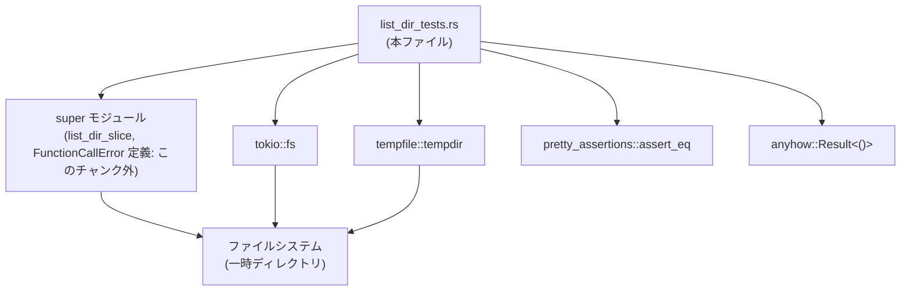
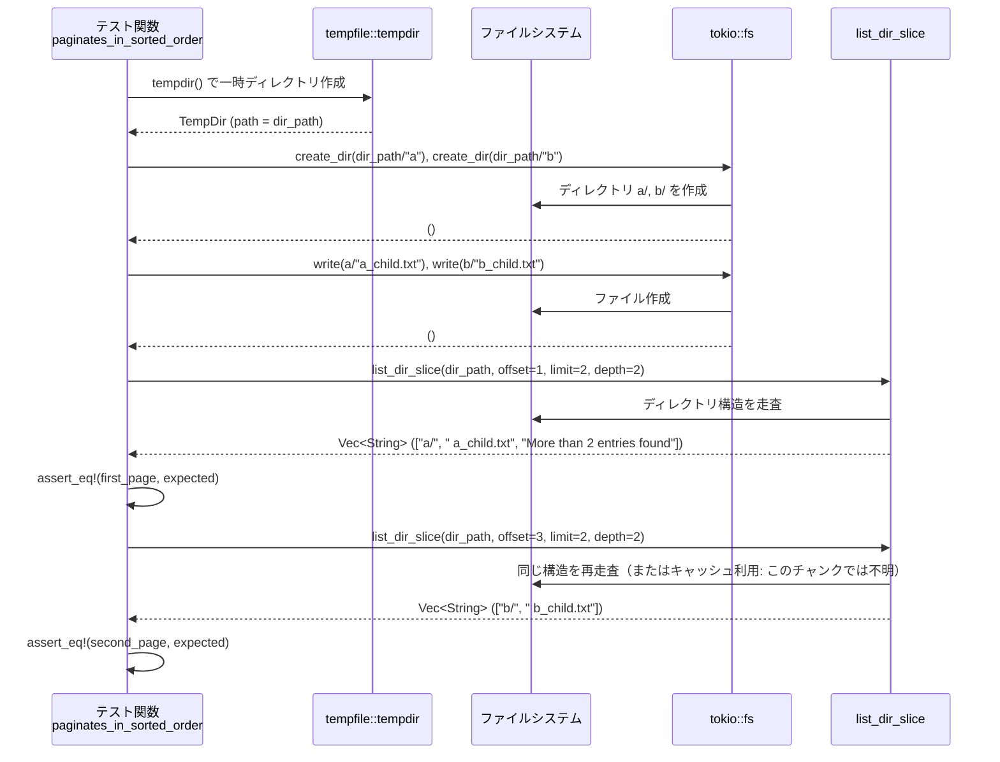

# core/src/tools/handlers/list_dir_tests.rs コード解説

## 0. ざっくり一言

`list_dir_slice` 関数の挙動（ディレクトリ一覧の取得・ソート・ページング・深さ制限・シンボリックリンク表示・トランケーション通知）を、Tokio の非同期 I/O と一時ディレクトリを使って検証するテストモジュールです（list_dir_tests.rs:L5-L260）。

---

## 1. このモジュールの役割

### 1.1 概要

- このモジュールは、上位モジュールに定義されているとみられる `list_dir_slice` 関数の**外部仕様**をテストで固定する役割を持ちます（`use super::*;` より, list_dir_tests.rs:L1）。
- 具体的には、以下の点を検証しています。
  - ディレクトリ階層とシンボリックリンクを含む**一覧結果のフォーマット**（list_dir_tests.rs:L5-L63）。
  - `offset` / `limit` / `depth` 引数による**ページングと再帰深さの制御**（list_dir_tests.rs:L65-L142, L144-L207）。
  - `limit` 超過時の**サマリ行 `"More than {limit} entries found"` の付与**と、そのソート順保持（list_dir_tests.rs:L144-L184, L209-L231, L233-L259）。
  - `offset` がエントリ数を超えた場合の**エラーの扱い**（list_dir_tests.rs:L65-L82）。

### 1.2 アーキテクチャ内での位置づけ

`list_dir_slice` の実装はこのファイルには含まれておらず、`super` モジュール側にあります（list_dir_tests.rs:L1）。このテストは Tokio ランタイムとファイルシステムを組み合わせた「外部からの利用シナリオ」を通じて、ハンドラ層のユーティリティ関数を検証しています。



### 1.3 設計上のポイント（テストコードから読み取れる範囲）

- **完全に分離されたテスト環境**
  - 各テストは `tempfile::tempdir()` により固有の一時ディレクトリを作成し（list_dir_tests.rs:L7, L67, L86, L146, L188, L211, L235）、ファイルシステム状態の相互干渉を避けています。
- **Tokio ベースの非同期テスト**
  - すべてのテスト関数は `#[tokio::test] async fn` として定義されており、`tokio::fs` の非同期 I/O を利用しています（list_dir_tests.rs:L5, L65, L84, L144, L186, L209, L233）。
- **プラットフォーム依存挙動の分離**
  - Unix のみでシンボリックリンクを作成し、期待値も `#[cfg(unix)]` / `#[cfg(not(unix))]` で分岐して検証しています（list_dir_tests.rs:L30-L35, L43-L60）。
- **エラー契約の明示**
  - `offset` がエントリ数を超えた場合に `FunctionCallError::RespondToModel("offset exceeds directory entry count")` を返すことを明示的に検証しています（list_dir_tests.rs:L73-L81）。
- **トランケーションの扱いを API の一部として固定**
  - 結果が `limit` を超える場合、最後の要素として `"More than {limit} entries found"` という文字列を追加する契約がテストで固定されています（list_dir_tests.rs:L166-L173, L221-L230, L245-L256）。

---

## 2. 主要な機能一覧 & コンポーネントインベントリー

### 2.1 関数インベントリー（このファイル内）

| 名前 | 種別 | 役割 | 行範囲 |
|------|------|------|--------|
| `lists_directory_entries` | 非公開・非同期テスト関数 | ディレクトリ・サブディレクトリ・シンボリックリンクを含む基本的な一覧表示フォーマットを検証する | list_dir_tests.rs:L5-L63 |
| `errors_when_offset_exceeds_entries` | 非公開・非同期テスト関数 | `offset` がエントリ数を超えたときのエラーを検証する | list_dir_tests.rs:L65-L82 |
| `respects_depth_parameter` | 非公開・非同期テスト関数 | `depth` パラメータによる再帰深さの制限と表示順を検証する | list_dir_tests.rs:L84-L142 |
| `paginates_in_sorted_order` | 非公開・非同期テスト関数 | ソートされた順序を保ったまま `offset`/`limit` でページングされることを検証する | list_dir_tests.rs:L144-L184 |
| `handles_large_limit_without_overflow` | 非公開・非同期テスト関数 | `limit = usize::MAX` 指定時に内部で整数オーバーフローせず、正しく末尾まで取得できることを検証する | list_dir_tests.rs:L186-L207 |
| `indicates_truncated_results` | 非公開・非同期テスト関数 | 結果が `limit` を超えた場合にサマリ行が 1 行追加されることを検証する | list_dir_tests.rs:L209-L231 |
| `truncation_respects_sorted_order` | 非公開・非同期テスト関数 | トランケーションが行われた場合でも、返されたエントリ部分のソート順が保たれることを検証する | list_dir_tests.rs:L233-L259 |

### 2.2 このファイルから見える外部コンポーネント

| 名前 | 種別 | 役割 | 使用箇所 |
|------|------|------|----------|
| `list_dir_slice` | 非同期関数（定義は `super` モジュール） | ディレクトリを走査し、`Vec<String>` として整形された一覧を返す関数。テストの主対象。 | list_dir_tests.rs:L37-L41, L73-L77, L102-L106, L112-L116, L127-L131, L161-L165, L175-L179, L200-L202, L221-L225, L245-L248 |
| `FunctionCallError` | エラー型（定義は `super` モジュール） | `list_dir_slice` が返すエラーの一つの具体型として利用される。少なくとも `RespondToModel(String)` 変種を持つ | list_dir_tests.rs:L79-L81 |
| `tempfile::tempdir` | 関数 | 一時ディレクトリを作成し、テストごとの isolated なファイルシステム空間を提供する | list_dir_tests.rs:L7, L67, L86, L146, L188, L211, L235 |
| `tokio::fs::{create_dir, write}` | 非同期 I/O 関数 | テスト用のディレクトリとファイルを作成する | list_dir_tests.rs:L11-L18, L20-L28, L69-L71, L90-L100, L151-L159, L190-L198, L214-L219, L239-L243 |
| `pretty_assertions::assert_eq` | マクロ | 期待値と実際の結果の差分を見やすく表示するための `assert_eq!` 互換マクロ | list_dir_tests.rs:L62, L78-L81, L107-L110, L117-L125, L132-L141, L166-L173, L180-L183, L203-L206, L226-L230, L249-L256 |
| `anyhow::Result` | 汎用的な結果型 | 最後のテストで、I/O と `list_dir_slice` のエラーをまとめて伝播するために使われる | list_dir_tests.rs:L233-L259 |

### 2.3 テストから読み取れる `list_dir_slice` の機能一覧

テストが暗黙に前提としている `list_dir_slice` の機能を箇条書きで整理します。

- ディレクトリ一覧の取得とフォーマット
  - ファイルは `"name.ext"` のようにそのままの名前（list_dir_tests.rs:L45-L46, L55-L56）。
  - ディレクトリは末尾に `/` を付ける（例: `"nested/"`、list_dir_tests.rs:L47, L56-L57, L109, L120, L169）。
  - シンボリックリンクは末尾に `@` を付ける（例: `"link@"`、list_dir_tests.rs:L46）。
  - ネストした階層はインデントとして半角スペース 2 個をレベルごとに付ける（例: `"  child.txt"`, `"    grandchild.txt"`、list_dir_tests.rs:L48-L50, L121-L122, L135-L138）。
- `depth` による再帰深さの制御（list_dir_tests.rs:L84-L142）
  - `depth = 1` のとき: ルート直下のみを列挙し、サブディレクトリの中身は表示しない（list_dir_tests.rs:L102-L110）。
  - `depth = 2` のとき: ルート直下のサブディレクトリの中身 1 階層分を表示する（list_dir_tests.rs:L112-L125）。
  - `depth = 3` のとき: さらにその下の孫ディレクトリまで表示する（list_dir_tests.rs:L127-L141）。
- ソート順と走査順
  - ルート直下では名前順（`nested/` → `root.txt`）で表示される（list_dir_tests.rs:L107-L110）。
  - サブディレクトリ内も名前順（`child.txt` → `deeper/`）で表示される（list_dir_tests.rs:L118-L125）。
  - ディレクトリ全体の並びは、ディレクトリ単位の深さ優先的な並び（親ディレクトリ → 子たち → 次のディレクトリ）になっている（list_dir_tests.rs:L118-L125, L135-L140, L167-L173）。
- ページング (`offset`, `limit`)（list_dir_tests.rs:L144-L184）
  - 一覧結果全体を 1 から始まるインデックスでフラットに並べ、`offset` から最大 `limit` 件を返す挙動がテストから読み取れます（例: 4 エントリに対し `offset=1,limit=2` で先頭 2 件、`offset=3,limit=2` で残り 2 件、list_dir_tests.rs:L161-L173, L175-L183）。
- トランケーションとサマリ行（list_dir_tests.rs:L144-L184, L209-L231, L233-L259）
  - `limit` 件を返した時点でまだ未返却のエントリがある場合、結果ベクタ末尾に `"More than {limit} entries found"` という 1 行を追加する（list_dir_tests.rs:L166-L173, L221-L230, L245-L256）。
- エラー条件
  - `offset` が総エントリ数を超えた場合、`FunctionCallError::RespondToModel("offset exceeds directory entry count".to_string())` を `Err` として返す（list_dir_tests.rs:L73-L81）。
- 安全性（オーバーフロー防止）
  - `limit = usize::MAX` のような極端に大きな値でも、オーバーフローせずに正しく末尾までを返す（list_dir_tests.rs:L186-L207）。

---

## 3. 公開 API と詳細解説

### 3.1 型一覧（このファイルから見えるもの）

| 名前 | 種別 | 役割 / 用途 | 根拠 |
|------|------|-------------|------|
| `FunctionCallError` | 列挙体と思われるエラー型 | `list_dir_slice` 実行時のエラーとして使用され、少なくとも `RespondToModel(String)` 変種を持つ | 比較対象として `FunctionCallError::RespondToModel("...".to_string())` が使われている（list_dir_tests.rs:L79-L81）。**定義自体はこのチャンクには現れません。** |
| `anyhow::Result<T>` | 汎用エラー型 | 最後のテストで I/O と `list_dir_slice` のエラーを一元的に伝播するために使用 | `async fn truncation_respects_sorted_order() -> anyhow::Result<()>`（list_dir_tests.rs:L233） |

> 注: `FunctionCallError` の詳細な定義（他のバリアントやトレイト実装など）は、このファイルには含まれていません。

---

### 3.2 関数詳細

#### `list_dir_slice(path, offset, limit, depth) -> Result<Vec<String>, FunctionCallError>`

> 実装はこのファイルにありませんが、テストコードが依存している外部挙動のみを整理します。

**概要**

- 指定されたディレクトリ `path` 以下を（最大 `depth` の深さまで）走査し、ソート・整形された一覧を `Vec<String>` として返す非同期関数です（list_dir_tests.rs:L37-L41, L102-L106, L161-L165 など）。
- 一覧は 1 次元にフラット化されますが、インデントや `/`・`@` などを使って階層や種別（ディレクトリ・シンボリックリンク）を表現します（list_dir_tests.rs:L45-L51, L107-L110, L118-L125, L135-L140）。
- `offset` / `limit` によるページング、および `limit` 超過時のサマリ行 `"More than {limit} entries found"` の付与が仕様としてテストで固定されています（list_dir_tests.rs:L166-L173, L221-L230, L245-L256）。

**引数**（テストから分かる範囲）

| 引数名 | 型（推定） | 説明 | 根拠 |
|--------|------------|------|------|
| `path` | `&Path` または `impl AsRef<Path>` | 一覧対象となるルートディレクトリへのパス。テストでは `temp.path()` の戻り値（`&Path`）が渡されています。 | list_dir_tests.rs:L7-L8, L37-L38, L73-L75 など |
| `offset` | `usize` | 一覧結果の 1 始まりインデックス。`offset` 番目のエントリから最大 `limit` 件を返します。`offset` が総エントリ数を超えるとエラーになります。 | list_dir_tests.rs:L37-L41, L73-L77, L161-L165 など |
| `limit` | `usize` | 1 回の呼び出しで返す最大エントリ数。実際には `limit` 件までの「本物のエントリ」と、それを超える場合のサマリ行 1 件が返されます。 | list_dir_tests.rs:L161-L173, L221-L230, L245-L256 |
| `depth` | `usize` | 走査する最大再帰深さ。`1` ならルート直下のみ、`2` なら 1 階層下まで、といった振る舞いがテストされています。 | list_dir_tests.rs:L102-L141, L245-L248 |

**戻り値**

- `Ok(Vec<String>)`
  - 各要素は 1 行分の表示テキストです。
  - ファイル: `"name.ext"`（例: `"entry.txt"`、list_dir_tests.rs:L45, L55）。
  - ディレクトリ: `"name/"`（例: `"nested/"`, list_dir_tests.rs:L47, L56, L109, L120, L169）。
  - シンボリックリンク（Unix）: `"name@"`（例: `"link@"`, list_dir_tests.rs:L46）。
  - 階層は 2 スペース単位でインデントされます（例: `"  child.txt"`, `"    grandchild.txt"`, list_dir_tests.rs:L48-L50, L121-L122, L135-L138）。
  - トランケーションが行われた場合、最後の要素が `"More than {limit} entries found"` というサマリ行になります（list_dir_tests.rs:L166-L173, L221-L230, L245-L256）。
- `Err(FunctionCallError)`
  - 少なくとも `offset` が総エントリ数を超えた場合に、`FunctionCallError::RespondToModel("offset exceeds directory entry count".to_string())` が返されます（list_dir_tests.rs:L73-L81）。

**内部処理の流れ（テストから推測される仕様）**

実装コードはありませんが、テストが前提としている処理の流れはおおむね次のように整理できます。

1. ルートディレクトリ `path` 以下を、`depth` で指定された深さまで再帰的に走査し、論理的なエントリ列を構成する  
   - `depth=1` のとき、サブディレクトリの中身は走査しない（list_dir_tests.rs:L102-L110）。
   - `depth=2` のとき、ルート直下のサブディレクトリ内 1 階層分までが含まれる（list_dir_tests.rs:L112-L125）。
   - `depth=3` のとき、さらにその子ディレクトリまで含まれる（list_dir_tests.rs:L127-L141）。
2. 各エントリに対して、表示用の文字列を作成する
   - ディレクトリ名には `/` を付与（list_dir_tests.rs:L47, L56-L57, L109, L120, L169）。
   - シンボリックリンク名には `@` を付与（Unix, list_dir_tests.rs:L46）。
   - 階層に応じて、先頭に 2 スペース単位のインデントを付与（list_dir_tests.rs:L48-L50, L121-L122, L135-L138）。
3. 各階層ごとに名前順でソートし、ディレクトリごとに深さ優先でフラットな 1 次元の列にする  
   - 例: `nested/` → `child.txt` → `deeper/` → `grandchild.txt` → `root.txt`（list_dir_tests.rs:L133-L140）。
4. 総エントリ数 `n` を求めた上で、`offset` を検証する
   - `offset > n` の場合、`FunctionCallError::RespondToModel("offset exceeds directory entry count")` を返す（list_dir_tests.rs:L73-L81）。
5. `offset` 番目から最大 `limit` 件までのエントリを取り出す
   - 例: 4 エントリの列に対して `offset=1,limit=2` で先頭 2 件、`offset=3,limit=2` で後ろ 2 件を返す（list_dir_tests.rs:L161-L173, L175-L183）。
   - `limit = usize::MAX` の場合でも、末尾まで正しく切り出せる（list_dir_tests.rs:L200-L206）。
6. 取り出した範囲の後ろに、未返却のエントリがまだ存在する場合
   - 結果ベクタ末尾に `"More than {limit} entries found"` を追加する（list_dir_tests.rs:L166-L173, L221-L230, L245-L256）。

> 上記はすべてテストが**前提としている外部挙動**であり、内部実装の詳細（どの順番で FS を走査するか、どの API を使うかなど）はこのファイルからは分かりません。

**Examples（使用例）**

1. 単純なディレクトリ一覧（`lists_directory_entries` より）

```rust
// 一時ディレクトリを作成する（list_dir_tests.rs:L7-L8）
let temp = tempfile::tempdir().expect("create tempdir");
let dir_path = temp.path();

// サブディレクトリとファイルを作成する（list_dir_tests.rs:L10-L28）
let sub_dir = dir_path.join("nested");
tokio::fs::create_dir(&sub_dir).await.expect("create sub dir");
let deeper_dir = sub_dir.join("deeper");
tokio::fs::create_dir(&deeper_dir).await.expect("create deeper dir");

tokio::fs::write(dir_path.join("entry.txt"), b"content").await?;
tokio::fs::write(sub_dir.join("child.txt"), b"child").await?;
tokio::fs::write(deeper_dir.join("grandchild.txt"), b"grandchild").await?;

// list_dir_slice を呼び出し、深さ 3 まで一覧する（list_dir_tests.rs:L37-L41）
let entries = list_dir_slice(dir_path, 1, 20, 3).await?;

// entries には（Unix の場合）次のような行が含まれる（list_dir_tests.rs:L43-L51）
// "entry.txt"
// "link@"           // シンボリックリンク（Unix のみ）
// "nested/"
// "  child.txt"
// "  deeper/"
// "    grandchild.txt"
```

1. ページングとサマリ行（`paginates_in_sorted_order` より）

```rust
let temp = tempfile::tempdir()?;
let dir_path = temp.path();

// a/, b/ とそれぞれの子ファイルを作成（list_dir_tests.rs:L149-L159）
let dir_a = dir_path.join("a");
let dir_b = dir_path.join("b");
tokio::fs::create_dir(&dir_a).await?;
tokio::fs::create_dir(&dir_b).await?;
tokio::fs::write(dir_a.join("a_child.txt"), b"a").await?;
tokio::fs::write(dir_b.join("b_child.txt"), b"b").await?;

// 1 ページ目: offset=1, limit=2（list_dir_tests.rs:L161-L173）
let first_page = list_dir_slice(dir_path, 1, 2, 2).await?;
assert_eq!(
    first_page,
    vec![
        "a/".to_string(),
        "  a_child.txt".to_string(),
        "More than 2 entries found".to_string(),
    ]
);

// 2 ページ目: offset=3, limit=2（list_dir_tests.rs:L175-L183）
let second_page = list_dir_slice(dir_path, 3, 2, 2).await?;
assert_eq!(
    second_page,
    vec!["b/".to_string(), "  b_child.txt".to_string()]
);
```

**Errors / Panics**

- `Err(FunctionCallError::RespondToModel("offset exceeds directory entry count".to_string()))`
  - 一覧に含まれる総エントリ数（深さ・ソート後のフラットな列）よりも `offset` が大きい場合に返されます（list_dir_tests.rs:L73-L81）。
- その他の I/O エラー等
  - テストコードでは、ファイル作成などで `expect("...")` を使っており、これらの失敗はパニックになります（list_dir_tests.rs:L11-L18, L20-L28, など）。  
    `list_dir_slice` 自体がどのような I/O エラーを `Err` として返すかは、このファイルからは分かりません。

**Edge cases（エッジケース）**

テストから確認できる範囲:

- `offset > entry_count`
  - 上記エラーを返す（list_dir_tests.rs:L73-L81）。
- `offset` が 1 で `limit < entry_count`
  - `limit` 件分のエントリに加え、サマリ行 `"More than {limit} entries found"` が追加される（list_dir_tests.rs:L166-L173, L221-L230）。
- `offset` が entry_count 以下で、`offset + limit - 1 >= entry_count`
  - 残りのエントリをすべて返し、サマリ行は追加されない（list_dir_tests.rs:L175-L183, L200-L206）。
- `limit = usize::MAX`
  - オーバーフローせずに期待通りの結果（`offset` 以降がすべて返される）になる（list_dir_tests.rs:L200-L206）。
- `depth = 1/2/3`
  - テストで明示的に検証されているが、それ以外の値（0 など）に対する挙動はこのファイルからは分かりません（list_dir_tests.rs:L102-L106, L112-L116, L127-L131）。

**使用上の注意点**

- **offset の有効範囲**
  - 少なくとも `1 <= offset <= 総エントリ数` である必要があります。これを超えるとエラーになります（list_dir_tests.rs:L73-L81）。
- **サマリ行の扱い**
  - `Vec<String>` の中でサマリ行は通常のエントリと同じ String で表現されます。  
    利用側で「最後の要素が `"More than {limit} entries found"` かどうか」を判定してトランケーションの有無を判断する必要があります（list_dir_tests.rs:L221-L230）。
- **深さの意味**
  - `depth` は「表示する階層の最大深さ」であり、深さに応じてインデントが付与されます。特定の深さより深いエントリは、そもそも一覧に含まれません（list_dir_tests.rs:L102-L141）。
- **安全性（整数オーバーフロー）**
  - `limit` に極端に大きな値を渡してもテストが通ることから、内部で `offset + limit` のような計算に対し何らかのオーバーフロー対策が取られていると考えられますが、具体的な実装は不明です（list_dir_tests.rs:L186-L207）。
- **並行性**
  - テストは単一の `#[tokio::test]` 内でシリアルに `list_dir_slice` を呼び出しており、同一ディレクトリへの並列アクセスは検証されていません（list_dir_tests.rs:L5, L65, L84, L144, L186, L209, L233）。

---

以下、主なテスト関数について、何を検証しているかを簡潔に整理します。

#### `lists_directory_entries()`

**概要**

- ネストしたディレクトリとシンボリックリンクを含む基本的な一覧結果が、期待されるフォーマットと順序で返ってくることを検証します（list_dir_tests.rs:L5-L63）。

**内部処理の流れ**

1. 一時ディレクトリとサブディレクトリ `nested/`、`nested/deeper/` を作成（list_dir_tests.rs:L7-L18）。
2. 3 つのファイル `entry.txt`, `nested/child.txt`, `nested/deeper/grandchild.txt` を作成（list_dir_tests.rs:L20-L28）。
3. Unix 環境では `entry.txt` へのシンボリックリンク `link` を作成（list_dir_tests.rs:L30-L35）。
4. `list_dir_slice(dir_path, 1, 20, 3)` を呼び出して一覧を取得（list_dir_tests.rs:L37-L41）。
5. OS ごとに期待されるベクタ（Unix: シンボリックリンク含む / 非 Unix: 含まない）を定義し、`assert_eq!` で一致を確認（list_dir_tests.rs:L43-L60）。

**検証している契約・エッジケース**

- トップレベルのファイルとディレクトリ順序（`entry.txt` → `link@` → `nested/`）が固定であること（list_dir_tests.rs:L45-L47）。
- 階層に応じたインデントと `/` の付与（list_dir_tests.rs:L47-L50）。
- Unix / 非 Unix の違いを考慮したシンボリックリンク表示（list_dir_tests.rs:L43-L51, L53-L60）。

#### `errors_when_offset_exceeds_entries()`

**概要**

- 一覧に含まれるエントリ数よりも大きい `offset` が指定された場合、特定のエラーメッセージとエラー型が返ることを検証します（list_dir_tests.rs:L65-L82）。

**内部処理の流れ**

1. 一時ディレクトリを作成し、その直下に `nested` ディレクトリのみを作成（list_dir_tests.rs:L67-L71）。
2. `list_dir_slice(dir_path, 10, 1, 2)` を呼び出し、`expect_err` でエラーを取得（list_dir_tests.rs:L73-L77）。
3. 返ってきたエラーが `FunctionCallError::RespondToModel("offset exceeds directory entry count".to_string())` と完全一致することを `assert_eq!` で確認（list_dir_tests.rs:L78-L81）。

**検証している契約**

- `offset` が大きすぎる場合は**空のリストではなくエラー**を返す。
- エラーの種類とメッセージが固定文字列 `"offset exceeds directory entry count"` である。

#### `respects_depth_parameter()`

**概要**

- 同じディレクトリ構造に対して `depth` パラメータを 1, 2, 3 と変えたときに、表示範囲が段階的に広がることを検証します（list_dir_tests.rs:L84-L142）。

**内部処理の流れ**

1. ルートに `nested/` と `root.txt`、`nested/` の下に `child.txt` と `deeper/`、`deeper/` の下に `grandchild.txt` を作成（list_dir_tests.rs:L86-L100）。
2. `depth=1` で呼び出し  
   - `list_dir_slice(dir_path, 1, 10, 1)` → `["nested/", "root.txt"]` を期待（list_dir_tests.rs:L102-L110）。
3. `depth=2` で呼び出し  
   - `["nested/", "  child.txt", "  deeper/", "root.txt"]` を期待（list_dir_tests.rs:L112-L125）。
4. `depth=3` で呼び出し  
   - `["nested/", "  child.txt", "  deeper/", "    grandchild.txt", "root.txt"]` を期待（list_dir_tests.rs:L127-L141）。

**検証している契約**

- `depth` の値が 1 → 2 → 3 と増えるにつれて、階層ごとの表示範囲が増えること。
- 深さ優先の並び順（親ディレクトリ → 子 → 孫 → 同じ階層の別エントリ）が保たれていること（list_dir_tests.rs:L118-L125, L135-L140）。

#### `paginates_in_sorted_order()`

**概要**

- フラット化した一覧がソート順を保ったままページングされること、そしてページングにより結果が切られたときにサマリ行が追加されることを検証します（list_dir_tests.rs:L144-L184）。

**内部処理の流れ**

1. ルート下に `a/`, `b/` と各ディレクトリ内に 1 つのファイルを作成（list_dir_tests.rs:L146-L159）。
2. 1 回目の呼び出し: `list_dir_slice(dir_path, 1, 2, 2)`（list_dir_tests.rs:L161-L165）
   - 期待結果: `["a/", "  a_child.txt", "More than 2 entries found"]`（list_dir_tests.rs:L166-L173）。
3. 2 回目の呼び出し: `list_dir_slice(dir_path, 3, 2, 2)`（list_dir_tests.rs:L175-L179）
   - 期待結果: `["b/", "  b_child.txt"]`（list_dir_tests.rs:L180-L183）。

**検証している契約**

- 一覧全体が  
  `["a/", "  a_child.txt", "b/", "  b_child.txt"]` という順序でフラット化されていること（推論; list_dir_tests.rs:L166-L173, L180-L183）。
- `offset=1, limit=2` で最初の 2 エントリを返し、その後にサマリ行を追加すること（list_dir_tests.rs:L161-L173）。
- `offset=3, limit=2` で残りの 2 エントリを返し、サマリ行は追加しないこと（list_dir_tests.rs:L175-L183）。

### 3.3 その他のテスト関数（一覧）

| 関数名 | 役割（1 行） | 行範囲 |
|--------|--------------|--------|
| `handles_large_limit_without_overflow` | `limit = usize::MAX` という極端な値でもオーバーフローせずに `offset` 以降をすべて返すことを確認する | list_dir_tests.rs:L186-L207 |
| `indicates_truncated_results` | エントリが多数ある場合に、`entries.len() == limit + 1` となり、最後の要素が `"More than {limit} entries found"` になることを確認する | list_dir_tests.rs:L209-L231 |
| `truncation_respects_sorted_order` | 深さ 3 の一覧で `limit=3` のときに、先頭 3 エントリがソート順を保ったまま返され、その後にサマリ行が続くことを確認する | list_dir_tests.rs:L233-L259 |

---

## 4. データフロー

ここでは代表的なシナリオとして `paginates_in_sorted_order` テスト（list_dir_tests.rs:L144-L184）を例に、データの流れを示します。

### 4.1 処理の要点（テキスト概要）

1. テスト関数が `tempfile::tempdir()` で一時ディレクトリを作成します（list_dir_tests.rs:L146-L147）。
2. `tokio::fs::create_dir` / `tokio::fs::write` により `a/`, `b/` と各ディレクトリ内のファイルを作成します（list_dir_tests.rs:L149-L159）。
3. `list_dir_slice(dir_path, 1, 2, 2)` を呼び出し、ルートから深さ 2 までの一覧を取得します（list_dir_tests.rs:L161-L165）。
4. 返ってきた `Vec<String>` の内容が期待値（ソート順 + サマリ行）と一致することを検証します（list_dir_tests.rs:L166-L173）。
5. `offset` を 3 に変えて再度 `list_dir_slice` を呼び出し、2 ページ目の内容を検証します（list_dir_tests.rs:L175-L183）。

### 4.2 シーケンス図



> 注: `list_dir_slice` がファイルシステムを都度走査するか、キャッシュするかなどの内部戦略はこのファイルからは分かりません。

---

## 5. 使い方（How to Use）

このファイル自体はテストモジュールですが、`list_dir_slice` の利用パターンを理解するのに役立ちます。

### 5.1 基本的な使用方法

Tokio ランタイム内で、指定ディレクトリの一覧をページング付きで取得する典型的なフローは次のようになります。

```rust
use std::path::Path;
use tokio;

// 実際のパスはプロジェクト構成に依存します。
// use crate::tools::handlers::list_dir_slice;

#[tokio::main]
async fn main() -> Result<(), Box<dyn std::error::Error>> {
    let dir_path = Path::new("/some/directory");

    // 先頭から 20 件、深さ 2 までを一覧（list_dir_tests.rs:L37-L41 に相当）
    let entries = list_dir_slice(dir_path, 1, 20, 2).await?;

    for line in &entries {
        println!("{line}");
    }

    // トランケーションされているかを確認する（list_dir_tests.rs:L221-L230 参照）
    if let Some(last) = entries.last() {
        if last == "More than 20 entries found" {
            println!("さらに多くのエントリが存在します。続きは offset=21 で取得できます。");
        }
    }

    Ok(())
}
```

### 5.2 よくある使用パターン

- **ページング UI との連携**
  - クライアント側に「次のページ」ボタンを表示するかどうかを、サマリ行 `"More than {limit} entries found"` の有無で判断する（list_dir_tests.rs:L166-L173, L221-L230）。
  - 次ページの `offset` は `現在の offset + limit` とするのが自然です（テストでは 1 → 3 と進めている, list_dir_tests.rs:L161-L173, L175-L183）。
- **深さ制限つきのブラウズ**
  - 高レベルの UI では `depth=1` でルート階層だけを表示し、ユーザーがディレクトリを選択したら別途そのディレクトリをルートにして `depth` を 1 にして再度呼ぶ、といった使い方も考えられます。  
    （テストでは 1 呼び出しで最大 3 階層まで表示していますが、API 自体は柔軟に利用できます, list_dir_tests.rs:L102-L141）。

### 5.3 よくある間違い（このテストから推測できるもの）

```rust
// 誤りの例: offset がエントリ数を明らかに超えている
let entries = list_dir_slice(dir_path, 10_000, 10, 1).await?;
// → list_dir_tests.rs:L73-L81 にあるように、エラー "offset exceeds directory entry count" になる可能性が高い

// 期待される使い方: offset を 1 から始まるページ番号として扱う
let page = 2;
let per_page = 25;
let offset = (page - 1) * per_page + 1; // 2 ページ目なら 26
let entries = list_dir_slice(dir_path, offset, per_page, 1).await?;
```

- **サマリ行を通常のエントリとして扱ってしまう**
  - `"More than {limit} entries found"` は実際のファイル/ディレクトリではないため、アプリケーションロジックで特別扱いが必要です（list_dir_tests.rs:L221-L230）。

### 5.4 使用上の注意点（まとめ）

- `offset` は 1 始まりで、総エントリ数を超えるとエラーになる（list_dir_tests.rs:L73-L81）。
- `limit` 以上にエントリが存在する場合、結果ベクタ末尾にサマリ行が追加される（list_dir_tests.rs:L166-L173, L221-L230, L245-L256）。
- `depth` によって再帰深さが制限されるため、`depth` が小さいと期待しているファイルが一覧に現れない可能性がある（list_dir_tests.rs:L102-L141）。
- 非同期関数であるため、Tokio などのランタイム内で `.await` する必要がある（list_dir_tests.rs:L37-L41, L73-L77 など）。

---

## 6. 変更の仕方（How to Modify）

### 6.1 新しい機能を追加する場合（テスト観点）

`list_dir_slice` に新たな仕様を追加した場合、その仕様をカバーするテストをこのファイルに追加するのが自然です。

- 例: 「隠しファイル（`.` で始まるもの）を除外する」仕様を追加する場合
  1. 新しい `#[tokio::test]` 関数を追加する。
  2. `tempdir()` で一時ディレクトリを作成し、隠しファイルと通常ファイルを両方作成する。
  3. `list_dir_slice` を呼び出し、結果に隠しファイルが含まれないことを `assert_eq!` または `assert!` で検証する。
- 追加するテストも、既存のパターンに倣い「FS 構築 → list_dir_slice 呼び出し → 期待値との比較」という流れに揃えると読みやすくなります（list_dir_tests.rs:L5-L63 など）。

### 6.2 既存の機能を変更する場合（契約と影響範囲）

`list_dir_slice` の仕様変更により、既存テストが壊れる可能性があります。変更時には次の点に注意する必要があります。

- **ページング仕様**
  - `offset` の扱いを 0 始まりに変える、または `offset > entry_count` のときに空リストを返すように変更する場合、`errors_when_offset_exceeds_entries` の期待値（エラー）が変わります（list_dir_tests.rs:L73-L81）。
- **サマリ行の文言や有無**
  - `"More than {limit} entries found"` の文言、位置、存在条件を変更すると、以下のテストがすべて影響を受けます。  
    - `paginates_in_sorted_order`（list_dir_tests.rs:L166-L173）
    - `indicates_truncated_results`（list_dir_tests.rs:L221-L230）
    - `truncation_respects_sorted_order`（list_dir_tests.rs:L245-L256）
- **整形フォーマット（インデント、`/`、`@`）**
  - ディレクトリの末尾 `/`、シンボリックリンクの末尾 `@`、インデントのスペース数を変更する場合は、`lists_directory_entries` や `respects_depth_parameter` の期待値をすべて確認する必要があります（list_dir_tests.rs:L45-L51, L107-L110, L118-L125, L135-L140）。
- **ソート順/走査順**
  - 深さ優先ではなく幅優先に変更するなど、順序に関わる変更を行うと、`respects_depth_parameter` や `paginates_in_sorted_order` の期待結果が大きく変わります（list_dir_tests.rs:L118-L125, L133-L140, L166-L173）。

---

## 7. 関連ファイル

このファイルから直接参照されているモジュール・ライブラリを整理します。

| パス / モジュール | 役割 / 関係 | 根拠 |
|-------------------|------------|------|
| `super` モジュール（具体ファイル名はこのチャンク外） | `list_dir_slice` 関数および `FunctionCallError` 型の実装を提供していると考えられます。 | `use super::*;`（list_dir_tests.rs:L1）、`list_dir_slice(...)` の呼び出し（list_dir_tests.rs:L37-L41 他）、`FunctionCallError::RespondToModel(...)` の使用（list_dir_tests.rs:L79-L81） |
| `tempfile` クレート | テストごとの孤立した一時ディレクトリを提供し、ファイルシステムの副作用を局所化します。 | `use tempfile::tempdir;`（list_dir_tests.rs:L3）、各テスト内での `tempdir()` 呼び出し（list_dir_tests.rs:L7, L67, L86, L146, L188, L211, L235） |
| `tokio` クレート | 非同期ランタイムと非同期ファイル I/O を提供します。`#[tokio::test]` アトリビュートと `tokio::fs` の利用が見られます。 | `#[tokio::test]`（list_dir_tests.rs:L5, L65, L84, L144, L186, L209, L233）、`tokio::fs::create_dir` / `tokio::fs::write`（list_dir_tests.rs:L11-L18, L20-L28, L69-L71, L90-L100 など） |
| `pretty_assertions` クレート | `assert_eq!` の差分表示を見やすくするために使用されています。 | `use pretty_assertions::assert_eq;`（list_dir_tests.rs:L2）、各テストでの `assert_eq!` 呼び出し（list_dir_tests.rs:L62, L78-L81, L107-L110 など） |
| `anyhow` クレート | 最後のテストで、I/O エラーと `list_dir_slice` のエラーを一元的に扱うために使用されています。 | `async fn truncation_respects_sorted_order() -> anyhow::Result<()>`（list_dir_tests.rs:L233）、`?` 演算子の使用（list_dir_tests.rs:L235-L243, L245-L248） |

---

## Bugs / Security / Observability の観点（このテストから読み取れる範囲）

- **明示的に検出されているバグの防止**
  - `handles_large_limit_without_overflow` により、`limit = usize::MAX` のケースでの整数オーバーフローの有無がテストされており、少なくともこの条件下では安全に動作することが確認されています（list_dir_tests.rs:L186-L207）。
- **セキュリティ**
  - このテストではすべてのパスが `tempdir()` で生成された一時ディレクトリ配下であり、外部からのユーザー入力は扱っていません。  
    したがって、パストラバーサルなどのセキュリティ問題については、このファイルからは判断できません。
- **オブザーバビリティ**
  - `pretty_assertions::assert_eq` による詳細な差分表示により、一覧結果の変更が起きた場合にどこが変わったかを把握しやすくなっています（list_dir_tests.rs:L2, L62 ほか）。

このように、`core/src/tools/handlers/list_dir_tests.rs` は `list_dir_slice` の仕様をテストコードという形で明文化しており、ディレクトリ一覧機能を安全かつ一貫した形で利用・変更するための重要なリファレンスとなっています。
