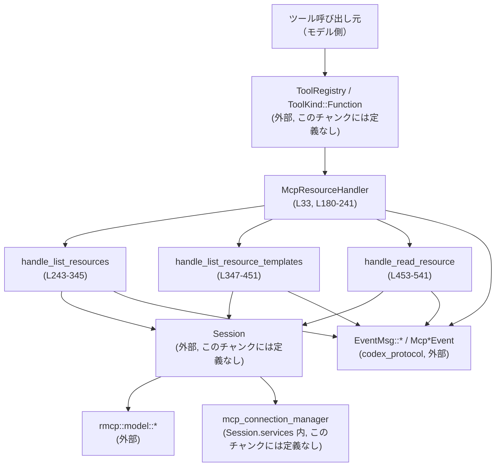
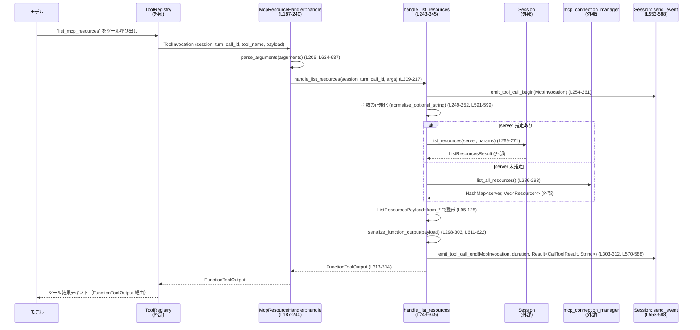

# core/src/tools/handlers/mcp_resource.rs

## 0. ざっくり一言

MCP（Model Context Protocol）サーバーが提供する **リソース一覧／テンプレート一覧／リソース読み取り** を、Codex の「ツール呼び出し（Function Tool）」として処理するハンドラです（`McpResourceHandler`）。  
ツール呼び出し開始・終了イベントの送信や JSON 引数のパース、結果のシリアライズまでを一括で行います。

---

## 1. このモジュールの役割

### 1.1 概要

- このモジュールは、Codex 内の **MCP リソース系ツール呼び出し**（`list_mcp_resources` / `list_mcp_resource_templates` / `read_mcp_resource`）を処理するために存在します（`McpResourceHandler` の `ToolHandler` 実装、`core/src/tools/handlers/mcp_resource.rs:L180-241`）。
- ツール引数の JSON をパースし、`Session` 経由で MCP サーバーに RPC を送り、応答を内部ペイロード構造体に詰めた上で、最終的に `FunctionToolOutput`（モデルに返すテキスト）にシリアライズします（`handle_*` 系関数、`L243-541`）。
- また、ツール呼び出しの **開始／終了イベント** を発火しており、呼び出し時間や成功／失敗情報をイベントとして外部に通知します（`emit_tool_call_begin` / `emit_tool_call_end`, `L553-588`）。

### 1.2 アーキテクチャ内での位置づけ

MCP リソースハンドラ周辺の依存関係は次のようになっています。



- `McpResourceHandler` は `ToolHandler` トレイトを実装することで、ツールレジストリから「Function」種別のハンドラとして呼び出されます（`L180-185`）。
- 実際の MCP API 呼び出しはすべて `Session` 経由で行います（`Session::list_resources`, `Session::list_resource_templates`, `Session::read_resource` 呼び出し, `L269-271`, `L373-375`, `L475-481`）。これらメソッドの実装はこのチャンクには現れません。
- MCP サーバー群横断のリソース・テンプレート一覧は、`session.services.mcp_connection_manager` を通じて取得しています（`list_all_resources`, `list_all_resource_templates`, `L286-293`, `L392-399`）。
- ツール呼び出しの開始・終了は `Session::send_event` を通じて `EventMsg::McpToolCallBegin` / `EventMsg::McpToolCallEnd` として外部へ通知されます（`L553-568`, `L570-588`）。

### 1.3 設計上のポイント

- **責務の分割**
  - エントリーポイント（`McpResourceHandler::handle`）は、ツール名の分岐と引数文字列の JSON パースのみを行い、各処理は `handle_list_resources` / `handle_list_resource_templates` / `handle_read_resource` に委譲されています（`L187-240`）。
  - 引数バリデーションや標準化（空文字を `None` にする等）は `normalize_*` / `parse_*` の小さな関数に分離されています（`L591-660`）。
  - 結果のシリアライズは `serialize_function_output` に集約され、イベントに渡す `CallToolResult` の組み立ても `call_tool_result_from_content` に分離されています（`L544-551`, `L611-622`）。
- **状態管理**
  - `Session` と `TurnContext` は `Arc` で共有され、ハンドラ自体（`McpResourceHandler`）は状態を持たないゼロサイズ構造体です（`L33`, `L187-213`）。
  - このファイル内に `unsafe` ブロックは存在せず、共有状態はすべて `Arc` + async 経由で安全に扱われています。
- **エラーハンドリング方針**
  - すべての公開経路は `Result<_, FunctionCallError>` を返し、エラー内容は `FunctionCallError::RespondToModel(String)` にラップされ、モデルに返すメッセージとして利用されます（例: `L197-204`, `L269-274`, `L615-619`）。
  - ツール呼び出し開始イベントは常に送信され、成功・失敗にかかわらず終了イベントが送信されるように、`payload_result` の `match` の各分岐で `emit_tool_call_end` が呼ばれています（`L298-344`, `L404-450`, `L495-541`）。
- **並行性**
  - すべての処理は `async fn` となっており、`Session` に対する I/O は `await` で非同期実行されます（`L243`, `L347`, `L453`）。
  - `mcp_connection_manager.read().await` は非同期ロック（おそらく `RwLock`）を取得していますが、処理は直列であり、このファイル内でロックのネストやデッドロック要因は確認できません（`L286-293`, `L392-399`）。

---

## 2. 主要な機能一覧 + コンポーネントインベントリー

- MCP リソース一覧取得ツール (`list_mcp_resources`) の処理
- MCP リソーステンプレート一覧取得ツール (`list_mcp_resource_templates`) の処理
- MCP リソース読み取りツール (`read_mcp_resource`) の処理
- ツール引数 JSON のパースとバリデーション
- 結果ペイロードの JSON シリアライズと `FunctionToolOutput` への変換
- MCP ツール呼び出し開始・終了イベントの送信

### 2.1 コンポーネントインベントリー（構造体・関数一覧）

**主な構造体**

| 名前 | 種別 | 公開性 | 役割 / 用途 | 定義位置 |
|------|------|--------|-------------|----------|
| `McpResourceHandler` | 構造体 | `pub` | MCP リソース関連ツールを処理する `ToolHandler` 実装用のハンドラ | `core/src/tools/handlers/mcp_resource.rs:L33`, `L180-241` |
| `ListResourcesArgs` | 構造体 | `crate` | `list_mcp_resources` の引数（server, cursor） | `L35-42` |
| `ListResourceTemplatesArgs` | 構造体 | `crate` | `list_mcp_resource_templates` の引数（server, cursor） | `L44-51` |
| `ReadResourceArgs` | 構造体 | `crate` | `read_mcp_resource` の引数（server, uri） | `L53-57` |
| `ResourceWithServer` | 構造体 | `crate` | `Resource` に `server` 名を付加したレスポンス要素 | `L59-64`, `L66-70` |
| `ResourceTemplateWithServer` | 構造体 | `crate` | `ResourceTemplate` に `server` 名を付加したレスポンス要素 | `L72-77`, `L79-83` |
| `ListResourcesPayload` | 構造体 | `crate` | `list_mcp_resources` のレスポンスペイロード | `L85-93`, `L95-125` |
| `ListResourceTemplatesPayload` | 構造体 | `crate` | `list_mcp_resource_templates` のレスポンスペイロード | `L128-136`, `L138-169` |
| `ReadResourcePayload` | 構造体 | `crate` | `read_mcp_resource` のレスポンスペイロード（server, uri, result） | `L172-178` |

**主な関数・メソッド**

| 名前 | 種別 | 役割（1 行） | 定義位置 |
|------|------|--------------|----------|
| `ToolHandler::kind` | メソッド | このハンドラが Function ツールであることを示す | `L183-185` |
| `ToolHandler::handle` | `async` メソッド | ツール名に応じて `handle_*` 関数へディスパッチするエントリーポイント | `L187-240` |
| `handle_list_resources` | `async fn` | MCP サーバーのリソース一覧を取得し `FunctionToolOutput` に変換 | `L243-345` |
| `handle_list_resource_templates` | `async fn` | MCP サーバーのリソーステンプレート一覧を取得し `FunctionToolOutput` に変換 | `L347-451` |
| `handle_read_resource` | `async fn` | MCP リソースを 1 件読み取り `FunctionToolOutput` に変換 | `L453-541` |
| `ResourceWithServer::new` | メソッド | `ResourceWithServer` のコンストラクタ | `L66-70` |
| `ResourceTemplateWithServer::new` | メソッド | `ResourceTemplateWithServer` のコンストラクタ | `L79-83` |
| `ListResourcesPayload::from_single_server` | 関連関数 | 単一サーバーの `ListResourcesResult` からペイロード生成 | `L95-107` |
| `ListResourcesPayload::from_all_servers` | 関連関数 | サーバー別リソース一覧をマージしてペイロード生成 | `L109-125` |
| `ListResourceTemplatesPayload::from_single_server` | 関連関数 | 単一サーバーのテンプレート一覧からペイロード生成 | `L138-150` |
| `ListResourceTemplatesPayload::from_all_servers` | 関連関数 | サーバー別テンプレート一覧をマージしてペイロード生成 | `L152-169` |
| `call_tool_result_from_content` | 関数 | テキストコンテンツから `CallToolResult` を生成 | `L544-551` |
| `emit_tool_call_begin` | `async fn` | MCP ツール呼び出し開始イベントを送信 | `L553-568` |
| `emit_tool_call_end` | `async fn` | MCP ツール呼び出し終了イベントを送信 | `L570-588` |
| `normalize_optional_string` | 関数 | 文字列のトリムと空文字→`None` 変換 | `L591-600` |
| `normalize_required_string` | 関数 | 必須文字列の検証（空ならエラー） | `L602-609` |
| `serialize_function_output` | 関数 | シリアライズ可能なペイロードを JSON 文字列の `FunctionToolOutput` へ変換 | `L611-622` |
| `parse_arguments` | 関数 | 生の引数文字列を `serde_json::Value` (`Option`) に変換 | `L624-637` |
| `parse_args` | 関数 | `Option<Value>` を任意型にデシリアライズ（必須） | `L639-651` |
| `parse_args_with_default` | 関数 | `Option<Value>` を任意型にデシリアライズ、なければ `Default` を使用 | `L653-660` |
| `tests` モジュール | モジュール | テストコード（内容はこのチャンクには現れない） | `L663-665` |

---

## 3. 公開 API と詳細解説

### 3.1 型一覧（構造体・列挙体など）

このファイルから他モジュールに直接公開される主要な型は `McpResourceHandler` です。他の構造体はレスポンス整形用の内部型です。

| 名前 | 種別 | 役割 / 用途 | 定義位置 |
|------|------|-------------|----------|
| `McpResourceHandler` | 構造体 | MCP リソースツールのハンドラ。`ToolHandler<Output = FunctionToolOutput>` を実装し、ツール呼び出しを処理します。 | `L33`, `L180-241` |
| `ListResourcesPayload` | 構造体 | リソース一覧レスポンス（server / resources / next_cursor） | `L85-93` |
| `ListResourceTemplatesPayload` | 構造体 | テンプレート一覧レスポンス（server / resource_templates / next_cursor） | `L128-136` |
| `ReadResourcePayload` | 構造体 | リソース読み取りレスポンス（server / uri / result） | `L172-178` |

### 3.2 関数詳細（最大 7 件）

#### `impl ToolHandler for McpResourceHandler::handle(&self, invocation: ToolInvocation) -> Result<FunctionToolOutput, FunctionCallError>`（L187-240）

**概要**

- Codex のツールレジストリから呼び出されるエントリーポイントです。
- 受け取った `ToolInvocation` からツール名と引数文字列を取り出し、JSON パース後、ツール名に従って `handle_list_resources` / `handle_list_resource_templates` / `handle_read_resource` のいずれかを呼び出します（`L208-235`）。

**引数**

| 引数名 | 型 | 説明 |
|--------|----|------|
| `invocation` | `ToolInvocation` | セッション、ターン、ツール名、引数文字列などを含む呼び出しコンテキスト（`L188-195` で分解） |

**戻り値**

- `Result<FunctionToolOutput, FunctionCallError>`  
  正常時は MCP からの応答をエンコードした `FunctionToolOutput` を返し、異常時はエラーメッセージを含む `FunctionCallError::RespondToModel` を返します（`L197-204`）。

**内部処理の流れ**

1. パターンマッチで `ToolInvocation` を分解し、`session`, `turn`, `call_id`, `tool_name`, `payload` を取り出す（`L188-195`）。
2. `payload` が `ToolPayload::Function { arguments }` であることを確認し、そうでなければエラー（`mcp_resource handler received unsupported payload`）を返す（`L197-203`）。
3. 引数文字列 `arguments` を `parse_arguments` で `Option<Value>` にパースする（`L206`）。
4. `tool_name.name.as_str()` でツール名に応じてパターンマッチを行い、対応する `handle_*` 関数を `await` して結果を返す（`L208-235`）。
5. 未対応のツール名の場合は `"unsupported MCP resource tool: {other}"` でエラーを返す（`L236-238`）。

**Examples（使用例）**

※ `Session` や `TurnContext` の具体的な構築方法はこのチャンクには現れないため、擬似コードとして示します。

```rust
use std::sync::Arc;
use serde_json::json;
use crate::tools::handlers::mcp_resource::McpResourceHandler;
use crate::tools::context::{ToolInvocation, ToolPayload};
use crate::tools::registry::ToolKind;

// 省略: session, turn, tool_name を既存の仕組みから取得する
let session: Arc<Session> = /* ... */;
let turn: Arc<TurnContext> = /* ... */;
let tool_name = /* "list_mcp_resources" を指す ToolName 型など */;

// 引数は JSON 文字列として渡される
let payload = ToolPayload::Function {
    arguments: json!({"server": "my-server"}).to_string(),
};

let invocation = ToolInvocation {
    session,
    turn,
    call_id: "call-123".to_string(),
    tool_name,
    payload,
    // その他のフィールドはこのチャンクには現れない
};

let handler = McpResourceHandler;
let output = handler.handle(invocation).await?;
println!("{}", output.text()); // FunctionToolOutput の使い方はこのチャンクには現れません
```

**Errors / Panics**

- 未サポートの `ToolPayload` 種別が渡された場合、`FunctionCallError::RespondToModel("mcp_resource handler received unsupported payload")` を返します（`L197-203`）。
- 引数文字列が不正な JSON の場合、`parse_arguments` 内で JSON パースが失敗し、`failed to parse function arguments: ...` メッセージを持つ `FunctionCallError` になります（`L624-630`）。
- パニックを発生させるコード（`unwrap` など）は使用していないため、この関数からの panic 可能性はコード上はありません。

**Edge cases（エッジケース）**

- 引数文字列が空文字や空白のみの場合、`parse_arguments` が `Ok(None)` を返します（`L625-627`）。その後、`handle_*` 側で `parse_args_with_default` / `parse_args` の挙動により、デフォルト引数またはエラーになります。
- ツール名が `"list_mcp_resources"`, `"list_mcp_resource_templates"`, `"read_mcp_resource"` 以外の場合は、必ずエラーとなります（`L236-238`）。

**使用上の注意点**

- `ToolInvocation` の `payload` は必ず `ToolPayload::Function` である必要があります。それ以外を渡すとエラーになります（`L197-203`）。
- `ToolInvocation` の `tool_name` は上記 3 種類のいずれかにする必要があります。新しいツールを追加する場合は、この `match` にケースを追加する必要があります。

---

#### `handle_list_resources(session: Arc<Session>, turn: Arc<TurnContext>, call_id: String, arguments: Option<Value>)`（L243-345）

**概要**

- MCP サーバーのリソース一覧を取得し、`ListResourcesPayload` に詰めて `FunctionToolOutput` として返します。
- server が指定されていない場合は、全 MCP サーバーからリソースを収集します（`L280-294`）。

**引数**

| 引数名 | 型 | 説明 |
|--------|----|------|
| `session` | `Arc<Session>` | MCP へのアクセスおよびイベント送信を行うセッション（外部定義） |
| `turn` | `Arc<TurnContext>` | 現在の対話ターンを表すコンテキスト（外部定義） |
| `call_id` | `String` | ツール呼び出しを一意に識別する ID（イベントで利用） |
| `arguments` | `Option<Value>` | ツールに渡された JSON 引数のパース済み値 |

**戻り値**

- `Result<FunctionToolOutput, FunctionCallError>`  
  成功時はリソース一覧を JSON テキストとする `FunctionToolOutput` を返し、失敗時はエラーメッセージを含む `FunctionCallError` を返します。

**内部処理の流れ**

1. 引数 `arguments` を `parse_args_with_default::<ListResourcesArgs>` で `ListResourcesArgs { server, cursor }` に変換（無指定ならデフォルトで `None`）し、空文字を `None` に標準化する（`L249-252`, `L591-600`）。
2. `McpInvocation` 構造体を組み立て、`emit_tool_call_begin` で開始イベントを送信（`L254-261`, `L553-568`）。
3. `Instant::now()` で処理開始時間を記録（`L261`）。
4. `payload_result` 生成用の `async` ブロックを定義し:
   - `server` が `Some` の場合:
     - `cursor` が `Some` なら `PaginatedRequestParams { cursor: Some(value) }` を作成（`L265-268`）。
     - `session.list_resources(&server_name, params).await` を呼び、結果を `ListResourcesPayload::from_single_server` で変換（`L269-278`）。
   - `server` が `None` の場合:
     - `cursor` が指定されていたらエラー (`"cursor can only be used when a server is specified"`)（`L280-283`）。
     - `session.services.mcp_connection_manager.read().await.list_all_resources().await` で全サーバー分のリソースを取得し、`ListResourcesPayload::from_all_servers` で変換（`L286-293`）。
5. `payload_result` の `match`:
   - `Ok(payload)` の場合:
     - `serialize_function_output(payload)` で JSON テキスト化（`L298-303`, `L611-622`）。
     - 成功した場合、`function_call_output_content_items_to_text` で本文テキストを抽出し（`L301-302`）、経過時間を計測して `emit_tool_call_end` に `Ok(CallToolResult)` を渡して終了イベント送信（`L303-312`, `L544-551`, `L570-588`）。
     - `FunctionToolOutput` を呼び出し元に返す（`L313-314`）。
     - シリアライズに失敗した場合、同様に終了イベント送信後、エラーを返す（`L315-328`）。
   - `Err(err)` の場合:
     - エラーメッセージ文字列を得て終了イベント送信し、エラーを返す（`L330-343`）。

**Errors / Panics**

- `session.list_resources` の失敗は `"resources/list failed: {err:#}"` というメッセージで `FunctionCallError::RespondToModel` に変換されます（`L269-274`）。
- `cursor` が指定されているのに `server` が `None` の場合、`FunctionCallError::RespondToModel("cursor can only be used when a server is specified")` が返されます（`L280-283`）。
- シリアライズ失敗時は `"failed to serialize MCP resource response: {err}"` というメッセージで `FunctionCallError` が返ります（`L615-619`）。
- panic を起こすコード（`unwrap` 等）は使われておらず、`?` ですべて `Result` に変換されています。

**Edge cases**

- `server` 引数が空文字や空白のみの場合、`normalize_optional_string` により `None` に変換されます（`L251`, `L591-599`）。
- `cursor` も同様に空白なら無視されます（`L252`）。
- 引数がまったく渡されない／空 JSON の場合、`ListResourcesArgs::default()` が利用され、`server = None`, `cursor = None` となります（`L249`, `L35-42`）。
- サーバー未指定かつ `cursor` 指定ありの場合だけが、ユーザー入力エラーとして扱われます（`L280-283`）。

**使用上の注意点**

- 全サーバー横断でのリソース一覧取得は、接続中のすべての MCP サーバーにアクセスするため、数が多いとレスポンス遅延・負荷増加の可能性があります（`list_all_resources` 呼び出し, `L286-293`）。
- ページネーション（`cursor`）を利用したい場合は、必ず `server` を指定する必要があります（`L280-283`）。
- イベントログ（`McpToolCallBegin` / `McpToolCallEnd`）は常に送信される前提で設計されているため、外部のイベントハンドラ側でこれらのイベントを正しく処理する必要があります（`L254-261`, `L303-312`）。

---

#### `handle_list_resource_templates(...)`（L347-451）

**概要**

- `handle_list_resources` とほぼ同様の構造で、MCP リソーステンプレート一覧 (`ListResourceTemplatesResult`) を取得し、`ListResourceTemplatesPayload` として返します。

**引数・戻り値**

- 引数・戻り値・エラーパターンは `handle_list_resources` と同様で、`ListResourceTemplatesArgs` / `ListResourceTemplatesPayload` に対応しています（`L353-356`, `L367-400`）。

**内部処理のポイント**

- 単一サーバーの場合、`session.list_resource_templates(&server_name, params)` を呼び出します（`L373-375`）。
- 全サーバーの場合、`session.services.mcp_connection_manager.read().await.list_all_resource_templates().await` を呼び出し、`from_all_servers` でマージします（`L392-399`）。
- エラーメッセージは `"resources/templates/list failed: {err:#}"` および `"cursor can only be used when a server is specified"` です（`L373-379`, `L386-389`）。

**Edge cases / 注意点**

- `cursor` 利用時の制約や、空白 server/cursor の標準化は `handle_list_resources` と同じです（`L353-356`, `L355-356`）。
- テンプレート数が多い場合、シリアライズされる JSON のサイズが大きくなります。`FunctionToolOutput` のサイズ上限がある場合は上位レイヤーで制御が必要です（このチャンクには制限ロジックは現れません）。

---

#### `handle_read_resource(...)`（L453-541）

**概要**

- 1 件の MCP リソース（`uri` で指定）を読み取り、その結果を `ReadResourcePayload` として返します。

**引数**

| 引数名 | 型 | 説明 |
|--------|----|------|
| `session` | `Arc<Session>` | MCP サーバーとの通信とイベント送信を行うセッション |
| `turn` | `Arc<TurnContext>` | 対話ターンコンテキスト |
| `call_id` | `String` | 呼び出し ID |
| `arguments` | `Option<Value>` | JSON 引数（必須、`ReadResourceArgs` にデシリアライズ） |

**戻り値**

- `Result<FunctionToolOutput, FunctionCallError>`

**内部処理の流れ**

1. `parse_args::<ReadResourceArgs>(arguments.clone())` で `server`, `uri` を取得（`L459-460`, `L639-651`）。
2. `normalize_required_string` で両フィールドが空白でないことを検証し、空白の場合はエラー（`"{field} must be provided"`）を返す（`L461-462`, `L602-609`）。
3. `McpInvocation` を生成し、開始イベント送信（`L464-471`）。
4. `session.read_resource(&server, ReadResourceRequestParams { uri: uri.clone(), ... })` を呼び出し、結果を `ReadResourcePayload { server, uri, result }` にまとめる（`L473-492`）。
5. `serialize_function_output` で JSON テキストに変換し、`emit_tool_call_end` で終了イベント送信後に `FunctionToolOutput` を返す。エラー時は同様に終了イベント送信後エラーを返す（`L495-541`）。

**Errors / Panics**

- 引数が `None` もしくは JSON フォーマット不正の場合、`parse_args` 内で `"failed to parse function arguments: ..."` エラーになります（`L639-649`）。
- `server` / `uri` が空文字や空白のみの場合、`"{field} must be provided"` エラーになります（`L602-607`）。
- `session.read_resource` の失敗は `"resources/read failed: {err:#}"` で `FunctionCallError` にラップされます（`L475-485`）。

**Edge cases**

- `uri` に前後空白が含まれる場合、`normalize_required_string` によりトリムされてから使用されます（`L461-462`, `L591-599`）。
- `server` / `uri` が JSON レベルで欠落している場合、`ReadResourceArgs` の逆シリアライズでエラーになります（`L53-57`, `L639-647`）。

**使用上の注意点**

- `server` と `uri` は必須であり、空白のみの文字列も無効です（`L602-609`）。
- 読み取るリソースのサイズや内容によっては、結果 JSON が大きくなる可能性があります。これはこのモジュールでは特に制限されていません。

---

#### `serialize_function_output<T>(payload: T) -> Result<FunctionToolOutput, FunctionCallError>`（L611-622）

**概要**

- 任意のシリアライズ可能なペイロードを JSON 文字列に変換し、その文字列から `FunctionToolOutput` を生成します。

**引数**

| 引数名 | 型 | 説明 |
|--------|----|------|
| `payload` | `T` (`T: Serialize`) | JSON にシリアライズ可能なレスポンスペイロード |

**戻り値**

- `Ok(FunctionToolOutput)`：`payload` を JSON に変換したテキストと `success = Some(true)` を持つ FunctionToolOutput  
- `Err(FunctionCallError)`：JSON シリアライズに失敗した場合

**内部処理**

1. `serde_json::to_string(&payload)` で JSON 文字列に変換し、失敗した場合 `"failed to serialize MCP resource response: {err}"` メッセージで `FunctionCallError::RespondToModel` を返す（`L615-619`）。
2. 成功した場合、`FunctionToolOutput::from_text(content, Some(true))` でテキスト出力を構築し、`Ok(...)` を返す（`L621-621`）。`from_text` の実装はこのチャンクには現れません。

**使用上の注意点**

- `Serialize` を実装していない型を渡すとコンパイルエラーになります。
- シリアライズエラーは実行時エラーとしてモデルに返されるため、ペイロードのフィールドに `Value` や循環参照など問題がないか事前に検討する必要があります。

---

#### `parse_arguments(raw_args: &str) -> Result<Option<Value>, FunctionCallError>`（L624-637）

**概要**

- ツール引数として渡された文字列（JSON）を `serde_json::Value` に変換し、空文字／`null` は `None` として扱います。

**引数**

| 引数名 | 型 | 説明 |
|--------|----|------|
| `raw_args` | `&str` | ツール引数の生 JSON 文字列 |

**戻り値**

- `Ok(None)`：引数が空白のみ、または JSON `null` の場合（`L625-627`, `L631-633`）
- `Ok(Some(value))`：有効な JSON で、`null` 以外の場合（`L628-635`）
- `Err(FunctionCallError)`：JSON パースに失敗した場合

**Errors**

- `serde_json::from_str` 失敗時に `"failed to parse function arguments: {err}"` というメッセージの `FunctionCallError` になります（`L628-630`）。

**Edge cases**

- `"   "` のような空白のみの入力は `Ok(None)` となり、呼び出し側で「引数なし」として扱われます（`L625-627`）。
- `"null"` という文字列も `Value::Null` に変換され、`None` とみなされます（`L631-633`）。

---

#### `normalize_required_string(field: &str, value: String) -> Result<String, FunctionCallError>`（L602-609）

**概要**

- 必須文字列フィールドの検証を行います。空白のみの文字列はエラーとし、それ以外はトリムした文字列を返します。

**引数**

| 引数名 | 型 | 説明 |
|--------|----|------|
| `field` | `&str` | フィールド名（エラーメッセージ用） |
| `value` | `String` | ユーザーから渡された生の文字列 |

**戻り値**

- `Ok(normalized)`：前後空白を取り除いた非空文字列
- `Err(FunctionCallError)`：空白をトリムした結果が空文字だった場合、`"{field} must be provided"` メッセージのエラー（`L605-607`）

**内部処理**

- `normalize_optional_string(Some(value))` を呼び、その結果 `Some` ならそれを返し、`None` ならエラーを返します（`L603-607`, `L591-599`）。

**使用上の注意点**

- 入力は一度 `String` として受け取るため、既に所有権はこの関数に移動しています。戻り値も新しい `String` であり、所有権の扱いは単純です（所有権に関する Rust 特有の問題は発生しにくい箇所です）。

---

### 3.3 その他の関数

| 関数名 | 役割（1 行） | 定義位置 |
|--------|--------------|----------|
| `ToolHandler::kind` | このハンドラが `ToolKind::Function` であることを返す | `L183-185` |
| `call_tool_result_from_content` | テキストと成功フラグから `CallToolResult` を構築 | `L544-551` |
| `emit_tool_call_begin` | MCP ツール呼び出し開始イベントを送信 | `L553-568` |
| `emit_tool_call_end` | MCP ツール呼び出し終了イベントを送信 | `L570-588` |
| `normalize_optional_string` | 文字列をトリムし、空文字なら `None` にする | `L591-600` |
| `parse_args` | `Option<Value>` を必須引数としてデシリアライズ | `L639-651` |
| `parse_args_with_default` | `Option<Value>` からデフォルト付きでデシリアライズ | `L653-660` |
| `ListResourcesPayload::from_*` | MCP リソース結果を `ListResourcesPayload` に変換 | `L95-125` |
| `ListResourceTemplatesPayload::from_*` | MCP テンプレート結果を `ListResourceTemplatesPayload` に変換 | `L138-169` |
| `ResourceWithServer::new` / `ResourceTemplateWithServer::new` | server 名付きラッパーのコンストラクタ | `L66-70`, `L79-83` |

---

## 4. データフロー

ここでは `list_mcp_resources` ツール呼び出し時の典型的なデータフローを示します（`McpResourceHandler::handle (L187-240)` → `handle_list_resources (L243-345)`）。

### 4.1 シーケンス図



**要点**

- ツール呼び出しは常に `McpToolCallBegin` / `McpToolCallEnd` イベントで囲まれます（`L254-261`, `L303-312`）。
- MCP サーバーへのアクセスは `Session` 経由で行われ、全サーバー横断の一覧は `mcp_connection_manager` 経由です（`L269-271`, `L286-293`）。
- 最終的にモデルに返るのは `FunctionToolOutput` の本文テキストであり、イベントにはより構造化された `CallToolResult` が送られます（`L544-551`, `L303-312`）。

---

## 5. 使い方（How to Use）

### 5.1 基本的な使用方法

このハンドラは通常、ツールレジストリ／ツール実行フレームワークから呼び出されるため、アプリケーションコードが直接 `handle_*` を呼ぶことは少ない想定です。  
単体テストなどで直接呼ぶ例としては次のようなイメージになります（外部型は擬似コードです）。

```rust
use std::sync::Arc;
use serde_json::json;
use codex_core::tools::handlers::mcp_resource::McpResourceHandler;
use codex_core::tools::context::{ToolInvocation, ToolPayload};
use codex_core::tools::registry::ToolKind;

// 既存の初期化済み Session / TurnContext を用いる（このチャンクには定義なし）
let session: Arc<Session> = /* ... */;
let turn: Arc<TurnContext> = /* ... */;

// ツール名や ToolInvocation の詳細構造はこのチャンクには現れない
let tool_name = /* "read_mcp_resource" を表す型 */;

let payload = ToolPayload::Function {
    arguments: json!({
        "server": "my-server",
        "uri": "resource://foo/bar",
    }).to_string(),
};

let invocation = ToolInvocation {
    session,
    turn,
    call_id: "call-1".to_string(),
    tool_name,
    payload,
    // その他フィールドは省略
};

let handler = McpResourceHandler;
let result = handler.handle(invocation).await?;
```

### 5.2 よくある使用パターン

- **特定サーバーのリソース一覧**
  - ツール名: `"list_mcp_resources"`
  - 引数: `{"server": "my-server"}` または `{"server": "my-server", "cursor": "..."}`（ページ継続時）
- **全サーバーのリソース一覧**
  - ツール名: `"list_mcp_resources"`
  - 引数: `{}` または引数なし（`server`/`cursor` 未指定）
- **テンプレート一覧**
  - ツール名: `"list_mcp_resource_templates"`
  - 引数構造はリソース一覧と同様 (`server` / `cursor`)
- **リソース読み取り**
  - ツール名: `"read_mcp_resource"`
  - 引数: `{"server": "my-server", "uri": "resource://path"}`

### 5.3 よくある間違い

```rust
// 間違い例 1: 必須引数を空文字で渡す
// server と uri は normalize_required_string で検証されるのでエラーになる
let payload = ToolPayload::Function {
    arguments: r#"{"server": "  ", "uri": ""}"#.to_string(),
};

// 間違い例 2: server を指定せずに cursor だけを渡す（一覧系）
let payload = ToolPayload::Function {
    arguments: r#"{"cursor": "next"}"#.to_string(),
};
// => "cursor can only be used when a server is specified" エラー（L280-283, L386-389）

// 正しい例: server と uri を指定する
let payload = ToolPayload::Function {
    arguments: r#"{"server":"my-server","uri":"resource://foo"}"#.to_string(),
};
```

### 5.4 使用上の注意点（まとめ）

- **引数の JSON 形式**
  - 引数は常に JSON 文字列として渡される前提であり、不正な JSON は `failed to parse function arguments: ...` エラーになります（`L624-630`）。
- **必須フィールド**
  - `read_mcp_resource` の `server` / `uri` は必須で、空白のみも不可です（`L461-462`, `L602-609`）。
- **ページネーション**
  - `cursor` を使う場合は必ず `server` を指定する必要があります（`L280-283`, `L386-389`）。
- **並行性**
  - `Session` や `TurnContext` は `Arc` で共有される前提です。複数ツール呼び出しが同時に走っても、このファイル内では共有ミュータブル状態を直接扱っていません。
- **イベント**
  - ツール呼び出しの開始・終了イベントは、ログやモニタリング、UI 表示などに利用されることが想定されます。`EventMsg::McpToolCallBegin` / `End` のハンドリングは別コンポーネントで行われます（このチャンクには定義なし）。

---

## 6. 変更の仕方（How to Modify）

### 6.1 新しい機能を追加する場合

例えば新しい MCP ツール `"delete_mcp_resource"` を追加したい場合の流れです（実装方針のみを説明します）。

1. **引数・ペイロード型の定義**
   - `ReadResourceArgs` に倣って、必要な引数用の構造体（例: `DeleteResourceArgs`）を本ファイルに追加します（`L53-57` を参考）。
   - 必要であればレスポンス用ペイロード構造体も `ReadResourcePayload` と同様に定義します（`L172-178`）。
2. **処理関数の追加**
   - `handle_read_resource` と同様のパターンで `async fn handle_delete_resource(...)` を実装します（`L453-541` を参考）。
   - `Session` に対応するメソッド（例: `delete_resource`）が存在するか、このチャンクには現れないため、外部コードを確認する必要があります。
3. **ディスパッチの追加**
   - `McpResourceHandler::handle` の `match tool_name.name.as_str()` に `"delete_mcp_resource"` ケースを追加し、新しい関数を呼び出すようにします（`L208-235`）。
4. **イベントの送信**
   - 既存の `handle_*` 関数と同様に、`emit_tool_call_begin` / `emit_tool_call_end` を利用して開始・終了イベントを送信します（`L254-261`, `L303-312`）。

### 6.2 既存の機能を変更する場合

- **影響範囲の確認**
  - 各 `handle_*` 関数は、ツール名とのマッピングを `McpResourceHandler::handle` で行っているため、シグネチャや返り値の意味を変更する場合は必ず `handle` の `match` とテストコード（`mcp_resource_tests.rs`, `L663-665`）側も確認する必要があります。
- **契約（前提条件）の維持**
  - `normalize_required_string` による必須フィールド検証や、`cursor` 使用時の `server` 必須といった入力制約は、上位レイヤー（モデル／クライアント）と暗黙の契約になっている可能性があります（`L280-283`, `L386-389`）。
  - これらを緩めたり変更したりする場合、API 利用側の挙動も合わせて見直す必要があります。
- **エラー文言**
  - エラーメッセージ文字列 (`"resources/list failed: {err:#}"` など) はログや UI で直接表示される可能性があるため、変更時には既存の利用箇所（このチャンクには現れない）も考慮する必要があります。

---

## 7. 関連ファイル

| パス | 役割 / 関係 |
|------|------------|
| `core/src/tools/handlers/mcp_resource.rs` | 本ファイル。MCP リソース関連ツールハンドラの実装。 |
| `core/src/tools/handlers/mcp_resource_tests.rs` | テストモジュールとして参照されているファイル（`#[path = "mcp_resource_tests.rs"]`、`L663-665`）。内容はこのチャンクには現れません。 |
| `core/src/codex/session.rs`（仮の例、正確なパスはこのチャンクには現れない） | `Session` 型と `send_event`, `list_resources`, `list_resource_templates`, `read_resource` などの実装が存在すると推測されますが、このチャンクからは正確な位置は分かりません。 |
| `core/src/tools/context.rs` 付近（推測） | `FunctionToolOutput`, `ToolInvocation`, `ToolPayload` などのツールコンテキスト型の定義。正確なパスはこのチャンクには現れません。 |
| `core/src/tools/registry.rs` 付近（推測） | `ToolHandler`, `ToolKind` の定義。ハンドラの登録とディスパッチに関わります。 |
| `codex_protocol` クレート | `CallToolResult`, `EventMsg`, `McpInvocation`, `McpToolCallBeginEvent`, `McpToolCallEndEvent` などのプロトコル定義（`L6-7`, `L28-31`, `L544-551`）。 |
| `rmcp` クレート | `ListResourcesResult`, `ListResourceTemplatesResult`, `ReadResourceRequestParams`, `ReadResourceResult`, `Resource`, `ResourceTemplate` 等の MCP モデル定義（`L8-14`, `L11-12`）。 |

---

### Bugs / Security / Tests / Performance の補足（このチャンクから読み取れる範囲）

- **Bugs（疑わしい点）**
  - このファイル内で明確なロジックミスや所有権の問題は確認できません。すべての `?` は `FunctionCallError` に変換され、イベントの begin/end も必ず対になるよう記述されています。
- **Security**
  - ユーザー入力は JSON として `serde_json` に渡されるのみで、コマンド実行やファイルアクセスなどはこのファイル内には存在しません。
  - ただし、`Session::read_resource` 等の実装はこのチャンクには現れず、そこでの安全性は別途確認が必要です。
- **Contracts / Edge Cases**
  - 代表的な契約（server/cursor の関係、必須フィールドの検証、空白トリムなど）は上記で列挙した通りです（`L249-252`, `L280-283`, `L461-462`, `L602-609`）。
- **Tests**
  - `#[cfg(test)] mod tests;` によりテストモジュールが存在しますが、その内容はこのチャンクには現れません（`L663-665`）。テストの有無と名前以外の情報は不明です。
- **Performance / Scalability**
  - 全サーバー横断の一覧取得では `list_all_resources` / `list_all_resource_templates` 呼び出しが発生し、サーバー数とリソース数に比例して処理時間・データ量が増加します（`L286-293`, `L392-399`）。
  - このファイル内で特別なストリーミングやページ分割処理は行っておらず、ページネーションは `cursor` と `PaginatedRequestParams` による単純な仕組みです。
