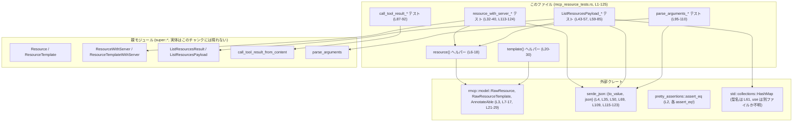
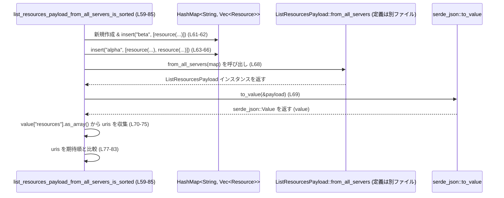

# core/src/tools/handlers/mcp_resource_tests.rs コード解説

## 0. ざっくり一言

MCP（Multi-Channel Protocol 等、詳細は不明）の「リソース関連ハンドラ」用の**テストヘルパーとテストケース**を集めたモジュールです。  
`Resource` / `ResourceTemplate` とサーバー名を組み合わせたラッパー型や、リソース一覧・ツール呼び出し結果・引数パース関数の**シリアライズ仕様と挙動**を検証しています。

---

## 1. このモジュールの役割

### 1.1 概要

このモジュールは、親モジュール（`super::*`）で定義されている MCP 関連のハンドラについて、次のような**仕様をテストで固定**する役割を持ちます。

- `ResourceWithServer` / `ResourceTemplateWithServer` の **JSON シリアライズ結果のフィールド構造**  
- `ListResourcesPayload::from_single_server` / `from_all_servers` が生成する **リソース一覧の JSON 構造とソート順**
- `call_tool_result_from_content` が **成功結果をどう表現するか**
- `parse_arguments` が **空文字列・`null`・JSON オブジェクトをどう扱うか**

これらを通じて、MCP ハンドラの公開 API の**振る舞いを回帰テスト**しています。

### 1.2 アーキテクチャ内での位置づけ

このファイル自体は**テスト専用モジュール**であり、プロダクションコードは親モジュールにあります（`use super::*;` が根拠です。`core/src/tools/handlers/mcp_resource_tests.rs:L1`）。

主要な依存関係を図示します。



> 親モジュールや外部クレート側の実装コードはこのチャンクには現れないため、**型や関数の内部実装は不明**です。

### 1.3 設計上のポイント

コードから読み取れる設計上の特徴をまとめます。

- **テストヘルパーによるデータ生成の共通化**  
  - `resource` / `template` で `RawResource` / `RawResourceTemplate` を生成し、`.no_annotation()` を通して `Resource` / `ResourceTemplate` を得ています（`core/src/tools/handlers/mcp_resource_tests.rs:L6-18, L20-30`）。  
  - これにより、テストケース間で同一形式のリソースを簡潔に再利用しています。
- **JSON シリアライズ結果を直接アサート**  
  - `serde_json::to_value` で構造体を `Value` に変換し、フィールドアクセスして `assert_eq!` しています（例: `L35-39`, `L50-56`, `L69-83`, `L115-123`）。  
  - これは**外部 API としての JSON 仕様をそのままテスト**している構造です。
- **Result / Option によるエラー表現のテスト**  
  - `parse_arguments` は `Result<Option<Value>, _>` を返す前提で、`unwrap().is_none()` などを通じて **空入力・`null` の扱い**を検証しています（`L95-104`）。  
- **並行性は扱っていない**  
  - すべて同期的な関数呼び出しであり、スレッドや async/await は登場しません。

---

## 2. 主要な機能一覧（コンポーネントインベントリー）

### 2.1 このファイルで定義される関数

| 名前 | 種別 | 役割 / 用途 | 根拠 |
|------|------|-------------|------|
| `resource` | ヘルパー関数 | `RawResource` からアノテーション無しの `Resource` を生成するテスト用ヘルパーです。 | `core/src/tools/handlers/mcp_resource_tests.rs:L6-18` |
| `template` | ヘルパー関数 | `RawResourceTemplate` からアノテーション無しの `ResourceTemplate` を生成するテスト用ヘルパーです。 | `core/src/tools/handlers/mcp_resource_tests.rs:L20-30` |
| `resource_with_server_serializes_server_field` | テスト関数 | `ResourceWithServer` の JSON 出力が `server`, `uri`, `name` フィールドを含むことを確認します。 | `L32-40` |
| `list_resources_payload_from_single_server_copies_next_cursor` | テスト関数 | 単一サーバーの `ListResourcesResult` から作る `ListResourcesPayload` が `server` と `nextCursor`、および各リソースの `server` を正しく引き継ぐことを確認します。 | `L42-57` |
| `list_resources_payload_from_all_servers_is_sorted` | テスト関数 | 複数サーバーのリソースをまとめる `from_all_servers` が、JSON 上の `resources[*].uri` を特定の順序（このテストでは昇順）に並べることを確認します。 | `L59-85` |
| `call_tool_result_from_content_marks_success` | テスト関数 | `call_tool_result_from_content` が成功時に `is_error = Some(false)` と単一要素の `content` を返すことを確認します。 | `L87-92` |
| `parse_arguments_handles_empty_and_json` | テスト関数 | `parse_arguments` が空文字列・`null`・JSON オブジェクトをそれぞれ `None` / `Some(Value)` として扱うことを確認します。 | `L94-110` |
| `template_with_server_serializes_server_field` | テスト関数 | `ResourceTemplateWithServer` の JSON 出力が `server`, `uriTemplate`, `name` フィールドを持つことを確認します。 | `L112-124` |

### 2.2 このファイルで使用する外部コンポーネント

（定義はこのファイル外にありますが、挙動や契約がテストから分かるものを列挙します）

| 名前 | 種別 | このファイル内での役割 / 契約（テストから読める範囲） | 参照箇所 |
|------|------|---------------------------------------------|----------|
| `Resource` | 型 | `rmcp::model::RawResource::no_annotation()` が返す最終型。JSON では少なくとも `uri`, `name` を持つ前提です。 | 間接的に `L6-18`, `L34-39`, `L44-48` 等 |
| `ResourceTemplate` | 型 | `RawResourceTemplate::no_annotation()` が返す最終型。JSON では `uriTemplate`, `name` を持つ前提です。 | 間接的に `L20-30`, `L114-123` |
| `RawResource` | 型 | 生のリソース構造体。`uri`, `name`, 他フィールドを持ち、`no_annotation()` で `Resource` に変換されます。 | `L7-16` |
| `RawResourceTemplate` | 型 | 生のリソーステンプレート構造体。`uri_template`, `name` などを持ちます。 | `L21-28` |
| `AnnotateAble` | トレイト | `.no_annotation()` メソッドを提供し、アノテーションの無いリソース型を生成します。 | `L3`, `L17`, `L29` |
| `ResourceWithServer` | 型 | `Resource` とサーバー名を紐づけるラッパー。`new(server, resource)` コンストラクタと JSON シリアライズを持ちます。 | `L34-39` |
| `ResourceTemplateWithServer` | 型 | `ResourceTemplate` とサーバー名を紐づけるラッパー。`new(server, template)` と JSON シリアライズを持ちます。 | `L113-123` |
| `ListResourcesResult` | 型 | リソース一覧自体 (`resources`), ページング用 `next_cursor`, 付加情報 `meta` を持つ構造体です。 | `L44-48` |
| `ListResourcesPayload` | 型 | API レスポンス用のペイロード型。`from_single_server` / `from_all_servers` の関連関数を持ち、JSON シリアライズされます。 | `L49-56`, `L68-83` |
| `call_tool_result_from_content` | 関数 | JSON 文字列とフラグからツール呼び出し結果オブジェクトを生成します。成功時は `is_error = Some(false)` を返すことがテストされています。 | `L89-91` |
| `parse_arguments` | 関数 | 文字列引数を `Result<Option<serde_json::Value>, _>` にパースする関数です。空白のみ / `"null"` / JSON オブジェクトの扱いがテストされています。 | `L96-108` |
| `serde_json::to_value` | 関数 | 任意の型を `serde_json::Value` へ変換。ここでは JSON フィールドの検証に使用します。 | `L35`, `L50`, `L69`, `L115` |
| `serde_json::json!` | マクロ | 期待される JSON 値の構築に使用されます。 | `L37-39`, `L52-53`, `L109`, `L117-123` |
| `HashMap` | 型 | `from_all_servers` テストでサーバー名→リソース一覧のマッピングを準備するために使用されます。 | `L61-66` |
| `assert_eq!`（pretty_assertions 版） | マクロ | JSON や文字列などの期待値比較。失敗時にわかりやすい差分表示がされます。 | `L2`, 各 `assert_eq!` 行 |

---

## 3. 公開 API と詳細解説（テスト対象の仕様）

ここでは、このテストファイル内の主要な関数と、それを通じて分かる**親モジュールの公開 API の振る舞い**を整理します。

### 3.1 型一覧（このファイル内で定義される型）

このファイル内には**新たな構造体・列挙体の定義はありません**。  
使用している型はすべて親モジュールまたは外部クレートで定義されています（`L1-4`）。

---

### 3.2 重要な関数の詳細

#### `resource(uri: &str, name: &str) -> Resource`

**概要**

- `rmcp::model::RawResource` から、アノテーション無しの `Resource` を生成するテスト用ヘルパーです（`L6-18`）。

**引数**

| 引数名 | 型 | 説明 |
|--------|----|------|
| `uri` | `&str` | リソースの URI 文字列。`RawResource.uri` フィールドにそのままコピーされます（`L8`）。 |
| `name` | `&str` | リソースの論理名。`RawResource.name` フィールドにコピーされます（`L9`）。 |

**戻り値**

- `Resource`  
  `RawResource` に対して `.no_annotation()` を呼び出した結果の型です。  
  テストからは、この `Resource` が少なくとも `uri` / `name` を JSON にシリアライズすることが分かります（`L37-39`）。

**内部処理の流れ**

1. `RawResource` を初期化し、`uri` と `name` に引数を代入し、その他のフィールドを `None` にします（`L7-16`）。
2. その `RawResource` インスタンスに対して `.no_annotation()` を呼び出し、`Resource` に変換します（`L17`）。
3. 変換済み `Resource` を返します（`L18`）。

**Examples（使用例）**

このファイル内での使用例です。

```rust
// ResourceWithServer のラッパーを作るために resource() を使う（L34）
let entry = ResourceWithServer::new("test".to_string(), resource("memo://id", "memo"));
```

このコードにより、URI `memo://id`、名前 `memo` のリソースをサーバー `"test"` に紐づけた `ResourceWithServer` が作られます。

**Errors / Panics**

- この関数自体は `Result` も `Option` も返さず、内部でパニックを起こしうる操作も見当たりません（`L7-17`）。  
- `.no_annotation()` の実装がどうであるかはこのチャンクには現れないため、そこでパニックする可能性は不明です。

**Edge cases（エッジケース）**

- `uri` や `name` が空文字列でも、`to_string()` でそのまま格納されます。空の場合の扱いは `Resource` / そのシリアライズ側の仕様次第であり、テストからは分かりません。
- `uri` に不正なフォーマットの文字列を渡した場合の扱い（検証の有無）は、このチャンクからは不明です。

**使用上の注意点**

- このヘルパーはテスト専用であり、本番コードから直接使う前提かどうかは不明です（`pub` ではないため、通常はテストモジュール内ローカルです）。
- **所有権**: `uri`・`name` は `&str` で借用され、`to_string()` で新たな `String` を生成して `RawResource` に所有権を移しています（`L8-9`）。  
  呼び出し元のライフタイムには依存しません。

---

#### `template(uri_template: &str, name: &str) -> ResourceTemplate`

**概要**

- `RawResourceTemplate` からアノテーション無しの `ResourceTemplate` を生成するテスト用ヘルパーです（`L20-30`）。

**引数**

| 引数名 | 型 | 説明 |
|--------|----|------|
| `uri_template` | `&str` | `uriTemplate` のプレースホルダ付き URI テンプレート（例: `"memo://{id}"`）。`L22` |
| `name` | `&str` | テンプレートの名前。`L23` |

**戻り値**

- `ResourceTemplate`  
  `RawResourceTemplate` に対して `.no_annotation()` を呼び出した結果です。

**内部処理の流れ**

1. `RawResourceTemplate` を `uri_template`, `name` 以外のフィールドを `None` として構築します（`L21-27`）。
2. `.no_annotation()` を呼び出して `ResourceTemplate` に変換します（`L29`）。
3. 結果を返します（`L30`）。

**Examples（使用例）**

```rust
// ResourceTemplateWithServer のテストで使用される（L114）
let entry = ResourceTemplateWithServer::new(
    "srv".to_string(),
    template("memo://{id}", "memo"),
);
```

**Errors / Panics・エッジケース・注意点**

- `resource` と同様で、この関数自体はエラーを返さず、`.no_annotation()` 内部の挙動は不明です。
- URI テンプレート文字列の妥当性チェックの有無はコードからは分かりません。

---

#### `resource_with_server_serializes_server_field()`

**概要**

- `ResourceWithServer::new` と `serde_json::to_value` を用いて、JSON に `server`, `uri`, `name` フィールドが正しく出力されることを確認するユニットテストです（`L32-40`）。

**引数 / 戻り値**

- `#[test]` 関数であり、引数・戻り値はありません。失敗時はパニックとしてテストが落ちます。

**内部処理の流れ**

1. `resource("memo://id", "memo")` でリソースを生成します（`L34`）。
2. `ResourceWithServer::new("test".to_string(), resource(...))` でサーバー `"test"` とリソースを組み合わせた構造体を作ります（`L34`）。
3. `serde_json::to_value(&entry)` で JSON `Value` に変換します（`L35`）。
4. `value["server"]`, `value["uri"]`, `value["name"]` を取り出して、それぞれ `"test"`, `"memo://id"`, `"memo"` と一致することを `assert_eq!` で確認します（`L37-39`）。

**テストから分かる契約**

- `ResourceWithServer` の JSON には少なくとも以下が含まれます（`L37-39`）。
  - `"server"`: コンストラクタに渡したサーバー名文字列
  - `"uri"`: 内包している `Resource` の URI
  - `"name"`: 内包している `Resource` の名前

**Errors / Panics**

- `serde_json::to_value` の失敗時は `expect("serialize resource")` によりパニックします（`L35`）。
- `assert_eq!` が不一致の場合もパニックします。

**使用上の注意点**

- このテストが存在することで、`ResourceWithServer` の JSON 表現に新たなフィールドを追加することは自由ですが、既存の `"server"`, `"uri"`, `"name"` の意味や存在を変えるとテストが失敗します。

---

#### `list_resources_payload_from_single_server_copies_next_cursor()`

**概要**

- 単一サーバーの `ListResourcesResult` から `ListResourcesPayload::from_single_server` を生成した際に、**サーバー名と `next_cursor` がトップレベルと各リソースに適切にコピーされる**ことを検証するテストです（`L42-57`）。

**内部処理の流れ**

1. `ListResourcesResult` を構築します（`L44-48`）。
   - `meta: None`
   - `next_cursor: Some("cursor-1")`
   - `resources`: `vec![resource("memo://id", "memo")]`
2. `ListResourcesPayload::from_single_server("srv".to_string(), result)` を呼び出し、ペイロードを生成します（`L49`）。
3. `serde_json::to_value(&payload)` で JSON に変換し（`L50`）、次を検証します（`L52-56`）。
   - `value["server"] == "srv"`
   - `value["nextCursor"] == "cursor-1"`
   - `value["resources"]` は配列であり、長さ 1
   - `resources[0]["server"] == "srv"`

**テストから分かる契約**

- `from_single_server` は、`ListResourcesResult` に対して:
  - トップレベルに `"server"` フィールドを持ち、引数で与えたサーバー名をセットする（`L52`）。
  - ページネーション用の `"nextCursor"` フィールドを、`next_cursor` からコピーする（`L46`, `L53`）。
  - `resources` 配列の各要素に対しても `"server"` フィールドを付与する（`L55-56`）。

**安全性・エラー処理**

- `serde_json::to_value` が失敗すると `expect("serialize payload")` でパニックします（`L50`）。
- `value["resources"].as_array().expect("resources array")` も、`resources` フィールドが配列でない場合にパニックします（`L54`）。

---

#### `list_resources_payload_from_all_servers_is_sorted()`

**概要**

- 複数サーバーからのリソース一覧を統合する `ListResourcesPayload::from_all_servers` が、JSON 上の `resources` 配列内の `uri` を特定の順序（このテストでは `"memo://a-1"`, `"memo://a-2"`, `"memo://b-1"`）に並べることを確認するテストです（`L59-85`）。

**内部処理の流れ**

1. `HashMap<String, Vec<Resource>>` を `map` として生成し、2 つのサーバー `"beta"` と `"alpha"` をキーとして登録します（`L61-66`）。
2. `ListResourcesPayload::from_all_servers(map)` を呼び出し、統合ペイロードを生成します（`L68`）。
3. `serde_json::to_value(&payload)` を `value` に変換します（`L69`）。
4. `value["resources"].as_array()` から配列を取得し、各要素の `"uri"` を `String` に変換して `uris` ベクタに収集します（`L70-75`）。
5. `uris` が `"memo://a-1"`, `"memo://a-2"`, `"memo://b-1"` の順であることを `assert_eq!` します（`L77-83`）。

**テストから分かる契約**

- `from_all_servers` は、サーバーごとのリソース一覧を受け取り、1 つの `resources` 配列にまとめます。
- 少なくとも、このテストのデータセットに対しては、`uri` フィールドを基準にして **`"a-1"`, `"a-2"`, `"b-1"` の順になる**ような並び順になります（`L77-83`）。
  - 実際に何をキーにソートしているか（`uri` なのか、別の基準か）は実装を見ないと断定できませんが、**結果としてこうなることが仕様として固定されています**。

**安全性・エラー処理**

- `serde_json::to_value` の失敗、`as_array()` によるパニック、`as_str().unwrap()` によるパニックの可能性があります（`L69-75`）。  
  これらはテストが**期待した JSON 形状でない場合に即座に失敗させる意図**と考えられます。

---

#### `call_tool_result_from_content_marks_success()`

**概要**

- `call_tool_result_from_content` が成功状態の結果オブジェクトをどのように表現するかを検証するテストです（`L87-92`）。

**内部処理の流れ**

1. `call_tool_result_from_content("{}", Some(true))` を呼び出し、`result` を得ます（`L89`）。
2. `result.is_error` が `Some(false)` であることを確認します（`L90`）。
3. `result.content.len()` が `1` であることを確認します（`L91`）。

**テストから分かる契約**

- `call_tool_result_from_content` は以下のような構造の結果を返します。
  - `is_error: Option<bool>` フィールドを持ち、ここでは `Some(false)` になる（`L90`）。
  - `content` フィールドはベクタ（`Vec<_>`）で、入力 `"{}"` に対して要素数 1 になります（`L91`）。
- 第 2 引数 `Some(true)` が何を意味するかは実装がこのチャンクには現れないため不明ですが、
  - 少なくとも「この組み合わせでは成功状態として扱われ、`is_error = Some(false)` になる」という仕様がテストで固定されています。

**安全性・エラー処理**

- このテストでは `Result` や `Option` のアンラップを行っていないため、`call_tool_result_from_content` 内部のパニックやエラー処理の有無は不明です。

---

#### `parse_arguments_handles_empty_and_json()`

**概要**

- 文字列引数を JSON にパースする `parse_arguments` の挙動について、空入力 / `"null"` / JSON オブジェクトの 3 パターンを検証するテストです（`L94-110`）。

**内部処理の流れ**

1. `" \n\t"`（空白のみ）を渡して `parse_arguments(" \n\t").unwrap().is_none()` を確認します（`L96-99`）。
   - `parse_arguments` は `Result<Option<_>, _>` を返す前提で、ここでは `Ok(None)` になることを意味します。
2. `"null"` を渡して `parse_arguments("null").unwrap().is_none()` を確認します（`L101-104`）。
   - 文字列 `"null"` も `Ok(None)` と解釈されます。
3. `r#"{"server":"figma"}"#` を渡し、`parse_arguments(...).expect("parse json").expect("value present")` により `Some(Value)` を取り出します（`L106-108`）。
4. 得られた `value` の `"server"` フィールドが `"figma"` であることを検証します（`L109`）。

**テストから分かる契約**

- `parse_arguments` は `&str` → `Result<Option<serde_json::Value>, _>` の形をしていると推測できます（`unwrap().is_none()` から）。
- 空白のみの入力 → `Ok(None)`（引数なしとして扱う）。
- 文字列 `"null"` → `Ok(None)`（値なしとして扱う）。
- JSON オブジェクト文字列 → `Ok(Some(Value))`。  
  - この `Value` は通常の `serde_json::Value` と同様に `["server"]` でフィールドアクセスできます（`L109`）。

**Errors / Panics**

- `unwrap()` / `expect()` を使用しているため（`L97`, `L102`, `L106-108`）、`parse_arguments` が `Err` を返した場合にはパニックします。
- このテストでは JSON パースに失敗する入力（壊れた JSON）は与えておらず、その場合の挙動は不明です。

**Edge cases（エッジケース）**

- 空文字列ではなく「空白のみ」で `None` になることが明示されています（`L96-99`）。
  - 完全な空文字 `""` の扱いはこのチャンクには現れません。
- `"null"` 以外のプリミティブ（例えば `"true"`, `"42"`）の扱いも不明です。
- 巨大な JSON オブジェクトやネストの深い JSON に対する挙動・性能はこのテストからは分かりません。

**使用上の注意点**

- 呼び出し元は `Result` を適切に処理する必要があります。  
  このテストのように `unwrap` を使うことは、本番コードでは推奨されず、`match` や `?` 演算子でのエラー伝播が一般的です。
- 空白や `"null"` を「引数なし」とみなす仕様が固定されているため、将来的にこの仕様を変えると互換性に影響します。

---

### 3.3 その他の関数

| 関数名 | 役割（1 行） | 根拠 |
|--------|--------------|------|
| `template_with_server_serializes_server_field` | `ResourceTemplateWithServer` の JSON が `server`, `uriTemplate`, `name` を含み、期待どおりの構造になることを検証するテストです。 | `L112-124` |

---

## 4. データフロー

### 4.1 代表的なシナリオ：リソース一覧の統合とシリアライズ

`list_resources_payload_from_all_servers_is_sorted`（`L59-85`）を例に、データの流れを整理します。

1. テストコードで `HashMap<String, Vec<Resource>>` を構築し、サーバー `"alpha"`, `"beta"` に属するリソースを登録します（`L61-66`）。
2. `ListResourcesPayload::from_all_servers(map)` が呼ばれ、マップ全体がペイロード作成関数に渡されます（`L68`）。
3. `ListResourcesPayload` のインスタンスが返り、`serde_json::to_value` により JSON `Value` に変換されます（`L69`）。
4. JSON 内の `resources` 配列から `uri` フィールドだけ抜き出して順序を検証します（`L70-83`）。

これをシーケンス図として表すと次のようになります。



> 実際のマージ・ソート処理は `ListResourcesPayload::from_all_servers` 内にあり、このチャンクには実装が現れません。

---

## 5. 使い方（How to Use）

このファイル内には本番向け API は含まれていませんが、**親モジュールの API の使い方例としてテストコードを読む**ことができます。

### 5.1 基本的な使用方法（親モジュール API の利用例として）

#### リソース + サーバー名の組み合わせ

```rust
// リソースを生成（テストヘルパー resource() 利用）           // L6-18
let res = resource("memo://id", "memo");                   // Resource を作成

// サーバー "test" に紐づけた ResourceWithServer を作る        // L34
let entry = ResourceWithServer::new("test".to_string(), res);

// JSON にシリアライズしてフィールドを確認する                // L35-39
let value = serde_json::to_value(&entry).expect("serialize resource");
assert_eq!(value["server"], json!("test"));
assert_eq!(value["uri"], json!("memo://id"));
assert_eq!(value["name"], json!("memo"));
```

#### 引数パースの利用

```rust
// 空白のみは None として扱われる                             // L96-99
let args_none = parse_arguments(" \n\t").unwrap();
assert!(args_none.is_none());

// JSON オブジェクトは Some(Value) になる                     // L106-109
let args = parse_arguments(r#"{"server":"figma"}"#)
    .expect("parse json")
    .expect("value present");
assert_eq!(args["server"], json!("figma"));
```

### 5.2 よくある使用パターン（テストから読み取れるもの）

- **単一サーバーのリスト取得 API**  
  - `ListResourcesResult` を内部で組み立て、`ListResourcesPayload::from_single_server(server, result)` で API レスポンスを生成するパターン（`L44-49`）。
- **複数サーバーのリスト統合**  
  - サーバー名→リソース一覧の `HashMap` から、`ListResourcesPayload::from_all_servers(map)` で集約レスポンスを生成するパターン（`L61-68`）。
- **ツール実行結果のラップ**  
  - JSON 文字列と結果フラグから `call_tool_result_from_content` でツール実行結果オブジェクトを構築し、`is_error` と `content` を確認するパターン（`L89-91`）。

### 5.3 よくある間違い（推測される誤用と正しい例）

コードから推測される誤用と、その修正例です。

```rust
// 誤りの可能性: parse_arguments の Result を無視してしまう例
let value_opt = parse_arguments("invalid-json"); // Result を無視している

// 正しい例: Result をきちんと扱う
match parse_arguments("invalid-json") {
    Ok(Some(v)) => println!("parsed: {v}"),
    Ok(None) => println!("no arguments"),
    Err(e) => eprintln!("failed to parse arguments: {e}"),
}
```

```rust
// 誤りの可能性: ListResourcesPayload::from_all_servers に空の map を渡した場合の扱いを想定していない
let map = HashMap::new();
let payload = ListResourcesPayload::from_all_servers(map);
// resources 配列が空の場合をハンドリングしていない

// 正しい例: resources が空の場合も想定して処理する
let value = serde_json::to_value(&payload).expect("serialize payload");
let resources = value["resources"]
    .as_array()
    .unwrap_or(&vec![]); // 空なら空配列として扱う
println!("resource count: {}", resources.len());
```

> 上記はこのチャンクには現れない利用例であり、**構文的なパターンを示すもの**です。具体的な型名や戻り値はテストから推測した範囲にとどまります。

### 5.4 使用上の注意点（まとめ：安全性・エラー・並行性）

- **Result / Option の扱い**  
  - `parse_arguments` のように `Result<Option<_>>` を返す関数は、本番コードでは `unwrap` / `expect` ではなく、`match` や `?` を用いて安全に扱うことが推奨されます（`L96-108`）。
- **JSON 仕様の前提**  
  - `ResourceWithServer` / `ResourceTemplateWithServer` / `ListResourcesPayload` / `call_tool_result_from_content` はすべて JSON シリアライズを前提としており、クライアントとのインターフェース仕様を変えると互換性に影響します（`L35-39`, `L50-56`, `L69-83`, `L115-123`）。
- **並行性**  
  - このファイルにはスレッド・async/await に関連するコードはなく、並行性の問題は現れません。  
    親モジュールが async ベースであっても、このテストは同期的に呼び出しているように見えます。
- **パニックの扱い**  
  - テストコードでは `expect` / `unwrap` を多用していますが、これは「条件が満たされない場合はテストを即時失敗させる」という目的であり、本番コードでは同様の書き方は慎重に検討する必要があります。

---

## 6. 変更の仕方（How to Modify）

### 6.1 新しい機能を追加する場合（テストの観点）

- **新しいラッパー型や API を追加**した場合
  1. 親モジュールに新しい型・関数を追加する。
  2. このテストファイルに、新 API に対するユニットテストを追加する。
     - 既存テストを参考に、`serde_json::to_value` で JSON 形状を検証するのが一貫したスタイルです。
     - 必要なら `resource` / `template` に似たヘルパーを追加します。
- **既存ヘルパーの再利用**
  - `Resource` / `ResourceTemplate` を使う新関数をテストする際には、`resource` / `template` を使うとデータ準備が簡潔になります（`L6-18`, `L20-30`）。

### 6.2 既存の機能を変更する場合（契約の観点）

- 変更する前に確認すべき点
  - `ResourceWithServer` / `ResourceTemplateWithServer` の JSON フィールド名や意味を変えると、`resource_with_server_serializes_server_field` / `template_with_server_serializes_server_field` が失敗します（`L32-40`, `L112-124`）。
  - `ListResourcesPayload::from_single_server` / `from_all_servers` の構造や並び順を変えると、対応するテストが失敗します（`L42-57`, `L59-85`）。
  - `parse_arguments` の空文字・`"null"` の扱いを変えると、`parse_arguments_handles_empty_and_json` が失敗します（`L94-110`）。
- 変更時の手順
  1. 親モジュールの API 仕様とテストが一致しているかを確認する。
  2. 仕様を変更する場合は、テストの期待値（`json!` マクロや `assert_eq!` の値）を新仕様に合わせて更新する。
  3. 異常系・境界値のテストケースを追加して、安全性と後方互換性を確認する。

---

## 7. 関連ファイル

このファイルと密接に関係するのは、`use super::*;` でインポートされる親モジュールと、`rmcp` / `serde_json` 関連のファイルです。

| パス（推定または抽象名） | 役割 / 関係 |
|--------------------------|------------|
| （親モジュール: ファイル名はこのチャンクには現れない） | `Resource`, `ResourceTemplate`, `ResourceWithServer`, `ResourceTemplateWithServer`, `ListResourcesResult`, `ListResourcesPayload`, `call_tool_result_from_content`, `parse_arguments` など本番 API を定義します（`L1`, `L34`, `L44`, `L49`, `L68`, `L89`, `L96`, `L113` からの推測）。 |
| `rmcp::model` に属するファイル群 | `RawResource`, `RawResourceTemplate`, `AnnotateAble` を提供し、テストヘルパーがこれらを利用して `Resource` / `ResourceTemplate` を作ります（`L3`, `L7-17`, `L21-29`）。 |
| `serde_json` クレート | JSON シリアライザ / デシリアライザとして使用され、テストは JSON の形状を直接検証します（`L4`, `L35`, `L50`, `L69`, `L109`, `L115-123`）。 |
| `pretty_assertions` クレート | 標準の `assert_eq!` をわかりやすい差分表示に置き換えるテスト用ユーティリティです（`L2`）。 |

> 親モジュールの具体的なファイルパス（例: `mcp_resource.rs` 等）は、このチャンクには現れないため不明です。
