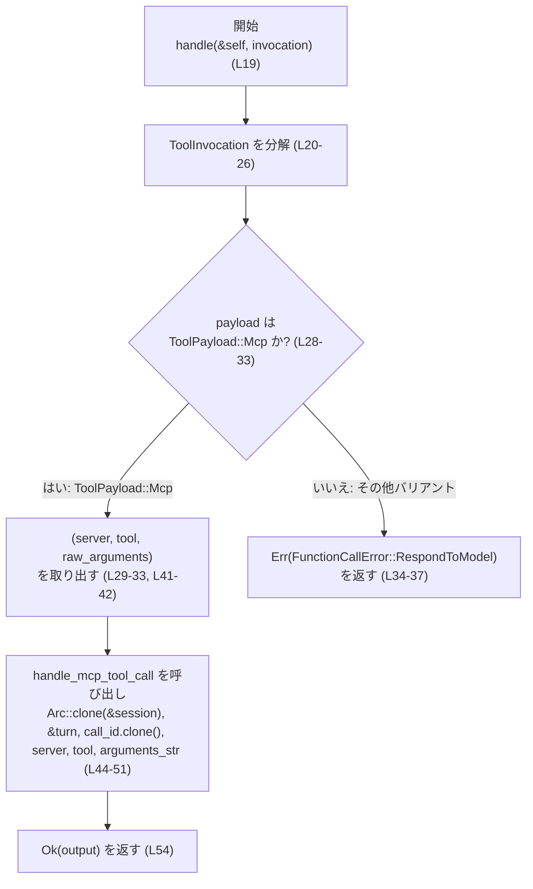
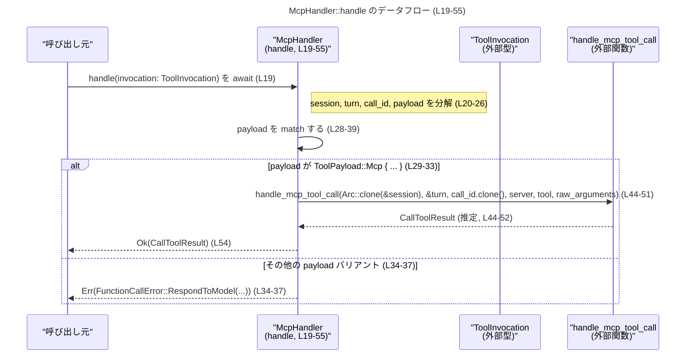

# core/src/tools/handlers/mcp.rs コード解説

## 0. ざっくり一言

`McpHandler` は、汎用的なツール呼び出しコンテキスト `ToolInvocation` から MCP 用のツール呼び出し関数 `handle_mcp_tool_call` を呼び出し、`CallToolResult` を返す非同期ハンドラです（`core/src/tools/handlers/mcp.rs:L11-55`）。

---

## 1. このモジュールの役割

### 1.1 概要

- このモジュールは **MCP 種別のツール呼び出し** を処理するための `ToolHandler` 実装を提供します。
- 具体的には、`ToolInvocation` から `ToolPayload::Mcp` バリアントを取り出し、`handle_mcp_tool_call` に引き渡して実行結果 `CallToolResult` を返します（`core/src/tools/handlers/mcp.rs:L19-52`）。
- MCP 以外のペイロードが渡された場合は `FunctionCallError::RespondToModel` を返し、呼び出し元（おそらくモデル側）にエラーを伝えます（`core/src/tools/handlers/mcp.rs:L28-37`）。

### 1.2 アーキテクチャ内での位置づけ

このファイルで確認できる依存関係は次のとおりです（`core/src/tools/handlers/mcp.rs:L1-9`）。

- 入力:
  - `ToolInvocation`（ツール呼び出しコンテキスト）`core/src/tools/handlers/mcp.rs:L19-26`
- ハンドラ:
  - `McpHandler`（`ToolHandler` トレイト実装）`core/src/tools/handlers/mcp.rs:L11-17, L19-55`
- 外部コンポーネント:
  - `handle_mcp_tool_call`（MCP ツール呼び出しの実処理）`core/src/tools/handlers/mcp.rs:L4, L44-52`
  - エラー型 `FunctionCallError` `core/src/tools/handlers/mcp.rs:L3, L35-37`
  - 種別判定用 `ToolKind::Mcp` `core/src/tools/handlers/mcp.rs:L8, L15-17`
  - 結果型 `CallToolResult` `core/src/tools/handlers/mcp.rs:L9, L13`

これを簡単な依存関係図で表すと次のようになります。

```mermaid
graph TD
    subgraph "core/src/tools/handlers/mcp.rs (L1-56)"
        H["McpHandler<br/>ToolHandler実装 (L11-17, L19-55)"]
    end

    INV["ToolInvocation<br/>(外部型, L19-26)"]
    PAY["ToolPayload::Mcp<br/>(外部enumバリアント, L28-33)"]
    CALL["handle_mcp_tool_call<br/>(外部関数, L4, L44-52)"]
    FERR["FunctionCallError<br/>(外部エラー型, L3, L35-37)"]
    KIND["ToolKind::Mcp<br/>(外部enumバリアント, L8, L15-17)"]
    RES["CallToolResult<br/>(外部型, L9, L13, L54)"]
    ARC["Arc<T><br/>(標準ライブラリ, L1, L44-46)"]

    INV -->|引数 invocation| H
    H -->|payload パターンマッチ| PAY
    H -->|種別判定 kind()| KIND
    H -->|エラー戻り値| FERR
    H -->|セッション共有| ARC
    H -->|ツール呼び出し| CALL
    CALL -->|返却| RES
    H -->|Result<RES, FERR>| INV
```

※ `ToolInvocation` / `ToolPayload` / `ToolHandler` / `ToolKind` / `handle_mcp_tool_call` 自体の定義や詳細な挙動はこのチャンクには現れません。

### 1.3 設計上のポイント

- **ステートレスなハンドラ**  
  `McpHandler` はフィールドを持たない空の構造体であり（`core/src/tools/handlers/mcp.rs:L11-11`）、内部状態を持ちません。インスタンスを複数スレッド・複数リクエストで共有しやすい形になっています。

- **トレイトベースの拡張ポイント**  
  ツールハンドラは `ToolHandler` トレイトとして抽象化され、その一実装として `McpHandler` が定義されています（`core/src/tools/handlers/mcp.rs:L12-17, L19-55`）。これによりツール種別ごとにハンドラを差し替え可能な構造と解釈できます。

- **ツール種別の明示**  
  `kind()` メソッドで `ToolKind::Mcp` を返すことで（`core/src/tools/handlers/mcp.rs:L15-17`）、ハンドラが担当するツール種別を明示しています。

- **型安全なペイロード選別**  
  `ToolPayload` を `match` でパターンマッチし、`ToolPayload::Mcp { ... }` の場合のみ処理を行い、それ以外はエラーを返します（`core/src/tools/handlers/mcp.rs:L28-37`）。これにより **「ハンドラとペイロードの組み合わせの不整合」** を実行時に検出します。

- **所有権と並行性への配慮**  
  セッションオブジェクトは `Arc::clone(&session)` によって共有され（`core/src/tools/handlers/mcp.rs:L44-46`）、`handle_mcp_tool_call` に渡されます。`Arc`（スレッド安全な参照カウント付きポインタ）を用いることで、複数の非同期処理やスレッド間でセッションを共有してもメモリ解放タイミングを安全に管理できます。

- **非同期処理**  
  `handle` メソッドは `async fn` として定義され（`core/src/tools/handlers/mcp.rs:L19-19`）、`handle_mcp_tool_call` の非同期な完了を `.await` で待ちます（`core/src/tools/handlers/mcp.rs:L44-52`）。これにより、I/O を伴う MCP 呼び出しをノンブロッキングで扱えるようになっています。

---

## 2. 主要な機能一覧

### 2.1 機能の箇条書き

- MCP ハンドラ型の提供: `McpHandler` 構造体（`core/src/tools/handlers/mcp.rs:L11-11`）
- ツール種別判定: `McpHandler::kind` による `ToolKind::Mcp` の返却（`core/src/tools/handlers/mcp.rs:L15-17`）
- MCP ツールの非同期実行: `McpHandler::handle` による `handle_mcp_tool_call` の呼び出しと結果の `CallToolResult` への集約（`core/src/tools/handlers/mcp.rs:L19-55`）

### 2.2 コンポーネントインベントリー（型・トレイト）

このチャンクに **定義されている** 主な型は次の 1 つです。

| 名前 | 種別 | 公開性 | 役割 / 用途 | 定義位置 |
|------|------|--------|-------------|----------|
| `McpHandler` | 構造体（フィールドなし） | `pub` | MCP ツールを処理する `ToolHandler` 実装の本体。状態を持たないハンドラとして利用されます。 | `core/src/tools/handlers/mcp.rs:L11-11` |

このチャンクには `ToolInvocation` や `ToolPayload` など他の型の **定義** は含まれておらず、外部モジュールからインポートされているだけです（`core/src/tools/handlers/mcp.rs:L3-9`）。

### 2.3 コンポーネントインベントリー（関数・メソッド）

このチャンクに現れる主なメソッドは次のとおりです。

| 名前 | 種別 | シグネチャ概要 | 役割 / 用途 | 定義位置 |
|------|------|----------------|-------------|----------|
| `McpHandler::kind` | メソッド | `fn kind(&self) -> ToolKind` | このハンドラが扱うツール種別として `ToolKind::Mcp` を返します。 | `core/src/tools/handlers/mcp.rs:L15-17` |
| `McpHandler::handle` | 非同期メソッド | `async fn handle(&self, invocation: ToolInvocation) -> Result<CallToolResult, FunctionCallError>` | `ToolInvocation` から MCP 用ペイロードを取り出し、`handle_mcp_tool_call` を実行して結果を返します。ペイロードが MCP でない場合はエラーを返します。 | `core/src/tools/handlers/mcp.rs:L19-55` |

---

## 3. 公開 API と詳細解説

### 3.1 型一覧（構造体・列挙体など）

| 名前 | 種別 | 役割 / 用途 | 定義位置 |
|------|------|-------------|----------|
| `McpHandler` | 構造体 | MCP 種別のツール呼び出しを処理するための `ToolHandler` 実装。フィールドを持たず、ステートレスなハンドラとして使われます。 | `core/src/tools/handlers/mcp.rs:L11-11` |

`McpHandler` の `Output` 関連型は `CallToolResult` に設定されています（`core/src/tools/handlers/mcp.rs:L13-13`）。

### 3.2 関数詳細

#### `McpHandler::kind(&self) -> ToolKind`

**概要**

- このメソッドは、`McpHandler` が担当するツール種別を表す `ToolKind` を返します（`core/src/tools/handlers/mcp.rs:L15-17`）。
- 実装は `ToolKind::Mcp` を返すだけの単純なものです。

**引数**

| 引数名 | 型 | 説明 |
|--------|----|------|
| `self` | `&McpHandler` | ハンドラ自身への参照です。状態を持たないため、参照は読み取り専用です。 |

**戻り値**

- 型: `ToolKind`
- 意味: このハンドラが処理できるツール種別を表し、常に `ToolKind::Mcp` を返します（`core/src/tools/handlers/mcp.rs:L16-16`）。

**内部処理の流れ**

1. 特に前処理や条件分岐はなく、固定値として `ToolKind::Mcp` を返します（`core/src/tools/handlers/mcp.rs:L15-17`）。

**Examples（使用例）**

`ToolHandler` を扱うコードから種別を確認する例です。`ToolInvocation` の構築方法などはこのチャンクには現れないため、簡略化しています。

```rust
use crate::tools::handlers::mcp::McpHandler;
use crate::tools::registry::ToolKind;

fn is_mcp_handler(handler: &McpHandler) -> bool {
    // kind() が ToolKind::Mcp かどうかを判定する
    handler.kind() == ToolKind::Mcp
}
```

**Errors / Panics**

- このメソッドにはエラーや `panic!` の可能性は見られません。単に列挙体の一値を返すだけです（`core/src/tools/handlers/mcp.rs:L15-17`）。

**Edge cases（エッジケース）**

- 引数 `self` が `&self` であり、所有権やミュータビリティに関するエッジケースはありません。
- 常に同じ値を返すため、入力条件による分岐はありません。

**使用上の注意点**

- `ToolKind` のバリアントはこのチャンクには `Mcp` しか現れません。その他のバリアントが存在するかどうかは不明です。
- ハンドラの種別判定ロジックなどで `kind()` を利用することが想定されますが、その具体的な利用箇所はこのチャンクには現れません。

---

#### `McpHandler::handle(&self, invocation: ToolInvocation) -> Result<CallToolResult, FunctionCallError>`

（本体は `async fn` ですが、非同期関数は実際には `Future<Output = Result<CallToolResult, FunctionCallError>>` を返すとみなせます。`core/src/tools/handlers/mcp.rs:L19-19`）

**概要**

- 汎用的なツール呼び出しコンテキスト `ToolInvocation` を受け取り、その `payload` が `ToolPayload::Mcp` であれば MCP ツール呼び出しを行い、結果として `CallToolResult` を返します（`core/src/tools/handlers/mcp.rs:L19-33, L41-52`）。
- `payload` が MCP 以外のバリアントである場合、`FunctionCallError::RespondToModel` を返して処理を終了します（`core/src/tools/handlers/mcp.rs:L34-37`）。

**引数**

| 引数名 | 型 | 説明 |
|--------|----|------|
| `self` | `&McpHandler` | ハンドラ自身への共有参照です。状態を持たないため、複数の非同期タスクから安全に共有できます（ステートレスであることは `core/src/tools/handlers/mcp.rs:L11-11` から分かります）。 |
| `invocation` | `ToolInvocation` | ツール呼び出しに必要な情報をまとめたコンテキストです。ここでは分割代入により `session`, `turn`, `call_id`, `payload` などのフィールドが取り出されています（`core/src/tools/handlers/mcp.rs:L20-26`）。`ToolInvocation` の完全な定義はこのチャンクには現れません。 |

**戻り値**

- 型: `Result<CallToolResult, FunctionCallError>`
- 意味:
  - `Ok(CallToolResult)`: MCP ツール呼び出しが正常に処理され、`handle_mcp_tool_call` から返された結果をラップしたものです（`core/src/tools/handlers/mcp.rs:L44-52, L54-54`）。
  - `Err(FunctionCallError)`: MCP 用ではないペイロードが渡された場合に `RespondToModel` バリアントで返されます（`core/src/tools/handlers/mcp.rs:L34-37`）。

**内部処理の流れ（アルゴリズム）**

1. 引数 `invocation` を分割代入し、`session`, `turn`, `call_id`, `payload` フィールドを取り出します（`core/src/tools/handlers/mcp.rs:L20-26`）。
2. `payload` に対して `match` を行います（`core/src/tools/handlers/mcp.rs:L28-39`）。
   - `ToolPayload::Mcp { server, tool, raw_arguments }` の場合: 3 つの値をタプル `(server, tool, raw_arguments)` にまとめて返します（`core/src/tools/handlers/mcp.rs:L29-33`）。
   - それ以外のバリアントの場合:  
     `FunctionCallError::RespondToModel("mcp handler received unsupported payload".to_string())` を `Err` として早期リターンします（`core/src/tools/handlers/mcp.rs:L34-37`）。
3. `let (server, tool, raw_arguments) = payload;` によってタプルを再度分解し（`core/src/tools/handlers/mcp.rs:L41-41`）、`arguments_str` に `raw_arguments` を代入します（`core/src/tools/handlers/mcp.rs:L42-42`）。ここでは名前を変えているだけで、変換や検証は行っていません。
4. `handle_mcp_tool_call` を非同期に呼び出します（`core/src/tools/handlers/mcp.rs:L44-51`）。
   - パラメータ:
     - `Arc::clone(&session)`: セッションオブジェクトの共有所有権を増やして渡します（`core/src/tools/handlers/mcp.rs:L44-46`）。
     - `&turn`: `turn` への参照を渡します（`core/src/tools/handlers/mcp.rs:L46-46`）。
     - `call_id.clone()`: `call_id` をクローンして渡します（`core/src/tools/handlers/mcp.rs:L47-47`）。`call_id` が `Clone` を実装していることが示唆されます。
     - `server`, `tool`, `arguments_str`：MCP ツール呼び出しに必要な情報（`core/src/tools/handlers/mcp.rs:L48-50`）。
   - 戻り値は `output` というローカル変数に保存されます（`core/src/tools/handlers/mcp.rs:L44-52`）。
   - `handle_mcp_tool_call` の戻り値型はこのチャンクからは `CallToolResult` であると推測できますが、実際のシグネチャはこのチャンクには現れません。ただし `?` 演算子が使われていないため、この関数呼び出しは `Result` を返さない（少なくとも `handle` の `Err` には直接影響しない）ことが読み取れます。
5. `Ok(output)` を返して処理を終了します（`core/src/tools/handlers/mcp.rs:L54-54`）。

**Mermaid フローチャート（handle 内部処理: L19-55）**



**Examples（使用例）**

`McpHandler` を直接使って MCP ツールを呼び出す例です。`ToolInvocation` の生成方法や `ToolPayload::Mcp` の具体的なフィールド型はこのチャンクには現れないため、コメントで抽象的に示します。

```rust
use std::sync::Arc;

use crate::tools::handlers::mcp::McpHandler;
use crate::tools::context::{ToolInvocation, ToolPayload};
use crate::tools::registry::ToolKind;
use crate::function_tool::FunctionCallError;
use codex_protocol::mcp::CallToolResult;

// 非同期コンテキスト内で呼び出すことを想定
async fn run_mcp_tool(invocation: ToolInvocation) -> Result<CallToolResult, FunctionCallError> {
    let handler = McpHandler;                         // ステートレスなのでそのまま値で生成可能 (L11)

    // 種別チェック（必要な場合）
    assert_eq!(handler.kind(), ToolKind::Mcp);        // kind() は常に ToolKind::Mcp (L15-17)

    // MCP ハンドラとして実行
    let result = handler.handle(invocation).await?;   // handle は async fn (L19)

    Ok(result)
}

// ToolInvocation の生成はこのチャンクには現れないため概略のみ
fn make_mcp_invocation(/* ... */) -> ToolInvocation {
    ToolInvocation {
        // session, turn, call_id などのフィールドを適切に設定
        // payload には ToolPayload::Mcp { server, tool, raw_arguments } を設定する必要がある (L28-33)
        payload: ToolPayload::Mcp {
            server: /* ... */,
            tool: /* ... */,
            raw_arguments: /* ... */,
        },
        // 他のフィールドは .. で補完 (L25-25)
        ..unimplemented!() // 実際の初期化コードはこのチャンクには現れません
    }
}
```

※ `ToolInvocation` / `ToolPayload::Mcp` の構造や `server` / `tool` / `raw_arguments` の型はこのチャンクには現れないため、省略記法とコメントで表現しています。

**Errors / Panics**

- `Err` になるケース（このチャンクから分かる範囲）:
  - `invocation.payload` が `ToolPayload::Mcp { ... }` 以外のバリアントだった場合（`core/src/tools/handlers/mcp.rs:L28-39`）。
    - このとき `FunctionCallError::RespondToModel("mcp handler received unsupported payload")` が返されます（`core/src/tools/handlers/mcp.rs:L34-37`）。
- `handle_mcp_tool_call` 呼び出しでのエラー伝播について:
  - この関数呼び出しに `?` 演算子が使われておらず（`core/src/tools/handlers/mcp.rs:L44-52`）、戻り値がそのまま `output` に代入され `Ok(output)` として返されています（`core/src/tools/handlers/mcp.rs:L54-54`）。
  - したがって、このチャンクからは「`handle_mcp_tool_call` は `CallToolResult` を直接返し、`Result` 型ではない」ように見えますが、実際のシグネチャ定義はこのチャンクには現れません。
  - `handle_mcp_tool_call` 内部で `panic!` が発生し得るかどうかも、このチャンクからは分かりません。

**Bugs / Security（このチャンクから推測できること）**

- `payload` が MCP 以外のときにエラーとして扱うことで、 **誤ったハンドラへのルーティング** を検知できるようになっています（`core/src/tools/handlers/mcp.rs:L28-37`）。
- 一方で、`raw_arguments`（ここでは `arguments_str`）の内容に対するバリデーションやサニタイズは `handle` 内では行われておらず、そのまま `handle_mcp_tool_call` に渡されます（`core/src/tools/handlers/mcp.rs:L41-42, L44-51`）。  
  - 入力検証やセキュリティ上のチェックがどこで行われているかは **このチャンクだけからは分かりません**。  
  - もし `raw_arguments` が外部入力（ユーザー入力やモデル出力）を含む場合、実際のセキュリティ設計は `handle_mcp_tool_call` など別モジュールの責任範囲になります。

**Edge cases（エッジケース）**

- `ToolInvocation.payload` が MCP 以外:
  - 即座に `Err(FunctionCallError::RespondToModel(...))` を返し、`handle_mcp_tool_call` は呼ばれません（`core/src/tools/handlers/mcp.rs:L34-37`）。
- `ToolPayload::Mcp` だが `raw_arguments` が空 / 不正フォーマットなど:
  - `handle` 内では検証されず、そのまま `handle_mcp_tool_call` へ渡されます（`core/src/tools/handlers/mcp.rs:L41-42, L44-51`）。
  - その挙動（エラーになるかどうか）はこのチャンクには現れません。
- `session` が多数回クローンされるケース:
  - `Arc::clone(&session)` は参照カウントを増やすだけであり、所有権の観点では安全です（`core/src/tools/handlers/mcp.rs:L44-46`）。  
    ただし、多数のクローンがメモリ使用量や寿命に与える影響は、`session` のサイズやライフタイム設計次第であり、このチャンクからは分かりません。

**使用上の注意点**

- `invocation.payload` は必ず `ToolPayload::Mcp { ... }` であることが前提です。そうでない場合、`Err(FunctionCallError::RespondToModel)` が返り、MCP ツールは実行されません（`core/src/tools/handlers/mcp.rs:L28-37`）。
- `handle` は `async fn` であるため、`.await` 可能な非同期コンテキスト（例えば `tokio` や `async-std` のランタイム）で使用する必要があります（`core/src/tools/handlers/mcp.rs:L19-19, L52-52`）。
- `McpHandler` 自体はステートレスなので、一つのインスタンスを複数のリクエストで使い回しても競合状態（データレース）は発生しません。Rust の所有権システムと `&self` 引数により、内部状態を持たないことがコンパイル時に保証されています（`core/src/tools/handlers/mcp.rs:L11-11, L12-13`）。
- セッションオブジェクトは `Arc` で共有されているため、複数タスクからの参照によって解放タイミングが遅延する点に注意が必要ですが、その具体的な影響はセッションの実装次第であり、このチャンクには現れません。

### 3.3 その他の関数

- このファイルには、上記 2 つ以外の関数・メソッドは定義されていません（`core/src/tools/handlers/mcp.rs:L11-56`）。

---

## 4. データフロー

このセクションでは、`McpHandler::handle`（`core/src/tools/handlers/mcp.rs:L19-55`）呼び出し時の典型的なデータの流れを示します。

1. 呼び出し元が `ToolInvocation` を構築し、その `payload` に `ToolPayload::Mcp { server, tool, raw_arguments }` を設定します（`core/src/tools/handlers/mcp.rs:L20-26, L28-33`）。
2. 呼び出し元は `McpHandler::handle(invocation)` を `await` します（`core/src/tools/handlers/mcp.rs:L19-19, L44-52`）。
3. `handle` は `ToolInvocation` から必要なフィールド（`session`, `turn`, `call_id`, `payload`）を取り出し（`core/src/tools/handlers/mcp.rs:L20-26`）、`payload` が MCP であることを確認します（`core/src/tools/handlers/mcp.rs:L28-33`）。
4. MCP 用のフィールドを `handle_mcp_tool_call` に渡し、その結果 `CallToolResult` を受け取ります（`core/src/tools/handlers/mcp.rs:L44-52`）。
5. 最終的に `Result<CallToolResult, FunctionCallError>` として呼び出し元に返されます（`core/src/tools/handlers/mcp.rs:L54-54`）。

これをシーケンス図で示します。



---

## 5. 使い方（How to Use）

### 5.1 基本的な使用方法

`McpHandler` を利用する典型的なフローは次のようになります。

1. 呼び出し元で `ToolInvocation` を構築し、`payload` に `ToolPayload::Mcp` バリアントを設定する。
2. `McpHandler` インスタンスを作成（ステートレスなので構築は軽量）。
3. 必要であれば `kind()` で種別確認。
4. `handle(invocation).await` を呼び、`CallToolResult` を取得する。

概略コード例（`ToolInvocation` の詳細は省略）:

```rust
use crate::tools::handlers::mcp::McpHandler;
use crate::tools::context::{ToolInvocation, ToolPayload};
use crate::tools::registry::ToolKind;
use crate::function_tool::FunctionCallError;
use codex_protocol::mcp::CallToolResult;

async fn use_mcp_handler(invocation: ToolInvocation) -> Result<CallToolResult, FunctionCallError> {
    let handler = McpHandler;                          // ステートレスなハンドラ (L11)

    // 種別確認（必要に応じて）
    assert_eq!(handler.kind(), ToolKind::Mcp);         // L15-17

    // 非同期に MCP ツールを実行
    let result = handler.handle(invocation).await?;    // L19, L44-52

    Ok(result)
}
```

### 5.2 よくある使用パターン

1. **共通インターフェースとしての利用（トレイトオブジェクト）**

   `ToolHandler` を実装する複数のハンドラの一つとして `McpHandler` を扱うことが想定されます。トレイト定義はこのチャンクには現れませんが、`type Output = CallToolResult;` から `Output` 関連型を揃えて扱う設計と推測できます（`core/src/tools/handlers/mcp.rs:L12-13`）。

   ```rust
   use std::sync::Arc;
   use crate::tools::handlers::mcp::McpHandler;
   use crate::tools::registry::{ToolHandler, ToolKind};
   use codex_protocol::mcp::CallToolResult;

   // 具体的な ToolHandler トレイト境界はこのチャンクには現れませんが、
   // Output=CallToolResult を持つハンドラとして想定しています。
   fn register_mcp_handler(registry: &mut Vec<Arc<dyn ToolHandler<Output = CallToolResult>>>) {
       let handler = Arc::new(McpHandler);
       registry.push(handler);
   }
   ```

   ※ `ToolHandler` トレイトの正確な定義はこのチャンクには現れないため、ジェネリクス境界はあくまで一例です。

2. **複数リクエストでの使い回し**

   ステートレスであるため、一つの `McpHandler` インスタンスを複数の非同期タスクで共有しても安全です（`core/src/tools/handlers/mcp.rs:L11-11, L19-19`）。所有権の観点からも、`&self` を取るメソッドのみであり、内部に可変状態を持たないことからコンパイル時にデータ競合が防がれます。

### 5.3 よくある間違い

```rust
use crate::tools::handlers::mcp::McpHandler;
use crate::tools::context::{ToolInvocation, ToolPayload};

// 間違い例: payload に MCP 以外のバリアントを設定している
async fn wrong_payload_example(mut invocation: ToolInvocation) {
    // ここで payload に MCP 以外のバリアントをセットしてしまったとする
    // invocation.payload = ToolPayload::...(MCP 以外);
    // ※ 実際の他バリアント名はこのチャンクには現れません

    let handler = McpHandler;
    let result = handler.handle(invocation).await;

    // result は Err(FunctionCallError::RespondToModel(...)) になる (L28-37)
    assert!(result.is_err());
}

// 正しい例: payload に ToolPayload::Mcp を設定する
async fn correct_payload_example(invocation: ToolInvocation) {
    // invocation.payload が ToolPayload::Mcp { ... } であることが前提 (L28-33)

    let handler = McpHandler;
    let result = handler.handle(invocation).await;

    // MCP 呼び出しが行われ、CallToolResult が Ok で返ることが期待される (L44-54)
    // エラーであれば payload の設定を確認する必要がある
}
```

### 5.4 使用上の注意点（まとめ）

- `payload` が `ToolPayload::Mcp` でないときは必ず `Err(FunctionCallError::RespondToModel)` になるため、呼び出し側がハンドラとペイロードの種別を整合させる責任があります（`core/src/tools/handlers/mcp.rs:L28-37`）。
- 非同期関数 `handle` を同期コンテキストから直接呼ぶことはできません。必ず `.await` を伴う非同期ランタイム内で利用する必要があります（`core/src/tools/handlers/mcp.rs:L19-19, L52-52`）。
- 入力検証（例: `raw_arguments` の形式チェック）はこのハンドラ内では行われていないため、どこで検証するかを設計上明確にしておく必要があります（`core/src/tools/handlers/mcp.rs:L41-42, L44-51`）。

---

## 6. 変更の仕方（How to Modify）

### 6.1 新しい機能を追加する場合

`McpHandler` は `handle` 内での前処理・後処理を追加しやすい構造になっています（`core/src/tools/handlers/mcp.rs:L19-55`）。

- **前処理の追加例**
  - `handle_mcp_tool_call` を呼び出す前に `raw_arguments` を検証したり、ログを記録したりする場合は、`let arguments_str = raw_arguments;` の後（`core/src/tools/handlers/mcp.rs:L42-42`）に処理を追加できます。
- **後処理の追加例**
  - `let output = handle_mcp_tool_call(...).await;` の直後（`core/src/tools/handlers/mcp.rs:L44-52`）で `output` をラップしたり、変換したりすることが可能です。

変更時のステップ例:

1. `core/src/tools/handlers/mcp.rs` の `handle` メソッド（L19-55）を開く。
2. 追加したい処理が **ペイロードの前処理** なのか、**MCP 呼び出し後の後処理** なのかを決める。
3. 対応する位置にコードを挿入する。
4. 返り値の型 `Result<CallToolResult, FunctionCallError>` を変えないように注意する（`core/src/tools/handlers/mcp.rs:L19-19, L54-54`）。

### 6.2 既存の機能を変更する場合

- **ペイロード判定ロジックの変更**
  - `ToolPayload::Mcp` 以外のバリアントをサポートする、あるいはエラーの種類を変える場合は `match payload { ... }` 部分（`core/src/tools/handlers/mcp.rs:L28-39`）を変更します。
  - 変更により `handle` のエラー条件が変わるため、呼び出し側の前提条件やテストも合わせて見直す必要があります。

- **エラー文言の変更**
  - 現在のエラーメッセージ `"mcp handler received unsupported payload"` は `FunctionCallError::RespondToModel` に渡されています（`core/src/tools/handlers/mcp.rs:L35-37`）。
  - 文言を変更するとモデル側やログ解析側の挙動に影響する可能性があるため、関連箇所を確認する必要があります。

- **セッションの扱いの変更**
  - `Arc::clone(&session)` を別の所有権戦略に変える場合（例えばクローンせず参照だけにするなど）は、`handle_mcp_tool_call` のシグネチャも合わせて変更する必要があります（`core/src/tools/handlers/mcp.rs:L44-46`）。
  - セッション型のスレッド安全性（`Send`/`Sync`）に関する契約はこのチャンクには現れないため、セッションの定義元で確認が必要です。

---

## 7. 関連ファイル

このモジュールと密接に関係する（インポートされている）ファイル・モジュールとその役割は次のとおりです（`core/src/tools/handlers/mcp.rs:L1-9`）。

| パス / モジュール | 役割 / 関係 |
|-------------------|------------|
| `std::sync::Arc` | セッションオブジェクトの共有所有権を管理するために使用されています（`Arc::clone(&session)`、`core/src/tools/handlers/mcp.rs:L1, L44-46`）。 |
| `crate::function_tool::FunctionCallError` | ツール呼び出し失敗時のエラー型として使用されます。`payload` が MCP でない場合に `RespondToModel` バリアントが返されます（`core/src/tools/handlers/mcp.rs:L3, L34-37`）。 |
| `crate::mcp_tool_call::handle_mcp_tool_call` | MCP ツール呼び出しの実処理を行う非同期関数です。`McpHandler::handle` から呼び出されています（`core/src/tools/handlers/mcp.rs:L4, L44-52`）。定義本体はこのチャンクには現れません。 |
| `crate::tools::context::ToolInvocation` | ツール呼び出しのコンテキストを表す構造体です。`handle` の引数および分割代入に使用されています（`core/src/tools/handlers/mcp.rs:L5, L19-26`）。 |
| `crate::tools::context::ToolPayload` | ツール呼び出しペイロードを表す列挙体です。`ToolPayload::Mcp` バリアントが MCP 用として使われています（`core/src/tools/handlers/mcp.rs:L6, L28-33`）。その他のバリアント定義はこのチャンクには現れません。 |
| `crate::tools::registry::ToolHandler` | ツールハンドラの共通インターフェースを提供するトレイトです。`McpHandler` はこのトレイトを実装しています（`core/src/tools/handlers/mcp.rs:L7, L12-17, L19-55`）。 |
| `crate::tools::registry::ToolKind` | ツール種別を表す列挙体です。`ToolKind::Mcp` が MCP 用ハンドラの識別に使われています（`core/src/tools/handlers/mcp.rs:L8, L15-17`）。 |
| `codex_protocol::mcp::CallToolResult` | MCP ツール呼び出しの結果型です。`McpHandler` の `Output` 関連型および `handle` の成功時の戻り値として利用されています（`core/src/tools/handlers/mcp.rs:L9, L13, L54`）。 |

このファイル自体にはテストコード（`#[cfg(test)]` など）は含まれておらず、テストは別ファイルにあるか、まだ作成されていない可能性があります（`core/src/tools/handlers/mcp.rs:L1-56` にはテスト関連コードが見当たりません）。
