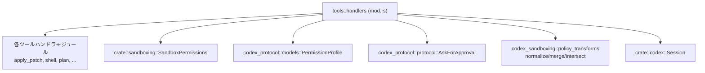

# core/src/tools/handlers/mod.rs

## 0. ざっくり一言

このモジュールは、各種ツールハンドラの集約ポイントであり、  
ツール実行時の JSON 引数パースと、サンドボックスの追加権限（`additional_permissions`）に関する正規化・検証・適用ロジックを提供します。

---

## 1. このモジュールの役割

### 1.1 概要

- このモジュールは **ツールハンドラ群の公開窓口** として、個別モジュールで定義されたハンドラ型を再エクスポートします（`pub use`）。  
  （例: `ApplyPatchHandler`, `ShellHandler` など。mod.rs:L1-19,35,38-53）
- 同時に、ツール呼び出しのための **JSON 引数パースユーティリティ** と、  
  サンドボックスの **追加権限（`PermissionProfile`）の検証・正規化・合成ロジック** を提供します（mod.rs:L55-210）。
- 追加権限は、機能フラグや承認ポリシー（`AskForApproval`）と連動しており、  
  不正な権限要求を拒否するガードとして機能します（mod.rs:L87-142）。

### 1.2 アーキテクチャ内での位置づけ

このモジュールは「ツール実行レイヤ」と「サンドボックス／権限管理レイヤ」の橋渡しを行います。



- ツール呼び出し側は `tools::handlers` から各ハンドラ型をインポートします（mod.rs:L35,38-53）。
- ツールの権限や追加権限は `SandboxPermissions` と `PermissionProfile` で表現され、  
  その解釈・正規化には `codex_sandboxing::policy_transforms` が使われます（mod.rs:L21-23,32,36）。
- `Session` からはセッション単位／ターン単位の既存の付与権限が取得され、  
  それらと新たな `additional_permissions` を合成して「実効権限」が決定されます（mod.rs:L167-210）。

### 1.3 設計上のポイント

- **責務の分割**
  - 各ツール固有の処理は個別モジュール（`apply_patch`, `shell`, `plan` など）に分離し、  
    このファイルではハンドラの再エクスポートと共通ユーティリティのみを扱っています（mod.rs:L1-19,35,38-53）。
- **状態管理**
  - このファイル内には状態を持つ構造体は `EffectiveAdditionalPermissions` のみで、  
    これは「ある呼び出しに対する実効的な追加権限のスナップショット」を表現する軽量なデータコンテナです（mod.rs:L144-148）。
- **エラーハンドリング**
  - 引数パース失敗時は `FunctionCallError::RespondToModel` に変換し、モデル側へ返されることを意図したエラー形式にしています（mod.rs:L55-62）。
  - 権限検証失敗時は `Result<_, String>` で扱い、メッセージ文字列にユーザ／ログ向けの説明を含めています（mod.rs:L87-142）。
- **権限の安全性**
  - `normalize_and_validate_additional_permissions` で機能フラグと承認ポリシーをチェックし、  
    不正な追加権限要求を早期に拒否します（mod.rs:L96-142）。
  - `apply_granted_turn_permissions` でセッション内に事前に付与された権限との関係を解析し、  
    「すでに付与済みかどうか」を `permissions_preapproved` で明示します（mod.rs:L167-210）。
- **非同期処理**
  - `apply_granted_turn_permissions` は `async fn` であり、`Session` からの権限取得を非同期に行います（mod.rs:L167-171,180-181）。  
    共有可変状態やロックはこのファイル内には登場しません。

### 1.4 コンポーネント一覧（インベントリ）

| 種別 | 名前 | 概要 | 定義位置 |
|------|------|------|----------|
| モジュール宣言 | `agent_jobs` ほか複数 | 各ツールハンドラの実装モジュールの宣言のみ。本チャンクでは中身不明。 | mod.rs:L1-19 |
| 再エクスポート | `CodeModeExecuteHandler`, `CodeModeWaitHandler` | `tools::code_mode` からのハンドラ型の再エクスポート。 | mod.rs:L33-34 |
| 再エクスポート | 多数の `*Handler` 型 | `apply_patch`, `dynamic`, `js_repl`, `shell` 等のモジュールで定義されたツールハンドラ型の再エクスポート。 | mod.rs:L35,38-53 |
| 関数 | `parse_arguments` | JSON 文字列を任意型 `T` にデシリアライズする内部ユーティリティ。 | mod.rs:L55-62 |
| 関数 | `parse_arguments_with_base_path` | ベースパスガード付きの JSON 引数パース。 | mod.rs:L64-73 |
| 関数 | `resolve_workdir_base_path` | JSON 引数から `"workdir"` を取得し、作業ディレクトリを決定。 | mod.rs:L75-85 |
| 関数 | `normalize_and_validate_additional_permissions` | 機能フラグ／承認ポリシーと整合するかを検証し、追加権限を正規化。 | mod.rs:L87-142 |
| 型 | `EffectiveAdditionalPermissions` | 実効的な追加権限と、その事前承認状態をまとめた構造体。 | mod.rs:L144-148 |
| 関数 | `implicit_granted_permissions` | 明示指定がない場合に、セッションに紐づく暗黙の追加権限を適用するかを判定。 | mod.rs:L150-165 |
| 関数 (async) | `apply_granted_turn_permissions` | セッション内の既存権限と追加権限を合成し、`EffectiveAdditionalPermissions` を構築。 | mod.rs:L167-210 |
| テスト | 4 つの `#[test]` 関数 | 追加権限の事前承認・機能フラグ・暗黙付与の挙動を検証。 | mod.rs:L212-324 |

---

## 2. 主要な機能一覧

- ツールハンドラの集約と再エクスポート  
  - 複数のツールハンドラ型（`ApplyPatchHandler`, `ShellHandler`, など）を一括で公開（mod.rs:L35,38-53）。
- JSON 引数パースユーティリティ
  - `parse_arguments`: シンプルな `serde_json::from_str` ラッパー（mod.rs:L55-62）。
  - `parse_arguments_with_base_path`: ベースパスガード付きパース（mod.rs:L64-73）。
- 作業ディレクトリ解決
  - `resolve_workdir_base_path`: 引数中の `"workdir"` をもとに `AbsolutePathBuf` を決定（mod.rs:L75-85）。
- 追加権限の検証と正規化
  - `normalize_and_validate_additional_permissions`: 機能フラグ・承認ポリシー・`PermissionProfile` を検証／正規化（mod.rs:L87-142）。
- 実効権限の表現
  - `EffectiveAdditionalPermissions`: 実効の `SandboxPermissions` と `PermissionProfile` をまとめるデータ構造（mod.rs:L144-148）。
- 暗黙の追加権限適用
  - `implicit_granted_permissions`: 明示指定がない場合に、事前に付与された権限を再利用するかを判定（mod.rs:L150-165）。
- セッションからの権限合成（非同期）
  - `apply_granted_turn_permissions`: セッション・ターン単位の付与権限と追加権限を合成し、事前承認されているかどうかを判定（mod.rs:L167-210）。

---

## 3. 公開 API と詳細解説

### 3.1 型一覧（構造体・列挙体など）

#### このファイル内で定義される型

| 名前 | 種別 | 役割 / 用途 | 定義位置 |
|------|------|-------------|----------|
| `EffectiveAdditionalPermissions` | 構造体 | 実効的なサンドボックス権限と追加権限、およびそれが「事前承認済み」かどうかを保持します。 | mod.rs:L144-148 |

フィールド:

- `sandbox_permissions: SandboxPermissions`  
  実際に適用されるサンドボックスレベル（`UseDefault`, `WithAdditionalPermissions`, `RequireEscalated` 等）（型は他モジュール定義。mod.rs:L145）。
- `additional_permissions: Option<PermissionProfile>`  
  実効的な追加権限プロファイル（セッション／ターン付与や明示指定から合成されたもの）（mod.rs:L146）。
- `permissions_preapproved: bool`  
  `additional_permissions` がすでにセッション内で付与済みか（新規要求か）を示すフラグ（mod.rs:L147）。

#### このモジュールから再エクスポートされる主な型

これらは他モジュールで定義され、ここから `pub use` されています。  
詳細な内部構造やメソッドは、このチャンクには現れません。

| 名前 | 種別 | 役割 / 用途（このチャンクから分かる範囲） | 定義位置（再エクスポート） |
|------|------|----------------------------------|--------------------------|
| `CodeModeExecuteHandler` / `CodeModeWaitHandler` | 構造体（ハンドラ） | `tools::code_mode` モジュールのツールハンドラ型。 | mod.rs:L33-34 |
| `ApplyPatchHandler` | 構造体（ハンドラ） | `apply_patch` モジュールのツールハンドラ型。 | mod.rs:L35 |
| `DynamicToolHandler` | 構造体（ハンドラ） | `dynamic` モジュールのツールハンドラ型。 | mod.rs:L38 |
| `JsReplHandler` / `JsReplResetHandler` | 構造体（ハンドラ） | `js_repl` モジュールのツールハンドラ型。 | mod.rs:L39-40 |
| `ListDirHandler` | 構造体（ハンドラ） | `list_dir` モジュールのツールハンドラ型。 | mod.rs:L41 |
| `McpHandler` / `McpResourceHandler` | 構造体（ハンドラ） | MCP 関連のツールハンドラ型。 | mod.rs:L42-43 |
| `PlanHandler` | 構造体（ハンドラ） | `plan` モジュールのツールハンドラ型。 | mod.rs:L44 |
| `RequestPermissionsHandler` / `RequestUserInputHandler` | 構造体（ハンドラ） | 権限要求／ユーザー入力要求ツールハンドラ型。 | mod.rs:L45-46 |
| `ShellHandler` / `ShellCommandHandler` | 構造体（ハンドラ） | シェルコマンド実行関連のツールハンドラ型。 | mod.rs:L47-48 |
| `TestSyncHandler` | 構造体（ハンドラ） | テスト用ツールハンドラ型と思われるが、詳細は不明。 | mod.rs:L49 |
| `ToolSearchHandler` / `ToolSuggestHandler` | 構造体（ハンドラ） | ツール検索／提案関連のハンドラ型。 | mod.rs:L50-51 |
| `UnifiedExecHandler` | 構造体（ハンドラ） | 統合的な実行ハンドラ型。 | mod.rs:L52 |
| `ViewImageHandler` | 構造体（ハンドラ） | 画像表示関連のハンドラ型。 | mod.rs:L53 |

> これらの型のメソッドやフィールドは、このファイルには定義がなく、このチャンクからは分かりません。

---

### 3.2 関数詳細

#### 1. `parse_arguments<T>(arguments: &str) -> Result<T, FunctionCallError>`  

（core/src/tools/handlers/mod.rs:L55-62）

**概要**

- JSON 文字列 `arguments` を、任意のデシリアライズ可能な型 `T` にパースする内部ユーティリティです。
- `serde_json::from_str` のラッパーであり、エラーを `FunctionCallError::RespondToModel` に変換します（mod.rs:L59-61）。

**引数**

| 引数名 | 型 | 説明 |
|--------|----|------|
| `arguments` | `&str` | JSON 形式の引数文字列。トップレベルの型はジェネリック `T` に合わせる必要があります。 |

**戻り値**

- `Ok(T)` — デシリアライズに成功した場合、パースされた値を返します。
- `Err(FunctionCallError)` — JSON が不正、もしくは `T` と整合しない場合にエラーを返します（mod.rs:L59-61）。

**内部処理の流れ**

1. `serde_json::from_str::<T>(arguments)` を呼び出します（mod.rs:L59）。
2. エラーの場合、`FunctionCallError::RespondToModel` にラップし、エラーメッセージ `"failed to parse function arguments: {err}"` を組み立てます（mod.rs:L59-61）。
3. 成功・失敗に応じて `Result<T, FunctionCallError>` を返します。

**Examples（使用例）**

```rust
use serde::Deserialize;
use crate::tools::handlers::parse_arguments; // 同一モジュール内での利用を想定

#[derive(Deserialize)]
struct ToolArgs {
    path: String,
    recursive: bool,
}

fn handle(arguments: &str) -> Result<(), crate::function_tool::FunctionCallError> {
    // JSON: {"path":"/tmp", "recursive":true}
    let args: ToolArgs = parse_arguments(arguments)?; // 成功すると ToolArgs が得られる
    // args.path, args.recursive を使って処理する
    Ok(())
}
```

**Errors / Panics**

- `serde_json::from_str` が返すあらゆるパースエラーが `FunctionCallError::RespondToModel` に変換されます（mod.rs:L59-61）。
- この関数内で `panic!` は使用されていません。

**Edge cases（エッジケース）**

- 空文字列 `""` や不正な JSON: `Err(FunctionCallError)` になります。
- JSON 構造が `T` と一致しない（フィールド不足・型不一致）場合も同様にエラーです。
- 追加フィールドが含まれる場合の挙動は `T` の `Deserialize` 実装に依存し、このチャンクからは分かりません。

**使用上の注意点**

- `T` は `for<'de> Deserialize<'de>` を満たす必要があります（mod.rs:L56-57）。
- エラーは「モデルへの応答」用の形に変換されるため、ユーザ向けメッセージとして表示される前提である可能性があります（`RespondToModel` という名前からの推測）。

---

#### 2. `parse_arguments_with_base_path<T>(arguments: &str, base_path: &AbsolutePathBuf) -> Result<T, FunctionCallError>`  

（core/src/tools/handlers/mod.rs:L64-73）

**概要**

- `parse_arguments` と同様に JSON 文字列をパースしますが、その前に `AbsolutePathBufGuard::new(base_path)` を生成し、  
  パス解決のベースディレクトリを一時的に設定するためのガードを作成します（mod.rs:L71-72）。

**引数**

| 引数名 | 型 | 説明 |
|--------|----|------|
| `arguments` | `&str` | JSON 形式の引数文字列。 |
| `base_path` | `&AbsolutePathBuf` | パス解決の基準とするディレクトリ。ガードに渡されます。 |

**戻り値**

- `parse_arguments` と同様に `Result<T, FunctionCallError>` を返します（mod.rs:L72）。

**内部処理の流れ**

1. `AbsolutePathBufGuard::new(base_path)` を生成します（mod.rs:L71）。  
   - 具体的に何を行うかはこのチャンクには現れませんが、一般的にはスレッドローカルな「現在のベースパス」を設定するガードであることが想定されます。
2. その後、`parse_arguments(arguments)` を呼び出します（mod.rs:L72）。
3. 戻り値はそのまま上位に返します。

**Examples（使用例）**

```rust
use codex_utils_absolute_path::AbsolutePathBuf;
use serde::Deserialize;

#[derive(Deserialize)]
struct Config {
    // ここにパス型などが入る想定
    // e.g., output_dir: AbsolutePathBuf
}

fn handle_with_base(
    arguments: &str,
    cwd: &AbsolutePathBuf,
) -> Result<Config, crate::function_tool::FunctionCallError> {
    // cwd をベースにして arguments をパース
    let cfg: Config = parse_arguments_with_base_path(arguments, cwd)?;
    Ok(cfg)
}
```

**Errors / Panics**

- エラー条件は `parse_arguments` と同じです（mod.rs:L72）。
- `AbsolutePathBufGuard::new` の内部挙動（panic の可能性など）は、このチャンクには現れません。

**Edge cases**

- `base_path` がどのようなパスであっても、この関数自体は検証を行いません。
- `AbsolutePathBufGuard` の実装に依存して、スレッド間で共有した場合の影響などが変わる可能性がありますが、このチャンクからは不明です。

**使用上の注意点**

- パスを含む型をデシリアライズする場合に使用する想定です（`AbsolutePathBufGuard` の利用から推測）。
- ベースパスを一時的に変更するためのスコープを意識する必要があります（ガードがドロップされると元に戻るのが一般的なパターンですが、実装は別ファイルです）。

---

#### 3. `resolve_workdir_base_path(arguments: &str, default_cwd: &AbsolutePathBuf) -> Result<AbsolutePathBuf, FunctionCallError>`  

（core/src/tools/handlers/mod.rs:L75-85）

**概要**

- JSON 文字列 `arguments` を `serde_json::Value` としてパースし、その中の `"workdir"` キーを参照して作業ディレクトリを決定します。
- `"workdir"` が指定されない／空文字の場合は `default_cwd` をそのまま返し、  
  指定されている場合は `default_cwd.join(workdir)` で連結したパスを返します（mod.rs:L80-84）。

**引数**

| 引数名 | 型 | 説明 |
|--------|----|------|
| `arguments` | `&str` | JSON 形式の引数文字列。`{"workdir": "subdir"}` のような形式を想定。 |
| `default_cwd` | `&AbsolutePathBuf` | デフォルトの作業ディレクトリ。`workdir` が無い場合の基準。 |

**戻り値**

- `Ok(AbsolutePathBuf)` — 決定した作業ディレクトリパス。
- `Err(FunctionCallError)` — `arguments` が不正な JSON の場合など、`parse_arguments` が失敗した場合。

**内部処理の流れ**

1. `parse_arguments::<Value>(arguments)?` により JSON を構造体ではなく `serde_json::Value` としてパースします（mod.rs:L79）。
2. `Value::get("workdir")` で `"workdir"` フィールドを取得し、存在しなければ `None`（mod.rs:L81）。
3. 存在すれば `Value::as_str` で文字列かどうかを確認（mod.rs:L82）。
4. 空文字列であれば `filter(|workdir| !workdir.is_empty())` により無視されます（mod.rs:L83）。
5. 最終的に `map_or_else` で
   - `"workdir"` が有効な文字列として存在する場合: `default_cwd.join(workdir)`（mod.rs:L84）
   - そうでない場合: `default_cwd.clone()`（mod.rs:L84）
6. 結果を `Ok(...)` で返します（mod.rs:L80,84-85）。

**Examples（使用例）**

```rust
use codex_utils_absolute_path::AbsolutePathBuf;

fn resolve_example(
    default_cwd: &AbsolutePathBuf,
) -> Result<AbsolutePathBuf, crate::function_tool::FunctionCallError> {
    let args = r#"{ "workdir": "project/src" }"#;
    let workdir = resolve_workdir_base_path(args, default_cwd)?;
    // workdir は default_cwd.join("project/src") になる
    Ok(workdir)
}
```

**Errors / Panics**

- JSON パースに失敗した場合、`FunctionCallError` が返ります（mod.rs:L79）。
- `"workdir"` の値が非文字列（例: 数値）である場合は `as_str` が `None` を返し、`default_cwd` が採用されます。エラーにはなりません。

**Edge cases**

- `"workdir"` が存在しない場合や空文字列の場合: `default_cwd.clone()` が返ります（mod.rs:L83-84）。
- `"workdir"` に相対パス（例: `"../.."`）が指定された場合の安全性は、`AbsolutePathBuf::join` の実装に依存し、このチャンクからは分かりません。
- `"workdir"` が非常に長い文字列など、OS が扱えないパスとなる可能性に対するチェックはこの関数内にはありません。

**使用上の注意点**

- セキュリティ上、ユーザ入力からの `"workdir"` をそのまま `join` しているため、  
  絶対パスや親ディレクトリへの遡りをどこまで許容するかは `AbsolutePathBuf`／サンドボックス層側で管理されている前提です。
- この関数はパスの「正規化（canonicalize）」までは行っておらず、単純な結合のみです。

---

#### 4. `normalize_and_validate_additional_permissions(...) -> Result<Option<PermissionProfile>, String>`  

（core/src/tools/handlers/mod.rs:L87-142）

**概要**

- `with_additional_permissions` オプションに対して、機能フラグ・承認ポリシー・サンドボックス設定の整合性を検証します。
- 不正な条件（機能無効時の新規要求、承認ポリシー不一致、空の権限要求など）を検出し、`Err(String)` で詳細メッセージを返します。
- 正常な場合は、パスベース権限などを `normalize_additional_permissions` で正規化した `PermissionProfile` を返します。

**シグネチャ**

```rust
pub(crate) fn normalize_and_validate_additional_permissions(
    additional_permissions_allowed: bool,
    approval_policy: AskForApproval,
    sandbox_permissions: SandboxPermissions,
    additional_permissions: Option<PermissionProfile>,
    permissions_preapproved: bool,
    _cwd: &Path,
) -> Result<Option<PermissionProfile>, String>
```

（mod.rs:L89-96）

**引数**

| 引数名 | 型 | 説明 |
|--------|----|------|
| `additional_permissions_allowed` | `bool` | 機能フラグ（例: `features.exec_permission_approvals`）が有効かどうか（テストより推測）。 |
| `approval_policy` | `AskForApproval` | 追加権限要求時の承認ポリシー（`OnRequest`, `Granular`, など）。 |
| `sandbox_permissions` | `SandboxPermissions` | 現在のサンドボックスレベル（`WithAdditionalPermissions` 等）。 |
| `additional_permissions` | `Option<PermissionProfile>` | 呼び出し元が要求する追加権限（ネットワーク・ファイルシステム等）。 |
| `permissions_preapproved` | `bool` | 追加権限がすでに事前承認済みかどうか（テスト名より「preapproved」）。 |
| `_cwd` | `&Path` | 現在の作業ディレクトリ。現コードでは使用されていません（mod.rs:L95）。 |

**戻り値**

- `Ok(Some(PermissionProfile))` — `sandbox_permissions` が追加権限を使用し、要求が正当かつ正規化に成功した場合。
- `Ok(None)` — 追加権限を使用しない、かつ `additional_permissions` も指定されていない場合。
- `Err(String)` — 条件違反や不正な要求が見つかった場合。エラーメッセージには理由が含まれます。

**内部処理の流れ**

1. `uses_additional_permissions` を計算  
   `sandbox_permissions` が `SandboxPermissions::WithAdditionalPermissions` かどうかを `matches!` で判定します（mod.rs:L97-100）。

2. **機能フラグによる基本チェック**（新規要求禁止）  

   ```rust
   if !permissions_preapproved
       && !additional_permissions_allowed
       && (uses_additional_permissions || additional_permissions.is_some())
   ```

   に該当する場合、  
   `"additional permissions are disabled; enable ..."` というエラーを返します（mod.rs:L102-109）。

   - つまり、**事前承認されていない新規の追加権限要求**は、機能フラグが無効な場合には許可されません。

3. `uses_additional_permissions == true` の場合の詳細チェック（mod.rs:L112-132）
   1. `permissions_preapproved` が `false` で、かつ `approval_policy` が `AskForApproval::OnRequest` でない場合、  
      `"approval policy is ...; reject command — you cannot request additional permissions unless the approval policy is OnRequest"` というエラーを返します（mod.rs:L113-116）。
   2. `additional_permissions` が `None` の場合、  
      `"missing`additional_permissions`; provide at least one of`network` or `file_system`..."` というエラーを返します（mod.rs:L118-123）。
   3. `normalize_additional_permissions(additional_permissions)` を呼び出し、正規化されたプロファイルを取得します（mod.rs:L124）。
      - エラー条件や具体的な正規化内容は `normalize_additional_permissions` 実装に依存し、このチャンクからは分かりません。
   4. 正規化結果が空プロファイル（`.is_empty()`）の場合、  

      ```text
      `additional_permissions` must include at least one requested permission in `network` or `file_system`
      ```

      というエラーを返します（mod.rs:L125-129）。
   5. 正常な場合は `Ok(Some(normalized))` を返します（mod.rs:L131）。

4. `uses_additional_permissions == false` の場合（mod.rs:L134-141）
   - `additional_permissions.is_some()` の場合、  

     ```text
     `additional_permissions` requires `sandbox_permissions` set to `with_additional_permissions`
     ```

     というエラーを返します（mod.rs:L134-138）。
   - そうでなければ（追加権限を使わず、追加権限要求もない場合）`Ok(None)` を返します（mod.rs:L139-141）。

**Examples（使用例）**

テストコードに基づく典型例を示します。

```rust
use codex_protocol::protocol::{AskForApproval, GranularApprovalConfig};
use crate::sandboxing::SandboxPermissions;
use codex_protocol::models::PermissionProfile;

// 事前承認済みの追加権限は、機能フラグが false でも許可される（mod.rs:L248-270）
fn use_preapproved_permissions(
    profile: PermissionProfile,
) -> Result<Option<PermissionProfile>, String> {
    normalize_and_validate_additional_permissions(
        /*additional_permissions_allowed*/ false,
        AskForApproval::Granular(GranularApprovalConfig {
            sandbox_approval: true,
            rules: true,
            skill_approval: true,
            request_permissions: false,
            mcp_elicitations: true,
        }),
        SandboxPermissions::WithAdditionalPermissions,
        Some(profile),
        /*permissions_preapproved*/ true,
        std::path::Path::new("/"),
    )
}
```

**Errors / Panics**

主なエラー条件:

- 機能フラグが無効・事前承認なしで追加権限を要求した場合（mod.rs:L102-109）。
- 承認ポリシーが `OnRequest` 以外の状態で新規追加権限を要求した場合（mod.rs:L112-116）。
- `SandboxPermissions::WithAdditionalPermissions` なのに `additional_permissions` が `None` の場合（mod.rs:L118-123）。
- 正規化後に空の `PermissionProfile` になった場合（mod.rs:L124-129）。
- `SandboxPermissions` が追加権限を使わない設定なのに、`additional_permissions` が指定されている場合（mod.rs:L134-138）。

この関数内に `panic!` はありません。

**Edge cases**

- `permissions_preapproved == true` の場合、機能フラグ `additional_permissions_allowed` が `false` でも  
  追加権限が許可されるパスがあります（テスト `preapproved_permissions_work_when...` がこの挙動を検証。mod.rs:L248-270）。
- `_cwd` 引数は現在使われておらず、将来の拡張やインターフェース整合性のために残されていると考えられます（mod.rs:L95）。  
  このため、呼び出し時に何を渡しても現状の挙動には影響しません。
- `normalize_additional_permissions` のエラー条件やパス正規化の詳細は、このチャンクからは分かりません。

**使用上の注意点**

- この関数は `String` でエラーを返すため、呼び出し側でログやユーザ向けメッセージにそのまま出すことが前提とされている可能性があります。
- `permissions_preapproved` を `true` に設定すると、「機能フラグを無視してでも実行してよい事前承認済み権限」であると解釈されるため、  
  どの条件でこのフラグをセットするかは上位レイヤで慎重に扱う必要があります。
- セキュリティ上重要なガードロジックであるため、機能フラグや `AskForApproval` の意味を変更する際は、この関数の条件式の影響範囲を確認する必要があります。

---

#### 5. `implicit_granted_permissions(...) -> Option<PermissionProfile>`  

（core/src/tools/handlers/mod.rs:L150-165）

**概要**

- 現在の呼び出しで明示的な `additional_permissions` が指定されていない場合に限り、  
  セッション等に紐づく「暗黙の（sticky）追加権限」を再利用するかどうかを判定します。
- 実際の再利用条件は `sandbox_permissions` と `effective_additional_permissions` に基づいて決まります。

**シグネチャ**

```rust
pub(super) fn implicit_granted_permissions(
    sandbox_permissions: SandboxPermissions,
    additional_permissions: Option<&PermissionProfile>,
    effective_additional_permissions: &EffectiveAdditionalPermissions,
) -> Option<PermissionProfile>
```

（mod.rs:L150-154）

**引数**

| 引数名 | 型 | 説明 |
|--------|----|------|
| `sandbox_permissions` | `SandboxPermissions` | 現在の呼び出しに対するサンドボックス設定。 |
| `additional_permissions` | `Option<&PermissionProfile>` | 呼び出し側が明示的に指定した追加権限（参照）。 |
| `effective_additional_permissions` | `&EffectiveAdditionalPermissions` | すでに合成済みの実効追加権限情報。 |

**戻り値**

- `Some(PermissionProfile)` — 暗黙の追加権限を適用するべき場合、そのプロファイルをクローンして返します。
- `None` — 暗黙の適用を行わない場合。

**内部処理の流れ**

```rust
if !sandbox_permissions.uses_additional_permissions()
    && !matches!(sandbox_permissions, SandboxPermissions::RequireEscalated)
    && additional_permissions.is_none()
{
    effective_additional_permissions
        .additional_permissions
        .clone()
} else {
    None
}
```

（mod.rs:L155-163）

条件:

1. `sandbox_permissions.uses_additional_permissions()` が `false`  
   → 現在の呼び出し自体は追加権限を要求していない。
2. `sandbox_permissions` が `RequireEscalated` ではない  
   → 特殊なエスカレーションモードではない（mod.rs:L156）。
3. `additional_permissions.is_none()`  
   → 呼び出し側で明示的な追加権限指定がない（mod.rs:L157）。

これらすべてを満たすときのみ、`effective_additional_permissions.additional_permissions.clone()` を返します（mod.rs:L159-161）。

**Examples（使用例）**

テストに基づく例:

```rust
use crate::sandboxing::SandboxPermissions;

fn example_implicit(
    eff: &EffectiveAdditionalPermissions,
) -> Option<codex_protocol::models::PermissionProfile> {
    implicit_granted_permissions(
        SandboxPermissions::UseDefault, // 追加権限を明示的に要求していない
        None,                           // inline な additional_permissions も指定しない
        eff,
    )
}
```

**Errors / Panics**

- この関数は `Option` を返すだけであり、エラー型や `panic!` は使用していません。

**Edge cases**

- `effective_additional_permissions.additional_permissions` が `None` の場合、  
  条件を満たしても `None` が返ります（`.clone()` が `None` を返すため）。
- `SandboxPermissions::WithAdditionalPermissions` か、`additional_permissions` が `Some` の場合は、常に `None` が返ります。  
  テスト `explicit_inline_permissions_do_not_use_implicit_sticky_grant_path` がこれを確認しています（mod.rs:L310-323）。

**使用上の注意点**

- 暗黙の「sticky」権限適用は、ユーザから見えない形で権限が拡大する可能性があるため、  
  どのタイミングで `EffectiveAdditionalPermissions` を構築し、ここに渡すかが安全性上重要です。
- 明示的な inline 権限指定がある場合は暗黙適用を無効にしているため、  
  呼び出し側は「明示指定すると sticky グラントが無視される」挙動を前提とすることになります。

---

#### 6. `apply_granted_turn_permissions(...) -> EffectiveAdditionalPermissions`（async）  

（core/src/tools/handlers/mod.rs:L167-210）

**概要**

- `Session` からセッション／ターン単位で付与された権限を取得し、  
  呼び出しで要求された `additional_permissions` と合成して「実効的な追加権限」を算出します。
- 同時に、その実効権限が「すべて既存の付与権限の範囲内か」（＝事前承認済みかどうか）を判定し、  
  `permissions_preapproved` フラグとして返します。

**シグネチャ**

```rust
pub(super) async fn apply_granted_turn_permissions(
    session: &Session,
    sandbox_permissions: SandboxPermissions,
    additional_permissions: Option<PermissionProfile>,
) -> EffectiveAdditionalPermissions
```

（mod.rs:L167-171）

**引数**

| 引数名 | 型 | 説明 |
|--------|----|------|
| `session` | `&Session` | 現在のセッションコンテキスト。セッション／ターン単位の権限取得に使用されます。 |
| `sandbox_permissions` | `SandboxPermissions` | 現在のサンドボックスレベル。 |
| `additional_permissions` | `Option<PermissionProfile>` | 呼び出しで明示的に要求された追加権限。 |

**戻り値**

- `EffectiveAdditionalPermissions`  
  - `sandbox_permissions`: 必要に応じて `WithAdditionalPermissions` に書き換えられた実効サンドボックス設定（mod.rs:L198-203,205-207）。
  - `additional_permissions`: セッション／ターン付与および明示指定をマージした実効追加権限（mod.rs:L186-189,207）。
  - `permissions_preapproved`: 実効追加権限がすべて既存の付与権限の範囲内なら `true`、そうでなければ `false`（mod.rs:L190-196,208）。

**内部処理の流れ**

1. **エスカレーションモードの早期リターン**（mod.rs:L172-177）

   ```rust
   if matches!(sandbox_permissions, SandboxPermissions::RequireEscalated) {
       return EffectiveAdditionalPermissions {
           sandbox_permissions,
           additional_permissions,
           permissions_preapproved: false,
       };
   }
   ```

   - エスカレーションモードでは、セッション権限を参照せず、そのままの `sandbox_permissions` と `additional_permissions` を返します。
   - この場合、`permissions_preapproved` は常に `false` です。

2. **セッション／ターン権限の取得**（mod.rs:L180-181）

   ```rust
   let granted_session_permissions = session.granted_session_permissions().await;
   let granted_turn_permissions = session.granted_turn_permissions().await;
   ```

   - それぞれの戻り値の型はこのチャンクには現れませんが、後続の `merge_permission_profiles` から `Option<PermissionProfile>` であることが推測されます。

3. **付与済み権限のマージ**（mod.rs:L182-185）

   ```rust
   let granted_permissions = merge_permission_profiles(
       granted_session_permissions.as_ref(),
       granted_turn_permissions.as_ref(),
   );
   ```

   - セッション単位とターン単位の権限をマージした「付与済み権限」を作成します。

4. **明示指定とのマージ**（mod.rs:L186-189）

   ```rust
   let effective_permissions = merge_permission_profiles(
       additional_permissions.as_ref(),
       granted_permissions.as_ref(),
   );
   ```

   - 明示指定された追加権限があればそれも含めた「実効追加権限」を構築します。

5. **事前承認判定**（mod.rs:L190-196）

   ```rust
   let permissions_preapproved = match (effective_permissions.as_ref(), granted_permissions) {
       (Some(effective_permissions), Some(granted_permissions)) => {
           intersect_permission_profiles(effective_permissions.clone(), granted_permissions)
               == *effective_permissions
       }
       _ => false,
   };
   ```

   - 実効権限 `effective_permissions` と付与済み権限 `granted_permissions` の共通部分（intersection）を取り、  
     それが `effective_permissions` と完全に一致する場合、  
     「実効追加権限はすべてすでに付与済みである」と判断し、`permissions_preapproved = true` とします。
   - どちらかが `None` の場合や、一部が未事前承認である場合は `false` となります。

6. **`sandbox_permissions` の調整**（mod.rs:L198-203）

   ```rust
   let sandbox_permissions =
       if effective_permissions.is_some() && !sandbox_permissions.uses_additional_permissions() {
           SandboxPermissions::WithAdditionalPermissions
       } else {
           sandbox_permissions
       };
   ```

   - 実効追加権限が存在し、元の `sandbox_permissions` が追加権限を使わない設定であれば、  
     `SandboxPermissions::WithAdditionalPermissions` に書き換えます。

7. **結果の構築と返却**（mod.rs:L205-209）

   ```rust
   EffectiveAdditionalPermissions {
       sandbox_permissions,
       additional_permissions: effective_permissions,
       permissions_preapproved,
   }
   ```

**Examples（使用例）**

擬似コードレベルの例です（`Session` 型の具体はこのチャンクから不明）。

```rust
use crate::codex::Session;
use crate::sandboxing::SandboxPermissions;
use codex_protocol::models::PermissionProfile;

async fn prepare_permissions(
    session: &Session,
    sandbox: SandboxPermissions,
    requested: Option<PermissionProfile>,
) -> EffectiveAdditionalPermissions {
    apply_granted_turn_permissions(session, sandbox, requested).await
}
```

**Errors / Panics**

- この関数自体は `Result` を返さず、エラー型も扱っていません。
- `session` メソッドや `merge_permission_profiles`／`intersect_permission_profiles` 内部でのエラー・panic の可能性は、このチャンクからは分かりません。

**Edge cases**

- `SandboxPermissions::RequireEscalated` の場合、セッション側の権限を一切参照しません（mod.rs:L172-177）。
- `requested`（`additional_permissions`）が `Some` だが、`granted_permissions` が `None` の場合、  
  `permissions_preapproved` は `false` となります（`match` の `_ => false`。mod.rs:L190-196）。
- 実効権限が `Some` かつ `sandbox_permissions.uses_additional_permissions() == false` の場合、  
  `sandbox_permissions` が自動的に `WithAdditionalPermissions` に切り替わります（mod.rs:L198-203）。

**使用上の注意点**

- 非同期関数であるため、呼び出し側は `async` コンテキスト内で `.await` する必要があります。
- 事前承認判定ロジックは `normalize_and_validate_additional_permissions` と組み合わせて使われることが想定されますが、  
  本ファイル内で両者が直接呼び合っているわけではありません。呼び出し順序は上位レイヤの設計次第です。

---

### 3.3 その他の関数

このファイル内の主な関数はすべて上記で詳細解説済みです。  
テスト関数（`#[test]`）は「テスト」セクションでまとめて扱います。

---

## 4. データフロー

ここでは、`apply_granted_turn_permissions` を中心とした権限合成のデータフローを示します。

### 4.1 処理の要点

- 入力:
  - セッション（`Session`）
  - 呼び出し時の `sandbox_permissions`
  - 明示的に要求された `additional_permissions`
- セッションから、すでに許可済みの追加権限を取得します（セッション／ターン単位）。
- それらをマージし、「実効追加権限」を作成します。
- 実効追加権限がすべて既存の付与権限内に収まっているかどうかを判定し、`permissions_preapproved` を計算します。
- 必要に応じて `sandbox_permissions` を `WithAdditionalPermissions` に上書きしたうえで返します。

### 4.2 シーケンス図

`apply_granted_turn_permissions` のフロー（mod.rs:L167-210）を Mermaid のシーケンス図で表します。

```mermaid
sequenceDiagram
    title apply_granted_turn_permissions (core/src/tools/handlers/mod.rs:L167-210)
    participant Caller as 呼び出し側
    participant Handlers as tools::handlers
    participant Session as Session
    participant Policy as policy_transforms

    Caller->>Handlers: apply_granted_turn_permissions(session, sandbox, additional)
    alt sandbox_permissions == RequireEscalated
        Handlers-->>Caller: EffectiveAdditionalPermissions {sandbox, additional, preapproved=false}
    else 通常ケース
        Handlers->>Session: granted_session_permissions().await
        Session-->>Handlers: Option<PermissionProfile>
        Handlers->>Session: granted_turn_permissions().await
        Session-->>Handlers: Option<PermissionProfile>

        Handlers->>Policy: merge_permission_profiles(session_perm, turn_perm)
        Policy-->>Handlers: granted_permissions

        Handlers->>Policy: merge_permission_profiles(additional, granted_permissions)
        Policy-->>Handlers: effective_permissions

        Handlers->>Policy: intersect_permission_profiles(effective_permissions, granted_permissions)
        Policy-->>Handlers: intersection

        Handlers-->>Caller: EffectiveAdditionalPermissions {
            sandbox_permissions (調整済み),
            additional_permissions = effective_permissions,
            permissions_preapproved = (intersection == effective_permissions)
        }
    end
```

---

## 5. 使い方（How to Use）

### 5.1 基本的な使用方法

典型的なフローは次のようになります（擬似コード）。  

1. リクエストから JSON 形式のツール引数を取得。
2. 追加権限を必要とする場合は `PermissionProfile` と `SandboxPermissions` を組み立てる。
3. `apply_granted_turn_permissions` でセッション内の既存権限と合成。
4. 必要に応じて `normalize_and_validate_additional_permissions` に通す。
5. 各ツールハンドラを実行。

```rust
use crate::codex::Session;
use crate::sandboxing::SandboxPermissions;
use codex_protocol::models::PermissionProfile;
use crate::tools::handlers::{
    apply_granted_turn_permissions,
    normalize_and_validate_additional_permissions,
    EffectiveAdditionalPermissions,
    ShellHandler,
};

async fn handle_shell_tool(
    session: &Session,
    json_args: &str,
    sandbox_permissions: SandboxPermissions,
    additional_permissions: Option<PermissionProfile>,
) -> Result<(), Box<dyn std::error::Error>> {
    // 1. セッション・ターンの granted 権限と追加権限をマージ
    let eff: EffectiveAdditionalPermissions =
        apply_granted_turn_permissions(session, sandbox_permissions, additional_permissions).await;

    // 2. 追加権限の正規化とポリシー検証
    let normalized_additional = normalize_and_validate_additional_permissions(
        /*additional_permissions_allowed*/ true,
        /*approval_policy*/ codex_protocol::protocol::AskForApproval::OnRequest,
        eff.sandbox_permissions,
        eff.additional_permissions.clone(),
        eff.permissions_preapproved,
        std::path::Path::new("/"), // _cwd は現在未使用
    )?;

    // 3. 正常であれば、ShellHandler などのツールハンドラに渡して実行
    let handler = ShellHandler { /* フィールドは別モジュール定義 */ };
    // handler.execute(..., normalized_additional, ...); // 実際の API はこのチャンクから不明

    Ok(())
}
```

> 上記は、API 関数同士の組み合わせ例を示すものであり、`ShellHandler` の具体的な使い方は別モジュールの定義に依存します。

---

### 5.2 よくある使用パターン

1. **JSON 引数のパース + 作業ディレクトリ決定**

```rust
use codex_utils_absolute_path::AbsolutePathBuf;

#[derive(serde::Deserialize)]
struct ToolArgs {
    workdir: Option<String>,
    // その他の引数...
}

fn parse_args_and_resolve_cwd(
    args_json: &str,
    default_cwd: &AbsolutePathBuf,
) -> Result<(ToolArgs, AbsolutePathBuf), crate::function_tool::FunctionCallError> {
    // 生の JSON を Value として扱い、workdir を解決
    let workdir = resolve_workdir_base_path(args_json, default_cwd)?;
    // 同じ JSON から構造化引数も取得したい場合
    let args: ToolArgs = parse_arguments(args_json)?;
    Ok((args, workdir))
}
```

1. **事前承認済み権限の利用**

テスト `preapproved_permissions_work_when...` が示すように、事前承認済みの場合は機能フラグが `false` でも許可できます（mod.rs:L248-270）。

```rust
fn use_preapproved_profile(
    profile: codex_protocol::models::PermissionProfile,
) -> Result<Option<PermissionProfile>, String> {
    normalize_and_validate_additional_permissions(
        false, // additional_permissions_allowed
        codex_protocol::protocol::AskForApproval::OnRequest,
        SandboxPermissions::WithAdditionalPermissions,
        Some(profile),
        true, // permissions_preapproved
        std::path::Path::new("/"),
    )
}
```

---

### 5.3 よくある間違い

```rust
use crate::sandboxing::SandboxPermissions;
use codex_protocol::models::PermissionProfile;

// 間違い例: sandbox_permissions が WithAdditionalPermissions でないのに additional_permissions を指定する
fn wrong_usage(profile: PermissionProfile) -> Result<Option<PermissionProfile>, String> {
    normalize_and_validate_additional_permissions(
        true,
        codex_protocol::protocol::AskForApproval::OnRequest,
        SandboxPermissions::UseDefault,     // ← 追加権限を許可していない
        Some(profile),                      // ← しかし additional_permissions は指定
        false,
        std::path::Path::new("/"),
    )
    // => "`additional_permissions` requires `sandbox_permissions` set to `with_additional_permissions`"
}

// 正しい例: WithAdditionalPermissions を明示する
fn correct_usage(profile: PermissionProfile) -> Result<Option<PermissionProfile>, String> {
    normalize_and_validate_additional_permissions(
        true,
        codex_protocol::protocol::AskForApproval::OnRequest,
        SandboxPermissions::WithAdditionalPermissions,  // ← 追加権限モード
        Some(profile),
        false,
        std::path::Path::new("/"),
    )
}
```

---

### 5.4 使用上の注意点（まとめ）

- **権限関連（セキュリティ）**
  - `normalize_and_validate_additional_permissions` は、機能フラグと承認ポリシーを前提に「何が許されるか」を判定します。  
    上位レイヤでフラグやポリシーの意味づけを変更する際は、この関数の条件式との整合性が重要です（mod.rs:L102-116）。
  - 暗黙の付与（`implicit_granted_permissions`）は、ユーザから見えない形で権限を継続利用するものであり、  
    どのスコープまで有効とするかを慎重に設計する必要があります（mod.rs:L150-165,292-307）。
- **パス安全性**
  - `resolve_workdir_base_path` は文字列としての `workdir` を `default_cwd.join` するだけであり、  
    パス正規化やディレクトリトラバーサル対策は `AbsolutePathBuf` 側の実装に依存します（mod.rs:L80-84）。
- **非同期処理**
  - `apply_granted_turn_permissions` は `async` であり、呼び出し側は非同期ランタイム内で `.await` する必要があります（mod.rs:L167-171）。
  - セッションメソッドの実装次第では、I/O を伴う可能性があるため、高頻度での呼び出しは性能に影響する場合があります（詳細はこのチャンクには現れません）。
- **エラー取り扱い**
  - 引数パースエラーは `FunctionCallError`（モデルへの応答向け）で返される一方、  
    権限検証エラーは `String` で返されるため、呼び出し側でのログ・表示方法を統一する必要があります。

---

## 6. 変更の仕方（How to Modify）

### 6.1 新しい機能を追加する場合

1. **新しいツールハンドラの追加**
   - 対応するファイル（例: `core/src/tools/handlers/new_tool.rs`）を作成し、ハンドラ型を定義します。
   - この `mod.rs` に `mod new_tool;` を追加し（mod.rs:L1-19 に倣う）、  
     必要に応じて `pub use new_tool::NewToolHandler;` を追加して公開します（mod.rs:L35,38-53）。

2. **追加権限の扱いを拡張する**
   - 新しい権限種別を `PermissionProfile` に追加する場合は、  
     `normalize_additional_permissions` や `merge_permission_profiles` の実装も更新する必要があります（mod.rs:L21-23）。
   - そのうえで、`normalize_and_validate_additional_permissions` が「空プロファイル判定」（`.is_empty()`）を適切に扱えるか確認します（mod.rs:L124-129）。

### 6.2 既存の機能を変更する場合

- **影響範囲の確認**
  - `normalize_and_validate_additional_permissions` や `apply_granted_turn_permissions` は、  
    テストモジュールを含め複数箇所から呼び出されている可能性があります。  
    まず `rg` などで関数名を検索し、使用箇所を確認する必要があります。
- **契約（前提条件）の確認**
  - `normalize_and_validate_additional_permissions` の契約:
    - `SandboxPermissions::WithAdditionalPermissions` のときに `additional_permissions` を `Some` にすること。
    - `additional_permissions_allowed`／`permissions_preapproved`／`approval_policy` の組み合わせにより許可・拒否が変わること。
  - `apply_granted_turn_permissions` の契約:
    - `Session::granted_session_permissions`／`granted_turn_permissions` が `Option<PermissionProfile>` 相当であることを前提としています（`merge_permission_profiles` の呼び出しからの推測。mod.rs:L182-189）。
- **関連テストの更新**
  - テスト `preapproved_permissions_work_when...` など（mod.rs:L248-324）は、挙動の仕様として重要です。  
    挙動変更に応じてテストの期待値も調整する必要があります。

---

## 7. 関連ファイル

このモジュールと密接に関係するファイル・ディレクトリ（このチャンクから分かる範囲）は次の通りです。

| パス | 役割 / 関係 |
|------|------------|
| `core/src/tools/handlers/apply_patch.rs` | `ApplyPatchHandler` を定義するモジュール（mod.rs:L2,35）。 |
| `core/src/tools/handlers/dynamic.rs` | `DynamicToolHandler` を定義するモジュール（mod.rs:L3,38）。 |
| `core/src/tools/handlers/js_repl.rs` | `JsReplHandler`, `JsReplResetHandler` を定義するモジュール（mod.rs:L4,39-40）。 |
| `core/src/tools/handlers/list_dir.rs` | `ListDirHandler` を定義するモジュール（mod.rs:L5,41）。 |
| `core/src/tools/handlers/mcp.rs` | `McpHandler` を定義するモジュール（mod.rs:L6,42）。 |
| `core/src/tools/handlers/mcp_resource.rs` | `McpResourceHandler` を定義するモジュール（mod.rs:L7,43）。 |
| `core/src/tools/handlers/plan.rs` | `PlanHandler` を定義するモジュール（mod.rs:L11,44）。 |
| `core/src/tools/handlers/request_permissions.rs` | `RequestPermissionsHandler` を定義するモジュール（mod.rs:L12,45）。 |
| `core/src/tools/handlers/request_user_input.rs` | `RequestUserInputHandler` を定義するモジュール（mod.rs:L13,46）。 |
| `core/src/tools/handlers/shell.rs` | `ShellHandler`, `ShellCommandHandler` を定義するモジュール（mod.rs:L14,47-48）。 |
| `core/src/tools/handlers/test_sync.rs` | `TestSyncHandler` を定義するモジュール（mod.rs:L15,49）。 |
| `core/src/tools/handlers/tool_search.rs` | `ToolSearchHandler` を定義するモジュール（mod.rs:L16,50）。 |
| `core/src/tools/handlers/tool_suggest.rs` | `ToolSuggestHandler` を定義するモジュール（mod.rs:L17,51）。 |
| `core/src/tools/handlers/unified_exec.rs` | `UnifiedExecHandler` を定義するモジュール（mod.rs:L18,52）。 |
| `core/src/tools/handlers/view_image.rs` | `ViewImageHandler` を定義するモジュール（mod.rs:L19,53）。 |
| `core/src/tools/code_mode.rs` | `CodeModeExecuteHandler`, `CodeModeWaitHandler` を定義するモジュール（mod.rs:L33-34）。 |
| `codex_sandboxing::policy_transforms` | 追加権限の正規化・マージ・インターセクト処理を提供する外部モジュール（mod.rs:L21-23）。 |
| `core/src/sandboxing.rs`（推定） | `SandboxPermissions` 型を定義するモジュール（mod.rs:L32）。 |
| `codex_protocol::models` | `PermissionProfile` や詳細な権限型を定義するモジュール（mod.rs:L36,218-220）。 |
| `codex_protocol::protocol` | `AskForApproval`, `GranularApprovalConfig` 等の承認ポリシーを定義するモジュール（mod.rs:L37,221-222）。 |
| `core/src/codex.rs`（推定） | `Session` 型を定義するモジュール（mod.rs:L30）。 |

> 上記のうち、`core/src/...` 以下の正確なファイルパスは、このチャンクに含まれる `mod` 宣言からの推定であり、  
> 実際のディレクトリ構成はリポジトリ全体を参照する必要があります。
