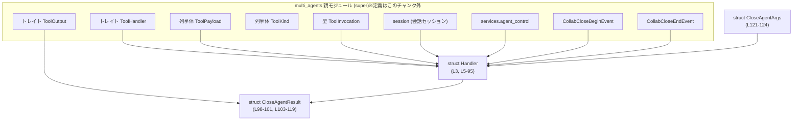
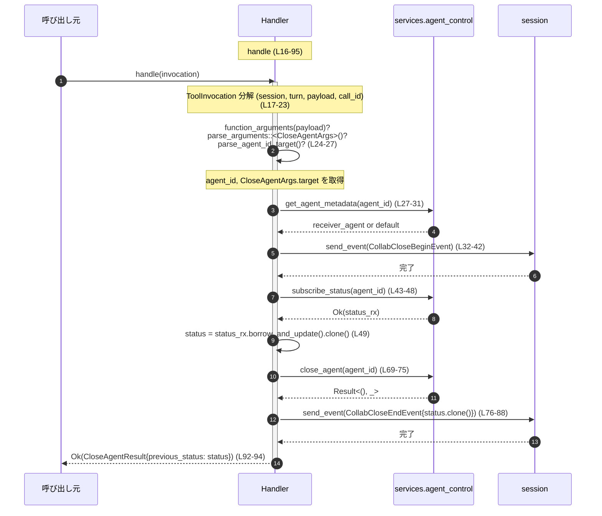

# core/src/tools/handlers/multi_agents/close_agent.rs

## 0. ざっくり一言

マルチエージェント環境で「特定エージェントを閉じる」ためのツールハンドラと、その結果オブジェクトを定義するモジュールです。ツール呼び出しからターゲットエージェントを特定し、開始／終了イベントを送りつつ、非同期にエージェントをクローズします（`Handler::handle` が中核処理です `core/src/tools/handlers/multi_agents/close_agent.rs:L16-95`）。

---

## 1. このモジュールの役割

### 1.1 概要

このモジュールは、ツール実行基盤からのリクエストに応じて、あるエージェントを終了させる処理を提供します。

- ツール呼び出しのペイロードから「どのエージェントを閉じるか」を解析します（`CloseAgentArgs` `core/src/tools/handlers/multi_agents/close_agent.rs:L24-27,121-124`）。
- エージェントのメタデータやステータスを取得し、コラボレーション開始／終了イベントをセッションに送信します（`CollabCloseBeginEvent` / `CollabCloseEndEvent` `core/src/tools/handlers/multi_agents/close_agent.rs:L32-42,52-65,76-88`）。
- 非同期にエージェントをクローズし、その「クローズ前のステータス」を `CloseAgentResult` として返します（`core/src/tools/handlers/multi_agents/close_agent.rs:L69-75,92-94,98-101`）。

### 1.2 アーキテクチャ内での位置づけ

`Handler` はツール基盤で定義された `ToolHandler` トレイトの実装として動作し、`ToolInvocation` から必要な情報を取り出して `agent_control` サービスに処理を委譲します（`core/src/tools/handlers/multi_agents/close_agent.rs:L5-7,16-23,27-31,43-47,69-75`）。



※親モジュールやサービス (`agent_control` など) の具体的な定義位置や型は、このチャンクには現れていません。

### 1.3 設計上のポイント

コードから読み取れる設計上の特徴は次のとおりです。

- **トレイト駆動のハンドラ**  
  - `Handler` はフィールドを持たない空構造体として定義され、`ToolHandler` トレイト実装を通じて動作を与えられています（`core/src/tools/handlers/multi_agents/close_agent.rs:L3,L5-7`）。
- **ペイロード種別の明示的フィルタリング**  
  - `kind` は `ToolKind::Function` を返し、`matches_kind` は `ToolPayload::Function` だけを扱うことを明示しています（`core/src/tools/handlers/multi_agents/close_agent.rs:L8-14`）。
- **非同期処理とサービス連携**  
  - `handle` は `async fn` として定義され、セッション・サービスに対する複数の非同期呼び出し（`send_event`, `subscribe_status`, `get_status`, `close_agent`）を行います（`core/src/tools/handlers/multi_agents/close_agent.rs:L16,32-42,43-48,51-52,69-75`）。
- **イベント駆動の状態通知**  
  - 処理開始時に `CollabCloseBeginEvent`、終了時に `CollabCloseEndEvent` を送信しており、成功／失敗に関わらず終了イベントを送るように設計されています（`core/src/tools/handlers/multi_agents/close_agent.rs:L32-42,52-65,76-88`）。
- **Result と `?` によるエラーハンドリング**  
  - 引数のパースやエージェント ID の解釈失敗時には `?` により即座に `FunctionCallError` を返し、それ以降の処理は実行されません（`core/src/tools/handlers/multi_agents/close_agent.rs:L24-27`）。
  - `agent_control` からのエラーは `collab_agent_error` を経由して統一的なエラー型に変換しています（`core/src/tools/handlers/multi_agents/close_agent.rs:L50-51,66,69-75`）。
- **Rust の安全性**  
  - このファイル内には `unsafe` ブロックは存在せず（`core/src/tools/handlers/multi_agents/close_agent.rs:全体`）、所有権と `async`/`await` を用いた通常の安全な Rust コードになっています。

### 1.4 コンポーネント一覧（インベントリー）

| 名前 | 種別 | 役割 / 用途 | 定義位置 |
|------|------|-------------|----------|
| `Handler` | 構造体（空） | `ToolHandler` 実装用のハンドラ型。状態を持たず、型レベルで役割を示す | `core/src/tools/handlers/multi_agents/close_agent.rs:L3` |
| `impl ToolHandler for Handler` | トレイト実装 | ツール種別・対応ペイロード種別・実際の処理 (`handle`) を定義 | `core/src/tools/handlers/multi_agents/close_agent.rs:L5-95` |
| `Handler::kind` | メソッド | このハンドラが扱うツール種別として `ToolKind::Function` を返す | `core/src/tools/handlers/multi_agents/close_agent.rs:L8-10` |
| `Handler::matches_kind` | メソッド | ペイロードが `ToolPayload::Function` かどうかを判定 | `core/src/tools/handlers/multi_agents/close_agent.rs:L12-14` |
| `Handler::handle` | 非同期メソッド | ツール呼び出しを処理し、エージェントをクローズして結果を返す中核ロジック | `core/src/tools/handlers/multi_agents/close_agent.rs:L16-95` |
| `CloseAgentResult` | 構造体 | クローズ前のエージェントステータスを保持する結果オブジェクト | `core/src/tools/handlers/multi_agents/close_agent.rs:L98-101` |
| `impl ToolOutput for CloseAgentResult` | トレイト実装 | ログ出力・レスポンス生成・コードモード結果出力の標準化 | `core/src/tools/handlers/multi_agents/close_agent.rs:L103-119` |
| `CloseAgentResult::log_preview` | メソッド | ログ用に JSON テキストを生成 | `core/src/tools/handlers/multi_agents/close_agent.rs:L104-106` |
| `CloseAgentResult::success_for_logging` | メソッド | ログ上の成功フラグとして常に `true` を返す | `core/src/tools/handlers/multi_agents/close_agent.rs:L108-110` |
| `CloseAgentResult::to_response_item` | メソッド | ツール呼び出しの結果を `ResponseInputItem` に変換 | `core/src/tools/handlers/multi_agents/close_agent.rs:L112-114` |
| `CloseAgentResult::code_mode_result` | メソッド | コードモード用の JSON 結果を生成 | `core/src/tools/handlers/multi_agents/close_agent.rs:L116-118` |
| `CloseAgentArgs` | 構造体（非公開） | 引数として受け取る `target`（エージェント指定文字列）を保持 | `core/src/tools/handlers/multi_agents/close_agent.rs:L121-124` |

---

## 2. 主要な機能一覧

このモジュールが提供する主な機能は次のとおりです。

- エージェントクローズツールのハンドラ定義  
  - `Handler` が `ToolHandler` として登録され、ツール種別 `Function` を扱うことを示します（`core/src/tools/handlers/multi_agents/close_agent.rs:L3,L5-10`）。
- ツールペイロードからのターゲットエージェント解釈  
  - `function_arguments` → `parse_arguments::<CloseAgentArgs>` → `parse_agent_id_target` という流れで、文字列 `target` からエージェント ID を導出します（`core/src/tools/handlers/multi_agents/close_agent.rs:L24-27,121-124`）。
- エージェントメタデータとステータスの取得  
  - `get_agent_metadata` と `subscribe_status`/`get_status` を通じて、対象エージェントのニックネーム・ロール・ステータスを取得します（`core/src/tools/handlers/multi_agents/close_agent.rs:L27-31,43-52`）。
- コラボレーション開始／終了イベントの送信  
  - クローズ処理の前後で `CollabCloseBeginEvent` / `CollabCloseEndEvent` をセッションに送信し、UI や他コンポーネントに進行状況を通知します（`core/src/tools/handlers/multi_agents/close_agent.rs:L32-42,52-65,76-88`）。
- エージェントの非同期クローズ処理  
  - `agent_control.close_agent(agent_id)` を非同期に実行し、その成否を `Result` として扱います（`core/src/tools/handlers/multi_agents/close_agent.rs:L69-75`）。
- クローズ前ステータスの返却と出力フォーマット化  
  - クローズ前のステータスを `CloseAgentResult.previous_status` として返却し（`core/src/tools/handlers/multi_agents/close_agent.rs:L68-69,92-94,98-101`）、さらにログ・レスポンス・コードモード用の出力フォーマットを `ToolOutput` 実装で提供します（`core/src/tools/handlers/multi_agents/close_agent.rs:L103-118`）。

---

## 3. 公開 API と詳細解説

ここでは、モジュール内の主要な型とメソッドを解説します。  
※ `pub(crate)` のため crate 内部公開ですが、ツール処理としての「外部からの呼び出しポイント」となるため、ここで「公開 API」として扱います。

### 3.1 型一覧（構造体など）

| 名前 | 種別 | 役割 / 用途 | 主なフィールド | 根拠 |
|------|------|-------------|----------------|------|
| `Handler` | 構造体 | エージェントクローズツールのハンドラ。`ToolHandler` を実装し、`handle` でクローズ処理を行う | フィールドなし（ゼロサイズ） | `core/src/tools/handlers/multi_agents/close_agent.rs:L3,L5-7` |
| `CloseAgentResult` | 構造体 | クローズ前のエージェントステータスを返す結果オブジェクト。`ToolOutput` を実装しログ・レスポンス生成を担当 | `previous_status: AgentStatus` | `core/src/tools/handlers/multi_agents/close_agent.rs:L98-101,103-118` |
| `CloseAgentArgs` | 構造体（非公開） | ツール引数のパース結果。`target` 文字列としてクローズ対象エージェントを表現 | `target: String` | `core/src/tools/handlers/multi_agents/close_agent.rs:L121-124` |

### 3.2 関数詳細（重要メソッド）

#### `Handler::kind(&self) -> ToolKind`

**概要**

このハンドラが扱うツールの種別を返します。ここでは常に `ToolKind::Function` を返し、「関数呼び出し型のツール」であることを示します（`core/src/tools/handlers/multi_agents/close_agent.rs:L8-10`）。

**引数**

| 引数名 | 型 | 説明 |
|--------|----|------|
| `&self` | `&Handler` | ハンドラ自身への参照。状態は持たないため引数としての意味はほぼ型識別のみです。 |

**戻り値**

- `ToolKind`  
  - ツールの種別。ここでは `ToolKind::Function` を返します（`core/src/tools/handlers/multi_agents/close_agent.rs:L9`）。

**内部処理の流れ**

1. 何も条件分岐せずに `ToolKind::Function` を返すだけです（`core/src/tools/handlers/multi_agents/close_agent.rs:L8-10`）。

**Examples（使用例）**

```rust
fn is_function_handler(handler: &Handler) -> bool {
    // kind() が ToolKind::Function かどうかで判定する
    matches!(handler.kind(), ToolKind::Function)
}
```

※ `ToolKind` の定義はこのチャンクには現れませんが、`ToolKind::Function` というバリアントが存在することはコードから読み取れます（`core/src/tools/handlers/multi_agents/close_agent.rs:L9`）。

**Errors / Panics**

- エラーやパニックを起こす要素はありません（定数返却のみ）。

**Edge cases**

- ありません（状態に依存せず常に同じ値を返します）。

**使用上の注意点**

- ハンドラの種別は固定であり、外部設定などで変わる設計にはなっていません。

---

#### `Handler::matches_kind(&self, payload: &ToolPayload) -> bool`

**概要**

与えられた `ToolPayload` が、このハンドラの対象となるペイロードであるかを判定します。ここでは `ToolPayload::Function { .. }` かどうかをパターンマッチで確認します（`core/src/tools/handlers/multi_agents/close_agent.rs:L12-14`）。

**引数**

| 引数名 | 型 | 説明 |
|--------|----|------|
| `&self` | `&Handler` | ハンドラ自身への参照（状態なし）。 |
| `payload` | `&ToolPayload` | ツール呼び出し時に与えられるペイロード。種別により内容が変わると推測されますが、このチャンクでは `Function` バリアントの存在のみが確認できます。 |

**戻り値**

- `bool`  
  - `payload` が `ToolPayload::Function { .. }` なら `true`、それ以外なら `false` です（`core/src/tools/handlers/multi_agents/close_agent.rs:L12-14`）。

**内部処理の流れ**

1. `matches!` マクロにより `payload` が `ToolPayload::Function { .. }` にマッチするかを確認します（`core/src/tools/handlers/multi_agents/close_agent.rs:L13`）。
2. マッチすれば `true`、そうでなければ `false` を返します。

**Examples（使用例）**

```rust
fn should_dispatch_to_close_agent(handler: &Handler, payload: &ToolPayload) -> bool {
    handler.matches_kind(payload)
}
```

**Errors / Panics**

- パニックやエラーは発生しません（単純なパターンマッチのみ）。

**Edge cases**

- 他のバリアント（例: 非 Function 系）の `ToolPayload` が渡された場合は `false` になります。

**使用上の注意点**

- `handle` を呼び出す前に、このメソッドで対象ペイロードかどうかをフィルタするのが前提設計と考えられます。そうしないと、`function_arguments(payload)` でエラーになる可能性があります（`core/src/tools/handlers/multi_agents/close_agent.rs:L24`）。

---

#### `Handler::handle(&self, invocation: ToolInvocation) -> Result<CloseAgentResult, FunctionCallError>`

**概要**

ツール呼び出し全体を処理する非同期メソッドです。引数ペイロードからターゲットエージェントを特定し、コラボレーション開始イベントの送信・ステータスの取得・エージェントのクローズ・終了イベント送信を行った上で、クローズ前のステータスを `CloseAgentResult` として返します（`core/src/tools/handlers/multi_agents/close_agent.rs:L16-95`）。

**引数**

| 引数名 | 型 | 説明 |
|--------|----|------|
| `&self` | `&Handler` | ハンドラ自身。状態は持たないため主にトレイト実装のための受け皿です。 |
| `invocation` | `ToolInvocation` | セッション・ターン情報・ペイロード・呼び出し ID などを含むツール呼び出しコンテキストです（フィールドは分解代入から読み取れます `core/src/tools/handlers/multi_agents/close_agent.rs:L17-23`）。 |

**戻り値**

- `Result<CloseAgentResult, FunctionCallError>`  
  - 成功時: `CloseAgentResult`（クローズ前のエージェントステータスを含む）。  
  - 失敗時: `FunctionCallError`（パースエラーや `agent_control` サービスからのエラーなどが `collab_agent_error` 等でラップされたものと推測されますが、詳細な型定義はこのチャンクにはありません）。

**内部処理の流れ（アルゴリズム）**

1. **`ToolInvocation` の分解**  
   - `session`, `turn`, `payload`, `call_id` を取り出します（`core/src/tools/handlers/multi_agents/close_agent.rs:L17-23`）。

2. **引数のパースとターゲット解釈**  
   - `function_arguments(payload)?` でペイロードから引数部分を抽出し（`core/src/tools/handlers/multi_agents/close_agent.rs:L24`）、  
   - それを `parse_arguments::<CloseAgentArgs>(&arguments)?` で `CloseAgentArgs { target }` にデシリアライズします（`core/src/tools/handlers/multi_agents/close_agent.rs:L25,121-124`）。  
   - `parse_agent_id_target(&args.target)?` で `target` 文字列から `agent_id` を取得します（`core/src/tools/handlers/multi_agents/close_agent.rs:L26`）。

3. **エージェントメタデータの取得**  
   - `session.services.agent_control.get_agent_metadata(agent_id).unwrap_or_default()` で、対象エージェントのメタデータを取得します。取得に失敗した場合はデフォルト値を用います（`core/src/tools/handlers/multi_agents/close_agent.rs:L27-31`）。
   - 取得したメタデータから、後で終了イベント用に `agent_nickname` と `agent_role` を利用します（`core/src/tools/handlers/multi_agents/close_agent.rs:L59-60,83-84`）。

4. **クローズ開始イベントの送信**  
   - `CollabCloseBeginEvent { call_id: call_id.clone(), sender_thread_id: session.conversation_id, receiver_thread_id: agent_id }` を `session.send_event(&turn, ...).await` で送信します（`core/src/tools/handlers/multi_agents/close_agent.rs:L32-42`）。

5. **ステータス購読／取得**  
   - `session.services.agent_control.subscribe_status(agent_id).await` を呼び出し、ステータスの購読を試みます（`core/src/tools/handlers/multi_agents/close_agent.rs:L43-48`）。
   - 成功 (`Ok(mut status_rx)`) の場合: `status_rx.borrow_and_update().clone()` により最新ステータスを取得し、それを `status` 変数に格納します（`core/src/tools/handlers/multi_agents/close_agent.rs:L49`）。
   - 失敗 (`Err(err)`) の場合:  
     - `get_status(agent_id).await` でステータスを単発取得し（`core/src/tools/handlers/multi_agents/close_agent.rs:L51-52`）、  
     - そのステータス・メタデータを使って `CollabCloseEndEvent` を送信します（`core/src/tools/handlers/multi_agents/close_agent.rs:L52-65`）。  
     - `collab_agent_error(agent_id, err)` でエラーをラップして `Err` として返し、処理を終了します（`core/src/tools/handlers/multi_agents/close_agent.rs:L66`）。

6. **エージェントのクローズ処理**  
   - `session.services.agent_control.close_agent(agent_id).await` を呼び出し、その結果に `map_err(|err| collab_agent_error(agent_id, err))` を適用して `FunctionCallError` に変換します（`core/src/tools/handlers/multi_agents/close_agent.rs:L69-75`）。
   - 成功時の返り値は `map(|_| ())` により `()` に捨てられ、`Result<(), FunctionCallError>` 型の `result` が得られます（`core/src/tools/handlers/multi_agents/close_agent.rs:L69-75`）。

7. **クローズ終了イベントの送信**  
   - 成功パスでは、`CollabCloseEndEvent` をもう一度送信します（成功・失敗を問わず「終了」を通知する設計）（`core/src/tools/handlers/multi_agents/close_agent.rs:L76-88`）。  
   - このとき `previous_status` として使う `status` は、`status.clone()` を通じてイベントに埋め込まれます（`core/src/tools/handlers/multi_agents/close_agent.rs:L80-86`）。

8. **クローズ結果の確認と返却**  
   - `result?;` により、`close_agent` が失敗していればここで `Err(FunctionCallError)` を返します（`core/src/tools/handlers/multi_agents/close_agent.rs:L90`）。  
   - 成功していれば `Ok(CloseAgentResult { previous_status: status })` を返します（`core/src/tools/handlers/multi_agents/close_agent.rs:L92-94`）。

**Rust特有の安全性・並行性の観点**

- 所有権・借用  
  - `invocation` は値として受け取り、分解代入によりフィールドの所有権を `session`, `turn`, `payload`, `call_id` に移動します（`core/src/tools/handlers/multi_agents/close_agent.rs:L17-23`）。  
  - これらは `async fn` 内で `await` をまたいで用いられますが、すべてローカル変数として所有されており、コンパイラがライフタイムとスレッドセーフ性を検証します。
- `async`/`await`  
  - `send_event`, `subscribe_status`, `get_status`, `close_agent` の各呼び出しは `await` を伴う非同期 I/O であり、CPU ブロッキングを避けつつ処理を進める設計になっています（`core/src/tools/handlers/multi_agents/close_agent.rs:L32-42,43-48,51-52,69-75,76-88`）。
- `Result` と `?` によるエラー制御  
  - 引数パースや `agent_control` のエラーは `?` や `map_err` を通じて明示的に扱われ、例外ではなく戻り値で伝播されます（`core/src/tools/handlers/multi_agents/close_agent.rs:L24-27,50-51,66,69-75`）。

**Examples（使用例）**

`Handler::handle` を呼び出してエージェントをクローズする最小限の例です（周辺型はこのチャンク外で定義されている前提です）。

```rust
// 非同期コンテキスト内の例
async fn close_agent_with_handler(
    handler: &Handler,
    invocation: ToolInvocation,             // 呼び出し元で構築されたコンテキスト
) -> Result<CloseAgentResult, FunctionCallError> {
    // Handler に処理を委譲する
    handler.handle(invocation).await        // 成功時は CloseAgentResult、失敗時は FunctionCallError
}
```

**Errors / Panics**

- `Result::Err(FunctionCallError)` となる代表的ケース（コードから読み取れる範囲）:
  - `function_arguments(payload)` が失敗した場合（ペイロードの形式不正など）（`core/src/tools/handlers/multi_agents/close_agent.rs:L24`）。
  - `parse_arguments::<CloseAgentArgs>(&arguments)` が失敗した場合（`target` が期待する JSON 形式でない等）（`core/src/tools/handlers/multi_agents/close_agent.rs:L25,121-124`）。
  - `parse_agent_id_target(&args.target)` が失敗した場合（ターゲット文字列がエージェント ID として無効な場合）（`core/src/tools/handlers/multi_agents/close_agent.rs:L26`）。
  - `subscribe_status(agent_id)` がエラーを返し、`collab_agent_error(agent_id, err)` でラップされる場合（`core/src/tools/handlers/multi_agents/close_agent.rs:L43-48,50-51,66`）。
  - `close_agent(agent_id)` がエラーを返し、`map_err` でラップされる場合（`core/src/tools/handlers/multi_agents/close_agent.rs:L69-75,90`）。
- パニックの可能性:
  - このチャンク内では `unwrap` は使われておらず、`unwrap_or_default` のみです（`core/src/tools/handlers/multi_agents/close_agent.rs:L30-31`）。  
    `unwrap_or_default` 自体はパニックしないため、このファイル内から直接パニックを起こすコードは読み取れません。

**Edge cases（エッジケース）**

- **引数が不正な場合**  
  - `payload` が `ToolPayload::Function` でない場合でも、フレームワーク側が `matches_kind` を確認せずに `handle` を呼べば、`function_arguments(payload)` が失敗し `Err(FunctionCallError)` になります（`core/src/tools/handlers/multi_agents/close_agent.rs:L12-14,24`）。
- **`subscribe_status` が失敗する場合**  
  - `subscribe_status` が `Err` を返した場合、`get_status` で単発取得したステータスと共に終了イベントを送信し、その直後にエラーを返して処理を終了します（`core/src/tools/handlers/multi_agents/close_agent.rs:L50-66`）。  
  - この場合、`close_agent` は呼び出されません。
- **メタデータ未取得の場合**  
  - `get_agent_metadata(agent_id)` が `None` などを返した場合は `unwrap_or_default()` によりデフォルト値が使われます（`core/src/tools/handlers/multi_agents/close_agent.rs:L27-31`）。  
    デフォルト値の中身はこのチャンクからは不明ですが、少なくとも `agent_nickname` と `agent_role` フィールドにアクセスできる構造体であることがわかります（`core/src/tools/handlers/multi_agents/close_agent.rs:L59-60,83-84`）。
- **`close_agent` が失敗する場合**  
  - 終了イベント (`CollabCloseEndEvent`) は `close_agent` の成功／失敗に関わらず送信された後で `result?` によるエラー判定が行われます（`core/src/tools/handlers/multi_agents/close_agent.rs:L76-90`）。  
  - つまり、失敗しても「終了イベント」は一度送信されますが、その中の `status` はクローズ前に取得した値のままです（`core/src/tools/handlers/multi_agents/close_agent.rs:L68-69,80-86`）。

**使用上の注意点**

- `matches_kind` を通さずに `handle` を直接呼び出さない前提の設計と考えられます。
- エージェントの「クローズ後の」ステータスではなく、「クローズ前の」ステータスを返す点に注意が必要です（フィールド名 `previous_status` と取得タイミングから判断できます `core/src/tools/handlers/multi_agents/close_agent.rs:L49,68-69,92-94,98-101`）。
- 非同期処理を含むため、`handle` の呼び出しは必ず async ランタイム内で `.await` する必要があります。

---

#### `CloseAgentResult::log_preview(&self) -> String`

**概要**

ツール結果をログ用に短い JSON 文字列として出力するためのメソッドです。`tool_output_json_text(self, "close_agent")` を呼び出しています（`core/src/tools/handlers/multi_agents/close_agent.rs:L104-106`）。

**引数**

| 引数名 | 型 | 説明 |
|--------|----|------|
| `&self` | `&CloseAgentResult` | クローズ結果（`previous_status` を含む）への参照。 |

**戻り値**

- `String`  
  - ログ用に整形された JSON 文字列と推測されますが、具体的なフォーマットは `tool_output_json_text` の実装に依存し、このチャンクには現れません。

**内部処理の流れ**

1. `tool_output_json_text(self, "close_agent")` を呼び出して、その戻り値をそのまま返します（`core/src/tools/handlers/multi_agents/close_agent.rs:L104-106`）。

**Examples（使用例）**

```rust
fn log_close_agent_result(result: &CloseAgentResult) {
    let preview = result.log_preview();  // JSON 形式のログ文字列を取得
    println!("close_agent result: {}", preview);
}
```

**Errors / Panics**

- このメソッド自体は `Result` を返さず、内部でエラーを返す処理も見えません。  
  `tool_output_json_text` がパニックしない前提であれば、安全に呼び出せます。

**Edge cases**

- `previous_status` の値が何であっても、そのままシリアライズされると考えられます。

**使用上の注意点**

- ログ用途を想定したメソッドであり、ユーザー向けレスポンスには `to_response_item` を利用する設計になっています。

---

#### `CloseAgentResult::success_for_logging(&self) -> bool`

**概要**

ログ出力の際に、このツール呼び出しが成功として扱われるかどうかを示すフラグを返します。ここでは常に `true` を返します（`core/src/tools/handlers/multi_agents/close_agent.rs:L108-110`）。

**引数**

| 引数名 | 型 | 説明 |
|--------|----|------|
| `&self` | `&CloseAgentResult` | 結果オブジェクト。値は参照するだけで使用しません。 |

**戻り値**

- `bool`  
  - 常に `true`。

**内部処理の流れ**

1. `true` を返すだけです（`core/src/tools/handlers/multi_agents/close_agent.rs:L108-110`）。

**使用上の注意点**

- 実際の処理失敗時には `CloseAgentResult` 自体が返らない（`Result::Err` が返る）ため、「`CloseAgentResult` が存在する＝成功」とみなす設計になっていると解釈できます。

---

#### `CloseAgentResult::to_response_item(&self, call_id: &str, payload: &ToolPayload) -> ResponseInputItem`

**概要**

ツールの呼び出し結果を、レスポンス用の `ResponseInputItem` 型に変換します。内部で共通関数 `tool_output_response_item` を呼び出しています（`core/src/tools/handlers/multi_agents/close_agent.rs:L112-114`）。

**引数**

| 引数名 | 型 | 説明 |
|--------|----|------|
| `&self` | `&CloseAgentResult` | クローズ結果。 |
| `call_id` | `&str` | ツール呼び出し ID。イベントなどでも使用される ID と同じ形式と考えられます（`core/src/tools/handlers/multi_agents/close_agent.rs:L36,56,80`）。 |
| `payload` | `&ToolPayload` | 元のツールペイロード。レスポンス生成に利用されます。 |

**戻り値**

- `ResponseInputItem`  
  - 具体的なフィールドはこのチャンクには存在しませんが、ツールレスポンスの一部として UI や上位レイヤーに渡される型と推測されます。

**内部処理の流れ**

1. `tool_output_response_item(call_id, payload, self, Some(true), "close_agent")` を呼び出し、その結果をそのまま返します（`core/src/tools/handlers/multi_agents/close_agent.rs:L112-114`）。

**使用上の注意点**

- 成功フラグとして `Some(true)` を常に渡しているため、`CloseAgentResult` が生成されているケースはすべて成功として扱われます。

---

#### `CloseAgentResult::code_mode_result(&self, _payload: &ToolPayload) -> JsonValue`

**概要**

「コードモード」と呼ばれる文脈向けに、ツール結果を JSON 形式 (`JsonValue`) で返すメソッドです（`core/src/tools/handlers/multi_agents/close_agent.rs:L116-118`）。

**引数**

| 引数名 | 型 | 説明 |
|--------|----|------|
| `&self` | `&CloseAgentResult` | クローズ結果。 |
| `_payload` | `&ToolPayload` | 元ペイロード。変数名が `_payload` であることから、ここでは使用していません。 |

**戻り値**

- `JsonValue`  
  - 具体的には JSON 表現（おそらく `serde_json::Value` の別名）と推測されますが、別名定義はこのチャンクには現れません。

**内部処理の流れ**

1. `tool_output_code_mode_result(self, "close_agent")` を呼び出して、その戻り値を返します（`core/src/tools/handlers/multi_agents/close_agent.rs:L116-118`）。

---

### 3.3 その他の関数

このファイルには、上記以外の自由関数や簡単なラッパー関数は定義されていません。すべての処理は `ToolHandler` / `ToolOutput` のメソッドとして実装されています。

---

## 4. データフロー

ここでは、`Handler::handle` が成功した場合の代表的なデータフローを説明します（`handle (L16-95)`）。

### 4.1 処理の要点

- 入力: `ToolInvocation`（セッション・ペイロード・呼び出し ID を含む）。
- 中間データ:
  - `CloseAgentArgs.target`（エージェント指定文字列）から `agent_id` を導出。
  - `agent_control` サービスからメタデータとステータスを取得。
- 出力:
  - `CollabCloseBeginEvent` と `CollabCloseEndEvent` がセッションに送信される。
  - `CloseAgentResult { previous_status }` が呼び出し元に返る。

### 4.2 シーケンス図



※ `subscribe_status` が失敗した場合は、`get_status` でステータスを取得してすぐに `CollabCloseEndEvent` を送信し、`Err(FunctionCallError)` を返す分岐が存在します（`core/src/tools/handlers/multi_agents/close_agent.rs:L50-66`）。

---

## 5. 使い方（How to Use）

### 5.1 基本的な使用方法

このモジュールは、ツール実行フレームワークから `ToolHandler` として利用されることが想定されています。フレームワーク内で `Handler` を登録し、対応する `ToolInvocation` が来たときに `handle` が呼び出されます。

```rust
// フレームワーク内の想定コード断片（親モジュールなどで定義）
async fn dispatch_tool_call(
    handler: &Handler,                // close_agent 用ハンドラ
    invocation: ToolInvocation,       // すでに構築された呼び出し情報
) -> Result<CloseAgentResult, FunctionCallError> {
    // kind / matches_kind などのチェックは事前に行われている前提
    handler.handle(invocation).await
}
```

- 呼び出し側は、エラー時に `FunctionCallError` を適切に扱う必要があります。
- 成功時には `CloseAgentResult.previous_status` を参照することで、クローズ前の状態に基づいた処理（ログ、UI 表示など）が可能になります（`core/src/tools/handlers/multi_agents/close_agent.rs:L92-94,98-101`）。

### 5.2 よくある使用パターン

1. **UI への進行状況表示と組み合わせるパターン**

   - `CollabCloseBeginEvent` 受信時: 「エージェントを終了しています…」と表示。
   - `CollabCloseEndEvent` 受信時: 「エージェントを終了しました（前ステータス: X）」と表示。
   - `CloseAgentResult.previous_status` を使って「どの状態から終了したか」をログに残す。

2. **ログ中心の利用**

   - `CloseAgentResult::log_preview` を使って JSON テキストをログに出力する（`core/src/tools/handlers/multi_agents/close_agent.rs:L104-106`）。
   - 成功判定には `success_for_logging` を利用する（常に `true`）（`core/src/tools/handlers/multi_agents/close_agent.rs:L108-110`）。

### 5.3 よくある間違い（想定される誤用パターン）

```rust
// 誤り例: ペイロード種別を確認せずに handle を呼ぶ
async fn wrong_use(handler: &Handler, inv: ToolInvocation) {
    // inv.payload が Function 以外の場合でも handle を呼んでしまう
    let _ = handler.handle(inv).await; // function_arguments() がエラーになりうる (L24)
}

// 正しい例: matches_kind で種別をチェックしてから handle を呼ぶ
async fn correct_use(handler: &Handler, inv: ToolInvocation, payload: &ToolPayload) {
    if handler.matches_kind(payload) {         // L12-14
        let _ = handler.handle(inv).await;    // Function 用ペイロードにのみ適用
    }
}
```

### 5.4 使用上の注意点（まとめ）

- **前提条件**
  - 呼び出す前に `matches_kind` でペイロード種別を確認することが前提です（`core/src/tools/handlers/multi_agents/close_agent.rs:L12-14`）。
  - `ToolInvocation` 内の `session`, `turn`, `call_id`, `payload` が適切に設定されている必要があります（`core/src/tools/handlers/multi_agents/close_agent.rs:L17-23`）。
- **非同期コンテキスト**
  - `handle` は `async fn` であり、非同期ランタイム（Tokio など）の中で `.await` して利用する必要があります（`core/src/tools/handlers/multi_agents/close_agent.rs:L16`）。
- **ステータスの意味**
  - `CloseAgentResult.previous_status` はクローズ実行前に取得したステータスであり、「クローズ後のステータス」ではありません（`core/src/tools/handlers/multi_agents/close_agent.rs:L49,68-69,92-94,98-101`）。
- **イベント送信**
  - `CollabCloseEndEvent` は、`subscribe_status` エラー時も送信されますが、その後はエラーで終了します（`core/src/tools/handlers/multi_agents/close_agent.rs:L50-66`）。
  - `close_agent` 失敗時も終了イベントが送信された後に `Err` が返されるため、イベントだけを見ると成功／失敗が区別できない可能性があります。イベントの構造にエラー情報が含まれているかどうかはこのチャンクからは不明です。

---

## 6. 変更の仕方（How to Modify）

### 6.1 新しい機能を追加する場合

例: クローズ結果に「クローズ後ステータス」も含めたい場合。

1. **データ構造の拡張**
   - `CloseAgentResult` に新しいフィールド `post_status: AgentStatus` を追加する（`core/src/tools/handlers/multi_agents/close_agent.rs:L98-101`）。
2. **処理ロジックの変更**
   - `close_agent` 実行後に、`agent_control.get_status(agent_id).await` 等でクローズ後ステータスを取得する処理を `handle` 内に追加する（現状は存在しません）。
3. **イベント構造との整合**
   - もし `CollabCloseEndEvent` にも後ステータスを入れたい場合は、親モジュール側のイベント定義も変更する必要があります（定義はこのチャンクにはありません）。
4. **`ToolOutput` 実装の更新**
   - 追加したフィールドがログ／レスポンス／コードモード結果に反映されるよう、`tool_output_*` 系の共通関数でカバーされているか確認します（`core/src/tools/handlers/multi_agents/close_agent.rs:L104-106,112-114,116-118`）。

### 6.2 既存の機能を変更する場合

- **影響範囲の確認**
  - `Handler::handle` を変更する場合、その結果である `CloseAgentResult` と、`CollabCloseBeginEvent` / `CollabCloseEndEvent` のフィールドを参照している箇所が影響を受けます（`core/src/tools/handlers/multi_agents/close_agent.rs:L32-42,52-65,76-88,92-94`）。
- **契約（前提条件・返り値の意味）**
  - `previous_status` が「クローズ前」を表すという契約を変更する場合、名前や取得タイミングの変更が必要です（`core/src/tools/handlers/multi_agents/close_agent.rs:L49,68-69,92-94`）。
- **テストとイベント観測**
  - このチャンクにはテストコードは存在しませんが、変更時には:
    - `handle` の正常系・エラー系で期待されるイベントが送信されるか。
    - `Result` の戻り値が期待どおりか。  
    をテストで確認する必要があります。

---

## 7. 関連ファイル

このモジュールと密接に関係するコンポーネントは、`use super::*;` によって親モジュールからインポートされています（`core/src/tools/handlers/multi_agents/close_agent.rs:L1`）。具体的なファイルパスはこのチャンクには現れません。

| パス / モジュール | 役割 / 関係 |
|------------------|------------|
| 親モジュール（`super`） | `ToolHandler`, `ToolOutput`, `ToolInvocation`, `ToolKind`, `ToolPayload`, `FunctionCallError`, `AgentStatus`, `ResponseInputItem`, `JsonValue` など本ファイルで使用されている型や関数を提供します（`core/src/tools/handlers/multi_agents/close_agent.rs:L1,5-7,16,24-27,32-42,43-48,50-51,52-65,69-75,76-88,92-94,98-118,121-124`）。 |
| `services.agent_control`（モジュール階層内のサービス） | `get_agent_metadata`, `subscribe_status`, `get_status`, `close_agent` などエージェント操作 API を提供します（`core/src/tools/handlers/multi_agents/close_agent.rs:L27-31,43-48,51-52,69-75`）。 |
| イベント関連モジュール | `CollabCloseBeginEvent`, `CollabCloseEndEvent` の定義を提供し、クローズ開始／終了イベントの構造を定義します（`core/src/tools/handlers/multi_agents/close_agent.rs:L35-39,55-61,79-85`）。 |
| ツール出力ユーティリティ | `tool_output_json_text`, `tool_output_response_item`, `tool_output_code_mode_result` を提供し、`ToolOutput` 実装の共通処理を担います（`core/src/tools/handlers/multi_agents/close_agent.rs:L104-106,112-114,116-118`）。 |
| 引数パースユーティリティ | `function_arguments`, `parse_arguments`, `parse_agent_id_target`, `collab_agent_error` など、ペイロード・ID パースおよびエラーラッピングを行う関数群です（`core/src/tools/handlers/multi_agents/close_agent.rs:L24-27,50-51,66,69-75`）。 |

※ 上記モジュール・関数の具体的な実装やパスは、このチャンクには含まれておらず不明です。
