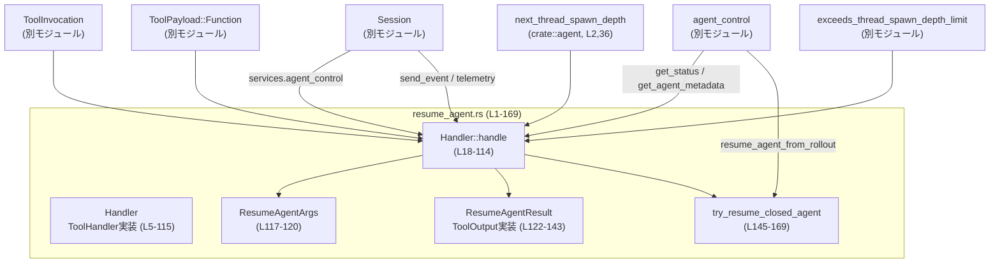
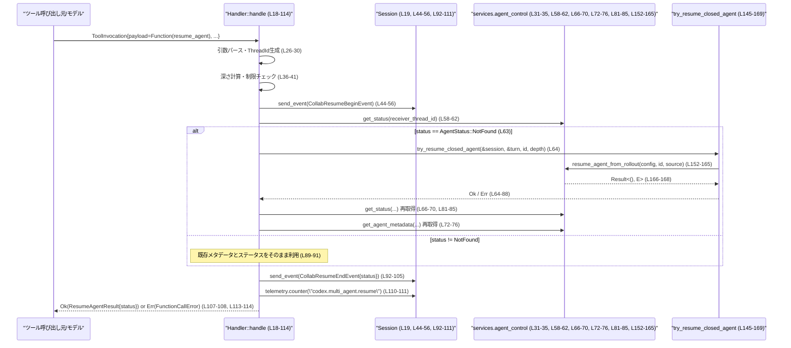

# core/src/tools/handlers/multi_agents/resume_agent.rs

## 0. ざっくり一言

- マルチエージェント環境で、既存エージェントスレッドを「再開（resume）」するためのツール呼び出しハンドラです。`resume_agent` ツールの引数をパースし、対象エージェントの状態を確認・必要なら再開し、その結果ステータスを返します（`handle`・`ResumeAgentResult`・`try_resume_closed_agent`、L18-114, L122-143, L145-169）。

---

## 1. このモジュールの役割

### 1.1 概要

- このモジュールは、ツール実行フレームワークから渡される `ToolInvocation` を処理し、関数形式ツール `resume_agent` を実行するために存在しています（L7-18, L26-30）。
- 主な機能は、呼び出し引数からエージェントID（`ThreadId`）を復元し、スレッド深さ制限をチェックしたうえで、対象エージェントのステータス取得・必要に応じた再開・イベント通知・テレメトリ記録を行うことです（L28-42, L44-56, L58-91, L92-111）。
- 結果として、エージェントの最終ステータスを `ResumeAgentResult` として返し、ログやレスポンス用の出力整形は `ToolOutput` 実装に委ねています（L122-143）。

### 1.2 アーキテクチャ内での位置づけ

このファイル内のコンポーネントと、外部コンポーネントとの主な依存関係を示します。



- `Handler` はツール実行フレームワークから `ToolHandler` として登録され、`ToolInvocation` を受け取って `handle` を実行する役割です（L7-18）。
- 実際の再開処理は、`Session.services.agent_control` に委譲されており（L31-35, L58-62, L66-70, L72-76, L81-85, L152-165）、このモジュールはそのオーケストレーションとエラーハンドリングを担当します。
- `ResumeAgentResult` はツール出力を表すドメインオブジェクトであり、`ToolOutput` を実装することで、ログ出力・レスポンスフォーマット・コードモード用結果への変換を提供します（L122-143）。

### 1.3 設計上のポイント

- **責務の分割**
  - ツールのエントリポイントは `Handler::handle` に集約され、引数パース・深さ制限チェック・イベント送信・ステータス取得・結果生成までを一貫して行います（L18-114）。
  - 閉じたエージェントの再開というサブタスクは `try_resume_closed_agent` に切り出されており、再開専用の設定構築と `agent_control.resume_agent_from_rollout` 呼び出しを担当します（L145-169）。
  - 出力オブジェクトのログ／レスポンス整形は `ResumeAgentResult` の `ToolOutput` 実装に任されています（L127-143）。

- **状態管理**
  - `Handler` 自体はフィールドを持たない空の構造体であり（L5）、状態はすべて `Session` や `TurnContext`、`AgentStatus` など外部オブジェクトに保持させる設計です（L19-23, L58-62）。
  - ハンドラ内のローカル状態は `status` と `receiver_agent` のみで、処理の進行に応じて更新されます（L31-35, L58-62, L66-70, L72-76, L81-87, L90-91）。

- **Rust の安全性／エラー処理**
  - すべて安全な Rust のみで実装されており、`unsafe` ブロックはありません。
  - 失敗しうる操作は `Result` と `?` 演算子、`map_err` を用いて `FunctionCallError` に変換しながら伝播します（L26-30, L38-41, L145-151, L158-165, L167-168）。
  - パニックを起こしうる `unwrap` は使用しておらず、`unwrap_or_default` / `unwrap_or` によって安全なフォールバックを行っています（L31-35, L72-76）。

- **非同期・並行性**
  - メイン処理 `handle` とサブ処理 `try_resume_closed_agent` は `async fn` として定義されており、外部サービス呼び出しはすべて `await` で逐次処理されています（L18, L58-62, L66-70, L81-85, L145, L166）。
  - `Session` と `TurnContext` は `Arc` 参照で受け渡され、スレッド間共有を前提とした設計になっています（L3, L19-23, L145-148）。

- **観測性**
  - 再開処理の前後で `CollabResumeBeginEvent` / `CollabResumeEndEvent` を送信し（L44-56, L92-105）、エージェント間のコラボレーション状態をイベントとして記録します。
  - また、`turn.session_telemetry.counter("codex.multi_agent.resume", ...)` により、再開操作の回数がメトリクスとして記録されます（L110-111）。

---

## 2. 主要な機能一覧

- エージェント再開ツールハンドラ: `Handler` が `ToolHandler` を実装し、`ToolPayload::Function` を処理してエージェント再開を実行する（L7-18）。
- 引数パース: `function_arguments` と `parse_arguments` を用いて、JSON から `ResumeAgentArgs { id: String }` を構築する（L26-27, L117-120）。
- エージェントID検証: 文字列 ID を `ThreadId::from_string` で検証し、不正な場合にはユーザー向けエラーを返す（L28-30）。
- スレッド深さ制限チェック: `next_thread_spawn_depth` と `exceeds_thread_spawn_depth_limit` を用いて、再帰的なエージェント生成／再開の深さを制限する（L36-41）。
- 再開前後イベント送信: `CollabResumeBeginEvent` / `CollabResumeEndEvent` を `Session::send_event` 経由で送信する（L44-56, L92-105）。
- 閉じたエージェントの再開: `try_resume_closed_agent` で `agent_control.resume_agent_from_rollout` を呼び、閉じているエージェントを再開する（L63-88, L145-169）。
- ステータス取得と結果返却: `agent_control.get_status` により最新ステータスを取得し、`ResumeAgentResult { status }` として呼び出し元に返す（L58-62, L66-70, L81-85, L113-114, L122-125）。
- ログ・レスポンス整形: `ResumeAgentResult` の `ToolOutput` 実装を通じて、ログプレビュー・レスポンスアイテム・コードモード結果を生成する（L127-143）。

---

## 3. 公開 API と詳細解説

### 3.1 型一覧（構造体・列挙体など）

| 名前 | 種別 | 可視性 | 役割 / 用途 | 定義位置 |
|------|------|--------|-------------|----------|
| `Handler` | 構造体（フィールドなし） | `pub(crate)` | `ToolHandler` を実装し、`resume_agent` ツール呼び出しを処理するハンドラの本体です。状態は持ちません。 | `resume_agent.rs:L5-5` |
| `ResumeAgentArgs` | 構造体 | 非公開 | ツール引数として渡される JSON をデコードした結果で、エージェントID文字列 `id` を保持します。`Deserialize` を derive しています（L117-120）。 | `resume_agent.rs:L117-120` |
| `ResumeAgentResult` | 構造体 | `pub(crate)` | 再開処理の結果としてのエージェントステータス `status: AgentStatus` を保持します。`Debug` / `Deserialize` / `Serialize` / `PartialEq` / `Eq` を derive し、`ToolOutput` を実装します（L122-143）。 | `resume_agent.rs:L122-125` |

※ `AgentStatus`, `ToolHandler`, `ToolPayload`, `ToolInvocation`, `FunctionCallError`, `Session`, `TurnContext` などは `use super::*;` からインポートされており、このチャンクには定義が現れません（L1）。

### 3.2 関数詳細（重要なもの）

#### `Handler::handle(&self, invocation: ToolInvocation) -> Result<ResumeAgentResult, FunctionCallError>`

**概要**

- `ToolInvocation` に含まれる `ToolPayload::Function` 呼び出しを処理し、指定されたエージェントスレッドを再開したうえで、その最終ステータスを `ResumeAgentResult` として返します（L18-114）。
- 入力検証（ID パース・深さ制限）、再開前後のイベント送信、閉じたエージェントの再開試行、テレメトリ記録を一括して行います（L26-42, L44-56, L58-91, L92-111）。

**引数**

| 引数名 | 型 | 説明 |
|--------|----|------|
| `self` | `&Handler` | 状態を持たないハンドラ本体です。 |
| `invocation` | `ToolInvocation` | ツール実行コンテキストであり、`session`, `turn`, `payload`, `call_id` などを含みます（L19-25）。型定義は別モジュールです。 |

**戻り値**

- `Result<ResumeAgentResult, FunctionCallError>`  
  - `Ok(ResumeAgentResult { status })`: 再開処理が成功し、最終的な `AgentStatus` が格納されます（L113-114, L122-125）。
  - `Err(FunctionCallError)`: 引数不正、深さ制限超過、ID パース失敗、内部サービスエラーなどの際に返されます（L26-30, L38-41, L64-88）。

**内部処理の流れ（アルゴリズム）**

1. `invocation` を分解し、`session`, `turn`, `payload`, `call_id` を取り出します（L19-25）。
2. `function_arguments(payload)?` と `parse_arguments(&arguments)?` で JSON 引数をパースし、`ResumeAgentArgs { id }` を得ます（L26-27, L117-120）。
3. `ThreadId::from_string(&args.id)` で ID 文字列を検証し、失敗した場合は `FunctionCallError::RespondToModel("invalid agent id ...")` として返します（L28-30）。
4. 初期メタデータ `receiver_agent` を `agent_control.get_agent_metadata(receiver_thread_id).unwrap_or_default()` で取得します（L31-35）。
5. `next_thread_spawn_depth(&turn.session_source)` と `turn.config.agent_max_depth` を用いて子スレッド深さを計算し、`exceeds_thread_spawn_depth_limit` による制限チェックに引っかかった場合は `"Agent depth limit reached..."` エラーで終了します（L36-41）。
6. 再開開始イベント `CollabResumeBeginEvent` を構築し、`session.send_event(...).await` で送信します（L44-56）。
7. `agent_control.get_status(receiver_thread_id).await` で現在のステータスを取得します（L58-62）。
8. `status` が `AgentStatus::NotFound` の場合（L63）、`try_resume_closed_agent` で閉じたエージェントの再開を試みます（L64-88）。
   - 成功時: ステータスとメタデータを再取得します（L66-70, L72-76）。
   - 失敗時: ステータスを再取得しつつ、エラーを `error` に格納します（L81-87）。
   - それ以外のステータスの場合は、そのままのメタデータと `error = None` を保持します（L89-91）。
9. 終了イベント `CollabResumeEndEvent` を構築し、最終ステータスとメタデータを含めて送信します（L92-105）。
10. `error` が `Some(err)` ならば、そのエラーを返して終了します（L107-108）。
11. テレメトリカウンタ `"codex.multi_agent.resume"` をインクリメントします（L110-111）。
12. `ResumeAgentResult { status }` を `Ok` で返します（L113-114）。

**Examples（使用例）**

この例は、周辺型定義が別モジュールにあるため擬似コードですが、`Handler::handle` の基本的な呼び出し方法を示します。

```rust
use std::sync::Arc;
use core::tools::handlers::multi_agents::resume_agent::Handler;
// use ... ToolInvocation, ToolPayload など

// Handler は状態を持たないので、そのまま生成できる
let handler = Handler;

// Session / TurnContext はフレームワーク側で用意されている想定
let session: Arc<Session> = /* ... */;
let turn: Arc<TurnContext> = /* ... */;

// JSON で id を渡す想定（詳細な構造は別モジュール側の仕様）
let payload = ToolPayload::Function {
    // 例: arguments = r#"{"id": "thread-123"}"# など
    // ...
};

let invocation = ToolInvocation {
    session: Arc::clone(&session),
    turn: Arc::clone(&turn),
    payload,
    call_id: "call-123".to_string(),
    // その他のフィールドは省略
};

// 非同期コンテキスト内で呼び出す
let result: ResumeAgentResult = handler.handle(invocation).await?;

// ステータスを参照
println!("agent status: {:?}", result.status);
```

※ 実際の `ToolPayload::Function` の中身や `ToolInvocation` のフィールドは、このファイル外で定義されているため、この例はコンセプトを示す目的のコードです。

**Errors / Panics**

- ID 文字列が不正な場合  
  - `ThreadId::from_string(&args.id)` が失敗すると、`FunctionCallError::RespondToModel("invalid agent id ...")` に変換されて `Err` になります（L28-30）。
- 深さ制限超過の場合  
  - `exceeds_thread_spawn_depth_limit(child_depth, max_depth)` が `true` のとき、`"Agent depth limit reached. Solve the task yourself."` というメッセージを含む `FunctionCallError::RespondToModel` が返ります（L36-41）。
- 閉じたエージェントの再開に失敗した場合  
  - `try_resume_closed_agent` が `Err(FunctionCallError)` を返すと、それが `error` に格納され、終端イベント送信後に `Err(err)` として上位に返されます（L64-88, L107-108）。
- それ以外のエラー経路  
  - `function_arguments`・`parse_arguments`・`build_agent_resume_config`・`thread_spawn_source`・`resume_agent_from_rollout` などで発生したエラーは、いずれも `FunctionCallError` として伝播するように `?` と `map_err` で処理されています（L26-27, L145-151, L158-165, L167-168）。
- **panic について**  
  - `unwrap_or_default` / `unwrap_or` のみを使用しており（L31-35, L72-76）、`unwrap` や `expect` は使っていないため、このファイル単体では明示的なパニックパスはありません。

**Edge cases（エッジケース）**

- ID が空文字列または不正形式  
  - `ThreadId::from_string` が失敗し、`"invalid agent id ..."` エラーになります（L28-30）。具体的にどの形式を受け付けるかは `ThreadId` 実装側に依存し、このチャンクからは分かりません。
- 対象スレッドのメタデータが存在しない  
  - `get_agent_metadata(receiver_thread_id)` が `None` を返した場合、`unwrap_or_default()` によりデフォルトメタデータが使用されます（L31-35）。デフォルト値の具体的内容は外部定義のため不明です。
- ステータスが `AgentStatus::NotFound` の場合  
  - 一度 `try_resume_closed_agent` で再開を試み、成功なら最新メタデータを再取得します（L63-76）。失敗なら元のメタデータを維持しつつエラーを返します（L80-88）。
- ステータスが `NotFound` 以外だが、後続処理中に状態が変化した場合  
  - このファイル内では、ステータス／メタデータ取得と再開処理はシンプルに逐次実行されており、取得後に別スレッドで状態が変わった場合の詳細な挙動は `agent_control` の実装に依存します（L58-62, L66-70, L81-85）。

**使用上の注意点**

- 非同期関数のため、`tokio` などの非同期ランタイム上から `.await` 付きで呼び出す必要があります（L18）。
- `matches_kind` によって `ToolPayload::Function` であることは判定していると想定されますが（L14-16）、実際の関数名や引数構造の検証は `function_arguments` / `parse_arguments` 側の実装に依存します（L26-27）。
- 深さ制限により、ネストしたエージェントの再帰呼び出しが制限されるため、再開に失敗するケースを呼び出し側で考慮する必要があります（L36-41）。
- エラーの多くは `FunctionCallError::RespondToModel` としてモデルに返される設計のため、エラーメッセージをプロンプトに表示するかどうかは上位フレームワークの扱いに依存します（L29-30, L39-41）。

---

#### `async fn try_resume_closed_agent(session: &Arc<Session>, turn: &Arc<TurnContext>, receiver_thread_id: ThreadId, child_depth: i32) -> Result<(), FunctionCallError>`

**概要**

- `AgentStatus::NotFound` となっているエージェントスレッドを、ロールアウト情報から再開するためのヘルパー関数です（L63-88, L145-169）。
- 再開用設定の構築と、`agent_control.resume_agent_from_rollout` 呼び出し、およびエラーの型変換を行います（L151-168）。

**引数**

| 引数名 | 型 | 説明 |
|--------|----|------|
| `session` | `&Arc<Session>` | セッション全体のコンテキスト。`services.agent_control` へのアクセスや `conversation_id` 取得に使用されます（L145-147, L152-165）。 |
| `turn` | `&Arc<TurnContext>` | 現在のターン（対話ステップ）のコンテキスト。`session_source` を用いてスレッド生成元情報を構築します（L145-148, L151, L159-161）。 |
| `receiver_thread_id` | `ThreadId` | 再開対象のエージェントスレッド ID です（L148, L157）。 |
| `child_depth` | `i32` | 現在のスレッド深さ。`build_agent_resume_config` と `thread_spawn_source` に渡されます（L149-151, L161-162）。 |

**戻り値**

- `Result<(), FunctionCallError>`  
  - `Ok(())`: 再開処理の呼び出しが成功したことを示します（実際のエージェント挙動は `agent_control` 側に依存します）（L166-167）。
  - `Err(FunctionCallError)`: 設定構築やスレッド生成元情報生成、または `resume_agent_from_rollout` 自体がエラーを返した場合に返されます（L151, L158-165, L167-168）。

**内部処理の流れ**

1. `build_agent_resume_config(turn.as_ref(), child_depth)?` で再開用設定を生成します（L151）。エラー時は `FunctionCallError` として即座に返されます。
2. `thread_spawn_source` を用いてスレッド生成元（親セッション ID やソース情報、深さなど）を構築します（L158-164）。ここでも `?` が使われ、エラー時は早期リターンします。
3. `session.services.agent_control.resume_agent_from_rollout(config, receiver_thread_id, spawn_source).await` を呼び出し、非同期に再開処理を実行します（L152-165, L166）。
4. `map(|_| ())` により戻り値を単に `()` に変換し、`map_err(|err| collab_agent_error(receiver_thread_id, err))` でエラーを `collab_agent_error` 経由の `FunctionCallError` に変換します（L167-168）。

**Examples（使用例）**

`Handler::handle` からの呼び出し方が典型例です（L64-88）。直接呼ぶ場合は次のような形になります（擬似コード）。

```rust
let result = try_resume_closed_agent(
    &session,           // Arc<Session>
    &turn,              // Arc<TurnContext>
    receiver_thread_id, // ThreadId
    child_depth,        // i32
).await;

match result {
    Ok(()) => {
        // 再開成功時: ステータスは別途 get_status などで取得
    }
    Err(e) => {
        // FunctionCallError を上位に伝播させるか、ログに記録する
    }
}
```

**Errors / Panics**

- `build_agent_resume_config` の失敗  
  - `?` により `Err(FunctionCallError)` として即座に呼び出し元に伝播します（L151）。
- `thread_spawn_source` の失敗  
  - 同様に `?` によりエラーを伝播します（L158-164）。
- `resume_agent_from_rollout` の失敗  
  - `map_err(|err| collab_agent_error(receiver_thread_id, err))` によって `collab_agent_error` でラップされ、`FunctionCallError` として返されます（L155-165, L167-168）。
- **panic について**  
  - この関数内では `unwrap` 系は使用しておらず、パニックを起こすコードはありません（L145-169）。

**Edge cases（エッジケース）**

- `receiver_thread_id` に対応するエージェントが存在しない／既に削除されている  
  - `resume_agent_from_rollout` の挙動に依存し、このチャンクでは詳細は分かりません。エラーとなる場合は `collab_agent_error` によってラップされます（L155-165, L167-168）。
- `child_depth` が深さ制限ぎりぎり  
  - 実際の制限チェックは `Handler::handle` 側で行っており（L36-41）、本関数は渡された `child_depth` を信頼して使用します（L151, L161-162）。

**使用上の注意点**

- `Session` / `TurnContext` は `Arc` で共有される前提のため、本関数を並列に呼び出した場合でも参照カウントによる共有は安全です（L145-148）。ただし実際の `agent_control` 実装のスレッド安全性は別途確認が必要です。
- この関数は「閉じているエージェント」を再開する用途に限定されており、呼び出し元で `AgentStatus::NotFound` かどうかをチェックした上で使用する設計になっています（L63-64）。

---

#### `impl ToolOutput for ResumeAgentResult` の主なメソッド

`ResumeAgentResult` の `ToolOutput` 実装はすべて薄いラッパーであり、内部ヘルパー関数に処理を委譲しています（L127-143）。

##### `fn log_preview(&self) -> String`

- 役割: ログ用の短いプレビュー文字列を生成します。
- 実装: `tool_output_json_text(self, "resume_agent")` を呼び出すのみです（L128-130）。
- エラー／パニック: ここでは `Result` を返さず、パニックも起こしません。エラー処理は `tool_output_json_text` 側の実装に依存します（このチャンクには現れません）。

##### `fn success_for_logging(&self) -> bool`

- 役割: ログ上で成功扱いとするかを返します。
- 実装: 常に `true` を返します（L132-134）。`status` の中身によらず「成功」として扱う設計です。

##### `fn to_response_item(&self, call_id: &str, payload: &ToolPayload) -> ResponseInputItem`

- 役割: モデルへのレスポンスに埋め込む `ResponseInputItem` を生成します。
- 実装: `tool_output_response_item(call_id, payload, self, Some(true), "resume_agent")` に委譲します（L136-138）。

##### `fn code_mode_result(&self, _payload: &ToolPayload) -> JsonValue`

- 役割: 「コードモード」用の JSON 結果を生成します。
- 実装: `tool_output_code_mode_result(self, "resume_agent")` を呼び出しています（L140-142）。

---

### 3.3 その他の関数・メソッド一覧（コンポーネントインベントリー）

#### メソッド一覧

| メソッド名 | 所属 | 役割（1 行） | 定義位置 |
|------------|------|--------------|----------|
| `Handler::kind(&self) -> ToolKind` | `Handler` | このハンドラが扱うツール種別として `ToolKind::Function` を返します（L10-12）。 | `resume_agent.rs:L10-12` |
| `Handler::matches_kind(&self, payload: &ToolPayload) -> bool` | `Handler` | 渡された `ToolPayload` が関数呼び出し（`ToolPayload::Function`）かどうかを判定します（L14-16）。 | `resume_agent.rs:L14-16` |
| `ResumeAgentResult::log_preview(&self) -> String` | `ToolOutput` impl | ログ用の JSON テキストプレビューを生成します（L128-130）。 | `resume_agent.rs:L128-130` |
| `ResumeAgentResult::success_for_logging(&self) -> bool` | 同上 | ログ上でこの結果を成功扱いにするかどうかを返します（常に `true`、L132-134）。 | `resume_agent.rs:L132-134` |
| `ResumeAgentResult::to_response_item(&self, call_id: &str, payload: &ToolPayload) -> ResponseInputItem` | 同上 | ツール呼び出しレスポンス用のアイテムに変換します（L136-138）。 | `resume_agent.rs:L136-138` |
| `ResumeAgentResult::code_mode_result(&self, _payload: &ToolPayload) -> JsonValue` | 同上 | コードモード用の JSON 結果に変換します（L140-142）。 | `resume_agent.rs:L140-142` |

#### トップレベル関数

| 関数名 | 役割（1 行） | 定義位置 |
|--------|--------------|----------|
| `try_resume_closed_agent(...)` | 閉じたエージェントスレッドをロールアウト情報から再開するための非公開ヘルパーです（L145-169）。 | `resume_agent.rs:L145-169` |

---

## 4. データフロー

ここでは、`Handler::handle` が `resume_agent` ツール呼び出しを処理する典型的なフローを示します（L18-114, L145-169）。



要点：

- `Session` はイベント通知とテレメトリの集約ポイントとして機能し（L44-56, L92-105, L110-111）、エージェント再開そのものは `services.agent_control` に委任されています（L31-35, L58-62, L152-165）。
- ステータスが見つからない場合にだけ `try_resume_closed_agent` が呼ばれ、その結果に応じてステータス／メタデータを更新します（L63-88, L145-169）。

---

## 5. 使い方（How to Use）

### 5.1 基本的な使用方法

フレームワーク側で、`ToolPayload::Function` を伴う `ToolInvocation` が構築され、この `Handler` が選択された前提の例です。

```rust
use std::sync::Arc;
use core::tools::handlers::multi_agents::resume_agent::{Handler, ResumeAgentResult};

// それぞれフレームワーク側で管理されるコンテキスト
let session: Arc<Session> = /* ... */;
let turn: Arc<TurnContext> = /* ... */;

// resume_agent ツール呼び出し用のペイロードを構築
let payload = ToolPayload::Function {
    // arguments など、実際のフィールドは別モジュールの定義に従う
};

// ToolInvocation を組み立てる
let invocation = ToolInvocation {
    session: Arc::clone(&session),
    turn: Arc::clone(&turn),
    payload,
    call_id: "call-123".to_string(),
    // ...
};

// ハンドラを生成して処理する（非同期）
let handler = Handler;
let result: ResumeAgentResult = handler.handle(invocation).await?;

// 結果ステータスを利用
println!("agent status: {:?}", result.status);
```

- 上記の通り、`Handler` は状態を持たないため、そのまま値として使い回しできます（L5, L7-8）。
- 実際には、このハンドラはツールレジストリの一部として登録され、自前で `handle` を呼ぶよりもフレームワーク経由で呼ばれる形が一般的と考えられますが、このチャンクからは詳細は分かりません。

### 5.2 よくある使用パターン

1. **存在するエージェントの再開／ステータス取得**

   - すでに存在し、`AgentStatus::NotFound` ではないエージェント ID を指定した場合、`try_resume_closed_agent` は呼ばれず、単に現在のステータスが取得されて結果として返ります（L58-62, L89-91, L113-114）。

2. **閉じているエージェントの再開**

   - ID は正しいが `AgentStatus::NotFound` の場合、`try_resume_closed_agent` が呼ばれ、再開に成功すればステータス／メタデータを再取得したうえで結果に反映されます（L63-76, L145-169）。

3. **不正な ID の場合のエラー応答**

   - `ThreadId::from_string` が失敗するような ID を渡すと、`FunctionCallError::RespondToModel("invalid agent id ...")` が返り、結果としてツール呼び出しはエラーとなります（L28-30）。

### 5.3 よくある間違い

```rust
// 誤り例: Function 以外のペイロードに対して Handler を使おうとする
let payload = ToolPayload::Streaming { /* ... */ };
let invocation = ToolInvocation { /* ... */ payload, /* ... */ };

// matches_kind は false を返すので、本来は Handler が選ばれるべきではない
let handler = Handler;
// handler.handle(invocation).await; // こうした使い方は前提に反する

// 正しい例: ToolPayload::Function に対してのみ Handler を割り当てる
let payload = ToolPayload::Function { /* ... */ };
let invocation = ToolInvocation { /* ... */ payload, /* ... */ };

if handler.matches_kind(&invocation.payload) {
    let result = handler.handle(invocation).await?;
    // ...
}
```

- `Handler::matches_kind` は `ToolPayload::Function` かどうかだけを見ているため（L14-16）、関数ツール以外に `Handler` を割り当てないのが前提条件です。
- 間違って別種別に割り当てると、`function_arguments(payload)?` などが期待しない形式のペイロードを受け取り、エラーになる可能性があります（L26-27）。

### 5.4 使用上の注意点（まとめ）

- **前提条件**
  - `ToolPayload` は `ToolPayload::Function` であり（L14-16）、`arguments` 部分が `ResumeAgentArgs { id: String }` にデシリアライズ可能な JSON である必要があります（L26-27, L117-120）。
  - `ThreadId::from_string` が解釈可能な形式の ID を渡す必要があります（L28-30）。

- **エージェント深さ**
  - 深さ制限（`turn.config.agent_max_depth`）に達している場合は処理が即座にエラーで打ち切られ、エージェントは再開されません（L36-41）。ネストしたエージェントチェーンを構築する場合には、この制限を考慮する必要があります。

- **並行性**
  - `Session` および `TurnContext` は `Arc` 経由で共有されるため、複数のツール呼び出しが並列で走ることが想定されますが、このファイル内では明示的なロック機構は扱っていません（L3, L19-23, L145-148）。実際のスレッド安全性は `Session`／`agent_control` 実装に依存します。

- **ログと観測性**
  - 開始・終了イベントの両方が必ず送信されるようになっており、エラー時にも終了イベントが送られてからエラーが返されます（L92-108）。これにより、監視側から「開始したが終了していない」というギャップが生じにくい構造です。
  - `success_for_logging` が常に `true` を返すため（L132-134）、ログ上は「ツール呼び出し自体」は成功として扱われます。エラーの有無はステータスや別のログ項目で判断する設計と推測できますが、このチャンクからは詳細は分かりません。

---

## 6. 変更の仕方（How to Modify）

### 6.1 新しい機能を追加する場合

例として、「再開時に追加オプション（例: 強制再開フラグ）」を渡したい場合の大まかな変更手順です。

1. **引数構造体の拡張**
   - `ResumeAgentArgs` に新しいフィールドを追加し（例: `force: bool`）、`Deserialize` されるようにします（L117-120）。
2. **引数の利用箇所の更新**
   - `Handler::handle` 内で `args` から新フィールドを参照し、必要に応じて深さ制限チェックや `try_resume_closed_agent` への引数として渡します（L26-27, L64）。
3. **サブ処理への受け渡し**
   - 必要であれば `try_resume_closed_agent` の引数にも新フィールドを追加し、`build_agent_resume_config` や `thread_spawn_source` に反映させます（L145-151, L158-164）。
4. **イベントへの反映**
   - 新しい情報をイベントに含めたい場合は、`CollabResumeBeginEvent` / `CollabResumeEndEvent` 構造体の定義（このチャンクには現れません）を変更し、`send_event` 呼び出し部分で新フィールドを設定します（L47-53, L95-102）。

変更時は、`ResumeAgentResult` のフォーマットや `ToolOutput` 実装が追加情報を必要とするかどうかも合わせて検討する必要があります（L122-143）。

### 6.2 既存の機能を変更する場合

- **深さ制限ロジックを変更する**
  - 参照箇所: `next_thread_spawn_depth`・`exceeds_thread_spawn_depth_limit` 呼び出し（L36-38）。
  - 変更時には、`child_depth` の定義や `turn.config.agent_max_depth` の意味が契約として他所でも使われていないか、関連モジュール（`crate::agent` や設定管理モジュール）を確認する必要があります（L2, L36-38）。

- **エラー応答メッセージを変更する**
  - ID 不正時や深さ制限超過時のメッセージはユーザーやモデルに直接返される可能性があるため（L29-30, L39-41）、互換性や既存プロンプトへの影響を考慮する必要があります。
  - メッセージフォーマット変更前に、これらのメッセージを前提としたテストやプロンプトテンプレートがないかを確認するべきです。

- **イベント内容を変更する**
  - `CollabResumeBeginEvent` / `CollabResumeEndEvent` のフィールドは、外部のイベント処理・ロギングインフラで消費される可能性があります（L47-53, L95-102）。
  - これらの構造体および `send_event` の契約（必須フィールド、フォーマットなど）を変更する際は、対応するリスナー・ダッシュボード・アラート設定を確認する必要があります。

---

## 7. 関連ファイル

このモジュールは多くの型・関数を `use super::*;` でインポートしており、具体的なパスはこのチャンクからは分かりません（L1）。分かる範囲で、関係するモジュールを列挙します。

| パス/モジュール | 役割 / 関係 |
|-----------------|------------|
| `crate::agent` | `next_thread_spawn_depth` を提供し、スレッド深さ計算ロジックを保持しています（L2, L36）。 |
| `super`（上位モジュール） | `ToolHandler`, `ToolKind`, `ToolPayload`, `ToolInvocation`, `FunctionCallError`, `ToolOutput`, `ResponseInputItem`, `JsonValue`, `AgentStatus`, `Session`, `TurnContext`, `CollabResumeBeginEvent`, `CollabResumeEndEvent`, `function_arguments`, `parse_arguments`, `exceeds_thread_spawn_depth_limit`, `build_agent_resume_config`, `thread_spawn_source`, `collab_agent_error`, `tool_output_json_text`, `tool_output_response_item`, `tool_output_code_mode_result` など、このファイルで使用される多くの型・関数を定義していると考えられます（L1, L26-27, L31-35, L36-41, L44-56, L58-62, L95-102, L110-111, L151-168）。ただし、正確なファイルパスはこのチャンクからは不明です。 |

このファイル内にはテストコードやモック実装は含まれておらず（L1-169）、テストは別ファイルに存在する可能性がありますが、このチャンクでは確認できません。
