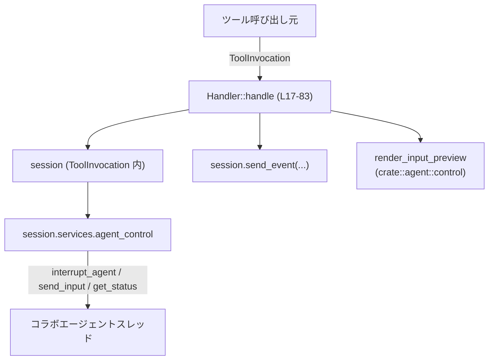
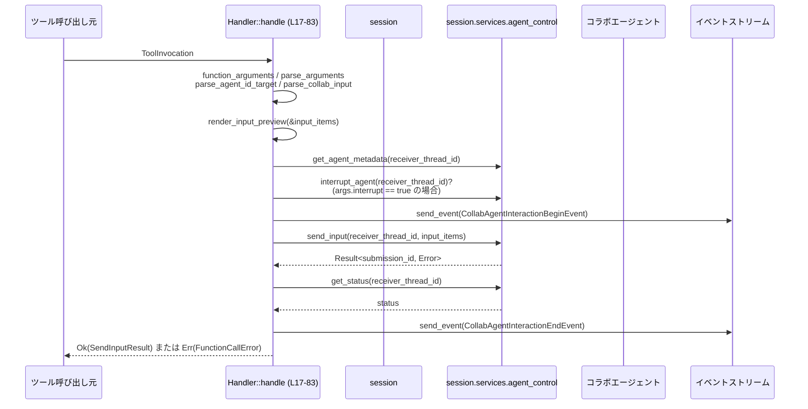

# core/src/tools/handlers/multi_agents/send_input.rs

## 0. ざっくり一言

マルチエージェント環境で、**ツール呼び出しから特定エージェントへの入力送信**を行い、その開始・終了イベントを発行する非同期ツールハンドラを定義するモジュールです（`Handler` とその周辺型）。  

---

## 1. このモジュールの役割

### 1.1 概要

このモジュールは、**「関数型ツール」経由で別スレッドのエージェントへ入力を送る処理**を担当します。

- `ToolInvocation` に含まれるペイロード引数をパースし、宛先エージェントと送信内容を決定します。
- 必要に応じて宛先エージェントを割り込み (`interrupt`) し、新たな入力を送信します。
- 入力送信の開始・終了を表すイベントをセッションに送信し、ログ・レスポンス生成用の `SendInputResult` を返します。

### 1.2 アーキテクチャ内での位置づけ

このモジュールは `ToolHandler` トレイトの 1 実装として、ツールディスパッチャから呼び出され、セッション／エージェント制御層と連携します。

- 上位（`super::*`）:  
  - `ToolHandler`, `ToolInvocation`, `ToolPayload`, `FunctionCallError`  
  - 引数パース系 (`function_arguments`, `parse_arguments`, `parse_agent_id_target`, `parse_collab_input`)  
  - イベント型 (`CollabAgentInteractionBeginEvent`, `CollabAgentInteractionEndEvent`)  
  - エラーラッパ (`collab_agent_error`)  
  - `ToolOutput` トレイトと補助関数 (`tool_output_*`)  
  ※ いずれも定義はこのチャンクには現れません。
- 横方向: `crate::agent::control::render_input_preview` を用いて送信内容のプレビュー文字列を生成します。
- 下位: `session.services.agent_control` を通じて対象エージェントを割り込み・入力送信・状態取得します。

依存関係のイメージ（`Handler::handle` を中心、行範囲付き）:



（行番号は `core/src/tools/handlers/multi_agents/send_input.rs:Lxx-yy` を指します）

### 1.3 設計上のポイント

- **ツール共通インターフェース**  
  - `pub(crate) struct Handler;` が `ToolHandler` を実装し、ツール種別 (`kind`) とマッチ判定 (`matches_kind`) を定義します。  
    - 根拠: `Handler` 定義と `impl ToolHandler for Handler`  
      `core/src/tools/handlers/multi_agents/send_input.rs:L4-83`
- **非同期処理と順序制御**  
  - `async fn handle` 内で `await` を用いて、割り込み → 開始イベント → 入力送信 → 状態取得 → 終了イベント → 結果返却の順序を保証しています。  
    - 根拠: `handle` 本体での `interrupt_agent`, `send_event`, `send_input`, `get_status` の呼び出し順  
      `core/src/tools/handlers/multi_agents/send_input.rs:L35-80`
- **エラーハンドリング**  
  - 引数パースやエージェント制御の失敗は `?` / `map_err` により `FunctionCallError` として呼び出し元へ伝播します。  
    - 根拠: `function_arguments(payload)?`, `parse_arguments(&arguments)?`, `parse_agent_id_target(...)?`, `parse_collab_input(...)?`, `map_err(|err| collab_agent_error(...))?`  
      `core/src/tools/handlers/multi_agents/send_input.rs:L25-41,L57-59`
- **結果表現の分離**  
  - 送信結果 ID は `SendInputResult` に封じ込められ、`ToolOutput` 実装を通じてログ／レスポンス／コードモード用の表現に変換されます。  
    - 根拠: `SendInputResult` と `impl ToolOutput for SendInputResult`  
      `core/src/tools/handlers/multi_agents/send_input.rs:L95-115`

---

## 2. 主要な機能一覧とコンポーネントインベントリー

### 2.0 主要な機能（箇条書き）

- ツールペイロードからの **引数抽出・パース**（宛先エージェント ID、メッセージ、入力アイテム、割り込みフラグ）。  
  - 根拠: `function_arguments`, `parse_arguments`, `parse_agent_id_target`, `parse_collab_input` の呼び出し  
    `core/src/tools/handlers/multi_agents/send_input.rs:L25-28`
- 対象エージェントの **メタデータ取得** と、必要に応じた **割り込み (interrupt)**。  
  - 根拠: `get_agent_metadata`, `interrupt_agent` 呼び出し  
    `core/src/tools/handlers/multi_agents/send_input.rs:L30-41`
- コラボエージェントへの **入力送信 (`send_input`)** とその後の **ステータス取得 (`get_status`)**。  
  - 根拠: `send_input`, `get_status` 呼び出し  
    `core/src/tools/handlers/multi_agents/send_input.rs:L55-64`
- 入力送信の **開始／終了イベント送信**。  
  - 根拠: `CollabAgentInteractionBeginEvent`, `CollabAgentInteractionEndEvent` を `session.send_event` に渡している  
    `core/src/tools/handlers/multi_agents/send_input.rs:L43-54,L65-79`
- 送信結果 ID を含む **`SendInputResult` の生成** と、`ToolOutput` トレイトによるログ・レスポンス・コードモード変換。  
  - 根拠: `Ok(SendInputResult { submission_id })` と `impl ToolOutput for SendInputResult`  
    `core/src/tools/handlers/multi_agents/send_input.rs:L80-82,L100-115`

### 2.1 構造体・型インベントリー

| 名前                | 種別      | 可視性        | 役割 / 用途                                                                 | 定義位置 |
|---------------------|-----------|---------------|-----------------------------------------------------------------------------|----------|
| `Handler`           | 構造体    | `pub(crate)`  | `ToolHandler` 実装用のハンドラ。自身にフィールドはなく、振る舞いのみを提供。 | `core/src/tools/handlers/multi_agents/send_input.rs:L4-4` |
| `SendInputArgs`     | 構造体    | （モジュール内） | ツール呼び出しの JSON 引数をデシリアライズするための内部用引数型。             | `core/src/tools/handlers/multi_agents/send_input.rs:L86-93` |
| `SendInputResult`   | 構造体    | `pub(crate)`  | エージェントへの入力送信の submission ID を保持し、`ToolOutput` として外部に露出。 | `core/src/tools/handlers/multi_agents/send_input.rs:L95-98` |

※ `SendInputArgs` は `Deserialize`、`SendInputResult` は `Serialize` を実装しており、serde による JSON 変換を前提としています（派生属性より推測、定義はこのチャンクに存在）。

### 2.2 関数・メソッドインベントリー

| 関数 / メソッド名                                                                 | 所属型           | 役割（1 行）                                                         | 定義位置 |
|----------------------------------------------------------------------------------|------------------|----------------------------------------------------------------------|----------|
| `kind(&self) -> ToolKind`                                                       | `Handler`        | ツール種別を `ToolKind::Function` として返す。                      | `core/src/tools/handlers/multi_agents/send_input.rs:L9-11` |
| `matches_kind(&self, payload: &ToolPayload) -> bool`                            | `Handler`        | ペイロードが `ToolPayload::Function` であるかどうかを判定する。      | `core/src/tools/handlers/multi_agents/send_input.rs:L13-15` |
| `handle(&self, invocation: ToolInvocation) -> Result<SendInputResult, FunctionCallError>` (async) | `Handler`        | 引数パースからエージェントへの入力送信・イベント発行までを実行する。 | `core/src/tools/handlers/multi_agents/send_input.rs:L17-83` |
| `log_preview(&self) -> String`                                                  | `SendInputResult` | 結果を JSON 形式の文字列としてログプレビュー用に整形する。          | `core/src/tools/handlers/multi_agents/send_input.rs:L101-103` |
| `success_for_logging(&self) -> bool`                                            | `SendInputResult` | ログ上で成功として扱うかどうかを返す（本実装では常に `true`）。     | `core/src/tools/handlers/multi_agents/send_input.rs:L105-107` |
| `to_response_item(&self, call_id: &str, payload: &ToolPayload) -> ResponseInputItem` | `SendInputResult` | レスポンス用の `ResponseInputItem` に変換する。                      | `core/src/tools/handlers/multi_agents/send_input.rs:L109-111` |
| `code_mode_result(&self, _payload: &ToolPayload) -> JsonValue`                 | `SendInputResult` | コードモード用の JSON 値表現に変換する。                            | `core/src/tools/handlers/multi_agents/send_input.rs:L113-115` |

---

## 3. 公開 API と詳細解説

### 3.1 型一覧（構造体・列挙体など）

| 名前              | 種別      | 可視性        | フィールド概要                                                                                       | 主な関連関数                                          | 定義位置 |
|-------------------|-----------|---------------|------------------------------------------------------------------------------------------------------|-------------------------------------------------------|----------|
| `Handler`         | 構造体    | `pub(crate)`  | フィールドなしのユニット構造体。ツールハンドラとして `ToolHandler` を実装。                          | `kind`, `matches_kind`, `handle`                     | `core/src/tools/handlers/multi_agents/send_input.rs:L4-4` |
| `SendInputArgs`   | 構造体    | （モジュール内） | `target: String`, `message: Option<String>`, `items: Option<Vec<UserInput>>`, `interrupt: bool`。 | `handle` 内でのみ使用される内部引数型。               | `core/src/tools/handlers/multi_agents/send_input.rs:L86-93` |
| `SendInputResult` | 構造体    | `pub(crate)`  | `submission_id: String`（フィールド自体はプライベート）。                                           | `ToolOutput` 実装 (`log_preview` など 4 メソッド)    | `core/src/tools/handlers/multi_agents/send_input.rs:L95-98` |

> 補足: `UserInput`, `ToolPayload`, `ResponseInputItem`, `JsonValue`, `ToolKind`, `FunctionCallError` の定義はこのチャンクには現れません。

---

### 3.2 関数詳細（7 件）

#### `Handler::handle(&self, invocation: ToolInvocation) -> Result<SendInputResult, FunctionCallError>`

**概要**

- ツール呼び出し (`ToolInvocation`) を受け取り、  
  1. 引数をパースして宛先エージェントと入力内容を決定し、  
  2. 必要ならエージェントを割り込み、  
  3. 開始イベントを発行した上で入力を送信し、  
  4. 終了イベントとともに状態を記録し、  
  5. 送信結果 ID を `SendInputResult` として返します。  
- 非同期関数であり、`await` による I/O を伴います。  
  - 根拠: `async fn handle` 本体  
    `core/src/tools/handlers/multi_agents/send_input.rs:L17-83`

**引数**

| 引数名       | 型              | 説明 |
|-------------|-----------------|------|
| `invocation` | `ToolInvocation` | セッション・ターン・ペイロード・call_id などを含むツール呼び出しコンテキスト。定義はこのチャンクには現れません。 |

`let ToolInvocation { session, turn, payload, call_id, .. } = invocation;` により分解され、使用されるフィールドは `session`, `turn`, `payload`, `call_id` です。  

- 根拠: パターンマッチによる分解  
  `core/src/tools/handlers/multi_agents/send_input.rs:L18-24`

**戻り値**

- `Result<SendInputResult, FunctionCallError>`  
  - `Ok(SendInputResult)`  
    - `submission_id` を含む結果。エージェントへの入力送信が成功した場合。  
  - `Err(FunctionCallError)`  
    - 引数パースやエージェント制御処理などのエラーをラップしたもの。  
- 根拠: 関数シグネチャと `Ok(SendInputResult { submission_id })`  
  `core/src/tools/handlers/multi_agents/send_input.rs:L17,L82`

**内部処理の流れ**

1. **コンテキストの分解**  
   - `ToolInvocation` から `session`, `turn`, `payload`, `call_id` を取り出します。  
     - 根拠: `let ToolInvocation { ... } = invocation;`  
       `core/src/tools/handlers/multi_agents/send_input.rs:L18-24`
2. **引数の取得とパース**  
   - `function_arguments(payload)?` で生の引数文字列（あるいは JSON）を取得。  
   - `parse_arguments(&arguments)?` でそれを `SendInputArgs` にデシリアライズ。  
   - `parse_agent_id_target(&args.target)?` で宛先エージェント／スレッド ID を決定。  
   - `parse_collab_input(args.message, args.items)?` で `UserInput` のリストへ変換。  
     - 根拠: 4 つの関数呼び出し  
       `core/src/tools/handlers/multi_agents/send_input.rs:L25-28`
3. **プレビュー文字列の生成**  
   - `render_input_preview(&input_items)` で人間向けのプレビュー文字列 `prompt` を作成。  
     - 根拠: `let prompt = render_input_preview(&input_items);`  
       `core/src/tools/handlers/multi_agents/send_input.rs:L29`
4. **宛先エージェントのメタデータ取得**  
   - `get_agent_metadata(receiver_thread_id).unwrap_or_default()` でニックネームやロール情報を取得（なければデフォルト）。  
     - 根拠: `receiver_agent` の定義  
       `core/src/tools/handlers/multi_agents/send_input.rs:L30-34`
5. **必要に応じてエージェントを割り込み**  
   - `args.interrupt` が `true` の場合、`interrupt_agent(receiver_thread_id).await` を実行。  
   - エラーは `collab_agent_error` で `FunctionCallError` に変換されて `?` で伝播。  
     - 根拠: `if args.interrupt { ... }` ブロック  
       `core/src/tools/handlers/multi_agents/send_input.rs:L35-41`
6. **開始イベント送信**  
   - `CollabAgentInteractionBeginEvent { ... }` を生成し、`session.send_event(&turn, ...).await` で送信。  
   - `call_id` と `prompt.clone()`、送信元／宛先スレッド ID が含まれます。  
     - 根拠: `send_event` 呼び出し  
       `core/src/tools/handlers/multi_agents/send_input.rs:L43-54`
7. **入力送信本体**  
   - `agent_control.send_input(receiver_thread_id, input_items).await` を実行。  
   - エラーが発生した場合は `collab_agent_error` により `FunctionCallError` 化され、`result: Result<String, FunctionCallError>` として保持。  
     - 根拠: `let agent_control = session.services.agent_control.clone();` と `let result = agent_control.send_input(...).await.map_err(...);`  
       `core/src/tools/handlers/multi_agents/send_input.rs:L55-59`
8. **ステータス取得**  
   - `session.services.agent_control.get_status(receiver_thread_id).await` でエージェントの最新状態を取得。  
     - 根拠: `let status = session.services.agent_control.get_status(...).await;`  
       `core/src/tools/handlers/multi_agents/send_input.rs:L60-64`
9. **終了イベント送信**  
   - `CollabAgentInteractionEndEvent { ... }` を生成し、`session.send_event(&turn, ...).await` で送信。  
   - ここで `receiver_agent_nickname` と `receiver_agent_role`、`status`、`prompt` が含まれます。  
     - 根拠: `CollabAgentInteractionEndEvent { ... }` と `send_event`  
       `core/src/tools/handlers/multi_agents/send_input.rs:L65-79`
10. **送信結果の反映と返却**  
    - `let submission_id = result?;` で `send_input` 成功時の ID を取り出し、エラーならここで `Err` を返します。  
    - `Ok(SendInputResult { submission_id })` を返却。  
      - 根拠: `let submission_id = result?;` と `Ok(SendInputResult { submission_id })`  
        `core/src/tools/handlers/multi_agents/send_input.rs:L80-82`

**Examples（使用例）**

この関数は非同期なので、`async` コンテキストから `.await` で呼び出す必要があります。ここでは、同一モジュール内にあると仮定した簡略例を示します（`ToolInvocation` の具体的な構築方法はこのチャンクにはないため省略します）。

```rust
// Handler を使って send_input ツールを実行する例                     // このファイルと同じモジュール内を想定
async fn run_send_input(handler: &Handler, invocation: ToolInvocation)
    -> Result<(), FunctionCallError>                                      // エラーは FunctionCallError として伝播
{
    let result = handler.handle(invocation).await?;                        // 非同期に handle を実行し、? でエラー伝播

    // SendInputResult は ToolOutput を実装しているので、ログ用プレビューを取得できる
    let preview = result.log_preview();                                    // JSON 形式のプレビュー文字列を取得
    println!("send_input result preview: {}", preview);                    // ログ出力（例）

    Ok(())                                                                 // 正常終了
}
```

※ `ToolInvocation` や `FunctionCallError` の定義はこのチャンクにはないため、例は概念的なものです。

**Errors / Panics**

この関数は `Result` を返し、**パニックを明示的に発生させるコードは含まれていません**（`unwrap` なども使用していません）。

`Err(FunctionCallError)` になりうる主なケース:

- `function_arguments(payload)?` が失敗した場合（引数取得エラー）。  
  - 根拠: `?` を伴う呼び出し  
    `core/src/tools/handlers/multi_agents/send_input.rs:L25`
- `parse_arguments(&arguments)?` が失敗した場合（JSON → `SendInputArgs` デコードエラーなど）。  
  - 根拠: `?` を伴う呼び出し  
    `core/src/tools/handlers/multi_agents/send_input.rs:L26`
- `parse_agent_id_target(&args.target)?` が失敗した場合（不正な target 文字列）。  
  - 根拠: `?` を伴う呼び出し  
    `core/src/tools/handlers/multi_agents/send_input.rs:L27`
- `parse_collab_input(args.message, args.items)?` が失敗した場合（入力の整合性エラーなど）。  
  - 根拠: `?` を伴う呼び出し  
    `core/src/tools/handlers/multi_agents/send_input.rs:L28`
- `interrupt_agent(receiver_thread_id)` がエラーを返した場合（`args.interrupt == true` のときのみ）。  
  - `map_err(|err| collab_agent_error(receiver_thread_id, err))?` により `FunctionCallError` 化される。  
    - 根拠: `map_err(...)?`  
      `core/src/tools/handlers/multi_agents/send_input.rs:L39-41`
- `agent_control.send_input(receiver_thread_id, input_items)` がエラーを返した場合。  
  - `map_err(|err| collab_agent_error(receiver_thread_id, err))` により `Result<_, FunctionCallError>` に変換され、  
    最後の `result?` によって `Err` が返される。  
    - 根拠: `let result = ... map_err(...);` と `let submission_id = result?;`  
      `core/src/tools/handlers/multi_agents/send_input.rs:L57-59,L80`

`session.send_event` や `get_status` の戻り値型はこのチャンクからは分かりませんが、`?` が付いていないため、少なくともここではエラーとして扱っていません（戻り値が `()` である可能性もあります）。

**Edge cases（代表的な境界ケース）**

- `args.interrupt == false` の場合  
  - `interrupt_agent` は呼び出されず、既存のエージェント処理は中断されません。  
    - 根拠: `if args.interrupt { ... }`  
      `core/src/tools/handlers/multi_agents/send_input.rs:L35`
- `get_agent_metadata(receiver_thread_id)` が失敗または None を返す場合  
  - `.unwrap_or_default()` によりデフォルト値が使用されます。  
  - これにより、終了イベントの `receiver_agent_nickname` や `receiver_agent_role` がデフォルト値になる可能性があります。  
    - 根拠: `unwrap_or_default()`  
      `core/src/tools/handlers/multi_agents/send_input.rs:L33-34`
- `send_input` がエラーになる場合  
  - それ以前に開始イベントが送信され、`get_status` / 終了イベントも実行された後、最後の `result?` で `Err` が返ります。  
  - つまり、**イベントは発行された上でエラーが呼び出し元に伝播**します。  
    - 根拠: `result` を作った後に `get_status` と終了イベントを実行し、その後で `result?` を評価している構造  
      `core/src/tools/handlers/multi_agents/send_input.rs:L55-82`
- `parse_collab_input(args.message, args.items)` に `None` / 空入力が渡された場合の挙動  
  - 実際の動作は `parse_collab_input` の実装に依存し、このチャンクからは不明です。

**使用上の注意点**

- 非同期関数のため、**必ず `async` コンテキストから `.await` して呼び出す必要**があります（Rust の async/await の制約）。  
- 戻り値の `SendInputResult` のフィールド `submission_id` はプライベートであり、外部から直接参照できません。  
  - 結果は原則として `ToolOutput` 経由（`log_preview`, `to_response_item`, `code_mode_result`）で扱う想定と考えられます（命名・可視性からの推測）。  
- `ToolPayload` が `Function` 以外の場合は `matches_kind` が `false` を返すため、通常はこの `handle` は呼び出されない前提です。

---

#### `Handler::kind(&self) -> ToolKind`

**概要**

- このハンドラが扱うツール種別を `ToolKind::Function` として返します。  
  - 根拠: 関数本体が `ToolKind::Function` を返している  
    `core/src/tools/handlers/multi_agents/send_input.rs:L9-11`

**引数**

| 引数名 | 型       | 説明 |
|--------|----------|------|
| `self` | `&Handler` | ハンドラ自身への参照。状態は持っていないため、単にトレイト要件を満たすための引数です。 |

**戻り値**

- `ToolKind`  
  - 常に `ToolKind::Function` を返します。  
  - 他のツール種別（例: `ToolKind::SomethingElse`）との区別に使われる想定です。

**内部処理の流れ**

1. `ToolKind::Function` を返すのみ。条件分岐などはありません。

**Examples（使用例）**

```rust
// ハンドラがどの種別のツールかを確認する例
fn inspect_kind(handler: &Handler) {
    let kind = handler.kind();                           // ToolKind を取得
    // kind が ToolKind::Function であることを前提にディスパッチできる
    println!("handler kind: {:?}", kind);                // Debug 表示（ToolKind が Debug を実装している場合）
}
```

**Errors / Panics**

- エラーもパニックも発生しません。単に列挙値を返すだけです。

**Edge cases**

- 特筆すべき境界ケースはありません。

**使用上の注意点**

- 実装は固定値を返すだけなので、種別を変更したい場合はこの関数を修正する必要があります。

---

#### `Handler::matches_kind(&self, payload: &ToolPayload) -> bool`

**概要**

- 与えられた `ToolPayload` がこのハンドラで扱う「関数型ツール (`ToolPayload::Function { .. }`)」かどうかを判定します。  
  - 根拠: `matches!(payload, ToolPayload::Function { .. })`  
    `core/src/tools/handlers/multi_agents/send_input.rs:L13-15`

**引数**

| 引数名   | 型            | 説明 |
|----------|---------------|------|
| `self`   | `&Handler`    | ハンドラ自身への参照。状態は持ちません。 |
| `payload` | `&ToolPayload` | ツール呼び出しに付随するペイロード。定義はこのチャンクには現れません。 |

**戻り値**

- `bool`  
  - `true`: `payload` が `ToolPayload::Function { .. }` の場合。  
  - `false`: それ以外。

**内部処理の流れ**

1. `matches!` マクロを使い、列挙体 `ToolPayload` が関数バリアントであるかをパターンマッチします。

**Examples（使用例）**

```rust
// ペイロードに対してこのハンドラが適用可能かどうかを判定する例
fn can_handle(handler: &Handler, payload: &ToolPayload) -> bool {
    handler.matches_kind(payload)                        // ToolPayload::Function { .. } のときのみ true
}
```

**Errors / Panics**

- パニックやエラーは発生しません。`matches!` は安全なマクロです。

**Edge cases**

- `ToolPayload` に新しいバリアントが追加されても、この実装の挙動は変わりません（`Function` 以外はすべて `false`）。

**使用上の注意点**

- この関数はハンドラ選択ロジックの前提となるため、`ToolPayload` のバリアント構成を変更する場合は合わせて見直す必要があります。

---

#### `SendInputResult::log_preview(&self) -> String`

**概要**

- `SendInputResult` を JSON テキストなどの文字列表現に変換し、ログ用プレビューとして返します。  
  - 根拠: `tool_output_json_text(self, "send_input")` の呼び出し  
    `core/src/tools/handlers/multi_agents/send_input.rs:L101-103`

**引数**

| 引数名 | 型                | 説明 |
|--------|-------------------|------|
| `self` | `&SendInputResult` | 結果オブジェクト。内部に `submission_id` を保持しています。 |

**戻り値**

- `String`  
  - `tool_output_json_text(self, "send_input")` によって生成される文字列。  
  - 具体的な形式（JSON かどうか）は補助関数の実装に依存し、このチャンクからは不明ですが、名前から JSON 形式が想定されます。

**内部処理の流れ**

1. `tool_output_json_text(self, "send_input")` を呼び出し、その戻り値を返します。

**Examples（使用例）**

```rust
// SendInputResult のログ用プレビューを出力する例
fn log_result(result: &SendInputResult) {
    let preview = result.log_preview();                  // JSON 形式のテキスト（想定）を取得
    println!("send_input preview: {}", preview);         // ログに出力
}
```

**Errors / Panics**

- このメソッド自体は `Result` を返さず、`unwrap` も使用していません。  
- 内部で呼ばれる `tool_output_json_text` の実装に依存しますが、このチャンクからはパニック条件は不明です。

**Edge cases**

- `submission_id` が空文字列などでも、そのままシリアライズされる想定です（補助関数次第）。

**使用上の注意点**

- ログ用途のため、ユーザー向け UI にそのまま表示するかどうかは別途検討が必要です（フォーマットが JSON である可能性が高いため）。

---

#### `SendInputResult::success_for_logging(&self) -> bool`

**概要**

- ログシステムにおいて、この結果を「成功」として扱うかどうかを返します。本実装では常に `true` を返します。  
  - 根拠: 関数本体が `true` のみを返している  
    `core/src/tools/handlers/multi_agents/send_input.rs:L105-107`

**引数**

| 引数名 | 型                | 説明 |
|--------|-------------------|------|
| `self` | `&SendInputResult` | 結果オブジェクト。 |

**戻り値**

- `bool`  
  - 常に `true`。

**内部処理の流れ**

1. `true` を返すだけで、条件分岐などはありません。

**Examples（使用例）**

```rust
// ログ用に成功/失敗のフラグを付与する例
fn is_success_for_log(result: &SendInputResult) -> bool {
    result.success_for_logging()                         // 現状は常に true
}
```

**Errors / Panics**

- 発生しません。

**Edge cases**

- 特になし。将来、エラー情報を `SendInputResult` に持たせる場合は、この関数のロジック変更が必要になる可能性があります（現状ではエラーは Result レベルで処理され、ここまで到達しない）。

**使用上の注意点**

- この実装では「`Result` が `Ok` で `SendInputResult` が生成された時点でログ上は成功」という前提になっています。

---

#### `SendInputResult::to_response_item(&self, call_id: &str, payload: &ToolPayload) -> ResponseInputItem`

**概要**

- `SendInputResult` を、上位プロトコルやクライアントに返すための `ResponseInputItem` に変換します。  
  - 根拠: `tool_output_response_item(call_id, payload, self, Some(true), "send_input")` 呼び出し  
    `core/src/tools/handlers/multi_agents/send_input.rs:L109-111`

**引数**

| 引数名   | 型                | 説明 |
|----------|-------------------|------|
| `self`   | `&SendInputResult` | 結果オブジェクト。 |
| `call_id` | `&str`             | ツール呼び出しを一意に識別する ID。`Handler::handle` に渡されていたもの。 |
| `payload` | `&ToolPayload`     | 元のツールペイロード。レスポンス生成に利用されます。 |

**戻り値**

- `ResponseInputItem`  
  - 具体的な構造はこのチャンクには現れませんが、レスポンスストリームに載せる 1 要素と考えられます。

**内部処理の流れ**

1. `tool_output_response_item(call_id, payload, self, Some(true), "send_input")` を呼び出し、そのまま返します。  
   - 第 4 引数 `Some(true)` は「成功フラグ」などの意味を持つ可能性があります（名前から推測）。

**Examples（使用例）**

```rust
// SendInputResult をクライアント向けレスポンス要素に変換する例
fn to_client_response(
    result: &SendInputResult,
    call_id: &str,
    payload: &ToolPayload,
) -> ResponseInputItem {
    result.to_response_item(call_id, payload)            // ResponseInputItem への変換
}
```

**Errors / Panics**

- このメソッド自体は `Result` を返さず、`?` や `unwrap` も使用していません。  
- パニックの可能性は `tool_output_response_item` の実装に依存し、このチャンクには現れません。

**Edge cases**

- `call_id` が空文字列などの場合も、そのまま下位関数へ渡されます。チェックは行っていません。

**使用上の注意点**

- 一般的には、ツール実行結果を UI / API レスポンスに載せる際は、このメソッドから得た `ResponseInputItem` を使うのが想定されます。

---

#### `SendInputResult::code_mode_result(&self, _payload: &ToolPayload) -> JsonValue`

**概要**

- `SendInputResult` を「コードモード」用の JSON 値に変換します。  
  - 根拠: `tool_output_code_mode_result(self, "send_input")`  
    `core/src/tools/handlers/multi_agents/send_input.rs:L113-115`

**引数**

| 引数名     | 型                | 説明 |
|------------|-------------------|------|
| `self`     | `&SendInputResult` | 結果オブジェクト。 |
| `_payload` | `&ToolPayload`     | 元のペイロード。名前に `_` が付いているため、この実装では使用していません。 |

**戻り値**

- `JsonValue`  
  - 具体的な型はこのチャンクには現れませんが、JSON 互換な値（例: `serde_json::Value`）である可能性があります。

**内部処理の流れ**

1. `tool_output_code_mode_result(self, "send_input")` を呼び出し、その戻り値を返します。

**Examples（使用例）**

```rust
// コードモードで利用するために JSON 値を取得する例
fn code_mode_view(result: &SendInputResult, payload: &ToolPayload) -> JsonValue {
    result.code_mode_result(payload)                     // コードモード用の JSON 値
}
```

**Errors / Panics**

- 同様に `Result` を返さず、`?` などもないため、このメソッド自身はエラーを返しません。  
- パニックの有無は `tool_output_code_mode_result` の実装次第で、このチャンクからは不明です。

**Edge cases**

- `_payload` は使われていないため、どのような `ToolPayload` を渡しても挙動は同じです。

**使用上の注意点**

- コード生成やスクリプト向けの専用表現が必要な場合にこのメソッドを用いる設計になっています（関数名からの推測）。

---

### 3.3 その他の関数

- このファイル内の関数は上記 7 件のみであり、補助的なトップレベル関数は存在しません（このチャンクにない）。

---

## 4. データフロー

ここでは `Handler::handle` を通じて、ツール呼び出しからエージェントへの入力送信・イベント発行・結果返却までの流れを整理します。

1. 上位のツールディスパッチャが `ToolInvocation` を構築し、`Handler::handle` を呼び出します。
2. `handle` は引数パース・宛先 ID 解決・入力構築を行います。
3. 必要に応じてエージェントを割り込み後、`CollabAgentInteractionBeginEvent` を送信します。
4. エージェント制御 (`agent_control`) に対して `send_input` を行い、その後 `get_status` で状態を取得します。
5. `CollabAgentInteractionEndEvent` を送信し、`SendInputResult` を返します。

シーケンス図（`Handler::handle (L17-83)` を中心とした本チャンクの範囲）:



> 注: `function_arguments`, `parse_arguments`, `parse_agent_id_target`, `parse_collab_input`, `send_event`, `interrupt_agent`, `send_input`, `get_status` などの実装詳細はこのチャンクには現れません。

---

## 5. 使い方（How to Use）

### 5.1 基本的な使用方法

典型的には、上位のツール実行フレームワークが `Handler` を `ToolHandler` として登録し、`ToolInvocation` を渡して `handle` を呼び出します。このファイルと同じモジュール内から直接呼び出す簡略例を示します。

```rust
// Handler を使って send_input ツールを実行し、レスポンス要素を生成する例
async fn execute_send_input(
    handler: &Handler,                                   // このファイルで定義された Handler
    invocation: ToolInvocation,                         // ツール呼び出しコンテキスト（定義は他モジュール）
    payload: &ToolPayload,                              // 元のペイロード
) -> Result<ResponseInputItem, FunctionCallError> {
    // ツールを実行する（エラーは FunctionCallError として返される）
    let result = handler.handle(invocation).await?;      // 非同期呼び出し

    // call_id は上位で管理しているものを渡す想定（ここでは仮の ID）
    let call_id = "example-call-id";                    // 実際には ToolInvocation 由来の ID を使う

    // クライアント向けのレスポンス要素に変換する
    let response_item = result.to_response_item(call_id, payload);

    Ok(response_item)                                   // レスポンスとして返す
}
```

### 5.2 よくある使用パターン

1. **ログ出力用プレビューの利用**

```rust
// SendInputResult をログ用に利用するパターン
fn log_send_input_result(result: &SendInputResult) {
    let preview = result.log_preview();                 // JSON 形式のプレビュー文字列（想定）
    let success = result.success_for_logging();         // ログ上は常に成功扱い（現実装）

    println!("success: {}, payload: {}", success, preview);
}
```

1. **コードモード用の JSON 値として扱う**

```rust
// コードモード（例: プログラムからの機械処理）向けに JSON 値を取得するパターン
fn use_in_code_mode(result: &SendInputResult, payload: &ToolPayload) {
    let json_value = result.code_mode_result(payload);  // JsonValue を取得
    // json_value をもとにスクリプトや別プロセスに受け渡す、など
}
```

### 5.3 よくある間違い

1. **`handle` を同期コンテキストから直接呼び出す**

```rust
// 間違い例: 非 async コンテキストで handle をそのまま呼ぼうとしている
fn bad_use(handler: &Handler, invocation: ToolInvocation) {
    // let result = handler.handle(invocation);        // コンパイルエラー: async fn の戻り値は Future
}

// 正しい例: async コンテキストで .await する
async fn good_use(handler: &Handler, invocation: ToolInvocation) {
    let _result = handler.handle(invocation).await;     // Ok/Err を適切に処理する
}
```

1. **`SendInputResult` のフィールドへ直接アクセスしようとする**

```rust
// 間違い例: フィールドがプライベートなのでコンパイルエラー
fn bad_access(result: SendInputResult) {
    // println!("{}", result.submission_id);           // error: field `submission_id` of struct `SendInputResult` is private
}

// 正しい例: ToolOutput 実装を通じて情報を取り出す
fn good_access(result: &SendInputResult, payload: &ToolPayload) {
    let preview = result.log_preview();                 // ログ用
    let _response = result.to_response_item("id", payload); // レスポンス用
}
```

### 5.4 使用上の注意点（まとめ）

- **非同期性**  
  - `Handler::handle` は `async fn` なので、必ず非同期コンテキストで `.await` する必要があります。
- **結果のカプセル化**  
  - `SendInputResult` の中身（`submission_id`）はプライベートであり、外部コードは `ToolOutput` 経由でのみ扱う前提です。
- **ツール種別の前提**  
  - このハンドラは `ToolPayload::Function` のみを対象としているため、ディスパッチ側で種別を誤らないことが前提です。
- **引数バリデーション**  
  - `target` などの妥当性チェックはすべて `parse_*` 関数に委ねられており、このファイルからは詳細が分かりません。これらの関数の契約を満たす引数を与える必要があります。

---

## 6. 変更の仕方（How to Modify）

### 6.1 新しい機能を追加する場合

例: send_input ツールに「優先度」や「タグ」のような新フィールドを追加したい場合。

1. **引数型へのフィールド追加**
   - `SendInputArgs` に新フィールドを追加し、必要に応じて `#[serde(default)]` や `Option<T>` を利用します。  
     - 根拠: 現状の `SendInputArgs`  
       `core/src/tools/handlers/multi_agents/send_input.rs:L86-93`

   ```rust
   #[derive(Debug, Deserialize)]
   struct SendInputArgs {
       target: String,
       message: Option<String>,
       items: Option<Vec<UserInput>>,
       #[serde(default)]
       interrupt: bool,
       // 例: 新しいフィールド
       // priority: Option<u8>,                           // 優先度を表す（例）
   }
   ```

2. **`handle` 内での利用**
   - `args` から追加フィールドを読み取り、`parse_collab_input` や `agent_control.send_input` に渡すなど、目的に応じて処理を追加します。  
   - 追加先は主に `handle` の引数パース後〜`send_input` 呼び出し前後です。  
     - 根拠: `handle` 内で `SendInputArgs` を唯一利用しているのはこの箇所  
       `core/src/tools/handlers/multi_agents/send_input.rs:L26-28,L35`

3. **イベントへの反映（必要なら）**
   - 新しい情報をイベントにも載せたい場合は、`CollabAgentInteractionBeginEvent` / `EndEvent` 構造体にフィールドを追加し、ここで値を設定します。  
   - ただし、これら構造体の定義はこのチャンクにはないため、親モジュール側の変更が必要です。

4. **`SendInputResult` の拡張（必要なら）**
   - クライアントに新情報を返したい場合は `SendInputResult` にフィールドを追加し、結果生成箇所で値を設定します。  
     - 根拠: `Ok(SendInputResult { submission_id })`  
       `core/src/tools/handlers/multi_agents/send_input.rs:L82`

5. **派生ロジック (`ToolOutput`) の更新**
   - `ToolOutput` 実装の補助関数（`tool_output_*`）が追加フィールドを含むことを想定していなければ、その実装も合わせて更新する必要があります（定義はこのチャンク外）。

### 6.2 既存の機能を変更する場合

- **イベント発行順序の変更**
  - 現状は「割り込み → 開始イベント → 入力送信 → ステータス取得 → 終了イベント」の順序です。  
    - 根拠: `handle` 内の処理順  
      `core/src/tools/handlers/multi_agents/send_input.rs:L35-79`
  - 例えば「開始イベントを割り込みの前に送りたい」などの要件があれば、`if args.interrupt { ... }` ブロックと開始イベント部分の位置を入れ替える必要があります。
- **エラーハンドリング方針の変更**
  - 現状、`send_input` のエラーは終了イベント送信後に `result?` で返しています。  
  - 「エラー時には終了イベントを送らない」方針に変えたい場合は、`result` の成否を判定し、成功時のみステータス取得・終了イベント送信を行うように条件分岐を追加する必要があります。
- **公開インターフェースの契約**
  - `SendInputResult` のフィールドを公開（`pub`）に変更すると、外部コードが直接アクセスできるようになり、将来の互換性に影響します。  
  - 現状は `ToolOutput` を介してのみ外部とやり取りする設計になっているため、この方針を変えるかどうかは慎重な検討が必要です。

> このファイル内にはテストコードは存在しません（このチャンクにはテストモジュールや `#[cfg(test)]` が現れません）。変更後の動作は外部のテストコードで検証する必要があります。

---

## 7. 関連ファイル・モジュール

このモジュールと密接に関係する型・関数は、`use super::*;` および `use crate::agent::control::render_input_preview;` から推測できます。

| モジュール / パス                          | 役割 / 関係 |
|-------------------------------------------|-------------|
| `super`（親モジュール）                   | `ToolHandler`, `ToolInvocation`, `ToolPayload`, `FunctionCallError`, `ToolOutput`、および `function_arguments`, `parse_arguments`, `parse_agent_id_target`, `parse_collab_input`, `collab_agent_error`, `CollabAgentInteractionBeginEvent`, `CollabAgentInteractionEndEvent`, `tool_output_json_text`, `tool_output_response_item`, `tool_output_code_mode_result`, `UserInput`, `ResponseInputItem`, `JsonValue` などを提供していると考えられます（定義はこのチャンクには現れません）。 |
| `crate::agent::control`                  | `render_input_preview` 関数を提供し、`UserInput` のリストから人間向けのプレビュー文字列を生成します。`agent_control` サービスと同じ層に位置する可能性があります。 |
| `session.services.agent_control`         | エージェント制御の中心となるサービス。`get_agent_metadata`, `interrupt_agent`, `send_input`, `get_status` を提供し、エージェントスレッドへの操作をカプセル化しています。 |

> 正確なファイルパス（例: `core/src/tools/handlers/multi_agents/mod.rs` など）は、このチャンクからは断定できません。モジュール階層は `use` 文と識別子から推測しています。

---

### 言語固有の安全性・エラー・並行性のまとめ

- **安全性**  
  - `unsafe` ブロックは一切使用しておらず、すべて安全な Rust コードです。所有権・借用も通常のパターンに従っています（`session` は `ToolInvocation` から所有権移動し、その後は単一の流れでのみ利用）。  
- **エラーモデル**  
  - 失敗は `Result<_, FunctionCallError>` で表現され、`?` や `map_err` により明示的に伝播します。例外機構は使われません（Rust には例外がない）。  
- **並行性**  
  - この関数自体は 1 本の非同期タスクとして記述されており、外部のエージェント制御サービスと `await` を通じて連携します。  
  - `agent_control` は `clone()` されていますが、通常は内部で `Arc` などを用いてスレッドセーフに共有される設計が想定されます（実装はこのチャンクには現れません）。  
  - `interrupt_agent` → `send_input` → `get_status` の順序を `await` で直列化しているため、**イベントや状態取得の順序はコード通りに保証**されます。
