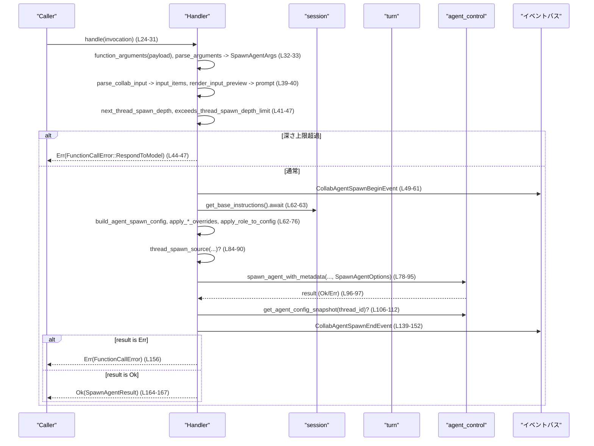

# core/src/tools/handlers/multi_agents/spawn.rs

## 0. ざっくり一言

`ToolHandler` 実装として「別のエージェント（スレッド）を生成する」ツール呼び出しを受け取り、  
引数解析・深さ制限のチェック・エージェント設定の構築・実際の spawn・イベント送信・結果返却までを一括で行うモジュールです。[spawn.rs:L11-168]

---

## 1. このモジュールの役割

### 1.1 概要

- このモジュールは **コラボレーション用エージェントを新規に spawn するツール** を扱うためのハンドラを提供します。[spawn.rs:L11-24]
- ツール引数からメッセージや入力項目・ロール・モデル指定などを取り出し、エージェント用設定を組み立てたうえで `agent_control.spawn_agent_with_metadata` を呼び出します。[spawn.rs:L24-83]
- spawn の前後で `CollabAgentSpawnBeginEvent` / `CollabAgentSpawnEndEvent` を発行し、セッション・テレメトリを更新することで、観測性も確保しています。[spawn.rs:L49-61, L139-162]

### 1.2 アーキテクチャ内での位置づけ

このファイルに直接現れる依存関係を簡略化した図です。

```mermaid
graph TD
    subgraph "multi_agents::spawn.rs"
        H["Handler (ToolHandler 実装)"]
        R["SpawnAgentResult (ToolOutput 実装)"]
    end

    H -->|handle (L24-168)| AC["agent_control.spawn_agent_with_metadata"]
    H -->|handle| BS["build_agent_spawn_config"]
    H -->|handle| AR["apply_role_to_config"]
    H -->|handle| AO["apply_spawn_agent_*_overrides"]
    H -->|handle| TS["thread_spawn_source"]
    H -->|handle| SD["next_thread_spawn_depth / exceeds_thread_spawn_depth_limit"]
    H -->|handle| EV["CollabAgentSpawnBegin/EndEvent"]
    H -->|handle| TEL["session_telemetry.counter"]

    R -->|ToolOutput| LOG["tool_output_* ユーティリティ"]

```

- `Handler` は `ToolHandler` トレイトを実装し、ツール呼び出しから spawn ロジック全体をカバーします。[spawn.rs:L11-168]
- `spawn_agent_with_metadata`・`get_agent_config_snapshot` などの実際のエージェント制御は `session.services.agent_control` に委譲されています。[spawn.rs:L78-83, L108-112]
- 設定組立てやモデル/ランタイム/深さのオーバーライドは `super::*` や `crate::agent::role` にある補助関数に委譲されています。[spawn.rs:L6, L62-76]
- 結果の表現 (`SpawnAgentResult`) とツール出力フォーマット (`ToolOutput` 実装) もこのファイルに含まれます。[spawn.rs:L182-204]

### 1.3 設計上のポイント

- **責務の分割**
  - 引数の解析・入力変換・設定構築・実際の spawn・イベント送信をひとつの `handle` メソッドに直列にまとめています。[spawn.rs:L24-168]
  - 実際の設定詳細（モデル・ランタイムフラグ・深さオーバーライド等）は他のヘルパー関数に委譲し、このモジュールからは「高レベルなフロー」が分かるようになっています。[spawn.rs:L62-76]
- **状態**
  - `Handler` はフィールドを持たない空の構造体であり、内部状態を保持しません。[spawn.rs:L11]
  - すべての状態は `ToolInvocation` 引数（`session`, `turn`, `payload`, `call_id` など）およびローカル変数のみで扱われます。[spawn.rs:L24-31]
- **エラーハンドリング**
  - 失敗しうる操作はほぼすべて `Result` / `?` / `map_err` で扱い、`FunctionCallError` に統一します。[spawn.rs:L32-33, L39, L44-47, L62-64, L71-75, L84-90, L96-97, L156]
  - エージェント深さ制限に達した場合は、専用メッセージを `FunctionCallError::RespondToModel` 経由でモデルに返します。[spawn.rs:L44-47]
  - spawn が失敗しても、「終了イベント」は `AgentStatus::NotFound` として送信し、観測性を維持しています。[spawn.rs:L98-105, L139-152]
- **並行性**
  - `handle` は `async` 関数であり、`session` や `agent_control` に対する I/O を `await` で非同期実行します。[spawn.rs:L24, L61, L71, L112, L155, L96]
  - `Handler` が内部状態を持たないため、複数のツール呼び出しから同一インスタンスを並行に利用しても、レースコンディションは発生しにくい構造です（共有されるのは外部の `session` 等）。[spawn.rs:L11-24]

---

## 2. コンポーネント一覧（インベントリー）

### 2.1 型（構造体）

| 名前 | 種別 | 可視性 | 役割 / 用途 | 定義位置 |
|------|------|--------|------------|----------|
| `Handler` | 構造体（フィールドなし） | `pub(crate)` | multi-agent spawn ツールのハンドラ本体。`ToolHandler` を実装します。 | `spawn.rs:L11` |
| `SpawnAgentArgs` | 構造体 | 非公開 | ツール引数をデシリアライズするための入力パラメータ。メッセージ・アイテム・エージェント種別・モデル・reasoning_effort・fork_context を保持します。 | `spawn.rs:L171-180` |
| `SpawnAgentResult` | 構造体 | `pub(crate)` | spawn により生成されたエージェントの ID とニックネームを表すツール結果。`ToolOutput` を実装します。 | `spawn.rs:L182-186` |

### 2.2 関数 / メソッド

| 名称 | 種別 | 概要 | 定義位置 |
|------|------|------|----------|
| `Handler::kind(&self) -> ToolKind` | メソッド | このツールが `Function` 型であることを返します。 | `spawn.rs:L16-18` |
| `Handler::matches_kind(&self, payload: &ToolPayload) -> bool` | メソッド | 与えられた `ToolPayload` が関数呼び出しかどうかを判定します。 | `spawn.rs:L20-22` |
| `Handler::handle(&self, invocation: ToolInvocation) -> Result<SpawnAgentResult, FunctionCallError>` | async メソッド | spawn ロジックの中核。引数解析、深さ制限チェック、設定構築、spawn、イベント送信、結果返却を行います。 | `spawn.rs:L24-168` |
| `SpawnAgentResult::log_preview(&self) -> String` | メソッド | ログ向けプレビュー文字列を JSON テキストとして生成します。 | `spawn.rs:L189-191` |
| `SpawnAgentResult::success_for_logging(&self) -> bool` | メソッド | ログ上の成功フラグとして常に `true` を返します。 | `spawn.rs:L193-195` |
| `SpawnAgentResult::to_response_item(&self, call_id: &str, payload: &ToolPayload) -> ResponseInputItem` | メソッド | ツール呼び出しに対応するレスポンスアイテムを構築します。 | `spawn.rs:L197-199` |
| `SpawnAgentResult::code_mode_result(&self, _payload: &ToolPayload) -> JsonValue` | メソッド | 「コードモード」向けの JSON 結果を生成します。 | `spawn.rs:L201-203` |

---

## 3. 公開 API と詳細解説

### 3.1 型一覧（詳細）

| 名前 | 種別 | フィールド | 説明 | 定義位置 |
|------|------|-----------|------|----------|
| `Handler` | 構造体 | なし | multi-agent spawn 用 `ToolHandler` 実装の本体です。インスタンス自体に状態はありません。 | `spawn.rs:L11` |
| `SpawnAgentArgs` | 構造体 | `message: Option<String>` / `items: Option<Vec<UserInput>>` / `agent_type: Option<String>` / `model: Option<String>` / `reasoning_effort: Option<ReasoningEffort>` / `fork_context: bool` | ツール引数 JSON をデシリアライズするための入力パラメータです。[spawn.rs:L171-180] `fork_context` は `#[serde(default)]` により未指定時は `false` です。[spawn.rs:L178-179] | `spawn.rs:L171-180` |
| `SpawnAgentResult` | 構造体 | `agent_id: String` / `nickname: Option<String>` | spawn されたエージェントスレッドの ID と、そのニックネーム（存在する場合）を返す結果です。[spawn.rs:L183-186] | `spawn.rs:L182-186` |

### 3.2 関数詳細

#### `Handler::handle(&self, invocation: ToolInvocation) -> Result<SpawnAgentResult, FunctionCallError>`

**概要**

multi-agent 用 spawn ツールの呼び出しを処理する中核メソッドです。[spawn.rs:L24-168]

- ツール引数を `SpawnAgentArgs` にパースし、入力アイテム・ロール名・モデル・reasoning_effort などを取得します。[spawn.rs:L32-40]
- スレッド深さを計算し、`agent_max_depth` を超える場合はエラーを返します。[spawn.rs:L41-47]
- エージェント設定を構築・上書きし、`spawn_agent_with_metadata` でエージェントを生成します。[spawn.rs:L62-83]
- spawn の前後でイベント送信を行い、最後に `SpawnAgentResult` を返します。[spawn.rs:L49-61, L98-167]

**引数**

| 引数名 | 型 | 説明 |
|--------|----|------|
| `invocation` | `ToolInvocation` | セッション・ターン・ペイロード・コール ID など、ツール呼び出しに関するコンテキストをまとめた構造体です。[spawn.rs:L24-31] |

※ `ToolInvocation` 自体の定義はこのチャンクには存在しません。

**戻り値**

- `Ok(SpawnAgentResult)`  
  - 正常にエージェントが spawn された場合、新しいエージェントの ID とニックネームを含みます。[spawn.rs:L164-167]
- `Err(FunctionCallError)`  
  - 引数パース、入力変換、設定構築、ロールやモデルの適用、ソース生成、spawn などのどこかで失敗した場合に返されます。[spawn.rs:L32-33, L39, L44-47, L62-64, L71-75, L84-90, L96-97, L156]

**内部処理の流れ**

処理フローをステップに分解すると、以下のようになります。

1. **コンテキストの展開と引数パース**  
   - `ToolInvocation` から `session`, `turn`, `payload`, `call_id` を取り出します。[spawn.rs:L25-31]  
   - `function_arguments(payload)?` で生の引数（JSON 文字列など）を取得し、`parse_arguments(&arguments)?` で `SpawnAgentArgs` にデシリアライズします。[spawn.rs:L32-33]
2. **ロール名と入力アイテムの確定**  
   - `agent_type` 文字列を `Option<&str>` に変換し、トリム + 空文字排除によって有効なロール名だけを残します（なければ `None`）。[spawn.rs:L34-38]  
   - `parse_collab_input(args.message, args.items)?` でメッセージとアイテムから `input_items` を構築します。[spawn.rs:L39]  
   - `render_input_preview(&input_items)` で新規エージェントに渡すプロンプトのプレビューを生成します。[spawn.rs:L40]
3. **スレッド深さと上限のチェック**  
   - `session_source = turn.session_source.clone()` から新しいスレッドの元になるセッション情報を取得します。[spawn.rs:L41]  
   - `child_depth = next_thread_spawn_depth(&session_source)` で子スレッドの深さを計算し、`max_depth = turn.config.agent_max_depth` と比較します。[spawn.rs:L42-43]  
   - `exceeds_thread_spawn_depth_limit(child_depth, max_depth)` が `true` の場合、`FunctionCallError::RespondToModel` として「Agent depth limit reached. Solve the task yourself.」を返して処理を終了します。[spawn.rs:L44-47]
4. **spawn 開始イベント送信**  
   - `CollabAgentSpawnBeginEvent` を構築し、`session.send_event(&turn, ...).await` で送信します。[spawn.rs:L49-61]  
   - このイベントには `call_id`, `sender_thread_id`, `prompt`, `model`（引数のモデルまたはデフォルト）、`reasoning_effort`（引数またはデフォルト）が含まれます。[spawn.rs:L52-58]
5. **エージェント設定の構築とオーバーライド**  
   - `session.get_base_instructions().await` からベースとなる指示を取得し、`build_agent_spawn_config(...)?` で `config` を構築します。[spawn.rs:L62-63]  
   - `apply_requested_spawn_agent_model_overrides(...)` でユーザ指定のモデルと reasoning_effort を反映します。[spawn.rs:L64-71]  
   - `apply_role_to_config(&mut config, role_name).await` でロール（あれば）を設定に反映し、エラー時には `FunctionCallError::RespondToModel` に変換します。[spawn.rs:L72-74]  
   - `apply_spawn_agent_runtime_overrides` と `apply_spawn_agent_overrides` でランタイムと深さに応じた追加のオーバーライドを行います。[spawn.rs:L75-76]
6. **エージェント spawn と結果の分析**  
   - `thread_spawn_source(...)?` で spawn 元情報を生成し、それを `Some(...)` として `spawn_agent_with_metadata` に渡します。[spawn.rs:L84-90]  
   - `SpawnAgentOptions` の `fork_parent_spawn_call_id` と `fork_mode` は `fork_context` が `true` の場合にのみ設定されます。[spawn.rs:L91-94]  
   - `spawn_agent_with_metadata(...).await.map_err(collab_spawn_error)` でエージェントを生成し、結果を `result: Result<_, FunctionCallError>` に変換します。[spawn.rs:L78-97]  
   - `match &result` により、成功時は `new_thread_id`・`new_agent_metadata`・`status` を取得し、失敗時は `None` と `AgentStatus::NotFound` を設定します。[spawn.rs:L98-105]
7. **エージェント設定スナップショットと表示用情報の確定**  
   - `new_thread_id` が `Some` の場合のみ `get_agent_config_snapshot(thread_id).await` を呼び、スナップショットを取得します。[spawn.rs:L106-115]  
   - スナップショットがある場合はそこから、なければメタデータから、エージェントパス・ニックネーム・ロール情報を決定します。[spawn.rs:L116-129]  
   - モデル・reasoning_effort は、スナップショットの値があればそれを、なければ引数の値（またはデフォルト）を使用します。[spawn.rs:L130-137]
8. **spawn 終了イベント送信と最終結果返却**  
   - ニックネームをローカル変数 `nickname` に退避しつつ、`CollabAgentSpawnEndEvent` を送信します。[spawn.rs:L138-155]  
   - その後 `let new_thread_id = result?.thread_id;` により、エラーであればここで `Err(FunctionCallError)` を返し、成功であれば実際の新スレッド ID を取得します。[spawn.rs:L156]  
   - ロールタグ（指定がなければ `DEFAULT_ROLE_NAME`）を決定し、`turn.session_telemetry.counter("codex.multi_agent.spawn", 1, &[("role", role_tag)])` でテレメトリを更新します。[spawn.rs:L157-162]  
   - 最後に `Ok(SpawnAgentResult { agent_id: new_thread_id.to_string(), nickname })` を返します。[spawn.rs:L164-167]

**Examples（使用例）**

このチャンクには直接の使用例コードはありませんが、`Handler` を使った概略的な呼び出し例は次のようになります（型の詳細は他モジュール依存のため簡略表現です）。

```rust
// Handler を生成する（状態を持たないので空の構造体）
let handler = Handler; // spawn.rs:L11

// どこかで ToolInvocation が構築されているとする
let invocation = ToolInvocation {
    session,        // セッションコンテキスト
    turn,           // 現在のターン情報
    payload,        // ツール呼び出しのペイロード（引数を含む）
    call_id,        // このツール呼び出しの ID
    // ...
};

// 非同期コンテキストで handle を await する
let result: Result<SpawnAgentResult, FunctionCallError> =
    handler.handle(invocation).await;

// 成功時: 新規エージェント ID とニックネームへアクセス
if let Ok(spawn_result) = result {
    println!("Spawned agent: id={}, nickname={:?}",
             spawn_result.agent_id,  // spawn.rs:L183
             spawn_result.nickname); // spawn.rs:L184-185
}
```

**Errors / Panics**

このメソッドで `Err(FunctionCallError)` になりうる主な条件は以下です。

- 引数関連
  - `function_arguments(payload)` の失敗（ツール payload から引数を取り出せない場合）。[spawn.rs:L32]
  - `parse_arguments(&arguments)` の失敗（JSON → `SpawnAgentArgs` のデシリアライズ失敗など）。[spawn.rs:L33]
  - `parse_collab_input(args.message, args.items)` の失敗（入力メッセージ/アイテムの解釈に失敗した場合）。[spawn.rs:L39]
- 深さ制限
  - `exceeds_thread_spawn_depth_limit(child_depth, max_depth)` が真の場合、`FunctionCallError::RespondToModel` が明示的に返されます。[spawn.rs:L44-47]
- 設定構築関連
  - `build_agent_spawn_config(...)?` の失敗。[spawn.rs:L62-63]
  - `apply_requested_spawn_agent_model_overrides(...).await?` の失敗。[spawn.rs:L64-71]
  - `apply_role_to_config(...).await` の失敗（この場合は `FunctionCallError::RespondToModel` に変換）。[spawn.rs:L72-74]
  - `apply_spawn_agent_runtime_overrides(&mut config, turn.as_ref())?` の失敗。[spawn.rs:L75]
- spawn ソースと spawn 自体
  - `thread_spawn_source(...)` の失敗（`?` による伝播）。[spawn.rs:L84-90]
  - `spawn_agent_with_metadata(...).await` の失敗（`map_err(collab_spawn_error)` により `FunctionCallError` に変換）。[spawn.rs:L78-97]
  - 最終的に `result?.thread_id` で再度 `?` を使うため、ここでも `Err(FunctionCallError)` が返りうることになります。[spawn.rs:L156]

panic 発生条件について、このチャンク内から断定できるものはありません（`unwrap_or_default` や `map`・`filter` などは panic を発生させません）。[spawn.rs:L34-38, L56-57, L133-137]

**Edge cases（エッジケース）**

このメソッドの代表的なエッジケースと、その挙動（コードから読み取れる範囲）は以下の通りです。

- **`agent_type` が指定されない／空文字のみ**  
  - `agent_type: None` → `role_name` は `None`（`apply_role_to_config` にはロールなしとして渡されます）。[spawn.rs:L34-38, L72]  
  - `Some("   ")` のように空白のみの場合も `trim` 後に空文字となり、`filter(|role| !role.is_empty())` で `None` になります。[spawn.rs:L35-38]
- **`message` と `items` のいずれか／両方が `None`**  
  - `parse_collab_input(args.message, args.items)` の挙動に依存しますが、少なくとも `Option<String>` と `Option<Vec<UserInput>>` がそのまま渡されます。[spawn.rs:L39]  
  - 両方 `None` の場合の取り扱い（エラーにするか、空の入力とみなすか）は、このチャンクからは分かりません。
- **深さ制限境界**  
  - `child_depth` が `max_depth` を超えた場合のみエラーとなります（超えない場合は通常通り続行）。具体的な比較条件は `exceeds_thread_spawn_depth_limit` の実装によりますが、少なくとも `bool` 結果として使われています。[spawn.rs:L41-47]
- **spawn 失敗時**  
  - `result` が `Err` の場合でも、`new_thread_id = None`, `status = AgentStatus::NotFound` として終了イベントが送信されます。[spawn.rs:L98-105, L139-152]  
  - その後 `result?.thread_id` で `Err(FunctionCallError)` が返されるため、`SpawnAgentResult` は生成されません。[spawn.rs:L156]

**使用上の注意点**

- `handle` は非同期関数のため、必ず `async` コンテキストから `await` して利用する必要があります。[spawn.rs:L24]
- 深さ制限 (`agent_max_depth`) によって、自己増殖的にエージェントを spawn し続けるような呼び出しは抑制されます。これを超えた場合はモデル自身がタスクを解決する必要があります。[spawn.rs:L41-47]
- `fork_context` が `true` の場合のみ、親スレッドのフル履歴を共有する fork モード (`SpawnAgentForkMode::FullHistory`) が有効になり、`fork_parent_spawn_call_id` が設定されます。[spawn.rs:L91-94]  
  逆に言うと、`fork_context` を明示的に渡さない（デフォルト `false`）と、fork にはなりません。[spawn.rs:L178-179]
- `apply_role_to_config` や `apply_spawn_agent_*_overrides` など、設定を変える関数は複数存在し、それぞれが `?` でエラーを返しうるため、呼び出し側でこの `handle` を利用する際には `FunctionCallError` をハンドルする必要があります。[spawn.rs:L62-76, L156]

---

#### `SpawnAgentResult::to_response_item(&self, call_id: &str, payload: &ToolPayload) -> ResponseInputItem`

**概要**

ツールの実行結果である `SpawnAgentResult` を、外部に返却するための `ResponseInputItem` 型に変換します。[spawn.rs:L197-199]

**引数**

| 引数名 | 型 | 説明 |
|--------|----|------|
| `call_id` | `&str` | このツール呼び出しの一意な ID。イベント等と対応付けるために使われます。 |
| `payload` | `&ToolPayload` | 元のツール呼び出しペイロード。レスポンス生成の補助情報として渡されます。 |

**戻り値**

- `ResponseInputItem`  
  - ツール応答としてチャット履歴などに挿入可能な構造です。生成には `tool_output_response_item` ユーティリティが使われ、`"spawn_agent"` という固定のラベルが付与されます。[spawn.rs:L197-199]

**内部処理**

- `tool_output_response_item(call_id, payload, self, Some(true), "spawn_agent")` を呼び出すだけの薄いラッパーです。[spawn.rs:L197-199]  
  第 4 引数 `Some(true)` は、成功を示すフラグとして使われていると推察されますが、詳細は `tool_output_response_item` の実装依存です。

**Errors / Panics / Edge cases**

- このメソッド自体は `Result` を返さず、`?` も使用していないため、ここで `Err` が返ることはありません。[spawn.rs:L197-199]
- 内部の `tool_output_response_item` が panic する可能性については、このチャンクからは分かりません。

---

### 3.3 その他の関数

`SpawnAgentResult` の残りの `ToolOutput` 実装メソッドと、`Handler::kind` / `Handler::matches_kind` は比較的単純なので一覧でまとめます。

| 関数名 | 役割 | 根拠 |
|--------|------|------|
| `Handler::kind(&self) -> ToolKind` | このツールが関数型 (`ToolKind::Function`) であることを返します。ツールハンドラ種別の識別に使われます。 | `ToolKind::Function` をそのまま返している。[spawn.rs:L16-18] |
| `Handler::matches_kind(&self, payload: &ToolPayload) -> bool` | 与えられた `payload` が関数呼び出しかどうかを `matches!` マクロで判定し、このハンドラが対象とするかどうかを返します。 | `matches!(payload, ToolPayload::Function { .. })` を返している。[spawn.rs:L20-22] |
| `SpawnAgentResult::log_preview(&self) -> String` | ログ向けの JSON 文字列プレビューを `tool_output_json_text(self, "spawn_agent")` で生成します。 | [spawn.rs:L189-191] |
| `SpawnAgentResult::success_for_logging(&self) -> bool` | 常に `true` を返すことで、ログ上では「成功」として扱う想定になっています。 | 単に `true` を返している。[spawn.rs:L193-195] |
| `SpawnAgentResult::code_mode_result(&self, _payload: &ToolPayload) -> JsonValue` | コードモード用の JSON 結果を `tool_output_code_mode_result(self, "spawn_agent")` で生成します。 | [spawn.rs:L201-203] |

---

## 4. データフロー

### 4.1 代表的な処理シナリオ：エージェント spawn

`Handler::handle` における典型的なデータと呼び出しの流れをシーケンス図で示します。



この図は `handle` メソッド全体（L24-168）のフローを表します。

---

## 5. 使い方（How to Use）

### 5.1 基本的な使用方法

このチャンク内だけではモジュール全体の初期化コードはありませんが、想定される基本フローは以下の通りです。

```rust
// 1. Handler インスタンスを用意する
let handler = Handler; // spawn.rs:L11

// 2. ToolInvocation を構築する（他モジュールで定義されている前提）
let invocation = ToolInvocation {
    session,   // セッションコンテキスト
    turn,      // 現在のターン情報
    payload,   // SpawnAgentArgs に相当する JSON を含む ToolPayload
    call_id,   // 一意なコール ID
    // ...
};

// 3. 非同期に handle を実行し、結果を受け取る
let result = handler.handle(invocation).await;

// 4. 結果の利用
match result {
    Ok(spawn_result) => {
        // 新規エージェント ID とニックネームを利用する
        println!("New agent id = {}, nickname = {:?}",
                 spawn_result.agent_id,    // spawn.rs:L183
                 spawn_result.nickname);   // spawn.rs:L185
    }
    Err(err) => {
        // FunctionCallError に基づいてエラー処理を行う
        eprintln!("Failed to spawn agent: {:?}", err);
    }
}
```

### 5.2 よくある使用パターン

1. **新しいエージェントを通常 spawn するパターン**

```jsonc
// ToolPayload 内の関数引数 JSON 例（イメージ）
{
  "message": "Please review this code.",
  "items": [ /* UserInput の配列 */ ],
  "agent_type": "reviewer",
  "model": "gpt-4.1",
  "reasoning_effort": "medium"
}
```

- `fork_context` を指定しなければデフォルト `false` となり、親履歴を共有しない通常の spawn になります。[spawn.rs:L178-179, L91-94]

1. **親スレッドの履歴を fork するパターン**

```jsonc
{
  "message": "Continue discussion in a forked agent.",
  "fork_context": true
}
```

- `fork_context: true` により、`SpawnAgentOptions` の `fork_parent_spawn_call_id` と `fork_mode: FullHistory` が設定されます。[spawn.rs:L91-94]

### 5.3 よくある間違い

（コードから推測される範囲）

```rust
// 間違い例: 非同期コンテキスト外で await せずに呼び出す
let handler = Handler;
// let result = handler.handle(invocation); // コンパイルエラー: async fn は Future を返す

// 正しい例: async コンテキストから await する
async fn spawn_agent(handler: Handler, invocation: ToolInvocation) {
    let result = handler.handle(invocation).await;
    // ...
}
```

```rust
// 間違い例: 深さ制限を考慮せずに再帰的に spawn を繰り返す
async fn naive_recursive_spawn(handler: &Handler, invocation: ToolInvocation) {
    let result = handler.handle(invocation).await;
    if result.is_ok() {
        // さらに同じ handler で spawn を繰り返す...
    }
}

// 正しい使用: 深さ制限が組み込まれているため、上位側は無限再帰を前提にしない
// handle 内で exceeds_thread_spawn_depth_limit による制御が行われる。[spawn.rs:L41-47]
```

### 5.4 使用上の注意点（まとめ）

- `handle` は必ず `await` で実行する必要があります。[spawn.rs:L24]
- ツール引数 JSON は `SpawnAgentArgs` の構造に整合している必要があります。[spawn.rs:L171-180]
- 深さ制限 (`agent_max_depth`) を超えると `FunctionCallError::RespondToModel` となり、追加のエージェント生成は行われません。[spawn.rs:L41-47]
- `fork_context` を `true` にすると親スレッドの履歴を共有する fork モードになりますが、その場合のデータ量やプライバシーへの影響は、`SpawnAgentForkMode::FullHistory` の仕様に依存します。[spawn.rs:L91-94]
- spawn 失敗時も、`CollabAgentSpawnEndEvent` が送信されるため、モニタリング側は「終了イベントの有無」だけでは成功/失敗を区別できません。`status` や `new_thread_id` を確認する必要があります。[spawn.rs:L98-105, L139-152]

### 5.5 バグになりうる点・セキュリティ上の留意事項

コードから読み取れる範囲での注意点です。

- **深さ制限に依存した自己防衛**  
  - 無制限なエージェント自己生成は `exceeds_thread_spawn_depth_limit` で防いでいますが、この関数のポリシーによっては、想定より浅い／深いところで止まる可能性があります。[spawn.rs:L41-47]  
  - 深さ制限を緩く設定すると、リソース消費（スレッド数や API コール数）が増える可能性があります。
- **入力内容の安全性**  
  - `message` や `items` の内容はそのまま `input_items` および `prompt` として新規エージェントに渡されます。[spawn.rs:L39-40]  
  - モデルにとって機密情報や危険な指示が含まれていないかなどは、上位レイヤで制御する必要があります。このチャンクでは特別なフィルタリングは行っていません。
- **spawn 失敗時の扱い**  
  - `result` が `Err` の場合でも終了イベントが送信され、その後 `result?` により `FunctionCallError` が返されます。[spawn.rs:L98-105, L139-156]  
  - 呼び出し側がイベントだけを見て「spawn に成功した」と誤解しないよう、`status` やエラー結果も併せて扱う必要があります。

このチャンクから明確なロジックバグは読み取れませんが、実際の安全性は依存関数（`parse_collab_input`, `apply_*_overrides`, `thread_spawn_source` など）の実装にも依存します。

---

## 6. 変更の仕方（How to Modify）

### 6.1 新しい機能を追加する場合

例: spawn 時に追加メタデータを渡したい場合。

1. **引数拡張**  
   - `SpawnAgentArgs` に新しいフィールドを追加し、`Deserialize` の対象に含めます。[spawn.rs:L171-180]  
   - `handle` 内で `args` から新フィールドを読み取り、ローカル変数として保持します。[spawn.rs:L32-40]
2. **設定反映**  
   - 追加した情報を `build_agent_spawn_config` の引数に渡すか、あるいは `apply_spawn_agent_overrides` の内部で利用するよう変更します。[spawn.rs:L62-76]
3. **spawn 呼び出しへの反映**  
   - 必要に応じて `spawn_agent_with_metadata` の引数に追加情報を渡すよう拡張します。[spawn.rs:L81-95]
4. **結果への反映**  
   - 追加情報をクライアントにも返す必要がある場合は、`SpawnAgentResult` にフィールドを追加し、`ToolOutput` 実装を更新します。[spawn.rs:L182-204]

### 6.2 既存の機能を変更する場合

- **深さ制限ポリシーを変更したい**  
  - `next_thread_spawn_depth` および `exceeds_thread_spawn_depth_limit` の実装（別ファイル）を確認し、必要に応じて変更します。[spawn.rs:L41-47]  
  - 変更後は、期待した深さでエラーになるかをテストで確認する必要があります。
- **ロール適用ロジックを変更したい**  
  - `apply_role_to_config` の実装を確認し、ロール名の解釈やデフォルトロールの扱いを見直します。[spawn.rs:L6, L72-74]  
  - `DEFAULT_ROLE_NAME` の意味も関連します。[spawn.rs:L5, L157]
- **イベント内容を変更したい**  
  - `CollabAgentSpawnBeginEvent` / `CollabAgentSpawnEndEvent` のフィールド定義箇所（別ファイル）を確認し、このメソッドから渡す値や追加フィールドを調整します。[spawn.rs:L52-58, L142-151]

変更時には、`FunctionCallError` の扱い・`ToolOutput` の互換性・イベントスキーマの互換性などが破壊されていないかを確認する必要があります。

### 6.3 テストに関する情報

- このチャンクにはテストコードは含まれていません。
- 想定されるテスト観点としては、以下が挙げられます（実際のテストコードは別ファイル）:
  - 深さ制限の境界値（上限ぴったり／上限超え）の挙動。[spawn.rs:L41-47]
  - 引数の組み合わせ（`message`/`items` の有無、`agent_type` の有無、`fork_context` の true/false 等）。[spawn.rs:L34-40, L171-180]
  - spawn 成功/失敗の両ケースで、開始/終了イベントの内容が期待通りかどうか。[spawn.rs:L49-61, L139-152]
  - `SpawnAgentResult` の `ToolOutput` 実装が期待する JSON/レスポンスを生成しているか。[spawn.rs:L182-204]

---

## 7. 関連ファイル

このモジュールと密接に関係しそうなファイル（インポート先）を一覧化します。実際の実装はこのチャンクには含まれていません。

| パス / モジュール | 役割 / 関係 |
|------------------|------------|
| `super::*` | `build_agent_spawn_config`, `apply_requested_spawn_agent_model_overrides`, `apply_spawn_agent_runtime_overrides`, `apply_spawn_agent_overrides`, `parse_collab_input`, `thread_spawn_source`, `collab_spawn_error`, `function_arguments`, `parse_arguments`, `tool_output_*` 系など、このファイルで使われる多数のユーティリティ関数・型を提供します。[spawn.rs:L1, L32-33, L39, L62-76, L84-90, L96-97, L189-203] |
| `crate::agent::control` | `SpawnAgentForkMode`, `SpawnAgentOptions`, `render_input_preview`, `agent_control.spawn_agent_with_metadata`, `get_agent_config_snapshot` など、エージェント制御ロジックを提供するモジュールです。[spawn.rs:L2-4, L78-83, L108-112, L171-177] |
| `crate::agent::role` | `DEFAULT_ROLE_NAME`, `apply_role_to_config` など、エージェントのロール設定に関する機能を提供します。[spawn.rs:L5-6, L72-74, L157] |
| `crate::agent::exceeds_thread_spawn_depth_limit`, `crate::agent::next_thread_spawn_depth` | スレッドの spawn 深さとその上限チェックを行う関数です。[spawn.rs:L8-9, L41-47] |
| イベント関連モジュール | `CollabAgentSpawnBeginEvent`, `CollabAgentSpawnEndEvent` を定義するモジュール。spawn 開始/終了時にイベントを構築するために使用されます。[spawn.rs:L49-60, L139-152] |
| テレメトリ関連モジュール | `turn.session_telemetry` の `counter` メソッドを提供するモジュール。spawn を計測するために使用されます。[spawn.rs:L158-162] |

このチャンクにはファイルパス文字列そのものは現れないため、正確なパスは上位モジュール構成に依存します。
