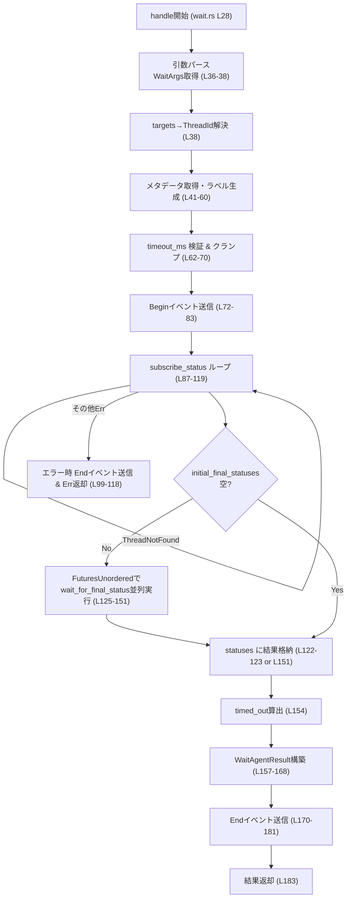
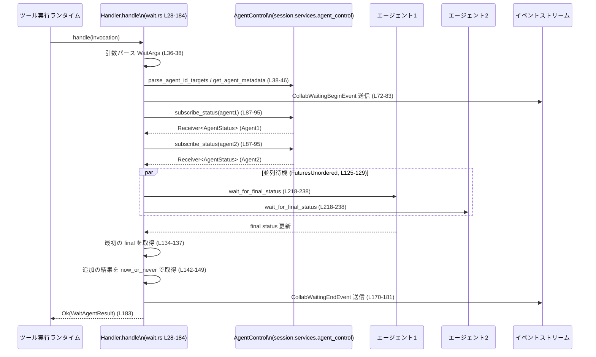

# core/src/tools/handlers/multi_agents/wait.rs コード解説

---

## 0. ざっくり一言

- 複数のエージェント（スレッド）を対象に「最終状態（final status）」になるまで待機し、その結果とタイムアウト有無を返すツールハンドラと、その出力形式を定義するモジュールです（`wait.rs:L15-16`, `wait.rs:L28-184`, `wait.rs:L194-215`）。

---

## 1. このモジュールの役割

### 1.1 概要

- このモジュールは、マルチエージェント環境で「指定したエージェント群の状態変化を監視し、少なくとも1つが最終状態になるか、タイムアウトするまで待つ」処理を提供します（`wait.rs:L28-152`）。
- ツール実行フレームワークから `ToolInvocation` を受け取り、JSON引数を `WaitArgs` にパースし、対象エージェントのステータス監視をセットアップします（`wait.rs:L28-39`, `wait.rs:L187-192`）。
- 監視の開始と終了はそれぞれ `CollabWaitingBeginEvent` / `CollabWaitingEndEvent` としてイベントストリームに送信され、外部から観測できるようになっています（`wait.rs:L72-83`, `wait.rs:L100-116`, `wait.rs:L170-181`）。

### 1.2 アーキテクチャ内での位置づけ

このモジュールは「ツール実行基盤」と「エージェント管理サービス」の橋渡しをするコンポーネントとして動作しています。

```mermaid
flowchart LR
    subgraph Runtime["ツール実行ランタイム"]
        TI["ToolInvocation\n(super, 型のみ参照)"]
        TH["ToolHandlerトレイト\n(super, 型のみ参照)"]
    end

    H["Handler (wait.rs L15-185)\nwaitツールの実装"]
    S["Session (Arc<Session>)\n(super, 型のみ参照)"]
    AC["AgentControlサービス\n(session.services.agent_control)"]
    Wrx["watch::Receiver<AgentStatus>\n(tokio::sync::watch)"]
    EBegin["CollabWaitingBeginEvent\n(super, 型のみ参照)"]
    EEnd["CollabWaitingEndEvent\n(super, 型のみ参照)"]
    Out["WaitAgentResult\n(wait.rs L194-215)"]

    TI -->|handle() 呼び出し| H
    H -->|引数パース| H
    H -->|send_event()| EBegin
    H --> S
    S --> AC
    AC -->|subscribe_status()| Wrx
    Wrx -->|wait_for_final_status()\n(wait.rs L218-238)| H
    H -->|send_event()| EEnd
    H --> Out
    Out --> Runtime
```

- `Handler` は `ToolHandler` トレイトを実装し、ツール実行ランタイムから呼び出されます（`wait.rs:L17-27`）。
- ステータス取得やイベント送信は `Session` 経由で `agent_control` サービスおよびイベントシステムに委譲されています（`wait.rs:L41-46`, `wait.rs:L72-83`, `wait.rs:L88-101`, `wait.rs:L170-181`, `wait.rs:L218-231`）。
- 実際のステータス監視は `wait_for_final_status` と `tokio::sync::watch::Receiver` を用いて非同期に行われます（`wait.rs:L218-238`）。

### 1.3 設計上のポイント

- **責務の分離**
  - `Handler::handle` は引数処理・監視セットアップ・イベント送信・結果の組み立てを担当します（`wait.rs:L28-184`）。
  - 実際の「ある1エージェントの最終状態までの待機」は `wait_for_final_status` に切り出されています（`wait.rs:L218-238`）。
- **状態管理**
  - 対象エージェント一覧（スレッドID・ニックネーム等）は `receiver_agents` と `target_by_thread_id` に保持されます（`wait.rs:L39-60`）。
  - 結果は `(ThreadId, AgentStatus)` のベクタとして集約し、それを `HashMap<String, AgentStatus>` に変換して公開します（`wait.rs:L122-123`, `wait.rs:L151-167`, `wait.rs:L195-197`）。
- **エラーハンドリング方針**
  - 引数のパースやタイムアウト値のバリデーションは `FunctionCallError` として呼び出し元に返します（`wait.rs:L36-38`, `wait.rs:L62-70`）。
  - ステータス購読時の `ThreadNotFound` は正常ケースとして扱い、`AgentStatus::NotFound` として結果に含めます（`wait.rs:L96-98`）。
  - その他の `CodexErr` はイベント送信のうえ `collab_agent_error` でエラーとして返します（`wait.rs:L99-118`）。
- **並行性**
  - 各エージェントの待機は `FuturesUnordered` によって並列に進行します（`wait.rs:L125-129`）。
  - `Arc<Session>` により `Session` を複数タスクから安全に共有します（`wait.rs:L127`, `wait.rs:L218-220`）。
  - `tokio::time::timeout_at` によって全体の待機時間に上限を設けています（`wait.rs:L131-140`）。
- **観測性（Observability）**
  - 待機開始時と終了時に、それぞれ begin/end イベントを発行し、UI やログ側がユーザーに「待っている状態」と結果を伝えられるようにしています（`wait.rs:L72-83`, `wait.rs:L102-116`, `wait.rs:L170-181`）。

---

## 2. 主要な機能一覧（コンポーネントインベントリ）

### 2.1 型・コンポーネント一覧

| 名前 | 種別 | 公開範囲 | 役割 / 用途 | 定義位置 |
|------|------|----------|-------------|----------|
| `Handler` | 構造体 | `pub(crate)` | wait ツールの `ToolHandler` 実装本体。ツール呼び出しを受けて監視・結果返却を行う | `wait.rs:L15-16`, `wait.rs:L17-185` |
| `WaitArgs` | 構造体 | モジュール内非公開 | ツール引数（targets, timeout_ms）の受け皿。`Deserialize` により JSON 等からパースされる | `wait.rs:L187-192` |
| `WaitAgentResult` | 構造体 | `pub(crate)` | エージェントごとの最終ステータスとタイムアウトフラグを保持し、`ToolOutput` として応答に変換される | `wait.rs:L194-198`, `wait.rs:L200-215` |
| `wait_for_final_status` | 非同期関数 | モジュール内非公開 | 単一エージェントのステータスを watch チャネル経由で監視し、最終状態に達したら返す | `wait.rs:L218-238` |

### 2.2 機能一覧

- **ツール種別判定**
  - `Handler::kind` : このツールが `ToolKind::Function` であることを返す（`wait.rs:L20-22`）。
  - `Handler::matches_kind` : `ToolPayload::Function` 型のペイロードにのみマッチする（`wait.rs:L24-26`）。
- **引数のパースと対象エージェントの解決**
  - `function_arguments` と `parse_arguments::<WaitArgs>` で JSON などの引数を構造体に変換（`wait.rs:L36-37`）。
  - `parse_agent_id_targets` により `targets: Vec<String>` から内部的な `ThreadId` のリストへ変換（`wait.rs:L38`）。
- **メタデータ取得とラベル付け**
  - `get_agent_metadata` からニックネーム・ロール・パスを取得し、`CollabAgentRef` と `target_by_thread_id` を構築（`wait.rs:L41-60`）。
- **タイムアウトのバリデーションとクランプ**
  - `timeout_ms` をデフォルト値補完し、0 以下ならエラー、範囲外なら `MIN_WAIT_TIMEOUT_MS` ~ `MAX_WAIT_TIMEOUT_MS` にクランプ（`wait.rs:L62-70`）。
- **待機開始イベント送信**
  - `CollabWaitingBeginEvent` を構築し、セッションのイベントストリームへ送信（`wait.rs:L72-83`）。
- **ステータス購読と即時最終状態検知**
  - `subscribe_status` で各エージェントの `watch::Receiver<AgentStatus>` を取得し、既に final なら即座に結果に追加（`wait.rs:L85-95`）。
  - `ThreadNotFound` は `AgentStatus::NotFound` として扱う（`wait.rs:L96-98`）。
- **エラー時の終了イベント送信とエラー返却**
  - 購読に失敗した場合、最新ステータスを取得して end イベントを送信し、`FunctionCallError` に変換して返す（`wait.rs:L99-118`）。
- **非同期並列待機とタイムアウト**
  - `FuturesUnordered` に `wait_for_final_status` を登録し、`timeout_at` で全体の待機時間を制限（`wait.rs:L125-140`）。
  - 最初に final に達したエージェント（あるいは NotFound 等）を検知し、その後すぐに完了した他の結果も可能な範囲で回収（`wait.rs:L134-149`）。
- **結果組み立てと終了イベント送信**
  - スレッドIDからターゲット文字列へのマッピングを用いて `HashMap<String, AgentStatus>` を生成し、`WaitAgentResult` を構築（`wait.rs:L154-168`, `wait.rs:L195-197`）。
  - `CollabWaitingEndEvent` を送信した上で、`WaitAgentResult` を `Ok` で返却（`wait.rs:L170-183`）。
- **レスポンス形式への変換**
  - `ToolOutput for WaitAgentResult` によりログ用プレビュー・レスポンスアイテム・コードモード用結果への変換を提供（`wait.rs:L200-215`）。

---

## 3. 公開 API と詳細解説

### 3.1 型一覧（構造体・列挙体など）

| 名前 | 種別 | 公開範囲 | フィールド / 概要 | 定義位置 |
|------|------|----------|-------------------|----------|
| `Handler` | 構造体 | `pub(crate)` | フィールドなし。`ToolHandler` トレイトを実装し、wait ツールの実装クラスとして使われる | `wait.rs:L15-16`, `wait.rs:L17-185` |
| `WaitArgs` | 構造体 | モジュール内 | `targets: Vec<String>`（デフォルト空）、`timeout_ms: Option<i64>`。ツールの引数を表現 | `wait.rs:L187-192` |
| `WaitAgentResult` | 構造体 | `pub(crate)` | `status: HashMap<String, AgentStatus>`（キーはターゲット文字列）、`timed_out: bool`（結果が空なら true） | `wait.rs:L194-198` |

`WaitAgentResult` はさらに `ToolOutput` を実装し、ログやレスポンス形式への変換を担います（`wait.rs:L200-215`）。

### 3.2 関数詳細

#### `Handler::handle(&self, invocation: ToolInvocation) -> Result<WaitAgentResult, FunctionCallError>`

**概要**

- wait ツールのコア処理です。ツール呼び出し（セッション・ターン・ペイロード等）を受け取り、対象エージェント群の最終ステータスを監視し、その結果とタイムアウト情報を `WaitAgentResult` として返します（`wait.rs:L28-184`）。

**引数**

| 引数名 | 型 | 説明 |
|--------|----|------|
| `invocation` | `ToolInvocation`（`super` から） | セッション、ターン情報、ツールペイロード、呼び出しIDなどを含むツール呼び出しコンテキストです（`wait.rs:L28-35`）。 |

（`ToolInvocation` の具体的な定義はこのチャンクには現れません。）

**戻り値**

- `Ok(WaitAgentResult)`:
  - `status`: 各ターゲット文字列（エージェントパスまたはスレッドID文字列）に対応する `AgentStatus`（`NotFound` を含む可能性あり）（`wait.rs:L158-167`, `wait.rs:L195-197`）。
  - `timed_out`: 監視対象から一つも最終ステータスを取得できなかった場合に `true`（`wait.rs:L154-155`, `wait.rs:L195-197`）。
- `Err(FunctionCallError)`:
  - 引数不正・タイムアウト値不正・ステータス購読失敗などで返されます（`wait.rs:L36-38`, `wait.rs:L62-70`, `wait.rs:L99-118`）。

**内部処理の流れ（アルゴリズム）**

1. **コンテキストの分解と引数パース**  
   - `ToolInvocation` から `session`, `turn`, `payload`, `call_id` を取り出します（`wait.rs:L29-35`）。
   - `function_arguments(payload)?` で生の引数文字列/JSONを取得し、`parse_arguments::<WaitArgs>(&arguments)?` で `WaitArgs` にデシリアライズします（`wait.rs:L36-37`, `wait.rs:L187-192`）。
   - `parse_agent_id_targets(args.targets)?` により、文字列ターゲットから内部的な `ThreadId` のベクタに変換します（`wait.rs:L38`）。

2. **エージェントメタデータの収集とラベル構築**  
   - 各 `receiver_thread_id` について `get_agent_metadata` を呼び、ニックネーム・ロール・パスを取得します（`wait.rs:L41-46`）。
   - `target_by_thread_id` に「スレッドID → 表示用ターゲット文字列」を登録します。`agent_path` があればそれを文字列化し、なければ `thread_id.to_string()` を使用します（`wait.rs:L47-54`）。
   - UI やログで使うための `CollabAgentRef` を `receiver_agents` に蓄えます（`wait.rs:L55-59`）。

3. **タイムアウト値の決定と検証**  
   - `args.timeout_ms.unwrap_or(DEFAULT_WAIT_TIMEOUT_MS)` でデフォルト値を補完し（`wait.rs:L62`）、
   - `ms <= 0` の場合は `FunctionCallError::RespondToModel("timeout_ms must be greater than zero")` で即座にエラーを返します（`wait.rs:L63-68`）。
   - それ以外は `ms.clamp(MIN_WAIT_TIMEOUT_MS, MAX_WAIT_TIMEOUT_MS)` で事前定義の範囲に収めます（`wait.rs:L69-70`）。  
     （`DEFAULT_WAIT_TIMEOUT_MS` 等の具体的値はこのチャンクには現れません。）

4. **待機開始イベントの送信**  
   - `CollabWaitingBeginEvent` を構築し、`session.send_event(&turn, ...).await` で送信します（`wait.rs:L72-83`）。  
     このイベントには送信者スレッドID、受信者スレッドID群、受信エージェント情報、call_id が含まれます。

5. **ステータス購読と初期状態チェック**  
   - `status_rxs`（`(ThreadId, Receiver<AgentStatus>)` のベクタ）と `initial_final_statuses`（`(ThreadId, AgentStatus)` のベクタ）を準備します（`wait.rs:L85-86`）。
   - 各ターゲットIDについて `subscribe_status(*id).await` を呼び出し、結果に応じて処理します（`wait.rs:L87-119`）:
     - `Ok(rx)`:
       - 現在値 `rx.borrow().clone()` を取得し（`wait.rs:L90`）、`is_final(&status)` なら `initial_final_statuses` に追加（`wait.rs:L91-93`）。
       - いずれにせよ `(id, rx)` を `status_rxs` に追加（`wait.rs:L94-95`）。
     - `Err(CodexErr::ThreadNotFound(_))`:
       - `initial_final_statuses` に `(id, AgentStatus::NotFound)` を追加（`wait.rs:L96-98`）。
     - その他の `Err(err)`:
       - `get_status(*id).await` で最新ステータスを1件取得し（`wait.rs:L100-101`）、
       - `CollabWaitingEndEvent` を送信した上で（`wait.rs:L102-116`）、`collab_agent_error(*id, err)` を `Err` として返します（`wait.rs:L117-118`）。

6. **非同期並列待機または即時結果利用**

   - もし `initial_final_statuses` が空でなければ、それをそのまま `statuses` として用います（`wait.rs:L122-123`）。  
     → 既に final だった、あるいは NotFound だったターゲットだけで結果を返すパスです。
   - そうでなければ、次のように並列待機を行います（`wait.rs:L124-151`）:
     - `FuturesUnordered::new()` を作成し、各 `(id, rx)` に対して `wait_for_final_status(session.clone(), id, rx)` をプッシュします（`wait.rs:L125-129`）。
     - `deadline = Instant::now() + Duration::from_millis(timeout_ms as u64)` として待機期限を決定します（`wait.rs:L131`）。
     - ループ内で `timeout_at(deadline, futures.next()).await` を呼び（`wait.rs:L132-140`）:
       - `Ok(Some(Some(result)))` なら `results` に追加しループを抜けます（最初の final を検知）（`wait.rs:L134-137`）。
       - `Ok(Some(None))` なら「そのエージェントでは final が得られなかった」として無視し継続（`wait.rs:L138`）。
       - `Ok(None)`（全 Future 完了）または `Err(_)`（タイムアウト）ならループ終了（`wait.rs:L139-140`）。
     - `results` が非空なら、`futures.next().now_or_never()` を用いて「すでに完了している他の Future の結果」を非ブロッキングで追加取得します（`wait.rs:L142-149`）。

7. **結果の組み立てと終了イベント送信**

   - `statuses`（`Vec<(ThreadId, AgentStatus)>`）が空かどうかで `timed_out` を決定します（`wait.rs:L154`）。
     - 空 = 1つも final / NotFound を得られなかった → `timed_out = true`。
   - `statuses_by_id` として `HashMap<ThreadId, AgentStatus>` を作り、`build_wait_agent_statuses(&statuses_by_id, &receiver_agents)` でイベント用の集約結果を構築します（`wait.rs:L155-156`）。
   - `WaitAgentResult` を次のように構築します（`wait.rs:L157-168`）:
     - `status`: `statuses` を元に `thread_id` → ターゲット文字列へのマッピング `target_by_thread_id` で変換し、`HashMap<String, AgentStatus>` に収集（`wait.rs:L158-166`）。
     - `timed_out`: 上記で決定したフラグ（`wait.rs:L167-168`）。
   - 最終的な `CollabWaitingEndEvent` を送信し（`wait.rs:L170-181`）、`Ok(result)` を返します（`wait.rs:L183`）。

**簡易フローチャート**



**Examples（使用例）**

このモジュールから分かる範囲で、ツール呼び出し時に期待される引数 JSON のイメージを示します（`WaitArgs` のフィールドから推測）。`ToolInvocation` の生成方法などはこのチャンクにはないため、省略します。

```rust
// 例: wait_agent ツール呼び出し時の引数JSONイメージ
// WaitArgs (wait.rs L187-192) に対応
let args_json = r#"
{
    "targets": ["agent-1", "agent-2"], // エージェントIDやエイリアス
    "timeout_ms": 10000                // 10秒。省略時は DEFAULT_WAIT_TIMEOUT_MS
}
"#;

// 実際にはツールランタイムが payload に含め、handle 内で:
// let arguments = function_arguments(payload)?;
// let args: WaitArgs = parse_arguments(&arguments)?;
```

`WaitAgentResult` を受け取った後の利用例イメージ:

```rust
fn handle_wait_result(result: &WaitAgentResult) {
    // 各ターゲットの結果を確認
    for (target, status) in &result.status {
        println!("target={} status={:?}", target, status);
    }

    if result.timed_out {
        println!("No agent reached a final status before timeout");
    }
}
```

（`WaitAgentResult` は `pub(crate)` なので、同一クレート内で利用される前提です。）

**Errors / Panics**

- **エラー (`Err(FunctionCallError)`) となる条件**
  - 引数の抽出・パースに失敗した場合（`function_arguments` または `parse_arguments` の `?` による）（`wait.rs:L36-37`）。
  - `timeout_ms` が 0 以下で指定された場合（`wait.rs:L63-68`）。
  - `subscribe_status` が `CodexErr::ThreadNotFound` 以外のエラーを返した場合（`wait.rs:L87-98`, `wait.rs:L99-118`）。
- **panic の可能性**
  - このファイル内には `unwrap` はなく、`unwrap_or_default` や `unwrap_or_else` のみであり、見えている範囲では panic を直接発生させるコードはありません（`wait.rs:L45-46`, `wait.rs:L52-53`）。
  - ただし、呼び出している外部関数（例: `function_arguments`, `parse_arguments`, `build_wait_agent_statuses` 等）が panic するかどうかは、このチャンクからは分かりません。

**Edge cases（エッジケース）**

- **targets が空のとき**
  - `parse_agent_id_targets` の振る舞いは不明ですが、`receiver_thread_ids` が空なら `subscribe_status` ループは実行されません（`wait.rs:L39-40`, `wait.rs:L87-119`）。
  - `initial_final_statuses` と `status_rxs` はともに空となり、`futures` も空のため、`timeout_at(deadline, futures.next())` は即座に `Ok(None)` を返し、`statuses` は空のままとなります（`wait.rs:L122-152`, `wait.rs:L133-140`）。
  - 結果として `timed_out = statuses.is_empty()` により `timed_out == true` となります（`wait.rs:L154`）。  
    → 「対象が一人もいない場合はタイムアウト扱いで空結果が返る」という挙動になります。

- **一部のエージェントのみが final に達した場合**
  - 最初に final に達したエージェントの結果でループを抜け、その直後に `now_or_never` で「すでに完了している」他の結果を回収します（`wait.rs:L134-149`）。
  - まだ final になっていないエージェントについては結果が生成されず、`WaitAgentResult.status` にも `statuses_by_id` にも含まれません（`wait.rs:L151-156`, `wait.rs:L158-166`）。
  - `timed_out` は「1つも結果がない場合のみ `true`」なので、**一部でも final を取得できていれば `timed_out == false`** になります（`wait.rs:L154-168`）。

- **ThreadNotFound のみが発生した場合**
  - 全てのターゲットが `CodexErr::ThreadNotFound` であった場合でも、`initial_final_statuses` に `AgentStatus::NotFound` が入るため、`statuses` は非空となり `timed_out == false` です（`wait.rs:L96-98`, `wait.rs:L122-123`, `wait.rs:L154`）。

- **watch チャネルが final にならないまま閉じられた場合**
  - `wait_for_final_status` 内で `status_rx.changed().await.is_err()` となり、`get_status(thread_id).await` の結果が final かどうかで `Some` / `None` を返します（`wait.rs:L229-231`）。
  - final でなければ `None` になり、`handle` 側では `Ok(Some(None))` として無視されます（`wait.rs:L138`）。

**使用上の注意点**

- `timed_out` は「少なくとも一つ final/NotFound を取得できたかどうか」を示すだけであり、**全ターゲットが final になったかどうかの指標ではありません**。全エージェントの完了を必須とするロジックで使う場合は、`status` のキー数と期待数を別途確認する必要があります（`wait.rs:L154-168`, `wait.rs:L195-197`）。
- `timeout_ms` が 0 以下の場合はツール呼び出し自体がエラーになります。待機時間を無制限にするような使い方はこの実装ではサポートされていません（`wait.rs:L62-70`）。
- `targets` が空の場合でも Begin/End イベントは送信されますが、結果は `timed_out == true` かつ `status` 空の `WaitAgentResult` になります（`wait.rs:L72-83`, `wait.rs:L154-168`）。
- subscribe 時に `ThreadNotFound` になるターゲットは即座に `AgentStatus::NotFound` で結果に含められるため、「存在しないエージェントを待ち続ける」ことはありません（`wait.rs:L96-98`, `wait.rs:L122-123`）。

---

#### `wait_for_final_status(session: Arc<Session>, thread_id: ThreadId, status_rx: Receiver<AgentStatus>) -> Option<(ThreadId, AgentStatus)>`

**概要**

- 単一エージェントのステータスを `tokio::sync::watch::Receiver<AgentStatus>` で監視し、「final 状態」になった時点で `(thread_id, status)` を返す非同期関数です（`wait.rs:L218-238`）。
- watch チャネルが閉じられた場合は、`agent_control.get_status` から最新ステータスを取得し、それが final なら `Some`、そうでなければ `None` を返します（`wait.rs:L229-231`）。

**引数**

| 引数名 | 型 | 説明 |
|--------|----|------|
| `session` | `Arc<Session>` | エージェントの最新ステータスをフェッチするためのコンテキストです（`wait.rs:L218-220`）。 |
| `thread_id` | `ThreadId` | 監視対象エージェント（スレッド）の識別子です（`wait.rs:L220-221`）。 |
| `status_rx` | `Receiver<AgentStatus>` | ステータス更新を受け取る watch チャネルの受信側です（`wait.rs:L221-222`）。 |

`Session`, `ThreadId`, `AgentStatus` の具体的な定義はこのチャンクには現れませんが、`AgentStatus` は `Clone` 可能であり `NotFound` 変種を持つことがコードから分かります（`wait.rs:L90`, `wait.rs:L223`, `wait.rs:L97`）。

**戻り値**

- `Some((thread_id, status))`:
  - 最終的に `status` が `is_final(&status)` を満たした場合に返されます（`wait.rs:L224-225`, `wait.rs:L231`, `wait.rs:L234-235`）。
- `None`:
  - watch チャネルが閉じられた後に `get_status` で取得した最新ステータスが final でない場合に返されます（`wait.rs:L229-231`）。

**内部処理の流れ**

1. **初期ステータスのチェック**
   - `status_rx.borrow().clone()` で現在のステータスを取得し（`wait.rs:L223`）、
   - `is_final(&status)` で final か確認して、final であれば即 `Some((thread_id, status))` を返します（`wait.rs:L224-225`）。

2. **ステータス更新のループ監視**
   - 無限ループに入り（`wait.rs:L228-237`）、
   - `status_rx.changed().await` で次の更新を待ちます（`tokio::sync::watch` の標準動作、`wait.rs:L229`）。
     - エラー（送信側の全ドロップ）になった場合:
       - `agent_control.get_status(thread_id).await` で最新ステータスを取得し（`wait.rs:L230`）、
       - `is_final(&latest).then_some((thread_id, latest))` で final なら `Some`、そうでなければ `None` を返して終了します（`wait.rs:L231`）。
     - 成功した場合:
       - 再度 `status_rx.borrow().clone()` で最新ステータスを読み出し（`wait.rs:L233`）、
       - final なら `Some((thread_id, status))` を返し、そうでなければループを継続します（`wait.rs:L234-235`）。

**Examples（使用例）**

`wait_for_final_status` は通常 `Handler::handle` 内から呼ばれるため、直接利用されることは想定されていませんが、典型的な呼び出しは次のようになります（`wait.rs:L125-129`）。

```rust
// Handler::handle 内での利用例（抜粋）
let mut futures = FuturesUnordered::new();                      // 並行に監視するFuture集合を作成
for (id, rx) in status_rxs.into_iter() {                        // 各エージェントごとのReceiverを列挙
    let session = session.clone();                              // Arc<Session> をクローンして各Futureに渡す
    futures.push(wait_for_final_status(session, id, rx));       // final 状態まで待つ Future を登録
}
```

**Errors / Panics**

- この関数自身は `Result` を返さず、`await` しているのは `status_rx.changed()` と `get_status` だけです（`wait.rs:L229-231`）。
- `status_rx.changed()` のエラーは明示的に処理され、`get_status` は `await` して結果の `AgentStatus` を返すだけです。  
  ここでのエラーの扱い（例: ネットワーク失敗など）は `get_status` 実装側の責務であり、このチャンクからは判別できません。
- 関数内に panic を直接引き起こす操作（`unwrap` 等）はありません（`wait.rs:L218-238`）。

**Edge cases（エッジケース）**

- **最初のステータスがすでに final の場合**
  - 最初の `borrow().clone()` のチェックで即座に `Some((thread_id, status))` を返し、`changed().await` は呼ばれません（`wait.rs:L223-226`）。
- **watch チャネルがすぐに閉じられる場合**
  - `changed().await` がエラーとなり、`get_status` の結果に基づいて `Some` もしくは `None` を返します（`wait.rs:L229-231`）。
- **final 状態に一度も到達せずにチャネルが閉じられた場合**
  - `get_status` で取得した最新ステータスも final でないとすると `None` を返します（`wait.rs:L231`）。  
  → `Handler::handle` 側では `Ok(Some(None))` として扱われ、特に結果には反映されません（`wait.rs:L138`）。

**使用上の注意点**

- この関数は「final 状態になるまでループし続ける」か「チャネルが閉じられて `get_status` を評価する」まで抜けません。  
  ただし、`Handler::handle` 側が `timeout_at` によって `FuturesUnordered` 全体をタイムアウトさせ、その後 Future 集合をドロップするため、**実際の待機時間は `timeout_ms` により制限されます**（`wait.rs:L131-140`, `wait.rs:L142-149`）。
- `session` は `Arc<Session>` で受け取るため、複数の `wait_for_final_status` インスタンスから同じセッションに安全にアクセスできます（所有権と借用の観点から、複数タスクから共有されてもコンパイル時に整合性が保証されます）（`wait.rs:L127`, `wait.rs:L218-220`）。

---

#### `WaitAgentResult::to_response_item(&self, call_id: &str, payload: &ToolPayload) -> ResponseInputItem`

**概要**

- `WaitAgentResult` を上位プロトコル（おそらく LLM モデルやクライアントへの応答）で使用される `ResponseInputItem` 形式に変換します（`wait.rs:L209-211`）。

**引数**

| 引数名 | 型 | 説明 |
|--------|----|------|
| `self` | `&WaitAgentResult` | wait ツールの結果（ステータスマップとタイムアウトフラグ）です（`wait.rs:L195-197`, `wait.rs:L209-210`）。 |
| `call_id` | `&str` | ツール呼び出し固有の識別子（`Handler::handle` から渡されるIDと対応）です（`wait.rs:L29-34`, `wait.rs:L209-210`）。 |
| `payload` | `&ToolPayload` | 元のツールペイロード。応答アイテム構築に利用されます（`wait.rs:L209-210`）。 |

**戻り値**

- `ResponseInputItem`:
  - 具体的な構造はこのチャンクには現れませんが、`tool_output_response_item` により、「ツール名 `wait_agent`」「成功/失敗情報」「実際の出力」を含む構造に変換されていると解釈できます（`wait.rs:L209-211`）。

**内部処理の流れ**

- 実装は1行のみで、`tool_output_response_item` ヘルパー関数に委譲しています（`wait.rs:L209-210`）。

```rust
tool_output_response_item(call_id, payload, self, /*success*/ None, "wait_agent")
```

- 第4引数の `success: Option<bool>` に `None` を渡しているため、「成功/失敗判定はヘルパー側または外側の文脈に委ねる」設計になっています（`wait.rs:L209-210`）。

**Examples（使用例）**

`Handler::handle` で `WaitAgentResult` を返し、その後どこかで `ToolOutput` トレイトを使ってレスポンスを生成するイメージです。

```rust
fn convert_for_response(
    call_id: &str,
    payload: &ToolPayload,
    result: &WaitAgentResult,
) -> ResponseInputItem {
    // ToolOutput トレイト経由で ResponseInputItem に変換
    result.to_response_item(call_id, payload)
}
```

**Errors / Panics / Edge cases**

- このメソッド自体は単純な委譲であり、ここから直接エラーや panic を発生させるコードはありません（`wait.rs:L209-211`）。
- 具体的なエラー処理やフィールド構造は `tool_output_response_item` 側の実装に依存します。このチャンクにはその実装が含まれないため、詳細は不明です。

---

### 3.3 その他の関数

| 関数名 | 役割（1 行） | 定義位置 |
|--------|--------------|----------|
| `Handler::kind` | このツールが `ToolKind::Function` であることを返す | `wait.rs:L20-22` |
| `Handler::matches_kind` | `ToolPayload::Function` タイプのペイロードにだけマッチさせる | `wait.rs:L24-26` |
| `WaitAgentResult::log_preview` | ログ向けの JSON テキストプレビューを生成（`tool_output_json_text` に委譲） | `wait.rs:L201-203` |
| `WaitAgentResult::success_for_logging` | ログ上では常に成功として扱う（`true` を返す） | `wait.rs:L205-207` |
| `WaitAgentResult::code_mode_result` | コードモード向けの JSON 結果を返す（`tool_output_code_mode_result` に委譲） | `wait.rs:L213-215` |

---

## 4. データフロー

### 4.1 代表的な処理シナリオ

「wait ツールが呼ばれ、2つのエージェントの最終ステータスを待つ」ケースのデータフローを示します。



要点:

- ツール呼び出し＝`Handler::handle` 実行、そこから `AgentControl` を介してステータス購読を開始します（`wait.rs:L87-95`）。
- `wait_for_final_status` が `FuturesUnordered` 経由で並列に進行し、いずれかのエージェントが final になるか、タイムアウトに達した時点で終了します（`wait.rs:L125-140`, `wait.rs:L218-238`）。
- 開始・終了時にイベントが送信されるため、外部システムは待機のライフサイクルを観測できます（`wait.rs:L72-83`, `wait.rs:L170-181`）。

---

## 5. 使い方（How to Use）

### 5.1 基本的な使用方法

このモジュールは通常、「ツール実行基盤」から自動的に呼び出されることを前提としているため、直接 `Handler` をインスタンス化して呼ぶコードはこのチャンクからは分かりません。

ここでは、**引数の JSON 形式** と **結果の利用方法** に絞って示します。

```rust
// 1. ツールに渡す引数JSON（WaitArgsに対応）
let args_json = r#"
{
    "targets": ["thread-123", "thread-456"], // 監視対象エージェント
    "timeout_ms": 15000                      // 15秒
}
"#;

// 2. Handler::handle内ではこのJSONからWaitArgsが生成される（wait.rs L36-38）
//    ここでは疑似コードとしてイメージのみ示す。
let arguments = args_json.to_string();
let args: WaitArgs = parse_arguments(&arguments)?;  // 実際には super で提供される

// 3. handleの戻り値 WaitAgentResult の利用
fn handle_wait_result(result: &WaitAgentResult) {
    for (target, status) in &result.status {
        println!("target={} status={:?}", target, status);
    }
    if result.timed_out {
        eprintln!("Timeout while waiting for agents");
    }
}
```

`WaitArgs` のフィールドから、少なくとも次のキーがサポートされていることが分かります（`wait.rs:L187-192`）:

- `targets`: `Vec<String>`。エージェントを指定するIDやエイリアス。
- `timeout_ms`: `Option<i64>`。ミリ秒単位の待ち時間。省略時はデフォルト。

### 5.2 よくある使用パターン

- **特定の1エージェントだけを待つ**
  - `targets` に1要素だけ指定。
  - 最初の final または NotFound が発生した時点で終了。
- **複数エージェントのうち「誰か一人でも終わるまで待つ」**
  - `targets` に複数指定。
  - `WaitAgentResult.status` に含まれるのは「final を返した or NotFound だった」エージェントのみであり、未完了のエージェントは結果に現れない点が特徴です（`wait.rs:L158-166`）。
- **一定時間だけ様子を見る**
  - `timeout_ms` を短めに設定し、`timed_out` が `true` かどうかで、待ち時間内に誰か終わったかを判定する（`wait.rs:L154-168`）。

### 5.3 よくある間違い

```rust
// 間違い例: timeout_ms に 0 や負数を渡してしまう
let args_json = r#"{ "targets": ["thread-123"], "timeout_ms": 0 }"#;
// → Handler::handle 内で "timeout_ms must be greater than zero" エラーになる（wait.rs L63-68）

// 正しい例: 正の値を指定するか、省略してデフォルトを使う
let args_json_ok = r#"{ "targets": ["thread-123"], "timeout_ms": 5000 }"#;
let args_json_default = r#"{ "targets": ["thread-123"] }"#; // timeout_ms を省略
```

```rust
// 間違い例: WaitAgentResult.status に全ターゲットが必ず入ると仮定する
fn assume_all_done(result: &WaitAgentResult, expected_targets: &[String]) {
    for t in expected_targets {
        // 存在しないときに unwrap すると panic する可能性
        let _status = result.status.get(t).unwrap();
    }
}

// 正しい扱い方: 存在するかどうかを確認する
fn check_statuses(result: &WaitAgentResult, expected_targets: &[String]) {
    for t in expected_targets {
        match result.status.get(t) {
            Some(status) => println!("{} => {:?}", t, status),
            None => println!("{} はまだ final でない、または NotFound/購読失敗", t),
        }
    }
}
```

### 5.4 使用上の注意点（まとめ）

- `timed_out` は「1件も final / NotFound を取得できなかった」場合のみ `true` になるため、**全ターゲットの完了を保証するものではありません**（`wait.rs:L154-168`）。
- `targets` を空で呼び出すと、結果は `status` 空・`timed_out == true` となり、実質的に「何もせずタイムアウト扱い」となります（`wait.rs:L154-168`）。
- `ThreadNotFound` はエラーではなく `AgentStatus::NotFound` として扱われる点に注意が必要です（`wait.rs:L96-98`）。
- ステータス購読におけるその他のエラーは、「エラー詳細付きの End イベント送信 → エラー返却」という扱いになります（`wait.rs:L99-118`）。上位層でこのエラーを適切にログ・ユーザー通知する必要があります。
- 並列監視は `FuturesUnordered` と `tokio::sync::watch` に依存しているため、このコードは tokio ランタイム上で動作することが前提です（`wait.rs:L6`, `wait.rs:L10-11`, `wait.rs:L125-129`, `wait.rs:L218-231`）。

---

## 6. 変更の仕方（How to Modify）

### 6.1 新しい機能を追加する場合

例: 「全ターゲットが final になるまで待つ」モードを追加したい場合。

1. **引数レベルの拡張**
   - `WaitArgs` に新しいフラグ（例: `all: bool`）を追加するのが自然です（`wait.rs:L187-192`）。
   - これにより、既存の JSON スキーマを最小限の変更で拡張できます。

2. **待機ロジックの分岐**
   - `Handler::handle` 内の `statuses` 決定ロジック（`wait.rs:L122-152`）に、`all` フラグに応じた分岐を追加します。
     - 現在は「1件でも final を取得したら break」する設計（`wait.rs:L134-137`）のため、「全件待ち」モードの場合は break 条件を変更する必要があります。

3. **結果の解釈**
   - `timed_out` の意味が変わりうるため、`WaitAgentResult` のコメントや利用側のコードも合わせて更新する必要があります（`wait.rs:L195-197`）。

### 6.2 既存の機能を変更する場合

変更時に確認すべきポイント:

- **影響範囲の確認**
  - `Handler::handle` はこのモジュールの中核であり、ツール実行基盤から直接呼ばれるため、ここを変更すると wait ツール全体の挙動に影響します（`wait.rs:L28-184`）。
  - `WaitAgentResult` は `ToolOutput` を実装しており、ログやレスポンス生成にも使用されるため、フィールド変更時は `log_preview`, `to_response_item`, `code_mode_result` の連携も確認が必要です（`wait.rs:L194-215`）。

- **契約（前提条件・返り値の意味）**
  - `timeout_ms > 0` という前提は、現在 `Handler::handle` 内で明示的にチェックされています（`wait.rs:L62-70`）。この条件を緩和する／変える場合は、呼び出し側が依存していないか確認する必要があります。
  - `timed_out` の意味（「1件も final を得られなかった」）は利用側のロジックに直結するため、意味を変える場合は慎重な移行が必要です（`wait.rs:L154-168`）。

- **エラーとセキュリティ観点**
  - `subscribe_status` のエラーをどう扱うかは重要です。現在は `ThreadNotFound` だけが特別扱いされていますが、このポリシーを変えると上位層でのエラー処理ロジックも変更が必要になります（`wait.rs:L87-98`, `wait.rs:L99-118`）。
  - `timeout_ms` をクランプしているのは「極端に長い待ち時間によるリソース占有」や「ゼロ・負数による異常な挙動」を防ぐための安全策と解釈できます（`wait.rs:L62-70`）。

- **テスト**
  - このチャンクにはテストコードは含まれていません。変更を行う場合は、少なくとも以下のケースを網羅するテストが望まれます（場所は不明）:
    - 正常ケース（1件または複数件 final が得られる）。
    - `ThreadNotFound` 混在ケース。
    - `timeout_ms` 誤指定（0/負数）。
    - タイムアウト発生時の `timed_out` 挙動。

---

## 7. 関連ファイル

このモジュールと密接に関係する（が、このチャンクには定義が現れない）主なコンポーネントは以下の通りです。

| パス / シンボル | 役割 / 関係 |
|----------------|------------|
| `super::*` | `ToolHandler`, `ToolPayload`, `ToolInvocation`, `ToolKind`, `FunctionCallError`, `ToolOutput`, `ResponseInputItem`, `JsonValue`, `Session`, `ThreadId`, `AgentStatus`, `CollabAgentRef`, `CollabWaitingBeginEvent`, `CollabWaitingEndEvent`, `function_arguments`, `parse_arguments`, `parse_agent_id_targets`, `tool_output_json_text`, `tool_output_response_item`, `tool_output_code_mode_result`, `build_wait_agent_statuses`, `collab_agent_error`, `DEFAULT_WAIT_TIMEOUT_MS`, `MIN_WAIT_TIMEOUT_MS`, `MAX_WAIT_TIMEOUT_MS` などがここからインポートされていますが、定義はこのチャンクには現れません（`wait.rs:L1`, `wait.rs:L17-27`, `wait.rs:L28-38`, `wait.rs:L72-83`, `wait.rs:L100-116`, `wait.rs:L170-181`, `wait.rs:L200-215`, `wait.rs:L218-220`）。 |
| `crate::agent::status::is_final` | `AgentStatus` が「最終状態かどうか」を判定する関数。初期状態・更新時・チャネルクローズ後のいずれの判定にも利用されています（`wait.rs:L2`, `wait.rs:L90-92`, `wait.rs:L223-225`, `wait.rs:L231`, `wait.rs:L234-235`）。 |
| `codex_protocol::error::CodexErr` | ステータス購読時のエラー型。`ThreadNotFound` を特別扱いし、それ以外を致命的エラーとして扱うために使われます（`wait.rs:L3`, `wait.rs:L96-98`, `wait.rs:L99-118`）。 |
| `tokio::sync::watch::Receiver` | エージェントステータスのストリームを受け取るためのチャネル型。`wait_for_final_status` と購読ループで使用されます（`wait.rs:L10`, `wait.rs:L88-95`, `wait.rs:L218-222`）。 |
| `tokio::time::{Instant, timeout_at}` | タイムアウト制御に使用され、全体の待機時間を制限します（`wait.rs:L11`, `wait.rs:L13`, `wait.rs:L131-140`）。 |
| `futures::stream::FuturesUnordered` | 複数エージェントの `wait_for_final_status` を並列に動かすために使用されます（`wait.rs:L6`, `wait.rs:L125-129`）。 |

このチャンクに現れない定義の詳細は不明ですが、上記の依存コンポーネントがこのファイルの挙動に大きく関与していることがコードから読み取れます。
