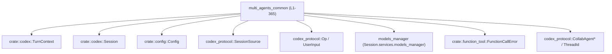
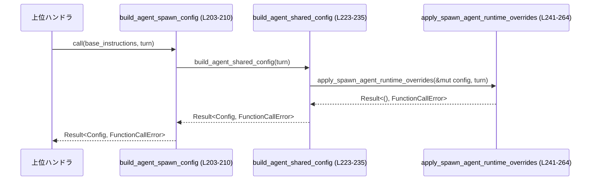
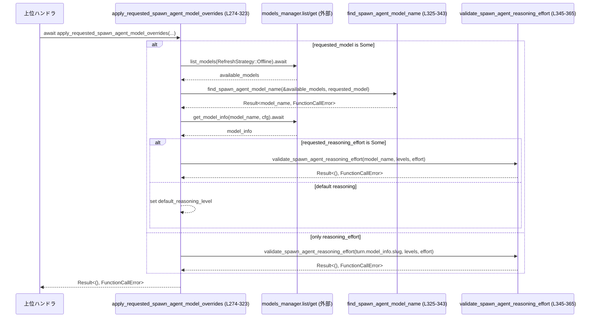

# core/src/tools/handlers/multi_agents_common.rs コード解説

## 0. ざっくり一言

マルチエージェント（collab / spawn_agent）機能向けに、**ツール呼び出しの入出力整形・エラー変換・サブエージェント用 Config 構築・モデル／Reasoning 設定の上書き**を行う共通ユーティリティ群です（`multi_agents_common.rs:L28-365`）。

---

## 1. このモジュールの役割

### 1.1 概要

このモジュールは、マルチエージェント関連ツールのハンドラから共通利用されるヘルパー関数を集約しています。

- ツールペイロードからの引数抽出とツール出力の構築（`function_arguments`, `tool_output_*` 系）（`multi_agents_common.rs:L33-72`）
- コラボレーションエージェント用のステータス整形（`build_wait_agent_statuses`）（`multi_agents_common.rs:L74-109`）
- `CodexErr` をユーザ向けの `FunctionCallError` メッセージへ変換（`collab_*_error`）（`multi_agents_common.rs:L111-134`）
- サブエージェント（spawn / resume）用の `SessionSource` と `Config` スナップショットの構築・上書き（`thread_spawn_source`, `build_agent_*_config`, `apply_spawn_agent_*_overrides`）（`multi_agents_common.rs:L136-271`）
- spawn_agent 用のモデル・Reasoning Effort のバリデーションと上書き（`apply_requested_spawn_agent_model_overrides`, `find_spawn_agent_model_name`, `validate_spawn_agent_reasoning_effort`）（`multi_agents_common.rs:L274-365`）

### 1.2 アーキテクチャ内での位置づけ

このファイルは **状態を持たない純粋なユーティリティ層**として、以下のようなコンポーネントと連携します。

- 上位のツールハンドラ（例: `spawn_agent` / `collab` ツール）から呼び出される（このチャンクには呼び出し元は現れません）
- `TurnContext` / `Session` を受け取り、子エージェントの `Config` や `SessionSource` を構築（`multi_agents_common.rs:L136-160`, `L203-235`）
- モデル管理 (`models_manager`) サービスを通じて利用可能モデルを確認（`multi_agents_common.rs:L285-296`）



### 1.3 設計上のポイント

- **ステートレスなヘルパー群**  
  すべての関数が引数だけに依存し、内部に状態を保持しません（`multi_agents_common.rs:L33-365`）。
- **エラーハンドリングは `Result` + メッセージ変換**  
  - 外部エラー `CodexErr` や設定の不整合を `FunctionCallError::RespondToModel` にマッピングし、モデル応答として返しやすい文字列を一元的に生成します（`multi_agents_common.rs:L111-134`, `L245-261`, `L329-343`, `L345-365`）。
- **Rust の安全性を活かした実装**
  - `serde_json::to_string` / `to_value` の失敗は `unwrap_or_else` で握りつぶさず、メッセージ文字列に変換して返しており、パニックを回避しています（`multi_agents_common.rs:L46-48`, `L69-71`）。
  - 設定の不正値は `set(..).map_err(..)?` パターンで呼び出し元に伝播します（`multi_agents_common.rs:L245-251`, `L255-261`）。
- **非同期処理はモデル上書き部分のみ**
  - `apply_requested_spawn_agent_model_overrides` だけが `async fn` であり、モデル一覧・モデル情報の取得に `.await` を使用します（`multi_agents_common.rs:L274-296`）。
- **機能制限による多段 spawn の抑制**
  - 子エージェントの深さが `agent_max_depth` を超えた場合に、一部 Multi-Agent 機能を無効化するロジックがあります（`multi_agents_common.rs:L267-271`）。

---

## 2. 主要な機能一覧

- spawn/collab ツール用ペイロードの処理
  - `function_arguments`: `ToolPayload` から関数引数 JSON を抽出（`multi_agents_common.rs:L33-40`）
  - `parse_collab_input`: `message` / `items` の排他チェックと `Op` 生成（`multi_agents_common.rs:L162-193`）
- ツール出力の整形
  - `tool_output_json_text`: シリアライズ失敗をエラー文字列に変換した JSON テキストを生成（`multi_agents_common.rs:L42-49`）
  - `tool_output_response_item`: モデルへ返す `ResponseInputItem` を構築（`multi_agents_common.rs:L51-63`）
  - `tool_output_code_mode_result`: コードモード用に `JsonValue` を返却（`multi_agents_common.rs:L65-72`）
- コラボエージェントの状態管理
  - `build_wait_agent_statuses`: 受信側エージェントと補助的なスレッドをマージして状態一覧を生成（`multi_agents_common.rs:L74-109`）
  - 待機タイムアウト定数（`MIN_WAIT_TIMEOUT_MS`, `DEFAULT_WAIT_TIMEOUT_MS`, `MAX_WAIT_TIMEOUT_MS`）（`multi_agents_common.rs:L28-31`）
- エラー変換
  - `collab_spawn_error`: spawn 処理中の `CodexErr` をユーザ向けメッセージに変換（`multi_agents_common.rs:L111-119`）
  - `collab_agent_error`: 個々のエージェント操作時の `CodexErr` を変換（`multi_agents_common.rs:L121-134`）
- サブエージェントの生成/再開
  - `thread_spawn_source`: 子スレッド用 `SessionSource::SubAgent` を構築（`multi_agents_common.rs:L136-160`）
  - `build_agent_spawn_config`: 子エージェント生成用 Config のスナップショットを構築（`multi_agents_common.rs:L196-210`）
  - `build_agent_resume_config`: 子エージェント再開用 Config を構築（`multi_agents_common.rs:L212-221`）
  - `apply_spawn_agent_runtime_overrides`: Turn ごとのランタイム設定（ポリシー・sandbox・cwd）を子 Config に反映（`multi_agents_common.rs:L241-264`）
  - `apply_spawn_agent_overrides`: 深さに応じて Multi-Agent 関連機能を無効化（`multi_agents_common.rs:L267-271`）
- モデル / Reasoning Effort の制御
  - `apply_requested_spawn_agent_model_overrides`: spawn_agent リクエストで指定されたモデル／Reasoning Effort を検証し、Config に反映（`multi_agents_common.rs:L274-323`）
  - `find_spawn_agent_model_name`: 利用可能モデル一覧からリクエストされたモデル名を探す（`multi_agents_common.rs:L325-343`）
  - `validate_spawn_agent_reasoning_effort`: モデルが指定 Reasoning Effort をサポートしているか検証（`multi_agents_common.rs:L345-365`）

---

## 3. 公開 API と詳細解説

### 3.1 型一覧（構造体・列挙体など）

このファイル内で **新たに定義されている構造体・列挙体はありません**（`multi_agents_common.rs:L1-365`）。  
外部の型（`Config`, `TurnContext`, `Session`, `CollabAgentRef` など）は他モジュールで定義されています。

#### 定数

| 名前                      | 種別  | 役割 / 用途                                                                 | 定義位置                          |
|---------------------------|-------|----------------------------------------------------------------------------|-----------------------------------|
| `MIN_WAIT_TIMEOUT_MS`     | 定数  | 待機ポーリングの最小タイムアウト（ms）。CPU を無駄に消費するタイトループ防止。 | `multi_agents_common.rs:L28-29`   |
| `DEFAULT_WAIT_TIMEOUT_MS` | 定数  | 待機ポーリングのデフォルトタイムアウト（ms）。                              | `multi_agents_common.rs:L30`      |
| `MAX_WAIT_TIMEOUT_MS`     | 定数  | 待機ポーリングの最大タイムアウト（ms）。                                   | `multi_agents_common.rs:L31`      |

具体的な使用箇所はこのチャンクには現れません。

### 3.1.1 コンポーネント一覧（関数・定数）

関数と定数のインベントリです。

| 名前                                         | 種別   | 役割 / 用途                                                         | 定義位置                            |
|----------------------------------------------|--------|---------------------------------------------------------------------|-------------------------------------|
| `MIN_WAIT_TIMEOUT_MS`                        | 定数   | ポーリングの最小待機時間（ms）                                      | `multi_agents_common.rs:L28-29`     |
| `DEFAULT_WAIT_TIMEOUT_MS`                    | 定数   | ポーリングのデフォルト待機時間（ms）                                | `multi_agents_common.rs:L30`        |
| `MAX_WAIT_TIMEOUT_MS`                        | 定数   | ポーリングの最大待機時間（ms）                                      | `multi_agents_common.rs:L31`        |
| `function_arguments`                         | 関数   | `ToolPayload` から関数引数文字列を取り出す                          | `multi_agents_common.rs:L33-40`     |
| `tool_output_json_text`                      | 関数   | シリアライズ結果またはエラー文字列を JSON テキストとして返す       | `multi_agents_common.rs:L42-49`     |
| `tool_output_response_item`                  | 関数   | ツールの文字列出力から `ResponseInputItem` を構築する               | `multi_agents_common.rs:L51-63`     |
| `tool_output_code_mode_result`               | 関数   | `JsonValue` としてツール結果を返す                                  | `multi_agents_common.rs:L65-72`     |
| `build_wait_agent_statuses`                  | 関数   | スレッド ID → 状態のマップから `CollabAgentStatusEntry` 配列を構築 | `multi_agents_common.rs:L74-109`    |
| `collab_spawn_error`                         | 関数   | spawn 中の `CodexErr` をユーザ向け `FunctionCallError` へ変換      | `multi_agents_common.rs:L111-119`   |
| `collab_agent_error`                         | 関数   | 個別エージェント操作中の `CodexErr` を変換                          | `multi_agents_common.rs:L121-134`   |
| `thread_spawn_source`                        | 関数   | 子スレッド起源の `SessionSource::SubAgent` を構築                   | `multi_agents_common.rs:L136-160`   |
| `parse_collab_input`                         | 関数   | `message`/`items` の排他チェックと `Op` 生成                        | `multi_agents_common.rs:L162-193`   |
| `build_agent_spawn_config`                   | 関数   | サブエージェント生成用に親の Config からスナップショットを構築     | `multi_agents_common.rs:L196-210`   |
| `build_agent_resume_config`                  | 関数   | サブエージェント再開用 Config を構築し深さに応じた上書きを適用     | `multi_agents_common.rs:L212-221`   |
| `build_agent_shared_config`                  | 関数   | 親の `TurnContext` から共通部分の Config スナップショットを構築    | `multi_agents_common.rs:L223-235`   |
| `apply_spawn_agent_runtime_overrides`        | 関数   | Turn 固有のランタイム設定（ポリシー等）を子 Config に上書きする     | `multi_agents_common.rs:L241-264`   |
| `apply_spawn_agent_overrides`                | 関数   | 深さに応じて Multi-Agent 関連の機能フラグを無効化                  | `multi_agents_common.rs:L267-271`   |
| `apply_requested_spawn_agent_model_overrides`| 関数   | 依頼されたモデル/Reasoning Effort を検証し Config に反映（非同期） | `multi_agents_common.rs:L274-323`   |
| `find_spawn_agent_model_name`                | 関数   | 利用可能モデル一覧から指定モデル名を検索                            | `multi_agents_common.rs:L325-343`   |
| `validate_spawn_agent_reasoning_effort`      | 関数   | モデルが指定 Reasoning Effort をサポートしているか検証              | `multi_agents_common.rs:L345-365`   |

---

### 3.2 関数詳細（主要 7 件）

#### `build_wait_agent_statuses(statuses: &HashMap<ThreadId, AgentStatus>, receiver_agents: &[CollabAgentRef]) -> Vec<CollabAgentStatusEntry>`

**概要**

スレッド ID ごとの `AgentStatus` マップと、受信側エージェント一覧を元に、  
UI などに返すための `CollabAgentStatusEntry` の配列を構築します（`multi_agents_common.rs:L74-109`）。

**引数**

| 引数名           | 型                                      | 説明                                                                 |
|------------------|-----------------------------------------|----------------------------------------------------------------------|
| `statuses`       | `&HashMap<ThreadId, AgentStatus>`      | スレッド ID → 現在のエージェント状態のマップ                        |
| `receiver_agents`| `&[CollabAgentRef]`                    | クライアントが関心を持っているエージェント参照一覧                  |

**戻り値**

- `Vec<CollabAgentStatusEntry>`  
  `receiver_agents` の順に、対応する状態があれば `agent_nickname` / `agent_role` つきで返し、  
  それ以外のスレッドについてはニックネーム・ロールなしで追加します（`multi_agents_common.rs:L82-107`）。

**内部処理の流れ**

1. `statuses` が空なら空ベクタを即返却（`multi_agents_common.rs:L78-80`）。
2. `receiver_agents` をループし、`seen` マップに `thread_id` を記録しつつ、該当する `status` があれば `CollabAgentStatusEntry` を `entries` に push（`multi_agents_common.rs:L82-93`）。
3. `statuses` から `seen` に含まれないスレッドを `extras` として収集し、`thread_id` の文字列表現でソート（`multi_agents_common.rs:L96-106`）。
4. `entries` に `extras` を extend して返却（`multi_agents_common.rs:L107-108`）。

**Examples（使用例）**

```rust
use std::collections::HashMap;
use codex_protocol::{ThreadId, protocol::CollabAgentRef};
use crate::agent::AgentStatus;
use crate::tools::handlers::multi_agents_common::build_wait_agent_statuses;

// （ThreadId や AgentStatus, CollabAgentRef の具体的な生成方法は他モジュールに依存します）

let mut statuses: HashMap<ThreadId, AgentStatus> = HashMap::new(); // スレッドごとの状態マップ
// statuses.insert(thread_id1, AgentStatus::Running);              // 状態を登録するイメージ

let receiver_agents: Vec<CollabAgentRef> = Vec::new();             // 関心を持つエージェント一覧

let entries = build_wait_agent_statuses(&statuses, &receiver_agents);
// entries には receiver_agents と statuses に基づく CollabAgentStatusEntry が入る
```

**Errors / Panics**

- この関数は `Result` を返さず、明示的なエラー型はありません。
- 内部でパニックを起こすような操作（`unwrap` 等）は行っていません（`multi_agents_common.rs:L74-109`）。

**Edge cases（エッジケース）**

- `statuses` が空: 空の `Vec` を返します（`multi_agents_common.rs:L78-80`）。
- `receiver_agents` にないスレッド ID が `statuses` に存在: `extras` としてニックネーム・ロール無しで追加されます（`multi_agents_common.rs:L96-104`）。
- `receiver_agents` に含まれるスレッド ID が `statuses` に存在しない: そのエージェント分のエントリは生成されません（`multi_agents_common.rs:L85-93`）。

**使用上の注意点**

- `receiver_agents` の順序を保った上で、追加のスレッドが末尾にソートされて付く構造になるため、UI 側が順序に依存する場合はこの仕様を前提とする必要があります（`multi_agents_common.rs:L82-108`）。
- `AgentStatus` や `CollabAgentRef` の Clone / Copy コストは型定義に依存し、このチャンクからは分かりません。

---

#### `thread_spawn_source(parent_thread_id: ThreadId, parent_session_source: &SessionSource, depth: i32, agent_role: Option<&str>, task_name: Option<String>) -> Result<SessionSource, FunctionCallError>`

**概要**

親スレッドから spawn されるサブエージェントの `SessionSource::SubAgent` を構築し、  
エージェントパス（`AgentPath`）や深さなどのメタ情報を設定します（`multi_agents_common.rs:L136-160`）。

**引数**

| 引数名                | 型                     | 説明                                                                 |
|-----------------------|------------------------|----------------------------------------------------------------------|
| `parent_thread_id`    | `ThreadId`             | 親エージェントのスレッド ID                                         |
| `parent_session_source` | `&SessionSource`     | 親セッションのソース情報                                            |
| `depth`               | `i32`                  | サブエージェントのネスト深さ                                        |
| `agent_role`          | `Option<&str>`         | 子エージェントのロール名（任意）                                    |
| `task_name`           | `Option<String>`       | エージェントパスに連結するタスク名（任意）                          |

**戻り値**

- `Ok(SessionSource)`  
  `SessionSource::SubAgent(SubAgentSource::ThreadSpawn { ... })` が返ります（`multi_agents_common.rs:L153-159`）。
- `Err(FunctionCallError)`  
  `AgentPath::join` 内部でエラーが発生した場合に `RespondToModel` として返されます（`multi_agents_common.rs:L145-151`）。

**内部処理の流れ**

1. `task_name` が `Some` の場合:
   - `parent_session_source.get_agent_path()` を呼び出し、`None` の場合は `AgentPath::root` を用います（`multi_agents_common.rs:L146-149`）。
   - 得られたパスに `task_name` を `join` し、失敗した場合は `FunctionCallError::RespondToModel` に変換（`multi_agents_common.rs:L149-151`）。
2. `task_name` が `None` の場合:
   - `agent_path` は `None`（`transpose()` により）になります（`multi_agents_common.rs:L143-152`）。
3. 最終的に `SessionSource::SubAgent(SubAgentSource::ThreadSpawn { ... })` を返します（`multi_agents_common.rs:L153-159`）。

**Examples（使用例）**

```rust
use codex_protocol::{ThreadId, protocol::{SessionSource, SubAgentSource}};
use crate::tools::handlers::multi_agents_common::thread_spawn_source;

// parent_source や ThreadId の具体的な構築は他モジュールに依存します
let parent_thread_id: ThreadId = /* ... */;
let parent_source: SessionSource = /* 親セッションのソース */;

let child_source = thread_spawn_source(
    parent_thread_id,           // 親スレッド ID
    &parent_source,             // 親 SessionSource
    1,                          // 子の深さ
    Some("assistant"),          // ロール（任意）
    Some("subtask-1".to_string()) // タスク名（任意）
)?;
```

**Errors / Panics**

- `AgentPath::join` がエラーを返した場合、`FunctionCallError::RespondToModel` にラップされます（`multi_agents_common.rs:L145-151`）。
- パニックを誘発する `unwrap` / `expect` は使用していません。

**Edge cases（エッジケース）**

- `task_name == None` の場合: `agent_path` は `None` のまま `SessionSource` に設定されます（`multi_agents_common.rs:L143-152`）。
- `parent_session_source.get_agent_path()` が `None` を返す場合: `AgentPath::root()` が使用されます（`multi_agents_common.rs:L147-149`）。

**使用上の注意点**

- ここで設定した `depth` と `agent_path` は、子エージェントの識別・表示に利用されるため、呼び出し元で意味のある値を渡す必要があります。
- `FunctionCallError` はそのままツール応答としてモデル側に返される設計と推測されますが、具体的な扱いはこのチャンクには現れません。

---

#### `parse_collab_input(message: Option<String>, items: Option<Vec<UserInput>>) -> Result<Op, FunctionCallError>`

**概要**

コラボエージェントに送る入力として、`message`（単一テキスト）または `items`（複数 `UserInput`）のどちらか一方を受け取り、  
厳密なバリデーションを行った上でプロトコルレベルの `Op` に変換します（`multi_agents_common.rs:L162-193`）。

**引数**

| 引数名   | 型                       | 説明                                                                 |
|----------|--------------------------|----------------------------------------------------------------------|
| `message`| `Option<String>`         | 単一のテキストメッセージ                                            |
| `items`  | `Option<Vec<UserInput>>` | 構造化されたユーザー入力のリスト                                    |

**戻り値**

- `Ok(Op)`  
  `UserInput` の配列を `Op` に変換したもの（`into()` による）です（`multi_agents_common.rs:L179-183`, `L191-192`）。
- `Err(FunctionCallError)`  
  入力の組み合わせ・内容が不正な場合に、具体的なメッセージを含む `RespondToModel` として返されます（`multi_agents_common.rs:L167-172`, `L175-177`, `L186-189`）。

**内部処理の流れ**

1. `(message, items)` の組み合わせに応じて `match`（`multi_agents_common.rs:L166-193`）:
   - 両方 `Some`: エラー `"Provide either message or items, but not both"`（`multi_agents_common.rs:L167-169`）
   - 両方 `None`: エラー `"Provide one of: message or items"`（`multi_agents_common.rs:L170-172`）
   - `Some(message), None`:
     - `message.trim().is_empty()` なら `"Empty message can't be sent to an agent"` でエラー（`multi_agents_common.rs:L173-177`）。
     - それ以外は `UserInput::Text { text: message, text_elements: Vec::new() }` を 1 要素だけ持つベクタにして `Op` に変換（`multi_agents_common.rs:L179-183`）。
   - `None, Some(items)`:
     - `items.is_empty()` なら `"Items can't be empty"` でエラー（`multi_agents_common.rs:L186-189`）。
     - それ以外は `items.into()` により `Op` に変換（`multi_agents_common.rs:L191-192`）。

**Examples（使用例）**

```rust
use codex_protocol::protocol::Op;
use codex_protocol::user_input::UserInput;
use crate::tools::handlers::multi_agents_common::parse_collab_input;

// 単一メッセージでの呼び出し
let op = parse_collab_input(
    Some("Hello, agent!".to_string()), // message
    None,                              // items は指定しない
)?;

// items での呼び出し
let items = vec![
    UserInput::Text {                 // Text 以外のバリアントも定義されている可能性があります
        text: "Task 1".to_string(),
        text_elements: Vec::new(),
    }
];
let op2 = parse_collab_input(None, Some(items))?;
```

**Errors / Panics**

- エラー条件はすべて `FunctionCallError::RespondToModel` で返されます（`multi_agents_common.rs:L167-172`, `L175-177`, `L186-189`）。
- パニックを起こすような操作はありません。

**Edge cases（エッジケース）**

- `message` と `items` の両方を指定: エラー（`multi_agents_common.rs:L167-169`）。
- 両方 `None`: エラー（`multi_agents_common.rs:L170-172`）。
- `message` が空文字または空白だけ: エラー（`multi_agents_common.rs:L173-177`）。
- `items` が空ベクタ: エラー（`multi_agents_common.rs:L186-189`）。

**使用上の注意点**

- 入力の**排他性**が強制されるため、呼び出し側は必ずどちらか片方だけを指定する必要があります。
- エラーメッセージはユーザにそのまま見える設計が想定されるため、上位で改変せずに返す場合は文言変更の影響に注意が必要です。

---

#### `build_agent_spawn_config(base_instructions: &BaseInstructions, turn: &TurnContext) -> Result<Config, FunctionCallError>`

**概要**

サブエージェントを新規に spawn する際に、親の `TurnContext` から **最新の実行時設定を反映した Config スナップショット**を構築し、  
さらに `base_instructions` のテキストを `Config.base_instructions` に設定して返します（`multi_agents_common.rs:L196-210`）。

**引数**

| 引数名            | 型                    | 説明                                              |
|-------------------|-----------------------|---------------------------------------------------|
| `base_instructions` | `&BaseInstructions` | 子エージェントのベースプロンプトテキストを含む構造体 |
| `turn`            | `&TurnContext`        | 現在のターンのコンテキスト（モデル選択やランタイム設定を含む） |

**戻り値**

- `Ok(Config)`  
  親の Config をベースに、モデルやランタイム設定を最新の `TurnContext` で上書きし、`base_instructions` を設定した Config（`multi_agents_common.rs:L207-209`）。
- `Err(FunctionCallError)`  
  内部で呼び出す `build_agent_shared_config` / `apply_spawn_agent_runtime_overrides` のエラーをそのまま返します（`multi_agents_common.rs:L207`, `L223-233`, `L245-261`）。

**内部処理の流れ**

1. `build_agent_shared_config(turn)` を呼び出して共通設定を構築（`multi_agents_common.rs:L207`, `L223-235`）。
2. 返ってきた `config` に対して `config.base_instructions = Some(base_instructions.text.clone())` を設定（`multi_agents_common.rs:L208`）。
3. その `config` を `Ok` で返します（`multi_agents_common.rs:L209`）。

**Examples（使用例）**

```rust
use crate::codex::TurnContext;
use crate::config::Config;
use codex_protocol::models::BaseInstructions;
use crate::tools::handlers::multi_agents_common::build_agent_spawn_config;

// turn や base_instructions の構築は他モジュールに依存します
let turn: &TurnContext = /* ... */;
let base_instructions = BaseInstructions { text: "You are a helper.".to_string(), /* 他フィールド */ };

let child_config: Config = build_agent_spawn_config(&base_instructions, turn)?;
// child_config は turn 由来の最新モデル設定やランタイム設定を含み、
// base_instructions.text が Config.base_instructions に入る
```

**Errors / Panics**

- 内部の `apply_spawn_agent_runtime_overrides` が Config のポリシー設定に失敗した場合、  
  `"approval_policy is invalid: ..."`, `"sandbox_policy is invalid: ..."` といったメッセージでエラーが返されます（`multi_agents_common.rs:L245-251`, `L255-261`）。
- パニックを誘発する操作はありません。

**Edge cases（エッジケース）**

- `base_instructions.text` が空文字でも、そのまま `Some("")` として設定されます（空を禁止するロジックはありません）。
- 親の `turn.config` の内容が不正で、`approval_policy` や `sandbox_policy` の `set` に失敗するとエラーになります（`multi_agents_common.rs:L245-261`）。

**使用上の注意点**

- 子エージェントを spawn する場合は、**古い Config を直接 clone するのではなく**、この関数を通すことで Turn 時点の最新設定が反映されます（関数コメントでも注意喚起されています。`multi_agents_common.rs:L196-202`）。
- エラーは `FunctionCallError` として返るため、呼び出し側は `?` で伝播させるか、ユーザ向けに適切にハンドリングする必要があります。

---

#### `build_agent_resume_config(turn: &TurnContext, child_depth: i32) -> Result<Config, FunctionCallError>`

**概要**

既存の子エージェントを **再開（resume）** する際に、親ターンの状態から子の Config を再構築し、  
深さに応じた機能制限を適用した上で返します（`multi_agents_common.rs:L212-221`）。

**引数**

| 引数名       | 型             | 説明                                  |
|--------------|----------------|---------------------------------------|
| `turn`       | `&TurnContext` | 親ターンのコンテキスト               |
| `child_depth`| `i32`          | 子エージェントの深さ（ネストレベル） |

**戻り値**

- `Ok(Config)`  
  `build_agent_shared_config` をベースに、`apply_spawn_agent_overrides` を適用し、`base_instructions = None` にした Config（`multi_agents_common.rs:L216-220`）。
- `Err(FunctionCallError)`  
  `build_agent_shared_config` / `apply_spawn_agent_runtime_overrides` のエラーをそのまま返します。

**内部処理の流れ**

1. `build_agent_shared_config(turn)` を呼び出して基礎 Config を生成（`multi_agents_common.rs:L216`, `L223-235`）。
2. `apply_spawn_agent_overrides(&mut config, child_depth)` で深さに応じた機能制限を適用（`multi_agents_common.rs:L217`, `L267-271`）。
3. `config.base_instructions = None` として、ベース命令文をセッション側のメタデータに委ねる形にする（`multi_agents_common.rs:L219`）。
4. `config` を返却（`multi_agents_common.rs:L220`）。

**Examples（使用例）**

```rust
use crate::codex::TurnContext;
use crate::config::Config;
use crate::tools::handlers::multi_agents_common::build_agent_resume_config;

let turn: &TurnContext = /* ... */;
let depth: i32 = 3; // 例: 3 階層目の子

let child_config: Config = build_agent_resume_config(turn, depth)?;
// child_config は depth に応じて SpawnCsv / Collab 機能が無効化されている可能性がある
```

**Errors / Panics**

- `build_agent_shared_config` / `apply_spawn_agent_runtime_overrides` のエラー条件は `build_agent_spawn_config` と同様です（`multi_agents_common.rs:L223-235`, `L245-261`）。
- `apply_spawn_agent_overrides` は `Result` を返さず、内部の `disable` の戻り値も無視しています（`multi_agents_common.rs:L269-270`）。

**Edge cases（エッジケース）**

- `child_depth >= config.agent_max_depth` かつ `Feature::MultiAgentV2` が無効の場合、`Feature::SpawnCsv` と `Feature::Collab` が無効化されます（`multi_agents_common.rs:L267-271`）。
- それ以外のケースでは Config の機能フラグは変更されません。

**使用上の注意点**

- 多段の spawn/resume によるエージェント爆発を抑制するためのロジックを含むため、`agent_max_depth` の設定値と `MultiAgentV2` フラグの組み合わせが重要です。
- `base_instructions` は明示的に `None` にされるため、再開時のプロンプトはセッション側のメタデータから供給される前提になっています（`multi_agents_common.rs:L219`）。

---

#### `apply_spawn_agent_runtime_overrides(config: &mut Config, turn: &TurnContext) -> Result<(), FunctionCallError>`

**概要**

親ターンの **ランタイム専用状態（approval policy, sandbox, cwd など）** を子エージェントの `Config` にコピーします（`multi_agents_common.rs:L241-264`）。  
これにより、子エージェントが親と同一の権限・sandbox 方針で動作することが保証されます。

**引数**

| 引数名 | 型              | 説明                                   |
|--------|-----------------|----------------------------------------|
| `config` | `&mut Config` | 上書き対象となる子エージェント用 Config |
| `turn` | `&TurnContext`  | ランタイム設定を持つ親ターンのコンテキスト |

**戻り値**

- `Ok(())`  
  すべての設定を正常に反映できた場合（`multi_agents_common.rs:L262-264`）。
- `Err(FunctionCallError)`  
  approval / sandbox ポリシーの `set` が失敗した場合にエラーを返します（`multi_agents_common.rs:L245-251`, `L255-261`）。

**内部処理の流れ**

1. `approval_policy.set(turn.approval_policy.value())` を実行し、エラーを `FunctionCallError::RespondToModel("approval_policy is invalid: {err}")` に変換（`multi_agents_common.rs:L245-251`）。
2. `shell_environment_policy`, `codex_linux_sandbox_exe`, `cwd` を `turn` から Clone して代入（`multi_agents_common.rs:L252-254`）。
3. `sandbox_policy.set(turn.sandbox_policy.get().clone())` を実行し、エラーを `"sandbox_policy is invalid: {err}"` で返す（`multi_agents_common.rs:L255-261`）。
4. `file_system_sandbox_policy`, `network_sandbox_policy` を `turn` からコピー（`multi_agents_common.rs:L262-263`）。

**Examples（使用例）**

```rust
use crate::codex::TurnContext;
use crate::config::Config;
use crate::tools::handlers::multi_agents_common::apply_spawn_agent_runtime_overrides;

let mut child_config: Config = /* 親 Config の clone など */;
let turn: &TurnContext = /* 現在のターン */;

apply_spawn_agent_runtime_overrides(&mut child_config, turn)?;
// child_config.permissions などに turn に基づくランタイム設定が反映される
```

**Errors / Panics**

- `approval_policy.set(...)` または `sandbox_policy.set(...)` がエラーを返した場合に `FunctionCallError::RespondToModel` で返却されます（`multi_agents_common.rs:L245-251`, `L255-261`）。
- それ以外の操作は全て `clone` / 代入であり、パニック要因はこのチャンクからは見られません。

**Edge cases（エッジケース）**

- `turn.approval_policy.value()` や `turn.sandbox_policy.get()` が不正な値を持っている場合、`set` がエラーとなり子 Config に値が反映されません。
- `turn.codex_linux_sandbox_exe` や `turn.cwd` が `None` である場合の扱いは、このチャンクでは分かりません（型定義が別ファイルのため）。

**使用上の注意点**

- approval / sandbox policy の `set` が失敗すると、子エージェントの生成自体がエラーとして扱われるため、上位層でこれらのポリシー設定を検証しておくことが重要です。
- ネットワーク・ファイルシステムの sandbox ポリシーもコピーされるため、子エージェントに異なる権限を与えたい場合は別途ロジックを追加する必要があります（現状は完全コピーです）。

---

#### `apply_requested_spawn_agent_model_overrides(session: &Session, turn: &TurnContext, config: &mut Config, requested_model: Option<&str>, requested_reasoning_effort: Option<ReasoningEffort>) -> Result<(), FunctionCallError>`

**概要**

spawn_agent ツールからのリクエストで指定された **モデル名** と **Reasoning Effort** を検証し、  
子エージェント Config に適用します（`multi_agents_common.rs:L274-323`）。  
非同期関数であり、モデル一覧とモデル情報の取得に `.await` を用います。

**引数**

| 引数名                    | 型                         | 説明                                                                 |
|---------------------------|----------------------------|----------------------------------------------------------------------|
| `session`                 | `&Session`                | モデル管理サービスへのアクセスを提供するセッション                 |
| `turn`                    | `&TurnContext`            | 現在のターン情報（モデル slug や対応 Reasoning レベルを含む）     |
| `config`                  | `&mut Config`             | 上書き対象の子エージェント Config                                   |
| `requested_model`         | `Option<&str>`            | spawn_agent リクエストで指定されたモデル名（任意）                  |
| `requested_reasoning_effort` | `Option<ReasoningEffort>` | spawn_agent リクエストで指定された Reasoning Effort（任意）         |

**戻り値**

- `Ok(())`  
  - 何も指定されていない場合（両方 `None`）（`multi_agents_common.rs:L281-283`）。
  - 指定されたモデル／Reasoning が検証を通過し、`config` に反映された場合。
- `Err(FunctionCallError)`  
  - 指定モデルが未定義（`find_spawn_agent_model_name` のエラー）（`multi_agents_common.rs:L291-292`, `L325-343`）。
  - 指定 Reasoning Effort がモデルでサポートされていない（`validate_spawn_agent_reasoning_effort` のエラー）（`multi_agents_common.rs:L300-304`, `L313-319`, `L345-365`）。

**内部処理の流れ**

1. モデルも Reasoning Effort も指定されていない場合は何もせず `Ok(())`（`multi_agents_common.rs:L281-283`）。
2. `requested_model` が `Some` の場合（`multi_agents_common.rs:L285-311`）:
   - `models_manager.list_models(RefreshStrategy::Offline).await` でモデル一覧を取得（`multi_agents_common.rs:L285-290`）。
   - `find_spawn_agent_model_name` で `requested_model` を検証し、正式なモデル名を決定（`multi_agents_common.rs:L291-292`）。
   - `get_model_info` でモデル情報を取得（`multi_agents_common.rs:L293-296`）。
   - `config.model = Some(selected_model_name.clone())` を設定（`multi_agents_common.rs:L298`）。
   - `requested_reasoning_effort` が `Some` の場合:
     - `validate_spawn_agent_reasoning_effort` でサポート確認（`multi_agents_common.rs:L300-304`）。
     - 合格すれば `config.model_reasoning_effort = Some(reasoning_effort)`（`multi_agents_common.rs:L305`）。
   - `requested_reasoning_effort` が `None` の場合:
     - `selected_model_info.default_reasoning_level` をそのまま使用（`multi_agents_common.rs:L307-308`）。
3. `requested_model` が `None` で `requested_reasoning_effort` のみ指定された場合（`multi_agents_common.rs:L313-320`）:
   - 現在の `turn.model_info` のサポートレベルを元に `validate_spawn_agent_reasoning_effort` を呼び出し（`multi_agents_common.rs:L314-318`）。
   - 合格すれば `config.model_reasoning_effort = Some(reasoning_effort)`（`multi_agents_common.rs:L319`）。

**Examples（使用例）**

```rust
use crate::codex::{Session, TurnContext};
use crate::config::Config;
use codex_protocol::openai_models::ReasoningEffort;
use crate::tools::handlers::multi_agents_common::apply_requested_spawn_agent_model_overrides;

async fn setup_child_config(
    session: &Session,
    turn: &TurnContext,
    mut config: Config,
) -> Result<Config, FunctionCallError> {
    // モデルを "gpt-4.1" に固定し、Reasoning はデフォルトに任せる例
    apply_requested_spawn_agent_model_overrides(
        session,
        turn,
        &mut config,
        Some("gpt-4.1"),
        None,
    ).await?;

    Ok(config)
}
```

**Errors / Panics**

- モデル名が一覧に存在しない場合:  
  `"Unknown model`{requested_model}`for spawn_agent. Available models: ..."` というエラーになります（`multi_agents_common.rs:L329-341`）。
- Reasoning Effort がサポートされていない場合:  
  `"Reasoning effort`{requested_reasoning_effort}` is not supported for model `{model}`. ..."` というエラーになります（`multi_agents_common.rs:L345-365`）。
- パニックを起こす操作は使用していません。

**Edge cases（エッジケース）**

- 両方 `None`: 何も変更せず成功（`multi_agents_common.rs:L281-283`）。
- `requested_model` は指定されるが `requested_reasoning_effort` が `None`: モデル固有のデフォルト Reasoning を採用（`multi_agents_common.rs:L307-308`）。
- `requested_model` が `None` で `requested_reasoning_effort` のみ指定: 現在のモデル (`turn.model_info`) に対して検証されます（`multi_agents_common.rs:L313-320`）。

**使用上の注意点**

- 非同期関数であるため、**必ず `.await`** が必要です（`multi_agents_common.rs:L274`）。
- モデル名や Reasoning Effort はユーザ入力由来になることが多く、エラー時メッセージには利用可能なモデル一覧／サポート Reasoning 一覧が含まれるため、ユーザには比較的分かりやすいフィードバックになります（`multi_agents_common.rs:L329-341`, `L357-363`）。

---

### 3.3 その他の関数

補助的または単純なラッパー関数の一覧です。

| 関数名                            | 役割（1 行）                                                                                     | 定義位置                          |
|-----------------------------------|--------------------------------------------------------------------------------------------------|-----------------------------------|
| `function_arguments`              | `ToolPayload::Function` から `arguments` を取り出し、それ以外のペイロードはエラーとする         | `multi_agents_common.rs:L33-40`   |
| `tool_output_json_text`           | 任意のシリアライズ可能な値を JSON 文字列に変換し、失敗時はエラー文字列を JSON として返す       | `multi_agents_common.rs:L42-49`   |
| `tool_output_response_item`       | 文字列化したツール出力を `FunctionToolOutput` 経由で `ResponseInputItem` に変換する             | `multi_agents_common.rs:L51-63`   |
| `tool_output_code_mode_result`    | 任意の値を `JsonValue` に変換し、失敗時はエラー文字列を `JsonValue::String` として返す         | `multi_agents_common.rs:L65-72`   |
| `collab_spawn_error`              | spawn 操作に関する `CodexErr` を、状況に応じて簡略化したメッセージに変換する                    | `multi_agents_common.rs:L111-119` |
| `collab_agent_error`              | 個別エージェント操作の `CodexErr` を、スレッド ID 付きの分かりやすいメッセージに変換する       | `multi_agents_common.rs:L121-134` |
| `build_agent_shared_config`       | 親の `TurnContext` から共通の Config スナップショットを構築し、`apply_spawn_agent_runtime_overrides` を適用する | `multi_agents_common.rs:L223-235` |
| `apply_spawn_agent_overrides`     | 子の深さと Feature フラグに応じて `SpawnCsv` / `Collab` 機能を無効化する                         | `multi_agents_common.rs:L267-271` |
| `find_spawn_agent_model_name`     | モデル一覧からリクエストされたモデル名を検索し、一致するモデル名を返す                         | `multi_agents_common.rs:L325-343` |
| `validate_spawn_agent_reasoning_effort` | モデルが指定 Reasoning Effort をサポートしているか判定し、サポート外の場合エラーを返す | `multi_agents_common.rs:L345-365` |

---

## 4. データフロー

ここでは、**サブエージェントを spawn する際の典型的なフロー**と、  
**モデル／Reasoning Effort 上書きフロー**を示します（すべてこのファイル内の呼び出し関係です）。

### 4.1 Config 構築フロー



- `build_agent_spawn_config` は、`build_agent_shared_config` を通じて Turn 時点の最新設定を取り込み、さらに `base_instructions` を設定して返します（`multi_agents_common.rs:L203-210`, `L223-235`）。
- `build_agent_resume_config` も同じく `build_agent_shared_config` を利用し、その後 `apply_spawn_agent_overrides` で機能制限を行います（`multi_agents_common.rs:L212-221`, `L267-271`）。

### 4.2 モデル／Reasoning Effort 上書きフロー



- モデル名と Reasoning Effort の両方が指定されている場合は、まずモデルの存在チェック、その後 Reasoning Effort のサポートチェックを行います（`multi_agents_common.rs:L285-305`）。
- モデル指定がなく Reasoning Effort だけ指定された場合は、現在のモデル (`turn.model_info`) に対して検証が行われます（`multi_agents_common.rs:L313-320`）。

---

## 5. 使い方（How to Use）

### 5.1 基本的な使用方法

ここでは、**子エージェントを spawn してメッセージを送る**という想定で、  
本モジュールの関数を組み合わせる流れの一例を示します。

```rust
use crate::codex::{Session, TurnContext};
use crate::config::Config;
use crate::tools::handlers::multi_agents_common::{
    build_agent_spawn_config,
    apply_requested_spawn_agent_model_overrides,
    thread_spawn_source,
    parse_collab_input,
};
use codex_protocol::{ThreadId, protocol::SessionSource};
use codex_protocol::models::BaseInstructions;
use codex_protocol::user_input::UserInput;
use codex_protocol::protocol::Op;

// 省略: session, parent_turn, parent_thread_id, parent_source の取得
async fn spawn_child_example(
    session: &Session,              // 親セッション
    parent_turn: &TurnContext,      // 親ターン
    parent_thread_id: ThreadId,     // 親スレッド ID
    parent_source: &SessionSource,  // 親 SessionSource
) -> Result<(Config, SessionSource, Op), FunctionCallError> {
    // 1. 子エージェント用のベース命令文を用意する
    let base_instructions = BaseInstructions {
        text: "You are a sub-agent.".to_string(), // 子エージェントの役割
        // 他フィールドは省略
    };

    // 2. spawn 用の Config スナップショットを構築する（L203-210）
    let mut child_config = build_agent_spawn_config(&base_instructions, parent_turn)?;

    // 3. ユーザ指定のモデル／Reasoning があれば反映する（L274-323）
    apply_requested_spawn_agent_model_overrides(
        session,
        parent_turn,
        &mut child_config,
        Some("gpt-4.1-mini"),      // 例: モデルを指定
        None,                      // Reasoning Effort はデフォルトに任せる
    ).await?;

    // 4. 子スレッドの SessionSource を構築する（L136-160）
    let child_source = thread_spawn_source(
        parent_thread_id,
        parent_source,
        /* depth */ 1,
        Some("assistant"),         // ロール名（任意）
        Some("subtask-1".to_string()),
    )?;

    // 5. 子エージェントに送る入力 Op を構築する（L162-193）
    let op = parse_collab_input(
        Some("Hello from parent".to_string()), // 単一メッセージ
        None,
    )?;

    Ok((child_config, child_source, op))
}
```

### 5.2 よくある使用パターン

1. **モデルだけを指定し Reasoning Effort はデフォルトに任せる**

```rust
apply_requested_spawn_agent_model_overrides(
    session,
    turn,
    &mut config,
    Some("gpt-4.1"), // モデル名だけ指定
    None,            // Reasoning Effort は未指定
).await?;           // モデル側の default_reasoning_level が設定される（L307-308）
```

1. **現在のモデルのまま Reasoning Effort だけを強化する**

```rust
use codex_protocol::openai_models::ReasoningEffort;

apply_requested_spawn_agent_model_overrides(
    session,
    turn,
    &mut config,
    None,                                 // モデルは変更しない
    Some(ReasoningEffort::High),         // Reasoning Effort を指定
).await?;                                // turn.model_info に対して検証される（L313-320）
```

1. **構造化 `items` でコラボ入力を送る**

```rust
let items = vec![
    UserInput::Text {
        text: "Step 1: ...".to_string(),
        text_elements: Vec::new(),
    },
    // 他の UserInput バリアントも組み合わせ可能
];
let op = parse_collab_input(None, Some(items))?; // message と items を同時に渡さないことが重要（L166-193）
```

### 5.3 よくある間違い

**誤り例 1: `message` と `items` を同時に渡す**

```rust
// 間違い例: 両方 Some で渡しているためエラーになる（L167-169）
let op = parse_collab_input(
    Some("Hello".to_string()),
    Some(vec![UserInput::Text { text: "Hi".to_string(), text_elements: Vec::new() }]),
)?; // -> "Provide either message or items, but not both"
```

**正しい例**

```rust
// 正しい例: message のみ
let op = parse_collab_input(
    Some("Hello".to_string()),
    None,
)?;
```

---

**誤り例 2: `build_agent_spawn_config` の `Result` を無視する**

```rust
// 間違い例: エラーを無視している
let config = build_agent_spawn_config(&base_instructions, turn).unwrap(); 
// approval_policy / sandbox_policy の set が失敗するとパニックになる可能性がある
```

**正しい例**

```rust
// 正しい例: ? でエラーを伝播させる
let config = build_agent_spawn_config(&base_instructions, turn)?; // L203-210
```

---

**誤り例 3: 非同期関数を await せずに使う**

```rust
// 間違い例: async コンテキスト外や .await 抜きで呼び出そうとする
let result = apply_requested_spawn_agent_model_overrides(
    session,
    turn,
    &mut config,
    Some("gpt-4.1"),
    None,
); // コンパイルエラー: Future を await していない
```

**正しい例**

```rust
// 正しい例: async fn 内部で await する
apply_requested_spawn_agent_model_overrides(
    session,
    turn,
    &mut config,
    Some("gpt-4.1"),
    None,
).await?;
```

### 5.4 使用上の注意点（まとめ）

- **入力バリデーション**
  - `parse_collab_input` は `message`/`items` の排他性と非空を強制します（`multi_agents_common.rs:L166-193`）。
- **エラーメッセージのユーザ露出**
  - 多くのエラーが `FunctionCallError::RespondToModel` として文字列で返されるため、上位層がそのままユーザに表示する設計が想定されます（`multi_agents_common.rs:L37-38`, `L111-134`, `L245-261`, `L329-343`, `L345-365`）。
- **非同期処理**
  - `apply_requested_spawn_agent_model_overrides` は `async` であり、非同期ランタイム（Tokio など）の中で `.await` する必要があります（`multi_agents_common.rs:L274`）。
- **コンフィグのコピーコスト**
  - `build_agent_shared_config` は `turn.config.clone()` とその中身の `clone` を行います（`multi_agents_common.rs:L224-225`）。Config が大きい場合はコストに注意が必要ですが、具体的なサイズはこのチャンクからは分かりません。
- **セキュリティ / sandbox**
  - `apply_spawn_agent_runtime_overrides` により、子エージェントの approval policy や sandbox policy は親ターンと同一になります（`multi_agents_common.rs:L245-263`）。  
    これにより、子エージェントが親より強い権限を持つことは基本的に防がれます。
- **テストコード**
  - このファイル内にはテスト関数や `#[cfg(test)]` モジュールは存在しません（`multi_agents_common.rs:L1-365`）。テストは別ファイルにあるか、このチャンクには現れません。

---

## 6. 変更の仕方（How to Modify）

### 6.1 新しい機能を追加する場合

- **新たなランタイム設定を子エージェントに伝播させたい場合**
  - 既存コードでは `apply_spawn_agent_runtime_overrides` 内で `TurnContext` → `Config` へのコピーを行っています（`multi_agents_common.rs:L245-263`）。
  - 同様の設定項目を追加したい場合は、この関数にフィールドコピーを追加するのが自然です（※パターンからの推測であり、設計方針として明示されているわけではありません）。

- **spawn_agent のモデル選択ロジックを拡張したい場合**
  - モデル名の解決は `find_spawn_agent_model_name`（`multi_agents_common.rs:L325-343`）、
  - Reasoning Effort の検証は `validate_spawn_agent_reasoning_effort`（`multi_agents_common.rs:L345-365`）に集約されています。  
  ここにロジックを追加することで影響範囲を局所化できます。

### 6.2 既存の機能を変更する場合

- **`parse_collab_input` の仕様変更**
  - 現在は「`message` と `items` は排他的」「空文字・空ベクタ禁止」といった契約があります（`multi_agents_common.rs:L166-193`）。
  - これを変更する場合は、上位のツールハンドラや UI がこの仕様を前提にしていないかを確認する必要があります。

- **深さによる機能制限のロジック変更**
  - 深さ判定と Feature 無効化は `apply_spawn_agent_overrides` にまとまっています（`multi_agents_common.rs:L267-271`）。
  - `agent_max_depth` / `Feature::MultiAgentV2` / `Feature::SpawnCsv` / `Feature::Collab` の関係が他の場所でも参照されている可能性があるため、呼び出し元も含めた影響調査が必要です。

- **エラーメッセージの変更**
  - `FunctionCallError::RespondToModel` に渡している文字列は、ユーザにそのまま見えることが多いと考えられます。  
    文言変更は UX やサポート文書への影響を伴う可能性があるため、慎重に行う必要があります。

---

## 7. 関連ファイル

このモジュールと密接に関係する型・モジュールです（パスは `use` 句に基づき、実ファイルパスはこのチャンクからは分かりません）。

| パス / モジュール                           | 役割 / 関係                                                                 |
|---------------------------------------------|------------------------------------------------------------------------------|
| `crate::agent::AgentStatus`                 | エージェントの状態を表す型。`build_wait_agent_statuses` で使用（`L74-109`）。 |
| `crate::codex::Session`                     | モデル管理サービス等を含むセッション。モデル一覧・情報取得に使用（`L274-296`）。 |
| `crate::codex::TurnContext`                 | 現在のターンのコンテキスト。Config コピー元やモデル情報の参照に使用（`L203-235`, `L241-264`）。 |
| `crate::config::Config`                     | エージェントの設定。子エージェント用 Config の構築・上書き対象（`L203-221`, `L223-271`）。 |
| `crate::function_tool::FunctionCallError`   | ツールハンドラレベルのエラー型。ユーザ向けメッセージを含む（`L33-40`, `L111-134` 他）。 |
| `crate::tools::context::{FunctionToolOutput, ToolPayload}` | ツール入出力のコンテキスト。引数抽出やレスポンス構築で使用（`L33-40`, `L51-63`）。`ToolOutput` はこのチャンクでは未使用。 |
| `codex_protocol::protocol::{Op, SessionSource, SubAgentSource, CollabAgentRef, CollabAgentStatusEntry}` | プロトコルレベルの操作・セッションソース・コラボエージェント情報（`L74-109`, `L136-160`, `L162-193`）。 |
| `codex_protocol::user_input::UserInput`     | ユーザー入力の表現。`parse_collab_input` で `Op` に変換（`L162-193`）。 |
| `codex_protocol::openai_models::{ReasoningEffort, ReasoningEffortPreset, ModelPreset}` | Reasoning Effort とモデルプリセット。モデル検証に使用（`L274-323`, `L325-365`）。 |
| `codex_protocol::error::CodexErr`           | 下位レイヤのエラー型。`collab_spawn_error`, `collab_agent_error` で変換（`L111-134`）。 |

このチャンクには、これらの型の定義やテストコードは含まれていません。
