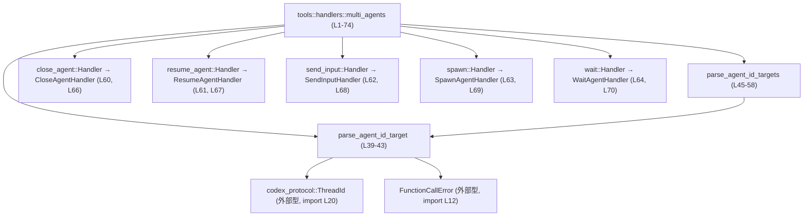

# core/src/tools/handlers/multi_agents.rs コード解説

---

## 0. ざっくり一言

複数の「コラボレーション用サブエージェント」を扱うツールハンドラ群の入口となるモジュールであり、  
サブエージェント ID のパース用ユーティリティと、各種ハンドラ（spawn / resume / send_input / close / wait）を再エクスポートしています。  
（`//!` ドキュメントコメントと再エクスポート定義より）`multi_agents.rs:L1-6, L60-64`

---

## 1. このモジュールの役割

### 1.1 概要

- このモジュールは **「コラボレーションツールからの呼び出しを、サブエージェントの生成・操作に結びつける」** ために存在します。`multi_agents.rs:L1-6`
- 実際の spawn / resume / send_input / close / wait などの処理はサブモジュールにあり、その `Handler` 型を `pub(crate)` で再エクスポートしています。`multi_agents.rs:L60-64, L66-70`
- さらに、サブエージェントを識別する ID（`ThreadId`）を安全にパースするユーティリティ関数を提供し、ハンドラ実装から共有して使えるようにしています。`multi_agents.rs:L20, L39-58`

### 1.2 アーキテクチャ内での位置づけ

このモジュール周辺の依存関係を簡略化して示します（このチャンクで確認できる範囲のみ）。



- `parse_agent_id_target` / `parse_agent_id_targets` は、このモジュール内に定義されたヘルパーで、`ThreadId` と `FunctionCallError` に依存します。`multi_agents.rs:L12, L20, L39-58`
- `CloseAgentHandler` などの各ハンドラ型は、対応するサブモジュールに定義された `Handler` 型の別名として再エクスポートされています。`multi_agents.rs:L60-64, L66-70`
- `AgentStatus`, `Session`, `TurnContext`, `ToolInvocation` など多数の型が `use` されていますが、このチャンク内のコードでは直接は利用されておらず、サブモジュール側で利用されていると考えられます。ただし、このファイルだけからは実際の使用箇所は確認できません。`multi_agents.rs:L8-19, L21-37`

### 1.3 設計上のポイント（このチャンクから読み取れる範囲）

- **責務の分割**
  - このファイルは「ハンドラ群の集約」と「サブエージェント ID パースユーティリティ」に役割を限定しており、実際の業務ロジックは各サブモジュールに委譲しています。`multi_agents.rs:L39-58, L60-70`
- **状態を持たない**
  - グローバル変数や構造体フィールドなどの状態は定義されておらず、提供されている関数は純粋に入力を出力へ変換するだけです。`multi_agents.rs:L39-58`
- **エラーハンドリング**
  - サブエージェント ID パースの失敗を `FunctionCallError::RespondToModel` で表現し、モデルへのレスポンスとして扱える形のエラーに変換しています。`multi_agents.rs:L12, L40-42, L48-51`
- **公開範囲**
  - すべて `pub(crate)` で公開されており、クレート内からのみ利用される内部 API として設計されています。`multi_agents.rs:L39, L45, L60-64, L66, L70`

---

## 2. 主要な機能一覧（コンポーネントインベントリー）

### 2.1 内部定義コンポーネント

| 名前 | 種別 | 役割 / 用途 | 定義位置 |
|------|------|-------------|----------|
| `parse_agent_id_target` | 関数 | `&str` で渡されたエージェント ID を `ThreadId` に変換し、失敗時は `FunctionCallError` でラップするユーティリティ | `multi_agents.rs:L39-43` |
| `parse_agent_id_targets` | 関数 | `Vec<String>` の ID 群をまとめて `Vec<ThreadId>` に変換し、空ベクタや不正な ID に対してエラーを返すユーティリティ | `multi_agents.rs:L45-58` |
| `CloseAgentHandler` | 型エイリアス（`close_agent::Handler`） | `close_agent` サブモジュールが提供する `Handler` 型の別名。本チャンクから具体的な構造やトレイト実装は不明 | `multi_agents.rs:L60, L66` |
| `ResumeAgentHandler` | 型エイリアス（`resume_agent::Handler`） | `resume_agent` サブモジュール由来の `Handler` 型別名。詳細はこのチャンクには現れません | `multi_agents.rs:L61, L67` |
| `SendInputHandler` | 型エイリアス（`send_input::Handler`） | `send_input` サブモジュール由来の `Handler` 型別名 | `multi_agents.rs:L62, L68` |
| `SpawnAgentHandler` | 型エイリアス（`spawn::Handler`） | `spawn` サブモジュール由来の `Handler` 型別名 | `multi_agents.rs:L63, L69` |
| `WaitAgentHandler` | 型エイリアス（`wait::Handler`） | `wait` サブモジュール由来の `Handler` 型別名 | `multi_agents.rs:L64, L70` |
| `close_agent` | サブモジュール | サブエージェントの終了処理に関するロジックを含むと推測されるが、このチャンクには実装が現れません | `multi_agents.rs:L66` |
| `resume_agent` | サブモジュール | サブエージェントの再開処理に関するロジックを含むと推測されるモジュール（非公開） | `multi_agents.rs:L67` |
| `send_input` | サブモジュール | サブエージェントへの入力送信処理を含むと推測されるモジュール（非公開） | `multi_agents.rs:L68` |
| `spawn` | サブモジュール | サブエージェント生成処理を含むと推測されるモジュール（非公開） | `multi_agents.rs:L69` |
| `wait` | サブモジュール | サブエージェントの待機状態管理に関する処理を含むと推測されるモジュール | `multi_agents.rs:L70` |
| `tests` | テストモジュール | `multi_agents_tests.rs` にあるテストコードをこのモジュール配下で有効化する | `multi_agents.rs:L72-74` |

※ サブモジュールや `Handler` 型の実装内容はこのチャンクには現れないため、用途は名前と import からの推測に留まります。

### 2.2 外部依存コンポーネント（import）

主なもののみ列挙します。

| 名前 | 種別 | このファイルでの役割 | 参照位置 |
|------|------|----------------------|----------|
| `ThreadId` | 外部型（`codex_protocol::ThreadId`） | エージェント／スレッド ID を表す識別子。`parse_agent_id_target` の戻り値として使用 | `multi_agents.rs:L20, L39-43` |
| `FunctionCallError` | 外部型（`crate::function_tool::FunctionCallError`） | ツール呼び出し時のエラーを表す。ID パース失敗時のエラー値として利用 | `multi_agents.rs:L12, L40-42, L48-51` |
| 各種 `Collab*Event` | 外部型 | コラボレーション／サブエージェント関連のイベント型と見られるが、このチャンクでは未使用 | `multi_agents.rs:L23-33` |
| `AgentStatus`, `Session`, `TurnContext`, `ToolInvocation` など | 外部型 | サブモジュール側で利用されると考えられるが、このチャンクには使用箇所がありません | `multi_agents.rs:L8-19, L21-22, L34-37` |

---

## 3. 公開 API と詳細解説

### 3.1 型一覧（構造体・列挙体など）

このファイル自身では新しい構造体／列挙体は定義していませんが、クレート内向けにハンドラ型を再エクスポートしています。

| 名前 | 種別 | 役割 / 用途 | 定義位置 |
|------|------|-------------|----------|
| `CloseAgentHandler` | 型エイリアス（`close_agent::Handler`） | `close_agent` サブモジュールにある `Handler` 型の別名。実体の型・トレイト実装はこのチャンクには現れません | `multi_agents.rs:L60, L66` |
| `ResumeAgentHandler` | 型エイリアス（`resume_agent::Handler`） | 同上（再開用） | `multi_agents.rs:L61, L67` |
| `SendInputHandler` | 型エイリアス（`send_input::Handler`） | 同上（入力送信用） | `multi_agents.rs:L62, L68` |
| `SpawnAgentHandler` | 型エイリアス（`spawn::Handler`） | 同上（生成用） | `multi_agents.rs:L63, L69` |
| `WaitAgentHandler` | 型エイリアス（`wait::Handler`） | 同上（待機用） | `multi_agents.rs:L64, L70` |

> これらのハンドラが `ToolHandler` トレイトなどを実装している可能性はありますが、`Handler` 型の定義はこのチャンクには現れず、断定はできません。`multi_agents.rs:L18, L60-64`

### 3.2 関数詳細

#### `parse_agent_id_target(target: &str) -> Result<ThreadId, FunctionCallError>`

**概要**

- 文字列で渡されたサブエージェント ID を `ThreadId` 型に変換します。`multi_agents.rs:L39-43`
- 変換に失敗した場合は、モデルに返せる形式の `FunctionCallError::RespondToModel` にエラーメッセージを詰めて返します。`multi_agents.rs:L40-42`

**引数**

| 引数名 | 型 | 説明 |
|--------|----|------|
| `target` | `&str` | サブエージェント（スレッド）ID を表す文字列。`ThreadId::from_string` にそのまま渡されます。`multi_agents.rs:L39-41` |

**戻り値**

- `Result<ThreadId, FunctionCallError>`  
  - `Ok(ThreadId)` : 正常にパースされたサブエージェント ID。`multi_agents.rs:L39-41`  
  - `Err(FunctionCallError::RespondToModel(String))` : 文字列から `ThreadId` への変換に失敗した場合。`multi_agents.rs:L40-42`

**内部処理の流れ**

1. `ThreadId::from_string(target)` を呼び出し、ID 文字列をパースします。`multi_agents.rs:L40`
2. 成功した場合は `Ok(ThreadId)` が返ります（`map_err` によってそのまま透過）。`multi_agents.rs:L40`
3. 失敗した場合はクロージャ内で `FunctionCallError::RespondToModel` に変換され、  
   `"invalid agent id {target}: {err:?}"` 形式のメッセージを持つ `Err` を返します。`multi_agents.rs:L40-42`

**使用例**

単一の ID 文字列をパースして `ThreadId` を取得する例です。

```rust
use crate::tools::handlers::multi_agents::parse_agent_id_target; // 同一クレート内から利用する前提

fn handle_single_agent_id(id_str: &str) -> Result<(), crate::function_tool::FunctionCallError> {
    // 文字列 ID を ThreadId に変換する
    let thread_id = parse_agent_id_target(id_str)?; // 失敗時は ? で呼び出し元に Err を返す

    // この thread_id を使って何らかの処理を行う（実処理は別モジュール）
    // do_something_with_thread(thread_id);

    Ok(())
}
```

**Errors / Panics**

- **Errors**
  - `ThreadId::from_string` がエラーを返した場合、`FunctionCallError::RespondToModel` に変換されます。`multi_agents.rs:L40-42`
  - エラーメッセージには、元の `target` 文字列と、`err` の `Debug` 表現が含まれます。
- **Panics**
  - この関数内には `panic!` 呼び出しや `unwrap` / `expect` はなく、明示的なパニックはありません。`multi_agents.rs:L39-43`
  - `ThreadId::from_string` の内部実装によるパニック可能性は、このチャンクからは分かりません。

**Edge cases（エッジケース）**

- 空文字列 `""` を渡した場合
  - `ThreadId::from_string` の仕様次第ですが、多くの場合はエラーになり `Err(FunctionCallError::RespondToModel(...))` が返ると考えられます。`multi_agents.rs:L40-42`
  - この挙動はこのファイルからは断定できないため、テストや `ThreadId` のドキュメントの確認が必要です。
- フォーマットが不正な ID 文字列
  - 同様に `ThreadId::from_string` でエラーになり、`invalid agent id ...` メッセージで `Err` が返ります。`multi_agents.rs:L40-42`
- 正常な ID 文字列
  - `Ok(ThreadId)` が返り、その後の処理に利用できます。`multi_agents.rs:L39-41`

**使用上の注意点**

- **エラー内容の露出**
  - エラーメッセージに `err:?`（`Debug` 表現）が含まれるため、これをそのままエンドユーザーに表示する場合、内部実装由来の情報が露出する可能性があります。必要に応じて上位レイヤでエラーメッセージをマスクすることが検討対象となり得ます。`multi_agents.rs:L40-42`
- **並行性**
  - グローバル状態を持たず、引数から `ThreadId` を生成するだけの関数なので、複数スレッドから同時に呼び出しても問題ない構造です（Rust の所有権・借用ルールによりコンパイル時に安全性が保証されます）。`multi_agents.rs:L39-43`
- **所有権**
  - 引数は `&str` であり、所有権を奪わずに借用してパースします。そのため、呼び出し元の文字列は関数呼び出し後もそのまま利用できます。

---

#### `parse_agent_id_targets(targets: Vec<String>) -> Result<Vec<ThreadId>, FunctionCallError>`

**概要**

- 複数のサブエージェント ID をまとめてパースし、`Vec<ThreadId>` に変換するユーティリティです。`multi_agents.rs:L45-58`
- 空の ID リストを受け取った場合はエラーとして扱い、「agent ids must be non-empty」というメッセージを返します。`multi_agents.rs:L48-51`

**引数**

| 引数名 | 型 | 説明 |
|--------|----|------|
| `targets` | `Vec<String>` | サブエージェント ID の文字列ベクタ。関数に渡されると所有権がムーブされ、内部で消費されます。`multi_agents.rs:L45-47, L54-57` |

**戻り値**

- `Result<Vec<ThreadId>, FunctionCallError>`  
  - `Ok(Vec<ThreadId>)` : すべての ID が正常にパースされた場合。`multi_agents.rs:L54-57`  
  - `Err(FunctionCallError::RespondToModel(String))` :  
    - `targets` が空の場合、または
    - 各要素に対する `parse_agent_id_target` がいずれかで失敗した場合。`multi_agents.rs:L48-51, L54-57`

**内部処理の流れ**

1. `targets.is_empty()` をチェックし、空なら `"agent ids must be non-empty"` メッセージで `Err(FunctionCallError::RespondToModel(...))` を返します。`multi_agents.rs:L48-51`
2. 空でない場合、`targets.into_iter()` で `Vec<String>` の所有権を取り、要素ごとのイテレーションを行います。`multi_agents.rs:L54-55`
3. 各要素 `target` に対して `parse_agent_id_target(&target)` を呼び出し、`Result<ThreadId, FunctionCallError>` を得ます。`multi_agents.rs:L56`
4. `collect()` により `Result<Vec<ThreadId>, FunctionCallError>` へ変換します。  
   - すべて `Ok` なら `Ok(Vec<ThreadId>)`。  
   - 途中で `Err` が出た場合、その時点の `Err` を返し、それ以降の要素は処理されません（`Result` への `collect` の標準的な挙動）。`multi_agents.rs:L54-57`

**使用例**

複数 ID を受け取り、まとめて `ThreadId` に変換してから別処理に渡す例です。

```rust
use crate::tools::handlers::multi_agents::parse_agent_id_targets;
use crate::function_tool::FunctionCallError;

fn handle_multiple_agent_ids(ids: Vec<String>) -> Result<(), FunctionCallError> {
    // Vec<String> の所有権が関数にムーブされる点に注意
    let thread_ids = parse_agent_id_targets(ids)?; // エラーならここで Err を返す

    // パース済みの thread_ids を使って処理を行う
    // for id in thread_ids {
    //     do_something_with_thread(id);
    // }

    Ok(())
}
```

**Errors / Panics**

- **Errors**
  - `targets` が空のとき:
    - `Err(FunctionCallError::RespondToModel("agent ids must be non-empty".to_string()))` を返します。`multi_agents.rs:L48-51`
  - `targets` 内のいずれかの要素が不正で `parse_agent_id_target` が `Err` を返したとき:
    - その `Err` が `collect()` によりそのまま上位に伝播します。`multi_agents.rs:L54-57`
- **Panics**
  - この関数内には明示的なパニック要因（`panic!`, `unwrap`, `expect` 等）はありません。`multi_agents.rs:L45-58`
  - `parse_agent_id_target` / `ThreadId::from_string` の内部によるパニック可能性はこのチャンクからは不明です。

**Edge cases（エッジケース）**

- `targets` が空 (`Vec::new()`)
  - 即座にエラーとして扱われます。呼び出し側から見ると「空リストは無効」という契約になっています。`multi_agents.rs:L48-51`
- 1 要素だけを含む場合
  - 単純にその 1 要素が `parse_agent_id_target` でパースされ、成功すれば長さ 1 の `Vec<ThreadId>` が返ります。`multi_agents.rs:L54-57`
- 複数要素のうち一部が不正な ID
  - 最初に不正な要素に遭遇した時点で `Err` が返され、それ以降の要素は処理されません（`Result` + `collect` の標準挙動）。`multi_agents.rs:L54-57`
- 同じ ID が重複している場合
  - 重複チェックやユニーク制約は行われません。そのまま重複した `ThreadId` がベクタに含まれます。`multi_agents.rs:L54-57`

**使用上の注意点**

- **所有権と再利用**
  - `targets` は `Vec<String>` を値で受け取るため、関数に渡すと所有権が移動し、呼び出し元では再利用できません。必要なら呼び出し前に `clone` するか、もともと `Vec<String>` を構築するタイミングでこの関数に渡す設計にする必要があります。`multi_agents.rs:L45-47, L54-55`
- **入力の事前バリデーション**
  - 空ベクタはエラーになるので、呼び出し元で「空の場合はそもそもツールを呼ばない」などのポリシーがある場合、二重にチェックするリスクがあります。どの層でバリデーションするかを整理しておくとよいです。`multi_agents.rs:L48-51`
- **並行性**
  - 内部状態を持たず、引数を消費して新しい `Vec<ThreadId>` を返すだけの関数なので、複数スレッドで同時に呼び出しても安全です。`multi_agents.rs:L45-58`
- **エラー文言の一貫性**
  - エラー文言がハードコーディングされているため、クライアント側のメッセージ処理と整合性を取る場合は、この文字列の変更に注意が必要です。`multi_agents.rs:L48-51`

### 3.3 その他の関数

このチャンクには上記 2 関数以外の関数定義は現れていません。`multi_agents.rs:L39-58`

---

## 4. データフロー

ここでは、「複数のエージェント ID をパースする」という代表的なフローを取り上げます。

1. 上位レイヤ（例: ツールハンドラ）が `Vec<String>` のエージェント ID を構築します。
2. そのベクタを `parse_agent_id_targets` に渡します。`multi_agents.rs:L45-47`
3. 関数内部で空チェックを行い、空であればエラーとして即座に返します。`multi_agents.rs:L48-51`
4. 空でなければ各要素に対し `parse_agent_id_target` が呼び出されます。`multi_agents.rs:L54-57`
5. `parse_agent_id_target` 内で `ThreadId::from_string` が呼び出され、`ThreadId` またはエラーに変換されます。`multi_agents.rs:L39-42`
6. 成功した場合は `Vec<ThreadId>` が上位に返され、以降のサブエージェント操作処理（spawn / resume など）で利用されます（その処理はこのチャンクには現れません）。

```mermaid
sequenceDiagram
    participant Caller as 呼び出し元
    participant Multi as parse_agent_id_targets (L45-58)
    participant Single as parse_agent_id_target (L39-43)
    participant ThId as ThreadId::from_string(外部)

    Caller->>Multi: Vec<String> targets
    alt targets が空
        Multi-->>Caller: Err(FunctionCallError::RespondToModel("agent ids must be non-empty"))
    else targets が非空
        loop 各 target in targets
            Multi->>Single: &target
            Single->>ThId: from_string(target)
            alt パース成功
                ThId-->>Single: Ok(ThreadId)
                Single-->>Multi: Ok(ThreadId)
            else パース失敗
                ThId-->>Single: Err(err)
                Single-->>Multi: Err(FunctionCallError::RespondToModel(...))
                Multi-->>Caller: Err(...)  // collect が最初の Err を返す
                break
            end
        end
        Multi-->>Caller: Ok(Vec<ThreadId>)  // 全要素成功時
    end
```

この図は、このチャンクで確認できる関数呼び出しのみを対象としています。`multi_agents.rs:L39-58`

---

## 5. 使い方（How to Use）

### 5.1 基本的な使用方法

クレート内部での、典型的な使用フローの一例です。

```rust
use crate::tools::handlers::multi_agents::{
    parse_agent_id_target,
    parse_agent_id_targets,
    SpawnAgentHandler, // 実際の spawn ハンドラ型（詳細は別モジュール）
};
use crate::function_tool::FunctionCallError;
use codex_protocol::ThreadId;

fn example_usage_single(id_str: &str) -> Result<ThreadId, FunctionCallError> {
    // 単一 ID のパース
    let thread_id = parse_agent_id_target(id_str)?; // ここで失敗すれば Err がそのまま伝播する
    Ok(thread_id)
}

fn example_usage_multiple(ids: Vec<String>) -> Result<Vec<ThreadId>, FunctionCallError> {
    // 複数 ID のパース。ids の所有権はここで消費される。
    let thread_ids = parse_agent_id_targets(ids)?;
    Ok(thread_ids)
}

// ※ SpawnAgentHandler などのハンドラ型の具体的な使い方は、このチャンクには現れません。
```

- 上記のように、基本的には `?` 演算子で `Result` を呼び出し元へ伝播させる形で利用するのが自然です。`multi_agents.rs:L39-58`
- ハンドラ実装内で、ツール引数から取り出した文字列をこれらの関数でパースする、というのが典型的な用途と考えられます（ただし、その実装はこのチャンクには現れません）。

### 5.2 よくある使用パターン

1. **ツール引数からの ID パース**

   ツール呼び出しのペイロードから ID のリストを取り出し、そのまま `parse_agent_id_targets` に渡すパターンが想定されます。

   ```rust
   use crate::tools::handlers::multi_agents::parse_agent_id_targets;
   use crate::function_tool::FunctionCallError;

   fn from_payload_to_thread_ids(target_ids: Vec<String>) -> Result<(), FunctionCallError> {
       // ここで空ベクタを渡すとエラーになる点に注意
       let thread_ids = parse_agent_id_targets(target_ids)?;

       // thread_ids を使った処理に進む
       // ...

       Ok(())
   }
   ```

2. **単一 ID をラップして再利用**

   上位 API が単一 ID のみを扱う場合でも、将来の拡張を見越して `parse_agent_id_targets` を使う設計も可能です。

   ```rust
   use crate::tools::handlers::multi_agents::parse_agent_id_targets;
   use crate::function_tool::FunctionCallError;

   fn handle_single_as_vec(single_id: String) -> Result<(), FunctionCallError> {
       let ids = vec![single_id];                 // 単一 ID を Vec<String> にラップ
       let thread_ids = parse_agent_id_targets(ids)?; // 長さ 1 の Vec<ThreadId> が返る

       // thread_ids[0] を使った処理...
       Ok(())
   }
   ```

### 5.3 よくある間違い

```rust
use crate::tools::handlers::multi_agents::parse_agent_id_targets;

// 間違い例: Vec<String> を参照で渡そうとする
fn wrong_usage(ids: &Vec<String>) {
    // parse_agent_id_targets(ids) はコンパイルエラー:
    // 期待される型は Vec<String> (所有権のムーブ) だが &Vec<String> が渡されている
}

// 正しい例: ids の所有権を渡すか、クローンして渡す
fn correct_usage(ids: Vec<String>) {
    // 所有権をムーブする場合
    let result = parse_agent_id_targets(ids);
    // ids はここでは使えない

    // またはクローンして渡す場合（コストは増える）
    // let result = parse_agent_id_targets(ids.clone());
    // ids はこの後も利用できる
}
```

```rust
use crate::tools::handlers::multi_agents::parse_agent_id_targets;
use crate::function_tool::FunctionCallError;

// 間違い例: 空ベクタを渡してしまう
fn wrong_empty_ids() -> Result<(), FunctionCallError> {
    let ids: Vec<String> = Vec::new();

    // ここで "agent ids must be non-empty" エラーになる
    let _thread_ids = parse_agent_id_targets(ids)?;

    Ok(())
}

// 正しい例: 空の場合は呼び出さない、もしくは事前に分岐する
fn correct_empty_ids(ids: Vec<String>) -> Result<(), FunctionCallError> {
    if ids.is_empty() {
        // ID がないケースとして別処理を行う
        // return Ok(());
    }

    let thread_ids = parse_agent_id_targets(ids)?;
    // 正常にパースされた IDs を利用
    Ok(())
}
```

### 5.4 使用上の注意点（まとめ）

- **空ベクタはエラー**
  - `parse_agent_id_targets` は空ベクタをエラーとみなすため、「ID が 0 件でもよい」仕様の箇所では直接呼ぶと契約違反になります。`multi_agents.rs:L48-51`
- **エラーの扱い**
  - 両関数とも `Result` を返し、 `FunctionCallError::RespondToModel` でエラーが表現されます。呼び出し側で `?` を使うだけで「ツール呼び出しのエラー」として上位に伝播させやすい構造です。`multi_agents.rs:L39-43, L48-51`
- **並行性**
  - 共有状態を持たない純粋関数なので、複数スレッドから安全に併用できます。この点で Rust の所有権モデルの制約は特に意識する必要はありません。`multi_agents.rs:L39-58`
- **セキュリティ（情報露出）**
  - エラー文言が外部にそのまま出る設計になっている場合、`err:?` の `Debug` 表現が内部情報を含む可能性があります。上位層でメッセージをマスクするかどうかはシステム全体のポリシーに依存します。`multi_agents.rs:L40-42`

---

## 6. 変更の仕方（How to Modify）

### 6.1 新しい機能を追加する場合

**例: オプションのエージェント ID を扱うユーティリティを追加したい場合**

1. **候補場所**
   - 既存の ID パース系ヘルパーがこのファイルにまとまっているため、同種のユーティリティもここに追加するのが自然です。`multi_agents.rs:L39-58`
2. **関数設計**
   - 戻り値として `Result<..., FunctionCallError>` を使うことで、既存コードとの一貫性を保てます。`multi_agents.rs:L39-43, L45-58`
3. **エラー方針**
   - `FunctionCallError::RespondToModel` を用い、「モデルに返す形式のエラー」という方針に合わせると、ハンドラからの利用がしやすくなります。`multi_agents.rs:L40-42, L48-51`
4. **テスト**
   - 追加した機能に対するテストは、既存テストモジュール `multi_agents_tests.rs` に追加するのが自然です。`multi_agents.rs:L72-73`

### 6.2 既存の機能を変更する場合

**`parse_agent_id_target` / `parse_agent_id_targets` の仕様変更時の注意点**

- **影響範囲の確認**
  - これらの関数は `pub(crate)` であるため、クレート内の他モジュールから広く参照されている可能性があります。リネームやシグネチャ変更は検索で全呼び出し元を確認する必要があります。`multi_agents.rs:L39, L45`
- **契約（前提条件）の維持**
  - `parse_agent_id_targets` が「空ベクタはエラー」としている契約を変更すると、呼び出し側の前提が崩れる可能性があります。仕様変更する場合は、呼び出し元コードとテストを一緒に見直すべきです。`multi_agents.rs:L48-51`
- **エラーメッセージ**
  - クライアント側がエラーメッセージに依存している場合（ログ解析や UI 表示のキーとして使用など）、文言変更は互換性の問題となり得ます。`multi_agents.rs:L40-42, L48-51`
- **テストの更新**
  - `multi_agents_tests.rs` 内のテストがこれらの関数の挙動を前提としているはずなので、挙動変更時はテストの更新も必須です。`multi_agents.rs:L72-73`

---

## 7. 関連ファイル

このモジュールと密接に関係するファイル・ディレクトリ（このチャンクから推測できる範囲）です。

| パス | 役割 / 関係 |
|------|------------|
| `core/src/tools/handlers/multi_agents_common.rs`（または同名ディレクトリ配下） | `pub(crate) use crate::tools::handlers::multi_agents_common::*;` により再エクスポートされている共通処理群。マルチエージェントハンドラ間で共有されるロジックを含むと考えられます。`multi_agents.rs:L16` |
| `core/src/tools/handlers/multi_agents/close_agent.rs` | `pub(crate) mod close_agent;` で宣言されるサブモジュール。サブエージェントの終了処理を扱う `Handler` 型などを定義していると推測されます。`multi_agents.rs:L60, L66` |
| `core/src/tools/handlers/multi_agents/resume_agent.rs` | `mod resume_agent;` のサブモジュール。再開処理を扱う `Handler` 型などを定義していると見られます（非公開モジュール）。`multi_agents.rs:L61, L67` |
| `core/src/tools/handlers/multi_agents/send_input.rs` | `mod send_input;` のサブモジュール。入力送信処理を扱う `Handler` 型などを定義していると見られます。`multi_agents.rs:L62, L68` |
| `core/src/tools/handlers/multi_agents/spawn.rs` | `mod spawn;` のサブモジュール。サブエージェント生成処理を扱う `Handler` 型などを定義していると見られます。`multi_agents.rs:L63, L69` |
| `core/src/tools/handlers/multi_agents/wait.rs` | `pub(crate) mod wait;` のサブモジュール。サブエージェントの待機状態管理関連の処理を含むと考えられます。`multi_agents.rs:L64, L70` |
| `core/src/tools/handlers/multi_agents_tests.rs` | `#[path = "multi_agents_tests.rs"]` で参照されるテストコード。`parse_agent_id_*` やハンドラ群に対する単体テスト・統合テストが含まれる可能性があります。`multi_agents.rs:L72-73` |
| `core/src/tools/registry.rs` など | `ToolHandler`, `ToolKind` を定義していると考えられるモジュール。このモジュール配下の `Handler` 型がそこで定義されるトレイトと関わる可能性がありますが、このチャンクからは詳細不明です。`multi_agents.rs:L18-19` |

以上が、このチャンクから客観的に読み取れる `core/src/tools/handlers/multi_agents.rs` の構造と挙動です。
