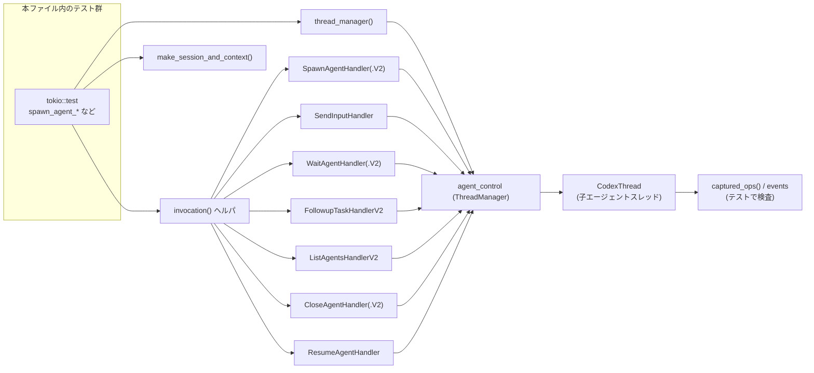
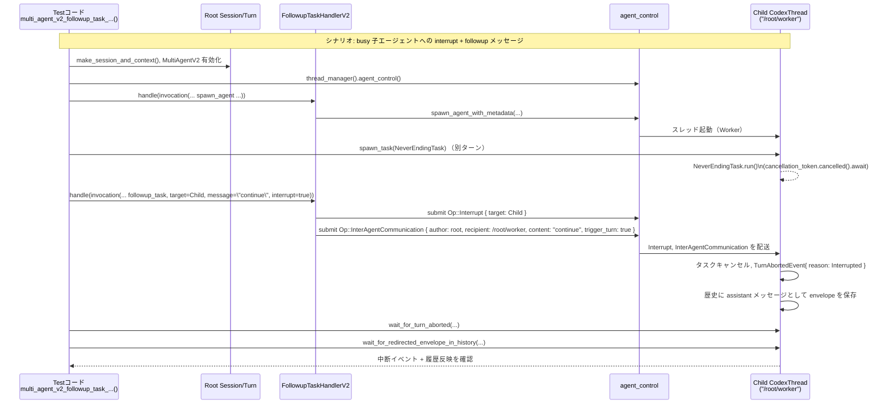

# core/src/tools/handlers/multi_agents_tests.rs

## 0. ざっくり一言

multi_agents 関連の各ツールハンドラ（spawn / send / followup / wait / list / close / resume）が、単一・複数エージェント環境でどのように振る舞うべきかを検証する、非同期統合テスト群です。  
MultiAgent V1/V2 双方の仕様（エラー条件・深さ制限・サンドボックス・待機挙動など）をテストから規定しています。

> 注: 以下で述べるハンドラの挙動は、**このテストファイルから読み取れる仕様**に基づくものです。実装本体は別モジュールにあり、このファイルには含まれていません。

---

## 1. このモジュールの役割

### 1.1 概要

- このモジュールは、マルチエージェント機能を提供するツールハンドラ群の **仕様テスト** を集約したものです。
- 主に次のハンドラ群について、正常系とエラー系の振る舞い・境界条件を検証します:
  - `SpawnAgentHandler` / `SpawnAgentHandlerV2`
  - `SendInputHandler`
  - `SendMessageHandlerV2`
  - `FollowupTaskHandlerV2`
  - `ListAgentsHandlerV2`
  - `WaitAgentHandler` / `WaitAgentHandlerV2`
  - `CloseAgentHandler` / `CloseAgentHandlerV2`
  - `ResumeAgentHandler`
- さらに、エージェント生成/再開用の設定を構築するユーティリティ
  - `build_agent_spawn_config`
  - `build_agent_resume_config`
  の期待される挙動もテストしています。

### 1.2 アーキテクチャ内での位置づけ

このテストモジュール自体はアプリケーションコードを提供しませんが、**どのコンポーネントがどのように連携するか**を明示しています。

関係する主なコンポーネント:

- `ThreadManager` / `CodexThread`
  - テスト専用のモデルプロバイダを使ってエージェントスレッドを起動・管理します。
  - `captured_ops()` で各スレッドに送られた操作 (`Op`) を検査します。
- `agent_control` サービス
  - `ThreadManager` 経由で取得され、エージェント spawn / close / status 取得などを行う抽象 API です。
- 各ツールハンドラ
  - `SpawnAgentHandler`, `SendInputHandler`, `WaitAgentHandler` など。
  - 共通して `ToolInvocation` を入力に取り、`ToolOutput` を返すハンドラです（正確なシグネチャは別モジュール）。
- `Session` / `TurnContext`
  - `make_session_and_context()` によりテスト用セッションとターンを生成します。
  - 各種ポリシー（サンドボックス、承認ポリシー、モデル設定など）がここで設定され、spawn/resume 時の子エージェントに引き継がれます。

依存関係の概略は次のようになります。



> 図は本ファイル `multi_agents_tests.rs` 全体の関係を表し、正確な行番号はこのテキストからは特定できません。

### 1.3 設計上のポイント（テストから読み取れる仕様）

- **責務の分割**
  - テストヘルパー（`invocation`, `thread_manager`, `expect_text_output` 等）でセットアップを共通化しています。
  - 各ハンドラごとに「入力バリデーション」「エラー伝播」「状態遷移」「通知」などの観点別にテストが整理されています。
- **状態管理**
  - 実際の `ThreadManager`（テスト用設定）と `agent_control` を用いて、**本物のスレッドと状態遷移**を伴う統合テストになっています。
  - エージェント階層（親・子・孫）と、深さ制限（`agent_max_depth` / `DEFAULT_AGENT_MAX_DEPTH`）がテストされています。
- **エラーハンドリング**
  - すべてのハンドラは `FunctionCallError::RespondToModel` を通じて **モデル向けの分かりやすいエラーメッセージ**を返すことが期待されています。
  - invalid UUID、空メッセージ、`message` と `items` の同時指定、未知フィールド、深さ制限超過など、多数のエラー条件が網羅されています。
- **並行性とキャンセル**
  - `tokio::test` による非同期テスト。
  - `WaitAgentHandler`/`WaitAgentHandlerV2` は `tokio::time::timeout` で待機・タイムアウトを制御。
  - `NeverEndingTask`（`SessionTask` 実装）では `CancellationToken` によるキャンセルを待ち受けるタスクを用いて、割り込み（`Interrupt`）の挙動を検証しています。
- **セキュリティ・サンドボックス**
  - 子エージェントへのサンドボックスポリシー（ファイルシステム / ネットワーク / シェル環境）が、呼び出し元のターンコンテキストに基づき適切に設定されることをテストしています。
  - MultiAgent V2 の `wait_agent` は **子エージェントからのメールボックスメッセージ内容を呼び出し側に返さない**（センシティブな出力をリークしない）ことを検証しています。

---

## 2. 主要な機能一覧（テストが規定する仕様）

このファイルはテストのみですが、実質的には以下の機能仕様を定義しています。

- **SpawnAgent（エージェント生成）**
  - 非 function payload の拒否
  - 空メッセージ / `message` と `items` の同時指定の拒否
  - 深さ制限 (`agent_max_depth` / `DEFAULT_AGENT_MAX_DEPTH`) の尊重
  - モデルプロバイダ / 承認ポリシー / サンドボックスポリシーの継承・上書き
  - MultiAgent V2:
    - `task_name` 必須、`items`/`fork_context` の拒否
    - `fork_turns` のバリデーション (`none` / `all` / 正の整数文字列)
    - `agent_name`（= task_name）フォーマット制約（小文字・数字・アンダースコアのみ）
    - 名前付きエージェントでは `agent_id` を返さず、エージェントパスを返す
- **SendInput（単純入力送信）**
  - 空メッセージの拒否
  - `message` と `items` の同時指定の拒否
  - 対象 ID の UUID バリデーションと NotFound エラー
  - `interrupt: true` 指定時に、`Op::Interrupt` → `Op::UserInput` の順で送る
  - `items` による構造化入力（Mention と Text）の受け付け
- **SendMessage V2（MultiAgent V2 のメッセージ送信）**
  - `target` に task 名（相対パス）を指定可能
  - legacy な `items` フィールド、`interrupt` パラメータを拒否
  - 送信先エージェントへ `Op::InterAgentCommunication` を送る（`trigger_turn` = false）
- **FollowupTask V2（フォローアップタスク）**
  - root への `target` は拒否（タスクは root に割り当て不可）
  - `items` フィールドの拒否
  - `interrupt: true` 指定時:
    - 忙しい子エージェントに対して `Op::Interrupt` を送信し、進行中のターンを `TurnAbortReason::Interrupted` で中断
    - 同時にフォローアップメッセージを `InterAgentCommunication` として履歴に保存し、新しいターンをトリガー
  - 子の各ターン完了時に、親へ **完了通知メッセージ**（`InterAgentCommunication`）を毎ターン 1 回送る
  - 中断されたターンに対しては完了通知を送らない
- **ListAgents V2（エージェント一覧）**
  - 全エージェントのパス（例: `/root`, `/root/worker`）とステータス (`AgentStatus`) を返す
  - `last_task_message`:
    - root: `"Main thread"`
    - 子: spawn 時の最初のメッセージなど
  - 相対パス prefix によるフィルタリング（例: `path_prefix: "worker"`）
  - closed なエージェントは一覧から除外
- **WaitAgent V1/V2（エージェントの状態/メール待機）**
  - 共通:
    - `timeout_ms` > 0 のチェック
    - target ID の UUID バリデーション
    - targets が空配列の場合はエラー
  - V1 (`WaitAgentHandler`):
    - 複数ターゲットに対してステータスマップ (`HashMap<id, AgentStatus>`) を返す
    - NotFound なエージェントには `AgentStatus::NotFound`
    - 最小待機時間 `MIN_WAIT_TIMEOUT_MS` でタイムアウトをクランプ
    - タイムアウト時は `status` を空にし `timed_out = true`
    - すでに最終状態（例: Shutdown）であれば速やかにその結果を返す
  - V2 (`WaitAgentHandlerV2`):
    - `targets` なしで `timeout_ms` のみ指定可能
    - ルートのメールボックスに **新規に届いた** `InterAgentCommunication` の存在だけを検知し、
      - `message: "Wait completed."`, `timed_out: false` を返す
      - メール内容そのものは返さない（センシティブ情報保護）
    - `wait_agent` 呼び出し前にすでにキューにあるメールでは wakeup しない
    - 任意の子エージェントからの新規メールで wakeup する
- **CloseAgent / CloseAgent V2（エージェント終了）**
  - V1:
    - `target` に ThreadId を受け取り、そのエージェントに `Op::Shutdown` を送信。
    - `previous_status` を返し、その後は `AgentStatus::NotFound` になる。
    - 子サブツリーを再帰的に閉じる挙動（子・孫すべて NotFound）をテスト。
  - V2:
    - `target` に task 名（相対パス）を指定可能。
    - root（`/root`）や root の ThreadId は "root is not a spawned agent" として拒否。
- **ResumeAgent（エージェント再開）**
  - invalid UUID / NotFound エージェントに対するエラー
  - Active なエージェントに対して呼ぶと no-op：ステータスを返すだけ。
  - `resume_thread_with_history` で再構築した closed エージェントを再開できる。
  - Depth limit (`agent_max_depth`) 超過時は spawn と同じメッセージで拒否。
  - closed な子サブツリー全体を一括で reopen し、再度 close した後、親だけを再開しても子サブツリーは閉じたまま、という **階層的な close/resume の契約** をテストしています。
- **構成生成ユーティリティ**
  - `build_agent_spawn_config`:
    - 呼び出し元ターン (`TurnContext`) のモデル、推論設定、開発者向け指示、コンパクトプロンプト、サンドボックス設定、シェルポリシーなどを子エージェント用設定にコピー。
    - `BaseInstructions.text` を `config.base_instructions` に設定。
    - 既存の `user_instructions` は維持（子側で上書きしない）。
  - `build_agent_resume_config`:
    - 再開時には `base_instructions` をクリアする（親の base instructions は引き継がない）。
    - その他のモデル／サンドボックス／承認ポリシーは `TurnContext` の値を反映。

---

## 3. 公開 API と詳細解説

### 3.1 型一覧（構造体・列挙体など）

このファイル内で定義される主な型は次のとおりです。

| 名前 | 種別 | 役割 / 用途 |
|------|------|-------------|
| `NeverEndingTask` | 構造体（`SessionTask` 実装） | キャンセルがかかるまで終了しないセッションタスク。`FollowupTaskHandlerV2` の割り込みテストに使用。 |
| `ListAgentsResult` | 構造体 (`Deserialize`) | `list_agents` の JSON 出力をパースするためのテスト用型。`agents: Vec<ListedAgentResult>` を持つ。 |
| `ListedAgentResult` | 構造体 (`Deserialize`) | 個々のエージェントの `agent_name`, `agent_status`, `last_task_message` を表すテスト用型。 |
| （各テスト内の `SpawnAgentResult` など） | 構造体 (`Deserialize`) | 各テストで限定的に使われるレスポンス用一時型。JSON の構造確認に使われます。 |

> 行番号について: この回答ではソースの正確な行番号にアクセスできないため、`multi_agents_tests.rs:L開始-終了` 形式での具体的な数値は記載できません。

`NeverEndingTask` の内部:

- `impl SessionTask for NeverEndingTask` において:
  - `kind()` は `TaskKind::Regular` を返します。
  - `span_name()` は `"session_task.multi_agent_never_ending"` を返します。
  - `run(...)` は `cancellation_token.cancelled().await` を待ち、その後 `None` を返します。
  - これにより「タスクがキャンセルされるまで決して完了しない」ことが保証され、割り込みのテストに用いられています。

### 3.2 主要ハンドラの仕様（テストから読み取れる契約）

ここでは、このテストモジュールから読み取れる **別モジュールの公開ハンドラ** の仕様を、最大 7 件まで整理します。

> 注意: 正確なシグネチャ（引数型・戻り値型）は本ファイルには含まれていません。  
> 以下は **テストでの呼び出し方と返り値の扱い**から推測される概略です。

---

#### 1. `SpawnAgentHandler.handle(invocation)`

**概要**

- 新しいエージェントスレッドを生成し、`agent_id`（V2 では task 名）や `nickname` を返すハンドラです。
- MultiAgent V1 と V2 で挙動が一部異なり、V2 ではタスク名とパスを重視します。

**主な契約（V1）**

- payload が `ToolPayload::Function` 以外ならエラー  
  → `handler_rejects_non_function_payloads` テスト。
- `message` が空文字または空白のみならエラー  
  → `"Empty message can't be sent to an agent"`.
- `message` と `items` が同時に指定された場合エラー  
  → `"Provide either message or items, but not both"`.
- `session.services.agent_control` が未設定（manager dropped）の場合エラー  
  → `"collab manager unavailable"`.
- 現在の `turn.config.agent_max_depth` を尊重:
  - 呼び出し元の `SessionSource::SubAgent` の `depth` が `agent_max_depth` に達している場合:
    - `"Agent depth limit reached. Solve the task yourself."` で拒否。
  - `agent_max_depth` を増やした場合、その範囲内では spawn を許可。
- 子エージェントには:
  - 呼び出し元ターンの `approval_policy` を引き継ぎ (`AskForApproval::OnRequest` 等)。
  - runtime の `sandbox_policy` / `file_system_sandbox_policy` / `network_sandbox_policy` を反映。
  - `SpawnAgentResult` として `agent_id` と非空の `nickname` を返す。

**主な契約（V2: `SpawnAgentHandlerV2.handle`）**

- `Feature::MultiAgentV2` が有効なセッションで利用。
- `task_name` フィールドが必須:
  - 欠如していると `FunctionCallError::RespondToModel` で Serde の `"missing field \`task_name\`"` エラー文言をそのまま返す。
- legacy フィールドの拒否:
  - `items` があると `"unknown field \`items\`"` エラー。
  - `fork_context` があると `"fork_context is not supported in MultiAgentV2; use fork_turns instead"`.
- `fork_turns` のバリデーション:
  - `"banana"` や `"0"` のような無効値に対して `"fork_turns must be \`none\`, \`all\`, or a positive integer string"` エラー。
- `task_name` のフォーマット:
  - `"BadName"` のような大文字を含む名前は `"agent_name must use only lowercase letters, digits, and underscores"` で拒否。
- 成功時:
  - `task_name` が `/root/test_process` のような **絶対パス形式** に正規化されて返る。
  - `nickname` は常に `Some(non_empty_string)`。
  - 名前付きエージェントの場合、レスポンスには `agent_id` フィールドを含めないことが期待される。

**Examples（使用例）**

```rust
// V1: 簡単な spawn
let (session, turn) = make_session_and_context().await;
let output = SpawnAgentHandler
    .handle(invocation(
        Arc::new(session),
        Arc::new(turn),
        "spawn_agent",
        function_payload(json!({ "message": "inspect this repo" })),
    ))
    .await
    .expect("spawn_agent should succeed");

let (content, success) = expect_text_output(output);
assert_eq!(success, Some(true));
let result: serde_json::Value = serde_json::from_str(&content).unwrap();
assert!(result["agent_id"].is_string());
assert!(result.get("nickname").is_some());
```

```rust
// V2: task_name 必須
let output = SpawnAgentHandlerV2
    .handle(invocation(
        session.clone(),
        turn.clone(),
        "spawn_agent",
        function_payload(json!({
            "message": "inspect this repo",
            "task_name": "worker"
        })),
    ))
    .await
    .expect("spawn_agent should succeed");

let (content, _) = expect_text_output(output);
let result: serde_json::Value = serde_json::from_str(&content).unwrap();
assert_eq!(result["task_name"], "/root/worker");
```

**Errors / Panics**

- 上記の各条件で `Err(FunctionCallError::RespondToModel(...))` を返します。
- テスト上、`panic!` はハンドラ内部からは想定されていません（`panic!` は「この条件で Err が返るはず」というアサーション用）。

**Edge cases（エッジケース）**

- Manager 未設定（`session.services.agent_control` が `None` の状態）での呼び出し。
- `agent_max_depth` ちょうどの深さ vs それを超える深さ。
- MultiAgent V2 での旧パラメータ（`items`, `fork_context`, 無効 `fork_turns`）。

**使用上の注意点**

- MultiAgent V2 向け挙動を期待する場合、`Feature::MultiAgentV2` を有効にし、V2 用ハンドラ（`SpawnAgentHandlerV2`）を使う必要があります。
- 深さ制限エラーは、再帰的なエージェント生成が暴走しないようにする安全装置であるため、上限値の変更には注意が必要です。
- サンドボックス設定・承認ポリシーは呼び出し元の `TurnContext` に依存するため、spawn 前にターン側の設定を確定させる必要があります。

---

#### 2. `SendInputHandler.handle(invocation)`

**概要**

- 特定のエージェントスレッドに対して、ユーザー入力 (`UserInput`) を送信するハンドラです。
- 任意で `interrupt: true` を指定して、入力前にターンを中断させることができます。

**引数（JSON payload 上で現れる項目）**

| フィールド | 型 | 説明 |
|-----------|----|------|
| `target` | `String` | 送信先エージェントの ThreadId（UUID）文字列。 |
| `message` | `String` (optional) | プレーンテキストメッセージ。 |
| `items` | `Array` (optional) | 構造化された `UserInput` 要素の配列。`message` と排他。 |
| `interrupt` | `bool` (optional) | true の場合、入力送信前に `Op::Interrupt` を送る。 |

**主な契約**

- `message` が空文字列または空白のみの場合:
  - `"Empty message can't be sent to an agent"` エラー。
- `message` と `items` の同時指定は不可:
  - `"Provide either message or items, but not both"` エラー。
- `target` が UUID 形式でない場合:
  - `"invalid agent id <value>:"` で始まるエラー。
- Manager が有効でも、対象エージェントが存在しない場合:
  - `"agent with id <id> not found"` エラー。
- `interrupt: true` の場合:
  - 送信先スレッドに対して `Op::Interrupt` → `Op::UserInput` の順で 2 つの操作が送信される。
- `items` のみ指定した場合:
  - その配列を `UserInput::Mention` や `UserInput::Text` に変換した上で `Op::UserInput` が送信される。

**Examples**

```rust
// interrupt 付きで単純メッセージを送る例
let (mut session, turn) = make_session_and_context().await;
let manager = thread_manager();
session.services.agent_control = manager.agent_control();
let config = turn.config.as_ref().clone();
let thread = manager.start_thread(config).await.unwrap();
let agent_id = thread.thread_id;

SendInputHandler
    .handle(invocation(
        Arc::new(session),
        Arc::new(turn),
        "send_input",
        function_payload(json!({
            "target": agent_id.to_string(),
            "message": "hi",
            "interrupt": true
        })),
    ))
    .await
    .expect("send_input should succeed");

// 先に Interrupt, 次に UserInput が届いていることを検証
let ops_for_agent: Vec<&Op> = manager
    .captured_ops()
    .iter()
    .filter_map(|(id, op)| (*id == agent_id).then_some(op))
    .collect();
assert!(matches!(ops_for_agent[0], Op::Interrupt));
assert!(matches!(ops_for_agent[1], Op::UserInput { .. }));
```

**Edge cases**

- 存在しないエージェント ID・無効な UUID への送信。
- `interrupt` 付きで連続して呼んだ場合の挙動はこのファイルでは検証されていません（不明）。

**使用上の注意点**

- MultiAgent V2 の `send_message` とは別物です。V2 モードでは `SendMessageHandlerV2` を使う仕様が別途定義されています。
- high-frequency で `interrupt` を送ると、ターンが頻繁に中断されるため、呼び出し側の設計に注意が必要です。

---

#### 3. `WaitAgentHandler.handle(invocation)`（V1）

**概要**

- 複数のエージェント ID について、指定したタイムアウト内で **最終状態（final status）** になるまで待機し、その結果をまとめて返すハンドラです。

**主な契約**

- `timeout_ms <= 0` の場合:
  - `"timeout_ms must be greater than zero"` エラー。
- `targets` が空配列の場合:
  - `"agent ids must be non-empty"` エラー。
- 各 `targets[i]` が UUID でない場合:
  - `"invalid agent id <value>:"` エラー。
- 指定された ID すべてが存在しない場合:
  - `status` マップに各 ID -> `AgentStatus::NotFound` を格納し、`timed_out = false` を返す。
- 対象エージェントがまだ final 状態でない場合:
  - `MIN_WAIT_TIMEOUT_MS` 未満の `timeout_ms` が指定されても、内側では最低 `MIN_WAIT_TIMEOUT_MS` 分は待つ（短すぎるタイムアウトはクランプされる）。
  - 待機時間内に final 状態にならなければ `status = {}`（空）・`timed_out = true` を返す。
- すでに final 状態（例: Shutdown）になっている場合:
  - `status` に ID -> final status を入れ、`timed_out = false` で返す。

**Examples**

```rust
// 存在しない 2 つのエージェントを待つ例
let (mut session, turn) = make_session_and_context().await;
let manager = thread_manager();
session.services.agent_control = manager.agent_control();
let id_a = ThreadId::new();
let id_b = ThreadId::new();

let output = WaitAgentHandler
    .handle(invocation(
        Arc::new(session),
        Arc::new(turn),
        "wait_agent",
        function_payload(json!({
            "targets": [id_a.to_string(), id_b.to_string()],
            "timeout_ms": 1000
        })),
    ))
    .await
    .expect("wait_agent should succeed");

let (content, _) = expect_text_output(output);
let result: wait::WaitAgentResult = serde_json::from_str(&content).unwrap();
assert_eq!(result.timed_out, false);
assert_eq!(result.status[&id_a.to_string()], AgentStatus::NotFound);
assert_eq!(result.status[&id_b.to_string()], AgentStatus::NotFound);
```

**使用上の注意点**

- `timeout_ms` が短すぎると内部でクランプされ、実際の待機時間が長くなることがあります。
- 「待機開始以前に final 状態になっていた」場合と「待機中に final 状態になった」場合は区別されません（どちらも final status として返ります）。

---

#### 4. `WaitAgentHandlerV2.handle(invocation)`

**概要**

- MultiAgent V2 の「メールボックス待ち」ハンドラです。
- 特定のエージェント ID ではなく、**root のメールボックスへの新規 `InterAgentCommunication` 到着**を検知します。

**主な契約**

- JSON 引数は `{"timeout_ms": u64}` のみを許可（`targets` なし）。
- 呼び出し前から既にキューに入っているメールは無視し、**呼び出し後に届いた最初のメール**で wait が完了する。
- 送信元・内容に関わらず、最初のメールで wakeup:
  - `multi_agent_v2_wait_agent_wakes_on_any_mailbox_notification` テストで、`worker_b` からの通知で wakeup することを検証。
- 完了時のレスポンス:
  - `WaitAgentResult { message: "Wait completed.", timed_out: false }`
  - メール本文や送信元パスなどはレスポンスに含めない。
- `timeout_ms` 経過までにメールが届かなければ `timed_out: true`（テストでは `true` ケースは直接検証されていませんが、`timed_out: false` の正常ケースのみ確認されています）。

**セキュリティ上のポイント**

- `multi_agent_v2_wait_agent_does_not_return_completed_content` テストにより、メールボックスに `"sensitive child output"` という内容があっても、レスポンスの JSON にはその文字列が一切含まれないことが検証されています。
- これは「子エージェントの生ログをそのままモデルに渡さない」という情報漏洩防止の契約を示しています。

---

#### 5. `FollowupTaskHandlerV2.handle(invocation)`

**概要**

- 既存の子エージェントに対してフォローアップタスクを送信し、必要に応じて現在のターンを中断 (`Interrupt`) するハンドラです。
- 親エージェントへの完了通知や、root へのタスク割り当て禁止なども含めて管理します。

**主な契約**

- `target` に root（`"/root"`）を指定した場合:
  - `"Tasks can't be assigned to the root agent"` エラー。
  - root に対する `Op::Interrupt` や `Op::InterAgentCommunication` は送信しない。
- `items` フィールドはサポートされない:
  - legacy `items` 使用時に `"unknown field \`items\`"` エラー。
- `interrupt: true` の場合:
  - 対象子スレッドに `Op::Interrupt` を送り、現在の `NeverEndingTask` のようなタスクがキャンセルされることを期待。
  - その後、フォローアップメッセージを `InterAgentCommunication` として child thread に送信。
  - `wait_for_turn_aborted` により対象ターンが `TurnAbortReason::Interrupted` で中断されることを確認。
  - `wait_for_redirected_envelope_in_history` により、フォローアップメッセージが子スレッドの履歴に「assistant 役の `InterAgentCommunication` envelope」として保存され、**user メッセージとして重複登録されていない**ことを確認。
- Completion 通知:
  - 子エージェントが各ターン完了時に `EventMsg::TurnComplete` を送ると、親 root スレッドに対し `Op::InterAgentCommunication` で
    - `author = 子の AgentPath` (`/root/worker` など)
    - `recipient = AgentPath::root()`
    - `content = format_subagent_notification_message(...)`
    - `trigger_turn = false`
    が送られる。
  - 各ターン毎に 1 件の通知が送られる（`first done`, `second done` の 2 ターンで 2 通知）。

---

#### 6. `CloseAgentHandler.handle(invocation)` / `CloseAgentHandlerV2.handle(invocation)`

**概要**

- 指定エージェントを終了させるハンドラです。MultiAgent V2 ではタスク名ベースのパス指定をサポートします。

**主な契約**

- V1:
  - `target` に ThreadId 文字列を受け取る。
  - `Op::Shutdown` を送信し、そのエージェントの `previous_status` を JSON で返す。
  - `previous_status != AgentStatus::NotFound` の場合、`success: Some(true)`。
  - 終了後、`get_status(agent_id)` が `AgentStatus::NotFound` になることを期待。
  - 子サブツリーも連鎖的に閉じる（`tool_handlers_cascade_close_and_resume_and_keep_explicitly_closed_subtrees_closed` テスト）。
- V2:
  - `target` に task 名（例: `"worker"`）または root の ThreadId を渡すことができるが:
    - root のパス `/root` や root の ThreadId は `"root is not a spawned agent"` で拒否。
  - 名前 `"worker"` から子スレッド ID を解決し、それを終了させる。

---

#### 7. `build_agent_spawn_config(&BaseInstructions, &TurnContext)` / `build_agent_resume_config(&TurnContext, child_depth)`

**概要**

- 子エージェント生成・再開時に使用する `Config` を構築するユーティリティです。
- テストから、その **コピー元とコピー先** の関係が明確になっています。

**主な契約（spawn 用）**

- `build_agent_spawn_config`:
  - ベース（呼び出し元）設定 `turn.config` をコピーした上で、以下を上書き:
    - `base_instructions` ← 引数 `BaseInstructions.text`
    - `model` ← `turn.model_info.slug`
    - `model_provider` ← `turn.provider`
    - `model_reasoning_effort` ← `turn.reasoning_effort`
    - `model_reasoning_summary` ← `Some(turn.reasoning_summary)`
    - `developer_instructions` ← `turn.developer_instructions`
    - `compact_prompt` ← `turn.compact_prompt`
    - `permissions.shell_environment_policy` ← `turn.shell_environment_policy`
    - `codex_linux_sandbox_exe` ← `turn.codex_linux_sandbox_exe`
    - `cwd` ← `turn.cwd`
    - `permissions.approval_policy` ← `AskForApproval::OnRequest`（turn 側の runtime 設定）
    - `permissions.sandbox_policy`/`file_system_sandbox_policy`/`network_sandbox_policy` ← turn の runtime 設定
  - `user_instructions` はベース設定側 (`base_config.user_instructions`) を **維持**し、`turn.user_instructions` で上書きしない。

**主な契約（resume 用）**

- `build_agent_resume_config`:
  - `turn.config` をベースにしつつ、以下を上書き:
    - `base_instructions` ← `None`（呼び出し元の base instructions をクリア）
    - その他のモデル・サンドボックス・承認ポリシーは spawn と同様に `TurnContext` からコピー。

**使用上の注意点**

- 「ベース設定の `user_instructions` は保つ」「`base_instructions` は spawn 時のみ設定し、resume 時にはクリアする」というルールは、**プロンプトの二重適用や混線を防ぐ**ための契約として重要です。

---

### 3.3 このファイル内の主なヘルパー関数

| 関数名 | 役割（1 行） |
|--------|--------------|
| `invocation(session, turn, tool_name, payload) -> ToolInvocation` | 共通の `ToolInvocation` オブジェクトを生成し、テストコードを簡潔にするヘルパー。 |
| `function_payload(args: serde_json::Value) -> ToolPayload` | JSON 値から `ToolPayload::Function { arguments }` を構築する。 |
| `parse_agent_id(id: &str) -> ThreadId` | 文字列から `ThreadId` をパースし、失敗時は panic するテスト用ヘルパー。 |
| `thread_manager() -> ThreadManager` | テスト用モデルプロバイダ（`built_in_model_providers(None)["openai"]`）を使う `ThreadManager` を生成。 |
| `history_contains_inter_agent_communication(items, expected) -> bool` | レスポンス履歴から、指定された `InterAgentCommunication` が含まれているか判定。 |
| `wait_for_turn_aborted(thread, expected_turn_id, expected_reason)` | 指定ターンが `TurnAbortReason` とともに `TurnAborted` を発行するまで待機する非同期ヘルパー。 |
| `wait_for_redirected_envelope_in_history(thread, expected)` | 子スレッドの履歴に期待する `InterAgentCommunication` envelope が現れるまでポーリングし、user メッセージとの二重登録がないことも検証。 |
| `expect_text_output(output: impl ToolOutput) -> (String, Option<bool>)` | ツール出力を JSON 文字列と `success` フラグに変換し、`FunctionCallOutputBody::Text` もしくはコンテンツ配列からテキストを抽出。 |

---

## 4. データフロー

ここでは代表的なシナリオとして、**MultiAgent V2 のフォローアップタスクが busy な子エージェントを interrupt し、メッセージを失わずに履歴へ保存するフロー**を説明します（`multi_agent_v2_followup_task_interrupts_busy_child_without_losing_message` テストより）。

### 処理の要点

1. 親 root スレッドで MultiAgent V2 を有効化し、`SpawnAgentHandlerV2` で `"worker"` エージェントを spawn。
2. 子 `"worker"` スレッドで `NeverEndingTask` を起動し、キャンセルされるまで走り続けるターンを開始。
3. 親が `FollowupTaskHandlerV2` に対し `target = child_id`, `message = "continue"`, `interrupt = true` で呼び出し。
4. ハンドラは子スレッドに対し:
   - `Op::Interrupt` を送信。
   - `InterAgentCommunication`（author: root, recipient: `/root/worker`, content: `"continue"`, `trigger_turn = true`）を送信。
5. 子スレッド側では:
   - 実行中の `NeverEndingTask` の `CancellationToken` がキャンセルされ、`TurnAbortedEvent` を発行。
   - `InterAgentCommunication` envelope が履歴に `assistant` ロールとして保存される（user ロールとして重複登録されない）。

### シーケンス図



> 図の具体的な行範囲は `multi_agents_tests.rs` から正確に特定できないため省略しています。

---

## 5. 使い方（How to Use）

このファイルはテストですが、ここで示されたパターンは実際の利用コードを書く際の参考になります。

### 5.1 基本的な使用方法（spawn → followup → wait）

典型的な MultiAgent V2 利用フロー:

```rust
// 1. セッションとターンを取得し、MultiAgentV2 を有効化する
let (mut session, mut turn) = make_session_and_context().await;
let manager = thread_manager();
let root = manager.start_thread((*turn.config).clone()).await?;
session.services.agent_control = manager.agent_control();
session.conversation_id = root.thread_id;
let mut config = (*turn.config).clone();
config.features.enable(Feature::MultiAgentV2)?;
turn.config = Arc::new(config);

let session = Arc::new(session);
let turn = Arc::new(turn);

// 2. 子エージェントを spawn する
let output = SpawnAgentHandlerV2
    .handle(invocation(
        session.clone(),
        turn.clone(),
        "spawn_agent",
        function_payload(json!({
            "message": "boot worker",
            "task_name": "worker"
        })),
    ))
    .await?;
let (content, _) = expect_text_output(output);
let _spawn_result: serde_json::Value = serde_json::from_str(&content)?;

// 3. 子にフォローアップタスクを投げる（interrupt なし）
FollowupTaskHandlerV2
    .handle(invocation(
        session.clone(),
        turn.clone(),
        "followup_task",
        function_payload(json!({
            "target": "worker",     // 相対タスク名
            "message": "continue",
        })),
    ))
    .await?;

// 4. 親側で wait_agent を呼び、子からの完了通知を待つ
let wait_output = WaitAgentHandlerV2
    .handle(invocation(
        session,
        turn,
        "wait_agent",
        function_payload(json!({ "timeout_ms": 1000 })),
    ))
    .await?;
let (content, _) = expect_text_output(wait_output);
let wait_result: multi_agents_v2::wait::WaitAgentResult =
    serde_json::from_str(&content)?;
assert_eq!(wait_result.timed_out, false);
```

### 5.2 よくある使用パターン

- **エージェントへの 1 ショットメッセージ送信**
  - V1: `SendInputHandler` に `message` だけ渡す。
  - V2: 名前付きエージェントには `SendMessageHandlerV2` で `target = "worker"` などのタスク名を使う。
- **エージェントのライフサイクル管理**
  - `SpawnAgentHandler` / `CloseAgentHandler` / `ResumeAgentHandler` を組み合わせて、親子スレッドの階層を管理。
- **状態待機 vs メール待機**
  - エージェントの終了や停止を待ちたい場合 → `WaitAgentHandler`（V1）。
  - 子から親への通知（メールボックス）を待ちたい場合 → `WaitAgentHandlerV2`。

### 5.3 よくある間違い（テストから読み取れる誤用）

```rust
// 誤り例: message と items を同時に指定してしまう
let invocation = invocation(
    Arc::new(session),
    Arc::new(turn),
    "spawn_agent",
    function_payload(json!({
        "message": "hello",
        "items": [{"type": "mention", "name": "drive", "path": "app://drive"}]
    })),
);
// => "Provide either message or items, but not both" エラー
```

```rust
// 正しい例: どちらか一方だけを指定する
let invocation = invocation(
    Arc::new(session),
    Arc::new(turn),
    "spawn_agent",
    function_payload(json!({
        "message": "hello" // items は指定しない
    })),
);
```

```rust
// 誤り例 (V2): legacy items を使って send_message する
let invocation = invocation(
    session.clone(),
    turn.clone(),
    "send_message",
    function_payload(json!({
        "target": "worker",
        "items": [{"type": "text", "text": "continue"}]
    })),
);
// => "unknown field `items`" エラー
```

```rust
// 正しい例 (V2): message を使う
let invocation = invocation(
    session.clone(),
    turn.clone(),
    "send_message",
    function_payload(json!({
        "target": "worker",
        "message": "continue"
    })),
);
```

### 5.4 使用上の注意点（まとめ）

- **UUID / AgentPath の区別**
  - V1 ハンドラ（`SendInputHandler`, `WaitAgentHandler` など）は ThreadId（UUID）を引数に取る前提。
  - V2 ハンドラ（`SpawnAgentHandlerV2`, `SendMessageHandlerV2`, `FollowupTaskHandlerV2`, `CloseAgentHandlerV2`）はタスク名ベースの path を扱います。
- **Deep nesting の制約**
  - `agent_max_depth` によりネストの深さが制限されます。再帰的な spawn/resume のロジックを追加する際には、この制限を考慮する必要があります。
- **サンドボックスと承認ポリシー**
  - 子エージェント生成時の設定は、**ターンコンテキストの runtime 設定**が最終的に反映されることに注意（`build_agent_spawn_config` テスト）。
  - 承認ポリシーなどの変更は spawn/resume 前に済ませておく必要があります。
- **センシティブな子出力の扱い**
  - MultiAgent V2 の `wait_agent` は子エージェントのメッセージ本文を返しません。必要に応じて別のチャネルでログ・監査情報を扱う設計が前提です。

---

## 6. 変更の仕方（How to Modify）

### 6.1 新しい機能を追加する場合（例: 新ツールハンドラ）

1. **ハンドラ本体の追加**
   - 実装は `core/src/tools/handlers/` 配下の適切なモジュール（例: `multi_agents.rs`, `multi_agents_v2/mod.rs` 等）に追加します。
   - 既存のハンドラ（`SpawnAgentHandler`, `WaitAgentHandlerV2` など）のシグネチャ・エラーハンドリング方式 (`FunctionCallError::RespondToModel`) を参考にします。

2. **テストの追加**
   - 本ファイル（`multi_agents_tests.rs`）に新しい `#[tokio::test]` を追加し、ヘルパー `invocation`, `thread_manager`, `expect_text_output` を活用して仕様を記述します。
   - 可能であれば:
     - 正常系レイテンシ・状態遷移
     - 不正入力（unknown field, 空文字, invalid id など）
     - 並行性（interrupt, timeout）を含む

3. **既存フローとの統合**
   - `ThreadManager::captured_ops()` を通じて、他のハンドラと同じように `Op` の送信内容を検証し、他機能と整合性が取れているか確認します。

### 6.2 既存の機能を変更する場合

- **影響範囲の確認**
  - 変更予定のハンドラ名でこのファイル全体を検索し、どのテストがその挙動に依存しているかを洗い出します。
  - 特に MultiAgent V2 周りは複数のテストで同じ挙動を前提にしていることが多いため注意が必要です。

- **契約の再確認**
  - エラーメッセージ文字列・`AgentStatus` の値・`timed_out` フラグなど、レスポンスの細部が他コンポーネントにとって契約になっている可能性があります。
  - 本ファイルのテストは、その契約の具体例と見なすことができます。

- **注意すべき契約（例）**
  - `spawn_agent` / `resume_agent` の「深さ制限エラー」メッセージは同一。
  - MultiAgent V2 のハンドラでは legacy フィールド（`items`, `fork_context`, `interrupt` など）を必ず拒否する。
  - `wait_agent_v2` はメール内容を返さない（セキュリティ上の前提）。

- **テスト・使用箇所の再確認**
  - 新しい挙動が既存テストを破る場合、仕様変更なのかバグなのかを明確にし、必要に応じてテストを更新します。
  - 他モジュールのコード（例: UI / API レイヤー）で、このハンドラのレスポンス形式を期待している箇所がないか確認が必要です（このファイルからは直接は分かりません）。

---

## 7. 関連ファイル

このモジュールと密接に関係する（が、このチャンクには実装が現れない）主なファイル・ディレクトリは次のとおりです。

| パス（推定） | 役割 / 関係 |
|--------------|------------|
| `core/src/tools/handlers/multi_agents.rs` | `SpawnAgentHandler`, `SendInputHandler`, `WaitAgentHandler`, `CloseAgentHandler`, `ResumeAgentHandler` などの V1 ハンドラ実装があると推定されるモジュール。テストで `super::*` 経由で利用。 |
| `core/src/tools/handlers/multi_agents_v2/mod.rs` | `SpawnAgentHandlerV2`, `SendMessageHandlerV2`, `FollowupTaskHandlerV2`, `ListAgentsHandlerV2`, `WaitAgentHandlerV2`, `CloseAgentHandlerV2` を再エクスポートしていると推定されるモジュール。 |
| `core/src/tools/handlers/multi_agents_v2/wait.rs` | `crate::tools::handlers::multi_agents_v2::wait::WaitAgentResult` 型など、V2 wait 機能の定義。 |
| `core/src/tools/handlers/multi_agents/close_agent.rs` | `close_agent::CloseAgentResult` 型の定義。 |
| `core/src/tools/handlers/multi_agents/resume_agent.rs` | `resume_agent::ResumeAgentResult` 型の定義。 |
| `core/src/codex/session.rs` など | `make_session_and_context`, `Session`, `TurnContext`, `SessionTask`, `SessionTaskContext` の実装。 |
| `core/src/threads/thread_manager.rs` | `ThreadManager`, `CodexThread`, `captured_ops()`, `shutdown_all_threads_bounded` などの実装。 |

> 上記のパスは import 名からの推測であり、正確な場所や名称はリポジトリ構成を直接確認する必要があります。このファイルには実装が含まれていません。
