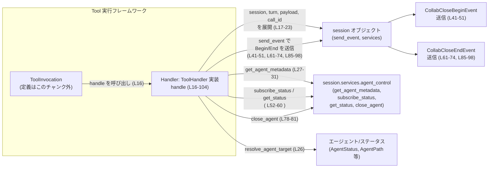
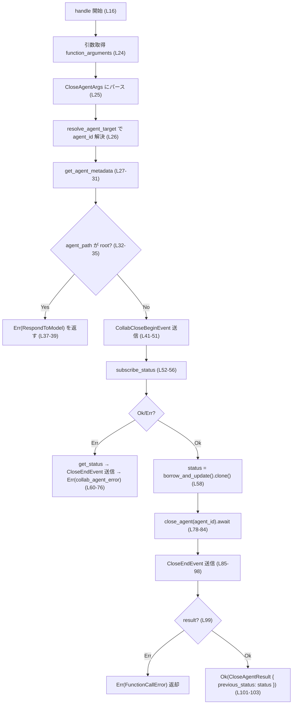
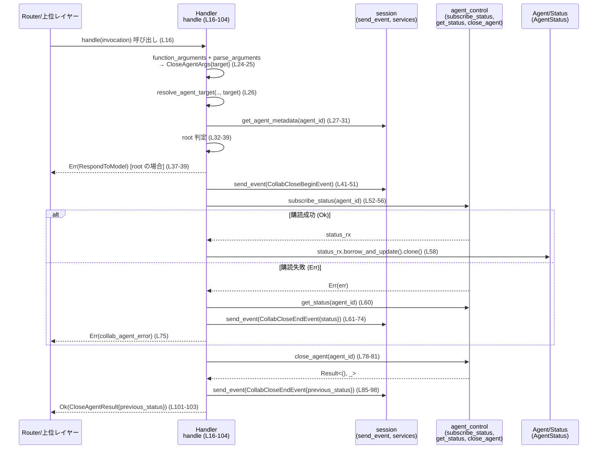

# core/src/tools/handlers/multi_agents_v2/close_agent.rs

## 0. ざっくり一言

- multi_agents_v2 における「close_agent」ツール呼び出しを処理する `ToolHandler` 実装と、その結果 (`CloseAgentResult`) を定義するモジュールです（`close_agent.rs:L3-105, L113-134`）。
- 指定されたターゲットエージェントを特定し、root でないことを検証した上で、ステータス購読・クローズ要求・開始/終了イベント送信を行います（`close_agent.rs:L24-84`）。

---

## 1. このモジュールの役割

### 1.1 概要

- このモジュールは **「close_agent」ツール呼び出しの実行と結果の生成** を行います。
- `Handler` 構造体が `ToolHandler` トレイトを実装し、`ToolInvocation` から:
  - 引数のパース（`CloseAgentArgs`）→ エージェント ID 解決 → root 判定 → イベント送信 → `agent_control` 経由のクローズ依頼 → 結果返却、という流れを実装しています（`close_agent.rs:L16-104`）。
- 結果は `CloseAgentResult` として返され、直前のエージェントステータス (`previous_status`) を保持します（`close_agent.rs:L113-116, L101-103`）。

### 1.2 アーキテクチャ内での位置づけ

このモジュールは「ツール実行フレームワーク」の中の 1 ハンドラです。`ToolInvocation` を受け取り、内部の `session` 経由でサービスやイベント発行を行います（`close_agent.rs:L17-23, L27-31, L41-51, L78-84`）。



> `ToolInvocation`, `ToolHandler`, `agent_control` の具体的な定義はこのチャンクには現れません。上図は関数呼び出し名とフィールド名から読み取れる依存関係のみを表現しています。

### 1.3 設計上のポイント

- **ステートレスなハンドラ**  
  - `Handler` はフィールドを持たない構造体であり（`close_agent.rs:L3`）、状態はすべて `ToolInvocation` や `session` に保持されています。
- **Rust らしいエラーハンドリング**  
  - 引数パースやエージェント解決、クローズ処理などで `Result` と `?` 演算子を用いた伝播を行っています（`close_agent.rs:L24-26, L78-84, L99`）。
  - root エージェントへのクローズ要求には明示的にエラーを返してガードしています（`close_agent.rs:L32-39`）。
- **入力のバリデーション**  
  - ツール引数 `CloseAgentArgs` に `#[serde(deny_unknown_fields)]` が付いており、定義されていないフィールドが来た場合はデシリアライズ時にエラーになります（`close_agent.rs:L107-110`）。
- **観測性（イベント駆動）**  
  - クローズ開始時と終了時にそれぞれイベント (`CollabCloseBeginEvent`, `CollabCloseEndEvent`) を送信し、外部から処理のライフサイクルを観測できる構造になっています（`close_agent.rs:L41-51, L61-74, L85-98`）。
- **非同期処理とサービス境界**  
  - `handle` は `async fn` であり、`session.send_event` や `agent_control` への呼び出しは `await` で非同期実行されています（`close_agent.rs:L16, L51, L56, L60, L82, L98`）。

---

## 2. 主要な機能一覧

- **close_agent ツールのハンドリング**  
  - `Handler::handle`: `ToolInvocation` を受け取り、対象エージェントの解決・検証・クローズ要求・イベント送信・結果生成を行います（`close_agent.rs:L16-104`）。
- **close_agent 引数の定義**  
  - `CloseAgentArgs`: JSON などの引数から `target` 文字列を取り出すための構造体です（`close_agent.rs:L107-111`）。
- **close_agent 結果の定義とフォーマット**  
  - `CloseAgentResult` + `ToolOutput` 実装: 直前のエージェントステータスを保持し、ログ／レスポンス／コードモード出力のためのユーティリティを提供します（`close_agent.rs:L113-133`）。
- **ハンドラ識別**  
  - `Handler::kind` / `Handler::matches_kind`: ツールの種類が Function であること、および `ToolPayload` が Function の場合にこのハンドラが適用されることを示します（`close_agent.rs:L8-14`）。

---

## 3. 公開 API と詳細解説

### 3.1 型一覧（構造体）

| 名前 | 種別 | 公開範囲 | 役割 / 用途 | 定義位置 |
|------|------|----------|-------------|----------|
| `Handler` | 構造体（フィールドなし） | `pub(crate)` | `ToolHandler` として close_agent ツール呼び出しを処理するレシーバ | `close_agent.rs:L3` |
| `CloseAgentArgs` | 構造体 | モジュール内のみ | ツールの引数（`target`）をデシリアライズするための入力型。未知フィールドは拒否。 | `close_agent.rs:L107-111` |
| `CloseAgentResult` | 構造体 | `pub(crate)` | クローズ前のエージェントステータス `previous_status` を保持し、レスポンスとログ出力に利用される | `close_agent.rs:L113-116` |

> `AgentStatus` 型の定義はこのチャンクには現れません（`close_agent.rs:L115`）。

### 3.2 関数詳細

#### `Handler::handle(&self, invocation: ToolInvocation) -> Result<CloseAgentResult, FunctionCallError>`

**概要**

- close_agent ツール呼び出しのメインロジックです。
- 引数からターゲットエージェントを解決し、root でないことを確認した上で、クローズ開始・終了のイベント送信とクローズ要求を行い、直前のエージェントステータスを結果として返します（`close_agent.rs:L16-104`）。

**引数**

| 引数名 | 型 | 説明 |
|--------|----|------|
| `self` | `&Handler` | ステートレスなハンドラ自身（`close_agent.rs:L3, L16`）。フィールドはありません。 |
| `invocation` | `ToolInvocation` | 上位レイヤーから渡されるツール呼び出しコンテキスト。`session`, `turn`, `payload`, `call_id` などを含みます（`close_agent.rs:L17-23`）。`ToolInvocation` の定義はこのチャンクには現れません。 |

**戻り値**

- `Result<CloseAgentResult, FunctionCallError>`  
  - `Ok(CloseAgentResult)`:
    - `previous_status`: クローズ実行前時点で取得したエージェントステータス（`close_agent.rs:L52-58, L101-103`）。
  - `Err(FunctionCallError)`:
    - 引数パースやエージェント解決、ステータス購読、クローズ処理、root ガードなどで失敗した場合に返されます（`close_agent.rs:L24-26, L32-39, L52-76, L78-84, L99`）。

**内部処理の流れ（アルゴリズム）**

1. **コンテキストの分解**  
   - `ToolInvocation` から `session`, `turn`, `payload`, `call_id` を取り出します（`close_agent.rs:L17-23`）。
2. **引数文字列の抽出とパース**  
   - `function_arguments(payload)?` で生の引数データを取得します（`close_agent.rs:L24`）。
   - それを `parse_arguments` に渡し、`CloseAgentArgs` としてデシリアライズします（`close_agent.rs:L25`）。  
     - `CloseAgentArgs` は `target: String` のみを受け付け、未知フィールドは `deny_unknown_fields` によりエラーになります（`close_agent.rs:L107-110`）。
3. **ターゲットエージェントの解決**  
   - `resolve_agent_target(&session, &turn, &args.target).await?` で、`target` からエージェント ID を特定します（`close_agent.rs:L26`）。  
     - 失敗した場合は `?` により直ちに `Err` を返します。
4. **メタデータ取得と root 判定**  
   - `session.services.agent_control.get_agent_metadata(agent_id).unwrap_or_default()` でエージェントメタデータを取得し、取得できない場合はデフォルト値を使います（`close_agent.rs:L27-31`）。  
   - `receiver_agent.agent_path.as_ref().is_some_and(AgentPath::is_root)` で root エージェントかを判定し、root の場合は `FunctionCallError::RespondToModel("root is not a spawned agent")` を返して処理を中断します（`close_agent.rs:L32-39`）。
5. **クローズ開始イベントの送信**  
   - `CollabCloseBeginEvent` を組み立て、`session.send_event(&turn, ...).await` で送信します（`close_agent.rs:L41-51`）。
6. **ステータス購読（または現在ステータス取得）**  
   - `subscribe_status(agent_id).await` を呼び、成功した場合は `status_rx.borrow_and_update().clone()` で現在ステータスを取得します（`close_agent.rs:L52-58`）。  
   - 失敗した場合は `get_status(agent_id).await` で一度だけステータスを取得し（`close_agent.rs:L60`）、`CollabCloseEndEvent` を送信してから（`close_agent.rs:L61-74`）、`collab_agent_error(agent_id, err)` に包んだエラーを返します（`close_agent.rs:L75`）。
7. **エージェントのクローズ要求**  
   - `agent_control.close_agent(agent_id).await` を呼び、エラーがあれば `collab_agent_error(agent_id, err)` に変換します（`close_agent.rs:L78-84`）。
   - `map(|_| ())` により成功時の値は捨て、`Result<(), FunctionCallError>` にしています（`close_agent.rs:L78-84`）。
8. **クローズ終了イベントの送信**  
   - 上で取得した `status` と `receiver_agent` のニックネーム・ロールを含めて `CollabCloseEndEvent` を作成し、`send_event` で送信します（`close_agent.rs:L85-98`）。  
   - ここで使われる `status` は「クローズ前」に取得した値です（`close_agent.rs:L52-58, L94`）。
9. **クローズ結果の確定**  
   - `result?` により、クローズ要求のエラーがあればここで伝播します（`close_agent.rs:L99`）。
   - 成功時は `CloseAgentResult { previous_status: status }` を返します（`close_agent.rs:L101-103`）。

**簡易フローチャート**



**Examples（使用例・概念的）**

このファイルだけでは `ToolInvocation` 等の定義が不明なため、疑似コードとしての例です。

```rust
// この例は概念的なものであり、ToolInvocation など周辺型の定義は
// 実際のコードベースに依存します。

async fn close_agent_via_handler(
    handler: &Handler,             // close_agent.rs:L3 で定義されるハンドラ
    invocation: ToolInvocation,    // 上位レイヤーで構築される呼び出しコンテキスト
) -> Result<AgentStatus, FunctionCallError> {
    // close_agent ツールを実行
    let result = handler.handle(invocation).await?; // close_agent.rs:L16-104

    // クローズ前のステータスを参照（close_agent.rs:L113-116）
    Ok(result.previous_status)
}
```

> `ToolInvocation` の生成方法や、`payload` に `{"target": "..."}`
> をどのように詰めるかは、このチャンクには現れません。

**Errors / Panics**

- **Errors**
  - 引数抽出に失敗した場合  
    - `function_arguments(payload)?` が `Err` を返すと、`handle` も即座に `Err` を返します（`close_agent.rs:L24`）。
  - 引数のデシリアライズに失敗した場合  
    - `parse_arguments(&arguments)?` で `CloseAgentArgs` への変換に失敗すると `Err` になります（`close_agent.rs:L25`）。  
      - `#[serde(deny_unknown_fields)]` により、未知フィールドを含む JSON もエラーです（`close_agent.rs:L107-110`）。
  - エージェント解決に失敗した場合  
    - `resolve_agent_target(...).await?` が `Err` を返した場合も同様に伝播します（`close_agent.rs:L26`）。
  - root エージェントが指定された場合  
    - `receiver_agent.agent_path` が存在し、`AgentPath::is_root` が `true` を返すと、`FunctionCallError::RespondToModel("root is not a spawned agent")` が返されます（`close_agent.rs:L32-39`）。
  - ステータス購読に失敗した場合  
    - `subscribe_status(agent_id).await` が `Err(err)` のとき、`collab_agent_error(agent_id, err)` に変換されて返されます（`close_agent.rs:L52-56, L59-76`）。
  - クローズ要求に失敗した場合  
    - `close_agent(agent_id).await` が失敗すると、同様に `collab_agent_error` によって `FunctionCallError` に変換されます（`close_agent.rs:L78-84, L99`）。
- **Panics**
  - このファイル内には `unwrap` や `expect` などのパニックを起こしうる呼び出しはなく、`unwrap_or_default` は失敗しない安全な操作です（`close_agent.rs:L27-31`）。
  - ただし、`collab_agent_error` や `tool_output_*` 関数の内部挙動はこのチャンクからは分かりません。

**Edge cases（エッジケース）**

- `target` が空文字列または不正フォーマットの場合  
  - どう扱われるかは `resolve_agent_target` の実装次第であり、このチャンクからは不明です（`close_agent.rs:L26`）。  
  - ただし、`resolve_agent_target` が `Err` を返した場合は handle も `Err` を返します。
- メタデータが取得できない場合  
  - `get_agent_metadata(agent_id)` が `None` などを返すと、`unwrap_or_default()` によりデフォルト値が使用されます（`close_agent.rs:L27-31`）。  
  - このとき `receiver_agent.agent_path` はデフォルト値になるため、root 判定の結果が変わる可能性がありますが、`Default` 実装の内容はこのチャンクからは分かりません。
- ステータス購読が失敗した場合  
  - `get_status()` を用いて一度だけステータスを取得し、その値で `CollabCloseEndEvent` を送信した後にエラーを返します（`close_agent.rs:L60-76`）。  
  - この場合、`close_agent` 自体は実行されません。
- クローズ要求が成功した場合  
  - `status` は `close_agent` 実行前に取得したものを保持しており、クローズ後の状態はこの関数からは直接は分かりません（`close_agent.rs:L52-58, L78-84, L101-103`）。

**使用上の注意点**

- `handle` は `async fn` なので、必ず `.await` する必要があります（`close_agent.rs:L16`）。
- root エージェントを閉じようとするとエラーになるため、呼び出し側で root を指定しない前提、またはエラーメッセージをユーザーに提示する前提で設計する必要があります（`close_agent.rs:L32-39`）。
- ステータス購読とクローズ要求は `session.services.agent_control` に依存しているため、テスト時にはこのサービスのモックが必要になる可能性があります（`close_agent.rs:L52-56, L78-84`）。
- `CloseAgentResult.previous_status` は **クローズ前のステータス** を表している点に注意が必要です（`close_agent.rs:L52-58, L101-103`）。

---

#### `CloseAgentResult::to_response_item(&self, call_id: &str, payload: &ToolPayload) -> ResponseInputItem`

**概要**

- `CloseAgentResult` を外部に返すレスポンス形式に変換するユーティリティです。
- `tool_output_response_item` ヘルパー関数を呼び出し、`close_agent` というツール名を付与しています（`close_agent.rs:L127-129`）。

**引数**

| 引数名 | 型 | 説明 |
|--------|----|------|
| `self` | `&CloseAgentResult` | クローズ前ステータスを保持する結果オブジェクト（`close_agent.rs:L113-116`）。 |
| `call_id` | `&str` | ツール呼び出しの識別子。`handle` で使われる `call_id` と対応すると考えられますが、このチャンクからは断定できません（`close_agent.rs:L21, L89`）。 |
| `payload` | `&ToolPayload` | この結果に対応するツールペイロード。`ToolPayload` の定義は不明です（`close_agent.rs:L127`）。 |

**戻り値**

- `ResponseInputItem`  
  - レスポンスストリームに流すための要素型と思われますが、定義はこのチャンクには現れません（`close_agent.rs:L127-129`）。

**内部処理の流れ**

1. `tool_output_response_item(call_id, payload, self, Some(true), "close_agent")` を呼び、結果をそのまま返します（`close_agent.rs:L128`）。  
   - 第 4 引数 `Some(true)` は「成功フラグ」などと推測されますが、詳細は不明です。

**Examples（使用例・概念的）**

```rust
fn into_tool_response(
    result: &CloseAgentResult, // close_agent.rs:L113-116
    call_id: &str,
    payload: &ToolPayload,
) -> ResponseInputItem {
    // CloseAgentResult をそのままツールレスポンスに変換する
    result.to_response_item(call_id, payload) // close_agent.rs:L127-129
}
```

**Errors / Panics**

- この関数自身は `Result` を返さず、内部で `?` も使っていないため、明示的なエラー経路はありません（`close_agent.rs:L127-129`）。
- `tool_output_response_item` の内部実装によってはパニックやエラーが起こり得ますが、このチャンクからは判断できません。

**Edge cases / 使用上の注意点**

- `call_id` と `payload` は対応する呼び出しコンテキストと一致させる必要があります。そうでない場合、ログやレスポンスの関連付けが崩れる可能性がありますが、その影響範囲はこのチャンクからは分かりません（`close_agent.rs:L89, L127-129`）。

---

### 3.3 その他の関数

| 関数名 | 所属 | 役割（1 行） | 定義位置 |
|--------|------|--------------|----------|
| `Handler::kind(&self) -> ToolKind` | `Handler` | このハンドラが `ToolKind::Function` を扱うことを示します（`ToolKind` 定義は不明） | `close_agent.rs:L8-10` |
| `Handler::matches_kind(&self, payload: &ToolPayload) -> bool` | `Handler` | `payload` が `ToolPayload::Function { .. }` の場合に `true` を返し、このハンドラが適用対象であることを示します | `close_agent.rs:L12-14` |
| `CloseAgentResult::log_preview(&self) -> String` | `CloseAgentResult` | 結果を JSON 文字列などに変換し、ログ用短縮ビューを生成します（`tool_output_json_text` を利用） | `close_agent.rs:L118-121` |
| `CloseAgentResult::success_for_logging(&self) -> bool` | `CloseAgentResult` | ログ上で成功扱いにするかどうかを返します。常に `true` を返しています | `close_agent.rs:L123-125` |
| `CloseAgentResult::code_mode_result(&self, _payload: &ToolPayload) -> JsonValue` | `CloseAgentResult` | コードモード（開発者向けビュー）用の JSON 形式を生成します（`tool_output_code_mode_result` を利用） | `close_agent.rs:L131-133` |

---

## 4. データフロー

### 4.1 代表的なシナリオ：close_agent ツール呼び出し

`handle (L16-104)` が「close_agent」ツール呼び出しを処理する際の、簡略化したシーケンス図です。



要点:

- ステータス購読に成功した場合、**クローズ前** のステータスを取得してから `close_agent` を呼びます（`close_agent.rs:L52-58, L78-84`）。
- 購読に失敗した場合は `get_status` で単発取得し、クローズ終了イベントを送信して即座にエラーを返し、`close_agent` は実行しません（`close_agent.rs:L60-76`）。
- すべての経路で、終了時には `CollabCloseEndEvent` が送信されるようになっています（`close_agent.rs:L61-74, L85-98`）。

---

## 5. 使い方（How to Use）

### 5.1 基本的な使用方法（概念的）

このファイル単体では、`ToolInvocation` や `ToolPayload` の具体的な構築方法は分かりません。そのため、概念的な使用例として示します。

```rust
// 実際のコードベースでは ToolInvocation や ToolPayload は
// フレームワーク側で定義・構築されます。この例はパターンの説明用です。

async fn run_close_agent(
    session_invocation: ToolInvocation,  // close_agent.rs:L16-23 で分解される型
) -> Result<(), FunctionCallError> {
    let handler = Handler;               // フィールドがないのでそのまま生成 (L3)

    // 非同期ハンドラを呼び出す (L16)
    let result: CloseAgentResult = handler.handle(session_invocation).await?;

    // クローズ前のステータスをログなどに利用 (L113-116)
    println!("Previous agent status: {:?}", result.previous_status);

    Ok(())
}
```

### 5.2 よくある使用パターン（想定）

1. **結果をレスポンスへ変換する**

```rust
fn into_response(
    result: &CloseAgentResult,
    call_id: &str,
    payload: &ToolPayload,
) -> ResponseInputItem {
    // close_agent ツールのレスポンス要素を生成 (L127-129)
    result.to_response_item(call_id, payload)
}
```

1. **ログ向けのプレビュー文字列を取得する**

```rust
fn log_close_agent_result(result: &CloseAgentResult) {
    // JSON テキストなどのプレビューを取得 (L118-121)
    let preview = result.log_preview();
    // ログ出力などに利用
    println!("close_agent result: {}", preview);
}
```

> `tool_output_json_text` や `tool_output_response_item` のフォーマット仕様はこのチャンクからは分かりません（`close_agent.rs:L120, L128`）。

### 5.3 よくある間違いと注意点（推測を含む）

コードから推測しうる誤用パターンと、その結果の挙動です。

```rust
// 間違い例: Function 以外の ToolPayload に対して Handler を使う
let handler = Handler;
let payload = ToolPayload::Other { /* ... */ }; // 定義は不明
let invocation = ToolInvocation { /* payload を含む想定 */ };

// matches_kind を通さずに直接 handle を呼ぶと、
// function_arguments(payload)? がエラーになる可能性がある (L12-14, L24)
let _ = handler.handle(invocation).await?;
```

```rust
// 正しい例: matches_kind で適合するハンドラだけを呼ぶ（概念的）
if handler.matches_kind(&payload) {
    let invocation = /* Router が組み立てる */;
    let result = handler.handle(invocation).await?;
    // 結果を利用
}
```

その他:

- `target` に存在しないエージェントや不正な識別子を渡すと、`resolve_agent_target` が失敗し `Err` が返ると考えられます（`close_agent.rs:L26`）。
- root エージェントを `target` に指定すると、「root is not a spawned agent」というメッセージ付きの `FunctionCallError::RespondToModel` が返ります（`close_agent.rs:L32-39`）。

### 5.4 使用上の注意点（まとめ）

- **非同期コンテキストが必須**  
  - `handle` は非同期であり、`.await` できるランタイム（Tokio 等）が必要です（`close_agent.rs:L16, L51, L56, L60, L82, L98`）。
- **入力 JSON の制約**  
  - `CloseAgentArgs` に `deny_unknown_fields` が付いているため、`{"target": "...", "extra": "..."}` のような余分なフィールドを含む入力はエラーになります（`close_agent.rs:L107-110`）。
- **root エージェントはクローズ不可**  
  - root エージェントを対象としたクローズは明示的に拒否されます（`close_agent.rs:L32-39`）。
- **ステータス情報の意味**  
  - `CloseAgentResult.previous_status` はクローズ **前** の状態であり、クローズ処理後の最終状態を表すものではありません（`close_agent.rs:L52-58, L101-103`）。
- **観測性**  
  - クローズ開始・終了時にイベントが送信されるため、外部システムから処理のライフサイクルを追跡できます（`close_agent.rs:L41-51, L61-74, L85-98`）。

---

## 6. 変更の仕方（How to Modify）

### 6.1 新しい機能を追加する場合

例: close_agent に「強制クローズ／優雅なシャットダウン」モードを追加したい場合。

1. **引数の拡張**  
   - `CloseAgentArgs` に新しいフィールドを追加します（例: `mode: String`）。  
   - `deny_unknown_fields` が付いているため、フィールド追加時は呼び出し元の JSON も同時に更新する必要があります（`close_agent.rs:L107-110`）。
2. **handle 内での処理分岐**  
   - `parse_arguments` で得られる `args` から新フィールドを参照し、`resolve_agent_target` や `agent_control.close_agent` 呼び出し前後で分岐を追加します（`close_agent.rs:L25-26, L78-84`）。
3. **イベントの拡張**  
   - モード情報をイベントに含めたい場合は、`CollabCloseBeginEvent` / `CollabCloseEndEvent` の定義側の変更が必要です（このチャンクには定義はありませんが、呼び出しは `close_agent.rs:L44-48, L64-70, L89-95` にあります）。
4. **結果の拡張**  
   - クローズ後の状態なども返したい場合は、`CloseAgentResult` にフィールドを追加します（`close_agent.rs:L113-116`）。  
   - あわせて `ToolOutput` 実装のフォーマットも確認する必要があります（`close_agent.rs:L118-133`）。

### 6.2 既存の機能を変更する場合

変更時に確認すべき観点を列挙します。

- **root 判定ロジックの変更**  
  - `is_root` 判定や root に対するエラー処理を変更する場合は、`receiver_agent.agent_path` の有無と `unwrap_or_default` の挙動も合わせて確認する必要があります（`close_agent.rs:L27-31, L32-39`）。
- **ステータスの取得タイミング変更**  
  - 現在はクローズ前ステータスを返しています（`close_agent.rs:L52-58, L101-103`）。クローズ後ステータスを返したい場合は、`close_agent` 呼び出し後に再度ステータスを取得する処理を追加するなど、`agent_control` とのインターフェースを確認する必要があります（`close_agent.rs:L78-84`）。
- **エラー時のイベント送信ポリシー**  
  - ステータス購読失敗時にも `CollabCloseEndEvent` が送信されています（`close_agent.rs:L61-74`）。この振る舞いを変更する場合、外部システム（UI やログ集約）の期待する挙動との整合性を確認する必要があります。
- **テスト・使用箇所の確認**  
  - `Handler` や `CloseAgentResult` を利用している箇所（特に `ToolOutput` のメソッドを呼び出しているコード）に対して、契約（`previous_status` の意味、root エラーのメッセージなど）が変わっていないかを確認する必要があります。

---

## 7. 関連ファイル

このモジュールは `super::*` をインポートしており（`close_agent.rs:L1`）、同じモジュール階層に複数の関連ファイルが存在することが想定されます。

| パス（推測を含む） | 役割 / 関係 |
|--------------------|------------|
| `core/src/tools/handlers/multi_agents_v2/mod.rs`（想定） | `close_agent.rs` を `mod close_agent;` として公開し、`super::*` でインポートされる `ToolHandler`, `ToolPayload`, `ToolInvocation`, `ToolKind`, `ToolOutput` などのトレイト・型を再エクスポートしている可能性があります。実際の内容はこのチャンクには現れません（`close_agent.rs:L1`）。 |
| `agent_control` 関連モジュール（パス不明） | `session.services.agent_control` の実装。`get_agent_metadata`, `subscribe_status`, `get_status`, `close_agent` および `AgentStatus`, `AgentPath` の定義を含むと考えられますが、このチャンクからはパスや実装は分かりません（`close_agent.rs:L27-31, L52-56, L60-61, L78-81, L115`）。 |
| イベント定義モジュール（パス不明） | `CollabCloseBeginEvent`, `CollabCloseEndEvent` の構造体定義および `.into()` による変換先の型を提供しているモジュールです（`close_agent.rs:L44-48, L64-71, L89-95`）。 |
| ツール出力ユーティリティ（パス不明） | `tool_output_json_text`, `tool_output_response_item`, `tool_output_code_mode_result` を定義し、`ToolOutput` 実装で利用されています（`close_agent.rs:L120, L128, L132`）。 |

---

## Bugs / Security / Contracts / Tests / Performance などの観点（このファイルから分かる範囲）

最後に、ユーザー指定の観点に沿って、このファイルから読み取れる事実だけを整理します。

- **Bugs（挙動上の注意点）**
  - `get_agent_metadata(agent_id).unwrap_or_default()` により、メタデータが取得できない場合は `Default` 値で上書きされます（`close_agent.rs:L27-31`）。  
    - その結果として `agent_path` が `None` になる可能性があり、その場合は root 判定ロジックがスキップされます（`close_agent.rs:L32-35`）。これが意図かどうかはコードからは分かりません。
  - ステータス購読成功時に取得した `status` は、`close_agent` 実行前の値であり、終了イベントや `CloseAgentResult` にもその値が使われます（`close_agent.rs:L52-58, L85-98, L101-103`）。クローズ後の状態が必要な要件の場合は、追加の処理が必要になります。

- **Security**
  - 引数構造体 `CloseAgentArgs` が未知フィールドを拒否するため、余分な入力を早期に弾くことができます（`close_agent.rs:L107-110`）。  
  - 根拠のない `unsafe` ブロックや直接的なパス操作などは登場せず、このファイル単体では明確なセキュリティリスクは見当たりません。

- **Contracts / Edge Cases**
  - root エージェントに対しては必ずエラーを返す、という契約が明示されています（`close_agent.rs:L32-39`）。
  - ステータス購読に失敗しても、終了イベントは送信されるという挙動が契約の一部と解釈できます（`close_agent.rs:L61-74`）。

- **Tests**
  - このファイル内にはテストコードは含まれていません。テストは別ファイルまたは別クレートに存在する可能性があります。

- **Performance / Scalability**
  - `handle` は主に外部サービス呼び出し (`send_event`, `subscribe_status`, `get_status`, `close_agent`) を行う薄いラッパであり、このファイル内で重い計算や大きなメモリ割り当ては行っていません（`close_agent.rs:L41-51, L52-60, L78-84`）。
  - スケーラビリティは `agent_control` サービスやイベント基盤の実装に依存しますが、それらの詳細はこのチャンクからは分かりません。

以上が、このチャンク（`core/src/tools/handlers/multi_agents_v2/close_agent.rs`）から読み取れる範囲でのコンポーネント一覧・公開 API・コアロジック・データフローおよび周辺観点の整理です。
