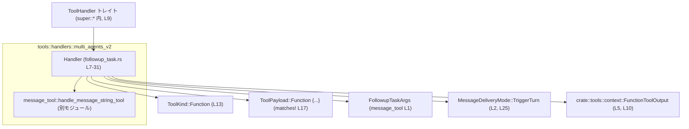
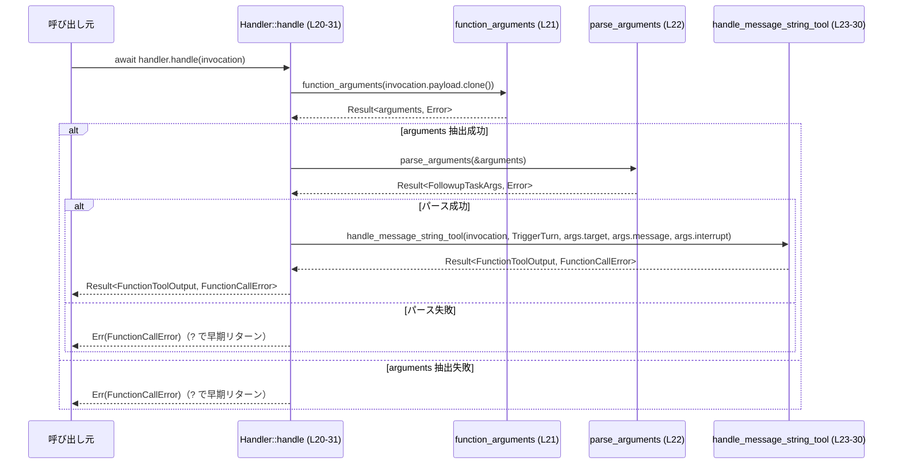
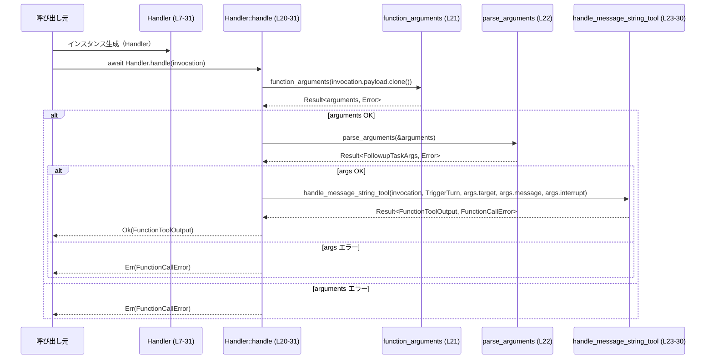

# core/src/tools/handlers/multi_agents_v2/followup_task.rs

## 0. ざっくり一言

`FollowupTask` ツールの呼び出しを処理するために、ツール呼び出しのペイロードをパースし、メッセージ送信用ユーティリティ `handle_message_string_tool` に委譲する非同期ハンドラを定義するファイルです（followup_task.rs:L7-31）。

---

## 1. このモジュールの役割

### 1.1 概要

- このモジュールは、ツール呼び出し（`ToolInvocation`）のうち「関数型（Function）」のペイロードを持つものを判別し、その中から `FollowupTaskArgs` を取り出して処理する役割を持ちます（followup_task.rs:L12-22）。
- 実際のメッセージ送信やタスク実行は、`super::message_tool::handle_message_string_tool` に委譲し、自身は「引数のパース」と「適切なモードでの委譲」を行う薄いアダプタとして設計されています（followup_task.rs:L21-30）。

### 1.2 アーキテクチャ内での位置づけ

このモジュールは、`multi_agents_v2` 系のツールハンドラ群の一部として、`ToolHandler` トレイトの実装を提供しています（followup_task.rs:L9-18）。  
外部からは `ToolInvocation` を受け取り、内部で `message_tool` モジュールに処理を委譲します。



※ `message_tool` や `ToolHandler` 等の定義本体はこのチャンクには含まれていません。

### 1.3 設計上のポイント

- **状態を持たないハンドラ**
  - `pub(crate) struct Handler;` としてフィールドなしのユニット構造体になっており（followup_task.rs:L7）、内部状態を保持しません。
  - `impl ToolHandler for Handler` ではメソッドはすべて `&self` を受け取るだけで、`self` のフィールド操作はありません（followup_task.rs:L9-31）。
- **ツール種別によるディスパッチ**
  - `kind()` はこのハンドラが扱うツール種別として `ToolKind::Function` を返します（followup_task.rs:L12-14）。
  - `matches_kind()` では `matches!` マクロを使い、ペイロードが `ToolPayload::Function { .. }` であるかどうかを判定します（followup_task.rs:L16-18）。
- **非同期処理とエラー伝播**
  - メイン処理である `handle()` は `async fn` として定義されており（followup_task.rs:L20）、`.await` によって `handle_message_string_tool` の完了を待ちます（followup_task.rs:L23-30）。
  - 引数パース処理 `function_arguments(...)` と `parse_arguments(...)` は `?` 演算子でエラーを呼び出し元へ伝播するようになっています（followup_task.rs:L21-22）。
- **責務の分割**
  - このハンドラ自体は Follow-up メッセージの文言や送信方法を実装せず、`FollowupTaskArgs` へのパースと `MessageDeliveryMode::TriggerTurn` の指定に責務を限定しています（followup_task.rs:L21-26）。

---

## 2. 主要な機能一覧

- FollowupTask 用ハンドラの種別報告: `Handler::kind` により、このハンドラが `ToolKind::Function` を扱うことを示します（followup_task.rs:L12-14）。
- 対象ペイロードの判定: `Handler::matches_kind` により、`ToolPayload::Function { .. }` のみを処理対象とします（followup_task.rs:L16-18）。
- Follow-up メッセージツールの実行:
  - `ToolInvocation` のペイロードから引数文字列を抽出（`function_arguments`）（followup_task.rs:L21）。
  - 引数文字列を `FollowupTaskArgs` にデコード（`parse_arguments`）（followup_task.rs:L22）。
  - `handle_message_string_tool` に `MessageDeliveryMode::TriggerTurn` と `FollowupTaskArgs` の各フィールドを渡し、実行結果（`FunctionToolOutput`）を返します（followup_task.rs:L23-30）。

---

## 3. 公開 API と詳細解説

### 3.1 型一覧（構造体・列挙体など）

#### 3.1.1 このファイルで定義されている型

| 名前 | 種別 | 役割 / 用途 | 可視性 | 定義位置 |
|------|------|-------------|--------|----------|
| `Handler` | 構造体（ユニット構造体） | `ToolHandler` トレイトを実装し、FollowupTask ツールを処理するハンドラ | `pub(crate)` | followup_task.rs:L7 |

`Handler` はフィールドを持たないため、インスタンス生成コストは非常に小さいことが推測できます。

#### 3.1.2 このファイルで使用している外部型・トレイト（定義は別ファイル）

| 名前 | 種別 | 役割 / 用途 | 定義位置（論理パス） |
|------|------|-------------|----------------------|
| `ToolHandler` | トレイト | ツールハンドラ共通のインターフェース。`kind`, `matches_kind`, `handle` を要求していると推測されますが、詳細は本チャンクにはありません。 | `super::*`（followup_task.rs:L9） |
| `ToolKind` | 列挙体と推測 | ツールの種別（Function など）を表現。`ToolKind::Function` が使用されています（followup_task.rs:L13）。 | `super::*` |
| `ToolPayload` | 列挙体と推測 | ツール呼び出しの具体的なペイロードを表す。`ToolPayload::Function { .. }` がパターンマッチで参照されています（followup_task.rs:L17）。 | `super::*` |
| `ToolInvocation` | 構造体と推測 | ツール呼び出しのコンテキストを表す。`payload` フィールドを持ち、`clone()` できることがコードから分かります（followup_task.rs:L21）。 | `super::*` |
| `FunctionCallError` | エラー型 | ツール実行時のエラーを表す戻り値型として使用されています（followup_task.rs:L20）。 | `super::*` |
| `FunctionToolOutput` | 構造体 | ツール実行結果（関数ツールの戻り値）を表す型として `Handler::Output` に指定されています（followup_task.rs:L5, L10）。 | `crate::tools::context` |
| `FollowupTaskArgs` | 構造体と推測 | Follow-up タスクのターゲットやメッセージなど、引数一式を保持する型。`target`, `message`, `interrupt` フィールドが存在することが分かります（followup_task.rs:L22, L26-28）。 | `super::message_tool`（followup_task.rs:L1） |
| `MessageDeliveryMode` | 列挙体と推測 | メッセージの配送モードを表す。`MessageDeliveryMode::TriggerTurn` が使用されています（followup_task.rs:L2, L25）。 | `super::message_tool` |

### 3.2 関数詳細

このファイルでは、`ToolHandler` トレイト実装の 3 メソッドが主要な API です。

---

#### `Handler::kind(&self) -> ToolKind`

**概要**

- このハンドラが扱うツールの種別を返します。ここでは常に `ToolKind::Function` を返します（followup_task.rs:L12-14）。

**引数**

| 引数名 | 型 | 説明 |
|--------|----|------|
| `&self` | `&Handler` | ハンドラ自身への参照。内部状態を持たないため、参照は読み取り専用です。 |

**戻り値**

- 型: `ToolKind`
- 意味: このハンドラが処理対象とするツールが「関数型」であることを示します（`ToolKind::Function`）。

**内部処理の流れ**

1. `ToolKind::Function` リテラルを返します（followup_task.rs:L13）。

※ 分岐やエラー処理はありません。

**Examples（使用例）**

```rust
// Handler が Function 種別を扱うことを確認する例
let handler = Handler;                         // ユニット構造体なのでそのまま生成できる（L7）
assert!(matches!(handler.kind(), ToolKind::Function)); // L12-14 の挙動
```

**Errors / Panics**

- このメソッドはエラーを返しません。
- panic を発生させるコードも含まれていません。

**Edge cases（エッジケース）**

- 特記すべきエッジケースはありません。常に同じ値を返します。

**使用上の注意点**

- `ToolKind` のバリアント構成が変更された場合でも、このメソッドは明示的に `ToolKind::Function` を返しているため、コードを更新しない限り振る舞いは変わりません。

---

#### `Handler::matches_kind(&self, payload: &ToolPayload) -> bool`

**概要**

- 与えられた `ToolPayload` が、このハンドラが扱うべき種別（`ToolPayload::Function { .. }`）かどうかを判定します（followup_task.rs:L16-18）。

**引数**

| 引数名 | 型 | 説明 |
|--------|----|------|
| `&self` | `&Handler` | ハンドラ自身への参照。状態は使いません。 |
| `payload` | `&ToolPayload` | 判定対象となるツールペイロードです。 |

**戻り値**

- 型: `bool`
- 意味: `payload` が `ToolPayload::Function { .. }` であれば `true`、それ以外であれば `false` を返します（followup_task.rs:L17）。

**内部処理の流れ**

1. `matches!` マクロを使い、`payload` が `ToolPayload::Function { .. }` であるかをパターンマッチします（followup_task.rs:L17）。
2. パターンにマッチすれば `true`、そうでなければ `false` が返されます。

**Examples（使用例）**

```rust
let handler = Handler;

// payload は実際には crate 側で構築される ToolPayload を想定しています。
fn is_followup_target(handler: &Handler, payload: &ToolPayload) -> bool {
    handler.matches_kind(payload)  // L16-18
}
```

**Errors / Panics**

- エラー型は使用しておらず、panic を発生させるコードもありません。
- `matches!` マクロは単なるパターンマッチであり、ここでは安全に使用されています。

**Edge cases（エッジケース）**

- `ToolPayload::Function { .. }` 以外のすべてのバリアントで `false` となります。
- `payload` がどのような内部状態であっても、パターンが一致しない限り `false` であり、内部データを参照しないためパニック条件はありません。

**使用上の注意点**

- `handle()` を呼ぶ前にこのメソッドで対象かどうかを判定しておくと、ペイロード種別のミスマッチによるパースエラーの発生を抑えられる可能性があります。
- ただし、実際に `handle()` が前提とするペイロード構造がどこまで厳密かは `function_arguments` の実装に依存し、このチャンクからは不明です。

---

#### `Handler::handle(&self, invocation: ToolInvocation) -> Result<FunctionToolOutput, FunctionCallError>`

> 実際のシグネチャは `async fn handle(&self, invocation: ToolInvocation) -> Result<Self::Output, FunctionCallError>` であり、`Self::Output` は `FunctionToolOutput` に束縛されています（followup_task.rs:L9-10, L20）。

**概要**

- Follow-up 関数ツールの呼び出しを処理するメインのハンドラです。
- `ToolInvocation` から引数を抽出し `FollowupTaskArgs` に変換したうえで、`handle_message_string_tool` に処理を委譲し、その結果を返します（followup_task.rs:L21-30）。

**引数**

| 引数名 | 型 | 説明 |
|--------|----|------|
| `&self` | `&Handler` | ハンドラ自身への参照。状態は使いません。 |
| `invocation` | `ToolInvocation` | 実行するツール呼び出しのコンテキスト。少なくとも `payload` フィールドを持ち、`Clone` 可能です（followup_task.rs:L21）。 |

**戻り値**

- 型: `Result<FunctionToolOutput, FunctionCallError>`
- 意味:
  - `Ok(FunctionToolOutput)` — Follow-up ツールの実行が成功し、結果（ツールの戻り値）が得られた状態。
  - `Err(FunctionCallError)` — 引数パースや実行処理のどこかでエラーが発生した状態。

**内部処理の流れ（アルゴリズム）**

1. **引数文字列の抽出**（followup_task.rs:L21）
   - `invocation.payload.clone()` に対して `function_arguments(...)` を呼び出し、ツール引数を表す文字列（またはそれに類する型）を取得します。
   - ここでエラーが発生した場合は `?` により即座に `Err(FunctionCallError)` として呼び出し元に返ります。

2. **FollowupTaskArgs へのパース**（followup_task.rs:L22）
   - 抽出された `arguments` を `parse_arguments(&arguments)` に渡し、`FollowupTaskArgs` 型にパースします。
   - ここでもエラーが発生した場合は `?` により即座にエラーが返されます。

3. **メッセージツールへの委譲**（followup_task.rs:L23-30）
   - `handle_message_string_tool` を以下の引数で呼び出します（followup_task.rs:L23-28）。
     - `invocation`（元の `ToolInvocation`）
     - `MessageDeliveryMode::TriggerTurn`
     - `args.target`
     - `args.message`
     - `args.interrupt`
   - `handle_message_string_tool` は `async` 関数（もしくは `Future` を返す関数）であり、その `await` 結果が `Handler::handle` の戻り値となります（followup_task.rs:L30）。

**処理フロー図（handle, L20-31）**



**Examples（使用例）**

```rust
use crate::tools::handlers::multi_agents_v2::followup_task::Handler;
use crate::tools::context::FunctionToolOutput;
// ToolInvocation と FunctionCallError は crate 内に定義されている前提

async fn run_followup(invocation: ToolInvocation) -> Result<FunctionToolOutput, FunctionCallError> {
    let handler = Handler;                  // 状態を持たないハンドラ（L7）
    // ここでは matches_kind チェックを省略して直接 handle を呼んでいる
    handler.handle(invocation).await        // 非同期で followup を実行（L20-31）
}
```

※ `ToolInvocation` の具体的な構築方法はこのチャンクからは分からないため省略しています。

**Errors / Panics**

- この関数は `Result` を返す形でエラー処理を行います。
- エラーが発生しうるポイント:
  - `function_arguments(...)` の内部（引数形式が不正、ペイロード種別不一致など）（followup_task.rs:L21）。
  - `parse_arguments(...)` の内部（JSON やシリアライズ形式の不整合など）（followup_task.rs:L22）。
  - `handle_message_string_tool(...)` の内部（メッセージ送信失敗など）（followup_task.rs:L23-30）。
- いずれも `?` 演算子または `await` 結果を通じて `FunctionCallError` によって呼び出し元に伝播します。
- この関数内で `panic!` や `unwrap` などは使用されておらず、明示的な panic はありません。

**Edge cases（エッジケース）**

- **ペイロード種別が Function ではない場合**
  - `ToolInvocation` の `payload` が `ToolPayload::Function { .. }` 以外の場合、`function_arguments` がどのように振る舞うかはこのチャンクからは不明です。
  - 一般には `matches_kind()` が `false` となるため、呼び出し側で事前にフィルタすることが想定されます（followup_task.rs:L17）。
- **引数が空または不正な形式**
  - `arguments` が空文字列であったり、`FollowupTaskArgs` としてパースできない形式である場合、`parse_arguments` がエラーを返すと考えられます（followup_task.rs:L22）。
- **メッセージ配送のモード**
  - `MessageDeliveryMode::TriggerTurn` 固定で呼び出すため、他のモード（たとえば即時送信やバッチ送信など）が必要な場合は、この実装では対応できません（followup_task.rs:L25）。

**使用上の注意点**

- **非同期コンテキスト必須**
  - `handle` は `async fn` のため、`tokio` などの非同期ランタイム内、あるいは他の `async fn` の中で `.await` 付きで呼び出す必要があります。
- **matches_kind との組み合わせ**
  - `handle` を呼び出す前に `matches_kind` でペイロード種別を確認しておくと、想定外のペイロードによるエラーを避けられる可能性があります。
- **引数の契約**
  - `FollowupTaskArgs` に含まれる `target`, `message`, `interrupt` の意味や制約は `message_tool` 側の実装に依存しており、このチャンクからは分かりません。
- **並行性・安全性**
  - `Handler` は状態を持たないユニット構造体であり、`&self` のみを受け取るため、複数の非同期タスクから同時に呼び出しても内部状態の競合は発生しません（followup_task.rs:L7, L20）。
  - `unsafe` ブロックは一切使用されておらず、メモリ安全性は Rust の所有権システムに委ねられています。

---

### 3.3 その他の関数・コンポーネント一覧（インベントリー）

このファイルには、上記 3 メソッド以外の自前関数定義はありませんが、外部関数・マクロを利用しています。

#### メソッド・関数一覧

| 名称 | 種別 | 役割 | 定義位置 |
|------|------|------|----------|
| `Handler::kind` | メソッド | ハンドラのツール種別を返す | followup_task.rs:L12-14 |
| `Handler::matches_kind` | メソッド | ペイロードが Function 型かどうかを判定 | followup_task.rs:L16-18 |
| `Handler::handle` | 非同期メソッド | Follow-up タスクを実行し、結果を返す | followup_task.rs:L20-31 |

#### 利用している外部関数・マクロ

| 名称 | 種別 | 用途 | 呼び出し位置 | 定義状況 |
|------|------|------|-------------|----------|
| `function_arguments` | 関数 | `ToolInvocation.payload` から引数文字列を抽出する | followup_task.rs:L21 | このチャンクには定義がありません |
| `parse_arguments` | 関数 | 引数文字列を `FollowupTaskArgs` にパースする | followup_task.rs:L22 | このチャンクには定義がありません |
| `handle_message_string_tool` | 非同期関数 | メッセージ送信処理の本体を実行 | followup_task.rs:L23-30 | `super::message_tool` に定義 |
| `matches!` | マクロ | `ToolPayload` のバリアント判定 | followup_task.rs:L17 | Rust 標準マクロ |

---

## 4. データフロー

ここでは `Handler::handle` を使った代表的な処理フローを示します。

### 4.1 処理の要点

1. 呼び出し元は `ToolInvocation` を用意し、`Handler::handle` を `await` します。
2. `Handler::handle` は `invocation.payload` をクローンし、そこからツール引数を抽出します（followup_task.rs:L21）。
3. 抽出された引数を `FollowupTaskArgs` にパースします（followup_task.rs:L22）。
4. 元の `invocation` と `FollowupTaskArgs` の各フィールド、`MessageDeliveryMode::TriggerTurn` を用いて `handle_message_string_tool` を呼び出します（followup_task.rs:L23-28）。
5. `handle_message_string_tool` の非同期結果が、そのまま `Handler::handle` の戻り値として返されます（followup_task.rs:L30-31）。

### 4.2 シーケンス図（Handler::handle, L20-31）



---

## 5. 使い方（How to Use）

### 5.1 基本的な使用方法

`Handler` を使って Follow-up タスクを実行する最も単純な流れです。

```rust
use crate::tools::handlers::multi_agents_v2::followup_task::Handler;
use crate::tools::context::FunctionToolOutput;
// ToolInvocation, FunctionCallError, ToolPayload などは crate 内で定義されている前提

async fn run(invocation: ToolInvocation) -> Result<FunctionToolOutput, FunctionCallError> {
    let handler = Handler;                     // ユニット構造体（L7）

    // 本来は matches_kind で対象かどうかを確認するのが安全
    // if handler.matches_kind(&invocation.payload) { ... }

    let result = handler.handle(invocation).await?;  // 非同期実行（L20-31）
    Ok(result)
}
```

ポイント:

- `Handler` は構造体リテラル（`Handler`）だけで生成できます（followup_task.rs:L7）。
- `handle` は `async` なので `.await` が必須です（followup_task.rs:L20, L30）。

### 5.2 よくある使用パターン

#### パターン 1: ペイロード種別でフィルタしてから handle を呼ぶ

`matches_kind` で `ToolPayload::Function { .. }` かどうかを確認してから `handle` を呼び出すパターンです。

```rust
async fn dispatch(handler: &Handler, invocation: ToolInvocation) -> Result<Option<FunctionToolOutput>, FunctionCallError> {
    // ToolInvocation が payload フィールドを持つことはコードから分かります（L21）
    let payload_ref: &ToolPayload = &invocation.payload;

    if !handler.matches_kind(payload_ref) {    // L16-18
        return Ok(None);                       // 対象外なら何もしない
    }

    let output = handler.handle(invocation).await?; // L20-31
    Ok(Some(output))
}
```

※ 上記は典型的なディスパッチの一例であり、実際の呼び出し方はこのチャンクからは確認できません。

### 5.3 よくある間違い

想定される誤用と、その修正例です。

#### 間違い例 1: `.await` を付けずに handle を呼ぶ

```rust
// 間違い例（コンパイルエラーになる）
// 非 async コンテキストから呼び出している、あるいは .await を忘れている
fn wrong(invocation: ToolInvocation) {
    let handler = Handler;
    let _future = handler.handle(invocation);  // Future 型が返り、そのままでは実行されない（L20）
}
```

```rust
// 正しい例: async 関数内で .await を付ける
async fn correct(invocation: ToolInvocation) -> Result<FunctionToolOutput, FunctionCallError> {
    let handler = Handler;
    handler.handle(invocation).await           // 実際に非同期処理を実行（L20-31）
}
```

#### 間違い例 2: ペイロード種別を確認せずに handle を呼ぶ

```rust
// 省略可能ではあるが、payload が Function 以外の場合にエラーが増える可能性がある
async fn maybe_wrong(invocation: ToolInvocation) -> Result<FunctionToolOutput, FunctionCallError> {
    let handler = Handler;
    // payload が Function とは限らない状況で直接 handle を呼んでいる
    handler.handle(invocation).await           // function_arguments 内でエラーになる可能性（L21）
}
```

```rust
// より安全な例: matches_kind でフィルタリング
async fn safer(invocation: ToolInvocation) -> Result<Option<FunctionToolOutput>, FunctionCallError> {
    let handler = Handler;
    if !handler.matches_kind(&invocation.payload) { // L16-18
        return Ok(None);
    }
    let out = handler.handle(invocation).await?;
    Ok(Some(out))
}
```

### 5.4 使用上の注意点（まとめ）

- **非同期ランタイムが必要**
  - `handle` は `async fn` なので、`tokio` などのランタイム上で実行する必要があります（followup_task.rs:L20）。
- **ペイロードの整合性**
  - `function_arguments` や `parse_arguments` によるパース処理は、`ToolInvocation.payload` の形式に依存します（followup_task.rs:L21-22）。
  - `matches_kind` で `ToolPayload::Function { .. }` であることを確認したうえで `handle` を呼ぶことが推奨されます。
- **エラー処理**
  - `Result` の `Err` を無視せず、呼び出し元で適切にログ出力やリトライ戦略を検討する必要があります。
- **セキュリティ観点**
  - `message`, `target` などの文字列は、外部入力や他エージェントからのデータである可能性がありますが、このチャンクからは詳細が分かりません。
  - それらをどのように利用するか（例えば外部サービスへの送信やコマンド実行など）は `message_tool` 側の実装に依存するため、そちらでの検証・サニタイズが重要です。

---

## 6. 変更の仕方（How to Modify）

### 6.1 新しい機能を追加する場合

Follow-up タスクの仕様変更や拡張を行う際、このファイルで調整すべきポイントです。

1. **引数スキーマを変更したい場合**
   - `FollowupTaskArgs` にフィールドを追加・削除する場合、`message_tool` 側（`FollowupTaskArgs` 定義と `parse_arguments` 実装）が主な変更箇所です。
   - このファイルでは、必要に応じて `handle_message_string_tool` への引数として新フィールドを渡す処理を追加します（followup_task.rs:L23-28）。
2. **メッセージ配送モードを変えたい場合**
   - 現在は `MessageDeliveryMode::TriggerTurn` がハードコードされています（followup_task.rs:L25）。
   - 別のモードに切り替える、あるいは引数からモードを選べるようにする場合、ここで指定するバリアントを変更する、または `FollowupTaskArgs` にモード情報を追加して参照する必要があります。
3. **別種別の Follow-up ツールを増やしたい場合**
   - このファイルと同様のパターン（ユニット構造体 + `ToolHandler` 実装）で新しいハンドラを追加し、`kind` や `matches_kind` の条件を変更する設計が可能です。
   - 実際にどのように登録するかは `ToolHandler` を利用する上位モジュールに依存しますが、このチャンクにはコードが含まれていません。

### 6.2 既存の機能を変更する場合

変更時に注意すべき契約や影響範囲です。

- **`Handler::kind` の戻り値を変更する場合**
  - `ToolKind::Function` 以外を返すようにすると、上位のディスパッチロジックとの整合性が崩れる可能性があります（followup_task.rs:L12-14）。
  - 他のハンドラとの重複や、`ToolPayload` との整合性に注意する必要があります。
- **`matches_kind` の条件を変更する場合**
  - `ToolPayload::Function { .. }` 以外もマッチするようにする、あるいはより詳細な条件にする場合、`function_arguments` や `parse_arguments` がそのペイロードを正しく処理できるかを確認する必要があります（followup_task.rs:L16-18, L21-22）。
- **`handle` のシグネチャを変更する場合**
  - `ToolHandler` トレイトの定義と整合しなくなるため、基本的には許されません。
  - 返り値型（`FunctionToolOutput`）やエラー型（`FunctionCallError`）を変更する場合は、トレイト定義とその呼び出し側すべてを同時に更新する必要があります。
- **エラーハンドリングの強化**
  - 現状は `?` による単純な伝播のみですが（followup_task.rs:L21-22）、必要に応じてエラー内容をログに残したり、エラー種別に応じたリトライ戦略を挟むには、`function_arguments`/`parse_arguments` の呼び出し部分の周囲に追加ロジックを書くことになります。

---

## 7. 関連ファイル

このモジュールと密接に関係するモジュール（論理パス）です。実際のファイルパスは、Rust のモジュール規約から通常推測可能ですが、このチャンクには明示されていないため、モジュールパスのみを記載します。

| パス / モジュール | 役割 / 関係 |
|-------------------|------------|
| `crate::tools::handlers::multi_agents_v2::message_tool` | `FollowupTaskArgs`, `MessageDeliveryMode`, および `handle_message_string_tool` を提供し、本モジュールの実質的な処理本体を担うユーティリティです（followup_task.rs:L1-3, L23-28）。 |
| `crate::tools::handlers::multi_agents_v2`（`super::*`） | `ToolHandler`, `ToolKind`, `ToolPayload`, `ToolInvocation`, `FunctionCallError` などのトレイト・型定義を提供する上位モジュールです（followup_task.rs:L4, L9-20）。 |
| `crate::tools::context` | `FunctionToolOutput` 型を定義し、関数ツールの戻り値表現を提供します（followup_task.rs:L5, L10）。 |

このチャンクにはテストコード（`mod tests` など）は含まれていないため、どのようにテストされているかは分かりません。テストを追加する場合は、`Handler::handle` に対してモックした `ToolInvocation` を入力し、`FunctionToolOutput` や `FunctionCallError` の振る舞いを検証する形になると考えられます。
