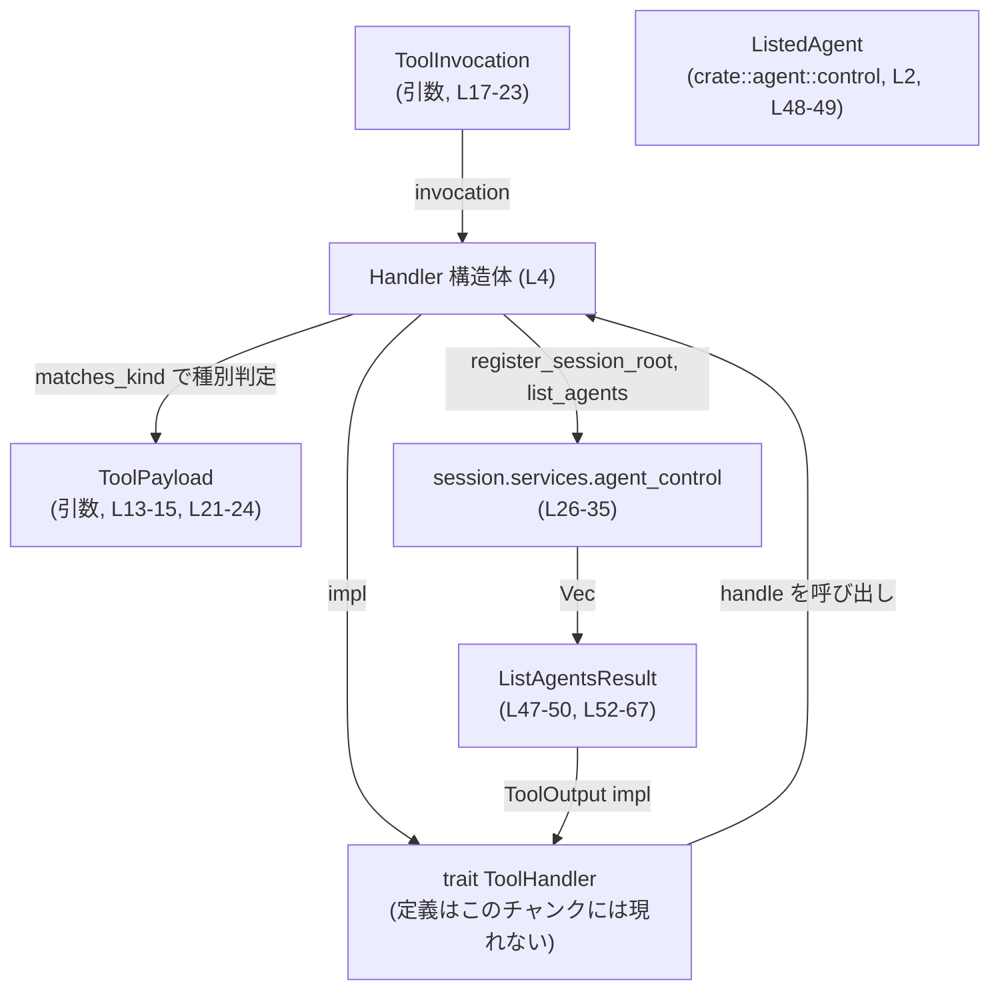
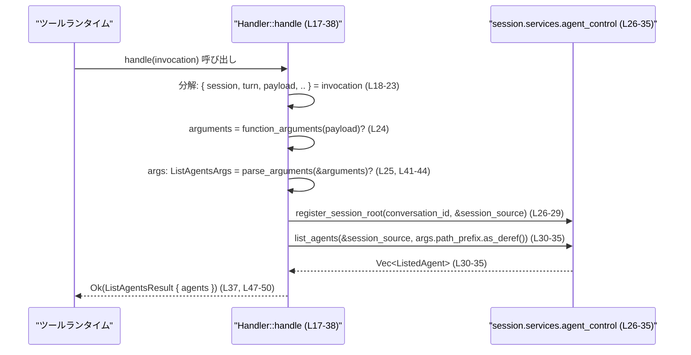

# core/src/tools/handlers/multi_agents_v2/list_agents.rs コード解説

## 0. ざっくり一言

multi_agents_v2 の「list_agents」ツール呼び出しを処理し、`agent_control.list_agents` の結果を `ListAgentsResult` としてツール出力形式に整えるハンドラです（`list_agents.rs:L4-38, L47-67`）。

---

## 1. このモジュールの役割

### 1.1 概要

- このモジュールは、ツール実行基盤から渡される `ToolInvocation` を受け取り、現在のセッションに紐づくエージェント一覧を取得して返す **ツールハンドラ** を提供します（`list_agents.rs:L4-38`）。
- 入力として任意の `path_prefix` を受け取り、それを `agent_control.list_agents` に渡してフィルタリングのパラメータとして利用します（`list_agents.rs:L25, L43-44, L30-35`）。
- 結果は `Vec<ListedAgent>` を含む `ListAgentsResult` として保持され、`ToolOutput` 実装を通じてログ用文字列やレスポンス構造に変換されます（`list_agents.rs:L47-67`）。

### 1.2 アーキテクチャ内での位置づけ

このモジュール内で確認できる依存関係を図示します。



- `ToolHandler`, `ToolInvocation`, `ToolPayload`, `ToolKind`, `FunctionCallError` などは `super::*` からインポートされると推測されますが、定義自体はこのチャンクには現れません（`list_agents.rs:L1, L6-7, L9, L13, L17, L37, L52, L61, L65`）。
- エージェント一覧の実体 `ListedAgent` は `crate::agent::control::ListedAgent` からインポートされています（`list_agents.rs:L2`）。

### 1.3 設計上のポイント

コードから読み取れる設計上の特徴は次のとおりです。

- **ステートレスなハンドラ**
  - `Handler` はフィールドを持たないゼロサイズ構造体です（`list_agents.rs:L4`）。
  - すべての状態は `ToolInvocation` 内の `session` や `turn` に依存しています（`list_agents.rs:L18-23`）。
- **非同期処理モデル**
  - メイン処理 `handle` は `async fn` で定義されており、内部で `agent_control.list_agents(...).await` を実行します（`list_agents.rs:L17, L30-35`）。
- **エラーハンドリング方針**
  - 引数取得・パースに `?` 演算子を用いて早期リターンする `Result` ベースのエラーハンドリングになっています（`list_agents.rs:L24-25`）。
  - 下位の `list_agents` からのエラーは `map_err(collab_spawn_error)?` により `FunctionCallError` に変換されます（`list_agents.rs:L30-35`）。
- **入力バリデーション**
  - 引数構造体 `ListAgentsArgs` は `#[serde(deny_unknown_fields)]` が付与されており、未知フィールドを含む入力を拒否する設定になっています（`list_agents.rs:L41-44`）。
- **出力の統一フォーマット**
  - `ListAgentsResult` は `ToolOutput` を実装し、共通のヘルパ関数群（`tool_output_json_text` など）でログ表示・レスポンス構造・コードモード出力を一元的に生成しています（`list_agents.rs:L52-67`）。

---

## 2. 主要な機能一覧

このモジュールが提供する主な機能です。

- Handler のツール種別の宣言: `kind` で `ToolKind::Function` を返す（`list_agents.rs:L9-11`）。
- ペイロード種別フィルタリング: `matches_kind` で `ToolPayload::Function` のみを対象とする（`list_agents.rs:L13-15`）。
- エージェント一覧取得処理: `handle` で `ToolInvocation` からセッション情報と引数を取り出し、`agent_control.list_agents` を呼び出して結果を返す（`list_agents.rs:L17-38`）。
- ツール出力のログ用プレビュー生成: `ListAgentsResult::log_preview`（`list_agents.rs:L52-55`）。
- ログ上の成功判定フラグ: `ListAgentsResult::success_for_logging`（`list_agents.rs:L57-59`）。
- クライアントへのレスポンスアイテム生成: `ListAgentsResult::to_response_item`（`list_agents.rs:L61-63`）。
- コードモード（おそらく開発者向け表示）の出力生成: `ListAgentsResult::code_mode_result`（`list_agents.rs:L65-67`）。

---

## 3. 公開 API と詳細解説

### 3.1 型一覧（構造体など）

#### 構造体インベントリー

| 名前 | 種別 | 公開範囲 | 役割 / 用途 | 定義位置 |
|------|------|----------|-------------|----------|
| `Handler` | 構造体（フィールドなし） | `pub(crate)` | `ToolHandler` を実装し、`list_agents` ツール呼び出しを処理するハンドラ | `list_agents.rs:L4` |
| `ListAgentsArgs` | 構造体 | 非公開（モジュール内） | ツール引数 `path_prefix` を保持する。`serde(deny_unknown_fields)` により未知フィールドは拒否 | `list_agents.rs:L41-45` |
| `ListAgentsResult` | 構造体 | `pub(crate)` | `Vec<ListedAgent>` を保持し、ツールの結果を表現する。`ToolOutput` を実装 | `list_agents.rs:L47-50` |

#### 関数 / メソッド インベントリー

| 関数名 | 所属 | シグネチャ（簡略） | 役割 | 定義位置 |
|--------|------|--------------------|------|----------|
| `kind` | `Handler` | `fn kind(&self) -> ToolKind` | ハンドラの種別を `ToolKind::Function` として報告 | `list_agents.rs:L9-11` |
| `matches_kind` | `Handler` | `fn matches_kind(&self, payload: &ToolPayload) -> bool` | ペイロードが `ToolPayload::Function` かを判定 | `list_agents.rs:L13-15` |
| `handle` | `Handler` | `async fn handle(&self, invocation: ToolInvocation) -> Result<ListAgentsResult, FunctionCallError>` | セッション情報と引数を元に `agent_control.list_agents` を呼び出し、結果を返す | `list_agents.rs:L17-38` |
| `log_preview` | `ListAgentsResult` | `fn log_preview(&self) -> String` | 結果のログ用プレビュー文字列を生成 | `list_agents.rs:L52-55` |
| `success_for_logging` | `ListAgentsResult` | `fn success_for_logging(&self) -> bool` | ログ上の成功フラグとして常に `true` を返す | `list_agents.rs:L57-59` |
| `to_response_item` | `ListAgentsResult` | `fn to_response_item(&self, call_id: &str, payload: &ToolPayload) -> ResponseInputItem` | クライアント向けレスポンス構造体を生成 | `list_agents.rs:L61-63` |
| `code_mode_result` | `ListAgentsResult` | `fn code_mode_result(&self, _payload: &ToolPayload) -> JsonValue` | コードモード向け JSON 出力を生成 | `list_agents.rs:L65-67` |

### 3.2 関数詳細

#### 3.2.1 `Handler::handle(invocation: ToolInvocation) -> Result<ListAgentsResult, FunctionCallError>`

```rust
impl ToolHandler for Handler {
    async fn handle(&self, invocation: ToolInvocation) -> Result<Self::Output, FunctionCallError> {
        let ToolInvocation {
            session,
            turn,
            payload,
            ..
        } = invocation;
        let arguments = function_arguments(payload)?;
        let args: ListAgentsArgs = parse_arguments(&arguments)?;
        session
            .services
            .agent_control
            .register_session_root(session.conversation_id, &turn.session_source);
        let agents = session
            .services
            .agent_control
            .list_agents(&turn.session_source, args.path_prefix.as_deref())
            .await
            .map_err(collab_spawn_error)?;

        Ok(ListAgentsResult { agents })
    }
}
```

（`list_agents.rs:L6-7, L17-38`）

**概要**

- `ToolInvocation` からセッション (`session`)、ターン情報 (`turn`)、ペイロード (`payload`) を受け取り、ツール引数をパースして `agent_control.list_agents` を呼び出し、その結果を `ListAgentsResult` として返します。
- 非同期関数であり、`list_agents(...).await` により非同期にエージェント一覧を取得します。

**引数**

| 引数名 | 型 | 説明 |
|--------|----|------|
| `&self` | `&Handler` | ステートレスなハンドラインスタンスへの参照。内部状態は持たない（`list_agents.rs:L4`）。 |
| `invocation` | `ToolInvocation` | 呼び出しコンテキスト。`session`, `turn`, `payload` などを含む構造体で、このチャンクではフィールド定義は不明（`list_agents.rs:L18-23`）。 |

**戻り値**

- `Result<ListAgentsResult, FunctionCallError>`（`list_agents.rs:L7, L17, L37`）
  - `Ok(ListAgentsResult)` : エージェント一覧取得に成功した場合。`agents: Vec<ListedAgent>` を含む（`list_agents.rs:L30-35, L47-50, L37`）。
  - `Err(FunctionCallError)` : 引数の取得・パース、または `list_agents` 呼び出しが失敗した場合。具体的なエラー種別はこのチャンクには現れません。

**内部処理の流れ**

1. **invocation の分解**  
   `ToolInvocation { session, turn, payload, .. } = invocation;` で各フィールドをローカル変数にムーブします（`list_agents.rs:L18-23`）。  
   Rust の所有権モデル上、ここで `invocation` の所有権は消費され、以降 `invocation` 自体は使われません。

2. **引数文字列の取得**  
   `function_arguments(payload)?;` により、`payload` からツール引数（おそらくシリアライズされた文字列または構造）を抽出します（`list_agents.rs:L24`）。  
   - `?` によりエラー時は即座に `Err(FunctionCallError)` で関数から戻ります。

3. **引数のパース**  
   `let args: ListAgentsArgs = parse_arguments(&arguments)?;` で `arguments` を `ListAgentsArgs` 型にパースします（`list_agents.rs:L25`）。  
   - `ListAgentsArgs` は `Deserialize` と `#[serde(deny_unknown_fields)]` を持つため、不正なフィールド構造はパース時にエラーとなります（`list_agents.rs:L41-44`）。

4. **セッションルートの登録**  
   `session.services.agent_control.register_session_root(session.conversation_id, &turn.session_source);` を呼び出し、現在のセッションをエージェント制御側に登録します（`list_agents.rs:L26-29`）。  
   - 戻り値型はこのチャンクには現れず、エラーハンドリングの有無も不明です。

5. **エージェント一覧の取得**  

   ```rust
   let agents = session
       .services
       .agent_control
       .list_agents(&turn.session_source, args.path_prefix.as_deref())
       .await
       .map_err(collab_spawn_error)?;
   ```

   （`list_agents.rs:L30-35`）  
   - `args.path_prefix.as_deref()` により `Option<String>` を `Option<&str>` に変換して渡しています（`list_agents.rs:L43-44`）。
   - 非同期メソッド（推測）`list_agents` を `.await` して結果を受け取ります。
   - 失敗時は `map_err(collab_spawn_error)?` により、下位エラーを `FunctionCallError` に変換した上で早期リターンします。

6. **結果のラップと返却**  
   `Ok(ListAgentsResult { agents })` により、取得した `Vec<ListedAgent>` を `ListAgentsResult` に包んで返します（`list_agents.rs:L37, L47-50`）。

**Examples（使用例）**

このチャンクには `ToolInvocation` の構築方法が現れないため、実行可能な完全例にはなりませんが、`Handler` の呼び出し方法イメージを示します。

```rust
// Handler のインスタンスを用意する（フィールドがないのでそのまま生成できる）
let handler = Handler; // list_agents.rs:L4

// どこかで構築された ToolInvocation を用意する（定義はこのチャンクには現れない）
let invocation: ToolInvocation = /* ... */;

// 非同期コンテキストで handle を呼び出す
let result: Result<ListAgentsResult, FunctionCallError> =
    handler.handle(invocation).await?;
```

- 上記コードは `ToolInvocation` や `FunctionCallError` の定義が別モジュールにあるため、このファイル単体ではコンパイルできません。

**Errors / Panics**

- `function_arguments(payload)` がエラーを返した場合、`?` により即座に `Err(FunctionCallError)` として上位に伝搬します（`list_agents.rs:L24`）。
- `parse_arguments(&arguments)` がエラーを返した場合も同様です（`list_agents.rs:L25`）。
- `list_agents(...).await` がエラーを返した場合、`map_err(collab_spawn_error)?` で `FunctionCallError` に変換して返します（`list_agents.rs:L30-35`）。
- `collab_spawn_error` 自体や `list_agents` のエラー種別・内容はこのチャンクには現れません。
- 明示的な `panic!` 呼び出しや `unwrap` / `expect` は存在しません（ファイル全体）。

**Edge cases（エッジケース）**

- **引数なし / 不正引数**  
  - 引数フォーマットが不正な場合や、`serde(deny_unknown_fields)` に反する未知フィールドを含む場合には、`parse_arguments::<ListAgentsArgs>` が失敗すると考えられます（`list_agents.rs:L25, L41-44`）。
- **`path_prefix: None` の場合**  
  - `args.path_prefix.as_deref()` は `None` を返し、そのまま `list_agents` に渡されます（`list_agents.rs:L30-35, L43-44`）。  
  - `None` がどのように解釈されるか（全件取得なのか、特定の扱いなのか）は `list_agents` の実装がこのチャンクには現れないため不明です。
- **エージェントが 0 件の場合**  
  - `list_agents` が空の `Vec<ListedAgent>` を返した場合でも、そのまま `ListAgentsResult { agents }` に格納されるため、空配列として返却されます（`list_agents.rs:L37, L47-50`）。

**使用上の注意点**

- この関数は `ToolInvocation` の `payload` が `ToolPayload::Function` であることを前提としているように見えます。`matches_kind` で事前にフィルタされる設計になっているため、上位レイヤーでは `matches_kind` を尊重する必要があります（`list_agents.rs:L13-15, L17-24`）。  
  （ただし実際にそのように呼び出されているかは、このチャンクには現れません。）
- `register_session_root` の戻り値を無視しています（`list_agents.rs:L26-29`）。  
  - もしこのメソッドが `Result` を返す設計であれば、エラーを握りつぶしている可能性がありますが、戻り値型はこのチャンクには現れません。
- 非同期処理のため、呼び出し側は `async` コンテキストで `.await` する必要があります（`list_agents.rs:L17, L30-35`）。

---

#### 3.2.2 `Handler::kind(&self) -> ToolKind`

```rust
fn kind(&self) -> ToolKind {
    ToolKind::Function
}
```

（`list_agents.rs:L9-11`）

**概要**

- このハンドラが扱うツール種別を `ToolKind::Function` として返します。

**引数**

| 引数名 | 型 | 説明 |
|--------|----|------|
| `&self` | `&Handler` | ハンドラインスタンスへの参照。内部状態は参照されません。 |

**戻り値**

- `ToolKind` : 常に `ToolKind::Function` を返します（`list_agents.rs:L10`）。

**内部処理**

- 定数値 `ToolKind::Function` を返すだけのシンプルな実装です。

**Errors / Panics / Edge cases**

- エラーやパニックの可能性はありません（戻り値が列挙体の定数であり、外部呼び出しもありません）。

**使用上の注意点**

- 特筆すべき注意点はありません。`ToolHandler` 実装の一部として、ランタイム側のディスパッチに使われる前提と思われますが、詳細はこのチャンクには現れません。

---

#### 3.2.3 `Handler::matches_kind(&self, payload: &ToolPayload) -> bool`

```rust
fn matches_kind(&self, payload: &ToolPayload) -> bool {
    matches!(payload, ToolPayload::Function { .. })
}
```

（`list_agents.rs:L13-15`）

**概要**

- 渡された `ToolPayload` が `Function` バリアントであるかどうかを判定します。

**引数**

| 引数名 | 型 | 説明 |
|--------|----|------|
| `&self` | `&Handler` | ハンドラインスタンスへの参照。内部状態は利用しません。 |
| `payload` | `&ToolPayload` | 判定対象のペイロード。定義はこのチャンクには現れません。 |

**戻り値**

- `bool` : `payload` が `ToolPayload::Function { .. }` の場合に `true`、それ以外は `false` です（`list_agents.rs:L14`）。

**内部処理**

- `matches!` マクロでパターンマッチングを行い、`Function` バリアントであるかを判定しています（`list_agents.rs:L14`）。

**Errors / Panics / Edge cases**

- パターンマッチングのみであり、エラー・パニックの可能性はありません。
- `payload` がどのような他バリアントを持つかは、このチャンクには現れません。

**使用上の注意点**

- 上位レイヤーで、`matches_kind` が `true` を返した場合のみ `handle` を呼び出す、というディスパッチパターンが想定されます（設計上の一般的なパターンであり、このチャンクから直接は分かりません）。

---

#### 3.2.4 `ListAgentsResult::log_preview(&self) -> String`

```rust
fn log_preview(&self) -> String {
    tool_output_json_text(self, "list_agents")
}
```

（`list_agents.rs:L52-55`）

**概要**

- 結果オブジェクトをログ向けのプレビュー文字列に変換します。

**引数**

| 引数名 | 型 | 説明 |
|--------|----|------|
| `&self` | `&ListAgentsResult` | `agents: Vec<ListedAgent>` を含む結果オブジェクト（`list_agents.rs:L47-50`）。 |

**戻り値**

- `String` : ログ出力向けの JSON などのテキスト表現（`tool_output_json_text` の仕様に依存し、このチャンクでは詳細不明）。

**内部処理**

- 共通ヘルパ関数 `tool_output_json_text(self, "list_agents")` を呼び出すだけのラッパーです（`list_agents.rs:L54`）。

**Errors / Panics**

- `tool_output_json_text` の実装がこのチャンクには現れないため、そこでのパニック可能性やエラー条件は不明です。
- この関数自体は `Result` を返さないため、エラーはパニックとして扱われる設計である可能性があります（推測であり、コードから断定はできません）。

**Edge cases**

- `self.agents` が空のベクタでも、そのままシリアライズされると考えられますが、実際の表現形式はヘルパ関数に依存します。

**使用上の注意点**

- ログ用であり、ユーザー向けレスポンスとは別の用途で使われます。`ToolOutput` の一部としてランタイムから自動的に呼び出される設計と読めます。

---

#### 3.2.5 `ListAgentsResult::success_for_logging(&self) -> bool`

```rust
fn success_for_logging(&self) -> bool {
    true
}
```

（`list_agents.rs:L57-59`）

**概要**

- ログ上の「成功フラグ」として常に `true` を返します。

**戻り値**

- `bool` : 常に `true`（`list_agents.rs:L58`）。

**Errors / Edge cases**

- エラーやエッジケースはありません。

**使用上の注意点**

- この実装では、`ListAgentsResult` が生成されている時点で成功とみなし、失敗ケースは `FunctionCallError` として `Result::Err` で表現する設計になっていると解釈できます（`list_agents.rs:L17-18, L37, L57-59`）。  
  ただしログの利用方法はこのチャンクには現れません。

---

#### 3.2.6 `ListAgentsResult::to_response_item(&self, call_id: &str, payload: &ToolPayload) -> ResponseInputItem`

```rust
fn to_response_item(&self, call_id: &str, payload: &ToolPayload) -> ResponseInputItem {
    tool_output_response_item(call_id, payload, self, Some(true), "list_agents")
}
```

（`list_agents.rs:L61-63`）

**概要**

- `ListAgentsResult` をクライアント向けのレスポンス構造 `ResponseInputItem` に変換します。

**引数**

| 引数名 | 型 | 説明 |
|--------|----|------|
| `&self` | `&ListAgentsResult` | 変換対象の結果データ。 |
| `call_id` | `&str` | 呼び出し識別子。ツール呼び出しとの対応付けに利用されると考えられます。 |
| `payload` | `&ToolPayload` | 元のペイロード。レスポンスにも一部情報が反映される可能性があります。 |

**戻り値**

- `ResponseInputItem` : ツール結果を含むレスポンスオブジェクト。型定義はこのチャンクには現れません。

**内部処理**

- 共通ヘルパ `tool_output_response_item` にすべてを委譲しています（`list_agents.rs:L62`）。

**Errors / Panics / Edge cases**

- この関数自体は `Result` を返しません。
- `tool_output_response_item` の挙動（パニック条件やフォーマット仕様）はこのチャンクには現れません。

**使用上の注意点**

- `"list_agents"` という固定のツール名文字列を渡しています（`list_agents.rs:L62`）。  
  ツール名を変更する場合はこの文字列と関連箇所を同期させる必要があります。

---

#### 3.2.7 `ListAgentsResult::code_mode_result(&self, _payload: &ToolPayload) -> JsonValue`

```rust
fn code_mode_result(&self, _payload: &ToolPayload) -> JsonValue {
    tool_output_code_mode_result(self, "list_agents")
}
```

（`list_agents.rs:L65-67`）

**概要**

- 開発者向けの「コードモード」表示などに用いる JSON 値を生成します。

**引数**

| 引数名 | 型 | 説明 |
|--------|----|------|
| `&self` | `&ListAgentsResult` | 変換対象の結果データ。 |
| `_payload` | `&ToolPayload` | 未使用引数。将来の拡張やインターフェース整合のために存在すると考えられます。 |

**戻り値**

- `JsonValue` : コードモード向けの JSON 表現。具体的な型（例: `serde_json::Value` 相当かどうか）はこのチャンクには現れません。

**内部処理**

- `tool_output_code_mode_result(self, "list_agents")` を呼び出すラッパです（`list_agents.rs:L66`）。

**Errors / Panics / Edge cases**

- エラー処理は行っておらず、パニック可能性の有無はヘルパ関数次第です。

**使用上の注意点**

- こちらも `"list_agents"` というツール名文字列に依存しています。名称変更時は同期が必要です。

---

### 3.3 その他の関数

- このファイルに存在する関数はすべて上記 7 件であり、補助的なトップレベル関数は存在しません。

---

## 4. データフロー

ここでは `Handler::handle` を中心としたデータフローを説明します。

### 4.1 処理の要点

- 入力: `ToolInvocation`（`session`, `turn`, `payload` を含む）。（`list_agents.rs:L17-23`）
- 中間処理:
  - `payload` から引数文字列（等）を抽出 (`function_arguments`)（`list_agents.rs:L24`）。
  - それを `ListAgentsArgs { path_prefix }` にパース (`parse_arguments`)（`list_agents.rs:L25, L41-44`）。
  - セッションを `agent_control.register_session_root` に登録（`list_agents.rs:L26-29`）。
- 出力取得: `agent_control.list_agents(session_source, path_prefix)` で `Vec<ListedAgent>` を取得（`list_agents.rs:L30-35`）。
- 結果: `ListAgentsResult { agents }` として `Result::Ok` に包んで返却（`list_agents.rs:L37, L47-50`）。

### 4.2 シーケンス図（`Handler::handle (L17-38)`）



- エラーが発生した場合 (`function_arguments`, `parse_arguments`, `list_agents` のいずれか)、その時点で `FunctionCallError` を `Err` として返し、以降のステップには進みません（`list_agents.rs:L24-25, L30-35`）。

---

## 5. 使い方（How to Use）

### 5.1 基本的な使用方法

このファイル単体では `ToolInvocation` やランタイムの定義がないため擬似コードになりますが、典型的なフローは次のようになります。

```rust
// Handler を生成（フィールドがないので値そのものを使う）
let handler = Handler; // list_agents.rs:L4

// どこかで構築された ToolInvocation（session, turn, payload を含む）
let invocation: ToolInvocation = /* ランタイム側で構築 */;

// 非同期コンテキストで list_agents ツールを実行
let result: Result<ListAgentsResult, FunctionCallError> =
    handler.handle(invocation).await;

// 成功時は agents に Vec<ListedAgent> が入る
if let Ok(list_agents_result) = result {
    // list_agents_result.agents へのアクセスには、このチャンクでは可視性がないため、
    // 同一モジュール or pub フィールドかどうかを別途確認する必要があります。
}
```

- `ListAgentsResult` のフィールド `agents` は `pub(crate)` 構造体の非 `pub` フィールドであるため、このモジュール外から直接アクセス可能かどうかはクレート内のモジュール構成に依存します（`list_agents.rs:L47-50`）。

### 5.2 よくある使用パターン

**`path_prefix` あり / なしの呼び分け**

- このチャンクには引数の具体的フォーマット（JSON など）は現れませんが、`ListAgentsArgs` に `path_prefix: Option<String>` が 1 つだけ定義されていることから（`list_agents.rs:L43-44`）、
  - `path_prefix` を省略 → `None` として扱われる
  - `path_prefix` を指定 → `Some(String)` として扱われる  
  という 2 パターンが想定されます。

引数の生成自体は `parse_arguments` の仕様に依存し、このチャンクには現れないため、具体的なコード例は示せません。

### 5.3 よくある間違い（推測されるもの）

コードから推測できる誤用パターンを挙げます（いずれも、このチャンク以外の実装に依存するため「起こりうる可能性」として記述します）。

```rust
// （誤りの可能性）matches_kind を無視して handle に異なる種別の payload を渡す
let handler = Handler;
let invocation: ToolInvocation = /* Function 以外のペイロードを含む */;
// handler.handle(invocation).await; // function_arguments 内部でエラーになるかは不明

// （望ましいと思われるパターン）
let payload: ToolPayload = /* ... */;
if handler.matches_kind(&payload) { // list_agents.rs:L13-15
    // matches_kind が true の場合のみ invocation を構築して handle を呼び出す
}
```

- 実際にこのようなディスパッチが行われているかどうかは、このチャンクには現れません。

### 5.4 使用上の注意点（まとめ）

- **入力契約**  
  - 引数構造 `ListAgentsArgs` に `#[serde(deny_unknown_fields)]` が付いているため、想定外のフィールドを含む入力はパースエラーになります（`list_agents.rs:L41-44`）。
- **エラー伝搬**  
  - 引数抽出・パース・`list_agents` 呼び出しで発生したエラーはすべて `FunctionCallError` として `Err` で返されます（`list_agents.rs:L24-25, L30-35`）。呼び出し側は必ず `Result` を処理する必要があります。
- **並行性**  
  - `Handler` は状態を持たず、`handle` は `&self` のみを取るため、このモジュール内では共有状態に対するデータ競合はありません（`list_agents.rs:L4, L17`）。  
    並行実行時の安全性は `session` や `agent_control` の実装に依存しますが、それらはこのチャンクには現れません。
- **セキュリティ的観点（外部入力の取り扱い）**  
  - `path_prefix` は外部入力由来である可能性が高く、そのまま `list_agents` に渡されています（`list_agents.rs:L25, L30-35, L43-44`）。  
    パス操作・権限チェックなどが必要な場合は、`agent_control` 側の実装とバリデーションに依存します。このファイル単体では十分な対策の有無は判断できません。
- **テスト**  
  - このチャンクにはテストコード (`#[cfg(test)]` など) は現れません。

---

## 6. 変更の仕方（How to Modify）

### 6.1 新しい機能を追加する場合

**例: list_agents に追加のフィルタ条件を渡したい場合**

このファイル内で完結する変更手順の一例です。

1. **引数構造体にフィールドを追加**  
   - `ListAgentsArgs` に新しいオプションフィールドを追加します（`list_agents.rs:L43-44`）。
   - `#[serde(deny_unknown_fields)]` が付いているため、新フィールド名はクライアント側と正確に一致させる必要があります。

   ```rust
   #[derive(Debug, Deserialize)]
   #[serde(deny_unknown_fields)]
   struct ListAgentsArgs {
       path_prefix: Option<String>,
       // 例: タグによるフィルタ（実際に list_agents が対応しているかはこのチャンクには現れません）
       // tag: Option<String>,
   }
   ```

2. **handle 内から新フィルタを渡す**  
   - `agent_control.list_agents` のシグネチャが対応している場合、その引数として `args` の新フィールドを渡すように変更します（`list_agents.rs:L30-35`）。
   - ここで、`list_agents` のシグネチャ自体はこのチャンクには現れないため、実際に変更可能かどうかは別モジュールの定義を確認する必要があります。

3. **出力はそのまま**  
   - 結果構造 `ListAgentsResult` 自体は変えずに、`list_agents` の返す `Vec<ListedAgent>` の内容でフィルタを実現する場合、このファイル側の出力ロジックは変更不要です（`list_agents.rs:L37, L47-50, L52-67`）。

### 6.2 既存の機能を変更する場合

**影響範囲の確認ポイント**

- `handle` のシグネチャ変更や戻り値型の変更は、`ToolHandler` トレイトとの互換性に影響します（`list_agents.rs:L6-7, L17`）。  
  - 変更前に `ToolHandler` の定義（別モジュール）を確認する必要があります。
- `ListAgentsArgs` にフィールドを追加／削除すると、クライアント側の送信フォーマットや `parse_arguments` 利用箇所への影響があります（`list_agents.rs:L25, L41-44`）。
- `ListAgentsResult` のフィールドを変更すると、`ToolOutput` 実装を通じたログ・レスポンス・コードモード出力にも影響します（`list_agents.rs:L47-50, L52-67`）。

**変更時の契約上の注意点**

- `ListAgentsArgs` の `deny_unknown_fields` が API 互換性に関わるため、フィールド名変更・削除は慎重に行う必要があります（`list_agents.rs:L41-44`）。
- `ToolOutput` 実装で `"list_agents"` というツール名文字列を複数箇所で使っているため（`list_agents.rs:L54, L62, L66`）、ツール名変更時は全箇所を一貫して更新する必要があります。

---

## 7. 関連ファイル

このモジュールと密接に関係すると思われるモジュール／型です。ファイルパス自体はこのチャンクには現れないため、モジュールパスで記載します。

| パス / モジュール | 役割 / 関係 |
|-------------------|------------|
| `super`（親モジュール。おそらく `core::tools::handlers::multi_agents_v2`） | `ToolHandler`, `ToolKind`, `ToolPayload`, `ToolInvocation`, `FunctionCallError`, `function_arguments`, `parse_arguments`, `collab_spawn_error`, `ToolOutput`, `ResponseInputItem`, `JsonValue`, `tool_output_json_text`, `tool_output_response_item`, `tool_output_code_mode_result` などを提供していると推測されますが、定義はこのチャンクには現れません（`list_agents.rs:L1, L6-7, L9, L13, L17, L52, L61, L65`）。 |
| `crate::agent::control::ListedAgent` | エージェント一覧の 1 要素を表す型。`ListAgentsResult` の `agents: Vec<ListedAgent>` として利用されます（`list_agents.rs:L2, L48-49`）。具体的なフィールド・振る舞いはこのチャンクには現れません。 |

---

### Bugs / Security / Contracts / Tests / Performance に関する補足（このモジュールに限定）

- **潜在的なバグの可能性**
  - `register_session_root` の戻り値を無視しているため、もしこれが `Result` を返す API であればエラーが握りつぶされている可能性があります（`list_agents.rs:L26-29`）。戻り値型が不明なため、実際に問題かどうかはこのチャンクだけでは判断できません。
- **セキュリティ**
  - `path_prefix` などの外部入力が、そのまま `agent_control.list_agents` に渡されています（`list_agents.rs:L25, L30-35, L43-44`）。パス・ID・権限のチェックは `agent_control` 側の実装に依存します。
- **契約 / エッジケース**
  - `ListAgentsArgs` の `deny_unknown_fields` により、入力フォーマットの契約が厳密です（`list_agents.rs:L41-44`）。クライアントは不要なフィールドを送らない必要があります。
- **テスト**
  - このチャンクにはテストは含まれておらず、どのようなテストで保証されているかは不明です。
- **パフォーマンス / スケーラビリティ**
  - このモジュール自体は `list_agents` 呼び出しを 1 回行うだけで、ループや大きなメモリ確保はありません（`list_agents.rs:L30-37`）。  
    実際の性能は `agent_control.list_agents` の実装に依存し、このチャンクからは分かりません。
- **オブザーバビリティ**
  - ログプレビュー・レスポンス・コードモード出力が `ToolOutput` を通じて一元的に生成されるため、ツール結果の可観測性は一定程度確保されています（`list_agents.rs:L52-67`）。  
    追加のメトリクスやトレース出力は、このファイルには現れません。
