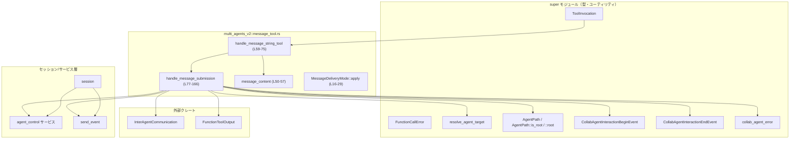
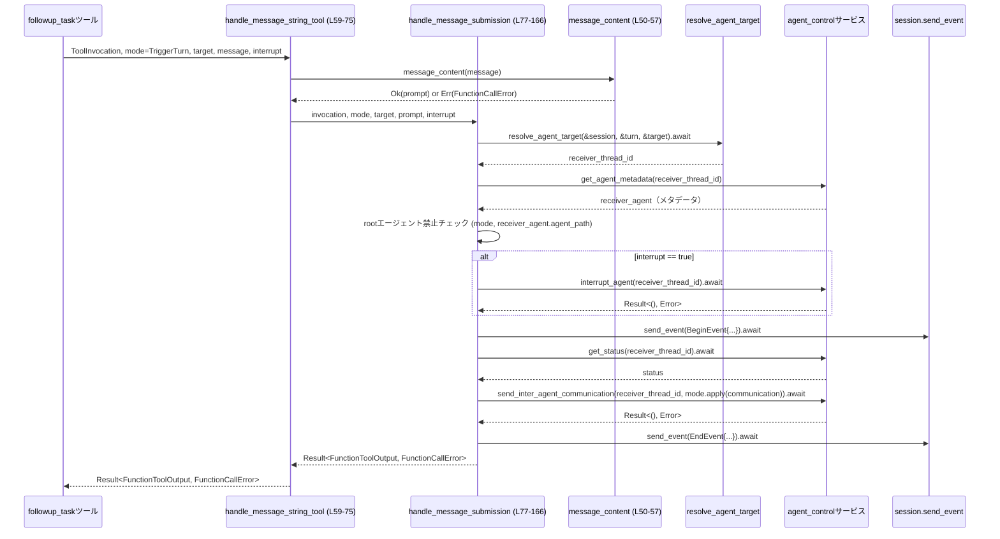

# core/src/tools/handlers/multi_agents_v2/message_tool.rs

## 0. ざっくり一言

MultiAgentV2 のテキストメッセージ系ツール（`send_message` / `followup_task`）が共通で使う、「送信先エージェントの解決・バリデーション・割り込み・イベント送信・メッセージ配送」を行うハンドラです（`core/src/tools/handlers/multi_agents_v2/message_tool.rs:L59-166`）。

---

## 1. このモジュールの役割

### 1.1 概要

- MultiAgentV2 のテキスト専用ツール `send_message` と `followup_task` が使う共通の送信処理をまとめたモジュールです（`L1-4`）。
- 送信先エージェントのスレッド ID 解決、root エージェントへのタスク禁止、必要に応じた割り込み、コラボレーションイベントの begin/end 発行、`InterAgentCommunication` の組み立てと送信を行います（`L77-166`）。
- メッセージ本文が空でないことのチェックもここで行います（`L50-57`）。

### 1.2 アーキテクチャ内での位置づけ

このモジュールは MultiAgentV2 ハンドラ群（親モジュール `super`）の一部であり、以下のコンポーネントと連携して動作します。

- 親モジュール経由の型・関数:
  - `ToolInvocation`（セッション・ターン情報などをまとめた呼び出しコンテキスト）（`L60-62, L77-83`）
  - `FunctionCallError`（ツール呼び出しのエラー型）（`L50-56, L60-66, L77-83`）
  - `resolve_agent_target`（ターゲット文字列からエージェントスレッド ID を解決）（`L90`）
  - `AgentPath` / `AgentPath::is_root` / `AgentPath::root`（エージェントの階層的なパス）（`L99-100, L132-133`）
  - `CollabAgentInteractionBeginEvent` / `CollabAgentInteractionEndEvent`（コラボエージェントとのやり取りの begin/end イベント）（`L117-123, L152-160`）
  - `collab_agent_error`（コラボエージェント関連のエラー変換ヘルパー）（`L112-112, L143-143`）
- `session.services.agent_control`:
  - `get_agent_metadata`（スレッド ID からエージェント情報取得）（`L91-95`）
  - `interrupt_agent`（エージェントの割り込み）（`L107-112`）
  - `send_inter_agent_communication`（エージェント間通信送信）（`L138-143`）
  - `get_status`（エージェントの状態取得）（`L144-148`）
- `FunctionToolOutput`（ツール呼び出しの戻り値ラッパー）（`L7, L66, L83, L166`）
- `InterAgentCommunication`（エージェント間メッセージのペイロード）（`L8, L18-27, L129-137, L141`）

依存関係の概要を次の Mermaid 図に示します（このファイルの範囲のみを対象としています）。



### 1.3 設計上のポイント

- **共通ハンドラ化**  
  - `send_message` / `followup_task` はどちらも `handle_message_string_tool` 経由で同じ送信経路を使います（`L59-75`）。  
  - タスクか単純メッセージかの違いは `MessageDeliveryMode`（`QueueOnly` / `TriggerTurn`）で切り替える設計です（`L10-14, L60-63, L79-80`）。
- **入力バリデーションの明示化**  
  - メッセージ本文が空（空白のみを含む）でないことを `message_content` で検証し、失敗時には `FunctionCallError::RespondToModel` を返します（`L50-56`）。
- **エラーをモデルに返す方針**  
  - root エージェントへのタスク割り当て禁止や、`agent_path` が無いターゲットへの送信は `FunctionCallError::RespondToModel` で明示的に失敗させます（`L96-105, L126-128`）。
- **非同期処理とサービス呼び出し**  
  - 送信先解決、割り込み、ステータス取得、エージェント間通信送信はすべて `async`/`await` による非同期呼び出しで行われます（`L77-83, L90, L107-112, L138-143, L144-148`）。
  - 並列化は行っておらず、処理は関数内で逐次 await されています。
- **イベント発行による観測性**  
  - メッセージ送信前後で begin/end イベントをセッションに送信し、外部からのトレースやロギングが可能なようにしています（`L114-125, L149-163`）。
- **安全性**  
  - このファイル内に `unsafe` ブロックは存在しません。  
  - パニックを起こしうる `unwrap` は使われておらず、`unwrap_or_default` / `unwrap_or_else` でデフォルト値にフォールバックしています（`L91-95, L130-133`）。

---

## 2. 主要な機能一覧

- **メッセージ本文のバリデーション**: 空（空白のみを含む）メッセージを弾く `message_content`（`L50-57`）。
- **メッセージ送信モードの切り替え**: `MessageDeliveryMode` とその `apply` メソッドで、エージェント間通信の `trigger_turn` フラグを制御（`L10-14, L16-29`）。
- **共通メッセージハンドラ**: `handle_message_string_tool` による `send_message` / `followup_task` の共通経路（`L59-75`）。
- **メッセージ送信フロー本体**: `handle_message_submission` によるターゲット解決・root エージェント制約・割り込み・イベント送信・`InterAgentCommunication` 送信・ステータス取得（`L77-166`）。

---

## 3. 公開 API と詳細解説

### 3.1 型一覧（構造体・列挙体など）

| 名前 | 種別 | 役割 / 用途 | 定義位置 |
|------|------|-------------|----------|
| `MessageDeliveryMode` | enum | メッセージ送信時に、ターゲットエージェントのターンを即時開始させるか（`TriggerTurn`）、キューに積むだけか（`QueueOnly`）を表すフラグです。`apply` メソッドで `InterAgentCommunication` に反映されます。 | `core/src/tools/handlers/multi_agents_v2/message_tool.rs:L10-29` |
| `SendMessageArgs` | struct | MultiAgentV2 `send_message` ツールの入力引数。送信先を表す `target` とメッセージ本文 `message` を持ちます。未知フィールドは禁止です。 | `core/src/tools/handlers/multi_agents_v2/message_tool.rs:L32-38` |
| `FollowupTaskArgs` | struct | MultiAgentV2 `followup_task` ツールの入力引数。`target`・`message` に加えて、ターゲットを割り込むかどうかを示す `interrupt`（デフォルト false）を持ちます。未知フィールドは禁止です。 | `core/src/tools/handlers/multi_agents_v2/message_tool.rs:L40-48` |

補足:

- `SendMessageArgs` / `FollowupTaskArgs` には `#[serde(deny_unknown_fields)]` が付いており、想定外のフィールドを含む入力はデシリアライズ段階でエラーになります（`L33, L41`）。
- `FollowupTaskArgs.interrupt` には `#[serde(default)]` が付いており、フィールドが省略された場合は `false` になります（`L46-47`）。

### 3.2 関数詳細

#### `MessageDeliveryMode::apply(self, communication: InterAgentCommunication) -> InterAgentCommunication`

**概要**

`InterAgentCommunication` の `trigger_turn` フィールドだけを、`MessageDeliveryMode` に応じて上書きするヘルパーメソッドです（`L16-29`）。

**引数**

| 引数名 | 型 | 説明 |
|--------|----|------|
| `self` | `MessageDeliveryMode` | `QueueOnly` または `TriggerTurn` のどちらかです（`L10-13`）。 |
| `communication` | `InterAgentCommunication` | 送信予定のエージェント間通信オブジェクト。`trigger_turn` フィールドが上書きされます（`L18-27`）。 |

**戻り値**

- `InterAgentCommunication`: `trigger_turn` フィールドが `self` に応じて `false` または `true` に設定された新しいオブジェクトです（`L20-27`）。

**内部処理の流れ**

1. `match self` で `QueueOnly` / `TriggerTurn` を分岐します（`L19-20, L24`）。
2. それぞれの分岐で、構造体更新記法 `InterAgentCommunication { trigger_turn: <bool>, ..communication }` によって `trigger_turn` だけを書き換えた新しい値を作成して返します（`L20-23, L24-27`）。

**Examples（使用例）**

```rust
// ある InterAgentCommunication を生成したあと、モードに応じて trigger_turn を調整する例
let communication = InterAgentCommunication::new(
    source_agent_path,  // 送信元パス
    target_agent_path,  // 送信先パス
    Vec::new(),         // 添付情報（このモジュールでは常に空）
    prompt.clone(),     // メッセージ本文
    true,               // 初期値としての trigger_turn（後で上書きされる）
);

// ターンを起こさずキューに積む
let queued = MessageDeliveryMode::QueueOnly.apply(communication);

// すぐにターンを起こす
let triggered = MessageDeliveryMode::TriggerTurn.apply(queued);
```

※ `InterAgentCommunication::new` のシグネチャやフィールド構成はこのチャンクには現れません。上記はこのファイル内の使用方法（`L129-137`）をもとにした例です。

**Errors / Panics**

- このメソッド自体は `Result` を返さず、内部でもパニックを引き起こすような処理は行っていません（`L18-27`）。

**Edge cases（エッジケース）**

- `communication` にどのような値が入っていても、`trigger_turn` 以外のフィールドは `..communication` によってそのまま引き継がれます（`L20-23, L24-27`）。
- `QueueOnly` / `TriggerTurn` 以外のバリアントは存在しないため、`match` の網羅性はコンパイラにより保証されます（`L10-13, L19-27`）。

**使用上の注意点**

- `InterAgentCommunication::new` の最後の引数にも `trigger_turn` 相当の値を渡しているため（`L129-137`）、**実際に使用される値は必ず `apply` 経由のものになる**と理解しておく必要があります。  
  もし `InterAgentCommunication` が内部でその引数に依存した別のロジックを持つ場合、`apply` との整合性を確認する必要がありますが、その詳細はこのチャンクからは分かりません。

---

#### `fn message_content(message: String) -> Result<String, FunctionCallError>`

**概要**

メッセージ本文が空でないか（空白のみを含むかどうか）を検査し、問題なければそのまま返すヘルパー関数です（`L50-57`）。

**引数**

| 引数名 | 型 | 説明 |
|--------|----|------|
| `message` | `String` | 送信しようとしているメッセージ本文です（`L50`）。 |

**戻り値**

- `Ok(String)`: トリム後に空でないメッセージ本文。
- `Err(FunctionCallError)`: 空メッセージだった場合、`FunctionCallError::RespondToModel` でエラーメッセージを返します（`L52-54`）。

**内部処理の流れ**

1. `message.trim().is_empty()` で、前後の空白を除いた文字列が空かどうかを判定します（`L51`）。
2. 空の場合、`FunctionCallError::RespondToModel("Empty message can't be sent to an agent".to_string())` を返します（`L52-54`）。
3. 空でない場合は、そのまま `Ok(message)` を返します（`L56`）。

**Examples（使用例）**

```rust
// 正常なメッセージ
let validated = message_content("Hello agent".to_string())?;
// validated は "Hello agent" を保持する Ok(String) になる

// 空白のみのメッセージ
let result = message_content("   ".to_string());
assert!(result.is_err()); // FunctionCallError が返る
```

※ `FunctionCallError` の詳細な中身は `use super::*` からインポートされるため、このチャンクには定義がありません（`L6`）。

**Errors / Panics**

- `Err(FunctionCallError::RespondToModel(...))` は「空メッセージは送れない」という論理エラーとしてモデルに返されます（`L52-54`）。
- パニックを起こす可能性のあるコードは含まれていません（`L50-57`）。

**Edge cases（エッジケース）**

- スペース・タブ・改行などの空白だけを含む文字列も、`trim()` により空とみなされ、エラーになります（`L51-54`）。
- Unicode の空白文字も `trim()` によって取り除かれるため、実質的に「可視文字が何もない」メッセージはすべて拒否されます。

**使用上の注意点**

- メッセージ送信パスでは `handle_message_string_tool` がこの関数を必ず通しているため（`L67-72`）、**呼び出し側で空チェックを重ねて行う必要は基本的にありません**。
- `FunctionCallError::RespondToModel` のエラーメッセージは固定の英語メッセージであり、利用側でローカライズ等を行う場合はラッピングが必要になる可能性があります。

---

#### `pub(crate) async fn handle_message_string_tool(...) -> Result<FunctionToolOutput, FunctionCallError>`

```rust
pub(crate) async fn handle_message_string_tool(
    invocation: ToolInvocation,
    mode: MessageDeliveryMode,
    target: String,
    message: String,
    interrupt: bool,
) -> Result<FunctionToolOutput, FunctionCallError> { /* ... */ }
```

（`core/src/tools/handlers/multi_agents_v2/message_tool.rs:L59-75`）

**概要**

`send_message` と `followup_task` から共通利用されるエントリーポイントで、  

- メッセージ本文のバリデーション  
- コア処理 `handle_message_submission` への委譲  
を行います（`L59-75`）。

**引数**

| 引数名 | 型 | 説明 |
|--------|----|------|
| `invocation` | `ToolInvocation` | セッション・ターン・呼び出し ID などを含むツール呼び出しコンテキストです（`L60-62, L84-89`）。定義は親モジュールにあります。 |
| `mode` | `MessageDeliveryMode` | メッセージ送信時にターゲットのターンを起こすかどうかを示します（`L60-63`）。 |
| `target` | `String` | 送信先エージェントを指定する文字列（例: ニックネームや ID）です（`L63, L80`）。解決方法は `resolve_agent_target` に委ねられています（`L90`）。 |
| `message` | `String` | 送信したいメッセージ本文です。`message_content` で空チェックされます（`L64, L71`）。 |
| `interrupt` | `bool` | 送信前にターゲットエージェントを割り込むかどうかを示します（`L65, L82, L106-113`）。 |

**戻り値**

- `Ok(FunctionToolOutput)`  
  - 正常にメッセージフローが完了した場合、空文字列と `Some(true)` を含む `FunctionToolOutput` が返されます（`L166`）。
- `Err(FunctionCallError)`  
  - 入力バリデーション失敗（空メッセージ）や、後段の `handle_message_submission` 内で発生したエラーをそのまま返します（`L71-72, L77-165`）。

**内部処理の流れ**

1. `message_content(message)?` によりメッセージ本文を検証し、空の場合はここで `Err` を返します（`L71-72`）。
2. メッセージが問題なければ、そのまま `handle_message_submission(invocation, mode, target, <message>, interrupt)` に委譲します（`L67-73`）。
3. `handle_message_submission` の結果をそのまま呼び出し元に返します（`L67-75`）。

**Examples（使用例）**

`send_message` ツールからの利用イメージです（実際のラッパー実装はこのチャンクにはありません）。

```rust
// ツール入力をデシリアライズして SendMessageArgs に詰める
let args: SendMessageArgs = serde_json::from_value(tool_args_json)?;

// ToolInvocation は上位レイヤーから渡される
let output = handle_message_string_tool(
    invocation,                      // ToolInvocation
    MessageDeliveryMode::QueueOnly,  // send_message はキューのみ
    args.target,                     // 送信先エージェント指定
    args.message,                    // メッセージ本文
    false,                           // send_message では割り込みは行わないといったポリシーが考えられます
).await?;
```

**Errors / Panics**

- エラー発生ケース:
  - メッセージが空または空白のみの場合: `message_content` が `FunctionCallError::RespondToModel` を返し、この関数からも同じエラーが返ります（`L50-56, L67-72`）。
  - その他、ターゲット解決やエージェント間通信で発生したエラーは `handle_message_submission` から伝播します（`L77-165`）。
- この関数自体はパニックを引き起こすコードを含みません（`L59-75`）。

**Edge cases（エッジケース）**

- `message` が非常に長い場合でも、この関数としては単に `String` を受け渡すだけであり、長さに関する特別な処理はありません（`L64-72`）。  
  メモリ使用量やサイズ制限は、下位レイヤーまたは呼び出し側での制御になります。
- `target` が無効な形式でも、この関数では検証せず、後段の `resolve_agent_target` で初めて検証されます（`L90`）。

**使用上の注意点**

- `ToolInvocation` はムーブされるため（`L84-89`）、呼び出し後に同じ値を再利用することはできません。必要であれば上位でクローンを保持する設計が必要です。
- `interrupt` の意味（どのようにエージェントが割り込まれるか）は `agent_control.interrupt_agent` の実装に依存します（`L107-112`）。このチャンクからは詳細が分からないため、利用側でその仕様を確認する必要があります。

---

#### `async fn handle_message_submission(...) -> Result<FunctionToolOutput, FunctionCallError>`

```rust
async fn handle_message_submission(
    invocation: ToolInvocation,
    mode: MessageDeliveryMode,
    target: String,
    prompt: String,
    interrupt: bool,
) -> Result<FunctionToolOutput, FunctionCallError> { /* ... */ }
```

（`core/src/tools/handlers/multi_agents_v2/message_tool.rs:L77-166`）

**概要**

実際のメッセージ送信フローの本体です。以下を行います（`L84-165`）。

1. ターゲットエージェントのスレッド ID 解決 (`resolve_agent_target`)。
2. エージェントメタデータ取得と root エージェントへのタスク禁止チェック。
3. `interrupt` が指定されていればターゲットの割り込み。
4. begin/end のコラボレーションイベント送信。
5. `InterAgentCommunication` の構築と、`MessageDeliveryMode` に応じた送信。
6. 最終的に空の `FunctionToolOutput` を返却。

**引数**

| 引数名 | 型 | 説明 |
|--------|----|------|
| `invocation` | `ToolInvocation` | セッション・ターン・呼び出し ID などを含むコンテキストです（`L77-83, L84-89`）。 |
| `mode` | `MessageDeliveryMode` | メッセージ送信モード（`QueueOnly` / `TriggerTurn`）。`TriggerTurn` の場合のみ root エージェントへの送信を禁止します（`L79-80, L96-105`）。 |
| `target` | `String` | エージェントターゲット指定文字列。`resolve_agent_target` に渡されます（`L80, L90`）。 |
| `prompt` | `String` | メッセージ本文。begin/end イベントや `InterAgentCommunication` に利用されます（`L81, L121, L135-136, L158-159`）。 |
| `interrupt` | `bool` | true の場合、送信前にターゲットエージェントを割り込みます（`L82, L106-113`）。 |

**戻り値**

- `Ok(FunctionToolOutput)`  
  - 正常送信時は空文字列と `Some(true)` を持つ `FunctionToolOutput` が返されます（`L166`）。  
  - この関数内では、送信結果そのものは返さず、**「成功したかどうか」だけをツール側に伝える設計**になっています。
- `Err(FunctionCallError)`  
  - ターゲット解決失敗、root エージェントへのタスク禁止違反、`agent_path` 未設定、割り込み・送信処理でのエラーなどが該当します（`L90, L96-105, L126-128, L107-113, L138-143, L164-165`）。

**内部処理の流れ（アルゴリズム）**

1. **コンテキストの分解**  
   - `let ToolInvocation { session, turn, call_id, .. } = invocation;` により、`ToolInvocation` から `session`・`turn`・`call_id` を取り出します（`L84-89`）。

2. **ターゲットエージェントの解決**  
   - `resolve_agent_target(&session, &turn, &target).await?` で `receiver_thread_id` を取得します（`L90`）。  
   - 失敗した場合は `FunctionCallError` が返され、この関数も即座に `Err` で終了します。

3. **エージェントメタデータ取得**  
   - `session.services.agent_control.get_agent_metadata(receiver_thread_id).unwrap_or_default()` でメタデータを取得します（`L91-95`）。  
   - 見つからない場合は `Default` 実装によるデフォルトメタデータが使われます。

4. **root エージェントへのタスク禁止チェック**  
   - `mode == MessageDeliveryMode::TriggerTurn` かつ `receiver_agent.agent_path.as_ref().is_some_and(AgentPath::is_root)` の場合、  
     `"Tasks can't be assigned to the root agent"` というメッセージの `FunctionCallError::RespondToModel` を返します（`L96-105`）。

5. **割り込み処理（オプション）**  
   - `interrupt` が true なら、`agent_control.interrupt_agent(receiver_thread_id).await` を呼び出し、  
     エラー時には `collab_agent_error(receiver_thread_id, err)` でエラーをラップして返します（`L106-113`）。

6. **begin イベント送信**  
   - `CollabAgentInteractionBeginEvent { call_id: call_id.clone(), sender_thread_id: session.conversation_id, receiver_thread_id, prompt: prompt.clone() }` を `session.send_event(&turn, ...).await` で送信します（`L114-125`）。  
   - イベント送信の結果は無視されており、エラーが発生してもこの関数の戻り値には影響しません。

7. **ターゲットエージェントパスの取得**  
   - `receiver_agent.agent_path.clone().ok_or_else(|| FunctionCallError::RespondToModel("target agent is missing an agent_path".to_string()))?` により、`agent_path` が存在しなければエラーを返します（`L126-128`）。

8. **InterAgentCommunication の構築**  
   - `InterAgentCommunication::new` により、送信元パス・送信先パス・空の添付情報ベクタ・`prompt`・`true` を指定して `communication` を生成します（`L129-137`）。  
   - 送信元パスは `turn.session_source.get_agent_path().unwrap_or_else(AgentPath::root)` で決定されます（`L130-133`）。

9. **エージェント間通信の送信**  
   - `mode.apply(communication)` で `trigger_turn` をモードに応じて書き換えたうえで、  
     `agent_control.send_inter_agent_communication(receiver_thread_id, ...)` を呼び出し、その結果を `result` に格納します（`L138-143`）。  
   - エラー発生時には `collab_agent_error(receiver_thread_id, err)` でラップされます（`L143`）。

10. **ステータス取得と end イベント送信**  
    - `agent_control.get_status(receiver_thread_id).await` でステータスを取得します（`L144-148`）。  
    - `CollabAgentInteractionEndEvent { call_id, sender_thread_id: session.conversation_id, receiver_thread_id, receiver_agent_nickname: receiver_agent.agent_nickname, receiver_agent_role: receiver_agent.agent_role, prompt, status }` を `session.send_event` で送信します（`L149-163`）。

11. **送信結果の確認と戻り値**  
    - `result?;` でエラーがあればここで返し、正常なら `Ok(FunctionToolOutput::from_text(String::new(), Some(true)))` を返します（`L164-166`）。

**Examples（使用例）**

以下は `followup_task` ツールからの利用イメージです。

```rust
// followup_task の引数をデシリアライズ
let args: FollowupTaskArgs = serde_json::from_value(tool_args_json)?;

// followup_task はタスクなので TriggerTurn を使う想定
let output = handle_message_string_tool(
    invocation,
    MessageDeliveryMode::TriggerTurn,
    args.target,
    args.message,
    args.interrupt, // FollowupTaskArgs の interrupt をそのまま渡す
).await?;
```

**Errors / Panics**

この関数で返りうる主なエラーと条件:

- `resolve_agent_target` 失敗（ターゲットが解決できない等）  
  → 上位から渡される `FunctionCallError` などをそのまま伝播します（`L90`）。
- root エージェントへのタスク禁止  
  → `mode == TriggerTurn` かつ `agent_path` が root の場合、  
  `"Tasks can't be assigned to the root agent"` の `FunctionCallError::RespondToModel`（`L96-105`）。
- ターゲットエージェントに `agent_path` が無い  
  → `"target agent is missing an agent_path"` の `FunctionCallError::RespondToModel`（`L126-128`）。
- 割り込み処理失敗  
  → `interrupt_agent` のエラーを `collab_agent_error` でラップして返します（`L107-113`）。
- メッセージ送信処理失敗  
  → `send_inter_agent_communication` のエラーを `collab_agent_error` でラップして返します（`L138-143, L164-165`）。

パニックについて:

- この関数内には `.unwrap()` は登場せず、`.unwrap_or_default()` / `.unwrap_or_else(AgentPath::root)` のみが使われているため、パニックは発生しません（`L91-95, L130-133`）。

**Edge cases（エッジケース）**

- **root エージェントへのメッセージ**  
  - `mode == QueueOnly` の場合、root エージェントへのメッセージが禁止されているかどうかはこの関数からは読み取れません。  
    明示的に禁止しているのは `TriggerTurn` の場合のみです（`L96-105`）。  
  - ただし、root エージェントに対しても `agent_path` が設定されている必要があり、設定されていない場合は `"target agent is missing an agent_path"` エラーになります（`L126-128`）。

- **メタデータが見つからない場合**  
  - `get_agent_metadata` が `None` を返した場合、`unwrap_or_default` によりデフォルト値が使われます（`L91-95`）。  
  - デフォルトの `agent_path` が `None` の場合、後続の `ok_or_else` で `"target agent is missing an agent_path"` エラーになります（`L126-128`）。  
  - それまでに begin イベントは既に送信されているため、begin のみ存在し end がないイベント列になる可能性があります（`L114-125, L126-128`）。

- **イベント送信の失敗**  
  - begin/end イベント送信 (`session.send_event(...).await`) の戻り値は無視されているため（`L114-125, L149-163`）、  
    送信失敗時もこの関数は成功しうる点に注意が必要です。

- **ステータス取得の失敗**  
  - `get_status(receiver_thread_id).await` の結果も、そのまま `status` として end イベントに渡されますが（`L144-148, L152-159`）、  
    失敗時にどのような値になるかは、このチャンクからは分かりません。

**使用上の注意点**

- この関数は **ツールの外部 API には公開されていない内部関数** であり（`pub(crate)` ではなく素の `async fn`、`L77`）、  
  通常は `handle_message_string_tool` 経由で呼び出されます。
- begin/end イベントの整合性（常にペアになっているか）は、この関数のエラー条件とイベント送信タイミングに依存します。  
  監視やログ集計を行う場合は、エラー時でも begin だけが存在しうる点を考慮する必要があります（`L114-128`）。
- `interrupt` のフラグを新しいツールから渡す場合、  
  - 「どの条件で割り込みを行うか」をドメイン仕様として明確にし、  
  - そのフラグを `FollowupTaskArgs` 相当の構造体まで伝搬させる設計が必要になります（`L40-48, L82, L106-113`）。

---

### 3.3 その他の関数

このファイルで定義されている関数・メソッドは以下の 4 件だけであり、すべて 3.2 で詳細解説済みです（`L16-29, L50-57, L59-75, L77-166`）。

---

## 4. データフロー

ここでは、`followup_task` ツールが `TriggerTurn` モードでメッセージを送信する典型的なフローを例に、データの流れを説明します。

1. 上位レイヤーでツール引数 JSON が `FollowupTaskArgs` にデシリアライズされます（`L40-48`）。
2. ツールハンドラが `handle_message_string_tool` を `MessageDeliveryMode::TriggerTurn` モードで呼び出します（`L59-75`）。
3. `message_content` でメッセージ本文が検証されます（`L50-57`）。
4. `handle_message_submission` が呼び出され、ターゲット解決・制約チェック・割り込み・イベント送信・メッセージ送信を行います（`L77-166`）。
5. 処理結果として空の `FunctionToolOutput` が返ります（`L166`）。

Mermaid のシーケンス図で示すと次のようになります。



この図は、このファイルに現れる関数と、その呼び出し先の大まかな関係を表しています（`L50-57, L59-75, L77-166`）。

---

## 5. 使い方（How to Use）

### 5.1 基本的な使用方法

このモジュールの主要な公開エントリポイントは `handle_message_string_tool` です（`L59-75`）。  
`send_message` / `followup_task` のような具体的ツールは、次のような構成で使うことが想定されます。

```rust
// 送信メッセージツールの引数をデシリアライズする
let args: SendMessageArgs = serde_json::from_value(tool_args_json)?; // L32-38

// ToolInvocation はツール実行のコンテキスト（セッションやターン情報など）
// 実際の定義は親モジュールにあります（このチャンクには現れません）
let invocation: ToolInvocation = build_invocation(/* ... */);

// send_message の場合、QueueOnly モードで呼び出す
let output = handle_message_string_tool(
    invocation,                      // ToolInvocation（L60-62）
    MessageDeliveryMode::QueueOnly,  // 即時ターン開始は行わない
    args.target,                     // 送信先（L36）
    args.message,                    // メッセージ本文（L37）
    false,                           // 割り込みは行わない
).await?;
```

`followup_task` の場合は `FollowupTaskArgs` と `MessageDeliveryMode::TriggerTurn` を使う形になります（`L40-48`）。

### 5.2 よくある使用パターン

1. **単純なメッセージ送信（キューに積むだけ）**

```rust
let args: SendMessageArgs = /* ... */;

let output = handle_message_string_tool(
    invocation,
    MessageDeliveryMode::QueueOnly,  // L10-13
    args.target,
    args.message,
    false,                           // 割り込み無し
).await?;
```

- ターゲットエージェントのターンは即時には開始されず、メッセージはキューに積まれる前提です。  
  実際にどのタイミングで処理されるかは、エージェント実装次第です。

1. **フォローアップタスク（ターンを起こす & 必要なら割り込み）**

```rust
let args: FollowupTaskArgs = /* ... */;

let output = handle_message_string_tool(
    invocation,
    MessageDeliveryMode::TriggerTurn, // タスクなのでターンを起こす（L10-13, L96-105）
    args.target,
    args.message,
    args.interrupt,                   // 割り込みの有無（L46-47, L106-113）
).await?;
```

- root エージェントにタスクを割り当てようとすると `"Tasks can't be assigned to the root agent"` というエラーになります（`L96-105`）。

### 5.3 よくある間違い

```rust
// 間違い例: 空メッセージを渡してしまう
let output = handle_message_string_tool(
    invocation,
    MessageDeliveryMode::QueueOnly,
    "agent-1".to_string(),
    "   ".to_string(),     // 空白のみ
    false,
).await?;                  // → message_content が Err を返し、ここでエラーになる（L50-56, L67-72）
```

```rust
// 正しい例: メッセージ本文を必ず非空にする
let output = handle_message_string_tool(
    invocation,
    MessageDeliveryMode::QueueOnly,
    "agent-1".to_string(),
    "Please process this request".to_string(),
    false,
).await?;
```

```rust
// 間違い例: root エージェントに TriggerTurn モードでタスクを送る
let output = handle_message_string_tool(
    invocation,
    MessageDeliveryMode::TriggerTurn, // L10-13
    "root".to_string(),               // これが root を指すと仮定
    "Do something".to_string(),
    false,
).await?; // → root チェックに引っかかる可能性がある（L96-105）
```

```rust
// 正しい例: root には QueueOnly か、そもそもタスクを送らない設計にする
let output = handle_message_string_tool(
    invocation,
    MessageDeliveryMode::QueueOnly,
    "root".to_string(),
    "FYI: something happened".to_string(),
    false,
).await?;
```

### 5.4 使用上の注意点（まとめ）

- **前提条件**
  - `message` は非空（空白のみを含まない）である必要があります（`L50-56`）。
  - ターゲットエージェントは `resolve_agent_target` で解決可能であり、`agent_path` が設定されている必要があります（`L90, L126-128`）。
- **禁止事項 / 制約**
  - `MessageDeliveryMode::TriggerTurn` のとき、root エージェントにタスクを送ることはできません（`L96-105`）。
- **エラー表示**
  - 多くの論理エラーは `FunctionCallError::RespondToModel` として返され、モデル側にエラーメッセージが可視になる可能性があります（`L52-54, L96-105, L126-128`）。
- **並行性**
  - このモジュール自体は追加のスレッドやタスクを生成せず、`async`/`await` でサービス層を逐次呼び出す構造です（`L77-83, L90, L107-113, L138-143, L144-148`）。
  - 実際の並行実行やレースコンディションの有無は `session` や `agent_control` 実装に依存します。
- **観測性**
  - begin/end イベントにより、メッセージフローは外部からトレース可能ですが、イベント送信の失敗は無視される点に注意が必要です（`L114-125, L149-163`）。
- **セキュリティ観点**
  - このファイルでは、`message` と `target` をそのまま外部システムへ送るような処理はなく、主に内部サービスへの引き渡しに限定されています（`L90, L129-137, L141`）。
  - 入力値の意味付け（どの文字列がどのエージェントを指すか）や、乱用防止（例えば過剰な `interrupt`）の制御は上位レイヤーで行う必要があります。

---

## 6. 変更の仕方（How to Modify）

### 6.1 新しい機能を追加する場合

例: 新しいテキスト系ツール `schedule_task` を追加し、同様のメッセージ送信フローを利用したい場合。

1. **ツール引数構造体の追加**
   - 新しい引数 struct（例: `ScheduleTaskArgs`）をこのファイルまたは親モジュールに定義し、`#[derive(Deserialize)]` と `#[serde(deny_unknown_fields)]` を付与します。  
     `SendMessageArgs` / `FollowupTaskArgs` を参考にします（`L32-38, L40-48`）。

2. **MessageDeliveryMode の選択**
   - ツールの意味に応じて `QueueOnly` / `TriggerTurn` のどちらを使うかを決めます（`L10-13`）。

3. **ツールハンドラからの呼び出し**
   - 既存のツールと同様に、ツールごとのハンドラ（親モジュール側にあると想定されます）で `handle_message_string_tool` を呼びます（`L59-75`）。

4. **必要なら `interrupt` フラグを導入**
   - 割り込み動作が必要なツールであれば、`FollowupTaskArgs` を参考に `interrupt: bool` フィールドを引数に追加し、`handle_message_string_tool` に渡す設計を取ります（`L40-48, L82, L106-113`）。

### 6.2 既存の機能を変更する場合

- **root エージェントへの制約を緩和/強化する**
  - 制約ロジックは `mode == MessageDeliveryMode::TriggerTurn && receiver_agent.agent_path.as_ref().is_some_and(AgentPath::is_root)` という条件に集約されています（`L96-100`）。  
  - ここを変更する場合は、「どのモードで」「どのエージェントに」「どのような制約をかけるか」という契約を明確にしたうえで修正する必要があります。

- **イベントペイロードの拡張**
  - begin/end イベントのフィールド構成は `CollabAgentInteractionBeginEvent` / `CollabAgentInteractionEndEvent` の初期化部分に現れています（`L117-123, L152-160`）。  
  - 追加フィールドを渡したい場合は、これらの struct 定義（親モジュールか別モジュールにある）も合わせて変更する必要があります。

- **エラー文言の変更・ローカライズ**
  - 固定文字列としてハードコードされているメッセージは以下です。
    - `"Empty message can't be sent to an agent"`（`L52-54`）
    - `"Tasks can't be assigned to the root agent"`（`L102-104`）
    - `"target agent is missing an agent_path"`（`L126-128`）  
  - これらを変更する場合は、モデルやクライアントが文言に依存していないかを確認する必要があります。

- **影響範囲の確認**
  - `handle_message_string_tool` は `send_message` / `followup_task` の両方から使われているため（`L1-4`）、ここに変更を加えると両ツールに影響します。  
  - 変更時には、両方のツールの仕様やテストケースをあわせて確認することが望ましいです。

---

## 7. 関連ファイル

このモジュールと密接に関係する型・関数の定義場所は、このチャンクからは完全には分かりませんが、分かる範囲で整理します。

| パス / モジュール | 役割 / 関係 |
|-------------------|------------|
| `core/src/tools/handlers/multi_agents_v2/message_tool.rs` | 本レポートの対象ファイル。MultiAgentV2 テキストメッセージツールの共通ハンドラと引数型を提供します。 |
| （不明: `use super::*` からインポート） | `ToolInvocation`, `FunctionCallError`, `resolve_agent_target`, `AgentPath`, `CollabAgentInteractionBeginEvent`, `CollabAgentInteractionEndEvent`, `collab_agent_error` などが定義されている親モジュールです（`L6, L84-90, L96-105, L114-125, L149-163`）。具体的なファイルパスはこのチャンクには現れません。 |
| `crate::tools::context::FunctionToolOutput` | ツール実行結果を表す型。テキストとオプションのフラグを持ち、`from_text` コンストラクタが利用されています（`L7, L166`）。 |
| `codex_protocol::protocol::InterAgentCommunication` | エージェント間メッセージのペイロード型。`new` コンストラクタと `trigger_turn` フィールド（`apply` で操作）が利用されています（`L8, L18-27, L129-137, L141`）。 |
| （不明: `session.services.agent_control` の定義モジュール） | エージェントメタデータ取得・割り込み・エージェント間通信送信・ステータス取得を提供するサービスです（`L91-95, L107-113, L138-143, L144-148`）。`session` の具体的な型およびこのサービスの定義場所はこのチャンクには現れません。 |

このレポートは、あくまでこのファイルに現れている情報に基づいています。親モジュールやサービス層の詳細な仕様については、該当ファイルのコードやドキュメントを参照する必要があります。
