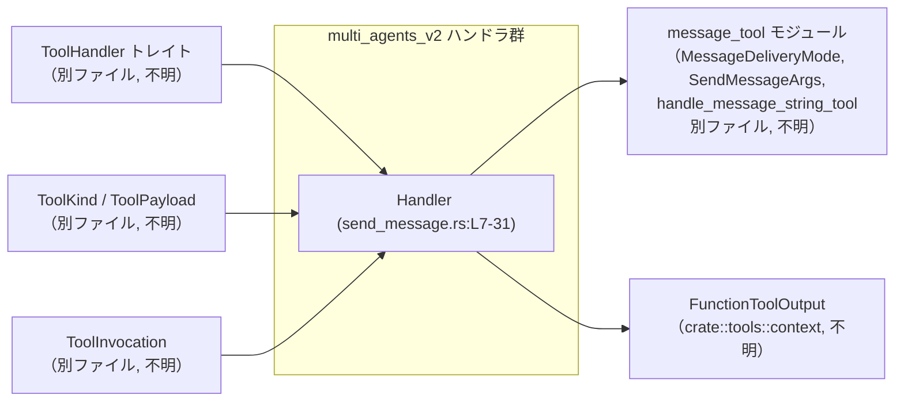
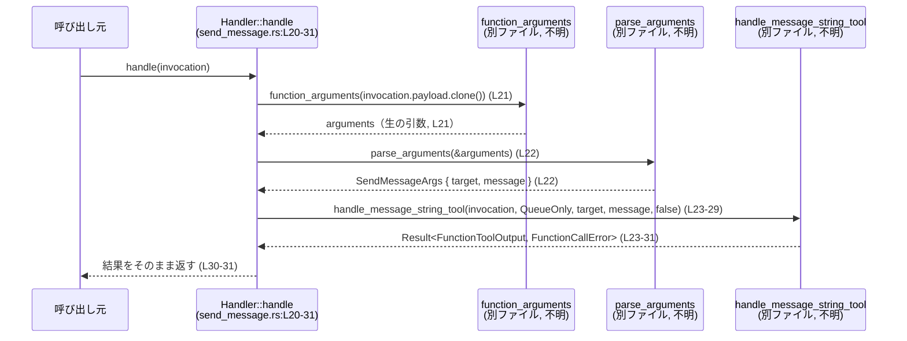
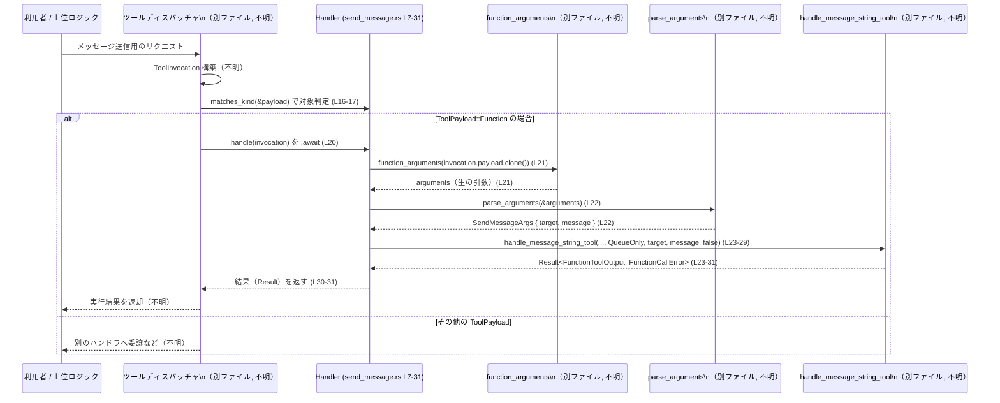

# core\src\tools\handlers\multi_agents_v2\send_message.rs コード解説

## 0. ざっくり一言

このファイルは、ツール呼び出し（`ToolInvocation`）を受け取り、`SendMessageArgs` をパースしてメッセージ送信用の共通処理 `handle_message_string_tool` に委譲する **関数型ツールハンドラ `Handler`** を定義しています。  
（根拠: `Handler` 実装と `handle` 内の呼び出し構造 send_message.rs:L7-L31）

---

## 1. このモジュールの役割

### 1.1 概要

- このモジュールは、マルチエージェント環境における「メッセージ送信」ツールのハンドラとして機能します。
- `ToolInvocation` に含まれる関数ツールのペイロードから引数を取り出し、`SendMessageArgs` 型にパースした上で、`message_tool` モジュールの処理へ橋渡しを行います。  
  （根拠: `SendMessageArgs` と `handle_message_string_tool` の利用、および `ToolKind::Function` 指定 send_message.rs:L1-L3,L10-L13,L20-L30）

### 1.2 アーキテクチャ内での位置づけ

このファイルは、抽象的なツール処理フレームワーク（`ToolHandler`, `ToolKind`, `ToolPayload`, `ToolInvocation` 等）と、具体的なメッセージ送信ロジック（`message_tool`）の間のアダプタとして位置づけられます。



- `Handler` は `ToolHandler` を実装し、`ToolKind::Function` を返すことで「関数ツール」として登録される設計になっています。（send_message.rs:L9-L13）
- 実際のメッセージ処理自体は `message_tool` の `handle_message_string_tool` に委譲されます。（send_message.rs:L1-L3,L23-L30）

### 1.3 設計上のポイント

- **責務の分割**
  - このファイルの `Handler` は、引数のパースと下位モジュールの呼び出しのみを担当し、メッセージ処理の詳細は `message_tool` に任せる構造になっています。（send_message.rs:L1-L3,L20-L30）
- **ステートレスな設計**
  - `Handler` はフィールドを持たない空構造体であり、内部状態を保持しません。（send_message.rs:L7）
- **エラーハンドリング**
  - `function_arguments`, `parse_arguments`, `handle_message_string_tool` のいずれかが `Err(FunctionCallError)` を返した場合、そのまま `?` 演算子で呼び出し元へ伝播する方針です。（send_message.rs:L20-L22,L23-L30）
- **非同期処理**
  - `handle` は `async fn` として定義されており、`handle_message_string_tool` の完了を `.await` で待機します。（send_message.rs:L20,L30）

---

## 2. 主要な機能・コンポーネント一覧

### 2.1 このファイルで定義されているコンポーネント

| 名前 | 種別 | 役割 / 用途 | 定義位置 |
|------|------|-------------|----------|
| `Handler` | 構造体（フィールドなし） | `ToolHandler` を実装するメッセージ送信ツールハンドラの本体 | send_message.rs:L7 |
| `impl ToolHandler for Handler` | トレイト実装 | ツールの種別判定 (`kind`, `matches_kind`) と非同期ハンドラ (`handle`) を提供 | send_message.rs:L9-L31 |

### 2.2 このファイルが利用している外部コンポーネント（定義は別ファイル）

※以下はこのチャンクには定義がなく、役割は名前から推測されますが、厳密な仕様は不明です。

| 名前 | 種別 | 用途（このファイル内での役割） | 出現位置 |
|------|------|--------------------------------|----------|
| `MessageDeliveryMode` | 列挙体の可能性 | メッセージ配送モードの指定。ここでは `QueueOnly` を使用 | send_message.rs:L1,L25 |
| `SendMessageArgs` | 構造体の可能性 | パース済みの送信先やメッセージ本文を格納する引数型 | send_message.rs:L2,L22,L26-L27 |
| `handle_message_string_tool` | 関数 | 実際のメッセージ送信処理を行う共通関数 | send_message.rs:L3,L23-L30 |
| `ToolHandler` | トレイト | ハンドラ共通インターフェース | send_message.rs:L9 |
| `ToolKind` | 列挙体の可能性 | ツールの種類を表す識別 | send_message.rs:L12-L13 |
| `ToolPayload` | 列挙体の可能性 | ツール呼び出しに付随するペイロード | send_message.rs:L16-L17 |
| `ToolInvocation` | 構造体の可能性 | ツール呼び出し全体（ペイロード等）を表す | send_message.rs:L20-L21,L24 |
| `FunctionToolOutput` | 構造体の可能性 | 関数ツール呼び出しの戻り値型として利用 | send_message.rs:L5,L10 |
| `FunctionCallError` | エラー型 | ツール実行時のエラーを表す | send_message.rs:L20 |
| `function_arguments` | 関数 | `invocation.payload` から生の引数表現を抽出 | send_message.rs:L21 |
| `parse_arguments` | 関数 | 生の引数表現を `SendMessageArgs` に変換 | send_message.rs:L22 |

（「構造体の可能性」などは名前からの推測であり、実際の定義はこのチャンクには現れません。）

### 2.3 主要な機能一覧（機能レベル）

- メッセージ送信ツールハンドラ登録: `Handler` が `ToolHandler` を実装し、`ToolKind::Function` のツールとして識別されます。（send_message.rs:L9-L13）
- ペイロード種別チェック: `matches_kind` で `ToolPayload::Function` かどうかを判定します。（send_message.rs:L16-L17）
- メッセージ送信リクエスト処理:
  - `ToolInvocation` から引数を抽出 (`function_arguments`)（send_message.rs:L21）
  - 引数を `SendMessageArgs` にパース (`parse_arguments`)（send_message.rs:L22）
  - `MessageDeliveryMode::QueueOnly` モードで `handle_message_string_tool` に処理を委譲（send_message.rs:L23-L30）

---

## 3. 公開 API と詳細解説

このファイル内のシンボルは `pub(crate)` もしくはトレイト実装を通じてクレート内から利用されます。外部クレートからの公開状況はこのチャンクからは分かりません。

### 3.1 型一覧（構造体・列挙体など）

| 名前 | 種別 | 役割 / 用途 | 公開範囲 | 定義位置 |
|------|------|-------------|----------|----------|
| `Handler` | 構造体 | メッセージ送信ツールのハンドラクラス本体。状態を持たない。 | `pub(crate)`（クレート内公開） | send_message.rs:L7 |

### 3.2 関数詳細

#### `impl ToolHandler for Handler`

この実装ブロック内に 3 つのメソッドが定義されています。

---

#### `Handler::kind(&self) -> ToolKind`

**概要**

- このハンドラが扱うツールの種別を返します。
- 固定で `ToolKind::Function` を返し、「関数型ツール」であることを示します。  
  （根拠: send_message.rs:L12-L13）

**引数**

| 引数名 | 型 | 説明 |
|--------|----|------|
| `&self` | `&Handler` | メソッドレシーバ。内部状態を参照しません。 |

**戻り値**

- `ToolKind`  
  このハンドラのツール種別として常に `ToolKind::Function` を返します。（send_message.rs:L12-L13）

**内部処理の流れ**

1. 何の条件分岐もなく `ToolKind::Function` を返します。（send_message.rs:L12-L13）

**Examples（使用例）**

```rust
// Handler を生成
let handler = Handler; // send_message.rs:L7

// 種別を取得
let kind = handler.kind(); // ToolKind::Function が返る（send_message.rs:L12-L13 想定）

assert!(matches!(kind, ToolKind::Function));
```

※ `ToolKind` の定義はこのチャンクには現れません。

**Errors / Panics**

- エラーも panic も発生しません。単に列挙値を返すだけです。（send_message.rs:L12-L13）

**Edge cases（エッジケース）**

- `Handler` はフィールドを持たず、`kind` は状態に依存していないため、特別なエッジケースはありません。（send_message.rs:L7,L12-L13）

**使用上の注意点**

- フレームワーク側がツールを種別ごとにルーティングする際、この戻り値を前提とすると考えられますが、その詳細は別ファイルの実装に依存します（このチャンクからは不明）。

---

#### `Handler::matches_kind(&self, payload: &ToolPayload) -> bool`

**概要**

- 渡された `ToolPayload` がこのハンドラで処理すべき種別かどうかを判定します。
- `ToolPayload::Function { .. }` の場合のみ `true` を返します。  
  （根拠: `matches!` マクロのパターン send_message.rs:L16-L17）

**引数**

| 引数名 | 型 | 説明 |
|--------|----|------|
| `&self` | `&Handler` | メソッドレシーバ。内部状態は使用しません。 |
| `payload` | `&ToolPayload` | 判定対象のペイロード。列挙体 `ToolPayload` の参照と想定されます。 |

**戻り値**

- `bool`  
  - `true`: `payload` が `ToolPayload::Function { .. }` である場合（send_message.rs:L16-L17）
  - `false`: それ以外

**内部処理の流れ**

1. `matches!(payload, ToolPayload::Function { .. })` でパターンマッチを行う。（send_message.rs:L16-L17）
2. 一致すれば `true`、一致しなければ `false` を返します。（`matches!` マクロの標準挙動）

**Examples（使用例）**

```rust
let handler = Handler;

// 例: ToolPayload::Function バリアントを想定（実際の構造はこのチャンクには不明）
let payload = ToolPayload::Function { /* ... */ };

assert!(handler.matches_kind(&payload)); // true が返る（send_message.rs:L16-L17）
```

**Errors / Panics**

- `matches!` は安全なマクロであり、ここでは panic 条件はありません。（send_message.rs:L16-L17）

**Edge cases（エッジケース）**

- `payload` が `ToolPayload::Function` 以外の任意のバリアント（例: `ToolPayload::Stream` など、存在するかは不明）の場合、必ず `false` になります。（send_message.rs:L16-L17）
- `payload` が `None` のような可能性はなく、参照として必ず何らかの `ToolPayload` 値が渡される設計になっています（型が非オプションであるため）。

**使用上の注意点**

- フレームワーク側で `matches_kind` を利用してから `handle` を呼ぶ前提の設計と考えられますが、その保証はこのチャンクからは分かりません。
- `matches_kind` を無視して `ToolPayload::Function` 以外のペイロードで `handle` を呼び出すと、後続の `function_arguments` などが失敗する可能性があります（ただし具体的な挙動は別ファイル依存で不明です）。  

---

#### `Handler::handle(&self, invocation: ToolInvocation) -> Result<FunctionToolOutput, FunctionCallError>`

※ 実際には `Result<Self::Output, FunctionCallError>` ですが、`Self::Output = FunctionToolOutput` です。（send_message.rs:L10,L20）

**概要**

- `ToolInvocation` を受け取り、そのペイロードから関数呼び出しの引数を抽出・パースし、メッセージ送信共通処理 `handle_message_string_tool` を非同期に呼び出します。（send_message.rs:L20-L30）
- メッセージ配送モードとして `MessageDeliveryMode::QueueOnly` を使用します。（send_message.rs:L25）

**引数**

| 引数名 | 型 | 説明 |
|--------|----|------|
| `&self` | `&Handler` | ハンドラインスタンス。内部状態は使用しません。 |
| `invocation` | `ToolInvocation` | ツール呼び出し全体を表す値。少なくとも `payload` フィールドを持つと推測されます。（send_message.rs:L21,L24） |

**戻り値**

- `Result<FunctionToolOutput, FunctionCallError>`  
  - `Ok(FunctionToolOutput)`: `handle_message_string_tool` が正常終了し、ツール呼び出しの結果を格納した場合。
  - `Err(FunctionCallError)`: 引数抽出・パース・メッセージ処理のいずれかでエラーが発生した場合。（send_message.rs:L20-L22,L23-L30）

**内部処理の流れ（アルゴリズム）**

1. `invocation.payload.clone()` を `function_arguments` に渡し、「生の引数表現」を取得します。（send_message.rs:L21）
   - `function_arguments` の返す型はこのチャンクには現れませんが、`parse_arguments` に参照で渡されます。（send_message.rs:L21-L22）
2. `parse_arguments(&arguments)?` で、引数を `SendMessageArgs` 型にパースします。（send_message.rs:L22）
   - `?` により、失敗した場合は即座に `Err(FunctionCallError)` を返して関数を終了します。（Rust の標準的な `?` 挙動）
3. `handle_message_string_tool` を以下の引数で呼び出します。（send_message.rs:L23-L29）
   - `invocation`: 元の `ToolInvocation`（所有権ごと渡す）
   - `MessageDeliveryMode::QueueOnly`: 配送モード
   - `args.target`: 送信対象（`SendMessageArgs` のフィールドと推測）
   - `args.message`: メッセージ本文（同上）
   - `false`: `interrupt` フラグ（コメント `/*interrupt*/` 付き）
4. `handle_message_string_tool(...).await` の結果をそのまま呼び出し元に返します。（send_message.rs:L23-L31）

**処理フロー図**



**Examples（使用例）**

`ToolHandler` を利用する側から見た、最小限の疑似コード例です。  
（`ToolInvocation` や `ToolPayload` の具体的な構造は不明なため、コメントで省略します。）

```rust
// Handler の生成（ステートレスなのでそのまま値として使える） // send_message.rs:L7
let handler = Handler;

// 何らかの方法で ToolInvocation を用意                         // 定義は別ファイルで不明
let invocation: ToolInvocation = /* 関数ペイロードを含む値 */;

// 非同期コンテキストで handle を呼び出す
let result: Result<FunctionToolOutput, FunctionCallError> = handler.handle(invocation).await?;
```

**Errors / Panics**

- `Result::Err(FunctionCallError)` が返るケース（詳細なエラー内容は別ファイル依存で不明）:
  - `function_arguments` が `invocation.payload` から引数抽出に失敗した場合。（send_message.rs:L21）
  - `parse_arguments` が引数を `SendMessageArgs` にパースできなかった場合。（send_message.rs:L22）
  - `handle_message_string_tool` 内でエラーが発生した場合。（send_message.rs:L23-L30）
- `panic!` を明示的に起こすコードはこの関数内にはありません。（send_message.rs:L20-L31）

**Edge cases（エッジケース）**

このチャンクから確実に言える範囲での挙動です。

- `invocation.payload` が「関数ツールのペイロード形式」でない場合:
  - `function_arguments` がどのように振る舞うかは定義がないため不明ですが、名前からはエラーになる可能性が高いと推測されます。ただし断定はできません。（send_message.rs:L21）
- 引数の形式が不正な場合:
  - `parse_arguments(&arguments)?` が `Err(FunctionCallError)` を返し、`handle` も即座に `Err` を返します。（send_message.rs:L22）
- `SendMessageArgs` の `target` や `message` が空文字列など特殊な値の場合:
  - それが許容されるかどうかは `SendMessageArgs` および `handle_message_string_tool` の実装に依存し、このチャンクからは分かりません。（send_message.rs:L22-L27）

**使用上の注意点**

- **前提条件（Contract）**
  - `invocation.payload` が `ToolPayload::Function` であることが前提と考えられます。`matches_kind` の実装がそうなっているためです。（send_message.rs:L16-L17,L21）
  - `function_arguments` と `parse_arguments` が期待するフォーマットで引数が与えられている必要がありますが、その仕様はこのチャンクには現れません。（send_message.rs:L21-L22）
- **非同期コンテキスト**
  - `handle` は `async fn` のため、`tokio` や `async-std` などの非同期ランタイム内で `.await` する必要があります。（send_message.rs:L20,L30）
- **並行性・安全性**
  - `Handler` 自体はフィールドを持たず、共有可変状態を扱っていないため、このファイル内のコードが原因でデータ競合が発生することはありません。（send_message.rs:L7-L31）
  - ただし、`ToolInvocation` や `handle_message_string_tool` の内部での並行処理の有無はこのチャンクからは不明です。

### 3.3 その他の関数

- このファイル内で **新たに定義されている自由関数（モジュール関数）はありません**。（send_message.rs:L1-L31）
- `function_arguments`, `parse_arguments`, `handle_message_string_tool` はすべて外部定義の関数であり、このチャンクには定義が現れません。（send_message.rs:L1-L3,L21-L23）

---

## 4. データフロー

### 4.1 代表的な処理シナリオ

ここでは「メッセージ送信ツールが呼び出されたとき」のデータフローを整理します。

1. 上位レイヤ（例: ツールディスパッチャ）が、ユーザーやエージェントからの指示に基づき `ToolInvocation` を構築します。（定義は別ファイルで不明）
2. ディスパッチャが `Handler::matches_kind` で `ToolPayload::Function` かどうかを確認し、適合する場合に `Handler::handle` を呼び出す、といった流れが想定されます。（send_message.rs:L16-L17,L20）
3. `Handler::handle` は `ToolInvocation` から引数を抽出・パースし、メッセージ対象と本文を `SendMessageArgs` から取得します。（send_message.rs:L21-L22）
4. `handle_message_string_tool` が、指定された `MessageDeliveryMode::QueueOnly` に従ってメッセージ処理を実行し、その結果を `FunctionToolOutput` として返します。（send_message.rs:L23-L30）

### 4.2 データフロー図（sequence diagram）



---

## 5. 使い方（How to Use）

### 5.1 基本的な使用方法

このファイルのみから分かる範囲での、`Handler` の典型的な利用イメージです。

```rust
// ハンドラの生成（ステートレスなので値一つで十分）       // send_message.rs:L7
let handler = Handler;

// どこかで ToolInvocation を生成                        // 定義は別ファイルのため詳細不明
let invocation: ToolInvocation = /* 関数ペイロード付き */;

// （任意）ペイロード種別が関数ツールか確認               // send_message.rs:L16-17
if handler.matches_kind(&invocation.payload) {
    // 非同期コンテキスト内で handle を呼び出す          // send_message.rs:L20
    let result: Result<FunctionToolOutput, FunctionCallError> =
        handler.handle(invocation).await;

    match result {
        Ok(output) => {
            // output を処理（詳細不明）
        }
        Err(err) => {
            // エラー処理（詳細不明）
        }
    }
}
```

- ここでは `ToolInvocation` の構造や `FunctionToolOutput` の中身はこのチャンクに無いため、「詳細不明」としています。

### 5.2 よくある使用パターン（想定）

コードから直接読み取れる利用パターンは少ないですが、トレイト構造から以下のような利用が想定されます（あくまで推測であり、実際のフレームワーク実装はこのチャンクからは分かりません）。

- ツール名 → `ToolHandler` のマップを持ち、共通インターフェースとして `ToolHandler` を扱う。
- ディスパッチ時に `ToolKind` や `matches_kind` を利用して適切なハンドラを選択する。
- 選択されたハンドラに対して `handle` を `await` し、`FunctionToolOutput` を呼び出し元へ返す。

### 5.3 よくある間違い（起こりうる誤用例）

コードから推測できる「誤用しうる」パターンを列挙します。実際にどう扱われるかは周辺コードに依存します。

```rust
// 間違い例（推測）: payload 種別を確認せずに handle を呼ぶ
let handler = Handler;
let invocation: ToolInvocation = /* Function 以外のペイロードかもしれない */;

let result = handler.handle(invocation).await; // function_arguments が失敗する可能性（詳細不明）
// ↑ matches_kind を使わないため、前提条件を満たさない invocation を渡すリスクがある
```

```rust
// より安全な例（推測）: matches_kind で事前にチェックする
let handler = Handler;
let invocation: ToolInvocation = /* 何らかのペイロード */;

if handler.matches_kind(&invocation.payload) {
    let result = handler.handle(invocation).await;
    // 結果処理 …
}
```

※ `function_arguments` の仕様が不明なため、「失敗する可能性がある」と表現し、断定はしていません。（send_message.rs:L21）

### 5.4 使用上の注意点（まとめ）

- **非同期ランタイムが必要**  
  - `handle` は `async fn` であり、`tokio` などのランタイム内で `.await` する必要があります。（send_message.rs:L20,L30）
- **ペイロード形式の前提**  
  - `invocation.payload` は「関数ツール」の形式であることが前提と考えられます。そうでない場合の挙動は不明です。（send_message.rs:L16-L17,L21）
- **引数フォーマットの前提**  
  - `function_arguments` と `parse_arguments` が期待するフォーマットで引数が格納されている必要があります。不正な場合は `Err(FunctionCallError)` が返される可能性があります。（send_message.rs:L21-L22）
- **ステートレスであること**  
  - `Handler` は状態を持たないため、複数のタスク・スレッドから共有しても、このファイルに限ればデータ競合の原因にはなりません。（send_message.rs:L7-L31）
- **観測性（ログなど）**  
  - このファイル内にはログ出力やメトリクス取得のコードはありません。実際の観測性は `handle_message_string_tool` 側に依存します。（send_message.rs:L1-L31）

---

## 6. 変更の仕方（How to Modify）

### 6.1 新しい機能を追加する場合

このファイルの役割は「引数パースと `message_tool` への委譲」に限定されているため、新機能によってどこを変更すべきかが比較的明確です。

#### 例1: 配送モードを切り替え可能にする

現状は `MessageDeliveryMode::QueueOnly` が固定されています。（send_message.rs:L25）

- 変更ポイント:
  - `Handler::handle` 内の第 2 引数 `MessageDeliveryMode::QueueOnly` を、引数や設定から決定するように変更します。（send_message.rs:L23-L26）
- 影響:
  - `SendMessageArgs` に配送モードを表すフィールドを追加する、あるいは別途コンフィグを参照する必要が生じます（ただしこれらの型・設定の定義はこのチャンクにはありません）。

#### 例2: 追加の引数（例: 優先度）を渡したい

- 変更方針:
  - `SendMessageArgs` に新フィールドを追加し、`parse_arguments` がそのフィールドをセットするように変更する（別ファイル）。
  - `handle_message_string_tool` のシグネチャに新パラメータを追加し、`Handler::handle` からも渡す。（send_message.rs:L23-L29）

このファイル側では、**新たなフィールドやパラメータを `args.xxx` から取り出して `handle_message_string_tool` に渡す** 形で拡張するのが自然です。

### 6.2 既存の機能を変更する場合

- **`ToolKind` を変更したい場合**
  - `kind` の戻り値を `ToolKind::Function` から別の値に変更すると、フレームワーク側のルーティングロジックに影響します。（send_message.rs:L12-L13）
  - 変更前に、その `ToolKind` を前提にしている箇所（ツール登録・ディスパッチャなど）を確認する必要があります（別ファイルで不明）。
- **`matches_kind` の条件を変更したい場合**
  - `ToolPayload::Function` 以外のバリアントも受け付けるようにすると、`function_arguments` の期待と矛盾する可能性があります。（send_message.rs:L16-L17,L21）
  - 先に `function_arguments` が対応しているペイロード種別を確認すべきです（定義はこのチャンクには現れません）。
- **`handle` の契約（Contract）を変える場合**
  - 戻り値型 `Result<FunctionToolOutput, FunctionCallError>` を変更すると、`ToolHandler` トレイト実装として整合性が取れなくなる可能性があります。（send_message.rs:L9-L10,L20）
  - 引数 `ToolInvocation` の扱い（所有権の移動など）を変えると、呼び出し側や他のハンドラとの一貫性が崩れるかもしれません。

変更時には、**`ToolHandler` トレイト定義** と **`message_tool` モジュール** を必ず確認する必要がありますが、それらはこのチャンクには現れません。

---

## 7. 関連ファイル

このファイルから参照されているが、このチャンクには定義が現れない主な関連ファイル・モジュールを整理します。パスは名前と `super` の関係から推測であり、正確なファイル名はリポジトリ構成に依存します。

| パス（推測） | 役割 / 関係 |
|-------------|------------|
| `core/src/tools/handlers/multi_agents_v2/message_tool.rs` 付近 | `MessageDeliveryMode`, `SendMessageArgs`, `handle_message_string_tool` を定義するモジュール。実際のメッセージ送信ロジックを担当。（send_message.rs:L1-L3,L23-L30） |
| `core/src/tools/handlers/multi_agents_v2/mod.rs` など | `super::*` を通じて `ToolHandler`, `ToolKind`, `ToolPayload`, `ToolInvocation`, `FunctionCallError`, `function_arguments`, `parse_arguments` などを公開しているモジュールと推測されます。（send_message.rs:L4,L9,L12,L16,L20-L22） |
| `core/src/tools/context.rs` 付近 | `FunctionToolOutput` の定義。関数ツールの実行結果を表すと考えられます。（send_message.rs:L5,L10） |

※ 上記の具体的なファイル名・構造は、このチャンクには現れないため **推測** であり、正確な確認には実際のリポジトリ構造を見る必要があります。
