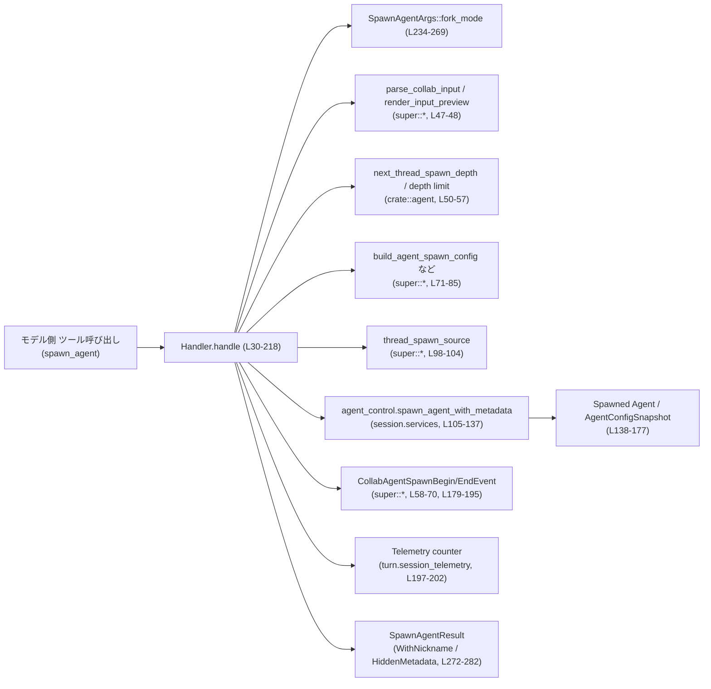
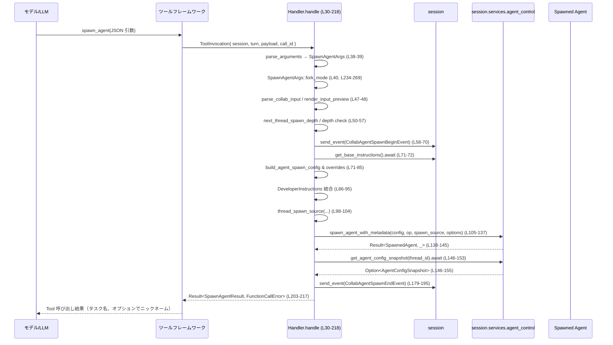

# core/src/tools/handlers/multi_agents_v2/spawn.rs コード解説

## 0. ざっくり一言

- MultiAgentV2 向けの「spawn_agent」ツール呼び出しを処理し、新しいエージェントスレッドを起動するハンドラです。
- 引数のバリデーション、スレッド深さ制限、モデル・ロール設定、イベント通知、結果オブジェクトの生成までを一括で行います。

---

## 1. このモジュールの役割

### 1.1 概要

- このモジュールは **マルチエージェント環境での子エージェント生成** を扱うツールハンドラです。
- JSON 引数を `SpawnAgentArgs` にデシリアライズし、`agent_control.spawn_agent_with_metadata` を通じて新規エージェントを作成し、その結果を `SpawnAgentResult` としてモデル側に返します（`spawn.rs:L30-218`, `spawn.rs:L221-231`, `spawn.rs:L272-282`）。
- 生成されたエージェントには、専用の Developer Instructions（`SPAWN_AGENT_DEVELOPER_INSTRUCTIONS`）が付与され、親エージェントとの階層関係や責務も明示されます（`spawn.rs:L15-17`, `spawn.rs:L86-95`）。

### 1.2 アーキテクチャ内での位置づけ

次の図は、「spawn_agent」ツール呼び出しからエージェント生成までの主要コンポーネントの関係を示します。



- `Handler` は汎用 `ToolHandler` の一実装であり、上位のツールフレームワークから呼び出されます（`spawn.rs:L19-29`）。
- 実際のエージェント生成処理は `session.services.agent_control.spawn_agent_with_metadata` に委譲されています（`spawn.rs:L105-137`）。
- 前後に `CollabAgentSpawnBeginEvent` / `CollabAgentSpawnEndEvent` を送信しており、観測性（ログ・イベント）も担保されています（`spawn.rs:L58-70`, `spawn.rs:L179-195`）。

### 1.3 設計上のポイント

- **ステートレスなハンドラ**
  - `Handler` 構造体はフィールドを持たず、すべての状態は `ToolInvocation`・`session`・`turn` から取得します（`spawn.rs:L13`, `spawn.rs:L30-37`）。
- **エラーを `Result` / 独自エラー型で表現**
  - 失敗は `FunctionCallError` として表現され、`?` 演算子で早期リターンされています（例: `spawn.rs:L38-40`, `spawn.rs:L71-72`, `spawn.rs:L80-83`, `spawn.rs:L98-104`, `spawn.rs:L136-137`, `spawn.rs:L196-207`）。
- **スレッド深さの制御**
  - `next_thread_spawn_depth`・`agent_max_depth`・`exceeds_thread_spawn_depth_limit` により、スレッドのネスト深さを制限し、無限再帰的な spawn を防ぎます（`spawn.rs:L50-57`）。
- **履歴フォークの明示的な指定**
  - `SpawnAgentArgs::fork_mode` により、親の会話履歴をどこまでフォークするかを `none` / `all` / 正の整数で制御します（`spawn.rs:L221-231`, `spawn.rs:L234-269`）。
- **開発者向けインストラクションの合成**
  - 既存の `developer_instructions` に `SPAWN_AGENT_DEVELOPER_INSTRUCTIONS` を連結し、新しく spawn されたエージェントの振る舞いを明示します（`spawn.rs:L86-95`）。
- **メタデータの秘匿設定**
  - `turn.config.multi_agent_v2.hide_spawn_agent_metadata` に応じて、返却する `SpawnAgentResult` にニックネームを含めるかを制御します（`spawn.rs:L203-217`）。

---

## 2. 主要な機能一覧

- 子エージェントの起動 (`Handler::handle`)
- spawn 引数（JSON）のパースとバリデーション (`SpawnAgentArgs` + `SpawnAgentArgs::fork_mode`)
- 親→子エージェント間の初回メッセージ変換（`Op::UserInput` → `Op::InterAgentCommunication` 条件付き変換）
- エージェント生成イベント（Begin / End）の送信
- 生成結果の整形とログ出力 (`SpawnAgentResult` + `ToolOutput` 実装)

### 2.1 コンポーネント一覧（インベントリ）

| 名前 | 種別 | 可視性 | 行範囲 | 役割 / 用途 |
|------|------|--------|--------|-------------|
| `Handler` | 構造体 | `pub(crate)` | `spawn.rs:L13-13` | `ToolHandler` 実装のための空のマーカー型 |
| `SPAWN_AGENT_DEVELOPER_INSTRUCTIONS` | `const &str` | `pub(crate)` | `spawn.rs:L15-17` | spawn されたエージェント向けの固定 Developer Instructions テキスト |
| `impl ToolHandler for Handler` | impl ブロック | crate 内 | `spawn.rs:L19-218` | spawn_agent ツールの処理ロジック（`kind` / `matches_kind` / `handle`）を提供 |
| `Handler::kind` | 関数 | crate 内 | `spawn.rs:L22-24` | このツールが `ToolKind::Function` であることを示す |
| `Handler::matches_kind` | 関数 | crate 内 | `spawn.rs:L26-28` | `ToolPayload` が Function タイプかどうかを判定 |
| `Handler::handle` | `async fn` | crate 内 | `spawn.rs:L30-218` | spawn_agent ツール呼び出しの本体。引数パースからエージェント生成、結果返却までを実行 |
| `SpawnAgentArgs` | 構造体 | private | `spawn.rs:L221-231` | ツール引数（JSON）の受け皿。メッセージ、タスク名、モデルなどを保持 |
| `impl SpawnAgentArgs` | impl ブロック | private | `spawn.rs:L233-269` | `fork_mode` の解釈ロジックを提供 |
| `SpawnAgentArgs::fork_mode` | 関数 | private | `spawn.rs:L234-269` | `fork_turns` / `fork_context` から `SpawnAgentForkMode` を決定し、バリデーションを行う |
| `SpawnAgentResult` | enum | `pub(crate)` | `spawn.rs:L272-282` | spawn 結果をモデルに返すためのレスポンス型（ニックネーム付き/メタデータ非公開） |
| `impl ToolOutput for SpawnAgentResult` | impl ブロック | crate 内 | `spawn.rs:L284-299` | ログ表示・レスポンス変換・コードモード結果の生成を担当 |
| `SpawnAgentResult::log_preview` | 関数 | crate 内 | `spawn.rs:L285-287` | ログ用の JSON テキストプレビューを生成 |
| `SpawnAgentResult::success_for_logging` | 関数 | crate 内 | `spawn.rs:L289-291` | ログ用に成功扱いとするかどうかを返す（常に `true`） |
| `SpawnAgentResult::to_response_item` | 関数 | crate 内 | `spawn.rs:L293-295` | モデルへのレスポンス形式に変換 |
| `SpawnAgentResult::code_mode_result` | 関数 | crate 内 | `spawn.rs:L297-299` | コードモード用の JSON 結果を生成 |

---

## 3. 公開 API と詳細解説

### 3.1 型一覧（構造体・列挙体など）

| 名前 | 種別 | 役割 / 用途 |
|------|------|-------------|
| `Handler` | 構造体 | MultiAgentV2 の spawn_agent ツールを処理する `ToolHandler` 実装の本体（`spawn.rs:L13`, `spawn.rs:L19-29`）。 |
| `SpawnAgentArgs` | 構造体 | ツール呼び出しの JSON 引数をデシリアライズして保持する型。履歴フォークやモデル指定などを含む（`spawn.rs:L221-231`）。 |
| `SpawnAgentResult` | enum | ツール呼び出しの成功結果をモデルに返すためのレスポンス型。ニックネームを含む場合とメタデータを隠す場合の 2 バリアント（`spawn.rs:L272-282`）。 |

---

### 3.2 関数詳細

#### `Handler::handle(&self, invocation: ToolInvocation) -> Result<SpawnAgentResult, FunctionCallError>`

**概要**

- spawn_agent ツール呼び出し 1 回分を処理する非同期関数です（`spawn.rs:L30-218`）。
- 引数 JSON のパース・バリデーション、履歴フォークモードやロール（agent_type）の解釈、モデル/推論強度の上書き、エージェント生成サービス呼び出し、イベント送信、レスポンス生成までを行います。

**引数**

| 引数名 | 型 | 説明 |
|--------|----|------|
| `invocation` | `ToolInvocation` | 上位レイヤーから渡されるツール呼び出しコンテキスト。`session`・`turn`・`payload`・`call_id` などを含む（`spawn.rs:L31-37`）。 |

`ToolInvocation` の具体的な定義はこのチャンクには現れませんが、フィールド名からセッションオブジェクトや現在のターン情報、ツールのペイロードなどを保持していると読み取れます（`spawn.rs:L31-37`）。

**戻り値**

- `Ok(SpawnAgentResult)`:
  - 生成されたエージェントを表すタスク名と、設定次第ではニックネームを含むレスポンス（`SpawnAgentResult::WithNickname` または `SpawnAgentResult::HiddenMetadata`）を返します（`spawn.rs:L203-217`, `spawn.rs:L272-282`）。
- `Err(FunctionCallError)`:
  - 引数パースエラー、フォークモード指定エラー、深さ制限超過、ロール適用失敗、spawn 自体の失敗、タスク名欠落などの場合に返されます（`spawn.rs:L38-40`, `spawn.rs:L53-57`, `spawn.rs:L71-72`, `spawn.rs:L80-83`, `spawn.rs:L98-104`, `spawn.rs:L136-137`, `spawn.rs:L196-207`）。

**内部処理の流れ（アルゴリズム）**

1. **呼び出しコンテキストの展開と引数パース**
   - `ToolInvocation` から `session` / `turn` / `payload` / `call_id` を取り出します（`spawn.rs:L31-37`）。
   - `function_arguments(payload)?` で関数の引数部分を抽出し、`parse_arguments` で `SpawnAgentArgs` にデシリアライズします（`spawn.rs:L38-39`）。
   - `SpawnAgentArgs::fork_mode()?` を呼び出し、履歴フォークモードを決定します（`spawn.rs:L40`）。

2. **ロール名の決定と初期オペレーション生成**
   - `agent_type` をトリムし、空でなければロール名として使用します（`spawn.rs:L41-45`）。
   - `parse_collab_input(Some(args.message), None)?` で初期 `Op`（ユーザー入力など）を生成し（`spawn.rs:L47`）、`render_input_preview` でログやイベント用のプレビュー文字列を作成します（`spawn.rs:L48`）。

3. **スレッド深さの計算と制限チェック**
   - 親 `session_source` から `child_depth` を計算し（`next_thread_spawn_depth`）、`turn.config.agent_max_depth` と比較します（`spawn.rs:L50-52`）。
   - 深さ制限超過時は `FunctionCallError::RespondToModel("Agent depth limit reached...")` を返して処理を中断します（`spawn.rs:L53-57`）。

4. **Spawn 開始イベントとコンフィグ構築**
   - `CollabAgentSpawnBeginEvent` を `session.send_event` で送信し、spawn 開始を通知します（`spawn.rs:L58-70`）。
   - `build_agent_spawn_config` でベースコンフィグを構築し、その後 `apply_requested_spawn_agent_model_overrides`・`apply_role_to_config`・`apply_spawn_agent_runtime_overrides`・`apply_spawn_agent_overrides` でモデル・ロール・ランタイム設定・深さに基づく上書きを行います（`spawn.rs:L71-85`）。
   - `config.developer_instructions` に対し、既存値があればそれと `SPAWN_AGENT_DEVELOPER_INSTRUCTIONS` を結合し、なければ固定テキストのみを設定します（`spawn.rs:L86-95`）。

5. **Spawn ソースと初期メッセージの決定**
   - `thread_spawn_source` から spawn のメタデータを構築します。ここには `conversation_id`、親 `session_source`、`child_depth`、ロール名、タスク名などが含まれます（`spawn.rs:L98-104`）。
   - 初期 `Op` が「すべてテキストの `Op::UserInput`」かつ `spawn_source.get_agent_path()` が `Some` の場合、`Op::InterAgentCommunication` に変換し、親エージェントから子エージェントへの通信として表現します（`spawn.rs:L110-127`）。それ以外は元の `initial_operation` をそのまま渡します（`spawn.rs:L128-129`）。

6. **エージェント生成と結果の抽出**
   - `agent_control.spawn_agent_with_metadata(config, op, Some(spawn_source), SpawnAgentOptions { ... }).await` によりエージェントを生成します（`spawn.rs:L105-135`）。
   - 返り値を `map_err(collab_spawn_error)` でエラー変換し、`result: Result<_, FunctionCallError>` を得ます（`spawn.rs:L136-137`）。
   - `result` を参照し、成功時は `thread_id`・`metadata`・`status` を抽出、失敗時は `None` と `AgentStatus::NotFound` として扱います（`spawn.rs:L138-145`）。

7. **コンフィグスナップショットとメタデータの決定**
   - `new_thread_id` がある場合に限り `get_agent_config_snapshot` を呼び、スナップショットを取得します（`spawn.rs:L146-155`）。
   - スナップショットがあればそこから、なければ `metadata` から `new_agent_path`（タスク名として返す文字列）、`new_agent_nickname`、`new_agent_role` を決定します（`spawn.rs:L156-169`）。
   - モデルと `reasoning_effort` も同様に、スナップショットがあればそれを優先し、なければ引数またはデフォルト値を用います（`spawn.rs:L170-177`）。

8. **Spawn 終了イベントと結果の確定**
   - 上記情報を含む `CollabAgentSpawnEndEvent` を送信し、spawn の最終状態を通知します（`spawn.rs:L179-195`）。
   - その後で `let _ = result?;` により、spawn が失敗していた場合はここでエラーとして呼び出し元に返します（`spawn.rs:L196`）。
   - 成功時はロールタグ（`role_name` か `DEFAULT_ROLE_NAME`）でテレメトリカウンタを増加させます（`spawn.rs:L197-202`）。
   - `new_agent_path` が `None` の場合は「canonical task name がない」として `RespondToModel` エラーを返します（`spawn.rs:L203-207`）。

9. **レスポンスの構築**
   - `turn.config.multi_agent_v2.hide_spawn_agent_metadata` に応じて、ニックネームを隠すかどうかを決定します（`spawn.rs:L209-215`）。
   - メタデータを隠す場合は `SpawnAgentResult::HiddenMetadata { task_name }`、そうでなければ `SpawnAgentResult::WithNickname { task_name, nickname }` を返します（`spawn.rs:L210-217`）。

**Examples（使用例）**

`Handler` は通常、ツールフレームワークから呼び出される想定ですが、概念的な使用例を示します。

```rust
use core::tools::handlers::multi_agents_v2::spawn::Handler;
// 他にも ToolInvocation, FunctionCallError などが必要ですが、このチャンクには定義がありません。

async fn handle_spawn_tool(handler: &Handler, invocation: ToolInvocation)
    -> Result<(), FunctionCallError>
{
    // spawn_agent ツールを実行
    let result = handler.handle(invocation).await?; // 失敗時は FunctionCallError を返す

    // ログ出力（ToolOutput 実装経由）
    println!("Spawn result: {}", result.log_preview()); // spawn.rs:L285-287

    Ok(())
}
```

- 上記では、`ToolInvocation` の構築方法はこのチャンクには現れないため、省略しています。

**Errors / Panics**

- **Errors**
  - 引数 JSON のパース失敗: `parse_arguments` 内部でエラーになり、`FunctionCallError` にラップされて返ります（`spawn.rs:L39`）。
  - `fork_mode` の解釈失敗: `SpawnAgentArgs::fork_mode` がエラーを返す場合（`fork_turns` が不正など）、`handle` も同じエラーで失敗します（`spawn.rs:L40`, `spawn.rs:L234-269`）。
  - スレッド深さ制限超過: `exceeds_thread_spawn_depth_limit` が `true` の場合、「Agent depth limit reached...」というメッセージ付きで `RespondToModel` エラーを返します（`spawn.rs:L53-57`）。
  - コンフィグ構築やロール適用時のエラー: `build_agent_spawn_config`・`apply_requested_spawn_agent_model_overrides`・`apply_role_to_config` が失敗した場合、それぞれ `FunctionCallError` として伝播します（`spawn.rs:L71-72`, `spawn.rs:L73-80`, `spawn.rs:L81-83`）。
  - spawn 処理失敗: `spawn_agent_with_metadata` の失敗が `collab_spawn_error` を通じて `FunctionCallError` に変換され（`spawn.rs:L136-137`）、`result?` の箇所で返されます（`spawn.rs:L196`）。
  - 生成後に `agent_path` が存在しない: `new_agent_path` が `None` の場合、「canonical task name がない」として `RespondToModel` エラーが返されます（`spawn.rs:L203-207`）。

- **Panics**
  - この関数内には `unwrap` / `expect` / 明示的な `panic!` 呼び出しはありません。
  - `unwrap_or_else(AgentPath::root)` は失敗しないフォールバックであり、panic にはつながりません（`spawn.rs:L118-121`）。

**Edge cases（エッジケース）**

- `fork_turns` 未指定または空文字列:
  - `SpawnAgentArgs::fork_mode` が `Ok(None)` を返し、履歴フォークは行われません（`spawn.rs:L241-248`）。
- `fork_turns` が `"none"`（大小文字無視）:
  - 同様に `Ok(None)` を返します（`spawn.rs:L250-251`）。
- `fork_turns` が `"all"`:
  - `SpawnAgentForkMode::FullHistory` が選択されます（`spawn.rs:L253-255`）。
- `fork_turns` が `"0"` あるいは非数値:
  - エラーとなり、「`fork_turns must be ...`」というメッセージで `RespondToModel` が返されます（`spawn.rs:L257-265`）。
- `agent_type` が空白のみ:
  - `trim` 後に `filter` で除外され、ロール名は `None` として扱われます（`spawn.rs:L41-45`）。
- 初期 `Op` が `Op::UserInput` だが、テキスト以外の `UserInput` を含む:
  - `InterAgentCommunication` には変換されず、元の `initial_operation` がそのまま渡されます（`spawn.rs:L111-115`, `spawn.rs:L128-129`）。
- `hide_spawn_agent_metadata` が `true`:
  - ニックネームを含まない `HiddenMetadata { task_name }` が返されます（`spawn.rs:L209-212`）。

**使用上の注意点**

- `SpawnAgentArgs` は `#[serde(deny_unknown_fields)]` 付きなので、定義されていないフィールドを含む JSON を渡すとパースエラーになります（`spawn.rs:L221-223`）。
- 深さ制限 (`agent_max_depth`) に達している場合、spawn は行われず、親エージェントがタスクを処理するべきというメッセージを含むエラーが返されます（`spawn.rs:L53-57`）。
- `task_name` は後段で `new_agent_path` として返されるため、エージェント側で一意なタスク識別子として扱われる前提があると考えられますが、具体仕様はこのチャンクには現れません。
- 非同期関数であり、`await` を複数箇所で行うため、同一 `Handler` インスタンスから複数の `handle` 呼び出しが同時に走っても、`Handler` 自体はステートレスであるためコンフリクトしない構造になっています（`spawn.rs:L13`, `spawn.rs:L30-218`）。ただし `session` やその内部サービスがスレッドセーフかどうかはこのチャンクからは分かりません。

---

#### `SpawnAgentArgs::fork_mode(&self) -> Result<Option<SpawnAgentForkMode>, FunctionCallError>`

**概要**

- `SpawnAgentArgs` 内の `fork_turns` / `fork_context` フィールドを解釈して、履歴フォークモード（`SpawnAgentForkMode`）を決定します（`spawn.rs:L234-269`）。
- サポートされない `fork_context` を検出しエラーとする一方で、`none` / `all` / 正の整数文字列の 3 パターンをサポートします。

**引数**

| 引数名 | 型 | 説明 |
|--------|----|------|
| `&self` | `&SpawnAgentArgs` | メッセージやフォーク指定を含むツール引数構造体への参照（`spawn.rs:L221-231`）。 |

**戻り値**

- `Ok(None)`:
  - 履歴をフォークしない（親の履歴を引き継がない）ことを表します。
- `Ok(Some(SpawnAgentForkMode::FullHistory))`:
  - 親セッションの全履歴をフォークすることを表します（`spawn.rs:L253-255`）。
- `Ok(Some(SpawnAgentForkMode::LastNTurns(n)))`:
  - 親セッションの直近 `n` ターンのみをフォークします（`spawn.rs:L257-268`）。
- `Err(FunctionCallError::RespondToModel)`:
  - サポートされない `fork_context` が指定された場合、または `fork_turns` の形式が不正な場合に返されます（`spawn.rs:L235-238`, `spawn.rs:L257-265`）。

**内部処理の流れ**

1. `fork_context` の禁止チェック:
   - `if self.fork_context.is_some()` なら即座にエラーを返します（`spawn.rs:L235-238`）。
2. `fork_turns` の正規化:
   - `as_deref` → `trim` → 空文字列除去を行い、`Option<&str>` にします（`spawn.rs:L241-246`）。
   - `fork_turns` が存在しない（`None`）場合は `Ok(None)` を返します（`spawn.rs:L247-248`）。
3. 予約文字列 `"none"` / `"all"` の処理:
   - `"none"`（大小文字無視）なら `Ok(None)`（`spawn.rs:L250-251`）。
   - `"all"` なら `Ok(Some(SpawnAgentForkMode::FullHistory))`（`spawn.rs:L253-255`）。
4. 数値文字列としての解釈:
   - その他の文字列は `usize` としてパースを試みます（`spawn.rs:L257`）。
   - パースに失敗した場合や、パースに成功しても `0` の場合はエラーにします（`spawn.rs:L257-265`）。
   - 正の整数なら `SpawnAgentForkMode::LastNTurns(last_n_turns)` を返します（`spawn.rs:L268`）。

**Examples（使用例）**

```rust
// SpawnAgentArgs の一例（ReasoningEffort 型の具体定義はこのチャンクには現れないため None にしています）
let args = SpawnAgentArgs {
    message: "Research X".to_string(),
    task_name: "research_x".to_string(),
    agent_type: Some("researcher".to_string()),
    model: Some("gpt-4.1-mini".to_string()),
    reasoning_effort: None,
    fork_turns: Some("3".to_string()),
    fork_context: None,
};

// 直近 3 ターンのみフォーク
let mode = args.fork_mode()?; // Ok(Some(SpawnAgentForkMode::LastNTurns(3)))
```

**Errors / Panics**

- **Errors**
  - `fork_context` が `Some` の場合:
    - 「`fork_context is not supported in MultiAgentV2; use fork_turns instead`」というメッセージで `RespondToModel` エラーを返します（`spawn.rs:L235-238`）。
  - `fork_turns` のパース失敗:
    - `usize` パースに失敗する文字列（例: `"abc"`, `"1.5"`）の場合、「`fork_turns must be ...`」というメッセージで `RespondToModel` を返します（`spawn.rs:L257-261`）。
  - `fork_turns` が `"0"` の場合:
    - 同じメッセージでエラーを返します（`spawn.rs:L262-265`）。
- **Panics**
  - パニックを引き起こすようなコード（`unwrap` 等）は使用していません。

**Edge cases（エッジケース）**

- `fork_turns` が `None` または空文字列:
  - 完全にフォークなし（`Ok(None)`）扱いになります（`spawn.rs:L241-248`）。
- `fork_turns` に空白付き:
  - `trim` 済みなので `"  all "` のような文字列も `"all"` として扱われます（`spawn.rs:L243-245`, `spawn.rs:L253-255`）。
- 大文字・小文字の違い:
  - `eq_ignore_ascii_case` を使っているため、`"ALL"`, `"All"` なども `"all"` と同じとみなされます（`spawn.rs:L250-255`）。

**使用上の注意点**

- `fork_context` は MultiAgentV2 ではサポートされておらず、指定すると必ずエラーになります（`spawn.rs:L235-238`）。
- `fork_turns` の仕様は `none` / `all` / 正の整数の文字列に限られており、それ以外はユーザーエラーとしてモデルに返されます（`spawn.rs:L257-265`）。
- フォークモードは spawn オプション `SpawnAgentOptions` にそのまま渡されるため、上位サービス側での扱いと一貫している必要がありますが、サービス側の実装はこのチャンクには現れません（`spawn.rs:L131-134`）。

---

### 3.3 その他の関数

| 関数名 | 役割（1 行） | 根拠 |
|--------|--------------|------|
| `Handler::kind(&self) -> ToolKind` | このツールが `ToolKind::Function` であることを返し、ツール種別を識別します。 | `spawn.rs:L22-24` |
| `Handler::matches_kind(&self, payload: &ToolPayload) -> bool` | ペイロードが関数型ツール呼び出しかどうかを `matches!` マクロで判定します。 | `spawn.rs:L26-28` |
| `SpawnAgentResult::log_preview(&self) -> String` | レスポンスを JSON テキストとして整形し、spawn_agent 用のログ表示に使います。 | `spawn.rs:L285-287` |
| `SpawnAgentResult::success_for_logging(&self) -> bool` | ログ用に「成功扱い」とするため、常に `true` を返します。 | `spawn.rs:L289-291` |
| `SpawnAgentResult::to_response_item(&self, call_id: &str, payload: &ToolPayload) -> ResponseInputItem` | モデルへのレスポンス形式（`ResponseInputItem`）に変換します。 | `spawn.rs:L293-295` |
| `SpawnAgentResult::code_mode_result(&self, _payload: &ToolPayload) -> JsonValue` | コードモード用の JSON 結果を構築します。 | `spawn.rs:L297-299` |

いずれも内部で `tool_output_json_text`・`tool_output_response_item`・`tool_output_code_mode_result` を呼び出す薄いラッパーであり、ロジックの詳細はそれらの関数に委譲されています（`spawn.rs:L285-287`, `spawn.rs:L293-295`, `spawn.rs:L297-299`）。

---

## 4. データフロー

spawn_agent ツール呼び出しに対する典型的なデータフローをシーケンス図で示します。



要点:

- 非同期処理の主要な外部呼び出しは `session.send_event`, `session.get_base_instructions`, `agent_control.spawn_agent_with_metadata`, `agent_control.get_agent_config_snapshot` です（`spawn.rs:L58-70`, `spawn.rs:L71-72`, `spawn.rs:L105-137`, `spawn.rs:L146-153`）。
- Begin/End イベントの送信により、spawn プロセスは観測可能になっています。
- spawn の成功/失敗に関係なく End イベントが送られ、その後に `result?` でエラーが伝播します（`spawn.rs:L138-145`, `spawn.rs:L179-196`）。

---

## 5. 使い方（How to Use）

### 5.1 基本的な使用方法

通常は、モデルが `spawn_agent` ツールを Function 呼び出しとして利用し、フレームワークが `Handler` に委譲します。ここでは、引数 JSON のイメージを示します。

```json
{
  "message": "Please research topic X and summarize the key points.",
  "task_name": "research_topic_x",
  "agent_type": "researcher",
  "model": "gpt-4.1-mini",
  "fork_turns": "3"
}
```

- この JSON は `SpawnAgentArgs` にデシリアライズされます（`spawn.rs:L221-231`）。
- `reasoning_effort` は省略可能です（`Option<ReasoningEffort>`、`spawn.rs:L228`）。

Rust コード上でのハンドラ利用イメージは次のようになります。

```rust
// Handler はステートレスなので共有して使える
let handler = Handler;

// ToolInvocation の構築方法はこのチャンクには現れないため擬似コードです
let invocation = ToolInvocation {
    session,
    turn,
    payload,  // Function 型の ToolPayload
    call_id,
    // ...
};

let result: SpawnAgentResult = handler.handle(invocation).await?;
println!("Spawned task: {}", result.log_preview());
```

### 5.2 よくある使用パターン

1. **履歴をフォークしない spawn**

   ```json
   {
     "message": "Start a completely fresh investigation on Y.",
     "task_name": "fresh_investigation_y",
     "fork_turns": "none"
   }
   ```

   - `fork_mode()` は `Ok(None)` を返し、親履歴なしで子エージェントが開始します（`spawn.rs:L250-251`）。

2. **全履歴をフォークする spawn**

   ```json
   {
     "message": "Continue the current project focusing on Z.",
     "task_name": "project_z_child",
     "fork_turns": "all"
   }
   ```

   - `SpawnAgentForkMode::FullHistory` となり、親セッションの全履歴がコピーされます（`spawn.rs:L253-255`）。

3. **直近 N ターンのみフォークする spawn**

   ```json
   {
     "message": "Take over from the last few turns and finalize the summary.",
     "task_name": "finalize_summary",
     "fork_turns": "5"
   }
   ```

   - `SpawnAgentForkMode::LastNTurns(5)` となります（`spawn.rs:L257-268`）。

### 5.3 よくある間違い

```rust
// 間違い例: fork_context を指定してしまう
let args = SpawnAgentArgs {
    message: "Do X".to_string(),
    task_name: "task_x".to_string(),
    agent_type: None,
    model: None,
    reasoning_effort: None,
    fork_turns: None,
    fork_context: Some(true), // ❌ MultiAgentV2 ではサポートされない
};

let mode = args.fork_mode();  // エラー: "fork_context is not supported ..."（spawn.rs:L235-238）
```

```rust
// 正しい例: fork_turns を使う
let args = SpawnAgentArgs {
    message: "Do X".to_string(),
    task_name: "task_x".to_string(),
    agent_type: None,
    model: None,
    reasoning_effort: None,
    fork_turns: Some("all".to_string()),
    fork_context: None, // ✅ 未指定
};

let mode = args.fork_mode()?; // Ok(Some(SpawnAgentForkMode::FullHistory))
```

```json
// 間違い例: 不正な fork_turns
{
  "message": "Task",
  "task_name": "t",
  "fork_turns": "zero"   // ❌ 数値でも none/all でもない
}

// → "fork_turns must be `none`, `all`, or a positive integer string"（spawn.rs:L257-261）
```

### 5.4 使用上の注意点（まとめ）

- 引数 JSON は `SpawnAgentArgs` にぴったり一致している必要があり、余分なフィールドは `deny_unknown_fields` によりエラーになります（`spawn.rs:L221-223`）。
- `agent_max_depth` を超えるネストでの spawn は拒否され、「自分でタスクを解決せよ」というメッセージが返されます（`spawn.rs:L50-57`）。
- テキスト以外（添付など）の `UserInput` を含む場合、`InterAgentCommunication` ではなく元の `Op` が渡されるため、子エージェントの初期入力がどのように解釈されるかはサービス側の挙動に依存します（`spawn.rs:L111-129`）。
- `hide_spawn_agent_metadata` が有効な環境では、ニックネームを期待せず、`task_name` のみで子エージェントを識別する設計とする必要があります（`spawn.rs:L209-217`）。

---

## 6. 変更の仕方（How to Modify）

### 6.1 新しい機能を追加する場合

- **新しい引数を追加したい場合**
  1. `SpawnAgentArgs` にフィールドを追加します（`spawn.rs:L221-231`）。
     - `serde(deny_unknown_fields)` が付いているため、既存クライアントとの互換性を考える場合はフィールド名や型を慎重に設計する必要があります（`spawn.rs:L221-223`）。
  2. `Handler::handle` 内でそのフィールドを参照し、コンフィグの上書きや `SpawnAgentOptions` への反映を行います（適切な位置は `build_agent_spawn_config` や `apply_*_overrides` 付近が自然です: `spawn.rs:L71-85`）。
  3. 必要であれば Begin/End イベントに新フィールドを追加し、観測可能性を維持します（`spawn.rs:L61-67`, `spawn.rs:L182-191`）。

- **新しい結果バリアントを追加したい場合**
  1. `SpawnAgentResult` に新バリアントを追加します（`spawn.rs:L272-282`）。
  2. `ToolOutput for SpawnAgentResult` 実装がすべてのバリアントをカバーしているか確認します（`spawn.rs:L284-299`）。
  3. `Handler::handle` の末尾で、新しいバリアントを返す条件を実装します（`spawn.rs:L203-217`）。

### 6.2 既存の機能を変更する場合

- 影響範囲を確認する際のポイント:
  - 履歴フォーク仕様を変更する場合は、`SpawnAgentArgs::fork_mode` と `SpawnAgentOptions` の利用箇所（`spawn.rs:L234-269`, `spawn.rs:L131-134`）をセットで確認する必要があります。
  - 深さ制限ロジックを変更する場合は、`next_thread_spawn_depth`・`exceeds_thread_spawn_depth_limit`・`agent_max_depth` の関係（`spawn.rs:L50-57`）を把握した上で、上位の設定や UI との整合性を確認する必要があります。
  - DeveloperInstructions の付与方法を変更する場合は、既存の `config.developer_instructions` をどう扱うか（マージ / 上書き）を慎重に設計する必要があります（`spawn.rs:L86-95`）。

- 変更時の契約上の注意:
  - `SpawnAgentArgs` のフィールド名や意味を変更すると、モデル側のツール呼び出しおよび既存の JSON 生成ロジックに影響します。
  - `SpawnAgentResult` の構造を変更すると、下流で結果をパースするコンポーネントにも影響が及びます。

---

## 7. 関連ファイル

このモジュールと密接に関係するモジュール／コンポーネント（ファイルの正確なパスはこのチャンクには現れません）をまとめます。

| パス / モジュール | 役割 / 関係 |
|-------------------|------------|
| `super::*` | `ToolHandler` トレイト、`ToolKind`、`ToolPayload`、`ToolInvocation`、イベント型、`parse_collab_input`、`build_agent_spawn_config`、`apply_*_overrides`、`thread_spawn_source`、`collab_spawn_error`、`UserInput` など、本ハンドラが利用するコアツール基盤を提供します（`spawn.rs:L1`, `spawn.rs:L47`, `spawn.rs:L58-70`, `spawn.rs:L71-85`, `spawn.rs:L98-104`, `spawn.rs:L110-115`, `spawn.rs:L138-145`, `spawn.rs:L179-195`, `spawn.rs:L285-299`）。 |
| `crate::agent::control` | `SpawnAgentForkMode`・`SpawnAgentOptions`・`render_input_preview`・`next_thread_spawn_depth` を提供し、spawn の挙動や UI 上のプレビューに関わります（`spawn.rs:L2-7`）。 |
| `crate::agent::role` | `apply_role_to_config` と `DEFAULT_ROLE_NAME` を提供し、エージェントのロール設定を行います（`spawn.rs:L6-7`, `spawn.rs:L197`）。 |
| `codex_protocol::protocol` | `Op`（操作種別）と `InterAgentCommunication` 型を提供し、親子エージェント間のメッセージ表現に使用されます（`spawn.rs:L10-11`, `spawn.rs:L110-127`）。 |
| `codex_protocol::AgentPath` | エージェントパス（task_name として返される文字列の基盤）を表現し、ルートパスのフォールバックも提供します（`spawn.rs:L8`, `spawn.rs:L118-121`）。 |
| `codex_protocol::models::DeveloperInstructions` | Developer Instructions テキストの結合・整形を行うユーティリティで、本モジュールは spawn 専用の追記処理に利用しています（`spawn.rs:L9`, `spawn.rs:L86-95`）。 |

テストコードや追加のユーティリティが存在するかどうかは、このチャンクからは分かりません。
