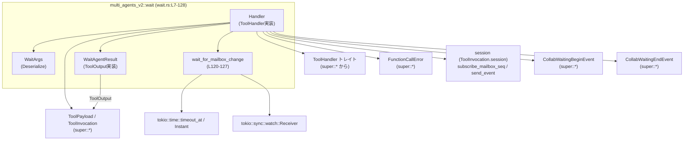
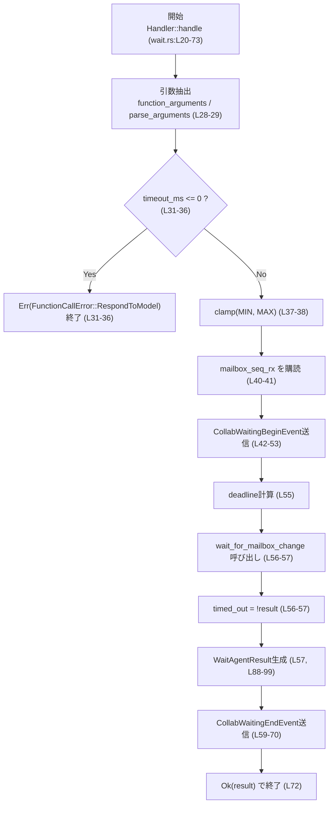
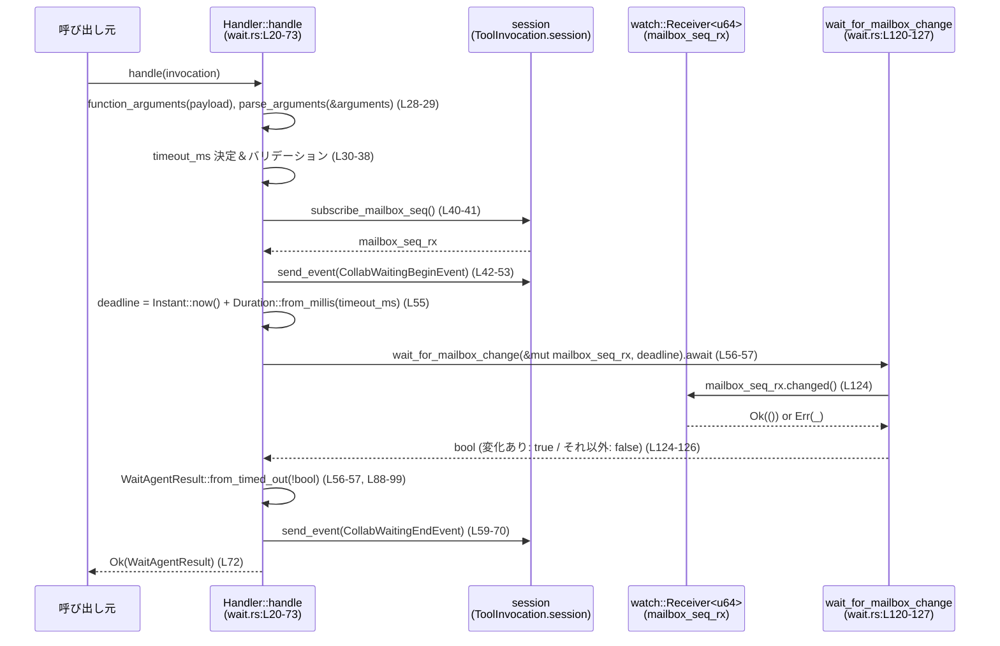

# core/src/tools/handlers/multi_agents_v2/wait.rs コード解説

## 0. ざっくり一言

- マルチエージェント用ツール呼び出しの一種として、「一定時間またはメールボックスの更新まで待つ」処理を行うハンドラです（`Handler::handle`、`wait_for_mailbox_change`；wait.rs:L20-73, L120-127）。
- 待機の開始・終了イベントをセッションに送信し、タイムアウトしたかどうかを `WaitAgentResult` として返します（wait.rs:L42-53, L59-72, L82-99）。

---

## 1. このモジュールの役割

### 1.1 概要

このモジュールはマルチエージェント環境における「待機ツール」を実装しています。

- ツール呼び出し用トレイト `ToolHandler` を実装する `Handler` を提供し、ツール種別が「関数」である呼び出しにマッチします（wait.rs:L9-18）。
- 引数から待機時間（ミリ秒）を受け取り、メールボックスのシーケンス番号が変化するか、指定タイムアウトまで非同期で待機します（wait.rs:L20-38, L40-57, L120-127）。
- 待機の結果を `WaitAgentResult` として返し、ログ用・レスポンス用のフォーマットも実装しています（wait.rs:L82-99, L102-117）。

### 1.2 アーキテクチャ内での位置づけ

このファイルから分かる依存関係を図示します。



- `Handler` は `ToolHandler` トレイトを実装し、`ToolInvocation` を入口としてセッションにアクセスします（wait.rs:L9-27）。
- セッションからメールボックス監視用の `watch::Receiver<u64>` を受け取り、`wait_for_mailbox_change` で `tokio::time::timeout_at` を用いた待機を行います（wait.rs:L40-41, L55-57, L120-127）。
- 待機開始/終了時にそれぞれ `CollabWaitingBeginEvent` と `CollabWaitingEndEvent` を送信します（wait.rs:L42-53, L59-70）。
- `WaitAgentResult` は `ToolOutput` を実装しており、上位のツール実行基盤から標準的な形でログ・レスポンスに変換できるようになっています（wait.rs:L82-86, L102-117）。

### 1.3 設計上のポイント

コードから読み取れる特徴は次のとおりです。

- **ステートレスなハンドラ**
  - `Handler` はフィールドを持たないゼロサイズ構造体で、内部状態を持ちません（wait.rs:L7）。
  - 全ての状態は `handle` のローカル変数とセッションに保持されます（wait.rs:L20-72）。
- **非同期・イベント駆動**
  - `handle` と `wait_for_mailbox_change` は `async fn` であり、Tokio の非同期ランタイム上で動作します（wait.rs:L20, L120）。
  - メールボックス更新待ちは `tokio::time::timeout_at` と `watch::Receiver::changed()` を用いており、ポーリングではなくイベント駆動です（wait.rs:L55-57, L120-127）。
- **明示的な引数バリデーション**
  - `timeout_ms` が 0 以下の場合には即座にエラーを返し、それ以外の場合は最小値・最大値の範囲にクランプします（wait.rs:L30-38）。
- **厳格な引数スキーマ**
  - 引数を表す `WaitArgs` は `serde(deny_unknown_fields)` が付与されており、定義されていないフィールドを含む入力を拒否します（wait.rs:L76-79）。
- **結果の標準化**
  - `WaitAgentResult` は `ToolOutput` を実装し、ログ/レスポンス/コードモードなど、周辺の統一インターフェースに従っています（wait.rs:L82-86, L102-117）。

---

## 2. 主要な機能一覧

- 待機ツールハンドラ `Handler`:
  - ツール呼び出しのうち関数型 (`ToolPayload::Function`) のみを扱い、待機処理を実行します（wait.rs:L9-20）。
- 待機引数 `WaitArgs`:
  - ミリ秒単位のタイムアウト値 `timeout_ms` をオプションで受け取るためのデシリアライズ用構造体です（wait.rs:L76-80）。
- 待機結果 `WaitAgentResult`:
  - 待機がタイムアウトしたかどうかと、結果メッセージを保持します（wait.rs:L82-99）。
  - ログ出力・レスポンス変換・コードモード用のインターフェースを提供します（wait.rs:L102-117）。
- メールボックス変更待ち関数 `wait_for_mailbox_change`:
  - `tokio::sync::watch::Receiver<u64>` とタイムアウト時刻を受け取り、その時刻までに変更があったかどうかを `bool` で返します（wait.rs:L120-127）。

---

## 3. 公開 API と詳細解説

### 3.1 型一覧（構造体・列挙体など）

このファイルに定義されている主な型とその役割です。

| 名前 | 種別 | 公開範囲 | 役割 / 用途 | 行範囲 |
|------|------|----------|-------------|--------|
| `Handler` | 構造体（フィールドなし） | `pub(crate)` | `ToolHandler` を実装する待機ツールのハンドラ | wait.rs:L7 |
| `WaitArgs` | 構造体 | モジュール内 private | 待機時間 `timeout_ms` を受け取るための引数構造体。未知フィールドを拒否 | wait.rs:L76-80 |
| `WaitAgentResult` | 構造体 | `pub(crate)` | 待機結果（メッセージとタイムアウトフラグ）を保持し、`ToolOutput` を実装 | wait.rs:L82-86 |

関連する impl ブロックとメソッド:

| 名前 | 種別 | 公開範囲 | 役割 / 用途 | 行範囲 |
|------|------|----------|-------------|--------|
| `impl ToolHandler for Handler` | impl | モジュール内 | `kind` / `matches_kind` / `handle` を実装 | wait.rs:L9-73 |
| `impl WaitAgentResult` | impl（固有メソッド） | モジュール内 | `from_timed_out` で結果の生成を行う | wait.rs:L88-100 |
| `impl ToolOutput for WaitAgentResult` | impl | モジュール内 | ログ・レスポンス・コードモード用の変換メソッドを提供 | wait.rs:L102-117 |

### 3.2 関数詳細（重要なもの）

#### `Handler::handle(&self, invocation: ToolInvocation) -> Result<WaitAgentResult, FunctionCallError>`

**概要**

- ツール呼び出し `invocation` を受け取り、待機処理を実行して `WaitAgentResult` を返します（wait.rs:L20-73）。
- 指定された `timeout_ms` の間、セッションのメールボックスシーケンスが変化するのを待つか、タイムアウト判定を行います（wait.rs:L30-38, L40-57, L120-127）。

**引数**

| 引数名 | 型 | 説明 |
|--------|----|------|
| `self` | `&Handler` | ステートレスなハンドラインスタンス（ゼロサイズ構造体） |
| `invocation` | `ToolInvocation` | セッション、ターン、ペイロード、`call_id` などを含むツール呼び出し情報（定義はこのチャンクには現れません） |

`invocation` はパターンマッチで次のフィールドに分解されています（wait.rs:L21-27）。

- `session`: セッションオブジェクト。メールボックス購読・イベント送信を行います（wait.rs:L21, L40-41, L42-53, L59-70）。
- `turn`: 会話のターン情報。`send_event` に渡されます（wait.rs:L23, L44, L61）。
- `payload`: ツール呼び出しのペイロード。`function_arguments` の入力になります（wait.rs:L24, L28）。
- `call_id`: このツール呼び出しを識別する ID（wait.rs:L25, L49, L64）。

**戻り値**

- `Ok(WaitAgentResult)`:
  - 待機処理が正常に完了した場合の結果です。`timed_out` フラグにより、タイムアウトしたかどうかが分かります（wait.rs:L55-57, L82-99）。
- `Err(FunctionCallError)`:
  - 引数のパースエラーや `timeout_ms` が 0 以下だった場合などに返されます（wait.rs:L28-29, L31-38）。

**内部処理の流れ（アルゴリズム）**

1. `ToolInvocation` を分解し、`session`, `turn`, `payload`, `call_id` を取得する（wait.rs:L21-27）。
2. `payload` から関数引数文字列/データを取得するために `function_arguments(payload)?` を呼び出す（wait.rs:L28）。
3. 取得した引数を `WaitArgs` にパースするため、`parse_arguments(&arguments)?` を呼び出す（wait.rs:L29）。
4. `WaitArgs.timeout_ms` から実際のタイムアウト値 `timeout_ms` を決定する（`None` の場合は `DEFAULT_WAIT_TIMEOUT_MS` を使用）（wait.rs:L30）。
5. `timeout_ms` が 0 以下なら `FunctionCallError::RespondToModel("timeout_ms must be greater than zero")` を返して終了する（wait.rs:L31-36）。
6. `timeout_ms` を `MIN_WAIT_TIMEOUT_MS`〜`MAX_WAIT_TIMEOUT_MS` の範囲に `clamp` する（wait.rs:L37-38）。
7. セッションからメールボックスシーケンスの `watch::Receiver<u64>` を取得する（wait.rs:L40-41）。
8. 待機開始イベント `CollabWaitingBeginEvent` を作成し、`session.send_event` で送信する（wait.rs:L42-53）。
9. `Instant::now()` と `Duration::from_millis(timeout_ms as u64)` により締切時刻 `deadline` を計算する（wait.rs:L55）。
10. `wait_for_mailbox_change(&mut mailbox_seq_rx, deadline).await` を呼び、メールボックスの変化を待つ（wait.rs:L56-57）。
    - 戻り値が `true` の場合: 変化が発生した。
    - 戻り値が `false` の場合: タイムアウトまたはチャンネルクローズ等。
11. `timed_out` フラグを `!<戻り値>` として計算し（wait.rs:L56）、`WaitAgentResult::from_timed_out(timed_out)` で結果を生成する（wait.rs:L57-57, L88-99）。
12. 待機終了イベント `CollabWaitingEndEvent` を作成し、`session.send_event` で送信する（wait.rs:L59-70）。
13. 最後に `Ok(result)` を返す（wait.rs:L72）。

簡単なフローチャート（`handle` の主要部）:



**Examples（使用例）**

このファイルだけでは `ToolInvocation` や `ToolPayload` の具体的な定義が分からないため、概念的な例として示します。

```rust
// 概念例: Handler を使って待機ツールを実行する（型定義はこのチャンクには現れません）

use core::tools::handlers::multi_agents_v2::wait::Handler;

// 非同期コンテキスト内を想定
async fn run_wait_tool(invocation: ToolInvocation) -> Result<(), FunctionCallError> {
    let handler = Handler; // Handler はフィールドのない構造体（wait.rs:L7）

    // ツール呼び出しを処理し、待機結果を得る（wait.rs:L20-73）
    let result: WaitAgentResult = handler.handle(invocation).await?;

    // 結果の利用（タイムアウトしたかどうかを確認）
    if result.timed_out {
        println!("待機はタイムアウトしました: {}", result.message);
    } else {
        println!("待機は完了しました: {}", result.message);
    }

    Ok(())
}
```

※ `ToolInvocation` などの定義・構築方法はこのチャンクには現れないため、実際には周辺モジュールの定義に従う必要があります。

**Errors / Panics**

- `Err(FunctionCallError)` が返る条件（コードから読み取れる範囲）:
  - `function_arguments(payload)` がエラーを返した場合（wait.rs:L28）。
  - `parse_arguments(&arguments)` がエラーを返した場合（wait.rs:L29）。
  - `timeout_ms` に 0 以下の値が指定された場合（`ms if ms <= 0` のパターン）（wait.rs:L31-36）。
    - この場合 `FunctionCallError::RespondToModel` が返され、「timeout_ms must be greater than zero」というメッセージが含まれます（wait.rs:L33-35）。
- panic 条件:
  - このファイル内のコードから、明示的な `panic!` や `unwrap` 等は確認できません（wait.rs:L1-128）。
  - `Duration::from_millis(timeout_ms as u64)` は `as` キャストであり、panic を発生させません（wait.rs:L55）。

**Edge cases（エッジケース）**

- `timeout_ms` が `None` の場合:
  - `DEFAULT_WAIT_TIMEOUT_MS` が使用されます（wait.rs:L30）。その値自体はこのチャンクには現れません。
- `timeout_ms` が 0 または負値の場合:
  - 即座に `FunctionCallError::RespondToModel("timeout_ms must be greater than zero")` が返され、待機処理は実行されません（wait.rs:L31-36）。
- `timeout_ms` が極端に小さい／大きい場合:
  - `MIN_WAIT_TIMEOUT_MS` と `MAX_WAIT_TIMEOUT_MS` の範囲にクランプされます（wait.rs:L37-38）。
  - 具体的な範囲の値はこのチャンクには現れません。
- メールボックスの `watch::Receiver` が締切前にクローズされた場合:
  - `wait_for_mailbox_change` 内の `mailbox_seq_rx.changed()` は `Err(_)` を返し、最終的に `false` が返ります（wait.rs:L124-126）。
  - その結果 `timed_out = !false` となり、`timed_out == true` として扱われます（wait.rs:L56-57）。
  - 「チャネルクローズ」と「タイムアウト」が区別されない点が挙動上の特徴です。
- メールボックスシーケンスが即座に更新される場合:
  - `wait_for_mailbox_change` はすぐに `true` を返し、`timed_out` は `false` になります（wait.rs:L55-57, L124-125）。

**使用上の注意点**

- `timeout_ms` には 1 以上の値を指定する必要があります。0 や負の値はエラーになります（wait.rs:L31-36）。
- `timeout_ms` は内部で最小値・最大値にクランプされるため、指定した値がそのまま使用されない場合があります（wait.rs:L37-38）。
- メールボックスが締切時刻前にクローズされた場合でも、`timed_out == true` として扱われる点に注意が必要です（wait.rs:L56-57, L124-126）。
- `handle` は非同期関数であり、Tokio などの非同期ランタイム上で `.await` される必要があります（wait.rs:L20）。

---

#### `WaitAgentResult::from_timed_out(timed_out: bool) -> WaitAgentResult`

**概要**

- 待機結果フラグ `timed_out` に応じて適切なメッセージを設定し、`WaitAgentResult` を生成します（wait.rs:L88-99）。

**引数**

| 引数名 | 型 | 説明 |
|--------|----|------|
| `timed_out` | `bool` | 待機がタイムアウト相当（true）か正常完了（false）かを表すフラグ |

**戻り値**

- `WaitAgentResult`:
  - `timed_out` フィールドには引数の値がそのまま設定されます（wait.rs:L95-98）。
  - `message` フィールドには次のいずれかの文字列が設定されます（wait.rs:L90-93）。
    - `timed_out == true`: `"Wait timed out."`
    - `timed_out == false`: `"Wait completed."`

**内部処理の流れ**

1. `timed_out` が `true` かどうかで `message` に代入する文字列リテラルを分岐する（wait.rs:L89-93）。
2. `message.to_string()` で `String` に変換し、`timed_out` と合わせて `WaitAgentResult` を構築して返す（wait.rs:L95-98）。

**Examples（使用例）**

```rust
// タイムアウトした場合の結果生成（wait.rs:L88-99）
let timed_out_result = WaitAgentResult::from_timed_out(true);
assert_eq!(timed_out_result.message, "Wait timed out.");
assert!(timed_out_result.timed_out);

// 正常完了した場合の結果生成
let completed_result = WaitAgentResult::from_timed_out(false);
assert_eq!(completed_result.message, "Wait completed.");
assert!(!completed_result.timed_out);
```

**Errors / Panics**

- この関数ではエラー型や `Result` は使用されておらず、panic を発生させるような処理も含まれていません（wait.rs:L88-99）。

**Edge cases**

- `timed_out` が `true` / `false` の2パターンのみであり、それぞれに対応するメッセージが固定です（wait.rs:L90-93）。
- `message` はローカライズされていない英語の固定文字列です（wait.rs:L90-93）。

**使用上の注意点**

- `from_timed_out` は純粋な変換関数であり、副作用はありません。
- `Handler::handle` 内では `wait_for_mailbox_change` の戻り値の否定を与えているため、「タイムアウト」と「チャンネルクローズ」が区別されないことに注意が必要です（wait.rs:L56-57, L124-126）。

---

#### `impl ToolOutput for WaitAgentResult` の主要メソッド

`WaitAgentResult` を周辺のツール基盤に統合するためのメソッド群です（wait.rs:L102-117）。

##### `log_preview(&self) -> String`

**概要**

- ログ出力用のプレビュー文字列を返します（wait.rs:L103-105）。
- 実装では `tool_output_json_text(self, "wait_agent")` を呼び出しています（wait.rs:L104）。

**使用例（概念）**

```rust
let result = WaitAgentResult::from_timed_out(false);
let preview = result.log_preview(); // JSON 形式のテキストになることが想定されます（実際の形式はこのチャンクには現れません）
println!("log preview: {}", preview);
```

**注意点**

- `tool_output_json_text` の具体的な実装はこのチャンクには現れないため、実際のフォーマットは外部定義に依存します（wait.rs:L104）。

##### `to_response_item(&self, call_id: &str, payload: &ToolPayload) -> ResponseInputItem`

**概要**

- モデルへのレスポンス入力として使用される `ResponseInputItem` に変換します（wait.rs:L111-113）。
- 内部で `tool_output_response_item` を呼び出し、ツール名 `"wait_agent"` を渡しています（wait.rs:L112-112）。

**注意点**

- `call_id` と `payload` により、元のツール呼び出しとの対応付けが行われます（wait.rs:L111-113）。
- 実際の `ResponseInputItem` 構造はこのチャンクには現れません。

##### `code_mode_result(&self, _payload: &ToolPayload) -> JsonValue`

**概要**

- 「コードモード」用の結果として `JsonValue` を返します（wait.rs:L115-117）。
- 実装では `tool_output_code_mode_result` を呼び出し、`"wait_agent"` というツール名を渡しています（wait.rs:L116）。

---

#### `wait_for_mailbox_change(mailbox_seq_rx: &mut tokio::sync::watch::Receiver<u64>, deadline: Instant) -> bool`

**概要**

- `watch::Receiver<u64>` の状態変化を `deadline` まで待ち、変化があったかどうかを `bool` で返す補助関数です（wait.rs:L120-127）。
- `Handler::handle` からのみ使用されており、実際の待機ロジックのコアとなっています（wait.rs:L56-57）。

**引数**

| 引数名 | 型 | 説明 |
|--------|----|------|
| `mailbox_seq_rx` | `&mut tokio::sync::watch::Receiver<u64>` | メールボックスシーケンス値を監視する `watch` チャンネルの受信側 |
| `deadline` | `tokio::time::Instant` | 待機の締切時刻。これを超えるとタイムアウト扱いになります |

**戻り値**

- `true`:
  - 締切までに `mailbox_seq_rx.changed()` が成功し、値の変更が検知された場合（wait.rs:L124-125）。
- `false`:
  - `mailbox_seq_rx.changed()` がエラーを返した場合（チャンネルクローズなど）（wait.rs:L124-126）。
  - `timeout_at` がタイムアウトし、`Err(_)` を返した場合（wait.rs:L124-126）。

**内部処理の流れ**

1. `timeout_at(deadline, mailbox_seq_rx.changed()).await` を呼び出し、`deadline` までに `changed()` が完了するかどうかを待つ（wait.rs:L124）。
2. 戻り値に対してパターンマッチを行う（wait.rs:L124-126）。
   - `Ok(Ok(()))` の場合: 値の変更が正常に検知されたとみなし、`true` を返す（wait.rs:L124-125）。
   - `Ok(Err(_))` の場合: `watch` チャンネル側のエラー（たとえば送信側のクローズ）とみなし、`false` を返す（wait.rs:L124-126）。
   - `Err(_)` の場合: `timeout_at` のタイムアウトとみなし、`false` を返す（wait.rs:L124-126）。

**Examples（使用例）**

この関数は通常 `Handler::handle` 経由で用いられるため、単体での利用例は概念的なものになります。

```rust
use tokio::sync::watch;
use tokio::time::{Duration, Instant};

// 概念例（実行には Tokio ランタイムが必要）
async fn example_wait() {
    // watch チャンネルの作成
    let (tx, mut rx) = watch::channel(0_u64);

    // 100ms 後を締切とする（wait.rs:L55 と同様のパターン）
    let deadline = Instant::now() + Duration::from_millis(100);

    // 別タスクでシーケンス値を更新
    tokio::spawn(async move {
        tokio::time::sleep(Duration::from_millis(10)).await;
        let _ = tx.send(1);
    });

    let changed = wait_for_mailbox_change(&mut rx, deadline).await;
    assert!(changed); // 10ms で更新されるため true になることが期待されます
}
```

**Errors / Panics**

- この関数自体は `Result` ではなく `bool` を返すため、発生したエラーは `false` として集約されています（wait.rs:L124-126）。
- panic を発生させるコードは含まれていません（wait.rs:L120-127）。

**Edge cases**

- `deadline` より前にチャンネルがクローズされた場合:
  - `mailbox_seq_rx.changed()` が `Err(_)` となり、`false` が返されます（wait.rs:L124-126）。
- `deadline` までに変更が一度も発生しない場合:
  - `timeout_at` が `Err(_)` を返し、`false` が返されます（wait.rs:L124-126）。
- `deadline` がすでに過去の場合:
  - `timeout_at` は即座にタイムアウトし、`Err(_)` → `false` になります（wait.rs:L124-126）。
  - その結果 `Handler::handle` からは `timed_out == true` が返されます（wait.rs:L55-57）。

**使用上の注意点**

- `mailbox_seq_rx` は `&mut` で渡されるため、同じレシーバを他所で同時に待機に使用することはできません（wait.rs:L120-122）。
- エラーとタイムアウトを区別せずに `bool` に落とし込んでいるため、より詳細な情報が必要な場合はこの関数の戻り値型を拡張するか、別途ロギング等が必要になります（wait.rs:L124-126）。

---

### 3.3 その他の関数・メソッド

補助的な関数や単純なラッパーを一覧にします。

| 関数 / メソッド名 | 種別 | 役割（1 行） | 行範囲 |
|-------------------|------|--------------|--------|
| `Handler::kind` | メソッド | このハンドラの種別として `ToolKind::Function` を返す（関数型ツールであることを示す） | wait.rs:L12-14 |
| `Handler::matches_kind` | メソッド | `ToolPayload` が `ToolPayload::Function { .. }` であるかどうかを判定するフィルタ | wait.rs:L16-18 |
| `ToolOutput::log_preview` for `WaitAgentResult` | メソッド | 結果をログ表示用の JSON テキストに変換するラッパー | wait.rs:L103-105 |
| `ToolOutput::success_for_logging` for `WaitAgentResult` | メソッド | ログ上では常に成功として扱うことを示すブール値（常に `true`）を返す | wait.rs:L107-108 |
| `ToolOutput::to_response_item` for `WaitAgentResult` | メソッド | モデルへのレスポンス入力形式 `ResponseInputItem` に変換する | wait.rs:L111-113 |
| `ToolOutput::code_mode_result` for `WaitAgentResult` | メソッド | コードモード用の JSON 結果に変換する | wait.rs:L115-117 |

---

## 4. データフロー

ここでは、典型的な待機処理のデータフローを、`Handler::handle` → `wait_for_mailbox_change` → `WaitAgentResult` の順に説明します。

1. 上位のツール実行基盤が `ToolInvocation` を生成し、`Handler::handle` を呼び出す（wait.rs:L20-27）。
2. `handle` 内でペイロードから `WaitArgs` がパースされ、`timeout_ms` が決定される（wait.rs:L28-38）。
3. セッションからメールボックスシーケンス用の `watch::Receiver<u64>` が取得される（wait.rs:L40-41）。
4. 待機開始イベントが `session.send_event` で送信される（wait.rs:L42-53）。
5. `deadline` が計算され、`wait_for_mailbox_change` でメールボックスの変化を待つ（wait.rs:L55-57, L120-127）。
6. 結果に応じて `WaitAgentResult` が生成され、待機終了イベントが送信される（wait.rs:L57, L59-70, L88-99）。
7. 最終的に `WaitAgentResult` が `Ok` で返される（wait.rs:L72）。

### シーケンス図



---

## 5. 使い方（How to Use）

### 5.1 基本的な使用方法

このモジュールは通常、ツール実行フレームワークから内部的に呼び出される想定であり、直接 `Handler::handle` を呼び出す場面は限定的と考えられます（この点はコード外の設計に依存するため断定はできません）。

このファイルだけで確実にコンパイルできる完全な例を作成することはできませんが、利用イメージは次のようになります。

```rust
// 概念例: ツール呼び出しフレームワークから Handler を利用する

async fn handle_wait_tool(invocation: ToolInvocation) -> Result<ResponseInputItem, FunctionCallError> {
    let handler = Handler; // 待機ツールハンドラ（wait.rs:L7）

    // 待機処理の実行（wait.rs:L20-73）
    let result: WaitAgentResult = handler.handle(invocation).await?;

    // ToolOutput 実装を使ってレスポンスに変換（wait.rs:L102-117）
    let call_id = "some-call-id"; // 実際には invocation 等から取得
    let payload = ToolPayload::Function { /* ... */ }; // 実際の定義はこのチャンクには現れません

    let response_item = result.to_response_item(call_id, &payload);

    Ok(response_item)
}
```

### 5.2 よくある使用パターン

コードから読み取れる範囲での代表的なパターンを挙げます。

1. **デフォルトタイムアウトで待機**
   - `WaitArgs.timeout_ms` を指定しない（`None`）場合、`DEFAULT_WAIT_TIMEOUT_MS` が使用されます（wait.rs:L30）。
2. **カスタムタイムアウトで待機**
   - `timeout_ms` を正の値で指定することで、任意のタイムアウト時間で待機できます（wait.rs:L30-38）。
3. **ログやコードモード用の出力**
   - 得られた `WaitAgentResult` を `log_preview` や `code_mode_result` で変換し、ログ・UI 用に利用できます（wait.rs:L103-105, L115-117）。

### 5.3 よくある間違い

このファイルから推測できる誤用パターンを示します。

```rust
// 間違い例: timeout_ms に 0 を指定してしまう
// 結果: FunctionCallError::RespondToModel が返され、待機は行われない（wait.rs:L31-36）
let args = WaitArgs { timeout_ms: Some(0) };
// ... これを引数としてツールを呼び出すとエラーになる

// 正しい例: timeout_ms に 1 以上の値を指定する
let args = WaitArgs { timeout_ms: Some(1000) }; // 1000ms (1秒)
```

```rust
// 間違い例: エラーとタイムアウトを区別しようとする
let result = handler.handle(invocation).await?;
if !result.timed_out {
    // 「必ずチャネルが正常に更新された」と仮定してしまうのは危険
}

// 正しい例: timed_out は「タイムアウト or チャネルクローズ」を含むと理解して扱う
let result = handler.handle(invocation).await?;
if result.timed_out {
    // タイムアウトまたはメールボックス購読のエラーが発生した可能性がある
} else {
    // 締切までにメールボックスが更新された
}
```

### 5.4 使用上の注意点（まとめ）

- `timeout_ms` は 0 より大きい値を指定する必要があります。0 以下を指定するとエラーが返されます（wait.rs:L31-36）。
- 指定した `timeout_ms` は `MIN_WAIT_TIMEOUT_MS`～`MAX_WAIT_TIMEOUT_MS` にクランプされるため、極端な値は実際の待機時間と一致しない可能性があります（wait.rs:L37-38）。
- `WaitAgentResult.timed_out` が `true` になるケースには、**タイムアウト**だけでなく**チャンネルクローズ等のエラー**も含まれていることに注意が必要です（wait.rs:L56-57, L124-126）。
- `handle` および `wait_for_mailbox_change` は非同期関数であり、Tokio 等の非同期ランタイム内で `.await` する必要があります（wait.rs:L20, L120）。
- `WaitArgs` には `serde(deny_unknown_fields)` が設定されているため、定義されていないフィールドを含む引数は拒否されます（wait.rs:L76-79）。

---

## 6. 変更の仕方（How to Modify）

### 6.1 新しい機能を追加する場合

このファイルのみから読み取れる範囲で、新機能追加の入口を示します。

1. **待機条件を拡張する**
   - 例: メールボックス以外の条件（特定イベントなど）でも待機を解除したい場合。
   - 変更箇所の候補:
     - `wait_for_mailbox_change` に別の `Future` を統合し、`select!` 等で複数条件を待機する形に書き換える（wait.rs:L120-127）。
     - `Handler::handle` 内で追加条件を検査し、結果を `WaitAgentResult` に含める（wait.rs:L55-57, L88-99）。
2. **引数の拡張**
   - 例: 最小/最大タイムアウトの上書き、イベントフィルタなど。
   - 変更箇所:
     - `WaitArgs` に新フィールドを追加し（wait.rs:L76-80）、`parse_arguments` の利用側でその値を反映する（wait.rs:L29-38）。
     - `serde(deny_unknown_fields)` が有効なため、新フィールドを追加する場合はクライアント側の引数生成コードも合わせて更新する必要があります（wait.rs:L76-79）。

### 6.2 既存の機能を変更する場合

- **影響範囲の確認方法**
  - `WaitAgentResult` は `ToolOutput` を実装しているため、その形式を変更するとログ、レスポンス、コードモードなどに広く影響する可能性があります（wait.rs:L82-86, L102-117）。
  - `Handler::handle` のシグネチャ変更は、`ToolHandler` トレイトの契約に反する可能性があるため、トレイト定義側も確認が必要です（wait.rs:L9-20）。
- **契約（前提条件・返り値の意味）**
  - `timeout_ms > 0` という前提条件を緩和または変更する場合、`FunctionCallError` の扱いが変わるため、呼び出し元のエラーハンドリングにも影響します（wait.rs:L31-38）。
  - `WaitAgentResult.timed_out` の意味（「タイムアウトのみ」か「エラーも含むか」）を変更する場合は、`wait_for_mailbox_change` の戻り値解釈の見直しが必要です（wait.rs:L56-57, L124-126）。
- **テスト・使用箇所の再確認**
  - このファイル内にテストコードは含まれていません（wait.rs:L1-128）。周辺モジュールに存在するテストや、`Handler` / `WaitAgentResult` を使用している呼び出し箇所を検索し、挙動変更の影響を確認する必要があります。

---

## 7. 関連ファイル

このファイルからは、型や関数が `super::*` からインポートされていることのみが分かり、具体的なファイルパスは分かりません（wait.rs:L1）。そのため、パスは「不明」と明記します。

| パス / モジュール | 役割 / 関係 |
|-------------------|------------|
| `super`（具体的パス不明） | `ToolHandler`, `ToolKind`, `ToolPayload`, `ToolInvocation`, `FunctionCallError` など、ツールハンドラ共通のインターフェースやユーティリティを提供していると推測されますが、定義場所はこのチャンクには現れません（wait.rs:L1, L9-20, L102-117）。 |
| `tokio::time` | `Instant`, `timeout_at` を提供し、待機の締切管理とタイムアウト制御に使用されます（wait.rs:L4-5, L55, L120-127）。 |
| `tokio::sync::watch` | メールボックスシーケンス用の通知チャンネルを提供し、`wait_for_mailbox_change` で利用されています（wait.rs:L120-122）。 |
| `std::collections::HashMap` | `CollabWaitingEndEvent` 内の `statuses` フィールドで空のマップとして使用されています（wait.rs:L2, L59-67）。 |
| `serde` 関連 | `Deserialize`, `Serialize` 属性により `WaitArgs` と `WaitAgentResult` のシリアライズ/デシリアライズが行われますが、具体的な設定はこのチャンクには現れません（wait.rs:L76-79, L82-83）。 |

---

### Bugs / Security / Tests / Performance に関する補足（このファイルから読み取れる範囲）

- **潜在的なバグの可能性**
  - `wait_for_mailbox_change` がエラーとタイムアウトを区別せず `false` にまとめているため、`timed_out == true` には「メールボックスの監視ができなかった」ケースも含まれます（wait.rs:L124-126, L56-57）。これをタイムアウトと完全に同一視して良いかは仕様次第です。
- **セキュリティ**
  - このファイル内で外部からの入力を扱うのは `WaitArgs` のデシリアライズ部分のみであり、`serde(deny_unknown_fields)` によって未知フィールドが拒否されている点は防御的です（wait.rs:L76-79）。
  - それ以外の明確なセキュリティリスク（コマンドインジェクション等）はコードからは読み取れません。
- **テスト**
  - このファイル内にはテストコード（`#[cfg(test)]` など）は存在しません（wait.rs:L1-128）。
- **パフォーマンス / スケーラビリティ**
  - 待機処理は `tokio::time::timeout_at` と `watch::Receiver::changed()` を用いた非同期待機であり、CPU ポーリングは行っていません（wait.rs:L55-57, L120-127）。
  - `Handler` はステートレスかつゼロサイズであるため、多数のインスタンスを生成してもメモリ負荷はほぼありません（wait.rs:L7）。
