# core/src/tools/handlers/multi_agents_v2.rs

## 0. ざっくり一言

MultiAgentV2 コラボレーションツールの「表面（ツール群の入り口）」を構成するモジュールで、各種マルチエージェント関連ツール（spawn / send_message / list / close / followup / wait）の `Handler` を一括で再エクスポートし、対応するサブモジュールを宣言しています（`multi_agents_v2.rs:L1-43`）。

---

## 1. このモジュールの役割

### 1.1 概要

- ドキュメントコメントに「Implements the MultiAgentV2 collaboration tool surface.」とあり（`multi_agents_v2.rs:L1`）、MultiAgentV2 向けのコラボレーションツール一式の表面 API を提供するモジュールです。
- 個別の操作ごとに `close_agent` / `followup_task` / `list_agents` / `send_message` / `spawn` / `wait` といったサブモジュールを持ち（`multi_agents_v2.rs:L37-43`）、それぞれの `Handler` 型を `pub(crate) use` で再エクスポートしています（`multi_agents_v2.rs:L30-35`）。
- 実際のロジック（エージェントの状態管理・スレッド深さ制限・イベント発火・ツール入出力処理など）は、ここで宣言されているサブモジュールや共通モジュール `multi_agents_common` 側に存在しますが、このチャンクには現れていません。

### 1.2 アーキテクチャ内での位置づけ

このモジュールは、`crate::tools::handlers` 配下の一モジュールとして、マルチエージェント用ツールハンドラ群をまとめる「ファサード（窓口）」の役割を持っています。

- `ToolHandler` / `ToolKind` といったツールレジストリ関連の型をインポートしており（`multi_agents_v2.rs:L12-13`）、何らかの形でツールレジストリ側から利用されることが示唆されますが、具体的な利用箇所はこのチャンクには現れません。
- `crate::agent`・`codex_protocol` から、エージェント状態・ユーザー入力・プロトコルイベント・推論負荷などの型をインポートしています（`multi_agents_v2.rs:L3-6,14-25`）。これらは MultiAgentV2 の各ハンドラ内部で利用されると考えられますが、詳細はサブモジュール側にあるため、このチャンクでは不明です。
- サブモジュールとして `close_agent` などを `mod` 宣言し（`multi_agents_v2.rs:L37-43`）、その一部（`wait`）はモジュール自体を `pub(crate)` として公開しています（`multi_agents_v2.rs:L43`）。

依存関係を簡略図にすると、次のようになります。

```mermaid
graph TD
  subgraph "multi_agents_v2 モジュール (L1-43)"
    MAV["multi_agents_v2 (L1-43)"]
    CA["close_agent (mod, L37)"]
    FT["followup_task (mod, L38)"]
    LA["list_agents (mod, L39)"]
    MT["message_tool (mod, L40)"]
    SM["send_message (mod, L41)"]
    SP["spawn (mod, L42)"]
    WT["wait (pub(crate) mod, L43)"]
  end

  MAV -->|"pub(crate) use close_agent::Handler as CloseAgentHandler" | CA
  MAV -->|"pub(crate) use followup_task::Handler as FollowupTaskHandler" | FT
  MAV -->|"pub(crate) use list_agents::Handler as ListAgentsHandler" | LA
  MAV -->|"pub(crate) use send_message::Handler as SendMessageHandler" | SM
  MAV -->|"pub(crate) use spawn::Handler as SpawnAgentHandler" | SP
  MAV -->|"pub(crate) use wait::Handler as WaitAgentHandler" | WT

  MAV -->|"use ToolHandler / ToolKind" | TH["crate::tools::registry (L12-13)"]
  MAV -->|"use AgentStatus 等" | AG["crate::agent モジュール群 (L3-5)"]
  MAV -->|"use 各種 Collab*Event / UserInput" | CP["codex_protocol::* (L14-25)"]
```



この図は、このチャンクで宣言・インポートされているモジュール・型の静的な依存関係のみを表します。実際の呼び出し順序やデータ処理内容はサブモジュール側にあり、このチャンクからは分かりません。

### 1.3 設計上のポイント

コードから読み取れる設計上の特徴は次のとおりです。

- **サブモジュール分割による責務の整理**  
  - 各種操作ごとにモジュールを分けています（`close_agent` / `followup_task` / `list_agents` / `message_tool` / `send_message` / `spawn` / `wait`）（`multi_agents_v2.rs:L37-43`）。
  - これにより、機能ごとの実装を独立したファイルに分離する構造になっています。
- **再エクスポートによる統一インターフェース**  
  - 全てのサブモジュールは `Handler` という同名の型（もしくは値）を定義し、それを `pub(crate) use` で `CloseAgentHandler` などの統一された名前で再エクスポートしています（`multi_agents_v2.rs:L30-35`）。
  - 呼び出し側は `multi_agents_v2` モジュール経由で各操作のハンドラにアクセスできます。
- **クレート内部に限定した公開範囲**  
  - 再エクスポートはすべて `pub(crate)` であり（`multi_agents_v2.rs:L30-35`）、外部クレートからは直接利用できません。
  - `wait` モジュール自体も `pub(crate) mod wait;` となっており（`multi_agents_v2.rs:L43`）、これもクレート内部専用です。
- **共通依存の集中インポート**  
  - ツールの入出力やプロトコルイベントなど、子モジュールでも使いそうな型をこのモジュールでまとめて `use` しています（`multi_agents_v2.rs:L3-13,14-28`）。
  - 子モジュールは `super::` 経由でこれらを参照している可能性がありますが、子モジュールのコードがこのチャンクにないため、実際にどう参照しているかは不明です。

---

## 2. 主要な機能一覧

このファイル自体には関数やロジックはありませんが、再エクスポートされている `Handler` 群が、MultiAgentV2 ツール表面の主要な機能と考えられます。

- `CloseAgentHandler`: エージェントをクローズする操作に対応するハンドラ（詳細実装は `close_agent` モジュール、`multi_agents_v2.rs:L30,L37`）。
- `FollowupTaskHandler`: フォローアップタスクに関する操作のハンドラ（`multi_agents_v2.rs:L31,L38`）。
- `ListAgentsHandler`: 利用可能なエージェント一覧などを扱うハンドラ（`multi_agents_v2.rs:L32,L39`）。
- `SendMessageHandler`: エージェントへのメッセージ送信を扱うハンドラ（`multi_agents_v2.rs:L33,L41`）。
- `SpawnAgentHandler`: 新規エージェントの生成（spawn）を扱うハンドラ（`multi_agents_v2.rs:L34,L42`）。
- `WaitAgentHandler`: 何らかの「待ち」処理（完了待ちなど）に関するハンドラ（`multi_agents_v2.rs:L35,L43`）。

※ 上記の具体的な挙動は名前から推測されますが、このチャンクには対応するロジックがないため、正確な処理内容は不明です。

---

## 3. 公開 API と詳細解説

### 3.1 コンポーネント一覧（型・モジュールなど）

このチャンクに現れる公開インターフェース（クレート内部向け）と、インポートされている主な依存コンポーネントを一覧にします。

#### 再エクスポートされる Handler 群（クレート内部公開）

| 名前 | 種別 | 説明 | 根拠 |
|------|------|------|------|
| `CloseAgentHandler` | 不明（`close_agent::Handler` の再エクスポート） | `close_agent` モジュールの `Handler` をクレート内部向けに公開する識別子です。具体的な型やインターフェースはこのチャンクには現れません。 | `multi_agents_v2.rs:L30,L37` |
| `FollowupTaskHandler` | 不明（`followup_task::Handler` の再エクスポート） | `followup_task` モジュールの `Handler` を公開します。詳細不明。 | `multi_agents_v2.rs:L31,L38` |
| `ListAgentsHandler` | 不明（`list_agents::Handler` の再エクスポート） | `list_agents` モジュールの `Handler` を公開します。詳細不明。 | `multi_agents_v2.rs:L32,L39` |
| `SendMessageHandler` | 不明（`send_message::Handler` の再エクスポート） | `send_message` モジュールの `Handler` を公開します。詳細不明。 | `multi_agents_v2.rs:L33,L41` |
| `SpawnAgentHandler` | 不明（`spawn::Handler` の再エクスポート） | `spawn` モジュールの `Handler` を公開します。詳細不明。 | `multi_agents_v2.rs:L34,L42` |
| `WaitAgentHandler` | 不明（`wait::Handler` の再エクスポート） | `wait` モジュールの `Handler` を公開します。`wait` モジュール自体も `pub(crate)` です。 | `multi_agents_v2.rs:L35,L43` |

#### サブモジュール

| モジュール名 | 公開範囲 | 役割 / 関係 | 根拠 |
|-------------|----------|------------|------|
| `close_agent` | 非公開 (`mod`) | エージェントクローズ関連の実装を含むサブモジュールと推測されますが、コードはこのチャンクにはありません。 | `multi_agents_v2.rs:L37` |
| `followup_task` | 非公開 (`mod`) | フォローアップタスク関連の実装サブモジュールと推測。詳細不明。 | `multi_agents_v2.rs:L38` |
| `list_agents` | 非公開 (`mod`) | エージェント一覧取得等の実装サブモジュールと推測。詳細不明。 | `multi_agents_v2.rs:L39` |
| `message_tool` | 非公開 (`mod`) | メッセージ処理の共通ロジックなどを含む可能性がありますが、このチャンクからは不明です。 | `multi_agents_v2.rs:L40` |
| `send_message` | 非公開 (`mod`) | メッセージ送信ツールの実装サブモジュールと推測。詳細不明。 | `multi_agents_v2.rs:L41` |
| `spawn` | 非公開 (`mod`) | エージェント生成ツールの実装サブモジュールと推測。詳細不明。 | `multi_agents_v2.rs:L42` |
| `wait` | クレート内部公開 (`pub(crate) mod`) | 「待ち」処理用のサブモジュール。クレート内他モジュールから直接参照可能です。 | `multi_agents_v2.rs:L43` |

#### インポートされている主な依存コンポーネント

| 名前 | 所属 | 役割 / 用途（このチャンクから分かる範囲） | 根拠 |
|------|------|------------------------------------------|------|
| `AgentStatus` | `crate::agent` | エージェントの状態を表す型。MultiAgentV2 ツールのどこかで使用されると考えられますが、このチャンクでは未使用です。 | `multi_agents_v2.rs:L3` |
| `resolve_agent_target` | `crate::agent::agent_resolver` | エージェントの宛先を解決する関数または型。詳細不明。 | `multi_agents_v2.rs:L4` |
| `exceeds_thread_spawn_depth_limit` | `crate::agent` | スレッド（またはスレッドに類するコンテキスト）生成の深さ制限を判定するヘルパと推測されます。並行性制御に関係しうるコンポーネントですが、このチャンクには使用箇所がありません。 | `multi_agents_v2.rs:L5` |
| `FunctionCallError` | `crate::function_tool` | ツール実行時のエラーを表す型と推測されます。MultiAgentV2 ツールのエラーハンドリングに関与する可能性があります。 | `multi_agents_v2.rs:L6` |
| `ToolInvocation`, `ToolOutput`, `ToolPayload` | `crate::tools::context` | ツール呼び出しのコンテキスト・入力・出力を表す型群と推測されます。MultiAgentV2 のツール I/O に利用される可能性があります。 | `multi_agents_v2.rs:L7-9` |
| `multi_agents_common::*` | `crate::tools::handlers::multi_agents_common` | MultiAgentV1/V2 などで共有される共通ロジックを集約したモジュールと推測されますが、中身はこのチャンクには現れません。 | `multi_agents_v2.rs:L10` |
| `parse_arguments` | `crate::tools::handlers` | ツール呼び出し時の引数パース関数と推測。詳細不明。 | `multi_agents_v2.rs:L11` |
| `ToolHandler`, `ToolKind` | `crate::tools::registry` | ツールハンドラのインターフェースおよびツール種別を表す型と考えられます。MultiAgentV2 の各 Handler がこのトレイトを実装している可能性がありますが、このチャンクからは確認できません。 | `multi_agents_v2.rs:L12-13` |
| `AgentPath` | `codex_protocol` | エージェントのパス（識別子階層）を表す型と推測。 | `multi_agents_v2.rs:L14` |
| `ResponseInputItem` | `codex_protocol::models` | 応答入力アイテムを表す型と推測。 | `multi_agents_v2.rs:L15` |
| `ReasoningEffort` | `codex_protocol::openai_models` | 推論負荷レベルなどを表す型と推測。 | `multi_agents_v2.rs:L16` |
| 各種 `Collab*Event` | `codex_protocol::protocol` | コラボレーションセッションにおける各種イベント（interaction / spawn / close / waiting の begin/end）を表す型と推測。 | `multi_agents_v2.rs:L17-24` |
| `UserInput` | `codex_protocol::user_input` | ユーザーからの入力を表す型。 | `multi_agents_v2.rs:L25` |
| `Deserialize`, `Serialize` | `serde` | シリアライズ／デシリアライズ用のトレイト。ツール payload などのシリアライズに用いられると考えられます。 | `multi_agents_v2.rs:L26-27` |
| `JsonValue` | `serde_json::Value` | JSON 値を表すユニオン型。ツール引数などの JSON 表現に利用されると推測されます。 | `multi_agents_v2.rs:L28` |

### 3.2 関数詳細

このファイルには関数定義が存在しません（`multi_agents_v2.rs:L1-43`）。  
そのため、「関数詳細」テンプレートを当てられる対象はこのチャンクにはありません。

MultiAgentV2 ツールの実際のロジック（関数・メソッド）は、`close_agent` や `spawn` などのサブモジュール、あるいは `multi_agents_common` に定義されていると考えられますが、それらはこのチャンクには現れません。

### 3.3 その他の関数

- このチャンク内に関数は存在しないため、該当なしです。

---

## 4. データフロー

このファイル自体はデータの処理ロジックを持たず、「どのハンドラがどのモジュールにあるか」をまとめる役割のみを持ちます。そのため、ここで示せるのは「呼び出し側が Handler を参照する際の構造的なフロー」に限られます。

### 4.1 Handler 参照の流れ（構造）

次のシーケンス図は、他モジュールから MultiAgentV2 の各 Handler を参照する際の典型的な流れを、構造レベルで表現したものです。実際の関数呼び出しや引数・戻り値は、このチャンクに存在しないため不明です。

```mermaid
sequenceDiagram
    participant Caller as 呼び出し側コード<br/>(他モジュール, 詳細不明)
    participant MAV as multi_agents_v2 モジュール<br/>(L1-43)
    participant CA as CloseAgentHandler<br/>(L30, close_agent)
    participant SP as SpawnAgentHandler<br/>(L34, spawn)
    participant WT as WaitAgentHandler<br/>(L35, wait)

    Note over MAV: core/src/tools/handlers/multi_agents_v2.rs (L1-43)

    Caller->>MAV: CloseAgentHandler へのパスを解決<br/>(例: use crate::...::CloseAgentHandler)
    MAV-->>Caller: close_agent::Handler の再エクスポートを返す

    Caller->>MAV: SpawnAgentHandler へのパスを解決
    MAV-->>Caller: spawn::Handler の再エクスポートを返す

    Caller->>MAV: WaitAgentHandler へのパスを解決
    MAV-->>Caller: wait::Handler の再エクスポートを返す

    Note over CA,SP,WT: これらの Handler の実際のメソッドや処理ロジックは<br/>このチャンクには現れません。
```

ここで示しているのは、**モジュール境界をまたいだ識別子解決の流れ** だけです。ツールのペイロードやエージェント状態などのデータがどのように流れるかは、サブモジュール内のコードが必要であり、このチャンクからは分かりません。

---

## 5. 使い方（How to Use）

### 5.1 基本的な使用方法

このモジュールを利用する側は、`multi_agents_v2` モジュールから目的の Handler をインポートして利用します。以下は、**Handler 型そのものの参照方法** を示す例です。実際にどのメソッドを呼ぶかなどの詳細は、子モジュールの定義がこのチャンクにないため不明です。

```rust
// MultiAgentV2 ツールのハンドラ群をインポートする
use crate::tools::handlers::multi_agents_v2::{
    CloseAgentHandler,    // close_agent::Handler の再エクスポート
    SpawnAgentHandler,    // spawn::Handler の再エクスポート
    WaitAgentHandler,     // wait::Handler の再エクスポート
};

// ※ Handler の具体的な型・コンストラクタ・メソッドはこのチャンクには現れないため、
//    ここでは「型を参照できる」ことだけを示しています。
fn use_multi_agent_handlers() {
    // 例えば、ツールレジストリに登録する・ツール呼び出しに紐づける等の用途が考えられますが、
    // 具体的な処理はサブモジュール側の API に依存します。
}
```

この例は、**モジュールパスの使い方** を示すものであり、実際にどのように Handler を生成・呼び出すかは、このチャンクからは判断できません。

### 5.2 よくある使用パターン（推測レベル）

コードから直接は分かりませんが、インポートされている型から次のような利用パターンが想定されます（あくまで推測であり、このチャンクからは確認できません）。

- ツールレジストリ (`ToolHandler`, `ToolKind`) に対して、各 `*Handler` を登録する。
- ユーザー入力 (`UserInput`) やツールペイロード (`ToolPayload`, `JsonValue`) を受け取り、MultiAgentV2 の各ハンドラが適切なエージェント (`AgentPath`, `AgentStatus`) に対して操作を行う。
- コラボレーションセッションのイベント (`Collab*Event`) を発火しながら、エージェントの生成・メッセージ送信・待機・クローズなどを行う。

※ これらは名前とインポートの組み合わせからの推測であり、実装はこのチャンクにはありません。

### 5.3 よくある間違い（起こりうる誤用）

このファイルから推測できる範囲で、「起こりそうな誤用」とその影響を挙げます。

1. **サブモジュールを直接インポートしようとする**

```rust
// 誤りの可能性が高い例（コンパイルエラーになる想定）
// use crate::tools::handlers::multi_agents_v2::close_agent::Handler;
```

- `close_agent` モジュールは `mod close_agent;` として宣言されており `pub` ではないため（`multi_agents_v2.rs:L37`）、`multi_agents_v2` の外側からは直接インポートできない可能性が高いです。
- 正しくは、再エクスポートされた `CloseAgentHandler` 経由で利用する必要があります。

```rust
// より安全な例: 再エクスポートを利用する
use crate::tools::handlers::multi_agents_v2::CloseAgentHandler;
```

1. **外部クレートからの直接利用を期待する**

- このモジュールの公開範囲は `pub(crate)` に限られているため（`multi_agents_v2.rs:L30-35,43`）、**同一クレート内** でしか利用できません。
- 他クレートから直接 `CloseAgentHandler` などを使おうとすると、コンパイルエラーになる可能性があります。

### 5.4 モジュール全体としての注意点

このファイルだけから読み取れる注意点は次のとおりです。

- **公開範囲の制約**  
  - すべて `pub(crate)` であるため、このモジュールおよび Handler を利用できるのは同一クレート内に限られます（`multi_agents_v2.rs:L30-35,43`）。
- **実装詳細の隠蔽**  
  - サブモジュールは基本的に非公開であり、外からは `*Handler` の実体が見えません（`multi_agents_v2.rs:L37-42`）。
  - そのため、Handler のメソッドや内部状態に依存したコードを書くと、将来的な変更の影響を受けやすくなります。通常は、`ToolHandler` などの抽象インターフェースに従って利用することが前提と考えられますが、このチャンクからは確定できません。
- **並行性・エラー処理の詳細は別ファイル**  
  - 並行性制御に関係しそうな `exceeds_thread_spawn_depth_limit` や、エラー型 `FunctionCallError` などはインポートされていますが（`multi_agents_v2.rs:L5-6`）、このモジュール自体では使用されていません。
  - 実際の安全性（所有権・スレッド安全性）やエラーハンドリングは、子モジュール側の実装に依存します。

---

## 6. 変更の仕方（How to Modify）

### 6.1 新しい MultiAgentV2 ツールを追加する場合

このファイルの構造から推測される「追加手順」の一例を示します。実際にはクレート全体の設計や `ToolHandler` の仕様に従う必要があります。

1. **新しいサブモジュールを作成する**

   - 例えば `core/src/tools/handlers/multi_agents_v2/new_tool.rs` のようなファイルを作成し、新しいツールのロジックと `Handler` 型（または値）を定義します。  
   - このチャンクからは `Handler` の具体的な形が不明なため、既存のサブモジュール（close_agent など）を参照する必要があります（このチャンクには現れません）。

2. **`multi_agents_v2.rs` にモジュール宣言を追加する**

   ```rust
   // 既存
   mod spawn;
   pub(crate) mod wait;

   // 新規ツール
   mod new_tool; // 新しいサブモジュール
   ```

3. **新しい Handler の再エクスポートを追加する**

   ```rust
   // 既存の再エクスポート
   pub(crate) use spawn::Handler as SpawnAgentHandler;
   pub(crate) use wait::Handler as WaitAgentHandler;

   // 新規の再エクスポート
   pub(crate) use new_tool::Handler as NewToolHandler;
   ```

4. **ツールレジストリ側への登録**

   - `ToolKind` や `ToolHandler` を利用しているレジストリ実装側（このチャンクには現れない）で、新しい `NewToolHandler` を登録する必要があります。

このように、**このファイルは新しいツール追加の「入口」になる** と考えられますが、`ToolHandler` の仕様などは別ファイルを確認する必要があります。

### 6.2 既存の機能を変更する場合の注意点

既存の Handler を変更する場合、このファイルから読み取れる契約上の注意点は次のとおりです。

- **識別子名の安定性**  
  - `pub(crate) use close_agent::Handler as CloseAgentHandler;` のように、クレート内部で使われる公開名が決まっています（`multi_agents_v2.rs:L30-35`）。
  - これらの名前を変更すると、クレート内の呼び出し側コードがコンパイルエラーになる可能性があります。
- **モジュール公開範囲の変更**  
  - 例えば `mod close_agent;` を `pub(crate) mod close_agent;` に変更すると、クレート内の他モジュールから直接 `close_agent::Handler` にアクセスできるようになります。
  - 公開範囲を広げると依存箇所が増え、将来のリファクタリングが難しくなる可能性があります。
- **並行性・エラー処理の契約**  
  - `exceeds_thread_spawn_depth_limit` や `FunctionCallError` の扱いを変更する場合、MultiAgentV2 の動作全体（スレッド深さ制限やエラーの伝播方法）に影響する可能性がありますが、具体的な契約は子モジュール側のコードを確認する必要があります。このチャンクからは判断できません。

---

## 7. 関連ファイル

このモジュールと密接に関係するファイル・モジュールは、インポートと `mod` 宣言から次のように整理できます。

| パス / モジュール | 役割 / 関係 | 根拠 |
|-------------------|------------|------|
| `crate::tools::handlers::multi_agents_common` | `use crate::tools::handlers::multi_agents_common::*;` により、MultiAgentV2 の各 Handler が共通して利用するユーティリティや型が定義されていると推測されます。このチャンクには中身は現れません。 | `multi_agents_v2.rs:L10` |
| `crate::tools::handlers::parse_arguments` | ツール引数のパースロジックを提供する関数と推測されます。MultiAgentV2 の子モジュールが利用している可能性がありますが詳細不明です。 | `multi_agents_v2.rs:L11` |
| `core/src/tools/handlers/multi_agents_v2/close_agent.rs` | `mod close_agent;` と `pub(crate) use close_agent::Handler as CloseAgentHandler;` から、エージェントクローズ関連 Handler の実装ファイルであると考えられます。 | `multi_agents_v2.rs:L30,L37` |
| `.../followup_task.rs` | フォローアップタスク関連 Handler の実装ファイル。 | `multi_agents_v2.rs:L31,L38` |
| `.../list_agents.rs` | エージェント一覧関連 Handler の実装ファイル。 | `multi_agents_v2.rs:L32,L39` |
| `.../message_tool.rs` | メッセージ関連の共通ロジックや補助関数を含むと推測されますが、このチャンクからは不明です。 | `multi_agents_v2.rs:L40` |
| `.../send_message.rs` | メッセージ送信 Handler の実装ファイル。 | `multi_agents_v2.rs:L33,L41` |
| `.../spawn.rs` | エージェント spawn Handler の実装ファイル。 | `multi_agents_v2.rs:L34,L42` |
| `.../wait.rs` | 待機処理 Handler の実装ファイルであり、モジュール自体が `pub(crate)` で公開されています。 | `multi_agents_v2.rs:L35,L43` |
| `crate::agent::*` | MultiAgentV2 で操作対象となるエージェントの状態・解決ロジックなどを提供するモジュール群。 | `multi_agents_v2.rs:L3-5` |
| `crate::tools::registry` | `ToolHandler` / `ToolKind` を提供し、ツールハンドラの登録/呼び出しのための基盤となるモジュール。 | `multi_agents_v2.rs:L12-13` |
| `codex_protocol::*` | エージェントパス、ユーザー入力、コラボレーションイベントなど MultiAgent プロトコルに関する型群を提供する外部クレート。 | `multi_agents_v2.rs:L14-25` |

---

### このチャンクにおける安全性・エラー・並行性について

- **所有権・メモリ安全性**  
  - このファイル自体は純粋なモジュール宣言と `use`/`pub(crate) use` のみであり、値の生成・破棄・可変参照といった所有権に関わるロジックは含まれていません（`multi_agents_v2.rs:L1-43`）。
- **エラーハンドリング**  
  - `FunctionCallError` がインポートされていますが（`multi_agents_v2.rs:L6`）、このチャンクでは利用されておらず、エラーがどのように扱われるかは不明です。
- **並行性**  
  - `exceeds_thread_spawn_depth_limit` がインポートされていることから、どこかでスレッドやスレッドに類するコンテキストの深さ制限による安全性確保が行われていると推測されますが（`multi_agents_v2.rs:L5`）、このファイルには並行処理のコードは存在しません。

これらの詳細は、**子モジュールや関連モジュールのコードを確認する必要がある** 点に注意が必要です。
