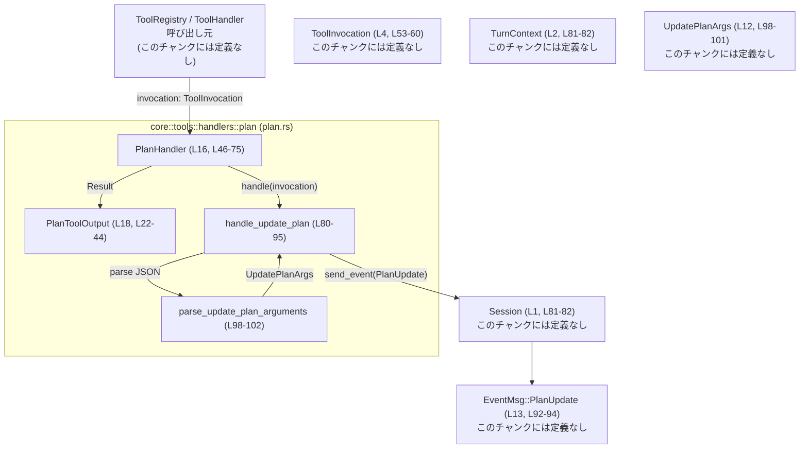
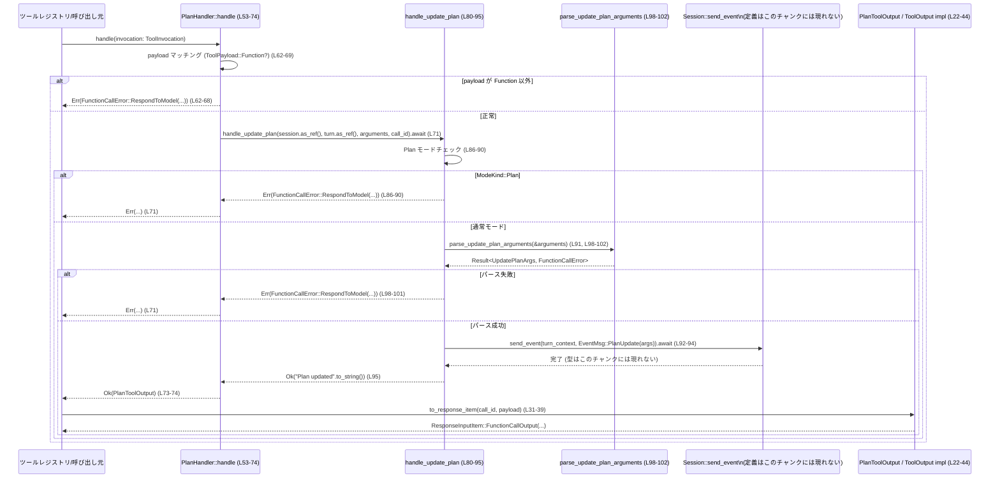

# core/src/tools/handlers/plan.rs コード解説

## 0. ざっくり一言

`PlanHandler` は、「update_plan」的なプラン更新ツール呼び出しを受け取り、その引数をパースして `Session` に `PlanUpdate` イベントとして送る非同期ハンドラです（`plan.rs:L46-75`, `plan.rs:L80-95`）。  
レスポンス側では、固定メッセージ「Plan updated」を返す軽量な `ToolOutput` 実装を提供します（`plan.rs:L20-44`）。

---

## 1. このモジュールの役割

### 1.1 概要

- このモジュールは、モデルが「自分のプラン」を構造化して記録できるようにするためのツールハンドラです（`plan.rs:L77-79`）。
- モデルから渡された JSON 文字列引数を `UpdatePlanArgs` にパースし、`Session` に対して `EventMsg::PlanUpdate` イベントを送信します（`plan.rs:L91-94`, `plan.rs:L98-102`）。
- 実際のビジネスロジックはほぼなく、「入力（プラン）」をログ用・クライアント表示用のイベントに変換するのが主な役割です（`plan.rs:L77-79`）。

### 1.2 アーキテクチャ内での位置づけ

インポートとトレイト実装から、概略の位置づけは次のとおりです。

- `PlanHandler` は `ToolHandler` トレイトの実装としてツールレジストリから呼び出される位置にいます（`plan.rs:L7`, `plan.rs:L46-75`）。
- `PlanToolOutput` は `ToolOutput` トレイトを実装し、ツール呼び出しの結果をログ・レスポンスとして表現します（`plan.rs:L5`, `plan.rs:L18`, `plan.rs:L22-44`）。
- 実際のプラン更新は、`Session::send_event` を通じてイベントシステムに流されます（`plan.rs:L92-94`）。
- モード判定には `ModeKind::Plan` が使われ、Plan モードではこのツールはエラーになります（`plan.rs:L86-90`）。

これを簡易な依存関係図で表すと次のようになります。



※外部型 (`Session`, `TurnContext`, `ToolInvocation`, `UpdatePlanArgs`, `EventMsg`) の詳細定義はこのチャンクには現れません。

### 1.3 設計上のポイント

- **ツールハンドラとしての役割分割**  
  - `PlanHandler` は `ToolHandler` トレイトを実装し、「ペイロードの検証・分解」と「コアロジック呼び出し」のみを担当します（`plan.rs:L46-75`）。
  - 実際のプランイベント送信ロジックは `handle_update_plan` に分離されています（`plan.rs:L80-95`）。

- **状態を持たないハンドラ**  
  - `PlanHandler` と `PlanToolOutput` はどちらもフィールドを持たないユニット構造体です（`plan.rs:L16`, `plan.rs:L18`）。  
    これにより、インスタンス間で共有するべき内部状態は存在せず、スレッド間共有の安全性に関する懸念は少ない構造になっています。

- **エラーハンドリング方針**  
  - ツール呼び出しに不正なペイロードが届いた場合（`ToolPayload::Function` 以外）は `FunctionCallError::RespondToModel` を返します（`plan.rs:L62-68`）。
  - Plan モード中にこのツールを使おうとすると、同じく `FunctionCallError::RespondToModel` でモデルにエラーメッセージを返します（`plan.rs:L86-90`）。
  - JSON パースエラーも `FunctionCallError::RespondToModel` に変換されます（`plan.rs:L98-101`）。
  - これらはいずれも「モデルに返すべきエラー」として扱われることが名前から読み取れますが、具体的な挙動はこのチャンクには現れません。

- **非同期処理とイベント駆動**  
  - `handle` と `handle_update_plan` はどちらも `async fn` で、外部からは `Future` として扱われる前提です（`plan.rs:L53`, `plan.rs:L80`）。
  - `Session::send_event` も `await` されていることから、非同期イベント送信 API であると考えられますが、詳細はこのチャンクには現れません（`plan.rs:L92-94`）。

- **出力は固定メッセージ**  
  - ツール成功時のログメッセージおよびレスポンス本文は固定文字列 `PLAN_UPDATED_MESSAGE`（"Plan updated"）を使用します（`plan.rs:L20`, `plan.rs:L23-25`, `plan.rs:L31-33`）。

---

## 2. 主要な機能一覧

- `PlanHandler`: ツールレジストリからの呼び出しを受け、プラン更新ロジックを起動するハンドラ（`plan.rs:L16`, `plan.rs:L46-75`）。
- `PlanToolOutput`: プラン更新ツール呼び出しの結果を表す `ToolOutput` 実装。ログ用プレビューとレスポンスアイテムを生成する（`plan.rs:L18`, `plan.rs:L22-44`）。
- `handle_update_plan`: セッションとターンコンテキストに対して、プラン更新イベント `EventMsg::PlanUpdate` を送信する非公開（crate 内）API（`plan.rs:L80-95`）。
- `parse_update_plan_arguments`: ツール引数文字列を `UpdatePlanArgs` にパースする内部ヘルパー関数（`plan.rs:L98-102`）。

---

## 3. 公開 API と詳細解説

### 3.1 型一覧（構造体・定数など）

| 名前 | 種別 | 可視性 | 役割 / 用途 | 定義位置 |
|------|------|--------|-------------|----------|
| `PlanHandler` | 構造体（ユニット） | `pub` | `ToolHandler` トレイトの実装。本ツール（plan 更新ツール）のエントリポイントとなるハンドラ | `plan.rs:L16`, `plan.rs:L46-75` |
| `PlanToolOutput` | 構造体（ユニット） | `pub` | `ToolOutput` トレイトの実装。ログ出力とクライアント向けレスポンスアイテムを生成する | `plan.rs:L18`, `plan.rs:L22-44` |
| `PLAN_UPDATED_MESSAGE` | 定数 `&'static str` | モジュール内（`const`） | 成功時に使われる固定メッセージ `"Plan updated"` | `plan.rs:L20` |

`Session`, `TurnContext`, `ToolInvocation`, `ToolPayload`, `ToolHandler`, `ToolKind`, `UpdatePlanArgs`, `EventMsg` は他モジュール定義であり、このチャンクには現れません。ただしインターフェース上の使用位置は明示されています（`plan.rs:L1-14`, `plan.rs:L46-75`, `plan.rs:L80-95`, `plan.rs:L98-102`）。

---

### 3.2 関数詳細（主要 7 件）

#### 1. `PlanHandler::handle(&self, invocation: ToolInvocation) -> Result<PlanToolOutput, FunctionCallError>`

```rust
// plan.rs:L53-74
async fn handle(&self, invocation: ToolInvocation) -> Result<Self::Output, FunctionCallError> { ... }
```

**概要**

- ツールレジストリから渡された `ToolInvocation` からセッション・ターン・ペイロードを取り出し、`update_plan` ツール専用の処理 `handle_update_plan` を呼び出します（`plan.rs:L53-71`）。
- 非対応のペイロード形式で呼び出された場合はエラーを返します（`plan.rs:L62-68`）。
- 成功時には `PlanToolOutput` を返し、上位層がレスポンスを構築できるようにします（`plan.rs:L73-74`）。

**引数**

| 引数名 | 型 | 説明 |
|--------|----|------|
| `invocation` | `ToolInvocation` | ツール呼び出しに関する情報全体。`session`, `turn`, `call_id`, `payload` などを含む（フィールド構造はこのチャンクには現れませんが、分配代入から読み取れます `plan.rs:L53-60`）。 |

**戻り値**

- `Result<PlanToolOutput, FunctionCallError>`  
  - `Ok(PlanToolOutput)`：プラン更新処理が成功し、出力を表すオブジェクトが生成された状態（`plan.rs:L71-74`）。  
  - `Err(FunctionCallError)`：ペイロード形式不正・プラン更新ロジック内部エラーなど、モデルに返すべきエラーが発生した状態（`plan.rs:L62-68`, `plan.rs:L71`）。

**内部処理の流れ**

1. `ToolInvocation` を分配代入で展開し、`session`, `turn`, `call_id`, `payload` などのフィールドを取り出す（`plan.rs:L54-60`）。
2. `payload` が `ToolPayload::Function { arguments }` かどうかを `match` で判定する（`plan.rs:L62-69`）。
   - それ以外の場合は `FunctionCallError::RespondToModel("update_plan handler received unsupported payload")` を返して終了（`plan.rs:L64-68`）。
3. 関数ペイロードであれば、`arguments` と `session.as_ref()`, `turn.as_ref()`, `call_id` を `handle_update_plan` に渡し、`await` する（`plan.rs:L71`）。
4. `handle_update_plan` が `Err` を返せば、そのまま上位にエラーを伝播（`?` による伝播ではなく、ここでは `?` を用いています; 実際のコードは `await?` という形で、`Result` を伝播しています `plan.rs:L71`）。
5. 成功した場合は `Ok(PlanToolOutput)` を返す（`plan.rs:L73-74`）。

**Examples（使用例）**

※ 実際の `ToolInvocation` や `Session` の構築方法はこのチャンクには現れないため、疑似コードとして示します。

```rust
use crate::tools::handlers::plan::PlanHandler;
use crate::tools::context::ToolInvocation; // この型の構造はこのチャンクには現れない

async fn invoke_plan_handler(invocation: ToolInvocation) -> Result<(), FunctionCallError> {
    let handler = PlanHandler;                              // ユニット構造体なのでそのまま生成（plan.rs:L16）
    let output = handler.handle(invocation).await?;         // 非同期で処理を実行（plan.rs:L53-74）

    // ToolOutput トレイトに従ってレスポンスを生成できる
    let preview = output.log_preview();                     // "Plan updated" が得られる（plan.rs:L23-25）

    println!("Plan tool finished: {}", preview);
    Ok(())
}
```

**Errors / Panics**

- 次の条件で `Err(FunctionCallError::RespondToModel(...))` を返します。
  - `payload` が `ToolPayload::Function` ではない場合  
    → `"update_plan handler received unsupported payload"`（`plan.rs:L62-68`）。
  - `handle_update_plan` がエラーを返した場合  
    → そのエラーがそのまま伝播します（`plan.rs:L71`）。
- `panic!` を呼び出すコードはこの関数内にはありません（`plan.rs:L53-74`）。

**Edge cases（エッジケース）**

- `ToolInvocation.payload` が `ToolPayload::Function` 以外の場合、処理は一切行われず即座にエラーとなります（`plan.rs:L62-68`）。
- `ToolInvocation` 内の `session` や `turn` が `None` であるといったケースは、このチャンクでは確認できません。`as_ref()` を呼び出していることから、`Option` やスマートポインタで包まれている可能性はありますが、詳細は不明です（`plan.rs:L55-56`, `plan.rs:L71`）。

**使用上の注意点**

- `handle` は `async fn` であるため、必ず非同期コンテキストから `.await` する必要があります（`plan.rs:L53`）。
- `ToolInvocation` の `payload` には、必ず `ToolPayload::Function { arguments }` を設定する必要があります。そうでない場合は常にエラーになります（`plan.rs:L62-69`）。
- エラーは `FunctionCallError` として返されるため、呼び出し側ではこのエラー種別に応じた処理（モデルに返す、ログに出すなど）を行う契約になっていると考えられますが、具体的仕様はこのチャンクには現れません。

---

#### 2. `handle_update_plan(session: &Session, turn_context: &TurnContext, arguments: String, _call_id: String) -> Result<String, FunctionCallError>`

```rust
// plan.rs:L80-95
pub(crate) async fn handle_update_plan(
    session: &Session,
    turn_context: &TurnContext,
    arguments: String,
    _call_id: String,
) -> Result<String, FunctionCallError> { ... }
```

**概要**

- プラン更新ツールのコアロジックです。`turn_context` のモードをチェックし、許可されている場合のみ `arguments` を `UpdatePlanArgs` にパースして `Session` に `PlanUpdate` イベントを送信します（`plan.rs:L86-94`）。
- 処理結果として `"Plan updated"` を返しますが、コメントにある通り出力自体はあまり重要ではなく、入力（プラン）が重要であると説明されています（`plan.rs:L77-79`, `plan.rs:L95`）。

**引数**

| 引数名 | 型 | 説明 |
|--------|----|------|
| `session` | `&Session` | イベント送信に使用されるセッションオブジェクトへの参照（`plan.rs:L81`, `plan.rs:L92-94`）。定義はこのチャンクには現れません。 |
| `turn_context` | `&TurnContext` | 現在のターンに関する情報。`collaboration_mode.mode` により Plan モードかどうかが判定されます（`plan.rs:L82`, `plan.rs:L86`）。 |
| `arguments` | `String` | モデルから渡されたツール引数。JSON フォーマットの文字列として `UpdatePlanArgs` にパースされます（`plan.rs:L83`, `plan.rs:L91`）。 |
| `_call_id` | `String` | 呼び出し ID。現時点の実装では使用されていないため先頭に `_` が付いています（`plan.rs:L84`）。 |

**戻り値**

- `Result<String, FunctionCallError>`  
  - `Ok("Plan updated".to_string())`：`PlanUpdate` イベントが送信されたことを表す成功メッセージ（`plan.rs:L95`）。  
  - `Err(FunctionCallError::RespondToModel(...))`：Plan モードでの不許可呼び出し、または引数パースエラーなどに起因するエラー（`plan.rs:L86-90`, `plan.rs:L91`, `plan.rs:L98-101`）。

**内部処理の流れ**

1. `turn_context.collaboration_mode.mode` が `ModeKind::Plan` かどうかをチェック（`plan.rs:L86`）。
   - Plan モードの場合は `"update_plan is a TODO/checklist tool and is not allowed in Plan mode"` をメッセージとする `FunctionCallError::RespondToModel` を返して終了（`plan.rs:L86-90`）。
2. `arguments` を `parse_update_plan_arguments` に渡し、`UpdatePlanArgs` にパース（`plan.rs:L91`, `plan.rs:L98-102`）。
   - パースに失敗した場合、`parse_update_plan_arguments` 内で `FunctionCallError::RespondToModel("failed to parse function arguments: ...")` に変換されます。
3. パースした `args` を `EventMsg::PlanUpdate(args)` でラップし、`session.send_event(turn_context, ...)` に渡して非同期送信（`plan.rs:L91-94`）。
4. 送信完了後、固定文字列 `"Plan updated"` を `Ok` で返す（`plan.rs:L95`）。

**Examples（使用例）**

※ `Session`, `TurnContext`, `UpdatePlanArgs` の具体的な定義はこのチャンクには現れないため、疑似コードとして示します。

```rust
use crate::codex::{Session, TurnContext};
use crate::tools::handlers::plan::handle_update_plan;
use codex_protocol::plan_tool::UpdatePlanArgs;
use serde_json::json;

async fn update_plan_example(session: &Session, turn: &TurnContext) -> Result<(), FunctionCallError> {
    // モデルからの引数を想定した JSON 文字列を作る（UpdatePlanArgs の実際のフィールドはこのチャンクには現れません）
    let args = json!({
        "items": ["Implement feature A", "Refactor module B"], // フィールド名は例示
    }).to_string();

    let call_id = "call-123".to_string();

    let result = handle_update_plan(session, turn, args, call_id).await?; // plan.rs:L80-95
    assert_eq!(result, "Plan updated");

    Ok(())
}
```

**Errors / Panics**

- `Err(FunctionCallError::RespondToModel(..))` になる条件:
  - `turn_context.collaboration_mode.mode == ModeKind::Plan` の場合（`plan.rs:L86-90`）。
  - `parse_update_plan_arguments` が JSON パースに失敗した場合（`plan.rs:L91`, `plan.rs:L98-101`）。
- `session.send_event` によるエラーの有無は、このチャンクからは判断できません。`await` の結果に対して `?` が使われていないため、戻り値は `()` などエラーを持たない型である可能性がありますが、具体的な型は不明です（`plan.rs:L92-94`）。
- `panic!` を直接呼ぶコードは存在しません（`plan.rs:L80-95`）。

**Edge cases（エッジケース）**

- **Plan モード中の呼び出し**  
  - Plan モード (`ModeKind::Plan`) では、この関数は必ずエラーを返し、プラン更新は行われません（`plan.rs:L86-90`）。
- **空文字列や不正 JSON**  
  - `arguments` が空文字列や不正 JSON の場合、`serde_json::from_str::<UpdatePlanArgs>` が失敗し、`"failed to parse function arguments: ..."` というメッセージ付きでエラーになります（`plan.rs:L98-101`）。
- **`_call_id` の値**  
  - `_call_id` は一切使用されないため、どのような文字列であっても挙動には影響しません（`plan.rs:L84`）。

**使用上の注意点**

- Plan モードでは、このツールを呼び出さない、あるいは呼び出されてもエラーを適切に処理する必要があります（`plan.rs:L86-90`）。
- `arguments` は `UpdatePlanArgs` 用の JSON でなければならず、その構造は `UpdatePlanArgs` の定義に依存します。定義はこのチャンクには現れないため、別ファイルを参照する必要があります（`plan.rs:L12`, `plan.rs:L98-101`）。
- 非同期関数のため、呼び出し時は `.await` が必須です（`plan.rs:L80`）。
- この関数の戻り値の文字列 `"Plan updated"` は `PLAN_UPDATED_MESSAGE` 定数とは別にハードコードされています（`plan.rs:L20`, `plan.rs:L95`）。メッセージの一貫性が必要な場合は両者を合わせる必要がありますが、現状のコードでは挙動として問題は生じていません。

---

#### 3. `parse_update_plan_arguments(arguments: &str) -> Result<UpdatePlanArgs, FunctionCallError>`

```rust
// plan.rs:L98-102
fn parse_update_plan_arguments(arguments: &str) -> Result<UpdatePlanArgs, FunctionCallError> { ... }
```

**概要**

- ツール引数文字列 `arguments` を `UpdatePlanArgs` 構造体に変換するための内部ヘルパーです（`plan.rs:L98-102`）。
- `serde_json::from_str` によるパースエラーを `FunctionCallError::RespondToModel` に変換し、モデルにフィードバックしやすい形のエラーにします（`plan.rs:L98-101`）。

**引数**

| 引数名 | 型 | 説明 |
|--------|----|------|
| `arguments` | `&str` | JSON 形式文字列。`UpdatePlanArgs` にマッピングされることが期待されます（`plan.rs:L98`）。 |

**戻り値**

- `Result<UpdatePlanArgs, FunctionCallError>`  
  - `Ok(UpdatePlanArgs)`：JSON パースが成功し、`UpdatePlanArgs` に変換できた場合（`plan.rs:L98-101`）。  
  - `Err(FunctionCallError::RespondToModel("failed to parse function arguments: {e}"))`：パースエラー時（`plan.rs:L99-101`）。

**内部処理の流れ**

1. `serde_json::from_str::<UpdatePlanArgs>(arguments)` で JSON 文字列を `UpdatePlanArgs` 型へパースする（`plan.rs:L99`）。
2. `map_err` で `serde_json` のエラーを `FunctionCallError::RespondToModel` に変換する。メッセージには元のエラーを `format!` で埋め込む（`plan.rs:L99-101`）。
3. 得られた `Result` をそのまま呼び出し元へ返す（`plan.rs:L98-102`）。

**Examples（使用例）**

```rust
use crate::tools::handlers::plan::parse_update_plan_arguments;

fn parse_example() -> Result<(), FunctionCallError> {
    let json = r#"{"items": ["task1", "task2"]}"#;      // UpdatePlanArgs に対応する JSON を想定
    let args = parse_update_plan_arguments(json)?;       // plan.rs:L98-102

    // args のフィールドの詳細は UpdatePlanArgs の定義次第（このチャンクには現れません）
    Ok(())
}
```

**Errors / Panics**

- `Err(FunctionCallError::RespondToModel(...))` になる条件:
  - `arguments` が `UpdatePlanArgs` 用 JSON として無効な場合（構文エラーや型不一致など）（`plan.rs:L99-101`）。
- `panic!` を直接呼び出すコードは存在しません（`plan.rs:L98-102`）。

**Edge cases（エッジケース）**

- 空文字列 `""` や `null`、部分的な JSON など、`UpdatePlanArgs` にマッピングできない入力はすべてエラーになります（`serde_json::from_str` の挙動に依存 `plan.rs:L99`）。
- 余分なフィールドが含まれる JSON を許容するかどうかは `UpdatePlanArgs` の `serde` 設定に依存し、このチャンクには現れません。

**使用上の注意点**

- この関数は内部ヘルパーとしてのみ使用されており、外部に公開されていません（`fn` で `pub` なし、`plan.rs:L98`）。
- エラーメッセージには `serde_json` のエラー文字列がそのまま埋め込まれるため、モデルに見せる際に情報量が多すぎる場合は上位層でマスキングする必要があるかもしれませんが、方針はこのチャンクには現れません。

---

#### 4. `PlanToolOutput::to_response_item(&self, call_id: &str, _payload: &ToolPayload) -> ResponseInputItem`

```rust
// plan.rs:L31-39
fn to_response_item(&self, call_id: &str, _payload: &ToolPayload) -> ResponseInputItem { ... }
```

**概要**

- ツールの実行結果を、プロトコルレベルの `ResponseInputItem::FunctionCallOutput` 形式に変換します（`plan.rs:L35-38`）。
- テキスト `"Plan updated"` および `success=true` を持つ `FunctionCallOutputPayload` を生成します（`plan.rs:L31-33`）。

**引数**

| 引数名 | 型 | 説明 |
|--------|----|------|
| `call_id` | `&str` | 対象となるツール呼び出し ID。レスポンスの `call_id` にそのままコピーされます（`plan.rs:L31`, `plan.rs:L36`）。 |
| `_payload` | `&ToolPayload` | ツール呼び出しの元ペイロード。現実装では使用されていません（`plan.rs:L31`）。 |

**戻り値**

- `ResponseInputItem`  
  - 常に `ResponseInputItem::FunctionCallOutput { call_id, output }` を返します。  
    - `output` は `FunctionCallOutputPayload::from_text("Plan updated")` で生成され、さらに `success = Some(true)` が設定されています（`plan.rs:L31-33`, `plan.rs:L35-38`）。

**内部処理の流れ**

1. `FunctionCallOutputPayload::from_text(PLAN_UPDATED_MESSAGE.to_string())` でテキストからペイロードを生成（`plan.rs:L31-33`）。
2. `output.success = Some(true);` で成功フラグを明示的に設定（`plan.rs:L32-33`）。
3. `ResponseInputItem::FunctionCallOutput { call_id: call_id.to_string(), output }` を作成して返す（`plan.rs:L35-38`）。

**Examples（使用例）**

```rust
use crate::tools::handlers::plan::PlanToolOutput;
use crate::tools::context::ToolPayload; // 詳細定義はこのチャンクには現れません

fn build_response_example(call_id: &str, payload: &ToolPayload) -> codex_protocol::models::ResponseInputItem {
    let output = PlanToolOutput;                           // plan.rs:L18
    output.to_response_item(call_id, payload)              // plan.rs:L31-39
}
```

**Errors / Panics**

- エラーを返す経路はなく、`panic!` もありません（`plan.rs:L31-39`）。

**Edge cases（エッジケース）**

- `call_id` が空文字列でも、そのまま `String` に変換されて格納されます（`plan.rs:L36`）。
- `_payload` は未使用のため、どのような内容であっても挙動に影響しません（`plan.rs:L31`）。

**使用上の注意点**

- 成功／失敗に関わらず、現実装では常に `success = Some(true)` を設定しています（`plan.rs:L32-33`）。  
  将来的にエラー状態を `PlanToolOutput` で表現したい場合は、この挙動を考慮する必要があります。
- ペイロードの詳細構造（`FunctionCallOutputPayload` のフィールド）はこのチャンクには現れないため、クライアント側の解釈は別途ドキュメントを参照する必要があります。

---

#### 5. `PlanToolOutput::log_preview(&self) -> String`

```rust
// plan.rs:L23-25
fn log_preview(&self) -> String {
    PLAN_UPDATED_MESSAGE.to_string()
}
```

**概要**

- ログ出力などで利用する短いプレビュー文字列を返します（`plan.rs:L23-25`）。
- 常に `"Plan updated"` を返します（`plan.rs:L20`, `plan.rs:L23-25`）。

**引数**

- 引数はありません。

**戻り値**

- `String`：固定メッセージ `"Plan updated"` のクローン（`plan.rs:L23-25`）。

**内部処理**

- `PLAN_UPDATED_MESSAGE.to_string()` を返すだけのシンプルな処理です（`plan.rs:L23-25`）。

**Examples（使用例）**

```rust
use crate::tools::handlers::plan::PlanToolOutput;

fn log_example() {
    let output = PlanToolOutput;
    let preview = output.log_preview();       // "Plan updated"（plan.rs:L23-25）
    println!("Tool finished: {}", preview);
}
```

**Errors / Panics**

- ありません。

**Edge cases / 使用上の注意点**

- メッセージは固定であり、実際のプラン内容には依存しません。プランの詳細をログ出力したい場合は別の経路（`EventMsg::PlanUpdate` の内容など）を利用する必要があります。

---

#### 6. `PlanToolOutput::code_mode_result(&self, _payload: &ToolPayload) -> JsonValue`

```rust
// plan.rs:L41-43
fn code_mode_result(&self, _payload: &ToolPayload) -> JsonValue {
    JsonValue::Object(serde_json::Map::new())
}
```

**概要**

- 「code モード」時の結果表現として JSON 値を返すメソッドです（`plan.rs:L41-43`）。
- 現実装では常に空の JSON オブジェクト `{}` を返し、プラン内容はエンコードしていません（`plan.rs:L41-43`）。

**引数**

| 引数名 | 型 | 説明 |
|--------|----|------|
| `_payload` | `&ToolPayload` | 呼び出し元のツールペイロード。現実装では使用していません（`plan.rs:L41`）。 |

**戻り値**

- `serde_json::Value`（`JsonValue` エイリアス）  
  - 常に `JsonValue::Object(serde_json::Map::new())`、つまり空オブジェクトです（`plan.rs:L41-43`）。

**内部処理**

- 空の `serde_json::Map` を生成し、`JsonValue::Object` でラップして返します（`plan.rs:L42-43`）。

**Examples（使用例）**

```rust
use crate::tools::handlers::plan::PlanToolOutput;
use crate::tools::context::ToolPayload;

fn code_mode_example(payload: &ToolPayload) -> serde_json::Value {
    let output = PlanToolOutput;
    output.code_mode_result(payload)          // {} が返る（plan.rs:L41-43）
}
```

**Errors / Panics**

- ありません。

**Edge cases / 使用上の注意点**

- 現状、このメソッドはプランの情報を一切含まないため、「code モード」でプラン内容を取得することはできません（`plan.rs:L41-43`）。
- 将来的に code モードでの詳細情報が必要になった場合、このメソッドの実装を拡張することが想定されますが、現時点ではシンプルな空 JSON のみを返す契約になっています。

---

#### 7. `PlanHandler::kind(&self) -> ToolKind`

```rust
// plan.rs:L49-51
fn kind(&self) -> ToolKind {
    ToolKind::Function
}
```

**概要**

- このハンドラが扱うツールの種類を示すメソッドです（`plan.rs:L49-51`）。
- `ToolKind::Function` を返しているため、このツールは「関数型」ツールとして扱われます（`plan.rs:L8`, `plan.rs:L49-51`）。

**引数**

- 引数はありません。

**戻り値**

- `ToolKind`：常に `ToolKind::Function`（`plan.rs:L49-51`）。

**内部処理**

- 列挙値 `ToolKind::Function` を返すだけです。

**Examples（使用例）**

```rust
use crate::tools::handlers::plan::PlanHandler;
use crate::tools::registry::ToolKind;

fn kind_example() {
    let handler = PlanHandler;
    assert_eq!(handler.kind(), ToolKind::Function);   // plan.rs:L49-51
}
```

**Errors / Panics / Edge cases**

- ありません。

**使用上の注意点**

- ツールレジストリ側は、この戻り値に基づきペイロードの扱い（`ToolPayload::Function` を期待する等）を決めていると考えられます。`handle` 実装も `ToolPayload::Function` のみ受け付けているため、整合しています（`plan.rs:L62-69`）。

---

### 3.3 その他の関数

| 関数名 | 定義位置 | 役割（1 行） |
|--------|----------|--------------|
| `PlanToolOutput::success_for_logging(&self) -> bool` | `plan.rs:L27-29` | 常に `true` を返し、このツール呼び出しをログ上は成功として扱うためのフラグを提供します。 |

---

## 4. データフロー

ここでは、典型的な「モデルがプランを更新する」シナリオでのデータフローを示します。

1. モデルが「update_plan」ツールを呼び出し、ツールレジストリから `PlanHandler::handle` が呼ばれる（`plan.rs:L46-53`）。
2. `handle` が `ToolInvocation.payload` から JSON 文字列 `arguments` を取り出す（`plan.rs:L62-69`）。
3. `handle` が `handle_update_plan(session.as_ref(), turn.as_ref(), arguments, call_id)` を呼び出す（`plan.rs:L71`）。
4. `handle_update_plan` が
   - Plan モードかどうかをチェック（`plan.rs:L86-90`）。
   - `arguments` を `parse_update_plan_arguments` で `UpdatePlanArgs` に変換（`plan.rs:L91`, `plan.rs:L98-101`）。
   - `Session::send_event(turn_context, EventMsg::PlanUpdate(args))` を `await`（`plan.rs:L92-94`）。
5. 成功した場合、`handle_update_plan` は `"Plan updated"` を返し、`handle` は `PlanToolOutput` を返す（`plan.rs:L95`, `plan.rs:L73-74`）。
6. 上位のレスポンス構築ロジックが `PlanToolOutput::to_response_item` 等を用いてクライアント向けレスポンスを生成する（`plan.rs:L31-39`）。

これをシーケンス図で表します。



---

## 5. 使い方（How to Use）

### 5.1 基本的な使用方法

実際のコードでは、ツールレジストリが `PlanHandler` を保持し、モデルからのツール呼び出しに応じて `handle` を起動します。ここでは簡略化した使用例を示します。

```rust
use crate::tools::handlers::plan::{PlanHandler, handle_update_plan};
use crate::tools::context::{ToolInvocation, ToolPayload}; // 構造はこのチャンクには現れません
use crate::codex::{Session, TurnContext};

async fn handle_tool_call(session: Session, turn: TurnContext, call_id: String, json_args: String) 
    -> Result<(), FunctionCallError> 
{
    // 通常は ToolInvocation はもっと多くのフィールドを持ちます。
    let invocation = ToolInvocation {
        session: /* session を包んだ型。as_ref() が使えるもの */ ,
        turn:    /* turn を包んだ型。as_ref() が使えるもの */ ,
        call_id,
        payload: ToolPayload::Function { arguments: json_args },
        // 他フィールドはこのチャンクには現れません
    };

    let handler = PlanHandler;                             // plan.rs:L16
    let output = handler.handle(invocation).await?;        // plan.rs:L53-74

    // ログ用プレビュー
    println!("Tool result: {}", output.log_preview());     // "Plan updated"（plan.rs:L23-25）

    Ok(())
}
```

### 5.2 よくある使用パターン

- **レジストリ経由の呼び出し**  
  - `PlanHandler` を `ToolHandler` として登録し、`ToolInvocation` が来るたびに `handle` を呼び出す（`plan.rs:L46-75`）。
- **直接コアロジックを呼ぶ**  
  - テストや内部ユーティリティとして、`handle_update_plan` を直接呼び出し、`Session` に `PlanUpdate` を送信する（`plan.rs:L80-95`）。

```rust
// 直接コアロジックを呼ぶ例（テスト用途など）
async fn direct_call(session: &Session, turn: &TurnContext, json_args: String) 
    -> Result<(), FunctionCallError> 
{
    handle_update_plan(session, turn, json_args, "call-1".into()).await?;
    Ok(())
}
```

### 5.3 よくある間違い

```rust
use crate::tools::handlers::plan::PlanHandler;
use crate::tools::context::{ToolInvocation, ToolPayload};

// 間違い例: payload を Function 以外にしてしまう
async fn wrong_usage(invocation: ToolInvocation) -> Result<(), FunctionCallError> {
    let mut invocation = invocation;
    invocation.payload = ToolPayload::/* 異なるバリアント */; // plan.rs:L62-69 では許容されない

    let handler = PlanHandler;
    let _ = handler.handle(invocation).await?;  // 常に RespondToModel エラーになる（plan.rs:L62-68）
    Ok(())
}

// 正しい例: 必ず ToolPayload::Function { arguments } を渡す
async fn correct_usage(invocation: ToolInvocation, args_json: String) -> Result<(), FunctionCallError> {
    let mut invocation = invocation;
    invocation.payload = ToolPayload::Function { arguments: args_json };

    let handler = PlanHandler;
    let _ = handler.handle(invocation).await?;
    Ok(())
}
```

### 5.4 使用上の注意点（まとめ）

- `ToolPayload` は必ず `Function { arguments }` バリアントにする必要があります（`plan.rs:L62-69`）。
- `arguments` には `UpdatePlanArgs` に対応する JSON を渡す必要があります（`plan.rs:L98-101`）。
- Plan モード (`ModeKind::Plan`) 中は `handle_update_plan` は意図的にエラーを返すため、そのモードでこのツールを使うワークフローを設計しないか、エラー処理を考慮する必要があります（`plan.rs:L86-90`）。
- すべてのコア関数は `async` であるため、非同期ランタイム上で実行する必要があります（`plan.rs:L53`, `plan.rs:L80`, `plan.rs:L92-94`）。

---

## 6. 変更の仕方（How to Modify）

### 6.1 新しい機能を追加する場合

例: プラン更新イベントに追加メタデータを含めたい場合。

1. **引数構造の拡張**  
   - `codex_protocol::plan_tool::UpdatePlanArgs` に新しいフィールドを追加し、`serde` のマッピングを定義する（`plan.rs:L12`。定義は別ファイル）。
2. **クライアント側処理の拡張**  
   - `EventMsg::PlanUpdate(UpdatePlanArgs)` を受け取る側のロジックを拡張し、新しいフィールドを利用する（`plan.rs:L13`, `plan.rs:L92-94`）。
3. **このモジュールの変更点**  
   - `parse_update_plan_arguments` は `UpdatePlanArgs` の型に追随するだけなので、通常は変更不要です（`plan.rs:L98-102`）。
   - code モードで新情報を返したい場合は、`PlanToolOutput::code_mode_result` を拡張し、新しいフィールドを JSON に含める実装に変更します（`plan.rs:L41-43`）。

### 6.2 既存の機能を変更する場合

- **エラーメッセージの変更**  
  - Plan モードでのエラーメッセージは `handle_update_plan` 内の文字列に定義されているため（`plan.rs:L86-90`）、ここを変更します。
- **成功メッセージの変更**  
  - `PLAN_UPDATED_MESSAGE` 定数（`plan.rs:L20`）と `handle_update_plan` 末尾の `"Plan updated"` の両方を合わせて変更することで、一貫したメッセージになります（`plan.rs:L95`）。
- **ペイロード形式の変更**  
  - `ToolPayload::Function` の `arguments` 形式を変更する場合、`parse_update_plan_arguments` のパース対象型（`UpdatePlanArgs`）を更新し、その変更が `EventMsg::PlanUpdate` を処理する側と整合するよう確認する必要があります（`plan.rs:L62-69`, `plan.rs:L91-94`, `plan.rs:L98-101`）。

変更時の注意点:

- `FunctionCallError::RespondToModel` は「モデル向けのエラー」であるため、エラー文言の変更はモデル・クライアント双方の挙動に影響しうる点に注意します。
- 非同期 API (`handle`, `handle_update_plan`, `Session::send_event`) のシグネチャや await ポイントを変更する場合、呼び出し元の非同期チェーンにも影響が及ぶため、型レベルのコンパイルエラーを確認する必要があります（`plan.rs:L53`, `plan.rs:L80`, `plan.rs:L92-94`）。

---

## 7. 関連ファイル

このモジュールと密接に関係する型・モジュールは、インポートから次の通りです。

| パス / 型 | 役割 / 関係 | 根拠 |
|-----------|------------|------|
| `crate::codex::Session` | プラン更新イベント `EventMsg::PlanUpdate` を送信するためのセッションオブジェクト。`handle_update_plan` に参照として渡され、`send_event` が呼び出されます。定義はこのチャンクには現れません。 | `plan.rs:L1`, `plan.rs:L81`, `plan.rs:L92-94` |
| `crate::codex::TurnContext` | 現在のやり取りに関するコンテキスト情報を保持し、`collaboration_mode.mode` により Plan モード判定に使用されます。定義はこのチャンクには現れません。 | `plan.rs:L2`, `plan.rs:L81-82`, `plan.rs:L86` |
| `crate::function_tool::FunctionCallError` | ツール呼び出しに関連するエラー型。モデル向けエラーを `RespondToModel` バリアントで表現します（詳細定義はこのチャンクには現れません）。 | `plan.rs:L3`, `plan.rs:L64-68`, `plan.rs:L80`, `plan.rs:L86-90`, `plan.rs:L98-101` |
| `crate::tools::context::{ToolInvocation, ToolOutput, ToolPayload}` | ツール呼び出しのコンテキスト、ツール出力インターフェース、およびペイロード表現を提供します。`ToolInvocation` の詳細構造はこのチャンクには現れません。 | `plan.rs:L4-6`, `plan.rs:L22-44`, `plan.rs:L53-60`, `plan.rs:L62-69` |
| `crate::tools::registry::{ToolHandler, ToolKind}` | ツールハンドラ共通インターフェースとツール種別の列挙体。`PlanHandler` が `ToolHandler` を実装し、`ToolKind::Function` を返します。 | `plan.rs:L7-8`, `plan.rs:L46-51` |
| `codex_protocol::config_types::ModeKind` | コラボレーションモード種別。Plan モード時に `update_plan` を禁止するために使用されます。 | `plan.rs:L9`, `plan.rs:L86-90` |
| `codex_protocol::models::{FunctionCallOutputPayload, ResponseInputItem}` | ツールからクライアントへ返すレスポンス形式を定義するモデル。`PlanToolOutput::to_response_item` で使用されます。 | `plan.rs:L10-11`, `plan.rs:L31-38` |
| `codex_protocol::plan_tool::UpdatePlanArgs` | プラン更新ツールの引数型。JSON からのパース対象です。定義はこのチャンクには現れません。 | `plan.rs:L12`, `plan.rs:L98-101` |
| `codex_protocol::protocol::EventMsg` | セッションに送信されるイベントの列挙体。`PlanUpdate(UpdatePlanArgs)` バリアントが使用されています。 | `plan.rs:L13`, `plan.rs:L92-94` |
| `serde_json::Value` | ツールの code モード結果を表現する JSON 値。ここでは空オブジェクト `{}` のみ使用されています。 | `plan.rs:L14`, `plan.rs:L41-43` |

---

## Bugs / Security / Contracts / Edge Cases（補足）

### 潜在的なバグ・注意点

- `PLAN_UPDATED_MESSAGE` と `handle_update_plan` の戻り値 `"Plan updated"` が別々に定義されているため、どちらかだけを変更するとメッセージが不一致になる可能性はあります（`plan.rs:L20`, `plan.rs:L95`）。挙動として致命的ではありませんが、仕様上の一貫性には注意が必要です。
- code モード結果が常に空オブジェクトであり、プラン内容が含まれない点は、クライアント期待と異なる場合があります（`plan.rs:L41-43`）。ただし、コメントに「この関数はあまり有用なことをしない」とあるため（`plan.rs:L77-79`）、現状は仕様と整合している可能性があります。

### セキュリティ上の観点

- `UpdatePlanArgs` に含まれる情報はモデルから供給され、`EventMsg::PlanUpdate` を通じてクライアントがレンダリングすることが想定されています（`plan.rs:L77-79`, `plan.rs:L92-94`）。  
  HTML やマークダウンとして表示する場合、クライアント側で適切なエスケープやサニタイズを行う必要がありますが、その実装はこのチャンクには現れません。
- JSON パースエラー時のメッセージに `serde_json` のエラー文字列が含まれるため、内部実装情報がモデルに露出する可能性があります（`plan.rs:L99-101`）。許容範囲かどうかはシステム全体の方針に依存します。

### 契約 / エッジケース（まとめ）

- **入力契約**
  - `ToolPayload` は `Function { arguments }` であること（`plan.rs:L62-69`）。
  - `arguments` は `UpdatePlanArgs` へパース可能な JSON であること（`plan.rs:L98-101`）。
- **状態契約**
  - Plan モード (`ModeKind::Plan`) 中には `update_plan` を呼び出さない、またはエラーになることを前提とした設計（`plan.rs:L86-90`）。
- **出力契約**
  - 成功時のメッセージは `"Plan updated"` 固定（`plan.rs:L20`, `plan.rs:L95`）。
  - `PlanToolOutput` はログプレビュー `"Plan updated"` と `success=true` を返す（`plan.rs:L23-25`, `plan.rs:L31-33`）。

### テスト観点（推奨）

このチャンク単体をテストする場合、少なくとも次のケースが考えられます。

- `parse_update_plan_arguments` に対して:
  - 正常な JSON で `Ok(UpdatePlanArgs)` になること（`plan.rs:L98-101`）。
  - 不正な JSON で `Err(FunctionCallError::RespondToModel(...))` になること。
- `handle_update_plan` に対して:
  - 非 Plan モード・正常 JSON で `Session::send_event` が呼ばれ `"Plan updated"` が返ること（`plan.rs:L86-95`）。
  - Plan モードでエラーになること（`plan.rs:L86-90`）。
- `PlanHandler::handle` に対して:
  - `ToolPayload::Function` 以外のペイロードでエラーになること（`plan.rs:L62-68`）。

### パフォーマンス / スケーラビリティ

- 処理内容は JSON パースと単一のイベント送信のみであり、計算量は入力サイズに対してほぼ線形です（`plan.rs:L91-94`, `plan.rs:L98-101`）。
- 大規模なプラン（大きな JSON）を頻繁に更新する場合、`serde_json::from_str` のコストが支配的になりますが、このモジュール自体は軽量なラッパーに留まっています。

### オブザーバビリティ

- ログ用情報として `PlanToolOutput::log_preview` と `success_for_logging` が提供されています（`plan.rs:L23-25`, `plan.rs:L27-29`）。
- より詳細な観測（具体的なプラン内容など）は、`EventMsg::PlanUpdate` を処理する側で実装されていると考えられますが、そのコードはこのチャンクには現れません。
