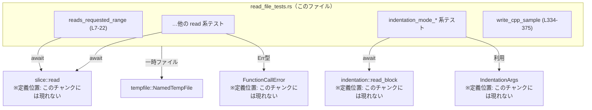
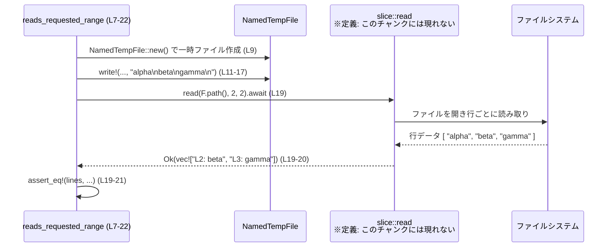
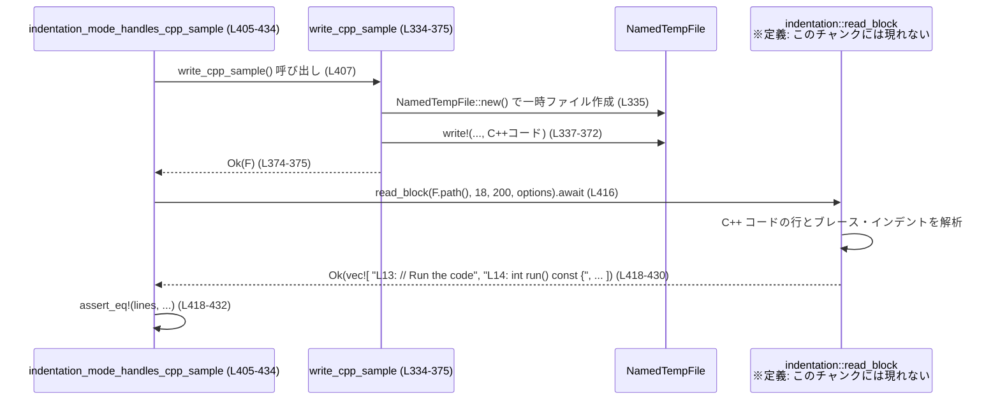

# core/src/tools/handlers/read_file_tests.rs

## 0. ざっくり一言

`slice::read` と `indentation::read_block` という 2 つの非同期ファイル読み取り API の挙動（行範囲、エラー条件、インデントベースのブロック抽出など）をテストするモジュールです。

---

## 1. このモジュールの役割

### 1.1 概要

- このファイルは、ファイル読み取り用ハンドラ群の **外部仕様（契約）** をテストで定義しています。
- 主に次の 2 つの関数の期待挙動を明確にしています：
  - `read`: 通常の行範囲読み取り（行番号付与、改行処理、非 UTF-8、長すぎる行、オフセットエラーなど）  
  - `read_block`: インデント情報からコードブロックを抽出する読み取り（親ブロック拡張、兄弟ブロックの有無、ヘッダ行の扱い、複数言語対応など）
- すべてのテストは `#[tokio::test]` で定義されており、非同期 I/O を前提とした API であることが読み取れます（`read_file_tests.rs:L7-22`, `L24-38`, 以降すべてのテスト）。

### 1.2 アーキテクチャ内での位置づけ

このモジュールは `super` 以下のハンドラ群に依存する **テスト専用モジュール** です。

- 依存先
  - `super::slice::read` … 行範囲読み取り (`read_file_tests.rs:L1`)
  - `super::indentation::read_block` … インデントベースのブロック読み取り (`read_file_tests.rs:L1`)
  - `super::*` … `IndentationArgs`, `MAX_LINE_LENGTH`, `FunctionCallError` などの型・定数 (`read_file_tests.rs:L3`, `L87`, `L111`, `L147` ほか)
- 外部ライブラリ
  - `tokio` … 非同期テストランタイム (`#[tokio::test]`, `read_file_tests.rs:L7` ほか)
  - `tempfile::NamedTempFile` … 一時ファイル作成 (`read_file_tests.rs:L5`, `L9`, `L26` ほか)
  - `pretty_assertions::assert_eq` … アサーション (`read_file_tests.rs:L4`)
  - `anyhow::Result` … テスト関数の戻り値としての汎用エラー型 (`read_file_tests.rs:L8`, 以降各テスト)

依存関係の概要を図示します。



### 1.3 設計上のポイント（テストから読み取れる仕様）

テストから読める設計上の特徴を列挙します。

- `read` の仕様（`read_file_tests.rs:L7-94`）
  - 行番号は 1 始まりで `"L{n}: "` というプレフィックスが付与される（`L19-20`, `L75-79`）。
  - `offset`・`limit` による行範囲指定が可能で、`limit` で返却行数が制限される（`L19-20`, `L75-79`）。
  - `offset` がファイル行数を超えると `FunctionCallError::RespondToModel("offset exceeds file length")` を返す（`L24-37`）。
  - CRLF (`\r\n`) を含む行末はトリムされる（`L52-60`）。
  - 非 UTF-8 バイト列は Unicode 代用文字 `U+FFFD` に置き換えた文字列として扱われる（`L40-48`）。
  - 1 行の最大長 `MAX_LINE_LENGTH` を超える部分は静かに切り捨てられる（`L83-93`）。

- `read_block` の仕様（`read_file_tests.rs:L96-331`, `L377-503`）
  - `IndentationArgs` によって以下のような動作を制御：
    - `anchor_line`: ブロック抽出の起点となる行番号（1 始まりと推定される）。（`L111-116`, `L147-151`, `L253-258` など）
    - `max_levels`: アンカー行からどのレベルまで親ブロックを展開するか（`L147-151`, `L165-177`, `L381-385`, `L409-413`）。
    - `include_siblings`: 同じ親を持つ「兄弟」ブロックを含めるかどうか（`L199-204`, `L215-227`, `L471-477`）。
    - `include_header`: 親ブロックのヘッダ行（コメント含む）を含めるかどうか（`L440-446`）。
  - インデント/ブレースベースの構造解析で、複数言語（Rust 風、Python、JavaScript、C++）のコードブロックを抽出する（`L96-331`, `L334-503`）。
  - 抽出結果の各行にも `"L{n}: "` プレフィックスが付く（`L120-127`, `L154-163`, `L206-214` など）。

- エラー処理・安全性
  - 行オフセット超過は例外ではなく `Err(FunctionCallError::RespondToModel)` として通知される（`L30-36`）。
  - 非 UTF-8 はパニックではなく代用文字による置換で処理される（`L40-48`）。
  - 非常に長い行は `MAX_LINE_LENGTH` でカットされ、メモリ過大使用や応答肥大化を防ぐ契約がテストされている（`L83-93`）。

---

## 2. 主要な機能一覧とコンポーネントインベントリー

### 2.1 このファイルがテストしている機能

- 行範囲読み取り (`slice::read`)
  - 任意の開始行と最大行数の指定
  - 行番号プレフィックス付与
  - CRLF のトリミング
  - 非 UTF-8 行のロスレスではないが安全な取り扱い（代用文字）
  - 最大行長制限 `MAX_LINE_LENGTH`
  - オフセット超過時のエラー

- インデントベースのブロック読み取り (`indentation::read_block` と `IndentationArgs`)
  - アンカー行からのブロック抽出
  - 親ブロックの段階的展開（`max_levels`）
  - 兄弟ブロックの有無（`include_siblings`）
  - ブロックヘッダの含有/除外（`include_header`）
  - Rust 風コード、Python、JavaScript、C++ など多言語に対するインデント・ブレース解析

### 2.2 関数インベントリー（このファイル内）

| 名前 | 種別 | 役割 / テスト内容 | 定義位置 |
|------|------|------------------|----------|
| `reads_requested_range` | `#[tokio::test]` | `read` が指定した `offset` から `limit` 行分を 1 始まりの行番号付きで返すことを確認 | `read_file_tests.rs:L7-22` |
| `errors_when_offset_exceeds_length` | `#[tokio::test]` | `offset` がファイル行数を超えると `FunctionCallError::RespondToModel("offset exceeds file length")` が返ることを確認 | `read_file_tests.rs:L24-38` |
| `reads_non_utf8_lines` | `#[tokio::test]` | 非 UTF-8 行が `U+FFFD` 代用文字列に変換されることを確認 | `read_file_tests.rs:L40-50` |
| `trims_crlf_endings` | `#[tokio::test]` | CRLF 行末がトリムされることを確認 | `read_file_tests.rs:L52-61` |
| `respects_limit_even_with_more_lines` | `#[tokio::test]` | `limit` 行数を超える行は返されないことを確認 | `read_file_tests.rs:L63-81` |
| `truncates_lines_longer_than_max_length` | `#[tokio::test]` | 1 行が `MAX_LINE_LENGTH` を超える場合に静かに切り詰められることを確認 | `read_file_tests.rs:L83-94` |
| `indentation_mode_captures_block` | `#[tokio::test]` | アンカー行を含む最小ブロック（`if` ブロック）のみを抽出することを確認 | `read_file_tests.rs:L96-129` |
| `indentation_mode_expands_parents` | `#[tokio::test]` | `max_levels` に応じて親ブロックを段階的に追加できることを確認 | `read_file_tests.rs:L131-180` |
| `indentation_mode_respects_sibling_flag` | `#[tokio::test]` | `include_siblings` のオン/オフで兄弟ブロックの有無が切り替わることを確認 | `read_file_tests.rs:L182-230` |
| `indentation_mode_handles_python_sample` | `#[tokio::test]` | Python のインデントによるメソッド群ブロック抽出を確認 | `read_file_tests.rs:L232-274` |
| `indentation_mode_handles_javascript_sample` | `#[tokio::test] #[ignore]` | JavaScript のオブジェクト内メソッド群抽出の仕様を表すが、デフォルトでは実行されない | `read_file_tests.rs:L276-332` |
| `write_cpp_sample` | 通常関数 | C++ コードサンプルを書き込んだ `NamedTempFile` を生成するテスト補助関数 | `read_file_tests.rs:L334-375` |
| `indentation_mode_handles_cpp_sample_shallow` | `#[tokio::test]` | C++ `switch` ブロックのみ（親 1 レベル）を抽出する動作を確認 | `read_file_tests.rs:L377-403` |
| `indentation_mode_handles_cpp_sample` | `#[tokio::test]` | C++ で親メソッド (`run`) まで含めたブロック抽出（`max_levels=2`）を確認 | `read_file_tests.rs:L405-434` |
| `indentation_mode_handles_cpp_sample_no_headers` | `#[tokio::test]` | `include_header=false` の場合にコメントヘッダ行を含めないことを確認 | `read_file_tests.rs:L436-465` |
| `indentation_mode_handles_cpp_sample_siblings` | `#[tokio::test]` | `include_siblings=true` の場合に同じクラス内の別メソッドブロックも含まれることを確認 | `read_file_tests.rs:L467-503` |

---

## 3. 公開 API と詳細解説（テストから読み取れる仕様）

このファイル自身には公開 API は定義されていませんが、**テスト対象の関数** `read` と `read_block` の挙動が明示されています。

### 3.1 型・定数一覧（このチャンクから見える範囲）

| 名前 | 種別 | 役割 / 用途 | 根拠 |
|------|------|-------------|------|
| `IndentationArgs` | 構造体 | `read_block` の動作をパラメータ化するオプション。`anchor_line`, `include_siblings`, `include_header`, `max_levels` フィールドを持つ | フィールド設定 (`read_file_tests.rs:L111-116`, `L147-151`, `L199-204`, `L253-258`, `L310-314`, `L381-385`, `L409-413`, `L440-446`, `L471-477`) |
| `FunctionCallError` | 列挙体と推測 | `RespondToModel(String)` というバリアントを持ち、`read` のエラー型として使用される | アサーション (`read_file_tests.rs:L33-36`) |
| `MAX_LINE_LENGTH` | 定数 | 1 行の最大長。これを超えた部分は `read` によって切り捨てられる | 使用箇所 (`read_file_tests.rs:L87`, `L91-92`) |
| `NamedTempFile` | 構造体 (`tempfile` クレート) | テスト用の一時ファイルを作成・クローズ時に自動削除 | インポートと利用 (`read_file_tests.rs:L5`, `L9`, `L26`, `L42`, ほか) |

> `IndentationArgs` や `FunctionCallError` の定義本体はこのチャンクには含まれていません。ここでの説明は、フィールド・バリアントの **使用方法** から読み取れる範囲に限定しています。

### 3.2 関数詳細：`slice::read`

#### `read(path, offset, limit) -> impl Future<Output = Result<Vec<String>, FunctionCallError>>`

※ 正確なシグネチャはこのチャンクには出てきません。以下は **呼び出し側から読み取れる契約** の整理です。

**概要**

- 指定したファイル `path` から、`offset` で指定された開始行から最大 `limit` 行までを読み取り、  
  各行に `"L{行番号}: "` のプレフィックスを付けた `Vec<String>` を返す非同期関数です（`read_file_tests.rs:L19-20`, `L75-79`）。
- 行末の改行（`'\n'`、および `"\r\n"`）はトリムされます（`read_file_tests.rs:L52-60`）。
- 非 UTF-8 バイトは Unicode 代用文字 `U+FFFD` に置き換えた文字列として扱われます（`read_file_tests.rs:L40-48`）。
- 1 行が `MAX_LINE_LENGTH` を超える場合、超過部分は切り捨てられます（`read_file_tests.rs:L83-93`）。

**引数（テストから読み取れるもの）**

| 引数名 | 型（推定レベル） | 説明 | 根拠 |
|--------|------------------|------|------|
| `path` | `impl AsRef<Path>` もしくは `&Path` 相当 | 読み取るファイルのパス。テストでは `NamedTempFile::path()` の戻り値が渡されている | 呼び出し (`read_file_tests.rs:L19`, `L30`, `L46`, `L58`, `L75`, `L90`) |
| `offset` | 整数型（`usize`と推定） | 1 始まりの「開始行番号」。この行から読み取りを開始する | `offset=2` で 2 行目から返る（`read_file_tests.rs:L19-20`）、`offset=3` が 1 行ファイルでエラーになる（`L24-37`） |
| `limit` | 整数型（`usize`と推定） | 最大取得行数。`limit` を超える行は返されない | 3 行あるファイルに対し `limit=2` で 2 行のみ返る（`read_file_tests.rs:L63-81`） |

**戻り値**

- `Future<Output = Result<Vec<String>, FunctionCallError>>` と解釈できます（`await` の後に `expect_err` を呼んでいるため、`Result` 型であることがわかります。`read_file_tests.rs:L30-32`）。
- `Ok(Vec<String>)` の各要素は、`"L{n}: {内容}"` というフォーマットの 1 行分のテキストです（`read_file_tests.rs:L19-20`, `L75-79`）。

**内部処理の流れ（テストから推測できる契約）**

テストから読み取れる「外部から見た振る舞い」を流れとして整理します。

1. ファイルを開き、行単位で読み取る（行末の `\n` または `\r\n` は除外されていることから推測、`read_file_tests.rs:L52-60`）。
2. 各行は 1 から始まる行番号を付与される（`L1: ...`, `L2: ...` という形式、`read_file_tests.rs:L19-20`, `L75-79`）。
3. `offset` で指定した行番号より前の行はスキップされる（`offset=2` で 2,3 行目のみ返却、`read_file_tests.rs:L19-20`）。
4. `offset` がファイル行数を超える場合、読み取りは行われず `Err(FunctionCallError::RespondToModel("offset exceeds file length"))` を返す（`read_file_tests.rs:L24-37`）。
5. 読み取り対象行のうち、各行テキストは次の変換を受ける：
   - 非 UTF-8 バイトは代用文字 `U+FFFD` に置換（`read_file_tests.rs:L40-48`）。
   - 1 行が `MAX_LINE_LENGTH` を超える場合、超過部分は切り捨て（`read_file_tests.rs:L83-93`）。
6. 上記で加工された文字列に `"L{行番号}: "` を付けて `Vec<String>` として返す。

※ 実際にどの標準ライブラリ API (`String::from_utf8_lossy` 等) を使っているかは、このチャンクからは分かりません。

**Examples（使用例）**

1. 通常の範囲読み取り（成功例）

```rust
use super::slice::read;

// ファイルに 3 行書いたとする: "alpha\nbeta\ngamma\n"
let lines = read(path, 2, 2).await?;  // 2 行目から最大 2 行を取得

assert_eq!(
    lines,
    vec![
        "L2: beta".to_string(),
        "L3: gamma".to_string(),
    ],
);
```

この例は `reads_requested_range` テストと同等のケースです（`read_file_tests.rs:L11-20`）。

1. オフセット超過によるエラー

```rust
use super::slice::read;
use super::FunctionCallError;

// 1 行だけ "only\n" が入ったファイル
let err = read(path, 3, 1).await.expect_err("offset exceeds length");

assert_eq!(
    err,
    FunctionCallError::RespondToModel("offset exceeds file length".to_string()),
);
```

`errors_when_offset_exceeds_length` と同等の挙動です（`read_file_tests.rs:L24-37`）。

1. 非 UTF-8 行の読み取り

```rust
// ファイル内容: [0xff, 0xfe, b'\n', "plain\n"]
let lines = read(path, 1, 2).await?;
let expected_first = format!("L1: {}{}", '\u{FFFD}', '\u{FFFD}');
assert_eq!(
    lines,
    vec![expected_first, "L2: plain".to_string()],
);
```

非 UTF-8 を代用文字に置き換えている挙動が確認できます（`read_file_tests.rs:L40-48`）。

**Errors / Panics**

テストから確認できるエラー条件：

- `offset` がファイル行数を超える場合：
  - `Err(FunctionCallError::RespondToModel("offset exceeds file length"))` を返す（`read_file_tests.rs:L30-36`）。
- 非 UTF-8 に対してパニックせず、文字列変換に成功していることから、**少なくともこのケースではパニック発生は想定されていません**（`read_file_tests.rs:L40-48`）。
- 極端に長い行（`MAX_LINE_LENGTH + 50` 文字）も、切り捨てた上で正常に `Ok` が返されます（`read_file_tests.rs:L83-93`）。

上記以外のエラー条件（ファイルが存在しない場合など）は、このチャンクには現れません。

**Edge cases（エッジケース）**

テストで明示されているエッジケース：

- `offset > file_len`  
  → `Err(FunctionCallError::RespondToModel("offset exceeds file length"))`（`read_file_tests.rs:L24-37`）。
- 非 UTF-8 行  
  → 各不正バイトごとに `U+FFFD` を返す（少なくとも `0xff`, `0xfe` に対して 2 文字の代用文字、`read_file_tests.rs:L40-48`）。
- CRLF (`\r\n`) 行末  
  → 行末の `\r` も含めてトリムされた内容が返る（`read_file_tests.rs:L52-60`）。
- `limit` より多い行がある場合  
  → `limit` 行だけが返る。残りの行は無視（`read_file_tests.rs:L63-81`）。
- 行長 > `MAX_LINE_LENGTH`  
  → 先頭 `MAX_LINE_LENGTH` 文字だけが返る（`read_file_tests.rs:L83-93`）。
- `offset=1` の挙動や `offset=0` の扱い、空ファイルの挙動などは、このチャンクには現れません。

**使用上の注意点**

- `offset` は 1 始まりの行番号として扱われているように見えます。`offset` をファイル行数より大きくするとエラーになるため、事前に行数を把握していない場合はエラー処理が必須です（`read_file_tests.rs:L24-37`）。
- 非 UTF-8 データは代用文字で「見える化」はされますが、元のバイト列は失われます。この挙動が許容できる用途（ログ表示など）に限定して使う必要があります（`read_file_tests.rs:L40-48`）。
- `MAX_LINE_LENGTH` を超える部分は静かに削除されるため、「行全体を取得したい」用途では適さない可能性があります（`read_file_tests.rs:L83-93`）。
- 非同期関数のため、`tokio` などのランタイム上で `.await` する必要があります（すべてのテストが `#[tokio::test]` であることから、`read_file_tests.rs:L7`, `L24`, ほか）。

---

### 3.3 関数詳細：`indentation::read_block`

#### `read_block(path, anchor_line, limit, options: IndentationArgs) -> impl Future<Output = Result<Vec<String>, E>>`

※ エラー型 `E` や正確なシグネチャはこのチャンクには現れません。挙動はテストから読み取れる範囲に限定して説明します。

**概要**

- ファイル `path` のうち、`anchor_line` を含むコードブロックとその親ブロックを、インデントやブレース構造を元に抽出する非同期関数です。
- 抽出結果は `"L{行番号}: {行内容}"` 形式の文字列の配列として返されます（`read_file_tests.rs:L120-127`, `L154-163`, `L260-271`, `L388-400`）。
- `IndentationArgs` によって、親ブロックのレベル数、兄弟ブロックの有無、ヘッダ行の含有を細かく制御できます（`read_file_tests.rs:L111-116`, `L147-151`, `L199-204`, `L253-258`, `L310-314`, `L381-385`, `L409-413`, `L440-446`, `L471-477`）。

**引数（テストから読み取れるもの）**

| 引数名 | 型（推定） | 説明 | 根拠 |
|--------|-----------|------|------|
| `path` | `impl AsRef<Path>` 相当 | 対象コードが書かれたファイルパス | `read_block(temp.path(), ...)`（`read_file_tests.rs:L118`, `L153`, `L206`, `L260`, `L316`, `L388`, `L416`, `L448`, `L479`） |
| `anchor_line` | 整数型（`usize`） | 抽出対象ブロックに属する行番号（1 始まり）。この行を起点に親ブロックへ辿る | `Some(3)`, `Some(4)`, `Some(7)` などの指定（`read_file_tests.rs:L111-113`, `L147-149`, `L199-201`, `L253-255`, `L310-312`, `L381-384`, `L409-412`, `L471-474`） |
| `limit` | 整数型（`usize`） | 返す最大行数。テストでは十分大きな値を指定しており、制限挙動はこのチャンクでは現れていない | 例: `10`, `50`, `200`（`read_file_tests.rs:L118`, `L153`, `L206` など） |
| `options` | `IndentationArgs` | インデント解析・抽出範囲を制御するオプション | 各テストの `IndentationArgs` 初期化（`read_file_tests.rs:L111-116`, `L147-151`, `L199-204`, `L253-258`, `L310-314`, `L381-385`, `L409-413`, `L440-446`, `L471-477`） |

**`IndentationArgs` のフィールド契約（テストから分かる範囲）**

- `anchor_line: Option<usize>`
  - 一部テストでは `Some(n)` がセットされる。`None` の挙動はこのチャンクには現れない。
- `max_levels: <整数型>`
  - `1` の場合：アンカー行を含む**直近のブロック**のみ（例えば `if` 本体や `switch` 本体）を抽出（`read_file_tests.rs:L147-152`, `L381-385`）。
  - `2` の場合：さらに 1 つ上の親ブロック（例えばメソッド本体）を含める（`read_file_tests.rs:L147-152`, `L405-434`）。
  - `3` の場合：さらに上位（例えばモジュール全体）まで含める（`read_file_tests.rs:L165-177`）。
- `include_siblings: bool`
  - `false`：アンカー行を含むブロックのみ（兄弟ブロックは含めない）（`read_file_tests.rs:L199-204`, `L206-214`）。
  - `true`：同じ親を持つ兄弟ブロックも連続して抽出（`read_file_tests.rs:L215-227`, `L471-477`, `L483-500`）。
- `include_header: bool`（デフォルト値は `true` と推測）
  - `false`：親ブロックのヘッダ行（コメント含む）を除外（`read_file_tests.rs:L440-446`, `L452-461`）。
  - デフォルト（`true` と推定）では、コメント行なども含めて抽出（`read_file_tests.rs:L418-430` に `L13:     // Run the code` が含まれている）。

**内部処理の流れ（仕様レベル）**

テストから読み取れる代表的な処理フローを整理します。

1. ファイル全体を読み取り、行番号付きで内部表現に保持（結果に `"L{n}: ..."` が付いているため、内部でも行番号を意識していると推定、`read_file_tests.rs:L120-127`, `L154-163`, `L260-271`）。
2. `anchor_line` で指定された行のインデントレベルまたはブレースレベルを起点に、所属ブロックを特定：
   - Rust 風コード（`fn`, `if`, `{}`）や C++ の `class`, `switch` など（`read_file_tests.rs:L100-108`, `L136-144`, `L338-372`）。
   - Python のインデント（`class`, `def`, インデント幅）に基づくブロック（`read_file_tests.rs:L236-250`）。
   - JavaScript のオブジェクトリテラル内メソッド群（`read_file_tests.rs:L281-307`）。
3. `max_levels` に応じて、アンカー行から順に親ブロックを追加：
   - `max_levels=1` → いちばん内側のブロックのみ（例: `if` 本体、`switch` 本体）（`read_file_tests.rs:L96-129`, `L377-403`）。
   - `max_levels=2` → さらに 1 つ上（関数/メソッド）のブロックを含める（`read_file_tests.rs:L131-180`, `L405-434`）。
   - `max_levels=3` → さらにモジュール/クラスレベルまで含める（`read_file_tests.rs:L165-177`）。
4. `include_siblings` の値に応じて、同じ親を持つ兄弟ブロックの追加有無を決定：
   - `false` → アンカーの属するブロックだけ（`read_file_tests.rs:L199-214`, `L377-403`, `L405-434`, `L436-465`）。
   - `true` → 同じ親下の別 `if` ブロックや別メソッドも含める（`read_file_tests.rs:L215-227`, `L471-477`, `L483-500`）。
5. `include_header` が `false` の場合、ブロック手前のコメントなどヘッダ行を結果から除外（`read_file_tests.rs:L436-465`）。
6. 上記で決まった行群を `"L{行番号}: {行内容}"` に整形して返す。

**Examples（使用例）**

1. Rust 風コードの内側ブロックのみを取得

```rust
use super::indentation::read_block;
use super::IndentationArgs;

let options = IndentationArgs {
    anchor_line: Some(3),          // L3:         inner();
    include_siblings: false,
    max_levels: 1,                 // もっとも内側の if ブロックのみ
    ..Default::default()
};

let lines = read_block(path, 3, 10, options).await?;
assert_eq!(
    lines,
    vec![
        "L2:     if cond {".to_string(),
        "L3:         inner();".to_string(),
        "L4:     }".to_string(),
    ],
);
```

`indentation_mode_captures_block` と同等の例です（`read_file_tests.rs:L96-129`）。

1. C++ の `run` メソッドと `switch` ブロックをまとめて取得

```rust
let options = IndentationArgs {
    include_siblings: false,
    anchor_line: Some(18),  // L18:             case Mode::Slow:
    max_levels: 2,          // switch + run() 本体まで
    ..Default::default()
};

let lines = read_block(path, 18, 200, options).await?;
assert_eq!(
    lines,
    vec![
        "L13:     // Run the code".to_string(),
        "L14:     int run() const {".to_string(),
        "L15:         switch (mode_) {".to_string(),
        "L16:             case Mode::Fast:".to_string(),
        "L17:                 return fast();".to_string(),
        "L18:             case Mode::Slow:".to_string(),
        "L19:                 return slow();".to_string(),
        "L20:             default:".to_string(),
        "L21:                 return fallback();".to_string(),
        "L22:         }".to_string(),
        "L23:     }".to_string(),
    ],
);
```

`indentation_mode_handles_cpp_sample` に相当します（`read_file_tests.rs:L405-434`）。

**Errors / Panics**

- このファイル内の `read_block` 呼び出しはすべて `?` で伝播されているものの、具体的なエラー型や発生条件はテストからは観測されていません（`read_file_tests.rs:L118`, `L153`, `L206`, `L260`, `L316`, `L388`, `L416`, `L448`, `L479`）。
- 少なくとも、与えられたサンプルコードと設定に対してパニックは発生しないことが前提になっています。

**Edge cases（エッジケース）**

テストでカバーされている特性：

- 最小ブロックのみ抽出（`max_levels=1`, `include_siblings=false`）  
  → アンカーを含む `if` や `switch` の中身だけを取得（`read_file_tests.rs:L96-129`, `L377-403`）。
- 親ブロックまでの拡張（`max_levels>1`）  
  → モジュール (`mod`) や関数 (`fn`), メソッド (`int run() const`) まで含む（`read_file_tests.rs:L131-180`, `L405-434`）。
- 兄弟ブロックの扱い（`include_siblings`）  
  → `if first { ... }` と `if second { ... }` の片方/両方の切り替え（`read_file_tests.rs:L182-230`）。  
  → C++ の `setup` メソッドと `run` メソッド両方を含めるケース（`read_file_tests.rs:L467-503`）。
- ヘッダ行の扱い（`include_header`）  
  → コメント `// Run the code` を含める/含めない（`read_file_tests.rs:L418-430`, `L452-461`）。
- 言語差異  
  → Python のインデントベースメソッド群（`read_file_tests.rs:L232-274`）。  
  → JavaScript の `handlers = { init() {...}, run() {...} }` 内メソッド群（`read_file_tests.rs:L276-332`、ただし `#[ignore]`）。

`anchor_line` が無効な値（ファイル行数を超える）や 0 の場合などの挙動は、このチャンクには現れません。

**使用上の注意点**

- `anchor_line` はファイル中の有効な行番号である必要があります。無効値の挙動はテストされていないため、利用側で検証するか、エラーの可能性を考慮する必要があります。
- `max_levels` を大きくすると、より外側のブロックまで含まれるため、出力が増えます。LLM へのコンテキスト提供などの用途では、必要以上に大きな値にしないことが望ましいと考えられます（テストでは 1–3 程度に収まっています `read_file_tests.rs:L147-151`, `L165-177`, `L381-385`, `L409-413`）。
- `include_siblings=true` の場合、同じクラス/関数に属する別ブロックも含まれるため、**「アンカー周辺のみを見せたい」用途では `false` にすべき** です（`read_file_tests.rs:L199-204`, `L215-227`, `L471-477`, `L483-500`）。
- `include_header=false` にするとコメントなども落ちるため、文脈を失う可能性があります（`read_file_tests.rs:L436-465`）。

---

### 3.4 その他の関数（このファイル内の補助）

| 関数名 | 役割（1 行） | 根拠 |
|--------|--------------|------|
| `write_cpp_sample()` | C++ コードサンプルを書き込んだ `NamedTempFile` を返すテスト補助関数 | `read_file_tests.rs:L334-375` |

他の test 関数は 2.2 で一覧済みです。

---

## 4. データフロー

### 4.1 `read` を使った行範囲読み取りのデータフロー

`reads_requested_range` テストを例に、データの流れを整理します（`read_file_tests.rs:L7-22`）。



ポイント：

- テストコード自身は同期的に `write!` でファイル内容を作成し、その後 `read` を非同期に呼び出しています（`read_file_tests.rs:L11-17`, `L19`）。
- `read` はファイルシステムから行を取得し、行番号付与と範囲絞り込みを行った結果のみをテスト側に返しています。

### 4.2 `read_block` を使った C++ ブロック抽出のデータフロー

`indentation_mode_handles_cpp_sample` を例にします（`read_file_tests.rs:L405-434`）。



このフローから分かる点：

- `read_block` はファイル全体の構造（クラス、メソッド、switch など）を解釈し、指定されたアンカー行（ここでは `case Mode::Slow:` に対応する `L18`）から親ブロックを辿って範囲を決めています（`read_file_tests.rs:L381-385`, `L416`, `L418-430`）。
- ファイル作成は同期的に行われ、読み取りだけが非同期です。

---

## 5. 使い方（How to Use）

このファイルはテスト用ですが、テストコードは `read` / `read_block` の基本的な使い方サンプルとしても利用できます。

### 5.1 `read` の基本的な使用方法

```rust
use super::slice::read;
use anyhow::Result;

async fn show_tail(path: &std::path::Path) -> Result<()> {
    // 例: 5 行目から最大 10 行を取得して標準出力に表示する
    let lines = read(path, 5, 10).await?;   // offset=5, limit=10

    for line in lines {
        println!("{line}");
    }

    Ok(())
}
```

- `offset` と `limit` を指定して任意範囲を取得する点は `reads_requested_range` / `respects_limit_even_with_more_lines` に対応します（`read_file_tests.rs:L7-22`, `L63-81`）。
- 非 UTF-8 や長すぎる行に対する扱いは自動で行われるため、呼び出し側では `Result` のエラー処理だけ注意すれば良い設計になっています。

### 5.2 `read_block` の基本的な使用方法

```rust
use super::indentation::read_block;
use super::IndentationArgs;
use anyhow::Result;

async fn show_surrounding_block(path: &std::path::Path, anchor: usize) -> Result<()> {
    let options = IndentationArgs {
        anchor_line: Some(anchor),
        include_siblings: false,
        max_levels: 2,            // アンカーを含むブロック + 1 つ上の親ブロック
        ..Default::default()
    };

    let lines = read_block(path, anchor, 200, options).await?;

    for line in lines {
        println!("{line}");
    }

    Ok(())
}
```

- これは `indentation_mode_expands_parents` や C++ のテスト群と同じパターンです（`read_file_tests.rs:L131-180`, `L405-434`）。

### 5.3 よくある使用パターン

1. **ファイルの一部分だけを LLM に渡したい場合**

   - `read` で行番号と共にテキストを取得し、そのままプロンプトに含める。
   - オフセットやリミットでサイズを制御。

2. **特定位置周辺のコードブロックだけを見たい場合**

   - エディタなどから得た「エラー位置の行番号」を `anchor_line` に指定し、`read_block` で周辺ブロックを抽出。

3. **Python や C++ のような複数ファイル・多言語プロジェクト**

   - 言語に依存せず「インデント/ブレース」に基づいてブロックを抽出するため、同じ API をさまざまな言語コードに対して使用可能（テスト例：`read_file_tests.rs:L232-274`, `L334-503`）。

### 5.4 よくある間違いと注意点

```rust
// 間違い例: ファイル行数を考慮せず大きすぎる offset を渡す
let lines = read(path, 1000, 10).await?; // 行数が少ないと Err になる

// 正しい例: offset が行数を超える可能性をエラーとして扱う
match read(path, 1000, 10).await {
    Ok(lines) => { /* 利用 */ }
    Err(e) => {
        // FunctionCallError::RespondToModel("offset exceeds file length") など
        eprintln!("failed to read file slice: {e}");
    }
}
```

- `errors_when_offset_exceeds_length` から分かるように、`offset` 超過は静かに空ベクタを返すのではなく **エラー** になります（`read_file_tests.rs:L24-37`）。

その他の注意点：

- **長い行のトリミング**：  
  `MAX_LINE_LENGTH` を超える部分は返ってこないため、完全な行データが必要な処理（例：パーサ）はこの API に直接は向きません（`read_file_tests.rs:L83-93`）。
- **非 UTF-8 データ**：  
  バイナリファイルなどを誤って渡すと、多数の `U+FFFD` が発生します。テキストファイル前提の API と解釈できます（`read_file_tests.rs:L40-48`）。
- **`read_block` のパラメータ選定**：  
  `include_siblings=true` にするとクラス全体など広い範囲が返されるので、LLM へのコンテキストとしては大きくなりがちです（`read_file_tests.rs:L471-477`, `L483-500`）。

---

## 6. 変更の仕方（How to Modify）

### 6.1 新しい機能を追加する場合（テスト観点）

- 新しい読み取りオプションやエッジケースを追加する場合は、本ファイルに **対応するテスト関数** を追加するのが自然です。
  1. 必要に応じて一時ファイルの内容を `NamedTempFile` に書き込む（`read_file_tests.rs:L11-17`, `L67-73`, `L100-108`, `L236-250`, `L338-372` などを参考）。
  2. `read` または `read_block` を呼び出し、期待する `Vec<String>` を `assert_eq!` で比較する。
  3. 新しい `IndentationArgs` のフィールドを追加した場合は、そのフィールドの有無で動作が変わるテストを用意する。

- 新しい言語（例えば Go）のインデント規則をサポートする場合：
  - このファイルにその言語のコードサンプルを持つテストを追加するのが一貫した方針です（既存の Python / JavaScript / C++ サンプルを参考、`read_file_tests.rs:L232-274`, `L276-332`, `L334-503`）。

### 6.2 既存の機能を変更する場合（契約の確認）

`read` / `read_block` の実装を変える前に、このテストファイルが表現している **契約** を確認する必要があります。

- `read` について確認すべき点：
  - 行番号プレフィックス `"L{n}: "` のフォーマット（`read_file_tests.rs:L19-20`, `L75-79`, `L91-92`）。
  - 非 UTF-8 の扱い（代用文字）（`read_file_tests.rs:L40-48`）。
  - CRLF の扱い（`read_file_tests.rs:L52-60`）。
  - `MAX_LINE_LENGTH` と切り捨ての仕様（`read_file_tests.rs:L83-93`）。
  - `offset > file_len` 時のエラー種別とメッセージ（`read_file_tests.rs:L30-36`）。

- `read_block` について確認すべき点：
  - `max_levels` による親ブロック範囲（`read_file_tests.rs:L131-180`, `L377-403`, `L405-434`）。
  - `include_siblings` の意味（`read_file_tests.rs:L182-230`, `L467-503`）。
  - `include_header` の意味（`read_file_tests.rs:L436-465`）。
  - 各言語サンプルの期待出力（`read_file_tests.rs:L96-129`, `L232-274`, `L276-332`, `L334-503`）。

これらのテストの期待値を変えるつもりがない限り、挙動の変更は慎重に行う必要があります。

---

## 7. 関連ファイル

このテストファイルと密接に関連するモジュールは、`use` 文から次のように推定できます。

| パス（推定） | 役割 / 関係 | 根拠 |
|--------------|-------------|------|
| `super::slice`（`slice.rs` など） | `read` 関数と `MAX_LINE_LENGTH` を提供し、行範囲読み取り機能のコア実装を持つモジュール | インポート `use super::slice::read;` と `MAX_LINE_LENGTH` 使用（`read_file_tests.rs:L1`, `L87`） |
| `super::indentation`（`indentation.rs` など） | `read_block` と `IndentationArgs` を提供し、インデントベースのブロック抽出ロジックを実装するモジュール | インポート `use super::indentation::read_block;` および `IndentationArgs` 利用（`read_file_tests.rs:L1`, `L111`, `L147`, `L199` ほか） |
| `super` 直下のモジュール | `FunctionCallError` 型など、ツール呼び出し全体で共有するエラー型・設定を提供 | `use super::*;` と `FunctionCallError::RespondToModel` の使用（`read_file_tests.rs:L3`, `L33-36`） |

これらの関連ファイルはこのチャンクには含まれておらず、具体的な実装は不明です。ここでの説明は、あくまでテストコードから読み取れる範囲に限定しています。
