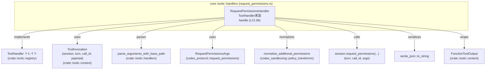
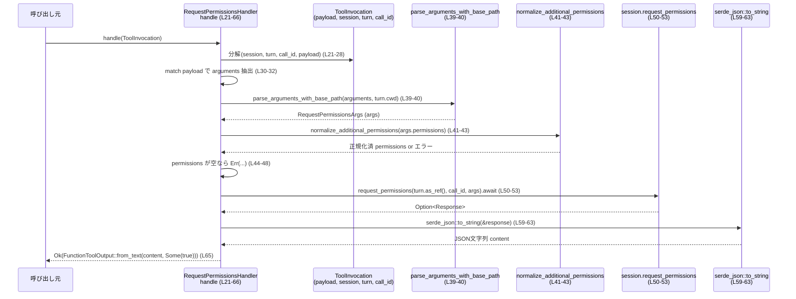

# core/src/tools/handlers/request_permissions.rs コード解説

## 0. ざっくり一言

`RequestPermissionsHandler` は、ツール呼び出し（`ToolInvocation`）から `request_permissions` 用の引数を取り出して正規化し、セッションに権限要求を送り、その結果を JSON 文字列として `FunctionToolOutput` に包んで返す非同期ハンドラです。[request_permissions.rs:L12-66]

---

## 1. このモジュールの役割

### 1.1 概要

- このモジュールは **「外部からの request_permissions ツール呼び出し」** を処理するために存在し、  
  **権限リクエスト引数のパース・正規化・検証と、セッションへの委譲、およびレスポンスの JSON 化** を行います。[request_permissions.rs:L21-66]
- `ToolHandler` トレイトの実装として、ツールレジストリから呼び出されることを前提とした構造になっています。[request_permissions.rs:L14-19]

### 1.2 アーキテクチャ内での位置づけ

このファイルのコードから読み取れる依存関係は次のとおりです。

- `RequestPermissionsHandler` は `ToolHandler` トレイトを実装するツールハンドラです。[request_permissions.rs:L14-19]
- ツール呼び出しコンテキスト `ToolInvocation` から、`session`, `turn`, `call_id`, `payload` を取り出して処理します。[request_permissions.rs:L21-28]
- 引数 JSON 文字列を `parse_arguments_with_base_path` 経由で `RequestPermissionsArgs` に変換します。[request_permissions.rs:L39-40]
- `RequestPermissionsArgs.permissions` を `normalize_additional_permissions` で正規化し、`RequestPermissionProfile` に変換します。[request_permissions.rs:L41-43]
- 正規化後の `permissions` が空でないことをチェックします。[request_permissions.rs:L44-48]
- `session.request_permissions` を非同期に呼び出し、結果（`Option<…>`）を取得します。[request_permissions.rs:L50-53]
- 得られたレスポンスを `serde_json::to_string` で JSON 文字列にシリアライズし、`FunctionToolOutput::from_text` でラップして返します。[request_permissions.rs:L59-65]



※ 外部モジュール (`ToolInvocation` など) の実装はこのチャンクには現れないため、詳細は不明です。

### 1.3 設計上のポイント

- **ステートレスなハンドラ**
  - `RequestPermissionsHandler` はフィールドを持たないユニット構造体です。[request_permissions.rs:L12]
  - 全ての状態は `ToolInvocation` から受け取り、`handle` のローカル変数として扱われます。[request_permissions.rs:L21-48]
- **共通インターフェースによる拡張性**
  - ツールごとに `ToolHandler` を実装する設計になっており、`kind()` でツール種別（ここでは `ToolKind::Function`）を返します。[request_permissions.rs:L14-19]
- **明示的なエラーハンドリング**
  - 全処理は `Result<FunctionToolOutput, FunctionCallError>` でラップされ、  
    想定外の入力や失敗時には `FunctionCallError::RespondToModel` または `FunctionCallError::Fatal` を返します。[request_permissions.rs:L33-37, L41-43, L45-47, L53-57, L59-63]
- **権限リストの正規化とバリデーション**
  - 利用者から受け取った `permissions` を正規化し（`normalize_additional_permissions`）、  
    結果が空であればエラーとします。[request_permissions.rs:L41-48]
- **非同期処理 (`async/await`)**
  - `handle` は `async fn` として定義され、`session.request_permissions(...).await` により  
    非同期にセッションからの応答を待ちます。[request_permissions.rs:L21, L50-53]
  - Rust の `async/await` によって、スレッドをブロックせずに待機できる設計になっています。
- **JSON シリアライズによる統一的な出力**
  - レスポンスは JSON にシリアライズされ、テキストベースの `FunctionToolOutput` として上位層に返されます。[request_permissions.rs:L59-65]

### 1.4 コンポーネント一覧（このチャンク）

| 種別 | 名前 | 役割 | 定義位置 |
|------|------|------|----------|
| 構造体 | `RequestPermissionsHandler` | `request_permissions` ツールを処理するハンドラ。`ToolHandler` を実装するユニット構造体。 | request_permissions.rs:L12 |
| トレイト実装 | `impl ToolHandler for RequestPermissionsHandler` | ツール種別の返却 (`kind`) とメイン処理 (`handle`) を提供。 | request_permissions.rs:L14-66 |
| メソッド | `fn kind(&self) -> ToolKind` | このハンドラが扱うツール種別として `ToolKind::Function` を返す。 | request_permissions.rs:L17-19 |
| メソッド（非公開 APIだが中核） | `async fn handle(&self, invocation: ToolInvocation) -> Result<FunctionToolOutput, FunctionCallError>` | ツール呼び出しの処理本体。引数パース、権限正規化、セッションへの権限要求、JSON 生成を行う。 | request_permissions.rs:L21-66 |

---

## 2. 主要な機能一覧

- request_permissions ツール呼び出しの処理入口 (`ToolHandler` 実装)[request_permissions.rs:L14-21]
- `ToolInvocation` の `payload` から Function 型の引数を抽出し、その他のペイロードを拒否[request_permissions.rs:L30-37]
- JSON 形式の引数文字列を `RequestPermissionsArgs` にパース[request_permissions.rs:L39-40]
- `permissions` の正規化（`normalize_additional_permissions`）と `RequestPermissionProfile` への変換[request_permissions.rs:L41-43]
- 正規化後 `permissions` が空でないことの検証[request_permissions.rs:L44-48]
- セッションへの権限要求 (`session.request_permissions`) とキャンセル検知[request_permissions.rs:L50-57]
- 受信したレスポンスの JSON シリアライズと `FunctionToolOutput` への変換[request_permissions.rs:L59-65]

---

## 3. 公開 API と詳細解説

### 3.1 型一覧（構造体・列挙体など）

| 名前 | 種別 | 役割 / 用途 | 定義位置 |
|------|------|-------------|----------|
| `RequestPermissionsHandler` | 構造体（ユニット構造体） | `ToolHandler` を実装し、request_permissions ツール呼び出しを処理するエントリポイント。フィールドは持たない。 | request_permissions.rs:L12 |

※ このファイル内で `pub` が付いている型は `RequestPermissionsHandler` のみです。[request_permissions.rs:L12]

### 3.2 関数詳細

#### `fn kind(&self) -> ToolKind`

**概要**

- このハンドラが扱うツール種別を返します。[request_permissions.rs:L17-19]
- ここでは、関数呼び出し型のツールとして `ToolKind::Function` を返しています。

**引数**

| 引数名 | 型 | 説明 |
|--------|----|------|
| `&self` | `&RequestPermissionsHandler` | ハンドラインスタンスへの参照。メンバを持たないため、状態は使用しません。[request_permissions.rs:L17] |

**戻り値**

- 型: `ToolKind`。[request_permissions.rs:L17]
- 値: `ToolKind::Function` を常に返します。[request_permissions.rs:L18]

**内部処理の流れ**

1. 受け取った `&self` を特に使わずに、`ToolKind::Function` を返すだけです。[request_permissions.rs:L17-19]

**Examples（使用例）**

```rust
// ハンドラを作成（ユニット構造体なのでフィールドはない）
let handler = RequestPermissionsHandler; // request_permissions.rs:L12

// ツール種別を取得
let kind = handler.kind();               // request_permissions.rs:L17-19

// kind は ToolKind::Function になる
assert!(matches!(kind, ToolKind::Function));
```

※ `ToolKind` の中身（他にどのようなバリアントがあるか）はこのチャンクには現れません。

**Errors / Panics**

- この関数は `Result` を返さず、かつ内部でパニックを起こすコード（`unwrap` など）も含んでいません。[request_permissions.rs:L17-19]
- 従って、ここからエラーやパニックが発生することはありません。

**Edge cases（エッジケース）**

- `RequestPermissionsHandler` はフィールドを持たないため、どのような状態のインスタンスでも同じ結果（`ToolKind::Function`）を返します。[request_permissions.rs:L12, L17-19]

**使用上の注意点**

- 状態に依存しないため、複数スレッドで共有してもこのメソッドの結果は変わりません（Rust の所有権・同期保証の範囲内で）。  
  ただし、`RequestPermissionsHandler` 自体のスレッド安全性はこのチャンクからは判断できません。

---

#### `async fn handle(&self, invocation: ToolInvocation) -> Result<FunctionToolOutput, FunctionCallError>`

**概要**

- request_permissions ツール呼び出しのメイン処理です。[request_permissions.rs:L21-66]
- やっていることを順に並べると:
  1. `ToolInvocation` から `session`, `turn`, `call_id`, `payload` を取り出す。
  2. `payload` が `ToolPayload::Function` 以外ならエラーを返す。
  3. 引数文字列を `RequestPermissionsArgs` にパースする。
  4. `permissions` を正規化し、空でないことを検証する。
  5. `session.request_permissions` に処理を委譲し、結果を待つ。
  6. 結果を JSON にシリアライズし、`FunctionToolOutput` として返す。

**引数**

| 引数名 | 型 | 説明 |
|--------|----|------|
| `&self` | `&RequestPermissionsHandler` | ハンドラ本体への参照。特にメンバを持たないため状態には依存しません。[request_permissions.rs:L21] |
| `invocation` | `ToolInvocation` | ツール呼び出しコンテキスト。`session`, `turn`, `call_id`, `payload` などを含みます。[request_permissions.rs:L21-28] |

`ToolInvocation` のフィールドのうち、この関数が使用するものは:

- `session` — `request_permissions` メソッドを持つオブジェクト。[request_permissions.rs:L22, L50-52]
- `turn` — `cwd` フィールドと `as_ref()` メソッドを持つ値。[request_permissions.rs:L23, L39-40, L51]
- `call_id` — 呼び出し ID。セッションへの問い合わせに渡されます。[request_permissions.rs:L25, L51]
- `payload` — 引数の種類と内容を表す列挙体。`ToolPayload::Function` を想定しています。[request_permissions.rs:L26, L30-31]

他のフィールドは `..` で無視されています。[request_permissions.rs:L27-28]

**戻り値**

- 型: `Result<FunctionToolOutput, FunctionCallError>`。[request_permissions.rs:L21]
  - `Ok(FunctionToolOutput)`:
    - セッションから権限リクエストのレスポンスを受け取り、それを JSON テキストとしてラップした値。[request_permissions.rs:L59-65]
  - `Err(FunctionCallError)`:
    - 入力ペイロード種別が不正、引数パースや正規化の失敗、権限リクエストのキャンセル、JSON シリアライズの失敗などで発生します。[request_permissions.rs:L33-37, L41-43, L45-47, L53-57, L59-63]

**内部処理の流れ（アルゴリズム）**

1. **コンテキストの分解**  
   `ToolInvocation` から必要なフィールドを構造体パターンで取り出します。[request_permissions.rs:L21-28]

   ```rust
   let ToolInvocation {
       session,
       turn,
       call_id,
       payload,
       ..
   } = invocation;
   ```

2. **ペイロード種別の確認**[request_permissions.rs:L30-37]  
   - `payload` を `match` し、`ToolPayload::Function { arguments }` であれば `arguments` を取り出し、  
     それ以外のバリアントなら `FunctionCallError::RespondToModel` エラーを返して処理を終了します。

3. **引数 JSON のパース**[request_permissions.rs:L39-40]  
   - `parse_arguments_with_base_path(&arguments, &turn.cwd)?` を呼び出し、`RequestPermissionsArgs` に変換します。
   - `?` 演算子を用いて、パース時にエラーが発生した場合はその場で `Err` を返します（エラー型は `FunctionCallError` に変換済みであると解釈できますが、具体的な変換は `parse_arguments_with_base_path` 側の実装に依存します。このチャンクには現れません）。

4. **権限リストの正規化と変換**[request_permissions.rs:L41-43]  
   - `args.permissions` を `into()` で変換後、`normalize_additional_permissions` に渡して正規化します。
   - その結果に対して `.map(RequestPermissionProfile::from)` を行い、正規化結果を `RequestPermissionProfile` 型にします。
   - 途中で発生したエラーは `.map_err(FunctionCallError::RespondToModel)?` により `FunctionCallError::RespondToModel` に変換され、即時に `Err` として返されます。

5. **空リストの検証**[request_permissions.rs:L44-48]  
   - `args.permissions.is_empty()` をチェックし、空であれば  
     `"request_permissions requires at least one permission"` というメッセージとともに  
     `FunctionCallError::RespondToModel` を返して終了します。

6. **セッションへの権限リクエスト**[request_permissions.rs:L50-57]  
   - `session.request_permissions(turn.as_ref(), call_id, args).await` を実行します。
   - 戻り値は `Option<レスポンス>` 型であることが、続く `ok_or_else` から分かります。
   - `None` の場合は `"request_permissions was cancelled before receiving a response"` というメッセージの `FunctionCallError::RespondToModel` を返します。

7. **レスポンスの JSON シリアライズと出力生成**[request_permissions.rs:L59-65]  
   - `serde_json::to_string(&response)` でレスポンスを JSON 文字列にシリアライズします。
   - シリアライズに失敗した場合は `FunctionCallError::Fatal` としてエラーメッセージを返します。
   - 成功した場合は `FunctionToolOutput::from_text(content, Some(true))` を呼び出し、  
     テキストベースのツール出力として `Ok(...)` を返します。

**Examples（使用例）**

`RequestPermissionsHandler` は通常、ツール実行基盤から呼び出されると考えられますが、このチャンクにはそのコードはありません。  
以下は、既に `ToolInvocation` が構築されているという前提での疑似的な使用例です。

```rust
use crate::tools::handlers::request_permissions::RequestPermissionsHandler;
use crate::tools::context::ToolInvocation;
use crate::function_tool::FunctionCallError;

async fn run_request_permissions(invocation: ToolInvocation) -> Result<(), FunctionCallError> {
    // ハンドラを作成（ユニット構造体なのでそのまま値を作る）
    let handler = RequestPermissionsHandler; // request_permissions.rs:L12

    // ツール呼び出しを処理
    let output = handler.handle(invocation).await?; // request_permissions.rs:L21-66

    // ここでは単純にデバッグ出力
    println!("{:?}", output);

    Ok(())
}
```

※ `ToolInvocation` の具体的な構築方法や `FunctionToolOutput` の中身はこのチャンクには現れないため、例では省略しています。

**Errors / Panics**

この関数は `panic!` を直接呼び出していませんが、複数のケースで `Err(FunctionCallError)` を返します。

1. **不正なペイロード種別**[request_permissions.rs:L30-37]  
   - 条件: `payload` が `ToolPayload::Function { .. }` 以外。  
   - 戻り値: `Err(FunctionCallError::RespondToModel("request_permissions handler received unsupported payload".to_string()))`。

2. **引数のパース失敗**[request_permissions.rs:L39-40]  
   - 条件: `parse_arguments_with_base_path` が `Err` を返す場合。
   - 戻り値: `?` により `FunctionCallError` 型でそのまま伝播（正確なメッセージや variant はこのチャンクには現れません）。

3. **権限正規化の失敗**[request_permissions.rs:L41-43]  
   - 条件: `normalize_additional_permissions` が `Err(e)` を返す場合。
   - 戻り値: `Err(FunctionCallError::RespondToModel(e))`。

4. **正規化後に権限が1つもない**[request_permissions.rs:L44-48]  
   - 条件: `args.permissions.is_empty()` が `true`。
   - 戻り値: `Err(FunctionCallError::RespondToModel("request_permissions requires at least one permission".to_string()))`。

5. **セッション側のキャンセル**[request_permissions.rs:L50-57]  
   - 条件: `session.request_permissions(...).await` の戻り値が `None`。
   - 戻り値:  
     `Err(FunctionCallError::RespondToModel("request_permissions was cancelled before receiving a response".to_string()))`。

6. **JSON シリアライズの失敗**[request_permissions.rs:L59-63]  
   - 条件: `serde_json::to_string(&response)` が `Err(err)` を返す場合。
   - 戻り値:  
     `Err(FunctionCallError::Fatal(format!("failed to serialize request_permissions response: {err}")))`。

**Panics**

- この関数内には明示的な `panic!` や `unwrap` などが無いため、通常の成功・失敗分岐ではパニックは発生しません。[request_permissions.rs:L21-66]
- ただし、呼び出し先の関数（例: `session.request_permissions`, `normalize_additional_permissions`）が内部でパニックする可能性については、このチャンクには情報がありません。

**Edge cases（エッジケース）**

- **ペイロードが Function 以外**[request_permissions.rs:L30-37]  
  → 即座にエラーを返し、セッションには何も送られません。
- **引数 JSON が欠落／不正フォーマット**[request_permissions.rs:L39-40]  
  → `parse_arguments_with_base_path` が `Err` を返すことで検出され、`Result::Err` として上位に伝播します。
- **permissions が空／全て不正で正規化後に空になる**[request_permissions.rs:L44-48]  
  → `"request_permissions requires at least one permission"` エラーで終了します。
- **セッションから応答が返らない（キャンセル）**[request_permissions.rs:L50-57]  
  → `"request_permissions was cancelled before receiving a response"` エラーを返します。
- **レスポンスが JSON 化できない構造**[request_permissions.rs:L59-63]  
  → `Fatal` なエラーとして扱われ、シリアライズ失敗理由を含むメッセージで終了します。

**使用上の注意点**

- `ToolInvocation.payload` は必ず `ToolPayload::Function { arguments }` として渡す必要があります。[request_permissions.rs:L30-32]
- `arguments` に含まれる JSON は `RequestPermissionsArgs` にパース可能でなければなりません。[request_permissions.rs:L39-40]
- 正規化後も最低 1 つ以上の有効な permission が残るような入力を渡す必要があります。[request_permissions.rs:L41-48]
- `session.request_permissions` を呼び出す際に、キャンセルされる可能性を考慮する必要があります（`Option` が `None` になりうる）。[request_permissions.rs:L50-57]
- `handle` は `async fn` であり、非同期ランタイム（例: Tokio）上で `.await` する必要があります。  
  Rust の非同期処理では、`async fn` が `Future` を返すことに注意します。

### 3.3 その他の関数

- このファイルには、上記以外の関数定義は存在しません。[request_permissions.rs:L1-67]

---

## 4. データフロー

ここでは、`handle` メソッドが呼び出されたときの代表的なデータの流れを示します。

1. 上位レイヤーが `ToolInvocation` を構築し、`RequestPermissionsHandler::handle` に渡す。[request_permissions.rs:L21]
2. `payload` から `arguments`（おそらく JSON 文字列）を取り出す。[request_permissions.rs:L30-32]
3. `parse_arguments_with_base_path` で `RequestPermissionsArgs` に変換する。[request_permissions.rs:L39-40]
4. `normalize_additional_permissions` で `permissions` を正規化し、プロファイルに変換する。[request_permissions.rs:L41-43]
5. 正規化後の `permissions` を検証し、空であればエラー。[request_permissions.rs:L44-48]
6. セッション経由で `request_permissions` を発行し、レスポンスを受け取る。[request_permissions.rs:L50-53]
7. レスポンスを JSON 文字列にシリアライズし、`FunctionToolOutput` として返す。[request_permissions.rs:L59-65]



---

## 5. 使い方（How to Use）

### 5.1 基本的な使用方法

このファイルからは直接のエントリポイントは `RequestPermissionsHandler` のみです。[request_permissions.rs:L12-21]

以下は、既に外部で `ToolInvocation` が構築されている前提での基本的な使用例です。

```rust
use crate::tools::handlers::request_permissions::RequestPermissionsHandler;
use crate::tools::context::ToolInvocation;
use crate::function_tool::FunctionCallError;

async fn handle_request_permissions(invocation: ToolInvocation) -> Result<(), FunctionCallError> {
    // ハンドラのインスタンスを用意（ユニット構造体のためそのまま値を使う）
    let handler = RequestPermissionsHandler; // request_permissions.rs:L12

    // ツール種別の確認（必要であれば）
    assert!(matches!(handler.kind(), ToolKind::Function)); // request_permissions.rs:L17-19

    // 実際の処理を実行
    let output = handler.handle(invocation).await?; // request_permissions.rs:L21-66

    // ここでは単純に出力を表示
    println!("{:?}", output);

    Ok(())
}
```

`ToolInvocation` の構築（`payload` の設定など）はこのチャンクには現れないため、利用する側のコードベースを確認する必要があります。

### 5.2 よくある使用パターン

1. **Function 型ツールとしての登録・利用**

   - `ToolKind::Function` を返すことから、ツールレジストリなどで「関数型ツール」として扱われることが想定されます。[request_permissions.rs:L17-19]
   - 上位のディスパッチャが `ToolKind::Function` に応じて、このハンドラの `handle` を呼び出す構造が考えられます（ただし、このチャンクにはディスパッチャの実装はありません）。

2. **権限セットの正規化・検証を挟んだツール呼び出し**

   - 生の `permissions` をそのまま渡すのではなく、`normalize_additional_permissions` を通して正規化してからセッションに渡すパターンです。[request_permissions.rs:L41-43]
   - 不正な権限指定や重複を正規化／排除するためのステップと解釈できますが、正確な挙動は正規化関数の実装に依存し、このチャンクには現れません。

### 5.3 よくある間違い

コードから推測できる「誤用しやすそうな点」と「正しい例」を対比します。

```rust
// 誤り例: Function 以外のペイロードを渡してしまう
let invocation = ToolInvocation {
    // ...
    payload: ToolPayload::Streaming { /* ... */ }, // 仮のバリアント名
    //              ^^^^^^^^^^^^^^^^^^^^^^^^^^^
    // このチャンクには Streaming バリアントは登場しませんが、
    // Function 以外ならエラーになることだけは読めます。
};

// この場合、handle 内の match で _ がマッチし、Err(FunctionCallError::RespondToModel(...)) が返る
let result = handler.handle(invocation).await;

// 正しい例: Function ペイロードを渡す
let invocation = ToolInvocation {
    // ...
    payload: ToolPayload::Function {
        arguments: r#"{"permissions": ["read", "write"]}"#.to_string(),
    }, // request_permissions.rs:L30-32 を満たす
    // ...
};

let result = handler.handle(invocation).await;
// permissions が正しく正規化でき、空にならなければ Ok(...) が返る
```

※ 上記は構造を説明するための疑似コードであり、`ToolInvocation` の正確なフィールド構成はこのチャンクには現れません。

### 5.4 使用上の注意点（まとめ）

- **ペイロード種別**  
  - `payload` は必ず `ToolPayload::Function { arguments }` である必要があります。[request_permissions.rs:L30-32]  
  - 他のバリアントを渡すと `"request_permissions handler received unsupported payload"` エラーになります。[request_permissions.rs:L33-35]

- **引数 JSON の形式**  
  - `arguments` は `RequestPermissionsArgs` にパース可能な JSON 形式でなければなりません。[request_permissions.rs:L39-40]  
  - `parse_arguments_with_base_path` の仕様（ベースパス処理など）はこのチャンクには現れないため、パス解決周りの前提は別途確認が必要です。

- **permissions の内容**  
  - `permissions` は `normalize_additional_permissions` に渡されるため、この関数の仕様に従った形式である必要があります。[request_permissions.rs:L41-43]  
  - 正規化後に空になるとエラーになるため、入力に最低 1 つの有効な permission を含める必要があります。[request_permissions.rs:L44-48]

- **キャンセルの考慮**  
  - `session.request_permissions(...).await` の戻り値が `Option` であり、`None` の場合は「キャンセル」と解釈してエラーになります。[request_permissions.rs:L50-57]  
  - 上位レイヤーでは、キャンセル操作がどのように `None` につながるかを理解しておく必要があります。

- **JSON シリアライズの失敗時は Fatal**  
  - レスポンスが JSON に変換できない場合、`FunctionCallError::Fatal` として扱われます。[request_permissions.rs:L59-63]  
  - これはモデルに返す単なるエラーではなく、より重大なエラー扱いとして設計されていると解釈できます（ただし意味付けは `FunctionCallError` の定義に依存し、このチャンクには現れません）。

- **並行性・スレッド安全性**  
  - `handle` は非同期関数ですが、この関数内では共有ミュータブル状態へのアクセスはありません。[request_permissions.rs:L21-66]  
  - そのため、この関数自体はスレッド安全性の観点でシンプルです。  
    ただし、`session` や `normalize_additional_permissions` の内部でのスレッド安全性は別途確認が必要です。

---

## 6. 変更の仕方（How to Modify）

### 6.1 新しい機能を追加する場合

このファイルのコードから読み取れる範囲で、「request_permissions ハンドラに機能を追加する」際の入口を整理します。

1. **前処理・検証ロジックを追加したい場合**
   - 例: `permissions` の数の上限チェックなど。
   - 追加先: 権限正規化後〜空チェック前の部分が自然です。[request_permissions.rs:L41-48]

   ```rust
   args.permissions = normalize_additional_permissions(...)
       .map(...)
       .map_err(FunctionCallError::RespondToModel)?;

// ここに追加の検証ロジックを挿入するなど
// if args.permissions.len() > MAX { ... }

   if args.permissions.is_empty() {
       // ...
   }

   ```

2. **レスポンスのフォーマットを変えたい場合**
   - 例: JSON ではなく別形式で返したい。
   - 変更箇所: `serde_json::to_string` と `FunctionToolOutput::from_text` の部分。[request_permissions.rs:L59-65]

3. **エラー分類の粒度を細かくしたい場合**
   - 例: 正規化失敗とキャンセルを別のエラー型に分ける。
   - 変更箇所:  
     - 正規化結果の `.map_err(FunctionCallError::RespondToModel)`。[request_permissions.rs:L41-43]  
     - `ok_or_else` でのエラー生成部分。[request_permissions.rs:L53-57]

### 6.2 既存の機能を変更する場合

変更時に注意すべき「契約」（前提条件・返り値の意味）を整理します。

- **ペイロード契約の変更**
  - 現状: `ToolPayload::Function` 以外は一律エラー。[request_permissions.rs:L30-37]
  - 変更する場合:
    - 新しいペイロード種別を許容するなら、`match` のパターンに分岐を追加する必要があります。
    - その際、上位レイヤーが期待するエラーメッセージ／エラー種別との整合性を確認する必要があります。

- **permissions 空時の挙動変更**
  - 現状: 空であればエラー。[request_permissions.rs:L44-48]
  - 変更する場合:
    - 例えば「空なら何もしないで成功扱い」としたいなら、`Err` を返す代わりに `Ok` を返すように変更します。
    - これにより、上位レイヤーのロジックが変わる（「空がエラー」という前提で書かれたコードがあれば破綻する）可能性があるため、影響範囲の確認が必要です。

- **キャンセル扱いの変更**
  - 現状: `None` は `"was cancelled before receiving a response"` エラー。[request_permissions.rs:L50-57]
  - 変更する場合:
    - キャンセルを成功扱いで握りつぶす、あるいは別種のエラー型にするなどを検討できます。
    - `session.request_permissions` の仕様との整合性が重要です。

- **テスト・使用箇所の確認**
  - このチャンクにはテストコードやこのハンドラの使用箇所は現れません。
  - 実際に変更する際は、プロジェクト内で `RequestPermissionsHandler` や `ToolKind::Function` が使われている場所を検索し、期待する挙動との整合性を確認する必要があります。

---

## 7. 関連ファイル

このモジュールと密接に関連する型・関数は、他ファイル／クレートで定義されています。

| パス / シンボル | 役割 / 関係 | 根拠 |
|-----------------|------------|------|
| `codex_protocol::request_permissions::RequestPermissionsArgs` | request_permissions ツールの引数を表す構造体。`parse_arguments_with_base_path` の結果として使用される。 | 型としてインポートされ、`let mut args: RequestPermissionsArgs = ...` で利用。[request_permissions.rs:L1, L39-40] |
| `codex_protocol::request_permissions::RequestPermissionProfile` | 正規化後の permission を表す型。`RequestPermissionProfile::from` で変換に使用。 | `.map(...::RequestPermissionProfile::from)` から推測。[request_permissions.rs:L42] |
| `codex_sandboxing::policy_transforms::normalize_additional_permissions` | permissions を正規化する関数。無効なエントリの除去や形式変換を行うと解釈できるが、詳細は不明。 | 関数としてインポートされ、`normalize_additional_permissions(args.permissions.into())` として呼び出されている。[request_permissions.rs:L2, L41] |
| `crate::function_tool::FunctionCallError` | ツール呼び出し時のエラー型。`RespondToModel` や `Fatal` などのバリアントを持つ列挙体と推測される。 | 型としてインポートされ、エラーとして多数使用。[request_permissions.rs:L4, L33-37, L41-43, L45-47, L53-57, L59-63] |
| `crate::tools::context::FunctionToolOutput` | ツールの戻り値として上位層に渡される出力コンテナ。テキストから生成する `from_text` 関数を持つ。 | 型としてインポートされ、`type Output = FunctionToolOutput` および `FunctionToolOutput::from_text` に使われている。[request_permissions.rs:L5, L15, L65] |
| `crate::tools::context::ToolInvocation` | ツール呼び出しコンテキスト。`session`, `turn`, `call_id`, `payload` などを含む。 | 型としてインポートされ、パターン分解されている。[request_permissions.rs:L6, L21-28] |
| `crate::tools::context::ToolPayload` | ツールへの入力ペイロード種別。ここでは `ToolPayload::Function { arguments }` が使用される。 | 型としてインポートされ、`match payload` の対象として使用。[request_permissions.rs:L7, L30-32] |
| `crate::tools::handlers::parse_arguments_with_base_path` | 引数文字列をパースし、カレントディレクトリ情報（`turn.cwd`）を考慮して構造体に変換するユーティリティ関数と解釈できるが、実装は不明。 | 関数としてインポートされ、`parse_arguments_with_base_path(&arguments, &turn.cwd)` として使用。[request_permissions.rs:L8, L39-40] |
| `crate::tools::registry::ToolHandler` | ツールハンドラの共通インターフェースを提供するトレイト。`kind` と `handle` を定義している。 | インポートされ、`impl ToolHandler for RequestPermissionsHandler` で実装されている。[request_permissions.rs:L9, L14-21] |
| `crate::tools::registry::ToolKind` | ツールの種類を表す列挙体。ここでは `ToolKind::Function` バリアントが使われている。 | インポートされ、`fn kind(&self) -> ToolKind { ToolKind::Function }` に使用。[request_permissions.rs:L10, L17-19] |

※ これらの関連ファイル・型の実装そのものはこのチャンクには含まれていないため、挙動の詳細は該当ファイルを参照する必要があります。
