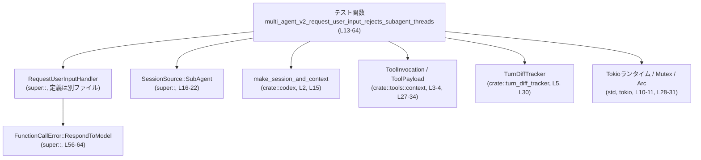
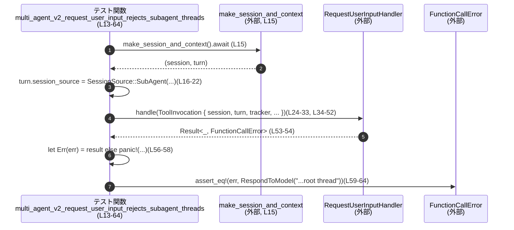

# core/src/tools/handlers/request_user_input_tests.rs コード解説

## 0. ざっくり一言

`RequestUserInputHandler` が **サブエージェント・スレッドからは `request_user_input` ツールを使えないこと** を検証する、Tokio 非同期テストを 1 件だけ含むファイルです（`request_user_input_tests.rs:L13-64`）。

---

## 1. このモジュールの役割

### 1.1 概要

- このテストモジュールは、「マルチエージェント環境 (multi_agent_v2) において、`request_user_input` ツールがサブエージェント・スレッドから呼ばれた場合にエラーになる」ことを検証します（`request_user_input_tests.rs:L13-64`）。
- 具体的には、`SessionSource::SubAgent(SubAgentSource::ThreadSpawn { .. })` を持つスレッドから `RequestUserInputHandler::handle` を呼び出したとき、`FunctionCallError::RespondToModel` が返ることを期待しています（`request_user_input_tests.rs:L16-22`, `L56-64`）。

### 1.2 アーキテクチャ内での位置づけ

このファイル内のテストは、`request_user_input` ツールのハンドラの **外部振る舞い** を確認する役割です。依存関係は次の通りです。

- 上位モジュール（`super::*`）  
  - `RequestUserInputHandler`
  - `SessionSource`
  - `FunctionCallError`
  - `REQUEST_USER_INPUT_TOOL_NAME`  
  などがここからインポートされています（`request_user_input_tests.rs:L1`）。
- コンテキスト生成: `crate::codex::make_session_and_context`（`L2`, `L15`）
- ツール呼び出しコンテキスト: `ToolInvocation`, `ToolPayload`（`L3-4`, `L27-34`）
- 差分トラッカー: `TurnDiffTracker`（`L5`, `L30`）
- マルチエージェント情報: `ThreadId`, `SubAgentSource`（`L6-7`, `L16-21`）
- 非同期・並行性: `#[tokio::test]`, `Arc`, `tokio::sync::Mutex`（`L10-11`, `L13`, `L28-31`）

依存関係の概要を Mermaid 図で示します（このファイルの範囲: `request_user_input_tests.rs:L1-64`）。



> `RequestUserInputHandler` や `SessionSource` の実装本体はこのチャンクには現れないため、内部ロジックは不明です。

### 1.3 設計上のポイント

コードから読み取れる設計上の特徴は次の通りです。

- **権限チェックのテスト**  
  - サブエージェント・スレッド (`SessionSource::SubAgent`) からの `request_user_input` 呼び出しを禁止する仕様を、明示的に 1 テストでカバーしています（`request_user_input_tests.rs:L16-22`, `L56-64`）。
- **非同期コンテキストでのハンドラ利用**  
  - ハンドラは `async` な `handle` メソッドを持ち、Tokio の非同期テストから `await` 経由で呼び出されています（`L13-15`, `L24-27`, `L53-54`）。
- **共有状態の前提**  
  - `session`, `turn`, `tracker` を `Arc` と `Mutex` でラップして渡しており、ハンドラが複数箇所から共有される前提を持つことが示唆されます（`L28-31`）。  
    ただし実際に並行アクセスしているコードはこのファイルにはありません。
- **エラーハンドリング方針の一部がテストで固定**  
  - サブエージェントからの呼び出し時には、`FunctionCallError::RespondToModel` として **固定のエラーメッセージ** を返す契約が事実上ここで決められています（`"request_user_input can only be used by the root thread"`; `L61-63`）。

---

## 2. 主要な機能一覧

このファイル内に定義されている機能は 1 つのテスト関数です。

- `multi_agent_v2_request_user_input_rejects_subagent_threads`:  
  サブエージェント・スレッドから `RequestUserInputHandler::handle` を呼び出した場合に、`FunctionCallError::RespondToModel` エラーが返ることを検証する非同期テスト（`request_user_input_tests.rs:L13-64`）。

---

## 3. 公開 API と詳細解説

このファイル自身はプロダクション用の公開 API を定義しておらず、すべてテスト用コードです。ただし、テストが依存している外部 API について、わかる範囲で簡単に整理します。

### 3.1 型一覧（構造体・列挙体など）

このファイル内で **定義** されている型はありません。  
ただし、テストで重要な役割を持つ外部型をインベントリーとしてまとめます（定義元はすべて他ファイルです）。

| 名前 | 種別 | 役割 / 用途 | 登場位置 |
|------|------|-------------|----------|
| `RequestUserInputHandler` | 構造体（super::） | `request_user_input` ツール呼び出しを処理するハンドラとして使用されています。フィールド `default_mode_request_user_input: bool` を持ち、`handle` メソッドを提供します（`L24-27`）。実装本体はこのチャンクには存在しません。 | `request_user_input_tests.rs:L24-27` |
| `SessionSource` | 列挙体（super::） | セッションの起点（ルートスレッド / サブエージェントなど）を表す列挙体と思われます。ここでは `SessionSource::SubAgent` が使用されています（`L16`）。定義はこのチャンクにはありません。 | `request_user_input_tests.rs:L16` |
| `SubAgentSource` | 列挙体（`codex_protocol::protocol`） | サブエージェント・スレッドの生成経路を表す型で、`ThreadSpawn` バリアントを通じて親スレッド ID 等を保持します（`L16-21`）。 | `request_user_input_tests.rs:L7`, `L16-21` |
| `ThreadId` | 構造体（`codex_protocol`） | スレッドを識別する ID 型で、新規 ID を作る `ThreadId::new()` が使用されています（`L17`）。 | `request_user_input_tests.rs:L6`, `L17` |
| `ToolInvocation` | 構造体（`crate::tools::context`） | ツール呼び出しのコンテキスト（`session`, `turn`, `tracker`, `call_id`, `tool_name`, `payload`）をまとめた型です（`L27-33`）。定義本体はこのチャンクにはありません。 | `request_user_input_tests.rs:L3`, `L27-33` |
| `ToolPayload` | 列挙体（`crate::tools::context`） | ツールへのペイロードを表す型で、ここでは `ToolPayload::Function { arguments: String }` バリアントが使われています（`L33-34`, `L50-52`）。 | `request_user_input_tests.rs:L4`, `L33-34`, `L50-52` |
| `TurnDiffTracker` | 構造体（`crate::turn_diff_tracker`） | ターン間の差分を追跡する用途の型と推測されます。ここでは `TurnDiffTracker::default()` を `Arc<Mutex<_>>` でラップしてハンドラに渡しています（`L30`）。定義はこのチャンクにはありません。 | `request_user_input_tests.rs:L5`, `L30` |
| `FunctionCallError` | 列挙体（super::） | ツール呼び出し時のエラー型と考えられます。ここでは `FunctionCallError::RespondToModel(String)` バリアントに対して `assert_eq!` を行っています（`L61-63`）。定義はこのチャンクにはありません。 | `request_user_input_tests.rs:L61-63` |

> 役割の説明のうち「〜と推測されます」と記載している部分は、**型名や使われ方からの推測** であり、実装本体がないため断定はできません。

#### 関数インベントリー

| 関数名 | 種別 | 役割 / 用途 | 定義位置 |
|--------|------|-------------|----------|
| `multi_agent_v2_request_user_input_rejects_subagent_threads` | 非同期テスト関数 | サブエージェント・スレッドから `RequestUserInputHandler::handle` を呼ぶとエラーになることを検証する | `request_user_input_tests.rs:L13-64` |
| `make_session_and_context` | 外部関数（`crate::codex`） | テスト用に `(session, turn)` を生成するヘルパ関数として利用 | 呼び出しのみ: `request_user_input_tests.rs:L2`, `L15` |

### 3.2 関数詳細

#### `multi_agent_v2_request_user_input_rejects_subagent_threads()`

**概要**

- Tokio の非同期テストとして定義されており（`#[tokio::test]`、`request_user_input_tests.rs:L13`）、  
  **サブエージェント・スレッドからの `request_user_input` ツール呼び出しが必ずエラーになる** ことを検証します。
- エラーは `FunctionCallError::RespondToModel("request_user_input can only be used by the root thread")` であることを期待しています（`L61-63`）。

**引数**

- テスト関数のため引数はありません。

**戻り値**

- 戻り値型は `()`（ユニット）と推測されますが、テスト関数であるため明示的に扱われません。

**内部処理の流れ（アルゴリズム）**

コードの流れを 5 ステップに整理します。

1. **セッションとターンの準備**（`request_user_input_tests.rs:L15`）  

   ```rust
   let (session, mut turn) = make_session_and_context().await;
   ```  

   - 非同期関数 `make_session_and_context` により、`session` と `turn` の初期値を取得します。

2. **ターンをサブエージェント・スレッドとしてマーク**（`L16-22`）  

   ```rust
   turn.session_source = SessionSource::SubAgent(SubAgentSource::ThreadSpawn {
       parent_thread_id: ThreadId::new(),
       depth: 1,
       agent_path: None,
       agent_nickname: None,
       agent_role: None,
   });
   ```  

   - `turn.session_source` を `SessionSource::SubAgent` に書き換え、  
     `SubAgentSource::ThreadSpawn` を通じて「親スレッド ID」「深さ」「各種メタ情報」を設定します。
   - ここで `depth: 1` としているため、「ルートから 1 段階深いサブエージェント」という前提が与えられます。

3. **`RequestUserInputHandler` の生成と `ToolInvocation` の構築**（`L24-33`, `L34-52`）  

   ```rust
   let result = RequestUserInputHandler {
       default_mode_request_user_input: true,
   }
   .handle(ToolInvocation {
       session: Arc::new(session),
       turn: Arc::new(turn),
       tracker: Arc::new(Mutex::new(TurnDiffTracker::default())),
       call_id: "call-1".to_string(),
       tool_name: codex_tools::ToolName::plain(REQUEST_USER_INPUT_TOOL_NAME),
       payload: ToolPayload::Function {
           arguments: json!({
               "questions": [{
                   "header": "Hdr",
                   "question": "Pick one",
                   "id": "pick_one",
                   "options": [
                       { "label": "A", "description": "A" },
                       { "label": "B", "description": "B" }
                   ]
               }]
           }).to_string(),
       },
   })
   .await;
   ```  

   - フィールド `default_mode_request_user_input: true` を持つ `RequestUserInputHandler` を生成します（`L24-26`）。
   - `ToolInvocation` には以下の情報を格納します（`L27-33`）。
     - `session`: `Arc` で共有されるセッション情報
     - `turn`: `Arc` で共有されるターン情報（先ほどサブエージェントとしてマーク済み）
     - `tracker`: `Arc<Mutex<TurnDiffTracker>>` としてラップした差分トラッカー
     - `call_id`: 呼び出し ID（ここでは `"call-1"`）
     - `tool_name`: `REQUEST_USER_INPUT_TOOL_NAME` を使って生成されたツール名
     - `payload`: `ToolPayload::Function` として、`arguments` に `serde_json::json!` で構築した JSON を文字列化して渡す（`L34-52`）。
   - JSON は `questions` 配列に 1 件の質問を含み、その中に 2 つの選択肢 `"A"` と `"B"` を持ちます（`L35-49`）。

4. **結果が `Err` であることの確認**（`L56-58`）  

   ```rust
   let Err(err) = result else {
       panic!("sub-agent request_user_input should fail");
   };
   ```  

   - `result` が `Err(err)` であることを `let-else` 構文で検査します。
   - もし `Ok(_)` だった場合は `panic!` を発生させ、テストを失敗させます。

5. **エラー内容の検証**（`L59-64`）  

   ```rust
   assert_eq!(
       err,
       FunctionCallError::RespondToModel(
           "request_user_input can only be used by the root thread".to_string(),
       )
   );
   ```  

   - エラー値 `err` が `FunctionCallError::RespondToModel` であり、そのメッセージが  
     `"request_user_input can only be used by the root thread"` と完全一致することを検証します。

**Examples（使用例）**

テスト内のコードは、そのまま「サブエージェントからの `request_user_input` 呼び出しが禁止されていること」を再現するサンプルとして利用できます。

```rust
// 非同期コンテキスト内の例（テストとほぼ同じ構成）
async fn example_subagent_request_user_input_should_fail() {
    // セッションとターンの用意（外部ヘルパー）
    let (session, mut turn) = make_session_and_context().await;

    // サブエージェント・スレッドとしてマーク
    turn.session_source = SessionSource::SubAgent(SubAgentSource::ThreadSpawn {
        parent_thread_id: ThreadId::new(),
        depth: 1,
        agent_path: None,
        agent_nickname: None,
        agent_role: None,
    });

    // ハンドラ生成と呼び出し
    let result = RequestUserInputHandler {
        default_mode_request_user_input: true,
    }
    .handle(ToolInvocation {
        session: Arc::new(session),
        turn: Arc::new(turn),
        tracker: Arc::new(Mutex::new(TurnDiffTracker::default())),
        call_id: "call-1".to_string(),
        tool_name: codex_tools::ToolName::plain(REQUEST_USER_INPUT_TOOL_NAME),
        payload: ToolPayload::Function {
            arguments: serde_json::json!({
                "questions": [{
                    "header": "Hdr",
                    "question": "Pick one",
                    "id": "pick_one",
                    "options": [
                        { "label": "A", "description": "A" },
                        { "label": "B", "description": "B" }
                    ]
                }]
            }).to_string(),
        },
    })
    .await;

    // サブエージェントからは必ずエラーになることを確認
    match result {
        Ok(_) => panic!("sub-agent request_user_input should fail"),
        Err(err) => {
            assert_eq!(
                err,
                FunctionCallError::RespondToModel(
                    "request_user_input can only be used by the root thread".to_string()
                )
            );
        }
    }
}
```

> `make_session_and_context`, `RequestUserInputHandler::handle` の内部実装はこのチャンクにはないため、  
> 上記は「テストで確認されている振る舞いを再現する」ための利用例にとどまります。

**Errors / Panics**

- **エラー (`Result::Err`)**  
  - このテストでは、サブエージェント・スレッドから `handle` を呼び出した場合、  
    `FunctionCallError::RespondToModel("request_user_input can only be used by the root thread")` を返すことが前提になっています（`request_user_input_tests.rs:L56-64`）。
  - 逆に言うと、「サブエージェント・スレッドから成功 (`Ok(_)`) することはない」契約をテストが固定しています。
- **panic の可能性**
  - `let Err(err) = result else { panic!(...) };` により、もし `result` が `Ok(_)` であればテストが `panic!` します（`L56-58`）。
  - この `panic!` はあくまでテストの失敗を表すものであり、プロダクションコード側で `panic!` しているわけではありません。

**Edge cases（エッジケース）**

このテストの範囲で確認している／していないケースを整理します。

- **確認しているケース**
  - `session_source` が `SessionSource::SubAgent(SubAgentSource::ThreadSpawn { depth: 1, ... })` の場合（`L16-21`）。
  - `payload` が「質問 1 件・選択肢 2 件」の形式で、構造としては正しそうな JSON の場合（`L34-49`）。
- **確認していないケース**（このファイルのコードからは不明）
  - `session_source` がルートスレッドの場合の挙動（`SessionSource::Root` など）は、このチャンクには現れません。
  - `depth` が 2 以上のサブエージェントや、`agent_path` / `agent_nickname` / `agent_role` が `Some` の場合の扱い。
  - `payload` が不正な JSON 文字列だった場合、またはスキーマが崩れている場合の挙動。
  - `default_mode_request_user_input: false` の場合の挙動。

**使用上の注意点**

- `RequestUserInputHandler::handle` は **サブエージェント・スレッドから呼び出すと必ずエラーになる** ことが、このテストから読み取れます。  
  したがって、サブエージェントからユーザー入力を求める設計は、このハンドラの現在の契約とは整合しません。
- `handle` の実行には `Arc` と `Mutex` でラップされたコンテキストが必要です（`L27-31`）。  
  これはハンドラが内部で共有状態にアクセスする可能性があることを示しており、呼び出し側も同様の前提に従う必要があります。
- 非同期関数として `.await` で呼び出す必要があるため、**Tokio などの非同期ランタイム上で実行**する前提があります（`#[tokio::test]`, `L13`）。

### 3.3 その他の関数

このファイルには他の関数定義はありません。

`make_session_and_context` は外部関数であり、ここでは単に「セッションとターンを返す非同期ヘルパ」として使われていますが、詳細な仕様はこのチャンクには現れません（`request_user_input_tests.rs:L2`, `L15`）。

---

## 4. データフロー

このテストにおける代表的なデータフローは、「サブエージェント・コンテキストで `request_user_input` を呼び出し、エラーを受け取る」というものです。

### シーケンス図



要点:

- `session` と `turn` は `make_session_and_context` によって生成されますが、その内部処理は不明です。
- `turn` の `session_source` を `SubAgent` に設定することで、「サブエージェントからの呼び出し」であることを明示しています（`request_user_input_tests.rs:L16-22`）。
- `ToolInvocation` 経由で `RequestUserInputHandler::handle` に情報が渡され、結果は `Result<_, FunctionCallError>` として返されます（`L24-33`, `L53-54`）。
- テストではその結果が `Err(FunctionCallError::RespondToModel("request_user_input can only be used by the root thread"))` であることだけを検証しています（`L56-64`）。

---

## 5. 使い方（How to Use）

このファイルはテスト専用ですが、**`RequestUserInputHandler::handle` をどのように呼び出すか** の参考にもなります。

### 5.1 基本的な使用方法

テストから読み取れる典型的な呼び出しフローは次の通りです。

```rust
#[tokio::main] // 実際のコードでは tokio ランタイムが必要
async fn main() {
    // 1. セッションとターンを用意する
    let (session, mut turn) = make_session_and_context().await;

    // 2. 必要に応じて session_source を設定する
    //    サブエージェントの場合は SessionSource::SubAgent をセットする
    turn.session_source = SessionSource::SubAgent(SubAgentSource::ThreadSpawn {
        parent_thread_id: ThreadId::new(),
        depth: 1,
        agent_path: None,
        agent_nickname: None,
        agent_role: None,
    });

    // 3. ハンドラを初期化する
    let handler = RequestUserInputHandler {
        default_mode_request_user_input: true,
    };

    // 4. ToolInvocation を構築して handle を呼び出す
    let result = handler
        .handle(ToolInvocation {
            session: Arc::new(session),
            turn: Arc::new(turn),
            tracker: Arc::new(Mutex::new(TurnDiffTracker::default())),
            call_id: "call-1".to_string(),
            tool_name: codex_tools::ToolName::plain(REQUEST_USER_INPUT_TOOL_NAME),
            payload: ToolPayload::Function {
                arguments: serde_json::json!({
                    "questions": [{
                        "header": "Hdr",
                        "question": "Pick one",
                        "id": "pick_one",
                        "options": [
                            { "label": "A", "description": "A" },
                            { "label": "B", "description": "B" }
                        ]
                    }]
                }).to_string(),
            },
        })
        .await;

    // 5. 結果を扱う
    match result {
        Ok(response) => {
            // サブエージェント以外のケースで成功するかどうかは、このチャンクからは不明
            println!("Success: {:?}", response);
        }
        Err(err) => {
            eprintln!("Error: {:?}", err);
        }
    }
}
```

> 上記コードのうち、**サブエージェントから呼び出した場合にエラーになる**点だけが、このテストから確実に分かる挙動です。  
> ルートスレッドからの成功パスなど、それ以外の仕様はこのチャンクには現れません。

### 5.2 よくある使用パターン

このファイルから読み取れるパターンは「サブエージェントからの呼び出し → エラー確認」の 1 パターンのみです。

他のパターン（ルートスレッドからの正常呼び出しなど）は、別のテストや実装ファイルが必要になります。

### 5.3 よくある間違い

このテストが防ごうとしている誤用は次のように整理できます。

```rust
// 誤用の例（テストが失敗条件としているケース）
// サブエージェント・スレッドから request_user_input を呼び出してしまう
turn.session_source = SessionSource::SubAgent(SubAgentSource::ThreadSpawn { /* ... */ });
let result = RequestUserInputHandler {
    default_mode_request_user_input: true,
}
.handle(/* ... */)
.await;

// サブエージェントから成功を期待するのは契約に反する（テストでは panic!）
if result.is_ok() {
    panic!("request_user_input should not succeed from sub-agent thread");
}
```

テストの意図から分かる **正しい前提** は:

- サブエージェント・スレッドから `request_user_input` を呼び出しても **成功しない**（少なくとも現状の仕様では）という前提に立つ必要がある、という点です。

### 5.4 使用上の注意点（まとめ）

- `RequestUserInputHandler::handle` は、**非同期関数** として `await` する必要があります。
- `ToolInvocation` に渡す `session`, `turn`, `tracker` は、`Arc`（と場合により `Mutex`）でラップされている必要があります（`request_user_input_tests.rs:L27-31`）。
- セッションソースが `SessionSource::SubAgent` の場合は、`request_user_input` を使えない（エラーになる）ことが、このテストにより契約として固定されています（`L16-22`, `L56-64`）。

---

## 6. 変更の仕方（How to Modify）

このファイルはテストのみを含むため、「新機能追加」「仕様変更」の観点では **テストケースの追加・変更** が主な作業対象になります。

### 6.1 新しい機能を追加する場合（テスト観点）

`request_user_input` ハンドラに新しい挙動や制約を追加する場合、想定される流れは次の通りです。

1. **対象となる仕様を確認**  
   - 例: 「ルートスレッドからは成功し、特定の条件下では別種のエラーを返す」など。  
     この情報はハンドラ実装側のファイルから取得する必要があります（このチャンクにはありません）。
2. **必要なコンテキストを構築**  
   - `make_session_and_context` を利用し、`turn.session_source` などを仕様に応じた値に設定します。
3. **`ToolInvocation` を構成**  
   - 必要に応じて `payload` の JSON スキーマを変更し、テストしたい条件を表現します。
4. **期待される `Result` を検証**  
   - `Ok` または `Err(FunctionCallError::...)` といった結果を `assert_eq!` などで検証します。

### 6.2 既存の機能を変更する場合（サブエージェント扱いの変更）

もし将来的に「サブエージェントからも `request_user_input` を許可したい」といった仕様変更があった場合、このテストは仕様と矛盾するようになります。

その際に注意すべき点:

- このテストは、**サブエージェントからの呼び出しはエラーになる** ことを前提にしています（`request_user_input_tests.rs:L56-64`）。  
  この前提を変える場合は、テストを削除・変更する必要があります。
- 他の箇所で `FunctionCallError::RespondToModel("request_user_input can only be used by the root thread")` というメッセージに依存しているコードがないか、検索で確認する必要があります。
- `SessionSource` / `SubAgentSource` の扱いが変わる場合、関連するテスト（このファイル以外も含む）との整合性を確認する必要があります。

---

## 7. 関連ファイル

このテストモジュールと密接に関係するモジュール・型を、インポートから分かる範囲で整理します。

| パス / モジュール | 役割 / 関係 |
|------------------|------------|
| `super` | `RequestUserInputHandler`, `SessionSource`, `FunctionCallError`, `REQUEST_USER_INPUT_TOOL_NAME` など、`request_user_input` ツールハンドラの本体と関連型の定義元。具体的なファイルパスはこのチャンクには現れません。 |
| `crate::codex::make_session_and_context` | `(session, turn)` を返すヘルパ関数。テスト用のセッション／ターンコンテキストを生成する用途で使用されています（`request_user_input_tests.rs:L2`, `L15`）。 |
| `crate::tools::context::{ToolInvocation, ToolPayload}` | ツール呼び出しのコンテキストとペイロードの型を提供します。`RequestUserInputHandler::handle` に渡す引数の構造を決定します（`L3-4`, `L27-34`）。 |
| `crate::turn_diff_tracker::TurnDiffTracker` | ターン間の差分を追跡するための型と推測され、`ToolInvocation.tracker` に渡されています（`L5`, `L30`）。 |
| `codex_protocol::ThreadId` | スレッド ID を表す型で、サブエージェント・スレッドの親スレッド ID として利用されています（`L6`, `L17`）。 |
| `codex_protocol::protocol::SubAgentSource` | サブエージェントの生成元を表す列挙体で、`ThreadSpawn` バリアントを通じてマルチエージェント情報を保持します（`L7`, `L16-21`）。 |
| `tokio::sync::Mutex` | `TurnDiffTracker` を保護するために使用される非同期対応 Mutex です（`L11`, `L30`）。 |
| `serde_json::json` | `ToolPayload::Function` の `arguments` に渡す JSON 文字列を構築するマクロです（`L9`, `L34-51`）。 |

> これらの関連モジュールの実装詳細は、このテストファイルには含まれていません。役割の説明は、**インポート名と使用箇所からの範囲内で** 行っています。
