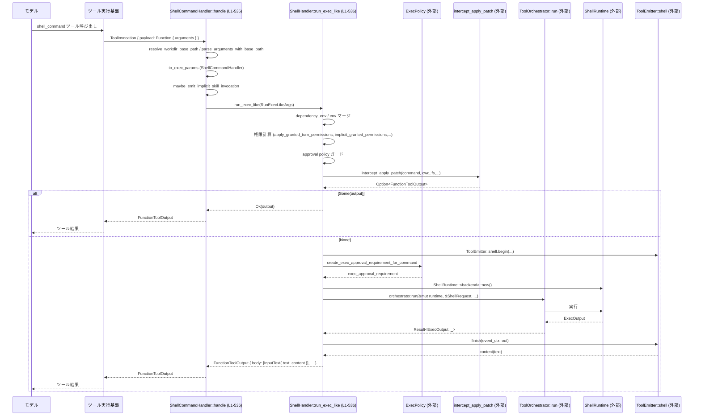

# core/src/tools/handlers/shell.rs

## 0. ざっくり一言

このモジュールは、Codex の「shell」系ツール呼び出しを処理するハンドラーです。  
JSON 引数からコマンド実行パラメータを構築し、権限・サンドボックス・承認ポリシーを考慮しつつ `ShellRuntime` を通してシェルコマンドを実行します。

---

## 1. このモジュールの役割

### 1.1 概要

- このモジュールは **エージェントからの shell / shell_command ツール呼び出し** を受け取り、  
  **OS 上でのシェルコマンド実行（あるいは類似処理）に橋渡しする** 役割を持ちます。
- ツール引数のパース、作業ディレクトリ・環境変数の設定、サンドボックス権限・承認ポリシーのチェックを行い、  
  `ShellRuntime` にコマンドを委譲します。
- `ShellHandler` は汎用的な shell ツール・ローカルシェル呼び出しを、  
  `ShellCommandHandler` はユーザーシェルと連携した「shell_command」ツールを扱います。

### 1.2 アーキテクチャ内での位置づけ

このモジュールにおける主な依存関係を図示します（ファイル範囲はすべて `L1-536`）。  

```mermaid
flowchart LR
    subgraph Tools
        TH1["ShellHandler (L1-536)"]
        TH2["ShellCommandHandler (L1-536)"]
    end

    TI["ToolInvocation (context)"]
    TP["ToolPayload::Function / LocalShell"]
    STP["ShellToolCallParams / ShellCommandToolCallParams"]
    EP["ExecParams"]
    SR["ShellRequest"]
    SRt["ShellRuntime"]
    TO["ToolOrchestrator"]
    EPOL["ExecPolicy (create_exec_approval_requirement_for_command)"]
    PERM["apply_granted_turn_permissions / implicit_granted_permissions / normalize_and_validate_additional_permissions"]
    AP["intercept_apply_patch"]
    EM["ToolEmitter::shell"]
    TEC["ToolEventCtx"]

    TI --> TP
    TP --> TH1
    TP --> TH2

    TH1 -->|"parse_arguments_with_base_path"| STP
    TH2 -->|"parse_arguments_with_base_path"| STP

    STP -->|"to_exec_params"| EP
    TH2 -->|"ShellCommandHandler::to_exec_params"| EP

    TH1 -->|"run_exec_like"| EP
    TH2 -->|"run_exec_like (ShellHandler)"| EP

    EP --> PERM
    PERM --> EPOL
    EP --> AP
    EP --> SR
    SR --> SRt
    SRt --> TO
    TO --> EM
    EM --> TEC
```



- `ToolInvocation` / `ToolPayload` からこのモジュールのハンドラーが呼ばれます。
- ハンドラーは引数をパースして `ExecParams` を生成し、権限調整・承認・パッチ適用のフックを経て `ShellRequest` に変換します。
- `ToolOrchestrator` と `ShellRuntime` を通じて実行し、結果を `FunctionToolOutput` 形式で返します。

### 1.3 設計上のポイント

- **二段構成のハンドラー**
  - `ShellHandler` … `ToolPayload::Function` と `ToolPayload::LocalShell` の両方を扱う汎用シェルツールハンドラーです。
  - `ShellCommandHandler` … `ShellCommandToolCallParams` に基づきユーザーシェル / ログインシェルを扱う handler で、内部的には `ShellHandler::run_exec_like` を利用します。  
    （`ShellCommandBackend` により Classic / ZshFork backend を切り替え）

- **共通実行パスの集約**  
  - 実際のコマンド実行ロジックは `ShellHandler::run_exec_like` に集約されています  
    （`core/src/tools/handlers/shell.rs:L1-536`）。

- **権限と承認ポリシーの統合**  
  - `apply_granted_turn_permissions`・`implicit_granted_permissions`・  
    `normalize_and_validate_additional_permissions` でサンドボックス権限を整理し、  
    `ExecPolicy::create_exec_approval_requirement_for_command` で「承認が必要かどうか」の条件を算出しています。
- **安全性の考慮**
  - `is_safe_command` により「明らかに安全なコマンド」を判定し、`is_mutating` に反映しています。
  - 明示的な権限昇格要求が、現在の approval policy と矛盾していないかをチェックし、矛盾する場合はエラーにします。
  - `intercept_apply_patch` で `apply_patch` 風のコマンドを直接シェルで実行せず、専用処理に差し替えています。
- **Rust の所有権・並行性**
  - `session` と `turn` は `Arc` で共有され、非同期関数 (`async fn`) の中を安全に移動できるようにされています。
  - このモジュール自身はスレッド生成は行わず、すべて `async`/`await` ベースで非同期処理を委譲します。

---

## 2. 主要な機能一覧

- シェルツールのハンドリング: `ShellHandler` による `ToolPayload::Function` / `LocalShell` の処理
- shell_command ツールのハンドリング: `ShellCommandHandler` によるユーザーシェル・ログインシェル付きコマンドの実行
- ツール引数のパースと作業ディレクトリ解決: `parse_arguments_with_base_path` と `resolve_workdir_base_path` の利用
- 実行パラメータ構築: `ShellToolCallParams` / `ShellCommandToolCallParams` から `ExecParams` を生成
- 追加権限・サンドボックス権限の正規化: `apply_granted_turn_permissions` + `implicit_granted_permissions` + `normalize_and_validate_additional_permissions`
- Exec 承認要件の生成: `ExecPolicy::create_exec_approval_requirement_for_command` 呼び出し
- `apply_patch` インターセプト: 特定コマンドを `intercept_apply_patch` で別経路に差し替え
- ShellRuntime 実行のオーケストレーション: `ToolOrchestrator` + `ShellRuntime` + `ShellRequest`
- ツールイベント通知: `ToolEmitter::shell` / `ToolEventCtx` による begin/finish イベント送信
- 変異的ツール判定: `is_mutating` による「ファイルを変更する可能性」の判定

---

## 3. 公開 API と詳細解説

### 3.1 型一覧（構造体・列挙体など）

> 行番号はチャンクに明示されていないため、ファイル全体範囲 `L1-536` を根拠として示します。

| 名前 | 種別 | 公開 | 役割 / 用途 | 根拠 |
|------|------|------|-------------|------|
| `ShellHandler` | 構造体（フィールドなし） | `pub` | 汎用シェルツール（`shell` / `LocalShell`）の `ToolHandler` 実装です。`run_exec_like` を通じてコマンド実行を行います。 | `core/src/tools/handlers/shell.rs:L1-536` |
| `ShellCommandBackend` | 列挙体 | 非公開 | `ShellCommandHandler` が利用する backend の種類（`Classic`, `ZshFork`）を表します。 | 同上 |
| `ShellCommandHandler` | 構造体 | `pub` | shell_command ツール専用の `ToolHandler`。ユーザーシェル・ログインシェル・backend 切り替えを扱います。 | 同上 |
| `RunExecLikeArgs` | 構造体 | 非公開 | `run_exec_like` へ渡す引数をまとめるための内部用構造体です。`ExecParams` や権限情報、`session`/`turn` などを保持します。 | 同上 |

関連して使用する外部型（定義はこのファイルにはありません）:

- `ToolInvocation`, `ToolPayload`, `ToolOutput`, `FunctionToolOutput` など（`crate::tools::context`）
- `ShellToolCallParams`, `ShellCommandToolCallParams`, `PermissionProfile`（`codex_protocol::models`）
- `ExecParams`, `ExecCapturePolicy`（`crate::exec`）
- `ShellRuntime`, `ShellRuntimeBackend`, `ShellRequest`（`crate::tools::runtimes::shell`）

### 3.2 重要な関数詳細（最大 7 件）

#### 1. `ShellHandler::handle(&self, invocation: ToolInvocation) -> Result<FunctionToolOutput, FunctionCallError>`

**概要**

- 汎用シェルツールのエントリポイントです。  
  `ToolInvocation` から payload を取り出し、`ShellToolCallParams` あるいは `LocalShell` のパラメータを `ExecParams` に変換し、`run_exec_like` を呼びます。

**引数**

| 引数名 | 型 | 説明 |
|--------|----|------|
| `invocation` | `ToolInvocation` | セッション (`Arc<Session>`)、ターン (`Arc<TurnContext>`)、トラッカー、ツール名、payload などを含むツール呼び出しコンテキストです。 |

**戻り値**

- `Ok(FunctionToolOutput)`  
  - ツール出力本文（入力テキスト的なログ）と、`post_tool_use_response` 用の JSON を含みます。
- `Err(FunctionCallError)`  
  - 引数パースエラー、環境未設定、権限ポリシー違反などで失敗した場合に返されます。

**内部処理の流れ**

1. `ToolInvocation` を分解して `session`, `turn`, `tracker`, `call_id`, `tool_name`, `payload` を取り出します。
2. `payload` の variant に応じて分岐します。
   - `ToolPayload::Function { arguments }`:
     - `resolve_workdir_base_path` でベースパスを解決。
     - `parse_arguments_with_base_path::<ShellToolCallParams>` で JSON 文字列を構造体にパース。
     - `Self::to_exec_params` で `ExecParams` を構築。
     - `RunExecLikeArgs` を組み立て、`run_exec_like` を `freeform=false`, `shell_runtime_backend=Generic` で呼び出し。
   - `ToolPayload::LocalShell { params }`:
     - 直接 `Self::to_exec_params` を呼び出し、同様に `run_exec_like` を呼び出し。
   - その他の variant:
     - `FunctionCallError::RespondToModel` で `"unsupported payload for shell handler: ..."` を返す。
3. `run_exec_like` の結果をそのまま返却します。

**Examples（使用例）**

`ToolHandler` を直接使う場面は通常はフレームワーク側ですが、概念的な使用例を示します。

```rust
use std::sync::Arc;
use crate::tools::handlers::shell::ShellHandler;
use crate::tools::context::ToolInvocation;

// （前提）session, turn, tracker, call_id, tool_name, payload を用意しているとする
async fn invoke_shell_tool(invocation: ToolInvocation) -> Result<(), crate::function_tool::FunctionCallError> {
    let handler = ShellHandler; // フィールドのない構造体なのでそのまま値を作れる
    let output = handler.handle(invocation).await?; // 非同期実行
    for item in output.body {
        match item {
            codex_protocol::models::FunctionCallOutputContentItem::InputText { text } => {
                println!("shell output: {}", text);
            }
            _ => {}
        }
    }
    Ok(())
}
```

**Errors / Panics**

- `resolve_workdir_base_path` が失敗した場合（たとえば不正なパス指定）:
  - `FunctionCallError` としてエラーを返します。
- `parse_arguments_with_base_path::<ShellToolCallParams>` が JSON パースに失敗した場合:
  - `FunctionCallError` 経由でエラーになります。
- `Self::to_exec_params` 内で失敗する可能性は現状ありません（`Result` ではなく `ExecParams` を直接返しているため）。
- `ToolPayload` が想定外の variant の場合:
  - `FunctionCallError::RespondToModel("unsupported payload ...")` が返されます。
- パニックを起こすコードはこの関数内には見当たりません（`unwrap` / `expect` は使用されていません）。

**Edge cases（エッジケース）**

- `ToolPayload::Function` なのに `arguments` が空や無効な JSON の場合:
  - 引数パースに失敗し、エラー結果となります。
- `turn.cwd` が存在しないディレクトリの場合:
  - `resolve_workdir_base_path` / `turn.resolve_path` の中で扱われますが、このモジュール単体からは挙動は不明です。
- `LocalShell` で `params.command` が空リストの場合:
  - `ExecParams.command` が空になる可能性がありますが、この関数自体ではエラーにはしていません。後段の `ShellRuntime` の挙動に依存します。

**使用上の注意点**

- `handle` は `async` 関数なので、必ず非同期ランタイム（Tokio など）の中から `.await` で呼び出す必要があります。
- `ToolInvocation` 内の `session.environment` が `None` の場合、後続の `run_exec_like` で「shell is unavailable in this session」というエラーになります。

---

#### 2. `ShellCommandHandler::handle(&self, invocation: ToolInvocation) -> Result<FunctionToolOutput, FunctionCallError>`

**概要**

- shell_command ツールのエントリポイントです。  
  `ShellCommandToolCallParams` をパースし、ユーザーシェル・ログインシェルの設定を踏まえて `ExecParams` を構築し、`ShellHandler::run_exec_like` に委譲します。

**引数 / 戻り値**

- 型・意味は `ShellHandler::handle` と同様ですが、扱う payload が `ToolPayload::Function` のみである点が異なります。

**内部処理の流れ**

1. `ToolInvocation` を分解し、`payload` が `ToolPayload::Function { arguments }` であることを `let ... else` で確認します。
   - そうでない場合は `"unsupported payload for shell_command handler: ..."` でエラー。
2. `resolve_workdir_base_path` でベースパスを解決し、`parse_arguments_with_base_path::<ShellCommandToolCallParams>` で引数をパースします。
3. `turn.resolve_path(params.workdir.clone())` で実際の作業ディレクトリのパスを得ます。
4. `maybe_emit_implicit_skill_invocation` を呼び出し、コマンド文字列と workdir に基づく暗黙的なイベント（「スキル呼び出し」）を送信します。この戻り値は使っていないため、副作用目的と思われます。
5. `ShellCommandHandler::to_exec_params` を呼び出し、`ExecParams` を構築します。
   - ここで `login` の扱い・ユーザーシェルの選択・`ShellCommandBackend` に応じたコマンド配列生成を行います。
6. `ShellHandler::run_exec_like` を `freeform=true`, `shell_runtime_backend=self.shell_runtime_backend()` で呼び出します。
7. 結果をそのまま返します。

**Errors / Panics**

- `payload` が `ToolPayload::Function` でない場合は `FunctionCallError::RespondToModel`。
- `resolve_workdir_base_path` / `parse_arguments_with_base_path` が失敗したときは `FunctionCallError`。
- `ShellCommandHandler::to_exec_params` が `resolve_use_login_shell` の結果に応じて `FunctionCallError` を返すことがあります（`login shell is disabled...`）。

**Edge cases**

- `login` が `Some(true)` かつ `turn.tools_config.allow_login_shell == false` の場合:
  - エラーが返ります（セキュリティ保護：ログインシェル禁止設定を尊重）。
- `params.command` が空文字列の場合:
  - `base_command` の中でどのように扱われるかは `Shell::derive_exec_args` 次第で、このファイルからは不明です。

**使用上の注意点**

- `ShellCommandHandler` は `ToolPayload::LocalShell` を扱いません。shell_command ツール専用と考える必要があります。
- ログインシェル利用可否は `turn.tools_config.allow_login_shell` によって制御され、禁止されている状況で `login=true` を渡すとエラーになります。

---

#### 3. `ShellHandler::run_exec_like(args: RunExecLikeArgs) -> Result<FunctionToolOutput, FunctionCallError>`

**概要**

- 実際のシェル実行の共通ロジックを実装する非公開の中核関数です。  
  環境変数・依存環境・サンドボックス権限・承認要件・`apply_patch` インターセプトなど、実行前後のほぼすべての処理がここに集中しています。

**引数**

| 引数名 | 型 | 説明 |
|--------|----|------|
| `tool_name` | `String` | 実行中のツール名（イベント・ログ用）。 |
| `exec_params` | `ExecParams` | 実行コマンド、cwd、タイムアウト、環境変数、ネットワーク設定、サンドボックス権限など。 |
| `additional_permissions` | `Option<PermissionProfile>` | 追加で要求された権限プロフィール。 |
| `prefix_rule` | `Option<Vec<String>>` | コマンドの prefix ルール（ExecPolicy に渡される）。 |
| `session` | `Arc<Session>` | セッションコンテキスト。 |
| `turn` | `Arc<TurnContext>` | 現在のターン情報（approval policy, sandbox policy など）。 |
| `tracker` | `SharedTurnDiffTracker` | ファイル差分トラッカー。ここでは `intercept_apply_patch` にのみ渡されます。 |
| `call_id` | `String` | このツール呼び出しの一意な ID。 |
| `freeform` | `bool` | `ToolEmitter::shell` に渡されるフラグ。出力の扱いに影響する可能性があります。 |
| `shell_runtime_backend` | `ShellRuntimeBackend` | `ShellRuntime` 生成時に使用する backend 種類。 |

**戻り値**

- `FunctionToolOutput` … `shell` ツールの出力としてモデルに返す内容（テキストと meta）。
- エラー時は `FunctionCallError` を返します。

**内部処理の流れ（要点）**

1. **環境取得**  
   - `turn.environment` をチェックし、`None` の場合は `"shell is unavailable in this session"` で即座にエラー。
   - `environment.get_filesystem()` でファイルシステムハンドルを取得。

2. **依存環境の統合**  
   - `session.dependency_env().await` で追加の環境変数セットを取得し、`exec_params.env` にマージ。
   - 依存環境と `exec_params.env` から `explicit_env_overrides` を作成（依存環境のキーのみを抽出）。

3. **権限・承認ポリシーの計算**
   - `apply_granted_turn_permissions` で現在のターンで既に与えられている権限を反映。
   - `implicit_granted_permissions` で暗黙的に許可される権限があればそれを使い、なければ `normalize_and_validate_additional_permissions`  
     （`approval_policy`, `sandbox_permissions`, `additional_permissions`, CWD 等を考慮）を呼ぶ。
   - `Feature::ExecPermissionApprovals` / `Feature::RequestPermissionsTool` に基づき、追加権限をリクエスト可能かどうか判定。
   - サンドボックス override 要求があり、preapproved でもなく、かつ `AskForApproval::OnRequest` 以外のポリシーであればエラーを返す。

4. **`apply_patch` インターセプト**
   - `intercept_apply_patch` に `exec_params.command`, `exec_params.cwd`, `fs` などを渡して実行。
   - 戻り値が `Some(output)` の場合は、その `FunctionToolOutput` を返して終了（シェル実行自体は行われません）。

5. **イベント開始と Exec 承認要件の計算**
   - `ToolEmitter::shell(...)` で emitter を作成し、`emitter.begin(event_ctx).await` を呼ぶ。
   - `ExecPolicy::create_exec_approval_requirement_for_command` に `ExecApprovalRequest` を渡し、  
     コマンド実行に必要な approval requirement を生成。

6. **ShellRequest 構築と実行**
   - `ShellRequest` を構築（command, cwd, timeout, env, network, sandbox_permissions, additional_permissions, justification, exec_approval_requirement）。
   - `ShellRuntimeBackend` に応じて `ShellRuntime::new()` または `ShellRuntime::for_shell_command(backend)` を生成。
   - `ToolCtx` を構築し、`ToolOrchestrator::new().run(&mut runtime, &req, &tool_ctx, &turn, turn.approval_policy.value())` を `await`。
   - 結果を `.map(|result| result.output)` で `Result<ExecOutput, _>` 相当に変換。

7. **イベント終了と出力成形**
   - `ToolEventCtx::new` で再度 context を作り、`post_tool_use_response` のために `format_exec_output_str` で文字列化し `JsonValue::String` に包む。
   - `emitter.finish(event_ctx, out).await?` で最終イベントを送信し、返ってきた `content` を `FunctionCallOutputContentItem::InputText` として返す。

**Errors / Panics**

- `turn.environment.is_none()` の場合: `FunctionCallError::RespondToModel("shell is unavailable in this session")`
- 追加権限の正規化 (`normalize_and_validate_additional_permissions`) がエラーを返した場合:
  - そのメッセージを `FunctionCallError::RespondToModel` に変換して返します。
- Approval policy が追加権限の要求と矛盾している場合:
  - `"approval policy is ...; reject command — you should not ask for escalated permissions..."` という文言でエラー。
- `intercept_apply_patch` 自体も `Result<Option<FunctionToolOutput>, FunctionCallError>` を返すため、そのエラーもここから透過的に返ります。
- `ToolOrchestrator::run` や `emitter.finish` からのエラーも `FunctionCallError` として返されます（変換ロジックは外部関数ですが、`?` が使われています）。

**Edge cases**

- `dependency_env` が空のとき:
  - `exec_params.env` はもともとの内容のまま使われます。
- `additional_permissions` が `None` かつ、すでに preapproved な sandbox override がある場合:
  - `implicit_granted_permissions` によって追加正規化される可能性があります。
- `intercept_apply_patch` が `Some` を返した場合:
  - 実際のシェルコマンドは実行されず、パッチ適用ツールとして振る舞います。

**使用上の注意点**

- 内部関数であり、直接呼び出すのではなく `ToolHandler::handle` 経由で利用する前提の設計です。
- `ExecParams` は呼び出し側で完全に構築されるため、`run_exec_like` を呼ぶ前に `command` / `cwd` / `env` などが妥当かを確認する責任は呼び出し側にあります。
- 高頻度で呼び出されると、`ToolOrchestrator` / `ShellRuntime` / ExecPolicy などの I/O を伴うため、パフォーマンスに影響する可能性があります。

---

#### 4. `ShellCommandHandler::to_exec_params(...) -> Result<ExecParams, FunctionCallError>`

```rust
fn to_exec_params(
    params: &ShellCommandToolCallParams,
    session: &crate::codex::Session,
    turn_context: &TurnContext,
    thread_id: ThreadId,
    allow_login_shell: bool,
) -> Result<ExecParams, FunctionCallError>
```

**概要**

- shell_command 専用に、ユーザーシェル (`Session::user_shell()`) と `login` フラグを考慮した `ExecParams` を生成します。

**引数（補足）**

- `params.login: Option<bool>` … ログインシェルを使用するかどうか。
- `session.user_shell()` … `Shell` オブジェクトを返し、その `derive_exec_args` によって実際のコマンド配列を生成します。
- `allow_login_shell: bool` … このターンでログインシェルが許可されているか。

**内部処理**

1. `session.user_shell()` で `Arc<Shell>` を取得。
2. `resolve_use_login_shell(params.login, allow_login_shell)` で最終的な `use_login_shell: bool` を決定。
   - 禁止されているのに `login = Some(true)` の場合はエラー。
   - `login` が `None` の場合は `allow_login_shell` に従う。
3. `base_command(shell.as_ref(), &params.command, use_login_shell)` で最終的な `Vec<String>` のコマンド引数配列を生成。
4. `ExecParams` を組み立てる（`ShellHandler::to_exec_params` と同様）:
   - `cwd: turn_context.resolve_path(params.workdir.clone())`
   - `expiration: params.timeout_ms.into()`
   - `env: create_env(&turn_context.shell_environment_policy, Some(thread_id))`
   - `sandbox_permissions: params.sandbox_permissions.unwrap_or_default()`
   - `justification: params.justification.clone()`

**Errors / Edge cases**

- ログインシェル禁止設定との矛盾がある場合に `FunctionCallError` を返します（`resolve_use_login_shell` 参照）。
- それ以外の部分はこの関数内でエラーにはなりません。

---

#### 5. `ShellCommandHandler::is_mutating(&self, invocation: &ToolInvocation) -> bool`

**概要**

- shell_command ツールが「ファイルや環境を変更しうるコマンドかどうか」を判定する非同期関数です。  
  実際の実行前に「mutating かどうか」のフラグとして使われます。

**内部処理**

1. payload が `ToolPayload::Function { arguments }` でない場合は `true`（安全側に倒す）。
2. `arguments` を `ShellCommandToolCallParams` として `serde_json::from_str` でパース。
   - パースに失敗した場合は `true`。
3. パースに成功したら：
   - `resolve_use_login_shell` を呼び出し、`use_login_shell` を計算。エラーが出た場合も `true` を返す。
   - `session.user_shell()` を使って `base_command` を呼び出し、実際に実行される `Vec<String>` コマンドを構築。
   - それを `is_known_safe_command(&command)` に渡し、安全かどうかを判定し、`!is_known_safe_command` を返す。

**安全性の観点**

- **保守的な設計**: パース失敗・login 解析失敗など、不確実な状況では常に `true`（mutating とみなす）ようになっています。
- **ログインシェルの取り扱い**: `resolve_use_login_shell` を通すことで、ログインシェルの使用が許可されているかどうかを安全に判定します。

---

#### 6. `ShellHandler::is_mutating(&self, invocation: &ToolInvocation) -> bool`

**概要**

- 汎用 shell ツール用の「変異的かどうか」判定関数です。

**内部処理（簡略）**

- `ToolPayload::Function { arguments }`:
  - `serde_json::from_str::<ShellToolCallParams>(arguments)` でパース。
  - 成功時: `!is_known_safe_command(&params.command)`
  - 失敗時: `true`
- `ToolPayload::LocalShell { params }`:
  - `!is_known_safe_command(&params.command)`
- それ以外の variant:
  - `true`

**違い**

- `ShellCommandHandler::is_mutating` は「ユーザーシェル」経由で `base_command` を構築しているのに対し、こちらは JSON パラメータの `command` フィールドをそのまま `is_known_safe_command` に渡します。

---

#### 7. `ShellCommandHandler::resolve_use_login_shell(login: Option<bool>, allow_login_shell: bool) -> Result<bool, FunctionCallError>`

**概要**

- `login` フラグ（ユーザー指定）と `allow_login_shell`（コンフィグ）から、最終的にログインシェルを使うかどうかを決めます。

**ロジック**

1. `!allow_login_shell && login == Some(true)` の場合:
   - `FunctionCallError::RespondToModel("login shell is disabled by config; ...")` でエラー。
2. それ以外の場合:
   - `Ok(login.unwrap_or(allow_login_shell))`
     - ユーザー指定がなければ、設定値に従う。

**安全性の観点**

- ユーザーが `login = true` を明示的に指定しても、設定で禁止されていれば必ずエラーにすることで、  
  ログインシェル利用に伴うセキュリティリスクを抑制する設計になっています。

---

### 3.3 その他の関数・メソッド一覧

| 関数名 | 役割（1 行） | 根拠 |
|--------|--------------|------|
| `shell_payload_command` | `ToolPayload` から shell 用のコマンド文字列を取り出し、`PreToolUsePayload` / `PostToolUsePayload` 用にまとめる。 | `core/src/tools/handlers/shell.rs:L1-536` |
| `shell_command_payload_command` | shell_command 専用のコマンド文字列を `ToolPayload` から抽出する。 | 同上 |
| `ShellHandler::to_exec_params` | `ShellToolCallParams` から `ExecParams` を構築する（非 login, non-shell-command 版）。 | 同上 |
| `ShellCommandHandler::shell_runtime_backend` | `ShellCommandBackend` から `ShellRuntimeBackend` へ変換する。 | 同上 |
| `ShellCommandHandler::base_command` | `Shell` とコマンド文字列・login フラグから実際の exec 引数 `Vec<String>` を生成する。 | 同上 |
| `impl From<ShellCommandBackendConfig> for ShellCommandHandler` | 設定値から handler の backend を選択して初期化する。 | 同上 |
| `ToolHandler::kind`（両 handler） | このツールが `ToolKind::Function` であることを返す。 | 同上 |
| `ToolHandler::matches_kind`（両 handler） | 対応する `ToolPayload` variant を判定する。 | 同上 |
| `pre_tool_use_payload`（両 handler） | ツール実行前にログ用のコマンド文字列を返す。 | 同上 |
| `post_tool_use_payload`（両 handler） | 実行結果とコマンド文字列をまとめて `PostToolUsePayload` を生成する。 | 同上 |

---

## 4. データフロー

### 4.1 代表的なシナリオ: shell_command ツール実行

`shell_command` 呼び出しから OS 実行までのデータフローを示します。  
関数名の後ろにこのファイルの範囲 `L1-536` を付記しています。



**要点**

- 引数パースと `ExecParams` 構築までは `ShellCommandHandler` が担当し、  
  それ以降の実行フローはすべて `ShellHandler::run_exec_like` に集約されています。
- `intercept_apply_patch` によって、特定のコマンドは OS シェルを経由せずに別処理に差し替え可能です。
- 実行前後に `ToolEmitter` による begin/finish イベントが送出されます。

---

## 5. 使い方（How to Use）

### 5.1 基本的な使用方法

通常はフレームワーク側が `ToolHandler` を登録して利用しますが、概念的なコードフローを示します。

```rust
use std::sync::Arc;
use crate::tools::handlers::shell::{ShellHandler, ShellCommandHandler};
use crate::tools::registry::ToolHandler;
use crate::tools::context::{ToolInvocation, ToolPayload};

// 例: shell ツール用ハンドラーを使う
async fn run_shell(invocation: ToolInvocation) -> Result<(), crate::function_tool::FunctionCallError> {
    let handler = ShellHandler; // ゼロサイズ構造体
    let output = handler.handle(invocation).await?;
    // output.body 内にシェル出力テキストが入る
    Ok(())
}

// 例: shell_command ツール用ハンドラーを設定から初期化する
async fn run_shell_command(
    config: codex_tools::ShellCommandBackendConfig,
    invocation: ToolInvocation,
) -> Result<(), crate::function_tool::FunctionCallError> {
    let handler = ShellCommandHandler::from(config); // Classic / ZshFork を選べる
    let output = handler.handle(invocation).await?;
    Ok(())
}
```

### 5.2 よくある使用パターン

- **シンプルな shell ツール**  
  - `ToolPayload::Function { arguments }` を `ShellToolCallParams` として解釈し、`ShellHandler` を使う。
  - `is_mutating` により安全なコマンド（`ls`, `cat` など）かどうかを事前に分類可能。

- **ユーザーシェルに依存したコマンド実行**  
  - `ShellCommandHandler` を使い、`ShellCommandToolCallParams` で `login` や `prefix_rule` を指定。
  - `ShellCommandBackendConfig` に応じて Classic / ZshFork backend を切り替える。

- **パッチ適用 (`apply_patch`)**  
  - `exec_params.command` に `apply_patch` が含まれる形になると、`intercept_apply_patch` が実行され、  
    シェル実行ではなく専用パッチ処理に差し替わる設計になっています。

### 5.3 よくある間違いと正しい例

```rust
// 間違い例: shell_command handler に LocalShell ペイロードを渡してしまう
async fn wrong(invocation: ToolInvocation) {
    let handler = ShellCommandHandler::from(codex_tools::ShellCommandBackendConfig::Classic);
    // invocation.payload が ToolPayload::LocalShell の場合、
    // "unsupported payload for shell_command handler" エラーとなる
    let _ = handler.handle(invocation).await;
}

// 正しい例: LocalShell は ShellHandler で処理する
async fn correct(invocation: ToolInvocation) {
    let handler = ShellHandler;
    let _ = handler.handle(invocation).await;
}
```

```rust
// 間違い例: login shell が禁止されているのに login=true を指定
// -> resolve_use_login_shell がエラーを返す
let params = ShellCommandToolCallParams {
    command: "echo hello".to_string(),
    login: Some(true),
    // その他フィールド...
};

// 正しい例: 設定で許可されていない場合は login を指定しないか false にする
let params = ShellCommandToolCallParams {
    command: "echo hello".to_string(),
    login: None, // または Some(false)
    // その他フィールド...
};
```

### 5.4 使用上の注意点（まとめ）

- **非同期コンテキスト必須**  
  - `is_mutating` 以外の主要メソッドは `async fn` であり、Tokio 等のランタイム上から `.await` する必要があります。
- **環境必須**  
  - `turn.environment` が `None` の場合、`run_exec_like` は必ずエラーを返します（このセッションでは shell が利用できない前提）。
- **権限昇格の制約**  
  - 追加サンドボックス権限を要求する場合、現在の `approval_policy` と矛盾する設定はエラーとなります。
  - 特に `AskForApproval::OnRequest` 以外で `sandbox_override` を要求すると `"reject command"` エラーとなるため、  
    ツール設計時に approval policy と権限要求方針を合わせる必要があります。
- **安全性**  
  - 「安全なコマンド」かどうかの判定は `is_known_safe_command` に委ねられており、この関数で `false` となるコマンドは mutating と見なされます。
  - パース失敗や未知の payload では常に mutating として扱う保守的な設計になっています。

---

## 6. 変更の仕方（How to Modify）

### 6.1 新しい機能を追加する場合

- **別種の shell backend を追加したい場合**
  1. `ShellCommandBackend` に新しい variant を追加します。
  2. `ShellCommandHandler::shell_runtime_backend` の `match` に対応ケースを追加します。
  3. `ShellRuntime::for_shell_command` 側で新 backend を扱えるようにします（このファイル外）。

- **特別なコマンドのインターセプトを増やしたい場合**
  1. `intercept_apply_patch` と同様の関数を別モジュールに実装します。
  2. `run_exec_like` 内の `intercept_apply_patch` 呼び出し付近に、新しいインターセプト処理を追加し、  
     `Some(output)` の場合には早期リターンするようにします。

- **実行前後のイベントを拡張したい場合**
  1. `ToolEmitter::shell` の生成部分と `begin`/`finish` 呼び出しを変更または拡張します。
  2. 追加したいフィールドがある場合は `ToolEventCtx` の定義側を確認します。

### 6.2 既存の機能を変更する場合

- **ExecParams の構造を変更する場合**
  - `ShellHandler::to_exec_params` と `ShellCommandHandler::to_exec_params` の両方、  
    さらに `run_exec_like` 内の `ShellRequest` 構築部分を確認する必要があります。
- **権限 / 承認ロジックを変更する場合**
  - `run_exec_like` 内の以下の呼び出し群の契約を確認します。
    - `apply_granted_turn_permissions`
    - `implicit_granted_permissions`
    - `normalize_and_validate_additional_permissions`
    - `ExecPolicy::create_exec_approval_requirement_for_command`
  - 特に `approval_policy.value()` や `permissions_preapproved` フラグとの整合性が崩れないように注意が必要です。
- **安全コマンド判定ロジックを変更する場合**
  - `codex_shell_command::is_safe_command::is_known_safe_command` 側の実装を変更するか、  
    このファイルでの呼び出し方 (`ShellHandler::is_mutating`, `ShellCommandHandler::is_mutating`) を調整します。

---

## 7. 関連ファイル

| パス | 役割 / 関係 |
|------|------------|
| `core/src/tools/context.rs` など | `ToolInvocation`, `ToolPayload`, `ToolOutput`, `FunctionToolOutput` を定義し、このハンドラーの入出力インターフェースを提供します。 |
| `core/src/exec/mod.rs` | `ExecParams`, `ExecCapturePolicy` などコマンド実行に関する共通パラメータ型を提供します。 |
| `core/src/exec_env.rs` | `create_env` を定義し、シェル実行用の環境変数セットを構築します。 |
| `core/src/tools/handlers/mod.rs` / `apply_patch.rs` | `apply_granted_turn_permissions`, `implicit_granted_permissions`, `normalize_and_validate_additional_permissions`, `intercept_apply_patch` を提供し、権限とパッチ適用ロジックを担います。 |
| `core/src/tools/runtimes/shell.rs` | `ShellRuntime`, `ShellRuntimeBackend`, `ShellRequest` を定義し、実際のシェル実行ランタイムを提供します。 |
| `core/src/tools/orchestrator.rs` | `ToolOrchestrator` を定義し、ツールランタイムの実行とポリシーとのやり取りをまとめます。 |
| `core/src/tools/events.rs` | `ToolEmitter`, `ToolEventCtx` を定義し、ツール実行前後のイベント通知を行います。 |
| `core/src/tools/sandboxing.rs` | `ToolCtx` を定義し、ツール実行に必要なコンテキスト（session, turn, call_id など）をまとめます。 |
| `core/src/codex/turn_context.rs` | `TurnContext` を定義し、`resolve_path`, `approval_policy`, `sandbox_policy` など、実行時の文脈情報を提供します。 |
| `core/src/tools/handlers/shell_tests.rs` | `#[cfg(test)]` で参照されるテストコード。一連のハンドラー挙動の検証が行われていると考えられますが、このチャンクには内容は現れません。 |

---

### Bugs / Security の補足（このファイルから読み取れる範囲）

- **Bugs（潜在的なもの）**
  - 行番号からは特定できませんが、`normalize_and_validate_additional_permissions` 等の外部関数が返すエラー内容に依存しているため、  
    これらが期待通りのメッセージを返さない場合、ユーザーへのエラーメッセージが不明瞭になる可能性があります。
  - `ExecParams.command` が空配列のケースはこのモジュール内では特別扱いされていません。`ShellRuntime` 側の制約に依存します。

- **Security**
  - ログインシェルの利用は明示的にガードされており、設定で禁止されているときに `login=true` を指定するとエラーになります。
  - 追加サンドボックス権限の要求は approval policy によって制御され、ポリシーと矛盾する要求はエラーとなります。
  - 「安全なコマンド」判定を `is_known_safe_command` に一元化し、不明な場合やパース失敗時は mutating と見なす保守的設計になっています。
  - `intercept_apply_patch` によりパッチ適用系のコマンドは専用処理に迂回されるため、任意シェル実行に比べてより厳密な制御が可能です。
