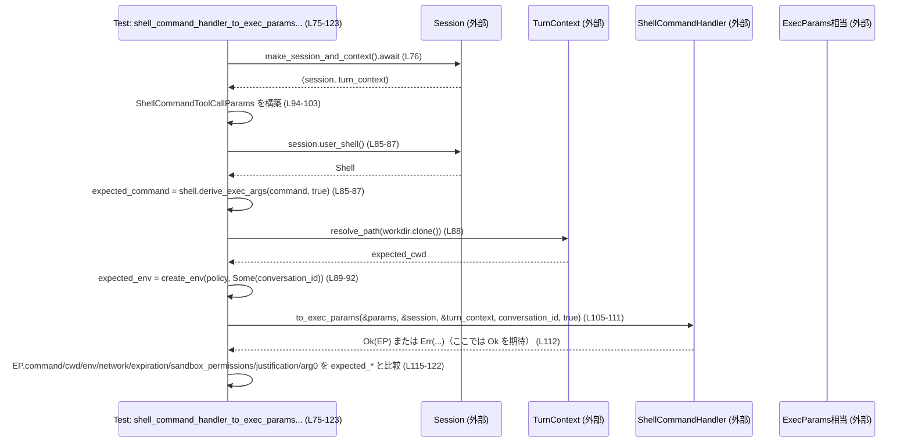

# core/src/tools/handlers/shell_tests.rs コード解説

## 0. ざっくり一言

このファイルは、シェル実行系ツールハンドラ（`ShellHandler` / `ShellCommandHandler`）の**安全性・挙動の契約を検証するテスト集**です。  
コマンド安全判定、ログインシェルの許可／禁止、`ToolPayload` からの前後処理用ペイロード生成が意図どおり動くことを確認しています。

---

## 1. このモジュールの役割

### 1.1 概要

- このモジュールは、**シェルコマンド実行ツールのハンドラ**が
  - コマンド安全判定ロジック（`is_known_safe_command`）と整合しているか
  - セッションやターンコンテキストの情報を使って正しく `ExecParams` 相当の構造体を構成しているか
  - ログインシェルの許可／禁止設定を尊重しているか
  - ツール呼び出し前後のペイロードを正しく組み立てているか  
  を検証するために存在します。
- すべて**テストコード**であり、本番コードから直接呼び出される公開 API は定義していません。

### 1.2 アーキテクチャ内での位置づけ

このテストモジュールは、以下のコンポーネント群に依存して挙動を検証しています。

- `Shell` / `ShellType` / `ShellSnapshot`（シェル情報・スナップショット）
- `ShellCommandHandler` / `ShellHandler`（ツールハンドラ）
- `ShellCommandToolCallParams` / `ToolPayload` / `ToolInvocation` / `FunctionToolOutput`
- セッション・ターンコンテキスト生成 (`make_session_and_context`)
- 実行環境構築 (`create_env`)
- コマンド安全判定 (`is_known_safe_command`)
- PowerShell 実行ファイル検出 (`try_find_powershell_executable_blocking` / `try_find_pwsh_executable_blocking`)

これらの関係を簡略図にすると次のようになります。

```mermaid
graph TD
    T1["tests::shell_tests (L31-283)"]
    F1["test_safe_command_matching (L31-63)"]
    F2["test_to_exec_params (L75-123)"]
    F3["test_login_flag (L126-156)"]
    F4["test_default_non_login (L159-187)"]
    F5["test_pre_payload_shell (L203-235)"]
    F6["test_pre_payload_shell_command (L238-260)"]
    F7["test_post_payload_shell_command (L263-283)"]

    T1 --> F1
    T1 --> F2
    T1 --> F3
    T1 --> F4
    T1 --> F5
    T1 --> F6
    T1 --> F7

    F1 --> SH["Shell / ShellType (外部)"]
    F1 --> IS["is_known_safe_command (外部)"]

    F2 --> SCH["ShellCommandHandler::to_exec_params (外部)"]
    F2 --> SES["make_session_and_context (外部)"]
    F2 --> ENV["create_env (外部)"]

    F3 --> SCH_base["ShellCommandHandler::base_command (外部)"]

    F4 --> SCH2["ShellCommandHandler::to_exec_params (外部)"]

    F5 --> SHH["ShellHandler::pre_tool_use_payload (外部)"]
    F5 --> TP1["ToolPayload::LocalShell (外部)"]

    F6 --> SCH_pre["ShellCommandHandler::pre_tool_use_payload (外部)"]
    F6 --> TP2["ToolPayload::Function (外部)"]

    F7 --> SCH_post["ShellCommandHandler::post_tool_use_payload (外部)"]
    F7 --> FTO["FunctionToolOutput (外部)"]
```



> 図中の `Lxx-yy` は本ファイル `core/src/tools/handlers/shell_tests.rs` における行番号です。

### 1.3 設計上のポイント

- **責務の分割**
  - 各テスト関数は 1 つの仕様（契約）を検証するように分割されています。
    - コマンド安全判定との整合（L31-63）
    - `to_exec_params` におけるセッション／コンテキスト利用（L75-123）
    - ログインシェルフラグの扱い（L126-156, L159-187, L190-200）
    - pre/post-tool ペイロード構築の挙動（L203-283）
  - 共通のロジック（安全判定の呼び出しなど）はヘルパー関数 `assert_safe` に切り出されています（L65-72）。

- **状態と並行性**
  - 多くのテストが `#[tokio::test]` であり、Tokio ランタイム上の**非同期テスト**として動作します（L74, L158, L202, L237）。
  - `ToolInvocation` 内の `tracker` は `Arc<Mutex<TurnDiffTracker>>` で保持されており（L224-227, L249-252）、  
    将来的に複数タスクから共有される前提で**スレッドセーフな共有**が可能な設計であると分かります。

- **エラーハンドリング方針**
  - テスト内では `expect(...)` や `assert!` / `assert_eq!` により、**契約違反時にパニック**させることで失敗を検出しています（例: L112, L115-122, L191-199）。
  - `ShellCommandHandler::resolve_use_login_shell` のエラー内容（メッセージ文言）まで検証しており（L190-199）、  
    **構成上の安全制約（ログインシェル禁止）のフィードバックメッセージ**も契約の一部として固定されています。

- **セキュリティ上の焦点**
  - `is_known_safe_command` のヒューリスティックと `ShellCommandHandler` が生成するコマンド引数の整合性を確認（L27-29, L31-63）。
  - ログインシェルが設定上禁止されている場合の挙動をチェックし（L159-187, L190-200）、  
    **設定をバイパスしてログインシェルを使用することがない**ことを保証します。
  - pre/post-tool ペイロードの `command` 表示文字列が、実際のコマンド内容と一致することを検証し（L203-235, L238-260, L263-283）、  
    ログや UI 上の表示が**ユーザーに誤解を与えない**ことを確認しています。

---

## 2. 主要な機能一覧（コンポーネントインベントリー）

### 2.1 関数・テスト一覧

このファイル内で定義されている関数（すべてテストまたはヘルパー）を一覧します。

| 名前 | 種別 | 役割 / 用途 | 定義位置（根拠） |
|------|------|------------|------------------|
| `commands_generated_by_shell_command_handler_can_be_matched_by_is_known_safe_command` | テスト関数 (`#[test]`) | `ShellCommandHandler` が生成するコマンド引数列を、`is_known_safe_command` が「安全」と認識できることを検証します。Bash/Zsh/PowerShell で確認します。 | `core/src/tools/handlers/shell_tests.rs:L31-63` |
| `assert_safe` | 補助関数 | 与えられた `Shell` とコマンド文字列に対し、ログインシェル／非ログインシェルの両方で `is_known_safe_command` が真になることを確認します。 | `core/src/tools/handlers/shell_tests.rs:L65-72` |
| `shell_command_handler_to_exec_params_uses_session_shell_and_turn_context` | 非同期テスト (`#[tokio::test]`) | `ShellCommandHandler::to_exec_params` が、セッションのユーザーシェルとターンコンテキストを用いて `ExecParams` 相当のフィールドを正しく設定することを検証します。 | `core/src/tools/handlers/shell_tests.rs:L75-123` |
| `shell_command_handler_respects_explicit_login_flag` | テスト関数 | `ShellCommandHandler::base_command` が `use_login_shell` フラグをそのまま `Shell::derive_exec_args` に渡すことを検証します。 | `core/src/tools/handlers/shell_tests.rs:L125-156` |
| `shell_command_handler_defaults_to_non_login_when_disallowed` | 非同期テスト | 設定上ログインシェルが禁止されている場合に、`login` パラメータが未指定なら非ログインシェルとして実行パラメータを構成することを検証します。 | `core/src/tools/handlers/shell_tests.rs:L159-187` |
| `shell_command_handler_rejects_login_when_disallowed` | テスト関数 | ログインシェルが禁止されている設定で `login = Some(true)` を指定したときに、`resolve_use_login_shell` がエラーを返し、特定のメッセージを含むことを検証します。 | `core/src/tools/handlers/shell_tests.rs:L189-200` |
| `shell_pre_tool_use_payload_uses_joined_command` | 非同期テスト | `ShellHandler::pre_tool_use_payload` が、`LocalShell` ツールの `command: Vec<String>` を適切に結合・クオートして表示用文字列を生成することを検証します。 | `core/src/tools/handlers/shell_tests.rs:L202-235` |
| `shell_command_pre_tool_use_payload_uses_raw_command` | 非同期テスト | `ShellCommandHandler::pre_tool_use_payload` が、関数型ツール (`ToolPayload::Function`) の JSON 引数から `command` フィールドを取り出し、そのまま表示用文字列とすることを検証します。 | `core/src/tools/handlers/shell_tests.rs:L237-260` |
| `build_post_tool_use_payload_uses_tool_output_wire_value` | テスト関数 | `ShellCommandHandler::post_tool_use_payload` が、`FunctionToolOutput.post_tool_use_response` の値をそのまま `tool_response` として返し、かつ `command` 文字列を元の引数から再構成できることを検証します。 | `core/src/tools/handlers/shell_tests.rs:L262-283` |

---

## 3. 公開 API と詳細解説

このファイル自体は公開 API を定義しませんが、**外部の公開 API の契約をテストを通じて間接的に表現**しています。

### 3.1 型一覧（このファイルで使用している主な型）

すべて外部モジュールからインポートされている型であり、本ファイルには定義がありません。役割は命名と使用箇所から読み取れる範囲に限定して記述します。

| 名前 | 種別 | 役割 / 用途 | 使用箇所（根拠） |
|------|------|-------------|------------------|
| `ShellCommandToolCallParams` | 構造体 | シェルコマンドツール呼び出しのパラメータ（コマンド文字列、作業ディレクトリ、ログインフラグ、タイムアウト、サンドボックス権限など）を表します。 | 生成とフィールド設定（L94-103, L161-170） |
| `Shell` | 構造体 | 実行に用いるシェルの種類 (`ShellType`)、パス、スナップショット受信側を保持します。 | シェルオブジェクトの生成（L32-36, L39-43, L47-51, L56-60, L131-135） |
| `ShellType` | 列挙体 | Bash・Zsh・PowerShell など、シェルの種類を表します。 | `Shell` 初期化時の `shell_type` フィールド（L33, L40, L48, L57, L132） |
| `ShellSnapshot` | 構造体 | シェルスナップショット（スクリプトパスやカレントディレクトリなど）を保持します。 | `watch::channel` で生成して `Shell` に渡す部分（L127-135） |
| `SandboxPermissions` | 列挙体 | サンドボックスで必要とされる権限レベル（例: `RequireEscalated`）を表します。 | テスト入力としての利用（L82, L99, L166） |
| `ToolPayload` | 列挙体 | ツール呼び出しの入力形式を表し、`LocalShell` と `Function` などのバリアントを持ちます。 | `ToolPayload::LocalShell` / `ToolPayload::Function` の作成（L204-218, L239-241, L264-266） |
| `ToolInvocation` | 構造体 | ツール呼び出しのコンテキスト（セッション、ターン、トラッカー、呼び出し ID、ツール名、ペイロード）をまとめるコンテナです。 | `pre_tool_use_payload` 呼び出し時に構築（L223-230, L248-255） |
| `FunctionToolOutput` | 構造体 | 関数型ツールの実行結果（本体、成功フラグ、ポストレスポンス）を表します。 | `post_tool_use_payload` の入力として構築（L267-271） |
| `ShellCommandHandler` | 構造体 / 型 | `ShellCommand` ツールのハンドラであり、`to_exec_params`・`base_command`・`resolve_use_login_shell`・`pre_tool_use_payload`・`post_tool_use_payload` などのメソッド／関連関数を持ちます。 | 各テストでの使用（L105-112, L137-151, L172-179, L191-193, L243-245, L272-274） |
| `ShellHandler` | 構造体 / 型 | `LocalShell` ツールのハンドラであり、少なくとも `pre_tool_use_payload` メソッドを持つことがテストから分かります。 | インスタンス化と利用（L220-221, L223-234） |
| `ToolHandler` | トレイト | ツールハンドラ共通のインターフェイスと思われますが、本ファイル内では名前のインポートのみで直接使用はされていません。 | インポートのみ（L18） |
| `TurnDiffTracker` | 構造体 | 1 ターン内の差分追跡に用いるロジックと思われ、`ToolInvocation` の `tracker` に格納されます。 | `Arc<Mutex<TurnDiffTracker::new()>>` として使用（L226-227, L251-252） |

> これらの型の正確な定義や全フィールドは他ファイルにあるため、このチャンクからは分かりません。

### 3.2 関数詳細（抜粋 7 件）

以下では、特に**コアの契約を表しているテスト**を 7 件選び、詳細を記述します。

---

#### `commands_generated_by_shell_command_handler_can_be_matched_by_is_known_safe_command()`

**概要**

- 各種シェル (`Bash`, `Zsh`, `PowerShell`) に対して `Shell` 構造体を構築し、`Shell::derive_exec_args` が生成する引数列が `is_known_safe_command` によって「安全」と判定されることを検証します（L31-63）。
- `ShellCommandHandler` 自体は直接呼び出していませんが、`Shell` がどのような形式の引数を生成すべきかという**前提条件**をテストしています。

**引数**

- なし（テストフレームワークから自動的に呼び出されます）。

**戻り値**

- 戻り値は `()`（ユニット型）で、全ての `assert!` が成功すればテスト成功です（Rust の通常の `#[test]` 関数の挙動）。

**内部処理の流れ**

1. Bash 用の `Shell` を作成します（L32-36）。
2. `assert_safe(&bash_shell, "ls -la")` を呼び出し、ログイン／非ログイン両方でコマンドが安全判定されることを検証します（L37, L65-71）。
3. 同様に Zsh 用の `Shell` を作成し（L39-43）、`assert_safe` で `ls -la` の安全性を確認します（L44）。
4. `try_find_powershell_executable_blocking()` で `powershell.exe` のパスを探し、見つかった場合のみ PowerShell 用の `Shell` を作成します（L46-51）。
5. その `Shell` に対し、`assert_safe(&powershell, "ls -Name")` を実行します（L52）。
6. `try_find_pwsh_executable_blocking()` でも同様に `pwsh` のパスを探し、見つかった場合に同じチェックを行います（L55-61）。

**Errors / Panics**

- `assert_safe` 内の 2 つの `assert!` のいずれかが失敗するとテストがパニックして失敗します（L66-71）。
- PowerShell 実行ファイルが見つからない場合は、そのブロック自体が実行されないため、テストはスキップ的な挙動になります（L46, L55）。

**Edge cases（エッジケース）**

- PowerShell / pwsh がインストールされていない環境では、その部分の検証が行われません。
- ここでは単純な読み取り専用コマンド (`ls -la` / `ls -Name`) のみを安全とみなしているかどうかを検証しており、「危険なコマンド」を渡した場合の挙動はこのファイルからは分かりません。

**使用上の注意点**

- このテストは `/bin/bash` や `/bin/zsh` の存在を前提とした初期化を行っており（L34, L41）、Unix 系環境向けのテストであると解釈できます。
- `ShellCommandHandler` の実装が `Shell::derive_exec_args` に依存している前提で安全性が担保されているため、`derive_exec_args` の仕様を変更する場合はこのテストの意図を考慮する必要があります。

**根拠**

- `Shell` の構築と `assert_safe` の呼び出し：`core/src/tools/handlers/shell_tests.rs:L31-63`  
- `assert_safe` の実装：`core/src/tools/handlers/shell_tests.rs:L65-72`

---

#### `shell_command_handler_to_exec_params_uses_session_shell_and_turn_context()`

**概要**

- `ShellCommandHandler::to_exec_params` が、セッション・ターンコンテキストおよびツールパラメータから `ExecParams` 相当のオブジェクトを構成する際に、各フィールドを正しく埋めているかを検証する非同期テストです（L75-123）。
- 特に、**ユーザーシェル・カレントディレクトリ・環境変数・ネットワーク設定・タイムアウト・サンドボックス権限・正当化理由**が期待どおりに設定されることを確認します。

**引数**

- なし（`#[tokio::test]` により非同期テストとして実行されます）。

**戻り値**

- 戻り値は `()` です。`ShellCommandHandler::to_exec_params` が `Ok` を返し（L105-112）、その後の `assert_eq!` 群がすべて成功すればテスト成功です（L115-122）。

**内部処理の流れ**

1. `make_session_and_context().await` でテスト用のセッションとターンコンテキストを生成します（L76）。
2. 入力となるツール呼び出しパラメータ（コマンド、ワークディレクトリ、タイムアウト、サンドボックス権限、正当化理由）を変数として用意します（L78-83）。
3. 「期待する結果」として、  
   - `expected_command = session.user_shell().derive_exec_args(&command, true)`（L85-87）  
   - `expected_cwd = turn_context.resolve_path(workdir.clone())`（L88）  
   - `expected_env = create_env(&turn_context.shell_environment_policy, Some(session.conversation_id))`（L89-92）  
   を計算します。
4. 用意した値から `ShellCommandToolCallParams` を構築します（L94-103）。
5. `ShellCommandHandler::to_exec_params` を `allow_login_shell = true` で呼び出し（L105-111）、`Result` が `Ok` であることを `expect` で確認します（L112）。
6. 返ってきた `exec_params` の各フィールドと期待値を `assert_eq!` で比較します（L115-122）。

**Errors / Panics**

- `to_exec_params` が `Err` を返した場合、`expect("login shells should be allowed")` によりテストがパニックします（L112）。
- いずれかのフィールド比較が失敗した場合も `assert_eq!` によりパニックします（L115-122）。

**Edge cases（エッジケース）**

- `login` パラメータを `None` にした場合（L80）、`allow_login_shell = true` の条件下で `derive_exec_args` の第二引数に `true` が渡されていることから（L85-87）、  
  「ログインシェルをデフォルトで使う」契約が読み取れます。
- `timeout_ms` が `Some(1234)` の場合のみを検証しており、`None` の場合の挙動（デフォルトタイムアウトなど）はこのテストからは分かりません。

**使用上の注意点**

- `ShellCommandHandler::to_exec_params` を利用する側は、  
  - セッションから取得したシェル (`session.user_shell()`)  
  - ターンコンテキストのパス解決 (`turn_context.resolve_path`)  
  - 環境ポリシーからの環境変数構築 (`create_env`)  
  を一貫して利用することが前提になっていると分かります。
- `ExecParams` の `arg0` が `None` であることを前提として比較しているため（L122）、`arg0` の意味を変える場合はテストの更新が必要になります。

**根拠**

- 期待値計算と `to_exec_params` 呼び出しおよびフィールド比較：  
  `core/src/tools/handlers/shell_tests.rs:L75-123`

---

#### `shell_command_handler_respects_explicit_login_flag()`

**概要**

- `ShellCommandHandler::base_command` が `use_login_shell` フラグを正しく尊重し、`Shell::derive_exec_args` と同じ結果を返すことを検証するテストです（L125-156）。
- ログインシェルと非ログインシェルの両ケースをチェックします。

**引数**

- なし。

**戻り値**

- `()`。`assert_eq!` が成功すればテスト成功です（L142-145, L152-155）。

**内部処理の流れ**

1. `watch::channel` を用いて `ShellSnapshot` を送信するチャネルを作り、受信側 (`shell_snapshot`) を取得します（L127-130）。  
   これにより `Shell` がスナップショットを参照できる状態になります。
2. Bash 用の `Shell` を生成します（L131-135）。
3. `ShellCommandHandler::base_command(&shell, "echo login shell", true)` を呼び出し、結果を `login_command` として受け取ります（L137-141）。
4. `login_command` が `shell.derive_exec_args("echo login shell", true)` と等しいことを `assert_eq!` で確認します（L142-145）。
5. 同様に `use_login_shell = false` で `non_login_command` を生成し（L147-151）、`derive_exec_args(..., false)` と一致することを確認します（L152-155）。

**Errors / Panics**

- どちらかの `assert_eq!` が失敗するとテストがパニックします（L142-145, L152-155）。

**Edge cases（エッジケース）**

- このテストでは `ShellType::Bash` のみを対象としており（L132）、他のシェル種別に対する `base_command` の挙動は検証されていません。
- `ShellSnapshot` の具体的な内容（`/tmp/snapshot.sh`, `/tmp`）は固定ですが、この値が `base_command` の結果に影響するかどうかは本テストからは判断できません。

**使用上の注意点**

- `ShellCommandHandler::base_command` を利用するコードは、「`base_command(shell, command, use_login_shell)` の戻り値は `shell.derive_exec_args(command, use_login_shell)` と同じ」という契約を前提にできます。
- 将来的に `base_command` に追加の前処理を入れる場合でも、この等価性を維持するかどうかが重要な設計ポイントになります。

**根拠**

- `base_command` の呼び出しと比較：`core/src/tools/handlers/shell_tests.rs:L137-155`

---

#### `shell_command_handler_defaults_to_non_login_when_disallowed()`

**概要**

- 設定上ログインシェルが禁止 (`allow_login_shell = false`) されている場合に、`login` フラグが `None` でも `ShellCommandHandler::to_exec_params` が**非ログインシェル**としてコマンドを構築することを検証します（L159-187）。

**引数**

- なし。

**戻り値**

- `()`。`to_exec_params` が `Ok` を返し（L172-179）、その `command` フィールドが非ログインシェル用の `derive_exec_args` と一致すれば成功です（L181-186）。

**内部処理の流れ**

1. `make_session_and_context().await` でテスト用のセッションとターンコンテキストを生成します（L160）。
2. `ShellCommandToolCallParams` を、`login: None` かつ他フィールドはデフォルト相当（特に `sandbox_permissions: None` など）で作成します（L161-170）。
3. `ShellCommandHandler::to_exec_params` を `allow_login_shell = false` で呼び出します（L172-178）。
4. 実際に生成された `exec_params.command` が `session.user_shell().derive_exec_args("echo hello", false)` と一致することを検証します（L181-186）。

**Errors / Panics**

- `to_exec_params` が `Err` を返した場合、`expect("non-login shells should still be allowed")` によってテストがパニックします（L179）。
- `command` の比較が失敗した場合も `assert_eq!` によってパニックします（L181-186）。

**Edge cases（エッジケース）**

- `login` が `Some(true)` の場合の挙動はこのテストでは対象外であり、そのケースは別のテスト `shell_command_handler_rejects_login_when_disallowed` が扱います（L190-200）。
- `allow_login_shell = false` かつ `login = None` の組み合わせについてのみ検証しているため、`login = Some(false)` のような明示的な非ログイン指定の挙動はこのファイルからは分かりません。

**使用上の注意点**

- 設定フラグ `allow_login_shell` が `false` の場合、**ログインシェルは一切使われない**ことが期待されます。  
  このテストは「ユーザーがログインシェルを要求していない（`login = None`）場合でも、暗黙にログインシェルが選ばれない」契約を保証しています。
- セキュリティ観点では、「設定で禁止されている機能が黙って有効になる」ことを避ける重要なテストです。

**根拠**

- `to_exec_params` の呼び出しと結果比較：`core/src/tools/handlers/shell_tests.rs:L159-187`

---

#### `shell_pre_tool_use_payload_uses_joined_command()`

**概要**

- `ShellHandler::pre_tool_use_payload` が、`ToolPayload::LocalShell` に含まれる `command: Vec<String>` を**人間向け表示用の 1 本の文字列**（`"bash -lc 'printf hi'"`）に結合することを検証する非同期テストです（L202-235）。

**引数**

- なし。

**戻り値**

- `()`。`pre_tool_use_payload` が `Some(PreToolUsePayload { command: "bash -lc 'printf hi'" })` を返せばテスト成功です（L222-234）。

**内部処理の流れ**

1. `ToolPayload::LocalShell` を構築し、その `params.command` に `["bash", "-lc", "printf hi"]` を設定します（L204-210）。
2. `make_session_and_context().await` でセッションとターンコンテキストを作成します（L219）。
3. ハンドラ `ShellHandler` のインスタンスを取得します（L220）。
4. `ToolInvocation` を構築し、そこにセッション・ターン・トラッカー・呼び出し ID・ツール名 `"shell"`・先ほどのペイロードを格納します（L223-230）。
5. `handler.pre_tool_use_payload(&ToolInvocation { ... })` を呼び出し、戻り値を `assert_eq!` で期待値と比較します（L222-234）。

**Errors / Panics**

- `pre_tool_use_payload` が `None` を返したり、`command` フィールドの値が期待と異なる場合、`assert_eq!` によりテストがパニックします（L222-234）。

**Edge cases（エッジケース）**

- このテストでは `command` ベクタに 3 要素（プログラム名、オプション、引数）を設定していますが、要素数が異なる場合の挙動は不明です。
- 引数 `"printf hi"` が単一の `String` 要素として格納されており（L209）、結果では `'printf hi'` のように**単一引用符でクオート**されることが確認できます（L232）。  
  ただし、より複雑な文字列（空白やクオートを含む）に対するクオートルールの詳細はこのテストからは分かりません。

**使用上の注意点**

- ログや UI に表示するコマンドを生成する際、**実際の `command` 引数ベクタと表示文字列が乖離しない**ことが重要です。このテストはその整合性を保証します。
- 表示文字列の形式（スペース区切りやクオートの仕方）はユーザー体験やコピペしやすさに影響するため、変更する場合にはこのテストを調整する必要があります。

**根拠**

- `ToolPayload::LocalShell` の組み立てと `pre_tool_use_payload` の期待値：  
  `core/src/tools/handlers/shell_tests.rs:L202-235`

---

#### `shell_command_pre_tool_use_payload_uses_raw_command()`

**概要**

- `ShellCommandHandler::pre_tool_use_payload` が、`ToolPayload::Function` に JSON 文字列として埋め込まれた `"command"` フィールドを**そのまま表示用の `command` 文字列として使用する**ことを検証します（L237-260）。

**引数**

- なし。

**戻り値**

- `()`。戻り値が `Some(PreToolUsePayload { command: "printf shell command" })` であれば成功です（L247-259）。

**内部処理の流れ**

1. `ToolPayload::Function` を構築し、その `arguments` に `{"command": "printf shell command"}` を JSON 文字列として格納します（L239-241）。
2. `make_session_and_context().await` でセッションとターンを生成します（L242）。
3. `ShellCommandHandler { backend: ShellCommandBackend::Classic }` を構築します（L243-245）。
4. `ToolInvocation` を構築し、`tool_name` に `"shell_command"` を指定した上で、`handler.pre_tool_use_payload(&ToolInvocation { ... })` を呼び出します（L247-255）。
5. 戻り値が `Some(PreToolUsePayload { command: "printf shell command".to_string() })` と一致することを `assert_eq!` で確認します（L256-259）。

**Errors / Panics**

- `pre_tool_use_payload` が `None` を返したり、`command` が期待と異なる場合にテストがパニックします（L247-259）。

**Edge cases（エッジケース）**

- JSON 内に `"command"` フィールドが存在しない場合や、別の型（配列など）のときの挙動はこのテストからは分かりません。
- `backend` として `ShellCommandBackend::Classic` のみを使用しているため、他のバックエンドが存在する場合の挙動は不明です（L243-245）。

**使用上の注意点**

- ツールの「関数呼び出し」型 (`ToolPayload::Function`) においては、**引数 JSON の `"command"` フィールドが真実のソース**であり、表示用の `command` 文字列もそれに基づいて生成される、という契約が読み取れます。
- 引数 JSON のスキーマ（`command` の必須性や型）が変わる場合は、このテストも更新する必要があります。

**根拠**

- ペイロードの設定と `pre_tool_use_payload` の検証：  
  `core/src/tools/handlers/shell_tests.rs:L237-260`

---

#### `build_post_tool_use_payload_uses_tool_output_wire_value()`

**概要**

- `ShellCommandHandler::post_tool_use_payload` が、`FunctionToolOutput.post_tool_use_response` に含まれる JSON 値をそのまま `tool_response` として返し、かつ入力ペイロードから `command` を再構成することを検証します（L262-283）。

**引数**

- なし。

**戻り値**

- `()`。戻り値が `Some(PostToolUsePayload { command: "printf shell command", tool_response: json!("shell output") })` であれば成功です（L276-281）。

**内部処理の流れ**

1. `ToolPayload::Function` を用意し、`arguments` に `{"command": "printf shell command"}` を JSON 文字列として格納します（L264-266）。
2. `FunctionToolOutput` を構築し、`post_tool_use_response` に `json!("shell output")` を設定します（L267-271）。
3. `ShellCommandHandler { backend: ShellCommandBackend::Classic }` を生成します（L272-274）。
4. `handler.post_tool_use_payload("call-42", &payload, &output)` を呼び出します（L276-277）。
5. 戻り値が `Some(PostToolUsePayload { command: "printf shell command".to_string(), tool_response: json!("shell output") })` と一致することを `assert_eq!` で確認します（L276-281）。

**Errors / Panics**

- `post_tool_use_payload` が `None` を返したり、`command` / `tool_response` のどちらかが期待と異なる場合にテストがパニックします（L276-281）。

**Edge cases（エッジケース）**

- `post_tool_use_response` が `None` の場合、あるいは `success: Some(false)` の場合の挙動はこのテストからは分かりません。
- `tool_response` に大きな JSON データやバイナリ相当のデータを含めるケースのサポート状況も、このファイル単体からは不明です。

**使用上の注意点**

- post-tool 用のペイロードでは、**ツールのワイヤプロトコル上のレスポンス (`post_tool_use_response`) をそのまま UI やログ向けの `tool_response` として渡す**設計であることが分かります。
- この設計により、テストでは JSON の形が変換されずに保持されることが保証されますが、UI 側での扱いやフィルタリングを行う場合には別の層で処理する必要があります。

**根拠**

- `FunctionToolOutput` の構築と `post_tool_use_payload` の検証：  
  `core/src/tools/handlers/shell_tests.rs:L262-283`

---

### 3.3 その他の関数

| 関数名 | 役割（1 行） | 定義位置（根拠） |
|--------|--------------|------------------|
| `assert_safe(shell: &Shell, command: &str)` | 渡された `Shell` とコマンド文字列について、ログインシェル／非ログインシェルの両方で `is_known_safe_command` が真であることを確認します。 | `core/src/tools/handlers/shell_tests.rs:L65-72` |
| `shell_command_handler_rejects_login_when_disallowed()` | `ShellCommandHandler::resolve_use_login_shell(Some(true), false)` がエラーを返し、そのエラーメッセージに `"login shell is disabled by config"` を含むことを検証します。 | `core/src/tools/handlers/shell_tests.rs:L189-200` |

---

## 4. データフロー

### 4.1 代表的シナリオ：`to_exec_params` を通じたシェル実行パラメータ構築

テスト `shell_command_handler_to_exec_params_uses_session_shell_and_turn_context`（L75-123）は、  
**ツール呼び出しパラメータ → セッション／ターンコンテキスト → 実行パラメータ** のデータフローを表しています。



このシーケンスから見えるポイントは次のとおりです。

- **入力パラメータ**（`ShellCommandToolCallParams`）はセッション・ターンコンテキストと組み合わせて `ExecParams` 相当の構造体に変換されます。
- シェル選択・引数展開は `session.user_shell().derive_exec_args(...)` に委譲されます（L85-87）。
- 作業ディレクトリはターンコンテキストの `resolve_path` を経由し、環境変数は `create_env` を用いてポリシーに基づいて構築されます（L88-92）。
- `allow_login_shell` の値が真の場合、デフォルトではログインシェルとして扱われることがテストから分かります。

---

## 5. 使い方（How to Use）

このファイル自体はテストモジュールですが、テストコードは**本番 API の典型的な使い方**を示します。

### 5.1 `ShellCommandHandler::to_exec_params` の基本的な利用パターン

テストを参考に、実際のコードで `to_exec_params` を呼び出す例を簡略化して示します。

```rust
use codex_protocol::models::ShellCommandToolCallParams;      // シェルコマンド用の入力パラメータ
use crate::tools::handlers::ShellCommandHandler;             // ハンドラ
use crate::codex::make_session_and_context;                  // セッション生成
use crate::exec_env::create_env;                             // 環境変数生成（テストと同様のユーティリティ）

async fn run_shell_command_example() -> anyhow::Result<()> {
    // セッションとターンコンテキストを用意する（L76 と同様の呼び出し）
    let (session, turn_context) = make_session_and_context().await;

    // ユーザーからの入力などを ShellCommandToolCallParams に詰める（L94-103 と同種）
    let params = ShellCommandToolCallParams {
        command: "echo hello".to_string(),                   // 実行したいシェルコマンド
        workdir: Some("subdir".to_string()),                 // ターンコンテキストからの相対ディレクトリ
        login: None,                                         // デフォルト挙動に任せる
        timeout_ms: Some(1234),
        sandbox_permissions: None,
        additional_permissions: None,
        prefix_rule: None,
        justification: Some("user initiated".to_string()),
    };

    // 設定でログインシェルを許可しているとする（L105-111 と同様のフラグ）
    let allow_login_shell = true;

    // to_exec_params を呼び出して ExecParams 相当の構造体を取得する
    let exec_params = ShellCommandHandler::to_exec_params(
        &params,
        &session,
        &turn_context,
        session.conversation_id,
        allow_login_shell,
    )?;  // Result を ? で伝播。テストでは expect でパニックさせている（L112）

    // exec_params.command / env / cwd などを使って実際のシェルプロセスを起動する
    // （起動処理はこのファイルには定義がないため省略）

    Ok(())
}
```

> 上記例の挙動は、テスト `shell_command_handler_to_exec_params_uses_session_shell_and_turn_context` と同じ前提に基づいています（根拠: L75-123）。

### 5.2 pre-tool-use / post-tool-use ペイロードの利用パターン

テスト `shell_pre_tool_use_payload_uses_joined_command` /  
`shell_command_pre_tool_use_payload_uses_raw_command` /  
`build_post_tool_use_payload_uses_tool_output_wire_value` を簡略化すると、以下のように使えます。

```rust
use crate::tools::handlers::{ShellHandler, ShellCommandHandler};
use crate::tools::context::{ToolInvocation, FunctionToolOutput};
use crate::tools::context::ToolPayload;
use crate::turn_diff_tracker::TurnDiffTracker;
use tokio::sync::Mutex;
use std::sync::Arc;

// pre_tool_use: LocalShell の例（L202-235 を簡略化）
fn build_pre_payload_for_local_shell(session: ..., turn: ...) {
    let payload = ToolPayload::LocalShell {
        params: codex_protocol::models::ShellToolCallParams {
            command: vec!["bash".into(), "-lc".into(), "printf hi".into()],
            workdir: None,
            timeout_ms: None,
            sandbox_permissions: None,
            prefix_rule: None,
            additional_permissions: None,
            justification: None,
        },
    };

    let handler = ShellHandler;
    let pre = handler.pre_tool_use_payload(&ToolInvocation {
        session: session.into(),
        turn: turn.into(),
        tracker: Arc::new(Mutex::new(TurnDiffTracker::new())),
        call_id: "call-1".into(),
        tool_name: codex_tools::ToolName::plain("shell"),
        payload,
    });

    // pre.unwrap().command は "bash -lc 'printf hi'" 形式になることがテストで保証されている（L222-233）
}

// post_tool_use: ShellCommand の例（L262-283 を簡略化）
fn build_post_payload_for_shell_command(handler: ShellCommandHandler) {
    let payload = ToolPayload::Function {
        arguments: serde_json::json!({ "command": "printf shell command" }).to_string(),
    };
    let output = FunctionToolOutput {
        body: vec![],
        success: Some(true),
        post_tool_use_response: Some(serde_json::json!("shell output")),
    };

    let post = handler.post_tool_use_payload("call-1", &payload, &output);

    // post.unwrap().command は "printf shell command"
    // post.unwrap().tool_response は json!("shell output")
    // になることがテストで保証されている（L276-281）
}
```

### 5.3 よくある間違いと注意点（契約・エッジケース視点）

- **ログインシェル設定を無視する**
  - 誤り: `allow_login_shell = false` でもログインシェルを起動するよう実装してしまう。
  - テスト `shell_command_handler_defaults_to_non_login_when_disallowed`（L159-187）および  
    `shell_command_handler_rejects_login_when_disallowed`（L189-200）が、  
    「設定で禁止されたログインシェルは暗黙にも明示にも使われない」という契約を前提としています。

- **表示用コマンド文字列と実際の引数列の不整合**
  - `ShellHandler::pre_tool_use_payload` は `command: Vec<String>` を結合して `"bash -lc 'printf hi'"` のような文字列を返します（L232）。
  - ここで表示用文字列のクオートルールを変更すると、UI/ログ上のコマンドと実際に実行されるコマンドが食い違う可能性があるため、テストの更新が必要です。

- **ツールレスポンスの取り違え**
  - `post_tool_use_payload` は `FunctionToolOutput.post_tool_use_response` をそのまま `tool_response` に使う前提です（L276-281）。
  - 別のフィールド（`body` など）を UI に出したくなった場合、この契約とテストを意識して変更する必要があります。

### 5.4 使用上の注意点（まとめ）

- **安全性**
  - `is_known_safe_command` のヒューリスティックと `Shell::derive_exec_args` の出力形式はセットで設計されているため、片方のみ変更すると安全判定が崩れる可能性があります（L27-29, L31-72）。
  - ログインシェルの使用可否は `allow_login_shell`・`login` パラメータ・`resolve_use_login_shell` の組み合わせで制御されており、テストがその契約をカバーしています（L159-200）。

- **エラー処理**
  - テストは `expect` を使ってエラー時にパニックさせていますが、本番コードでは `Result` を適切に扱い、ユーザーに分かりやすいエラーメッセージを返す必要があります。
  - 特に「login shell is disabled by config」というメッセージはテストで固定されており（L195-198）、ユーザー向けメッセージとしても使われることが想定されます。

- **並行性**
  - `ToolInvocation` の `tracker` は `Arc<Mutex<...>>` で保持される前提でテストが書かれているため（L226-227, L251-252）、  
    ハンドラ側は `Mutex` をロックして状態を変更する設計を前提にする必要があります。

---

## 6. 変更の仕方（How to Modify）

### 6.1 新しい機能を追加する場合（例: 追加フィールドや別バックエンド）

- **新しいフィールドを `ExecParams` 相当の構造体に追加する**
  - 影響箇所:
    - `ShellCommandHandler::to_exec_params` の実装（本ファイルには定義がないため別ファイル）。
    - 本テストファイルの `shell_command_handler_to_exec_params_uses_session_shell_and_turn_context`（L75-123）でのフィールド比較。
  - 手順:
    1. `to_exec_params` 内で新フィールドを適切なソース（セッション、ターンコンテキスト、パラメータなど）から設定する。
    2. このテストの `assert_eq!` セットに新フィールドの比較を追加する。

- **新しい pre/post-tool ペイロードの振る舞い**
  - 影響箇所:
    - `ShellHandler::pre_tool_use_payload` / `ShellCommandHandler::pre_tool_use_payload` / `post_tool_use_payload` の実装。
    - 対応するテスト `shell_pre_tool_use_payload_uses_joined_command`（L202-235）、`shell_command_pre_tool_use_payload_uses_raw_command`（L237-260）、`build_post_tool_use_payload_uses_tool_output_wire_value`（L262-283）。
  - 手順:
    1. 新しいツール種別やバックエンドを追加する場合、既存テストと同様のパターンで新テストを追加する。
    2. 既存の契約を変えない場合は、既存テストが引き続き通ることを確認する。

### 6.2 既存の機能を変更する場合（契約・エッジケースの確認）

- **ログインシェル関連の変更**
  - 参照すべきテスト:
    - `shell_command_handler_defaults_to_non_login_when_disallowed`（L159-187）
    - `shell_command_handler_rejects_login_when_disallowed`（L189-200）
    - `shell_command_handler_respects_explicit_login_flag`（L125-156）
  - 注意点:
    - 設定で禁止されている場合にログインシェルを起動しないこと。
    - エラーメッセージ文言が変わる場合はテストの期待値も更新する（L195-198）。

- **コマンド表示文字列のフォーマット変更**
  - 参照すべきテスト:
    - `shell_pre_tool_use_payload_uses_joined_command`（L202-235）
    - `shell_command_pre_tool_use_payload_uses_raw_command`（L237-260）
  - 注意点:
    - コマンドクオートのルールやスペース区切りのポリシーを変更する場合、  
      表示文字列と実行されるコマンドが一致していることを改めてテストで保証する必要があります。

- **ツールレスポンスの扱い変更**
  - 参照すべきテスト:
    - `build_post_tool_use_payload_uses_tool_output_wire_value`（L262-283）
  - 注意点:
    - `post_tool_use_response` 以外のフィールドを UI 表示の元にする場合、既存の契約（ワイヤ値をそのまま返す）を維持するかどうかを設計レベルで決める必要があります。

---

## 7. 関連ファイル

このテストモジュールと密接に関係するモジュール・型を一覧します（パスはモジュールパス／クレート名で表記します）。

| パス / モジュール | 役割 / 関係 | 参照箇所（根拠） |
|-------------------|------------|------------------|
| `crate::codex::make_session_and_context` | テスト用のセッションとターンコンテキストを生成する非同期関数です。`to_exec_params` テストや pre-tool-use テストで利用されています。 | `core/src/tools/handlers/shell_tests.rs:L7, L76, L160, L219, L242` |
| `crate::exec_env::create_env` | シェル実行用の環境変数マップを生成するユーティリティです。`to_exec_params` の期待値構築に使用されます。 | `core/src/tools/handlers/shell_tests.rs:L8, L89-92` |
| `crate::shell::{Shell, ShellType, empty_shell_snapshot_receiver}` | シェルの設定と実行引数生成 (`derive_exec_args`) を行う型／関数群です。安全性テストおよび `base_command` テストの基盤になっています。 | `core/src/tools/handlers/shell_tests.rs:L10-11, L32-36, L39-43, L47-51, L56-60, L131-135` |
| `crate::shell_snapshot::ShellSnapshot` | シェルスナップショット（スクリプトファイルへのパスなど）を保持する構造体です。`Shell` 初期化に使われています。 | `core/src/tools/handlers/shell_tests.rs:L12, L127-135` |
| `crate::sandboxing::SandboxPermissions` | サンドボックス用の権限設定を表す型で、`ShellCommandToolCallParams` のフィールドとして利用されます。 | `core/src/tools/handlers/shell_tests.rs:L9, L82, L99, L166` |
| `crate::tools::handlers::{ShellHandler, ShellCommandHandler}` | シェル関連ツールのハンドラ本体であり、`to_exec_params`・`base_command`・`resolve_use_login_shell`・`pre_tool_use_payload`・`post_tool_use_payload` などの挙動を本テストファイルが検証しています。 | `core/src/tools/handlers/shell_tests.rs:L16-17, L105-112, L137-151, L172-179, L191-193, L220-221, L243-245, L272-274` |
| `crate::tools::context::{ToolPayload, ToolInvocation, FunctionToolOutput}` | ツール呼び出し入力／出力を表す型群で、pre/post-tool-use ペイロードテストの主要コンポーネントです。 | `core/src/tools/handlers/shell_tests.rs:L13-15, L204-218, L223-230, L239-241, L248-255, L264-271, L276-281` |
| `codex_shell_command::is_safe_command::is_known_safe_command` | コマンド引数列が「安全」かどうかを判定する関数で、`Shell` が生成する引数との整合性をチェックしています。 | `core/src/tools/handlers/shell_tests.rs:L20, L66-71` |
| `codex_shell_command::powershell::{try_find_powershell_executable_blocking, try_find_pwsh_executable_blocking}` | PowerShell / pwsh 実行ファイルの探索ロジックであり、該当シェルが存在する環境でのみ安全性テストを実行するために使われます。 | `core/src/tools/handlers/shell_tests.rs:L21-22, L46-52, L55-61` |

このように、`shell_tests.rs` はシェル関連ツールハンドラの**安全性・契約・表示用データフロー**をテストによって明示し、  
本番コードを安全に変更するためのリグレッション防止網として機能しています。
