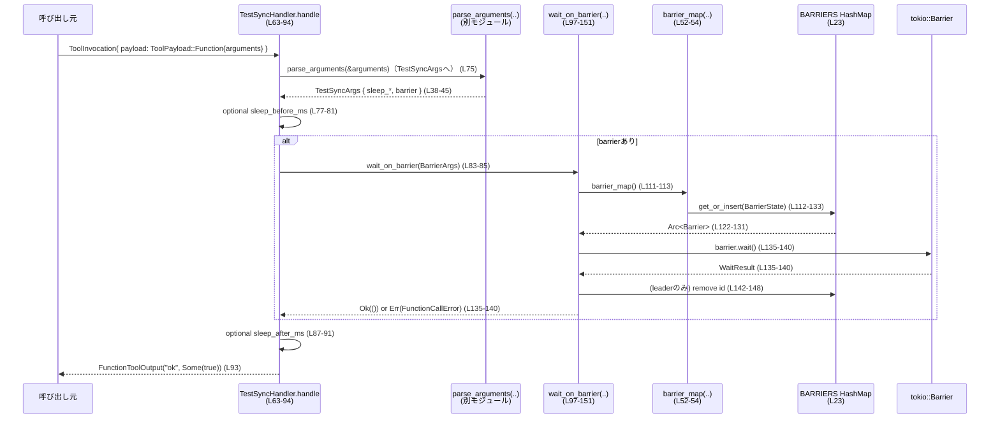

# core/src/tools/handlers/test_sync.rs コード解説

## 0. ざっくり一言

このファイルは、テスト用の同期ツール `TestSyncHandler` を実装し、任意のスリープと `tokio::Barrier` を使ったバリア同期を行うためのハンドラを提供します（`TestSyncHandler` 実装: `core/src/tools/handlers/test_sync.rs:L19,L56-95`）。

---

## 1. このモジュールの役割

### 1.1 概要

- このモジュールは、複数のツール呼び出し間で**時間調整**と**バリア同期**を行うためのハンドラを提供します。  
  （`TestSyncHandler` と `handle`: `L19,L56-95`）
- 呼び出しごとに「前後のスリープ時間」と「バリアID・参加者数・タイムアウト」を引数で受け取り、非同期に同期処理を行います。  
  （引数定義 `TestSyncArgs`, `BarrierArgs`: `L30-36,L38-45`）

### 1.2 アーキテクチャ内での位置づけ

- このハンドラは `ToolHandler` トレイトを実装し、`ToolInvocation` を受け取って `FunctionToolOutput` を返す「ツール実行の1コンポーネント」です（`L11-17,L56-57,L63`）。
- 引数は `parse_arguments` により JSON などから `TestSyncArgs` へデシリアライズされます（`L12,L15,L38-45,L75`）。
- バリアはグローバルな `BARRIERS` マップで ID ごとに共有され、`wait_on_barrier` が管理します（`L23,L52-54,L97-151`）。

```mermaid
graph TD
    subgraph "tools::handlers::test_sync (L19-151)"
        H[TestSyncHandler<br/>ToolHandler実装] --> HA[handle(..) (L63-94)]
        HA --> PA[parse_arguments(..)<br/>他モジュール]
        HA --> WB[wait_on_barrier(..) (L97-151)]
        WB --> BM[barrier_map(..) (L52-54)]
        BM --> BMAP[BARRIERS OnceLock<Mutex<HashMap>> (L23)]
    end

    subgraph "crate::tools"
        REG[ToolHandler, ToolKind<br/>(crate::tools::registry)]
        CTX[ToolInvocation, ToolPayload,<br/>FunctionToolOutput<br/>(crate::tools::context)]
    end

    H --> REG
    HA --> CTX
```

※ `parse_arguments`, `ToolHandler`, `ToolInvocation` などは別モジュールで定義されており、このチャンクには実装は現れません。

### 1.3 設計上のポイント

- **グローバルなバリア管理**  
  - `OnceLock<tokio::sync::Mutex<HashMap<String, BarrierState>>>` により、プロセス全体でバリアを ID ごとに共有します（`L23,L52-54`）。
- **非同期・並行性**  
  - `tokio::Barrier` と `Arc` を利用して、複数タスク間で同期ポイントを設けています（`L3,L8,L25-27,L125-130`）。
  - `tokio::sync::Mutex` を使い、非同期コンテキストで安全にバリアマップへアクセスします（`L23,L52-54,L112`）。
- **エラーハンドリング**  
  - ツール呼び出しの結果は `Result<_, FunctionCallError>` で表現され、入力ミスやタイムアウト時には `FunctionCallError::RespondToModel` としてエラー情報が返されます（`L11,L63,L69-71,L75,L97-108,L118-120,L136-140`）。
- **パラメータバリデーション**  
  - バリア参加者数・タイムアウトが0でないことを明示的にチェックし、異常値を早期に拒否します（`L97-108`）。
- **リソースクリーンアップ**  
  - バリアが正常完了した際、**リーダータスク**だけがバリアエントリをマップから削除し、ID の再利用を可能にします（`L142-148`）。

---

## 2. 主要な機能一覧

- テスト同期ハンドラ: `TestSyncHandler` が `ToolHandler` を実装し、テスト用同期ツールとして登録される（`L19,L56-95`）。
- 前後スリープ機能: `sleep_before_ms` / `sleep_after_ms` により、ハンドラ実行前後に任意の遅延を挿入（`L38-45,L77-81,L87-91`）。
- バリア同期機能: `BarrierArgs` に基づき、同じ ID を持つ複数呼び出しの同期ポイントを提供（`L30-36,L83-85,L97-151`）。
- グローバルバリアレジストリ: `BARRIERS` と `barrier_map` により、バリアを ID から取得・生成する仕組みを提供（`L23,L25-28,L52-54,L110-133`）。

---

## 3. 公開 API と詳細解説

### 3.1 型一覧（構造体など）

| 名前 | 種別 | 公開性 | 役割 / 用途 | 定義位置 |
|------|------|--------|------------|----------|
| `TestSyncHandler` | 構造体（フィールドなし） | `pub` | テスト同期ツールのハンドラ本体。`ToolHandler` トレイトを実装し、ツール呼び出しを処理する。 | `core/src/tools/handlers/test_sync.rs:L19,L56-95` |
| `BarrierState` | 構造体 | モジュール内専用 | 1つのバリア ID に対応する `Barrier` インスタンスと参加者数を保持する。 | `L25-28` |
| `BarrierArgs` | 構造体 + `Deserialize` | モジュール内専用 | バリアの ID, 参加者数, タイムアウト（ms）を表す引数用構造体。ツール引数からデシリアライズされる。 | `L30-36` |
| `TestSyncArgs` | 構造体 + `Deserialize` | モジュール内専用 | スリープ前後のミリ秒とオプションのバリア情報をまとめる引数用構造体。 | `L38-45` |

補助的な定数・静的変数:

| 名前 | 種別 | 役割 / 用途 | 定義位置 |
|------|------|-------------|----------|
| `DEFAULT_TIMEOUT_MS` | `const u64` | `BarrierArgs.timeout_ms` のデフォルト値（1,000ms）。`serde(default = "default_timeout_ms")` で使用。 | `L21,L34-35,L48-50` |
| `BARRIERS` | `static OnceLock<Mutex<HashMap<String, BarrierState>>>` | バリア ID から `BarrierState` へのマップを1度だけ初期化し、プロセス全体で共有する。 | `L23,L52-54` |

### 3.2 関数詳細

#### `impl ToolHandler for TestSyncHandler::kind(&self) -> ToolKind`

**概要**

- このハンドラが「関数型ツール」であることを示すため、常に `ToolKind::Function` を返します（`L59-61`）。

**引数**

| 引数名 | 型 | 説明 |
|--------|----|------|
| `&self` | `&TestSyncHandler` | ハンドラインスタンスへの参照。状態は持たない。 |

**戻り値**

- `ToolKind::Function` – ツールの種別を表す列挙値（`L16,L59-61`）。

**内部処理**

- 単純に `ToolKind::Function` リテラルを返すだけの処理です（`L59-61`）。

---

#### `impl ToolHandler for TestSyncHandler::handle(&self, invocation: ToolInvocation) -> Result<FunctionToolOutput, FunctionCallError>`

**概要**

- ツール呼び出しを処理する中核メソッドです。  
  引数を `TestSyncArgs` にデシリアライズし、指定された:
  - 前スリープ
  - バリア待機
  - 後スリープ  
  を順番に実行したのち、`"ok"` というテキスト出力を返します（`L63-94`）。

**引数**

| 引数名 | 型 | 説明 |
|--------|----|------|
| `&self` | `&TestSyncHandler` | ハンドラインスタンスへの参照。 |
| `invocation` | `ToolInvocation` | ツール呼び出し全体の情報。ここでは `payload` から引数を取り出す（`L63-67`）。 |

**戻り値**

- `Ok(FunctionToolOutput)`  
  - テキスト `"ok"` と boolean `true` を含む出力を返す（`L93`）。  
- `Err(FunctionCallError)`  
  - 対応していない `ToolPayload` 種別、引数パース失敗、バリア待機失敗などの場合に返る（`L66-73,L75,L83-85,L93`）。

**内部処理の流れ**

1. `ToolInvocation` から `payload` を取り出す（構造体分配: `let ToolInvocation { payload, .. } = invocation;`）（`L63-65`）。
2. `payload` が `ToolPayload::Function { arguments }` であるかを確認し、そうでなければエラー `FunctionCallError::RespondToModel(...)` を返す（`L66-73`）。
3. `parse_arguments(&arguments)` を用いて `arguments` を `TestSyncArgs` にデシリアライズ（`L75`）。  
   - 失敗すれば `?` によってそのまま `Err(FunctionCallError)` が返る（`L75`）。
4. `sleep_before_ms` が `Some(delay)` かつ `delay > 0` の場合、`tokio::time::sleep` で指定ミリ秒スリープ（`L77-81`）。
5. `barrier` が `Some(barrier_args)` であれば、`wait_on_barrier(barrier_args).await` を呼び出す（`L83-85`）。
6. `sleep_after_ms` が `Some(delay)` かつ `delay > 0` の場合、後ろ側のスリープを行う（`L87-91`）。
7. 最後に `FunctionToolOutput::from_text("ok".to_string(), Some(true))` を返す（`L93`）。

**Examples（使用例）**

> 実際にはフレームワーク側から呼び出されることが想定されます。ここでは最小限の疑似コードとして示します。

```rust
use crate::tools::handlers::test_sync::TestSyncHandler;
use crate::tools::context::{ToolInvocation, ToolPayload};
use serde_json::json;
use crate::function_tool::FunctionCallError;

// 非同期ランタイム（tokioなど）上で実行される想定
async fn run_test_sync_tool() -> Result<(), FunctionCallError> {
    let handler = TestSyncHandler; // フィールドを持たないのでそのまま生成（L19）

    // ツール引数のJSON。TestSyncArgs / BarrierArgs に対応（L30-36,L38-45）
    let arguments = json!({
        "sleep_before_ms": 100,
        "sleep_after_ms": 200,
        "barrier": {
            "id": "test-barrier-1",
            "participants": 2,
            "timeout_ms": 5_000
        }
    });

    // ToolInvocation の具体的な構築方法はこのチャンクには現れないため不明です。
    // ここでは型だけ合わせ、実装は unimplemented!() で省略します。
    let invocation: ToolInvocation = unimplemented!();

    // どこかで invocation.payload が
    // ToolPayload::Function { arguments } になるように組み立てられている必要があります（L66-67）。
    let _output = handler.handle(invocation).await?; // 成功すれば "ok" 出力が得られる（L93）
    Ok(())
}
```

※ `ToolInvocation` の具体的なフィールド構成は **このチャンクには現れない** ため、実際の構築手順は不明です。

**Errors / Panics**

- `ToolPayload` が `Function` 以外  
  → `"test_sync_tool handler received unsupported payload"` というメッセージで `FunctionCallError::RespondToModel` を返す（`L66-71`）。
- 引数 JSON が `TestSyncArgs` として不正な場合  
  → `parse_arguments` 経由で `Err(FunctionCallError)` を返す（`L75`）。具体的なエラー内容は `parse_arguments` の実装に依存し、このチャンクには現れません。
- バリア待機関連のエラー  
  → `wait_on_barrier` 内で発生したエラーがそのまま伝播します（`L83-85`）。詳細は後述の `wait_on_barrier` を参照。

この関数自体には `panic!` を直接呼ぶコードは存在しません（`L63-94`）。

**Edge cases（エッジケース）**

- `sleep_before_ms` / `sleep_after_ms` が `None`  
  → 対応するスリープは実行されません（`L77-81,L87-91`）。
- スリープ値が `Some(0)`  
  → `delay > 0` 条件によりスリープはスキップされます（`L77-79,L87-89`）。
- `barrier` フィールドが指定されていない (`None`)  
  → バリア待機は行われず、スリープのみで終了します（`L83-85`）。
- `wait_on_barrier` がエラーを返した場合  
  → `?` によりエラーがそのまま `handle` の戻り値になります（`L83-85`）。

**使用上の注意点**

- `handle` は非同期関数であり、`tokio` などの非同期ランタイム上で `.await` する必要があります（`L63`）。
- `ToolInvocation` の `payload` が `ToolPayload::Function { arguments }` でないとエラーになるため、ツール登録側でペイロード種別を合わせる必要があります（`L66-73`）。
- 引数 JSON は `TestSyncArgs` 構造に沿った形で渡す必要があります（`L38-45`）。

---

#### `wait_on_barrier(args: BarrierArgs) -> Result<(), FunctionCallError>`

**概要**

- バリア ID, 参加者数, タイムアウトを指定してバリア同期を行う非公開関数です。  
  同じ ID と参加者数で複数回呼び出されたときに同期ポイントを形成します（`L30-36,L83-85,L97-151`）。

**引数**

| 引数名 | 型 | 説明 |
|--------|----|------|
| `args` | `BarrierArgs` | バリア ID (`id`), 参加者数 (`participants`), タイムアウト（ミリ秒, `timeout_ms`）を含む引数。 |

**戻り値**

- `Ok(())`  
  - バリアが全参加者で待ち合わせに成功した場合（`L135-140,L151`）。
- `Err(FunctionCallError)`  
  - 引数が不正（参加者数・タイムアウトが0）  
  - 既存バリアと参加者数が不整合  
  - タイムアウトによる待機失敗  
  などの場合（`L97-108,L118-120,L136-140`）。

**内部処理の流れ**

1. `participants == 0` の場合、エラー `"barrier participants must be greater than zero"` を返す（`L97-102`）。
2. `timeout_ms == 0` の場合、エラー `"barrier timeout must be greater than zero"` を返す（`L104-108`）。
3. `barrier_id` として `args.id` をクローン（`L110`）。
4. `barrier_map().lock().await` でグローバルマップにロックを取得し、ID に応じて以下の処理を行う（`L111-113`）:
   - `Entry::Occupied` の場合（すでにバリアが存在）:
     - 既存 `BarrierState.participants` と `args.participants` が異なる場合、  
       `"barrier {id} already registered with {existing} participants"` というエラーを返す（`L114-121`）。
     - 一致する場合、既存の `state.barrier` を `Arc::clone` して使用する（`L115-116,L122`）。
   - `Entry::Vacant` の場合（まだ存在しない）:
     - 新しく `Barrier::new(args.participants)` でバリアを作成し（`L125`）、
     - `BarrierState { barrier, participants }` をマップに挿入する（`L126-129`）。
5. ロックを解放したあと、`tokio::time::timeout(Duration::from_millis(args.timeout_ms), barrier.wait())` でバリア待機を行う（`L135-140`）。
6. `timeout` によりタイムアウトした場合は `"test_sync_tool barrier wait timed out"` というエラーを返す（`L136-140`）。
7. 正常にバリア待機が完了すると `WaitResult` が得られます。`wait_result.is_leader()` が `true` のタスクだけがリーダーとなります（`L142`）。
8. リーダータスクは再度マップにロックを取り、  
   - バリアIDで対応する `BarrierState` を取得し（`L143-145`）、
   - `Arc::ptr_eq(&state.barrier, &barrier)` が真であれば（他の世代のバリアでないことを確認）、マップからエントリを削除します（`L144-148`）。
9. 最後に `Ok(())` を返す（`L151`）。

**Examples（使用例）**

> モジュール内テストから直接 `wait_on_barrier` を使うイメージ例です（内部関数なので、外部モジュールからは呼べません）。

```rust
use crate::function_tool::FunctionCallError;
use crate::tools::handlers::test_sync::{TestSyncArgs}; // BarrierArgs はこのモジュール内のprivateなので通常は同ファイル内で使用

#[tokio::test]
async fn two_tasks_sync_on_barrier() -> Result<(), FunctionCallError> {
    use super::BarrierArgs; // 同一ファイル内のテストなら private でも参照可能（L30-36）

    let args = BarrierArgs {
        id: "barrier-1".to_string(),
        participants: 2,
        timeout_ms: 5_000,
    };

    // 2つのタスクをバリアで同期させる例
    let t1 = tokio::spawn(super::wait_on_barrier(args.clone()));
    let t2 = tokio::spawn(super::wait_on_barrier(args));

    t1.await.unwrap()?; // 両方完了すればOk(())
    t2.await.unwrap()?;

    Ok(())
}
```

※ 上記はあくまで利用イメージであり、実プロジェクトでテストが存在するかどうかは **このチャンクには現れません**。

**Errors / Panics**

- `participants == 0`  
  → `"barrier participants must be greater than zero"` というエラー（`L97-102`）。
- `timeout_ms == 0`  
  → `"barrier timeout must be greater than zero"` というエラー（`L104-108`）。
- 既存バリアと `participants` が異なる  
  → `"barrier {id} already registered with {existing} participants"` というエラー（`L114-121`）。
- バリア待機のタイムアウト  
  → `"test_sync_tool barrier wait timed out"` というエラー（`L135-140`）。
- この関数内には `panic!` 呼び出しはなく、すべて `Result` で表現されています（`L97-151`）。

**Edge cases（エッジケース）**

- **参加者数が0**  
  - 即座にエラーを返し、バリアは作成されません（`L97-102`）。
- **タイムアウトが0ms**  
  - 即座にエラーを返し、待機は行われません（`L104-108`）。
- **同一 ID で既存 `participants` と異なる値**  
  - 誤った再利用を防ぐため、エラーを返して処理を中止します（`L114-121`）。
- **タイムアウト発生**  
  - 自タスクはエラーで終了しますが、他タスクの `barrier.wait()` は通常どおり継続します（`L135-140`）。  
    `tokio::time::timeout` は待機側のFutureをドロップするだけであり、他参加者の挙動はTokioのBarrierの仕様に従います（Barrierの詳細実装はこのチャンクには現れません）。
- **リーダータスクでない参加者**  
  - `is_leader() == false` の場合、マップからの削除は行われず、`Ok(())` を返すだけです（`L142-151`）。

**使用上の注意点**

- `barrier_map().lock().await` のロックは、`barrier.wait()` を呼ぶ前に必ずスコープを抜けて解放されるように書かれています（`L111-133,L135-140`）。  
  ロックを保持したまま `.await` するとデッドロックの危険があるため、この構造は維持する必要があります。
- バリア完了後に ID を再利用できるよう、リーダータスクでエントリを削除しています（`L142-148`）。  
  この削除条件（`is_leader` と `Arc::ptr_eq`）を変更する場合は、世代が異なるバリアとの取り違えに注意が必要です（`L142-148`）。
- タイムアウト時にはバリアエントリが削除されないため、再試行の挙動（同じIDを再利用するかどうか）は呼び出し側の設計に依存します（`L135-140,L142-148`）。

---

### 3.3 その他の関数

| 関数名 | シグネチャ | 役割（1 行） | 定義位置 |
|--------|------------|--------------|----------|
| `default_timeout_ms` | `fn default_timeout_ms() -> u64` | `DEFAULT_TIMEOUT_MS` を返すデフォルト関数。`BarrierArgs.timeout_ms` の `serde(default)` に使用される。 | `L21,L34-35,L48-50` |
| `barrier_map` | `fn barrier_map() -> &'static tokio::sync::Mutex<HashMap<String, BarrierState>>` | グローバルなバリアマップ `BARRIERS` への参照を、`OnceLock` による遅延初期化付きで返す。 | `L23,L52-54` |

---

## 4. データフロー

### 4.1 典型シナリオ: バリア付きテスト同期

`handle` が呼ばれたときのデータフローを示します（`handle`: `L63-94`, `wait_on_barrier`: `L97-151`）。

1. 呼び出し元が `ToolInvocation` を構築し、その `payload` にツール引数（JSONなど）を含む `ToolPayload::Function { arguments }` を設定する（`L66-67`）。
2. `TestSyncHandler.handle` は `payload` から `arguments` を取り出し、`parse_arguments` で `TestSyncArgs` に変換する（`L66-67,L75`）。
3. `sleep_before_ms` があれば `tokio::time::sleep` を実行する（`L77-81`）。
4. `barrier` が指定されていれば `wait_on_barrier` を呼び出し、`BarrierArgs` を渡す（`L83-85`）。
5. `wait_on_barrier` は `barrier_map` を使って、該当 ID の `BarrierState` を取得または生成し、`Barrier::wait()` をタイムアウト付きで待つ（`L111-133,L135-140`）。
6. バリア完了後、必要に応じてバリアエントリを削除し（`is_leader` の場合）、`handle` に制御を戻す（`L142-148`）。
7. `sleep_after_ms` があれば後ろスリープを実行し（`L87-91`）、最後に `"ok"` を返す（`L93`）。



---

## 5. 使い方（How to Use）

### 5.1 基本的な使用方法

ツール引数の JSON が `TestSyncArgs` / `BarrierArgs` へどのようにマッピングされるかを示します（`L30-36,L38-45`）。

```rust
use serde_json::json;

// test_sync ツールに渡すことを想定した引数JSON
let arguments = json!({
    "sleep_before_ms": 100,      // handle開始前に100msスリープ（L77-81）
    "sleep_after_ms": 200,       // handle終了前に200msスリープ（L87-91）
    "barrier": {
        "id": "suite-1",         // バリアID（L31-33）
        "participants": 3,       // 3タスクで同期（L32-33）
        // timeout_ms を省略すると default_timeout_ms() = 1000 が使われる（L34-35,L48-50）
    }
});

// フレームワーク側で ToolInvocation / ToolPayload::Function{arguments} に詰めて
// TestSyncHandler.handle(..).await が呼ばれる想定（L66-75）。
```

このような形の引数で呼ぶと、3つのテスト呼び出しが同じ `"suite-1"` ID で `wait_on_barrier` に到達したとき、互いを待ち合わせてから `"ok"` を返します（`L83-85,L97-151`）。

### 5.2 よくある使用パターン

1. **単純な遅延のみの利用**

   ```json
   {
     "sleep_before_ms": 1000,
     "sleep_after_ms": 0
   }
   ```

   - バリアを指定しなければ、単なるスリープツールとして動作します（`barrier: None` → `L83-85`）。

2. **バリア同期だけを行う**

   ```json
   {
     "barrier": {
       "id": "case-X",
       "participants": 2,
       "timeout_ms": 5000
     }
   }
   ```

   - スリープフィールドを省略すると `None` になり、スリープなしで即座にバリアへ進みます（`L38-45,L77-81,L87-91`）。

3. **長時間の前処理 + バリア**

   - 前処理の揺らぎを隠すため、`sleep_before_ms` を使ってテストの開始タイミングを揃え、その後バリアで同期するといった使い方が可能です（`L38-45,L77-81,L83-85`）。

### 5.3 よくある間違い

```rust
// 間違い例1: participants = 0
let bad_args = json!({
    "barrier": {
        "id": "case-1",
        "participants": 0,
        "timeout_ms": 1000
    }
});
// → wait_on_barrier 内でエラー
//   "barrier participants must be greater than zero"（L97-102）

// 間違い例2: timeout_ms = 0
let bad_args2 = json!({
    "barrier": {
        "id": "case-1",
        "participants": 2,
        "timeout_ms": 0
    }
});
// → "barrier timeout must be greater than zero"（L104-108）

// 間違い例3: 同じIDだがparticipantsが異なる
// 1回目: participants = 2
// 2回目: participants = 3
// → "barrier case-1 already registered with 2 participants"（L114-121）
```

また、`ToolPayload` を `Function` 以外で呼び出すと、ハンドラは `"handler received unsupported payload"` エラーで終了します（`L66-71`）。

### 5.4 使用上の注意点（まとめ）

- **契約（Contract）**
  - バリア参加者数 `participants` は 1以上でなければなりません（`L97-102`）。
  - タイムアウト `timeout_ms` は 1以上でなければなりません（`L104-108`）。
  - 同じ `id` のバリアは、すべて同じ `participants` 値で参加する必要があります（`L114-121`）。
- **並行性**
  - グローバルマップは `tokio::sync::Mutex` で守られており、`await` 前にロックが解放されるよう設計されています（`L111-133,L135-140`）。
  - バリア完了後のクリーンアップはリーダータスクのみが行い、`Arc::ptr_eq` で世代の取り違えを防いでいます（`L142-148`）。
- **エラーの扱い**
  - すべてのエラーは `FunctionCallError` を通じて呼び出し元に返されるため、ツール利用側は `Result` をハンドリングする必要があります（`L63-71,L75,L97-108,L118-120,L136-140`）。
- **潜在的なバグ・セキュリティ観点**
  - タイムアウトでバリアが解除されなかった場合、バリアエントリはマップに残り続けます（`L135-140,L142-148`）。  
    多数の異なる ID でタイムアウトが頻発すると、メモリ使用量が増える可能性があります（リークというほどではないが、明示的な削除は行われません）。
  - `id` は `String` で任意文字列を受け付けるため、外部から与えられる際には長さなどのバリデーションを別レイヤーで行う方が安全です（`L31-33`）。

---

## 6. 変更の仕方（How to Modify）

### 6.1 新しい機能を追加する場合

- **新しい同期パラメータを追加したい場合**
  1. `TestSyncArgs` に新しいフィールドを追加し、`serde` 属性を適宜付けます（`L38-45`）。
  2. `handle` 内でそのフィールドを参照し、スリープやバリア処理の前後にロジックを追加します（`L77-91`）。
  3. 必要に応じて `BarrierArgs` にもフィールドを追加し、`wait_on_barrier` 内で解釈します（`L30-36,L97-151`）。

- **タイムアウト時の挙動を変えたい場合**
  - 例えばタイムアウト時にバリアを強制的に削除したい場合、`timeout` の `map_err` 部分（`L136-140`）で、エラーを返す前にマップから当該 ID を削除するロジックを追加できます。  
    ただし、現在はリーダータスクのみ削除する設計になっているため、この契約を変える影響をよく確認する必要があります（`L142-148`）。

### 6.2 既存の機能を変更する場合

- **影響範囲の確認**
  - `TestSyncHandler.handle` はこのファイルで唯一の公開エントリポイントであり（`L19,L56-95`）、ツールフレームワークから直接呼ばれる可能性があります。シグネチャ変更は広い影響があります。
  - `wait_on_barrier` は内部関数ですが、`handle` 以外から呼ばれていないかを検索して確認する必要があります（このチャンクでは他の呼び出しは現れません: `L97-151`）。

- **契約を守るべき点**
  - `barrier_map` のロックを取得したまま `.await` しない構造（ロックスコープと `await` スコープの分離: `L111-133,L135-140`）。
  - `participants > 0`, `timeout_ms > 0` の前提条件（`L97-108`）。
  - 既存バリアとの `participants` 一致チェック（`L114-121`）。
  - `is_leader` かつ `Arc::ptr_eq` を用いた削除条件（`L142-148`）。

- **テストについて**
  - このファイル内にはテストコードは存在しません（`L1-151` 全体）。  
    変更時には、ツール全体のテストスイート（別ファイルにある可能性が高いですが、このチャンクからは場所は不明）に、タイムアウト・不一致 participants・正常同期などのケースを追加することが有用です。

---

## 7. 関連ファイル

このモジュールと密接に関係するモジュール（ファイルパスはこのチャンクからは分からないため「不明」と表記します）。

| パス / モジュール | 役割 / 関係 |
|-------------------|------------|
| 不明（モジュール: `crate::tools::registry`） | `ToolHandler`, `ToolKind` を定義し、`TestSyncHandler` が実装対象とするトレイト・種別を提供する（`L16-17,L56-61`）。 |
| 不明（モジュール: `crate::tools::context`） | `FunctionToolOutput`, `ToolInvocation`, `ToolPayload` 型を提供し、ツール実行の入出力やペイロードの種別を表現する（`L12-14`）。 |
| 不明（モジュール: `crate::tools::handlers`） | `parse_arguments` 関数を提供し、JSON などから `TestSyncArgs` へのデシリアライズ処理を担当する（`L15,L75`）。 |
| 不明（モジュール: `crate::function_tool`） | `FunctionCallError` 型を定義し、ツール呼び出しエラーの共通表現として利用される（`L11,L63,L69-71,L75,L97-108,L118-120,L136-140`）。 |

このチャンクには、これら関連モジュールの実装内容やファイル構成は現れないため、詳細は不明です。
