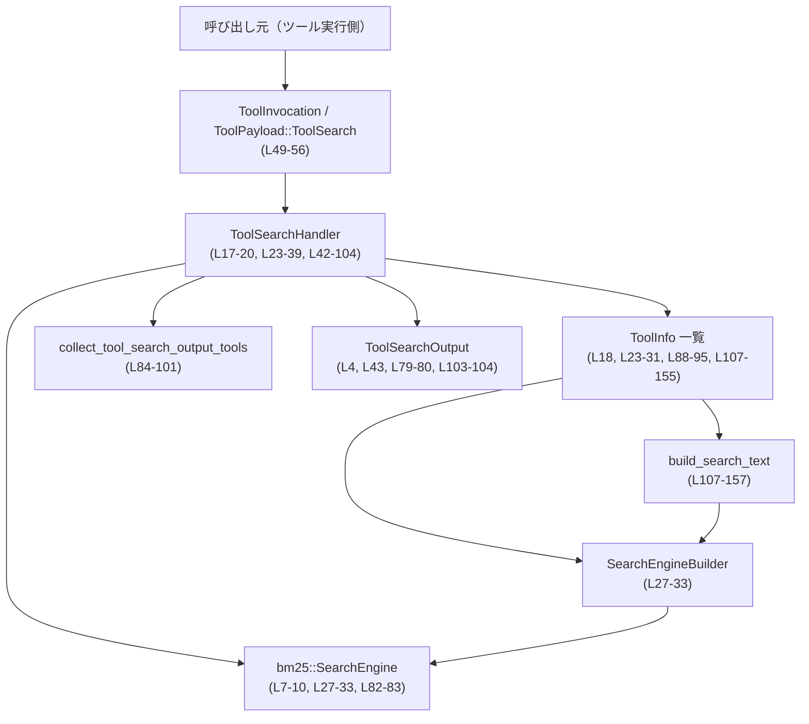
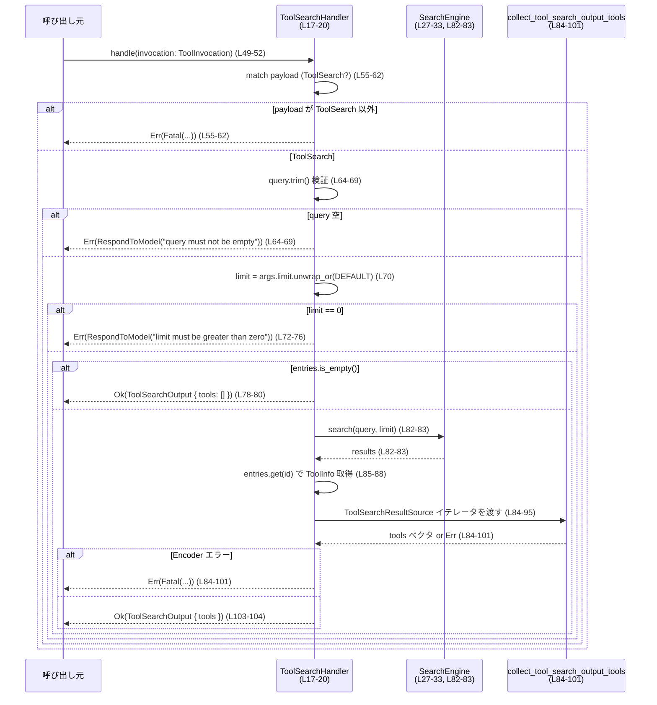

# core/src/tools/handlers/tool_search.rs

## 0. ざっくり一言

BM25 検索エンジンを使って `ToolInfo` の一覧からツールを全文検索し、`ToolSearchOutput` を返すツール検索用ハンドラ (`ToolSearchHandler`) を実装したモジュールです（`core/src/tools/handlers/tool_search.rs:L17-20, L42-44, L49-104`）。

---

## 1. このモジュールの役割

### 1.1 概要

- このモジュールは「登録済みツール情報 (`ToolInfo`) 群の中から、クエリ文字列にマッチするツールを探す」という問題を解決するために存在し、BM25 ベースの全文検索でスコア付けされた結果を `ToolSearchOutput` として返します（`L17-20, L23-39, L49-104`）。
- `ToolHandler` トレイトの実装として、`ToolPayload::ToolSearch` だけを受け付け、検索クエリと上限件数を検証した上で BM25 検索を実行します（`L42-47, L49-63, L64-76, L82-83`）。
- ヒットした文書 ID を元に元の `ToolInfo` を取り出し、`collect_tool_search_output_tools` に渡すことで最終的な `ToolSearchOutput` 形式にエンコードしています（`L84-101`）。

### 1.2 アーキテクチャ内での位置づけ

主な依存関係と役割は次のとおりです。

- `ToolSearchHandler`: このモジュールで定義される検索ハンドラ（`L17-20, L23-39, L42-104`）。
- `ToolHandler` トレイト: ツールハンドラの共通インターフェース（`L5-6, L42-47, L49-104`）。
- `ToolInvocation` / `ToolPayload::ToolSearch`: 呼び出しコンテキストとペイロード（`L2-4, L49-56`）。
- BM25 関連 (`Document`, `SearchEngine`, `SearchEngineBuilder`, `Language`): 検索インデックスと検索エンジン（`L7-10, L23-39, L82-83`）。
- `ToolInfo`: 検索対象となるツール情報（`L11, L18, L23-31, L88-95, L107-155`）。
- `collect_tool_search_output_tools` / `ToolSearchResultSource`: 検索結果から `ToolSearchOutput` への変換ロジック（`L14-15, L84-101`）。
- `FunctionCallError`: ハンドラから返すエラー種別（`L1, L49-104`）。

依存関係の概要を Mermaid で表すと次のようになります（このファイル全体 `L1-158` を対象）。



### 1.3 設計上のポイント

- **インデックス構築時にテキストを集約**  
  `build_search_text` で名前・タイトル・説明・スキーマのプロパティ名などを 1 本の検索テキストにまとめ、その結果から `Document<usize>` を作成して BM25 インデックスを構築しています（`L23-31, L107-157`）。
- **安定した順序のためのソート**  
  入力の `HashMap<String, ToolInfo>` を `(String, ToolInfo)` の `Vec` に変換したあと、キーでソートしています。これにより BM25 に渡す文書 ID が名前順に安定します（`L23-25`）。
- **エラーハンドリング方針が明確**  
  - 期待しないペイロードバリアントの場合は `FunctionCallError::Fatal` を返します（`L55-62`）。
  - クエリが空、または `limit == 0` の場合は、呼び出し元にメッセージを返す `FunctionCallError::RespondToModel` を返します（`L64-76`）。
  - 検索結果のエンコードに失敗した場合も `Fatal` としています（`L84-101`）。
- **async 対応のハンドラ**  
  `ToolHandler::handle` 実装は `async fn` として定義されていますが、この関数内では `.await` を呼んでおらず、内部処理は同期的です（`L49-104`）。非同期ランタイム上で動作するためのインターフェースだけを満たしています。
- **所有権と安全性**  
  - インデックス構築は `ToolSearchHandler::new` 内で行い、以降の検索は `&self` に対する参照で行われるため、ハンドラのインスタンス自体に対する再初期化や可変操作はありません（`L23-39, L49-52, L82-83`）。
  - `Vec` へのアクセスは `get` と `filter_map` を通じて行われており、境界外アクセスによる panic を避けています（`L84-88`）。

---

## 2. 主要な機能一覧

- ツール一覧から BM25 検索インデックスを構築する（`ToolSearchHandler::new`，`L23-39`）。
- `ToolPayload::ToolSearch` ペイロードを受け付け、クエリと上限件数をバリデーションする（`L49-76`）。
- 検索エンジンで BM25 検索を実行し、ヒットしたツールを抽出する（`L78-83, L84-88`）。
- 検索結果を `ToolSearchResultSource` 経由で `ToolSearchOutput` 形式に変換する（`L84-101, L103-104`）。
- `ToolInfo` から検索用テキスト（名前・説明・スキーマ情報など）を組み立てる（`build_search_text`, `L107-157`）。

---

## 3. 公開 API と詳細解説

### 3.1 型一覧（構造体・列挙体など）

| 名前 | 種別 | 役割 / 用途 | 定義位置 |
|------|------|------------|----------|
| `ToolSearchHandler` | 構造体 | ツール検索のための BM25 インデックスと元の `ToolInfo` を保持し、`ToolHandler` として検索リクエストに応答する | `core/src/tools/handlers/tool_search.rs:L17-20` |

> このファイルには他の構造体・enum の定義は現れません。

### 3.2 関数詳細（4 件）

#### `ToolSearchHandler::new(tools: std::collections::HashMap<String, ToolInfo>) -> Self`

**概要**

- 与えられた `HashMap<String, ToolInfo>` から `(String, ToolInfo)` のベクタを作成・ソートし、BM25 検索エンジンに渡す文書リストを構築して `ToolSearchHandler` を初期化します（`L23-39`）。

**引数**

| 引数名 | 型 | 説明 |
|--------|----|------|
| `tools` | `std::collections::HashMap<String, ToolInfo>` | ツール名（キー）とツール情報（値）のマップ。すべてこのハンドラの検索対象になります（`L23`）。 |

**戻り値**

- `Self` (`ToolSearchHandler`): 検索インデックス構築済みのハンドラインスタンス（`L35-38`）。

**内部処理の流れ（アルゴリズム）**

1. `HashMap` を `into_iter().collect()` して `(String, ToolInfo)` の `Vec` に変換し、`entries` とする（`L23-24`）。
2. `entries` をキー（ツール名）でソートし、安定した順序を確保する（`L25`）。
3. `entries.iter().enumerate()` により 0 始まりのインデックスと `(name, info)` のペアを生成し、`Document::new(idx, build_search_text(name, info))` で BM25 用の文書群を作成する（`L27-31, L107-157`）。
4. `SearchEngineBuilder::<usize>::with_documents(Language::English, documents).build()` を呼び、検索エンジンを構築する（`L32-33`）。
5. 生成した `entries` と `search_engine` をフィールドに持つ `ToolSearchHandler` を返す（`L35-38`）。

**Examples（使用例）**

```rust
use std::collections::HashMap;
use codex_mcp::ToolInfo;

// tools: HashMap<String, ToolInfo> は別途構築されていると仮定します。
let tools: HashMap<String, ToolInfo> = /* ... */;

// ToolSearchHandler を初期化する（BM25 インデックスも同時に構築される）
let handler = ToolSearchHandler::new(tools); // L23-39
```

※ `ToolInfo` の具体的な構築方法は、このファイルには現れないため不明です。

**Errors / Panics**

- この関数内で明示的に `Result` や `panic!` を使っていないため、このレベルでエラーや panic を返すコードはありません（`L23-39`）。
- ただし、`SearchEngineBuilder::build` や `Document::new` が内部で panic するかどうかは、このファイルからは分かりません（外部クレート依存）。

**Edge cases（エッジケース）**

- `tools` が空の場合でも、`entries` は空の `Vec` となり、空の文書セットで検索エンジンが作られます（`L23-33`）。この場合の挙動は `SearchEngineBuilder` の実装に依存します。
- 同じキーを持つエントリは `HashMap` の性質上 1 つしか存在しません。

**使用上の注意点**

- `tools` の所有権は `new` にムーブされます。呼び出し後に元の `HashMap` を使用することはできません（Rust の所有権ルール、`L23`）。
- 大量のツールを渡すと、`build_search_text` による文字列結合と BM25 インデックスの構築が高コストになる可能性があります（`L27-33, L107-157`）。

---

#### `ToolSearchHandler::kind(&self) -> ToolKind`

**概要**

- このハンドラが扱うツールの種類として `ToolKind::Function` を返します（`L45-47`）。

**引数**

| 引数名 | 型 | 説明 |
|--------|----|------|
| `&self` | `&ToolSearchHandler` | ハンドラインスタンスへの参照。状態を変更しません（`L45`）。 |

**戻り値**

- `ToolKind`: 固定で `ToolKind::Function` を返します（`L45-47`）。

**内部処理の流れ**

1. `ToolKind::Function` をそのまま返す（`L45-47`）。

**Examples（使用例）**

```rust
use crate::tools::registry::ToolKind;

let kind: ToolKind = handler.kind(); // L45-47
assert!(matches!(kind, ToolKind::Function));
```

**Errors / Panics**

- エラーや panic は発生しません（単純な列挙値返却、`L45-47`）。

**Edge cases**

- ありません。常に同じ値を返します。

**使用上の注意点**

- ハンドラの種類を識別する用途で使用される想定ですが、その使い方は `ToolHandler` の利用側コードに依存します（このファイルには現れません）。

---

#### `ToolSearchHandler::handle(&self, invocation: ToolInvocation) -> Result<ToolSearchOutput, FunctionCallError>` （async）

**概要**

- `ToolInvocation` から `ToolPayload::ToolSearch` を取り出し、クエリと `limit` を検証した上で BM25 検索を実行し、結果を `ToolSearchOutput` として返します（`L49-104`）。
- 不正な入力やエンコードエラー時には `FunctionCallError` を返します（`L55-62, L64-76, L84-101`）。

**引数**

| 引数名 | 型 | 説明 |
|--------|----|------|
| `&self` | `&ToolSearchHandler` | 検索インデックスを保持するハンドラへの参照。内部状態は変更しません（`L49-52, L78-83`）。 |
| `invocation` | `ToolInvocation` | 呼び出しコンテキスト。ここから `payload` として `ToolPayload::ToolSearch` を抽出します（`L49-56`）。 |

**戻り値**

- `Result<ToolSearchOutput, FunctionCallError>`  
  - `Ok(ToolSearchOutput)`：検索に成功し、ツール一覧が生成できた場合（`L103-104`）。
  - `Err(FunctionCallError)`：入力が不正、ペイロード種別が違う、または結果のエンコードに失敗した場合（`L55-62, L64-76, L84-101`）。

**内部処理の流れ（アルゴリズム）**

1. `ToolInvocation { payload, .. } = invocation` でペイロードを取り出す（`L53`）。
2. `match payload` でバリアントを確認し、`ToolPayload::ToolSearch { arguments }` から `arguments` を取り出す。その他のバリアントなら `FunctionCallError::Fatal` を返して終了する（`L55-62`）。
3. `args.query.trim()` を `query` とし、空文字列であれば `RespondToModel("query must not be empty")` を返す（`L64-69`）。
4. `args.limit.unwrap_or(TOOL_SEARCH_DEFAULT_LIMIT)` で `limit` を決定し、`limit == 0` であれば `RespondToModel("limit must be greater than zero")` を返す（`L70-76`）。
5. `self.entries.is_empty()` なら、検索せずに `ToolSearchOutput { tools: Vec::new() }` を返す（`L78-80`）。
6. `self.search_engine.search(query, limit)` で BM25 検索を実行し、結果リストを `results` として受け取る（`L82-83`）。
7. `results.into_iter()` から
   - `self.entries.get(result.document.id)` で該当 `ToolInfo` を取得（存在しない場合はスキップ）し（`L85-88`）、
   - そこから `ToolSearchResultSource` 構造体を構築する（`L88-95`）。
8. 生成したイテレータを `collect_tool_search_output_tools(...)` に渡し、`ToolSearchOutput` 用のツールリストを生成する。エラーの場合は `FunctionCallError::Fatal` に変換する（`L84-101`）。
9. 最終的に `Ok(ToolSearchOutput { tools })` を返す（`L103-104`）。

**Examples（使用例）**

`ToolInvocation` や `ToolPayload` の詳細はこのファイルに現れないため、概念的な例になります。

```rust
use crate::tools::context::{ToolInvocation, ToolPayload};
use crate::function_tool::FunctionCallError;

// handler は ToolSearchHandler::new で初期化済みとする。
async fn search_example(handler: &ToolSearchHandler) -> Result<(), FunctionCallError> {
    // ToolPayload::ToolSearch { arguments } の構築方法はこのチャンクには現れない。
    let payload = ToolPayload::ToolSearch {
        arguments: /* query や limit を含む構造体。型名詳細は不明 */
        /* 例: fields: query: String, limit: Option<usize> （L64-71 から推測される） */
    };

    let invocation = ToolInvocation {
        payload,
        // 他のフィールドはこのチャンクには現れない
        ../* 略 */
    };

    // 非同期コンテキストで検索を実行
    let output = handler.handle(invocation).await?; // L49-104

    // output.tools に検索結果のツール一覧が入っている（L79-80, L103-104）
    println!("found {} tools", output.tools.len());

    Ok(())
}
```

**Errors / Panics**

- **Fatal エラー**（`FunctionCallError::Fatal`）
  - `payload` が `ToolPayload::ToolSearch` 以外だった場合（`L55-62`）。
  - `collect_tool_search_output_tools` がエラーを返した場合（`L84-101`）。
- **モデル向けエラー**（`FunctionCallError::RespondToModel`）
  - `query` が空文字列（trim 後）だった場合："query must not be empty"（`L64-69`）。
  - `limit` が 0 の場合："limit must be greater than zero"（`L70-76`）。
- この関数内で `panic!` を直接呼んでおらず、`unwrap` やインデックスアクセスも使っていないため、明示的な panic の発生箇所はありません（`L49-104`）。

**Edge cases（エッジケース）**

- `query` が空白のみの場合  
  `trim()` により空文字列になり、`RespondToModel("query must not be empty")` が返されます（`L64-69`）。
- `limit` が `None` の場合  
  `TOOL_SEARCH_DEFAULT_LIMIT` にフォールバックします（`L70`）。
- `limit` が 0 の場合  
  `RespondToModel("limit must be greater than zero")` エラーになります（`L72-76`）。
- `self.entries` が空の場合  
  BM25 検索を行わず、空の `tools` を持つ `ToolSearchOutput` を返します（`L78-80`）。
- BM25 の返す `result.document.id` に対応するエントリが存在しない場合  
  `.get` が `None` を返し、`filter_map` によりその結果はスキップされます（`L85-88`）。

**使用上の注意点**

- **並行性**  
  - `&self` を取るのみで内部状態を変更せず、`SearchEngine::search` も `&self` で呼ばれているため、このコード上は共有可変状態を持っていません（`L49-52, L82-83`）。
  - 実際に `ToolSearchHandler` が `Send` / `Sync` かどうかは、`SearchEngine<usize>` と `ToolInfo` の実装に依存し、このファイルからは判断できません。
- **入力検証**  
  - 空クエリや 0 の `limit` はエラーになるため、呼び出し側はこれらを避ける必要があります（`L64-76`）。
- **エラー分類**  
  - ペイロード種別の不一致やエンコードエラーは「致命的」扱いであり、単なる入力ミスとは切り分けられています（`L55-62, L84-101`）。呼び出し側のエラーハンドリング方針に影響します。
- **セキュリティ面**  
  - ユーザー入力である `query` は BM25 検索にのみ渡され、文字列連結や外部コマンド実行には利用されていません（`L64, L82-83`）。
  - `ToolInfo` 由来の各種文字列は `ToolSearchResultSource` としてシリアライズされるだけであり、このコードからはコードインジェクション的な利用は見られません（`L88-95`）。

---

#### `build_search_text(name: &str, info: &ToolInfo) -> String`

**概要**

- ツール名・呼び出し名・表示名・サーバ名・タイトル・説明・コネクタ情報・プラグイン表示名・入力スキーマのプロパティ名を結合し、BM25 検索用の 1 本のテキスト文字列を生成します（`L107-157`）。

**引数**

| 引数名 | 型 | 説明 |
|--------|----|------|
| `name` | `&str` | `HashMap` のキーとして渡されていたツール名（`ToolSearchHandler::new` 側の `name`）を参照します（`L30, L107-110`）。 |
| `info` | `&ToolInfo` | 該当ツールの詳細情報。ここからさまざまなフィールドを取り出してテキストを構築します（`L30, L107-155`）。 |

**戻り値**

- `String`: 検索用に連結されたテキスト。スペース区切りで各要素が結合されています（`L157`）。

**内部処理の流れ（アルゴリズム）**

1. 初期の `parts` ベクタを次の 4 要素で構築します（`L108-113`）。
   - `name.to_string()`
   - `info.callable_name.clone()`
   - `info.tool.name.to_string()`
   - `info.server_name.clone()`
2. `info.tool.title` が `Some` かつ非空（trim 後）であれば、`parts` に追加します（`L115-119`）。
3. `info.tool.description` が `Some` かつ非空であれば、`parts` に追加します（`L121-125`）。
4. `info.connector_name` が `Some` かつ非空であれば、`parts` に追加します（`L127-131`）。
5. `info.connector_description` が `Some` かつ非空であれば、`parts` に追加します（`L133-137`）。
6. `info.plugin_display_names.iter()` をたどり、それぞれを `trim()` して空でないものだけを `parts` に追加します（`L139-146`）。
7. `info.tool.input_schema.get("properties")` から JSON オブジェクトを取得し、キー名（プロパティ名）を `Vec<String>` として `parts` に追加します。`properties` がない場合は空ベクタを使います（`L148-155`）。
8. `parts.join(" ")` で要素をスペース区切りに結合し、最終的な検索テキストを返します（`L157`）。

**Examples（使用例）**

```rust
use codex_mcp::ToolInfo;

// ToolInfo info はすでにどこかで構築済みと仮定（詳細はこのチャンクには現れない）。
let name = "my_tool";

// 検索用テキストを生成
let text = build_search_text(name, &info); // L107-157

// text は "my_tool <callable_name> <tool.name> <server_name> ..." のようなスペース区切りの文字列になる
println!("search text: {text}");
```

**Errors / Panics**

- `Option` 値は `if let Some(...)` と `trim().is_empty()` のチェックを経てから利用されているため、`None` を誤って参照して panic することはありません（`L115-137`）。
- `input_schema.get("properties")` も `and_then(...).map(...).unwrap_or_default()` で安全に扱われており、`None` の場合も空コレクションにフォールバックします（`L148-155`）。
- この関数内で `panic!` は使われていません（`L107-157`）。

**Edge cases（エッジケース）**

- タイトルや説明が空文字、または空白のみの場合  
  `trim().is_empty()` によって `parts` に追加されません（`L115-137`）。
- `plugin_display_names` に空白だけの要素がある場合  
  `trim()` の後に空文字となり、`filter(|name| !name.is_empty())` によって除外されます（`L139-146`）。
- `input_schema` に `"properties"` キーがない、またはオブジェクトでない場合  
  `as_object` が `None` を返し、`unwrap_or_default()` で空ベクタが使われ、プロパティ名は追加されません（`L148-155`）。

**使用上の注意点**

- この関数は `ToolSearchHandler::new` 内からのみ呼ばれており、公開 API ではありません（`L27-31, L107-157`）。
- 生成されるテキストは単純にスペース区切りで連結されたものなので、BM25 側ではトークナイズのルール（英語として扱われること）が重要になります（`Language::English`, `L32-33`）。
- 入力文字列が非常に長い場合、結合後の `String` も大きくなり、インデックスサイズや検索性能に影響を与える可能性があります。

---

### 3.3 その他の関数

- このファイルに定義されているトップレベル関数は `build_search_text` のみであり、すでに詳細を説明しました（`L107-157`）。
- 他に単純なラッパー関数等は存在しません。

---

## 4. データフロー

典型的な処理シナリオは「呼び出し側が `ToolPayload::ToolSearch` を指定して `handle` を呼び、BM25 検索を実行して `ToolSearchOutput` を得る」という流れです。

### シーケンス図



この図は `handle` 関数のコード範囲（`core/src/tools/handlers/tool_search.rs:L49-104`）に対応しています。

---

## 5. 使い方（How to Use）

### 5.1 基本的な使用方法

`ToolSearchHandler` を使ってツール検索を行う典型的な流れは次のとおりです。

1. `HashMap<String, ToolInfo>` を用意する。
2. `ToolSearchHandler::new` でハンドラを初期化する（`L23-39`）。
3. `ToolPayload::ToolSearch` を含む `ToolInvocation` を構築する（`L49-56`）。
4. 非同期コンテキストで `handler.handle(invocation).await` を呼び、`ToolSearchOutput` を受け取る（`L49-52, L103-104`）。

```rust
use std::collections::HashMap;
use crate::tools::context::{ToolInvocation, ToolPayload, ToolSearchOutput};
use crate::function_tool::FunctionCallError;
use codex_mcp::ToolInfo;

// 1. ツール一覧を用意する（詳細な初期化はこのファイルには現れない）
let tools: HashMap<String, ToolInfo> = /* ... */;

// 2. 検索ハンドラを初期化
let handler = ToolSearchHandler::new(tools); // L23-39

// 3. ToolSearch 用のペイロードを構築（arguments の型名はこのチャンクには現れない）
let payload = ToolPayload::ToolSearch {
    arguments: /* フィールド: query: String, limit: Option<usize> など (L64-71) */
};

// ToolInvocation も、このファイルにないフィールドは省略
let invocation = ToolInvocation {
    payload,
    ../* 他フィールドは呼び出し元固有 */
};

// 4. 非同期に検索を実行
async fn run_search(handler: &ToolSearchHandler, invocation: ToolInvocation)
    -> Result<ToolSearchOutput, FunctionCallError>
{
    handler.handle(invocation).await // L49-104
}
```

### 5.2 よくある使用パターン

- **デフォルト件数での検索**  
  `limit` を `None`（またはフィールド未設定）にしておくと `TOOL_SEARCH_DEFAULT_LIMIT` が使われます（`L70`）。
- **上限件数を明示指定した検索**  
  `limit` に `Some(5)` のように値を入れると、その件数分だけ結果が返ります（`L70-72`）。

### 5.3 よくある間違い

```rust
// 間違い例 1: 空クエリを渡してしまう
let payload = ToolPayload::ToolSearch {
    arguments: /* query: "   " （空白のみ）など */ // L64-69
};
// => handle は Err(FunctionCallError::RespondToModel("query must not be empty")) を返す

// 正しい例: 意味のあるクエリ文字列を渡す
let payload = ToolPayload::ToolSearch {
    arguments: /* query: "email" など */ // L64-69
};
```

```rust
// 間違い例 2: limit に 0 を指定する
let payload = ToolPayload::ToolSearch {
    arguments: /* limit: Some(0) */ // L72-76
};
// => handle は Err(FunctionCallError::RespondToModel("limit must be greater than zero")) を返す

// 正しい例: 1 以上を指定する、または None にしてデフォルトを使う
let payload = ToolPayload::ToolSearch {
    arguments: /* limit: Some(10) または None */ // L70-76
};
```

```rust
// 間違い例 3: ToolSearch 以外のペイロードで呼び出す
let payload = /* ToolPayload の他バリアント */; // L55-62

let invocation = ToolInvocation { payload, /* ... */ };
// => handle は Err(FunctionCallError::Fatal(...)) を返す

// 正しい例: ToolPayload::ToolSearch を使用する
let payload = ToolPayload::ToolSearch { arguments: /* ... */ };
```

### 5.4 使用上の注意点（まとめ）

- **入力バリデーション**  
  - `query` は空白以外の文字を含む非空文字列である必要があります（`L64-69`）。
  - `limit` は `None` または 1 以上の整数である必要があります（`L70-76`）。
- **エラー分類に応じたハンドリング**  
  - `RespondToModel` はユーザー／モデル向けフィードバックとして扱える一方で、`Fatal` はシステム側の問題（ペイロード不一致・エンコード失敗）を示します（`L55-62, L84-101`）。
- **並行実行**  
  - このコードでは内部状態を変更しないため、同一 `ToolSearchHandler` インスタンスに対し複数の `handle` 呼び出しを並行実行しても、このファイルの範囲ではデータ競合は見られません（`L49-52, L78-83`）。ただし、実際の `Send` / `Sync` 特性は依存する型に依存し、このチャンクだけでは判断できません。
- **性能面**  
  - インデックス構築は `new` 呼び出し時に一度だけ行われる設計であり、検索ごとに `build_search_text` を繰り返すような構造にはなっていません（`L23-39`）。
  - ツール数やスキーマの複雑さが増えると、インデックス構築コストやメモリ使用量が増加する可能性があります（`L107-157`）。

---

## 6. 変更の仕方（How to Modify）

### 6.1 新しい機能を追加する場合

例として「特定のサーバ名のツールだけを検索対象にしたい」ケースを考えます。

1. **フィルタ条件の取得場所を決める**  
   - 追加の検索条件（例: `server_name`）を `ToolPayload::ToolSearch` の `arguments` に含めるかどうかは、このファイルには現れません。呼び出し側のインターフェース設計が必要です。
2. **`handle` 内でのフィルタ処理を追加する**  
   - BM25 検索結果から `ToolInfo` を取得した直後（`self.entries.get(result.document.id)` の後）に、条件に一致するかチェックする分岐を入れるのが自然です（`L85-88`）。
3. **エラー／レスポンス仕様の整理**  
   - 条件に合うものが 0 件の場合は単に空リストを返すのか、エラーとするのかを決め、`ToolSearchOutput` の構造に応じて実装します（`L78-80, L103-104`）。

### 6.2 既存の機能を変更する場合

- **クエリ検証ロジックを変更する場合**
  - `query` の検証は `handle` の前半に集中しているため、`query.is_empty()` チェックを別の条件に置き換える場合は `L64-69` を確認します。
  - 仕様変更により空クエリを許容したい場合、`RespondToModel("query must not be empty")` を削除／変更し、BM25 が空クエリにどう振る舞うかを確認する必要があります（`L64-69, L82-83`）。
- **limit の扱いを変更する場合**
  - デフォルト値は `TOOL_SEARCH_DEFAULT_LIMIT` で決まるため、この定数の定義場所と併せて確認します（`L12, L70`）。
  - `limit == 0` を許容したい場合、`L72-76` のエラーロジックを変更する必要があります。
- **検索対象テキストを変更する場合**
  - どのフィールドを検索対象にするかは `build_search_text` に集中しているため、タイトル・説明・スキーマプロパティ名などを追加／削除する場合は `L107-157` を修正します。
- 変更時には、`FunctionCallError` のバリアントやエラーメッセージを変えると、呼び出し側のエラーハンドリングにも影響が及ぶ点に注意が必要です（`L55-62, L64-76, L84-101`）。

---

## 7. 関連ファイル

このモジュールと密接に関係するコンポーネント（モジュールパスから分かる範囲）は次のとおりです。実際のファイルパスはこのチャンクには現れないため不明です。

| パス / モジュール | 役割 / 関係 |
|-------------------|------------|
| `crate::function_tool::FunctionCallError` | ハンドラから呼び出し元へ返すエラー種別を提供します（`L1, L49-104`）。 |
| `crate::tools::context::{ToolInvocation, ToolPayload, ToolSearchOutput}` | ツール呼び出しコンテキストとペイロード、および検索結果の出力型を定義します（`L2-4, L49-56, L78-80, L103-104`）。 |
| `crate::tools::registry::{ToolHandler, ToolKind}` | ツールハンドラのトレイトと種別を定義し、本モジュールの `ToolSearchHandler` はこれを実装します（`L5-6, L42-47`）。 |
| `bm25::{Document, Language, SearchEngine, SearchEngineBuilder}` | BM25 検索エンジンの実装。ツール情報の全文検索を行うために使用されています（`L7-10, L23-33, L82-83`）。 |
| `codex_mcp::ToolInfo` | 検索対象となるツールのメタデータを表現する型です（`L11, L18, L23-31, L88-95, L107-155`）。 |
| `codex_tools::{TOOL_SEARCH_DEFAULT_LIMIT, TOOL_SEARCH_TOOL_NAME, ToolSearchResultSource, collect_tool_search_output_tools}` | ツール検索に関する定数と、検索結果を `ToolSearchOutput` にエンコードするためのヘルパを提供します（`L12-15, L58-60, L84-101`）。 |

テストコードや追加のユーティリティ関数は、このチャンクには現れません。
