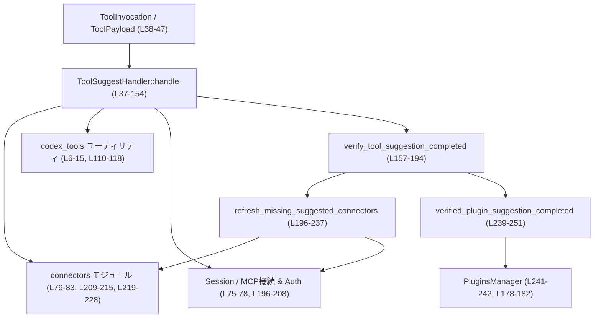
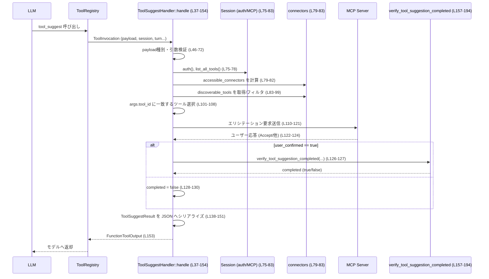

# core/src/tools/handlers/tool_suggest.rs コード解説

## 0. ざっくり一言

このモジュールは、`TOOL_SUGGEST_TOOL_NAME` ツールのハンドラです。  
LLM からの `tool_suggest` 呼び出しを受け取り、利用可能なツール一覧から対象ツールを特定し、MCP サーバー経由でユーザーにインストール確認を行い、その結果と実際のインストール完了状態を検証して返します。

---

## 1. このモジュールの役割

### 1.1 概要

- このモジュールは **「ツールのインストール提案」** を行うためのハンドラを提供します。
- LLM から渡された引数 (`ToolSuggestArgs`) を検証し、クライアントごとにフィルタされた「ディスカバリ可能ツール」一覧から対象ツールを選びます（`handle` 内、`tool_suggest.rs:L55-108`）。
- MCP サーバーに対して「ツール提案エリシテーション（ユーザー確認）」リクエストを送り、ユーザーが承認した場合にインストール完了をチェックします（`tool_suggest.rs:L110-131`）。
- 完了状況やユーザー確認結果を `ToolSuggestResult` として JSON で返します（`tool_suggest.rs:L138-153`）。

### 1.2 アーキテクチャ内での位置づけ

このモジュールは `ToolHandler` トレイト実装の 1 つであり、ツール呼び出しルーティングの一部を構成します。主な依存関係は以下です。

- ツール呼び出し基盤: `ToolHandler`, `ToolInvocation`, `ToolPayload`, `FunctionToolOutput`（`tool_suggest.rs:L20-26, L30-37`）
- コネクタ関連ユーティリティ: `crate::connectors` と `codex_tools` 群（`tool_suggest.rs:L6-15, L19, L79-99, L164-174, L209-215, L219-228`）
- セッション・MCP 接続・認証: `crate::codex::Session`, `TurnContext`, MCP コネクションマネージャ（`tool_suggest.rs:L37-43, L75-83, L157-161, L196-201`）
- プラグイン管理: `crate::plugins::PluginsManager`（`tool_suggest.rs:L241-242, L178-182, L239-251`）

依存関係を簡略図で示します（行番号は `tool_suggest.rs`）。



### 1.3 設計上のポイント

- **責務の分割**
  - 公開エントリポイントは `ToolSuggestHandler::handle` 1 つで、結果の検証やリフレッシュ処理はプライベート関数に分離されています（`tool_suggest.rs:L157-237, L239-251`）。
- **状態**
  - `ToolSuggestHandler` 自体は状態を持たない 0 フィールド構造体です（`tool_suggest.rs:L28`）。
  - 実行時状態は `Session` や `TurnContext` 経由で受け取ります（`tool_suggest.rs:L38-43`）。
- **エラーハンドリング**
  - ユーザー入力や利用条件に関する問題は `FunctionCallError::RespondToModel` として返し、LLM がユーザーに説明できる形になっています（`tool_suggest.rs:L57-65, L70-72, L95-99, L104-108`）。
  - シリアライズ失敗やサポート外ペイロードなど、処理継続が難しい問題は `FunctionCallError::Fatal` に分類されています（`tool_suggest.rs:L48-51, L147-151`）。
- **非同期処理と並行性**
  - 主要関数は `async fn` であり、認証取得・MCP ツール列挙・キャッシュ更新などの I/O を非同期で行います（`tool_suggest.rs:L37, L75-83, L196-228`）。
  - `mcp_connection_manager.read().await` による共有状態への読み取りロックを取得したまま、`list_all_tools().await` や `hard_refresh_codex_apps_tools_cache().await` を呼び出しています（`tool_suggest.rs:L76-78, L207-209, L217-218`）。

---

## 2. 主要な機能一覧

- `ToolSuggestHandler`: `ToolHandler` 実装。`tool_suggest` ツール呼び出しのエントリポイント（`tool_suggest.rs:L28-155`）。
- `ToolSuggestHandler::handle`: ツール呼び出し処理本体。引数検証、ツール選択、ユーザー確認、完了検証、結果返却を行います（`tool_suggest.rs:L37-154`）。
- `verify_tool_suggestion_completed`: ユーザーが承認した後、コネクタまたはプラグインが実際に有効になったかを検証します（`tool_suggest.rs:L157-194`）。
- `refresh_missing_suggested_connectors`: 期待するコネクタ ID 群について、MCP ツールキャッシュを必要に応じてリフレッシュしつつ取得します（`tool_suggest.rs:L196-237`）。
- `verified_plugin_suggestion_completed`: 設定とプラグインマネージャから、特定プラグインがインストール済みかどうかを判定します（`tool_suggest.rs:L239-251`）。

---

## 3. 公開 API と詳細解説

### 3.1 型一覧（構造体・列挙体など）

| 名前 | 種別 | 役割 / 用途 | 定義位置 |
|------|------|------------|----------|
| `ToolSuggestHandler` | 構造体 | `ToolHandler` を実装し、`tool_suggest` ツール呼び出しを処理するエントリポイント | `tool_suggest.rs:L28-28` |

※ 他の型（`ToolInvocation`, `ToolPayload`, `Session`, `TurnContext` 等）は他ファイル定義であり、このチャンクには現れません。

### 3.2 関数詳細

#### `impl ToolHandler for ToolSuggestHandler::kind(&self) -> ToolKind`

**概要**

- このハンドラがどの種別のツールかを返します。ここでは関数型ツールとして登録されます（`tool_suggest.rs:L33-35`）。

**引数**

| 引数名 | 型 | 説明 |
|--------|----|------|
| `&self` | `&ToolSuggestHandler` | ハンドラ自身への参照 |

**戻り値**

- `ToolKind::Function` 固定（`tool_suggest.rs:L34`）。登録側で「関数型ツール」として扱われることを示します。

**内部処理の流れ**

1. 単に `ToolKind::Function` を返します。

**Examples（使用例）**

```rust
// （疑似コード）ToolKind を見て関数ツールとして登録する例
let handler = ToolSuggestHandler;
assert!(matches!(handler.kind(), ToolKind::Function));
```

**Edge cases / 使用上の注意点**

- 振る舞いは固定であり、エラーやパニック要因はコード上ありません（`tool_suggest.rs:L33-35`）。

---

#### `ToolSuggestHandler::handle(&self, invocation: ToolInvocation) -> Result<FunctionToolOutput, FunctionCallError>`

**概要**

- `tool_suggest` ツール呼び出しを処理する中核関数です（`tool_suggest.rs:L37-154`）。
- 引数の妥当性チェック、ツール候補一覧の取得とフィルタリング、ユーザーへの確認エリシテーション、完了検証、結果の JSON 返却を行います。

**引数**

| 引数名 | 型 | 説明 |
|--------|----|------|
| `&self` | `&ToolSuggestHandler` | ハンドラ自身 |
| `invocation` | `ToolInvocation` | ペイロード・セッション・ターン情報などツール呼び出しに必要な情報（`tool_suggest.rs:L38-44`） |

`ToolInvocation` 自体の構造はこのファイルには現れませんが、ここでは少なくとも `payload`, `session`, `turn`, `call_id` フィールドを持つことが分かります（`tool_suggest.rs:L38-43`）。

**戻り値**

- `Ok(FunctionToolOutput)`:
  - `ToolSuggestResult` を JSON 文字列にしたものをテキスト出力として返します（`tool_suggest.rs:L138-153`）。
- `Err(FunctionCallError)`:
  - ユーザー／モデルに返すべきエラー (`RespondToModel`) と、致命的エラー (`Fatal`) の 2 種類が発生し得ます（`tool_suggest.rs:L48-51, L57-65, L70-72, L95-99, L104-108, L147-151`）。

**内部処理の流れ（アルゴリズム）**

1. `ToolInvocation` から `payload`, `session`, `turn`, `call_id` を取り出す（`tool_suggest.rs:L38-44`）。
2. `payload` が `ToolPayload::Function { arguments }` であることを確認し、それ以外なら `Fatal` エラーを返す（`tool_suggest.rs:L46-53`）。
3. `parse_arguments(&arguments)` で `ToolSuggestArgs` にパースする（`tool_suggest.rs:L55`）。  
   この関数の実装はこのチャンクには現れませんが、戻り値のエラー型から `Result<ToolSuggestArgs, FunctionCallError>` と推測されます。
4. `suggest_reason` をトリムし、空なら `RespondToModel("suggest_reason must not be empty")` を返す（`tool_suggest.rs:L56-61`）。
5. `args.action_type` が `DiscoverableToolAction::Install` であることを確認し、それ以外なら `RespondToModel` エラー（`tool_suggest.rs:L62-65`）。
6. クライアントが `"codex-tui"` かつ `tool_type == Plugin` の場合は、まだ未サポートとして `RespondToModel` エラー（`tool_suggest.rs:L67-72`）。
7. 認証情報を取得し（`auth_manager.auth().await`）、MCP コネクションマネージャからツール一覧を取得、アクセス可能なコネクタ一覧に変換する（`tool_suggest.rs:L75-82`）。
8. `list_tool_suggest_discoverable_tools_with_auth` + `filter_tool_suggest_discoverable_tools_for_client` で「ディスカバリ可能ツール」をクライアント別にフィルタし、取得失敗時は `RespondToModel` エラーに変換する（`tool_suggest.rs:L83-99`）。
9. その中から `tool_type` と `tool_id` が一致するツールを検索し、見つからなければ `RespondToModel` エラー（`tool_suggest.rs:L101-108`）。
10. `build_tool_suggestion_elicitation_request` で MCP サーバー向けのエリシテーションリクエストを構築し（`tool_suggest.rs:L110-118`）、`request_mcp_server_elicitation` で送信して結果を受け取る（`tool_suggest.rs:L119-121`）。
11. レスポンスが存在し、その `action` が `ElicitationAction::Accept` の場合に `user_confirmed = true` とする（`tool_suggest.rs:L122-124`）。
12. `user_confirmed` が `true` の場合のみ `verify_tool_suggestion_completed` を呼び出し、実際にツールが利用可能になったかどうかをチェックする。拒否／無応答の場合は `completed = false`（`tool_suggest.rs:L126-130`）。
13. `completed == true` かつツールがコネクタ型の場合、`merge_connector_selection` でコネクタ選択状態をセッションにマージする（`tool_suggest.rs:L132-136`）。
14. `ToolSuggestResult` 構造体を構築し、`serde_json::to_string` で JSON 文字列にシリアライズする。シリアライズ失敗時は `Fatal` エラー（`tool_suggest.rs:L138-151`）。
15. `FunctionToolOutput::from_text(content, Some(true))` によってテキスト出力としてラップして返す（`tool_suggest.rs:L153`）。

**処理フロー図（ユーザー操作〜結果返却）**



**Examples（使用例）**

このファイルには直接の呼び出し例はありませんが、`ToolHandler` 実装としてレジストリから呼ばれる状況を想定した疑似コードです。

```rust
// 疑似コード: ToolRegistry 側での利用例
use crate::tools::registry::{ToolRegistry, ToolKind};
use crate::tools::handlers::tool_suggest::ToolSuggestHandler;
use crate::tools::context::{ToolInvocation, ToolPayload};

// ハンドラの登録
let mut registry = ToolRegistry::new();
registry.register(
    "tool_suggest",
    ToolKind::Function,
    Box::new(ToolSuggestHandler),
);

// 呼び出し
let invocation = ToolInvocation {
    payload: ToolPayload::Function {
        arguments: r#"{
            "tool_id": "some-tool-id",
            "tool_type": "connector",
            "action_type": "install",
            "suggest_reason": "User wants to connect to X"
        }"#.to_string(),
    },
    // session, turn, call_id など他フィールドは省略
    ..Default::default()
};

let output = registry.call("tool_suggest", invocation).await?;
println!("{}", output.as_text()); // JSON 文字列の ToolSuggestResult が入る想定
```

※ `ToolRegistry` や `ToolInvocation` の詳細な構造はこのチャンクには現れないため、上記はイメージです。

**Errors / Panics**

- `FunctionCallError::Fatal`
  - `payload` が `ToolPayload::Function` でない場合（`tool_suggest.rs:L46-53`）。
  - `ToolSuggestResult` のシリアライズに失敗した場合（`tool_suggest.rs:L147-151`）。
- `FunctionCallError::RespondToModel`
  - `suggest_reason` が空文字列（トリム後）だった場合（`tool_suggest.rs:L56-61`）。
  - `args.action_type` が `Install` 以外だった場合（`tool_suggest.rs:L62-65`）。
  - `tool_type == Plugin` かつ `app_server_client_name == "codex-tui"` の場合（`tool_suggest.rs:L67-72`）。
  - `list_tool_suggest_discoverable_tools_with_auth` がエラーを返した場合（`tool_suggest.rs:L83-99`）。
  - 指定された `tool_id` に一致するディスカバリ可能ツールが見つからない場合（`tool_suggest.rs:L101-108`）。

パニックを起こすコード（`unwrap`, `expect` 等）はこのチャンクには見当たりません。

**Edge cases（エッジケース）**

- **空の `suggest_reason`**:
  - トリム後に空の場合、必ず `RespondToModel` エラーになります（`tool_suggest.rs:L56-61`）。
- **サポートされない `action_type`**:
  - 現在は `Install` のみサポート。それ以外が指定されるとエラー（`tool_suggest.rs:L62-65`）。
- **プラグイン × codex-tui**:
  - `tool_type == Plugin` かつ `app_server_client_name == Some("codex-tui")` の組み合わせは未サポートでエラー（`tool_suggest.rs:L67-72`）。
- **ディスカバリ可能ツールが存在しない／対象ツールが見つからない**:
  - 一覧取得に失敗した場合はエラーに変換（`tool_suggest.rs:L83-99`）。
  - 一覧は取得できても、指定 `tool_id` が含まれない場合はエラー（`tool_suggest.rs:L101-108`）。
- **ユーザーが応答しない／拒否する**:
  - `response` が `None`、または `action != Accept` の場合、`user_confirmed = false` となり `completed` も `false` になります（`tool_suggest.rs:L122-130`）。

**使用上の注意点**

- `ToolPayload` は必ず `Function { arguments }` 形式で渡す前提になっています。他種別を渡すと致命的エラー扱いになります（`tool_suggest.rs:L46-53`）。
- `args.action_type` が `Install` 以外のケース（アンインストール等）に対応したい場合、この関数と `ToolSuggestArgs` を含む周辺仕様全体を変更する必要があります。
- MCP ツール一覧取得やキャッシュ更新など、比較的重い I/O を複数回行うため、大量に連続呼び出しする場合はパフォーマンス影響に注意が必要です（`tool_suggest.rs:L75-78, L196-228`）。
- セキュリティ観点では、この関数内で外部入力（`arguments`）に基づきログ出力は行っていませんが、エラーメッセージはユーザーへ返る前提のため、機密情報を含めない設計になっています（`tool_suggest.rs:L57-65, L95-99, L104-108`）。

---

#### `verify_tool_suggestion_completed(session, turn, tool, auth) -> bool`

```rust
async fn verify_tool_suggestion_completed(
    session: &crate::codex::Session,
    turn: &crate::codex::TurnContext,
    tool: &DiscoverableTool,
    auth: Option<&codex_login::CodexAuth>,
) -> bool
```

**概要**

- ユーザーがツール提案を承認した後、実際にそのツール（コネクタまたはプラグイン）が利用可能状態になったかどうかを確認する関数です（`tool_suggest.rs:L157-194`）。

**引数**

| 引数名 | 型 | 説明 |
|--------|----|------|
| `session` | `&crate::codex::Session` | セッション全体への参照。MCP 接続・設定・プラグイン情報等にアクセスします（`tool_suggest.rs:L158`）。 |
| `turn` | `&crate::codex::TurnContext` | 現在のターンに関するコンテキスト。設定などに使われます（`tool_suggest.rs:L159`）。 |
| `tool` | `&DiscoverableTool` | 提案対象ツール（コネクタまたはプラグイン）（`tool_suggest.rs:L160, L163-175`）。 |
| `auth` | `Option<&codex_login::CodexAuth>` | 認証情報。コネクタ情報取得時に使用されます（`tool_suggest.rs:L161, L164-169, L183-188`）。 |

**戻り値**

- `bool`:  
  - `true`: ツールが「提案に応じて有効化された」と判定された場合。
  - `false`: それ以外（検証失敗・未インストール・エラーなど）。

**内部処理の流れ**

1. `tool` のバリアントで分岐する（`tool_suggest.rs:L163`）。
2. **コネクタ (`DiscoverableTool::Connector`) の場合**（`tool_suggest.rs:L163-174`）:
   - `refresh_missing_suggested_connectors` を、対象コネクタ ID 1 件のみを含むスライスで呼び出す（`std::slice::from_ref(&connector.id)`）（`tool_suggest.rs:L164-170`）。
   - 返り値 `Option<Vec<AppInfo>>` が `Some(accessible_connectors)` かつ、その中で `verified_connector_suggestion_completed` が true を返す場合に `true` と判断（`tool_suggest.rs:L171-174`）。
3. **プラグイン (`DiscoverableTool::Plugin`) の場合**（`tool_suggest.rs:L175-192`）:
   - `session.reload_user_config_layer().await` でユーザー設定レイヤを再読み込み（`tool_suggest.rs:L176`）。
   - `session.get_config().await` で最新の設定を取得（`tool_suggest.rs:L177`）。
   - `verified_plugin_suggestion_completed` で対象プラグイン ID がインストール済みか判定（`tool_suggest.rs:L178-182, L239-251`）。
   - 併せて、プラグインが参照するアプリコネクタ ID 群について `refresh_missing_suggested_connectors` を呼び、コネクタ側の状態も更新する（戻り値は捨てています）（`tool_suggest.rs:L183-190`）。
   - 判定結果 `completed` を返す（`tool_suggest.rs:L191`）。

**Examples（使用例）**

```rust
// 疑似コード: handle 内と同様の呼び出し
let completed = verify_tool_suggestion_completed(
    &session,
    &turn,
    &tool,          // DiscoverableTool
    auth.as_ref(),  // Option<&CodexAuth>
).await;

if completed {
    // ここでツールが利用可能になった前提で処理を続ける
}
```

**Edge cases / 使用上の注意点**

- `refresh_missing_suggested_connectors` が `None` を返した場合（キャッシュ更新失敗など）、`is_some_and` により `false` になります（`tool_suggest.rs:L171-174`）。  
  → エラー詳細はログにのみ残り、ここでは「未完了」として扱われます。
- プラグインの場合、`list_marketplaces_for_config` がエラーを返すと `ok().into_iter()` の結果、`any()` は `false` になり、未完了と判定されます（`tool_suggest.rs:L244-250`）。
- この関数自体はエラー型を返さず、すべての失敗を `false` に集約する設計になっています（`tool_suggest.rs:L157-194`）。

---

#### `refresh_missing_suggested_connectors(session, turn, auth, expected_connector_ids, tool_id) -> Option<Vec<AppInfo>>`

```rust
async fn refresh_missing_suggested_connectors(
    session: &crate::codex::Session,
    turn: &crate::codex::TurnContext,
    auth: Option<&codex_login::CodexAuth>,
    expected_connector_ids: &[String],
    tool_id: &str,
) -> Option<Vec<AppInfo>>
```

**概要**

- 指定されたコネクタ ID 群が「アクセス可能コネクタ一覧」に含まれているか確認し、足りなければ MCP ツールキャッシュをリフレッシュして再確認する補助関数です（`tool_suggest.rs:L196-237`）。

**引数**

| 引数名 | 型 | 説明 |
|--------|----|------|
| `session` | `&crate::codex::Session` | MCP 接続マネージャ等へアクセスするためのセッション（`tool_suggest.rs:L197-198, L207-209, L217-218`）。 |
| `turn` | `&crate::codex::TurnContext` | 設定 (`turn.config`) を含むコンテキスト（`tool_suggest.rs:L198, L210-212, L221-222, L223-225`）。 |
| `auth` | `Option<&codex_login::CodexAuth>` | コネクタキャッシュ更新時に利用する認証情報（`tool_suggest.rs:L199, L223-226`）。 |
| `expected_connector_ids` | `&[String]` | 存在を期待するコネクタ ID の配列（`tool_suggest.rs:L200, L203-205, L213-214`）。 |
| `tool_id` | `&str` | ログ出力用のツール ID（`tool_suggest.rs:L201, L232`）。 |

**戻り値**

- `Some(Vec<AppInfo>)`:
  - 成功時。現在アクセス可能と判断されたコネクタ一覧（`AppInfo`）を返します。
  - `expected_connector_ids` が空のときは `Some(Vec::new())` を返します（`tool_suggest.rs:L203-205`）。
- `None`:
  - キャッシュ更新に失敗したなど、致命的ではないが検証を続けられない場合（`tool_suggest.rs:L217-236`）。

**内部処理の流れ**

1. `expected_connector_ids` が空なら、すぐに `Some(vec![])` を返す（`tool_suggest.rs:L203-205`）。
2. MCP コネクションマネージャから読取りロックを取得し、`list_all_tools().await` でツール一覧を取得する（`tool_suggest.rs:L207-209`）。
3. その一覧から `connectors::accessible_connectors_from_mcp_tools` と `with_app_enabled_state` を通じて、現在アクセス可能なコネクタ一覧を計算する（`tool_suggest.rs:L209-212`）。
4. `all_suggested_connectors_picked_up(expected_connector_ids, &accessible_connectors)` が `true` なら、そのまま `Some(accessible_connectors)` を返す（`tool_suggest.rs:L213-215`）。
5. そうでない場合、`hard_refresh_codex_apps_tools_cache().await` を呼び出し、キャッシュのハードリフレッシュを試みる（`tool_suggest.rs:L217-218`）。
6. リフレッシュが成功 (`Ok(mcp_tools)`) した場合（`tool_suggest.rs:L218-228`）:
   - 同様に `accessible_connectors` を再計算（`tool_suggest.rs:L219-222`）。
   - `connectors::refresh_accessible_connectors_cache_from_mcp_tools` でアプリケーション側キャッシュも更新（`tool_suggest.rs:L223-226`）。
   - `Some(accessible_connectors)` を返す（`tool_suggest.rs:L228`）。
7. 失敗 (`Err(err)`) の場合（`tool_suggest.rs:L230-235`）:
   - `warn!` ログを出力し、`None` を返す（`tool_suggest.rs:L231-235`）。

**Examples（使用例）**

```rust
// コネクタ ID 群がすべて拾われたか確認しつつ、必要ならリフレッシュする例
let expected = vec!["conn-1".to_string(), "conn-2".to_string()];
if let Some(accessible) = refresh_missing_suggested_connectors(
    &session,
    &turn,
    auth.as_ref(),
    &expected,
    "tool_suggestion_example",
).await {
    // accessible 内に expected が含まれている前提で後続処理
} else {
    // リフレッシュに失敗した場合のフォールバック処理
}
```

**Edge cases / 使用上の注意点**

- `expected_connector_ids` が空の場合は、実際には何も確認せず `Some(Vec::new())` が返るため、「コネクタがなくても良い」状態として扱われます（`tool_suggest.rs:L203-205`）。
- ロック取得後に `list_all_tools().await` および `hard_refresh_codex_apps_tools_cache().await` を呼んでおり、読取りロックを保持したまま非同期 I/O を実行します（`tool_suggest.rs:L207-209, L217-218`）。  
  ロックの性質（同期 / 非同期）や他箇所での利用状況によってはスループットに影響しうるため、変更時には注意が必要です。
- キャッシュリフレッシュ失敗時には `warn!` ログが残るものの、呼び出し側には `None` だけが伝わります（`tool_suggest.rs:L231-235`）。  
  呼び出し側（例: `verify_tool_suggestion_completed`）は「未完了」として扱います。

---

#### `verified_plugin_suggestion_completed(tool_id, config, plugins_manager) -> bool`

```rust
fn verified_plugin_suggestion_completed(
    tool_id: &str,
    config: &crate::config::Config,
    plugins_manager: &crate::plugins::PluginsManager,
) -> bool
```

**概要**

- マーケットプレイス情報から、指定プラグイン ID のプラグインがインストール済みかどうかを確認します（`tool_suggest.rs:L239-251`）。

**引数**

| 引数名 | 型 | 説明 |
|--------|----|------|
| `tool_id` | `&str` | チェック対象のプラグイン ID（`tool_suggest.rs:L240`）。 |
| `config` | `&crate::config::Config` | 現在の設定。利用可能なマーケットプレイスやプラグインを決定するために渡されます（`tool_suggest.rs:L241`）。 |
| `plugins_manager` | `&crate::plugins::PluginsManager` | プラグイン一覧を取得するためのマネージャ（`tool_suggest.rs:L242`）。 |

**戻り値**

- `bool`:
  - `true`: 指定 `tool_id` を持つプラグインが見つかり、その `installed` フラグが立っている場合（`tool_suggest.rs:L248-250`）。
  - `false`: 見つからない、または `list_marketplaces_for_config` がエラーを返した場合（`tool_suggest.rs:L245-247, L248-250`）。

**内部処理の流れ**

1. `plugins_manager.list_marketplaces_for_config(config, &[])` を呼び出し、マーケットプレイス情報を取得（`tool_suggest.rs:L245`）。
2. `ok()` で `Result` を `Option` に変換し、エラー時は `None` として無視（`tool_suggest.rs:L246`）。
3. `into_iter()` で `Option` をイテレータに変換し（0 or 1 要素）、`flat_map` でマーケットプレイスおよび各マーケットプレイスの `plugins` を列挙（`tool_suggest.rs:L247-249`）。
4. `any(|plugin| plugin.id == tool_id && plugin.installed)` で条件に合うプラグインが存在すれば `true` を返す（`tool_suggest.rs:L250`）。

**Examples（使用例）**

```rust
let completed = verified_plugin_suggestion_completed(
    "plugin-123",
    config.as_ref(),
    session.services.plugins_manager.as_ref(),
);

if completed {
    // plugin-123 がインストール済み
}
```

**Edge cases / 使用上の注意点**

- `list_marketplaces_for_config` がエラーを返した場合、`ok().into_iter()` により `any` は必ず `false` を返します（`tool_suggest.rs:L245-247, L248-250`）。
- 「プラグインが存在しない場合」と「マーケットプレイス取得に失敗した場合」が両方とも `false` になるため、呼び出し側では区別できません。  
  この関数はあくまで「インストール済みか否か」のブール値だけを提供する設計です。

---

### 3.3 その他の関数

上で詳細解説した以外の関数は、本ファイルには存在しません。テストモジュールのみが追加で定義されています。

| 関数 / モジュール名 | 役割（1 行） | 定義位置 |
|---------------------|--------------|----------|
| `mod tests` | `#[cfg(test)]` でコンパイル時のみ有効になるテストモジュール。`tool_suggest_tests.rs` に実装があることのみ分かります。 | `tool_suggest.rs:L253-255` |

テストの具体的な内容は、このチャンクには現れないため不明です。

---

## 4. データフロー

このモジュールにおける代表的なシナリオは「LLM が `tool_suggest` を呼び出し、ユーザーがツールのインストールを承認する」流れです（`ToolSuggestHandler::handle`, `tool_suggest.rs:L37-154`）。

1. LLM からツール呼び出しが行われ、`ToolInvocation` として `ToolSuggestHandler::handle` に渡される。
2. `handle` は引数を `ToolSuggestArgs` にパースし、利用可能なディスカバリ可能ツール一覧から対象ツールを特定する。
3. MCP サーバーにエリシテーションリクエストを送信し、ユーザーの `Accept` 応答を受け取る。
4. `verify_tool_suggestion_completed` により、実際のコネクタ／プラグインの状態をチェックする。必要なら `refresh_missing_suggested_connectors` でキャッシュをリフレッシュする。
5. 最終的な結果を `ToolSuggestResult` として JSON で返す。

```mermaid
sequenceDiagram
    participant H as handle (L37-154)
    participant Auth as AuthManager (L75)
    participant MCPMgr as MCPConnectionManager (L76-78, L207-209, L217-218)
    participant Conn as connectors::* (L79-83, L209-215, L219-228)
    participant MCP as MCP Server
    participant Ver as verify_tool_suggestion_completed (L157-194)
    participant Ref as refresh_missing_suggested_connectors (L196-237)
    participant Plug as verified_plugin_suggestion_completed (L239-251)

    H->>Auth: auth().await (L75)
    H->>MCPMgr: read().await; list_all_tools().await (L76-78)
    H->>Conn: accessible_connectors を計算 (L79-82)
    H->>Conn: list_tool_suggest_discoverable_tools_with_auth().await (L83-88)
    H->>Conn: filter_tool_suggest_discoverable_tools_for_client (L89-94)
    H->>MCP: request_mcp_server_elicitation().await (L119-121)
    MCP-->>H: ElicitationResponse (L122-124)
    alt user_confirmed
        H->>Ver: verify_tool_suggestion_completed().await (L126-127)
        Ver->>Ref: (Connector) refresh_missing_suggested_connectors().await (L164-170)
        Ver->>Plug: (Plugin) verified_plugin_suggestion_completed (L178-182)
        Ref->>MCPMgr: list_all_tools()/hard_refresh...().await (L207-209, L217-218)
        Ref->>Conn: accessible_connectors & cache refresh (L209-215, L219-228)
        Ver-->>H: completed (bool)
    else
        H->>H: completed = false (L128-130)
    end
    H-->>H: ToolSuggestResult を JSON 化 (L138-151)
```

---

## 5. 使い方（How to Use）

### 5.1 基本的な使用方法

このモジュールは `ToolHandler` 実装として `tools::registry` 経由で利用される前提です（`tool_suggest.rs:L24-26, L30`）。典型的なフローは次のとおりです。

1. ツールレジストリに `ToolSuggestHandler` を登録する。
2. LLM からのツール呼び出しを `ToolInvocation` に変換し、`handle` を呼び出す。
3. 返ってきた `FunctionToolOutput` から JSON を取り出し、`ToolSuggestResult` として解釈する。

```rust
use crate::tools::handlers::tool_suggest::ToolSuggestHandler;
use crate::tools::context::{ToolInvocation, ToolPayload};
use crate::tools::registry::{ToolRegistry, ToolKind};

// 1. レジストリへの登録
let mut registry = ToolRegistry::new();
registry.register(
    "tool_suggest",
    ToolKind::Function,
    Box::new(ToolSuggestHandler),
);

// 2. Invocation の構築（arguments は JSON 文字列）
let invocation = ToolInvocation {
    payload: ToolPayload::Function {
        arguments: r#"{
            "tool_id": "connector-123",
            "tool_type": "connector",
            "action_type": "install",
            "suggest_reason": "Needs to connect to System X"
        }"#.to_owned(),
    },
    // session, turn, call_id などは実際の環境に合わせて設定
    ..Default::default()
};

// 3. 呼び出しと結果利用
let result = registry.call("tool_suggest", invocation).await?;
let json = result.as_text();              // ToolSuggestResult の JSON
// 必要なら serde_json::from_str で構造体に戻す
```

### 5.2 よくある使用パターン

- **コネクタ提案**
  - `tool_type = connector`, `action_type = install` とし、ターンの `config` に応じて利用可能なコネクタが候補となります（`tool_suggest.rs:L62-65, L79-83`）。
- **プラグイン提案**
  - `tool_type = plugin`, `action_type = install` とすると、プラグイン候補が対象になります。
  - ただし `app_server_client_name == "codex-tui"` の場合は未サポートでエラーになります（`tool_suggest.rs:L67-72`）。

### 5.3 よくある間違い

```rust
// 間違い例: 非 Function ペイロードで呼び出す
let invocation = ToolInvocation {
    payload: ToolPayload::Streaming { /* ... */ }, // 仮の別種別
    ..Default::default()
};
// -> handle 内で Fatal エラー ("handler received unsupported payload") になる（L46-53）

// 正しい例: Function ペイロードで JSON 文字列を渡す
let invocation = ToolInvocation {
    payload: ToolPayload::Function {
        arguments: r#"{ "tool_id": "...", "tool_type": "...", "action_type": "install", "suggest_reason": "..." }"#.into(),
    },
    ..Default::default()
};
```

```rust
// 間違い例: suggest_reason が空
let invocation = ToolInvocation {
    payload: ToolPayload::Function {
        arguments: r#"{
            "tool_id": "connector-123",
            "tool_type": "connector",
            "action_type": "install",
            "suggest_reason": "   " // 空白のみ
        }"#.to_string(),
    },
    ..Default::default()
};
// -> "suggest_reason must not be empty" という RespondToModel エラーになる（L56-61）

// 正しい例: 意味のある理由文字列を渡す
// "User wants to sync calendar" など
```

### 5.4 使用上の注意点（まとめ）

- `action_type` は現状 `Install` のみサポートです。他の値を渡すと必ずエラーになります（`tool_suggest.rs:L62-65`）。
- `tool_id` は `list_tool_suggest_discoverable_tools_with_auth` が返すディスカバリ可能ツール一覧の中の ID でなければなりません（`tool_suggest.rs:L83-99, L101-108`）。
- `tool_type == Plugin` の提案は、クライアントが `codex-tui` の場合は使えません（`tool_suggest.rs:L67-72`）。
- 提案が承認されても、`verify_tool_suggestion_completed` が `false` を返すケースがあります（例: インストール処理が失敗した／時間切れなど）。呼び出し側は `completed` フラグを必ず確認する必要があります（`tool_suggest.rs:L126-131, L157-194`）。
- MCP ツールキャッシュ更新に失敗した場合、ログ (`warn!`) は出ますが結果として `completed = false` になるだけで、詳細な理由はこのモジュール外で補足する必要があります（`tool_suggest.rs:L231-235`）。

---

## 6. 変更の仕方（How to Modify）

### 6.1 新しい機能を追加する場合

例として、「アンインストール提案 (`action_type = uninstall`) に対応したい」ケースを考えます。

1. **引数仕様の確認**
   - `ToolSuggestArgs`（別モジュール）に新しい `action_type` が加わっているか確認します。このチャンクには定義がないため詳細は不明です（`tool_suggest.rs:L10, L55, L141-142`）。
2. **`handle` の分岐追加**
   - `args.action_type` をチェックしている箇所（`tool_suggest.rs:L62-65`）で、`Install` 以外をすべて拒否するロジックを変更し、新しいアクションを許可する分岐を追加します。
3. **完了検証ロジックの拡張**
   - アンインストールに対して「完了」とみなす条件を決め、`verify_tool_suggestion_completed` 相当のロジックを新設するか、既存ロジックに条件追加します（`tool_suggest.rs:L157-194`）。
4. **戻り値 (`ToolSuggestResult`) の拡張**
   - 必要に応じて `ToolSuggestResult` 側のフィールド定義を変更し、それに合わせて JSON 構築部分（`tool_suggest.rs:L138-146`）を修正します。
5. **テストの追加**
   - `mod tests` で参照される `tool_suggest_tests.rs` に新しいケースを追加します（`tool_suggest.rs:L253-255`）。

### 6.2 既存の機能を変更する場合

- **エラーメッセージや前提条件を変える**
  - `RespondToModel` 用のエラーメッセージは固定文字列として埋め込まれているため、該当行を直接変更します（`tool_suggest.rs:L57-65, L70-72, L95-99, L104-108`）。
- **「完了」の定義を変える**
  - コネクタについては `verified_connector_suggestion_completed`（別モジュール）の挙動に依存します（`tool_suggest.rs:L172-174`）。
  - プラグインについては `verified_plugin_suggestion_completed` の条件（ID 一致 & `installed` フラグ）を変更します（`tool_suggest.rs:L239-251`）。
- **キャッシュ戦略を調整する**
  - 現在は「一度チェック → 足りなければハードリフレッシュ」という手順でコネクタを確認しています（`tool_suggest.rs:L207-215, L217-228`）。
  - リフレッシュの有無やタイミングを変更したい場合、`refresh_missing_suggested_connectors` 内の処理を修正します。
- **影響範囲の確認**
  - このモジュール内で `refresh_missing_suggested_connectors` と `verified_plugin_suggestion_completed` の呼び出し元は `verify_tool_suggestion_completed` のみです（`tool_suggest.rs:L157-194`）。
  - ただし、これらの関数は `pub` ではないため、他モジュールから直接呼ばれていない前提です（`tool_suggest.rs:L157-237, L239-251`）。

---

## 7. 関連ファイル

このモジュールと密接に関係するファイル・モジュール（このチャンクから参照が確認できるもの）をまとめます。

| パス / モジュール | 役割 / 関係 | 根拠 |
|-------------------|-------------|------|
| `crate::tools::registry` | `ToolHandler`, `ToolKind` を定義し、`ToolSuggestHandler` を登録・呼び出すレジストリ層 | `tool_suggest.rs:L24-26, L30-35` |
| `crate::tools::context` | `ToolInvocation`, `ToolPayload`, `FunctionToolOutput` などツール呼び出しコンテキストを提供 | `tool_suggest.rs:L21-23, L37-44, L153` |
| `crate::connectors` | MCP ツール一覧からアクセス可能なコネクタを抽出・キャッシュするユーティリティ | `tool_suggest.rs:L19, L79-83, L209-215, L219-228` |
| `codex_tools` クレート | `ToolSuggestArgs`, `ToolSuggestResult` やツールサジェスト関連ユーティリティ（ディスカバリ可能ツール一覧・エリシテーションリクエストの構築・検証）を提供 | `tool_suggest.rs:L6-15, L55, L101-107, L110-118, L138-146, L172-174` |
| `codex_app_server_protocol::AppInfo` | コネクタ情報を表す型。`refresh_missing_suggested_connectors` の戻り値型として使用 | `tool_suggest.rs:L3, L202` |
| `codex_rmcp_client::ElicitationAction` | MCP エリシテーションのユーザー応答（Accept など）を表す列挙型 | `tool_suggest.rs:L5, L122-124` |
| `crate::codex::Session` / `TurnContext` | 認証、MCP 接続、設定、プラグインマネージャなど、実行時状態をカプセル化する型 | `tool_suggest.rs:L38-43, L157-159, L196-199` |
| `crate::plugins::PluginsManager` | プラグインマーケットプレイスやプラグイン一覧を管理し、インストール状態の判定に用いられる | `tool_suggest.rs:L241-242, L178-182, L239-251` |
| `tool_suggest_tests.rs` | このモジュールのテストコードが格納されるファイル | `tool_suggest.rs:L253-255` |

このチャンクには、これら関連モジュールの実装詳細は含まれていないため、挙動の詳細は不明です。
